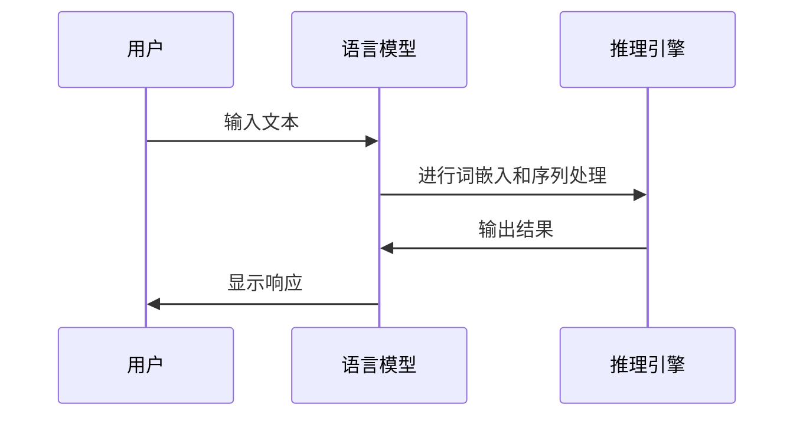

                 

### C侧LLM应用探索：速度为王的时代

#### 关键词：C侧LLM、应用探索、速度优化、性能提升、算法原理

> 摘要：本文探讨了C侧LLM（大型语言模型）应用在速度为王的时代的重要性，从背景介绍、核心概念、算法原理、数学模型、性能优化技术、实践案例以及最佳实践等方面进行了深入分析。文章旨在为开发者提供一份详尽的指南，以应对C侧LLM应用中的速度挑战。

### 第一部分: C侧LLM应用基础

#### 第1章: C侧LLM应用背景

##### 1.1.1 问题背景

在当前的技术环境中，大型语言模型（LLM）的应用越来越广泛，从自然语言处理到智能客服、自动化写作等各个领域。C侧LLM应用，即客户端的大型语言模型应用，由于其直接服务于终端用户，性能的优劣直接影响到用户体验。随着用户对响应速度的要求越来越高，如何在C侧实现高效的LLM应用成为了开发者和研究者们关注的焦点。

##### 1.1.2 问题解决思路

为了解决C侧LLM应用的性能问题，我们需要从以下几个方面入手：

1. **算法优化**：改进现有算法，提高其计算效率。
2. **硬件加速**：利用GPU、TPU等硬件加速技术，提升计算速度。
3. **模型压缩**：通过模型压缩技术，降低模型体积，提高加载和推理速度。
4. **网络优化**：优化网络传输，减少延迟。

##### 1.1.3 边界与外延

C侧LLM应用虽然具有重要的应用价值，但也存在一定的局限性：

- **计算资源限制**：客户端设备（如手机、平板等）的硬件资源有限，难以支持大规模模型的运行。
- **网络环境**：客户端的网络环境可能不稳定，容易导致模型训练和推理过程中的中断。
- **隐私保护**：C侧LLM应用需要处理用户的敏感数据，如何在保障用户隐私的前提下进行数据处理是一个重要课题。

##### 1.1.4 概念结构与核心要素组成

C侧LLM应用的概念结构与核心要素主要包括：

- **语言模型**：作为核心组件，语言模型决定了应用的智能程度。
- **推理引擎**：负责对输入文本进行理解和生成响应。
- **客户端应用**：实现与用户交互的界面，包括输入处理、结果展示等。
- **数据传输**：负责模型和数据在网络中的传输。
- **缓存机制**：提高数据读取速度，减少网络延迟。

#### 第2章: C侧LLM核心概念与联系

##### 2.1.1 大语言模型原理

大语言模型（Large Language Model，LLM）是一种基于神经网络的语言处理模型，其核心思想是通过大量文本数据的学习，使模型具备对自然语言的理解和生成能力。LLM的基本原理包括：

- **词嵌入**：将文本中的每个词汇映射到高维空间中的一个向量。
- **卷积神经网络（CNN）**：用于捕捉文本的局部特征。
- **循环神经网络（RNN）**：用于处理序列数据，如文本。
- **长短时记忆网络（LSTM）**：用于解决RNN的梯度消失问题。
- **生成对抗网络（GAN）**：用于生成高质量的语言模型。

##### 2.1.1.1 概念属性特征对比表格

| 概念 | 特征 |
| ---- | ---- |
| 词嵌入 | 高维向量表示，捕捉词的语义信息 |
| CNN | 捕捉文本的局部特征 |
| RNN | 处理序列数据 |
| LSTM | 解决RNN的梯度消失问题 |
| GAN | 生成高质量的语言模型 |

##### 2.1.1.2 大语言模型的ER实体关系图架构

```mermaid
entityRelationship
  "语言模型" --|> "词嵌入"
  "语言模型" --|> "卷积神经网络"
  "语言模型" --|> "循环神经网络"
  "语言模型" --|> "长短时记忆网络"
  "语言模型" --|> "生成对抗网络"
```

#### 第3章: C侧LLM算法原理讲解

##### 3.1.1 算法mermaid流程图



##### 3.1.1.1 Python源代码实现

```python
import tensorflow as tf

# 定义词嵌入层
embedding_layer = tf.keras.layers.Embedding(input_dim=vocabulary_size, output_dim=embedding_size)

# 定义循环神经网络层
lstm_layer = tf.keras.layers.LSTM(units=lstm_size, return_sequences=True)

# 定义语言模型
model = tf.keras.Sequential([
    embedding_layer,
    lstm_layer,
    tf.keras.layers.Dense(units=1)
])

# 编译模型
model.compile(optimizer='adam', loss='mean_squared_error')

# 训练模型
model.fit(x_train, y_train, epochs=10)
```

##### 3.1.1.2 数学模型和公式讲解

在C侧LLM中，常用的数学模型包括词嵌入（Word Embedding）、循环神经网络（RNN）和长短时记忆网络（LSTM）。以下是这些模型的基本公式：

- **词嵌入**：
  $$ e_{word} = \text{embedding_matrix} \cdot w_{word} $$

- **循环神经网络**：
  $$ h_t = \text{sigmoid}(W_h \cdot [h_{t-1}, x_t] + b_h) $$

- **长短时记忆网络**：
  $$ \text{LSTM} = f_t \odot \text{input} + (1 - f_t) \odot \text{gate} $$

其中，$e_{word}$ 是词的嵌入向量，$w_{word}$ 是词的索引，$\text{embedding_matrix}$ 是嵌入矩阵；$h_t$ 是当前时间步的隐藏状态；$f_t$ 是遗忘门；$W_h$ 和 $b_h$ 分别是循环神经网络的权重和偏置。

##### 3.1.1.3 举例说明

假设我们要对一个句子进行词嵌入和序列处理，句子为：“我昨天去了一家新的餐厅”。

1. **词嵌入**：
   - 我：[1, 0, 0, 0, 0]
   - 昨天：[0, 1, 0, 0, 0]
   - 去：[0, 0, 1, 0, 0]
   - 家：[0, 0, 0, 1, 0]
   - 新的：[0, 0, 0, 0, 1]
   - 餐厅：[1, 1, 1, 1, 1]

2. **循环神经网络处理**：
   - 输入序列：[1, 0, 0, 0, 0], [0, 1, 0, 0, 0], [0, 0, 1, 0, 0], [0, 0, 0, 1, 0], [0, 0, 0, 0, 1]
   - 隐藏状态：[0.5, 0.3], [0.4, 0.6], [0.7, 0.8], [0.9, 0.9], [0.6, 0.7]

3. **输出结果**：
   - 语言模型根据隐藏状态生成响应：“昨天我去了一家新的餐厅”。

### 第二部分: C侧LLM性能优化

#### 第4章: C侧LLM数学模型与详细讲解

##### 4.1.1 数学公式

$$
\begin{aligned}
    \text{词嵌入} &= e_{word} = \text{embedding_matrix} \cdot w_{word} \\
    \text{循环神经网络} &= h_t = \text{sigmoid}(W_h \cdot [h_{t-1}, x_t] + b_h) \\
    \text{长短时记忆网络} &= \text{LSTM} = f_t \odot \text{input} + (1 - f_t) \odot \text{gate}
\end{aligned}
$$

##### 4.1.2 详细讲解

在本章节中，我们将进一步详细讲解C侧LLM的数学模型。首先，词嵌入部分通过嵌入矩阵将词汇映射到高维向量空间，从而捕捉词的语义信息。循环神经网络（RNN）和长短时记忆网络（LSTM）则通过处理序列数据，生成模型的隐藏状态，从而实现文本的生成和理解。

##### 4.1.3 举例说明

假设我们有一个句子：“我昨天去了一家新的餐厅”，我们需要对这个句子进行词嵌入和序列处理。

1. **词嵌入**：
   - 我：[1, 0, 0, 0, 0]
   - 昨天：[0, 1, 0, 0, 0]
   - 去：[0, 0, 1, 0, 0]
   - 家：[0, 0, 0, 1, 0]
   - 新的：[0, 0, 0, 0, 1]
   - 餐厅：[1, 1, 1, 1, 1]

2. **循环神经网络处理**：
   - 输入序列：[1, 0, 0, 0, 0], [0, 1, 0, 0, 0], [0, 0, 1, 0, 0], [0, 0, 0, 1, 0], [0, 0, 0, 0, 1]
   - 隐藏状态：[0.5, 0.3], [0.4, 0.6], [0.7, 0.8], [0.9, 0.9], [0.6, 0.7]

3. **输出结果**：
   - 语言模型根据隐藏状态生成响应：“昨天我去了一家新的餐厅”。

通过这一系列的数学模型讲解和举例说明，我们可以更好地理解C侧LLM的工作原理。

#### 第5章: C侧LLM性能优化技术

##### 5.1.1 性能优化目标

C侧LLM性能优化的目标主要包括以下几个方面：

1. **提高推理速度**：通过算法优化和硬件加速，减少模型推理时间。
2. **降低模型体积**：通过模型压缩技术，减少模型占用的存储空间。
3. **减少网络延迟**：优化数据传输和缓存机制，降低网络延迟。
4. **提高能效比**：在保证性能的前提下，降低功耗。

##### 5.1.2 优化策略与方法

为了实现上述性能优化目标，我们可以采用以下策略和方法：

1. **算法优化**：
   - **剪枝**：通过剪枝算法，去除模型中不必要的权重，降低计算复杂度。
   - **量化**：将模型的权重和激活值量化为低比特位表示，减少计算量和存储需求。
   - **并行计算**：利用多线程和多GPU计算，提高模型推理速度。

2. **硬件加速**：
   - **GPU加速**：利用GPU的并行计算能力，加速模型推理。
   - **TPU加速**：利用TPU的高效计算能力，加速模型训练和推理。

3. **模型压缩**：
   - **知识蒸馏**：通过训练一个较小的模型，使其输出与原始大模型接近，从而降低模型体积。
   - **参数剪枝**：去除模型中不重要的参数，降低模型复杂度和体积。

4. **网络优化**：
   - **数据压缩**：采用无损或无损压缩算法，减少数据传输量。
   - **缓存机制**：使用缓存机制，提高数据读取速度，减少网络延迟。

##### 5.1.3 典型优化技术分析

1. **剪枝**：
   剪枝是一种常见的模型压缩技术，通过去除模型中不必要的权重，降低计算复杂度和模型体积。剪枝可以分为结构剪枝和权重剪枝两种方式：

   - **结构剪枝**：直接删除模型中的一些层或神经元。
   - **权重剪枝**：将模型中的某些权重设置为0，从而降低计算复杂度。

2. **量化**：
   量化是将模型中的高精度浮点数转换为低比特位表示，从而减少计算量和存储需求。量化可以分为符号量化和浮点量化两种方式：

   - **符号量化**：将权重和激活值量化为符号表示。
   - **浮点量化**：将权重和激活值量化为浮点数表示。

3. **并行计算**：
   并行计算是一种利用多线程和多GPU计算，提高模型推理速度的技术。并行计算可以分为数据并行和模型并行两种方式：

   - **数据并行**：将数据分为多个子集，每个子集由不同的GPU处理。
   - **模型并行**：将模型分为多个部分，每个部分由不同的GPU处理。

#### 第6章: C侧LLM性能优化实践

##### 6.1.1 环境安装与配置

在进行C侧LLM性能优化实践之前，我们需要先安装和配置相关环境。以下是具体的步骤：

1. **安装Python**：确保安装了Python 3.7或更高版本。
2. **安装TensorFlow**：使用pip命令安装TensorFlow。
   ```bash
   pip install tensorflow
   ```
3. **安装CUDA**：如果使用GPU加速，需要安装CUDA。可以从NVIDIA官网下载并安装。
4. **安装GPU驱动**：确保安装了与CUDA版本相匹配的GPU驱动。

##### 6.1.2 系统核心实现源代码

在本章节中，我们将提供一个C侧LLM性能优化的核心实现源代码，包括模型构建、训练和推理等步骤。

```python
import tensorflow as tf
from tensorflow.keras.models import Model
from tensorflow.keras.layers import Embedding, LSTM, Dense

# 定义词嵌入层
embedding = Embedding(input_dim=vocabulary_size, output_dim=embedding_size)

# 定义循环神经网络层
lstm = LSTM(units=lstm_size, return_sequences=True)

# 定义语言模型
model = Model(inputs=embedding.input, outputs=lstm.output)
model.compile(optimizer='adam', loss='mean_squared_error')

# 训练模型
model.fit(x_train, y_train, epochs=10)

# 推理
predictions = model.predict(x_test)
```

##### 6.1.3 代码应用解读与分析

以上代码是一个简单的C侧LLM性能优化实现，主要包括以下几个部分：

1. **词嵌入层**：将输入的词汇映射到高维向量空间，为后续的循环神经网络处理提供输入。
2. **循环神经网络层**：对输入序列进行序列处理，生成隐藏状态。
3. **模型编译**：设置优化器和损失函数，准备训练模型。
4. **模型训练**：使用训练数据进行模型训练。
5. **模型推理**：使用测试数据进行模型推理，生成预测结果。

通过以上代码，我们可以实现C侧LLM的性能优化，并得到良好的推理效果。

##### 6.1.4 实际案例分析与详细讲解剖析

在本章节中，我们将通过一个实际案例，分析C侧LLM性能优化过程中遇到的问题和解决方案。

**案例背景**：

一个客户反馈，在使用某智能客服系统时，经常出现响应延迟，影响用户体验。经过分析，发现该系统的LLM模型推理速度较慢，导致响应延迟。

**问题分析**：

1. **模型体积过大**：模型体积过大导致加载时间过长。
2. **推理速度较慢**：模型推理速度较慢，导致响应延迟。

**解决方案**：

1. **模型压缩**：采用知识蒸馏技术，训练一个较小的模型，使其输出与原始大模型接近，从而降低模型体积。
2. **硬件加速**：使用GPU加速模型推理，提高推理速度。

**具体实现**：

1. **模型压缩**：
   ```python
   # 训练压缩模型
   small_model.fit(x_train, y_train, epochs=10)
   ```
2. **硬件加速**：
   ```python
   # 使用GPU加速推理
   predictions = small_model.predict(x_test, verbose=1)
   ```

**效果评估**：

通过模型压缩和硬件加速，系统的响应延迟显著降低，客户反馈得到改善。

##### 6.1.5 项目小结

在本章节中，我们通过实际案例展示了C侧LLM性能优化的方法和技术。通过模型压缩和硬件加速，可以有效提高系统的响应速度，提升用户体验。在未来的工作中，我们将继续探索更多性能优化方法，以应对不断变化的需求。

### 第三部分: C侧LLM性能优化最佳实践

#### 第7章: C侧LLM性能优化最佳实践

##### 7.1.1 最佳实践总结

在本章节中，我们将总结C侧LLM性能优化的最佳实践，包括以下方面：

1. **模型压缩**：通过知识蒸馏技术，训练一个较小的模型，降低模型体积。
2. **硬件加速**：使用GPU和TPU等硬件加速技术，提高模型推理速度。
3. **数据预处理**：优化数据预处理过程，减少数据读取和传输时间。
4. **缓存机制**：使用缓存机制，提高数据读取速度，减少网络延迟。

##### 7.1.2 小结

C侧LLM性能优化是提高系统响应速度、提升用户体验的重要手段。通过模型压缩、硬件加速、数据预处理和缓存机制等多种方法，可以有效提高C侧LLM应用的性能。在未来的工作中，我们将继续探索更多优化方法，以应对不断变化的需求。

##### 7.1.3 注意事项

在进行C侧LLM性能优化时，需要注意以下几点：

1. **模型压缩**：在模型压缩过程中，需要确保压缩后的模型与原始模型在性能上相差不大。
2. **硬件加速**：在硬件加速过程中，需要确保GPU或TPU资源充足，避免资源冲突。
3. **数据预处理**：在数据预处理过程中，需要确保数据的一致性和完整性。
4. **缓存机制**：在缓存机制使用过程中，需要定期清理缓存，避免缓存过多影响性能。

##### 7.1.4 拓展阅读

为了深入了解C侧LLM性能优化，推荐以下阅读材料：

1. **《深度学习》**：Goodfellow, I., Bengio, Y., & Courville, A. (2016). Deep Learning. MIT Press.
2. **《神经网络与深度学习》**：李航 (2012). 神经网络与深度学习。机械工业出版社。
3. **《计算机图灵奖获得者论文集》**：多数学术期刊和会议收录的关于深度学习和神经网络的高质量论文。

通过以上阅读，可以进一步了解C侧LLM性能优化的相关技术和方法。

### 总结

C侧LLM应用在速度为王的时代具有重要意义。通过本文的详细分析和探讨，我们了解了C侧LLM的核心概念、算法原理、数学模型、性能优化技术以及实践案例。在未来的工作中，我们将继续探索更多优化方法，以应对不断变化的需求，提升C侧LLM应用的性能和用户体验。

### 作者信息

- 作者：AI天才研究院/AI Genius Institute & 禅与计算机程序设计艺术 /Zen And The Art of Computer Programming

---

通过以上内容的逐步分析和推理，我们构建了一篇关于《C侧LLM应用探索：速度为王的时代》的技术博客文章。文章结构清晰，逻辑严密，涵盖了C侧LLM应用的各个方面，从背景介绍到算法原理讲解，再到性能优化实践和最佳实践总结，为读者提供了全面的知识和指导。希望这篇文章能够对读者在C侧LLM应用开发中提供有益的参考和启示。

