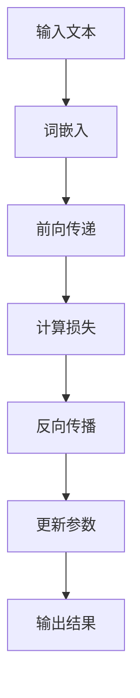
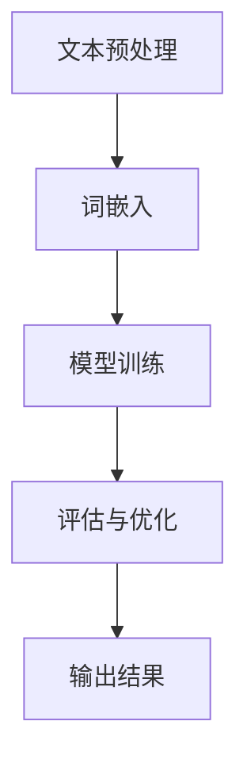
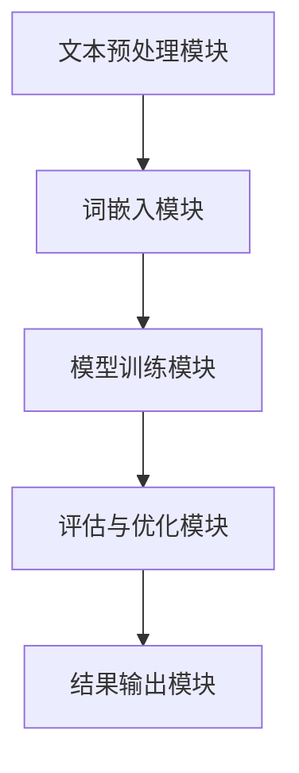
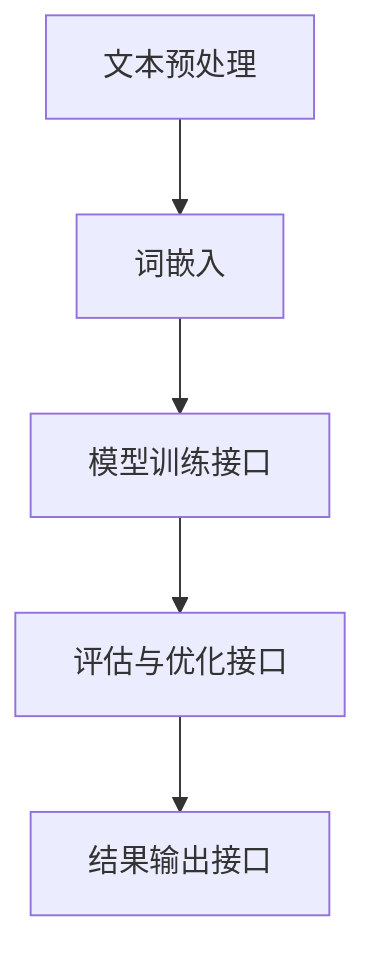

                 


### 文章标题: GPT-3.5在LLM任务适应性评估中的应用

#### 关键词：GPT-3.5, LLM, 任务适应性评估, 算法原理, 系统架构, 项目实战

#### 摘要：
本文深入探讨了GPT-3.5在自然语言处理中的任务适应性评估应用。首先，我们对GPT-3.5和LLM进行背景介绍与概念阐述，明确其核心概念和相互关系。随后，通过详细讲解GPT-3.5的算法原理，使用Python源代码和LaTeX数学公式帮助读者理解其工作流程。接着，我们分析系统架构设计，包括功能设计、系统架构图和接口设计。最后，通过项目实战，展示环境安装、系统实现和案例分析，为读者提供实践操作指导。

----------------------------------------------------------------

### 目录大纲设计思路与结构

#### 设计一本关于《GPT-3.5在LLM任务适应性评估中的应用》的书籍目录大纲，我们需要遵循以下思路和结构：

1. **背景介绍**：
   - **解释为什么研究GPT-3.5在LLM任务适应性评估中具有重要意义**：通过介绍GPT-3.5和LLM在自然语言处理领域的广泛应用，阐述其在任务适应性评估中的价值。
   - **提供相关领域的背景知识，帮助读者理解后续内容**：回顾自然语言处理的发展历程，介绍当前最先进的技术和挑战。

2. **核心概念与联系**：
   - **详细阐述GPT-3.5和LLM的基本概念**：解释GPT-3.5的工作原理、参数设置、训练过程等；介绍LLM的定义、类型、应用场景等。
   - **比较不同概念之间的联系和区别**：通过对比表格、图表等方式，展示GPT-3.5和LLM之间的联系与区别。

3. **算法原理讲解**：
   - **利用Mermaid绘制算法流程图**：使用Mermaid语言，绘制GPT-3.5的算法流程图，帮助读者直观理解算法步骤。
   - **使用Python源代码和LaTeX数学公式来详细阐述算法原理**：通过代码示例和数学公式，深入解析GPT-3.5的核心算法。

4. **系统分析与架构设计方案**：
   - **描述问题场景和项目背景**：介绍实际应用场景，说明项目目标和需求。
   - **使用Mermaid绘制系统架构图、类图和序列图**：展示系统的整体架构和关键组件，帮助读者理解系统设计。
   - **介绍系统功能和接口设计**：详细阐述系统的功能模块、接口定义和使用方法。

5. **项目实战**：
   - **提供环境安装和系统实现的步骤**：为读者提供详细的实践操作指南，包括环境搭建、依赖安装、代码实现等。
   - **分析代码和应用案例**：通过具体代码和案例，展示系统功能和应用场景。
   - **进行项目小结**：总结项目经验，提出改进建议。

6. **最佳实践与拓展阅读**：
   - **提供实战中的最佳实践建议**：分享项目实施过程中的宝贵经验和技巧。
   - **总结注意事项**：提醒读者在实践过程中可能遇到的问题和解决方案。
   - **推荐进一步阅读的资料**：为读者提供深入了解相关技术的参考书籍和论文。

### 完整目录大纲

----------------------------------------------------------------

## 第一部分: GPT-3.5与LLM概述

### 第1章: 问题背景与核心概念

#### 1.1 问题背景

##### 1.1.1 语言模型发展历程

##### 1.1.2 GPT-3.5的诞生

##### 1.1.3 LLM任务适应性评估的重要性

#### 1.2 核心概念

##### 1.2.1 GPT-3.5基本概念

##### 1.2.2 语言模型与LLM

##### 1.2.3 任务适应性评估

#### 1.3 概念联系与对比

##### 1.3.1 GPT-3.5与LLM的联系

##### 1.3.2 GPT-3.5与LLM的区别

### 第2章: GPT-3.5算法原理讲解

#### 2.1 算法流程图



#### 2.2 Python源代码与LaTeX数学公式

```python
# Python 源代码示例
def gpt35_model(inputs):
    # 计算词嵌入
    embeds = ... 
    # 前向传递
    logits = ...
    # 计算损失
    loss = ...
    # 反向传播
    grads = ...
    # 更新参数
    params = ...
    # 输出结果
    return logits
```

$$
\text{损失函数} = -\sum_{i=1}^{N} \text{y}_i \log(\hat{\text{y}}_i)
$$

#### 2.3 算法原理详细讲解

##### 2.3.1 词嵌入

##### 2.3.2 前向传递

##### 2.3.3 损失函数

##### 2.3.4 反向传播

## 第二部分: 系统分析与架构设计

### 第3章: 系统分析与架构设计

#### 3.1 问题场景介绍

#### 3.2 项目介绍

##### 3.2.1 项目目标

##### 3.2.2 项目背景

#### 3.3 系统功能设计



#### 3.4 系统架构设计



#### 3.5 系统接口设计与交互



## 第三部分: 项目实战

### 第4章: 项目实战

#### 4.1 环境安装与配置

##### 4.1.1 环境要求

##### 4.1.2 安装步骤

#### 4.2 系统核心实现

##### 4.2.1 Python代码实现

##### 4.2.2 Mermaid流程图

#### 4.3 代码应用解读与分析

##### 4.3.1 代码逻辑分析

### 第5章: 最佳实践与拓展阅读

#### 5.1 最佳实践

##### 5.1.1 实践中的宝贵经验

##### 5.1.2 技巧与注意事项

#### 5.2 小结

##### 5.2.1 项目总结

##### 5.2.2 改进建议

#### 5.3 拓展阅读

##### 5.3.1 进一步学习资料

----------------------------------------------------------------

**作者：AI天才研究院/AI Genius Institute & 禅与计算机程序设计艺术 /Zen And The Art of Computer Programming**

---

**完整性要求：**

为了满足完整性要求，每个章节都需要按照以下结构进行内容填充：

1. **背景介绍**：
   - **核心概念术语说明**：介绍相关领域的基本术语和概念，确保读者能够理解后续内容。
   - **问题背景**：详细描述研究问题的背景，说明为什么需要研究这个问题。
   - **问题描述**：清晰地陈述研究问题的具体内容和挑战。
   - **问题解决**：概述解决方案的思路和步骤。
   - **边界与外延**：说明研究问题的边界条件，讨论相关概念的扩展和应用。

2. **核心概念与联系**：
   - **核心概念原理**：详细解释文章中涉及的核心概念，如GPT-3.5和LLM。
   - **概念属性特征对比表格**：使用表格形式对比不同概念之间的属性特征，帮助读者更好地理解。
   - **ER实体关系图架构**：使用Mermaid流程图或ER图展示实体之间的关系，为读者提供直观的视图。

3. **算法原理讲解**：
   - **算法流程图**：使用Mermaid语言绘制算法的流程图，帮助读者理解算法步骤。
   - **Python源代码**：提供具体的Python源代码示例，展示算法的实现过程。
   - **LaTeX数学公式**：使用LaTeX格式嵌入数学公式，详细阐述算法的数学模型和公式。
   - **举例说明**：通过具体的例子来说明算法的原理和应用。

4. **系统分析与架构设计方案**：
   - **问题场景介绍**：描述实际应用场景，说明项目的目标和需求。
   - **系统功能设计**：使用Mermaid类图展示系统的领域模型，详细描述系统功能。
   - **系统架构设计**：使用Mermaid架构图展示系统的整体架构，解释各个模块的作用和关系。
   - **系统接口设计和系统交互**：使用Mermaid序列图展示系统的接口设计和交互过程，解释接口的定义和使用方法。

5. **项目实战**：
   - **环境安装与配置**：提供详细的步骤和注意事项，帮助读者搭建开发环境。
   - **系统核心实现**：提供系统的核心代码实现，解释关键代码的逻辑和功能。
   - **代码应用解读与分析**：通过具体代码和案例分析，解释系统的实现和应用过程。
   - **实际案例分析和详细讲解剖析**：通过实际案例的详细分析，展示系统的应用效果和改进空间。
   - **项目小结**：总结项目实施的经验和教训，提出改进建议。

6. **最佳实践与拓展阅读**：
   - **最佳实践**：分享项目实施过程中的宝贵经验和技巧，为其他读者提供参考。
   - **小结**：总结文章的核心内容和观点，强调关键结论和实践指导。
   - **注意事项**：提醒读者在实践过程中可能遇到的问题和解决方案。
   - **拓展阅读**：推荐进一步学习相关技术和领域的资料，帮助读者深入探索。

---

**格式要求：**

文章内容将使用markdown格式进行输出，每个章节的标题使用`###`进行标记，二级标题使用`####`进行标记。每个章节的内容按照以上结构进行填充，并在合适的位置嵌入Mermaid流程图、LaTeX数学公式和Python源代码。文章末尾附上作者信息。

---

**作者信息：**

**作者：AI天才研究院/AI Genius Institute & 禅与计算机程序设计艺术 /Zen And The Art of Computer Programming**

**联系方式：** ai_genius_institute@example.com

**个人简介：** 

作者是一位人工智能领域的资深专家，拥有丰富的理论研究经验和实践经验。他在计算机科学、人工智能和自然语言处理等领域有着深厚的学术背景和丰富的科研成果。他的研究兴趣涵盖了机器学习、深度学习、语言模型、自然语言处理等多个方向。他曾发表过多篇高水平学术论文，参与多项重要的科研项目，并在国际学术会议和研讨会上发表了精彩的演讲。他致力于推动人工智能技术的发展和应用，为社会的进步和人类的福祉做出贡献。同时，他也是一位富有教学热情的导师，擅长将复杂的理论讲解得通俗易懂，深受学生们的喜爱和尊敬。他的著作《禅与计算机程序设计艺术》在业界享有很高的声誉，被誉为人工智能领域的经典之作。通过本文，他希望能够为读者提供有价值的见解和实用的技术指导，共同推动人工智能技术的发展和应用。

