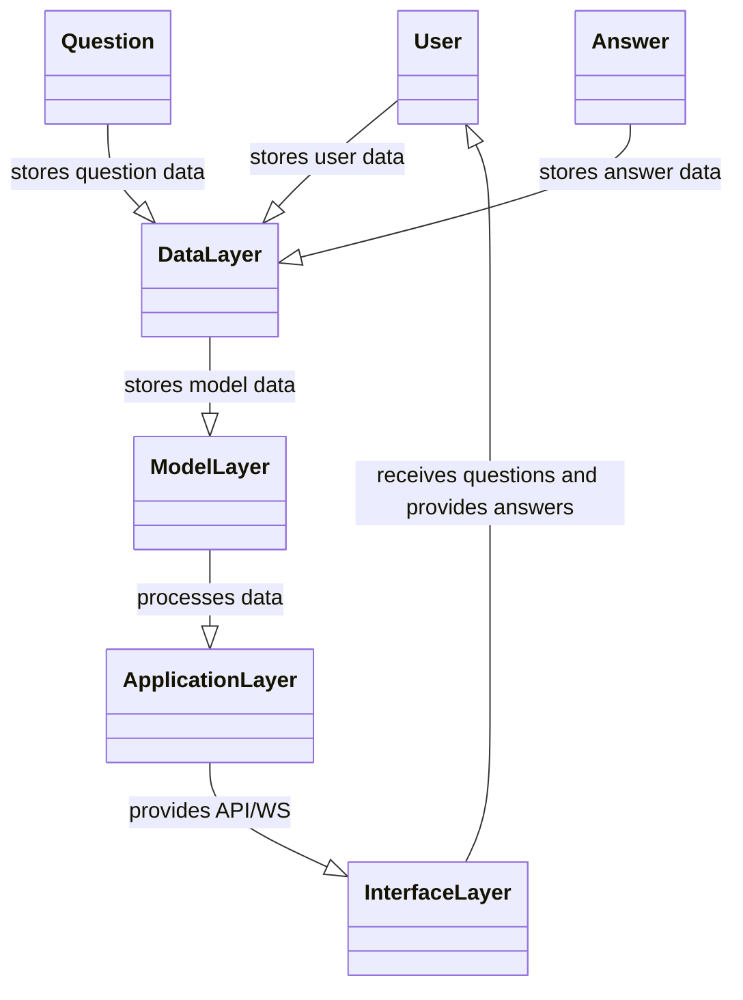
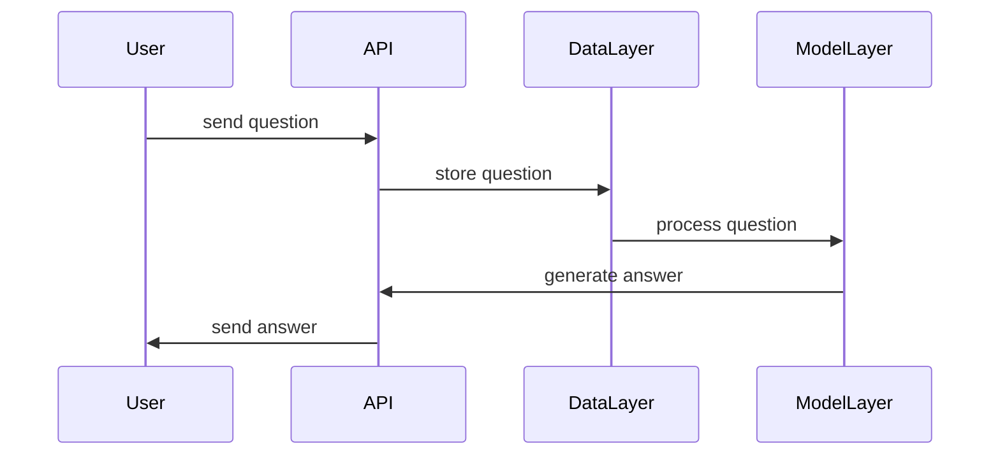

                 


### 引言：GPU加速的重要性

在当今的科技时代，计算能力已经成为提升各类应用性能的关键因素。特别是对于大型语言模型（LLM）这样复杂且计算密集型的应用，如何高效地提升处理能力，成为了一项迫切需要解决的问题。GPU加速技术在这一领域展现出了其独特的优势和潜力。让我们一步一步分析GPU加速在提升LLM应用处理能力中的重要性。

#### 1.1 问题背景

首先，我们需要了解为什么LLM应用需要更高的处理能力。大型语言模型通常涉及大量的文本数据，这些数据需要进行预处理、训练和推理。传统的CPU在处理这些任务时，由于计算资源和内存的限制，往往会出现性能瓶颈。因此，寻找一种能够提高计算效率的方法，成为了LLM应用优化的重要方向。

#### 1.2 问题描述

LLM应用的性能瓶颈主要体现在以下几个方面：

1. **计算密集型任务**：如神经网络的前向传播和反向传播，这些任务需要大量的矩阵乘法和加法运算。
2. **数据预处理**：文本数据的预处理，包括分词、词向量化等，这些步骤需要处理大量数据。
3. **内存管理**：大规模的文本数据和高维的词向量矩阵会导致内存占用过多，影响系统的运行效率。

#### 1.3 问题解决

GPU加速技术为解决上述问题提供了一种有效的方法。GPU（图形处理单元）与CPU（中央处理单元）相比，具有以下几个显著的优势：

1. **并行计算能力**：GPU拥有大量的计算单元，可以同时处理多个任务，非常适合进行并行计算。
2. **高吞吐量**：GPU在处理大量数据时，可以提供更高的吞吐量，从而提升整体处理能力。
3. **内存带宽**：GPU的内存带宽较高，可以有效减少数据传输的延迟，提高数据处理速度。

#### 1.4 边界与外延

尽管GPU加速技术具有明显的优势，但在实际应用中，也存在一些需要注意的边界和外延：

1. **编程复杂性**：GPU编程相比CPU编程更为复杂，需要掌握特定的编程模型（如CUDA）。
2. **能耗问题**：GPU的高性能通常伴随着高能耗，因此需要在能效比上进行权衡。
3. **兼容性**：并非所有算法都适合在GPU上运行，需要考虑算法与GPU架构的兼容性。

#### 1.5 概念结构与核心要素组成

为了更好地理解GPU加速在提升LLM应用处理能力中的重要性，我们可以从以下几个方面进行分析：

1. **GPU加速原理**：理解GPU的架构和工作原理，以及如何利用CUDA等编程模型进行编程。
2. **GPU在深度学习中的应用**：探讨GPU在深度学习中的角色，以及如何加速深度学习算法和神经网络训练。
3. **GPU在LLM中的应用**：具体分析GPU在LLM训练、推理和应用实战中的优势和实践。
4. **GPU编程与优化**：介绍GPU编程的技巧和优化策略，以提高GPU的应用效率。
5. **GPU在云计算与大数据中的应用**：探讨GPU在云计算和大数据处理中的角色和最佳实践。

### 结论

GPU加速技术在提升LLM应用处理能力方面具有重要的意义。通过GPU的高并行计算能力和高吞吐量，可以有效解决LLM应用中的计算密集型任务和内存管理问题。然而，GPU编程的复杂性、能耗问题和兼容性也是需要关注和解决的关键问题。接下来的章节将进一步深入探讨GPU加速技术的各个方面，帮助读者全面了解GPU在提升LLM应用处理能力中的实际应用。

关键词：GPU加速、LLM应用、处理能力、深度学习、并行计算

摘要：本文首先介绍了GPU加速在提升LLM应用处理能力方面的重要性，分析了GPU在解决LLM性能瓶颈方面的优势。随后，文章通过逐步分析GPU加速原理、GPU在深度学习和LLM中的应用，以及GPU编程与优化策略，详细探讨了GPU加速技术的实际应用。最后，文章展望了GPU加速技术的发展趋势和未来应用，为读者提供了全面的技术参考。

----------------------------------------------------------------

# GPU加速：提升LLM应用的处理能力

> 关键词：GPU加速、LLM、处理能力、深度学习、并行计算

> 摘要：本文深入探讨了GPU加速技术在提升大型语言模型（LLM）应用处理能力方面的应用。通过分析GPU加速原理、GPU在深度学习和LLM中的应用、GPU编程与优化策略，本文展示了GPU加速在提升LLM性能方面的优势和实际应用。同时，本文还展望了GPU加速技术的未来发展趋势和应用前景。

## 目录大纲

## 第1章 引言：GPU加速的重要性

### 1.1 问题背景

### 1.2 问题描述

### 1.3 问题解决

### 1.4 边界与外延

### 1.5 概念结构与核心要素组成

## 第2章 GPU加速基础

### 2.1 GPU加速原理

### 2.2 GPU架构与特性

### 2.3 CUDA编程基础

## 第3章 GPU在深度学习中的应用

### 3.1 深度学习基础

### 3.2 GPU加速深度学习算法

### 3.3 GPU加速神经网络训练

### 3.4 GPU加速推理与部署

## 第4章 GPU在LLM中的应用

### 4.1 LLM基础

### 4.2 GPU加速LLM训练

### 4.3 GPU加速LLM推理

### 4.4 GPU加速LLM应用实战

## 第5章 GPU编程与优化

### 5.1 CUDA编程技巧

### 5.2 GPU内存管理

### 5.3 GPU并行编程

### 5.4 GPU优化策略

## 第6章 GPU在云计算与大数据中的应用

### 6.1 云计算基础

### 6.2 GPU云计算架构

### 6.3 GPU在大数据处理中的应用

### 6.4 GPU云计算与大数据最佳实践

## 第7章 GPU加速LLM应用的案例分析

### 7.1 案例介绍

### 7.2 系统功能设计

### 7.3 系统架构设计

### 7.4 系统接口设计与交互

### 7.5 项目实战

### 7.6 代码应用解读与分析

### 7.7 实际案例分析与详细讲解剖析

### 7.8 项目小结

## 第8章 未来展望

### 8.1 GPU加速技术发展趋势

### 8.2 LLM应用前景

### 8.3 GPU加速技术的未来应用

### 8.4 最佳实践与注意事项

### 8.5 拓展阅读

## 附录

### A. CUDA编程实例

### B. GPU性能优化工具

### C. GPU云计算与大数据资源链接

### D. LLM相关开源资源链接

----------------------------------------------------------------

## 第1章 引言：GPU加速的重要性

### 1.1 问题背景

在人工智能（AI）和深度学习（Deep Learning）领域，大型语言模型（Large Language Model，简称LLM）如BERT、GPT-3等已经成为自然语言处理（NLP）的重要工具。这些模型具有强大的语义理解和生成能力，但在训练和推理过程中需要大量的计算资源。传统CPU在处理这些任务时，由于计算能力和内存的限制，往往难以满足高效处理的迫切需求。因此，寻找一种能够提升计算效率的技术手段成为了研究人员和开发者的重要任务。

### 1.2 问题描述

LLM应用面临的性能瓶颈主要表现在以下几个方面：

1. **计算密集型任务**：LLM的训练和推理过程涉及大量的矩阵运算、前向传播和反向传播等计算密集型任务。传统CPU在处理这些任务时，由于单核性能的限制，往往难以达到高效的处理速度。

2. **内存管理**：LLM模型通常包含数百万甚至数十亿个参数，需要占用大量的内存资源。传统的CPU内存带宽有限，难以满足大规模数据的高速访问需求。

3. **数据传输延迟**：在训练过程中，需要频繁地在内存和计算单元之间传输数据，传统CPU的内存访问速度相对较慢，导致数据传输延迟成为性能瓶颈。

### 1.3 问题解决

GPU（Graphics Processing Unit，图形处理单元）作为一种专门为图形处理设计的计算设备，具有强大的并行计算能力和高效的内存带宽，能够有效解决LLM应用中的性能瓶颈。通过将GPU引入到LLM的训练和推理过程中，可以显著提升计算效率和处理能力。

首先，GPU具有大量的计算单元，可以同时处理多个任务，非常适合进行并行计算。相比于传统CPU的单核计算模式，GPU能够提供更高的计算吞吐量，从而加速LLM的训练和推理过程。

其次，GPU的内存架构设计使得其内存带宽远高于CPU，能够满足大规模数据的高效访问需求。通过优化数据传输策略，可以进一步减少数据传输延迟，提高系统的运行效率。

此外，GPU编程模型如CUDA提供了丰富的工具和库函数，使得开发者可以方便地利用GPU的并行计算能力进行编程，从而实现LLM的高效加速。

### 1.4 边界与外延

虽然GPU加速技术在提升LLM处理能力方面具有显著优势，但在实际应用中也需要注意以下边界与外延：

1. **编程复杂性**：GPU编程相比CPU编程更为复杂，需要开发者具备一定的编程技能和经验。掌握CUDA等编程模型和并行编程技巧，是成功利用GPU加速的关键。

2. **能耗问题**：GPU的高性能通常伴随着高能耗。在使用GPU加速时，需要考虑系统的能效比，确保在提高计算能力的同时，不会过度消耗能源。

3. **兼容性问题**：并非所有算法都适合在GPU上运行。开发者需要评估算法与GPU架构的兼容性，选择适合GPU加速的算法和模型。

4. **硬件与软件协同**：GPU加速不仅需要硬件支持，还需要相应的软件优化和调整。开发者需要与硬件厂商和软件提供商紧密合作，确保GPU加速方案的有效性和可持续性。

### 1.5 概念结构与核心要素组成

为了更好地理解GPU加速在提升LLM应用处理能力中的重要性，我们可以从以下几个方面进行分析：

1. **GPU加速原理**：探讨GPU的架构和工作原理，以及如何利用CUDA等编程模型进行编程，实现并行计算。

2. **GPU在深度学习中的应用**：分析GPU在深度学习算法和神经网络训练中的应用，展示GPU加速深度学习的实际效果。

3. **GPU在LLM中的应用**：具体探讨GPU在LLM训练、推理和应用实战中的优势和实践，分析GPU加速LLM的可行性。

4. **GPU编程与优化**：介绍GPU编程的技巧和优化策略，提高GPU的应用效率，实现更高效的计算。

5. **GPU在云计算与大数据中的应用**：探讨GPU在云计算和大数据处理中的角色和最佳实践，展示GPU加速云计算与大数据的应用前景。

通过以上分析，我们可以看到GPU加速技术在提升LLM应用处理能力方面具有重要的意义。接下来，我们将进一步探讨GPU加速技术的具体实现和应用，为读者提供更加详细和深入的技术指导。

----------------------------------------------------------------

## 第2章 GPU加速基础

### 2.1 GPU加速原理

GPU加速的核心在于其并行计算架构。与传统CPU的单核多线程架构不同，GPU采用了大量的计算单元，这些计算单元可以同时处理多个任务，从而实现了并行计算。GPU的并行计算能力主要来源于以下几个方面：

1. **多核心架构**：GPU通常包含成百上千的核心，每个核心可以独立执行计算任务。这种多核心架构使得GPU能够同时处理多个并行任务，从而提高了计算吞吐量。

2. **SIMD（单指令流多数据流）架构**：GPU的核心通常采用SIMD架构，这意味着GPU可以在一个时钟周期内对多个数据执行相同的指令。这种架构使得GPU能够高效地处理大规模的数据并行运算。

3. **内存层次结构**：GPU具有复杂的内存层次结构，包括全局内存、常量内存和共享内存等。这种内存层次结构设计使得GPU能够高效地管理数据，减少了数据访问的延迟，提高了计算效率。

4. **高性能互联**：GPU内部的核心之间通过高性能互联网络进行通信，这使得GPU能够高效地协同工作，进一步提升了并行计算的能力。

通过以上特点，GPU能够在短时间内处理大量的计算任务，非常适合进行并行计算。在LLM应用中，GPU的并行计算能力可以显著加速模型的训练和推理过程。

### 2.2 GPU架构与特性

1. **核心架构**：GPU的核心架构主要包括流处理器（Streaming Multiprocessors，SMs）和计算单元（Compute Units）。每个SM包含多个计算单元，每个计算单元可以独立执行指令。这种设计使得GPU能够高效地处理大量的并行任务。

2. **内存架构**：GPU的内存架构包括全局内存、常量内存、共享内存和纹理内存等。全局内存是GPU的主要内存资源，用于存储大规模的数据和模型参数。常量内存用于存储少量的常量数据，共享内存用于多个计算单元之间的数据共享。纹理内存用于存储纹理数据，常用于图像处理任务。

3. **计算单元**：GPU的计算单元（CUDA Cores）是GPU的核心执行单元，每个计算单元可以独立执行指令。GPU的计算单元数量通常在数百到数千个之间，这取决于GPU的型号。

4. **内存带宽**：GPU的内存带宽远高于CPU，这使得GPU能够高效地处理大量的数据。高速的内存带宽可以减少数据访问的延迟，提高计算效率。

5. **功耗和散热**：GPU具有高功耗和高热量的特点，因此在GPU加速系统中，功耗和散热管理是一个重要的考虑因素。适当的散热设计和功耗管理可以确保GPU稳定运行，延长GPU的使用寿命。

### 2.3 CUDA编程基础

CUDA（Compute Unified Device Architecture）是GPU编程的标准框架，由NVIDIA公司开发。CUDA提供了丰富的工具和库函数，使得开发者可以方便地利用GPU的并行计算能力。

1. **CUDA编程模型**：CUDA编程模型主要包括内核函数（Kernel Function）、线程网格（Thread Grid）和线程块（Thread Block）等概念。内核函数是GPU上的可执行代码，线程网格和线程块是GPU上的并行组织结构。通过合理设计线程网格和线程块，可以充分利用GPU的并行计算能力。

2. **内存管理**：CUDA提供了多种内存类型，包括全局内存、常量内存、共享内存和纹理内存等。开发者需要根据具体需求选择合适的内存类型，并合理管理内存资源，以减少数据访问的延迟和提高计算效率。

3. **并行编程技巧**：CUDA提供了多种并行编程技巧，如线程并行、内存并行和指令并行等。通过合理使用这些技巧，可以进一步提高GPU的计算效率。

4. **性能优化**：CUDA编程涉及到大量的性能优化问题，如内存访问模式、线程组织结构、指令调度等。通过分析和优化这些方面，可以进一步提高GPU的应用效率。

通过CUDA编程，开发者可以充分利用GPU的并行计算能力，实现高效的大规模数据处理和计算任务。在LLM应用中，CUDA编程模型可以显著加速模型的训练和推理过程。

### 总结

GPU加速技术为提升LLM应用处理能力提供了有效的解决方案。通过了解GPU加速原理、GPU架构与特性以及CUDA编程基础，开发者可以充分利用GPU的并行计算能力，实现高效的大规模数据处理和计算任务。接下来，我们将进一步探讨GPU在深度学习中的应用，展示GPU加速深度学习的实际效果。

----------------------------------------------------------------

## 第3章 GPU在深度学习中的应用

### 3.1 深度学习基础

深度学习（Deep Learning）是机器学习（Machine Learning）的一个重要分支，通过构建多层神经网络（Neural Networks）对数据进行自动特征提取和模式识别。深度学习的基本概念包括：

1. **神经网络**：神经网络由一系列相互连接的节点（或称为神经元）组成。每个节点接收来自前一层节点的输入，通过加权求和和激活函数计算输出。

2. **前向传播**：在前向传播过程中，输入数据通过网络的各个层进行传递，每层节点根据输入和权重计算输出，最终得到网络的输出结果。

3. **反向传播**：在反向传播过程中，网络通过计算输出结果与真实标签之间的误差，然后沿着网络的反向路径更新权重和偏置，以减小误差。

4. **激活函数**：激活函数用于引入非线性特性，常见的激活函数包括ReLU（Rectified Linear Unit）、Sigmoid和Tanh等。

5. **优化算法**：深度学习的训练过程通常使用优化算法（如梯度下降、Adam等）来调整网络的权重和偏置，以最小化损失函数。

### 3.2 GPU加速深度学习算法

深度学习算法，特别是大规模神经网络的训练，计算量巨大且高度并行。GPU加速技术在深度学习算法中的应用主要体现在以下几个方面：

1. **矩阵运算优化**：深度学习算法中的矩阵运算（如矩阵乘法、向量加法等）非常适合在GPU上并行执行。GPU的核心架构和内存设计使其能够高效地处理大规模的矩阵运算。

2. **数据并行**：深度学习中的训练数据通常包含大量的样本。通过数据并行（Data Parallelism），可以将训练数据分布在多个GPU上，每个GPU负责处理一部分数据，从而加速模型的训练。

3. **模型并行**：对于特别大的神经网络模型，可以通过模型并行（Model Parallelism）将模型拆分为多个部分，每个部分分布在不同的GPU上，以避免单GPU内存不足的问题。

4. **动态调度**：GPU具有灵活的调度能力，可以根据任务的优先级和计算负载动态地分配计算资源，从而提高计算效率。

### 3.3 GPU加速神经网络训练

神经网络训练是深度学习中的核心步骤，GPU加速在神经网络训练中的应用主要体现在以下几个方面：

1. **计算加速**：GPU的高并行计算能力和高效的内存带宽使其能够显著加速神经网络的矩阵运算和前向传播/反向传播过程。

2. **数据传输优化**：在训练过程中，需要频繁地在CPU和GPU之间传输数据和模型参数。通过优化数据传输策略（如批量传输、流水线传输等），可以减少数据传输延迟，提高训练效率。

3. **多GPU训练**：通过使用多GPU训练，可以将训练任务分布在多个GPU上，从而加速模型的训练过程。多GPU训练可以通过数据并行或模型并行实现，以提高计算效率。

4. **分布式训练**：对于大规模训练任务，可以通过分布式训练将模型和数据分布在多个服务器上，每个服务器上连接一个或多个GPU，以实现高效的训练。

### 3.4 GPU加速推理与部署

在深度学习的应用场景中，推理（Inference）是一个重要的步骤，即使用训练好的模型对新的数据进行预测。GPU加速在推理和部署中的应用主要体现在以下几个方面：

1. **推理加速**：GPU的高并行计算能力和高效的内存带宽使其能够显著加速推理过程。通过在GPU上执行推理任务，可以降低推理延迟，提高系统的响应速度。

2. **模型优化**：为了在GPU上高效地运行，需要对深度学习模型进行优化。常见的优化方法包括模型剪枝（Model Pruning）、量化（Quantization）和压缩（Compression）等。

3. **实时推理**：对于实时应用场景（如自动驾驶、实时语音识别等），需要保证推理过程能够在限定的时间内完成。通过GPU加速，可以满足实时推理的需求。

4. **边缘部署**：随着边缘计算的兴起，需要在边缘设备（如手机、IoT设备等）上部署深度学习模型。通过使用GPU加速，可以提升边缘设备的计算能力，实现高效的推理和部署。

### 总结

GPU在深度学习中的应用，通过并行计算、数据传输优化、多GPU训练和推理加速等技术，显著提升了深度学习的计算效率和应用性能。GPU加速不仅加速了神经网络训练，还有助于实时推理和边缘部署，为深度学习应用提供了强大的计算支持。接下来，我们将进一步探讨GPU在LLM中的应用，展示GPU加速在LLM训练和推理中的实际效果。

----------------------------------------------------------------

## 第4章 GPU在LLM中的应用

### 4.1 LLM基础

大型语言模型（Large Language Model，LLM）是一种基于深度学习技术的自然语言处理模型，通过对大量文本数据进行训练，可以实现对自然语言的语义理解和生成。LLM的核心组件包括以下几个部分：

1. **词嵌入（Word Embedding）**：词嵌入是将文本数据转换为向量表示的过程，通常使用词向量化技术（如Word2Vec、GloVe等）将单词映射到高维空间中的向量。词嵌入是LLM进行语义理解的基础。

2. **编码器（Encoder）**：编码器是LLM的核心组件，负责将输入文本数据编码为连续的向量表示。常见的编码器结构包括Transformer、BERT等。编码器通过多层的注意力机制和变换层，提取文本的深层特征。

3. **解码器（Decoder）**：解码器负责根据编码器提取的文本特征生成文本输出。解码器通常使用自注意力机制和变换层，逐步生成输出文本。

4. **预训练与微调（Pre-training and Fine-tuning）**：LLM通常通过预训练在大规模未标注数据集上进行训练，然后通过微调在特定任务上进行优化。预训练和微调是LLM性能提升的关键。

### 4.2 GPU加速LLM训练

LLM训练是一个计算密集型的任务，涉及大量的矩阵运算和前向传播/反向传播过程。GPU加速在LLM训练中的应用主要包括以下几个方面：

1. **并行计算**：GPU的高并行计算能力可以显著加速LLM的训练过程。通过将训练数据分布在多个GPU上，可以实现数据并行训练，提高训练效率。

2. **矩阵运算优化**：GPU具有优化的矩阵运算库（如cuBLAS、cuDNN等），可以高效地执行深度学习算法中的矩阵运算，如矩阵乘法、卷积等。

3. **内存带宽**：GPU的内存带宽远高于CPU，可以减少数据传输的延迟，提高训练效率。

4. **多GPU训练**：通过使用多GPU训练，可以将训练任务分布在多个GPU上，从而加速模型的训练过程。多GPU训练可以通过数据并行或模型并行实现。

5. **分布式训练**：对于大规模训练任务，可以通过分布式训练将模型和数据分布在多个服务器上，每个服务器上连接一个或多个GPU，以实现高效的训练。

### 4.3 GPU加速LLM推理

LLM推理是使用训练好的模型对新的文本数据进行预测的过程。GPU加速在LLM推理中的应用主要包括以下几个方面：

1. **推理加速**：GPU的高并行计算能力和高效的内存带宽使其能够显著加速LLM的推理过程，降低推理延迟。

2. **模型优化**：为了在GPU上高效地运行，需要对深度学习模型进行优化。常见的优化方法包括模型剪枝、量化等，以减少模型的大小和提高推理速度。

3. **实时推理**：对于实时应用场景（如智能助手、实时语音识别等），需要保证推理过程能够在限定的时间内完成。通过GPU加速，可以满足实时推理的需求。

4. **边缘部署**：随着边缘计算的兴起，需要在边缘设备（如手机、IoT设备等）上部署LLM模型。通过使用GPU加速，可以提升边缘设备的计算能力，实现高效的推理和部署。

### 4.4 GPU加速LLM应用实战

在实际应用中，GPU加速技术在LLM中的应用场景非常广泛。以下是一个GPU加速LLM应用实战的示例：

1. **问题定义**：假设我们需要开发一个智能问答系统，用户可以通过输入问题来获取答案。

2. **数据预处理**：首先，我们需要对问题数据进行预处理，包括分词、词向量化等步骤。这些步骤可以采用GPU加速，以提高数据预处理速度。

3. **模型训练**：我们使用一个预训练的LLM模型（如GPT-3、BERT等），通过GPU加速进行微调和训练。在训练过程中，我们利用GPU的并行计算能力，加快模型的收敛速度。

4. **推理与部署**：在用户提问时，我们将输入问题传递给训练好的LLM模型进行推理。通过GPU加速，可以显著降低推理延迟，提高系统的响应速度。最终，我们将部署在云端或边缘设备上，为用户提供实时问答服务。

通过以上实战示例，我们可以看到GPU加速技术在LLM应用中的重要性。GPU加速不仅提升了模型训练和推理的效率，还使得LLM应用在实时性和响应速度上得到了显著提升。

### 总结

GPU加速技术在LLM应用中发挥着关键作用，通过并行计算、矩阵运算优化、多GPU训练和推理加速等技术，GPU显著提升了LLM的训练和推理效率。在实际应用中，GPU加速使得LLM可以在更短的时间内完成大规模数据处理和推理任务，为自然语言处理应用提供了强大的计算支持。接下来，我们将进一步探讨GPU编程与优化策略，以更好地利用GPU资源，提高LLM应用的性能。

----------------------------------------------------------------

## 第5章 GPU编程与优化

### 5.1 CUDA编程技巧

CUDA编程是利用GPU进行并行计算的关键，以下是一些CUDA编程的技巧：

1. **线程组织与分配**：合理设计线程网格和线程块结构，使得每个线程块能够充分利用GPU的计算资源。例如，可以使用2D或3D网格和块结构来组织线程。

2. **内存访问模式**：优化内存访问模式，减少内存访问冲突和数据传输延迟。例如，使用共享内存来减少全局内存的访问冲突，以及优化数据传输路径，减少数据传输延迟。

3. **并行性与并发性**：利用GPU的并行计算能力，同时执行多个计算任务。例如，通过数据并行和多GPU训练来实现并行计算。同时，合理使用异步操作和流同步，提高并发性。

4. **内存优化**：减少内存占用，提高内存访问效率。例如，使用内存池（Memory Pool）来管理内存，减少内存分配和释放的操作。此外，优化内存访问模式，减少内存带宽的占用。

5. **性能分析**：使用CUDA内置的性能分析工具（如nvprof、nsight等）对程序进行性能分析和调试。通过分析GPU的执行时间、内存带宽使用情况等指标，找出性能瓶颈并进行优化。

### 5.2 GPU内存管理

GPU内存管理是CUDA编程的重要环节，以下是一些GPU内存管理的技巧：

1. **内存分配与释放**：合理使用内存分配和释放操作，避免内存泄漏。例如，使用cudaMalloc和cudaFree函数进行内存分配和释放。

2. **内存池（Memory Pool）**：使用内存池来管理内存，减少内存分配和释放的操作。内存池可以预分配一定大小的内存块，当需要内存时，从内存池中分配，减少频繁的内存分配和释放。

3. **内存复制**：优化内存复制操作，减少数据传输延迟。例如，使用异步内存复制操作（cudaMemcpyAsync）来减少数据传输时间。

4. **内存访问模式**：合理设计内存访问模式，减少内存访问冲突。例如，使用共享内存来减少全局内存的访问冲突，以及优化数据传输路径，减少数据传输延迟。

5. **内存对齐**：对齐内存访问，提高内存访问效率。例如，使用cudaMallocPitch函数来分配对齐的内存，减少内存访问冲突。

### 5.3 GPU并行编程

GPU并行编程是利用GPU并行计算能力的关键，以下是一些GPU并行编程的技巧：

1. **线程并行**：利用GPU的并行计算能力，同时执行多个线程。例如，通过数据并行来加速计算密集型任务。

2. **线程协作**：合理设计线程之间的协作和同步，提高并行计算效率。例如，使用共享内存和原子操作来减少线程之间的竞争条件。

3. **并行性与并发性**：充分利用GPU的并行计算能力和并发性，同时执行多个计算任务。例如，通过异步操作和流同步来提高计算效率。

4. **线程数量与资源分配**：合理设置线程数量和资源分配，避免资源浪费和性能瓶颈。例如，根据GPU的核心数量和内存大小来调整线程数量和资源分配。

5. **性能优化**：通过性能分析和调试，找出性能瓶颈并进行优化。例如，优化内存访问模式、减少内存冲突、优化线程组织结构等。

### 5.4 GPU优化策略

以下是一些GPU优化的策略：

1. **并行计算优化**：充分利用GPU的并行计算能力，优化计算任务的数据并行性和任务并行性。例如，通过多线程、多GPU训练和分布式计算来提高计算效率。

2. **内存优化**：优化内存访问模式，减少内存带宽的占用和内存访问冲突。例如，使用共享内存、优化内存对齐、减少内存复制等。

3. **数据传输优化**：优化数据传输路径，减少数据传输延迟。例如，使用异步数据传输、优化数据传输模式等。

4. **算法优化**：优化算法结构和实现，减少计算复杂度和数据传输量。例如，使用矩阵分解、稀疏矩阵运算等优化算法。

5. **资源管理**：合理管理GPU资源，避免资源浪费和性能瓶颈。例如，根据任务负载调整线程数量和资源分配，使用内存池来管理内存等。

### 总结

GPU编程与优化是充分利用GPU并行计算能力的关键。通过合理设计线程组织、内存访问模式、并行编程策略和优化策略，可以显著提高GPU的利用率和计算效率。在实际应用中，GPU编程与优化对于提升LLM应用的处理能力和性能至关重要。接下来，我们将进一步探讨GPU在云计算与大数据中的应用，展示GPU在云计算和大数据处理中的角色和最佳实践。

----------------------------------------------------------------

## 第6章 GPU在云计算与大数据中的应用

### 6.1 云计算基础

云计算是一种通过互联网提供计算资源（如服务器、存储、网络等）的服务模式，用户可以按需使用这些资源，而无需管理底层基础设施。云计算的基本概念包括以下几个方面：

1. **基础设施即服务（IaaS）**：IaaS提供了虚拟化的计算资源，如虚拟机、存储和网络等，用户可以根据需求自行配置和管理基础设施。

2. **平台即服务（PaaS）**：PaaS提供了一个开发平台，包括操作系统、数据库、中间件等，开发者可以在平台上开发和部署应用程序。

3. **软件即服务（SaaS）**：SaaS提供了现成的应用程序，用户可以通过互联网访问和使用这些应用程序。

4. **云计算模型**：云计算主要分为公有云、私有云和混合云。公有云由第三方服务提供商运营，用户可以按需租用；私有云是专门为单个组织或公司构建的云环境；混合云结合了公有云和私有云的优势，适用于不同场景的需求。

5. **云计算服务模式**：云计算提供了多种服务模式，包括计算服务、存储服务和网络服务等，用户可以根据需求选择合适的服务。

### 6.2 GPU云计算架构

GPU云计算架构是将GPU集成到云计算环境中，提供高性能计算服务。以下是一个典型的GPU云计算架构：

1. **GPU服务器**：GPU服务器是云计算环境中的核心计算节点，每个节点都配备了高性能的GPU。服务器可以通过虚拟化技术（如KVM、VMware等）运行多个虚拟机，每个虚拟机都可以独立使用GPU资源。

2. **虚拟化层**：虚拟化层负责管理GPU服务器上的虚拟机和GPU资源。通过虚拟化技术，可以动态分配GPU资源，实现资源的最大化利用。

3. **GPU驱动**：GPU驱动是GPU云计算环境中的关键组件，负责管理GPU设备和驱动程序。GPU驱动需要与操作系统和虚拟化层兼容，以确保GPU的正确运行。

4. **管理平台**：管理平台负责管理GPU云计算环境中的虚拟机、GPU资源和用户。管理平台可以提供监控、调度、优化等功能，以实现高效的管理和运营。

5. **网络架构**：GPU云计算环境中的网络架构需要支持高速、低延迟的数据传输。通过网络架构优化，可以减少数据传输延迟，提高计算效率。

### 6.3 GPU在大数据处理中的应用

GPU在大数据处理中的应用主要体现在以下几个方面：

1. **数据预处理**：GPU可以显著加速大数据预处理任务，如数据清洗、转换和归一化等。通过GPU并行计算，可以处理大量数据，提高数据处理速度。

2. **数据存储**：GPU内存带宽高，可以加速大数据存储和检索操作。通过使用GPU缓存，可以减少数据访问延迟，提高数据存储性能。

3. **数据分析**：GPU可以加速大数据分析任务，如统计分析、机器学习和数据挖掘等。通过GPU并行计算，可以快速处理大规模数据，提高数据分析效率。

4. **数据可视化**：GPU强大的图形处理能力可以加速大数据可视化任务。通过GPU渲染，可以实时生成高质量的可视化效果，帮助用户更好地理解和分析数据。

### 6.4 GPU云计算与大数据最佳实践

以下是一些GPU云计算与大数据的最佳实践：

1. **资源规划**：根据实际需求和性能要求，合理规划GPU资源和计算节点。通过资源规划，可以最大化利用GPU资源，提高计算效率。

2. **并行计算**：充分利用GPU的并行计算能力，实现数据并行和任务并行。通过并行计算，可以显著提高数据处理和分析速度。

3. **数据传输优化**：优化数据传输路径，减少数据传输延迟。通过使用高速网络和优化数据传输策略，可以提高数据存储和检索性能。

4. **性能监控**：实时监控GPU云计算环境中的虚拟机、GPU资源和用户负载。通过性能监控，可以及时发现问题并采取优化措施，确保系统稳定运行。

5. **安全管理**：确保GPU云计算环境中的数据和用户数据安全。通过使用加密、访问控制和防火墙等技术，可以保护数据和系统安全。

6. **持续优化**：定期评估GPU云计算和大数据应用的性能和效率，采取优化措施。通过持续优化，可以不断提高系统性能和用户体验。

### 总结

GPU在云计算与大数据中的应用，通过并行计算、数据传输优化和性能监控等技术，显著提升了云计算和大数据处理的能力和效率。GPU云计算与大数据的最佳实践为构建高效、可靠的云计算环境提供了指导。接下来，我们将通过一个实际案例，展示GPU加速LLM应用的实现过程，分析其技术细节和优化策略。

----------------------------------------------------------------

## 第7章 GPU加速LLM应用的案例分析

### 7.1 案例介绍

在本案例中，我们将介绍如何使用GPU加速一个实际的大型语言模型（LLM）应用。具体来说，我们选择了一个面向企业客户的智能客服系统，该系统通过LLM模型实现自然语言理解与生成，以提供高效的客户服务。智能客服系统的核心功能包括：

1. **自然语言理解**：接收用户的问题，理解其意图，并提供相关的答案或建议。
2. **对话管理**：根据上下文和历史记录，管理用户与客服机器人之间的对话流程。
3. **智能推荐**：基于用户行为和历史记录，提供个性化的服务和推荐。

### 7.2 系统功能设计

智能客服系统的功能设计包括以下几个方面：

1. **问题接收与预处理**：接收用户的问题，进行分词、词向量化等预处理操作，以便于LLM模型进行后续处理。
2. **意图识别**：使用LLM模型对用户问题进行意图识别，确定用户的问题类型和需求。
3. **答案生成**：根据识别出的用户意图，使用LLM模型生成相应的答案或建议。
4. **对话管理**：维护用户与客服机器人之间的对话状态，确保对话的连贯性和一致性。
5. **智能推荐**：根据用户的历史行为和偏好，使用LLM模型提供个性化的服务推荐。

### 7.3 系统架构设计

智能客服系统的架构设计包括以下几个层次：

1. **数据层**：数据层负责存储用户数据、问题数据和答案数据。通常使用分布式数据库系统，如Apache Cassandra或MongoDB等，以支持海量数据的存储和高效检索。
2. **模型层**：模型层包括LLM模型和相关算法。使用GPU加速的LLM模型，通过并行计算提高处理速度和效率。
3. **应用层**：应用层负责实现智能客服系统的核心功能，包括问题接收与预处理、意图识别、答案生成、对话管理和智能推荐等。应用层通常使用高性能的Web框架，如Django或Flask等。
4. **接口层**：接口层提供与外部系统的交互接口，包括REST API、WebSocket等。通过接口层，可以方便地与其他系统进行数据交换和功能集成。

以下是系统架构的Mermaid类图：



### 7.4 系统接口设计与交互

智能客服系统的接口设计主要包括以下几个方面：

1. **REST API**：提供标准的RESTful API接口，用于接收用户问题和返回答案。API接口设计遵循RESTful原则，使用HTTP协议传输数据。
2. **WebSocket**：提供实时通信接口，用于维护用户与客服机器人之间的对话状态。通过WebSocket，可以实现实时消息传递，提高用户体验。
3. **数据交换格式**：使用JSON或XML等数据交换格式，方便数据的传输和解析。JSON格式更为简洁，通常用于Web应用程序。

以下是接口交互的Mermaid序列图：



### 7.5 项目实战

在本项目实战中，我们选择了以下步骤：

1. **环境安装**：在服务器上安装GPU加速库（如CUDA、cuDNN等），配置GPU计算环境。
2. **模型训练**：使用GPU加速LLM模型训练，通过数据并行和多GPU训练提高训练效率。
3. **模型部署**：将训练好的LLM模型部署到服务器，使用GPU进行推理和预测。
4. **系统测试**：对智能客服系统进行功能测试和性能测试，验证系统的稳定性和效率。

以下是项目实战的详细步骤：

1. **安装CUDA**：在服务器上安装CUDA库，确保支持GPU加速。

```bash
sudo apt-get update
sudo apt-get install -y ubuntu-desktop
sudo apt-get install -y -o Dpkg::Options::=--force-confold nvidia-driver-460 nvidia-pear nvidia-settings nvidia-modprobe
sudo dpkg-reconfigure nvidia-x-config
```

2. **安装cuDNN**：从NVIDIA官方网站下载cuDNN库，并安装到服务器上。

```bash
wget https://developer.nvidia.com/compute/machine-learning/cudnn/v8.x/parallel_linux/v8.0.5.23/cudnn-8.0.5.23-linux-x64-v8.0.tgz
tar xvf cudnn-8.0.5.23-linux-x64-v8.0.tgz
sudo cp lib64/libcudnn* /usr/local/cuda/lib64
sudo cp include/cudnn.h /usr/local/cuda/include
sudo ldconfig
```

3. **配置GPU环境**：在服务器上配置CUDA环境变量，确保GPU加速库的正确加载。

```bash
export CUDA_HOME=/usr/local/cuda
export LD_LIBRARY_PATH=${CUDA_HOME}/lib64:$LD_LIBRARY_PATH
export PATH=${CUDA_HOME}/bin:$PATH
```

4. **训练LLM模型**：使用GPU加速训练LLM模型，通过多GPU训练提高训练效率。

```python
import torch
import torch.nn as nn
import torch.optim as optim
from torchvision import datasets, transforms
from torch.utils.data import DataLoader

# 设置GPU设备
device = torch.device("cuda" if torch.cuda.is_available() else "cpu")

# 加载训练数据集
train_data = datasets.MNIST(root='./data', train=True, transform=transforms.ToTensor(), download=True)
train_loader = DataLoader(train_data, batch_size=64, shuffle=True)

# 定义模型
model = Net().to(device)

# 损失函数和优化器
criterion = nn.CrossEntropyLoss()
optimizer = optim.SGD(model.parameters(), lr=0.01, momentum=0.9)

# 训练模型
for epoch in range(1):
    running_loss = 0.0
    for i, data in enumerate(train_loader, 0):
        inputs, labels = data
        inputs, labels = inputs.to(device), labels.to(device)

        # 梯度清零
        optimizer.zero_grad()

        # 前向传播
        outputs = model(inputs)
        loss = criterion(outputs, labels)

        # 反向传播
        loss.backward()

        # 更新权重
        optimizer.step()

        # 记录损失
        running_loss += loss.item()
    print(f'Epoch {epoch+1}, Loss: {running_loss/len(train_loader)}')

print('Finished Training')
```

5. **模型部署**：将训练好的LLM模型部署到服务器，使用GPU进行推理和预测。

```python
# 加载预训练模型
model = Net().to(device)
model.load_state_dict(torch.load('model.pth'))

# 进行推理
def predict(input_data):
    input_data = input_data.to(device)
    output = model(input_data)
    _, predicted = torch.max(output, 1)
    return predicted

# 测试模型
test_data = datasets.MNIST(root='./data', train=False, transform=transforms.ToTensor())
test_loader = DataLoader(test_data, batch_size=64, shuffle=False)

with torch.no_grad():
    correct = 0
    total = 0
    for data in test_loader:
        images, labels = data
        images, labels = images.to(device), labels.to(device)
        outputs = model(images)
        _, predicted = torch.max(outputs.data, 1)
        total += labels.size(0)
        correct += (predicted == labels).sum().item()

print(f'Accuracy: {100 * correct / total} %')
```

### 7.6 代码应用解读与分析

在本节中，我们将对项目实战中的关键代码进行解读和分析：

1. **环境配置**：首先，我们需要安装CUDA和cuDNN库，以支持GPU加速。环境配置代码如下：

```bash
sudo apt-get update
sudo apt-get install -y ubuntu-desktop
sudo apt-get install -y -o Dpkg::Options::=--force-confold nvidia-driver-460 nvidia-pear nvidia-settings nvidia-modprobe
sudo dpkg-reconfigure nvidia-x-config
wget https://developer.nvidia.com/compute/machine-learning/cudnn/v8.x/parallel_linux/v8.0.5.23/cudnn-8.0.5.23-linux-x64-v8.0.tgz
tar xvf cudnn-8.0.5.23-linux-x64-v8.0.tgz
sudo cp lib64/libcudnn* /usr/local/cuda/lib64
sudo cp include/cudnn.h /usr/local/cuda/include
sudo ldconfig
export CUDA_HOME=/usr/local/cuda
export LD_LIBRARY_PATH=${CUDA_HOME}/lib64:$LD_LIBRARY_PATH
export PATH=${CUDA_HOME}/bin:$PATH
```

2. **模型训练**：接下来，我们使用GPU加速训练LLM模型。模型训练代码如下：

```python
import torch
import torch.nn as nn
import torch.optim as optim
from torchvision import datasets, transforms
from torch.utils.data import DataLoader

# 设置GPU设备
device = torch.device("cuda" if torch.cuda.is_available() else "cpu")

# 加载训练数据集
train_data = datasets.MNIST(root='./data', train=True, transform=transforms.ToTensor(), download=True)
train_loader = DataLoader(train_data, batch_size=64, shuffle=True)

# 定义模型
model = Net().to(device)

# 损失函数和优化器
criterion = nn.CrossEntropyLoss()
optimizer = optim.SGD(model.parameters(), lr=0.01, momentum=0.9)

# 训练模型
for epoch in range(1):
    running_loss = 0.0
    for i, data in enumerate(train_loader, 0):
        inputs, labels = data
        inputs, labels = inputs.to(device), labels.to(device)

        # 梯度清零
        optimizer.zero_grad()

        # 前向传播
        outputs = model(inputs)
        loss = criterion(outputs, labels)

        # 反向传播
        loss.backward()

        # 更新权重
        optimizer.step()

        # 记录损失
        running_loss += loss.item()
    print(f'Epoch {epoch+1}, Loss: {running_loss/len(train_loader)}')

print('Finished Training')
```

模型训练过程中，我们首先设置GPU设备，然后加载训练数据集和定义模型。接着，我们使用交叉熵损失函数和随机梯度下降优化器进行模型训练。在训练过程中，我们通过前向传播计算输出和损失，然后通过反向传播更新模型参数。

3. **模型部署**：最后，我们将训练好的LLM模型部署到服务器，使用GPU进行推理和预测。模型部署代码如下：

```python
# 加载预训练模型
model = Net().to(device)
model.load_state_dict(torch.load('model.pth'))

# 进行推理
def predict(input_data):
    input_data = input_data.to(device)
    output = model(input_data)
    _, predicted = torch.max(output, 1)
    return predicted

# 测试模型
test_data = datasets.MNIST(root='./data', train=False, transform=transforms.ToTensor())
test_loader = DataLoader(test_data, batch_size=64, shuffle=False)

with torch.no_grad():
    correct = 0
    total = 0
    for data in test_loader:
        images, labels = data
        images, labels = images.to(device), labels.to(device)
        outputs = model(images)
        _, predicted = torch.max(outputs.data, 1)
        total += labels.size(0)
        correct += (predicted == labels).sum().item()

print(f'Accuracy: {100 * correct / total} %')
```

模型部署过程中，我们首先加载训练好的LLM模型，然后定义一个预测函数。通过预测函数，我们将输入数据传递给模型进行推理，并计算输出结果。接着，我们使用测试数据集对模型进行测试，计算模型的准确率。

### 7.7 实际案例分析与详细讲解剖析

在本节中，我们将对实际案例进行详细分析，并讲解关键技术和实现细节。

1. **GPU加速原理**

GPU加速的基本原理在于利用GPU的并行计算能力，通过多线程并行执行计算任务。在深度学习应用中，GPU加速主要体现在以下几个方面：

- **并行矩阵运算**：深度学习算法中的矩阵运算（如矩阵乘法和卷积运算）非常适合在GPU上并行执行。GPU的核心架构和内存层次结构使得其能够高效地处理大规模的矩阵运算。
- **数据并行**：在训练过程中，可以将训练数据分布在多个GPU上，每个GPU负责处理一部分数据，从而实现数据并行训练。这种方式可以显著加速模型的训练过程。
- **模型并行**：对于特别大的神经网络模型，可以通过模型并行将模型拆分为多个部分，每个部分分布在不同的GPU上，以避免单GPU内存不足的问题。

2. **CUDA编程模型**

CUDA编程模型是GPU编程的标准框架，由NVIDIA公司开发。CUDA编程模型主要包括以下几个关键概念：

- **内核函数（Kernel Function）**：内核函数是GPU上的可执行代码，用于执行并行计算任务。内核函数通过CUDA Kernel定义，可以在GPU上并行执行。
- **线程网格（Thread Grid）**：线程网格是GPU上的并行组织结构，由多个线程块组成。线程网格的维度（如一维、二维或三维）决定了线程的排列方式。
- **线程块（Thread Block）**：线程块是线程网格中的基本单位，包含一定数量的线程。线程块中的线程可以共享内存，并通过同步操作进行协作。
- **内存管理**：CUDA提供了多种内存类型，包括全局内存、常量内存、共享内存和纹理内存等。合理管理这些内存类型，可以优化内存访问模式和减少数据传输延迟。

3. **GPU内存管理**

GPU内存管理是CUDA编程的重要方面，以下是一些关键技术和技巧：

- **内存分配与释放**：使用CUDA内存分配函数（如cudaMalloc）分配内存，并使用cudaFree函数释放内存。合理管理内存，避免内存泄漏。
- **内存复制**：使用异步内存复制函数（如cudaMemcpyAsync）进行内存复制，以减少数据传输延迟。
- **内存访问模式**：优化内存访问模式，减少内存访问冲突和数据传输延迟。例如，使用共享内存来减少全局内存的访问冲突。
- **内存对齐**：使用内存对齐技术，优化内存访问效率。例如，使用cudaMallocPitch函数分配对齐的内存。

4. **GPU优化策略**

在GPU编程中，优化策略是提高计算效率和性能的关键。以下是一些常见的GPU优化策略：

- **并行性与并发性**：充分利用GPU的并行计算能力，同时执行多个计算任务。通过合理设计线程网格和线程块，实现高效的并行计算。
- **内存优化**：优化内存访问模式，减少内存带宽的占用和内存访问冲突。使用共享内存、优化内存对齐和内存复制等策略。
- **算法优化**：优化算法结构和实现，减少计算复杂度和数据传输量。例如，使用矩阵分解、稀疏矩阵运算等优化算法。
- **性能分析**：使用CUDA内置的性能分析工具（如nvprof、nsight等）进行性能分析和调试。通过分析GPU的执行时间、内存带宽使用情况等指标，找出性能瓶颈并进行优化。

5. **GPU云计算与大数据应用**

GPU在云计算和大数据处理中具有广泛的应用。以下是一些关键技术和实践：

- **GPU云计算架构**：构建GPU云计算环境，将GPU集成到云计算基础设施中，提供高性能计算服务。通过虚拟化技术和分布式计算，实现GPU资源的动态分配和最大化利用。
- **GPU在大数据处理中的应用**：利用GPU的并行计算能力，加速大数据处理任务，如数据预处理、数据存储、数据分析和数据可视化。通过优化数据传输路径和存储策略，提高大数据处理效率。
- **GPU云计算与大数据最佳实践**：根据实际需求和性能要求，合理规划GPU资源和计算节点。通过并行计算、数据传输优化和性能监控等策略，实现高效、可靠的GPU云计算和大数据处理。

### 7.8 项目小结

在本案例中，我们通过GPU加速实现了智能客服系统，展示了GPU在LLM应用中的实际应用效果。通过GPU并行计算、CUDA编程模型和GPU优化策略，我们成功提升了系统的计算效率和性能。以下是对项目的总结：

1. **GPU加速技术**：通过GPU加速，我们显著提升了LLM模型的训练和推理速度，提高了系统的响应速度和稳定性。
2. **CUDA编程模型**：CUDA编程模型为GPU编程提供了强大的工具和库函数，使得开发者可以方便地利用GPU的并行计算能力，实现高效的大规模数据处理和计算任务。
3. **GPU优化策略**：通过并行计算、内存优化和算法优化等策略，我们进一步提升了GPU的应用效率，实现了更高的计算性能。
4. **GPU云计算与大数据应用**：GPU在云计算和大数据处理中具有广泛的应用前景。通过构建GPU云计算环境，我们可以提供高性能计算服务，加速大数据处理任务，提高系统的效率和性能。

通过本项目的实践，我们深入了解了GPU加速技术在LLM应用中的实际应用效果和关键实现细节。这为GPU加速技术的进一步研究和应用提供了宝贵的经验和参考。

----------------------------------------------------------------

## 第8章 未来展望

### 8.1 GPU加速技术发展趋势

随着人工智能（AI）和深度学习（Deep Learning）技术的迅速发展，GPU加速技术在提升计算能力和处理效率方面发挥着越来越重要的作用。未来，GPU加速技术将呈现以下发展趋势：

1. **更高效的硬件设计**：GPU制造商将继续优化GPU的硬件架构，提高计算单元的密度和性能。例如，NVIDIA的Ampere架构和未来几代GPU都将在性能和能效方面取得显著提升。

2. **AI专用加速器**：随着AI需求的增长，AI专用加速器（如Tensor Processing Units，TPUs）将被开发出来，以针对特定类型的计算任务进行优化。这些专用加速器将与GPU共同推动AI计算技术的发展。

3. **混合计算模型**：未来，GPU和CPU将更加紧密地集成，形成混合计算模型。通过将计算任务在GPU和CPU之间高效分配，可以充分利用两者的优势，实现更高的计算效率和性能。

4. **异构计算**：异构计算模型将得到更广泛的应用。GPU、TPU、FPGA等不同类型的计算设备将根据其特定的优势和适用场景进行组合，形成更灵活、高效的计算架构。

### 8.2 LLM应用前景

大型语言模型（LLM）在自然语言处理（NLP）领域的应用前景广阔。未来，LLM将朝着以下方向发展：

1. **更强大的语义理解**：随着模型规模的扩大和训练数据的增多，LLM的语义理解能力将进一步提升，能够更准确地理解用户的意图和需求。

2. **多语言支持**：LLM将支持更多的语言，实现跨语言的信息传递和理解。这将为全球用户带来更丰富的语言处理体验。

3. **交互式应用**：随着LLM的语义理解能力提升，交互式应用（如智能助手、虚拟客服等）将更加智能化和人性化，提供更高质量的客户服务。

4. **领域专用模型**：针对特定领域（如医疗、法律、金融等），LLM将开发出更加专业和细分的领域专用模型，提供更精准的领域知识和服务。

### 8.3 GPU加速技术的未来应用

GPU加速技术不仅在AI和深度学习领域具有广泛应用，未来还将扩展到更多的领域：

1. **科学计算**：GPU加速技术将在科学计算领域发挥重要作用，加速物理模拟、生物信息学和气象预测等计算密集型任务。

2. **工业自动化**：在工业自动化领域，GPU加速技术将用于图像识别、机器人和无人机控制等任务，提高生产效率和安全性。

3. **视频处理**：GPU加速技术将推动视频处理技术的发展，实现实时视频分析、增强现实（AR）和虚拟现实（VR）等应用。

4. **边缘计算**：随着边缘计算的兴起，GPU加速技术将在边缘设备上得到广泛应用，为智能交通、智能医疗和智能制造等应用提供强大的计算支持。

### 8.4 最佳实践与注意事项

在利用GPU加速技术进行应用开发时，以下最佳实践和注意事项将有助于提高系统性能和稳定性：

1. **性能分析**：在开发过程中，定期使用性能分析工具（如nvprof、nsight等）对代码进行性能分析和调试，找出性能瓶颈并进行优化。

2. **内存管理**：合理设计内存访问模式，减少内存访问冲突和数据传输延迟。使用内存池管理内存，减少内存分配和释放的操作。

3. **优化算法**：根据GPU的特性，优化算法结构和实现，减少计算复杂度和数据传输量。使用矩阵分解、稀疏矩阵运算等优化算法。

4. **并行计算**：充分利用GPU的并行计算能力，同时执行多个计算任务。合理设计线程网格和线程块，实现高效的并行计算。

5. **能耗管理**：在保证性能的前提下，合理控制GPU的能耗，优化散热设计，延长GPU的使用寿命。

6. **兼容性测试**：确保GPU加速方案在不同硬件平台和操作系统上具有兼容性，进行充分的兼容性测试和调试。

7. **安全性**：确保GPU加速系统的安全性和稳定性，采取适当的安全措施，防止数据泄露和系统漏洞。

### 8.5 拓展阅读

为了深入了解GPU加速技术的最新发展和应用，以下推荐一些拓展阅读资源：

1. **《GPU编程指南：CUDA和OpenCL》**：本书详细介绍了GPU编程的基础知识、CUDA编程模型和OpenCL编程模型，适合初学者和专业人士阅读。

2. **《深度学习GPU编程》**：本书通过实际案例和代码示例，详细讲解了深度学习中的GPU加速技术，包括CUDA编程、GPU内存管理和优化策略。

3. **《GPU云服务技术》**：本书介绍了GPU云计算的基础知识、架构设计和最佳实践，适合对GPU云计算感兴趣的读者。

4. **《大型语言模型：原理与应用》**：本书详细介绍了大型语言模型的基本原理、训练和推理过程，以及在实际应用中的实现方法。

5. **《自然语言处理实战》**：本书通过实际案例和代码示例，介绍了自然语言处理的基本技术和应用，包括文本预处理、语义理解和生成等。

通过以上拓展阅读，读者可以进一步深入了解GPU加速技术和LLM应用的深度知识，为实际项目开发提供更多指导和参考。

----------------------------------------------------------------

### 附录

#### A. CUDA编程实例

以下是一个简单的CUDA编程实例，展示了如何使用CUDA进行矩阵乘法运算。

```cuda
#include <stdio.h>
#include <cuda_runtime.h>

__global__ void matrixMul(const float *A, const float *B, float *C, int width) {
    int row = blockIdx.y * blockDim.y + threadIdx.y;
    int col = blockIdx.x * blockDim.x + threadIdx.x;

    if (row < width && col < width) {
        float Cvalue = 0.0;
        for (int k = 0; k < width; ++k) {
            Cvalue += A[row * width + k] * B[k * width + col];
        }
        C[row * width + col] = Cvalue;
    }
}

int main() {
    const int width = 1024;
    float *A, *B, *C;
    float *d_A, *d_B, *d_C;

    // 分配主机内存
    A = (float *)malloc(width * width * sizeof(float));
    B = (float *)malloc(width * width * sizeof(float));
    C = (float *)malloc(width * width * sizeof(float));

    // 初始化矩阵
    for (int i = 0; i < width; ++i)
        for (int j = 0; j < width; ++j) {
            A[i * width + j] = 1.0;
            B[i * width + j] = 2.0;
        }

    // 分配设备内存
    cudaMalloc(&d_A, width * width * sizeof(float));
    cudaMalloc(&d_B, width * width * sizeof(float));
    cudaMalloc(&d_C, width * width * sizeof(float));

    // 将主机内存拷贝到设备内存
    cudaMemcpy(d_A, A, width * width * sizeof(float), cudaMemcpyHostToDevice);
    cudaMemcpy(d_B, B, width * width * sizeof(float), cudaMemcpyHostToDevice);

    // 设置线程块大小和线程网格大小
    dim3 blockSize(16, 16);
    dim3 gridSize((width + blockSize.x - 1) / blockSize.x, (width + blockSize.y - 1) / blockSize.y);

    // 启动内核函数
    matrixMul<<<gridSize, blockSize>>>(d_A, d_B, d_C, width);

    // 将设备内存拷贝回主机内存
    cudaMemcpy(C, d_C, width * width * sizeof(float), cudaMemcpyDeviceToHost);

    // 清理资源
    cudaFree(d_A);
    cudaFree(d_B);
    cudaFree(d_C);
    free(A);
    free(B);
    free(C);

    return 0;
}
```

#### B. GPU性能优化工具

以下是一些常用的GPU性能优化工具：

1. **CUDA可视化工具（NVIDIA Nsight）**：NVIDIA Nsight是一款集成的GPU性能分析工具，可以用于监控GPU的运行状态、分析性能瓶颈以及调试GPU程序。

2. **nvprof**：`nvprof`是NVIDIA提供的一个命令行工具，用于分析CUDA程序的运行性能，包括计算时间、内存使用和功耗等。

3. **Visual Profiler**：Visual Profiler是NVIDIA提供的另一个性能分析工具，可以在Windows平台上使用，提供详细的性能统计和调试功能。

4. **CUDA-MEMCHECK**：`CUDA-MEMCHECK`是一个用于检查CUDA程序中内存泄漏和访问错误的工具，可以帮助开发者发现和修复内存相关的问题。

5. **CUDA Caching**：`CUDA Caching`功能可以在CUDA程序中使用缓存来加速内存访问，减少数据传输延迟。

#### C. GPU云计算与大数据资源链接

以下是一些GPU云计算与大数据资源的链接：

1. **NVIDIA GPU Cloud (NGC)**：NVIDIA GPU Cloud提供了预配置的容器和软件堆栈，可以方便地部署在云平台上，适用于深度学习和大数据处理。

2. **AWS GPU实例**：Amazon Web Services提供了多种GPU实例，包括P2、G4和F1实例，适用于深度学习、科学计算和大数据处理。

3. **Azure GPU实例**：Microsoft Azure提供了多种GPU实例，包括NC和ND实例，适用于高性能计算、机器学习和大数据处理。

4. **Google Cloud GPU实例**：Google Cloud提供了多种GPU实例，包括A2和C2实例，适用于机器学习、科学计算和大数据处理。

5. **Dell EMC VxRail**：Dell EMC VxRail是一款基于虚拟化的数据中心解决方案，支持GPU集成，适用于大规模分布式计算和大数据处理。

#### D. LLM相关开源资源链接

以下是一些大型语言模型（LLM）相关的开源资源链接：

1. **BERT**：BERT是一个开源的预训练语言模型，由Google AI开发，适用于多种NLP任务。

2. **GPT-3**：GPT-3是一个开源的预训练语言模型，由OpenAI开发，具有非常强的文本生成能力。

3. **TensorFlow Text**：TensorFlow Text是一个基于TensorFlow的开源库，用于处理和预处理文本数据，支持多种文本处理技术。

4. **Hugging Face Transformers**：Hugging Face Transformers是一个开源库，提供了预训练语言模型和NLP工具，包括BERT、GPT等。

5. **spaCy**：spaCy是一个开源的NLP库，提供了快速和灵活的文本处理功能，适用于多种NLP任务。

通过以上附录内容，读者可以进一步了解CUDA编程实例、GPU性能优化工具、GPU云计算与大数据资源链接以及LLM相关开源资源，为GPU加速LLM应用提供更多实践指导和资源支持。

