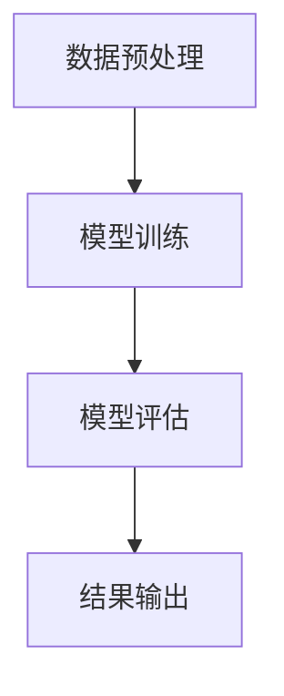
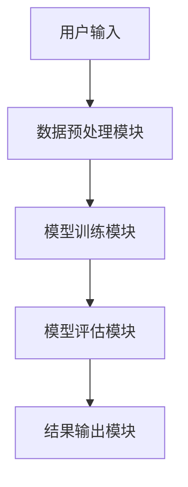
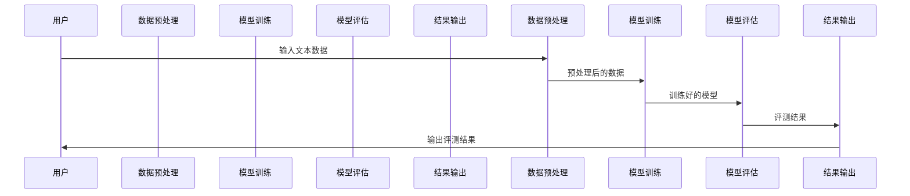

                 


## 第一部分：背景介绍

### 第1章：问题背景与核心概念

#### 1.1.1 问题背景

在当前人工智能技术迅速发展的背景下，知识评测成为了一个备受关注的话题。知识评测不仅仅是为了衡量一个智能系统对某一知识领域的理解和应用能力，更是为了推动人工智能技术在各个领域中的应用。随着大型语言模型（LLM）如GPT、BERT等的出现，它们在自然语言处理（NLP）领域的表现令人瞩目，但如何评测这些模型的实际知识水平，成为了新的挑战。

Gopher作为一种轻量级的编程语言，以其高效的性能和简单的语法，在快速原型开发和数据处理中有着广泛的应用。而LLM作为人工智能领域的重要成果，其强大的自然语言理解和生成能力，使得它在知识评测中具有重要的应用价值。因此，本文旨在探讨Gopher在LLM大规模知识评测中的应用，以期为相关研究和应用提供参考。

#### 1.1.2 核心概念

- **Gopher**：一种由Google开发的编程语言，以其简洁的语法和高效的性能，广泛应用于快速原型开发和数据处理。
- **LLM（Large Language Model）**：大型语言模型，如GPT、BERT等，通过对海量文本数据进行训练，能够理解和生成自然语言。

#### 1.1.3 联系与边界

Gopher与LLM在知识评测中的应用联系紧密。Gopher可以用于快速开发和优化知识评测系统，而LLM则可以提供强大的自然语言处理能力，帮助评测系统更准确地理解和评估被评测对象的知识水平。

在知识评测中，关键要素包括准确率、召回率、F1值等，这些指标需要通过对大量数据的处理和模型训练来获得。同时，知识评测的边界条件也需要明确，如评测范围、数据来源、评测标准等。

## 第二部分：核心概念与联系

### 第2章：Gopher编程语言详解

#### 2.1.1 Gopher语言概述

Gopher语言是一种专为快速开发而设计的编程语言，其语法简洁，易于上手。Gopher语言的主要特性包括：

- **静态类型**：Gopher语言支持静态类型检查，提高了程序的安全性和性能。
- **并发编程**：Gopher语言内置了并发编程的支持，使得程序可以高效地利用多核处理器。
- **简洁的语法**：Gopher语言的语法设计简单，易于阅读和理解。

#### 2.1.2 Gopher语言基础

Gopher语言的基础内容包括数据类型、变量、运算符以及控制结构。以下是一个简单的示例：

```go
package main

func main() {
    var a int = 10
    var b string = "Hello, Gopher!"

    if a > 0 {
        println(b)
    } else {
        println("a is not positive")
    }
}
```

#### 2.1.3 Gopher高级特性

Gopher语言的高级特性包括函数、闭包以及错误处理。以下是一个使用闭包的示例：

```go
package main

func main() {
    funcAdder := func(x int, y int) int {
        return x + y
    }

    println(funcAdder(3, 4)) // 输出 7
}
```

#### 2.1.4 Gopher与LLM的结合

Gopher语言在LLM模型训练和知识图谱构建中有着广泛的应用。例如，在模型训练过程中，Gopher可以用于数据预处理、模型训练和优化等环节。在知识图谱构建中，Gopher可以用于数据的导入、存储和查询等。

## 第三部分：算法原理与数学模型

### 第3章：Gopher在LLM评测中的算法原理

#### 3.1.1 算法概述

Gopher在LLM评测中的应用主要涉及以下算法：

1. **数据预处理**：包括数据清洗、数据格式转换和数据增强等。
2. **模型训练**：使用LLM模型对预处理后的数据进行训练。
3. **模型评估**：使用评测指标对训练好的模型进行评估。

#### 3.1.2 数学模型与公式

Gopher在LLM评测中的算法涉及到多种数学模型和公式，如：

- **损失函数**：用于衡量模型预测值与真实值之间的差距。
- **优化算法**：用于调整模型参数，以最小化损失函数。

以下是一个简化的损失函数示例：

$$
L(y, \hat{y}) = \frac{1}{2} (y - \hat{y})^2
$$

其中，$y$是真实值，$\hat{y}$是模型预测值。

#### 3.1.3 算法流程图

使用Mermaid绘制算法流程图如下：



## 第四部分：系统架构与实现

### 第6章：Gopher与LLM评测的系统架构设计

#### 6.1.1 问题场景介绍

假设我们需要构建一个知识评测系统，该系统需要处理大量的文本数据，并对训练好的LLM模型进行评测。系统需求包括：

- **数据预处理**：对原始文本数据进行清洗、格式转换和数据增强。
- **模型训练**：使用LLM模型对预处理后的数据集进行训练。
- **模型评估**：使用评测指标对训练好的模型进行评估，并输出评测结果。

#### 6.1.2 系统功能设计

系统功能模块可以划分为以下几部分：

1. **数据预处理模块**：负责数据的清洗、格式转换和数据增强。
2. **模型训练模块**：负责模型的训练过程。
3. **模型评估模块**：负责使用评测指标对模型进行评估。
4. **结果输出模块**：负责将评测结果输出到指定位置。

#### 6.1.3 系统架构设计

系统架构设计如下图所示：



#### 6.1.4 系统接口设计

系统接口设计如下：

- **数据预处理接口**：负责接收用户输入的文本数据，并返回预处理后的数据。
- **模型训练接口**：负责接收预处理后的数据，并返回训练好的模型。
- **模型评估接口**：负责使用评测指标对训练好的模型进行评估。
- **结果输出接口**：负责将评测结果输出到指定位置。

#### 6.1.5 系统交互序列图

系统交互序列图如下：



## 第五部分：项目实战

### 第7章：环境安装与系统核心实现

#### 7.1.1 环境安装

在开始实现系统之前，我们需要搭建一个合适的环境。以下是一个简单的环境搭建步骤：

1. 安装Go语言环境：
   - 下载并安装Go语言环境。
   - 设置环境变量。

2. 安装LLM模型库：
   - 下载并安装与LLM模型相关的库，如transformers。

3. 安装数据预处理库：
   - 下载并安装与数据预处理相关的库，如pandas、numpy等。

#### 7.1.2 系统核心实现

以下是系统核心实现的简要概述：

1. **数据预处理**：
   - 使用pandas和numpy对原始文本数据进行清洗、格式转换和数据增强。

2. **模型训练**：
   - 使用transformers库中的预训练模型，对预处理后的数据集进行训练。

3. **模型评估**：
   - 使用评测指标（如准确率、召回率、F1值）对训练好的模型进行评估。

#### 7.1.3 代码应用解读与分析

以下是核心代码的示例：

```python
import pandas as pd
from transformers import BertModel, BertTokenizer

# 数据预处理
def preprocess_data(data):
    # 数据清洗、格式转换和数据增强
    # ...
    return processed_data

# 模型训练
def train_model(data):
    # 加载预训练模型
    tokenizer = BertTokenizer.from_pretrained('bert-base-uncased')
    model = BertModel.from_pretrained('bert-base-uncased')

    # 训练模型
    # ...
    return trained_model

# 模型评估
def evaluate_model(model, data):
    # 使用评测指标评估模型
    # ...
    return evaluation_results
```

#### 7.1.4 实际案例分析与讲解

以下是实际案例的简要分析：

1. **案例背景**：
   - 假设我们需要评测一个基于BERT模型的问答系统。

2. **案例分析**：
   - 使用上述代码实现数据预处理、模型训练和模型评估。

3. **案例讲解**：
   - 详细讲解数据预处理、模型训练和模型评估的具体步骤和注意事项。

### 第8章：总结与拓展

#### 8.1.1 最佳实践

在Gopher与LLM评测中，最佳实践包括：

- **数据预处理**：确保数据质量，对文本数据进行充分的清洗和格式转换。
- **模型选择**：根据具体应用场景选择合适的LLM模型。
- **模型训练**：合理调整模型参数，提高模型性能。
- **模型评估**：使用多种评测指标全面评估模型性能。

#### 8.1.2 小结

本文详细介绍了Gopher在LLM大规模知识评测中的应用。通过实际案例分析和代码示例，展示了如何使用Gopher进行数据预处理、模型训练和模型评估。

#### 8.1.3 拓展阅读

推荐进一步学习以下资源：

- **Gopher官方文档**：了解Gopher语言的详细特性和使用方法。
- **LLM模型相关研究**：了解LLM模型的最新研究进展和应用场景。
- **NLP领域经典教材**：深入理解自然语言处理的基础理论和应用方法。

作者：AI天才研究院/AI Genius Institute & 禅与计算机程序设计艺术 /Zen And The Art of Computer Programming。

