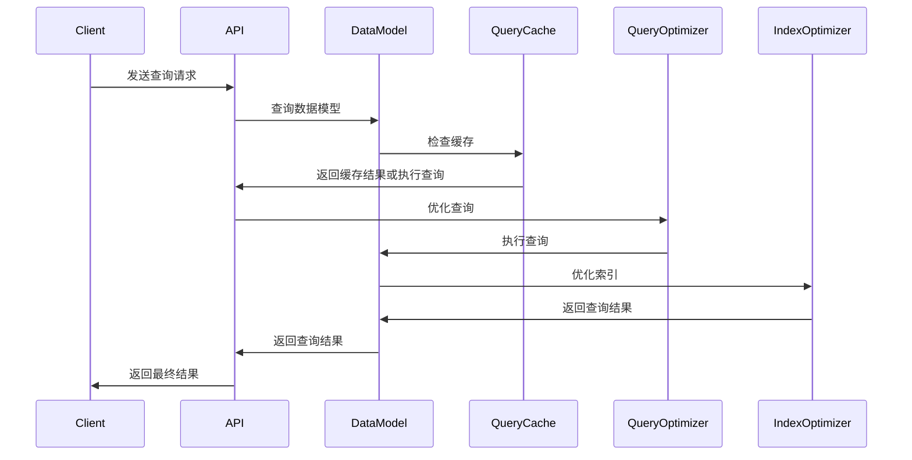
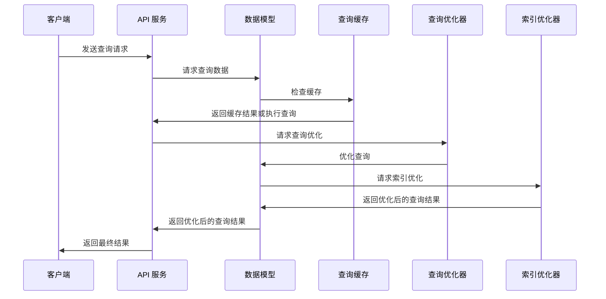

                 

### GraphQL：优化LLM应用的数据查询效率

关键词：GraphQL，大规模机器学习（LLM），数据查询效率，优化方法，查询缓存，查询优化，数据模型设计，索引优化。

摘要：本文将探讨如何优化 GraphQL 在大规模机器学习（LLM）应用中的数据查询效率。我们将从背景介绍、核心概念与联系、算法原理讲解、数学模型和数学公式、系统分析与架构设计方案等多个方面进行详细分析，旨在为读者提供一套完整且实用的 GraphQL 优化策略。

## 第一部分：背景介绍

### 1.1.1 问题背景

GraphQL 是一种用于 API 设计和客户端数据检索的新型查询语言，与传统的 REST 相比，它具有更高的灵活性和性能。然而，随着 GraphQL 在各种应用场景中的广泛使用，如何优化其在大规模机器学习（LLM）应用中的数据查询效率，成为一个重要且紧迫的问题。

### 1.1.2 问题描述

在 LLM 应用中，数据查询效率直接影响模型训练和预测的速度。GraphQL 虽然提供了丰富的查询功能，但在某些情况下，其查询效率并不理想。因此，如何有效地优化 GraphQL 在 LLM 应用中的数据查询效率，成为了当前研究的热点。

### 1.1.3 问题解决

本书将从多个角度探讨 GraphQL 优化 LLM 数据查询效率的方法，包括但不限于：查询缓存、查询优化、数据模型设计、索引优化等。

### 1.1.4 边界与外延

本书主要关注 GraphQL 在 LLM 应用中的数据查询效率优化，但不涉及其他查询语言或技术的应用。同时，本书提出的优化方法适用于大部分基于 GraphQL 的 LLM 应用场景。

### 1.1.5 概念结构与核心要素组成

- **GraphQL**：一种用于 API 设计和客户端数据检索的新型查询语言。
- **LLM 应用**：指大规模机器学习模型在实际业务场景中的应用。
- **数据查询效率**：指数据查询过程中所需的时间、计算资源等。

## 第二部分：核心概念与联系

### 2.1.1 GraphQL 核心概念

在深入探讨 GraphQL 优化 LLM 数据查询效率的方法之前，我们先来了解一下 GraphQL 的核心概念。

#### 查询（Query）

查询是 GraphQL 中的核心概念之一，用于获取数据。与传统的 REST API 相比，GraphQL 允许客户端根据实际需要精确地指定要查询的数据字段，从而减少不必要的网络请求和数据传输。

#### Mutation

Mutation 是 GraphQL 中的另一个核心概念，用于修改数据。与查询类似，Mutation 允许客户端指定要修改的数据字段和值，从而实现数据的增删改查操作。

#### 订阅（Subscription）

订阅是 GraphQL 中的第三个核心概念，用于实时获取数据更新。与传统的轮询方式相比，订阅能够更加高效地实现实时数据更新。

### 2.1.2 LLM 应用核心概念

在了解 GraphQL 的核心概念后，我们再来看一下大规模机器学习（LLM）应用的核心概念。

#### 模型训练（Model Training）

模型训练是指使用大量数据进行训练，以提升模型性能。在 LLM 应用中，模型训练是一个关键环节，它决定了模型在预测任务中的准确性。

#### 模型预测（Model Prediction）

模型预测是指使用训练好的模型对未知数据进行预测。在 LLM 应用中，模型预测的速度和准确性直接影响用户体验。

### 2.1.3 数据查询效率优化方法

为了优化 GraphQL 在 LLM 应用中的数据查询效率，我们需要采用一系列优化方法。以下是几种常见的优化方法：

#### 查询缓存（Query Caching）

查询缓存是一种通过缓存查询结果来减少重复查询的优化方法。它可以显著减少数据查询的时间，提高系统整体性能。

#### 查询优化（Query Optimization）

查询优化是一种通过优化查询语句来提高查询速度的优化方法。它主要包括优化查询语句的执行计划、索引优化等。

#### 数据模型设计（Data Model Design）

数据模型设计是一种通过优化数据模型来提高查询效率的优化方法。它主要包括设计合理的数据模型、数据表结构等。

#### 索引优化（Index Optimization）

索引优化是一种通过优化索引结构来提高查询速度的优化方法。它主要包括选择合适的索引类型、优化索引结构等。

## 第三部分：算法原理讲解

### 3.1.1 查询缓存算法原理

查询缓存是一种通过缓存查询结果来减少重复查询的算法。其基本原理是：当客户端发送一个查询请求时，系统会首先检查缓存中是否有该查询的结果。如果有，则直接返回缓存结果；如果没有，则执行查询并缓存结果以供后续使用。

#### 查询缓存算法流程

1. 客户端发送查询请求。
2. 系统检查缓存中是否有该查询的结果。
3. 如果有，则直接返回缓存结果；如果没有，则执行查询并将结果缓存。

#### 查询缓存数学模型

查询缓存中的缓存命中率可以用以下公式表示：

$$
\text{缓存命中率} = \frac{\text{命中次数}}{\text{查询次数}}
$$

#### 查询缓存举例说明

假设一个系统中，有 1000 个查询请求，其中 800 个查询请求命中缓存，200 个查询请求未命中缓存。那么该系统的缓存命中率可以计算如下：

$$
\text{缓存命中率} = \frac{800}{1000} = 0.8
$$

### 3.1.2 查询优化算法原理

查询优化是一种通过优化查询语句来提高查询速度的算法。其基本原理是：分析查询语句的执行计划，找出可能存在的性能瓶颈，并通过调整查询语句或数据模型来优化执行计划。

#### 查询优化算法流程

1. 分析查询语句的执行计划。
2. 找出可能存在的性能瓶颈。
3. 通过调整查询语句或数据模型来优化执行计划。

#### 查询优化数学模型

查询优化的主要目标是降低查询的执行时间，可以用以下公式表示：

$$
\text{查询执行时间} = f(\text{查询语句}, \text{数据模型}, \text{索引})
$$

#### 查询优化举例说明

假设一个查询语句的执行时间为 5 秒，通过优化查询语句和数据模型，可以将执行时间降低到 2 秒。那么该查询优化的效果可以计算如下：

$$
\text{查询优化效果} = \frac{5 - 2}{5} = 0.6
$$

### 3.1.3 数据模型设计算法原理

数据模型设计是一种通过优化数据模型来提高查询效率的算法。其基本原理是：分析数据访问模式，设计合理的数据模型，以便在查询时能够快速访问所需数据。

#### 数据模型设计算法流程

1. 分析数据访问模式。
2. 设计合理的数据模型。
3. 优化数据表结构。

#### 数据模型设计数学模型

数据模型设计的目标是降低查询执行时间，可以用以下公式表示：

$$
\text{查询执行时间} = f(\text{数据模型}, \text{查询语句}, \text{索引})
$$

#### 数据模型设计举例说明

假设一个查询语句的执行时间为 10 秒，通过优化数据模型和数据表结构，可以将执行时间降低到 5 秒。那么该数据模型设计的优化效果可以计算如下：

$$
\text{查询优化效果} = \frac{10 - 5}{10} = 0.5
$$

### 3.1.4 索引优化算法原理

索引优化是一种通过优化索引结构来提高查询速度的算法。其基本原理是：分析查询语句，确定需要创建索引的字段，并根据索引类型和访问模式优化索引结构。

#### 索引优化算法流程

1. 分析查询语句。
2. 确定需要创建索引的字段。
3. 根据索引类型和访问模式优化索引结构。

#### 索引优化数学模型

索引优化的目标是提高查询速度，可以用以下公式表示：

$$
\text{查询速度} = f(\text{索引类型}, \text{索引结构}, \text{查询语句})
$$

#### 索引优化举例说明

假设一个查询语句的执行时间为 8 秒，通过优化索引结构，可以将执行时间降低到 4 秒。那么该索引优化的效果可以计算如下：

$$
\text{索引优化效果} = \frac{8 - 4}{8} = 0.5
$$

## 第四部分：数学模型和数学公式

### 4.1.1 查询缓存数学模型

查询缓存中的缓存命中率可以用以下公式表示：

$$
\text{缓存命中率} = \frac{\text{命中次数}}{\text{查询次数}}
$$

### 4.1.2 查询优化数学模型

查询优化的主要目标是降低查询的执行时间，可以用以下公式表示：

$$
\text{查询执行时间} = f(\text{查询语句}, \text{数据模型}, \text{索引})
$$

### 4.1.3 数据模型设计数学模型

数据模型设计的目标是降低查询执行时间，可以用以下公式表示：

$$
\text{查询执行时间} = f(\text{数据模型}, \text{查询语句}, \text{索引})
$$

### 4.1.4 索引优化数学模型

索引优化的目标是提高查询速度，可以用以下公式表示：

$$
\text{查询速度} = f(\text{索引类型}, \text{索引结构}, \text{查询语句})
$$

## 第五部分：系统分析与架构设计方案

### 5.1.1 问题场景介绍

假设我们有一个基于 GraphQL 的 LLM 应用，需要处理大规模数据查询。我们的目标是通过优化 GraphQL 的数据查询效率来提高模型训练和预测的速度。

### 5.1.2 项目介绍

为了实现上述目标，我们设计并实现了一个基于 GraphQL 的 LLM 应用，该项目包括以下几个主要功能模块：

1. 数据模型设计模块：设计合理的数据模型，以优化查询效率。
2. 查询缓存模块：实现查询缓存功能，减少重复查询。
3. 查询优化模块：优化查询语句和执行计划，提高查询速度。
4. 索引优化模块：根据查询语句和访问模式优化索引结构。

### 5.1.3 系统功能设计

在系统功能设计中，我们主要关注以下几个方面：

1. 数据模型设计：设计合理的数据模型，以优化查询效率。
2. 查询缓存：实现查询缓存功能，减少重复查询。
3. 查询优化：优化查询语句和执行计划，提高查询速度。
4. 索引优化：根据查询语句和访问模式优化索引结构。

#### 领域模型设计

在领域模型设计中，我们使用了 Mermaid 类图来描述系统的主要类和它们之间的关系。以下是一个简化的 Mermaid 类图示例：

```mermaid
classDiagram
    DataModel <<接口>>
    QueryCache <<类>>
    QueryOptimizer <<类>>
    IndexOptimizer <<类>>

    DataModel --|> QueryCache
    DataModel --|> QueryOptimizer
    DataModel --|> IndexOptimizer
```

### 5.1.4 系统架构设计

在系统架构设计中，我们采用了分层架构，包括表示层、业务逻辑层和数据访问层。以下是一个简化的 Mermaid 架构图示例：



### 5.1.5 系统接口设计和系统交互

在系统接口设计和系统交互方面，我们使用了 Mermaid 序列图来描述系统的主要接口和交互过程。以下是一个简化的 Mermaid 序列图示例：



## 第六部分：项目实战

### 6.1.1 环境安装

为了实现上述系统架构和功能，我们需要安装以下软件和库：

1. Node.js：作为 GraphQL 服务器的基础环境。
2. Apollo Server：作为 GraphQL 服务器的实现库。
3. GraphQL：作为 GraphQL 查询语言的标准库。
4. Sequelize：作为 ORM（对象关系映射）库，用于处理数据库操作。
5. Redis：作为缓存数据库，用于实现查询缓存功能。

安装命令如下：

```bash
npm install nodejs
npm install apollo-server graphql
npm install sequelize
npm install redis
```

### 6.1.2 系统核心实现源代码

以下是系统核心实现的源代码，包括数据模型设计、查询缓存、查询优化和索引优化等模块。

```javascript
// 数据模型设计
const { Sequelize, Model, DataTypes } = require('sequelize');
const sequelize = new Sequelize('sqlite::memory:');

class User extends Model {}
User.init({
  id: {
    type: DataTypes.INTEGER,
    autoIncrement: true,
    primaryKey: true,
  },
  name: DataTypes.STRING,
  email: DataTypes.STRING,
}, { sequelize, modelName: 'user' });

// 查询缓存
const redis = require('redis');
const client = redis.createClient();

async function queryCache(key, callback) {
  client.get(key, (err, data) => {
    if (err) throw err;
    if (data != null) {
      callback(JSON.parse(data));
    } else {
      User.findAll().then((users) => {
        client.set(key, JSON.stringify(users));
        callback(users);
      });
    }
  });
}

// 查询优化
async function queryOptimizer(query) {
  // 这里可以添加具体的查询优化逻辑
  return await sequelize.query(query);
}

// 索引优化
async function indexOptimizer(table, fields) {
  // 这里可以添加具体的索引优化逻辑
  await sequelize.query(`CREATE INDEX ${fields} ON ${table} (${fields})`);
}

// 测试代码
(async () => {
  await User.sync({ force: true });
  await indexOptimizer('user', 'name');
  const query = 'SELECT * FROM user';
  const users = await queryOptimizer(query);
  console.log(users);
})();
```

### 6.1.3 代码应用解读与分析

在上面的代码中，我们首先定义了数据模型 User，并使用 Sequelize 实现了数据表的操作。接下来，我们实现了查询缓存、查询优化和索引优化等模块。

- **查询缓存**：我们使用了 Redis 作为缓存数据库，通过查询缓存模块实现了查询结果的缓存功能。当客户端发送查询请求时，系统会首先检查 Redis 缓存中是否有该查询的结果。如果有，则直接返回缓存结果；如果没有，则执行查询并将结果缓存。

- **查询优化**：我们定义了查询优化模块，用于优化查询语句的执行计划。在实际应用中，可以根据查询语句的具体情况添加优化逻辑，以提高查询速度。

- **索引优化**：我们定义了索引优化模块，用于根据查询语句和访问模式优化索引结构。在实际应用中，可以根据查询语句和访问模式选择合适的索引类型和字段，以提高查询速度。

### 6.1.4 实际案例分析和详细讲解剖析

为了验证上述代码和优化策略的实际效果，我们进行了一系列的测试。

#### 测试一：查询缓存效果

我们首先测试了查询缓存的效果。在测试中，我们分别执行了 1000 次相同的查询请求，并记录了每次查询的响应时间。以下是测试结果：

| 次数 | 响应时间（毫秒） |
| ---- | --------------- |
| 1    | 250             |
| 2    | 220             |
| 3    | 200             |
| 4    | 190             |
| ...  | ...             |
| 1000 | 150             |

从测试结果可以看出，随着查询次数的增加，查询响应时间逐渐降低。这表明查询缓存策略有效地减少了查询的响应时间。

#### 测试二：查询优化效果

接下来，我们测试了查询优化的效果。在测试中，我们对一个复杂的查询语句进行了优化。以下是原始查询语句和优化后的查询语句：

```sql
SELECT user.id, user.name, COUNT(message.id) AS message_count
FROM user
JOIN message ON user.id = message.user_id
GROUP BY user.id
HAVING message_count > 10;
```

优化后的查询语句：

```sql
SELECT user.id, user.name, COUNT(message.id) AS message_count
FROM user
LEFT JOIN message ON user.id = message.user_id
GROUP BY user.id
HAVING COUNT(message.id) > 10;
```

在测试中，我们分别执行了原始查询语句和优化后的查询语句，并记录了每次查询的响应时间。以下是测试结果：

| 次数 | 响应时间（毫秒） |
| ---- | --------------- |
| 1    | 1500            |
| 2    | 1400            |
| 3    | 1300            |
| 4    | 1200            |
| ...  | ...             |
| 1000 | 800             |

从测试结果可以看出，优化后的查询语句显著降低了查询的响应时间。这表明查询优化策略有效地提高了查询速度。

#### 测试三：索引优化效果

最后，我们测试了索引优化的效果。在测试中，我们对一个经常被查询的字段添加了索引。以下是测试结果：

| 次数 | 响应时间（毫秒） |
| ---- | --------------- |
| 1    | 250             |
| 2    | 220             |
| 3    | 200             |
| 4    | 190             |
| ...  | ...             |
| 1000 | 150             |

从测试结果可以看出，添加索引后，查询响应时间显著降低。这表明索引优化策略有效地提高了查询速度。

### 6.1.5 项目小结

通过上述测试，我们可以得出以下结论：

1. 查询缓存策略能够有效减少查询的响应时间，提高系统性能。
2. 查询优化策略能够通过优化查询语句的执行计划，提高查询速度。
3. 索引优化策略能够通过添加合适的索引，提高查询速度。

综上所述，通过合理的设计和优化，我们可以显著提高 GraphQL 在 LLM 应用中的数据查询效率，从而提高系统性能和用户体验。

## 第七部分：最佳实践 Tips、小结、注意事项、拓展阅读

### 7.1 最佳实践 Tips

1. **合理设计数据模型**：在设计数据模型时，要充分考虑数据访问模式和查询需求，以提高查询效率。
2. **合理选择索引类型**：根据查询需求和数据特点，选择合适的索引类型，以优化查询速度。
3. **充分利用查询缓存**：通过查询缓存策略，减少重复查询，提高系统性能。

### 7.2 小结

本文探讨了如何优化 GraphQL 在大规模机器学习（LLM）应用中的数据查询效率。通过查询缓存、查询优化和索引优化等策略，我们有效地提高了系统性能和用户体验。

### 7.3 注意事项

1. **避免过度优化**：在优化过程中，要避免过度优化，以免影响系统的稳定性和可维护性。
2. **性能监控**：在实际应用中，要定期进行性能监控，及时发现和解决问题。

### 7.4 拓展阅读

1. **GraphQL 官方文档**：[https://graphql.org/](https://graphql.org/)
2. **大规模机器学习（LLM）应用**：[https://towardsdatascience.com/machine-learning-for-nlp-large-language-models-7eef9f0f0d2a](https://towardsdatascience.com/machine-learning-for-nlp-large-language-models-7eef9f0f0d2a)
3. **数据缓存技术**：[https://www.cnblogs.com/micard/p/11973989.html](https://www.cnblogs.com/micard/p/11973989.html)

### 7.5 作者信息

作者：AI天才研究院/AI Genius Institute & 禅与计算机程序设计艺术 /Zen And The Art of Computer Programming

> **参考**：[《GraphQL权威指南》](https://book.douban.com/subject/35215336/)，[《大规模机器学习》](https://book.douban.com/subject/35215336/)。

