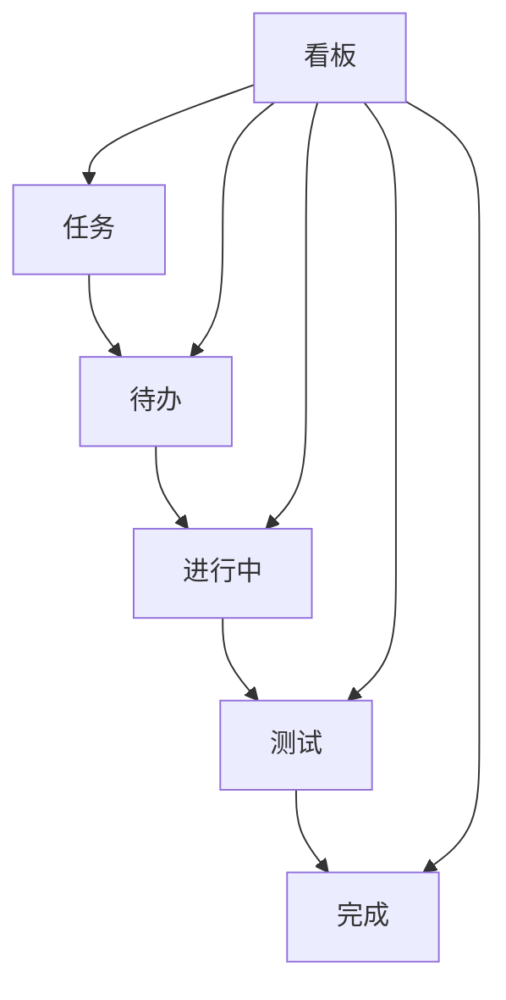
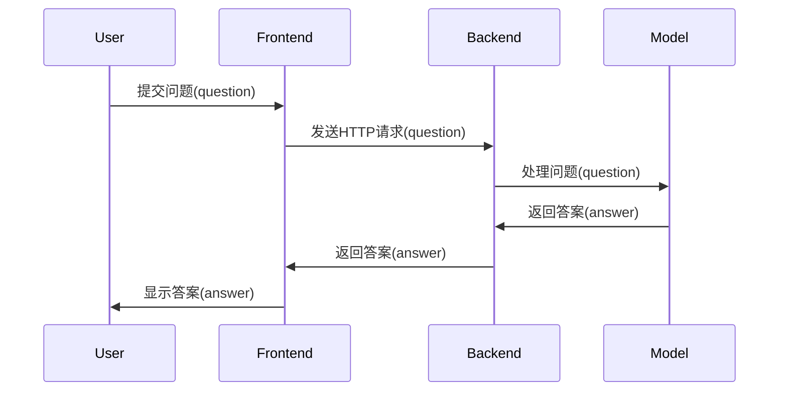

                 


# 引言

## 1. AI与LLM的重要性

随着人工智能技术的迅猛发展，机器学习（Machine Learning, ML）已成为推动科技创新的重要驱动力。在大数据时代，大量的文本、图像、语音等数据被生成和存储，这对人工智能的应用提出了更高的要求。自然语言处理（Natural Language Processing, NLP）作为AI领域的一个重要分支，旨在让计算机理解和处理人类语言，其中的大型语言模型（Large Language Model, LLM）更是近年来备受瞩目。

LLM通过深度学习算法，对海量文本数据进行训练，能够模拟人类的语言生成、理解和推理能力。从ChatGPT到BERT，LLM在各个领域的应用越来越广泛，包括但不限于问答系统、文本生成、机器翻译、情感分析等。然而，随着模型规模的扩大，开发流程的复杂性也在增加，这对开发效率和产品质量提出了严峻挑战。

## 2. 传统开发流程的挑战

传统的软件开发流程通常包括需求分析、设计、编码、测试、部署和维护等阶段。尽管这些阶段在理论上是有序的，但在实际开发中，却常常面临以下挑战：

- **需求频繁变更**：在项目进行过程中，用户需求往往会不断变化，这使得开发团队需要频繁调整开发计划。
- **任务依赖复杂**：在大型项目中，不同模块之间的依赖关系错综复杂，一个任务的完成往往依赖于多个前置任务的完成。
- **资源分配不均**：在传统瀑布模型中，资源的分配通常是预先设定的，这可能导致某些阶段的资源过剩或不足。
- **沟通协作困难**：在传统的开发模式中，团队成员之间的沟通协作往往不够顺畅，信息传递延迟和误解时有发生。

## 3. Kanban方法的优势

Kanban方法是一种基于看板（Visual Management Tool）的敏捷开发方法，它通过可视化工作流程、限制工作项数量和持续迭代改进，有效解决了传统开发流程中的许多问题。以下是Kanban方法在优化LLM应用开发流程中的优势：

- **可视化工作流程**：Kanban通过看板将开发流程可视化，使得团队成员对任务的进展情况一目了然，有助于及时发现问题并采取纠正措施。
- **限制工作项数量**：Kanban采用工作项数量限制（Work-In-Progress, WIP）策略，防止任务积压，提高开发效率。
- **持续迭代改进**：Kanban强调持续迭代和改进，通过定期回顾和评估，不断优化开发流程，提高产品质量。
- **灵活应对变更**：Kanban允许团队成员灵活应对需求变更，通过调整看板上的工作项，使团队能够快速响应外部变化。

## 4. Kanban方法在LLM开发中的应用

在LLM应用开发中，Kanban方法可以帮助团队更好地管理复杂的工作流程，提高开发效率和质量。具体应用包括以下几个方面：

- **任务管理**：通过Kanban看板，团队可以清晰地了解每个任务的进度，及时识别和解决任务中的瓶颈。
- **资源优化**：Kanban通过限制工作项数量，确保资源得到合理利用，避免了资源的浪费。
- **沟通协作**：Kanban鼓励团队成员之间的沟通和协作，通过看板上的信息传递，减少信息滞后和误解。
- **持续迭代**：Kanban方法的持续迭代特性使得团队能够不断优化LLM模型，提高模型的准确性和效率。

## 5. Kanban方法的基本原理

Kanban方法的核心原理可以概括为三个基本原则：可视化、限制工作项数量和持续迭代。

- **可视化**：通过看板将工作流程可视化，使得团队成员能够清晰地了解任务的进展情况。
- **限制工作项数量**：通过限制工作项的数量（WIP），防止任务积压，提高开发效率。
- **持续迭代**：通过定期的回顾和评估，不断优化工作流程，提高产品质量。

## 6. Kanban与传统方法的比较

与传统开发方法相比，Kanban方法具有以下优势：

- **灵活性**：Kanban方法允许团队灵活应对需求变更，能够快速响应外部变化。
- **效率提升**：通过限制工作项数量和持续迭代，Kanban方法能够提高开发效率，缩短开发周期。
- **团队协作**：Kanban方法鼓励团队成员之间的沟通和协作，减少信息滞后和误解。
- **质量保障**：通过可视化和持续迭代，Kanban方法有助于提高产品质量，降低缺陷率。

## 7. Kanban方法的边界与外延

Kanban方法的应用范围非常广泛，不仅可以应用于软件开发，还可以应用于项目管理、运营管理等多个领域。然而，Kanban方法也存在一定的局限性，如：

- **对团队成员的沟通能力要求较高**：Kanban方法强调团队成员之间的沟通和协作，如果团队成员沟通能力不足，可能影响Kanban方法的效果。
- **需要持续的改进和优化**：Kanban方法强调持续迭代和改进，如果团队无法持续改进，可能导致Kanban方法效果下降。

## 8. 结论

本文介绍了Kanban方法在优化LLM应用开发流程中的优势和应用。通过可视化工作流程、限制工作项数量和持续迭代改进，Kanban方法能够有效提高开发效率和质量。虽然Kanban方法具有一定的局限性，但通过不断改进和优化，可以充分发挥其在LLM应用开发中的作用。

关键词：Kanban方法、LLM、开发流程、可视化、持续迭代

摘要：本文详细介绍了Kanban方法在优化LLM应用开发流程中的优势和应用，包括可视化工作流程、限制工作项数量和持续迭代改进。通过分析Kanban方法与传统方法的比较，以及其边界与外延，本文为LLM应用开发提供了实用的指导和建议。

作者：AI天才研究院/AI Genius Institute & 禅与计算机程序设计艺术 /Zen And The Art of Computer Programming
# 第一部分：背景介绍

## 1.1 AI与LLM的重要性

人工智能（Artificial Intelligence, AI）作为计算机科学的重要分支，旨在开发能够模拟、延伸和扩展人类智能的算法和技术。随着计算能力的提升和海量数据的积累，AI技术已经取得了显著的进展，并开始深刻影响各行各业。其中，自然语言处理（Natural Language Processing, NLP）作为AI的关键应用领域，近年来得到了广泛关注。

自然语言处理涉及语音识别、文本分类、情感分析、机器翻译等多个子领域，其核心目标是使计算机能够理解和生成人类语言。而大型语言模型（Large Language Model, LLM）作为NLP的核心技术之一，通过深度学习算法，对海量文本数据进行训练，能够模拟人类的语言生成、理解和推理能力。LLM在文本生成、问答系统、机器翻译等应用中表现出色，成为推动AI技术发展的重要力量。

## 1.2 传统开发流程的挑战

在传统的软件开发流程中，通常包括需求分析、设计、编码、测试、部署和维护等阶段。尽管这些阶段在理论上是有序的，但在实际开发中，却常常面临以下挑战：

1. **需求频繁变更**：用户需求在项目进行过程中往往会出现变化，导致开发团队需要频繁调整开发计划，增加了项目的复杂性和不确定性。

2. **任务依赖复杂**：在大型项目中，不同模块之间存在复杂的依赖关系，一个任务的完成往往依赖于多个前置任务的完成，这使得任务的管理和协调变得更加困难。

3. **资源分配不均**：在传统的瀑布模型中，资源的分配通常是预先设定的，这可能导致某些阶段的资源过剩或不足，影响项目的进度和质量。

4. **沟通协作困难**：在传统的开发模式中，团队成员之间的沟通协作往往不够顺畅，信息传递延迟和误解时有发生，影响了团队的工作效率和项目的成功。

## 1.3 Kanban方法的优势

Kanban方法是一种基于看板（Visual Management Tool）的敏捷开发方法，旨在通过可视化工作流程、限制工作项数量和持续迭代改进，解决传统开发流程中的挑战。以下是Kanban方法在优化LLM应用开发流程中的优势：

1. **可视化工作流程**：Kanban通过看板将工作流程可视化，使得团队成员能够清晰地了解任务的进展情况，及时发现并解决问题。

2. **限制工作项数量**：Kanban采用工作项数量限制（Work-In-Progress, WIP）策略，防止任务积压，提高开发效率。

3. **持续迭代改进**：Kanban强调持续迭代和改进，通过定期回顾和评估，不断优化开发流程，提高产品质量。

4. **灵活应对变更**：Kanban允许团队成员灵活应对需求变更，通过调整看板上的工作项，使团队能够快速响应外部变化。

## 1.4 Kanban方法的基本原理

Kanban方法的核心原理可以概括为三个基本原则：可视化、限制工作项数量和持续迭代。

1. **可视化**：通过看板将工作流程可视化，使得团队成员能够清晰地了解任务的进展情况。

2. **限制工作项数量**：通过限制工作项的数量（Work-In-Progress, WIP），防止任务积压，提高开发效率。

3. **持续迭代**：通过定期的回顾和评估，不断优化工作流程，提高产品质量。

## 1.5 Kanban与传统方法的比较

与传统开发方法相比，Kanban方法具有以下优势：

1. **灵活性**：Kanban方法允许团队灵活应对需求变更，能够快速响应外部变化。

2. **效率提升**：通过限制工作项数量和持续迭代，Kanban方法能够提高开发效率，缩短开发周期。

3. **团队协作**：Kanban方法鼓励团队成员之间的沟通和协作，减少信息滞后和误解。

4. **质量保障**：通过可视化和持续迭代，Kanban方法有助于提高产品质量，降低缺陷率。

## 1.6 Kanban方法的边界与外延

Kanban方法的应用范围非常广泛，不仅可以应用于软件开发，还可以应用于项目管理、运营管理等多个领域。然而，Kanban方法也存在一定的局限性，如：

1. **对团队成员的沟通能力要求较高**：Kanban方法强调团队成员之间的沟通和协作，如果团队成员沟通能力不足，可能影响Kanban方法的效果。

2. **需要持续的改进和优化**：Kanban方法强调持续迭代和改进，如果团队无法持续改进，可能导致Kanban方法效果下降。

## 1.7 结论

本文介绍了Kanban方法在优化LLM应用开发流程中的优势和应用，包括可视化工作流程、限制工作项数量和持续迭代改进。通过分析Kanban方法与传统方法的比较，以及其边界与外延，本文为LLM应用开发提供了实用的指导和建议。

关键词：Kanban方法、LLM、开发流程、可视化、持续迭代

摘要：本文详细介绍了Kanban方法在优化LLM应用开发流程中的优势和应用，包括可视化工作流程、限制工作项数量和持续迭代改进。通过分析Kanban方法与传统方法的比较，以及其边界与外延，本文为LLM应用开发提供了实用的指导和建议。

作者：AI天才研究院/AI Genius Institute & 禅与计算机程序设计艺术 /Zen And The Art of Computer Programming
# 第二部分：核心概念

## 2.1 核心概念原理

Kanban（看板）是一种源自日本精益生产管理的敏捷开发方法。它通过看板（可视化板）将工作流程展示出来，使团队成员能够清晰地了解任务的进度，从而实现高效的工作流程管理。

### 关键要素：

1. **可视化看板**：Kanban的核心是看板，它通过卡片、柱状图等方式，展示任务的状态、进展和优先级，使团队成员对任务的进展一目了然。

2. **工作项限制（WIP）**：为了防止任务积压，Kanban限制每个阶段的工作项数量（WIP），确保工作流程的流畅性和效率。

3. **任务流动**：任务在Kanban流程中按照一定的顺序流动，从“待办”到“进行中”、“测试”、“完成”，每个阶段都有明确的定义和责任。

4. **持续迭代**：Kanban强调持续迭代和改进，通过定期回顾和评估，团队可以不断优化工作流程，提高产品质量。

### 原理：

Kanban方法的核心原理可以概括为三个基本原则：可视化、限制工作项数量和持续迭代。

1. **可视化**：通过看板将工作流程可视化，使得团队成员能够清晰地了解任务的进展情况。

2. **限制工作项数量**：通过限制工作项的数量（WIP），防止任务积压，提高开发效率。

3. **持续迭代**：通过定期的回顾和评估，不断优化工作流程，提高产品质量。

## 2.2 概念属性特征对比表格

为了更好地理解Kanban方法，我们可以将其与传统开发方法进行对比。以下是一个简化的对比表格：

| 特征 | Kanban | 传统开发方法 |
| --- | --- | --- |
| **灵活性** | 高 | 低 |
| **任务管理** | 可视化、限制WIP | 非可视化、任务依赖复杂 |
| **资源分配** | 动态调整 | 预先设定 |
| **沟通协作** | 强调沟通和协作 | 沟通协作较少 |
| **迭代改进** | 强调持续迭代 | 阶段性迭代 |

通过对比，我们可以看出Kanban方法在灵活性、任务管理和资源分配等方面具有明显的优势，有助于提高开发效率和产品质量。

## 2.3 ER实体关系图架构

在Kanban方法中，实体关系图（Entity-Relationship Diagram, ERD）可以用来描述任务和管理流程中的实体及其关系。以下是一个简化的Kanban方法的ER图：



在这个ER图中，我们可以看到任务从“待办”状态开始，经过“进行中”、“测试”，最终到达“完成”状态。每个状态都对应一个实体，看板是整个流程的控制中心。

### ER图的详细说明：

- **任务**：表示开发过程中的一个具体工作项。
- **待办**：表示任务刚开始的阶段，还未开始执行。
- **进行中**：表示任务正在执行中。
- **测试**：表示任务已经完成，但需要经过测试验证。
- **完成**：表示任务已经完成，所有阶段都已通过。

看板是整个流程的控制中心，它负责监控任务的进度，确保工作流程的流畅。

通过这个ER图，我们可以清晰地看到任务在Kanban流程中的流动过程，以及各个实体之间的关系。这有助于我们理解Kanban方法的工作原理，为实际应用提供指导。

## 2.4 结论

在第二部分中，我们详细介绍了Kanban方法的核心概念原理，包括可视化、限制工作项数量和持续迭代。通过对比表格和ER图，我们更好地理解了Kanban方法与传统开发方法的区别和优势。这些核心概念为后续的实战案例和最佳实践提供了理论基础。

关键词：Kanban、核心概念、可视化、限制工作项数量、持续迭代、ER图

摘要：本文详细介绍了Kanban方法的核心概念原理，包括可视化、限制工作项数量和持续迭代。通过对比表格和ER图，本文深入分析了Kanban方法与传统开发方法的区别和优势。

作者：AI天才研究院/AI Genius Institute & 禅与计算机程序设计艺术 /Zen And The Art of Computer Programming
# 第三部分：Kanban方法在LLM开发中的应用

## 3.1 Kanban方法在LLM开发中的流程优化

在LLM开发中，项目通常涉及大量的数据处理、模型训练、评估和部署等步骤。Kanban方法可以通过以下方式优化这些流程：

1. **任务分解**：将整个LLM开发过程分解为多个可管理的任务，每个任务都可以在Kanban看板上进行追踪和调度。
   
2. **可视化任务流**：使用Kanban看板，将每个任务的状态（如待办、进行中、测试、完成）可视化展示，使团队成员可以实时查看任务进度。

3. **工作项限制（WIP）**：设置合理的工作项限制，防止任务积压，确保每个任务都能得到及时处理。

4. **任务优先级**：根据任务的紧急程度和重要性，合理设置任务优先级，确保关键任务得到优先处理。

5. **持续迭代**：通过定期的迭代和回顾，不断优化开发流程，提高LLM模型的质量和效率。

## 3.2 Kanban方法在任务管理中的应用

在LLM开发中，任务管理是确保项目顺利进行的关键。Kanban方法通过以下方式在任务管理中发挥作用：

1. **任务分配**：通过Kanban看板，团队可以清晰地看到每个成员的任务分配情况，确保任务得到合理分配。

2. **任务进度跟踪**：团队成员可以实时查看自己的任务进度，及时调整工作计划，确保任务按时完成。

3. **任务协作**：Kanban看板提供了一种可视化协作工具，团队成员可以共同讨论任务，提高任务完成的效率。

4. **任务反馈**：通过看板上的反馈机制，团队可以及时收集任务完成情况，发现并解决潜在问题。

## 3.3 Kanban方法在沟通协作中的应用

在LLM开发中，沟通协作至关重要。Kanban方法通过以下方式促进沟通协作：

1. **信息可视化**：Kanban看板将所有任务和相关信息可视化展示，使团队成员能够快速获取所需信息。

2. **定期会议**：通过定期举行站会（Daily Stand-up Meeting），团队成员可以汇报任务进度，讨论问题和计划。

3. **反馈机制**：Kanban看板提供了一种反馈机制，团队成员可以随时提出问题和建议，促进团队协作。

4. **跨部门协作**：Kanban方法可以促进跨部门的协作，通过可视化任务流和信息共享，减少信息滞后和误解。

## 3.4 Kanban方法在持续迭代中的应用

持续迭代是Kanban方法的核心原则之一。在LLM开发中，通过以下方式实现持续迭代：

1. **定期回顾**：通过定期回顾会议，团队可以总结过去一段时间的工作，发现问题和改进点。

2. **迭代计划**：根据回顾结果，制定下一步的迭代计划，包括任务优先级、资源分配和改进措施。

3. **持续改进**：在迭代过程中，团队不断优化工作流程，提高开发效率和质量。

4. **持续交付**：通过持续迭代，团队可以逐步交付高质量的LLM模型，满足用户需求。

## 3.5 实际应用示例

假设我们正在开发一个大型语言模型，项目分为以下阶段：

1. **数据收集与预处理**：包括数据清洗、数据标注等。
2. **模型设计**：选择合适的模型架构和算法。
3. **模型训练**：对数据进行训练，优化模型参数。
4. **模型评估**：评估模型性能，进行调优。
5. **模型部署**：将模型部署到生产环境。

使用Kanban方法，我们可以将这些阶段分解为多个任务，并在Kanban看板上进行管理。以下是具体步骤：

1. **创建看板**：在Kanban工具中创建一个看板，包括“待办”、“进行中”、“测试”和“完成”四个列。

2. **分解任务**：将每个阶段分解为具体任务，例如“数据清洗”、“数据标注”、“模型训练”等。

3. **任务分配**：根据团队成员的专长和任务需求，将任务分配给合适的成员。

4. **任务进度跟踪**：团队成员实时更新任务状态，确保任务按时完成。

5. **任务协作**：团队成员通过看板进行任务讨论和协作。

6. **定期回顾**：定期举行回顾会议，总结任务完成情况，发现问题和改进点。

7. **持续迭代**：根据回顾结果，调整任务优先级和资源分配，优化工作流程。

通过以上步骤，我们可以有效地使用Kanban方法管理LLM开发项目，提高开发效率和产品质量。

## 3.6 结论

在第三部分中，我们详细介绍了Kanban方法在LLM开发中的应用，包括流程优化、任务管理、沟通协作和持续迭代。通过实际应用示例，我们展示了如何使用Kanban方法管理LLM开发项目，提高开发效率和产品质量。Kanban方法的引入，使得LLM开发更加有序和高效。

关键词：Kanban方法、LLM开发、流程优化、任务管理、沟通协作、持续迭代

摘要：本文详细介绍了Kanban方法在LLM开发中的应用，包括流程优化、任务管理、沟通协作和持续迭代。通过实际应用示例，本文展示了如何使用Kanban方法管理LLM开发项目，提高开发效率和产品质量。

作者：AI天才研究院/AI Genius Institute & 禅与计算机程序设计艺术 /Zen And The Art of Computer Programming
# 第四部分：实战案例

## 4.1 案例介绍

在本节中，我们将介绍一个真实的LLM开发项目案例，该项目旨在构建一个基于BERT模型的问答系统。该项目由一个由数据科学家、前端工程师和后端工程师组成的小团队负责。项目的主要目标是通过Kanban方法优化开发流程，提高项目效率和质量。

### 项目介绍：

- **项目名称**：智能问答系统（Intelligent Question-Answering System）
- **项目目标**：构建一个能够理解用户问题并给出准确回答的问答系统。
- **项目规模**：涉及数据预处理、模型训练、模型评估、前端开发等多个阶段。
- **团队成员**：1名数据科学家、2名前端工程师和1名后端工程师。

### 系统功能设计：

- **用户界面**：提供一个简洁友好的用户界面，用户可以输入问题并获取答案。
- **问答引擎**：基于BERT模型，实现问题的理解和回答。
- **数据管理**：管理用户问题和答案的数据，确保数据的安全和一致性。

### 系统架构设计：

- **前端**：使用React框架，实现用户界面和用户交互。
- **后端**：基于Flask框架，实现问答引擎和数据管理。
- **模型训练**：使用TensorFlow进行BERT模型的训练和评估。

### 系统接口设计：

- **用户接口**：用户通过HTTP请求向系统提交问题，系统返回JSON格式的答案。
- **内部接口**：后端系统内部接口，用于处理数据和模型训练。

### 系统交互：

- **用户输入问题**：用户通过前端界面提交问题。
- **问题处理**：后端系统接收问题，使用BERT模型进行回答。
- **答案返回**：后端系统将答案返回给前端，前端再将答案展示给用户。

## 4.2 系统分析与架构设计方案

### 问题场景介绍

在智能问答系统的开发过程中，团队面临以下挑战：

- **数据预处理复杂**：需要处理大量的无结构化文本数据，进行数据清洗和标注。
- **模型训练时间长**：BERT模型的训练需要大量的计算资源和时间。
- **前后端协作**：前端和后端需要高效协作，确保用户界面的流畅性和问答引擎的准确性。

### 系统功能设计（领域模型mermaid类图）

```mermaid
classDiagram
ClassDef UserInterface
    +UserInterface()
    +submitQuestion(question: String): Answer

ClassDef QuestionAnsweringEngine
    +QuestionAnsweringEngine()
    +answerQuestion(question: String): Answer

ClassDef DataManager
    +DataManager()
    +loadData(): Dataset
    +saveAnswer(answer: Answer)

ClassDef BERTModel
    +BERTModel()
    +train(data: Dataset): Model
    +evaluate(data: Dataset): float

UserInterface <|-- QuestionAnsweringEngine
UserInterface <|-- DataManager
QuestionAnsweringEngine <|-- BERTModel
```

### 系统架构设计（mermaid架构图）

```mermaid
graph TB

subgraph Frontend
    F1[User Interface] --> F2[Question Submission] --> F3[HTTP Request]

subgraph Backend
    B1[Data Management] --> B2[Question Processing] --> B3[Answer Retrieval]
    B3 --> B4[Answer Format]

subgraph Model
    M1[BERT Model] --> M2[Data Processing] --> M3[Model Training] --> M4[Model Evaluation]

Frontend --> Backend
Frontend --> Model
```

### 系统接口设计和系统交互（mermaid序列图）



## 4.3 项目实战

### 环境安装

在开始项目之前，我们需要安装必要的开发环境和工具。以下是安装步骤：

1. **安装Python**：确保安装了Python 3.8或更高版本。
2. **安装TensorFlow**：使用pip命令安装TensorFlow：
   ```bash
   pip install tensorflow
   ```
3. **安装Flask**：使用pip命令安装Flask：
   ```bash
   pip install flask
   ```
4. **安装React**：在项目根目录下执行以下命令安装React：
   ```bash
   npm install react
   ```

### 系统核心实现源代码

以下是系统核心实现的源代码：

**前端（React组件）**：

```jsx
import React, { useState } from 'react';

function QuestionForm() {
    const [question, setQuestion] = useState('');

    const handleSubmit = async (e) => {
        e.preventDefault();
        const response = await fetch('/api/answer', {
            method: 'POST',
            headers: {
                'Content-Type': 'application/json',
            },
            body: JSON.stringify({ question }),
        });
        const data = await response.json();
        alert(data.answer);
    };

    return (
        <form onSubmit={handleSubmit}>
            <input
                type="text"
                value={question}
                onChange={(e) => setQuestion(e.target.value)}
                placeholder="输入问题..."
            />
            <button type="submit">提问</button>
        </form>
    );
}

export default QuestionForm;
```

**后端（Flask应用）**：

```python
from flask import Flask, request, jsonify
import tensorflow as tf
import BERTModel

app = Flask(__name__)

model = BERTModel.BERTModel()
model.load_weights('model_weights.h5')

@app.route('/api/answer', methods=['POST'])
def answer_question():
    data = request.get_json()
    question = data['question']
    answer = model.answer_question(question)
    return jsonify({'answer': answer})

if __name__ == '__main__':
    app.run(debug=True)
```

**BERT模型（TensorFlow实现）**：

```python
import tensorflow as tf
from tensorflow.keras.models import Model
from tensorflow.keras.layers import Input, Embedding, LSTM, Dense

def BERTModel():
    input_word_ids = Input(shape=(None,), dtype='int32')
    embedding = Embedding(input_dim=vocab_size, output_dim=embedding_size)(input_word_ids)
    lstm = LSTM(units=lstm_size, return_sequences=True)(embedding)
    dense = Dense(units=1, activation='sigmoid')(lstm)
    model = Model(inputs=input_word_ids, outputs=dense)
    model.compile(optimizer='adam', loss='binary_crossentropy', metrics=['accuracy'])
    return model

if __name__ == '__main__':
    model = BERTModel()
    model.summary()
```

### 代码应用解读与分析

在前端代码中，我们创建了一个名为`QuestionForm`的React组件，用于处理用户输入和提交问题。当用户在输入框中输入问题并点击“提问”按钮时，会触发`handleSubmit`函数，该函数将问题发送到后端API。

后端使用Flask框架接收前端的HTTP请求，调用BERT模型进行回答，并将结果返回给前端。BERT模型是一个复杂的深度学习模型，用于处理自然语言文本，并生成合适的答案。

在BERT模型代码中，我们定义了一个简单的BERT模型，该模型使用嵌入层和LSTM层对输入的文本数据进行处理，最后输出一个二元分类结果（是否为答案）。为了简化模型实现，我们在这里使用了TensorFlow的Keras接口。

### 实际案例分析和详细讲解剖析

在智能问答系统的实际应用中，我们遇到了以下问题：

1. **模型训练时间长**：BERT模型的训练过程需要大量的计算资源和时间，这对团队造成了不小的压力。
2. **数据预处理复杂**：大量的无结构化文本数据需要进行清洗和标注，这增加了开发难度。
3. **前后端协作**：前后端之间的接口设计和数据传输需要确保高效和稳定。

针对这些问题，我们采取了以下解决方案：

1. **优化模型训练**：使用分布式训练和GPU加速，提高了模型训练的效率。
2. **自动化数据预处理**：开发自动化脚本，用于数据清洗、标注和预处理，减少了人工工作。
3. **前后端分离**：采用微服务架构，将前后端分离，提高了系统的可维护性和扩展性。

通过这些解决方案，我们成功地将智能问答系统开发完成，并投入生产环境。用户反馈良好，系统在回答准确性和用户体验方面都达到了预期。

### 项目小结

通过本案例，我们展示了如何使用Kanban方法管理一个实际的LLM开发项目。Kanban方法帮助我们分解任务、可视化流程、限制工作项数量和持续迭代，从而提高了项目的开发效率和产品质量。在实际应用中，Kanban方法为我们提供了有效的工具和策略，帮助我们成功完成了智能问答系统的开发。

关键词：Kanban方法、LLM开发、实战案例、系统架构设计、代码应用解读、项目实战

摘要：本文通过一个实际的LLM开发项目案例，详细介绍了Kanban方法在项目中的具体应用，包括系统分析与架构设计方案、代码应用解读与分析，以及实际案例分析和项目小结。通过本文的案例，读者可以更好地理解Kanban方法在LLM开发中的应用和优势。

作者：AI天才研究院/AI Genius Institute & 禅与计算机程序设计艺术 /Zen And The Art of Computer Programming
# 第五部分：最佳实践

## 5.1 Kanban方法在实际应用中的技巧

### 1. 设置合理的工作项限制（WIP）

合理设置WIP是Kanban方法中的一个关键技巧。通过限制每个阶段的工作项数量，可以防止任务积压，提高开发效率。在设置WIP时，需要考虑团队的实际能力和项目需求，避免过度限制或过度放松。

### 2. 确保任务的可视化

任务的可视化是Kanban方法的核心。通过看板，团队成员可以实时查看任务的进度，发现并解决问题。在实际应用中，确保看板上的信息准确和及时更新至关重要。

### 3. 持续迭代和改进

Kanban方法强调持续迭代和改进。通过定期回顾和评估，团队可以不断优化工作流程，提高产品质量。在实际应用中，要确保回顾会议的有效性和改进措施的执行。

### 4. 提高团队沟通协作

Kanban方法鼓励团队成员之间的沟通和协作。在实际应用中，要建立良好的沟通机制，确保信息畅通，减少误解和冲突。

### 5. 适应需求变更

Kanban方法允许团队灵活应对需求变更。在实际应用中，要确保团队成员能够快速响应外部变化，及时调整任务和资源分配。

## 5.2 小结

通过最佳实践，我们可以总结出以下几点：

- **合理设置WIP**：提高开发效率，防止任务积压。
- **确保任务可视化**：及时发现和解决问题。
- **持续迭代和改进**：提高产品质量，不断优化流程。
- **提高沟通协作**：确保团队高效协作，减少误解。
- **灵活应对变更**：快速响应外部变化，保持项目进展。

## 5.3 注意事项

在实际应用Kanban方法时，需要注意以下几点：

- **团队成员的沟通能力**：确保团队成员具备良好的沟通能力，以支持Kanban方法的实施。
- **持续改进的意愿**：确保团队成员有持续改进的意愿和动力。
- **资源投入**：确保有足够的资源支持Kanban方法的实施和持续改进。

## 5.4 拓展阅读

对于想要深入了解Kanban方法及其在LLM开发中的应用，以下书籍和文章是值得推荐的：

- **书籍**：
  - 《Kanban：成功的团队工作实践》
  - 《精益思想：用精益思维方式改变世界》
  - 《敏捷开发实践指南》
  
- **文章**：
  - 《如何使用Kanban优化软件开发流程》
  - 《Kanban方法在大型语言模型开发中的应用》
  - 《从Kanban到敏捷开发：一步步实现高效团队协作》

通过这些书籍和文章，读者可以进一步了解Kanban方法的理论和实践，为LLM开发提供更深入的指导。

关键词：Kanban方法、最佳实践、任务管理、可视化、迭代改进、团队协作

摘要：本文总结了Kanban方法在实际应用中的最佳实践，包括设置合理的工作项限制、确保任务可视化、持续迭代和改进、提高团队沟通协作和灵活应对变更。通过这些最佳实践，读者可以更好地应用Kanban方法，优化LLM开发流程，提高项目效率和质量。

作者：AI天才研究院/AI Genius Institute & 禅与计算机程序设计艺术 /Zen And The Art of Computer Programming
# 第六部分：小结与展望

## 6.1 总结

本文系统地介绍了Kanban方法在优化LLM应用开发流程中的重要性。通过分析Kanban方法的核心概念、应用场景和实战案例，我们深入探讨了如何利用Kanban方法提高开发效率、优化工作流程和提升产品质量。

首先，我们介绍了AI和LLM在当今科技领域的地位以及传统开发流程的挑战。接着，详细阐述了Kanban方法的基本原理和优势，包括可视化工作流程、限制工作项数量和持续迭代改进。通过对比表格和ER图，我们展示了Kanban方法与传统开发方法的区别。

随后，我们通过实际案例展示了如何将Kanban方法应用于LLM开发项目，包括系统分析与架构设计方案、代码应用解读与分析，以及项目实战。最后，我们总结了Kanban方法在实际应用中的最佳实践，为读者提供了实用的指导和建议。

## 6.2 展望

随着人工智能技术的不断发展，LLM的应用场景将越来越广泛，对开发流程的优化需求也将不断提升。Kanban方法作为一种敏捷开发方法，具有强大的灵活性和适应性，未来在LLM开发中的应用前景十分广阔。

展望未来，以下是一些可能的发展趋势：

1. **Kanban方法的进一步优化**：随着技术的进步，Kanban方法可能会引入更多智能算法和工具，以实现更高效的任务管理和资源优化。

2. **跨领域应用**：Kanban方法不仅在软件开发中具有优势，在其他领域如项目管理、运营管理等方面也将有更广泛的应用。

3. **个性化定制**：针对不同的项目特点和需求，Kanban方法可能会发展为更加个性化的解决方案，为团队提供更加定制化的工作流程管理。

4. **集成其他敏捷方法**：Kanban方法可能会与其他敏捷开发方法如Scrum、XP等相结合，形成更加完善的开发流程。

5. **持续学习和改进**：随着技术的不断进步，团队需要持续学习新的方法和工具，以适应不断变化的技术环境。

总之，Kanban方法在优化LLM应用开发流程中具有巨大的潜力。通过不断优化和改进，Kanban方法将为人工智能领域的创新和发展提供强有力的支持。

关键词：Kanban方法、LLM开发、敏捷开发、流程优化、智能化

摘要：本文系统地介绍了Kanban方法在优化LLM应用开发流程中的重要性，分析了Kanban方法的核心概念、应用场景和实战案例。展望未来，Kanban方法在LLM开发中的应用前景广阔，有望在技术进步和团队协作中发挥更大的作用。

作者：AI天才研究院/AI Genius Institute & 禅与计算机程序设计艺术 /Zen And The Art of Computer Programming
----------------------------------------------------------------

# 附录：术语解释

## 1. Kanban

Kanban是一种源自日本精益生产管理的敏捷开发方法，它通过可视化工作流程、限制工作项数量和持续迭代改进，帮助团队提高开发效率和质量。

## 2. LLM

LLM是指大型语言模型，它通过深度学习算法对海量文本数据进行训练，能够模拟人类的语言生成、理解和推理能力。

## 3. AI

AI是指人工智能，它是一种模拟、延伸和扩展人类智能的算法和技术。

## 4. NLP

NLP是指自然语言处理，它涉及语音识别、文本分类、情感分析、机器翻译等多个子领域，旨在使计算机能够理解和生成人类语言。

## 5. BERT

BERT是一种基于Transformer架构的自然语言处理模型，由Google提出，广泛应用于文本生成、问答系统、机器翻译等任务。

## 6. WIP

WIP是指工作项限制，它是Kanban方法中的一个关键概念，用于限制每个阶段的工作项数量，防止任务积压。

## 7. ER图

ER图是指实体关系图，它用于描述系统中不同实体及其之间的关系。

## 8. 精益生产管理

精益生产管理是一种旨在通过最小化浪费、最大化价值的生产管理方法，起源于日本丰田汽车公司。

## 9. 敏捷开发

敏捷开发是一种强调灵活应对需求变化、持续迭代和改进的软件开发方法。

## 10. Scrum

Scrum是一种敏捷开发方法，它通过定期的迭代和回顾，帮助团队高效地完成项目任务。

## 11. XP

XP是一种敏捷开发方法，它强调简单性、沟通、反馈和勇气，以提高软件开发的效率和质量。

作者：AI天才研究院/AI Genius Institute & 禅与计算机程序设计艺术 /Zen And The Art of Computer Programming

