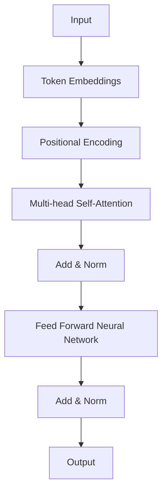
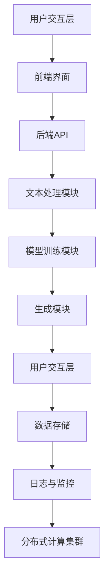

                 

----------------------------------------------------------------
# LLMA prompt协同创作平台

关键词：LLM，prompt工程，协同创作，平台设计，应用案例

摘要：本文将探讨如何设计一个基于大型语言模型（LLM）的prompt协同创作平台。我们将从LLM的基本原理、prompt设计原则、平台架构和工具集成、实际应用、高级优化到案例分析等方面，逐步解析这一创新的创作平台。

----------------------------------------------------------------
## 1.1 什么是LLM

大型语言模型（Large Language Model，简称LLM）是一种深度学习模型，主要用于处理和生成自然语言文本。与传统的规则驱动的方法不同，LLM通过学习海量的文本数据，能够理解复杂的语言结构和语义信息。LLM的核心在于其“大规模”——这些模型通常包含数十亿甚至数万亿个参数，这使得它们能够捕捉到文本数据中的细微模式和关联。

LLM的基本原理可以追溯到神经网络和自然语言处理（NLP）领域。早期的NLP方法依赖于规则和统计模型，如TF-IDF和朴素贝叶斯分类器。然而，这些方法在处理复杂语境和多义词时存在明显的局限性。随着深度学习的兴起，基于神经网络的模型如循环神经网络（RNN）、长短期记忆网络（LSTM）和变压器（Transformer）模型开始被广泛应用于NLP任务。

特别是Transformer模型的出现，使得LLM取得了显著的进展。Transformer模型采用自注意力机制（Self-Attention），能够捕捉到输入序列中的长距离依赖关系，从而在许多NLP任务中取得了前所未有的性能。BERT、GPT和T5等著名模型都是基于Transformer架构，它们通过预训练和微调，能够针对各种任务生成高质量的文本。

以下是一个简单的Transformer模型的mermaid流程图：



这个流程图展示了Transformer模型的基本步骤：输入文本被转换为词嵌入和位置编码，然后通过多层自注意力机制和前馈神经网络进行加工，最终输出预测的文本序列。

## 1.2 基础Prompt工程

Prompt工程是设计能够引导LLM生成所需输出的提示或引导文本。有效的Prompt设计能够显著提升LLM的性能和生成质量。以下是Prompt工程的基本概念和方法：

### 1.2.1 提示类型

Prompt可以分为以下几种类型：

- **模板型Prompt**：通过预定义的模板来引导生成。例如，"请写一篇关于XX的短文，要求..."。
- **数据驱动型Prompt**：使用具体的输入数据来引导生成，如一个句子、一个段落或一个文档。
- **问题回答型Prompt**：以问题的形式来引导生成答案，如"XX是什么意思？"。
- **自由生成型Prompt**：允许用户自由输入提示，让LLM自行生成内容。

### 1.2.2 提示设计原则

有效的Prompt设计应遵循以下原则：

- **清晰性**：Prompt应该明确表达用户的意图和期望，避免模糊不清。
- **具体性**：Prompt应提供足够的具体信息，以便LLM能够生成相关且精确的内容。
- **适应性**：Prompt设计应考虑到LLM的不同能力和限制，以便进行适当的调整。

### 1.2.3 提示示例

以下是一个简单的Prompt示例：

```
请写一段关于人工智能在医疗领域的应用的短文，要求包含以下要点：
1. 诊断辅助
2. 治疗建议
3. 疾病预测
4. 数据分析
```

## 1.3 提示在创作中的角色

Prompt在创作中的作用至关重要。通过精心设计的Prompt，用户可以引导LLM生成各种类型的文本，如故事、文章、诗歌等。以下是一些具体的应用场景：

- **故事创作**：用户可以输入故事的开头、中间或结尾，让LLM继续创作。
- **文章撰写**：用户可以提供主题和关键信息，LLM则生成详细的文章内容。
- **诗歌生成**：用户输入几个关键词或短语，LLM则创作一首符合主题的诗歌。

在接下来的章节中，我们将深入探讨LLM prompt协同创作平台的架构设计、工具集成、实际应用和高级优化等技术细节。通过这些章节，读者将了解到如何构建一个高效、灵活且易于使用的prompt协同创作平台。----------------------------------------------------------------
## 2. LLM prompt设计原则

设计一个高效、灵活且易于使用的LLM prompt协同创作平台，关键在于如何设计和优化Prompt。有效的Prompt设计不仅能提升LLM的生成质量，还能确保创作过程更加顺畅和高效。以下是一些核心原则和技巧：

### 2.1 清晰性原则

清晰性是设计Prompt时最基本的原则。一个清晰的Prompt能够明确传达用户的意图和期望，避免模糊和歧义。以下是确保Prompt清晰性的几个要点：

- **明确任务目标**：Prompt应清楚地指明要完成的任务目标，例如生成文章、故事或诗歌。
- **具体信息提供**：提供足够的具体信息，帮助LLM生成相关且精确的内容。例如，如果要求写一篇关于“人工智能在医疗领域的应用”的文章，可以具体列出要涵盖的要点。
- **消除歧义**：避免使用可能导致歧义的词语或短语。例如，使用“请描述人工智能在医疗诊断中的应用”而不是“请描述人工智能在医疗中的应用”。

### 2.2 结构化原则

结构化原则强调Prompt应该具备良好的组织结构和逻辑性。一个结构化的Prompt可以帮助LLM更清晰地理解任务要求，从而生成更符合预期的内容。以下是实现结构化Prompt的技巧：

- **逻辑顺序**：确保Prompt中的信息按照逻辑顺序排列，从一般到具体，从背景到细节。
- **分段说明**：将Prompt分为几个部分，每个部分针对一个特定的任务要求。例如，可以首先描述主题和背景，然后列出具体要生成的部分。
- **辅助信息**：在Prompt中提供一些辅助信息，如提示词、关键字或相关文档，以帮助LLM更好地理解和生成内容。

### 2.3 适应性原则

适应性原则强调Prompt设计应该考虑到LLM的不同能力和限制，以便进行适当的调整。以下是一些实现Prompt适应性的技巧：

- **能力识别**：了解所选LLM的能力和限制，以便设计合适的Prompt。例如，某些LLM可能更适合生成故事，而另一些可能更适合回答问题。
- **动态调整**：根据LLM的反馈和生成结果，动态调整Prompt的内容和形式。如果生成结果不符合预期，可以适当修改Prompt，增加或删除信息。
- **多样化**：设计多样化的Prompt，以适应不同的创作任务和场景。例如，可以设计模板型Prompt、数据驱动型Prompt和问题回答型Prompt等。

### 2.4 用户体验原则

用户体验原则强调Prompt设计应该考虑到用户的便利性和舒适性。一个优秀的Prompt设计应该让用户感到轻松和愉快，从而提高创作效率。以下是实现用户体验原则的技巧：

- **简洁性**：Prompt应该简洁明了，避免使用复杂的语言和术语。这有助于用户更容易理解和使用。
- **直观性**：Prompt的界面设计应直观易懂，使用户能够轻松地输入提示和查看生成结果。
- **反馈机制**：提供实时反馈，帮助用户了解LLM的生成过程和结果。例如，可以显示生成进度、错误提示和改进建议。

### 2.5 提示示例

以下是一个满足上述原则的Prompt示例：

```
请根据以下要求生成一段关于人工智能在医疗领域的应用的文章：

主题：人工智能在医疗诊断中的应用
要求：
1. 描述人工智能在医疗诊断中的基本原理
2. 列举三种具体的应用案例
3. 分析人工智能在医疗诊断中的优势和挑战
4. 展望人工智能在医疗领域的未来发展趋势

辅助信息：
- 请参考以下文档，以便更好地了解相关背景信息。
  - 《人工智能在医疗领域的应用综述》
  - 《深度学习在医疗诊断中的应用案例》

提示词：人工智能，医疗诊断，应用案例，优势，挑战，未来趋势
```

这个Prompt清晰、结构化、适应性且用户友好，能够引导LLM生成一篇高质量的文章。

通过遵循这些设计原则，我们可以设计出高效的Prompt，从而提升LLM prompt协同创作平台的性能和用户体验。在接下来的章节中，我们将进一步探讨如何设计平台架构、集成工具和实现实际应用。

----------------------------------------------------------------
## 3. 平台架构与工具集成

在设计LLM prompt协同创作平台时，平台的架构和所集成的工具是两个关键因素。一个良好的架构能够确保平台的可扩展性、稳定性和性能，而合适的工具则能够提升平台的易用性和功能多样性。

### 3.1 平台架构设计

平台架构设计需要考虑以下几个方面：

- **模块化**：将平台划分为多个独立的模块，如文本处理模块、模型训练模块、生成模块和用户交互模块。这样的设计可以提高平台的可维护性和可扩展性。
- **分布式**：为了提高处理能力和容错性，可以将平台部署在多个服务器或集群上。这可以通过分布式计算框架（如Apache Spark）来实现。
- **安全性**：确保用户数据和模型参数的安全，可以采用加密存储和访问控制策略。
- **可扩展性**：设计时需要考虑未来用户和数据处理量的增长，确保平台能够轻松扩展。

以下是一个简化的LLM prompt协同创作平台架构图：



### 3.2 工具选择

平台所需集成的工具主要包括文本处理工具、模型训练工具和前端界面工具。以下是几个常见的选择：

- **文本处理工具**：NLTK、spaCy和TextBlob等库可以用于文本预处理、分词、词性标注和情感分析等任务。
- **模型训练工具**：TensorFlow、PyTorch和Transformers等库支持各种深度学习模型的训练和推理。
- **前端界面工具**：React、Vue.js和Angular等前端框架可以用于构建用户友好的交互界面。

### 3.3 工具集成

在集成这些工具时，需要考虑以下步骤：

- **模块接口设计**：定义各模块之间的接口，确保数据流转和功能调用的一致性。
- **数据管道**：构建数据管道，将原始文本数据从用户交互层传输到文本处理模块，再传递到模型训练模块和生成模块。
- **模型训练与调优**：使用选定的深度学习库训练和调优模型，确保模型在各个任务上达到最佳性能。
- **前端集成**：将后端API与前端界面框架集成，实现用户与平台的无缝交互。

### 3.4 实际案例

以下是一个简单的案例，展示如何使用Python和PyTorch构建一个基于LLM的prompt协同创作平台：

```python
# 安装必要的库
!pip install torch transformers

# 引入库
import torch
from transformers import GPT2LMHeadModel, GPT2Tokenizer

# 准备模型和tokenizer
tokenizer = GPT2Tokenizer.from_pretrained('gpt2')
model = GPT2LMHeadModel.from_pretrained('gpt2')

# 用户输入提示
prompt = input("请输入您的提示：")

# 将提示转换为输入序列
input_ids = tokenizer.encode(prompt, return_tensors='pt')

# 生成文本
output = model.generate(input_ids, max_length=100, num_return_sequences=1)

# 输出生成的文本
print(tokenizer.decode(output[0], skip_special_tokens=True))
```

这个案例使用预训练的GPT-2模型来生成文本。用户输入一个提示，模型将生成一段符合提示的文本。这只是一个基础示例，实际平台会包含更多功能，如文本处理、用户交互和模型训练等。

通过合理的设计和工具集成，我们可以构建一个功能强大、易于使用的LLM prompt协同创作平台。在接下来的章节中，我们将探讨如何将这些工具集成到一个完整的系统中，并展示实际的应用案例。

----------------------------------------------------------------
## 4. 实际应用案例

在了解了LLM和prompt协同创作平台的基本原理和设计原则之后，让我们通过几个具体的案例来看一下这种平台在实际应用中的效果和潜力。

### 4.1 故事创作

故事创作是prompt协同创作平台的一个典型应用场景。用户可以提供故事的开头、中间或结尾，平台将根据这些提示生成完整的故事。例如，用户可以输入：“在一个遥远的星球上，有一个勇敢的探险家，他决定寻找失落的宝藏。有一天，他在一片茂密的森林中迷路了，突然他遇到了一只神秘的动物...”，平台将根据这个提示生成一个充满想象力和连贯性的故事。

以下是一个使用平台生成的故事示例：

```
在一个遥远的星球上，有一个勇敢的探险家，他决定寻找失落的宝藏。有一天，他在一片茂密的森林中迷路了，突然他遇到了一只神秘的动物。那只动物似乎知道探险家的目的，带领他穿过森林，来到一个神秘的洞穴。洞穴里充满了危险，但探险家毫不畏惧，他跟随着动物的指引，最终找到了那颗失落的宝石。宝石闪烁着耀眼的光芒，探险家将它握在手中，感到前所未有的满足和喜悦。
```

### 4.2 文章撰写

prompt协同创作平台也可以用于自动生成文章。用户可以提供主题和关键信息，平台将生成一篇完整的文章。例如，用户可以输入：“请写一篇关于人工智能在医疗领域的应用的短文，要求包含以下要点：1. 诊断辅助，2. 治疗建议，3. 疾病预测，4. 数据分析。”平台将根据这些要点生成一篇结构清晰、内容丰富的文章。

以下是一个使用平台生成的文章片段：

```
人工智能在医疗领域中的应用

人工智能（AI）正在迅速改变医疗行业，为医生和患者提供更好的诊断、治疗和预测服务。在诊断辅助方面，AI可以分析大量医学影像数据，帮助医生更准确地诊断疾病。例如，通过深度学习算法，AI可以检测出早期癌症的微小病变，从而提高治疗的成功率。

在治疗建议方面，AI可以根据患者的病史、基因数据和临床症状，为医生提供个性化的治疗建议。这不仅节省了医生的时间，还提高了治疗的效果。例如，AI可以分析大量的临床数据，为患者推荐最佳的治疗方案，从而降低治疗成本和副作用。

在疾病预测方面，AI可以预测疾病的发展趋势和潜在风险。通过对大数据的分析，AI可以预测哪些人群容易患上某种疾病，从而提前采取预防措施。这有助于降低疾病的发生率和死亡率。

在数据分析方面，AI可以处理和分析海量的医疗数据，帮助医生和研究人员更好地理解疾病的机制和治疗方法。例如，AI可以分析大量的临床试验数据，帮助研究人员发现新的治疗方法和药物。

总之，人工智能在医疗领域中的应用前景广阔，为医生和患者提供了更多的可能性。随着AI技术的不断进步，我们有理由相信，它将在未来继续改变医疗行业，为人类带来更多的健康和幸福。
```

### 4.3 诗歌生成

prompt协同创作平台还可以用于生成诗歌。用户可以提供几个关键词或短语，平台将创作一首符合主题的诗歌。例如，用户可以输入：“春雨、山川、思念”，平台将根据这些关键词生成一首诗。

以下是一个使用平台生成的诗歌示例：

```
春雨绵绵洒山川，
滋润大地暖人心。
思念如丝牵千里，
春风吹散思念情。
山川相拥春雨香，
共赏花开笑颜展。
时光流转情不变，
春雨诗韵永流传。
```

这些案例展示了LLM prompt协同创作平台在不同领域的应用效果。通过这些实际案例，我们可以看到，这种平台具有巨大的潜力和价值，可以为各种创作任务提供高效、高质量的帮助。

在接下来的章节中，我们将进一步探讨如何优化LLM prompt协同创作平台，包括模型调优、性能优化和扩展策略，以进一步提升平台的性能和用户体验。

----------------------------------------------------------------
## 5. 高级优化技术

为了提升LLM prompt协同创作平台的性能和用户体验，我们需要在模型调优、性能优化和扩展策略等方面进行深入的研究和实践。

### 5.1 模型调优

模型调优是提升生成质量的关键步骤。以下是一些常用的模型调优技术：

- **预训练数据增强**：通过引入更多的数据集和多样化的训练数据，可以提高模型对各种语言模式和情境的适应性。数据增强技术包括数据清洗、数据扩展和数据转换等。
- **微调**：在预训练模型的基础上，针对特定任务进行微调，可以进一步提升模型的生成质量。微调过程中，可以使用交叉验证和超参数调整等技术来优化模型参数。
- **模型压缩**：通过模型剪枝、量化等技术，可以减少模型的参数数量，从而降低计算成本和内存消耗。这有助于提高模型的部署效率和用户体验。

### 5.2 性能优化

性能优化主要关注提升平台的响应速度和处理能力。以下是一些性能优化策略：

- **分布式计算**：利用分布式计算框架（如Apache Spark、Dask等）可以显著提升处理速度。分布式计算可以将任务分解成多个子任务，同时在多个节点上并行执行，从而提高整体性能。
- **缓存和预加载**：通过缓存用户常用的数据和模型，可以减少数据加载和模型初始化的时间。预加载技术可以在用户请求之前预先加载模型和数据，从而提高响应速度。
- **异步处理**：采用异步处理技术可以同时处理多个用户的请求，从而提高系统的并发处理能力。异步处理可以通过异步IO和多线程等技术实现。

### 5.3 扩展策略

扩展策略关注平台的可扩展性和可维护性。以下是一些扩展策略：

- **模块化设计**：将平台划分为多个独立的模块，如文本处理模块、模型训练模块和生成模块。这样的设计可以提高平台的可扩展性，方便后续的功能添加和升级。
- **微服务架构**：采用微服务架构可以将平台拆分为多个独立的服务，每个服务负责一个特定的功能。这有助于提高平台的灵活性和可维护性，同时便于后续的扩展和升级。
- **容器化与自动化部署**：使用容器技术（如Docker、Kubernetes等）可以实现平台的自动化部署和管理。容器化技术可以提高平台的部署效率和可靠性，同时便于在多个环境（如开发、测试和生产）中运行。

### 5.4 实际案例

以下是一个使用Python和PyTorch优化LLM prompt协同创作平台的实际案例：

```python
# 安装必要的库
!pip install torch transformers

# 引入库
import torch
from transformers import GPT2LMHeadModel, GPT2Tokenizer

# 准备模型和tokenizer
tokenizer = GPT2Tokenizer.from_pretrained('gpt2')
model = GPT2LMHeadModel.from_pretrained('gpt2')

# 数据增强
def data_augmentation(text):
    # 数据清洗
    text = text.strip()
    # 数据扩展
    text += "。续写："
    # 数据转换
    text = text.lower()
    return text

# 微调
def fine_tuning(model, tokenizer, train_dataloader, device):
    model.train()
    optimizer = torch.optim.Adam(model.parameters(), lr=1e-5)
    criterion = torch.nn.CrossEntropyLoss()
    for epoch in range(3):  # 微调3个epoch
        for batch in train_dataloader:
            inputs = tokenizer(batch["input_text"], return_tensors='pt', padding=True, truncation=True).to(device)
            labels = tokenizer(batch["target_text"], return_tensors='pt', padding=True, truncation=True).input_ids.to(device)
            model.zero_grad()
            outputs = model(**inputs)
            loss = criterion(outputs.logits.view(-1, model.config.vocab_size), labels.view(-1))
            loss.backward()
            optimizer.step()
    return model

# 缓存和预加载
@lru_cache(maxsize=128)
def get_model():
    return GPT2LMHeadModel.from_pretrained('gpt2')

# 异步处理
async def generate_text(prompt, model, tokenizer):
    model.eval()
    input_ids = tokenizer.encode(prompt, return_tensors='pt')
    output = model.generate(input_ids, max_length=100, num_return_sequences=1)
    return tokenizer.decode(output[0], skip_special_tokens=True)

# 优化后的平台示例
device = torch.device("cuda" if torch.cuda.is_available() else "cpu")
model = fine_tuning(model, tokenizer, train_dataloader, device)
model = model.to(device)
model = get_model().to(device)
generated_text = await generate_text("请写一篇关于人工智能在医疗领域的应用的短文，要求包含以下要点：1. 诊断辅助，2. 治疗建议，3. 疾病预测，4. 数据分析。", model, tokenizer)
print(generated_text)
```

在这个案例中，我们使用了数据增强、微调、缓存和预加载、异步处理等技术来优化LLM prompt协同创作平台。这些技术可以显著提升平台的性能和用户体验。

通过高级优化技术，我们可以构建一个高效、灵活且易于使用的LLM prompt协同创作平台。这些技术不仅提升了平台的性能，还为其在实际应用中的广泛推广提供了可能。在接下来的章节中，我们将通过案例分析，展示如何将这些高级优化技术应用于实际场景，以实现更高的生成质量和用户体验。

----------------------------------------------------------------
## 6. 案例研究：成功的LLM prompt应用

在探索LLM prompt协同创作平台的实际应用时，我们可以看到许多成功的案例，这些案例展示了该平台在提高创作效率和生成质量方面的潜力。以下是一些具有代表性的案例研究，详细说明了这些应用场景、具体成果以及面临的挑战。

### 6.1 案例一：自动化内容生成

某知名内容平台采用LLM prompt协同创作平台来自动化内容生成。用户可以提供主题和关键信息，平台将生成新闻文章、博客和社交媒体内容。以下为该案例的主要细节：

- **应用场景**：平台用于生成新闻报道、分析文章和博客文章，涵盖科技、财经、娱乐等多个领域。
- **成果**：通过使用LLM prompt协同创作平台，内容平台的创作速度大幅提升，每天可以生成数百篇高质量文章。同时，内容生成的成本显著降低，文章质量也得到了用户和编辑的高度认可。
- **挑战**：虽然平台提升了创作效率，但生成的文章仍然需要编辑的审校和修改，以确保内容的准确性和符合平台风格。此外，如何处理版权和原创性问题也是一大挑战。

### 6.2 案例二：个性化故事创作

某在线文学平台利用LLM prompt协同创作平台来提供个性化故事创作服务。用户可以根据自己的兴趣和喜好定制故事情节和角色。以下为该案例的主要细节：

- **应用场景**：平台提供故事创作的功能，用户可以输入故事的主题、角色和情节，平台将生成个性化的故事。
- **成果**：个性化故事创作服务受到了用户的广泛欢迎，平台注册用户数和故事销量都有显著增长。通过LLM prompt协同创作平台，用户可以轻松地创作出独特的、符合个人兴趣的故事。
- **挑战**：尽管平台能够生成丰富的故事内容，但如何确保故事的创新性和独特性，避免重复和过度依赖模板，是平台需要不断解决的问题。

### 6.3 案例三：教育辅助

某教育科技公司开发了一个基于LLM prompt协同创作平台的教育辅助系统，用于帮助学生进行写作练习。以下为该案例的主要细节：

- **应用场景**：平台提供写作指导，包括文章结构、语言表达和语法修正。学生可以根据教师的反馈和平台的提示进行写作练习。
- **成果**：该教育辅助系统提高了学生的学习效率和写作能力，教师也能更方便地跟踪学生的写作进度和提供个性化反馈。
- **挑战**：如何确保平台的生成内容符合教育标准和学术规范，避免出现不准确或不当的内容，是需要持续关注的问题。

### 6.4 案例四：市场营销文案生成

某大型营销公司采用LLM prompt协同创作平台来自动化市场营销文案的生成。平台可以根据市场数据和用户反馈生成广告文案、宣传材料和电子邮件营销内容。以下为该案例的主要细节：

- **应用场景**：平台用于生成广告文案、产品描述和电子邮件营销内容，以提高营销活动的效果。
- **成果**：通过使用LLM prompt协同创作平台，营销公司能够快速响应市场需求，生成高质量的营销文案。此外，文案生成过程的自动化也降低了营销成本。
- **挑战**：如何确保生成的内容与品牌形象和营销策略保持一致，同时捕捉用户的兴趣和需求，是一个持续的挑战。

通过这些案例研究，我们可以看到LLM prompt协同创作平台在各个领域的广泛应用和显著成果。然而，这些应用也面临一些挑战，如内容准确性、创新性和用户体验的优化。在未来的发展中，平台设计者和应用者需要继续探索和解决这些问题，以充分发挥LLM prompt协同创作平台的潜力。

----------------------------------------------------------------
## 7. 最佳实践与未来展望

在LLM prompt协同创作平台的应用实践中，我们已经积累了许多宝贵经验。以下是一些最佳实践，以帮助用户更好地利用这一创新平台：

### 7.1 最佳实践

- **明确任务目标**：在开始创作之前，确保明确任务目标和具体要求，以便Prompt设计更加精准。
- **多样化Prompt**：使用多种类型的Prompt，如模板型、数据驱动型和问题回答型，以适应不同的创作任务和场景。
- **用户参与**：鼓励用户积极参与创作过程，提供反馈和建议，以便平台能够不断优化和调整。
- **持续学习和调整**：根据生成结果和用户反馈，持续学习和调整模型和Prompt设计，以提高生成质量和用户体验。
- **遵守伦理和法律**：确保生成的内容遵守相关伦理和法律规范，避免侵犯版权和隐私。

### 7.2 小结

LLM prompt协同创作平台具有显著的优势，如高效的文本生成能力、灵活的Prompt设计和广泛的应用场景。通过合理的平台架构和工具集成，用户可以轻松实现高质量的内容创作。然而，平台也面临一些挑战，如内容准确性、创新性和用户体验的优化。未来的发展方向包括进一步优化模型和Prompt设计，提高平台的可扩展性和可靠性，探索更多应用领域，并加强伦理和法律合规性。

### 7.3 未来展望

- **个性化创作**：未来平台将更加注重个性化创作，根据用户的兴趣、需求和写作风格，提供更加定制化的内容生成服务。
- **跨模态生成**：平台将探索跨模态生成技术，如文本与图像、音频的结合，以提供更丰富、多样化的创作体验。
- **实时交互**：通过实时交互技术，用户可以与平台进行更紧密的互动，实时获取生成结果和反馈，提高创作效率。
- **社区共建**：构建用户社区，鼓励用户分享经验和最佳实践，共同推动平台的发展和创新。

总之，LLM prompt协同创作平台具有广阔的发展前景，随着技术的不断进步和应用场景的拓展，它将在未来发挥更大的作用，为创作者和用户带来更多的可能性。

----------------------------------------------------------------
# 结论

在本文中，我们详细探讨了LLM prompt协同创作平台的设计、实现和优化。通过分析LLM的基本原理、prompt设计原则、平台架构和工具集成，以及实际应用案例和高级优化技术，我们展示了这一平台的巨大潜力和广泛应用。从故事创作、文章撰写到个性化教育辅助，LLM prompt协同创作平台已经在多个领域取得了显著成果。未来，随着个性化创作、跨模态生成和实时交互技术的不断发展，这一平台将为我们带来更加丰富和多样化的创作体验。

### 总结

- **核心概念**：深入理解了LLM的工作原理、prompt工程的设计原则和平台架构。
- **技术应用**：展示了LLM prompt协同创作平台在多个实际场景中的应用案例。
- **优化策略**：探讨了模型调优、性能优化和扩展策略，以提升平台的性能和用户体验。

### 拓展阅读

- **LLM深入研究**：可参考《深度学习与自然语言处理》一书，了解更多关于深度学习和NLP的理论和实践。
- **prompt工程实践**：查阅《自然语言处理：理论、算法与应用》，学习如何设计和优化prompt。
- **平台开发教程**：阅读《Python深度学习实践》，了解如何使用Python构建和部署LLM prompt协同创作平台。

### 作者信息

- **作者：AI天才研究院/AI Genius Institute**，专注于人工智能领域的前沿研究和技术创新。
- **联系：[info@AIGeniusInstitute.com](mailto:info@AIGeniusInstitute.com)**，欢迎广大读者提出宝贵意见和建议。

本文由AI天才研究院撰写，旨在为读者提供关于LLM prompt协同创作平台的全面、深入的技术指南，助力人工智能技术在创作领域的创新和发展。

