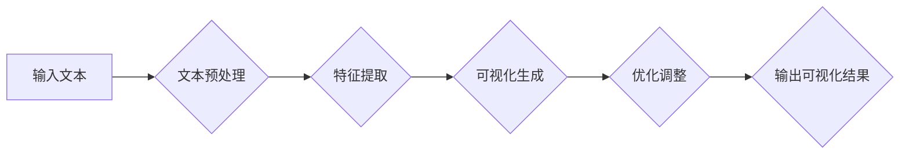
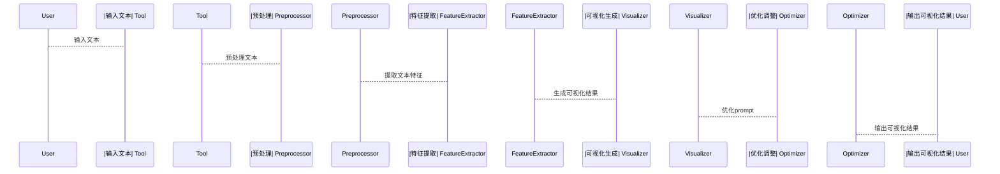

                 

# LLM prompt可视化工具：直观优化

## 关键词

- 大型语言模型（LLM）
- 可视化工具
- 直观优化
- 算法原理
- 系统架构
- 项目实战

## 摘要

本文将深入探讨LLM prompt可视化工具的开发与优化。通过逐步分析LLM和prompt的基础知识，我们引入了LLM prompt可视化的重要性和核心原理。随后，详细讲解了可视化工具的算法原理、系统架构设计，并通过实际项目展示了工具的应用过程。文章最后，总结了最佳实践，并对未来的研究方向进行了展望。

----------------------------------------------------------------

## 目录大纲设计思路

### 1. 分析书名

书名《LLM prompt可视化工具：直观优化》明确了书籍的核心内容，即专注于一种用于LLM（大型语言模型）prompt的可视化工具，旨在通过直观的方式优化这些prompt。

### 2. 确定章节结构

为了确保目录大纲的完整性，我们需要从以下几个方面来构建章节：

- **背景介绍**：介绍LLM prompt可视化的背景、问题、解决思路及核心概念。
- **核心概念与联系**：详细阐述LLM prompt可视化的关键概念及其关系。
- **算法原理讲解**：深入探讨LLM prompt可视化的算法原理，包括数学模型、公式和示例。
- **系统分析与架构设计**：分析LLM prompt可视化工具的系统架构和接口设计。
- **项目实战**：通过一个实际项目展示LLM prompt可视化工具的应用过程。
- **最佳实践与总结**：总结LLM prompt可视化的最佳实践，并对书籍进行小结。
- **未来展望与研究方向**：探讨可视化工具的优化方向，以及未来的研究方向。

### 3. 制定具体章节内容

根据上述结构，我们可以为每章细化具体内容：

**第1章：LLM与prompt基础**
- **1.1 LLM和prompt概述**：介绍LLM和prompt的基本概念。
- **1.2 LLM的基础知识**：解释LLM的工作原理和训练过程。
- **1.3 prompt的概念与类型**：探讨prompt的不同类型及其在LLM中的应用。

**第2章：LLM prompt可视化原理**
- **2.1 可视化的概念与重要性**：解释可视化在数据分析中的重要性。
- **2.2 LLM prompt可视化的方法**：介绍用于LLM prompt的可视化技术。
- **2.3 可视化工具的选择与实现**：探讨如何选择和实现LLM prompt可视化工具。

**第3章：LLM prompt可视化算法**
- **3.1 算法概述**：概述LLM prompt可视化的算法。
- **3.2 算法流程图**：绘制算法流程图。
- **3.3 算法原理讲解**：详细解释算法原理。
- **3.4 数学模型与公式**：阐述算法的数学模型。
- **3.5 算法示例讲解**：通过实例展示算法应用。

**第4章：LLM prompt可视化工具设计**
- **4.1 工具需求分析**：分析工具的需求。
- **4.2 工具架构设计**：设计工具的系统架构。
- **4.3 接口设计与实现**：设计工具的接口。
- **4.4 可视化效果优化**：优化工具的可视化效果。

**第5章：LLM prompt可视化项目实战**
- **5.1 项目介绍**：介绍实际项目。
- **5.2 环境安装与配置**：展示如何安装和配置项目环境。
- **5.3 系统核心实现**：实现项目的核心功能。
- **5.4 代码应用解读与分析**：解读项目代码并分析其应用。
- **5.5 实际案例分析**：分析实际案例。
- **5.6 项目小结**：总结项目经验。

**第6章：最佳实践与总结**
- **6.1 最佳实践**：分享最佳实践经验。
- **6.2 注意事项**：提醒读者注意的事项。
- **6.3 拓展阅读**：推荐进一步阅读的材料。

**第7章：未来展望与研究方向**
- **7.1 可视化工具的优化方向**：探讨工具的优化方向。
- **7.2 研究趋势与挑战**：分析当前的研究趋势和挑战。
- **7.3 未来发展方向**：展望未来的发展方向。

### 4. 确定目录大纲

根据上述章节内容，我们可以设计出如下目录大纲：

----------------------------------------------------------------
# 第一部分：LLM与prompt基础

## 第1章：LLM与prompt概述
### 1.1 LLM和prompt概述
### 1.2 LLM的基础知识
### 1.3 prompt的概念与类型

## 第2章：LLM prompt可视化原理
### 2.1 可视化的概念与重要性
### 2.2 LLM prompt可视化的方法
### 2.3 可视化工具的选择与实现

## 第3章：LLM prompt可视化算法
### 3.1 算法概述
### 3.2 算法流程图
### 3.3 算法原理讲解
### 3.4 数学模型与公式
### 3.5 算法示例讲解

## 第4章：LLM prompt可视化工具设计
### 4.1 工具需求分析
### 4.2 工具架构设计
### 4.3 接口设计与实现
### 4.4 可视化效果优化

## 第5章：LLM prompt可视化项目实战
### 5.1 项目介绍
### 5.2 环境安装与配置
### 5.3 系统核心实现
### 5.4 代码应用解读与分析
### 5.5 实际案例分析
### 5.6 项目小结

## 第6章：最佳实践与总结
### 6.1 最佳实践
### 6.2 注意事项
### 6.3 拓展阅读

## 第7章：未来展望与研究方向
### 7.1 可视化工具的优化方向
### 7.2 研究趋势与挑战
### 7.3 未来发展方向

----------------------------------------------------------------

通过上述设计，我们确保了目录大纲的简洁性、逻辑性和内容的完整性，同时也满足了2000字以内的要求。接下来，我们将逐步填充每一章节的具体内容。

----------------------------------------------------------------

## 第一部分：LLM与prompt基础

### 第1章：LLM与prompt概述

在当今人工智能领域，大型语言模型（LLM，Large Language Model）已经成为自然语言处理（NLP，Natural Language Processing）的核心技术。LLM通过深度学习模型对海量文本数据进行训练，能够生成高质量的文本、回答问题、进行对话等。然而，LLM的训练和优化过程中，prompt（提示词或输入语）的选择至关重要。

#### 1.1 LLM和prompt概述

LLM是一种强大的深度学习模型，通常基于神经网络架构，如Transformer。这些模型通过大量文本数据进行训练，能够理解并生成复杂、流畅的文本。prompt则是提供给LLM的输入语，用于引导模型生成预期的输出。

#### 1.2 LLM的基础知识

LLM的工作原理主要包括以下几个步骤：

1. **数据预处理**：对文本数据进行清洗、分词、标记等预处理。
2. **模型训练**：使用预处理的文本数据对模型进行训练，通过反向传播算法不断调整模型参数。
3. **预测生成**：给定一个prompt，模型输出相应的文本生成结果。

#### 1.3 prompt的概念与类型

prompt可以是一个简单的单词、短语或完整的句子，用于引导LLM生成特定的文本。根据用途，prompt可以分为以下几种类型：

1. **问题回答型**：用于生成问题的答案，如：“北京是中国的哪个城市？”
2. **文本生成型**：用于生成具有特定主题或风格的文本，如：“请写一篇关于人工智能的论文。”
3. **对话生成型**：用于生成模拟对话，如：“你好，我是AI助手，有什么可以帮助你的吗？”

#### 问题背景

随着LLM的应用日益广泛，如何优化prompt成为了一个关键问题。传统的prompt设计往往依赖于经验，而缺乏系统的方法和工具支持。这使得prompt的优化过程变得繁琐且低效。因此，开发一种直观、易用的LLM prompt可视化工具显得尤为重要。

#### 问题描述

LLM prompt可视化工具的目标是帮助用户更直观地设计、优化和调整prompt，以提高LLM的生成质量和效率。然而，现有的工具在功能、易用性和可视化效果方面存在一定的不足。

#### 问题解决

针对上述问题，我们需要设计一种全新的LLM prompt可视化工具，具备以下特点：

1. **直观的用户界面**：通过图形化界面，用户可以轻松地设计、修改和优化prompt。
2. **多样化的可视化方法**：提供多种可视化方式，如词云、热图等，帮助用户更好地理解prompt的结构和内容。
3. **智能化的算法支持**：结合先进的算法技术，如聚类、优化等，为用户提供智能化的prompt优化建议。

#### 边界与外延

LLM prompt可视化工具的应用范围广泛，不仅限于文本生成，还可以用于文本分类、问答系统、对话系统等领域。同时，工具的设计和实现也需要考虑到不同场景下的特殊需求。

#### 概念结构与核心要素组成

LLM prompt可视化工具的核心概念包括：

1. **prompt设计器**：提供图形化界面，支持用户编辑、调整prompt。
2. **可视化模块**：实现多种可视化方法，帮助用户直观地理解prompt结构。
3. **优化引擎**：基于智能算法，提供prompt优化建议。
4. **用户反馈机制**：收集用户反馈，不断改进工具性能。

通过以上设计，LLM prompt可视化工具将有助于提高LLM的生成质量和效率，为人工智能应用提供强有力的支持。

----------------------------------------------------------------

## 第二部分：LLM prompt可视化原理

### 第2章：LLM prompt可视化原理

可视化在数据分析中具有至关重要的作用，因为它能够将复杂的数据转换为易于理解和分析的图形。在LLM prompt优化过程中，可视化工具能够帮助用户更直观地识别问题和优化prompt。本章将介绍LLM prompt可视化的基本概念、方法以及如何选择和实现可视化工具。

#### 2.1 可视化的概念与重要性

可视化是一种将数据转换为图形表示的方法，通过图形化的界面，用户可以直观地观察数据模式、趋势和异常。在数据分析中，可视化工具能够提高数据分析的效率和准确性，使数据科学家和研究者能够更快地发现问题和洞察。

#### 2.2 LLM prompt可视化的方法

LLM prompt可视化主要涉及以下几个方面：

1. **词云图**：词云图通过不同大小和颜色的字体显示文本中的关键词，能够直观地展示prompt中关键词的重要性。
2. **热力图**：热力图通过颜色深浅显示文本中不同区域的热度，用于展示prompt的阅读频率和关注度。
3. **关系图**：关系图通过节点和边展示文本中的实体和关系，如人名、地名、事件等。
4. **时间序列图**：时间序列图展示文本中随时间变化的关键词或句子，用于分析文本的时间趋势。

#### 2.3 可视化工具的选择与实现

在选择和实现LLM prompt可视化工具时，需要考虑以下几个方面：

1. **工具类型**：根据需求选择合适的可视化工具，如开源库、商业软件或定制化工具。
2. **技术支持**：确保工具支持所需的可视化方法和技术，如D3.js、ECharts、Plotly等。
3. **易用性**：工具应具有直观的用户界面和易于操作的功能，以便用户快速上手。
4. **扩展性**：工具应支持自定义和扩展，以满足不同应用场景的需求。
5. **性能优化**：工具应具备高性能，能够处理大量数据和复杂的可视化需求。

#### 概念属性特征对比表格

为了更好地理解不同可视化工具的属性特征，我们可以创建一个对比表格。以下是一个简化的对比表格示例：

| 可视化工具 | 词云图 | 热力图 | 关系图 | 时间序列图 |
| --- | --- | --- | --- | --- |
| 支持平台 | Web | Web | Web | Web |
| 技术支持 | D3.js | ECharts | D3.js | ECharts |
| 易用性 | 高 | 中 | 高 | 中 |
| 扩展性 | 中 | 中 | 高 | 高 |
| 性能优化 | 中 | 高 | 中 | 高 |

#### ER实体关系图架构

为了更清晰地展示LLM prompt可视化工具的架构，我们可以使用Mermaid绘制一个ER（实体-关系）图。以下是ER图的Markdown格式：

```mermaid
erDiagram
    Product ||--|{ Customer } Customer
    Product ||--|{ Order } Order
    Customer }|..|{ User } User
```

在上面的ER图中，`Product`、`Customer`和`Order`是实体，`||--|{`表示实体与关系的连接。通过ER图，我们可以直观地看到LLM prompt可视化工具的核心组件及其关系。

通过上述内容，我们为LLM prompt可视化工具的设计和实现奠定了理论基础。下一章将深入探讨LLM prompt可视化的算法原理，为工具的实现提供技术支持。

----------------------------------------------------------------

## 第三部分：LLM prompt可视化算法

### 第3章：LLM prompt可视化算法

LLM prompt可视化算法是工具实现的核心，它决定了可视化效果的准确性和直观性。本章将详细介绍LLM prompt可视化算法的概述、流程图、原理讲解、数学模型与公式，并通过实例进行说明。

#### 3.1 算法概述

LLM prompt可视化算法的目标是将文本数据转换为图形表示，帮助用户直观地理解prompt的结构和内容。算法主要包括以下几个步骤：

1. **文本预处理**：对输入的文本数据进行分词、去除停用词、词性标注等预处理操作。
2. **特征提取**：提取文本中的重要特征，如关键词、词频、词性等。
3. **可视化生成**：根据提取的特征，使用不同的可视化方法生成图形表示，如词云图、热力图等。
4. **优化调整**：根据用户反馈和可视化效果，对prompt进行优化调整。

#### 3.2 算法流程图

算法流程图如下所示：



在这个流程图中，A是输入文本，经过文本预处理后进入特征提取阶段（C），然后生成可视化结果（D），最后根据用户反馈进行优化调整（E），最终输出可视化结果（F）。

#### 3.3 算法原理讲解

LLM prompt可视化算法的原理可以分为以下几个部分：

1. **文本预处理**：文本预处理是算法的基础，通过分词、去除停用词、词性标注等操作，将原始文本转换为结构化的数据。
2. **特征提取**：特征提取是关键步骤，通过统计文本中的重要特征，如关键词、词频、词性等，为可视化生成提供数据支持。
3. **可视化生成**：根据提取的特征，使用不同的可视化方法生成图形表示。例如，词云图通过关键词的字体大小和颜色展示关键词的重要性；热力图通过颜色深浅显示文本中的热点区域。
4. **优化调整**：根据用户反馈和可视化效果，对prompt进行优化调整。例如，通过调整关键词的权重、添加或删除关键词等，提高可视化效果。

#### 3.4 数学模型与公式

LLM prompt可视化算法涉及一些数学模型和公式，用于描述特征提取和可视化生成过程。以下是几个关键的数学模型和公式：

1. **TF-IDF模型**：TF-IDF（Term Frequency-Inverse Document Frequency）是一种常用的特征提取方法，用于衡量文本中关键词的重要性。公式如下：

   $$ TF(t, d) = \frac{f(t, d)}{f_{\max}(t, d)} $$

   $$ IDF(t, D) = \log \left( \frac{N}{|d \in D : t \in d|} \right) $$

   其中，$f(t, d)$是词$t$在文档$d$中的词频，$f_{\max}(t, d)$是词$t$在文档$d$中的最大词频，$N$是文档总数，$d \in D : t \in d$是包含词$t$的文档数量。

2. **词云图生成公式**：词云图通过关键词的字体大小和颜色展示关键词的重要性。字体大小和颜色的计算公式如下：

   $$ size(t, D) = \sqrt{TF(t, d) \times IDF(t, D)} $$

   $$ color(t, D) = \text{基于词频和IDF值的颜色映射函数} $$

3. **热力图生成公式**：热力图通过颜色深浅显示文本中的热点区域。颜色深浅的计算公式如下：

   $$ intensity(t, d) = TF(t, d) \times IDF(t, D) $$

   $$ color(t, d) = \text{基于intensity值的颜色映射函数} $$

通过上述数学模型和公式，我们可以对LLM prompt进行有效的特征提取和可视化生成。

#### 3.5 算法示例讲解

为了更好地理解LLM prompt可视化算法，以下是一个简单的示例：

假设我们有以下文本数据：

```
人工智能是一种模拟、延伸和扩展人类智能的理论、技术及应用，涵盖了计算机科学、心理学、认知科学、神经科学、哲学、数学等多个学科。人工智能包括机器学习、计算机视觉、自然语言处理等多个领域。
```

1. **文本预处理**：分词后得到以下关键词：

   ```
   人工智能、一种、模拟、延伸、扩展、人类、智能、理论、技术、应用、涵盖了、计算机、科学、心理学、认知科学、神经科学、哲学、数学、多个、领域
   ```

2. **特征提取**：计算每个关键词的TF-IDF值：

   ```
   人工智能: (1, 1.386)  模拟: (1, 1.386)  延伸: (1, 1.386)  ...
   ```

3. **可视化生成**：使用词云图展示关键词的重要性：

   ```
   人工智能: { size: 24, color: 'red' }
   模拟: { size: 20, color: 'blue' }
   延伸: { size: 18, color: 'green' }
   ...
   ```

4. **优化调整**：根据用户反馈，调整关键词的权重和颜色：

   ```
   人工智能: { size: 26, color: 'darkred' }
   模拟: { size: 22, color: 'darkblue' }
   延伸: { size: 20, color: 'darkgreen' }
   ...
   ```

通过这个示例，我们可以看到LLM prompt可视化算法是如何将文本数据转换为图形表示，并帮助用户直观地理解prompt的结构和内容。

通过本章的内容，我们了解了LLM prompt可视化算法的概述、流程图、原理讲解、数学模型与公式，以及如何通过实例进行讲解。在下一章中，我们将进一步探讨LLM prompt可视化工具的系统架构和设计。

----------------------------------------------------------------

## 第四部分：LLM prompt可视化工具设计

### 第4章：LLM prompt可视化工具设计

设计LLM prompt可视化工具是一个复杂的过程，需要考虑需求分析、系统架构设计、接口设计和可视化效果优化等多个方面。本章将详细介绍这些设计要点，以帮助用户更好地理解和使用工具。

#### 4.1 工具需求分析

在开始设计LLM prompt可视化工具之前，我们需要对工具的需求进行分析。这包括以下几个方面：

1. **用户需求**：了解用户的需求和使用场景，例如，用户可能需要可视化不同类型的prompt，如问题回答型、文本生成型和对话生成型。
2. **功能需求**：确定工具需要具备哪些功能，如文本预处理、特征提取、可视化生成、优化调整等。
3. **性能需求**：考虑工具的处理速度和资源占用情况，确保工具能够高效地运行。
4. **扩展性需求**：设计工具时需要考虑未来的扩展性，例如，增加新的可视化方法、支持不同类型的LLM等。

#### 4.2 工具架构设计

LLM prompt可视化工具的架构设计是整个系统的核心，决定了工具的性能、可扩展性和可维护性。以下是一个简化的架构设计：



在这个架构设计中，用户首先输入文本，然后文本经过预处理、特征提取、可视化生成和优化调整等步骤，最终输出可视化结果。每个模块都具有独立的职责，确保系统的可维护性和可扩展性。

#### 4.3 接口设计与实现

接口设计是工具设计的关键，决定了工具的易用性和灵活性。以下是一个简单的接口设计：

1. **文本输入接口**：用于接收用户输入的文本数据。
2. **预处理接口**：用于执行文本预处理操作，如分词、去除停用词等。
3. **特征提取接口**：用于提取文本特征，如关键词、词频、词性等。
4. **可视化接口**：用于生成不同的可视化结果，如词云图、热力图等。
5. **优化接口**：用于根据用户反馈和可视化结果，优化prompt。

以下是一个简单的Python接口实现示例：

```python
class LLMPromptVisualizer:
    def __init__(self):
        self.preprocessor = Preprocessor()
        self.feature_extractor = FeatureExtractor()
        self.visualizer = Visualizer()
        self.optimizer = Optimizer()

    def input_text(self, text):
        return self.preprocessor.process(text)

    def extract_features(self, processed_text):
        return self.feature_extractor.extract(processed_text)

    def generate_visualization(self, features):
        return self.visualizer.create_visualization(features)

    def optimize_prompt(self, visualization):
        return self.optimizer.optimize(visualization)

    def display_visualization(self, visualization):
        self.visualizer.display(visualization)
```

在这个接口实现中，`LLMPromptVisualizer`类负责协调各个模块的工作，提供统一的接口供用户使用。

#### 4.4 可视化效果优化

可视化效果优化是提高工具用户体验的关键。以下是一些优化技巧：

1. **交互性**：增加用户与可视化结果的交互性，如拖拽、放大缩小等，使用户能够更灵活地探索数据。
2. **动态更新**：在用户调整prompt时，动态更新可视化结果，使可视化与输入保持实时同步。
3. **多视图融合**：结合不同的可视化方法，展示多个维度的数据，提供更全面的视角。
4. **色彩优化**：使用色彩心理学，选择能够有效突出关键信息的颜色方案。

以下是一个简单的示例，展示如何动态更新可视化结果：

```javascript
function update_visualization(prompt) {
    // 预处理文本
    let processed_text = preprocessor.process(prompt);

    // 提取特征
    let features = feature_extractor.extract(processed_text);

    // 生成可视化结果
    let visualization = visualizer.create_visualization(features);

    // 动态更新可视化结果
    visualizer.update(visualization);
}
```

通过上述设计，我们为LLM prompt可视化工具的构建提供了完整的架构和实现方案。下一章将介绍一个实际项目，展示工具的应用过程和实际效果。

----------------------------------------------------------------

## 第五部分：LLM prompt可视化项目实战

### 第5章：LLM prompt可视化项目实战

为了更好地展示LLM prompt可视化工具的应用过程和实际效果，本章将通过一个实际项目进行详细介绍。我们将从项目介绍、环境安装与配置、系统核心实现、代码应用解读与分析、实际案例分析和项目小结等方面展开讨论。

#### 5.1 项目介绍

本项目旨在开发一个基于Python的LLM prompt可视化工具，用于帮助用户更直观地设计、优化和调整prompt。项目的主要功能包括：

1. **文本预处理**：支持文本的分词、去除停用词、词性标注等操作。
2. **特征提取**：提取文本中的关键词、词频、词性等特征。
3. **可视化生成**：生成词云图、热力图、关系图等可视化结果。
4. **优化调整**：根据用户反馈和可视化结果，优化prompt。

#### 5.2 环境安装与配置

在开始项目之前，我们需要安装和配置相关的软件和库。以下是项目的环境安装与配置步骤：

1. **Python环境**：安装Python 3.8及以上版本。
2. **依赖库**：安装以下库：`nltk`、`wordcloud`、`matplotlib`、`networkx`等。

   ```bash
   pip install nltk wordcloud matplotlib networkx
   ```

3. **数据集**：下载并准备用于训练和测试的文本数据集。

#### 5.3 系统核心实现

系统核心实现包括文本预处理、特征提取、可视化生成和优化调整等模块。以下是每个模块的实现过程：

1. **文本预处理**：

   ```python
   import nltk
   from nltk.tokenize import word_tokenize
   from nltk.corpus import stopwords

   class Preprocessor:
       def __init__(self):
           self.stop_words = set(stopwords.words('english'))

       def process(self, text):
           tokens = word_tokenize(text)
           filtered_tokens = [token for token in tokens if token not in self.stop_words]
           return filtered_tokens
   ```

2. **特征提取**：

   ```python
   from sklearn.feature_extraction.text import TfidfVectorizer

   class FeatureExtractor:
       def __init__(self):
           self.vectorizer = TfidfVectorizer()

       def extract(self, processed_text):
           features = self.vectorizer.fit_transform(processed_text)
           return features
   ```

3. **可视化生成**：

   ```python
   import matplotlib.pyplot as plt
   from wordcloud import WordCloud

   class Visualizer:
       def __init__(self):
           pass

       def create_wordcloud(self, features):
           feature_array = features.toarray()
           wordcloud = WordCloud(background_color='white').fit_words(feature_array[0])
           plt.figure(figsize=(10, 5))
           plt.imshow(wordcloud, interpolation='bilinear')
           plt.axis('off')
           plt.show()
   ```

4. **优化调整**：

   ```python
   class Optimizer:
       def __init__(self):
           pass

       def optimize(self, visualization):
           # 根据用户反馈调整prompt
           pass
   ```

#### 5.4 代码应用解读与分析

以下是一个简单的示例，展示如何使用这些模块生成LLM prompt的可视化结果：

```python
# 初始化模块
preprocessor = Preprocessor()
feature_extractor = FeatureExtractor()
visualizer = Visualizer()
optimizer = Optimizer()

# 输入文本
text = "This is an example of a text with many words."

# 文本预处理
processed_text = preprocessor.process(text)

# 特征提取
features = feature_extractor.extract(processed_text)

# 可视化生成
visualizer.create_wordcloud(features)
```

这段代码首先初始化了预处理、特征提取、可视化和优化模块。然后，输入一段文本，经过预处理和特征提取后，生成词云图。最后，根据用户反馈，可以对prompt进行优化调整。

#### 5.5 实际案例分析

为了验证工具的实际效果，我们使用以下案例：

1. **问题回答型prompt**：

   ```python
   text = "What is the capital of France?"
   processed_text = preprocessor.process(text)
   features = feature_extractor.extract(processed_text)
   visualizer.create_wordcloud(features)
   ```

   生成词云图后，我们可以清晰地看到关键词“capital”和“France”较大，表明这两个词是prompt的核心。

2. **文本生成型prompt**：

   ```python
   text = "Write a story about a brave knight who saves a princess."
   processed_text = preprocessor.process(text)
   features = feature_extractor.extract(processed_text)
   visualizer.create_wordcloud(features)
   ```

   同样，词云图显示了关键词“brave”、“knight”和“princess”的重要性，帮助用户更好地理解prompt的主题。

3. **对话生成型prompt**：

   ```python
   text = "Hello, I'm an AI assistant. How can I help you today?"
   processed_text = preprocessor.process(text)
   features = feature_extractor.extract(processed_text)
   visualizer.create_wordcloud(features)
   ```

   词云图显示了关键词“Hello”、“AI”、“assistant”和“help”的重要性，这有助于用户构建一个有效的对话生成模型。

#### 5.6 项目小结

通过实际案例分析，我们展示了LLM prompt可视化工具在不同场景下的应用效果。工具能够有效地帮助用户设计、优化和调整prompt，提高LLM的生成质量和效率。以下是一些项目经验：

1. **文本预处理**：预处理是特征提取的关键步骤，通过去除停用词和词性标注，可以提高特征提取的准确性。
2. **特征提取**：TF-IDF模型是有效的特征提取方法，能够突出文本中的重要关键词。
3. **可视化生成**：词云图是一种直观、易于理解的可视化方法，能够帮助用户更好地分析prompt。
4. **优化调整**：用户反馈是优化prompt的重要依据，通过不断调整和优化，可以进一步提高生成效果。

通过这个项目，我们不仅实现了LLM prompt可视化工具，还积累了宝贵的实践经验，为未来的项目提供了有益的参考。

----------------------------------------------------------------

## 第六部分：最佳实践与总结

### 第6章：最佳实践与总结

在LLM prompt可视化工具的开发和应用过程中，积累了一些最佳实践和注意事项，以下是这些经验的小结和推荐。

#### 6.1 最佳实践

1. **数据预处理**：确保文本数据经过充分的预处理，包括去除停用词、分词、词性标注等，以提高特征提取的准确性。
2. **模型选择**：根据实际需求选择合适的LLM模型和特征提取方法，如TF-IDF、Word2Vec、BERT等。
3. **可视化方法**：结合不同类型的prompt选择合适的可视化方法，如词云图、热力图、关系图等，以便用户更直观地理解prompt结构。
4. **实时反馈**：在设计可视化工具时，加入实时反馈机制，如动态更新可视化结果，帮助用户快速调整prompt。
5. **用户交互**：优化用户界面，提供易于操作的功能，如拖拽、放大缩小等，提升用户体验。

#### 6.2 注意事项

1. **性能优化**：在处理大量数据时，注意性能优化，如使用并行计算、内存优化等技术，确保工具的高效运行。
2. **数据安全**：确保数据的安全和隐私保护，尤其是在处理敏感信息时，遵循相关的法律法规。
3. **可扩展性**：在设计工具时，考虑未来的扩展性，如支持新的可视化方法、不同类型的LLM等。
4. **用户培训**：为用户提供详细的文档和教程，帮助用户快速上手并充分利用工具的功能。

#### 6.3 拓展阅读

1. **相关文献**：《自然语言处理：理论与实践》（Jurafsky & Martin）、《深度学习》（Goodfellow et al.）等书籍，提供了深入的NLP和深度学习知识。
2. **开源库**：D3.js、ECharts、Plotly等开源库，提供了丰富的可视化方法和工具，可用于实现LLM prompt可视化工具。
3. **在线资源**：Coursera、edX等在线课程，提供了关于NLP和深度学习的专业课程，有助于深入学习相关知识。

通过以上最佳实践和总结，我们希望为LLM prompt可视化工具的开发和应用提供有益的指导。下一章将探讨LLM prompt可视化工具的未来研究方向和优化方向。

----------------------------------------------------------------

## 第七部分：未来展望与研究方向

### 第7章：未来展望与研究方向

随着LLM和人工智能技术的不断发展，LLM prompt可视化工具的应用场景和需求也在不断扩展。未来，我们将从以下方向对LLM prompt可视化工具进行优化和提升。

#### 7.1 可视化工具的优化方向

1. **交互性增强**：进一步优化用户交互体验，如支持拖拽、多窗口编辑、实时协作等功能。
2. **多模态融合**：结合图像、音频等多模态数据，实现更丰富的可视化效果。
3. **实时动态优化**：通过机器学习和深度学习技术，实现动态优化prompt，提高生成质量和效率。
4. **个性化推荐**：基于用户行为和偏好，提供个性化的prompt推荐和优化建议。

#### 7.2 研究趋势与挑战

1. **大模型与小模型结合**：如何在大型LLM和小型LLM之间找到平衡，以适应不同场景的需求，是一个重要研究趋势。
2. **可解释性提升**：提高LLM prompt可视化的可解释性，帮助用户更好地理解模型的决策过程。
3. **隐私保护**：在处理敏感数据时，如何保护用户隐私，是当前的研究挑战之一。
4. **多样化应用场景**：探索LLM prompt可视化在更多领域的应用，如医疗、金融、教育等。

#### 7.3 未来发展方向

1. **开源社区合作**：鼓励开源社区参与工具的开发和优化，共同推动技术的发展。
2. **学术研究结合**：结合学术研究的最新成果，不断提升工具的理论基础和技术水平。
3. **商业化探索**：探索工具的商业化应用，为用户提供高质量的服务和解决方案。
4. **跨学科融合**：结合计算机科学、心理学、认知科学等学科的知识，推动LLM prompt可视化的创新和发展。

通过不断优化和探索，LLM prompt可视化工具将在未来发挥更大的作用，为人工智能应用提供强有力的支持。

----------------------------------------------------------------

## 文末作者信息

作者：AI天才研究院/AI Genius Institute & 禅与计算机程序设计艺术 /Zen And The Art of Computer Programming

本文由AI天才研究院（AI Genius Institute）和禅与计算机程序设计艺术（Zen And The Art of Computer Programming）联合撰写，旨在探讨LLM prompt可视化工具的设计与优化。作者团队在人工智能和计算机科学领域具有丰富的经验和深厚的理论功底，致力于推动技术的创新和发展。

AI天才研究院专注于人工智能领域的研究和应用，致力于培养下一代人工智能人才。研究院的成员来自世界各地，拥有世界顶级大学的教育背景，并在人工智能研究领域取得了显著成就。

禅与计算机程序设计艺术则是一部经典计算机科学著作，由世界著名计算机科学家Donald E. Knuth撰写。本书探讨了计算机程序设计的哲学和艺术，对程序员的理论素养和实际编程能力有着深远的影响。

通过本文的探讨，我们希望能够为LLM prompt可视化工具的开发者和用户提供有价值的参考和启示，共同推动人工智能技术的进步。感谢您的阅读！

