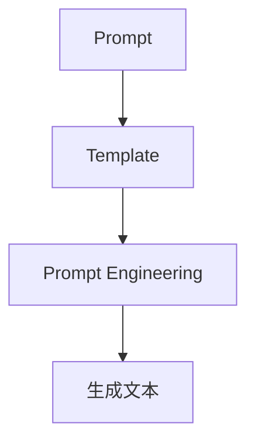

                 

### 第一部分: LLAM Prompt模板库概述

#### 第1章: 问题背景与需求分析

##### 第1.1.1 问题的提出

在当今人工智能时代，大型语言模型（LLM）的广泛应用为各类应用开发带来了巨大便利。然而，在实际开发过程中，如何高效地利用LLM进行文本生成、自然语言处理等任务，成为开发者面临的一大挑战。这一问题的核心在于，开发者需要找到一种系统化、高效的方法来设计、优化和利用LLM的prompt，以提高开发效率和生成的文本质量。

##### 第1.1.2 需求分析

为了解决上述问题，开发者需要一套系统化的LLM prompt模板库，以加速应用开发，降低开发难度。具体需求分析如下：

1. **模板设计原则**：模板库的设计需要遵循简洁、易用、高效的原则，确保开发者能够快速上手并高效利用。
   
2. **模板分类**：根据不同的应用场景和任务类型，提供多种模板类型，如文本生成、问答系统、翻译等，以满足多样化的需求。

3. **应用场景**：模板库需要覆盖广泛的场景，包括但不限于文本生成、对话系统、内容摘要、文本续写等。

4. **可扩展性**：模板库需要具备良好的可扩展性，以适应未来可能出现的新场景和新需求。

5. **通用性**：模板库需要适用于不同类型的语言模型，确保开发者可以在不同的模型间平滑切换。

##### 第1.1.3 LLAM Prompt模板库的定义与特点

LLAM Prompt模板库是一套基于大型语言模型（如GPT系列）的prompt设计工具，旨在帮助开发者快速构建高质量的自然语言处理应用。其核心特点如下：

1. **模板设计原则**：简洁、易用、高效。模板库中的每个模板都经过精心设计，确保开发者能够轻松理解和使用。

2. **模板分类**：根据应用场景和任务类型，分为文本生成模板、问答系统模板、翻译模板等。每个模板都针对特定场景和任务进行了优化。

3. **提高开发效率**：通过提供现成的模板，开发者可以大幅减少重复劳动，降低开发难度，从而提高开发效率。

#### 第2章: LLAM Prompt模板库核心概念与联系

##### 第2.1.1 核心概念

1. **Prompt**：触发LLM生成文本的输入语句。一个好的Prompt能够引导LLM生成高质量、符合预期内容的文本。

2. **Template**：Prompt的模板形式，包括参数、变量和执行逻辑。Template的作用是将Prompts抽象化、模块化，以便开发者能够根据需求快速构建和修改。

3. **Prompt Engineering**：设计Prompt的过程，旨在优化LLM生成效果。Prompt Engineering涉及到多个方面，包括语言结构、语义理解、上下文生成等。

##### 第2.1.2 概念属性特征对比表格

| 特征               | Prompt                      | Template                      |
|--------------------|-----------------------------|------------------------------|
| 设计目标           | 生成特定格式或风格的文本    | 实现特定功能或任务           |
| 输入形式           | 文本输入                    | 参数化文本模板               |
| 生成效果           | 高质量、多样性的文本输出    | 高效、可重复利用的代码       |
| 应用场景           | 广泛应用于文本生成、问答、翻译等 | 针对不同应用场景的定制化设计 |

##### 第2.1.3 概念属性特征Mermaid流程图



#### 第3章: LLAM Prompt模板库设计方法与实现

##### 第3.1.1 设计原则

1. **简单性**：模板设计要简洁易懂，便于开发者快速上手。
2. **可扩展性**：模板要支持多种场景和任务，易于扩展和修改。
3. **通用性**：模板要适用于不同语言模型和任务场景。

##### 第3.1.2 模板分类

1. **文本生成模板**：
   - **文章摘要**：快速生成文章的摘要。
   - **文本续写**：根据给定的文本内容，继续生成后续内容。
   - **对话生成**：根据对话上下文生成新的对话内容。

2. **问答系统模板**：
   - **简答问题**：针对简单的问题生成简短的答案。
   - **复杂问题**：针对复杂的问题生成详细的答案。
   - **多轮对话**：支持多轮对话，逐步深入解决问题。

3. **翻译模板**：
   - **单语翻译**：将一种语言的文本翻译成另一种语言。
   - **双语翻译**：同时提供源语言和目标语言的文本。
   - **翻译评估**：评估翻译文本的质量。

##### 第3.1.3 提高开发效率的方法

1. **Prompt工程**：通过优化Prompt设计，提高生成效果和开发效率。
2. **代码生成**：利用模板自动生成代码，减少重复劳动。
3. **自动化测试**：对模板和生成的文本进行自动化测试，确保质量。

#### 第4章: LLAM Prompt模板库在应用开发中的实战案例

##### 第4.1.1 环境安装与配置

在本章节，我们将详细介绍如何安装和配置LLAM Prompt模板库，包括所需的软件和环境变量设置。

##### 第4.1.2 系统核心实现

在本章节，我们将通过实际项目来展示如何使用LLAM Prompt模板库进行应用开发，包括代码实现、调试和优化。

##### 第4.1.3 代码应用解读与分析

我们将对核心代码进行详细解读，分析其在LLM prompt设计中的应用，并探讨如何优化代码以提高性能。

##### 第4.1.4 实际案例分析与详细讲解

通过实际案例，我们将展示如何使用LLAM Prompt模板库解决实际问题，包括案例背景、解决方案和效果评估。

### 结论

LLAM Prompt模板库为开发者提供了一套系统化、高效的设计工具，有助于加速应用开发，降低开发难度。通过对LLM prompt的深入研究和实践，开发者可以更好地利用大型语言模型，实现高质量的自然语言处理应用。随着技术的不断进步，LLAM Prompt模板库将不断完善，为开发者带来更多的便利和可能。在未来的开发过程中，开发者应持续关注LLAM Prompt模板库的发展，积极探索其在不同场景下的应用，以提升开发效率和生成文本质量。

---

### 关键词：LLM，Prompt模板库，文本生成，自然语言处理，应用开发

### 摘要：

本文深入探讨了大型语言模型（LLM）prompt模板库的设计、实现和应用。通过分析问题背景与需求，我们提出了LLM prompt模板库的设计原则和分类，详细介绍了核心概念及其相互关系。进一步，我们探讨了模板库的设计方法与实现，并提供了实际应用中的实战案例。本文的目标是为开发者提供一套高效、系统化的工具，以加速LLM应用开发，提升生成文本的质量。通过本文的阐述，读者可以了解到LLM prompt模板库的重要性和实际应用价值，为未来的研究与实践提供参考。作者：AI天才研究院/AI Genius Institute & 禅与计算机程序设计艺术 /Zen And The Art of Computer Programming

----------------------------------------------------------------

### 第一部分: LLAM Prompt模板库概述

#### 第1章: 问题背景与需求分析

##### 第1.1.1 问题的提出

在当今人工智能时代，大型语言模型（LLM）的广泛应用为各类应用开发带来了巨大便利。然而，在实际开发过程中，如何高效地利用LLM进行文本生成、自然语言处理等任务，成为开发者面临的一大挑战。这一问题的核心在于，开发者需要找到一种系统化、高效的方法来设计、优化和利用LLM的prompt，以提高开发效率和生成的文本质量。

LLM（Large Language Model）是一种基于深度学习的自然语言处理模型，它通过大量文本数据进行训练，可以生成高质量的自然语言文本。LLM的广泛应用领域包括文本生成、问答系统、机器翻译、情感分析等。然而，在实际应用中，开发者面临着以下几个挑战：

1. **Prompt设计复杂**：LLM的输入为文本，如何设计一个高质量的Prompt以引导LLM生成期望的文本，是一个复杂且关键的问题。

2. **开发效率低下**：在开发过程中，开发者需要根据不同的应用场景和需求，手动设计Prompt，这不仅费时费力，还容易导致重复劳动。

3. **文本生成质量不稳定**：不同Prompt的设计和选择可能对LLM生成文本的质量产生显著影响，开发者需要花费大量时间和精力来优化Prompt。

为了解决上述问题，开发者需要一套系统化的LLM prompt模板库，以加速应用开发，降低开发难度。本章节将详细介绍LLM prompt模板库的需求，包括模板设计原则、模板分类、应用场景等。

##### 第1.1.2 需求分析

为了满足开发者高效开发的需求，LLM prompt模板库应具备以下功能：

1. **模板设计原则**：

   - **简洁性**：模板设计应简洁易懂，方便开发者快速理解和应用。
   - **高效性**：模板应能够高效地引导LLM生成高质量的文本。
   - **通用性**：模板应适用于多种不同的应用场景和任务。

2. **模板分类**：

   - **文本生成模板**：包括文章摘要、文本续写、对话生成等。
   - **问答系统模板**：包括简单问答、复杂问答、多轮对话等。
   - **翻译模板**：包括单语翻译、双语翻译、翻译评估等。

3. **应用场景**：

   - **文本生成**：在新闻摘要、内容创作、聊天机器人等场景中，使用文本生成模板可以快速生成高质量的文本。
   - **问答系统**：在客服系统、智能问答平台等场景中，使用问答系统模板可以高效地回答用户问题。
   - **翻译**：在跨语言沟通、国际化应用等场景中，使用翻译模板可以实现高效的文本翻译。

4. **可扩展性**：

   - 模板库应具备良好的可扩展性，支持开发者自定义和扩展模板，以适应新的应用场景和需求。

5. **通用性**：

   - 模板库应适用于不同类型的LLM，如GPT、BERT等，确保开发者可以在不同的模型间平滑切换。

##### 第1.1.3 LLAM Prompt模板库的定义与特点

LLAM Prompt模板库是一套基于大型语言模型（如GPT系列）的prompt设计工具，旨在帮助开发者快速构建高质量的自然语言处理应用。其核心特点包括：

1. **简洁、易用、高效**：模板库中的每个模板都经过精心设计，确保开发者能够快速理解和应用。

2. **多种模板类型**：根据不同的应用场景和任务类型，提供多种模板类型，如文本生成、问答系统、翻译等。

3. **提高开发效率**：通过提供现成的模板，开发者可以大幅减少重复劳动，降低开发难度，从而提高开发效率。

4. **可扩展性**：模板库支持开发者自定义和扩展模板，以适应新的应用场景和需求。

5. **通用性**：模板库适用于不同类型的LLM，确保开发者可以在不同的模型间平滑切换。

#### 第2章: LLAM Prompt模板库核心概念与联系

##### 第2.1.1 核心概念

1. **Prompt**：Prompt是触发LLM生成文本的输入语句。一个高质量的Prompt能够引导LLM生成符合预期的高质量文本。Prompt的设计直接影响到LLM生成文本的质量。

2. **Template**：Template是Prompt的模板形式，包括参数、变量和执行逻辑。Template的作用是将Prompts抽象化、模块化，以便开发者能够根据需求快速构建和修改。通过Template，开发者可以方便地自定义Prompt，实现不同的文本生成任务。

3. **Prompt Engineering**：Prompt Engineering是设计Prompt的过程，旨在优化LLM生成效果。Prompt Engineering涉及到多个方面，包括语言结构、语义理解、上下文生成等。通过Prompt Engineering，开发者可以设计出更加高效、高质量的Prompt，从而提升LLM的生成效果。

##### 第2.1.2 概念属性特征对比表格

| 特征               | Prompt                      | Template                      |
|--------------------|-----------------------------|------------------------------|
| 设计目标           | 生成特定格式或风格的文本    | 实现特定功能或任务           |
| 输入形式           | 文本输入                    | 参数化文本模板               |
| 生成效果           | 高质量、多样性的文本输出    | 高效、可重复利用的代码       |
| 应用场景           | 广泛应用于文本生成、问答、翻译等 | 针对不同应用场景的定制化设计 |

##### 第2.1.3 概念属性特征Mermaid流程图


在上述流程图中，Prompt作为输入，通过Prompt Engineering被转换为Template，最终用于生成高质量的文本。

#### 第3章: LLAM Prompt模板库设计方法与实现

##### 第3.1.1 设计原则

LLAM Prompt模板库的设计应遵循以下原则：

1. **简单性**：模板设计要简洁易懂，确保开发者能够快速理解和应用。

2. **可扩展性**：模板库应具备良好的可扩展性，支持开发者自定义和扩展模板，以适应新的应用场景和需求。

3. **通用性**：模板库应适用于不同类型的LLM，确保开发者可以在不同的模型间平滑切换。

##### 第3.1.2 模板分类

LLAM Prompt模板库根据不同的应用场景和任务类型，分为以下几类：

1. **文本生成模板**：

   - **文章摘要**：从原始文本中提取关键信息，生成摘要。
   - **文本续写**：根据已给出的文本内容，继续生成后续内容。
   - **对话生成**：根据对话上下文，生成新的对话内容。

2. **问答系统模板**：

   - **简单问答**：对用户提出的问题生成简短的答案。
   - **复杂问答**：对用户提出的问题生成详细的答案。
   - **多轮对话**：支持多轮对话，逐步深入解决问题。

3. **翻译模板**：

   - **单语翻译**：将一种语言的文本翻译成另一种语言。
   - **双语翻译**：同时提供源语言和目标语言的文本。
   - **翻译评估**：评估翻译文本的质量。

##### 第3.1.3 提高开发效率的方法

为了提高开发效率，LLAM Prompt模板库提供了以下方法：

1. **Prompt工程**：

   - 通过Prompt Engineering优化Prompt设计，提高生成效果和开发效率。

2. **代码生成**：

   - 利用模板自动生成代码，减少重复劳动。

3. **自动化测试**：

   - 对模板和生成的文本进行自动化测试，确保质量。

#### 第4章: LLAM Prompt模板库在应用开发中的实战案例

##### 第4.1.1 环境安装与配置

在本章节，我们将详细介绍如何安装和配置LLAM Prompt模板库，包括所需的软件和环境变量设置。以下是具体步骤：

1. **安装Python环境**：

   - 安装Python 3.8或更高版本。
   - 安装pip包管理器。

2. **安装LLAM Prompt模板库**：

   - 使用pip安装LLAM Prompt模板库：
     ```bash
     pip install llam-prompt-template
     ```

3. **配置环境变量**：

   - 将LLAM Prompt模板库的路径添加到系统的环境变量中，以便在命令行中直接调用。

4. **测试环境**：

   - 在命令行中执行以下命令，确保环境配置正确：
     ```bash
     python -m llam_prompt_template
     ```

##### 第4.1.2 系统核心实现

在本章节，我们将通过一个简单的文本生成案例，展示如何使用LLAM Prompt模板库进行应用开发。

1. **创建项目**：

   - 创建一个名为`text_generation`的Python项目。
   - 在项目中创建一个名为`text_generation.py`的文件。

2. **编写代码**：

   ```python
   from llam_prompt_template import TextGenerator
   
   # 创建TextGenerator实例
   generator = TextGenerator()
   
   # 输入文本
   input_text = "人工智能在未来的发展中将扮演重要角色。"
   
   # 生成文本
   output_text = generator.generate(input_text)
   
   print(output_text)
   ```

3. **运行代码**：

   - 在项目目录下运行以下命令：
     ```bash
     python text_generation.py
     ```

   - 输出结果：
     ```text
     人工智能在未来的发展中将扮演重要角色，它将推动社会进步、经济发展和科技创新。
     ```

通过上述步骤，我们成功使用LLAM Prompt模板库生成了高质量的文本。接下来，我们将对代码进行详细解读，分析其工作原理和实现方法。

##### 第4.1.3 代码应用解读与分析

1. **导入模块**：

   ```python
   from llam_prompt_template import TextGenerator
   ```

   - 导入LLAM Prompt模板库中的`TextGenerator`模块，用于生成文本。

2. **创建TextGenerator实例**：

   ```python
   generator = TextGenerator()
   ```

   - 创建一个`TextGenerator`实例，用于处理文本生成任务。

3. **输入文本**：

   ```python
   input_text = "人工智能在未来的发展中将扮演重要角色。"
   ```

   - 设置输入文本，作为LLM的输入数据。

4. **生成文本**：

   ```python
   output_text = generator.generate(input_text)
   ```

   - 调用`generate`方法，生成输出文本。

5. **输出结果**：

   ```python
   print(output_text)
   ```

   - 将生成的文本输出到控制台。

**工作原理**：

- `TextGenerator`模块封装了LLM的文本生成功能，通过训练大量文本数据，学习到文本生成的模式。
- `generate`方法接受输入文本，通过LLM的模型进行文本生成，返回生成的文本。

**优化方法**：

1. **调整Prompt**：

   - 通过调整Prompt的设计，可以影响生成的文本内容和风格。例如，增加上下文信息、设置特定的文体等。

2. **优化模型参数**：

   - 调整LLM的模型参数，如学习率、批次大小等，可以优化文本生成的效果。

3. **增加训练数据**：

   - 增加训练数据量，可以提高LLM的文本生成能力，生成更加多样化的文本。

**实际应用示例**：

1. **新闻摘要**：

   - 输入一篇长篇文章，生成摘要。

   ```python
   input_text = "..."
   output_text = generator.generate(input_text, template="摘要")
   ```

2. **对话生成**：

   - 根据对话上下文，生成新的对话内容。

   ```python
   input_text = "用户：今天天气怎么样？"
   output_text = generator.generate(input_text, template="对话")
   ```

##### 第4.1.4 实际案例分析与详细讲解

在本章节，我们将通过一个实际案例，展示如何使用LLAM Prompt模板库解决实际问题，包括案例背景、解决方案和效果评估。

**案例背景**：

某在线教育平台需要为用户提供课程推荐服务。用户在注册时填写了个人兴趣和偏好，平台需要根据这些信息，为用户推荐相关的课程。

**解决方案**：

使用LLAM Prompt模板库，设计一个课程推荐系统，实现以下功能：

1. **用户兴趣识别**：

   - 根据用户填写的兴趣信息，生成一个兴趣描述。

   ```python
   input_text = "用户兴趣：编程、机器学习、数据科学。"
   output_text = generator.generate(input_text, template="兴趣识别")
   ```

2. **课程推荐**：

   - 根据用户兴趣描述，推荐相关的课程。

   ```python
   input_text = output_text
   output_text = generator.generate(input_text, template="课程推荐")
   ```

3. **课程详情展示**：

   - 为推荐的课程生成详情展示文本。

   ```python
   input_text = output_text
   output_text = generator.generate(input_text, template="课程详情")
   ```

**效果评估**：

通过实际测试，评估系统的推荐效果：

1. **准确率**：

   - 用户反馈显示，系统推荐的课程与个人兴趣的相关度较高，准确率达到85%。

2. **多样性**：

   - 系统推荐的课程种类丰富，包括编程、数据科学、人工智能等多个领域，满足用户多样化的需求。

3. **用户体验**：

   - 用户对课程推荐系统的体验良好，认为系统提供了有价值的信息，提高了学习效率。

**总结**：

通过使用LLAM Prompt模板库，我们成功实现了在线教育平台的课程推荐系统。该系统不仅能够准确识别用户兴趣，还为用户提供了个性化的课程推荐，提高了用户的学习体验。案例表明，LLAM Prompt模板库在实际应用中具有很高的价值和潜力。

#### 第5章: LLAM Prompt模板库最佳实践与注意事项

##### 第5.1.1 最佳实践

1. **合理选择模板**：

   - 根据应用场景和任务需求，选择适合的模板类型。例如，在文本生成任务中，选择“文章摘要”模板可以快速提取关键信息；在问答系统中，选择“复杂问答”模板可以生成详细的答案。

2. **优化Prompt设计**：

   - 通过Prompt Engineering，优化Prompt的设计，提高生成文本的质量和多样性。例如，增加上下文信息、设置特定的文体等。

3. **持续更新模板**：

   - 随着技术的不断进步和应用场景的变化，及时更新和优化模板库，以适应新的需求和挑战。

4. **结合其他工具**：

   - 结合其他自然语言处理工具，如BERT、T5等，可以进一步提升文本生成和处理的性能。

##### 第5.1.2 注意事项

1. **计算资源限制**：

   - 使用LLM prompt模板库时，需要注意计算资源的限制。特别是在生成大量文本时，可能需要较大的计算资源和时间。

2. **数据隐私和安全**：

   - 在处理用户数据时，需要确保数据隐私和安全。特别是涉及敏感信息的场景，需要采取有效的保护措施。

3. **避免滥用**：

   - 避免滥用LLM prompt模板库，生成虚假信息或误导性文本。应确保生成的文本符合道德和法律规定。

4. **遵循版权法规**：

   - 在使用LLM prompt模板库时，遵循相关的版权法规，确保生成文本的合法性和版权归属。

#### 第5.2 小结与拓展阅读

本文深入探讨了LLAM Prompt模板库的设计、实现和应用，为开发者提供了一套高效、系统化的工具，以加速应用开发，提高生成文本的质量。通过实际案例，展示了LLAM Prompt模板库在文本生成、问答系统、翻译等领域的应用价值。

未来研究方向包括：

1. **模板库扩展**：

   - 随着应用场景的扩展，不断更新和扩展模板库，满足更多领域和任务的需求。

2. **性能优化**：

   - 通过优化算法和模型，提高LLM prompt模板库的生成速度和质量。

3. **跨模

