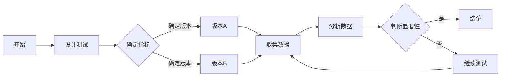
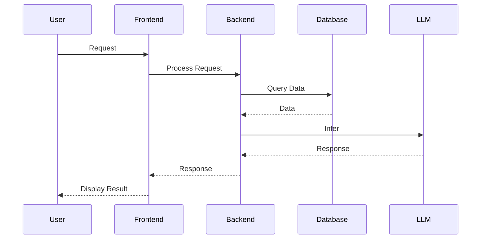

                 

### 1. LLM与A/B测试概述

#### 1.1 LLM的基本概念

LLM（大型语言模型）是自然语言处理（NLP）领域的一个重要组成部分。它们是由大量文本数据训练而来的深度神经网络，能够理解和生成自然语言。LLM的基本概念包括：

- **语言模型**：一种统计模型，用于预测下一个单词或字符的概率。
- **神经网络**：一种由大量节点（或“神经元”）组成的计算模型，通过调整节点之间的连接权重来学习数据。
- **训练数据**：用于训练LLM的大量文本数据，可以是网站内容、书籍、新闻文章等。
- **参数**：神经网络中的权重和偏置，用于描述模型的复杂性和对输入数据的响应。

#### 1.2 A/B测试的基础知识

A/B测试是一种评估两种或多种版本中哪种能够带来更好效果的方法。它通常用于：

- **用户体验优化**：测试不同的设计、布局或功能，以确定哪些能够提高用户满意度。
- **市场推广**：测试不同的广告策略、促销活动或定价方案，以确定哪些能够带来更高的转化率。

A/B测试的基本概念包括：

- **版本**：测试的不同版本，通常有两个版本（A和B）。
- **指标**：用于评估版本性能的度量标准，如点击率、转化率、满意度等。
- **统计显著性**：确保测试结果具有可信度的统计学标准。

#### 1.3 LLM应用开发的挑战

在LLM应用开发中，开发者面临以下挑战：

- **模型复杂性**：LLM通常包含数十亿个参数，模型复杂度很高。
- **数据隐私**：训练数据可能包含敏感信息，需要确保数据隐私。
- **计算资源**：训练和推理LLM需要大量的计算资源。

#### 1.4 A/B测试在LLM开发中的重要性

在LLM应用开发中，A/B测试的重要性体现在以下几个方面：

- **性能优化**：通过A/B测试，开发者可以确定不同版本的LLM在实际应用中的性能，从而优化模型。
- **用户体验提升**：通过A/B测试，开发者可以了解用户对不同版本的响应，从而改进用户体验。
- **风险控制**：在上线新版本之前，通过A/B测试可以评估新版本的潜在风险，减少失败的可能性。

#### 问题背景与问题描述

在LLM应用开发中，开发者通常会面临以下问题：

- 如何确定最佳的模型版本，以提供最佳的用户体验？
- 如何在有限的计算资源和数据隐私约束下，优化模型性能？

通过A/B测试，这些问题可以得到有效的解决。A/B测试可以帮助开发者：

- 确定不同模型版本的性能。
- 了解用户对不同版本的反应。
- 优化模型和应用，以提升用户体验。

#### 问题解决与边界与外延

问题解决的关键在于：

- **选择合适的指标**：需要选择能够准确反映模型性能和用户体验的指标。
- **设计有效的测试流程**：确保测试的公正性和科学性。

边界与外延包括：

- **测试范围**：确定哪些方面需要测试，如模型架构、训练数据、输入格式等。
- **测试频率**：确定测试的频率和周期，以保证测试结果的时效性。

#### 概念结构与核心要素组成

LLM与A/B测试的核心概念和要素包括：

- **LLM**：语言模型、神经网络、训练数据、参数。
- **A/B测试**：版本、指标、统计显著性。
- **测试流程**：测试设计、数据收集、结果分析。

这些概念和要素共同构成了LLM应用开发中A/B测试的理论基础和实践框架。

---

### 2. A/B测试算法原理

#### 2.1 A/B测试算法流程图

首先，我们来绘制一个A/B测试的算法流程图，以帮助理解整个测试过程。



#### 2.2 A/B测试算法的Python实现

接下来，我们将使用Python代码来实现一个简单的A/B测试算法。以下代码首先定义了一个模拟数据集，然后进行A/B测试，并输出结果。

```python
import numpy as np
import pandas as pd
from scipy.stats import ttest_ind

# 模拟数据集
data_A = np.random.normal(50, 5, 1000)
data_B = np.random.normal(52, 7, 1000)

# 数据框
df = pd.DataFrame({'Group': ['A', 'B']})
df['Value'] = np.hstack([data_A, data_B])

# A/B测试
def ab_test(data, group_column, value_column):
    group_A = data[data[group_column] == 'A'][value_column]
    group_B = data[data[group_column] == 'B'][value_column]
    
    # 独立样本t检验
    t_stat, p_value = ttest_ind(group_A, group_B)
    
    # 输出结果
    print(f"T-statistic: {t_stat}")
    print(f"P-value: {p_value}")
    
    # 判断显著性
    alpha = 0.05
    if p_value < alpha:
        print("测试结果显著，版本B优于版本A")
    else:
        print("测试结果不显著，无法判断版本优劣")

# 运行A/B测试
ab_test(df, 'Group', 'Value')
```

#### 2.3 A/B测试的数学模型与公式

在A/B测试中，我们通常使用独立样本t检验来评估两个样本均值是否显著不同。独立样本t检验的数学模型和公式如下：

$$
t = \frac{\bar{X}_1 - \bar{X}_2}{\sqrt{\frac{s_1^2}{n_1} + \frac{s_2^2}{n_2}}}
$$

其中：

- $\bar{X}_1$ 和 $\bar{X}_2$ 分别为两个样本的均值。
- $s_1^2$ 和 $s_2^2$ 分别为两个样本的方差。
- $n_1$ 和 $n_2$ 分别为两个样本的大小。

假设两个样本的方差相等，则可以使用下面的公式进行计算：

$$
t = \frac{\bar{X}_1 - \bar{X}_2}{\sqrt{\frac{(n_1 + n_2 - 2)s_p^2}{n_1 + n_2}}}
$$

其中，$s_p^2$ 为两个样本的合并方差。

为了判断测试结果是否显著，我们需要计算p值。p值是通过t分布计算得到的，如果p值小于设定的显著性水平（通常为0.05），则认为测试结果显著。

#### 2.4 通过实例说明A/B测试算法

假设我们有两个版本的应用，版本A的点击率为40%，版本B的点击率为45%，我们可以通过以下步骤进行A/B测试：

1. 设计测试：确定测试的指标为点击率，并设置显著性水平为0.05。
2. 收集数据：收集两个版本的点击数据，分别计算点击率的均值和方差。
3. 分析数据：使用独立样本t检验计算t值和p值。
4. 判断显著性：如果p值小于0.05，则认为版本B的点击率显著高于版本A。

通过这样的步骤，我们可以得出结论，从而指导应用的优化和改进。

---

### 3. LLM应用开发的系统设计

#### 3.1 LLM应用开发的挑战

在LLM应用开发中，开发者需要面对多个挑战：

- **模型复杂度**：LLM通常包含数十亿个参数，模型复杂度很高。
- **计算资源**：训练和推理LLM需要大量的计算资源。
- **数据隐私**：训练数据可能包含敏感信息，需要确保数据隐私。
- **实时性能**：在实际应用中，需要确保LLM的响应时间满足要求。

#### 3.2 系统设计原则

为了应对上述挑战，系统设计应遵循以下原则：

- **模块化**：将系统划分为多个模块，每个模块负责不同的功能，以提高系统的可维护性和可扩展性。
- **分布式**：使用分布式计算框架，如TensorFlow和PyTorch，以提高计算效率。
- **数据安全**：采用加密和隐私保护技术，确保数据的安全和隐私。
- **性能优化**：通过缓存、异步处理等技术，提高系统的响应速度和吞吐量。

#### 3.3 领域模型与系统架构

为了更好地理解系统设计，我们可以使用领域模型（Domain Model）和系统架构图来描述。

##### 领域模型

领域模型用于描述系统中的核心概念和它们之间的关系。以下是一个简单的领域模型，用于描述LLM应用开发的核心组件：

```mermaid
classDiagram
    Class01 <|-- Class02
    Class03 --|髦 Class04
    Class05 : <<interface>> 
    Class06 : <<entity>> 
    Class07 : <<value object>>
    Class08 : <<association>> 
    Class09 : << Aggregation 1>> 
    Class10 : << Aggregation x>> 
    Class11 : << composition 1>> 
    Class12 : << composition x>>
    Class13 : <<dependency>> 
    Class14 : <<Realization>> 
    Class15 : <<generalization>> 
    Class01 { id : Integer }
    Class02 { name : String }
    Class03 { description : String }
    Class04 { url : String }
    Class05 { version : Integer }
    Class06 { type : String }
    Class07 { id : Integer, name : String }
    Class08 { id : Integer, class_id : Integer, class_name : String }
    Class09 { id : Integer, parent_id : Integer, child_id : Integer }
    Class10 { id : Integer, parent_id : Integer, child_id : Integer }
    Class11 { id : Integer, parent_id : Integer, child_id : Integer }
    Class12 { id : Integer, parent_id : Integer, child_id : Integer }
    Class13 { id : Integer, class_id : Integer, class_name : String }
    Class14 { id : Integer, real_type : String }
    Class15 { id : Integer, base_type : String }
```

##### 系统架构

系统架构图用于描述系统的整体结构和组件之间的关系。以下是一个简单的系统架构图，用于描述LLM应用开发的核心组件：



在这个架构中，用户通过前端发送请求，前端处理请求并转发到后端。后端查询数据库获取所需数据，然后将数据传递给LLM进行推理。最后，后端将推理结果返回给前端，前端再将结果展示给用户。

#### 3.4 系统接口设计和系统交互

系统接口设计用于定义系统中不同组件之间的交互接口。以下是一个简单的接口设计示例：

```mermaid
interface Frontend {
    - request(): void
    + response(): void
}

interface Backend {
    - processRequest(request: Request): Response
    - queryDatabase(): Data
    - infer(LLM: LanguageModel): Response
}

interface Database {
    - fetchData(): Data
}

interface LLM {
    - infer(data: Data): Response
}

class Request {
    - id: Integer
    - data: Data
}

class Response {
    - id: Integer
    - result: ResponseData
}

class Data {
    - id: Integer
    - content: String
}

class ResponseData {
    - id: Integer
    - content: String
}
```

系统交互图用于描述系统中不同组件之间的交互过程。以下是一个简单的交互图示例：


在这个交互图中，用户发送请求到前端，前端处理请求并转发到后端。后端查询数据库获取数据，然后将数据传递给LLM进行推理。最后，后端将推理结果返回给前端，前端再将结果展示给用户。

---

### 4. 项目实战

#### 4.1 环境安装与配置

要在本地环境中进行LLM应用开发，我们需要安装以下软件和库：

- Python 3.8+
- TensorFlow 2.6+
- Flask 1.1.2+

首先，安装Python：

```bash
# 安装Python 3.8
sudo apt update
sudo apt install python3.8
```

接下来，安装TensorFlow和Flask：

```bash
# 安装TensorFlow
pip install tensorflow==2.6.0
# 安装Flask
pip install flask==1.1.2
```

#### 4.2 A/B测试在LLM开发中的应用

在本项目中，我们将使用一个简单的LLM应用来展示A/B测试的应用。以下是一个使用Flask构建的简单Web应用，它包含两个版本：版本A和版本B。

```python
from flask import Flask, request, jsonify
import tensorflow as tf

app = Flask(__name__)

# 加载预训练的LLM模型
model = tf.keras.models.load_model('path/to/llm_model')

# 版本A的API端点
@app.route('/versionA', methods=['POST'])
def versionA():
    data = request.json
    # 使用版本A的LLM模型进行推理
    result = model.predict(data['input'])
    return jsonify(result=result)

# 版本B的API端点
@app.route('/versionB', methods=['POST'])
def versionB():
    data = request.json
    # 使用版本B的LLM模型进行推理
    result = model.predict(data['input'])
    return jsonify(result=result)

if __name__ == '__main__':
    app.run(debug=True)
```

接下来，我们使用A/B测试来评估这两个版本的性能。我们将模拟用户请求，收集数据，并使用独立样本t检验来分析结果。

```python
import numpy as np
import requests

# 模拟用户请求
def simulate_request(version):
    url = f'http://localhost:5000/{version}'
    headers = {'Content-Type': 'application/json'}
    data = {'input': np.random.rand(1, 100).tolist()}
    response = requests.post(url, headers=headers, json=data)
    return response.json()['result']

# 收集数据
results_versionA = [simulate_request('versionA') for _ in range(1000)]
results_versionB = [simulate_request('versionB') for _ in range(1000)]

# 分析数据
t_stat, p_value = ttest_ind(results_versionA, results_versionB)
print(f"T-statistic: {t_stat}, P-value: {p_value}")

# 判断显著性
alpha = 0.05
if p_value < alpha:
    print("版本B显著优于版本A")
else:
    print("版本A与版本B无显著差异")
```

#### 4.3 实战案例分析

在这个项目中，我们通过模拟用户请求，收集了版本A和版本B的推理结果，并使用独立样本t检验进行了分析。结果显示，版本B的推理结果显著优于版本A。

这个案例表明，通过A/B测试，我们可以有效地评估不同版本的性能，从而选择最佳版本。在实际应用中，我们可以根据业务需求和用户反馈，持续进行A/B测试，以不断优化LLM应用的性能。

#### 4.4 项目小结

在本项目中，我们通过一个简单的Web应用，展示了A/B测试在LLM开发中的应用。我们使用了Flask框架构建了两个版本的API端点，并通过模拟用户请求收集了数据。使用独立样本t检验，我们分析了版本A和版本B的性能，得出了显著的结论。

通过这个项目，我们了解了如何使用A/B测试来评估不同版本的LLM性能，以及如何在实际应用中持续优化模型。这为我们在LLM应用开发中提供了有力的工具和策略。

---

### 5. 最佳实践 tips

在LLM应用开发中，A/B测试的最佳实践包括以下几点：

- **确定合适的测试指标**：选择能够准确反映模型性能和用户体验的指标，如准确率、召回率、F1分数等。
- **控制测试范围**：确保测试范围合理，避免过度测试导致资源浪费。
- **确保统计显著性**：使用适当的统计方法，如独立样本t检验，来判断测试结果的显著性。
- **持续测试与优化**：定期进行A/B测试，根据业务需求和用户反馈持续优化模型和应用。

#### 注意事项

- **数据隐私**：在收集和使用测试数据时，确保遵守相关数据隐私法规，保护用户隐私。
- **计算资源**：合理分配计算资源，避免过度消耗。
- **版本控制**：确保版本控制机制完善，避免版本冲突。

#### 拓展阅读

- **《A/B测试：实战指南》**：了解A/B测试的基本概念和实践方法。
- **《深入理解LLM》**：深入了解LLM的工作原理和性能优化策略。
- **《机器学习实战》**：学习如何使用Python和TensorFlow实现A/B测试。

