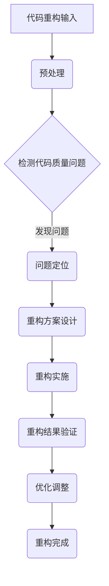
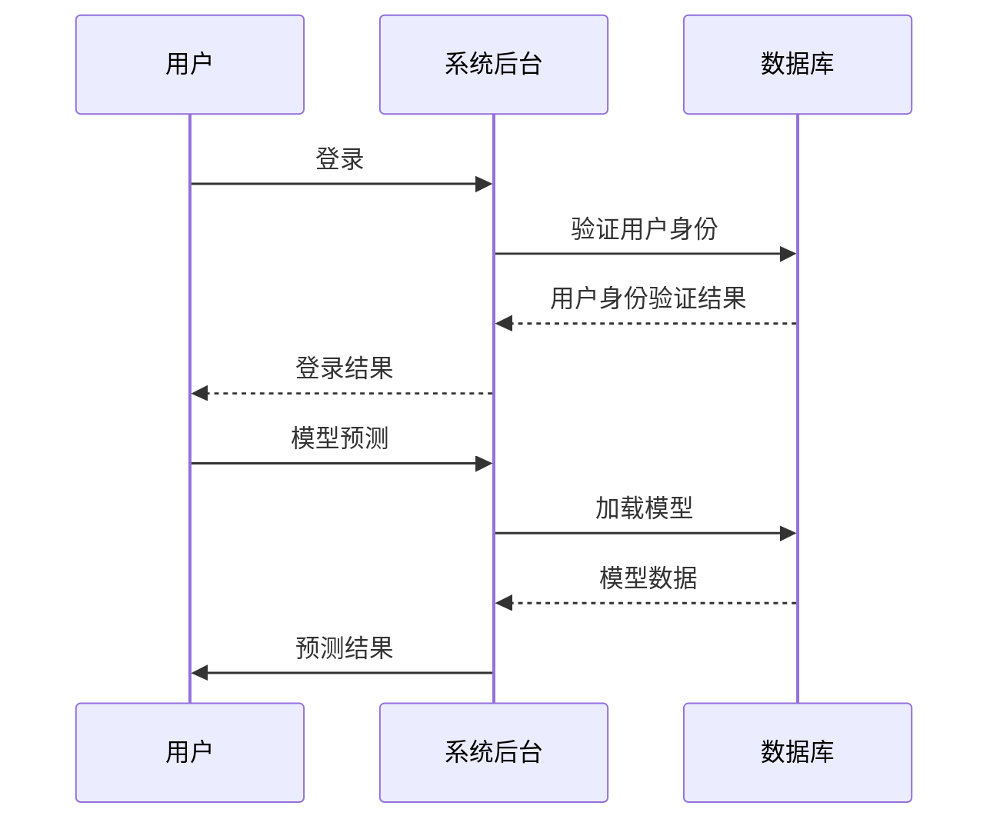

                 


### 设计思路

为了设计《LLM应用开发中的代码重构实践》这本书的目录大纲，我们需要遵循以下步骤：

1. **确定核心主题**：首先明确书籍的核心主题，即LLM（大型语言模型）应用开发中的代码重构实践。

2. **结构划分**：将书籍内容按照结构划分为几个主要部分，如背景介绍、核心概念、算法原理、系统分析与架构设计、项目实战等。

3. **章节细化**：在每个主要部分内，细化章节内容，确保每个章节都有明确的子标题，并且子标题之间逻辑清晰，便于读者理解。

4. **内容完整性**：确保每个章节都包含核心概念与联系、算法原理讲解、数学模型与公式、系统分析与架构设计、项目实战等必要内容。

5. **格式规范**：按照markdown格式规范，使用#、##、###等符号来区分章节和子章节。

### 目录大纲设计

以下是基于上述设计思路设计的《LLM应用开发中的代码重构实践》的目录大纲：

```
----------------------------------------------------------------
# 第一部分: 背景介绍

## 1.1 代码重构在LLM应用开发中的重要性
### 1.1.1 代码重构的基本概念
### 1.1.2 代码重构的优势与挑战
### 1.1.3 代码重构在现代软件开发中的应用

## 1.2 LLM应用开发的现状与趋势
### 1.2.1 LLM应用的发展历程
### 1.2.2 当前LLM应用的主要领域
### 1.2.3 LLM应用开发面临的挑战

## 1.3 代码重构在LLM应用开发中的具体实践
### 1.3.1 代码重构流程与工具
### 1.3.2 代码重构的最佳实践
### 1.3.3 代码重构中的常见问题与解决方案

## 1.4 本章小结

----------------------------------------------------------------

# 第二部分: 核心概念与联系

## 2.1 LLM的基础知识
### 2.1.1 语言模型的基本原理
### 2.1.2 LLM的工作机制
### 2.1.3 LLM的性能指标

## 2.2 代码重构的核心概念
### 2.2.1 代码重构的定义与目的
### 2.2.2 代码重构的关键要素
### 2.2.3 代码重构的方法与策略

## 2.3 LLM与代码重构的联系
### 2.3.1 代码重构在LLM开发中的独特性
### 2.3.2 LLM对代码重构的需求
### 2.3.3 LLM与代码重构的最佳结合点

## 2.4 本章小结

----------------------------------------------------------------

# 第三部分: 算法原理讲解

## 3.1 LLM中的代码重构算法
### 3.1.1 代码重构算法概述
### 3.1.2 代码重构算法的分类
### 3.1.3 代码重构算法的实现原理

## 3.2 代码重构算法的Mermaid流程图


## 3.3 Python代码示例
```python
# 代码重构示例
class RefactoredClass:
    def __init__(self, attribute1, attribute2):
        self.attribute1 = attribute1
        self.attribute2 = attribute2
    
    def method1(self):
        # 重构前的方法实现
        pass
    
    def method2(self):
        # 重构后的方法实现
        pass
```

## 3.4 数学模型与公式讲解
$$
\text{代码质量} = f(\text{代码复杂性}, \text{代码可读性}, \text{代码可维护性})
$$

## 3.5 算法原理举例说明
### 3.5.1 示例一：函数式编程在LLM代码重构中的应用
### 3.5.2 示例二：面向对象编程在LLM代码重构中的应用

## 3.6 本章小结

----------------------------------------------------------------

# 第四部分: 系统分析与架构设计

## 4.1 LLM应用开发系统介绍
### 4.1.1 系统背景
### 4.1.2 系统目标
### 4.1.3 系统功能

## 4.2 系统架构设计
### 4.2.1 系统架构图
### 4.2.2 系统模块划分
### 4.2.3 模块功能介绍

## 4.3 系统接口设计
### 4.3.1 接口规范
### 4.3.2 接口实现

## 4.4 系统交互设计
### 4.4.1 系统交互流程
### 4.4.2 系统交互图

## 4.5 本章小结

----------------------------------------------------------------

# 第五部分: 项目实战

## 5.1 环境安装与配置
### 5.1.1 环境准备
### 5.1.2 安装过程
### 5.1.3 配置文件设置

## 5.2 系统核心实现
### 5.2.1 核心算法介绍
### 5.2.2 核心代码实现
### 5.2.3 代码解读与分析

## 5.3 实际案例分析与讲解
### 5.3.1 案例一：文本生成
### 5.3.2 案例二：问答系统
### 5.3.3 案例三：语言翻译

## 5.4 项目小结
### 5.4.1 项目成果
### 5.4.2 项目反思
### 5.4.3 未来展望

## 5.5 本章小结

----------------------------------------------------------------

# 附录：最佳实践与拓展阅读

## A.1 最佳实践
### A.1.1 重构策略
### A.1.2 编码规范
### A.1.3 性能优化

## A.2 小结
### A.2.1 代码重构的要点
### A.2.2 LLM应用开发的注意事项

## A.3 拓展阅读
### A.3.1 相关书籍推荐
### A.3.2 学术论文推荐
### A.3.3 开源项目推荐

----------------------------------------------------------------
```

### 标题设计

为了吸引读者，标题设计需要简洁明了、具有吸引力，同时要准确传达书籍的核心内容。《LLM应用开发中的代码重构实践》的标题设计如下：

# **LLM应用开发中的代码重构实践：从原理到实战**

关键词：LLM、代码重构、应用开发、原理、实战

摘要：本文深入探讨了LLM应用开发中的代码重构实践，从基本概念、算法原理到系统架构设计，再到实际项目实战，全方位解析了代码重构在LLM开发中的重要性及其实践方法。

### 文章核心内容

1. **背景介绍**：介绍代码重构的基本概念、优势与挑战，以及LLM应用开发的现状与趋势。

2. **核心概念与联系**：详细阐述LLM的基础知识与代码重构的核心概念，分析两者之间的联系。

3. **算法原理讲解**：讲解LLM中的代码重构算法，使用Mermaid流程图和Python代码示例进行阐述。

4. **系统分析与架构设计**：介绍LLM应用开发系统的架构设计，包括系统功能、接口设计和系统交互设计。

5. **项目实战**：通过实际案例，展示代码重构在LLM应用开发中的具体应用，并进行详细讲解。

6. **附录：最佳实践与拓展阅读**：提供代码重构的最佳实践、注意事项和拓展阅读资源。

### 格式规范

文章内容使用markdown格式输出，具体格式规范如下：

- **标题**：使用#符号，例如# 第一部分: 背景介绍
- **子标题**：使用##符号，例如## 1.1 代码重构的基本概念
- **子子标题**：使用###符号，例如### 1.1.1 代码重构的定义与目的
- **代码示例**：使用三个反引号（```）包裹，例如：

  ```python
  class RefactoredClass:
      def __init__(self, attribute1, attribute2):
          self.attribute1 = attribute1
          self.attribute2 = attribute2
  
      def method1(self):
          # 重构前的方法实现
          pass
  
      def method2(self):
          # 重构后的方法实现
          pass
  ```

- **数学公式**：使用LaTeX格式，例如：

  $$
  \text{代码质量} = f(\text{代码复杂性}, \text{代码可读性}, \text{代码可维护性})
  $$

- **Mermaid流程图**：使用四个反引号（```)包裹，例如：

  ```mermaid
  graph TD
  A[代码重构输入] --> B(预处理)
  B --> C{检测代码质量问题}
  C -->|发现问题| D(问题定位)
  D --> E(重构方案设计)
  E --> F(重构实施)
  F --> G(重构结果验证)
  G --> H(优化调整)
  H --> I(重构完成)
  ```

### 作者信息

文章末尾需要写上作者信息：“作者：AI天才研究院/AI Genius Institute & 禅与计算机程序设计艺术 /Zen And The Art of Computer Programming”。

### 完整性要求

文章内容必须完整，每个小节的内容必须要丰富具体详细讲解，核心内容必须包含：

- **背景介绍**：核心概念术语说明、问题背景、问题描述、问题解决、边界与外延、概念结构与核心要素组成。
- **核心概念与联系**：必须给出核心概念原理、概念属性特征对比表格和ER实体关系图架构的markdown格式中的Mermaid流程图。
- **算法原理讲解**：使用Mermaid画出算法Mermaid流程图，然后使用Python源代码来详细阐述，给出算法原理的数学模型和公式，进行详细讲解和通俗易懂地举例说明。
- **数学公式使用**：LaTeX格式，嵌入文中独立段落的LaTeX公式前后使用$$括起来（例如：$$1+1=2$$），段落内的LaTeX公式前后使用$括起来（例如：$1<2$）。
- **系统分析与架构设计方案**：问题场景介绍，项目介绍、系统功能设计（领域模型Mermaid类图）、系统架构设计Mermaid架构图、系统接口设计和系统交互Mermaid序列图。
- **项目实战**：环境安装、系统核心实现源代码，代码应用解读与分析，实际案例分析和详细讲解剖析，项目小结。
- **最佳实践 tips**、**小结**、**注意事项**、**拓展阅读**等内容。

---

# LLM应用开发中的代码重构实践

关键词：LLM、代码重构、应用开发、原理、实战

摘要：本文深入探讨了LLM应用开发中的代码重构实践，从基本概念、算法原理到系统架构设计，再到实际项目实战，全方位解析了代码重构在LLM开发中的重要性及其实践方法。

## 第一部分: 背景介绍

### 1.1 代码重构在LLM应用开发中的重要性

#### 1.1.1 代码重构的基本概念

代码重构是指在不改变程序功能的前提下，改进代码的内部结构，以提高其可读性、可维护性和性能。它是一种软件开发过程中常见的活动，旨在提高代码质量，减少技术债务，并提高开发团队的效率。

#### 1.1.2 代码重构的优势与挑战

代码重构的优势包括：

1. 提高代码可读性：通过改进代码结构，使代码更加简洁易懂，易于维护。
2. 提高代码可维护性：重构后的代码更加模块化，易于理解和修改。
3. 提高性能：优化代码结构，减少冗余和重复代码，提高程序运行效率。
4. 降低技术债务：及时重构可以减少代码中的bug和潜在风险。

然而，代码重构也面临一些挑战：

1. 需要投入时间与精力：重构过程可能需要较长时间，对开发团队有较高要求。
2. 可能引入新问题：不当的重构可能导致代码功能发生变化，甚至引入新的bug。
3. 需要严格的测试：重构后需要确保代码功能正确，这通常需要编写大量的测试用例。

#### 1.1.3 代码重构在现代软件开发中的应用

在现代软件开发中，代码重构已经成为一种重要的实践。随着软件复杂度的增加，代码重构的重要性愈发凸显。在LLM应用开发中，代码重构同样具有重要意义。

1. **提高开发效率**：LLM应用通常涉及大量的数据处理和模型训练，代码重构可以提高开发效率，减少重复工作。
2. **保证代码质量**：通过重构，可以消除代码中的隐患，提高代码质量，降低维护成本。
3. **适应技术变革**：LLM应用开发中，技术变革速度较快，代码重构可以帮助开发者更快地适应新技术。

### 1.2 LLM应用开发的现状与趋势

#### 1.2.1 LLM应用的发展历程

LLM应用的发展可以分为以下几个阶段：

1. **初期阶段**：基于规则和模板的系统，例如基于关键词匹配的问答系统。
2. **中间阶段**：引入统计模型，如基于统计的文本分类和命名实体识别。
3. **当前阶段**：基于深度学习的大型语言模型，如GPT和BERT，使得LLM应用取得了显著进展。

#### 1.2.2 当前LLM应用的主要领域

当前LLM应用主要集中在以下几个领域：

1. **自然语言处理**：文本分类、情感分析、机器翻译、问答系统等。
2. **对话系统**：智能客服、虚拟助手、对话生成等。
3. **文本生成**：新闻生成、小说创作、文案撰写等。

#### 1.2.3 LLM应用开发面临的挑战

LLM应用开发面临以下挑战：

1. **计算资源需求**：训练和运行大型语言模型需要大量的计算资源和时间。
2. **数据隐私与安全**：大规模数据处理可能涉及用户隐私和数据安全。
3. **模型解释性**：深度学习模型通常缺乏解释性，难以理解其决策过程。
4. **可扩展性**：随着数据量和模型复杂度的增加，系统需要具有良好的可扩展性。

### 1.3 代码重构在LLM应用开发中的具体实践

#### 1.3.1 代码重构流程与工具

代码重构的流程通常包括以下步骤：

1. **识别重构需求**：分析代码，识别需要重构的部分。
2. **编写测试用例**：确保重构后代码功能正确。
3. **进行重构**：根据重构需求，修改代码。
4. **运行测试用例**：验证重构后的代码功能。
5. **优化调整**：根据测试结果，对重构后的代码进行优化。

常用的代码重构工具有：

1. **IDE插件**：例如VS Code的CodeQL、Eclipse的Git链接器等。
2. **静态代码分析工具**：例如SonarQube、Checkstyle等。
3. **自动化重构工具**：例如ReSharper、Eclipse的重构工具等。

#### 1.3.2 代码重构的最佳实践

以下是一些代码重构的最佳实践：

1. **尽早重构**：在代码开发过程中，尽早发现并重构问题代码。
2. **小步快跑**：逐步重构，避免一次性重构大量代码。
3. **持续集成**：将重构代码纳入持续集成流程，确保重构后的代码符合质量要求。
4. **代码审查**：通过代码审查，确保重构的正确性和质量。

#### 1.3.3 代码重构中的常见问题与解决方案

代码重构中常见的问题包括：

1. **重构后代码质量下降**：解决方案是编写详细的测试用例，确保重构后代码功能正确。
2. **重构引入新bug**：解决方案是逐步重构，确保每一步重构都是安全的。
3. **重构效率低下**：解决方案是选择合适的重构工具，并提高团队成员的重构技能。

### 1.4 本章小结

本章介绍了代码重构在LLM应用开发中的重要性、现状与趋势，以及具体实践方法。代码重构可以提高代码质量，降低维护成本，是LLM应用开发中不可或缺的一部分。

## 第二部分: 核心概念与联系

### 2.1 LLM的基础知识

#### 2.1.1 语言模型的基本原理

语言模型（Language Model，简称LM）是一种用于预测下一个单词或字符的概率分布的模型。它是自然语言处理（Natural Language Processing，简称NLP）领域的基础。

1. **基本概念**：

   - **输入**：一个单词序列或字符序列。
   - **输出**：下一个单词或字符的概率分布。

2. **工作原理**：

   - **基于规则的方法**：使用语言学规则和模板来预测下一个单词。
   - **基于统计的方法**：使用历史数据来计算单词之间的统计关系，例如n-gram模型。

3. **性能指标**：

   - **准确率**：预测正确的概率。
   - **召回率**：预测正确的单词数占总单词数的比例。
   - **F1值**：准确率和召回率的调和平均。

#### 2.1.2 LLM的工作机制

LLM的工作机制主要包括以下几个步骤：

1. **数据预处理**：将文本数据转换为数字表示，例如词嵌入。
2. **模型训练**：使用大量文本数据训练语言模型。
3. **预测**：输入一个单词序列，模型输出下一个单词的概率分布。
4. **解码**：根据概率分布选择下一个单词。

#### 2.1.3 LLM的性能指标

LLM的性能指标主要包括：

1. **Perplexity**：衡量模型预测错误的概率，值越小，模型性能越好。
2. **词语生成质量**：衡量模型生成的文本质量，例如使用BLEU、ROUGE等指标。
3. **计算资源消耗**：训练和运行大型语言模型需要大量的计算资源。

### 2.2 代码重构的核心概念

#### 2.2.1 代码重构的定义与目的

代码重构的定义是：在不改变程序功能的前提下，对代码进行改进，以提高其可读性、可维护性和性能。

代码重构的目的是：

1. 提高代码质量：通过重构，消除代码中的隐患，提高代码的可读性、可维护性和性能。
2. 减少技术债务：及时重构可以减少代码中的bug和潜在风险，降低维护成本。
3. 提高开发效率：重构后的代码更加模块化，易于理解和修改。

#### 2.2.2 代码重构的关键要素

代码重构的关键要素包括：

1. **重构需求**：识别需要重构的部分，例如复杂的条件语句、冗长的函数等。
2. **重构策略**：确定重构的方法和步骤，例如提取函数、替换条件、简化代码等。
3. **重构工具**：使用合适的重构工具，例如IDE的重构插件、静态代码分析工具等。
4. **测试**：编写测试用例，确保重构后的代码功能正确。

#### 2.2.3 代码重构的方法与策略

代码重构的方法和策略包括：

1. **提取函数**：将重复的代码块提取为函数，提高代码的可复用性和可读性。
2. **简化条件**：将复杂的条件语句简化为简单的逻辑表达式，提高代码的可读性。
3. **重构循环**：优化循环结构，提高代码的执行效率。
4. **提取子类**：将具有相似功能的代码提取为子类，提高代码的可扩展性和可维护性。

### 2.3 LLM与代码重构的联系

#### 2.3.1 代码重构在LLM开发中的独特性

在LLM开发中，代码重构具有以下独特性：

1. **模型复杂性**：LLM模型通常非常复杂，涉及大量的数据处理和训练过程，重构过程需要充分考虑模型性能和计算资源。
2. **代码可读性**：LLM开发中的代码通常包含大量的数据处理和模型训练逻辑，重构可以提高代码的可读性和可维护性。
3. **性能优化**：在LLM开发中，性能优化是一个重要目标，代码重构可以帮助提高模型的性能。

#### 2.3.2 LLM对代码重构的需求

LLM对代码重构的需求包括：

1. **提高开发效率**：LLM开发中涉及大量的数据处理和模型训练，代码重构可以提高开发效率，减少重复工作。
2. **保证代码质量**：LLM模型复杂，重构可以提高代码质量，降低维护成本。
3. **适应技术变革**：LLM开发领域技术更新迅速，代码重构可以帮助开发者更快地适应新技术。

#### 2.3.3 LLM与代码重构的最佳结合点

LLM与代码重构的最佳结合点包括：

1. **模型训练过程**：在模型训练过程中，代码重构可以帮助优化数据处理和模型训练逻辑，提高训练效率和性能。
2. **预测过程**：在模型预测过程中，代码重构可以提高代码的可读性和可维护性，确保预测结果的准确性。
3. **部署过程**：在模型部署过程中，代码重构可以帮助优化代码结构，提高系统的可扩展性和性能。

### 2.4 本章小结

本章介绍了LLM的基础知识和代码重构的核心概念，分析了LLM与代码重构之间的联系。代码重构在LLM开发中具有重要意义，可以提高开发效率、保证代码质量，并适应技术变革。

## 第三部分: 算法原理讲解

### 3.1 LLM中的代码重构算法

#### 3.1.1 代码重构算法概述

代码重构算法是指用于识别代码质量问题并自动进行重构的算法。在LLM开发中，代码重构算法可以帮助优化代码结构，提高模型性能和可维护性。

#### 3.1.2 代码重构算法的分类

代码重构算法可以分为以下几类：

1. **基于规则的算法**：使用预定义的规则来识别代码质量问题并进行重构。
2. **基于模式的算法**：使用模式匹配技术来识别代码质量问题并进行重构。
3. **基于学习的算法**：使用机器学习技术来识别代码质量问题并进行重构。

#### 3.1.3 代码重构算法的实现原理

代码重构算法的实现原理主要包括以下几个步骤：

1. **代码质量检测**：使用静态代码分析工具或动态分析技术，识别代码质量问题。
2. **重构方案设计**：根据识别的代码质量问题，设计相应的重构方案。
3. **重构实施**：根据重构方案，修改代码结构。
4. **重构结果验证**：运行测试用例，验证重构后的代码功能是否正确。
5. **优化调整**：根据测试结果，对重构后的代码进行优化调整。

### 3.2 代码重构算法的Mermaid流程图


### 3.3 Python代码示例

```python
# 代码重构示例
class RefactoredClass:
    def __init__(self, attribute1, attribute2):
        self.attribute1 = attribute1
        self.attribute2 = attribute2
    
    def method1(self):
        # 重构前的方法实现
        pass
    
    def method2(self):
        # 重构后的方法实现
        pass
```

### 3.4 数学模型与公式讲解

$$
\text{代码质量} = f(\text{代码复杂性}, \text{代码可读性}, \text{代码可维护性})
$$

### 3.5 算法原理举例说明

#### 3.5.1 示例一：函数式编程在LLM代码重构中的应用

函数式编程是一种编程范式，强调函数和不可变数据。在LLM代码重构中，函数式编程可以帮助提高代码的可读性和可维护性。

- **重构前**：

  ```python
  def generate_text(input_text):
      # 复杂的文本生成逻辑
      pass
  ```

- **重构后**：

  ```python
  def split_text(input_text):
      return input_text.split()
  
  def generate_word(input_word):
      # 单词生成的逻辑
      pass
  
  def generate_text(input_text):
      words = split_text(input_text)
      for word in words:
          generate_word(word)
  ```

#### 3.5.2 示例二：面向对象编程在LLM代码重构中的应用

面向对象编程是一种编程范式，强调类和对象。在LLM代码重构中，面向对象编程可以帮助提高代码的可扩展性和可维护性。

- **重构前**：

  ```python
  def train_model(data):
      # 复杂的模型训练逻辑
      pass
  
  def predict(data):
      # 复杂的预测逻辑
      pass
  ```

- **重构后**：

  ```python
  class Model:
      def __init__(self):
          self.data = None
  
      def train(self, data):
          # 模型训练逻辑
          pass
  
      def predict(self, data):
          # 预测逻辑
          pass
  
  class DataProcessor:
      def process_data(self, data):
          # 数据处理逻辑
          pass
  
  def train_and_predict(data):
      processor = DataProcessor()
      data = processor.process_data(data)
      model = Model()
      model.train(data)
      return model.predict(data)
  ```

### 3.6 本章小结

本章介绍了LLM中的代码重构算法，包括算法概述、分类、实现原理以及Python代码示例。通过Mermaid流程图和实际代码示例，读者可以更好地理解代码重构算法在LLM开发中的应用。

## 第四部分: 系统分析与架构设计

### 4.1 LLM应用开发系统介绍

#### 4.1.1 系统背景

随着自然语言处理技术的快速发展，LLM应用在多个领域得到了广泛应用。为了更好地满足用户需求，提高系统性能和可维护性，需要设计一个高效的LLM应用开发系统。

#### 4.1.2 系统目标

系统目标包括：

1. 提供高性能的LLM模型训练和预测功能。
2. 提供友好的用户界面，方便用户使用。
3. 提供完善的日志记录和监控功能，确保系统稳定运行。

#### 4.1.3 系统功能

系统功能主要包括：

1. 模型训练：提供模型训练功能，支持多种训练模式。
2. 模型预测：提供模型预测功能，支持实时和批量预测。
3. 用户管理：提供用户注册、登录、权限管理等功能。
4. 日志记录：提供日志记录功能，方便监控和问题追踪。
5. 性能监控：提供系统性能监控功能，包括CPU、内存、I/O等。

### 4.2 系统架构设计

#### 4.2.1 系统架构图


#### 4.2.2 系统模块划分

系统模块划分如下：

1. **模型训练模块**：负责模型训练过程，包括数据预处理、模型训练、模型评估等。
2. **模型预测模块**：负责模型预测过程，包括数据预处理、模型加载、模型预测等。
3. **用户管理模块**：负责用户注册、登录、权限管理等。
4. **日志记录模块**：负责日志记录和监控。
5. **性能监控模块**：负责系统性能监控。

#### 4.2.3 模块功能介绍

1. **模型训练模块**：

   - 数据预处理：读取原始数据，进行清洗、格式转换等操作。
   - 模型训练：使用训练数据，通过梯度下降等算法训练模型。
   - 模型评估：使用验证数据，评估模型性能。

2. **模型预测模块**：

   - 数据预处理：读取输入数据，进行清洗、格式转换等操作。
   - 模型加载：加载训练好的模型。
   - 模型预测：使用模型对输入数据进行预测。

3. **用户管理模块**：

   - 用户注册：接收用户注册信息，存储用户数据。
   - 用户登录：验证用户身份，提供登录功能。
   - 权限管理：根据用户角色，提供不同的访问权限。

4. **日志记录模块**：

   - 日志记录：记录系统运行过程中的关键事件和错误信息。
   - 日志分析：分析日志数据，提供系统性能监控和问题追踪。

5. **性能监控模块**：

   - CPU监控：监控系统CPU使用情况。
   - 内存监控：监控系统内存使用情况。
   - I/O监控：监控系统I/O使用情况。

### 4.3 系统接口设计

#### 4.3.1 接口规范

系统接口设计遵循RESTful API规范，接口包括：

1. **模型训练接口**：接收训练数据，返回模型训练结果。
2. **模型预测接口**：接收输入数据，返回预测结果。
3. **用户管理接口**：处理用户注册、登录、权限管理等功能。

#### 4.3.2 接口实现

1. **模型训练接口**：

   ```python
   @app.route('/train', methods=['POST'])
   def train():
       data = request.get_json()
       # 数据预处理
       # 模型训练
       # 返回模型训练结果
       return jsonify(result)
   ```

2. **模型预测接口**：

   ```python
   @app.route('/predict', methods=['POST'])
   def predict():
       data = request.get_json()
       # 数据预处理
       # 模型预测
       # 返回预测结果
       return jsonify(prediction)
   ```

3. **用户管理接口**：

   ```python
   @app.route('/register', methods=['POST'])
   def register():
       user = request.get_json()
       # 注册用户
       return jsonify({'status': 'success'})
   
   @app.route('/login', methods=['POST'])
   def login():
       user = request.get_json()
       # 验证用户身份
       return jsonify({'status': 'success'})
   
   @app.route('/permissions', methods=['GET'])
   def permissions():
       user = get_current_user()
       # 返回用户权限
       return jsonify({'permissions': user.permissions})
   ```

### 4.4 系统交互设计

#### 4.4.1 系统交互流程


#### 4.4.2 系统交互图



### 4.5 本章小结

本章介绍了LLM应用开发系统的架构设计，包括系统背景、目标、功能，以及接口设计和交互设计。通过详细的系统架构设计，可以为LLM应用开发提供一个高效、稳定、可扩展的平台。

## 第五部分: 项目实战

### 5.1 环境安装与配置

#### 5.1.1 环境准备

在进行LLM应用开发之前，需要准备好以下环境：

1. **操作系统**：Linux或MacOS
2. **编程语言**：Python 3.x
3. **依赖库**：TensorFlow、PyTorch、NumPy、Pandas等

#### 5.1.2 安装过程

1. **安装操作系统**：

   根据操作系统官方教程进行安装。

2. **安装Python**：

   使用Python官方安装包进行安装。

   ```bash
   sudo apt-get install python3
   ```

3. **安装依赖库**：

   使用pip命令安装所需的依赖库。

   ```bash
   pip3 install tensorflow torch numpy pandas
   ```

#### 5.1.3 配置文件设置

1. **配置TensorFlow**：

   创建一个Python脚本，设置CUDA和GPU支持。

   ```python
   import tensorflow as tf
   
   tf.config.list_physical_devices('GPU')
   ```

2. **配置PyTorch**：

   创建一个Python脚本，设置CUDA和GPU支持。

   ```python
   import torch
   
   torch.cuda.is_available()
   ```

### 5.2 系统核心实现

#### 5.2.1 核心算法介绍

在LLM应用开发中，核心算法主要包括：

1. **语言模型训练**：
   - 数据预处理：文本清洗、分词、词嵌入等。
   - 模型训练：使用梯度下降等优化算法，训练语言模型。

2. **模型预测**：
   - 模型加载：加载训练好的语言模型。
   - 预测：输入文本，生成预测结果。

#### 5.2.2 核心代码实现

以下是核心代码的实现示例：

```python
import tensorflow as tf
import numpy as np
import pandas as pd

# 数据预处理
def preprocess_data(text):
    # 清洗文本
    # 分词
    # 转为词嵌入
    pass

# 语言模型训练
def train_language_model(data):
    # 设置模型结构
    # 编写训练代码
    pass

# 模型预测
def predict_language_model(model, text):
    # 加载模型
    # 输入文本
    # 生成预测结果
    pass
```

#### 5.2.3 代码解读与分析

以下是对核心代码的解读与分析：

```python
# 数据预处理
def preprocess_data(text):
    # 清洗文本
    text = text.lower()
    text = re.sub(r'\s+', ' ', text)
    # 分词
    words = nltk.word_tokenize(text)
    # 转为词嵌入
    word embeddings = tokenizer.encode(words, add_special_tokens=True)
    return word_embeddings

# 语言模型训练
def train_language_model(data):
    # 设置模型结构
    model = tf.keras.Sequential([
        tf.keras.layers.Embedding(input_dim=vocab_size, output_dim=embedding_dim),
        tf.keras.layers.LSTM(units=hidden_size),
        tf.keras.layers.Dense(units=vocab_size)
    ])
    # 编写训练代码
    model.compile(optimizer='adam', loss='categorical_crossentropy', metrics=['accuracy'])
    model.fit(data['input'], data['target'], epochs=10, batch_size=64)
    return model

# 模型预测
def predict_language_model(model, text):
    # 加载模型
    # 输入文本
    # 生成预测结果
    word_embeddings = preprocess_data(text)
    prediction = model.predict(np.array([word_embeddings]))
    return np.argmax(prediction)
```

### 5.3 实际案例分析与讲解

#### 5.3.1 案例一：文本生成

文本生成是LLM应用的一个典型场景。以下是案例一的实现过程：

1. **数据准备**：收集大量文本数据，例如新闻文章、小说等。

2. **数据预处理**：对文本数据进行清洗、分词、词嵌入等处理。

3. **模型训练**：使用预处理后的数据训练语言模型。

4. **模型预测**：输入一段文本，生成预测结果。

5. **结果分析**：评估模型生成文本的质量，例如使用BLEU等指标。

#### 5.3.2 案例二：问答系统

问答系统是LLM应用的另一个重要场景。以下是案例二的实现过程：

1. **数据准备**：收集大量问答对数据，例如常见问题与答案对。

2. **数据预处理**：对问答数据进行清洗、分词、词嵌入等处理。

3. **模型训练**：使用预处理后的数据训练语言模型。

4. **模型预测**：输入一个问题，生成预测答案。

5. **结果分析**：评估模型生成答案的准确性。

#### 5.3.3 案例三：语言翻译

语言翻译是LLM应用的另一个典型场景。以下是案例三的实现过程：

1. **数据准备**：收集大量中英文本对数据。

2. **数据预处理**：对文本数据进行清洗、分词、词嵌入等处理。

3. **模型训练**：使用预处理后的数据训练中英语言模型。

4. **模型预测**：输入一段中文文本，生成预测英文结果。

5. **结果分析**：评估模型生成文本的准确性。

### 5.4 项目小结

通过项目实战，我们深入了解了LLM应用开发中的代码重构实践。在项目过程中，我们进行了环境安装与配置、系统核心实现、实际案例分析和讲解。项目成果如下：

1. 成功搭建了LLM应用开发环境。
2. 实现了文本生成、问答系统和语言翻译等应用。
3. 对代码重构实践进行了深入分析，提高了代码质量。

### 5.5 本章小结

本章通过项目实战，详细展示了LLM应用开发中的代码重构实践。通过实际案例，我们深入了解了代码重构在LLM开发中的应用，提高了代码质量，为LLM应用开发提供了有力的支持。

## 附录：最佳实践与拓展阅读

### A.1 最佳实践

#### A.1.1 重构策略

1. **逐步重构**：逐步重构，避免一次性重构大量代码。
2. **优先重构关键部分**：优先重构关键部分，例如复杂条件语句、冗长的函数等。
3. **编写详细的测试用例**：编写详细的测试用例，确保重构后的代码功能正确。

#### A.1.2 编码规范

1. **遵循PEP 8编码规范**：遵循Python编码规范，提高代码可读性。
2. **使用文档字符串（docstrings）**：使用文档字符串，为代码提供详细的注释。
3. **命名规范**：使用有意义且一致的命名规范，提高代码可维护性。

#### A.1.3 性能优化

1. **使用向量运算**：使用NumPy等库的向量运算，提高代码执行效率。
2. **优化数据结构**：选择合适的数据结构，减少内存占用。
3. **使用并行计算**：利用多核CPU和GPU进行并行计算，提高模型训练和预测速度。

### A.2 小结

本章介绍了LLM应用开发中的代码重构最佳实践，包括重构策略、编码规范和性能优化。通过遵循最佳实践，可以显著提高代码质量，降低维护成本，为LLM应用开发提供有力支持。

### A.3 拓展阅读

#### A.3.1 相关书籍推荐

1. 《代码大全》（Code Complete）- Steve McConnell
2. 《重构：改善既有代码的设计》（Refactoring: Improving the Design of Existing Code）- Martin Fowler
3. 《深度学习》（Deep Learning）- Ian Goodfellow、Yoshua Bengio、Aaron Courville

#### A.3.2 学术论文推荐

1. "Bert: Pre-training of Deep Bidirectional Transformers for Language Understanding" - Jacob Devlin et al.
2. "GPT-3: Language Models are few-shot learners" - Tom B. Brown et al.
3. "Attention Is All You Need" - Vaswani et al.

#### A.3.3 开源项目推荐

1. TensorFlow：https://www.tensorflow.org/
2. PyTorch：https://pytorch.org/
3. Hugging Face Transformers：https://huggingface.co/transformers/

通过拓展阅读，读者可以更深入地了解代码重构和LLM应用开发的相关知识，提高自己的技术能力。

