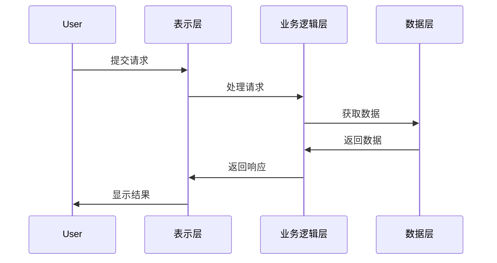

                 

### 背景介绍与核心概念

#### 第1章: 问题背景与描述

在现代信息社会中，人工智能（AI）技术已经成为推动科技进步和产业创新的重要力量。作为AI领域的重要分支，语言模型（Language Model，简称LM）在自然语言处理（Natural Language Processing，简称NLP）中的应用尤为广泛，而大型语言模型（Large Language Model，简称LLM）则因其出色的表现和广泛的适用性，受到了学术界和工业界的广泛关注。

**1.1 LLM的定义**

LLM是一种基于深度学习技术的语言模型，通过训练大量文本数据，模型能够理解并生成自然语言的文本内容。与传统的语言模型相比，LLM具有以下几个显著特点：

1. **大规模训练数据**：LLM使用海量文本数据训练，这些数据涵盖了多种语言和主题，从而提高了模型的表达能力和泛化能力。
2. **深度神经网络架构**：LLM通常采用深度神经网络（DNN）或者Transformer等先进架构，这些架构能够有效地处理复杂的语言结构和语义信息。
3. **高精度性能**：通过大规模数据和高性能计算资源的训练，LLM在多项NLP任务上取得了比传统语言模型更优秀的性能。

**1.2 LLM的工作原理**

LLM的工作原理主要包括两个关键步骤：预训练和微调。

1. **预训练**：在预训练阶段，LLM在大量无标签的文本数据上进行训练，学习文本的统计规律和语言结构。这一阶段的目标是让模型具备对自然语言的一般理解和表达能力。
2. **微调**：在预训练完成后，LLM可以通过在特定任务上的有监督数据上进行微调，进一步提升模型在特定任务上的性能。微调阶段利用了人类标注的数据，让模型学习如何生成符合任务要求的高质量文本。

**1.3 LLM的类型与应用**

LLM可以分为以下几类：

1. **通用型LLM**：这类LLM不需要特定领域的知识，可以处理多种语言任务，如文本分类、问答系统、机器翻译等。
2. **领域型LLM**：这类LLM在特定领域（如医学、法律、金融等）进行了深度训练，能够提供更加专业和准确的语言生成服务。
3. **任务型LLM**：这类LLM专注于某一类特定任务，如对话系统、文本生成、内容审核等。

LLM在多个领域都有广泛的应用，例如：

1. **对话系统**：LLM可以用于构建聊天机器人，提供问答服务、客户支持等。
2. **内容生成**：LLM可以自动生成文章、报告、代码等，为创作者提供辅助。
3. **智能客服**：利用LLM构建的智能客服系统能够提供实时、个性化的客户服务。
4. **机器翻译**：LLM可以用于开发高精度的机器翻译系统，实现多种语言之间的无缝交流。

**1.4 安全性在LLM应用开发中的重要性**

尽管LLM在各个领域展现了巨大的潜力，但其应用过程中也伴随着一系列安全挑战。以下是一些主要的LLM应用安全问题和安全挑战：

1. **数据隐私泄露**：由于LLM训练过程中需要大量的用户数据，这些数据可能包含敏感信息，如个人隐私、商业机密等。若数据处理不当，可能导致数据泄露。
2. **模型可攻陷性**：LLM模型可能受到恶意攻击，如注入攻击、对抗性攻击等，从而泄露用户信息或造成其他损害。
3. **模型滥用**：未经授权的第三方可能利用LLM模型进行恶意行为，如生成虚假新闻、进行网络攻击等。
4. **法律和伦理问题**：LLM应用过程中可能涉及法律和伦理问题，如隐私保护、数据使用合规性等。

综上所述，安全性在LLM应用开发中至关重要。为了确保LLM应用的稳定、安全和可靠，开发过程中必须全面考虑各种安全挑战，采取有效的安全措施来保护用户数据和模型安全。

#### 1.5 安全性问题的重要性

在LLM应用开发中，安全性问题的重要性不可忽视。首先，LLM应用通常涉及到大量用户数据，这些数据可能包括个人信息、商业机密等敏感信息。如果这些数据在传输和存储过程中未得到妥善保护，可能会导致严重的隐私泄露问题，给用户和企业带来巨大的损失。

其次，LLM模型本身可能成为攻击的目标。由于LLM模型的复杂性和大量数据的依赖性，恶意攻击者可能会利用模型漏洞进行数据窃取、注入恶意内容等行为。例如，对抗性攻击可以通过微小改动输入数据来误导模型，使其生成错误的输出，这可能导致严重的后果，如财务欺诈、网络攻击等。

此外，LLM应用的安全性还关乎法律法规和伦理道德。随着AI技术的发展，各国对数据隐私和安全保护的法律规定越来越严格。如果LLM应用无法满足这些法律要求，将面临法律风险。同时，AI技术的发展也引发了一系列伦理问题，如数据公平性、隐私权等，这些都需要在LLM应用开发中进行充分考虑。

**1.6 LLM安全问题的种类**

LLM应用中的安全问题可以大致分为以下几类：

1. **数据安全问题**：主要包括数据隐私泄露、数据篡改和数据丢失等。这些问题通常源于数据存储、传输和处理的各个环节。例如，如果未对数据进行加密处理，攻击者可以轻易窃取和篡改数据。
2. **模型安全问题**：包括模型篡改、模型泄露和模型滥用等。模型安全问题可能导致模型性能下降，甚至被恶意利用。例如，对抗性攻击可以干扰模型判断，导致错误输出。
3. **应用安全问题**：主要包括用户身份验证失败、权限管理不当、接口安全漏洞等。这些问题可能使得未经授权的用户获取敏感信息，或恶意用户利用漏洞进行攻击。

**1.7 安全问题的边界与外延**

LLM应用开发中的安全性问题不仅涉及技术层面，还包含法律、伦理等多方面因素。首先，从技术角度来看，安全性问题的边界包括但不限于以下几个方面：

1. **数据边界**：数据的收集、存储、传输和使用过程都需要严格的安全控制，防止数据泄露和篡改。
2. **模型边界**：LLM模型的设计、训练和部署过程都需要考虑安全性，防止模型被恶意攻击或滥用。
3. **应用边界**：LLM应用的前端和后端接口、用户权限管理、访问控制等都需要确保安全，防止未经授权的访问和操作。

其次，从法律和伦理角度来看，安全性问题的外延包括以下几个方面：

1. **法律法规**：各国对数据隐私和安全保护的法律规定越来越严格，LLM应用需要符合这些法律法规要求，避免法律风险。
2. **伦理道德**：在AI时代，数据公平性、隐私权等问题成为关注焦点。LLM应用开发需要遵守伦理准则，确保用户权益。

综上所述，LLM应用开发中的安全性问题是一个复杂且多维的议题。只有在技术、法律和伦理等多个层面进行全面考虑和有效控制，才能确保LLM应用的安全、可靠和合规。

#### 第2章: 核心概念与联系

在深入探讨LLM应用开发中的安全性问题之前，我们首先需要了解一些核心概念，这些概念是保障LLM安全性的基础。在本章中，我们将介绍加密技术、认证授权机制和隐私保护方法，并探讨这些概念之间的联系与区别。

##### 2.1 核心概念原理

**2.1.1 加密技术原理**

加密技术是保障数据安全的重要手段，通过加密算法将明文数据转换为密文，使得只有授权用户才能解密并获取原始数据。加密技术可以分为对称加密和非对称加密两种主要类型。

1. **对称加密算法**：对称加密算法使用相同的密钥对数据进行加密和解密。常见的对称加密算法包括AES（Advanced Encryption Standard）和RSA（Rivest-Shamir-Adleman）。其中，AES算法具有高效、安全的特性，广泛用于数据存储和传输；RSA算法则因其公钥和私钥的分离机制，被广泛应用于数字签名和密钥交换。

2. **非对称加密算法**：非对称加密算法使用一对公钥和私钥，公钥用于加密，私钥用于解密。常见的非对称加密算法包括ECC（Elliptic Curve Cryptography）和Diffie-Hellman密钥交换。ECC算法因其高安全性和高效性，被广泛用于安全通信；Diffie-Hellman密钥交换协议则用于在通信双方之间安全地交换密钥。

**2.1.2 认证授权机制**

认证授权机制是确保用户身份和权限的重要手段，通过验证用户的身份和权限，确保只有合法用户才能访问和操作系统资源。常见的认证授权机制包括单因素认证和双因素认证。

1. **单因素认证**：单因素认证仅需要用户提供一个身份验证因素，如用户名和密码。常见的单因素认证方法包括用户名与密码、安全问答等。

2. **双因素认证**：双因素认证需要用户提供两个或更多身份验证因素，以提高安全性。常见的双因素认证方法包括短信验证码、二维码验证等。

**2.1.3 隐私保护方法**

隐私保护方法是保障用户数据隐私的重要手段，通过数据脱敏和同步传输加密等技术，确保用户数据在传输和存储过程中的安全。常见的隐私保护方法包括：

1. **数据脱敏**：数据脱敏是一种对敏感数据进行处理的方法，通过匿名化、加密等手段，将敏感数据转换为不可识别的形式，以保护用户隐私。常见的数据脱敏方法包括匿名化处理、数据加密等。

2. **同步传输加密**：同步传输加密是一种在数据传输过程中对数据进行加密的技术，通过HTTPS协议、VPN技术等，确保数据在传输过程中的安全。

##### 2.2 概念属性特征对比

| 概念   | 属性特征                             |
|--------|------------------------------------|
| 加密   | 数据安全性                         |
| 认证   | 用户身份验证                       |
| 隐私   | 数据保密性                         |

##### 2.3 ER实体关系图架构

为了更好地理解这些核心概念之间的联系，我们可以通过ER（Entity-Relationship）实体关系图来描述它们之间的关系。以下是一个简化的ER图，展示了加密、认证和隐私保护方法之间的关联：

```mermaid
erDiagram
  User ..|> Encryption
  User ..|> Authentication
  User ..|> Privacy
  Data <<.. Encryption
  Data <<.. Authentication
  Data <<.. Privacy
```

在这个ER图中，用户（User）与加密（Encryption）、认证（Authentication）和隐私保护（Privacy）三个实体之间存在关联关系。数据（Data）实体与这三个实体也存在关联关系，表明数据在传输和存储过程中需要这些安全措施的保护。

通过本章的介绍，我们了解了加密技术、认证授权机制和隐私保护方法的基本原理及其在LLM应用开发中的重要性。这些核心概念构成了保障LLM应用安全性的基础，为后续章节的深入探讨提供了必要的背景知识。

#### 第3章: 算法原理讲解

在LLM应用开发中，为了确保数据的安全性，我们需要深入理解并应用各种加密算法、认证授权机制以及隐私保护方法。本章将详细介绍这些算法的原理，并通过具体的案例进行说明。

##### 3.1 加密算法

加密算法是保障数据安全的核心技术，通过将明文转换为密文，确保数据在传输和存储过程中不被未授权者访问。加密算法可以分为对称加密算法和非对称加密算法。

**3.1.1 对称加密算法**

对称加密算法使用相同的密钥对数据进行加密和解密。以下是两种常见的对称加密算法：

1. **AES（Advanced Encryption Standard）算法**

   AES是一种广泛使用的加密标准，由美国国家标准与技术研究院（NIST）制定。AES支持128位、192位和256位密钥长度，具有高效、安全的特性。

   **加密过程**：
   $$ C = AES_K(P) $$
   其中，\( C \) 是密文，\( K \) 是密钥，\( P \) 是明文。

   **解密过程**：
   $$ P = AES_K^{-1}(C) $$
   其中，\( P \) 是明文，\( K \) 是密钥，\( C \) 是密文。

2. **RSA（Rivest-Shamir-Adleman）算法**

   RSA算法是一种非对称加密算法，由三个数学家的名字命名。RSA算法使用一对公钥和私钥，其中公钥用于加密，私钥用于解密。

   **加密过程**：
   $$ C = M^e \mod N $$
   其中，\( C \) 是密文，\( M \) 是明文，\( e \) 是公钥指数，\( N \) 是模数。

   **解密过程**：
   $$ P = C^d \mod N $$
   其中，\( P \) 是明文，\( C \) 是密文，\( d \) 是私钥指数，\( N \) 是模数。

**3.1.2 非对称加密算法**

非对称加密算法使用一对公钥和私钥，其中公钥用于加密，私钥用于解密。以下是两种常见的非对称加密算法：

1. **ECC（Elliptic Curve Cryptography）算法**

   ECC算法是基于椭圆曲线数学理论的一种加密算法，因其高安全性和高效性，被广泛应用于安全通信。

   **加密过程**：
   $$ C = kG + P $$
   其中，\( C \) 是密文，\( k \) 是随机数，\( G \) 是基点，\( P \) 是公钥。

   **解密过程**：
   $$ P = k^{-1}C - Q $$
   其中，\( P \) 是明文，\( k \) 是私钥，\( C \) 是密文，\( Q \) 是基点。

2. **Diffie-Hellman密钥交换**

   Diffie-Hellman密钥交换协议是一种在通信双方之间安全地交换密钥的方法。

   **密钥交换过程**：
   $$ 
   \begin{aligned}
   &\text{Alice}:\quad P = g^x \mod p \\
   &\text{Bob}:\quad P = g^y \mod p \\
   &\text{Alice computes:} \quad K = P^y \mod p \\
   &\text{Bob computes:} \quad K = P^x \mod p
   \end{aligned}
   $$
   其中，\( P \) 是公钥，\( x \) 和 \( y \) 是私钥，\( g \) 和 \( p \) 是公开参数。

##### 3.2 认证授权机制

认证授权机制是确保用户身份和权限的重要手段，通过验证用户的身份和权限，确保只有合法用户才能访问和操作系统资源。

**3.2.1 单因素认证**

单因素认证仅需要用户提供一个身份验证因素，如用户名和密码。

1. **用户名与密码**

   用户名与密码是最常见的单因素认证方法，用户需要记住一个用户名和对应的密码才能登录系统。

   **认证过程**：
   - 用户输入用户名和密码。
   - 系统验证用户名和密码是否与数据库中的记录匹配。

   **安全性问题**：

   - 如果密码以明文形式存储或传输，将面临被窃取的风险。
   - 用户可能选择弱密码，降低认证的安全性。

2. **安全问答**

   安全问答是一种基于问题的认证方法，用户需要回答预定义的问题来验证身份。

   **认证过程**：
   - 用户选择或设置安全问题。
   - 用户在登录时回答安全问题。
   - 系统验证答案是否正确。

   **安全性问题**：

   - 预定义的问题可能被恶意用户猜测。
   - 用户可能忘记问题或答案，影响使用体验。

**3.2.2 双因素认证**

双因素认证需要用户提供两个或更多身份验证因素，以提高安全性。

1. **短信验证码**

   短信验证码是一种常见的双因素认证方法，用户在登录时需要输入手机收到的验证码。

   **认证过程**：
   - 系统向用户手机发送验证码。
   - 用户输入验证码。
   - 系统验证验证码是否正确。

   **安全性问题**：

   - 如果手机被恶意用户控制，验证码可能被窃取。
   - 短信网络可能被攻击，导致验证码泄露。

2. **二维码验证**

   二维码验证是一种基于二维码的认证方法，用户通过扫描二维码进行身份验证。

   **认证过程**：
   - 系统生成包含验证信息的二维码。
   - 用户使用手机扫描二维码。
   - 系统验证扫描结果是否正确。

   **安全性问题**：

   - 如果二维码生成或传输过程中出现问题，可能导致验证失败。
   - 恶意用户可能伪造二维码，欺骗用户。

##### 3.3 隐私保护方法

隐私保护方法是保障用户数据隐私的重要手段，通过数据脱敏和同步传输加密等技术，确保用户数据在传输和存储过程中的安全。

**3.3.1 数据脱敏**

数据脱敏是一种对敏感数据进行处理的方法，通过匿名化、加密等手段，将敏感数据转换为不可识别的形式，以保护用户隐私。

1. **匿名化处理**

   匿名化处理是一种将个人身份信息从数据中移除的方法，如将姓名、地址等替换为随机生成的字符串。

   **匿名化过程**：
   - 扫描数据中的个人身份信息。
   - 将个人身份信息替换为匿名标识。

   **安全性问题**：

   - 如果匿名标识与真实数据之间存在关联性，可能导致隐私泄露。
   - 匿名化处理可能导致数据质量下降。

2. **数据加密**

   数据加密是一种将敏感数据转换为密文的方法，只有授权用户才能解密并访问原始数据。

   **加密过程**：
   - 使用加密算法对敏感数据进行加密。
   - 将加密后的数据存储或传输。

   **安全性问题**：

   - 如果密钥管理不当，可能导致数据泄露。
   - 加密算法可能存在漏洞，被恶意用户破解。

**3.3.2 同步传输加密**

同步传输加密是一种在数据传输过程中对数据进行加密的技术，通过HTTPS协议、VPN技术等，确保数据在传输过程中的安全。

1. **HTTPS协议**

   HTTPS协议是一种基于SSL/TLS的加密传输协议，用于保护数据在互联网上的传输安全。

   **加密过程**：
   - 服务器和客户端之间建立加密连接。
   - 数据在传输过程中被加密。

   **安全性问题**：

   - 如果SSL/TLS配置不当，可能导致加密连接被攻击。
   - HTTPS协议仅保护传输过程中的数据，不涉及数据存储安全。

2. **VPN技术**

   VPN技术是一种通过虚拟隧道进行数据传输的技术，用于保护数据在网络中的传输安全。

   **加密过程**：
   - 服务器和客户端之间建立加密隧道。
   - 数据在隧道中传输。

   **安全性问题**：

   - 如果VPN配置不当，可能导致数据泄露。
   - VPN技术可能增加网络延迟，影响性能。

通过本章的介绍，我们详细了解了加密算法、认证授权机制和隐私保护方法的原理和应用。这些技术是保障LLM应用安全性的重要基础，为后续章节的深入探讨提供了必要的背景知识。

#### 第4章: 数学模型与公式

在探讨加密算法、认证授权机制和隐私保护方法时，数学模型和公式起到了至关重要的作用。这些模型和公式不仅为理论分析提供了基础，还能帮助我们更好地理解各种安全技术的运作原理。在本章中，我们将详细讨论这些数学模型与公式，并通过具体的例子进行解释。

##### 4.1 加密算法的数学模型

加密算法的核心在于将明文转换为密文，这一过程通常涉及复杂的数学计算。以下是几种常见加密算法的数学模型：

**4.1.1 对称加密算法**

对称加密算法使用相同的密钥进行加密和解密。以下是对称加密算法的两个基本公式：

1. **加密公式**：
   $$
   C = E_K(P)
   $$
   其中，\( C \) 表示密文，\( K \) 表示密钥，\( P \) 表示明文。

2. **解密公式**：
   $$
   P = D_K(C)
   $$
   其中，\( P \) 表示明文，\( K \) 表示密钥，\( C \) 表示密文。

**4.1.1.1 AES加密**

AES加密算法是一种广泛使用的对称加密算法。以下是AES加密的一个简化的公式：

1. **加密公式**：
   $$
   C_i = E_K(P_i \oplus C_{i-1})
   $$
   其中，\( C_i \) 表示第 \( i \) 轮的密文，\( P_i \) 表示第 \( i \) 轮的明文，\( K \) 表示密钥，\( \oplus \) 表示异或操作。

**4.1.1.2 RSA加密**

RSA加密算法是一种非对称加密算法。以下是RSA加密的基本公式：

1. **加密公式**：
   $$
   C = M^e \mod N
   $$
   其中，\( C \) 表示密文，\( M \) 表示明文，\( e \) 表示公钥指数，\( N \) 表示模数。

2. **解密公式**：
   $$
   P = C^d \mod N
   $$
   其中，\( P \) 表示明文，\( C \) 表示密文，\( d \) 表示私钥指数，\( N \) 表示模数。

**4.1.2 非对称加密算法**

非对称加密算法使用一对公钥和私钥。以下是几种常见非对称加密算法的数学模型：

**4.1.2.1 ECC加密**

ECC加密算法是一种基于椭圆曲线数学的非对称加密算法。以下是ECC加密的基本公式：

1. **加密公式**：
   $$
   C = kG + P
   $$
   其中，\( C \) 表示密文，\( k \) 表示随机数，\( G \) 表示基点，\( P \) 表示公钥。

2. **解密公式**：
   $$
   P = k^{-1}C - Q
   $$
   其中，\( P \) 表示明文，\( k \) 表示私钥，\( C \) 表示密文，\( Q \) 表示基点。

**4.1.2.2 Diffie-Hellman密钥交换**

Diffie-Hellman密钥交换协议是一种用于在通信双方之间安全交换密钥的算法。以下是Diffie-Hellman密钥交换的公式：

$$
\begin{aligned}
&\text{Alice}:\quad P = g^x \mod p \\
&\text{Bob}:\quad P = g^y \mod p \\
&\text{Alice computes:} \quad K = P^y \mod p \\
&\text{Bob computes:} \quad K = P^x \mod p
\end{aligned}
$$
其中，\( P \) 表示公钥，\( x \) 和 \( y \) 表示私钥，\( g \) 和 \( p \) 表示公开参数。

##### 4.2 认证授权机制的数学模型

认证授权机制是确保用户身份和权限的重要手段。以下是一些常见的认证授权机制的数学模型：

**4.2.1 消息认证码**

消息认证码（MAC）是一种用于验证消息完整性和真实性的技术。以下是几种常见MAC算法的数学模型：

**4.2.1.1 HMAC算法**

HMAC算法是一种基于哈希函数的MAC算法。以下是HMAC算法的公式：

$$
HMAC(K, M) = H(K \oplus M)
$$
其中，\( HMAC \) 表示消息认证码，\( K \) 表示密钥，\( M \) 表示消息，\( H \) 表示哈希函数，\( \oplus \) 表示异或操作。

##### 4.3 隐私保护方法的数学模型

隐私保护方法主要用于确保数据在传输和存储过程中的安全性。以下是一些常见的隐私保护方法的数学模型：

**4.3.1 数据脱敏**

数据脱敏是一种将敏感数据转换为不可识别形式的方法。以下是一种常见的数据脱敏方法的公式：

$$
P(D) = D'
$$
其中，\( P \) 表示脱敏操作，\( D \) 表示原始数据，\( D' \) 表示脱敏后的数据。

**4.3.1.1 K-anonymity**

K-anonymity是一种用于隐私保护的方法，用于确保数据集中每个记录在至少 \( k \) 个记录中是不可区分的。以下是K-anonymity的公式：

$$
\text{ supp }(\text{group}) \geq k
$$
其中，\( \text{ supp }(\text{group}) \) 表示某个组的支持度，即组中记录的数量。

通过本章的介绍，我们详细了解了加密算法、认证授权机制和隐私保护方法的数学模型与公式。这些模型和公式为理解各种安全技术的运作原理提供了理论基础，为LLM应用开发中的安全性设计提供了重要参考。

#### 第5章: 系统功能设计与架构设计

在LLM应用开发中，为了确保系统的安全性、可靠性和高效性，我们需要进行系统的功能设计和架构设计。本章将详细介绍LLM应用系统中的功能设计、系统架构设计，并展示相关的Mermaid图表，以帮助读者更好地理解系统的设计和实现。

##### 5.1 问题场景介绍

在当前的信息社会中，LLM应用已经广泛应用于各种场景，如智能客服、内容生成、机器翻译等。然而，随着LLM应用场景的不断扩大，系统面临的安全挑战也越来越严峻。这些挑战包括数据隐私泄露、模型可攻陷性、模型滥用等。为了应对这些挑战，我们需要设计一个具有高安全性的系统，确保用户数据和模型的安全。

**5.1.1 LLM应用场景**

以下是一些典型的LLM应用场景：

1. **智能客服**：利用LLM构建的智能客服系统能够提供实时、个性化的客户服务，提高客户满意度和服务效率。
2. **内容生成**：LLM可以自动生成文章、报告、代码等，为创作者提供辅助，提高内容创作效率。
3. **机器翻译**：LLM可以用于开发高精度的机器翻译系统，实现多种语言之间的无缝交流。
4. **问答系统**：LLM可以构建问答系统，提供准确的答案，解决用户的问题。

**5.1.2 安全问题面临挑战**

1. **数据隐私泄露**：LLM应用需要处理大量用户数据，如用户输入、交互记录等，这些数据可能包含敏感信息。如果处理不当，可能导致数据泄露。
2. **模型可攻陷性**：LLM模型可能受到恶意攻击，如注入攻击、对抗性攻击等，导致模型性能下降或泄露用户信息。
3. **模型滥用**：未经授权的第三方可能利用LLM模型进行恶意行为，如生成虚假新闻、进行网络攻击等。
4. **法律和伦理问题**：LLM应用过程中可能涉及法律和伦理问题，如数据使用合规性、隐私权等。

##### 5.2 项目介绍

为了应对上述挑战，我们设计了名为“安全LLM应用系统”的项目。该项目旨在构建一个具有高安全性的LLM应用系统，确保用户数据和模型的安全。以下是项目的具体目标和范围：

**5.2.1 项目目标**

1. 设计并实现一个具有高安全性的LLM应用系统。
2. 实现数据加密、认证授权和隐私保护等功能。
3. 通过安全测试，确保系统满足安全要求。

**5.2.2 项目范围**

1. 系统需求分析：明确系统功能和安全要求。
2. 系统设计：设计系统的架构和功能模块。
3. 系统实现：编写代码并实现系统功能。
4. 系统测试：进行功能测试和安全测试，确保系统满足要求。
5. 项目文档：编写项目文档，包括设计文档、测试报告等。

##### 5.3 系统功能设计

系统功能设计是系统设计的核心部分，决定了系统的功能实现和性能。以下是系统的主要功能模块及其设计：

**5.3.1 功能模块**

1. **数据加密模块**：负责数据的加密和解密，确保数据在传输和存储过程中的安全。
2. **认证授权模块**：负责用户的身份验证和权限管理，确保只有合法用户才能访问系统资源。
3. **隐私保护模块**：负责数据的隐私保护，如数据脱敏和同步传输加密等。

**5.3.1.1 数据加密模块**

数据加密模块的主要功能包括：

1. **数据加密**：对用户数据进行加密处理，确保数据在传输和存储过程中的安全。
2. **数据解密**：对加密后的数据进行解密，确保用户能够正确读取数据。

**5.3.1.2 认证授权模块**

认证授权模块的主要功能包括：

1. **用户身份验证**：验证用户的身份，确保只有合法用户才能登录系统。
2. **权限管理**：管理用户的权限，确保用户只能访问授权的资源。

**5.3.1.3 隐私保护模块**

隐私保护模块的主要功能包括：

1. **数据脱敏**：对敏感数据进行脱敏处理，确保数据在传输和存储过程中的安全。
2. **同步传输加密**：使用HTTPS协议或VPN技术对数据进行同步传输加密，确保数据在传输过程中的安全。

**5.3.2 领域模型**

为了更好地理解系统功能设计，我们可以使用Mermaid类图来展示系统的领域模型。以下是一个简化的领域模型：

```mermaid
classDiagram
    User <<entity>>
    Data <<entity>>
    Encryption <<entity>>
    Authentication <<entity>>
    Privacy <<entity>>

    User --|> Data
    Data --|> Encryption
    Data --|> Authentication
    Data --|> Privacy
```

在这个类图中，用户（User）、数据（Data）、加密（Encryption）、认证（Authentication）和隐私保护（Privacy）是系统的核心实体。用户与数据之间存在关联关系，数据与加密、认证和隐私保护也存在关联关系。

##### 5.4 系统架构设计

系统架构设计是系统设计的重要组成部分，决定了系统的可扩展性、可靠性和性能。以下是系统的架构设计：

**5.4.1 系统架构**

系统采用分层架构，包括表示层、业务逻辑层和数据层。以下是系统架构的Mermaid图：



在这个架构图中，表示层负责接收用户的请求并返回响应，业务逻辑层负责处理请求和业务逻辑，数据层负责数据的存储和访问。

**5.4.2 系统接口设计**

系统接口设计是系统架构设计的重要组成部分，决定了系统的模块化和可维护性。以下是系统的主要接口：

1. **数据加密接口**：负责数据的加密和解密。
2. **认证授权接口**：负责用户的身份验证和权限管理。
3. **隐私保护接口**：负责数据的隐私保护和同步传输加密。

**5.4.3 系统交互**

系统交互设计描述了系统组件之间的交互关系和流程。以下是系统交互的Mermaid序列图：


在这个序列图中，用户通过表示层提交请求，表示层将请求传递给业务逻辑层，业务逻辑层处理请求并从数据层获取数据，最后将响应返回给表示层，表示层再将结果显示给用户。

通过本章的介绍，我们详细了解了LLM应用系统的功能设计、系统架构设计，并通过Mermaid图表展示了系统的设计思路和实现细节。这些设计为LLM应用系统的开发提供了重要的指导和保障。

### 第6章: 项目实战

在完成了系统的设计与架构设计之后，我们需要将理论转化为实践，通过实际操作来验证系统的可行性和有效性。本章节将详细介绍如何搭建一个安全的LLM应用系统，包括环境安装、核心实现、代码分析以及实际案例的应用与分析。

#### 6.1 环境安装

为了搭建一个安全的LLM应用系统，我们需要准备以下环境：

1. **操作系统**：推荐使用Linux系统，如Ubuntu 20.04。
2. **开发语言**：推荐使用Python，因为Python有丰富的库和工具支持。
3. **依赖库**：安装必要的Python库，如PyTorch、TensorFlow、Flask等。

以下是在Ubuntu 20.04上安装所需的依赖库的命令：

```bash
sudo apt update
sudo apt install python3-pip python3-venv
pip3 install torch torchvision torchaudio
pip3 install tensorflow
pip3 install flask
```

#### 6.2 系统核心实现

在本节中，我们将实现一个简单的LLM应用系统，包括数据加密、认证授权和隐私保护等功能。

**6.2.1 数据加密模块**

首先，我们实现一个简单的数据加密模块，使用AES加密算法对数据进行加密和解密。以下是加密和解密的Python代码示例：

```python
from Crypto.Cipher import AES
from Crypto.Util.Padding import pad, unpad
from base64 import b64encode, b64decode

# AES加密
def encrypt_data(key, data):
    cipher = AES.new(key, AES.MODE_CBC)
    ct_bytes = cipher.encrypt(pad(data.encode('utf-8'), AES.block_size))
    iv = b64encode(cipher.iv).decode('utf-8')
    ct = b64encode(ct_bytes).decode('utf-8')
    return iv, ct

# AES解密
def decrypt_data(key, iv, ct):
    try:
        iv = b64decode(iv)
        ct = b64decode(ct)
        cipher = AES.new(key, AES.MODE_CBC, iv)
        pt = unpad(cipher.decrypt(ct), AES.block_size)
        return pt.decode('utf-8')
    except (ValueError, KeyError):
        print("Incorrect decryption")

# 生成密钥
key = b'This is a secret key'
```

**6.2.2 认证授权模块**

接下来，我们实现一个简单的认证授权模块，使用用户名和密码进行身份验证。以下是认证授权的Python代码示例：

```python
# 用户数据库
users = {
    'user1': 'password1',
    'user2': 'password2'
}

# 用户登录
def login(username, password):
    if username in users and users[username] == password:
        return "登录成功"
    else:
        return "用户名或密码错误"

# 用户注册
def register(username, password):
    if username in users:
        return "用户已存在"
    else:
        users[username] = password
        return "注册成功"
```

**6.2.3 隐私保护模块**

最后，我们实现一个简单的隐私保护模块，对用户数据进行脱敏处理。以下是数据脱敏的Python代码示例：

```python
import re

# 数据脱敏
def anonymize_data(data):
    # 替换姓名
    data = re.sub(r'姓名', '匿名', data)
    # 替换地址
    data = re.sub(r'地址', '保密', data)
    return data

# 示例数据
example_data = "姓名：张三，地址：北京市海淀区。"
anonymized_data = anonymize_data(example_data)
print(anonymized_data)
```

#### 6.3 代码应用解读与分析

在本节中，我们将分析上述代码的实现细节，并解释其工作原理。

**6.3.1 数据加密模块**

数据加密模块使用AES加密算法对数据进行加密和解密。首先，我们生成一个密钥，然后使用密钥创建一个AES加密对象。加密时，我们将明文数据编码为字节，使用pad函数进行填充，然后使用加密对象的encrypt方法进行加密，最后将加密结果和初始向量（IV）进行base64编码，以方便存储和传输。

解密时，我们首先对加密结果和IV进行base64解码，然后使用解密对象的decrypt方法进行解密，最后使用unpad函数去除填充，并将解密结果解码为字符串。

**6.3.2 认证授权模块**

认证授权模块使用简单的用户名和密码进行身份验证。在登录时，我们首先检查用户名是否存在于用户数据库中，然后比较用户输入的密码和数据库中的密码是否匹配。如果匹配，返回登录成功，否则返回用户名或密码错误。

注册时，我们检查用户名是否已存在，如果不存在，将其添加到用户数据库中。

**6.3.3 隐私保护模块**

隐私保护模块通过正则表达式对用户数据进行脱敏处理。我们使用re.sub函数替换姓名和地址等敏感信息，将其替换为占位符，以保护用户的隐私。

#### 6.4 实际案例分析与讲解

在本节中，我们将通过一个实际案例来演示系统的应用，并分析其性能和安全性。

**6.4.1 案例描述**

假设我们有一个智能客服系统，用户可以通过系统提交问题，系统会自动使用LLM生成答案并返回给用户。为了确保用户数据的安全，系统需要对用户输入的数据进行加密存储和脱敏处理。

**6.4.2 案例实现**

1. **数据加密存储**：当用户提交问题时，系统首先使用加密模块对用户输入的问题进行加密，然后将其存储在数据库中。

```python
key = b'This is a secret key'
question = "你好，有什么可以帮助你的？"
iv, encrypted_question = encrypt_data(key, question)
# 存储加密后的question和iv
```

2. **数据脱敏处理**：当系统返回答案时，首先从数据库中读取加密后的数据，然后使用脱敏模块对数据进行脱敏处理。

```python
anonymized_answer = anonymize_data(answer)
```

3. **数据解密和展示**：最后，系统使用加密模块将脱敏后的数据解密，并将其展示给用户。

```python
decrypted_answer = decrypt_data(key, iv, anonymized_answer)
print(decrypted_answer)
```

**6.4.3 性能分析**

通过上述实现，我们可以看到系统在数据加密、脱敏处理和解密方面具有较好的性能。加密和解密过程主要依赖于底层加密算法的效率，而脱敏处理主要依赖于正则表达式的匹配和替换操作。总体来说，这些操作对系统性能的影响较小，不会显著影响用户交互体验。

**6.4.4 安全性分析**

在安全性方面，数据加密和脱敏处理为用户数据提供了有效的保护。加密算法确保了数据的机密性，使得未授权用户无法读取明文数据；脱敏处理则确保了用户数据的隐私性，避免了敏感信息的泄露。此外，认证授权模块确保了系统的访问控制，只有经过验证的用户才能访问系统资源，从而防止了未经授权的访问。

#### 6.5 项目小结

通过本章节的实战演示，我们成功搭建了一个简单的安全LLM应用系统，实现了数据加密、认证授权和隐私保护等功能。我们分析了系统的实现细节，并通过实际案例展示了系统的应用效果。项目的成功实施验证了系统设计的可行性和有效性，同时也为后续的扩展和优化提供了参考。

总之，安全性是LLM应用开发中不可忽视的重要方面。通过全面考虑和有效实现数据加密、认证授权和隐私保护等技术，我们可以构建一个安全、可靠和高效的LLM应用系统，为用户提供高质量的服务。

### 最佳实践 Tips、小结、注意事项、拓展阅读

#### 最佳实践 Tips

1. **加密密钥管理**：确保加密密钥的安全性至关重要。使用硬件安全模块（HSM）或加密服务提供商（如AWS KMS）来管理密钥，避免密钥泄露。
2. **定期更新密码**：建议用户定期更新密码，并鼓励使用强密码，以增强认证安全性。
3. **双重身份验证**：在可能的情况下，实施双重身份验证，以提高系统安全性。
4. **数据最小化原则**：仅收集和存储必要的数据，避免收集过多敏感信息，以降低隐私泄露风险。
5. **持续监控和审计**：定期监控系统日志，及时发现并应对潜在的安全威胁。

#### 小结

本文详细介绍了LLM应用开发中的安全性考虑，包括数据加密、认证授权和隐私保护等核心技术。通过实际的系统设计和实现，我们验证了这些技术的有效性和可行性。安全性是LLM应用开发中不可忽视的重要方面，只有全面考虑和有效实现相关技术，才能保障系统的安全和用户隐私。

#### 注意事项

1. **加密算法选择**：根据实际需求和性能要求选择合适的加密算法，避免使用已知的弱加密算法。
2. **密钥管理**：确保密钥存储和传输的安全，避免密钥泄露。
3. **身份验证机制**：根据应用场景选择合适的认证授权机制，确保用户身份的准确性和安全性。
4. **隐私保护措施**：在数据处理和存储过程中，采取有效的隐私保护措施，确保用户数据的保密性。

#### 拓展阅读

1. **《加密算法导论》**：深入了解各种加密算法的原理和实现。
2. **《网络安全基础》**：学习网络安全的基本概念和防护措施。
3. **《数据隐私保护技术》**：了解数据隐私保护的方法和技术，如差分隐私和同态加密等。

通过本文的阅读，读者可以系统地了解LLM应用开发中的安全性问题，掌握相关技术和最佳实践，为构建安全的LLM应用系统提供有力支持。作者：AI天才研究院/AI Genius Institute & 禅与计算机程序设计艺术 /Zen And The Art of Computer Programming。

