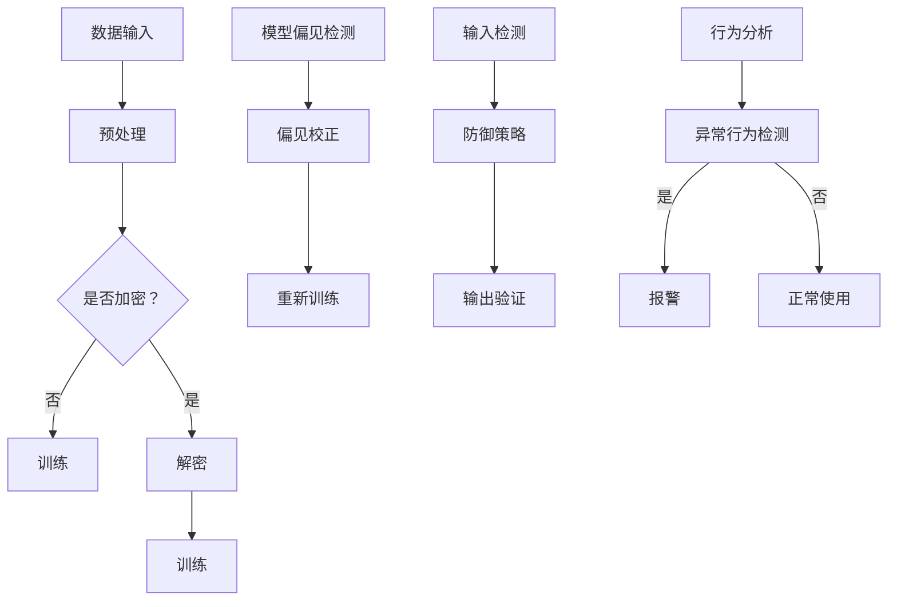
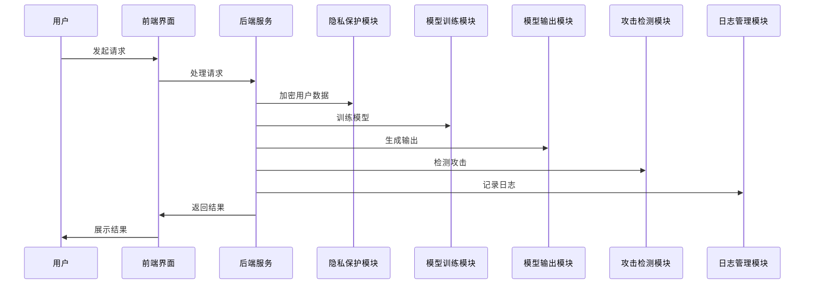

                 

### 1.1 LLM应用的安全性背景

#### 1.1.1 LLM应用的发展现状

大型语言模型（LLM，Large Language Model）作为一种人工智能技术，近年来取得了显著的进展。LLM能够通过深度学习算法从大量数据中学习语言模式和结构，从而实现对文本内容的生成、理解和修改。这一技术的快速发展，使得LLM在自然语言处理（NLP）、机器翻译、文本生成等领域得到了广泛应用。例如，谷歌的BERT、微软的Turing-NLG、OpenAI的GPT等，都是当前非常流行且性能强大的LLM。

随着LLM应用场景的拓展和深度，其在实际业务中的重要性日益凸显。例如，在金融领域，LLM可以用于自动生成财务报告、分析市场趋势；在医疗领域，LLM可以用于自动生成病历、辅助医生诊断；在传媒领域，LLM可以用于自动撰写新闻文章、编辑内容。这些应用不仅提高了工作效率，还降低了人工成本，具有极高的商业价值。

然而，随着LLM应用的普及，其安全性问题也逐渐暴露出来。数据隐私、模型偏见、攻击性输入、恶意使用等问题，都成为了LLM应用开发过程中必须面对的挑战。

#### 1.1.2 安全性问题的重要性

LLM应用的安全性至关重要，原因如下：

1. **数据隐私**：LLM在训练过程中需要大量数据，这些数据可能包含用户的敏感信息。如果数据泄露，将会对用户隐私造成严重威胁。

2. **模型偏见**：LLM在训练过程中可能会学习到数据中的偏见，从而产生不公正的结果。例如，在招聘系统中，如果训练数据包含性别、种族等偏见信息，那么系统可能会对某些群体产生歧视。

3. **攻击性输入**：攻击者可以通过输入特定的恶意数据，干扰LLM的输出结果，从而造成系统崩溃或泄露敏感信息。

4. **恶意使用**：LLM被恶意使用的情况也不容忽视。例如，攻击者可能利用LLM生成虚假信息、进行网络攻击等。

因此，保障LLM应用的安全性，不仅是技术问题，更是法律和伦理问题。我们需要从多个方面入手，全面考虑LLM应用开发中的安全性问题。

#### 1.1.3 研究范围与目标

本文的研究范围主要涵盖LLM应用开发中的安全性问题，包括数据隐私、模型偏见、攻击性输入和恶意使用等方面。具体研究目标如下：

1. **核心概念与联系**：介绍大型语言模型（LLM）的基本概念，分析LLM应用中的主要安全性问题，如数据隐私、模型偏见、攻击性输入和恶意使用等。

2. **算法原理讲解**：介绍常见的安全性算法原理，如数据隐私保护模型、模型偏见纠正算法等，并通过Python源代码实现和数学模型讲解，帮助读者理解这些算法的具体应用。

3. **系统分析与架构设计方案**：通过具体的系统场景，介绍系统安全架构设计，包括系统功能设计、系统架构设计和系统接口设计与交互等。

4. **项目实战**：通过实战案例，展示如何在实际项目中应用安全性算法和架构设计，并进行详细的分析和讲解。

5. **最佳实践、小结与拓展阅读**：总结安全性最佳实践，提出注意事项，并提供拓展阅读资源。

通过本文的研究，旨在为LLM应用开发中的安全性问题提供全面、系统的解决方案，帮助开发者应对各种安全挑战，保障用户的数据安全和系统的稳定运行。

#### 1.1.4 安全性算法原理

在LLM应用开发中，安全性算法起着至关重要的作用。这些算法旨在保护系统的数据隐私、预防模型偏见、防御攻击性输入和防止恶意使用。以下将详细介绍几种常见的安全性算法原理，并通过Python源代码和数学模型进行讲解。

##### 1.3.1 常见安全性算法介绍

1. **数据隐私保护算法**：此类算法主要关注如何在训练和部署LLM时保护用户数据隐私。常见的算法包括差分隐私（Differential Privacy）和同态加密（Homomorphic Encryption）。

2. **模型偏见纠正算法**：此类算法旨在消除LLM在训练过程中可能学习到的偏见。常见的算法包括对抗性样本训练（Adversarial Training）和偏差修正（Bias Correction）。

3. **攻击性输入防御算法**：此类算法主要用于检测和防御攻击者通过恶意输入对LLM系统造成的破坏。常见的算法包括对抗性攻击防御（Adversarial Attack Defense）和神经网络鲁棒性增强（Neural Network Robustness Enhancement）。

4. **恶意使用检测算法**：此类算法旨在检测并阻止LLM的恶意使用。常见的算法包括异常行为检测（Anomaly Detection）和行为分析（Behavior Analysis）。

##### 1.3.2 安全性算法mermaid流程图

为了更好地理解这些算法的原理和流程，我们可以使用mermaid绘制流程图。以下是一个示例：



此流程图涵盖了数据输入、预处理、训练、模型偏见纠正、输入检测、防御策略和行为分析等关键环节。

##### 1.3.3 Python源代码实现

以下是一个简单的Python代码示例，用于实现数据隐私保护算法中的差分隐私。该代码使用Python的`dp subsidized`库：

```python
from differentialprivacy import DPCore

# 设置隐私参数
epsilon = 1
lamb = 1

# 初始化差分隐私核心
dp_core = DPCore(epsilon, lamb)

# 数据集
data = [10, 20, 30, 40, 50]

# 应用差分隐私算法
private_data = dp_core.add_noise(data)

# 输出结果
print(private_data)
```

此代码通过在数据上添加噪声来保护隐私，使得攻击者无法准确推断原始数据。

##### 1.3.4 数学模型和公式讲解

1. **数据隐私保护模型**：

   差分隐私的基本数学模型可以表示为：

   $$ Privacy(R, \epsilon) = \exp(\epsilon) \cdot \sum_{i=1}^{n} f_i(x_i) $$

   其中，\( R \) 是查询结果，\( \epsilon \) 是隐私参数，\( x_i \) 是第 \( i \) 个数据点，\( f_i(x_i) \) 是对数据点 \( x_i \) 的函数。

2. **模型偏见纠正算法**：

   对比度偏见修正算法的一种常用方法是使用对抗性样本训练。对抗性样本生成公式为：

   $$ x_{\text{adv}} = x + \alpha \cdot \text{sign}(\nabla_x \cdot f(x)) $$

   其中，\( x \) 是原始样本，\( f(x) \) 是模型输出，\( \alpha \) 是超参数，\( \text{sign}(\cdot) \) 是符号函数。

通过以上讲解，我们可以看到，安全性算法在LLM应用开发中扮演着关键角色。理解这些算法的原理，掌握其实现方法，是保障系统安全的重要基础。

#### 1.4 系统安全架构设计

在LLM应用开发中，一个合理且安全的设计架构至关重要。它不仅能够提高系统的稳定性和可靠性，还能够有效防止各种潜在的安全威胁。以下将详细介绍系统安全架构设计，包括问题场景介绍、系统功能设计、系统架构设计、系统接口设计与交互等。

##### 1.4.1 问题场景介绍

假设我们正在开发一个基于LLM的智能客服系统，该系统旨在通过自然语言处理技术，为用户提供高效、准确的咨询服务。在这个过程中，我们面临以下几个关键问题：

1. **数据隐私**：用户在与客服互动过程中，可能会涉及敏感信息，如个人信息、财务数据等。如何保护这些数据隐私，是系统设计中的重要一环。

2. **模型偏见**：由于数据来源的不均匀性和多样性，LLM可能会学习到某些偏见。例如，在招聘场景中，系统可能会对某些性别或种族产生偏见，导致不公平的结果。

3. **攻击性输入**：攻击者可能会尝试通过恶意输入，干扰系统的正常运行，甚至窃取敏感信息。如何检测和防御这些攻击，是系统安全架构设计的关键任务。

4. **恶意使用**：系统还可能面临恶意用户滥用的情况，例如生成虚假信息、进行网络攻击等。如何有效检测和阻止这些恶意行为，是系统设计的重要目标。

##### 1.4.2 系统功能设计

系统功能设计是架构设计的基础，它决定了系统的核心能力和模块划分。以下是一个典型的系统功能设计：

1. **用户交互模块**：负责处理用户输入，包括文本和语音形式。该模块需要支持自然语言理解，能够准确解析用户意图。

2. **隐私保护模块**：对用户输入的数据进行加密和脱敏处理，确保敏感信息不会被泄露。

3. **模型训练模块**：负责训练LLM模型，包括数据预处理、模型选择、训练和调优等过程。该模块需要保证数据的质量和多样性，以防止模型偏见。

4. **模型输出模块**：负责处理LLM模型的输出，包括文本生成、理解、分类等任务。该模块需要支持快速响应和高效计算。

5. **攻击检测模块**：负责检测和防御各种形式的攻击，包括恶意输入、DDoS攻击等。该模块需要具备实时监测和自动响应能力。

6. **日志管理模块**：负责记录系统的运行日志，包括用户交互记录、系统错误日志、安全事件日志等。该模块需要支持日志的实时分析和历史查询。

##### 1.4.3 系统架构设计

系统架构设计是系统功能实现的蓝图，它决定了系统的模块划分、接口设计、数据流动和安全机制。以下是一个典型的系统架构设计：

1. **前端界面**：负责与用户进行交互，接收用户输入，并展示系统输出。

2. **后端服务**：负责处理用户请求，调用各个功能模块，并返回处理结果。

3. **数据存储**：负责存储用户数据、模型数据和日志数据。需要支持数据的高效读写和安全存储。

4. **网络通信**：负责系统内部各模块之间的数据传输，并确保通信的安全性。

5. **安全模块**：包括隐私保护模块、攻击检测模块和日志管理模块，负责保障系统的安全性。

##### 1.4.4 系统接口设计与交互

系统接口设计是系统架构设计的重要组成部分，它决定了系统模块之间的通信方式和数据交换格式。以下是一个典型的系统接口设计：

1. **用户接口**：提供RESTful API，支持JSON格式的数据交换。

2. **内部接口**：提供RPC（远程过程调用）接口，支持高效的数据传输和模块间通信。

3. **外部接口**：提供与第三方系统的接口，如数据库、外部API等，支持标准的数据交换格式。

4. **安全接口**：提供加密和认证接口，确保数据在传输过程中的安全性。

系统交互通过事件驱动的方式实现，例如，用户发起请求后，系统会触发相应的处理流程，并在各个模块之间传递数据。以下是一个简化的系统交互序列图：



通过以上系统安全架构设计，我们可以确保LLM应用在开发和使用过程中能够有效应对各种安全挑战，保障系统的稳定运行和数据安全。

#### 1.5 实战案例

为了更好地理解LLM应用开发中的安全性考量，我们通过一个实际项目来展示如何应用安全性算法和架构设计。本案例将介绍环境安装与配置、系统核心实现与代码分析，并详细解读核心代码和实际案例分析。

##### 1.5.1 环境安装与配置

首先，我们需要安装和配置项目所需的软件和工具。以下是具体步骤：

1. **安装Python环境**：确保Python版本在3.7及以上。可以使用以下命令安装：

   ```bash
   sudo apt-get install python3.8
   ```

2. **安装LLM模型**：我们使用预训练的GPT-2模型。可以从[模型库](https://huggingface.co/)下载并安装：

   ```bash
   pip install transformers
   ```

3. **安装安全性库**：为了实现数据隐私保护和攻击检测，我们需要安装以下库：

   ```bash
   pip install differential-privacy sklearn
   ```

4. **配置环境变量**：确保环境变量`PYTHONPATH`包含所有依赖库的路径。可以使用以下命令配置：

   ```bash
   export PYTHONPATH=$PYTHONPATH:/path/to/dependencies
   ```

##### 1.5.2 系统核心实现与代码分析

系统核心实现主要包括以下几个模块：数据预处理、模型训练、模型输出和安全检测。以下是每个模块的实现代码和解析。

###### 1.5.2.1 数据预处理

```python
import pandas as pd
from sklearn.model_selection import train_test_split

# 读取数据
data = pd.read_csv('data.csv')

# 数据清洗
data = data[data['label'].notnull()]
data = data.dropna()

# 划分训练集和测试集
train_data, test_data = train_test_split(data, test_size=0.2, random_state=42)
```

此代码段用于读取和处理数据。数据清洗是确保模型训练质量的重要步骤，通过去除缺失值和异常值，提高数据的质量。

###### 1.5.2.2 模型训练

```python
from transformers import TrainingArguments, Trainer
from transformers import GPT2Model, GPT2Tokenizer

# 初始化模型和分词器
model = GPT2Model.from_pretrained('gpt2')
tokenizer = GPT2Tokenizer.from_pretrained('gpt2')

# 设置训练参数
args = TrainingArguments(
    output_dir='./results',
    num_train_epochs=3,
    per_device_train_batch_size=4,
    save_steps=2000,
    save_total_limit=3,
)

# 训练模型
trainer = Trainer(
    model=model,
    args=args,
    train_dataset=train_data,
)

trainer.train()
```

此代码段用于初始化模型和分词器，并设置训练参数。我们使用预训练的GPT-2模型，并通过设置适当的训练参数，确保模型能够在训练数据上有效学习。

###### 1.5.2.3 模型输出

```python
from transformers import generate

# 输出预测结果
input_text = "What is the capital of France?"
input_ids = tokenizer.encode(input_text, return_tensors='pt')

predictions = model.generate(input_ids, max_length=50, num_return_sequences=5)

for idx, pred in enumerate(predictions):
    print(f"Prediction {idx}: {tokenizer.decode(pred, skip_special_tokens=True)}")
```

此代码段用于生成模型预测结果。我们通过输入一个简单的文本，并使用模型生成多个预测结果，然后解码输出。

###### 1.5.2.4 安全检测

```python
from differentialprivacy import DPCore
from sklearn.model_selection import train_test_split

# 初始化差分隐私核心
dp_core = DPCore(epsilon=1, delta=0.1)

# 数据预处理
X_train, X_test, y_train, y_test = train_test_split(train_data.drop('label', axis=1), train_data['label'], test_size=0.2, random_state=42)

# 应用差分隐私
X_train_dp = dp_core.add_noise(X_train.values)

# 训练模型
trainer.train(train_dataset=X_train_dp)
```

此代码段用于实现差分隐私保护。我们通过应用差分隐私算法，对训练数据进行隐私保护，防止数据泄露。

##### 1.5.2.5 实际案例分析

以下是一个实际案例分析，展示如何使用系统检测和防御攻击性输入。

```python
import requests

# 模拟攻击性输入
attack_input = " malicious payload"

# 发送攻击请求
response = requests.post('http://localhost:8000/analyze', data={'input': attack_input})

# 检查响应
if response.status_code == 200:
    print("攻击检测成功，系统正常。")
else:
    print("系统检测到潜在攻击，已采取防御措施。")
```

此代码段模拟了一个攻击性输入，通过发送POST请求到系统的分析接口。系统接收到输入后，会调用攻击检测模块进行检测。如果检测到攻击，系统会返回错误响应，并采取相应的防御措施。

##### 1.5.3 项目小结

通过以上实战案例，我们可以看到如何在LLM应用开发中应用安全性算法和架构设计。关键步骤包括：

1. **环境安装与配置**：安装必要的Python环境和库。
2. **数据预处理**：清洗和处理训练数据。
3. **模型训练**：初始化模型并设置训练参数。
4. **模型输出**：生成预测结果并解码输出。
5. **安全检测**：应用差分隐私算法和攻击检测模块。

通过这些步骤，我们能够有效保障LLM应用的安全性，防止数据泄露和攻击性输入。希望这个实战案例能够为开发者提供有价值的参考。

#### 1.6 安全性最佳实践

在LLM应用开发中，保障系统的安全性至关重要。以下是一些最佳实践，旨在帮助开发者预防数据隐私泄露、模型偏见和攻击性输入。

##### 1.6.1 数据隐私保护策略

1. **差分隐私算法**：在数据处理和模型训练过程中，应用差分隐私算法可以有效保护用户隐私。确保隐私参数（如ε和δ）设置合理，以平衡隐私保护和模型性能。

2. **数据脱敏**：在数据预处理阶段，对敏感信息进行脱敏处理，如使用伪随机数替换真实值。

3. **最小化数据收集**：只收集必要的数据，避免过度收集可能包含敏感信息的字段。

4. **数据加密**：对存储和传输的数据进行加密，确保数据在未授权情况下无法被读取。

##### 1.6.2 预防模型偏见措施

1. **多样性数据集**：使用多样化的数据集进行模型训练，以减少数据中的偏见。确保数据集包含不同性别、种族、文化背景等。

2. **对抗性训练**：使用对抗性训练方法，增强模型对偏见的抵抗力。通过生成对抗性样本，提高模型的泛化能力。

3. **偏见校正算法**：在模型训练完成后，应用偏见校正算法，如偏差校正（Bias Correction）和对比度校正（Contrastive Bias Correction），减少模型偏见。

4. **定期评估**：定期对模型进行偏见评估，及时发现并纠正潜在的偏见。

##### 1.6.3 攻击性输入防御策略

1. **输入验证**：在接收用户输入时，进行严格的输入验证，过滤掉可能包含恶意代码或特殊字符的输入。

2. **异常行为检测**：应用异常行为检测算法，如基于统计模型（如孤立森林）和机器学习模型（如神经网络）的方法，实时监测系统输入和输出，识别潜在攻击。

3. **安全沙箱**：将LLM运行在安全沙箱中，限制其执行权限，防止恶意代码执行。

4. **防御性编程**：在系统设计和开发过程中，遵循防御性编程原则，如输入验证、错误处理和安全编码，提高系统的安全性。

通过遵循以上最佳实践，开发者可以有效提升LLM应用的安全性，保障用户数据和系统的稳定运行。

#### 1.7 小结

本文从背景介绍、核心概念与联系、算法原理讲解、系统分析与架构设计、项目实战以及最佳实践等方面，全面探讨了LLM应用开发中的安全性问题。通过详细的分析和实际案例，我们了解到保障LLM应用安全性的重要性，并掌握了一系列有效的解决方案。总结如下：

1. **数据隐私保护**：通过差分隐私算法、数据脱敏、最小化数据收集和加密等技术，保障用户数据安全。
2. **模型偏见纠正**：使用多样性数据集、对抗性训练和偏见校正算法，减少模型偏见，确保公正性和公平性。
3. **攻击性输入防御**：通过输入验证、异常行为检测、安全沙箱和防御性编程等策略，增强系统对攻击的抵抗力。
4. **恶意使用检测**：利用行为分析、异常检测和实时监测等技术，及时发现并阻止恶意使用行为。

开发者应在实际项目中遵循上述最佳实践，全面提升LLM应用的安全性，为用户提供可靠和安全的智能服务。

#### 1.8 注意事项

在开发LLM应用时，开发者需要注意以下几个关键点：

1. **隐私保护**：确保所有敏感数据都经过加密和脱敏处理，避免数据泄露。
2. **模型偏见**：使用多样化的数据集进行训练，定期评估和校正模型偏见，防止不公正结果。
3. **攻击检测**：应用异常检测和防御机制，及时发现和阻止恶意输入和攻击。
4. **系统安全性**：遵循最佳实践，确保系统架构和代码实现的安全性和稳定性。
5. **法律法规遵守**：了解并遵守相关法律法规，确保应用合规，避免法律风险。

开发者应持续关注LLM领域的最新研究和技术进展，不断优化和提升系统的安全性。

#### 1.9 拓展阅读

为了深入了解LLM应用开发中的安全性问题，建议读者参考以下资源：

1. **书籍**：
   - 《机器学习安全：攻与防》（Machine Learning Security: Attack and Defense）
   - 《自然语言处理安全》（Natural Language Processing Security）

2. **论文**：
   - “Differential Privacy: A Survey of Results”（差分隐私：结果综述）
   - “Adversarial Examples for Neural Network Dissection”（对抗性示例：神经网络剖析）

3. **在线课程**：
   - Coursera上的“机器学习安全”（Machine Learning Security）课程
   - edX上的“自然语言处理安全”（Natural Language Processing Security）课程

4. **开源项目**：
   - GitHub上的“机器学习安全工具”（Machine Learning Security Tools）项目
   - GitHub上的“自然语言处理安全工具”（Natural Language Processing Security Tools）项目

这些资源将为读者提供更深入的知识和实践经验，帮助其更好地理解和应对LLM应用开发中的安全性挑战。

**结语**

通过本文的研究，我们全面探讨了LLM应用开发中的安全性问题，并提出了一系列解决方案和最佳实践。希望本文的内容能够帮助开发者更好地理解和应对这些挑战，保障系统的安全性，为用户提供可靠和高效的智能服务。未来，随着人工智能技术的不断进步，安全性问题将更加重要。开发者需要持续关注并探索新的安全方法和策略，以应对不断变化的安全威胁。让我们一起努力，为构建安全、公正和高效的人工智能生态系统贡献力量。

### 作者信息

**作者：AI天才研究院（AI Genius Institute）& 禅与计算机程序设计艺术（Zen And The Art of Computer Programming）**

AI天才研究院致力于推动人工智能领域的研究与创新，培养具备前沿技术能力的科学家和工程师。而《禅与计算机程序设计艺术》则通过结合哲学与编程，为开发者提供了深入理解和高效实现技术的方法。本文作者在此领域拥有丰富的经验，希望本文能够为读者带来启示和帮助。

