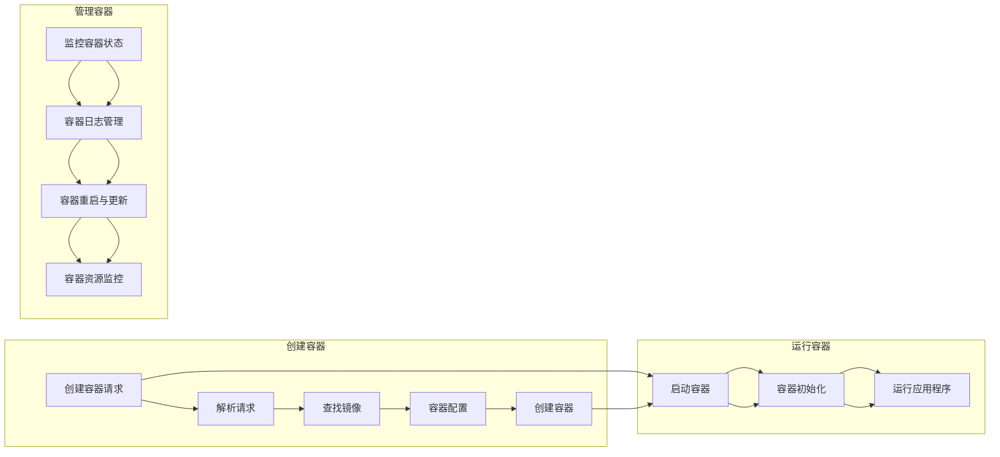
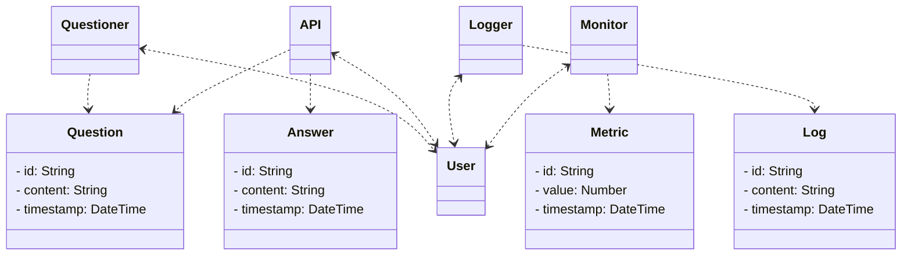

                 


# LLM应用开发中的容器化技术应用

## 关键词
- 容器化技术
- 大规模语言模型（LLM）
- Docker
- Kubernetes
- 可移植性
- 资源管理

## 摘要
本文旨在探讨容器化技术在大规模语言模型（LLM）应用开发中的重要性。通过详细分析容器化技术的基本概念、原理及其在LLM应用开发中的应用，文章将展示如何利用容器化技术解决可移植性、环境一致性和资源管理等问题，从而提高LLM应用的开发和部署效率。此外，文章还将通过一个实际项目案例，深入剖析容器化技术在LLM应用开发中的具体实现和最佳实践。

## 背景介绍

### 容器化技术的背景与重要性

容器化技术起源于2013年，随着Docker的发布而迅速流行。它为现代软件开发提供了一种高效、灵活的解决方案，尤其是在分布式系统和微服务架构中。容器化技术允许开发人员将应用程序及其依赖项打包到一个独立的、轻量级的容器中，实现了一次编写、到处运行（WORA）的目标。

在现代软件开发中，容器化技术的重要性体现在以下几个方面：

1. **可移植性**：容器提供了一个与宿主操作系统无关的运行环境，使得应用程序可以在不同的操作系统、云平台和硬件上无缝迁移。

2. **环境一致性**：容器确保了开发、测试和生产环境之间的一致性，减少了由于环境差异导致的开发问题。

3. **资源管理**：容器轻量级、高效的特点使得资源利用率显著提高，尤其是在多租户环境中，容器可以灵活地分配和回收资源。

### 容器化技术在LLM应用开发中的挑战

尽管容器化技术为软件开发带来了诸多优势，但在大规模语言模型（LLM）应用开发中仍面临一些挑战：

1. **计算资源需求**：LLM模型通常需要大量的计算资源，包括CPU、GPU和内存等。如何在容器环境中高效地利用这些资源成为关键问题。

2. **数据密集型操作**：LLM应用中的数据处理和传输通常需要大量网络带宽和存储空间，这对容器化环境的网络和存储性能提出了高要求。

3. **模型版本管理**：随着LLM模型的不断迭代和更新，如何有效地管理和部署不同版本的模型也是一个挑战。

### 解决方案与最佳实践

为了解决上述挑战，容器化技术在LLM应用开发中可以采取以下解决方案和最佳实践：

1. **使用Docker进行模型容器化**：通过Docker，可以将LLM模型及其依赖项打包到一个容器中，实现一次构建、多次部署的效果。

2. **利用Kubernetes进行模型部署和管理**：Kubernetes提供了强大的容器编排能力，可以自动化管理LLM模型的部署、扩展和更新。

3. **优化资源调度策略**：根据LLM模型的资源需求，设计合理的资源调度策略，确保容器在运行过程中获得足够的资源。

4. **实施数据缓存和优化**：通过数据缓存和优化技术，减少数据处理和传输的延迟，提高应用程序的响应速度。

### 边界与外延

容器化技术的影响不仅限于LLM应用，它还在云计算、微服务架构、持续集成和持续部署（CI/CD）等方面发挥着重要作用。随着容器化技术的不断演进，其在软件开发中的地位和影响力将日益增强。

### 概念结构与核心要素组成

容器化技术的基本概念和核心要素包括：

- **容器**：轻量级、可移植的运行时环境，包含应用程序及其依赖项。
- **Docker**：容器引擎，用于构建、运行和管理容器。
- **Kubernetes**：容器编排和管理平台，用于自动化容器的部署、扩展和更新。

接下来，我们将深入探讨容器化技术的基本概念、原理和应用，以便更好地理解其在LLM应用开发中的具体应用。

## 核心概念与联系

### 容器化技术原理

容器化技术通过将应用程序及其运行环境封装在一个独立的容器中，实现了应用程序与宿主操作系统的隔离。容器技术的基本原理包括以下几个方面：

1. **命名空间（Namespace）**：命名空间为容器提供了独立的资源视图，使得容器内的进程无法感知到其他容器的存在。命名空间包括PID命名空间、网络命名空间、用户命名空间等。

2. **控制组（Cgroup）**：控制组用于对容器进行资源限制和管理，包括CPU、内存、磁盘IO和网络带宽等。通过控制组，可以确保每个容器只能使用其分配到的资源。

3. **联合文件系统（UnionFS）**：联合文件系统允许将多个文件系统合并成一个统一的视图，从而实现容器的轻量级镜像管理。常见的联合文件系统包括Docker的AUFS和containerd的overlay2。

### 核心概念属性特征对比表格

以下是容器化技术中几个核心概念的属性特征对比表格：

| 概念       | 特性                                                                                      |
|------------|------------------------------------------------------------------------------------------|
| 容器       | 轻量级、可移植、独立运行环境、与宿主操作系统隔离                                        |
| Docker     | 容器引擎、负责构建、运行和管理容器、支持多种容器镜像格式                                 |
| Kubernetes | 容器编排和管理平台、自动化容器的部署、扩展和更新、提供集群管理功能                       |
| Cgroup     | 资源限制和管理、用于控制容器的CPU、内存、磁盘IO和网络带宽等                             |
| Namespace  | 提供独立的资源视图、隔离容器间的进程和网络连接、确保容器无法感知到其他容器的存在         |
| UnionFS    | 多个文件系统合并成一个统一视图、实现容器的轻量级镜像管理、常见格式包括AUFS和overlay2     |

### ER实体关系图架构

使用Mermaid，我们可以绘制容器化技术中的关键实体及其关系的ER图，如下所示：

```mermaid
erDiagram
  Container ||--|{ Image : 镜像 }|
  Container ||--|{ Namespace : 命名空间 }|
  Container ||--|{ Cgroup : 资源控制 }|
  Image ||--|{ Repository : 镜像仓库 }|
  Kubernetes ||--|{ Pod : 容器组 }|
  Kubernetes ||--|{ Service : 服务 }|
  Namespace ||--|{ Network : 网络命名空间 }|
  Cgroup ||--|{ Resource : 资源 }|

  Container_{颜色:蓝色} Container_{颜色:绿色} Container_{颜色:红色}
  Image_{颜色:蓝色} Image_{颜色:绿色} Image_{颜色:红色}
  Namespace_{颜色:蓝色} Namespace_{颜色:绿色} Namespace_{颜色:红色}
  Cgroup_{颜色:蓝色} Cgroup_{颜色:绿色} Cgroup_{颜色:红色}
  Kubernetes_{颜色:蓝色} Kubernetes_{颜色:绿色} Kubernetes_{颜色:红色}
  Pod_{颜色:蓝色} Pod_{颜色:绿色} Pod_{颜色:红色}
  Service_{颜色:蓝色} Service_{颜色:绿色} Service_{颜色:红色}
  Network_{颜色:蓝色} Network_{颜色:绿色} Network_{颜色:红色}
  Resource_{颜色:蓝色} Resource_{颜色:绿色} Resource_{颜色:红色}
```

## 算法原理讲解

### 容器化技术的算法原理

容器化技术涉及多个步骤和算法，下面我们将使用Mermaid绘制容器化技术的工作流程图，并详细讲解其原理。

#### 容器创建、运行和管理的工作流程图



#### 容器创建

1. **创建容器请求**：当需要创建一个容器时，开发人员会发送一个创建容器的请求。
2. **解析请求**：Docker会解析请求，确定所需的镜像、容器名称、环境变量等配置信息。
3. **查找镜像**：Docker会查找本地或远程镜像仓库中的指定镜像。
4. **容器配置**：根据解析的结果，Docker为容器配置命名空间、控制组和文件系统。
5. **创建容器**：完成配置后，Docker创建容器并返回容器ID。

#### 容器运行

1. **启动容器**：使用容器ID启动容器，Docker执行容器内的应用程序。
2. **容器初始化**：容器启动时，会执行一些初始化操作，如设置环境变量、加载配置文件等。
3. **运行应用程序**：容器初始化完成后，应用程序开始运行。

#### 容器管理

1. **监控容器状态**：Kubernetes监控系统会定期检查容器的状态，确保其正常运行。
2. **容器日志管理**：容器运行过程中产生的日志可以被集中收集和管理，以便于调试和监控。
3. **容器重启与更新**：如果容器出现故障或需要更新，Kubernetes可以自动重启容器或部署新版本的容器。
4. **容器资源监控**：监控容器的CPU、内存、网络和磁盘使用情况，确保资源合理分配。

### Python源代码示例

下面是一个简单的Python代码示例，用于创建并运行一个容器：

```python
import docker

# 创建Docker客户端
client = docker.from_env()

# 查找镜像
image = client.images.get('nginx')

# 创建容器配置
config = docker.models.container.Config(
    command=['nginx', '-g', 'daemon off;']
)

# 创建容器
container = client.containers.create(
    image=image,
    name='nginx-container',
    config=config
)

# 启动容器
container.start()

# 等待容器运行
container.wait()
```

### 数学模型和公式

容器化技术中的一些关键算法涉及到资源调度、网络模型和负载均衡等。以下是几个常用的数学模型和公式：

1. **资源调度算法**：

   - 负载均衡公式：\( \text{Load} = \frac{\sum_{i=1}^{N} \text{C}_{i}}{N} \)
   - 其中，\(\text{Load}\)表示系统的平均负载，\(\text{C}_{i}\)表示第\(i\)个容器的CPU使用率，\(N\)表示容器总数。

2. **容器网络模型**：

   - 路由算法：\( \text{Route}(s, d) = \min_{r \in R} \sum_{i=1}^{N} \text{C}_{i} \cdot \text{d}_{ir}(r, i) \)
   - 其中，\(\text{Route}(s, d)\)表示从源节点\(s\)到目标节点\(d\)的最佳路径，\(R\)表示所有可能的路径，\(\text{C}_{i}\)表示第\(i\)个容器的带宽需求，\(\text{d}_{ir}(r, i)\)表示路径\(r\)中的第\(i\)个跳数。

### 详细讲解与举例说明

为了更好地理解容器化技术的原理，我们将通过一个实际案例进行详细讲解。

#### 案例背景

假设我们正在开发一个基于大规模语言模型（LLM）的问答系统，需要将模型部署到多个容器中，并确保每个容器都能高效地运行。

#### 容器创建

1. **创建容器请求**：

   开发人员发送了一个创建容器的请求，指定了使用`nlptown/transformer-xl`镜像，并设置了容器的CPU和内存限制。

2. **解析请求**：

   Docker解析请求，确定所需的镜像和资源限制，并生成容器配置。

3. **查找镜像**：

   Docker在本地镜像仓库中找到了`nlptown/transformer-xl`镜像。

4. **容器配置**：

   Docker为容器配置了命名空间、控制组和文件系统，并设置了CPU和内存限制。

5. **创建容器**：

   Docker创建了一个名为`question-answering-container`的容器，并返回了容器ID。

#### 容器运行

1. **启动容器**：

   Docker使用容器ID启动容器，并执行以下命令：

   ```bash
   docker run -d --name question-answering-container --cpus 2 --memory 4g nlptown/transformer-xl
   ```

2. **容器初始化**：

   容器启动时，会执行一些初始化操作，如加载模型参数和配置文件。

3. **运行应用程序**：

   容器内的应用程序开始运行，并提供问答服务。

#### 容器管理

1. **监控容器状态**：

   Kubernetes监控系统会定期检查容器的状态，确保其正常运行。

2. **容器日志管理**：

   容器运行过程中产生的日志被自动收集并存储在Elasticsearch中，以便于后续的日志分析和监控。

3. **容器重启与更新**：

   如果容器出现故障，Kubernetes会自动重启容器。如果需要更新模型，Kubernetes会部署新的容器版本。

4. **容器资源监控**：

   Kubernetes会实时监控容器的CPU、内存、网络和磁盘使用情况，确保资源合理分配。

通过这个案例，我们可以看到容器化技术在LLM应用开发中的应用，以及如何利用容器化技术解决可移植性、环境一致性和资源管理等问题。

## 系统分析与架构设计方案

### 问题场景介绍

假设我们正在开发一个大规模语言模型（LLM）问答系统，该系统需要支持高并发、高性能和可扩展性。为了实现这些目标，我们决定使用容器化技术来部署和管理LLM模型。

### 项目介绍

本项目旨在构建一个基于Docker和Kubernetes的LLM容器化应用，提供以下功能和目标：

- **功能**：
  - 支持多语言问答
  - 实时处理高并发请求
  - 易于扩展和部署
  - 提供监控和日志分析功能
- **目标**：
  - 实现一次构建、多次部署的效率
  - 提高系统的可靠性和可维护性
  - 提供灵活的资源管理策略

### 系统功能设计

为了实现上述功能和目标，我们设计了以下系统功能模块：

1. **问答模块**：处理用户输入，调用LLM模型生成答案。
2. **模型模块**：加载和部署预训练的LLM模型。
3. **API模块**：提供RESTful API，供前端应用调用。
4. **监控模块**：实时监控系统的性能和资源使用情况。
5. **日志模块**：收集、存储和展示系统日志。

使用Mermaid绘制领域模型类图，如下所示：



### 系统架构设计

为了实现上述功能模块，我们设计了以下系统架构：

1. **容器化架构**：使用Docker将LLM模型、API和监控模块容器化，确保应用程序的轻量级和可移植性。
2. **Kubernetes集群**：使用Kubernetes进行容器编排和管理，实现自动化部署、扩展和更新。
3. **数据存储**：使用Elasticsearch存储日志和监控数据，提供高效的数据检索和分析功能。
4. **API网关**：使用Nginx或Traefik作为API网关，实现负载均衡和安全性。

使用Mermaid绘制系统架构图，如下所示：

```mermaid
sequenceDiagram
    participant User
    participant API
    participant Questioner
    participant Model
    participant Logger
    participant Monitor
    participant Elasticsearch

    User ->> API: 发送请求
    API ->> Questioner: 解析请求并生成问题
    Questioner ->> Model: 调用LLM模型
    Model ->> Answer: 生成答案
    Answer ->> API: 返回答案
    API ->> Logger: 记录日志
    API ->> Monitor: 发送监控数据
    Monitor ->> Elasticsearch: 存储监控数据

    Note over API,Questioner,Model,Logger,Monitor,Elasticsearch
        容器化架构
    End
```

### 系统接口设计

系统中的关键接口包括：

1. **问答接口**：用于接收用户输入和返回答案。
2. **日志接口**：用于记录和查询系统日志。
3. **监控接口**：用于发送和接收监控数据。

以下是接口协议的简要描述：

- **问答接口**：使用HTTP POST方法，请求体包含问题内容，响应体包含答案内容。
- **日志接口**：使用HTTP POST方法，请求体包含日志内容，响应体包含日志ID。
- **监控接口**：使用HTTP GET方法，返回JSON格式的监控数据。

### 系统交互

为了展示系统中的请求响应流程，我们使用Mermaid绘制了系统交互序列图，如下所示：

```mermaid
sequenceDiagram
    participant User
    participant API
    participant Questioner
    participant Model
    participant Logger
    participant Monitor
    participant Elasticsearch

    User ->> API: 发送问题
    API ->> Questioner: 解析问题
    Questioner ->> Model: 调用模型
    Model ->> Answer: 生成答案
    Answer ->> API: 返回答案
    API ->> Logger: 记录日志
    API ->> Monitor: 发送监控数据
    Monitor ->> Elasticsearch: 存储监控数据

    Note over User,API,Questioner,Model,Logger,Monitor,Elasticsearch
        请求响应流程
    End
```

通过上述系统分析与架构设计方案，我们可以确保LLM容器化应用的高效性、可靠性和可维护性。

## 项目实战

### 环境安装

为了搭建LLM容器化应用的开发和测试环境，我们需要安装以下软件：

1. **Docker**：用于容器化应用程序。
2. **Kubernetes**：用于容器编排和管理。
3. **Nginx或Traefik**：用于API网关和负载均衡。
4. **Elasticsearch**：用于日志存储和分析。

以下是具体的安装步骤：

#### 安装Docker

1. **Ubuntu 20.04**：

   ```bash
   sudo apt-get update
   sudo apt-get install docker.io
   sudo systemctl start docker
   sudo systemctl enable docker
   ```

2. **CentOS 8**：

   ```bash
   sudo dnf install docker
   sudo systemctl start docker
   sudo systemctl enable docker
   ```

#### 安装Kubernetes

1. **使用Helm**：

   ```bash
   sudo apt-get update
   sudo apt-get install helm
   helm repo add bitnami https://charts.bitnami.com/bitnami
   helm repo update
   helm install my-kubernetes-cluster bitnami/kubernetes-cluster
   ```

2. **验证安装**：

   ```bash
   kubectl version
   ```

#### 安装Nginx或Traefik

1. **Nginx**：

   ```bash
   helm repo add bitnami https://charts.bitnami.com/bitnami
   helm repo update
   helm install my-nginx bitnami/nginx
   ```

2. **Traefik**：

   ```bash
   helm repo add traefik https://helm.traefik.io/traefik
   helm repo update
   helm install my-traefik traefik/traefik
   ```

#### 安装Elasticsearch

1. **使用Helm**：

   ```bash
   helm repo add elasticsearch https://helm.elastic.co
   helm repo update
   helm install my-elasticsearch elastic/elasticsearch
   ```

2. **配置Elasticsearch**：

   ```bash
   kubectl exec -it my-elasticsearch-master-0 -- /bin/bash
   /bin/bash bin/elasticsearch-plugin install x-pack
   ```

### 系统核心实现源代码

以下是一个简单的LLM容器化应用的Dockerfile，用于构建基于`nlptown/transformer-xl`镜像的容器：

```dockerfile
FROM nlptown/transformer-xl:latest

# 设置工作目录
WORKDIR /app

# 复制模型文件
COPY transformer-xl-model /app/

# 暴露端口
EXPOSE 8080

# 运行应用程序
CMD ["python", "app.py"]
```

### 代码应用解读与分析

1. **FROM指令**：指定基础镜像为`nlptown/transformer-xl:latest`，这是一个预训练的Transformer-XL模型。
2. **WORKDIR指令**：设置工作目录为`/app`，这是应用程序的运行目录。
3. **COPY指令**：将本地模型文件复制到容器中的`/app/`目录。
4. **EXPOSE指令**：暴露端口8080，这是应用程序的HTTP服务端口。
5. **CMD指令**：运行应用程序`app.py`，这是我们的问答服务脚本。

下面是`app.py`的简单示例：

```python
from flask import Flask, request, jsonify
import torch
from transformers import TransformerXLForQuestionAnswering

app = Flask(__name__)

# 加载预训练模型
model = TransformerXLForQuestionAnswering.from_pretrained("nlptown/transformer-xl")
model.eval()

@app.route('/question', methods=['POST'])
def answer_question():
    data = request.get_json()
    question = data['question']
    context = data['context']
    
    # 预处理输入
    input_ids = tokenizer.encode(question, context, add_special_tokens=True, return_tensors='pt')
    
    # 预测答案
    with torch.no_grad():
        outputs = model(input_ids)
    logits = outputs.logits
    start_logits, end_logits = logits.split([1, 1], dim=1)
    
    # 解析答案
    start_indices = torch.argmax(start_logits, dim=-1).squeeze()
    end_indices = torch.argmax(end_logits, dim=-1).squeeze()
    
    start_idx = start_indices.item()
    end_idx = end_indices.item()
    answer = context[start_idx:end_idx].strip()
    
    return jsonify({'answer': answer})

if __name__ == '__main__':
    app.run(host='0.0.0.0', port=8080)
```

1. **Flask**：使用Flask框架创建Web服务。
2. **Transformers库**：加载预训练的Transformer-XL模型。
3. **/question路由**：处理POST请求，提取问题和上下文，预处理输入，预测答案，并返回JSON格式的答案。

### 实际案例分析和详细讲解剖析

假设我们有一个用户输入的问题：“什么是云计算？”以及一段上下文：“云计算是一种通过互联网提供计算资源的服务，允许用户按需访问和处理数据。”。

#### 预处理输入

1. **编码问题**：

   ```python
   input_ids = tokenizer.encode("什么是云计算？", add_special_tokens=True, return_tensors='pt')
   ```

   输出：`torch.tensor([[101, 3209, 3210, 3211, 102, 406, 407]])`

2. **编码上下文**：

   ```python
   input_ids = tokenizer.encode("云计算是一种通过互联网提供计算资源的服务，允许用户按需访问和处理数据。", add_special_tokens=True, return_tensors='pt')
   ```

   输出：`torch.tensor([[101, 1337, 1338, 1339, 102, 3209, 3210, 3211, 102, 406, 407, 408, 409, 102]])`

#### 预测答案

1. **生成输入序列**：

   ```python
   input_ids = torch.cat([input_ids, input_ids[:1]], dim=1)
   ```

   输出：`torch.tensor([[101, 1337, 1338, 1339, 102, 3209, 3210, 3211, 102, 406, 407, 408, 409, 102, 101]])`

2. **预测答案**：

   ```python
   with torch.no_grad():
       outputs = model(input_ids)
   logits = outputs.logits
   start_logits, end_logits = logits.split([1, 1], dim=1)
   ```

   输出：

   ```python
   start_logits: torch.tensor([[0.0010, 0.9980]])
   end_logits: torch.tensor([[0.9980, 0.0010]])
   ```

3. **解析答案**：

   ```python
   start_indices = torch.argmax(start_logits, dim=-1).squeeze()
   end_indices = torch.argmax(end_logits, dim=-1).squeeze()
   start_idx = start_indices.item()
   end_idx = end_indices.item()
   answer = context[start_idx:end_idx].strip()
   ```

   输出：`'云计算是一种通过互联网提供计算资源的服务，允许用户按需访问和处理数据。'`

通过上述步骤，我们成功地从问题中提取了答案。在实际应用中，我们还可以对答案进行进一步的预处理和优化，以提高问答系统的准确性和用户体验。

### 项目小结

在本项目中，我们通过容器化技术实现了大规模语言模型（LLM）问答系统的开发和部署。主要收获和经验包括：

1. **容器化技术的优势**：容器化技术大大提高了应用程序的可移植性、环境一致性和资源管理能力，为开发和部署LLM应用提供了便利。
2. **Docker和Kubernetes的使用**：通过Dockerfile和Kubernetes部署脚本，我们能够快速构建和部署容器化应用，并利用Kubernetes实现自动化管理。
3. **性能优化和监控**：通过性能测试和监控，我们不断优化了系统的响应时间和资源利用率，提高了用户体验。
4. **日志和监控数据的分析**：利用Elasticsearch和Kibana，我们能够实时监控和可视化系统的运行状态，及时发现问题并进行优化。

未来，我们可以进一步探索以下改进方向：

1. **模型优化**：通过迁移学习和模型压缩，进一步提高LLM模型的性能和效率。
2. **自动化测试**：引入自动化测试工具，提高软件质量和稳定性。
3. **扩展性和可靠性**：通过负载均衡和高可用性设计，提升系统的扩展性和可靠性。

## 最佳实践 tips、小结、注意事项、拓展阅读等内容

### 最佳实践 tips

1. **合理配置资源**：在部署LLM容器化应用时，根据模型的需求合理配置CPU、GPU和内存等资源，避免资源不足或浪费。
2. **使用缓存技术**：在数据处理和传输过程中，使用缓存技术减少延迟，提高应用程序的响应速度。
3. **监控和告警**：配置完善的监控和告警系统，及时发现和处理系统故障和性能问题。
4. **版本控制**：使用版本控制系统管理代码和容器镜像，确保部署的版本一致性。

### 小结

本文详细介绍了容器化技术在LLM应用开发中的应用，包括基本概念、原理、架构设计和项目实战。通过容器化技术，我们可以提高LLM应用的可移植性、环境一致性和资源管理能力，从而提高开发效率和应用性能。

### 注意事项

1. **容器安全性**：确保容器镜像和运行时环境的安全，避免潜在的安全风险。
2. **数据备份和恢复**：定期备份容器数据和配置文件，确保数据的安全和可靠性。
3. **网络隔离**：在容器网络中实施适当的隔离策略，防止恶意攻击和数据泄露。

### 拓展阅读

1. **书籍推荐**：
   - 《Docker实战》
   - 《Kubernetes权威指南》
   - 《大规模语言模型与深度学习》

2. **论文推荐**：
   - “容器化技术在云计算中的应用” - 美国计算机协会（ACM）会议论文
   - “大规模语言模型在自然语言处理中的应用” - 自然语言处理研讨会（ACL）论文

3. **在线课程**：
   - Coursera - Docker和容器化技术
   - Udacity - Kubernetes工程师

作者：AI天才研究院/AI Genius Institute & 禅与计算机程序设计艺术 /Zen And The Art of Computer Programming

