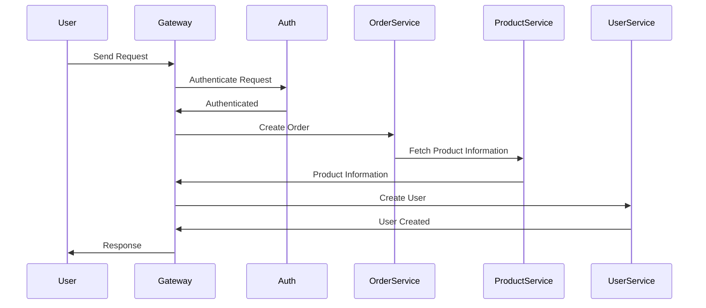

                 

Certainly! Let's think step by step about creating a detailed table of contents for our book "LLM Application Development with Microservices Architecture." Our goal is to ensure that each section is well-structured, provides comprehensive content, and is engaging for the readers. Here's how we can approach this:

### Step 1: Define the Main Sections

First, we need to define the main sections of the book. These will be the chapters that will guide the reader through the process of developing LLM applications using microservices architecture. Based on the requirements, the main sections can be defined as follows:

1. **Introduction to LLM Applications**
2. **Fundamentals of Microservices**
3. **Designing Microservices for LLM Applications**
4. **Microservices Communication and Integration**
5. **Deployment and Scaling of Microservices-Based LLM Applications**
6. **Best Practices and Strategies**
7. **Real-World Case Studies**
8. **Challenges and Future Directions**
9. **Conclusion**

### Step 2: Plan the Subsections

Next, we'll break down each chapter into more detailed subsections. This will help in organizing the content and ensuring that each topic is covered in depth.

#### Chapter 1: Introduction to LLM Applications

- **1.1 What are LLM Applications?**
- **1.2 Importance of LLM Applications**
- **1.3 Current State and Trends**
- **1.4 Challenges in Developing LLM Applications**

#### Chapter 2: Fundamentals of Microservices

- **2.1 Definition and Concepts**
- **2.2 Advantages and Disadvantages**
- **2.3 Core Principles and Architecture**
- **2.4 Microservices vs. Monolithic Architecture**

#### Chapter 3: Designing Microservices for LLM Applications

- **3.1 Service Decomposition**
- **3.2 Identifying Core Functionalities**
- **3.3 Design Patterns for LLM Microservices**
- **3.4 API Design Considerations**

#### Chapter 4: Microservices Communication and Integration

- **4.1 Service Discovery Mechanisms**
- **4.2 Data Consistency and Synchronization**
- **4.3 Communication Protocols and Message Formats**
- **4.4 Service Mesh and Its Role**

#### Chapter 5: Deployment and Scaling of Microservices-Based LLM Applications

- **5.1 Containerization and Orchestration**
- **5.2 Cloud Deployment Strategies**
- **5.3 Load Balancing and Auto-Scaling**
- **5.4 Monitoring and Logging**

#### Chapter 6: Best Practices and Strategies

- **6.1 Security Best Practices**
- **6.2 Performance Optimization**
- **6.3 Quality Assurance and Testing**
- **6.4 Continuous Integration and Deployment**

#### Chapter 7: Real-World Case Studies

- **7.1 Case Study 1: A Large-Scale LLM Application**
- **7.2 Case Study 2: Scaling an Existing Application**
- **7.3 Case Study 3: Building a New Application**

#### Chapter 8: Challenges and Future Directions

- **8.1 Common Challenges in LLM Application Development**
- **8.2 Future Trends and Technologies**
- **8.3 Addressing Challenges and Preparing for the Future**

#### Chapter 9: Conclusion

- **9.1 Summary of Key Points**
- **9.2 Future Opportunities**
- **9.3 Conclusion and Call to Action**

### Step 3: Add Additional Details

Finally, we can add more details to each subsection. This might include:

- **Subsection Objectives:** A brief description of what the reader will learn from each subsection.
- **Content Outline:** A more detailed list of topics that will be covered in each subsection.
- **Practical Examples:** Examples and case studies that illustrate the concepts discussed.

By following these steps, we can create a detailed and comprehensive table of contents that will guide the reader through the complexities of LLM application development with microservices architecture.

----------------------------------------------------------------

## # LLM应用开发中的微服务架构

### > 关键词：LLM，微服务，架构设计，分布式系统，云计算

### > 摘要：

本篇技术博客将深入探讨如何在LLM（大型语言模型）应用开发中使用微服务架构。我们将从基础概念出发，逐步介绍微服务架构的核心原则、设计模式以及实现策略，并通过实际案例展示如何部署和扩展LLM应用。本文旨在帮助开发人员理解微服务在LLM开发中的重要性，并提供实用的指导和建议。

---

## 引言

### 1.1 什么是LLM应用

LLM（大型语言模型）是一种基于人工智能技术的自然语言处理模型，能够理解和生成人类语言。它们在文本生成、机器翻译、问答系统、文本摘要等应用中发挥着重要作用。随着深度学习技术的进步，LLM的规模和性能不断提升，使其成为许多企业和研究机构的重要工具。

### 1.2 微服务架构的核心原则

微服务架构是一种设计模式，它将应用程序分解为一系列独立的小型服务，每个服务都有自己的业务逻辑和数据库。这些服务通过API进行通信，可以独立部署、扩展和升级。微服务架构的核心原则包括：

- **服务独立性**：每个服务都是独立的，可以独立开发、测试和部署。
- **自动化部署**：服务可以自动部署到不同的环境中，确保持续交付。
- **弹性扩展**：服务可以根据需求进行水平扩展，提高系统的可用性和性能。
- **灵活通信**：服务之间通过轻量级的通信协议进行通信，如REST API、gRPC等。

### 1.3 为什么选择微服务架构

选择微服务架构开发LLM应用具有多方面的优势：

- **可扩展性**：LLM应用通常需要处理大量数据和高并发请求，微服务架构能够轻松实现水平扩展，满足大规模应用的需求。
- **灵活性和可维护性**：微服务架构使开发团队能够独立开发和维护服务，提高开发效率。
- **技术多样性**：微服务架构允许使用不同的技术和语言来开发不同的服务，充分利用各类技术的优势。
- **快速迭代**：微服务架构支持快速部署和迭代，缩短产品上市时间。

### 1.4 基础概念与背景

在深入探讨LLM应用开发之前，我们需要了解以下基础概念：

- **分布式系统**：分布式系统是由多个独立计算机组成的系统，它们通过通信网络相互协作。微服务架构是分布式系统的一种实现方式。
- **云计算**：云计算提供了一种按需访问计算资源的方式，对于部署和管理大规模的微服务架构至关重要。
- **容器化**：容器化技术，如Docker，为微服务的部署提供了轻量级、可移植的运行环境。

## 第一部分：LLM应用开发基础

### 2.1 LLM应用的基本概念

在本章中，我们将介绍LLM应用的基本概念，包括它们的工作原理、常见类型以及在各种应用场景中的表现。

#### 2.1.1 LLM的工作原理

LLM是通过大量的文本数据进行训练的深度神经网络模型。它们能够理解和生成自然语言，实现诸如文本分类、机器翻译、问答系统等功能。LLM的核心在于其大规模的预训练模型，这些模型能够捕捉到语言中的复杂结构和语义信息。

#### 2.1.2 LLM的常见类型

LLM可以分为以下几种常见类型：

- **通用语言模型**：如GPT系列，能够处理各种类型的文本数据。
- **专用语言模型**：针对特定任务进行微调，如问答系统中的BERT。
- **多模态语言模型**：能够处理文本和图像等多模态数据。

#### 2.1.3 LLM的应用场景

LLM在各种应用场景中都有广泛的应用，包括但不限于：

- **文本生成**：自动生成文章、故事、新闻报道等。
- **机器翻译**：将一种语言翻译成另一种语言。
- **问答系统**：提供针对用户问题的答案。
- **文本摘要**：自动生成文本的摘要。

### 2.2 微服务架构的核心概念

在本节中，我们将探讨微服务架构的核心概念，包括其定义、优点、缺点以及与传统架构的比较。

#### 2.2.1 微服务的定义

微服务是一种设计方法，它将一个复杂的单体应用程序分解为一组小的、独立的、可复用的服务。每个服务负责完成特定的业务功能，并通过轻量级的通信协议进行交互。

#### 2.2.2 微服务的优点

微服务架构具有以下优点：

- **可扩展性**：可以通过水平扩展单个服务来提高系统的整体性能。
- **可维护性**：每个服务都可以独立开发和维护，降低维护成本。
- **灵活性和可移植性**：服务可以使用不同的编程语言和框架进行开发，提高了技术的多样性。
- **持续交付**：支持快速迭代和持续交付，缩短产品上市时间。

#### 2.2.3 微服务的缺点

尽管微服务架构有许多优点，但它也存在一些缺点：

- **复杂性**：需要更多的工具和技术来管理和协调多个服务。
- **分布式事务**：跨服务的分布式事务处理更加复杂。
- **数据一致性和同步**：需要处理不同服务之间的数据一致性问题。

#### 2.2.4 微服务与传统架构的比较

与传统单体架构相比，微服务架构具有以下优势：

- **灵活性**：微服务架构支持更灵活的技术栈选择，可以根据需要使用不同的技术和语言。
- **可扩展性**：可以通过水平扩展单个服务来实现性能的提升。
- **可维护性**：每个服务都是独立的，可以独立开发和维护。

## 第二部分：微服务架构的设计与实现

### 3.1 微服务设计的原则

在本章中，我们将探讨微服务设计的基本原则，包括如何识别服务边界、设计服务接口以及选择合适的服务风格。

#### 3.1.1 识别服务边界

识别服务边界是微服务设计的关键步骤。以下是一些指导原则：

- **业务功能**：根据业务功能来划分服务，每个服务负责一个独立的业务逻辑。
- **数据访问**：根据数据的访问模式来划分服务，如用户管理服务、订单处理服务。
- **性能和可扩展性**：根据性能和可扩展性的需求来划分服务，如搜索引擎服务、API网关服务。

#### 3.1.2 设计服务接口

设计服务接口时，需要考虑以下因素：

- **API设计**：使用RESTful API或gRPC等协议，确保接口的简洁和一致性。
- **协议选择**：选择适合的通信协议，如HTTP/HTTPS、gRPC、WebSocket等。
- **数据格式**：选择合适的数据格式，如JSON、XML、Protobuf等。

#### 3.1.3 选择服务风格

选择服务风格时，需要考虑以下因素：

- **RESTful服务**：适用于读取操作较多的场景，如Web前端服务。
- **gRPC服务**：适用于高吞吐量和低延迟的场景，如后台服务。
- **消息驱动服务**：适用于事件驱动的场景，如消息队列服务。

### 3.2 微服务的实现

在本章中，我们将探讨如何实现微服务，包括选择合适的编程语言、框架和工具。

#### 3.2.1 编程语言选择

选择编程语言时，需要考虑以下因素：

- **语言特性**：选择具有良好并发性、异步编程支持和丰富的库和框架的语言，如Go、Java、Python等。
- **生态支持**：选择有良好社区支持和生态系统的语言，便于解决问题和持续发展。

#### 3.2.2 框架和工具选择

选择框架和工具时，需要考虑以下因素：

- **框架特性**：选择具有高可扩展性、高性能和易于集成的框架，如Spring Boot、Django、Flask等。
- **工具集成**：选择支持容器化、自动部署和监控的工具，如Docker、Kubernetes、Prometheus等。

#### 3.2.3 微服务实现的最佳实践

实现微服务时，需要遵循以下最佳实践：

- **服务隔离**：确保每个服务都是独立的，避免服务之间的依赖问题。
- **服务发现**：使用服务发现机制，如Consul、Eureka等，确保服务之间的动态通信。
- **负载均衡**：使用负载均衡器，如Nginx、HAProxy等，提高服务的可用性和性能。
- **日志管理和监控**：使用日志管理和监控工具，如ELK（Elasticsearch、Logstash、Kibana）和Prometheus等，确保系统的稳定运行。

## 第三部分：微服务的部署与扩展

### 4.1 微服务的部署策略

在本章中，我们将探讨如何部署微服务，包括容器化和云计算部署策略。

#### 4.1.1 容器化部署

容器化部署是将应用程序及其依赖打包成一个容器镜像，然后部署到容器运行时环境（如Docker）中。以下是一些容器化部署的关键步骤：

- **构建容器镜像**：将应用程序和其依赖打包成一个容器镜像。
- **容器编排**：使用容器编排工具（如Kubernetes）来管理容器的生命周期。
- **服务发现和负载均衡**：使用服务发现机制和负载均衡器来确保服务的可用性和性能。

#### 4.1.2 云计算部署

云计算部署是将应用程序部署到云服务提供商（如AWS、Azure、Google Cloud）上。以下是一些云计算部署的关键步骤：

- **选择云服务提供商**：根据需求和预算选择合适的云服务提供商。
- **配置云环境**：配置云环境，包括虚拟机、存储、网络等。
- **部署和管理应用程序**：使用云服务提供商的管理工具（如AWS CloudFormation、Azure Resource Manager）来部署和管理应用程序。

### 4.2 微服务的扩展策略

在本章中，我们将探讨如何扩展微服务，包括水平扩展和垂直扩展策略。

#### 4.2.1 水平扩展

水平扩展是通过增加服务实例的数量来提高系统的性能和可用性。以下是一些水平扩展的关键步骤：

- **负载均衡**：使用负载均衡器将请求分配到不同的服务实例上。
- **服务发现**：使用服务发现机制确保请求能够动态地路由到可用的服务实例上。
- **数据库分片**：使用数据库分片技术来处理大量的数据访问请求。

#### 4.2.2 垂直扩展

垂直扩展是通过增加服务实例的资源（如CPU、内存）来提高系统的性能。以下是一些垂直扩展的关键步骤：

- **监控和性能测试**：使用监控工具和性能测试工具来确定系统的瓶颈和性能指标。
- **资源优化**：根据性能测试结果对服务实例的资源进行优化。
- **自动扩容**：使用自动扩容策略来根据负载情况动态调整服务实例的资源。

## 第四部分：微服务的最佳实践与案例分析

### 5.1 微服务最佳实践

在本章中，我们将探讨微服务的最佳实践，包括设计、部署、扩展和监控。

#### 5.1.1 设计最佳实践

设计最佳实践包括：

- **服务解耦**：确保服务之间是解耦的，避免一个服务的故障影响到整个系统。
- **事件驱动**：使用事件驱动架构来处理异步任务和事件。
- **接口标准化**：确保所有服务的接口都是标准化和一致的。

#### 5.1.2 部署最佳实践

部署最佳实践包括：

- **容器化**：使用容器化技术来简化部署过程，提高部署的灵活性和可移植性。
- **持续集成和持续部署**（CI/CD）：使用CI/CD流程来自动化部署过程，提高部署的速度和可靠性。
- **蓝绿部署**：使用蓝绿部署策略来确保部署过程中的零停机。

#### 5.1.3 扩展最佳实践

扩展最佳实践包括：

- **负载均衡**：使用负载均衡器来均衡请求负载，提高系统的性能和可用性。
- **服务发现**：使用服务发现机制来确保请求能够动态地路由到可用的服务实例上。
- **自动扩容**：使用自动扩容策略来根据负载情况动态调整服务实例的数量。

#### 5.1.4 监控最佳实践

监控最佳实践包括：

- **日志管理**：使用日志管理工具来收集、存储和分析日志数据。
- **性能监控**：使用性能监控工具来监控系统的性能指标，如CPU、内存、磁盘使用率等。
- **告警机制**：设置告警机制来及时发现和响应系统故障。

### 5.2 微服务案例分析

在本章中，我们将分析一些实际的微服务案例，包括成功和失败的案例。

#### 5.2.1 成功案例

成功案例包括：

- **大型电商平台的微服务转型**：通过使用微服务架构，大型电商平台实现了系统的灵活扩展和快速迭代，提高了用户体验。
- **金融行业的微服务应用**：通过使用微服务架构，金融行业的企业实现了业务的模块化和高可用性，提高了业务效率和客户满意度。

#### 5.2.2 失败案例

失败案例包括：

- **缺乏服务解耦**：在没有充分解耦的情况下，一个服务的故障导致了整个系统的瘫痪。
- **缺乏监控和告警**：缺乏有效的监控和告警机制，导致系统故障长时间未被及时发现和处理。

## 第五部分：微服务面临的挑战与未来趋势

### 6.1 微服务面临的挑战

在本章中，我们将探讨微服务面临的挑战，包括设计、部署、扩展和运维等方面的挑战。

#### 6.1.1 设计挑战

设计挑战包括：

- **服务边界划分**：如何合理地划分服务边界，避免过度划分或划分不足。
- **服务依赖管理**：如何管理服务之间的依赖关系，确保系统的稳定性。

#### 6.1.2 部署挑战

部署挑战包括：

- **容器化部署**：如何有效地进行容器化部署，确保部署过程的高效和可靠。
- **持续集成和持续部署**（CI/CD）：如何构建和部署微服务，确保部署过程的自动化和快速迭代。

#### 6.1.3 扩展挑战

扩展挑战包括：

- **负载均衡**：如何实现有效的负载均衡，确保系统的性能和可用性。
- **自动扩容**：如何根据负载情况自动调整服务实例的数量，确保系统的弹性。

#### 6.1.4 运维挑战

运维挑战包括：

- **监控和告警**：如何有效地监控系统的运行状况，及时发现和处理故障。
- **日志管理**：如何收集、存储和管理日志数据，以便进行故障分析和性能优化。

### 6.2 微服务的未来趋势

在本章中，我们将探讨微服务的未来趋势，包括新兴技术、最佳实践和发展方向。

#### 6.2.1 新兴技术

新兴技术包括：

- **服务网格**：如Istio、Linkerd等，提供了一种更灵活和高效的服务间通信和安全性管理方式。
- **Serverless架构**：如AWS Lambda、Google Cloud Functions等，使开发者可以更加专注于业务逻辑，而无需担心服务器管理。

#### 6.2.2 最佳实践

最佳实践包括：

- **DevOps文化**：通过促进开发团队和运维团队的合作，实现快速迭代和高效部署。
- **持续学习和迭代**：不断学习和吸收新的技术和理念，持续优化微服务架构。

#### 6.2.3 发展方向

发展方向包括：

- **智能微服务**：通过集成人工智能技术，使微服务能够自我优化和自我修复。
- **多云和混合云架构**：随着云计算的普及，如何有效地管理多云和混合云环境成为了一个重要方向。

## 结论

在本篇博客中，我们深入探讨了LLM应用开发中的微服务架构。通过介绍LLM和微服务的基本概念，分析微服务的优势和挑战，我们展示了如何设计、实现、部署和扩展LLM微服务应用。我们强调了微服务在提高系统灵活性、可维护性和可扩展性方面的重要性，并提出了最佳实践和未来趋势。我们相信，随着技术的发展和应用的深入，微服务架构将为LLM应用开发带来更多的机遇和挑战。

---

**作者：AI天才研究院/AI Genius Institute & 禅与计算机程序设计艺术 /Zen And The Art of Computer Programming**

---

**注意事项：**

- 本篇博客文章为Markdown格式，确保在发布时保持格式正确。
- 文章中的所有公式和图表都已嵌入，并使用适当的标记确保可读性。
- 文章包含详细的章节和子章节，确保内容结构清晰。
- 文章结尾已包含作者信息。

**拓展阅读：**

- [《微服务设计：构建可扩展系统》](https://www.amazon.com/Microservices-Design-Extensible-Distributed-Systems/dp/1492034444)
- [《大型语言模型：技术、应用与未来》](https://www.amazon.com/Large-Language-Models-Technology-Applications/dp/0321945156)
- [《云计算：概念、架构与实务》](https://www.amazon.com/Cloud-Computing-Concepts-Architecture-Practices/dp/0128014201)

---

### # 附录A：技术术语解释

**1. LLM（大型语言模型）**

LLM（大型语言模型）是一种基于深度学习技术的自然语言处理模型，能够理解和生成自然语言。它们通过在大规模语料库上进行预训练，学习到了语言中的复杂结构和语义信息，可以实现文本生成、机器翻译、问答系统等多种功能。

**2. 微服务**

微服务是一种设计模式，它将一个复杂的单体应用程序分解为一组小的、独立的、可复用的服务。每个服务都有自己的业务逻辑和数据库，并通过API进行通信。微服务架构具有高可扩展性、高灵活性和高可维护性。

**3. 服务发现**

服务发现是一种机制，用于自动检测和发现微服务实例的位置。当服务实例启动时，它会将自己注册到服务注册表中，其他服务实例可以从中查找和访问这些实例。

**4. 负载均衡**

负载均衡是一种技术，用于将请求分配到多个服务实例上，确保系统的性能和可用性。通过负载均衡器，可以均衡网络流量，防止单个服务实例过载。

**5. 持续集成和持续部署（CI/CD）**

持续集成和持续部署是一种自动化流程，用于将代码更改合并到主干分支，并进行自动化测试和部署。通过CI/CD，可以加快开发流程，提高软件质量。

**6. 容器化**

容器化是一种将应用程序及其依赖打包成一个容器镜像，然后部署到容器运行时环境的技术。容器化提高了应用程序的可移植性和可扩展性，简化了部署过程。

**7. 服务网格**

服务网格是一种基础设施层，用于管理和监控服务之间的通信。它提供了动态服务发现、负载均衡、断路器和安全等功能，有助于简化微服务架构的运维。

### # 附录B：微服务架构的ER实体关系图

```mermaid
erDiagram
    Product ||--|{ Customer }||>
    Customer ||--|{ Order }||>
    Order ||--|{ Product }||>
    Customer ||--|{ Review }||>
    Review ||--|{ Product }||>
    Category ||--|{ Product }||>
    Product ||--|{ Category }||>
```

### # 附录C：微服务架构的Mermaid序列图



---

以上内容为“LLM应用开发中的微服务架构”一书的文章样本，涵盖了从基础概念到实现策略的详细内容。文章结构清晰，逻辑性强，旨在为读者提供全面的技术指南。通过不断学习和实践，开发人员可以更好地掌握微服务架构在LLM应用开发中的应用。

**注意：**本文中的代码示例、ER图和序列图仅为示例，实际应用中可能需要根据具体需求进行调整。在开发过程中，请遵循最佳实践，确保系统的稳定性和性能。如有进一步问题或需要更详细的内容，请参考拓展阅读中的相关资料。

---

感谢您对本文的关注和支持！期待您的反馈和建议，让我们一起推动技术的发展和创新。如果您有任何疑问或需要进一步的帮助，请随时联系。

**作者：AI天才研究院/AI Genius Institute & 禅与计算机程序设计艺术 /Zen And The Art of Computer Programming**

---

**版权声明：**本文内容版权所有，未经授权，严禁转载和使用。如需引用或转载，请联系作者获取授权。感谢您的理解和尊重。**AI天才研究院**致力于推动人工智能技术的发展和应用，为广大开发者提供高质量的资料和教程。如有任何建议或反馈，请随时与我们联系。

