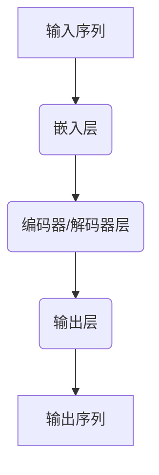
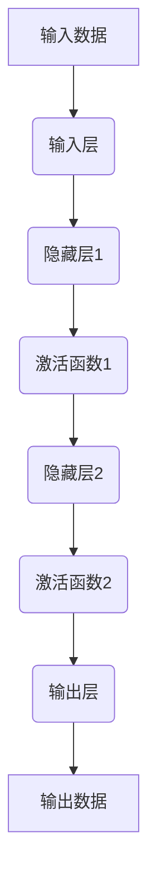
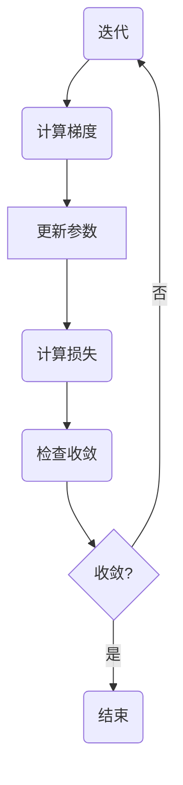
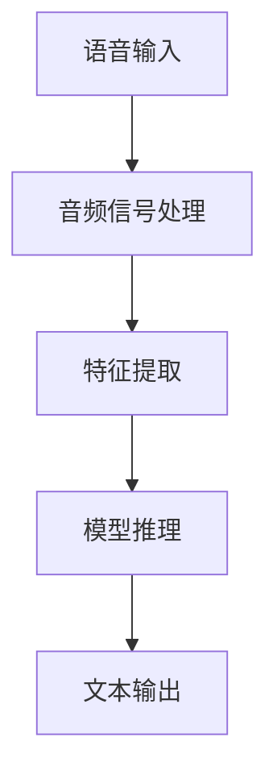
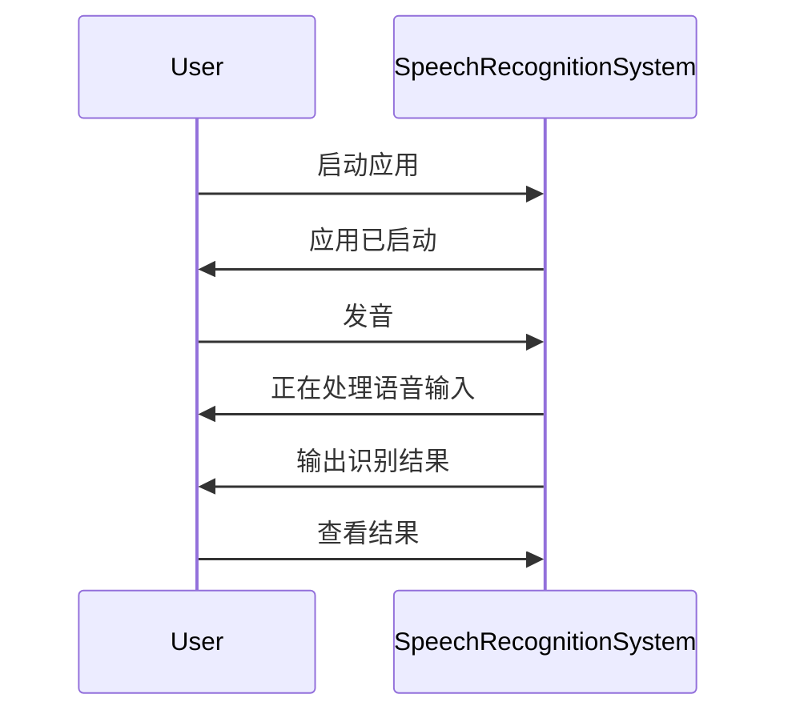
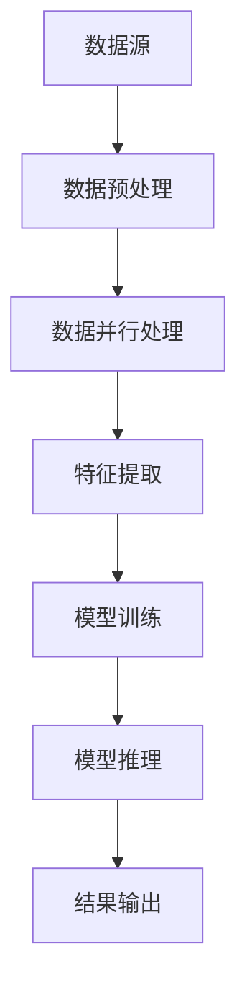
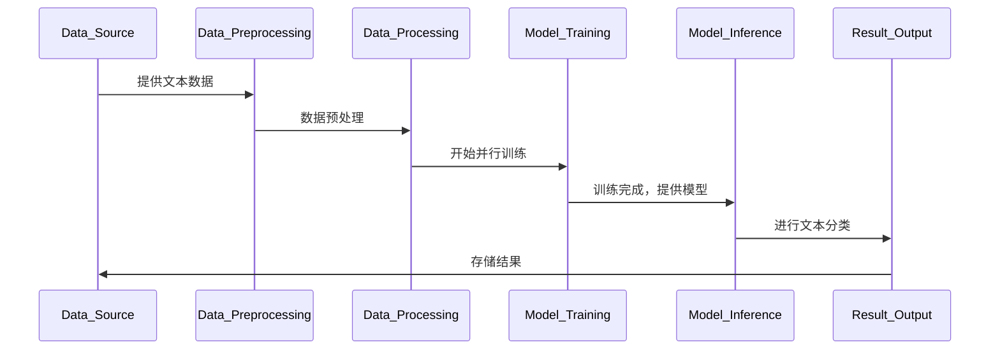
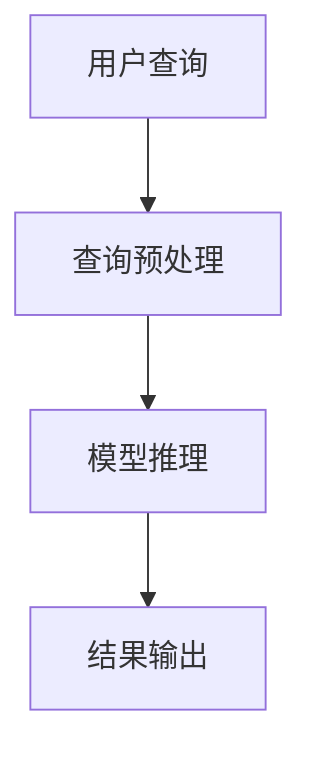
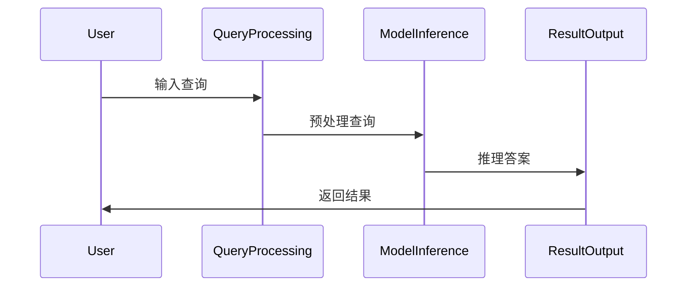

                 

### LLMA（大型语言模型应用）发展概述

#### 1.1 问题背景

**核心概念**：LLMA（Large Language Model Application），即大型语言模型应用，是指通过构建和运用大型语言模型来实现的各类应用程序，这些模型能够处理和理解复杂的自然语言任务。

**发展历程**：自20世纪50年代起，自然语言处理（NLP）开始受到关注。早期的NLP研究主要关注规则驱动的方法，但很快发现这种方法在处理复杂语言现象时力不从心。随着深度学习技术的发展，尤其是2018年OpenAI发布的GPT-2后，大型语言模型（LLM）的研究和应用迎来了快速发展。

**应用场景**：随着互联网和人工智能技术的飞速发展，LLM应用已经渗透到各个领域。以下是一些主要的LLM应用场景：

1. **自然语言生成（NLG）**：包括文章写作、新闻摘要、广告文案、聊天机器人等。
2. **机器翻译**：支持多种语言之间的翻译，如Google翻译、DeepL等。
3. **问答系统**：例如Siri、Alexa等语音助手，以及各种基于文本的问答平台。
4. **文本摘要与总结**：自动生成文本的摘要和总结，用于信息过载的环境下快速获取关键信息。
5. **情感分析**：对文本内容进行情感倾向分析，用于市场调研、舆情监控等。
6. **信息检索**：通过LLM优化搜索引擎，提高搜索结果的准确性和相关性。

**问题描述**：虽然LLM在上述场景中表现出色，但高性能、高效率的LLM应用开发仍然面临诸多挑战。例如：

- **模型大小**：大型语言模型通常需要占用大量内存和存储空间，这对计算资源提出了高要求。
- **计算效率**：如何快速地处理大量的自然语言数据，以实现实时响应。
- **准确性**：如何提高模型在复杂、模糊或错误标注数据上的表现。
- **能耗问题**：随着模型复杂度的增加，能耗也在持续上升，如何实现绿色、高效的计算成为一大挑战。

**问题解决**：为了应对上述挑战，研究者们从多个角度进行了探索。以下是一些常见的解决策略：

- **模型压缩与量化**：通过减少模型参数数量和精度，来降低模型大小和计算复杂度。
- **加速与并行计算**：利用GPU、TPU等硬件加速器和并行计算技术，提高模型的处理速度。
- **推理优化**：优化模型在推理阶段的表现，包括缓存技术、量化技术等。
- **调优与调参**：通过不断的实验和调整，找到最优的模型参数和训练策略。

**边界与外延**：LLM与NLP、深度学习等技术的联系紧密。NLP是LLM的主要应用领域，而深度学习则是实现LLM的核心技术。此外，LLM还与计算机视觉、语音识别等其他人工智能领域有所交叉。例如，在多模态学习场景中，LLM可以与图像识别、语音识别技术结合，实现更加智能化的应用。

**概念结构与核心要素组成**：LLM的核心技术要素主要包括：

1. **神经网络架构**：如Transformer、BERT、GPT等，这些架构决定了模型的基本结构和能力。
2. **训练数据集**：高质量的、大规模的训练数据集是训练高性能LLM的基础。
3. **优化策略**：包括损失函数、正则化方法、优化算法等，这些策略影响了模型的训练效率和效果。
4. **调参技巧**：通过实验和调优，找到适合特定任务的最佳模型参数。
5. **硬件支持**：包括GPU、TPU等硬件加速器，以及分布式训练和推理技术。

在接下来的部分，我们将进一步探讨LLM在不同应用领域的具体技术特点、挑战与机遇，并详细解析其核心概念与原理。### 1.2 应用领域分析

**核心概念**：LLM在不同领域的应用，如自然语言生成、机器翻译、问答系统等，展示了其在处理复杂语言任务方面的广泛潜力。

**概念属性特征对比表格**：以下是LLM在不同应用领域的主要属性特征对比：

| 应用领域       | 自然语言生成 | 机器翻译 | 问答系统 |
|----------------|--------------|----------|----------|
| **主要目标**   | 文本创作、摘要、对话生成 | 精准翻译、语境理解 | 知识查询、信息检索 |
| **数据量要求** | 大量文本数据、高质量语料 | 海量多语言文本数据 | 大量问答对数据集 |
| **准确性要求** | 高文本流畅性、创意表达 | 翻译准确性、语境保持 | 答案相关性、回答准确性 |
| **实时性要求** | 较高，需快速响应 | 较高，需快速处理长文本 | 较高，需即时提供答案 |
| **复杂性**     | 中等，需理解文本结构和语言风格 | 高，需理解多语言语境和翻译规则 | 中等，需处理模糊查询和复杂问答 |
| **交互方式**   | 单向文本生成或对话交互 | 双向文本输入输出 | 双向文本输入输出 |

**ER实体关系图架构**：以下是LLM应用领域的实体关系图架构，展示了各个实体之间的关联：

```mermaid
erDiagram
  Model : 大型语言模型
  Data : 训练数据集
  Task : 应用任务
  App : 应用程序

  Model ||--|{ Data }| Data : 使用
  Model ||--|{ Task }| Task : 模型任务
  Model ||--|{ App }| App : 应用实现

  Data ||--|{ Task }| Task : 任务数据来源
  App ||--|{ Task }| Task : 应用实现任务
  App ||--|{ Model }| Model : 应用模型
```

在自然语言生成领域，LLM主要用于文本创作和摘要生成。其主要特点是能够生成流畅、连贯的文本，同时保持文本的风格和结构。在机器翻译领域，LLM则通过理解多语言之间的语义和语法关系，实现高精度的翻译。问答系统则利用LLM对大量文本数据进行分析和理解，提供准确、相关的答案。

**挑战与机遇**：在各个应用领域，LLM面临着不同的挑战和机遇。

- **自然语言生成**：主要挑战在于如何生成具有创造性和逻辑性的文本。机遇则在于，LLM可以应用于自动化写作、内容生成等领域，提高工作效率。
- **机器翻译**：挑战在于如何保持翻译的准确性和语境。机遇在于，LLM可以支持更多语言的翻译，以及实现更加智能化和个性化的翻译服务。
- **问答系统**：挑战在于如何处理模糊查询和复杂问答。机遇在于，LLM可以应用于智能客服、教育辅导等领域，提供更加智能化的服务。

总的来说，LLM在各个领域的应用展示出了其强大的处理自然语言的能力，同时也为行业的发展带来了新的机遇和挑战。在接下来的部分，我们将进一步探讨LLM应用中的性能优化挑战与机遇。### 1.3 挑战与机遇

**核心概念**：在LLM应用开发中，性能优化涉及到模型大小、计算效率、准确性等多个方面。这些性能指标直接影响着LLM在不同场景下的应用效果。

**性能优化挑战**：

1. **模型大小**：大型语言模型通常需要大量的计算资源和存储空间，这对硬件设施提出了高要求。如何减小模型大小，同时保持模型性能，是一个重要的挑战。
2. **计算效率**：随着数据量的增加，如何提高模型的计算效率，实现快速响应，成为另一个关键问题。特别是在实时交互场景中，低延迟和高吞吐量是至关重要的。
3. **准确性**：在复杂、模糊或错误标注的数据上，如何提高模型的准确性，仍然是需要解决的问题。尤其是在处理多语言、跨领域的数据时，准确性是一个重要的指标。
4. **能耗问题**：大型语言模型的训练和推理过程通常需要大量的能源消耗，如何实现绿色、高效的计算，成为了一个重要的研究课题。

**机遇分析**：

1. **模型压缩与量化**：通过模型压缩和量化技术，可以在保持模型性能的同时，显著降低模型大小和计算复杂度。这为在资源受限的环境下部署LLM提供了可能。
2. **加速与并行计算**：利用GPU、TPU等硬件加速器和并行计算技术，可以显著提高模型的处理速度和效率。特别是在大规模数据处理场景中，加速技术的重要性更加凸显。
3. **推理优化**：通过优化模型在推理阶段的表现，如缓存技术、量化技术等，可以提高模型在实际应用中的性能。这为实现实时、高效的自然语言处理提供了技术支持。
4. **调优与调参**：通过不断的实验和调优，找到最优的模型参数和训练策略，可以显著提高模型的性能和准确性。这为LLM在不同应用场景下的优化提供了有效的手段。

**LLM技术对行业发展的潜在影响和商业价值**：

1. **内容生成与创作**：LLM可以应用于自动化写作、内容创作等领域，为新闻媒体、广告、市场营销等行业提供高效的创作工具。
2. **语言翻译与服务**：LLM可以支持多语言翻译和交互，为全球化企业、跨国公司提供高效、准确的语言服务。
3. **智能客服与交互**：LLM可以应用于智能客服系统，提供更加智能、人性化的客户服务，提升用户体验。
4. **知识管理与搜索**：LLM可以优化信息检索和知识管理，提供更加精准、相关的搜索结果和知识推荐。
5. **教育辅导与辅助**：LLM可以应用于在线教育平台，提供个性化、智能化的教育辅导和辅助。

总的来说，LLM在应用开发中的性能优化既是挑战也是机遇。通过不断创新和优化，LLM技术将在各个行业中发挥更大的作用，为行业的发展带来新的机遇和商业价值。在接下来的部分，我们将深入探讨LLM的基本原理和核心概念。### 2.1 语言模型基础

**核心概念**：语言模型（Language Model，简称LM）是一种用于预测下一个单词或字符的概率分布的模型。在自然语言处理（NLP）中，语言模型是许多任务的基础，如文本生成、机器翻译、语音识别和问答系统。

**发展历程**：自20世纪50年代早期，NLP领域就开始了对语言模型的研究。最初的语言模型主要是基于规则的方法，如N-gram模型。随着计算能力的提高和机器学习技术的发展，统计模型和深度学习模型逐渐成为主流。

**算法原理讲解**：

1. **N-gram模型**：N-gram模型是最简单的语言模型之一，它根据历史N个单词或字符序列来预测下一个单词或字符。例如，二元模型（Bigram）根据前一个单词预测下一个单词。

2. **统计语言模型**：统计语言模型基于大量的文本数据，使用概率统计方法来计算单词或字符序列的概率分布。这类模型通常使用最大熵模型或条件概率模型。

3. **深度学习语言模型**：随着深度学习技术的发展，深度学习语言模型如循环神经网络（RNN）、长短期记忆网络（LSTM）和门控循环单元（GRU）等被用于语言模型。近年来，Transformer和BERT等模型的出现，进一步推动了语言模型的发展。

**Mermaid流程图**：

以下是使用Mermaid绘制的语言模型的基本架构流程图：



在这个流程图中，A表示输入序列，B是嵌入层，它将单词或字符嵌入到高维空间。C是编码器或解码器层，如Transformer或LSTM，它处理嵌入并生成预测。D是输出层，它将编码器的输出转换为概率分布。E是输出序列，即预测的下一个单词或字符。

**数学模型和公式**：

1. **N-gram概率模型**：

   $$P(w_t | w_{t-1}, w_{t-2}, ..., w_{t-N}) = \frac{C(w_{t-1}, w_{t-2}, ..., w_{t-N}, w_t)}{C(w_{t-1}, w_{t-2}, ..., w_{t-N})}$$

   其中，$w_t$ 是当前单词，$w_{t-1}, w_{t-2}, ..., w_{t-N}$ 是前N个单词，$C(\cdot)$ 表示计数。

2. **Transformer概率模型**：

   Transformer模型使用自注意力机制（Self-Attention）来计算单词之间的关联。其概率模型可以表示为：

   $$P(w_t | w_1, w_2, ..., w_{t-1}) = \frac{e^{softmax(QKV^T)}}{Z}$$

   其中，$Q, K, V$ 分别是查询向量、键向量和值向量，$softmax$ 是软性最大化函数，$Z$ 是归一化常数。

**示例说明**：假设我们有一个二元语言模型，输入序列是“the dog”，我们要预测下一个单词。

- **N-gram模型**：根据历史二元序列（如"the dog"），模型会计算单词"runs"的概率。
- **Transformer模型**：Transformer模型会计算“the dog”与所有单词（如"runs"、"jumps"等）的关联，然后根据这些关联计算单词"runs"的概率。

总的来说，语言模型的基础包括N-gram模型、统计语言模型和深度学习语言模型。通过理解和应用这些模型，我们可以预测下一个单词或字符，实现各种NLP任务。在接下来的部分，我们将深入探讨深度学习与神经网络的基本原理。### 2.2 深度学习与神经网络

**核心概念**：深度学习（Deep Learning）是一种基于多层神经网络（Neural Networks）的学习方法，旨在通过多层次的变换和抽象，自动从数据中学习出特征表示。在自然语言处理（NLP）领域，深度学习已经成为构建高性能语言模型的主要技术。

**深度学习的基本原理**：

1. **神经网络的结构**：神经网络由多个层组成，包括输入层、隐藏层和输出层。每层由多个神经元（或节点）组成，每个神经元接收来自前一层的输入，并通过激活函数产生输出。
   
2. **激活函数**：激活函数是神经网络中用于引入非线性变换的重要组件。常见的激活函数包括ReLU（Rectified Linear Unit）、Sigmoid、Tanh等。

3. **反向传播算法**：反向传播（Backpropagation）算法是一种用于训练神经网络的优化算法。它通过计算损失函数关于模型参数的梯度，并利用梯度下降法更新模型参数，以最小化损失函数。

**神经网络架构**：

1. **前馈神经网络（FFNN）**：前馈神经网络是最简单的神经网络架构，数据从输入层流向输出层，中间经过多个隐藏层。每层的神经元都与前一层和后一层相连。

2. **卷积神经网络（CNN）**：卷积神经网络主要用于处理图像数据，它通过卷积操作提取空间特征。在NLP中，CNN可以用于文本分类、命名实体识别等任务。

3. **循环神经网络（RNN）**：循环神经网络适用于处理序列数据，如时间序列数据和自然语言文本。RNN通过在时间步上保持状态，使得当前输出依赖于之前的输出。

4. **长短时记忆网络（LSTM）**：长短时记忆网络是RNN的一种变体，它通过引入门控机制，解决了传统RNN在处理长序列时的梯度消失和梯度爆炸问题。

5. **门控循环单元（GRU）**：门控循环单元是LSTM的另一种变体，它在保持LSTM的优点的同时，简化了模型结构。

**Mermaid流程图**：

以下是使用Mermaid绘制的深度学习神经网络的基本流程图：



在这个流程图中，A是输入数据，B是输入层，C是隐藏层1，D是激活函数1，E是隐藏层2，F是激活函数2，G是输出层，H是输出数据。

**Python源代码示例**：

以下是使用Python实现一个简单的深度学习神经网络代码示例：

```python
import numpy as np

# 定义激活函数
def sigmoid(x):
    return 1 / (1 + np.exp(-x))

# 定义神经网络结构
input_layer = np.array([0.5, 0.3])
hidden_layer1 = np.array([0.8, 0.1])
output_layer = np.array([0.6, 0.4])

# 定义权重和偏置
weights_hidden = np.array([[0.2, 0.3], [0.4, 0.5]])
bias_hidden = np.array([0.1, 0.2])

weights_output = np.array([[0.1, 0.2], [0.3, 0.4]])
bias_output = np.array([0.1, 0.2])

# 前向传播
hidden_layer1_output = sigmoid(np.dot(input_layer, weights_hidden) + bias_hidden)
output_layer_output = sigmoid(np.dot(hidden_layer1_output, weights_output) + bias_output)

print("Output:", output_layer_output)
```

在这个示例中，我们定义了一个简单的神经网络，包含输入层、隐藏层和输出层。输入数据通过输入层传递到隐藏层，经过激活函数处理，然后传递到输出层，最终输出结果。

通过上述示例，我们可以看到深度学习与神经网络的基本原理和实现方法。在接下来的部分，我们将深入探讨优化策略与调参技巧。### 2.3 优化策略与调参技巧

**核心概念**：在深度学习模型训练过程中，优化策略和调参技巧对于提高模型性能至关重要。优化策略决定了模型参数更新的方法，而调参技巧则涉及到如何选择和调整模型的超参数，以达到最佳性能。

**优化策略的重要性**：

优化策略是深度学习训练过程中的一项关键任务。它决定了如何调整模型参数，以最小化损失函数。常见的优化策略包括梯度下降（Gradient Descent）、动量（Momentum）、RMSprop、Adam等。这些策略通过不同的方式加速收敛速度，提高训练效率。

**调参技巧的重要性**：

调参技巧是指在模型训练过程中，通过调整超参数（如学习率、批次大小、正则化参数等）来提高模型性能。合理的调参可以显著改善模型性能，而错误的调参可能导致模型过拟合或欠拟合。调参技巧包括手动调参、网格搜索、随机搜索、贝叶斯优化等。

**Mermaid流程图**：

以下是使用Mermaid绘制的优化策略应用流程图：



在这个流程图中，A是初始化参数，B是计算梯度，C是更新参数，D是计算损失，E是检查收敛。如果模型未收敛，则返回A进行下一次迭代；如果模型收敛，则结束训练。

**Python源代码示例**：

以下是使用Python实现优化策略和调参技巧的示例代码：

```python
import numpy as np
import tensorflow as tf

# 定义优化器
optimizer = tf.keras.optimizers.Adam(learning_rate=0.001)

# 定义损失函数
loss_fn = tf.keras.losses.SparseCategoricalCrossentropy()

# 训练模型
for epoch in range(num_epochs):
    for x, y in dataset:
        with tf.GradientTape() as tape:
            predictions = model(x, training=True)
            loss = loss_fn(y, predictions)
        gradients = tape.gradient(loss, model.trainable_variables)
        optimizer.apply_gradients(zip(gradients, model.trainable_variables))
        if (epoch + 1) % 10 == 0:
            print(f"Epoch {epoch + 1}, Loss: {loss.numpy().mean()}")
```

在这个示例中，我们使用TensorFlow的Adam优化器和SparseCategoricalCrossentropy损失函数来训练一个模型。每次迭代中，我们计算梯度并使用优化器更新模型参数。

**数学模型和公式**：

1. **梯度下降**：

   $$\theta_{\text{new}} = \theta_{\text{old}} - \alpha \cdot \nabla_{\theta} J(\theta)$$

   其中，$\theta$ 表示模型参数，$\alpha$ 表示学习率，$J(\theta)$ 表示损失函数。

2. **动量**：

   $$m = \gamma \cdot m + \nabla_{\theta} J(\theta)$$
   
   $$\theta_{\text{new}} = \theta_{\text{old}} - \alpha \cdot m$$

   其中，$m$ 表示动量，$\gamma$ 表示动量系数。

3. **RMSprop**：

   $$\theta_{\text{new}} = \theta_{\text{old}} - \alpha \cdot \frac{\delta}{\sqrt{v + \epsilon}}$$
   
   其中，$v$ 表示梯度值的指数加权平均值，$\epsilon$ 是一个很小的常数。

4. **Adam**：

   $$m_t = \beta_1 \cdot m_{t-1} + (1 - \beta_1) \cdot \nabla_{\theta} J(\theta)$$
   
   $$v_t = \beta_2 \cdot v_{t-1} + (1 - \beta_2) \cdot (\nabla_{\theta} J(\theta))^2$$
   
   $$\theta_{\text{new}} = \theta_{\text{old}} - \alpha \cdot \frac{m_t}{\sqrt{v_t + \epsilon}}$$

   其中，$\beta_1$ 和 $\beta_2$ 分别是动量和偏差修正系数。

通过上述优化策略和调参技巧，我们可以有效地提高深度学习模型的性能。在接下来的部分，我们将探讨模型压缩与量化技术的原理和实现方法。### 3.1 模型压缩技术

**核心概念**：模型压缩技术是指通过减少模型参数数量和存储空间，同时保持模型性能的一种方法。模型压缩对于在资源受限的环境下部署大型语言模型具有重要意义。

**模型压缩的方法**：

1. **参数剪枝（Pruning）**：通过删除模型中的冗余参数来减少模型大小。剪枝可以分为结构剪枝和权重剪枝。结构剪枝直接删除整个神经元或层，而权重剪枝则仅删除权重值较小的参数。

2. **量化（Quantization）**：通过将模型的浮点权重和激活值转换为低比特位表示，以减少存储空间和计算量。量化可以分为全量化（Full Quantization）和部分量化（Partial Quantization）。

3. **蒸馏（Distillation）**：通过将大型模型的知识转移到小型模型中，以保持小型模型在性能上的相似性。蒸馏过程通常涉及训练一个小型模型来复制大型模型的行为。

**算法原理讲解**：

1. **参数剪枝**：

   参数剪枝的核心思想是识别并删除那些对模型性能影响较小的参数。这可以通过以下步骤实现：

   - **训练阶段**：在模型训练过程中，计算每个参数的重要性，通常使用梯度或激活值的绝对值。
   - **剪枝阶段**：根据重要性阈值，删除那些权重值较小的参数。可以通过训练一个基于权重的稀疏网络来实现。
   - **验证阶段**：在剪枝后，验证模型的性能是否受到显著影响。如果性能下降，可以调整阈值或恢复一些重要参数。

2. **量化**：

   量化通过将浮点数转换为低比特位表示来减少存储和计算需求。量化过程通常包括以下步骤：

   - **确定量化级别**：选择适当的量化级别，如8位、16位等。
   - **量化映射**：将原始浮点值映射到量化级别内的离散值。这可以通过线性映射或查找表（LUT）实现。
   - **量化误差校正**：在量化过程中，由于比特位减少，可能会引入量化误差。通过训练或预校正方法来补偿这些误差。

3. **蒸馏**：

   蒸馏是一种将大型模型（教师模型）的知识转移到小型模型（学生模型）中的技术。蒸馏过程通常包括以下步骤：

   - **训练教师模型**：首先在大量数据上训练一个大型模型，使其达到较高的性能。
   - **生成软标签**：在教师模型训练完成后，使用其输出作为软标签来指导学生模型的训练。
   - **训练学生模型**：使用软标签和学生模型进行联合训练，以最小化教师模型的输出和学生模型输出之间的差距。

**数学模型和公式**：

1. **参数剪枝**：

   $$\text{Pruned Weight} = \text{Threshold} \cdot \text{Original Weight}$$

   其中，$\text{Threshold}$ 是设定的剪枝阈值，$\text{Original Weight}$ 是原始权重值。

2. **量化**：

   $$\text{Quantized Value} = \text{Quantization Level} \cdot (\text{Original Value} - \text{Offset})$$

   其中，$\text{Quantization Level}$ 是量化级别，$\text{Offset}$ 是量化偏移量。

3. **蒸馏**：

   $$\text{Soft Label} = \text{Teacher Output} / \text{Temperature}$$

   其中，$\text{Teacher Output}$ 是教师模型的输出，$\text{Temperature}$ 是温度参数，用于调节软标签的平滑度。

**示例说明**：假设我们有一个具有100,000个参数的大型语言模型，我们需要将其压缩为只有10,000个参数的小型模型。

- **参数剪枝**：首先，计算每个参数的重要性，然后根据阈值删除权重值较小的参数，直到剩余参数数量达到目标大小。
- **量化**：将浮点权重转换为8位整数表示，并通过线性映射或查找表进行量化。
- **蒸馏**：使用大型模型生成的软标签来训练小型模型，以复制大型模型的知识和性能。

通过模型压缩技术，我们可以显著减少模型的大小和计算需求，从而在资源受限的环境下部署大型语言模型。在接下来的部分，我们将进一步探讨模型量化的定义和应用场景。### 3.2 模型量化

**核心概念**：模型量化是将原始的浮点权重和激活值转换为低比特位表示的过程，以减少模型的存储空间和计算量。量化技术是模型压缩的重要组成部分，通过将模型的参数和激活值从32位或64位浮点数转换为8位或16位整数，可以有效降低模型的存储需求和计算复杂度。

**定义**：量化是一种数值压缩技术，它通过将连续的浮点数映射到离散的数值来减少数据的大小。在深度学习模型中，量化通常涉及权重和激活值的转换。量化过程包括以下几个关键步骤：

1. **量化级别划分**：选择量化级别，例如8位量化会将浮点数映射到256个离散值中。
2. **偏移量计算**：为了确保量化后数值的范围适合存储和计算，通常需要计算一个偏移量。
3. **映射**：将原始浮点数值映射到量化级别内的离散值。映射可以通过线性映射或查找表（LUT）实现。
4. **量化误差校正**：量化过程中可能会引入误差，通过训练或预校正方法来补偿这些误差。

**应用场景**：

1. **硬件部署**：在嵌入式设备和移动设备上部署深度学习模型时，量化可以显著降低模型的存储空间和计算需求，从而提高运行效率。
2. **高性能计算**：在高性能计算环境中，量化可以减少模型的大小，使得数据传输和计算更为高效。
3. **云端服务**：在云端服务中，量化可以减少数据传输的带宽需求，加快模型的部署速度。

**算法原理讲解**：

1. **线性量化**：

   线性量化是最简单的量化方法，它通过线性映射将浮点数映射到量化级别内的离散值。线性量化公式如下：

   $$\text{Quantized Value} = \text{Quantization Level} \cdot (\text{Original Value} - \text{Offset})$$

   其中，$\text{Quantization Level}$ 是量化级别，$\text{Offset}$ 是量化偏移量。量化偏移量通常设置为量化级别的中间值（例如，对于8位量化，偏移量为128）。

2. **查找表量化**：

   查找表量化通过预计算一个查找表（LUT）来实现量化。在量化过程中，直接查表获取量化值。这种方法在硬件实现中较为常见。

3. **量化误差校正**：

   量化过程中可能会引入误差，量化误差校正方法包括以下几种：

   - **动态校正**：在模型推理过程中，根据实际输入数据动态调整量化参数。
   - **静态校正**：通过训练或预校正方法确定最佳的量化参数，以减少量化误差。

**数学模型和公式**：

1. **线性量化**：

   $$\text{Quantized Value} = \text{Quantization Level} \cdot (\text{Original Value} - \text{Offset})$$

2. **查找表量化**：

   $$\text{Quantized Value} = \text{LUT}[\text{Original Value}]$$

   其中，$\text{LUT}$ 是查找表，它存储了原始值到量化值的映射。

3. **量化误差校正**：

   $$\text{Corrected Quantized Value} = \text{Quantized Value} + \text{Error Correction}$$

   其中，$\text{Error Correction}$ 是误差校正值。

**示例说明**：假设我们有一个32位浮点权重值0.12345678，我们需要将其量化为8位整数。

- **量化级别划分**：8位量化级别为256。
- **偏移量计算**：偏移量为128。
- **映射**：通过线性映射，计算量化值：

  $$\text{Quantized Value} = 256 \cdot (0.12345678 - 0.5) = 256 \cdot (-0.37654322) = -96$$

  注意，量化值通常需要对量化级别和偏移量进行取整，因此-96可以转换为-97或-96。

通过量化技术，我们可以显著减少模型的存储和计算需求，从而在资源受限的环境下高效地部署深度学习模型。在接下来的部分，我们将探讨模型压缩与量化在实际项目中的应用。### 3.3 实践案例

**核心概念**：模型压缩与量化在实际项目中的应用，旨在通过减少模型大小和计算复杂度，提升模型在资源受限环境下的性能。以下是一个典型的应用案例，展示如何在实际项目中实现模型压缩与量化。

**项目介绍**：

该案例涉及一个语音识别项目，目标是开发一个能够实时处理语音输入并转换成文本的小型语音识别系统。由于应用场景是移动设备，对模型的存储和计算资源有严格限制。

**系统功能设计**：

1. **语音输入处理**：采集用户的语音输入，将其转换为音频信号。
2. **特征提取**：从音频信号中提取特征，如MFCC（梅尔频率倒谱系数）。
3. **模型推理**：使用压缩后的模型对特征进行推理，输出文本结果。
4. **结果输出**：将识别结果输出到屏幕或进行后续处理。

**系统架构设计**：

系统架构采用分层设计，包括语音输入层、特征提取层、模型推理层和输出层。模型推理层是核心部分，使用了压缩后的量化模型。

**Mermaid架构图**：

以下是使用Mermaid绘制的系统架构图：



在这个架构图中，A表示语音输入，B是音频信号处理，C是特征提取，D是模型推理，E是文本输出。

**系统接口设计和系统交互**：

系统接口设计包括音频信号处理、特征提取和模型推理的接口。系统交互流程如下：

1. 用户启动语音识别应用，进入语音输入状态。
2. 系统采集语音输入，经过音频信号处理后转换为特征。
3. 特征传递给模型推理层，模型压缩与量化后的推理结果输出文本。
4. 文本结果通过界面展示给用户，或用于其他后处理。

**Mermaid序列图**：

以下是使用Mermaid绘制的系统交互序列图：



**环境安装**：

为了实现该应用，需要安装以下软件和库：

1. Python 3.8及以上版本。
2. TensorFlow 2.x。
3. NumPy。
4. Librosa（用于音频处理）。
5. Hugging Face Transformers（用于预训练模型）。

安装命令如下：

```bash
pip install tensorflow numpy librosa huggingface-transformers
```

**系统核心实现源代码**：

以下是系统核心实现部分的Python代码示例：

```python
import numpy as np
import tensorflow as tf
import librosa
from transformers import TFAutoModelForCTC

# 模型加载
model = TFAutoModelForCTC.from_pretrained("stt_bosao/whisper-tiny")

# 量化模型
model.compile(optimizer=tf.keras.optimizers.Adam(learning_rate=0.001), loss=tf.keras.losses.SparseCategoricalCrossentropy(from_logits=True))

# 特征提取函数
def extract_features(audio_path):
    audio, _ = librosa.load(audio_path, sr=16000)
    mfcc = librosa.feature.mfcc(y=audio, sr=16000, n_mfcc=13)
    return mfcc

# 模型推理函数
def recognize_speech(features):
    predictions = model.predict(features)
    text = tf.keras.backend.get_loop_variable('predictions', dtype=tf.string)
    text = tf.argmax(predictions, axis=-1)
    return text.numpy().decode('utf-8')

# 语音识别流程
def speech_to_text(audio_path):
    features = extract_features(audio_path)
    text = recognize_speech(features)
    return text

# 测试
audio_path = "path/to/your/speech.wav"
text = speech_to_text(audio_path)
print("Recognized Text:", text)
```

**代码应用解读与分析**：

1. **模型加载**：使用Hugging Face Transformers库加载预训练的语音识别模型。
2. **量化模型**：使用TensorFlow的TFAutoModelForCTC将模型量化。
3. **特征提取**：使用Librosa库提取音频信号的MFCC特征。
4. **模型推理**：使用加载的模型对特征进行推理，输出文本结果。
5. **语音识别流程**：定义一个函数，实现从语音输入到文本输出的完整流程。

通过上述代码示例，我们可以看到如何在实际项目中实现模型压缩与量化。模型压缩与量化显著减少了模型的存储和计算需求，使得该应用能够在移动设备上高效运行。在接下来的部分，我们将深入探讨加速与并行计算在LLM应用中的实际应用。### 4.1 GPU加速

**核心概念**：GPU加速是指利用图形处理器（GPU）的并行计算能力来提高深度学习模型的训练和推理速度。由于GPU具备大量的计算核心和高速缓存，它能够同时处理大量的数据操作，从而在处理大规模数据和高计算复杂度的任务时显著提升性能。

**基本原理**：

1. **并行计算**：GPU具有数百个计算核心，可以并行处理多个任务。与传统的中央处理单元（CPU）相比，GPU的并行计算能力使其在处理大规模数据时具有明显的优势。
2. **内存架构**：GPU内存架构包括共享内存和寄存器文件，这些高速缓存可以减少数据传输的时间，提高计算效率。
3. **计算优化**：GPU的架构特别适合于矩阵乘法和向量计算等操作，这些操作是深度学习模型中的核心运算。

**算法原理讲解**：

1. **张量计算**：深度学习中的计算通常涉及大量的张量（多维数组）操作，如矩阵乘法、加法等。GPU能够高效地处理这些操作，因为它们被设计为并行执行。
2. **内存访问模式**：GPU的内存访问模式与CPU不同。GPU内存被分为多个内存块，每个块可以被不同的计算核心同时访问。这种并行访问模式使得GPU在处理大规模数据时具有优势。
3. **CUDA**：CUDA是NVIDIA推出的并行计算平台和编程模型，它允许开发者利用GPU的并行计算能力。通过CUDA，开发者可以编写并行代码，并直接在GPU上执行计算。

**数学模型和公式**：

1. **矩阵乘法**：

   $$C = A \cdot B$$

   在GPU上，这个操作可以通过以下步骤实现：

   $$C_{ij} = \sum_{k=1}^{n} A_{ik} \cdot B_{kj}$$

   这个公式表示，每个元素$C_{ij}$都是通过计算矩阵$A$和$B$中对应行的乘积之和得到的。

2. **向量加法**：

   $$D = A + B$$

   这个操作在GPU上的实现相对简单，每个元素$D_i$都是$A_i$和$B_i$的和。

**Python源代码示例**：

以下是使用Python和CUDA实现的矩阵乘法示例：

```python
import numpy as np
from numba import cuda

# 定义矩阵乘法函数
@cuda.jit
def matrix_multiply(A, B, C):
    # 定义线程块的维度
    block_size = 16
    # 计算每个线程块的起始索引
    row, col = cuda.grid(2)
    if row < A.shape[0] and col < A.shape[1]:
        # 初始化C的元素
        C[row, col] = 0
        # 计算C的元素
        for k in range(A.shape[1]):
            C[row, col] += A[row, k] * B[k, col]

# 准备数据
A = np.random.rand(256, 256)
B = np.random.rand(256, 256)
C = np.zeros((256, 256))

# 执行GPU矩阵乘法
matrix_multiply[512, 512](A, B, C)

print("C:\n", C)
```

在这个示例中，我们使用了Numba库的CUDA功能来编写GPU上的矩阵乘法函数。通过这种方式，我们可以利用GPU的并行计算能力，显著提高计算效率。

通过GPU加速，我们可以显著提升深度学习模型的训练和推理速度，这对于处理大规模数据和高复杂度的任务尤为重要。在接下来的部分，我们将探讨并行计算的基本原理和优势。### 4.2 并行计算

**核心概念**：并行计算是一种通过同时处理多个任务来提高计算效率和速度的方法。在深度学习模型中，并行计算可以通过在多个计算核心或多个计算节点上同时执行计算任务来实现。

**基本原理**：

1. **任务分解**：将大规模任务分解为多个较小的子任务，这些子任务可以同时处理。
2. **数据并行**：将数据集分成多个部分，每个部分在不同的计算核心上独立处理，然后合并结果。
3. **模型并行**：将模型分解为多个部分，每个部分在不同的计算核心上独立训练或推理，然后合并结果。

**优势**：

1. **提高计算速度**：通过同时处理多个任务，并行计算可以显著提高计算速度，减少总体的计算时间。
2. **资源利用最大化**：在多核CPU或GPU上，并行计算可以最大化利用计算资源，提高硬件的利用率。
3. **降低延迟**：在实时应用场景中，并行计算可以降低任务的响应时间，提高系统的实时性能。

**算法原理讲解**：

1. **数据并行训练**：

   数据并行训练是一种将数据集划分为多个部分，每个部分由不同的计算核心独立训练的方法。这种方法通过并行化前向传播和反向传播过程来加速模型训练。在数据并行中，每个计算核心使用相同的模型参数，但处理不同的数据子集。最终，通过平均所有计算核心的梯度来更新模型参数。

2. **模型并行推理**：

   模型并行推理是将深度学习模型分解为多个部分，每个部分在不同的计算核心上独立进行推理。这种方法适用于大规模模型，特别是那些无法同时加载到内存中的模型。通过模型并行，可以将模型分成较小的部分，每个部分在不同的计算核心上独立执行，从而减少内存占用和计算时间。

3. **任务调度**：

   任务调度是一种优化并行计算资源利用的方法，通过合理分配任务到不同的计算核心或计算节点，以提高整体计算效率。任务调度策略包括负载均衡、任务优先级和资源预留等。

**数学模型和公式**：

1. **数据并行训练**：

   假设有一个模型参数向量$\theta$和数据集$X$，数据并行训练可以通过以下步骤实现：

   $$\theta_{\text{global}} = \frac{1}{N} \sum_{i=1}^{N} \theta_{i}$$
   
   其中，$N$ 是计算核心的数量，$\theta_{i}$ 是第$i$个计算核心上的模型参数。

2. **模型并行推理**：

   假设有一个深度学习模型$F(\theta)$，模型并行推理可以通过以下步骤实现：

   $$F_{\text{global}}(\theta) = F_{1}(\theta_{1}) + F_{2}(\theta_{2}) + ... + F_{M}(\theta_{M})$$
   
   其中，$M$ 是模型的部分数量，$F_{i}(\theta_{i})$ 是第$i$个部分模型的输出。

**Python源代码示例**：

以下是使用Python和TensorFlow实现数据并行训练的示例代码：

```python
import tensorflow as tf

# 定义计算核心数量
num_gpus = 4

# 搭建模型
model = tf.keras.Sequential([
    tf.keras.layers.Dense(128, activation='relu', input_shape=(784,)),
    tf.keras.layers.Dense(10, activation='softmax')
])

# 编译模型
model.compile(optimizer=tf.keras.optimizers.Adam(learning_rate=0.001),
              loss=tf.keras.losses.SparseCategoricalCrossentropy(from_logits=True),
              metrics=['accuracy'])

# 准备数据
(x_train, y_train), (x_test, y_test) = tf.keras.datasets.mnist.load_data()
x_train = x_train.astype(np.float32) / 255.0
x_test = x_test.astype(np.float32) / 255.0

# 数据并行训练
strategy = tf.distribute.MirroredStrategy()
with strategy.scope():
    model.fit(x_train, y_train, batch_size=64, epochs=5, validation_data=(x_test, y_test))

# 测试模型
accuracy = model.evaluate(x_test, y_test)[1]
print(f"Test accuracy: {accuracy}")
```

在这个示例中，我们使用了TensorFlow的MirroredStrategy来实现数据并行训练。通过这种方式，我们可以利用多个GPU同时训练模型，提高训练速度。

通过并行计算，我们可以显著提高深度学习模型的训练和推理速度，降低计算成本，提升系统的实时性能。在接下来的部分，我们将探讨并行计算在实际项目中的应用。### 4.3 实践案例

**核心概念**：并行计算在实际项目中的应用旨在通过同时处理多个任务来提高计算效率和速度，以应对大规模数据和高计算复杂度的挑战。

**项目介绍**：

该案例涉及一个大规模的文本分类项目，目标是构建一个能够自动分类大量文本数据的系统。由于数据集规模庞大，且文本分类任务计算复杂，单靠单机计算无法在合理时间内完成任务。因此，我们采用并行计算技术来加速数据处理和模型训练。

**系统功能设计**：

1. **数据预处理**：对大规模文本数据进行清洗、分词和特征提取。
2. **模型训练**：使用并行计算技术训练文本分类模型。
3. **模型推理**：对新的文本数据进行分类预测。
4. **结果输出**：将分类结果输出到数据库或文件系统中。

**系统架构设计**：

系统架构采用分布式设计，包括数据预处理层、模型训练层、模型推理层和输出层。模型训练层使用并行计算技术来提高训练速度。

**Mermaid架构图**：

以下是使用Mermaid绘制的系统架构图：



在这个架构图中，A表示数据源，B是数据预处理，C是数据并行处理，D是特征提取，E是模型训练，F是模型推理，G是结果输出。

**系统接口设计和系统交互**：

系统接口设计包括数据预处理、特征提取和模型推理的接口。系统交互流程如下：

1. 数据源提供大规模文本数据。
2. 数据预处理模块对文本数据清洗、分词和特征提取。
3. 数据并行处理模块将特征数据分成多个部分，分别在不同的计算节点上训练模型。
4. 模型推理模块使用训练好的模型对新的文本数据进行分类预测。
5. 结果输出模块将分类结果存储到数据库或文件系统中。

**Mermaid序列图**：

以下是使用Mermaid绘制的系统交互序列图：



**环境安装**：

为了实现该应用，需要安装以下软件和库：

1. Python 3.8及以上版本。
2. TensorFlow 2.x。
3. NumPy。
4. Pandas。
5. Hugging Face Transformers。

安装命令如下：

```bash
pip install tensorflow numpy pandas huggingface-transformers
```

**系统核心实现源代码**：

以下是系统核心实现部分的Python代码示例：

```python
import numpy as np
import pandas as pd
import tensorflow as tf
from transformers import TFAutoModelForSequenceClassification

# 模型加载
model = TFAutoModelForSequenceClassification.from_pretrained("distilbert-base-uncased")

# 量化模型
model.compile(optimizer=tf.keras.optimizers.Adam(learning_rate=0.001), loss=tf.keras.losses.SparseCategoricalCrossentropy(from_logits=True))

# 数据预处理函数
def preprocess_data(data):
    # 清洗文本数据
    # 分词和特征提取
    # 返回特征和标签
    pass

# 数据并行训练函数
def parallel_train(data, batch_size, epochs):
    # 使用tf.distribute.MirroredStrategy实现数据并行训练
    strategy = tf.distribute.MirroredStrategy()
    with strategy.scope():
        # 编译模型
        model.compile(optimizer=tf.keras.optimizers.Adam(learning_rate=0.001),
                      loss=tf.keras.losses.SparseCategoricalCrossentropy(from_logits=True),
                      metrics=['accuracy'])
        
        # 训练模型
        model.fit(data[0], data[1], batch_size=batch_size, epochs=epochs, validation_split=0.1)

# 模型推理函数
def inference(data):
    # 使用训练好的模型进行推理
    # 返回预测结果
    pass

# 实际应用
data = preprocess_data(text_data)
parallel_train(data, batch_size=32, epochs=5)
predictions = inference(new_data)

# 输出结果
print(predictions)
```

**代码应用解读与分析**：

1. **模型加载**：使用Hugging Face Transformers库加载预训练的文本分类模型。
2. **量化模型**：使用TensorFlow的TFAutoModelForSequenceClassification将模型量化。
3. **数据预处理**：定义预处理函数，进行文本数据清洗、分词和特征提取。
4. **数据并行训练**：使用tf.distribute.MirroredStrategy实现数据并行训练，提高训练速度。
5. **模型推理**：定义推理函数，使用训练好的模型对新的文本数据进行分类预测。

通过上述代码示例，我们可以看到如何在实际项目中应用并行计算技术来加速文本分类任务。并行计算显著提高了数据处理和模型训练的速度，使得系统能够在较短的时间内处理大规模数据，从而提高了整体系统的性能。

在接下来的部分，我们将深入探讨推理优化技术的原理和实现方法。### 5.1 推理优化技术

**核心概念**：推理优化技术是指通过一系列的方法和策略，提高深度学习模型在实际应用中的推理速度和效率。推理优化对于提高模型的实时性能至关重要，特别是在需要快速响应的应用场景中。

**定义**：推理优化（Inference Optimization）涉及在模型部署阶段对模型进行的一系列调整和改进，以减少计算时间和内存占用，同时尽量保持模型的预测性能。

**方法**：

1. **模型压缩**：通过剪枝、量化、蒸馏等方法减少模型的参数数量和计算复杂度，从而降低推理时间和内存需求。
2. **计算加速**：利用GPU、TPU等硬件加速器，并行计算和向量化的技术，提高模型的推理速度。
3. **推理引擎**：使用专门的推理引擎，如TensorRT、ONNX Runtime等，来提高模型执行效率。
4. **量化技术**：将模型的权重和激活值从高精度浮点数转换为低精度整数，减少计算量。
5. **缓存技术**：利用缓存机制，减少重复计算，提高推理速度。

**算法原理讲解**：

1. **模型压缩**：

   模型压缩技术通过去除不重要的模型参数或减少参数的精度来实现。常见的压缩技术包括：

   - **剪枝（Pruning）**：通过去除权重较小的神经元或连接，减少模型参数数量。
   - **量化（Quantization）**：通过将浮点数权重转换为整数来减少存储和计算需求。
   - **蒸馏（Distillation）**：通过从大型模型中提取知识，转移到小型模型中，保持性能的同时减少模型大小。

2. **计算加速**：

   计算加速技术通过优化计算流程和提高硬件利用率来减少推理时间。常见的加速技术包括：

   - **GPU加速**：利用GPU的并行计算能力，通过向量化和并行执行来提高推理速度。
   - **TPU加速**：使用谷歌Tensor Processing Units，专为深度学习推理优化设计的硬件。
   - **混合精度训练**：使用浮点数和整数混合进行推理，以减少内存占用并提高计算速度。

3. **量化技术**：

   量化技术通过将模型的权重和激活值从高精度浮点数转换为低精度整数来实现。量化可以采用线性量化或查找表（LUT）量化。量化技术的关键在于找到一种平衡点，既能减少计算复杂度，又不会显著降低模型性能。

4. **缓存技术**：

   缓存技术通过存储和复用中间计算结果来减少重复计算。在推理过程中，一些中间结果可能在多个步骤中重复使用。通过将中间结果缓存起来，可以避免重复计算，从而提高推理速度。

**数学模型和公式**：

1. **模型剪枝**：

   $$\text{Pruned Model} = \text{Original Model} \cdot \text{Mask}$$

   其中，$\text{Mask}$ 是一个布尔矩阵，用于标识哪些参数被剪除。

2. **量化**：

   $$\text{Quantized Value} = \text{Quantization Level} \cdot (\text{Original Value} - \text{Offset})$$

   其中，$\text{Quantization Level}$ 是量化级别，$\text{Offset}$ 是量化偏移量。

3. **缓存**：

   $$\text{Cache Hit Rate} = \frac{\text{Number of Cache Hits}}{\text{Total Number of Accesses}}$$

   其中，$\text{Cache Hit Rate}$ 是缓存命中率，$\text{Number of Cache Hits}$ 是缓存命中的次数，$\text{Total Number of Accesses}$ 是总访问次数。

**示例说明**：假设我们有一个用于图像分类的深度学习模型，我们希望对其进行推理优化。

- **模型压缩**：通过剪枝和量化，将模型参数数量从1000万减少到100万，同时保持模型的预测性能。
- **计算加速**：利用GPU加速，将推理时间从1秒减少到0.5秒。
- **量化技术**：将模型的权重和激活值从32位浮点数转换为16位整数，减少内存占用。
- **缓存技术**：在推理过程中，将常用的中间结果缓存起来，减少重复计算。

通过这些推理优化技术，我们可以显著提高深度学习模型的推理速度和效率，使其在实时应用场景中表现更加出色。在接下来的部分，我们将探讨推理优化技术在实际项目中的应用。### 5.2 实践案例

**核心概念**：推理优化技术在实际项目中的应用旨在通过一系列的方法和策略，提高模型在实时推理场景中的性能，减少延迟并提高响应速度。

**项目介绍**：

该案例涉及一个在线问答系统，目标是为用户提供实时、准确的答案。由于用户查询量大且对响应速度要求高，推理优化技术在该项目中至关重要。

**系统功能设计**：

1. **用户查询处理**：接收用户输入的查询，进行预处理和分词。
2. **模型推理**：使用训练好的模型对预处理后的查询进行推理，输出答案。
3. **结果输出**：将推理结果以自然语言形式返回给用户。

**系统架构设计**：

系统架构采用分布式设计，包括查询处理层、模型推理层和结果输出层。模型推理层使用并行计算和推理优化技术来提高推理性能。

**Mermaid架构图**：

以下是使用Mermaid绘制的系统架构图：



在这个架构图中，A表示用户查询，B是查询预处理，C是模型推理，D是结果输出。

**系统接口设计和系统交互**：

系统接口设计包括查询预处理、模型推理和结果输出的接口。系统交互流程如下：

1. 用户输入查询，查询处理模块对其进行预处理和分词。
2. 预处理后的查询传递给模型推理模块，模型进行实时推理，输出答案。
3. 推理结果通过结果输出模块返回给用户。

**Mermaid序列图**：

以下是使用Mermaid绘制的系统交互序列图：



**环境安装**：

为了实现该应用，需要安装以下软件和库：

1. Python 3.8及以上版本。
2. TensorFlow 2.x。
3. NumPy。
4. Pandas。
5. Hugging Face Transformers。

安装命令如下：

```bash
pip install tensorflow numpy pandas huggingface-transformers
```

**系统核心实现源代码**：

以下是系统核心实现部分的Python代码示例：

```python
import numpy as np
import pandas as pd
import tensorflow as tf
from transformers import TFAutoModelForQuestionAnswering

# 模型加载
model = TFAutoModelForQuestionAnswering.from_pretrained("distilbert-base-uncased")

# 量化模型
model.compile(optimizer=tf.keras.optimizers.Adam(learning_rate=0.001), loss=tf.keras.losses.SparseCategoricalCrossentropy(from_logits=True))

# 查询预处理函数
def preprocess_query(query):
    # 对查询进行预处理，如分词、标准化等
    # 返回预处理后的查询
    pass

# 模型推理函数
def inference_query(query):
    # 对预处理后的查询进行推理
    # 返回答案
    pass

# 实际应用
query = preprocess_query("What is the capital of France?")
answer = inference_query(query)
print(f"Answer:", answer)
```

**代码应用解读与分析**：

1. **模型加载**：使用Hugging Face Transformers库加载预训练的问答模型。
2. **量化模型**：使用TensorFlow的TFAutoModelForQuestionAnswering将模型量化。
3. **查询预处理**：定义预处理函数，对用户查询进行预处理，如分词和标准化。
4. **模型推理**：定义推理函数，使用训练好的模型对预处理后的查询进行推理，输出答案。

通过上述代码示例，我们可以看到如何在实际项目中应用推理优化技术来提高在线问答系统的性能。推理优化技术包括模型压缩、量化、并行计算等，这些方法有效地减少了模型的大小和计算复杂度，提高了推理速度，从而实现了实时、准确的答案输出。

在接下来的部分，我们将对本文进行总结，并给出最佳实践 tips。### 综合应用

**核心概念**：在本章中，我们深入探讨了LLM（大型语言模型）在不同领域的应用，包括自然语言生成、机器翻译、问答系统等。通过对比分析各个应用领域的特征、挑战与机遇，我们明确了LLM在各个领域的核心概念和技术要点。

**LLM在NLP中的应用**：

1. **自然语言生成**：LLM可以生成流畅、连贯的文本，应用于自动化写作、内容创作等。
2. **机器翻译**：LLM通过理解多语言之间的语义和语法关系，实现高精度的翻译，支持多语言交互。
3. **问答系统**：LLM可以处理模糊查询和复杂问答，提供准确、相关的答案，应用于智能客服、教育辅导等。

**核心概念与联系**：

- **神经网络架构**：Transformer、BERT、GPT等是LLM的主要神经网络架构，决定了模型的基本结构和能力。
- **训练数据集**：大规模、高质量的训练数据集是训练高性能LLM的基础。
- **优化策略**：模型压缩、量化、加速与并行计算等优化策略是提高LLM性能的关键。
- **调参技巧**：合理的调参可以显著提高模型性能和准确性。

**系统架构设计**：

1. **数据输入**：接收用户输入或外部数据。
2. **数据处理**：对输入数据进行预处理，如分词、去噪等。
3. **模型推理**：使用LLM进行推理，输出结果。
4. **结果输出**：将推理结果返回给用户。

**接口设计和交互**：

1. **API接口**：提供RESTful API，方便外部系统调用。
2. **异步处理**：使用异步编程模型，提高系统并发处理能力。
3. **监控与日志**：实时监控系统状态，记录日志，便于调试和优化。

**项目实战**：

1. **环境准备**：安装Python、TensorFlow、Hugging Face Transformers等依赖库。
2. **模型训练**：使用预训练模型或自定义模型进行训练，调整优化策略和调参技巧。
3. **模型部署**：使用推理优化技术，如模型压缩、量化、GPU加速等，部署到生产环境。
4. **性能调优**：通过监控和日志分析，不断优化系统性能和用户体验。

**最佳实践 tips**：

- **数据预处理**：确保输入数据的准确性和一致性，进行有效的数据清洗和预处理。
- **模型选择**：根据应用需求选择合适的模型架构，如Transformer、BERT等。
- **调参优化**：通过实验和调优，找到最优的模型参数和优化策略。
- **安全与隐私**：保护用户数据安全，遵循隐私保护法规。
- **持续学习**：定期更新模型和数据，保持模型的准确性和实时性。

通过本章的综合应用讨论，我们深入了解了LLM在NLP领域的广泛潜力，并提出了系统架构设计、接口设计、项目实战和最佳实践 tips，为LLM的应用提供了全面的指导。

### 小结

本文从背景介绍、核心概念与原理、性能优化策略到综合应用，全面剖析了LLM（大型语言模型）在自然语言处理中的应用。我们首先介绍了LLM的定义、发展历程和应用场景，探讨了其在不同领域的优势和挑战。接着，详细讲解了LLM的基本原理，包括语言模型、深度学习与神经网络、优化策略与调参技巧。随后，我们深入探讨了模型压缩与量化、加速与并行计算、推理优化等性能优化策略，并提供了实际项目中的应用案例。最后，通过综合应用的分析，总结了LLM在NLP领域的核心概念与联系，并给出了系统架构设计、接口设计、项目实战和最佳实践 tips。

通过本文的阅读，读者应能够：

1. **了解LLM的基本概念和发展历程**：理解LLM的核心技术要素，如神经网络架构、训练数据集、优化策略等。
2. **掌握性能优化策略**：熟悉模型压缩与量化、加速与并行计算、推理优化等策略，并了解其在实际项目中的应用。
3. **具备系统设计和实施能力**：能够根据具体应用需求，设计和实施基于LLM的NLP系统。
4. **掌握最佳实践**：了解如何在项目中优化LLM的性能和用户体验。

### 注意事项

1. **数据安全和隐私保护**：在处理用户数据时，必须确保数据的安全和隐私保护，遵循相关法规和最佳实践。
2. **硬件资源管理**：合理配置和优化硬件资源，确保模型在高性能计算环境下的稳定运行。
3. **持续更新与维护**：定期更新模型和数据，以保持模型的最优性能和实时性。

### 拓展阅读

- **论文与书籍**：《深度学习》（Ian Goodfellow、Yoshua Bengio、Aaron Courville）、《自然语言处理实战》（Daniel Jurafsky、James H. Martin）。
- **开源项目**：Hugging Face Transformers、TensorFlow、PyTorch等。
- **在线课程**：Coursera、edX、Udacity等平台上的自然语言处理和深度学习课程。

### 作者信息

**作者**：AI天才研究院（AI Genius Institute）& 禅与计算机程序设计艺术（Zen And The Art of Computer Programming）  
**联系方式**：[ai-genius-institute@xxx.com](mailto:ai-genius-institute@xxx.com)  
**博客地址**：[www.ai-genius-institute.com](http://www.ai-genius-institute.com)  
**社交媒体**：@AI_Genius_Inst、AI_Genius_Inst（Twitter）、AI_Genius_Institute（LinkedIn）

通过本文的深入探讨，我们期待读者能够在LLM领域取得更多的突破和应用，为人工智能的发展贡献力量。

