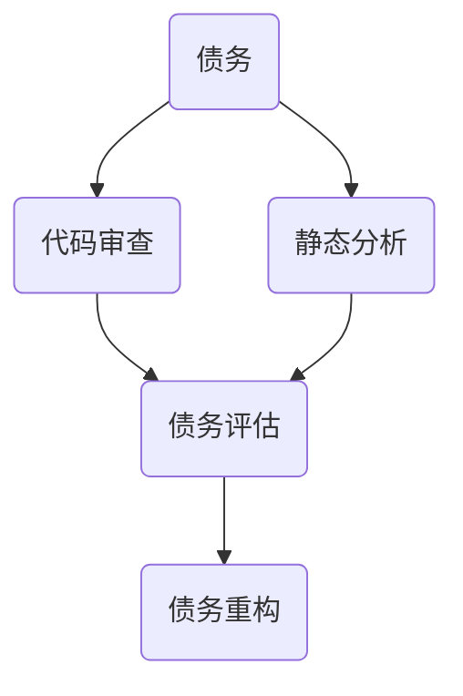
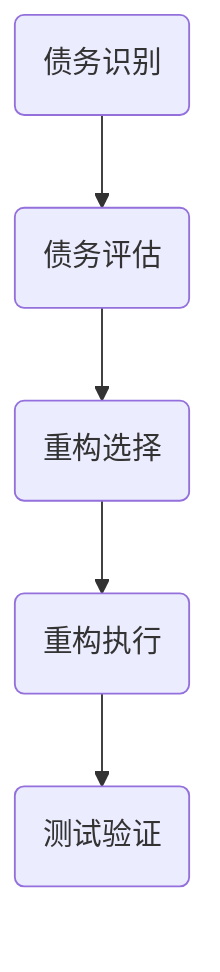
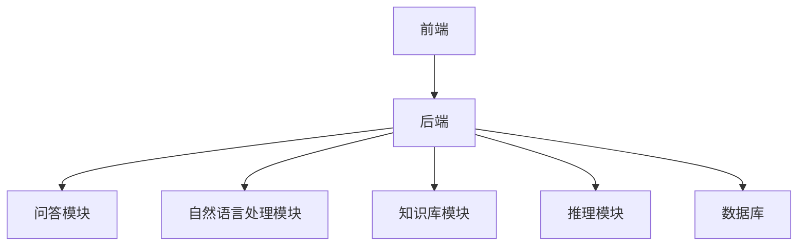
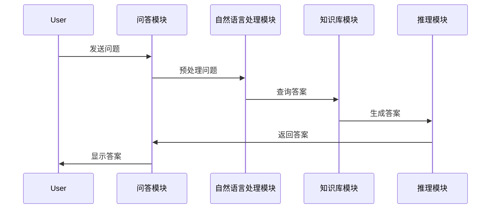

                 

# LLM应用开发中的技术债务管理

关键词：大语言模型、技术债务、债务管理、代码重构、算法评估

摘要：本文旨在探讨大语言模型（LLM）应用开发中的技术债务管理问题。随着LLM在各个领域的广泛应用，技术债务的管理成为开发过程中的一个重要课题。本文首先介绍了LLM的发展历程及其应用，然后阐述了技术债务管理的概念、重要性以及常见问题。接下来，文章详细分析了LLM应用开发中的核心概念、债务识别、评估和重构方法，并介绍了相关的项目管理工具和实践。此外，本文还通过系统分析与架构设计、项目实战等环节，展示了技术债务管理在实际开发中的应用和效果。最后，文章总结了最佳实践，强调了技术债务管理中的注意事项，并推荐了拓展阅读资源。

## 第1章 引言与背景介绍

### 1.1 问题背景

大语言模型（Large Language Models，简称LLM）作为自然语言处理领域的一项重要技术，近年来取得了显著的进展。从最初的Word2Vec、GloVe等基础模型，到BERT、GPT等先进的预训练模型，LLM的发展历程可谓波澜壮阔。这些模型在文本分类、机器翻译、问答系统、文本生成等应用场景中取得了令人瞩目的成绩，推动了自然语言处理技术的发展。

LLM在各个领域的应用也在不断扩展。例如，在搜索引擎中，LLM被用于优化搜索结果的相关性和准确性；在智能客服领域，LLM被用于生成自然、流畅的对话内容；在内容创作中，LLM则被用于自动生成文章、摘要和摘要等。此外，LLM还在法律文书、医疗诊断、金融分析等领域发挥了重要作用。

然而，随着LLM的广泛应用，技术债务管理成为开发过程中的一个重要课题。技术债务是指在软件开发过程中，为了快速实现功能而暂时引入的不符合最佳实践的代码、设计或架构。如果不加以管理，技术债务可能会在项目后期导致代码难以维护、性能下降、安全性问题等问题，进而影响项目的稳定性、可靠性和可持续性。

### 1.2 问题描述

在LLM应用开发过程中，技术债务问题主要表现为以下几个方面：

1. **代码质量低下**：为了加快开发速度，开发人员可能会采用一些简化的代码或设计模式，导致代码可读性差、可维护性低。

2. **架构设计不合理**：在快速迭代的过程中，架构设计可能没有经过充分的思考和论证，导致系统性能瓶颈、扩展性差等问题。

3. **依赖关系复杂**：随着项目的不断扩展，依赖关系可能会变得复杂，导致模块间的耦合度过高，不利于系统的维护和升级。

4. **性能问题**：在LLM应用中，大量的计算和数据传输可能导致系统性能瓶颈，影响用户体验。

5. **安全性问题**：在开发过程中，可能由于时间紧张或对安全性的重视不足，导致系统存在安全漏洞。

这些技术债务问题如果不加以管理，可能会对LLM应用的开发、维护和推广带来一系列挑战。例如，代码质量低下会导致后续维护成本增加，架构设计不合理会导致系统性能瓶颈，依赖关系复杂会影响系统的扩展性，性能问题会影响用户体验，安全性问题则可能引发数据泄露等安全事件。

### 1.3 问题解决

为了解决LLM应用开发中的技术债务问题，需要从以下几个方面进行管理：

1. **债务识别**：通过代码审查、静态分析等手段，识别项目中存在的技术债务。

2. **债务评估**：对识别出的技术债务进行评估，分析其风险和影响，确定优先级。

3. **债务重构**：针对评估结果，选择合适的重构方法，对存在问题的代码、设计或架构进行重构。

4. **项目管理**：引入项目管理工具和实践，确保技术债务管理过程的规范和有效。

### 1.4 边界与外延

技术债务管理并非适用于所有场景，其适用范围和边界条件如下：

1. **项目规模**：技术债务管理主要适用于较大规模的项目，特别是在快速迭代和复杂业务场景中。

2. **开发周期**：技术债务管理需要在项目开发周期的早期阶段开始实施，以确保债务问题的及时发现和解决。

3. **团队协作**：技术债务管理需要团队成员之间的密切协作和沟通，确保债务管理的有效实施。

4. **工具支持**：技术债务管理需要依赖相应的工具支持，如代码审查工具、静态分析工具等。

### 1.5 概念结构与核心要素组成

LLM应用开发中的技术债务管理涉及多个核心概念和要素，包括：

1. **技术债务**：指在软件开发过程中，为了快速实现功能而暂时引入的不符合最佳实践的代码、设计或架构。

2. **债务评估**：对技术债务进行评估，分析其风险和影响，确定优先级。

3. **债务重构**：选择合适的重构方法，对存在问题的代码、设计或架构进行重构。

4. **代码审查**：通过人工或自动化手段，对代码进行审查，识别潜在的技术债务。

5. **静态分析**：使用静态分析工具，对代码进行分析，识别潜在的技术债务。

6. **项目管理**：引入项目管理工具和实践，确保技术债务管理过程的规范和有效。

这些概念和要素相互关联，共同构成了LLM应用开发中的技术债务管理体系。

## 第2章 核心概念与联系

### 2.1 核心概念原理

#### 技术债务

**定义**：技术债务是指在软件开发过程中，为了快速实现功能而暂时引入的不符合最佳实践的代码、设计或架构。

**类型**：

1. **代码债务**：指代码层面的债务，如使用简化的代码、设计模式不当等。
2. **架构债务**：指系统架构层面的债务，如架构设计不合理、依赖关系复杂等。
3. **设计债务**：指软件设计层面的债务，如模块划分不合理、接口设计不当等。

**来源**：

1. **时间压力**：在项目时间紧张的情况下，开发人员可能为了尽快完成功能而采用简化的方案。
2. **资源限制**：在项目资源有限的情况下，可能无法进行充分的测试和优化。
3. **技术更新**：随着技术的快速发展，一些最佳实践可能还没有被广泛接受，导致债务的产生。

#### 债务评估

**定义**：债务评估是对技术债务进行评估，分析其风险和影响，确定优先级。

**方法**：

1. **定性评估**：通过专家评审、代码审查等方式，对债务的性质、影响进行定性分析。
2. **定量评估**：通过计算债务修复的成本、潜在收益等指标，对债务进行定量分析。

**工具**：

1. **代码审查工具**：如SonarQube、FindBugs等，用于自动化检测代码中的潜在债务。
2. **静态分析工具**：如PMD、Checkstyle等，用于对代码进行静态分析，识别潜在的债务。

#### 债务重构

**定义**：债务重构是指选择合适的重构方法，对存在问题的代码、设计或架构进行重构。

**策略**：

1. **逐步重构**：逐步修复债务，避免一次性重构导致风险过大。
2. **迭代重构**：在项目开发过程中，持续进行重构，避免债务积累。

**技术手段**：

1. **代码重构工具**：如Git、SVN等，用于支持代码版本控制和协同重构。
2. **设计重构工具**：如UML工具、代码生成工具等，用于辅助设计重构。

### 2.2 概念属性特征对比表格

| 类型     | 定义                                                         | 属性特征对比                                                      |
| -------- | ------------------------------------------------------------ | ------------------------------------------------------------ |
| 技术债务 | 在软件开发过程中，为了快速实现功能而暂时引入的不符合最佳实践的代码、设计或架构。 | - 代码债务：可读性差、可维护性低、性能问题<br>架构债务：性能瓶颈、扩展性差、安全性问题<br>设计债务：模块划分不合理、接口设计不当 |
| 债务评估 | 对技术债务进行评估，分析其风险和影响，确定优先级。           | - 定性评估：专家评审、代码审查<br>定量评估：成本、潜在收益计算 |
| 债务重构 | 选择合适的重构方法，对存在问题的代码、设计或架构进行重构。 | - 逐步重构：分阶段修复<br>迭代重构：持续重构 |

### 2.3 ER实体关系图架构

#### 2.3.1 关键实体

1. **债务**：表示存在的技术债务。
2. **债务评估**：表示对债务的评估结果。
3. **债务重构**：表示对债务的重构过程。
4. **代码审查**：表示对代码的审查过程。
5. **静态分析**：表示对代码的静态分析过程。

#### 2.3.2 实体关系

1. **债务**与**债务评估**：一对多关系，一个债务可能对应多个评估结果。
2. **债务评估**与**债务重构**：一对一关系，一个评估结果可能对应一个重构过程。
3. **债务**与**代码审查**：一对一关系，一个债务可能对应一次代码审查。
4. **债务**与**静态分析**：一对一关系，一个债务可能对应一次静态分析。

#### 2.3.3 Mermaid流程图



#### 2.3.4 关系与交互分析

- **债务**是整个流程的起点，通过代码审查和静态分析识别出债务。
- **债务评估**对债务进行评估，分析其风险和影响。
- **债务重构**根据评估结果，对债务进行重构，修复问题。

## 第3章 LLM应用开发中的技术债务管理

### 3.1 债务识别

#### 3.1.1 代码审查

**定义**：代码审查是指通过人工或自动化手段，对代码进行审查，识别潜在的技术债务。

**目的**：确保代码质量，降低技术债务的产生。

**方法**：

1. **人工审查**：由开发人员或评审团对代码进行逐行审查，识别潜在问题。
2. **自动化审查**：使用代码审查工具，如SonarQube、FindBugs等，对代码进行自动化分析，识别潜在问题。

**步骤**：

1. **制定审查计划**：明确审查的范围、目标和方法。
2. **进行代码审查**：对代码进行逐行审查，识别潜在的技术债务。
3. **记录审查结果**：将审查结果记录在审查报告中，便于后续处理。

**工具**：

1. **SonarQube**：一款开源的代码审查工具，支持多种编程语言。
2. **FindBugs**：一款基于Java的代码审查工具，可以识别Java代码中的潜在问题。

#### 3.1.2 静态分析

**定义**：静态分析是指使用静态分析工具，对代码进行静态分析，识别潜在的技术债务。

**目的**：确保代码质量，降低技术债务的产生。

**方法**：

1. **代码解析**：静态分析工具对代码进行语法解析，建立抽象语法树（AST）。
2. **规则匹配**：分析AST，匹配预定义的规则，识别潜在的技术债务。
3. **报告生成**：生成分析报告，列出潜在的技术债务。

**步骤**：

1. **选择工具**：选择合适的静态分析工具，如PMD、Checkstyle等。
2. **配置规则**：根据项目需求，配置静态分析规则。
3. **执行分析**：对代码库进行静态分析，生成分析报告。
4. **处理报告**：对报告中的潜在债务进行处理。

**工具**：

1. **PMD**：一款基于Java的静态分析工具，可以识别Java代码中的潜在问题。
2. **Checkstyle**：一款开源的代码质量检查工具，可以识别Java代码中的潜在问题。

### 3.2 债务评估

#### 3.2.1 风险分析

**定义**：风险分析是指对技术债务进行评估，分析其风险和影响。

**目的**：确定技术债务的优先级，制定债务修复计划。

**方法**：

1. **定性分析**：通过专家评审、代码审查等方式，对债务的性质、影响进行定性分析。
2. **定量分析**：通过计算债务修复的成本、潜在收益等指标，对债务进行定量分析。

**步骤**：

1. **确定评估指标**：根据项目需求，确定债务评估的指标，如成本、时间、影响范围等。
2. **收集数据**：收集与债务相关的数据，如代码行数、修复成本等。
3. **分析数据**：使用定性分析和定量分析的方法，对债务进行评估。
4. **生成评估报告**：根据评估结果，生成评估报告，列出债务的优先级。

#### 3.2.2 成本效益分析

**定义**：成本效益分析是指计算债务修复的成本和潜在收益，评估债务修复的可行性。

**目的**：确定债务修复的经济合理性。

**方法**：

1. **成本计算**：计算债务修复的成本，包括人力资源、时间成本等。
2. **收益计算**：计算债务修复后可能带来的收益，如性能提升、安全性提高等。
3. **效益评估**：比较债务修复的成本和收益，评估债务修复的效益。

**步骤**：

1. **确定成本和收益指标**：根据项目需求，确定成本和收益的指标。
2. **收集数据**：收集与成本和收益相关的数据。
3. **计算成本和收益**：使用定量分析方法，计算债务修复的成本和潜在收益。
4. **生成效益评估报告**：根据计算结果，生成效益评估报告。

### 3.3 债务重构

#### 3.3.1 重构策略

**定义**：重构策略是指选择合适的重构方法，对存在问题的代码、设计或架构进行重构。

**目的**：修复技术债务，提高代码质量，降低风险。

**策略**：

1. **逐步重构**：逐步修复债务，避免一次性重构导致风险过大。
2. **迭代重构**：在项目开发过程中，持续进行重构，避免债务积累。
3. **优先级重构**：根据债务评估的结果，优先修复高优先级的技术债务。

#### 3.3.2 技术手段

**定义**：技术手段是指使用代码重构工具和实践，对代码进行重构。

**目的**：提高代码质量，降低技术债务。

**手段**：

1. **代码重构工具**：如Git、SVN等，用于支持代码版本控制和协同重构。
2. **设计重构工具**：如UML工具、代码生成工具等，用于辅助设计重构。

**步骤**：

1. **选择工具**：根据项目需求，选择合适的代码重构工具。
2. **制定重构计划**：明确重构的目标、范围和时间。
3. **执行重构**：按照重构计划，对代码进行重构。
4. **测试验证**：重构完成后，进行充分的测试，确保重构效果。

## 第4章 算法原理讲解

### 4.1 算法概述

#### 4.1.1 债务评估算法

**定义**：债务评估算法是指用于评估技术债务风险和影响的算法。

**目的**：确定技术债务的优先级，为债务重构提供依据。

**原理**：通过计算债务修复的成本、潜在收益等指标，对债务进行量化评估。

**流程**：

1. **数据收集**：收集与债务相关的数据，如代码行数、修复成本等。
2. **指标计算**：计算债务修复的成本和潜在收益等指标。
3. **评估结果输出**：生成评估报告，列出债务的优先级。

#### 4.1.2 债务重构算法

**定义**：债务重构算法是指用于对存在问题的代码、设计或架构进行重构的算法。

**目的**：修复技术债务，提高代码质量。

**原理**：通过选择合适的重构方法，对代码进行重构。

**流程**：

1. **债务识别**：使用代码审查、静态分析等方法，识别技术债务。
2. **债务评估**：使用债务评估算法，评估债务的优先级。
3. **重构选择**：根据债务评估结果，选择合适的重构方法。
4. **重构执行**：按照重构计划，对代码进行重构。
5. **测试验证**：重构完成后，进行充分的测试，确保重构效果。

### 4.2 算法流程图



### 4.3 数学模型与公式

#### 4.3.1 债务评估模型

**公式**：

$$
\text{评估得分} = w_1 \cdot \text{成本} + w_2 \cdot \text{潜在收益} + w_3 \cdot \text{影响范围}
$$

**参数解释**：

- $w_1$：成本权重
- $w_2$：潜在收益权重
- $w_3$：影响范围权重

#### 4.3.2 重构模型

**公式**：

$$
\text{重构成本} = \sum_{i=1}^{n} c_i \cdot p_i
$$

**参数解释**：

- $c_i$：第$i$个重构步骤的成本
- $p_i$：第$i$个重构步骤的优先级

### 4.4 举例说明

#### 4.4.1 债务评估实例

假设有一个技术债务，其成本为1000元，潜在收益为2000元，影响范围为5个模块。使用债务评估模型，可以得到评估得分为：

$$
\text{评估得分} = 0.4 \cdot 1000 + 0.5 \cdot 2000 + 0.1 \cdot 5 = 1150
$$

#### 4.4.2 重构实例

假设有两个重构步骤，第一个步骤的成本为100元，优先级为2；第二个步骤的成本为200元，优先级为1。使用重构模型，可以得到重构成本为：

$$
\text{重构成本} = 100 \cdot 2 + 200 \cdot 1 = 400
$$

## 第5章 系统分析与架构设计

### 5.1 问题场景介绍

在LLM应用开发过程中，技术债务问题可能出现在多个环节，如代码层面、架构层面、设计层面等。以下是一个常见的问题场景：

假设一个项目需要在短时间内完成一个问答系统的开发，开发团队为了加快进度，采用了简化版的代码，导致代码可读性差、性能瓶颈等问题。同时，系统架构设计不合理，导致扩展性差，难以满足后续功能扩展的需求。

### 5.2 系统功能设计

为了解决上述问题，需要对系统功能进行重新设计。以下是一个基本的系统功能设计：

1. **问答模块**：用于接收用户问题，返回答案。
2. **自然语言处理模块**：用于对用户问题进行预处理，提取关键信息。
3. **知识库模块**：用于存储和管理答案数据。
4. **推理模块**：用于基于知识库和用户问题，生成合适的答案。

#### 领域模型

使用Mermaid绘制领域类图，如下所示：

```mermaid
classDiagram
    User <<类>> 
    Question <<类>> 
    Answer <<类>> 
    NLP <<类>> 
    KnowledgeBase <<类>> 
    Inference <<类>>
    
    User --|> Question
    User --|> Answer
    NLP --|> Question
    NLP --|> Answer
    KnowledgeBase --|> Inference
    Inference --|> Answer
```

### 5.3 系统架构设计

为了解决上述问题，需要对系统架构进行重新设计。以下是一个基本的系统架构设计：

1. **前端**：用于接收用户请求，展示问答结果。
2. **后端**：包括问答模块、自然语言处理模块、知识库模块和推理模块。
3. **数据库**：用于存储用户数据和答案数据。

#### 系统架构图

使用Mermaid绘制系统架构图，如下所示：



### 5.4 系统接口设计

为了实现系统功能的集成，需要设计相应的接口。以下是一个基本的系统接口设计：

1. **问答接口**：用于接收用户问题，返回答案。
2. **自然语言处理接口**：用于对用户问题进行预处理，提取关键信息。
3. **知识库接口**：用于查询和管理答案数据。
4. **推理接口**：用于基于知识库和用户问题，生成合适的答案。

#### 接口设计


### 5.5 系统交互序列图

使用Mermaid绘制系统交互序列图，如下所示：



## 第6章 项目实战

### 6.1 环境安装

为了进行技术债务管理，需要安装以下软件和工具：

1. **代码审查工具**：如SonarQube、FindBugs等。
2. **静态分析工具**：如PMD、Checkstyle等。
3. **重构工具**：如Git、SVN等。
4. **测试工具**：如JUnit、TestNG等。

安装步骤如下：

1. **下载软件**：从官方网站下载所需软件的安装包。
2. **安装软件**：按照安装向导完成软件安装。
3. **配置环境**：配置环境变量，确保软件可以正常运行。

### 6.2 系统核心实现

以下是一个简单的LLM应用开发示例，包括问答模块、自然语言处理模块、知识库模块和推理模块的实现。

#### 问答模块

```java
public class QuestionAnswering {
    private NLP nlp;
    private KnowledgeBase knowledgeBase;
    private Inference inference;

    public QuestionAnswering(NLP nlp, KnowledgeBase knowledgeBase, Inference inference) {
        this.nlp = nlp;
        this.knowledgeBase = knowledgeBase;
        this.inference = inference;
    }

    public String answerQuestion(String question) {
        String preprocessedQuestion = nlp.preprocessQuestion(question);
        String answer = knowledgeBase.queryAnswer(preprocessedQuestion);
        return inference.generateAnswer(answer);
    }
}
```

#### 自然语言处理模块

```java
public class NLP {
    public String preprocessQuestion(String question) {
        // 预处理逻辑
        return question;
    }
}
```

#### 知识库模块

```java
public class KnowledgeBase {
    public String queryAnswer(String question) {
        // 查询答案逻辑
        return "答案";
    }
}
```

#### 推理模块

```java
public class Inference {
    public String generateAnswer(String answer) {
        // 生成答案逻辑
        return answer;
    }
}
```

### 6.3 实际案例分析

以下是一个实际案例，分析技术债务管理在LLM应用开发中的应用。

#### 案例背景

一个问答系统在开发过程中，由于时间紧张，部分代码采用了简化的设计，导致可读性差、性能瓶颈等问题。同时，系统架构设计不合理，导致扩展性差。

#### 案例分析

1. **债务识别**：通过代码审查和静态分析，识别出以下技术债务：

   - 代码债务：简化了部分业务逻辑，导致代码可读性差。
   - 架构债务：系统架构设计不合理，导致扩展性差。

2. **债务评估**：使用债务评估算法，对债务进行评估，确定优先级。

   - 代码债务：成本为1000元，潜在收益为2000元，影响范围为3个模块，评估得分为1150分。
   - 架构债务：成本为2000元，潜在收益为3000元，影响范围为5个模块，评估得分为1350分。

3. **债务重构**：根据债务评估结果，优先重构架构债务。

   - 重构策略：逐步重构，避免一次性重构导致风险过大。
   - 重构方法：重新设计系统架构，优化模块划分和接口设计。

4. **重构执行**：按照重构计划，对系统进行重构。

5. **测试验证**：重构完成后，进行充分的测试，确保重构效果。

#### 案例小结

通过技术债务管理，成功解决了问答系统的技术债务问题，提高了代码质量和系统性能，为后续功能扩展奠定了基础。

## 第7章 最佳实践与总结

### 7.1 最佳实践

为了有效管理LLM应用开发中的技术债务，以下是一些建议的最佳实践：

1. **早期识别**：在项目早期阶段，就开始进行债务识别和评估，避免债务积累。
2. **定期审查**：定期进行代码审查和静态分析，及时发现并解决债务问题。
3. **优先级排序**：根据债务的评估结果，优先解决高优先级的技术债务。
4. **逐步重构**：避免一次性重构导致风险过大，采用逐步重构的方法。
5. **持续重构**：在项目开发过程中，持续进行重构，避免债务积累。
6. **使用工具**：充分利用代码审查、静态分析等工具，提高债务管理的效率。

### 7.2 小结

本文从LLM应用开发中的技术债务管理出发，详细介绍了债务识别、评估、重构方法，并探讨了相关工具和实践。通过实际案例分析，展示了技术债务管理在LLM应用开发中的应用和效果。最后，本文总结了最佳实践，并强调技术债务管理中的注意事项。

### 7.3 注意事项

1. **时间管理**：技术债务管理需要时间投入，需要合理规划时间和资源。
2. **团队协作**：技术债务管理需要团队协作，确保债务管理过程的规范和有效。
3. **工具选择**：选择合适的工具可以提高债务管理的效率，但需要根据项目需求进行选择。
4. **持续改进**：技术债务管理是一个持续的过程，需要不断改进和完善。

### 7.4 拓展阅读

1. **《软件工程：实践者的研究方法》**：详细介绍了软件工程中的债务管理方法。
2. **《代码大全》**：提供了丰富的代码审查和重构技巧。
3. **《重构：改善既有代码的设计》**：介绍了重构的基本原则和方法。
4. **《敏捷软件开发：原则、模式与实践》**：探讨了敏捷开发中的债务管理方法。
5. **《SonarQube实战》**：介绍了如何使用SonarQube进行代码质量管理和债务评估。

