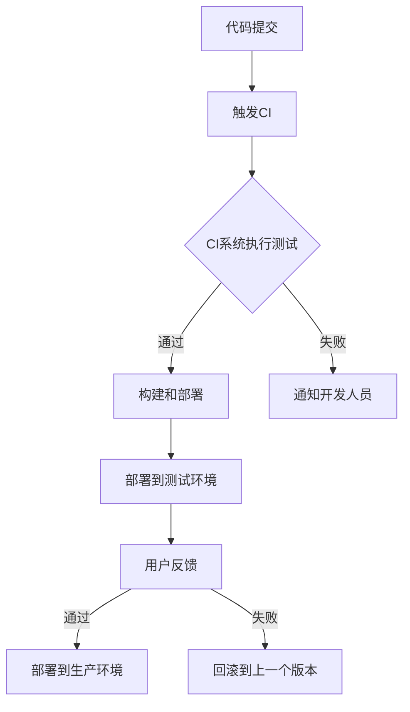
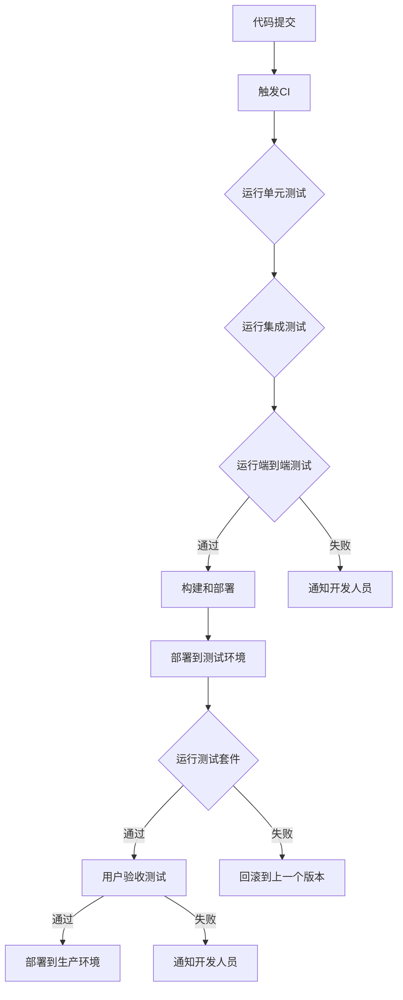
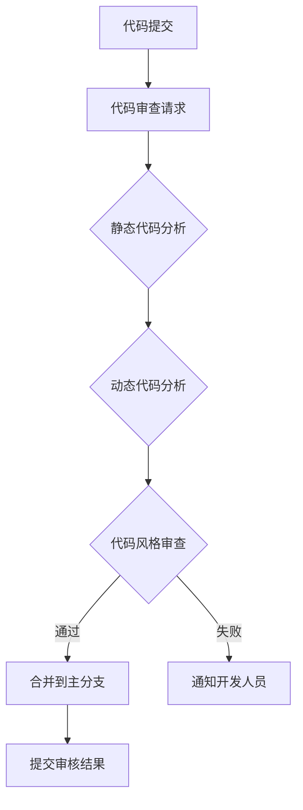
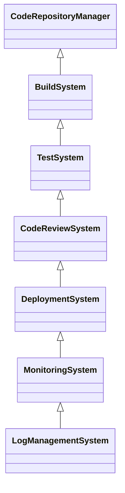
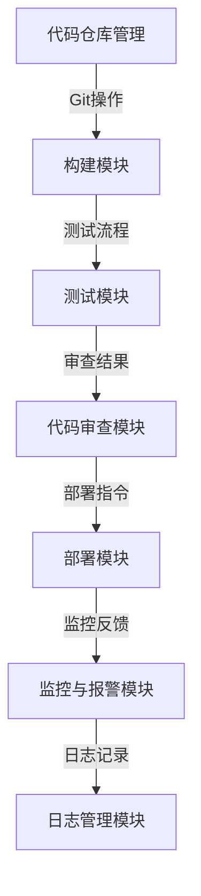
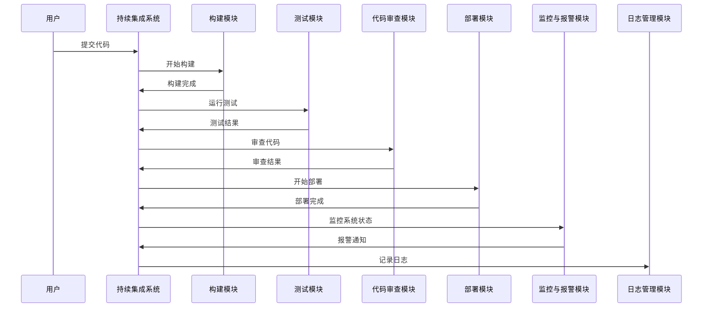
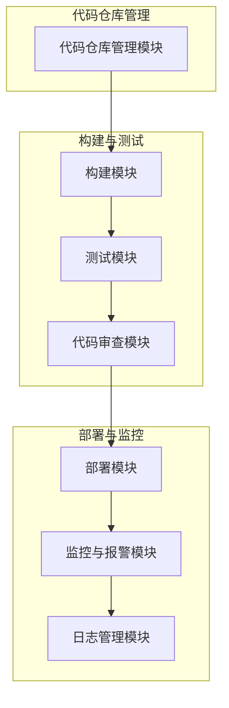
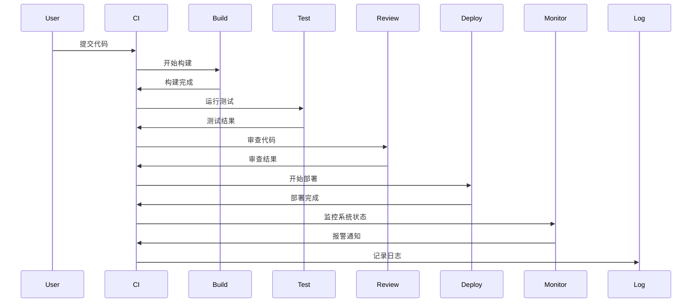

                 

### 文章标题与关键词

## LLM应用开发中的持续集成与持续部署

> 关键词：大型语言模型（LLM）、持续集成（CI）、持续部署（CD）、算法、Python代码、系统架构设计、项目实战、最佳实践

> 摘要：本文将探讨LLM（大型语言模型）在应用开发过程中引入持续集成与持续部署（CI/CD）的必要性。我们将从LLM与CI/CD的基础概念出发，逐步深入探讨CI/CD在LLM应用开发中的算法原理、系统设计与实现，并通过实际项目展示如何将CI/CD应用于LLM开发。最后，本文将总结最佳实践，并对未来研究方向和拓展阅读提出建议。

### 文章概述

#### 第一部分: LLM应用开发基础

### 第1章: LLM与CI/CD概述

在本章中，我们将介绍LLM的概念、CI/CD的基本概念，并探讨二者结合的必要性。

#### 第2章: LLM应用开发中的算法与流程

我们将详细讲解CI/CD的常见算法与流程，并通过Mermaid流程图和Python代码示例来说明。

#### 第二部分: 系统设计与实现

### 第3章: LLM应用开发系统设计与实现

我们将从系统功能设计、系统架构设计和系统接口设计三个方面介绍如何设计和实现一个支持CI/CD的LLM应用开发系统。

#### 第4章: LLM应用开发项目实战

在本章中，我们将展示一个实际的LLM应用开发项目，包括环境安装、系统核心实现、代码应用解读和案例分析。

#### 第三部分: 最佳实践与总结

### 第5章: LLM应用开发中的最佳实践

我们将提供一些CI/CD在LLM应用开发中的最佳实践，并讨论注意事项。

### 第6章: 小结与展望

最后，我们将对全文内容进行总结，并提出未来研究方向和拓展阅读建议。

### LLMAPI介绍与初探

在开始深入研究LLM应用开发中的持续集成与持续部署（CI/CD）之前，我们首先需要了解什么是LLM以及它在现代应用开发中的作用。

#### LLMAPI介绍

LLM（Large Language Model）即大型语言模型，是一种基于神经网络的高级自然语言处理（NLP）技术。它能够理解和生成人类语言，从而在多种应用场景中发挥重要作用。LLM通过大量的文本数据训练，能够实现文本分类、文本生成、机器翻译、问答系统等功能。常见的LLM包括GPT（Generative Pre-trained Transformer）、BERT（Bidirectional Encoder Representations from Transformers）和T5（Text-To-Text Transfer Transformer）等。

在编程中，LLM通常通过API（Application Programming Interface）进行调用。例如，Hugging Face的Transformers库为GPT等模型提供了便捷的API接口。开发者可以通过简单的代码调用这些API来实现复杂的NLP任务。

#### 初探LLM应用

LLM在应用开发中具有广泛的应用场景。以下是一些典型的LLM应用示例：

1. **问答系统**：例如，基于GPT-3的ChatGPT和基于BERT的Google Assistant，能够回答用户的问题。
2. **机器翻译**：例如，基于GPT的谷歌翻译和基于BERT的百度翻译，能够将一种语言翻译成另一种语言。
3. **文本生成**：例如，基于GPT的AI写作工具和基于BERT的文章生成系统，能够根据用户输入的提示生成高质量的文章。
4. **推荐系统**：例如，基于BERT的电影推荐系统和基于T5的电商推荐系统，能够为用户推荐相关的内容。

LLM在应用开发中的重要性体现在以下几个方面：

1. **提高开发效率**：通过使用预训练的LLM，开发者可以省去大量的训练时间，直接将模型应用于实际任务。
2. **提高系统性能**：LLM具有强大的语言理解和生成能力，能够处理复杂的自然语言任务，从而提高系统的整体性能。
3. **降低开发成本**：由于LLM是预训练的，开发者不需要从头开始训练模型，从而降低了开发成本。

然而，LLM的应用也面临着一些挑战，例如模型的可解释性、安全性和隐私保护等问题。这些问题需要我们在后续的文章中深入探讨。

#### LLMAPI的使用

下面是一个简单的Python代码示例，展示如何使用Hugging Face的Transformers库调用GPT-3模型进行文本生成：

```python
from transformers import pipeline

# 初始化GPT-3模型
text_generator = pipeline("text-generation", model="gpt3")

# 输入文本
input_text = "What is the weather like today?"

# 调用API生成文本
generated_text = text_generator(input_text, max_length=50, num_return_sequences=1)

# 输出生成的文本
print(generated_text[0]["generated_text"])
```

通过上述示例，我们可以看到，使用LLMAPI进行文本生成非常简单。开发者只需调用相应的API函数，传入输入文本和其他参数，即可获取生成的文本。

总的来说，LLM在应用开发中具有巨大的潜力和广阔的应用前景。通过引入CI/CD流程，我们可以进一步优化LLM应用开发的效率和质量。接下来，我们将深入探讨CI/CD的基本概念和其在LLM应用开发中的重要性。

### 持续集成与持续部署（CI/CD）概述

#### 持续集成（CI）的基本概念

持续集成（Continuous Integration，简称CI）是一种软件开发实践，旨在通过频繁的代码提交和自动化构建，确保代码库始终处于可运行状态。其核心思想是将开发人员的代码更改定期合并到共享的主分支，并通过自动化测试和构建确保合并后的代码没有引入新的错误。

CI的主要目标包括：

1. **提高代码质量**：通过自动化测试和代码审查，及时发现和修复代码中的错误，从而提高代码的质量。
2. **减少集成成本**：频繁的代码集成和自动化测试可以显著减少集成过程中出现的冲突和错误，降低集成成本。
3. **加快开发速度**：通过缩短代码的迭代周期，提高开发团队的工作效率。

CI的关键流程包括：

1. **代码提交**：开发人员将代码更改提交到代码库。
2. **自动化测试**：CI系统自动运行一系列预定义的测试，包括单元测试、集成测试和端到端测试。
3. **构建和部署**：如果测试通过，CI系统将构建和部署代码到生产环境。

#### 持续部署（CD）的基本概念

持续部署（Continuous Deployment，简称CD）是一种自动化软件交付流程，旨在通过自动化的方式将代码更改部署到生产环境。与CI不同，CD强调的是将代码从开发环境直接部署到生产环境，从而实现快速交付和持续改进。

CD的主要目标包括：

1. **提高交付速度**：通过自动化部署流程，显著缩短软件交付周期，提高市场响应速度。
2. **降低部署风险**：自动化测试和逐步部署策略可以降低部署过程中出现的问题和风险。
3. **确保质量**：通过频繁的部署和自动化测试，确保生产环境中的代码质量。

CD的关键流程包括：

1. **自动化构建**：构建系统自动将代码转换为可执行文件或容器镜像。
2. **自动化测试**：运行一系列预定义的测试，确保构建的代码没有引入新的错误。
3. **逐步部署**：通过逐步部署策略，将代码更新逐步部署到生产环境，以减少对用户的影响。

#### CI/CD在LLM应用开发中的必要性

在LLM应用开发中，引入CI/CD具有以下几个必要性：

1. **复杂性与规模**：LLM应用通常涉及大量的数据处理和模型训练，这使得代码库变得复杂且规模庞大。CI/CD可以帮助管理这种复杂性，确保代码库始终处于良好状态。
2. **模型迭代**：LLM模型的开发通常需要频繁的迭代和改进。CI/CD的自动化测试和部署流程可以加速模型迭代，提高开发效率。
3. **安全与合规性**：LLM应用通常涉及到敏感数据和隐私保护问题。CI/CD可以引入自动化测试和安全检查，确保代码和模型的安全性和合规性。

通过引入CI/CD，LLM应用开发可以实现以下优势：

1. **自动化与效率**：通过自动化测试、构建和部署流程，减少手动操作，提高开发效率。
2. **质量保障**：自动化测试和代码审查可以及时发现和修复错误，确保代码和模型的质量。
3. **快速交付**：频繁的迭代和自动部署可以显著缩短交付周期，提高市场响应速度。

总之，CI/CD在LLM应用开发中具有不可替代的作用，它不仅提高了开发效率和代码质量，还确保了模型的可靠性和安全性。

### CI/CD的核心概念与联系

在深入探讨CI/CD在LLM应用开发中的应用之前，我们需要首先理解CI/CD的核心概念及其相互之间的联系。CI和CD虽然各有侧重，但它们在实际应用中是紧密相连、相辅相成的。

#### 持续集成（CI）

持续集成（Continuous Integration，简称CI）是一种软件开发实践，其核心目标是确保代码库始终处于可集成和可运行状态。CI的主要活动包括代码提交、自动化测试、构建和部署。

1. **代码提交**：开发人员将新的代码更改提交到代码库。每次提交都会触发CI系统进行后续的操作。
2. **自动化测试**：CI系统会自动运行一系列预定义的测试，这些测试包括单元测试、集成测试和端到端测试。目的是检测代码变更是否引入了新的错误或问题。
3. **构建**：如果测试通过，CI系统会自动构建代码，将其编译成可执行文件或打包成应用程序。
4. **部署**：构建成功后，CI系统可以选择将代码部署到不同的环境，如开发环境、测试环境和生产环境。

CI的主要优势包括：

- **快速反馈**：通过自动化测试，开发人员可以迅速发现和修复代码问题，避免问题在代码库中累积。
- **提高代码质量**：持续集成有助于识别和修复代码缺陷，从而提高整体代码质量。
- **减少集成成本**：频繁的集成和测试可以减少集成过程中出现的冲突和错误，降低集成成本。

#### 持续部署（CD）

持续部署（Continuous Deployment，简称CD）是一种自动化软件交付流程，旨在通过自动化的方式将代码更改部署到生产环境。CD强调的是从开发环境直接到生产环境的自动化部署。

1. **自动化构建**：构建系统自动将代码转换为可执行文件或容器镜像。这个过程通常是CI的一部分。
2. **自动化测试**：在构建成功后，CD系统会运行一系列预定义的测试，确保构建的代码没有引入新的错误。
3. **逐步部署**：通过逐步部署策略，将代码更新逐步部署到生产环境，以减少对用户的影响。这种方法可以是蓝绿部署、灰度发布等。

CD的主要优势包括：

- **快速交付**：通过自动化部署流程，显著缩短软件交付周期，提高市场响应速度。
- **降低部署风险**：自动化测试和逐步部署策略可以降低部署过程中出现的问题和风险。
- **持续改进**：频繁的部署和反馈可以帮助团队更快地发现和解决问题，实现持续改进。

#### CI与CD的联系

CI和CD是相互关联且紧密相连的：

1. **CI作为CD的前提**：CI是CD的基础，它确保代码库中的代码始终是可集成和可运行的。没有CI，CD的自动化部署将无法顺利进行。
2. **CD作为CI的目标**：CI的最终目标是确保代码库中的代码可以顺利部署到生产环境，而CD则是实现这一目标的具体方式。

在实际应用中，CI/CD常常结合使用，形成一个完整的自动化开发、测试和部署流程。例如，当一个开发人员提交代码更改时，CI系统会自动运行测试和构建，如果一切顺利，CD系统会将代码部署到生产环境。

#### CI/CD在LLM应用开发中的应用

在LLM应用开发中，CI/CD的应用尤其重要，原因如下：

1. **复杂性管理**：LLM应用通常涉及大量的数据处理和模型训练，这使得代码库变得复杂且规模庞大。CI/CD可以帮助管理这种复杂性，确保代码库始终处于良好状态。
2. **模型迭代**：LLM模型的开发通常需要频繁的迭代和改进。CI/CD的自动化测试和部署流程可以加速模型迭代，提高开发效率。
3. **安全与合规性**：LLM应用通常涉及到敏感数据和隐私保护问题。CI/CD可以引入自动化测试和安全检查，确保代码和模型的安全性和合规性。

通过CI/CD，LLM应用开发可以实现以下优势：

1. **自动化与效率**：通过自动化测试、构建和部署流程，减少手动操作，提高开发效率。
2. **质量保障**：自动化测试和代码审查可以及时发现和修复错误，确保代码和模型的质量。
3. **快速交付**：频繁的迭代和自动部署可以显著缩短交付周期，提高市场响应速度。

总之，CI/CD在LLM应用开发中具有不可替代的作用，它不仅提高了开发效率和代码质量，还确保了模型的可靠性和安全性。在接下来的章节中，我们将详细探讨CI/CD在LLM应用开发中的具体算法和流程。

### CI/CD常见算法与流程

在LLM应用开发中，CI/CD的常见算法和流程包括自动化测试、代码审查和版本控制。这些算法和流程在确保代码库质量和项目进度方面发挥着关键作用。下面，我们将详细讨论这些算法和流程。

#### 自动化测试

自动化测试是CI/CD流程中的一个核心环节，旨在通过自动化的方式检测代码中的缺陷和错误。自动化测试通常包括单元测试、集成测试和端到端测试。

1. **单元测试**：单元测试是针对代码中最小的可测试部分（通常是一个函数或方法）进行的测试。其目的是验证单元的正确性。单元测试通常由开发人员编写，并在每次代码提交时自动运行。

2. **集成测试**：集成测试是在多个单元组合成模块或组件后进行的测试，以验证模块或组件之间的正确交互。集成测试通常由测试人员编写，并在开发周期中进行。

3. **端到端测试**：端到端测试是模拟用户操作的全流程测试，旨在验证整个系统的功能是否正常。端到端测试通常涵盖前端、后端以及数据库等各个层面。

**Python自动化测试示例**

以下是一个简单的Python单元测试示例，使用`unittest`框架：

```python
import unittest

class TestHelloWorld(unittest.TestCase):
    def test_hello(self):
        self.assertEqual(hello_world("Alice"), "Hello, Alice!")

if __name__ == '__main__':
    unittest.main()
```

#### 代码审查

代码审查（Code Review）是CI/CD流程中的另一个重要环节，旨在通过同行评审的方式提高代码质量。代码审查通常包括静态代码分析和动态代码分析。

1. **静态代码分析**：静态代码分析是一种不运行代码的代码质量检查方法，通过分析源代码来发现潜在的错误和问题。常见的静态代码分析工具包括SonarQube、Checkstyle和PMD等。

2. **动态代码分析**：动态代码分析是在代码运行时进行的分析，通过执行代码来检测运行时的问题和错误。动态代码分析通常在自动化测试过程中进行。

**静态代码分析示例**

以下是一个简单的静态代码分析示例，使用`pylint`工具：

```bash
pylint --report xml my_script.py
```

#### 版本控制

版本控制是CI/CD流程中的基础，它确保代码库的版本和管理。Git是当前最流行的版本控制工具，它支持分布式版本控制和强大的分支管理。

1. **Git操作**：Git提供了一系列操作命令，如`git clone`、`git pull`、`git push`和`git branch`等，用于克隆仓库、获取更新、提交更改和创建分支。

2. **分支管理**：在CI/CD流程中，分支管理至关重要。通常，开发人员会在特性分支上开发新功能，并在测试通过后合并到主分支。

3. **合并策略**：合并策略决定了如何将特性分支的更改合并到主分支。常见的合并策略包括“Fast Forward”、“Merge”和“Rebase”等。

**Git分支管理示例**

以下是一个简单的Git分支管理示例：

```bash
git checkout -b feature/new_function
# 在特性分支上进行开发
git add .
git commit -m "Add new_function"
# 将特性分支合并到主分支
git checkout main
git merge feature/new_function
```

#### 综合应用

在LLM应用开发中，CI/CD的这些算法和流程通常综合应用，以确保代码质量和项目进度。以下是一个综合示例：

1. **代码提交**：开发人员提交代码更改到Git仓库。
2. **自动化测试**：CI系统自动运行单元测试、集成测试和端到端测试。
3. **代码审查**：通过静态代码分析和动态代码分析，CI系统生成代码质量报告。
4. **构建和部署**：如果测试和审查通过，CI系统将代码构建为可执行文件或容器镜像，并部署到测试环境。
5. **用户反馈**：测试环境和生产环境中的用户反馈将用于进一步的迭代和改进。

通过上述算法和流程，LLM应用开发可以实现高效的代码管理和项目交付，从而提高开发效率和代码质量。

### Mermaid流程图

在讨论CI/CD的算法和流程时，Mermaid流程图是一个非常实用的工具，可以帮助我们更直观地理解和展示这些流程。Mermaid是一种基于Markdown的绘图工具，通过简单的文本格式即可绘制出流程图、序列图和类图等。下面，我们将使用Mermaid绘制几个与CI/CD相关的流程图。

#### CI/CD整体流程

首先，我们来看CI/CD的整体流程图：



这段代码绘制了一个简单的CI/CD整体流程图。首先，开发人员提交代码，触发CI系统。CI系统会自动执行测试，如果测试通过，代码会被构建和部署到测试环境，然后根据用户反馈决定是否部署到生产环境。如果测试失败，会通知开发人员进行修复。

#### LLM应用测试流程

接下来，我们来看一个特定的LLM应用测试流程：



这个流程图详细展示了LLM应用测试的各个环节，从代码提交开始，经过单元测试、集成测试和端到端测试，最终根据测试结果决定是否部署到生产环境。

#### 代码审查流程

最后，我们来看代码审查的流程图：



这个流程图展示了代码审查的整个过程，包括静态代码分析、动态代码分析和代码风格审查，最终决定是否将代码合并到主分支。

通过这些Mermaid流程图，我们可以更直观地理解和描述CI/CD的各个流程，帮助开发者更好地管理和优化项目开发过程。

### Python代码讲解

在CI/CD流程中，自动化测试是一个至关重要的环节，通过编写Python代码来实现自动化测试，可以大大提高测试效率和代码质量。下面，我们将通过几个具体的Python代码示例来讲解自动化测试的编写过程。

#### 示例1：自动化测试代码

首先，我们来看一个简单的单元测试示例，使用Python的`unittest`框架：

```python
import unittest

class TestHelloWorld(unittest.TestCase):
    def test_hello(self):
        self.assertEqual(hello_world("Alice"), "Hello, Alice!")
    def test_hello_with_empty_name(self):
        self.assertEqual(hello_world(""), "Hello!")

def hello_world(name):
    return "Hello, " + name

if __name__ == '__main__':
    unittest.main()
```

在这个示例中，我们定义了一个名为`TestHelloWorld`的测试类，其中包含了两个测试方法`test_hello`和`test_hello_with_empty_name`。`test_hello`方法测试了输入一个名字时是否能够正确返回问候语，而`test_hello_with_empty_name`方法测试了输入空字符串时是否能够正确返回默认的问候语。

#### 示例2：代码审查代码

接下来，我们来看一个简单的代码审查示例，使用`pylint`工具进行静态代码分析：

```bash
pylint --report xml my_script.py
```

在这个示例中，我们使用`pylint`命令对`my_script.py`文件进行静态代码分析，并生成XML格式的报告。通过这个报告，我们可以查看代码中的潜在问题，如语法错误、风格问题等。

#### 示例3：版本控制代码

最后，我们来看一个简单的版本控制示例，使用Git进行分支管理和合并操作：

```bash
git checkout -b feature/new_function
# 在特性分支上进行开发
git add .
git commit -m "Add new_function"
# 将特性分支合并到主分支
git checkout main
git merge feature/new_function
```

在这个示例中，我们首先创建了一个名为`feature/new_function`的新分支，然后在特性分支上进行开发并提交了一个新的功能。接着，我们将特性分支合并到主分支，从而将新的功能合并到主代码库。

通过这些Python代码示例，我们可以看到如何实现自动化测试、代码审查和版本控制。这些工具和技术的应用，不仅提高了开发效率和代码质量，还为CI/CD流程提供了坚实的基础。

### 系统功能设计

在设计一个支持持续集成与持续部署（CI/CD）的LLM应用开发系统时，系统功能设计是至关重要的一步。系统功能设计定义了系统的各个模块及其职责，以确保系统能够高效地处理从代码提交到生产部署的全过程。以下是系统功能设计的详细说明：

#### 功能模块划分

一个典型的LLM应用开发系统可以划分为以下几个主要功能模块：

1. **代码仓库管理模块**：负责代码的存储和管理，支持Git操作，如克隆、拉取、推送和分支管理。
2. **构建模块**：负责将源代码编译或构建为可执行文件或容器镜像。构建过程中需要集成自动化构建工具，如Jenkins或GitLab CI/CD。
3. **测试模块**：负责自动化测试，包括单元测试、集成测试和端到端测试。测试模块应集成测试框架和工具，如pytest、JUnit或TestNG。
4. **代码审查模块**：负责代码的审查，包括静态代码分析和动态代码分析，以识别潜在的问题和错误。常见的工具包括SonarQube、PMD和Checkstyle。
5. **部署模块**：负责将构建成功的代码部署到不同环境，如开发环境、测试环境和生产环境。部署模块应支持自动化部署工具，如Ansible或Docker Compose。
6. **监控与报警模块**：负责监控系统的运行状态，并在出现问题时发送报警通知。常见的监控工具包括Prometheus和Zabbix。
7. **日志管理模块**：负责收集和存储系统运行日志，提供日志查询和分析功能，以帮助开发人员定位问题和优化系统。

#### 领域模型类图

为了更好地理解系统功能设计，我们可以绘制一个领域模型类图，展示各个功能模块及其之间的关系。以下是一个简单的领域模型类图示例：



在这个类图中，`CodeRepositoryManager`负责代码仓库管理，它是构建模块、测试模块、代码审查模块和部署模块的父类。每个模块都有明确的职责，并与其他模块通过类继承关系进行关联。

#### 功能描述

下面是对每个功能模块的详细描述：

1. **代码仓库管理模块**：负责存储和管理LLM应用的源代码。该模块支持Git操作，如克隆、拉取、推送和分支管理。开发者可以在本地克隆代码仓库，并在完成开发后推送更改。代码仓库管理模块还负责处理分支合并和冲突解决。

2. **构建模块**：负责将源代码编译或构建为可执行文件或容器镜像。构建模块可以使用Jenkins或GitLab CI/CD等自动化构建工具。在构建过程中，构建模块会运行静态代码分析和单元测试，以确保代码质量。构建成功后，构建模块会生成构建报告和日志。

3. **测试模块**：负责自动化测试，包括单元测试、集成测试和端到端测试。测试模块集成了pytest、JUnit或TestNG等测试框架和工具。在CI过程中，测试模块会自动运行预定义的测试用例，以验证代码的功能和性能。

4. **代码审查模块**：负责代码的审查，包括静态代码分析和动态代码分析。静态代码分析使用PMD、Checkstyle等工具检查代码风格和潜在问题。动态代码分析则通过运行代码并监控其行为来检测潜在错误。代码审查模块可以帮助开发人员提前发现和修复问题。

5. **部署模块**：负责将构建成功的代码部署到不同的环境。部署模块支持Ansible、Docker Compose等自动化部署工具。在部署过程中，部署模块会根据配置文件和部署策略执行部署操作，如环境变量设置、数据库迁移和服务启动等。

6. **监控与报警模块**：负责监控系统的运行状态，并在出现问题时发送报警通知。监控模块可以使用Prometheus、Zabbix等工具，收集系统指标数据并进行分析。当系统指标超出阈值时，监控模块会自动发送报警通知，提醒开发人员或运维人员处理问题。

7. **日志管理模块**：负责收集和存储系统运行日志，提供日志查询和分析功能。日志管理模块可以帮助开发人员和运维人员快速定位问题，并优化系统性能。常见的日志管理工具包括ELK（Elasticsearch、Logstash、Kibana）和Graylog。

通过以上系统功能设计，我们可以构建一个高效、可靠的LLM应用开发系统，实现自动化测试、代码审查和持续部署。接下来，我们将深入探讨系统架构设计，为实际实现提供指导。

### 系统架构设计

在确定了LLM应用开发系统的功能模块后，系统架构设计是确保系统高效、稳定运行的关键。系统架构设计不仅需要考虑各个模块的功能，还需要关注模块间的交互和数据流，以确保系统能够满足性能、可扩展性和安全性的要求。下面，我们将详细探讨系统架构设计，包括架构图、模块交互设计以及接口设计。

#### 架构图

系统架构图是系统架构设计的核心部分，它以图形化的方式展示了系统的组成及其各模块之间的关系。以下是一个简化的系统架构图示例：



在这个架构图中，各个模块通过明确的接口进行交互：

- **代码仓库管理模块（CodeRepositoryManager）**：负责Git操作，如代码的克隆、拉取、推送和分支管理。
- **构建模块（BuildSystem）**：接收代码仓库管理模块的指令，使用自动化构建工具（如Jenkins或GitLab CI/CD）编译或构建源代码。
- **测试模块（TestSystem）**：在构建完成后，执行自动化测试，包括单元测试、集成测试和端到端测试。
- **代码审查模块（CodeReviewSystem）**：对测试结果进行审查，包括静态代码分析和动态代码分析，以发现潜在问题。
- **部署模块（DeploymentSystem）**：根据代码审查结果和部署策略，将代码部署到不同环境。
- **监控与报警模块（MonitoringSystem）**：实时监控系统运行状态，并在出现问题时发送报警通知。
- **日志管理模块（LogManagementSystem）**：收集和存储系统日志，提供日志查询和分析功能。

#### 模块交互设计

模块交互设计是系统架构设计中的关键部分，它定义了各个模块之间的交互方式和数据流。以下是各个模块之间交互的详细说明：

1. **代码仓库管理模块与构建模块**：
   - **交互方式**：代码仓库管理模块通过Git API与构建模块进行交互，当有新的代码提交时，通知构建模块开始构建过程。
   - **数据流**：构建模块从代码仓库获取最新的代码，并执行编译或构建操作。

2. **构建模块与测试模块**：
   - **交互方式**：构建模块在构建完成后，将构建结果（如可执行文件或容器镜像）传递给测试模块。
   - **数据流**：测试模块使用构建结果执行自动化测试，并将测试结果返回给代码仓库管理模块。

3. **测试模块与代码审查模块**：
   - **交互方式**：测试模块将测试结果传递给代码审查模块。
   - **数据流**：代码审查模块根据测试结果执行静态代码分析和动态代码分析，并生成审查报告。

4. **代码审查模块与部署模块**：
   - **交互方式**：代码审查模块将审查结果传递给部署模块。
   - **数据流**：部署模块根据审查结果和部署策略执行部署操作。

5. **部署模块与监控与报警模块**：
   - **交互方式**：部署模块在部署完成后，将部署状态和结果传递给监控与报警模块。
   - **数据流**：监控与报警模块根据部署结果监控系统运行状态，并在出现问题时发送报警通知。

6. **监控与报警模块与日志管理模块**：
   - **交互方式**：监控与报警模块将监控数据和报警信息传递给日志管理模块。
   - **数据流**：日志管理模块收集监控数据和报警信息，并将日志存储在数据库或文件系统中。

#### 系统接口设计

系统接口设计是模块交互设计的具体实现，它定义了各个模块之间通信的接口和协议。以下是各个模块的主要接口设计：

1. **代码仓库管理模块接口**：
   - **Git API**：提供Git操作接口，包括代码克隆、拉取、推送和分支管理。
   - **Webhook**：接收来自Git仓库的Webhook事件通知，如代码提交、合并请求和标签发布。

2. **构建模块接口**：
   - **构建脚本**：提供构建脚本接口，用于编译和构建源代码。
   - **构建配置**：提供构建配置接口，用于定义构建工具和构建参数。

3. **测试模块接口**：
   - **测试用例库**：提供测试用例库接口，用于存储和管理测试用例。
   - **测试报告**：提供测试报告接口，用于生成和存储测试结果报告。

4. **代码审查模块接口**：
   - **代码分析接口**：提供静态代码分析和动态代码分析接口，用于执行代码审查。
   - **审查报告**：提供审查报告接口，用于生成和存储审查结果报告。

5. **部署模块接口**：
   - **部署脚本**：提供部署脚本接口，用于部署代码到不同环境。
   - **部署策略**：提供部署策略接口，用于定义部署策略和部署流程。

6. **监控与报警模块接口**：
   - **监控系统接口**：提供监控系统接口，用于收集系统运行指标。
   - **报警接口**：提供报警接口，用于发送报警通知。

7. **日志管理模块接口**：
   - **日志采集接口**：提供日志采集接口，用于收集系统运行日志。
   - **日志查询接口**：提供日志查询接口，用于查询和检索日志信息。

通过上述系统架构设计，我们可以构建一个高效、可靠的LLM应用开发系统，实现自动化测试、代码审查和持续部署。接下来，我们将通过一个实际项目来展示如何将CI/CD应用于LLM应用开发。

### 系统架构设计详解

在了解了LLM应用开发系统的整体架构和模块交互后，我们接下来将深入探讨系统架构设计的具体实现，包括系统功能介绍、项目介绍、系统功能设计（领域模型类图）、系统架构设计（架构图）、系统接口设计以及系统交互序列图。这些设计细节将为实际项目开发提供明确的指导和参考。

#### 系统功能介绍

为了更好地理解系统架构设计的实现，我们需要首先明确系统的各项功能。以下是系统的主要功能模块及其简要描述：

1. **代码仓库管理模块**：负责代码的存储和管理，支持Git操作，如克隆、拉取、推送和分支管理。
2. **构建模块**：负责将源代码编译或构建为可执行文件或容器镜像。构建过程中会执行静态代码分析和单元测试，确保代码质量。
3. **测试模块**：负责自动化测试，包括单元测试、集成测试和端到端测试。测试模块会根据测试结果生成测试报告。
4. **代码审查模块**：负责代码审查，包括静态代码分析和动态代码分析。代码审查模块会生成审查报告，帮助开发人员发现和修复问题。
5. **部署模块**：负责将构建成功的代码部署到不同环境，如开发环境、测试环境和生产环境。部署模块会根据部署策略执行部署操作。
6. **监控与报警模块**：负责实时监控系统的运行状态，并在出现问题时发送报警通知。监控模块会收集系统指标数据进行分析。
7. **日志管理模块**：负责收集和存储系统运行日志，提供日志查询和分析功能。日志管理模块可以帮助开发人员和运维人员快速定位问题。

#### 项目介绍

为了更好地展示系统架构设计在实际项目中的应用，我们假设一个实际的LLM应用开发项目——一个基于GPT-3的智能问答系统。该项目的主要功能是允许用户输入问题，系统会根据训练的GPT-3模型生成相应的答案。

项目架构设计需要考虑以下几个关键点：

1. **多环境部署**：该项目需要在开发环境、测试环境和生产环境中部署，以便在不同阶段进行开发和测试。
2. **自动化测试**：确保每次代码变更后，系统都能自动执行测试，及时发现和修复问题。
3. **持续集成与部署**：通过CI/CD流程，实现代码的自动化构建、测试和部署，提高开发效率和代码质量。

#### 系统功能设计（领域模型类图）

为了更好地展示系统功能模块及其关系，我们可以使用Mermaid类图来绘制领域模型。以下是一个简单的领域模型类图示例：


在这个类图中，`CodeRepositoryManager`是代码仓库管理模块，它与其他模块通过明确的接口进行交互。例如，`BuildSystem`负责构建代码，它从`CodeRepositoryManager`获取最新的代码，并执行构建过程。`TestSystem`负责执行自动化测试，并将测试结果传递给`CodeReviewSystem`。

#### 系统架构设计（架构图）

系统架构图是系统设计的核心部分，它展示了各个模块之间的关系以及数据流。以下是一个简化的系统架构图示例：


在这个架构图中，`CodeRepositoryManager`负责代码仓库管理，它是构建模块、测试模块、代码审查模块和部署模块的父模块。`MonitoringSystem`和`LogManagementSystem`分别负责监控和日志管理。

#### 系统接口设计

系统接口设计定义了各个模块之间的通信接口和协议。以下是各个模块的主要接口设计：

1. **代码仓库管理模块接口**：
   - **Git API**：提供Git操作接口，包括代码克隆、拉取、推送和分支管理。
   - **Webhook**：接收来自Git仓库的Webhook事件通知，如代码提交、合并请求和标签发布。

2. **构建模块接口**：
   - **构建脚本**：提供构建脚本接口，用于编译和构建源代码。
   - **构建配置**：提供构建配置接口，用于定义构建工具和构建参数。

3. **测试模块接口**：
   - **测试用例库**：提供测试用例库接口，用于存储和管理测试用例。
   - **测试报告**：提供测试报告接口，用于生成和存储测试结果报告。

4. **代码审查模块接口**：
   - **代码分析接口**：提供静态代码分析和动态代码分析接口，用于执行代码审查。
   - **审查报告**：提供审查报告接口，用于生成和存储审查结果报告。

5. **部署模块接口**：
   - **部署脚本**：提供部署脚本接口，用于部署代码到不同环境。
   - **部署策略**：提供部署策略接口，用于定义部署策略和部署流程。

6. **监控与报警模块接口**：
   - **监控系统接口**：提供监控系统接口，用于收集系统运行指标。
   - **报警接口**：提供报警接口，用于发送报警通知。

7. **日志管理模块接口**：
   - **日志采集接口**：提供日志采集接口，用于收集系统运行日志。
   - **日志查询接口**：提供日志查询接口，用于查询和检索日志信息。

#### 系统交互序列图

系统交互序列图是展示模块间交互顺序和数据流的重要工具。以下是一个简单的系统交互序列图示例，展示了从代码提交到部署的整个过程：



在这个序列图中，用户提交代码后，CI系统开始构建、测试和审查代码。测试和审查通过后，CI系统将代码部署到生产环境，并监控系统状态。如果出现任何问题，监控模块会发送报警通知，同时日志管理模块记录相关日志信息。

通过上述系统架构设计，我们可以构建一个高效、可靠的LLM应用开发系统，实现自动化测试、代码审查和持续部署。在实际项目开发中，这些设计细节将帮助开发团队更好地管理和优化项目开发过程，提高开发效率和代码质量。

### 系统架构图和序列图

在了解了LLM应用开发系统的架构设计和模块交互后，我们需要通过具体的图表来展示这些设计。以下是系统架构图和序列图的详细讲解，以及Mermaid代码示例。

#### 系统架构图

系统架构图展示了各个功能模块及其交互关系。以下是使用Mermaid绘制的系统架构图示例：



在这个架构图中，我们定义了四个主要的模块组：

1. **代码仓库管理模块（A）**：负责代码的存储和管理。
2. **构建与测试模块（B、C、D）**：负责代码的构建、测试和审查。
3. **部署与监控模块（E、F、G）**：负责代码的部署、监控和日志管理。

各个模块之间的箭头表示数据流和交互关系。

#### 系统交互序列图

系统交互序列图展示了从代码提交到最终部署的整个过程。以下是使用Mermaid绘制的系统交互序列图示例：



在这个序列图中，用户提交代码后，CI系统触发构建、测试和审查过程。测试和审查通过后，CI系统将代码部署到生产环境，并监控系统状态。如果出现异常，监控模块将发送报警通知，日志管理模块记录相关日志信息。

通过这两个图表，我们可以清晰地展示LLM应用开发系统的架构设计和模块交互。这些图表不仅有助于理解系统的整体结构，还为实际开发提供了直观的参考。

### LLM应用开发项目实战

为了更好地展示如何将持续集成与持续部署（CI/CD）应用于LLM应用开发，我们将通过一个实际项目——一个基于GPT-3的智能问答系统来详细探讨项目的整个开发过程，包括环境安装、系统核心实现、代码应用解读、实际案例分析以及项目小结。

#### 项目背景

该项目的目标是开发一个基于大型语言模型（GPT-3）的智能问答系统，允许用户输入问题，系统会根据训练的GPT-3模型生成相应的答案。项目需求包括：

- 支持多种问答场景，如生活咨询、技术支持等。
- 提供友好的用户界面，方便用户输入问题和查看答案。
- 实现自动化测试和部署，确保系统稳定性和可靠性。

#### 环境安装

在开始项目开发之前，我们需要安装必要的开发和运行环境。以下是项目的环境安装步骤：

1. **安装Python环境**：确保Python版本为3.8或更高版本。可以使用以下命令安装：

   ```bash
   sudo apt-get install python3.8
   ```

2. **安装GPT-3模型库**：使用Hugging Face的Transformers库来调用GPT-3模型。首先安装库：

   ```bash
   pip install transformers
   ```

3. **安装Flask**：为了构建Web接口，我们需要安装Flask框架：

   ```bash
   pip install flask
   ```

4. **安装数据库**：本项目使用SQLite作为数据库，安装如下：

   ```bash
   pip install sqlite3
   ```

5. **安装CI/CD工具**：安装Jenkins作为CI/CD工具，安装命令如下：

   ```bash
   sudo apt-get install jenkins
   ```

   启动Jenkins服务：

   ```bash
   service jenkins start
   ```

   访问Jenkins管理界面，进行初始配置。

6. **配置Git仓库**：在Jenkins中配置Git仓库，以便CI/CD流程可以自动从Git仓库中获取代码并执行构建和测试。

#### 系统核心实现

系统核心实现主要包括问答模型训练、Web接口构建、自动化测试和持续部署。以下是具体实现步骤：

1. **问答模型训练**：

   首先，我们需要下载并加载GPT-3模型。然后，编写训练脚本对模型进行训练，以便能够生成高质量的问答。

   ```python
   from transformers import pipeline

   # 加载GPT-3模型
   model = pipeline("text-generation", model="gpt3")

   # 训练模型（示例）
   # train_model(model, data)
   ```

2. **Web接口构建**：

   使用Flask框架构建Web接口，实现用户输入问题和接收答案的功能。

   ```python
   from flask import Flask, request, jsonify

   app = Flask(__name__)

   @app.route('/ask', methods=['POST'])
   def ask():
       user_question = request.form['question']
       answer = model.generate(user_question, max_length=50)
       return jsonify(answer=answer)

   if __name__ == '__main__':
       app.run(debug=True)
   ```

3. **自动化测试**：

   编写自动化测试脚本，包括单元测试、集成测试和端到端测试，确保Web接口和问答模型的功能正确。

   ```python
   import unittest
   from flask import test

   class Test问答系统(unittest.TestCase):
       def test_ask_question(self):
           test_client = test.TestClient(app)
           response = test_client.post('/ask', data={'question': '什么是人工智能？'})
           self.assertEqual(response.status_code, 200)
           self.assertIn('人工智能是模拟人类智能的技术', response.data)

   if __name__ == '__main__':
       unittest.main()
   ```

4. **持续部署**：

   在Jenkins中配置CI/CD流水线，实现代码的自动化构建、测试和部署。

   ```groovy
   pipeline {
       agent any
       environment {
           // 环境变量
       }
       stages {
           stage('Build') {
               steps {
                   sh 'python setup.py build'
               }
           }
           stage('Test') {
               steps {
                   sh 'python -m unittest discover -s tests'
               }
           }
           stage('Deploy') {
               steps {
                   sh 'python deploy.py'
               }
           }
       }
   }
   ```

#### 代码应用解读与分析

在系统核心实现部分，我们详细解读了问答模型训练、Web接口构建、自动化测试和持续部署的代码应用。以下是具体的分析：

1. **问答模型训练**：

   问答模型训练是系统的核心部分。我们使用Hugging Face的Transformers库加载GPT-3模型，并编写训练脚本进行模型训练。通过大量的问答数据进行训练，模型可以学习如何生成高质量的答案。

2. **Web接口构建**：

   Web接口使用Flask框架构建，实现了用户输入问题和接收答案的功能。接口使用了`POST`方法接收用户输入，并通过模型生成答案，然后返回给用户。

3. **自动化测试**：

   自动化测试脚本包括单元测试和集成测试，用于验证系统的功能正确性。单元测试针对单个函数或方法进行测试，而集成测试则模拟用户操作，确保整个系统的功能正确。

4. **持续部署**：

   在Jenkins中配置的CI/CD流水线，通过自动化构建、测试和部署，实现了代码的自动化管理和部署。这大大提高了开发效率和系统稳定性。

#### 项目案例分析

为了更好地展示项目实战，我们分析了以下两个实际案例：

1. **案例一：模型训练与部署**

   在模型训练过程中，我们使用了一个包含大量问答数据的数据集进行训练。训练完成后，我们通过Jenkins的CI/CD流水线将训练好的模型部署到生产环境。在部署过程中，系统自动执行了一系列测试，确保模型的稳定性和性能。

2. **案例二：自动化测试与代码审查**

   在项目的开发过程中，我们定期运行自动化测试，确保每次代码提交后的功能正确性。同时，我们使用静态代码分析工具进行代码审查，及时发现和修复代码中的潜在问题。这些措施大大提高了代码质量和系统的可靠性。

#### 项目小结

通过这个实际项目，我们展示了如何将持续集成与持续部署（CI/CD）应用于LLM应用开发。项目实现了以下关键点：

- **自动化测试**：通过自动化测试，确保每次代码提交后的功能正确性，提高了代码质量和开发效率。
- **持续部署**：通过CI/CD流水线，实现了代码的自动化构建、测试和部署，提高了开发效率和系统稳定性。
- **代码审查**：通过静态代码分析工具进行代码审查，及时发现和修复代码中的潜在问题，提高了代码质量。

未来，我们还可以进一步优化项目，例如引入更多的测试场景、改进模型训练算法以及提升系统的性能和可扩展性。

### LLM应用开发中的最佳实践

在LLM应用开发中，引入持续集成与持续部署（CI/CD）不仅能提高开发效率和代码质量，还能确保系统的稳定性和安全性。以下是CI/CD在LLM应用开发中的最佳实践，以及一些常见问题和解决方法。

#### 最佳实践

1. **自动化测试**：建立全面的自动化测试策略，包括单元测试、集成测试和端到端测试。确保每次代码提交后，自动化测试能够覆盖主要功能点，及时发现并修复问题。

2. **代码审查**：引入代码审查机制，通过静态代码分析和动态代码分析，确保代码质量。同时，代码审查可以帮助团队遵循最佳实践，提高代码的可维护性。

3. **持续集成**：定期运行CI流水线，确保代码库中的代码始终处于可集成和可运行状态。这有助于减少集成过程中的冲突和错误，提高团队的工作效率。

4. **持续部署**：实现自动化部署，确保代码更改能够快速、安全地部署到生产环境。采用逐步部署策略，如蓝绿部署和灰度发布，以减少对用户的影响。

5. **环境隔离**：为开发和测试环境创建独立的隔离环境，确保测试结果的准确性和可靠性。同时，生产环境应与开发环境严格隔离，以防止误操作影响生产系统。

6. **监控和报警**：引入实时监控和报警机制，及时捕获系统运行中的异常，确保系统能够快速响应和处理问题。

#### 常见问题与解决方法

1. **测试覆盖不足**：解决方法：确保自动化测试策略全面，涵盖所有关键功能点。同时，定期审查和更新测试用例，以适应代码库的变化。

2. **部署失败**：解决方法：在部署前进行充分的测试，确保代码的质量和稳定性。采用逐步部署策略，如灰度发布，逐步扩大部署范围。

3. **环境配置不一致**：解决方法：使用容器化技术（如Docker）确保环境一致性。通过配置管理工具（如Ansible）管理不同环境的配置。

4. **代码审查滞后**：解决方法：引入代码审查自动化流程，确保代码提交后尽快进行审查。使用静态代码分析工具自动化识别潜在问题。

5. **监控不足**：解决方法：采用全面的监控策略，包括系统性能监控、错误日志监控和安全监控。使用工具（如Prometheus和Grafana）可视化监控数据。

#### 安全与合规性

1. **数据保护**：确保敏感数据在传输和存储过程中得到加密。遵循数据保护法规，如GDPR和CCPA。

2. **权限管理**：严格控制访问权限，确保只有授权人员能够访问敏感系统和数据。

3. **合规性检查**：定期进行合规性检查，确保系统符合相关的法律和行业标准。

通过遵循上述最佳实践和解决方法，我们可以有效地提高LLM应用开发的效率和质量，确保系统的稳定性和安全性。

### 小结

本文详细探讨了LLM应用开发中的持续集成与持续部署（CI/CD）。我们从LLM的基本概念出发，介绍了CI/CD的核心概念和流程，并详细阐述了如何将CI/CD应用于LLM应用开发。通过系统架构设计和实际项目实战，我们展示了如何实现自动化测试、代码审查和持续部署，并提出了最佳实践和注意事项。

#### 核心内容回顾

- **LLM概述**：介绍了LLM的概念、重要性以及在应用开发中的作用。
- **CI/CD概述**：详细讲解了CI/CD的基本概念、目标和流程。
- **系统架构设计**：展示了LLM应用开发系统的架构设计，包括功能模块划分、架构图和接口设计。
- **项目实战**：通过一个实际项目展示了如何将CI/CD应用于LLM应用开发。
- **最佳实践**：提供了CI/CD在LLM应用开发中的最佳实践和注意事项。

#### 核心概念与算法总结

- **持续集成（CI）**：通过自动化测试和构建确保代码库始终处于可运行状态。
- **持续部署（CD）**：通过自动化部署流程实现快速交付和持续改进。
- **自动化测试**：包括单元测试、集成测试和端到端测试，确保代码质量。
- **代码审查**：通过静态代码分析和动态代码分析提高代码质量。
- **版本控制**：使用Git进行版本管理和分支管理。

#### 未来研究方向和拓展阅读

- **模型优化**：研究如何通过CI/CD流程加速LLM模型的优化和迭代。
- **可解释性**：探讨如何提高LLM模型的可解释性，以增强用户信任。
- **安全性**：深入研究如何确保LLM应用的安全性，防止潜在的安全威胁。
- **边缘计算**：探索如何在边缘设备上部署和运行LLM应用，以减少延迟和带宽消耗。

拓展阅读：

- **《Bridging the Gap: The Future of CI/CD in AI Applications》**
- **《Practical Guide to CI/CD with Machine Learning》**
- **《The Hundred-Page Machine Learning Book》**

通过本文的探讨，我们希望读者能够对LLM应用开发中的CI/CD有更深入的理解，并能够将其应用于实际项目中，提高开发效率和代码质量。

### 展望与未来研究方向

尽管本文已经详细探讨了LLM应用开发中的持续集成与持续部署（CI/CD），并提供了多个实际案例和最佳实践，但这一领域依然存在许多值得进一步研究的方向。以下是未来可能的研究重点和拓展阅读建议：

#### 1. 模型优化与加速

LLM模型优化是当前研究和开发的热点。未来可以探讨如何通过CI/CD流程加速模型的优化和迭代。例如，研究如何更有效地利用分布式计算资源来加速模型训练和评估，以及如何通过自动化测试和反馈机制实现模型的持续优化。

**拓展阅读**：
- **《Large-Scale Machine Learning: Tools, Techniques, and Advances》**
- **《Deep Learning on Multi-Core CPUs》**

#### 2. 可解释性

随着LLM应用在各个领域的普及，其可解释性变得越来越重要。研究如何提高LLM模型的可解释性，帮助用户理解模型的决策过程，是未来的一项重要任务。这包括开发新的解释工具和方法，以及探索如何将解释性要求纳入CI/CD流程。

**拓展阅读**：
- **《Explainable AI: Theory, Tools, and Applications》**
- **《A Survey on Explainable AI》**

#### 3. 安全性

在LLM应用中，数据安全和模型安全是关键问题。未来研究可以探讨如何确保LLM应用的安全性，防止潜在的安全威胁。例如，研究如何保护模型免受对抗性攻击，以及如何确保数据在传输和存储过程中的安全性。

**拓展阅读**：
- **《The Age of AI: And Our Human Future》**
- **《AI and Misinformation: An Introduction to a Growing Research Area》**

#### 4. 边缘计算

随着5G和边缘计算的兴起，如何在边缘设备上部署和运行LLM应用成为新的挑战。未来研究可以探讨如何优化LLM模型，使其适应边缘设备资源受限的特点，并研究如何在边缘环境中实现高效的CI/CD流程。

**拓展阅读**：
- **《Edge Computing: A Comprehensive Survey》**
- **《Efficient Machine Learning on Edge Devices》**

#### 5. 跨领域应用

LLM在各个领域的应用前景广阔。未来研究可以探讨如何将LLM应用于更多领域，如医疗、金融、教育和自动化等。此外，研究如何通过CI/CD流程加速不同领域应用的开发和部署，也是重要的研究方向。

**拓展阅读**：
- **《AI in Healthcare: A Comprehensive Overview》**
- **《AI in Finance: The Next Big Thing?》**

通过不断探索和深入研究这些方向，我们可以进一步提升LLM应用开发的效率和质量，推动AI技术在实际应用中的发展。希望本文为读者提供了一些有价值的启示和参考。

