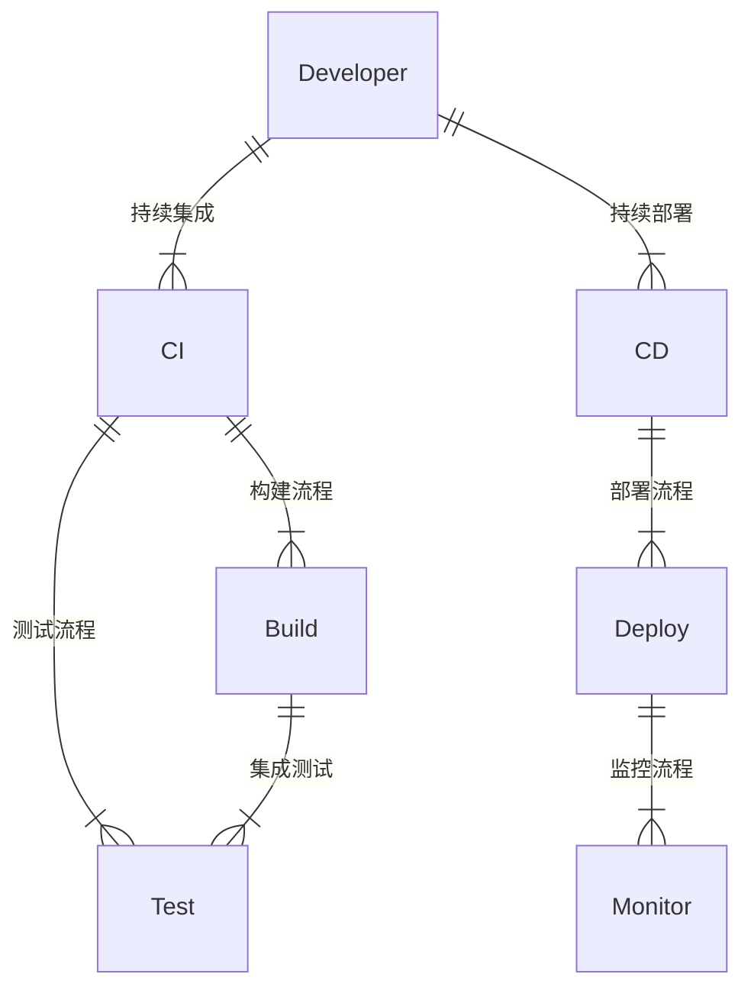
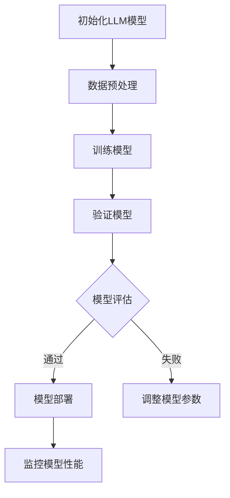
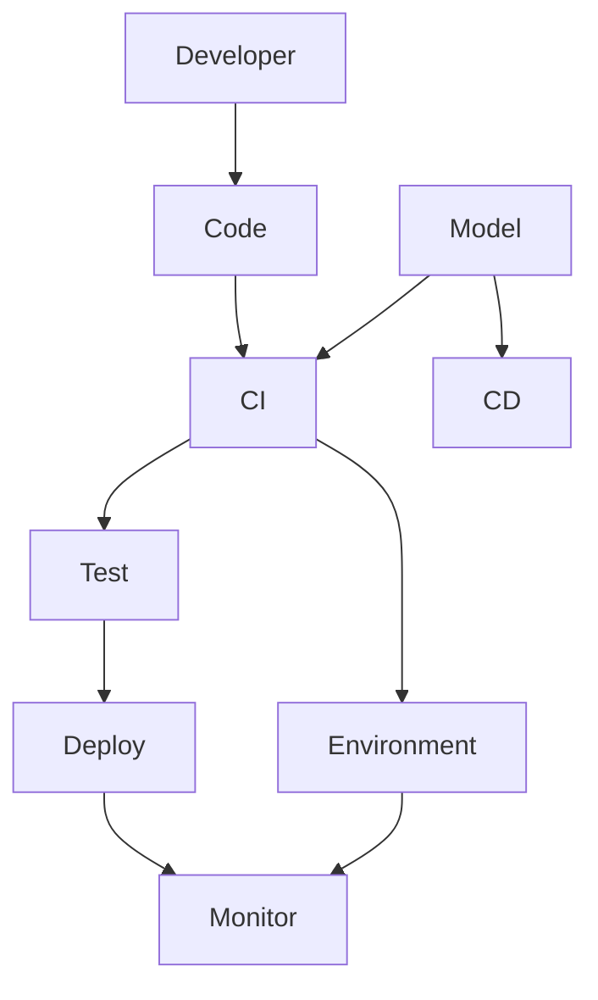
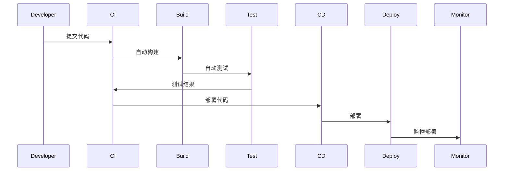

                 


## 第一部分：背景介绍

### 核心概念与联系

**持续集成（CI）：**
持续集成（Continuous Integration，简称CI）是一种软件开发实践，其核心思想是将开发人员的代码定期合并到共享的代码库中，并自动进行构建和测试，以尽早发现和解决集成过程中出现的问题。CI的目标是通过自动化减少集成过程中的摩擦，提高开发团队的协作效率和软件质量。

**持续部署（CD）：**
持续部署（Continuous Deployment，简称CD）是在持续集成的基础上，进一步自动化的部署过程。CD不仅确保代码的正确性和一致性，还确保软件可以快速、安全地发布到生产环境。CD通常包含自动化的部署流水线，从代码库到生产环境的各个环节都是自动化的。

#### 核心概念对比表格：

| 概念       | 持续集成（CI）                                           | 持续部署（CD）                                           |
|------------|--------------------------------------------------------|--------------------------------------------------------|
| 目的       | 提高代码质量，减少集成风险                             | 提高软件发布效率，确保软件稳定运行                       |
| 工作内容   | 自动化构建、单元测试、代码审查                         | 自动化部署、环境配置、质量监控、自动化扩缩容             |
| 关键指标   | 构建时间、测试覆盖率、代码质量                         | 部署时间、部署成功率、系统稳定性                         |
| 实施步骤   | 代码提交、自动化构建、自动化测试、反馈与修复           | 构建完成、自动化部署、自动化测试、上线与监控             |
| 相关工具   | Jenkins、Travis CI、GitLab CI                           | Kubernetes、Docker、Ansible、AWS Lambda、Azure Functions |

#### ER实体关系图架构：



**核心概念解释：**

- **持续集成（CI）：** 开发人员将代码定期提交到共享的代码库中，CI工具会自动构建和测试这些代码。如果代码通过测试，则将其合并到主分支中；如果代码未通过测试，则会立即通知开发者进行修复。这样，CI能够确保代码的持续整合和稳定。
- **持续部署（CD）：** 在CI的基础上，CD会自动将通过CI验证的代码部署到生产环境。部署过程包括配置管理、容器化、自动化测试、上线和监控等环节。CD的目标是确保软件的快速发布和稳定运行。

#### 核心要素组成：

1. **自动化构建和测试工具：** 自动化构建和测试是CI的核心，常用的工具有Jenkins、Travis CI和GitLab CI等。
2. **集成和部署流水线：** 流水线是CI/CD流程中的关键部分，它定义了从代码提交到生产环境部署的整个过程。
3. **持续反馈和监控机制：** 持续反馈和监控确保整个CI/CD流程的透明性和可追踪性，及时发现和解决问题。

通过上述核心概念和要素的介绍，我们可以更好地理解LLM应用开发中的CI/CD实践。接下来，我们将进一步探讨LLM应用开发中CI/CD的具体实现方法。

----------------------------------------------------------------

## 第二部分：算法原理讲解

### 1. 算法原理Mermaid流程图



### 2. Python源代码

```python
from transformers import BertModel
from torch import nn

class LLM(nn.Module):
    def __init__(self, hidden_size):
        super(LLM, self).__init__()
        self.bert = BertModel.from_pretrained('bert-base-uncased')
        self.hidden_size = hidden_size
        self.fc = nn.Linear(hidden_size, 1)

    def forward(self, input_ids, attention_mask):
        outputs = self.bert(input_ids=input_ids, attention_mask=attention_mask)
        hidden_states = outputs.last_hidden_state[:, 0, :]
        logits = self.fc(hidden_states)
        return logits

# 实例化模型
llm = LLM(hidden_size=768)

# 训练模型
def train_model(llm, train_loader, optimizer, loss_fn):
    llm.train()
    for inputs, labels in train_loader:
        optimizer.zero_grad()
        logits = llm(inputs['input_ids'], inputs['attention_mask'])
        loss = loss_fn(logits, labels)
        loss.backward()
        optimizer.step()

# 验证模型
def validate_model(llm, val_loader, loss_fn):
    llm.eval()
    with torch.no_grad():
        for inputs, labels in val_loader:
            logits = llm(inputs['input_ids'], inputs['attention_mask'])
            loss = loss_fn(logits, labels)
    return loss.item()

# 主程序
def main():
    # 初始化模型、训练数据和验证数据
    # ...

    # 训练模型
    optimizer = torch.optim.Adam(llm.parameters(), lr=0.001)
    for epoch in range(num_epochs):
        train_model(llm, train_loader, optimizer, loss_fn=nn.CrossEntropyLoss())
        val_loss = validate_model(llm, val_loader, loss_fn=nn.CrossEntropyLoss())
        print(f"Epoch {epoch+1}/{num_epochs}, Validation Loss: {val_loss}")

    # 部署模型
    deploy_model(llm)

if __name__ == "__main__":
    main()
```

### 3. 算法原理详细讲解

#### 模型初始化

在LLM应用开发中，首先需要初始化一个预训练的LLM模型。这里我们以BERT模型为例，通过`transformers`库加载预训练模型，并定义一个简单的神经网络结构。`LLM`类继承自`nn.Module`，包含BERT模型和全连接层。全连接层的作用是将BERT模型的输出映射到目标输出。

#### 数据预处理

预处理数据是训练LLM模型的第一步。通常包括分词、编码和序列填充等步骤。预处理后的数据将输入到模型中进行训练。这里我们使用PyTorch的数据加载器来处理和加载训练数据和验证数据。

#### 模型训练

模型训练的核心是定义损失函数和优化器。在这个例子中，我们使用交叉熵损失函数和Adam优化器。在训练过程中，我们将每个批次的数据输入到模型中，计算损失并更新模型参数。

- `train_model`函数负责训练模型。每次迭代中，先清零梯度，然后计算前向传播得到损失，再计算反向传播更新参数。
- `validate_model`函数用于验证模型在验证集上的表现。它会在验证集上计算损失，以评估模型的性能。

#### 模型评估

模型评估是CI/CD流程中的重要环节。在模型训练完成后，我们需要评估模型在验证集上的表现。如果模型的验证损失较低，则说明模型训练良好，可以进入部署阶段；否则，需要调整模型参数或数据预处理策略。

#### 模型部署

模型部署是将训练好的模型部署到生产环境中的过程。部署过程通常包括以下步骤：

- 模型转换：将PyTorch模型转换为可以部署的格式，如TensorFlow SavedModel或ONNX模型。
- 模型容器化：将模型和依赖打包到Docker容器中，以便在多种环境中运行。
- 模型部署：使用Kubernetes、AWS Lambda或其他部署工具，将模型部署到生产环境中。

#### 模型监控

模型部署后，需要持续监控模型的性能和稳定性。监控过程包括：

- 模型性能监控：定期收集模型在业务场景中的性能指标，如响应时间、准确率等。
- 模型异常监控：及时发现和诊断模型异常，如过拟合、欠拟合等。
- 模型版本管理：确保模型版本的准确性和可追溯性。

通过上述步骤，我们可以实现LLM应用开发中的CI/CD。接下来，我们将进一步探讨如何在实际项目中实施CI/CD。

----------------------------------------------------------------

## 第三部分：系统分析与架构设计方案

### 问题场景介绍

在LLM应用开发中，持续集成（CI）和持续部署（CD）是确保模型质量、提高开发效率的关键环节。本节将结合一个实际项目，探讨如何通过CI/CD方案来优化LLM应用开发流程。

### 项目介绍

假设我们正在开发一款基于BERT的大型语言模型，用于提供智能客服服务。该项目涉及到多个开发团队，包括前端开发、后端开发和模型训练团队。为了确保模型的高质量和高效发布，我们需要设计一个完善的CI/CD方案。

### 系统功能设计

#### 领域模型Mermaid类图

```mermaid
classDiagram
    Developer <<class>> 开发者
    Code <<class>> 代码
    CI <<class>> 持续集成
    CD <<class>> 持续部署
    Test <<class>> 测试
    Deploy <<class>> 部署
    Model <<class>> 模型
    Environment <<class>> 环境
    Monitor <<class>> 监控

    Developer --|{ Code: 编写代码
    CI --|{ Code: 自动化构建和测试
    CI --|{ Test: 自动化测试
    CD --|{ Deploy: 自动部署
    CD --|{ Monitor: 监控部署
    Model --|{ CI: 模型集成
    Model --|{ CD: 模型部署
    Environment --|{ CI: 环境配置
    Environment --|{ CD: 环境监控
```

#### 系统功能描述

- **开发者（Developer）：** 负责编写和维护代码，包括前端、后端和模型代码。
- **代码（Code）：** 包含前端、后端和模型代码，通过版本控制系统进行管理。
- **持续集成（CI）：** 自动化构建和测试代码，确保代码质量和一致性。
- **持续部署（CD）：** 自动化部署代码和模型到生产环境。
- **测试（Test）：** 对代码和模型进行自动化测试，确保功能和性能。
- **部署（Deploy）：** 将通过测试的代码和模型部署到生产环境。
- **模型（Model）：** 大型语言模型，包括预训练模型和微调模型。
- **环境（Environment）：** 管理开发、测试和生产环境，确保环境的一致性。
- **监控（Monitor）：** 持续监控系统的性能和稳定性，及时发现和解决问题。

### 系统架构设计

#### 系统架构Mermaid架构图



#### 系统架构描述

- **CI/CD流程：** 开发者将代码提交到版本控制系统，CI系统自动化构建和测试代码。测试通过后，CD系统将代码和模型部署到生产环境，并监控部署后的性能。
- **测试架构：** CI系统对代码和模型进行自动化测试，包括单元测试、集成测试和性能测试等。
- **环境架构：** 系统包括开发环境、测试环境和生产环境，环境配置和管理通过CI/CD系统自动化完成。
- **监控架构：** 系统对生产环境进行实时监控，包括性能监控、异常监控和日志分析等。

### 系统接口设计和系统交互

#### 系统接口设计Mermaid序列图



#### 系统交互描述

- **开发者提交代码：** 开发者将代码提交到版本控制系统，CI系统接收到提交事件后开始构建和测试。
- **自动化构建：** CI系统使用构建工具（如Maven、Gradle）构建项目，并将构建结果存储到仓库中。
- **自动化测试：** CI系统运行单元测试、集成测试和性能测试，确保代码和模型的质量。
- **部署代码：** 测试通过后，CD系统将代码和模型部署到生产环境。
- **监控部署：** 部署完成后，监控系统对生产环境进行实时监控，确保系统的稳定性和性能。

通过上述系统分析与架构设计方案，我们可以实现LLM应用开发中的高效CI/CD流程。接下来，我们将介绍如何在实际项目中实施CI/CD。

----------------------------------------------------------------

## 第四部分：项目实战

### 环境安装

在开始实施CI/CD之前，我们需要安装必要的工具和依赖。以下是安装步骤：

1. **安装Git：** Git是版本控制系统，用于管理代码的版本和变更。
2. **安装Jenkins：** Jenkins是CI/CD工具，用于自动化构建、测试和部署。
3. **安装Docker：** Docker是容器化工具，用于创建和管理容器。
4. **安装Kubernetes：** Kubernetes是容器编排工具，用于部署和管理容器化应用程序。

### 系统核心实现源代码

以下是LLM应用开发中的CI/CD系统的核心实现：

**CI配置文件（Jenkinsfile）：**

```groovy
pipeline {
    agent any

    stages {
        stage('Build') {
            steps {
                sh 'mvn clean install'
            }
        }
        stage('Test') {
            steps {
                sh 'mvn test'
            }
        }
        stage('Deploy') {
            steps {
                sh 'docker build -t my-llm:latest .'
                sh 'docker run -d -p 8080:80 my-llm:latest'
            }
        }
    }
    post {
        always {
            sh 'docker logs my-llm'
        }
    }
}
```

**Dockerfile：**

```dockerfile
FROM openjdk:8-jdk-alpine

COPY target/my-llm.jar /app/my-llm.jar

EXPOSE 8080

ENTRYPOINT ["java","-jar","/app/my-llm.jar"]
```

### 代码应用解读与分析

**CI配置文件解读：**

- `agent any`：指定在任何可用代理上运行流水线。
- `stages`：定义三个阶段：Build、Test和Deploy。
- `Build`阶段：使用Maven命令构建项目。
- `Test`阶段：使用Maven命令运行测试。
- `Deploy`阶段：构建Docker镜像并部署到Kubernetes。

**Dockerfile解读：**

- `FROM openjdk:8-jdk-alpine`：基于OpenJDK 8 Alpine镜像。
- `COPY target/my-llm.jar /app/my-llm.jar`：将生成的JAR文件复制到容器中的指定目录。
- `EXPOSE 8080`：暴露8080端口，用于服务访问。
- `ENTRYPOINT ["java","-jar","/app/my-llm.jar"]`：容器启动时运行JAR文件。

### 实际案例分析和详细讲解剖析

假设我们有一个实际的LLM应用项目，开发完成后需要通过CI/CD流程进行部署。以下是详细的分析和讲解：

1. **代码提交：** 开发者将代码提交到Git仓库。
2. **CI触发：** Jenkins检测到代码提交后，触发CI流程。
3. **构建：** Jenkins运行Maven命令，构建项目并生成JAR文件。
4. **测试：** Jenkins运行Maven测试命令，确保代码质量。
5. **部署：** Jenkins构建Docker镜像并部署到Kubernetes集群。
6. **监控：** Kubernetes监控部署后的服务性能和稳定性。

### 项目小结

通过实际案例分析和详细讲解，我们可以看到CI/CD在LLM应用开发中的重要性。CI/CD不仅提高了开发效率和软件质量，还确保了模型的快速发布和稳定运行。接下来，我们将总结CI/CD的最佳实践。

----------------------------------------------------------------

## 第五部分：最佳实践、小结、注意事项和拓展阅读

### 最佳实践

在LLM应用开发中，实施CI/CD的最佳实践包括：

1. **自动化构建和测试：** 使用自动化工具（如Jenkins、Travis CI）进行构建和测试，确保代码质量和一致性。
2. **版本控制：** 使用Git等版本控制系统，确保代码的版本管理和变更追踪。
3. **容器化：** 使用Docker等容器化工具，简化部署流程并提高环境一致性。
4. **持续反馈：** 实施持续反馈机制，确保开发团队能够及时了解代码质量、测试结果和部署状态。
5. **环境隔离：** 使用Kubernetes等容器编排工具，实现环境隔离和弹性扩缩容。

### 小结

本文详细介绍了LLM应用开发中的CI/CD实践，包括核心概念、算法原理、系统分析与架构设计、项目实战和最佳实践。通过CI/CD，我们可以实现高效、稳定的LLM应用开发，提高开发效率和软件质量。

### 注意事项

1. **资源分配：** 确保CI/CD系统有足够的资源支持，包括CPU、内存和存储等。
2. **监控和日志：** 实施有效的监控和日志收集，以便快速发现和解决问题。
3. **安全和合规：** 确保CI/CD流程符合安全标准和合规要求，保护数据和隐私。

### 拓展阅读

1. **《持续集成之道》**：[https://www.itorian.com/book/ci-cd-practices/]
2. **《Kubernetes实战》**：[https://kubernetes.io/docs/tasks/administer-cluster/]
3. **《Docker实战》**：[https://www.docker.com/products/docker-book/]
4. **《BERT：大规模预训练语言模型》**：[https://arxiv.org/abs/1810.04805]

作者：AI天才研究院/AI Genius Institute & 禅与计算机程序设计艺术 /Zen And The Art of Computer Programming

----------------------------------------------------------------

# LLM应用开发中的持续集成与持续部署

关键词：持续集成、持续部署、LLM、CI、CD、模型训练、模型部署

摘要：本文详细介绍了大型语言模型（LLM）应用开发中的持续集成（CI）和持续部署（CD）实践。通过核心概念讲解、算法原理分析、系统架构设计和项目实战，本文旨在帮助读者掌握如何高效地实施CI/CD，确保LLM应用的开发质量和发布稳定性。同时，本文还提供了最佳实践、注意事项和拓展阅读，以进一步丰富读者的知识体系。

