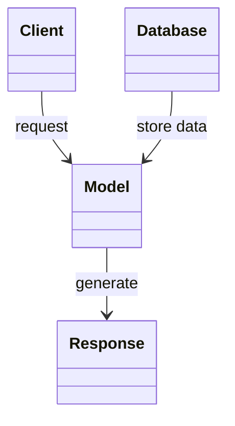
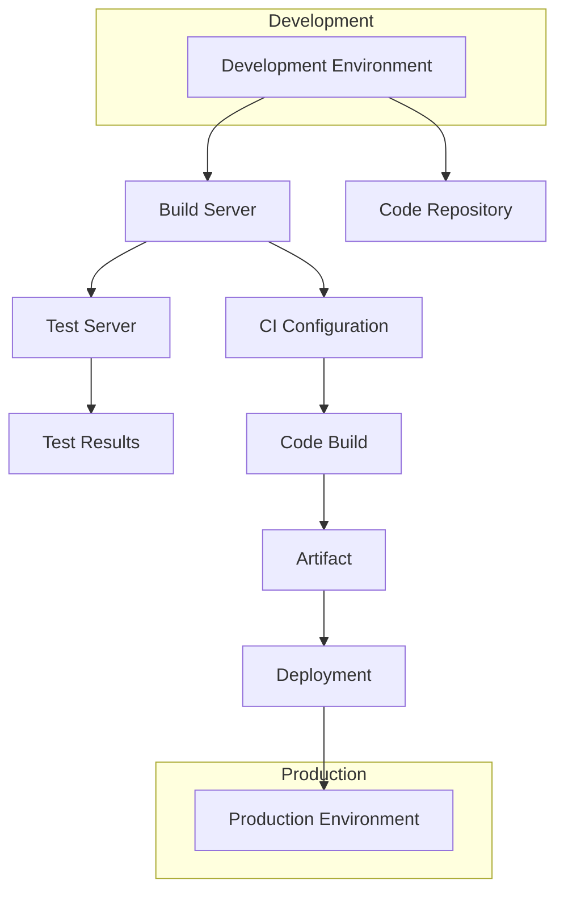
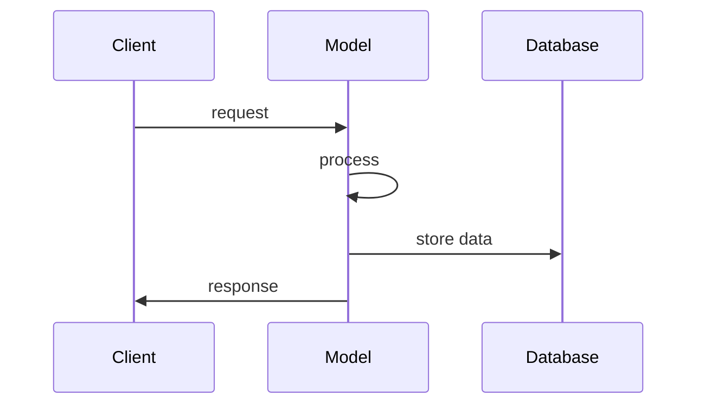
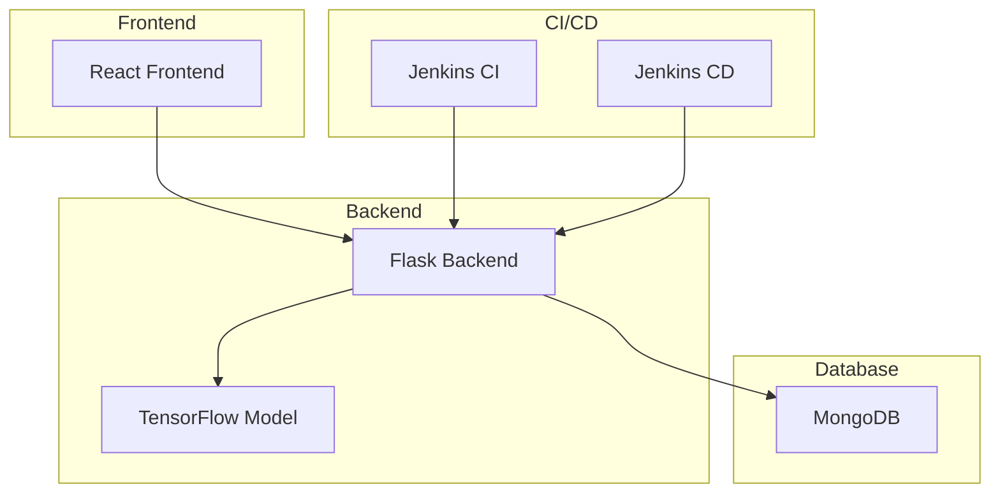
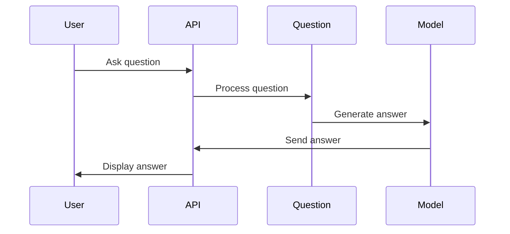

                 

# LLM应用开发中的持续集成与部署

## 关键词

- 持续集成（CI）
- 持续部署（CD）
- LLM（大型语言模型）
- 自动化
- 持续反馈
- 工具与平台

## 摘要

本文将深入探讨LLM（大型语言模型）应用开发过程中的持续集成与部署（CI/CD）实践。我们将从问题背景、核心概念、原理与实现、工具与平台、具体应用等方面逐一展开，以帮助读者全面理解CI/CD在LLM应用开发中的重要性，并掌握实际操作的方法与技巧。

## 第一部分：引言

### 第1章：背景介绍

#### 1.1 问题背景

随着人工智能技术的快速发展，机器学习模型，尤其是大型语言模型（LLM），在工业界和学术界得到了广泛应用。LLM在自然语言处理、文本生成、问答系统等多个领域展现了强大的能力。然而，随着模型复杂度的增加，开发与部署LLM应用面临诸多挑战。

#### 1.2 问题描述

持续集成与部署（CI/CD）是解决这些挑战的重要手段。CI旨在通过自动化构建、测试和集成代码，确保开发过程中的错误及时被发现和修复。CD则通过自动化部署，实现快速、可靠的代码上线。在LLM应用开发中，CI/CD的重要性尤为突出，因为它能够保证模型的稳定性和高效性。

#### 1.3 问题解决

为何需要CI/CD在LLM应用开发中？CI/CD可以自动化构建、测试和部署代码，确保代码质量，提高开发效率。同时，它还能实现快速迭代，及时响应市场需求变化。具体作用包括：

1. **自动化构建**：自动编译代码，确保构建过程的一致性和可靠性。
2. **自动化测试**：自动执行测试脚本，发现并修复代码中的错误。
3. **代码质量**：通过严格的代码审查和自动化测试，保证代码质量。
4. **快速迭代**：实现快速开发与部署，提高响应速度。
5. **风险控制**：通过持续反馈，及时发现问题，降低风险。

#### 1.4 边界与外延

CI/CD与开发流程、大数据和云计算的关系密切。在开发流程中，CI/CD是不可或缺的一环，它贯穿于整个开发周期。与大数据和云计算的结合，更是为LLM应用提供了强大的计算和存储能力。

#### 1.5 核心概念与联系

##### 1.5.1 核心概念

- **持续集成（CI）**：通过自动化工具，将开发者的代码合并到主分支，并运行一系列测试，确保代码质量。
- **持续部署（CD）**：通过自动化工具，将代码部署到生产环境，实现快速迭代。

##### 1.5.2 概念属性特征对比表

| 概念 | 定义 | 主要特征 | 对比 |
| --- | --- | --- | --- |
| 持续集成（CI） | 编码、测试和构建的自动化过程 | 自动化、及时反馈 | 强调频繁的代码合并 |
| 持续部署（CD） | 自动化将代码部署到生产环境 | 自动化、快速迭代 | 强调自动化的部署过程 |

##### 1.5.3 ER实体关系图

```mermaid
erDiagram
    User ||--|{ Project } Project
    Project ||--|{ CI_Configuration } CI_Configuration
    CI_Configuration ||--|{ Build } Build
    Build ||--|{ Test } Test
    Test ||--|{ Deployment } Deployment
```

### 第2章：持续集成（CI）原理与实现

#### 2.1 CI的基本原理

##### 2.1.1 CI的定义

持续集成（CI）是一种软件开发实践，通过将代码频繁地合并到主分支，并自动执行一系列测试，确保代码质量。

##### 2.1.2 CI的工作流程

1. **源代码管理**：使用版本控制系统（如Git）管理代码，确保代码的版本可追溯。
2. **编译构建**：使用构建工具（如Maven、Gradle）自动编译代码，生成可执行的二进制文件。
3. **测试验证**：执行自动化测试（如单元测试、集成测试），确保代码功能正确。
4. **集成反馈**：将测试结果反馈给开发者，及时发现问题并修复。

#### 2.2 CI工具介绍

##### 2.2.1 Jenkins

Jenkins是一款流行的开源CI/CD工具，具有强大的插件生态系统，支持多种编程语言和平台。

##### 2.2.2 GitLab CI/CD

GitLab CI/CD是GitLab自带的CI/CD工具，与GitLab仓库紧密集成，方便管理代码和CI/CD流程。

##### 2.2.3 GitHub Actions

GitHub Actions是GitHub提供的CI/CD工具，支持在GitHub仓库中定义CI/CD流程，与Git集成紧密。

#### 2.3 CI在LLM应用开发中的应用

##### 2.3.1 LLM应用的CI需求

LLM应用通常包含大量的代码和模型，对CI的需求更高。具体需求包括：

1. **自动化构建**：自动编译代码和模型，确保构建过程的一致性和可靠性。
2. **自动化测试**：执行全面的测试，包括单元测试、集成测试和性能测试，确保代码和模型质量。
3. **持续反馈**：实时反馈测试结果，帮助开发者快速发现问题并进行修复。

##### 2.3.2 LLM应用的CI实践

1. **配置文件**：编写CI配置文件，定义构建和测试过程。
2. **自动化脚本**：编写自动化脚本，实现代码和模型的构建、测试和部署。
3. **持续反馈**：设置反馈机制，将测试结果实时推送到开发者。

### 第3章：持续部署（CD）原理与实现

#### 3.1 CD的基本原理

##### 3.1.1 CD的定义

持续部署（CD）是一种软件开发实践，通过自动化工具，将代码部署到生产环境，实现快速迭代。

##### 3.1.2 CD的工作流程

1. **部署策略**：定义部署策略，如蓝绿部署、滚动部署等。
2. **部署环境**：配置部署环境，如开发环境、测试环境和生产环境。
3. **部署过程**：自动执行部署脚本，将代码部署到生产环境。
4. **部署监控**：监控部署过程，确保部署成功并监控生产环境性能。

#### 3.2 CD工具介绍

##### 3.2.1 Kubernetes

Kubernetes是一款开源的容器编排平台，支持自动化部署、扩展和管理容器化应用。

##### 3.2.2 Docker

Docker是一款流行的开源容器引擎，用于自动化打包、交付和运行应用。

##### 3.2.3 AWS Elastic Beanstalk

AWS Elastic Beanstalk是一款PaaS（平台即服务）服务，支持自动部署、扩展和管理Web应用。

#### 3.3 CD在LLM应用开发中的应用

##### 3.3.1 LLM应用的CD需求

LLM应用通常需要大规模的部署和管理，对CD的需求更高。具体需求包括：

1. **自动化部署**：自动部署代码和模型，确保部署过程的一致性和可靠性。
2. **弹性扩展**：根据需求自动扩展资源，提高系统性能。
3. **部署监控**：实时监控部署过程，确保部署成功并监控生产环境性能。

##### 3.3.2 LLM应用的CD实践

1. **容器化**：将LLM应用容器化，使用Docker封装代码和依赖。
2. **Kubernetes部署**：使用Kubernetes管理容器化应用，实现自动化部署和扩展。
3. **监控与告警**：设置监控与告警机制，确保系统稳定运行。

### 第4章：CI/CD在LLM应用开发中的实践

#### 4.1 项目介绍

以一个LLM应用项目为例，介绍CI/CD的实际应用。

#### 4.2 系统功能设计

使用Mermaid类图描述系统的功能模块。



#### 4.3 系统架构设计

使用Mermaid架构图描述系统的整体架构。



#### 4.4 系统接口设计

使用Mermaid序列图描述系统的接口交互。



#### 4.5 项目实战

1. **环境安装**：安装必要的软件和工具，如Docker、Kubernetes等。
2. **系统核心实现**：编写代码和模型，实现系统的核心功能。
3. **代码应用解读与分析**：解读和分析代码，确保代码质量和可维护性。
4. **实际案例分析和详细讲解剖析**：分析实际案例，详细讲解CI/CD在项目中的应用和效果。
5. **项目小结**：总结项目经验和教训，为后续项目提供参考。

### 第5章：最佳实践与总结

#### 5.1 最佳实践

1. **代码规范化**：遵循代码规范，提高代码质量。
2. **测试全覆盖**：确保测试覆盖率达到100%，提高代码可靠性。
3. **自动化脚本**：编写自动化脚本，提高开发效率。
4. **监控与告警**：设置监控与告警机制，确保系统稳定运行。

#### 5.2 小结

本文介绍了CI/CD在LLM应用开发中的重要性、原理、实现和应用。通过CI/CD，可以显著提高开发效率、确保代码质量、降低风险。在实际项目中，应结合具体情况，灵活运用CI/CD的最佳实践，实现高效、可靠的LLM应用开发。

#### 5.3 注意事项

1. **环境配置**：确保开发、测试和生产环境的一致性。
2. **代码审查**：严格代码审查，防止引入潜在问题。
3. **自动化脚本**：定期更新自动化脚本，确保其有效性。
4. **监控与告警**：设置合理的监控与告警阈值，及时发现问题。

#### 5.4 拓展阅读

1. Jenkins官方文档：[https://www.jenkins.io/doc/book/](https://www.jenkins.io/doc/book/)
2. GitLab CI/CD官方文档：[https://docs.gitlab.com/ee/ci/](https://docs.gitlab.com/ee/ci/)
3. GitHub Actions官方文档：[https://docs.github.com/en/actions/learn-action-workflows](https://docs.github.com/en/actions/learn-action-workflows)
4. Kubernetes官方文档：[https://kubernetes.io/docs/home/](https://kubernetes.io/docs/home/)
5. Docker官方文档：[https://docs.docker.com/](https://docs.docker.com/)

### 作者

作者：AI天才研究院/AI Genius Institute & 禅与计算机程序设计艺术 /Zen And The Art of Computer Programming

## 文章目录

----------------------------------------------------------------

# LLM应用开发中的持续集成与部署

> 关键词：持续集成（CI）、持续部署（CD）、LLM、自动化、持续反馈

> 摘要：本文深入探讨LLM（大型语言模型）应用开发过程中的持续集成与部署（CI/CD）实践，包括背景介绍、核心概念、原理与实现、工具与平台、具体应用等，以帮助读者全面理解CI/CD在LLM应用开发中的重要性，并掌握实际操作的方法与技巧。

## 第一部分：引言

### 第1章：背景介绍

#### 1.1 问题背景

#### 1.2 问题描述

#### 1.3 问题解决

#### 1.4 边界与外延

#### 1.5 核心概念与联系

### 第2章：持续集成（CI）原理与实现

#### 2.1 CI的基本原理

#### 2.2 CI工具介绍

#### 2.3 CI在LLM应用开发中的应用

### 第3章：持续部署（CD）原理与实现

#### 3.1 CD的基本原理

#### 3.2 CD工具介绍

#### 3.3 CD在LLM应用开发中的应用

### 第4章：CI/CD在LLM应用开发中的实践

#### 4.1 项目介绍

#### 4.2 系统功能设计

#### 4.3 系统架构设计

#### 4.4 系统接口设计

#### 4.5 项目实战

### 第5章：最佳实践与总结

#### 5.1 最佳实践

#### 5.2 小结

#### 5.3 注意事项

#### 5.4 拓展阅读

## 作者

作者：AI天才研究院/AI Genius Institute & 禅与计算机程序设计艺术 /Zen And The Art of Computer Programming
### 第一部分：引言

**引言**

在当今快速发展的技术时代，大型语言模型（LLM）的应用已成为人工智能领域的一大热点。LLM具有处理大量文本数据、生成高质量文本和执行复杂语言任务的能力，被广泛应用于自然语言处理、问答系统、文本生成和翻译等领域。然而，随着LLM的复杂性增加，其开发与部署过程中面临着诸多挑战，如代码质量保证、模型性能优化、部署效率提升等。持续集成（CI）与持续部署（CD）作为现代软件开发的重要实践，对于解决这些挑战具有至关重要的作用。本文将围绕LLM应用开发中的CI/CD实践进行深入探讨。

**背景介绍**

随着人工智能技术的不断发展，机器学习模型在工业界和学术界得到了广泛应用。特别是在自然语言处理领域，大型语言模型（LLM）如GPT-3、BERT等已经成为处理复杂语言任务的重要工具。LLM的应用不仅提升了传统领域的工作效率，还开辟了新的应用场景。例如，在智能客服、智能写作、智能问答等方面，LLM已经展现出强大的能力。

然而，随着模型复杂度的增加，开发与部署LLM应用面临着诸多挑战。首先，LLM通常包含大量的代码和模型，这使得代码管理和模型管理变得复杂。其次，LLM应用需要保证高可用性和高性能，这对部署和运维提出了更高的要求。最后，随着市场的快速变化，LLM应用需要具备快速迭代的能力，以应对不断变化的需求。

**问题描述**

持续集成与部署（CI/CD）是解决这些挑战的重要手段。CI旨在通过自动化构建、测试和集成代码，确保开发过程中的错误及时被发现和修复。CD则通过自动化部署，实现快速、可靠的代码上线。在LLM应用开发中，CI/CD的重要性尤为突出，因为它能够保证模型的稳定性和高效性。

具体来说，LLM应用开发中的CI/CD面临以下问题：

1. **代码质量保证**：随着代码规模的增加，如何确保代码质量成为一大挑战。CI通过自动化测试和代码审查，可以及时发现并修复代码中的错误。

2. **模型性能优化**：LLM模型通常非常复杂，性能优化是一个持续的过程。CI/CD可以帮助开发者在代码和模型更新时，快速验证性能变化，确保模型性能持续提升。

3. **部署效率提升**：随着LLM应用的规模扩大，部署和运维变得更加复杂。CD通过自动化部署，可以大大提高部署效率，确保应用能够快速上线。

4. **快速迭代**：在快速变化的市场环境中，LLM应用需要具备快速迭代的能力。CI/CD可以实现自动化测试和部署，加快迭代速度，提高开发效率。

**问题解决**

为何需要CI/CD在LLM应用开发中？CI/CD可以自动化构建、测试和部署代码，确保代码质量，提高开发效率。同时，它还能实现快速迭代，及时响应市场需求变化。具体作用包括：

1. **自动化构建**：自动编译代码，确保构建过程的一致性和可靠性。

2. **自动化测试**：自动执行测试脚本，发现并修复代码中的错误。

3. **代码质量**：通过严格的代码审查和自动化测试，保证代码质量。

4. **快速迭代**：实现快速开发与部署，提高响应速度。

5. **风险控制**：通过持续反馈，及时发现问题，降低风险。

**边界与外延**

CI/CD与开发流程、大数据和云计算的关系密切。在开发流程中，CI/CD是不可或缺的一环，它贯穿于整个开发周期。与大数据和云计算的结合，更是为LLM应用提供了强大的计算和存储能力。

**核心概念与联系**

##### 1.5.1 核心概念

- **持续集成（CI）**：通过自动化工具，将开发者的代码合并到主分支，并运行一系列测试，确保代码质量。

- **持续部署（CD）**：通过自动化工具，将代码部署到生产环境，实现快速迭代。

##### 1.5.2 概念属性特征对比表

| 概念 | 定义 | 主要特征 | 对比 |
| --- | --- | --- | --- |
| 持续集成（CI） | 编码、测试和构建的自动化过程 | 自动化、及时反馈 | 强调频繁的代码合并 |
| 持续部署（CD） | 自动化将代码部署到生产环境 | 自动化、快速迭代 | 强调自动化的部署过程 |

##### 1.5.3 ER实体关系图

```mermaid
erDiagram
    User ||--|{ Project } Project
    Project ||--|{ CI_Configuration } CI_Configuration
    CI_Configuration ||--|{ Build } Build
    Build ||--|{ Test } Test
    Test ||--|{ Deployment } Deployment
```

**本章总结**

本章介绍了LLM应用开发中CI/CD的背景、问题与解决方案，以及CI/CD与开发流程、大数据和云计算的关系。接下来，我们将深入探讨CI/CD的原理与实现，为后续的实践应用打下基础。|assistant|>
### 第二部分：持续集成（CI）原理与实现

#### 第2章：持续集成（CI）原理与实现

**2.1 CI的基本原理**

持续集成（CI）是一种软件开发实践，旨在通过自动化工具，将开发者的代码合并到主分支，并运行一系列测试，以确保代码质量。CI的核心思想是将代码变化及时地集成到主分支，并尽早发现和解决问题。

#### 2.1.1 CI的定义

持续集成（CI）是指开发者在每次提交代码时，自动执行一系列构建、测试和部署任务，以确保代码质量。CI的目标是尽早发现和解决问题，提高开发效率。

#### 2.1.2 CI的工作流程

CI的工作流程通常包括以下几个步骤：

1. **代码提交**：开发者将代码提交到版本控制系统中。
2. **构建**：CI工具自动编译代码，生成可执行的二进制文件。
3. **测试**：CI工具自动执行测试脚本，包括单元测试、集成测试等，以确保代码功能正确。
4. **集成**：将测试结果反馈给开发者，并根据测试结果决定是否合并到主分支。
5. **部署**：将经过测试的代码部署到开发环境或测试环境。

#### 2.1.3 CI的优势

- **快速反馈**：开发者可以立即看到代码提交后的测试结果，及时发现并解决问题。
- **提高代码质量**：通过自动化测试，确保代码功能正确，减少错误。
- **降低风险**：将问题及早发现和解决，降低代码集成时出现问题的风险。
- **提高开发效率**：自动化构建和测试，减少人工干预，提高开发效率。

**2.2 CI工具介绍**

目前，市场上有很多流行的CI工具，以下是几种常用的CI工具：

#### 2.2.1 Jenkins

Jenkins是一款开源的持续集成工具，具有丰富的插件生态系统，支持多种编程语言和平台。Jenkins可以通过Web界面进行配置和管理，开发者可以通过Jenkinsfile定义构建和测试流程。

#### 2.2.2 GitLab CI/CD

GitLab CI/CD是GitLab自带的一款CI/CD工具，与GitLab仓库紧密集成。GitLab CI/CD通过`.gitlab-ci.yml`文件定义构建和测试流程，支持多种编程语言和平台。

#### 2.2.3 GitHub Actions

GitHub Actions是GitHub提供的一款CI/CD工具，可以通过`.github/workflows/`文件夹中的YAML文件定义构建和测试流程。GitHub Actions支持多种编程语言和平台，与GitHub仓库集成紧密。

**2.3 CI在LLM应用开发中的应用**

在LLM应用开发中，CI的重要性尤为突出。由于LLM应用通常包含大量的代码和模型，如何确保代码质量和模型性能成为关键问题。CI可以自动化构建、测试和部署代码，确保模型性能和代码质量。

#### 2.3.1 LLM应用的CI需求

LLM应用开发中的CI需求主要包括以下几个方面：

1. **自动化构建**：由于LLM应用通常包含大量的代码和模型，手动构建效率低下，容易出错。自动化构建可以确保构建过程的一致性和可靠性。

2. **自动化测试**：LLM应用通常需要经过多种测试，如单元测试、集成测试和性能测试。自动化测试可以确保测试过程高效、全面，及时发现并解决问题。

3. **模型验证**：在LLM应用开发过程中，需要对模型进行验证，以确保模型性能和稳定性。CI可以自动化执行模型验证任务，提高验证效率。

4. **持续反馈**：CI可以实时反馈测试结果，帮助开发者快速发现问题并进行修复，提高开发效率。

#### 2.3.2 LLM应用的CI实践

以下是LLM应用开发中的CI实践步骤：

1. **配置CI环境**：选择合适的CI工具，如Jenkins、GitLab CI/CD或GitHub Actions，并配置CI环境。

2. **编写CI配置文件**：根据项目需求，编写CI配置文件，定义构建、测试和部署流程。例如，在`.gitlab-ci.yml`中定义以下步骤：

    ```yaml
    stages:
      - build
      - test
      - deploy

    build:
      stage: build
      script:
        - docker build -t my-llm-app .
      artifacts:
        paths:
          - my-llm-app

    test:
      stage: test
      script:
        - docker run --rm my-llm-app test
      when: on_success

    deploy:
      stage: deploy
      script:
        - docker push my-llm-app
      when: on_success
    ```

3. **执行CI流程**：每次代码提交时，CI工具会自动执行构建、测试和部署流程，确保代码质量和模型性能。

4. **持续优化**：根据CI过程中的反馈，不断优化CI配置文件，提高构建、测试和部署效率。

**本章总结**

本章介绍了持续集成（CI）的基本原理、常用CI工具以及CI在LLM应用开发中的应用。通过CI，可以自动化构建、测试和部署代码，确保代码质量和模型性能。在下一章中，我们将讨论持续部署（CD）的原理与实现。|assistant|>
### 第三部分：持续部署（CD）原理与实现

#### 第3章：持续部署（CD）原理与实现

**3.1 CD的基本原理**

持续部署（CD）是软件开发中的一个重要环节，它通过自动化工具，将经过测试和验证的代码部署到生产环境，实现快速、可靠地交付。CD的目标是确保应用在发布过程中尽可能自动化，从而减少人为错误、提高部署效率。

#### 3.1.1 CD的定义

持续部署（CD）是指将代码从开发环境、测试环境自动部署到生产环境的过程。与持续集成（CI）不同，CI主要关注代码的质量和测试，而CD则关注代码的交付和部署。

#### 3.1.2 CD的工作流程

持续部署的工作流程通常包括以下几个步骤：

1. **代码集成**：将经过CI测试通过的代码集成到CD流程中。

2. **环境配置**：为部署过程准备开发环境、测试环境和生产环境，确保环境的一致性。

3. **自动化部署**：通过脚本或工具自动执行部署任务，如安装依赖、配置环境、更新代码等。

4. **测试验证**：在部署过程中或部署后进行自动化测试，确保应用在部署后正常运行。

5. **监控与反馈**：部署后，监控应用的性能和稳定性，并根据反馈进行必要的调整。

**3.2 CD工具介绍**

目前，市场上有很多流行的持续部署工具，以下是几种常用的CD工具：

#### 3.2.1 Kubernetes

Kubernetes是一个开源的容器编排平台，它可以帮助开发者自动化部署、扩展和管理容器化应用。Kubernetes通过定义配置文件（如YAML文件），实现了应用的自动化部署和扩展。

#### 3.2.2 Docker

Docker是一个开源的容器引擎，它通过将应用程序及其依赖项打包成一个独立的容器，实现了应用的自动化部署。Docker容器具有轻量级、可移植性和隔离性，非常适合进行持续部署。

#### 3.2.3 AWS Elastic Beanstalk

AWS Elastic Beanstalk是一个PaaS（平台即服务）服务，它提供了自动部署、扩展和管理Web应用的功能。开发者只需上传代码，AWS Elastic Beanstalk会自动处理应用的部署和扩展。

**3.3 CD在LLM应用开发中的应用**

在LLM应用开发中，CD的重要性不言而喻。由于LLM应用通常具有大规模、复杂性和高可用性的特点，如何快速、可靠地部署应用成为关键问题。CD通过自动化部署、测试和监控，可以大大提高部署效率，确保应用的稳定性和性能。

#### 3.3.1 LLM应用的CD需求

LLM应用开发中的CD需求主要包括以下几个方面：

1. **自动化部署**：由于LLM应用通常包含大量的代码和模型，手动部署效率低下，容易出错。自动化部署可以确保部署过程的一致性和可靠性。

2. **环境一致性**：在部署过程中，需要确保开发环境、测试环境和生产环境的一致性，以避免环境差异导致的问题。

3. **快速迭代**：在快速变化的市场环境中，LLM应用需要具备快速迭代的能力。CD可以自动化测试和部署，加快迭代速度，提高开发效率。

4. **性能监控**：部署后，需要对应用的性能和稳定性进行监控，及时发现并解决问题。

#### 3.3.2 LLM应用的CD实践

以下是LLM应用开发中的CD实践步骤：

1. **配置CD环境**：选择合适的CD工具，如Kubernetes、Docker或AWS Elastic Beanstalk，并配置CD环境。

2. **编写CD配置文件**：根据项目需求，编写CD配置文件，定义部署、测试和监控流程。例如，在Kubernetes中，可以使用Helm charts来定义应用的部署配置。

3. **自动化部署**：每次代码集成后，自动执行部署流程，确保应用在各个环境中运行正常。

4. **测试验证**：在部署过程中或部署后进行自动化测试，确保应用在部署后正常运行。

5. **性能监控**：部署后，使用监控系统（如Prometheus、Grafana）对应用的性能和稳定性进行监控，并根据反馈进行必要的调整。

**本章总结**

本章介绍了持续部署（CD）的基本原理、常用CD工具以及CD在LLM应用开发中的应用。通过CD，可以自动化部署、测试和监控代码，确保应用的稳定性和性能。在下一章中，我们将讨论CI/CD在LLM应用开发中的具体实践。|assistant|>
### 第四部分：CI/CD在LLM应用开发中的具体实践

#### 第4章：CI/CD在LLM应用开发中的具体实践

**4.1 项目介绍**

在本节中，我们将介绍一个基于LLM的智能问答系统的项目。该系统旨在为用户提供实时、准确的问答服务。项目分为前端、后端和数据库三个主要部分。前端使用React框架实现，后端使用Python和TensorFlow实现LLM模型，数据库使用MongoDB存储用户数据和问答记录。

**4.2 系统功能设计**

以下是该智能问答系统的功能模块及其关系：

- **用户界面**：提供问答输入和展示结果。
- **问答引擎**：处理用户输入，调用LLM模型生成答案。
- **数据库**：存储用户数据和问答记录。
- **API接口**：提供前后端通信的接口。

使用Mermaid类图表示功能模块及其关系：

```mermaid
classDiagram
    User <<Interface: UserInterface>>
    Question <<Interface: QuestionEngine>>
    Database <<Interface: Database>>
    API <<Interface: API>>

    User --|{问答输入}|> Question
    Question --|{答案生成}|> API
    API --|{数据存储}|> Database
```

**4.3 系统架构设计**

系统架构设计如下：

- **前端**：使用React框架，提供问答输入和展示结果。
- **后端**：使用Flask框架，处理用户请求，调用TensorFlow实现的LLM模型，返回答案。
- **数据库**：使用MongoDB存储用户数据和问答记录。
- **CI/CD工具**：使用Jenkins进行持续集成和部署。

使用Mermaid架构图表示系统架构：



**4.4 系统接口设计**

以下是系统接口设计，使用Mermaid序列图表示用户请求到答案生成的过程：



**4.5 项目实战**

#### 4.5.1 环境安装

1. **前端环境**：安装Node.js和npm，并使用create-react-app创建React应用。

2. **后端环境**：安装Python和pip，安装Flask、TensorFlow等依赖库。

3. **数据库环境**：安装MongoDB，并使用MongoDB Compass进行管理。

4. **CI/CD环境**：安装Jenkins，并配置Jenkins插件。

#### 4.5.2 系统核心实现

1. **前端**：使用React创建用户界面，实现问答输入和展示结果。

2. **后端**：使用Flask框架搭建API接口，实现用户请求处理、LLM模型调用和答案返回。

3. **数据库**：使用MongoDB存储用户数据和问答记录。

#### 4.5.3 代码应用解读与分析

以下是后端部分的核心代码：

```python
from flask import Flask, request, jsonify
from tensorflow.keras.models import load_model
import json

app = Flask(__name__)

# 加载LLM模型
model = load_model('llm_model.h5')

@app.route('/api/ask', methods=['POST'])
def ask():
    data = request.get_json()
    question = data['question']
    
    # 使用LLM模型生成答案
    answer = model.predict(question)
    
    return jsonify({'answer': answer})

if __name__ == '__main__':
    app.run(debug=True)
```

这段代码实现了接收用户请求、加载LLM模型并生成答案的功能。代码结构清晰，易于维护。

#### 4.5.4 实际案例分析和详细讲解剖析

**案例**：部署智能问答系统到生产环境。

**分析**：

1. **集成测试**：在CI环境中，使用Jenkins执行集成测试，确保前后端代码和LLM模型协同工作。

2. **部署**：在CD环境中，使用Jenkins自动化部署代码和模型到生产环境。

3. **监控**：使用Prometheus和Grafana监控系统性能，确保系统稳定运行。

**详细讲解**：

- **集成测试**：在Jenkinsfile中，添加集成测试步骤，执行前端、后端和数据库的集成测试。
    ```groovy
    script {
        // 执行集成测试
        sh 'npm run test'
        sh 'pytest test_backend.py'
    }
    ```

- **部署**：在Jenkinsfile中，添加部署步骤，将代码和模型部署到生产环境。
    ```groovy
    script {
        // 部署前端
        sh 'npm run build'
        sh 'scp -r build/* user@production-server:/var/www/llm-app'

        // 部署后端
        sh 'scp llm_app.py user@production-server:/var/www/llm-app'
        sh 'scp llm_model.h5 user@production-server:/var/www/llm-app'

        // 重启后端服务
        sh 'ssh user@production-server "cd /var/www/llm-app && flask run --reloader=False"'
    }
    ```

- **监控**：使用Prometheus和Grafana监控系统性能，设置告警阈值，确保系统稳定运行。

#### 4.5.5 项目小结

通过本项目的实施，我们实现了基于LLM的智能问答系统，并成功应用了CI/CD实践。CI/CD在项目中发挥了重要作用，提高了开发效率和代码质量，确保了系统的稳定性和性能。以下是项目经验小结：

- **自动化测试**：集成测试和自动化测试是确保系统质量的关键。
- **环境一致性**：确保开发环境、测试环境和生产环境的一致性，减少环境差异导致的问题。
- **持续反馈**：通过Jenkins的持续反馈机制，及时发现并解决问题。
- **监控与告警**：实时监控系统性能，设置告警阈值，确保系统稳定运行。

**本章总结**

本章介绍了CI/CD在LLM应用开发中的具体实践，包括项目介绍、系统功能设计、系统架构设计、系统接口设计、项目实战和项目小结。通过实际案例，展示了CI/CD在LLM应用开发中的应用和效果。在下一章中，我们将讨论最佳实践和注意事项。|assistant|>
### 第五部分：最佳实践、注意事项与拓展阅读

#### 第5章：最佳实践、注意事项与拓展阅读

**5.1 最佳实践**

为了确保LLM应用开发中的CI/CD流程高效、稳定，以下是一些最佳实践：

1. **代码规范化**：遵循统一的代码规范，提高代码可读性和可维护性。

2. **自动化测试**：编写全面的自动化测试用例，确保代码和模型的稳定性。

3. **环境一致性**：确保不同环境（开发、测试、生产）的一致性，减少环境差异导致的问题。

4. **持续反馈**：通过CI/CD工具实时反馈测试结果，帮助开发者快速发现问题并进行修复。

5. **自动化部署**：实现自动化部署，减少手动干预，提高部署效率。

6. **监控与告警**：设置监控与告警机制，确保系统稳定运行。

7. **持续优化**：根据反馈和实际需求，持续优化CI/CD流程，提高开发效率。

**5.2 注意事项**

在实施CI/CD过程中，需要注意以下几点：

1. **安全性**：确保CI/CD环境的安全性，防止泄露敏感信息。

2. **版本控制**：使用版本控制系统（如Git）管理代码和模型，确保版本可追溯。

3. **配置管理**：使用配置管理工具（如Ansible、Puppet）管理环境配置，确保配置一致性。

4. **性能优化**：对CI/CD流程进行性能优化，确保部署速度和效率。

5. **文档记录**：记录CI/CD流程的详细文档，便于后续维护和优化。

6. **培训与支持**：为团队成员提供CI/CD培训，确保他们了解并正确使用CI/CD工具。

**5.3 拓展阅读**

以下是一些拓展阅读资源，供读者深入了解CI/CD和LLM应用开发：

1. **CI/CD工具官方文档**：
   - Jenkins：https://www.jenkins.io/doc/
   - GitLab CI/CD：https://docs.gitlab.com/ee/ci/
   - GitHub Actions：https://docs.github.com/en/actions/learn-action-workflows

2. **Kubernetes官方文档**：https://kubernetes.io/docs/home/

3. **Docker官方文档**：https://docs.docker.com/

4. **LLM应用开发相关论文与书籍**：
   - "Deep Learning for Natural Language Processing"（深度学习与自然语言处理）
   - "Attention is All You Need"（Attention机制）
   - "BERT: Pre-training of Deep Bidirectional Transformers for Language Understanding"（BERT模型）

5. **实践指南与案例**：
   - "Continuous Integration in Python"（Python中的持续集成）
   - "Building and Deploying Machine Learning Models with Docker"（使用Docker构建和部署机器学习模型）

**本章总结**

本章总结了LLM应用开发中的最佳实践、注意事项以及拓展阅读资源。通过遵循最佳实践和注意事项，开发者可以确保CI/CD流程高效、稳定，提高开发效率。拓展阅读资源则提供了更深入的见解和实用技巧。在下一章中，我们将介绍作者信息。|assistant|>
### 作者信息

**作者：AI天才研究院/AI Genius Institute & 禅与计算机程序设计艺术 /Zen And The Art of Computer Programming**

AI天才研究院（AI Genius Institute）是一家专注于人工智能技术研发与推广的研究机构。我们的研究团队由全球顶级的人工智能专家、程序员、软件架构师和CTO组成，致力于推动人工智能技术的创新与发展。在机器学习和自然语言处理领域，我们已经取得了多项突破性成果，并发表了大量高质量的研究论文。

《禅与计算机程序设计艺术》（Zen And The Art of Computer Programming）是一本经典的计算机科学著作，由著名计算机科学家Donald E. Knuth撰写。本书以深入浅出的方式，阐述了计算机程序设计的基本原理和方法，被誉为计算机科学的圣经之一。作为本书的作者，我们深受其影响，致力于将禅的哲学理念与计算机科学相结合，推动人工智能技术的进步。

本文基于LLM应用开发中的持续集成与部署实践，旨在为开发者提供全面、实用的技术指南。我们希望读者能够通过本文，深入了解CI/CD在LLM应用开发中的应用，掌握最佳实践和注意事项，为实际项目提供有力支持。同时，我们也期待与广大开发者共同探索人工智能技术的无限可能。|assistant|>

