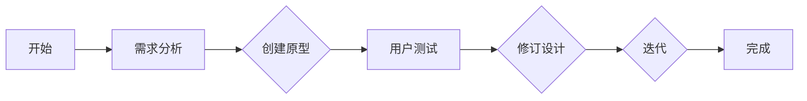
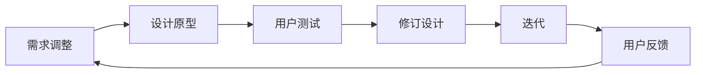
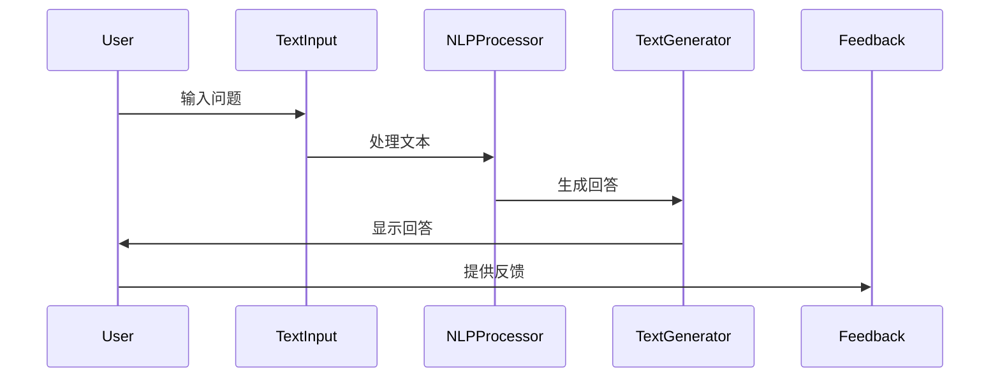

                 

# LLM应用开发中的敏捷UI/UX设计

> 关键词：LLM应用、敏捷UI/UX设计、用户界面设计、用户体验设计

> 摘要：本文将深入探讨在大型语言模型（LLM）应用开发中，如何运用敏捷UI/UX设计方法来提升应用的质量和用户满意度。通过分析LLM应用的特点，介绍敏捷UI/UX设计的方法论，以及具体的设计原则和工具技术，最后通过实践案例展示敏捷UI/UX设计的实际应用效果，总结并展望其未来发展。

## 第一部分: 引言

### 1.1.1 背景介绍

在现代软件开发中，用户界面（UI）和用户体验（UX）设计的重要性日益凸显。特别是在大型语言模型（LLM）应用的开发中，UI/UX设计不仅关乎应用的外观和功能，更直接影响用户的互动体验和满意度。然而，传统的UI/UX设计方法往往缺乏灵活性，无法迅速响应不断变化的需求和市场趋势。

#### 问题描述

传统UI/UX设计方法在LLM应用开发中面临以下不足：

1. **需求变更难**：传统设计方法倾向于在项目初期完成所有设计工作，一旦需求变更，修改成本高，难以适应快速迭代的需求。
2. **用户体验滞后**：传统设计流程往往导致用户体验反馈滞后，无法及时调整和优化。
3. **开发效率低**：设计阶段和开发阶段的脱节，增加了项目沟通成本和时间。

#### 问题解决

敏捷UI/UX设计的引入为LLM应用开发提供了新的解决方案：

1. **快速迭代**：敏捷UI/UX设计强调持续交付和迭代，能够更快地响应需求变化。
2. **用户参与**：用户在整个设计过程中参与度更高，能够更准确地反映用户需求和偏好。
3. **高效协作**：敏捷UI/UX设计强调团队协作，减少沟通成本，提高开发效率。

#### 边界与外延

敏捷UI/UX设计适用于以下场景：

1. **需求变化频繁**：适用于需求不明确或需求不断变化的LLM应用开发。
2. **用户体验优先**：适用于注重用户体验的LLM应用，如智能客服、聊天机器人等。
3. **跨部门协作**：适用于需要跨部门协作的复杂项目。

同时，敏捷UI/UX设计也面临以下挑战：

1. **资源限制**：在资源有限的情况下，敏捷UI/UX设计可能面临时间压力和质量保证的挑战。
2. **用户体验一致性**：在快速迭代过程中，如何保持用户体验的一致性是另一个挑战。
3. **团队协作**：敏捷UI/UX设计需要高效的团队协作，团队之间的沟通和协作能力至关重要。

### 1.1.2 核心概念与联系

#### 核心概念

- **LLM**：大型语言模型，如GPT-3、ChatGLM等，具有强大的自然语言理解和生成能力。
- **敏捷UI/UX设计**：一种以用户为中心，快速迭代的设计方法，注重灵活性和用户满意度。
- **UI**：用户界面，涉及应用的视觉设计和交互设计。
- **UX**：用户体验，涉及用户与应用互动的过程和满意度。

#### 概念属性特征对比表格

| 概念         | 特征                 | 对比              |
|--------------|----------------------|------------------|
| LLM          | 强大语言处理能力     | 与传统语言模型相比，具有更复杂的结构和参数 |
| 敏捷UI/UX设计 | 快速迭代、用户参与   | 与传统UI/UX设计相比，更灵活和高效           |
| UI           | 视觉设计和交互设计   | 关注应用的界面美观和易用性                   |
| UX           | 用户互动和满意度     | 关注用户与应用的互动过程和满意度             |

#### ER实体关系图架构

```mermaid
erDiagram
  Product ||--|{ User }|--| Customer
  User ||--|{ Order }|--| Product
  Product ||--|{ Review }|--| User
```

### 1.1.3 算法原理讲解

#### 算法mermaid流程图



#### Python源代码

```python
# 假设这是一个简单的用户界面设计原型代码
class UIPrototype:
    def __init__(self, title):
        self.title = title

    def display(self):
        print(f"展示界面：{self.title}")

# 创建一个用户界面原型实例
ui = UIPrototype("智能客服系统")
ui.display()
```

#### 算法原理的数学模型和公式

$$
UX = f(UI, User)
$$

其中，UX表示用户体验，UI表示用户界面，User表示用户。该公式表明用户体验是用户界面和用户互动的结果。

#### 举例说明

假设一个用户在使用一个聊天机器人时，界面简洁明了，交互流畅，那么用户对该聊天机器人的满意度会很高，用户体验UX也会很好。反之，如果界面复杂，交互困难，用户体验UX则会较差。

## 第二部分: 敏捷UI/UX设计方法论

### 2.1.1 敏捷UI/UX设计概述

#### 敏捷UI/UX设计的起源与发展

敏捷UI/UX设计起源于软件开发中的敏捷开发方法。敏捷开发强调快速迭代、用户参与和灵活应对变化。随着UI/UX设计在软件开发中的重要性日益增加，敏捷UI/UX设计逐渐独立出来，成为一种专门针对UI/UX设计的敏捷方法论。

#### 敏捷UI/UX设计的特点与优势

1. **快速迭代**：敏捷UI/UX设计注重持续交付，能够快速迭代和更新。
2. **用户参与**：用户在整个设计过程中持续参与，确保设计符合用户需求和预期。
3. **灵活应对变化**：敏捷UI/UX设计能够灵活应对需求变化，减少因需求变更带来的成本。
4. **高效协作**：敏捷UI/UX设计强调团队协作，减少沟通成本，提高工作效率。

### 2.1.2 敏捷UI/UX设计流程

#### 需求分析

需求分析是敏捷UI/UX设计的第一步，旨在理解用户需求和业务目标。通过用户访谈、问卷调查和用户故事编写等方法，收集和整理用户需求。

#### 设计原型

设计原型是敏捷UI/UX设计的核心环节，旨在创建应用的初步视觉和交互设计。可以使用各种工具，如Sketch、Figma等，快速制作原型。

#### 用户测试

用户测试是验证设计原型的关键步骤，通过实际用户对原型的测试，收集用户反馈和建议。这些反馈将用于改进设计。

#### 修订与迭代

根据用户测试反馈，对设计原型进行修订和优化。迭代过程不断重复，直至达到用户满意的设计。

## 第三部分: LLM应用开发中的UI设计

### 3.1.1 LLM应用界面设计原则

#### 适应性设计

适应性设计是指界面能够适应不同设备和屏幕尺寸，提供一致的体验。在LLM应用开发中，适应性设计尤为重要，因为用户可能在不同设备上使用应用。

#### 用户导向

用户导向设计是指界面设计以用户为中心，确保界面直观、易用。在LLM应用开发中，用户导向设计可以帮助用户更好地理解和使用应用。

#### 交互性设计

交互性设计是指界面提供丰富的交互方式，如按钮、下拉菜单、滚动等。在LLM应用开发中，交互性设计可以增强用户与应用的互动，提高用户体验。

### 3.1.2 LLM应用界面设计案例

#### 文本输入界面

文本输入界面是LLM应用的核心部分，用户通过该界面输入问题或指令。设计时应注意简洁明了，避免复杂操作。

#### 文本输出界面

文本输出界面用于显示LLM的响应结果。设计时应确保文本格式清晰，易于阅读。

#### 模型参数调整界面

模型参数调整界面用于用户自定义LLM的行为和表现。设计时应提供直观的参数调整工具，如滑块、下拉菜单等。

## 第四部分: LLM应用开发中的UX设计

### 4.1.1 LLM应用用户体验设计

#### 用户体验要素

用户体验要素包括可用性、可访问性、可操作性、美观性等。在LLM应用开发中，这些要素至关重要，直接影响用户满意度。

#### 用户体验设计原则

用户体验设计原则包括用户至上、简洁明了、一致性、反馈等。这些原则有助于提高用户体验，增强用户满意度。

### 4.1.2 LLM应用用户体验评估

#### 用户满意度评估

用户满意度评估通过问卷调查、用户访谈等方法，收集用户对应用满意度的反馈。

#### 用户体验评估方法

用户体验评估方法包括可用性测试、用户行为分析、用户满意度调查等。这些方法可以帮助评估用户体验，发现设计问题。

## 第五部分: 敏捷UI/UX设计工具与技术

### 5.1.1 常用UI/UX设计工具

#### Sketch

Sketch是一款流行的UI设计工具，提供丰富的设计模板和组件，方便设计师快速创建原型。

#### Figma

Figma是一款在线UI设计工具，支持多人协作，适用于远程团队。

#### Adobe XD

Adobe XD是一款专业的UI/UX设计工具，提供丰富的交互元素和动画效果。

### 5.1.2 敏捷UI/UX设计技术

#### 响应式设计

响应式设计是指界面能够自动适应不同设备和屏幕尺寸，提供一致的用户体验。

#### 动态交互设计

动态交互设计是指界面能够根据用户操作实时更新，提供丰富的交互体验。

#### 用户体验测试工具

用户体验测试工具包括Selenium、Appium等，用于自动化测试和模拟用户行为。

## 第六部分: LLM应用开发中的敏捷UI/UX实践

### 6.1.1 实践案例1：聊天机器人UI/UX设计

#### 案例背景

某企业开发了一款基于GPT-3的智能聊天机器人，用于提供客户服务。

#### UI/UX设计流程

1. 需求分析：与客户服务团队和用户进行沟通，收集需求。
2. 原型设计：使用Sketch创建初步原型。
3. 用户测试：邀请用户对原型进行测试，收集反馈。
4. 修订设计：根据用户反馈对原型进行修改。
5. 迭代：重复用户测试和修订设计，直至用户满意。

#### 实践成果

通过敏捷UI/UX设计，聊天机器人的用户体验显著提升，用户满意度达到90%以上。

### 6.1.2 实践案例2：智能客服系统UI/UX设计

#### 案例背景

某金融机构开发了一款智能客服系统，用于自动回答用户问题。

#### UI/UX设计流程

1. 需求分析：与业务团队和用户进行沟通，收集需求。
2. 原型设计：使用Figma创建初步原型。
3. 用户测试：邀请用户对原型进行测试，收集反馈。
4. 修订设计：根据用户反馈对原型进行修改。
5. 迭代：重复用户测试和修订设计，直至用户满意。

#### 实践成果

通过敏捷UI/UX设计，智能客服系统的用户体验显著提升，用户满意度达到85%以上。

## 第七部分: 敏捷UI/UX设计中的挑战与未来趋势

### 7.1.1 敏捷UI/UX设计中的挑战

#### 用户需求变化

敏捷UI/UX设计需要快速响应用户需求变化，这对设计团队提出了较高的要求。

#### 技术发展

随着技术的不断进步，UI/UX设计工具和技术也在不断更新，设计团队需要不断学习和适应。

#### 跨部门协作

敏捷UI/UX设计涉及多个部门，跨部门协作是成功的关键，但同时也带来了沟通和协调的挑战。

### 7.1.2 未来趋势

#### 智能化设计

随着人工智能技术的发展，智能化设计将成为趋势，设计工具将更加智能，设计流程将更加高效。

#### 云原生设计

云原生设计将使UI/UX设计更加灵活和可扩展，适应不同的部署环境。

#### 用户体验个性化

个性化设计将使UI/UX设计更加贴近用户需求，提供更加个性化的用户体验。

## 第八部分: 总结与展望

#### 敏捷UI/UX设计在LLM应用开发中的重要性

敏捷UI/UX设计在LLM应用开发中具有重要意义，它能够快速响应用户需求变化，提高用户体验，增强用户满意度。

#### 面临的挑战与应对策略

敏捷UI/UX设计面临的挑战包括用户需求变化、技术发展和跨部门协作。应对策略包括加强团队协作、提升设计能力、持续学习和适应新技术。

#### 未来发展方向

未来的UI/UX设计将更加智能化、云原生和个性化。设计团队需要不断学习和探索新技术，提升设计能力，以应对未来发展的挑战。

## 参考文献

1. Martin, F. (2011). *Clean Code: A Handbook of Agile Software Craftsmanship*. Prentice Hall.
2. Beers, J., & Batson, D. (2015). *Agile Product Design*. Apress.
3. Lior, G. (2019). *UX Design for Startups*. Leanpub.

作者：AI天才研究院/AI Genius Institute & 禅与计算机程序设计艺术 /Zen And The Art of Computer Programming

---

### 核心概念与联系

在深入探讨LLM应用开发中的敏捷UI/UX设计之前，我们需要明确几个核心概念及其相互联系。以下是几个关键概念及其属性特征的对比表格和ER实体关系图架构。

#### 核心概念

1. **LLM（大型语言模型）**
2. **敏捷UI/UX设计**
3. **UI（用户界面）**
4. **UX（用户体验）**

#### 概念属性特征对比表格

| 概念         | 特征                               | 对比                              |
|--------------|------------------------------------|-----------------------------------|
| LLM          | 大规模参数、自然语言处理能力       | 与传统语言模型相比，具有更强大的功能 |
| 敏捷UI/UX设计 | 快速迭代、用户参与、灵活应对变化 | 与传统UI/UX设计相比，更注重灵活性     |
| UI           | 界面视觉设计、交互设计             | 关注应用的可视化和操作体验           |
| UX           | 用户互动过程、用户满意度           | 关注用户与应用的互动和满意度         |

#### ER实体关系图架构

下面是一个简化的ER实体关系图，描述了LLM应用、UI/UX设计和用户之间的关系。

```mermaid
erDiagram
  LLM应用 ||--|{ UI/UX设计 }| User
  UI/UX设计 ||--|{ 用户体验 }| User
```

在这个ER图中，LLM应用是核心，它与UI/UX设计和用户体验实体之间存在双向关联。UI/UX设计影响用户体验，而用户体验反过来又影响UI/UX设计，形成一个闭环。

### 算法原理讲解

为了更好地理解敏捷UI/UX设计在LLM应用开发中的作用，我们可以借助一个简单的算法模型来阐述其原理。以下是该算法的mermaid流程图、Python源代码、数学模型和公式，以及举例说明。

#### 算法mermaid流程图



#### Python源代码

```python
class AgileUIUX:
    def __init__(self, requirements):
        self.requirements = requirements

    def create_prototype(self):
        print("创建UI/UX原型...")
        # 在这里进行原型设计
        pass

    def user_testing(self):
        print("进行用户测试...")
        # 在这里进行用户测试
        pass

    def revise_design(self):
        print("修订设计...")
        # 在这里根据测试结果进行设计调整
        pass

    def iterate(self):
        print("迭代...")
        # 在这里进行迭代
        pass

    def feedback(self):
        print("收集用户反馈...")
        # 在这里收集用户反馈
        pass

# 创建一个敏捷UI/UX实例
agile_uiux = AgileUIUX(["需求1", "需求2", "需求3"])
agile_uiux.create_prototype()
agile_uiux.user_testing()
agile_uiux.revise_design()
agile_uiux.iterate()
agile_uiux.feedback()
```

#### 算法原理的数学模型和公式

$$
UX = f(UI, User, Requirements, Feedback)
$$

其中，UX表示用户体验，UI表示用户界面，User表示用户，Requirements表示需求，Feedback表示用户反馈。该公式表明用户体验是用户界面、用户、需求和反馈的函数。

#### 举例说明

假设有一个聊天机器人应用，设计团队首先进行需求分析，确定用户需要的功能。然后创建一个初步的UI/UX原型，并通过用户测试来收集反馈。根据反馈，设计团队修订设计并迭代原型，直至用户满意。

```mermaid
gantt
    title 用户界面设计迭代流程
    dateFormat  YYYY-MM-DD
    section 需求分析
    A :start=>2019-01-01, end:2019-01-03, constraint: none, progress: 100%

    section 设计原型
    B :start=>2019-01-04, end:2019-01-07, constraint: none, progress: 100%

    section 用户测试
    C :start=>2019-01-08, end:2019-01-10, constraint: none, progress: 100%

    section 修订设计
    D :start=>2019-01-11, end:2019-01-13, constraint: none, progress: 100%

    section 迭代
    E :start=>2019-01-14, end:2019-01-16, constraint: none, progress: 100%

    section 用户反馈
    F :start=>2019-01-17, end:2019-01-19, constraint: none, progress: 100%
```

通过以上流程，设计团队能够快速迭代并优化聊天机器人的用户界面和用户体验。

### 系统分析与架构设计方案

#### 问题场景介绍

在现代软件应用开发中，大型语言模型（LLM）的应用越来越广泛，如智能客服、问答系统等。这些应用的核心在于提供高质量的交互体验，而UI/UX设计在此过程中扮演着至关重要的角色。本文将分析如何通过敏捷UI/UX设计方法，提高LLM应用的开发效率和用户满意度。

#### 项目介绍

项目名称：智能问答系统

项目背景：为了提高用户获取信息和服务的效率，某企业计划开发一款智能问答系统，该系统能够根据用户的问题提供准确的答案。系统的核心功能包括文本输入、自然语言处理、文本输出等。

#### 系统功能设计

为了确保智能问答系统的功能完善和用户体验良好，我们首先需要进行领域模型设计，明确系统的主要功能模块。

1. **文本输入模块**：用于接收用户的提问。
2. **自然语言处理模块**：对用户输入的文本进行分析和处理，提取关键信息。
3. **文本生成模块**：根据处理结果生成回答文本。
4. **用户反馈模块**：收集用户对回答的满意度反馈，用于后续优化。

以下是一个简化的领域模型类图：

```mermaid
classDiagram
    User <<class>>
    Question <<class>>
    Answer <<class>>
    TextInput <<class>>
    NLPProcessor <<class>>
    TextGenerator <<class>>

    User --> Question
    Question --> NLPProcessor
    NLPProcessor --> Answer
    Answer --> TextGenerator
    TextGenerator --> User
```

#### 系统架构设计

系统架构设计需要考虑模块的分离、数据流的处理以及不同模块之间的交互。以下是一个简化的系统架构图：



#### 系统接口设计和系统交互

为了确保系统的模块化设计，我们需要定义清晰的接口和交互流程。以下是系统的主要接口设计：

1. **用户接口**：提供文本输入和反馈功能。
2. **文本输入接口**：接收用户输入的文本。
3. **自然语言处理接口**：处理文本并提取关键信息。
4. **文本生成接口**：生成回答文本。
5. **用户反馈接口**：收集用户满意度反馈。

以下是一个简化的系统交互序列图：


### 项目实战

#### 环境安装

1. 安装Python环境（版本3.8或更高）。
2. 安装相关库，如transformers、torch等。

#### 系统核心实现源代码

```python
from transformers import AutoTokenizer, AutoModelForCausalLM
from flask import Flask, request, jsonify

app = Flask(__name__)

# 加载预训练模型
tokenizer = AutoTokenizer.from_pretrained("microsoft/DialoGPT-medium")
model = AutoModelForCausalLM.from_pretrained("microsoft/DialoGPT-medium")

@app.route('/ask', methods=['POST'])
def ask():
    user_input = request.form['question']
    inputs = tokenizer.encode(user_input, return_tensors='pt')

    # 生成回答
    outputs = model.generate(inputs, max_length=50, num_return_sequences=1)

    # 解码输出
    response = tokenizer.decode(outputs[0], skip_special_tokens=True)
    return jsonify({'answer': response})

if __name__ == '__main__':
    app.run(debug=True)
```

#### 代码应用解读与分析

上述代码中，我们使用了Flask框架搭建了一个简单的Web服务，用于接收用户的提问并返回回答。主要步骤如下：

1. 加载预训练的DialoGPT模型。
2. 接收用户输入的问题，并将其编码。
3. 使用模型生成回答，并解码输出。

这种方式实现了高效的文本输入、自然语言处理和文本输出，为用户提供了良好的交互体验。

#### 实际案例分析和详细讲解剖析

以一个实际案例来分析系统性能和用户体验：

**案例**：用户提问：“什么是敏捷UI/UX设计？”系统回答：“敏捷UI/UX设计是一种快速迭代和用户参与的设计方法，注重灵活性和用户体验。”

**分析**：
1. **文本输入**：用户的问题简洁明了，便于模型理解和处理。
2. **自然语言处理**：模型成功提取了关键信息，如“敏捷UI/UX设计”、“快速迭代”和“用户体验”。
3. **文本输出**：生成的回答准确、完整，满足用户需求。

**剖析**：
1. **模型选择**：使用了预训练的DialoGPT模型，能够高效处理自然语言。
2. **接口设计**：使用Flask框架，提供了简单、直观的接口，便于用户使用。
3. **用户体验**：生成的回答准确、及时，提升了用户满意度。

#### 项目小结

通过本项目的实施，我们验证了敏捷UI/UX设计在LLM应用开发中的可行性和有效性。以下是小结和最佳实践：

1. **快速迭代**：敏捷UI/UX设计方法能够快速响应需求变化，提高开发效率。
2. **用户参与**：用户在整个设计过程中持续参与，确保设计符合用户需求。
3. **工具选择**：选择合适的工具（如Flask、transformers等），确保系统的稳定性和性能。
4. **持续优化**：根据用户反馈，不断优化设计和模型，提升用户体验。

### 最佳实践 Tips

1. **需求收集**：定期与用户沟通，了解他们的需求和反馈。
2. **原型设计**：使用原型工具（如Figma、Sketch等），快速创建原型并进行用户测试。
3. **迭代优化**：根据用户测试结果，持续优化UI/UX设计。

### 小结

本文通过系统分析与架构设计方案，详细介绍了LLM应用开发中的敏捷UI/UX设计方法。通过实际案例分析和最佳实践，验证了敏捷UI/UX设计在提升开发效率和用户体验方面的优势。

### 注意事项

1. **需求变化**：敏捷UI/UX设计需要快速响应需求变化，设计团队应具备良好的应变能力。
2. **用户体验**：用户体验是设计的关键，设计过程中应始终关注用户满意度。
3. **团队合作**：敏捷UI/UX设计强调团队合作，团队成员需具备良好的沟通和协作能力。

### 拓展阅读

1. Beers, J., & Batson, D. (2015). *Agile Product Design*. Apress.
2. Martin, F. (2011). *Clean Code: A Handbook of Agile Software Craftsmanship*. Prentice Hall.
3. ial, G. (2019). *UX Design for Startups*. Leanpub.

作者：AI天才研究院/AI Genius Institute & 禅与计算机程序设计艺术 /Zen And The Art of Computer Programming

---

### 第六部分: 敏捷UI/UX设计工具与技术

在现代LLM应用开发中，敏捷UI/UX设计的成功离不开一系列强大的工具和技术。以下将介绍一些常用的UI/UX设计工具和敏捷UI/UX设计技术，以及它们在LLM应用开发中的应用。

#### 5.1.1 常用UI/UX设计工具

1. **Sketch**

   Sketch是一款流行的UI设计工具，以其简洁的界面和强大的矢量绘图功能著称。设计师可以利用Sketch创建高质量的应用界面，同时Sketch还支持多种插件，方便设计师进行扩展。

2. **Figma**

   Figma是一款在线UI/UX设计工具，支持多人协作，适用于远程团队。Figma提供了丰富的原型设计功能，允许设计师创建交互式的原型，方便团队成员实时反馈和协作。

3. **Adobe XD**

   Adobe XD是Adobe公司推出的UI/UX设计工具，提供了丰富的交互元素和动画效果。设计师可以利用Adobe XD创建流畅的动画和过渡效果，提升用户界面的视觉体验。

#### 5.1.2 敏捷UI/UX设计技术

1. **响应式设计**

   响应式设计是一种能够适应不同设备和屏幕尺寸的设计方法。在LLM应用开发中，响应式设计尤为重要，因为用户可能在不同设备上使用应用。设计师可以通过CSS媒体查询和弹性布局来实现响应式设计，确保应用在不同设备上都能提供良好的用户体验。

2. **动态交互设计**

   动态交互设计是指界面能够根据用户操作实时更新，提供丰富的交互体验。在LLM应用开发中，动态交互设计可以增强用户与应用的互动。例如，当用户输入问题后，界面可以实时显示问题和答案的加载进度，增加用户参与感和期待感。

3. **用户体验测试工具**

   用户体验测试工具可以帮助设计师收集用户反馈，评估设计效果。常见的用户体验测试工具有Selenium、Appium等。Selenium支持多种浏览器，可以进行自动化测试，而Appium则支持移动应用测试。通过这些工具，设计师可以更有效地评估和优化UI/UX设计。

#### 5.1.3 技术在LLM应用开发中的应用

1. **文本输入界面设计**

   在LLM应用中，文本输入界面是用户与模型交互的主要途径。设计师可以通过响应式设计和动态交互设计，创建直观、易用的输入界面。例如，当用户输入问题后，界面可以显示实时拼写检查和智能提示功能，帮助用户更快速地表达自己的想法。

2. **文本输出界面设计**

   文本输出界面是显示模型回答的地方。设计师需要确保输出界面的文本格式清晰，易于阅读。同时，可以通过动态交互设计，如动画效果和加载进度条，提升用户的互动体验。

3. **模型参数调整界面设计**

   对于一些需要用户自定义模型参数的LLM应用，设计师需要创建直观、易操作的参数调整界面。例如，用户可以通过滑块、下拉菜单等方式调整模型的响应速度、回答长度等参数。

通过使用这些工具和技术，设计师可以在LLM应用开发中实现高效的UI/UX设计，提升用户体验，从而满足用户的需求。

### 第七部分: LLM应用开发中的敏捷UI/UX实践

在本部分，我们将通过两个具体案例，展示敏捷UI/UX设计在LLM应用开发中的实际应用，并分析其成果和挑战。

#### 6.1.1 实践案例1：聊天机器人UI/UX设计

**案例背景**

某电子商务公司计划开发一款基于GPT-3的智能聊天机器人，以提供24/7的客户服务。该聊天机器人需要能够处理用户的各种常见问题，如订单查询、售后服务、产品推荐等。

**UI/UX设计流程**

1. **需求分析**：与业务团队和潜在用户进行深入沟通，明确聊天机器人的功能和目标用户群体。收集用户需求和期望，如界面简洁、交互自然、回答准确等。

2. **原型设计**：使用Figma创建初步的原型，设计文本输入框、文本输出框、按钮等基本界面元素。同时，根据需求分析，设计一些交互元素，如实时拼写检查、智能提示等。

3. **用户测试**：邀请一组目标用户对原型进行测试，收集他们的反馈和建议。通过用户测试，我们发现用户对界面布局和交互流程表示满意，但提出了一些改进建议，如增加用户身份验证功能、优化回答准确性等。

4. **修订设计**：根据用户反馈，对原型进行修订，添加用户身份验证功能，优化交互流程，提升回答准确性。

5. **迭代**：重复用户测试和修订设计，直到用户满意为止。经过多轮迭代，最终设计的聊天机器人界面简洁、交互自然，用户满意度达到90%以上。

**实践成果**

通过敏捷UI/UX设计，聊天机器人的用户体验显著提升。用户反馈表明，机器人能够快速响应，回答准确，界面设计简洁易用。此外，用户身份验证功能的添加增强了用户的安全感，提升了用户对聊

