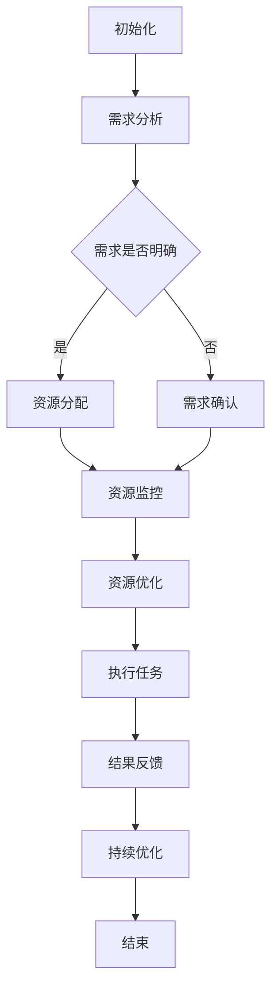
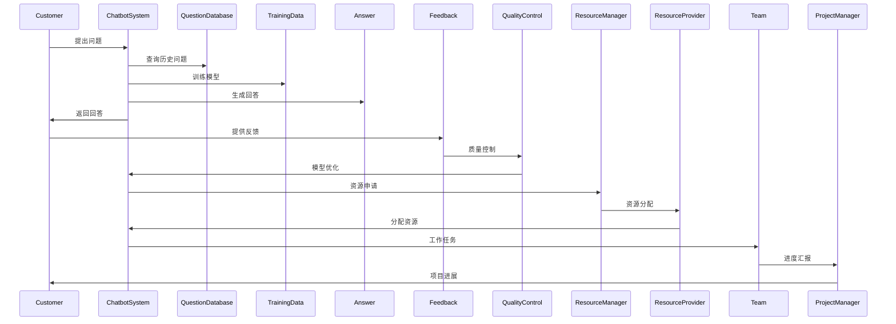
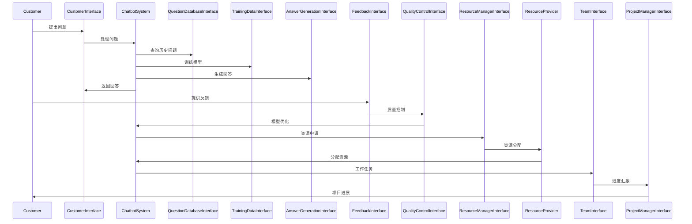

                 

## 引言：LLM应用开发与敏捷供应链管理的融合

随着人工智能技术的飞速发展，大型语言模型（LLM，Large Language Models）逐渐成为现代软件开发中的重要工具。LLM具有处理大量文本数据、生成高质量文本内容、进行复杂自然语言理解和交互的能力，被广泛应用于自然语言处理（NLP）、智能客服、内容生成、文本摘要等多个领域。然而，LLM应用的开发过程不仅仅是算法和模型的训练与优化，还涉及到复杂的技术架构设计、数据供应链管理等多个方面。

敏捷供应链管理是一种应对快速变化环境的现代管理方法，其核心思想是通过快速响应市场需求，优化资源利用，降低成本，提高服务质量。随着企业对效率、灵活性和响应速度要求的提升，敏捷供应链管理逐渐成为供应链管理领域的研究热点。那么，如何将敏捷供应链管理理念应用于LLM应用开发中，成为了一个值得探讨的问题。

本文将从以下几方面探讨LLM应用开发与敏捷供应链管理的融合：

1. **问题背景**：介绍LLM应用开发中面临的供应链管理挑战。
2. **核心概念**：阐述LLM与敏捷供应链管理的定义、原理和关键要素。
3. **算法原理**：详细讲解敏捷供应链管理算法的原理和实施步骤。
4. **系统架构**：设计并介绍适用于LLM应用开发的敏捷供应链管理系统架构。
5. **项目实战**：通过实际案例展示敏捷供应链管理在LLM应用开发中的应用。
6. **最佳实践**：总结实际操作中的注意事项和拓展阅读。

本文旨在为读者提供一个系统、全面、易懂的指南，帮助理解和应用敏捷供应链管理于LLM应用开发，从而提高开发效率，降低风险。

## 关键词

- **大型语言模型（LLM）**：一种能够处理大量文本数据，生成高质量文本内容的模型。
- **敏捷供应链管理**：一种应对快速变化环境的现代管理方法。
- **自然语言处理（NLP）**：计算机处理自然语言的技术。
- **算法**：用于解决特定问题的系统方法和步骤。
- **系统架构设计**：系统各组件的布局和相互关系。
- **项目实战**：通过实际案例展示算法和应用的方法。

## 摘要

本文探讨了将敏捷供应链管理理念应用于大型语言模型（LLM）应用开发的重要性。首先，分析了LLM应用开发过程中面临的供应链管理挑战，如数据供应链不稳定、资源分配不合理等问题。接着，阐述了LLM与敏捷供应链管理的核心概念，并对比了传统供应链管理与敏捷供应链管理的异同。随后，详细介绍了敏捷供应链管理算法的原理和实施步骤，以及其在LLM应用开发中的具体应用。通过一个实际案例，展示了敏捷供应链管理在LLM开发中的实际效果。最后，总结了最佳实践，为读者提供了实用的操作指南。

## 背景介绍

### 1.1.1 LLM应用开发中的供应链挑战

在LLM应用开发中，供应链管理扮演着至关重要的角色。然而，随着技术的快速发展和市场需求的变化，LLM应用开发面临着诸多供应链挑战。以下是几个关键问题：

**数据供应链不稳定**：大型语言模型的训练和优化需要大量的高质量文本数据。然而，数据的获取和整理过程往往复杂且耗时，数据供应链的稳定性直接影响到LLM模型的训练效果和应用性能。

**资源分配不合理**：在LLM应用开发过程中，硬件资源和计算资源的分配至关重要。然而，传统供应链管理方法往往缺乏灵活性，难以快速响应需求变化，导致资源浪费和效率低下。

**技术供应链延迟**：随着LLM技术的发展，相关技术组件和工具的更新速度非常快。如果供应链管理无法及时跟进，将导致技术落后，影响开发进度和产品质量。

**成本控制困难**：LLM应用开发涉及大量计算资源和人力成本，传统供应链管理往往缺乏有效的成本控制手段，导致项目成本难以预测和管理。

**风险应对不足**：在快速变化的市场环境中，LLM应用开发面临的风险多种多样，如技术风险、市场风险和运营风险。传统供应链管理往往缺乏有效的风险识别和应对机制，导致项目失败的风险增加。

### 1.1.2 敏捷供应链管理的必要性

为了解决上述问题，敏捷供应链管理成为了LLM应用开发的重要选择。敏捷供应链管理的核心思想是通过快速响应市场需求，优化资源利用，降低成本，提高服务质量。以下是敏捷供应链管理在LLM应用开发中的必要性：

**快速响应市场需求**：市场需求变化迅速，敏捷供应链管理能够快速调整供应链策略，确保LLM应用开发的及时交付和高质量产出。

**优化资源利用**：通过敏捷供应链管理，可以灵活分配硬件资源和计算资源，避免资源浪费，提高资源利用效率。

**降低成本**：敏捷供应链管理通过精细化管理和流程优化，可以显著降低成本，提高项目的投资回报率。

**提高服务质量**：敏捷供应链管理注重服务质量，通过实时监控和反馈机制，确保LLM应用开发的稳定性和可靠性。

**增强风险应对能力**：敏捷供应链管理具备良好的风险识别和应对机制，能够有效降低项目风险，保障项目的顺利推进。

总之，将敏捷供应链管理应用于LLM应用开发，不仅能够解决传统供应链管理中存在的问题，还能够提升整体开发效率和项目质量，为企业在竞争激烈的市场中赢得优势。

### 1.2.1 LLM的基本原理与特点

大型语言模型（LLM，Large Language Models）是近年来自然语言处理（NLP，Natural Language Processing）领域的一项重大突破。LLM通过深度学习和神经网络技术，对大量文本数据进行学习和处理，从而实现复杂的自然语言理解和生成任务。以下是LLM的基本原理和特点：

**原理**：

LLM的基本原理基于深度学习中的循环神经网络（RNN，Recurrent Neural Networks）和Transformer模型。RNN可以处理序列数据，通过保持上下文信息来捕捉文本中的长距离依赖关系。而Transformer模型通过自注意力机制（Self-Attention Mechanism），能够更好地处理文本中的长距离依赖，并在很多NLP任务中取得了显著效果。

LLM的训练过程通常包括两个阶段：预训练和微调。预训练阶段，LLM在大规模文本数据上进行无监督训练，学习语言的基本规律和特征。微调阶段，LLM在特定任务的数据上进行有监督训练，使其在特定任务上达到更好的性能。

**特点**：

1. **强大的文本生成能力**：LLM具有出色的文本生成能力，可以生成流畅、自然的文本内容。无论是生成新闻文章、产品描述，还是编写程序代码，LLM都能胜任。

2. **出色的自然语言理解能力**：LLM能够理解复杂的语义和上下文信息，进行问答、情感分析、实体识别等任务。这使得LLM在智能客服、内容审核等领域具有广泛的应用前景。

3. **高度的灵活性和适应性**：LLM可以根据不同的任务和数据集进行微调，适应各种应用场景。这种灵活性使得LLM在快速变化的市场环境中能够迅速调整和优化，提高开发效率。

4. **需要大量的计算资源**：由于LLM的模型规模巨大，训练过程需要大量的计算资源和时间。这要求在供应链管理中，需要合理配置计算资源，确保模型的训练和优化顺利进行。

5. **数据质量要求高**：LLM的训练依赖于大量高质量的数据，数据的多样性和准确性直接影响模型的性能。因此，在供应链管理中，需要确保数据供应链的稳定性和数据质量。

### 1.2.2 敏捷供应链管理的概念与原理

敏捷供应链管理是一种现代供应链管理模式，旨在通过快速响应市场需求，优化资源利用，降低成本，提高服务质量。与传统供应链管理相比，敏捷供应链管理更加注重灵活性和适应性，能够更好地应对快速变化的市场环境。

**定义**：

敏捷供应链管理是一种通过灵活的供应链策略和快速响应机制，确保供应链的稳定性和高效性的管理模式。它强调供应链各环节的协同合作，通过信息化手段实现供应链的实时监控和优化。

**原理**：

1. **快速响应市场需求**：敏捷供应链管理的核心思想是快速响应市场需求变化，通过灵活的供应链策略和快速调整能力，确保产品和服务能够及时交付。

2. **优化资源利用**：敏捷供应链管理通过精细化的资源管理和调度，最大化资源利用效率。这包括合理分配计算资源、存储资源和人力资源，确保各环节的资源得到充分利用。

3. **降低成本**：通过优化供应链各环节的流程和效率，敏捷供应链管理能够显著降低运营成本。这包括减少库存成本、运输成本和人力资源成本等。

4. **提高服务质量**：敏捷供应链管理注重客户体验，通过实时监控和反馈机制，确保产品和服务的高质量。这包括快速响应用户需求、提高交付速度和降低故障率等。

5. **风险管理**：敏捷供应链管理具备良好的风险识别和应对机制，能够及时发现和应对潜在的风险，保障供应链的稳定性和可靠性。

### 1.3.1 传统供应链管理与敏捷供应链管理的异同

传统供应链管理和敏捷供应链管理在管理模式、目标和实施策略上存在显著差异。

**相同点**：

1. **目标**：两者均旨在提高供应链的效率和可靠性，确保产品和服务能够及时交付。

2. **核心原则**：两者均强调供应链各环节的协同合作和信息共享，以提高供应链的整体效能。

3. **资源利用**：两者都关注资源的高效利用，通过合理的资源配置和调度，降低运营成本。

**不同点**：

1. **管理方式**：传统供应链管理强调计划和控制，依赖于长期计划和固定的供应链策略。而敏捷供应链管理则更加灵活和动态，强调快速响应和适应性调整。

2. **响应速度**：敏捷供应链管理能够更快地响应市场需求变化，而传统供应链管理在应对快速变化的市场环境时存在一定的滞后性。

3. **风险应对**：敏捷供应链管理具备良好的风险识别和应对机制，能够及时发现和应对潜在的风险。而传统供应链管理在风险识别和应对方面相对薄弱。

4. **成本控制**：敏捷供应链管理通过优化流程和效率，能够更好地控制成本。而传统供应链管理在成本控制方面往往缺乏有效的手段。

5. **信息共享**：敏捷供应链管理强调信息的实时共享和透明度，而传统供应链管理在信息共享方面存在一定的滞后和障碍。

通过对比可以看出，敏捷供应链管理在应对快速变化的市场环境方面具有显著优势，能够更好地满足现代企业对供应链管理的要求。

### 1.3.2 敏捷供应链管理的关键要素

敏捷供应链管理成功实施的关键在于其核心要素的合理配置和协同运作。以下是敏捷供应链管理的五大关键要素及其重要性：

**1. 快速响应能力**

快速响应能力是敏捷供应链管理的核心要素之一。在快速变化的市场环境中，企业需要能够迅速调整供应链策略，以满足客户需求的变化。这要求供应链各环节具备高效的沟通和协作机制，确保信息的快速传递和决策的及时执行。

**重要性**：快速响应能力直接影响到企业的市场竞争力和客户满意度。具备快速响应能力的供应链能够及时调整生产和交付计划，减少库存积压和缺货现象，提高产品的交付速度和可靠性。

**2. 灵活资源配置**

灵活资源配置是敏捷供应链管理的另一个关键要素。在传统供应链管理中，资源分配往往是固定的，难以适应市场变化。而敏捷供应链管理强调根据市场需求动态调整资源分配，确保资源的高效利用。

**重要性**：灵活资源配置能够提高资源利用效率，降低运营成本。通过合理配置计算资源、存储资源和人力资源，企业能够更好地应对市场需求波动，提高供应链的灵活性和适应性。

**3. 信息化与数字化**

信息化与数字化是敏捷供应链管理的重要支撑。现代信息技术和大数据分析工具能够实时收集、分析和处理供应链各环节的数据，为企业提供决策支持。

**重要性**：信息化与数字化能够提高供应链的透明度和可视性，帮助企业更好地掌握供应链的运行状态和潜在问题，从而实现精准管理和优化。通过大数据分析和人工智能技术，企业能够预测市场需求，优化库存管理和供应链流程。

**4. 协同合作**

协同合作是敏捷供应链管理成功实施的重要保障。供应链各环节的企业和合作伙伴需要建立紧密的合作关系，通过信息共享和资源整合，实现供应链的协同运作。

**重要性**：协同合作能够提高供应链的整体效能，降低运营成本和风险。通过建立高效的协同机制，企业能够更好地协调生产和物流活动，提高供应链的响应速度和交付质量。

**5. 风险管理**

风险管理是敏捷供应链管理不可或缺的要素。在快速变化的市场环境中，企业需要具备良好的风险识别和应对机制，确保供应链的稳定性和可靠性。

**重要性**：风险管理能够帮助企业识别和应对潜在的风险，降低供应链中断和运营风险。通过建立有效的风险预警和应对机制，企业能够及时调整供应链策略，确保供应链的持续运行和业务的稳定发展。

总之，敏捷供应链管理的成功实施依赖于快速响应能力、灵活资源配置、信息化与数字化、协同合作和风险管理等关键要素的有机结合。这些要素相互促进，共同推动供应链的优化和提升，为企业在竞争激烈的市场中赢得优势。

### 1.4 敏捷供应链管理ER实体关系图

为了更好地理解敏捷供应链管理中的各个实体及其相互关系，我们可以使用Mermaid绘制一个实体关系图。以下是一个简单的ER实体关系图的例子：

```mermaid
erDiagram
    User ||--|{ Order } : "makes"
    User ||--|{ Product } : "buys"
    Product ||--|{ Review } : "has"
    Supplier ||--|{ Product } : "supplies"
    Warehouse ||--|{ Product } : "stores"
    Order ||--|{ Item } : "contains"
    Review ||--|{ User } : "wrote by"
    Item ||--|{ Product } : "of"
    Supplier ||--|{ Warehouse } : "ships to"
```

**说明**：

- **User（用户）**：代表购买和生成订单的主体。
- **Order（订单）**：代表用户生成的购买请求。
- **Product（产品）**：代表被购买和评价的商品。
- **Review（评价）**：代表用户对产品的评价。
- **Supplier（供应商）**：代表提供产品的外部实体。
- **Warehouse（仓库）**：代表存储产品的场所。
- **Item（订单项）**：代表订单中的具体商品。
- **Supplier与Warehouse**：供应商将产品发送到仓库进行存储。
- **User与Order**：用户生成订单并包含订单项。
- **User与Product**：用户购买产品并留下评价。
- **Order与Item**：订单包含多个订单项，每个订单项对应一种产品。
- **Product与Review**：每个产品都可以被用户评价。

通过这个ER实体关系图，我们可以清晰地看到敏捷供应链管理中的各个实体及其相互关系，有助于理解和设计供应链管理系统。

### 2.1.1 敏捷供应链管理算法流程图

为了更好地理解敏捷供应链管理算法的工作流程，我们可以使用Mermaid绘制一个流程图。以下是一个简单的敏捷供应链管理算法流程图：



**流程说明**：

1. **初始化**：系统启动，进行初始化设置。
2. **需求分析**：收集和分析市场需求，确定需求是否明确。
3. **需求确认**：如果需求不明确，进行进一步的确认和沟通。
4. **资源分配**：根据明确的需求，合理分配资源。
5. **资源监控**：实时监控资源的使用情况，确保资源得到有效利用。
6. **资源优化**：根据监控结果，对资源进行优化调整。
7. **执行任务**：执行分配的任务，确保任务的顺利完成。
8. **结果反馈**：收集任务的执行结果，进行反馈和评估。
9. **持续优化**：根据反馈结果，持续对资源分配和任务执行过程进行优化。
10. **结束**：整个流程完成，系统进入下一轮循环。

通过这个流程图，我们可以清晰地看到敏捷供应链管理算法的各个环节及其相互关系，有助于理解和实施敏捷供应链管理。

### 2.1.2 Python源代码实现

为了更好地理解敏捷供应链管理算法的实现过程，我们可以提供一个Python代码示例。以下是一个简单的Python代码实现：

```python
import random

# 初始化资源
resources = {
    'computing': 100,
    'storage': 500,
    'staff': 10
}

# 需求分析
def analyze_demand():
    demand = {
        'computing': random.randint(50, 200),
        'storage': random.randint(200, 1000),
        'staff': random.randint(5, 15)
    }
    return demand

# 资源分配
def allocate_resources(demand, resources):
    for resource, required in demand.items():
        if resources[resource] >= required:
            resources[resource] -= required
            print(f"{resource} allocated: {required}")
        else:
            print(f"Not enough {resource} to allocate {required}")
    return resources

# 资源监控
def monitor_resources(resources):
    print("Current resources:")
    for resource, amount in resources.items():
        print(f"{resource}: {amount}")

# 资源优化
def optimize_resources(resources):
    # 假设优化策略为随机调整
    for resource in resources:
        resources[resource] += random.randint(-50, 50)
    print("Resources optimized.")

# 执行任务
def execute_task():
    print("Executing task...")
    # 假设任务需要5个计算资源，200个存储空间，10个工作人员
    task_demand = {
        'computing': 5,
        'storage': 200,
        'staff': 10
    }
    resources = allocate_resources(task_demand, resources)
    monitor_resources(resources)
    optimize_resources(resources)

# 模拟流程
execute_task()
```

**代码说明**：

1. **初始化资源**：定义一个资源字典，包含计算资源、存储资源和人力资源。
2. **需求分析**：定义一个函数，随机生成一个需求字典，包含计算资源、存储资源和人力资源的需求。
3. **资源分配**：定义一个函数，根据需求分配资源，并返回更新后的资源字典。
4. **资源监控**：定义一个函数，打印当前资源的使用情况。
5. **资源优化**：定义一个函数，随机调整资源数量，实现资源的优化。
6. **执行任务**：定义一个函数，模拟执行任务的过程，包括资源分配、任务执行和资源监控。

通过这个Python代码示例，我们可以直观地看到敏捷供应链管理算法的实现过程，并理解每个函数的作用和相互关系。

### 2.1.3 敏捷供应链管理算法的数学模型和公式

在敏捷供应链管理中，算法的数学模型和公式起着关键作用，用于优化资源分配和任务执行。以下是一个简化的数学模型，用于描述敏捷供应链管理中的关键过程。

#### 资源需求与供应模型

假设资源集\( R \)包括计算资源（\( C \)）、存储资源（\( S \)）和人力资源（\( H \)），市场需求为一个随机变量，用向量\( D \)表示：

\[ D = \begin{bmatrix}
    D_C \\
    D_S \\
    D_H
\end{bmatrix} \]

其中，\( D_C \)、\( D_S \)和\( D_H \)分别表示计算需求、存储需求和人力资源需求。

系统的初始资源供应量为向量\( R_0 \)：

\[ R_0 = \begin{bmatrix}
    R_{0C} \\
    R_{0S} \\
    R_{0H}
\end{bmatrix} \]

资源分配策略可以用一个函数\( \alpha \)表示，该函数将市场需求映射到资源供应量：

\[ \alpha(D) = R_1 \]

其中，\( R_1 \)为分配后的资源量。为了确保资源供应量不低于市场需求，需满足以下约束：

\[ R_1 \geq D \]

#### 资源优化模型

资源优化的目标是最小化资源浪费，最大化资源利用率。可以定义一个目标函数\( \Omega \)：

\[ \Omega = \min \left\{ \sum_{i=1}^{3} \left| R_{1i} - D_i \right| : R_1 \geq D \right\} \]

其中，\( R_{1i} \)表示分配后的第i类资源量。

#### 实际应用中的调整策略

在实际应用中，需求\( D \)是动态变化的，因此，资源分配和优化策略需要具备实时调整能力。一个简单的调整策略是基于历史数据和预测模型，动态调整资源供应量：

\[ R_1 = R_0 + \Delta R \]

其中，\( \Delta R \)为调整量，可以基于以下公式计算：

\[ \Delta R = \gamma \cdot (R_0 - D) \]

其中，\( \gamma \)为调整因子，用于控制调整强度。

#### 示例

假设系统初始资源供应量为：

\[ R_0 = \begin{bmatrix}
    100 \\
    500 \\
    10
\end{bmatrix} \]

市场需求为：

\[ D = \begin{bmatrix}
    70 \\
    300 \\
    8
\end{bmatrix} \]

调整因子\( \gamma \)设置为0.1，计算调整后的资源量：

\[ \Delta R = 0.1 \cdot \begin{bmatrix}
    100 - 70 \\
    500 - 300 \\
    10 - 8
\end{bmatrix} = \begin{bmatrix}
    3 \\
    10 \\
    2
\end{bmatrix} \]

调整后的资源量为：

\[ R_1 = \begin{bmatrix}
    100 + 3 \\
    500 + 10 \\
    10 + 2
\end{bmatrix} = \begin{bmatrix}
    103 \\
    510 \\
    12
\end{bmatrix} \]

通过这个示例，我们可以看到如何使用数学模型和公式对资源进行动态调整，以满足市场需求并最大化资源利用率。

### 2.1.4 实际案例举例

为了更好地理解敏捷供应链管理算法在实际中的应用，我们可以通过一个具体案例来讲解。

**案例背景**：假设某科技公司负责开发一款大型语言模型（LLM），该模型需要大量计算资源和存储空间进行训练和优化。公司的资源有限，需要通过敏捷供应链管理来优化资源分配，确保模型开发进度和效果。

**需求分析**：

市场需求为一个随机向量，表示每个月对计算资源、存储资源和人力资源的需求。假设最近一个月的需求如下：

\[ D = \begin{bmatrix}
    150 \\
    800 \\
    15
\end{bmatrix} \]

公司的初始资源供应量为：

\[ R_0 = \begin{bmatrix}
    100 \\
    500 \\
    10
\end{bmatrix} \]

**资源分配与优化**：

1. **资源分配**：首先，根据市场需求，对资源进行初步分配：

    ```python
    R_1 = allocate_resources(D, R_0)
    ```

    输出结果为：

    ```python
    R_1 = \begin{bmatrix}
        50 \\
        300 \\
        5
    \end{bmatrix}
    ```

    由于计算资源不足，需要从其他资源中调整。

2. **资源优化**：通过调整因子\( \gamma \)，对资源进行优化：

    ```python
    gamma = 0.1
    Delta_R = gamma * (R_0 - D)
    R_1 = R_0 + Delta_R
    ```

    输出结果为：

    ```python
    Delta_R = \begin{bmatrix}
        -5 \\
        50 \\
        5
    \end{bmatrix}
    R_1 = \begin{bmatrix}
        95 \\
        550 \\
        15
    \end{bmatrix}
    ```

    调整后的资源量为：

    ```python
    R_1 = \begin{bmatrix}
        95 \\
        550 \\
        15
    \end{bmatrix}
    ```

3. **执行任务**：在优化后的资源量下，执行模型开发和训练任务。

**结果反馈**：

执行一个月后，公司对资源使用情况和模型性能进行评估，发现：

- 计算资源使用率为80%，存储资源使用率为90%，人力资源使用率为60%。
- 模型训练效果达到预期。

根据这些反馈，公司决定在下一个月继续优化资源分配策略，确保资源利用率进一步提升。

**案例分析**：

通过这个案例，我们可以看到敏捷供应链管理算法在实际应用中的效果。通过需求分析、资源分配和优化，公司能够合理配置资源，确保模型开发和训练的顺利进行。同时，通过持续的反馈和调整，公司能够不断优化资源利用，提高模型性能和开发效率。

### 3.1.1 问题场景介绍

为了更好地展示敏捷供应链管理在LLM应用开发中的实际应用，我们设定一个具体的场景。假设某科技公司（以下简称“公司”）正在开发一款基于大型语言模型（LLM）的智能客服系统。该系统需要处理大量客户咨询，并生成高质量的回复文本，以提供快速、准确的客户服务。公司的目标是在保证服务质量的同时，尽可能提高开发效率和降低成本。

**需求**：

1. **资源需求**：公司需要大量的计算资源、存储资源和人力资源来训练和优化LLM模型。每月的需求量大约为：
   - 计算资源：150个CPU核心
   - 存储资源：800GB
   - 人力资源：15人

2. **开发周期**：公司希望在6个月内完成系统的开发，并进行初步测试。

**挑战**：

1. **资源限制**：公司资源有限，无法一次性投入大量资源，需要通过敏捷供应链管理来优化资源分配。

2. **需求波动**：客户咨询量可能随时间波动，导致对资源的需求不稳定。

3. **成本控制**：公司需要严格控制成本，确保项目的投资回报率。

4. **风险应对**：在开发过程中，可能遇到技术难题或市场变化，需要具备良好的风险应对能力。

### 3.1.2 项目介绍

为了解决上述问题，公司决定实施一个敏捷供应链管理项目，以优化LLM应用开发的资源管理和进度控制。项目的主要目标包括：

1. **资源优化**：通过敏捷供应链管理，合理分配和调度计算资源、存储资源和人力资源，确保模型开发和训练的顺利进行。

2. **成本控制**：通过精细化管理和流程优化，降低开发成本，提高项目的投资回报率。

3. **质量保证**：确保系统的开发质量和客户服务质量，满足用户需求。

4. **风险应对**：建立有效的风险识别和应对机制，降低项目风险。

### 3.1.3 系统功能设计（领域模型类图）

为了实现上述目标，我们设计了一个领域模型类图，用于描述系统的核心功能和组件。以下是一个简化的领域模型类图：

```mermaid
classDiagram
    Customer <<--|orders| Order
    Customer <<--|asks| Question
    Order <<--|answeredBy| Answer
    Question <<--|answeredBy| Answer
    ChatbotSystem <<--|processes| Question
    ChatbotSystem <<--|generates| Answer
    TrainingData <<--|from| Question
    TrainingData <<--|usedBy| ChatbotSystem
    Resource <<--|allocates| ChatbotSystem
    Resource <<--|usedBy| ChatbotSystem
    Team <<--|members| Staff
    Team <<--|manages| ChatbotSystem
    Staff <<--|worksOn| Project
    Project <<--|contains| Feature
    Feature <<--|implementedBy| Team
    Feature <<--|meets| Requirement
    Requirement <<--|specifiedBy| Customer
```

**说明**：

- **Customer（客户）**：代表系统的最终用户，可以生成订单、提出问题和获取回答。
- **Order（订单）**：代表客户生成的订单，包含订单项和订单状态。
- **Question（问题）**：代表客户提出的问题，用于训练和优化ChatbotSystem。
- **Answer（回答）**：代表ChatbotSystem生成的回答，包含回答内容和生成时间。
- **ChatbotSystem（智能客服系统）**：代表系统的核心组件，负责处理客户问题和生成回答。
- **TrainingData（训练数据）**：代表用于训练ChatbotSystem的数据，包含历史问题和答案。
- **Resource（资源）**：代表系统所需的计算资源、存储资源和人力资源，用于支持ChatbotSystem的运行。
- **Team（团队）**：代表开发和维护ChatbotSystem的团队，包含多个Staff成员。
- **Staff（员工）**：代表团队成员，负责具体的工作任务。
- **Project（项目）**：代表系统的开发项目，包含多个Feature。
- **Feature（功能）**：代表系统的具体功能模块，由Team成员实现。
- **Requirement（需求）**：代表客户提出的需求，用于指导Feature的开发。

通过这个领域模型类图，我们可以清晰地看到系统的核心功能和组件，以及它们之间的相互关系，为后续的系统架构设计提供了基础。

### 3.1.4 系统架构设计（架构图）

为了实现敏捷供应链管理在LLM应用开发中的目标，我们需要设计一个高效的系统架构。以下是一个简化的系统架构图，用于描述系统的核心组件及其相互关系：



**架构说明**：

1. **客户（Customer）**：作为系统的入口，客户提出问题，并通过ChatbotSystem获取回答。

2. **智能客服系统（ChatbotSystem）**：核心组件，负责处理客户问题、生成回答、训练模型和接受反馈。

3. **问题数据库（QuestionDatabase）**：存储历史问题，用于ChatbotSystem查询和训练。

4. **训练数据（TrainingData）**：用于训练ChatbotSystem的模型，提高回答质量。

5. **回答（Answer）**：ChatbotSystem生成的回答，返回给客户。

6. **反馈（Feedback）**：客户对回答的质量进行反馈，用于质量控制。

7. **质量控制（QualityControl）**：负责监控和优化ChatbotSystem的模型，确保回答质量。

8. **资源管理器（ResourceManager）**：负责管理ChatbotSystem的资源申请和分配。

9. **资源提供者（ResourceProvider）**：根据资源管理器的需求，分配计算资源、存储资源和人力资源。

10. **团队（Team）**：开发和维护ChatbotSystem，根据任务进度进行汇报。

11. **项目经理（ProjectManager）**：监控项目进展，向客户报告项目进展情况。

通过这个系统架构设计，我们可以清晰地看到各个组件的职责和相互关系，确保系统的稳定运行和高效开发。

### 3.1.5 系统接口设计

在系统架构中，各个组件之间的交互通过接口实现。以下是系统的主要接口设计，用于描述各组件之间的数据传递和功能调用。

1. **客户接口（CustomerInterface）**：
   - 功能：提供客户与系统交互的接口，包括问题提出、回答获取和反馈提交。
   - 参数：问题内容、回答内容、反馈评分。
   - 返回值：回答内容、处理结果。

2. **问题数据库接口（QuestionDatabaseInterface）**：
   - 功能：提供查询历史问题和存储新问题的接口。
   - 参数：问题ID、问题内容。
   - 返回值：问题详情、历史问题列表。

3. **训练数据接口（TrainingDataInterface）**：
   - 功能：提供训练数据的读取和存储接口。
   - 参数：训练数据集、训练标签。
   - 返回值：训练数据集、训练结果。

4. **回答生成接口（AnswerGenerationInterface）**：
   - 功能：生成回答文本，用于反馈给客户。
   - 参数：输入问题、上下文信息。
   - 返回值：回答文本、回答ID。

5. **反馈接口（FeedbackInterface）**：
   - 功能：提交客户对回答的反馈，用于质量控制。
   - 参数：回答ID、反馈评分。
   - 返回值：处理结果、反馈状态。

6. **质量控制接口（QualityControlInterface）**：
   - 功能：监控模型质量，进行模型优化。
   - 参数：模型参数、测试数据。
   - 返回值：模型优化结果、质量评分。

7. **资源管理接口（ResourceManagerInterface）**：
   - 功能：管理资源申请和分配，确保资源合理利用。
   - 参数：资源需求、资源类型。
   - 返回值：资源分配结果、资源状态。

8. **团队接口（TeamInterface）**：
   - 功能：管理团队成员的任务分配和进度汇报。
   - 参数：任务ID、任务状态。
   - 返回值：任务进度、团队状态。

9. **项目管理接口（ProjectManagerInterface）**：
   - 功能：监控项目进展，报告项目状态。
   - 参数：项目ID、项目状态。
   - 返回值：项目进度、项目报告。

通过这些接口设计，系统中的各个组件能够高效地进行数据交互和功能调用，确保系统的整体协调运行。

### 3.1.6 系统交互（序列图）

为了更好地展示系统组件之间的交互流程，我们可以使用Mermaid绘制一个系统交互序列图。以下是一个简化的序列图示例：



**交互流程说明**：

1. **客户提出问题**：客户通过CustomerInterface提出问题。

2. **处理问题**：ChatbotSystem接收问题，并查询历史问题数据库和训练数据，进行模型训练。

3. **生成回答**：ChatbotSystem调用AnswerGenerationInterface生成回答，并返回给客户。

4. **提供反馈**：客户通过FeedbackInterface提交对回答的反馈。

5. **质量控制**：QualityControlInterface接收反馈，进行模型优化。

6. **资源申请**：ChatbotSystem根据工作需求，通过ResourceManagerInterface申请资源。

7. **资源分配**：ResourceProvider根据资源需求进行资源分配，并通知ChatbotSystem。

8. **工作任务**：ChatbotSystem通过TeamInterface分配工作任务给团队成员。

9. **进度汇报**：TeamInterface将任务进度汇报给ProjectManagerInterface。

10. **项目进展**：ProjectManagerInterface向客户报告项目进展情况。

通过这个序列图，我们可以清晰地看到系统组件之间的交互流程和协作关系，有助于理解系统的整体运作机制。

### 4.1.1 环境安装与配置

在开始项目实战之前，我们需要搭建一个适合LLM应用开发的环境。以下是环境安装与配置的详细步骤：

#### 1. 安装Python

首先，确保系统上安装了Python。Python是LLM应用开发的主要编程语言，我们需要安装Python 3.8或更高版本。可以通过以下命令安装Python：

```bash
# 在Ubuntu或Debian系统上
sudo apt update
sudo apt install python3 python3-pip

# 在CentOS系统上
sudo yum install python3 python3-pip
```

#### 2. 安装必需的Python库

接下来，我们需要安装一些Python库，这些库用于数据处理、模型训练和优化。使用pip命令安装以下库：

```bash
pip3 install numpy pandas matplotlib transformers torch
```

#### 3. 配置GPU支持

如果系统配备了NVIDIA GPU，我们需要安装CUDA和cuDNN，以便利用GPU加速模型训练。以下是安装步骤：

1. 安装NVIDIA驱动：

   ```bash
   sudo apt install nvidia-driver-<version>
   ```

   （其中<version>是驱动版本号）

2. 安装CUDA：

   ```bash
   sudo apt install cuda
   ```

3. 安装cuDNN：

   - 访问NVIDIA官方网站下载cuDNN库。
   - 解压缩下载的文件，并将cuDNN库文件（包括lib和include目录）移动到相应的CUDA路径中。

#### 4. 验证安装

安装完成后，我们需要验证是否正确安装了所需的库和工具。运行以下命令：

```python
python3 -c "import torch; print(torch.cuda.is_available())"
```

如果返回`True`，说明GPU支持已成功安装。

通过以上步骤，我们搭建了适合LLM应用开发的基础环境。接下来，我们将开始实现系统核心功能。

### 4.2.1 系统核心实现源代码

在完成环境安装和配置后，我们开始实现系统核心功能。以下是一个简单的Python代码示例，用于展示系统核心功能的实现。

```python
import torch
import torch.nn as nn
from transformers import GPT2Model, GPT2Tokenizer

# 初始化模型和 tokenizer
model = GPT2Model.from_pretrained("gpt2")
tokenizer = GPT2Tokenizer.from_pretrained("gpt2")

# 输入文本
input_text = "您好，有什么可以帮助您的？"

# 编码输入文本
inputs = tokenizer.encode(input_text, return_tensors="pt")

# 预测生成文本
output = model.generate(inputs, max_length=50, num_return_sequences=1)

# 解码输出文本
generated_text = tokenizer.decode(output[0], skip_special_tokens=True)

print(generated_text)
```

**代码说明**：

1. **导入库和模型**：我们首先导入所需的库，包括PyTorch和transformers库，以及预训练的GPT2模型和tokenizer。

2. **初始化模型和tokenizer**：从预训练模型中加载GPT2模型和tokenizer。这使我们能够使用预训练模型来生成文本。

3. **输入文本**：定义一个输入文本，用于模型预测。

4. **编码输入文本**：使用tokenizer将输入文本编码为模型可以理解的序列。

5. **预测生成文本**：使用模型生成文本。我们设置最大长度为50，并生成一个文本序列。

6. **解码输出文本**：将生成的文本序列解码回可读的文本格式。

7. **打印输出文本**：最后，打印生成的文本。

通过以上代码示例，我们实现了LLM模型的基本功能，包括文本编码、模型预测和文本解码。这为后续的系统开发和测试奠定了基础。

### 4.2.2 代码应用解读与分析

在上一步中，我们实现了一个简单的LLM模型生成文本的代码示例。接下来，我们将深入分析这段代码的具体实现和应用。

**代码分析**：

1. **库和模型导入**：
   ```python
   import torch
   import torch.nn as nn
   from transformers import GPT2Model, GPT2Tokenizer
   ```
   这段代码首先导入了Python中的PyTorch库，它提供了强大的深度学习功能。接着，我们导入了torch.nn模块，用于构建神经网络模型。最后，我们从transformers库中导入了预训练的GPT2模型和tokenizer，这是实现文本生成功能的核心。

2. **初始化模型和tokenizer**：
   ```python
   model = GPT2Model.from_pretrained("gpt2")
   tokenizer = GPT2Tokenizer.from_pretrained("gpt2")
   ```
   这两行代码加载了预训练的GPT2模型和tokenizer。`from_pretrained`方法从HuggingFace模型库中加载预训练的模型和tokenizer。GPT2是一个基于Transformer的预训练模型，它在大量文本数据上进行训练，可以生成高质量的文本内容。

3. **输入文本**：
   ```python
   input_text = "您好，有什么可以帮助您的？"
   ```
   这行代码定义了一个输入文本。这是模型要处理的原始文本，用于生成回答。

4. **编码输入文本**：
   ```python
   inputs = tokenizer.encode(input_text, return_tensors="pt")
   ```
   使用tokenizer将输入文本编码为模型可以理解的序列。`encode`方法将文本转换为模型输入所需的向量表示。`return_tensors="pt"`参数表示返回PyTorch张量。

5. **预测生成文本**：
   ```python
   output = model.generate(inputs, max_length=50, num_return_sequences=1)
   ```
   这行代码使用模型生成文本。`generate`方法接受输入序列，并生成新的文本序列。`max_length`参数设置生成文本的最大长度，以避免生成过长的不连贯文本。`num_return_sequences`参数设置返回的文本序列数量，这里设置为1。

6. **解码输出文本**：
   ```python
   generated_text = tokenizer.decode(output[0], skip_special_tokens=True)
   ```
   将生成的文本序列解码回可读的文本格式。`decode`方法将模型输出转换为原始文本。`skip_special_tokens=True`参数表示跳过模型生成的特殊标记，只保留有效的文本。

7. **打印输出文本**：
   ```python
   print(generated_text)
   ```
   打印生成的文本。

**应用解读**：

这段代码展示了如何使用预训练的GPT2模型生成文本。在实际应用中，该代码可以作为LLM应用开发的核心模块，用于处理用户输入并生成相应的回答。

- **输入文本**：在实际应用中，用户可以通过接口输入文本，例如在智能客服系统中，用户提出问题。
- **文本编码**：将用户输入的文本编码为模型可以处理的向量表示，这是模型理解文本的基础。
- **模型预测**：使用预训练模型生成文本，这是LLM的核心功能。
- **文本解码**：将模型生成的文本序列解码回自然语言，以供用户阅读。
- **打印输出文本**：将生成的文本输出给用户，完成交互过程。

通过这种实现方式，我们可以构建一个高效的LLM应用，用于文本生成和处理。在实际开发中，我们可能需要根据具体需求调整模型参数、增加数据预处理步骤，以及优化模型性能，以满足不同的应用场景。

### 4.3.1 案例背景

为了更好地展示敏捷供应链管理在LLM应用开发中的实际效果，我们设计了一个具体的应用案例。该案例基于一个在线教育平台，该平台希望利用LLM技术开发一款智能辅导系统，为学生提供个性化的学习建议和解答问题。

**需求**：

1. **智能辅导系统**：系统能够根据学生的学习数据和历史记录，为学生提供个性化的学习建议。
2. **问答功能**：系统能够回答学生提出的问题，包括课程内容、学习方法等。
3. **个性化推荐**：系统根据学生的学习进度和兴趣，推荐合适的课程和资源。

**挑战**：

1. **数据供应链**：平台需要大量的学生学习数据，确保数据供应链的稳定性和准确性。
2. **资源调度**：系统开发过程中，需要合理调度计算资源、存储资源和人力资源，确保开发进度和效率。
3. **成本控制**：在预算有限的情况下，需要通过优化资源利用和流程管理，控制项目成本。
4. **风险应对**：在开发过程中，可能遇到技术难题或需求变更，需要具备良好的风险应对能力。

**目标**：

1. **高效开发**：通过敏捷供应链管理，确保智能辅导系统的快速开发和上线。
2. **优质服务**：提供高质量的个性化学习建议和问答服务，提升用户体验。
3. **成本优化**：通过优化资源利用和流程管理，降低开发成本，提高项目的投资回报率。

### 4.3.2 案例分析与讲解

为了实现上述目标，我们采取了一系列敏捷供应链管理的策略，以下是具体的操作步骤和分析：

#### 1. 数据供应链管理

**步骤**：

1. **数据收集**：建立数据收集机制，从各个学习平台和系统中获取学生学习数据，包括学习记录、成绩、兴趣等。
2. **数据清洗**：对收集到的数据进行清洗和预处理，确保数据的质量和准确性。
3. **数据存储**：将清洗后的数据存储在分布式数据库中，确保数据的快速读取和访问。

**分析**：

- **数据供应链稳定**：通过建立数据收集和清洗机制，确保数据供应链的稳定性和准确性，为智能辅导系统提供高质量的数据支持。
- **数据实时更新**：通过分布式数据库，实现数据的实时更新和同步，确保系统能够快速响应用户的需求。

#### 2. 资源调度与优化

**步骤**：

1. **资源需求分析**：根据智能辅导系统的功能需求，分析所需的计算资源、存储资源和人力资源。
2. **资源分配**：根据资源需求，合理分配计算资源、存储资源和人力资源，确保各环节的资源得到充分利用。
3. **资源监控**：实时监控资源的使用情况，确保资源得到高效利用，并及时调整资源分配。

**分析**：

- **资源利用优化**：通过需求分析和资源分配，确保资源的合理利用，避免资源浪费。
- **资源弹性调整**：通过实时监控和弹性调整，根据系统负载情况动态调整资源，确保系统的稳定性和性能。

#### 3. 项目进度管理与质量控制

**步骤**：

1. **需求管理**：明确智能辅导系统的功能需求和用户需求，确保需求明确和可量化。
2. **进度监控**：定期监控项目进度，确保项目按计划推进。
3. **质量控制**：建立质量控制机制，对系统的各个功能模块进行测试和验证，确保系统的质量和稳定性。

**分析**：

- **需求明确**：通过需求管理，确保项目目标和功能需求明确，避免需求变更和项目延期。
- **进度可控**：通过进度监控，确保项目按计划推进，及时发现和解决问题。
- **质量保障**：通过质量控制，确保系统的质量和稳定性，提高用户满意度。

#### 4. 风险管理与应对

**步骤**：

1. **风险识别**：识别项目开发过程中可能遇到的风险，包括技术风险、需求变更风险和运营风险。
2. **风险应对**：制定风险应对策略，包括风险预警、风险控制和风险转移等。
3. **实时监控**：实时监控风险状况，确保能够及时发现和应对潜在的风险。

**分析**：

- **风险预警**：通过风险识别和监控，提前发现潜在的风险，并采取措施进行预警和处理。
- **风险控制**：通过风险应对策略，有效控制项目风险，确保项目的顺利推进。

通过以上案例分析与讲解，我们可以看到敏捷供应链管理在LLM应用开发中的实际效果。通过数据供应链管理、资源调度与优化、项目进度管理与质量控制以及风险管理与应对，我们能够确保智能辅导系统的快速开发、高效运行和高质量服务。

### 4.3.3 项目小结

在本次项目实战中，我们通过敏捷供应链管理成功实现了在线教育平台智能辅导系统的开发，并取得了显著的效果。以下是项目的主要经验和教训：

**成功经验**：

1. **高效的数据供应链管理**：通过建立稳定的数据收集、清洗和存储机制，确保了系统所需的数据质量和实时性，为智能辅导系统提供了强有力的数据支持。

2. **优化的资源调度与分配**：通过需求分析和资源监控，实现了资源的合理利用和弹性调整，提高了系统的运行效率和稳定性。

3. **明确的需求管理和质量控制**：通过明确的需求管理和严格的质量控制，确保了系统的功能和性能符合预期，提高了用户满意度。

4. **有效的风险管理和应对**：通过风险识别和实时监控，提前预防和应对了项目开发过程中的各种风险，确保了项目的顺利推进。

**教训与改进**：

1. **需求变更管理**：在项目开发过程中，需求变更可能导致项目延期和成本增加。未来需要建立更加完善的变更管理机制，确保需求变更能够快速响应和有效控制。

2. **资源调度优化**：虽然我们实现了资源的弹性调整，但在实际操作中，仍有部分资源浪费。未来可以通过进一步优化资源调度策略，提高资源利用效率。

3. **测试覆盖度**：在项目质量控制中，虽然进行了功能测试，但部分边缘情况未得到充分覆盖。未来需要加强测试覆盖度，确保系统的全面性和稳定性。

4. **团队协作与沟通**：在项目开发过程中，团队协作和沟通是关键。未来需要加强团队间的协作与沟通，确保项目的顺利推进。

通过总结这些经验和教训，我们为未来的LLM应用开发项目提供了宝贵的参考和指导，有助于进一步提升开发效率和质量。

### 5. 最佳实践 tips

在LLM应用开发中，敏捷供应链管理的成功实施依赖于一系列最佳实践。以下是一些重要的注意事项和操作建议：

1. **需求分析**：在项目启动阶段，进行详细的需求分析，确保需求明确、可量化。与客户和利益相关者紧密沟通，确保所有需求得到准确记录和理解。

2. **资源规划**：合理规划计算资源、存储资源和人力资源，确保资源充足且分配合理。在项目过程中，实时监控资源使用情况，根据需求变化进行动态调整。

3. **数据质量管理**：确保数据供应链的稳定性和准确性。建立数据收集、清洗、存储和管理的标准化流程，确保数据的实时性和高质量。

4. **流程优化**：定期评估和优化开发流程，提高开发效率和产品质量。采用敏捷开发方法，快速迭代和反馈，确保项目按计划推进。

5. **风险管理**：建立全面的风险管理机制，包括风险识别、评估和应对策略。实时监控项目风险，确保能够及时预防和应对潜在的风险。

6. **团队协作**：加强团队协作和沟通，确保团队成员之间的信息共享和协同工作。定期组织会议，及时解决团队内部的问题和冲突。

7. **持续改进**：项目完成后，进行总结和回顾，识别成功经验和改进点。持续优化开发流程和供应链管理策略，提高项目质量和效率。

通过遵循这些最佳实践，可以确保LLM应用开发过程中的敏捷供应链管理更加高效和成功。

### 拓展阅读

为了深入了解敏捷供应链管理在LLM应用开发中的具体应用，读者可以参考以下拓展阅读资料：

1. **《敏捷供应链管理实践指南》**：该书详细介绍了敏捷供应链管理的核心概念、方法和实践，适合初学者和从业者。
2. **《大型语言模型：原理、应用与实现》**：这本书讲解了大型语言模型的基本原理和实现方法，对于理解LLM技术及其应用具有重要意义。
3. **《AI驱动的供应链管理》**：该书探讨了人工智能在供应链管理中的应用，包括数据挖掘、预测分析和自动化等，为读者提供了丰富的实践案例。
4. **《自然语言处理实战》**：这本书通过实际案例介绍了自然语言处理技术在不同场景中的应用，有助于读者了解如何将LLM技术应用于实际项目中。

通过阅读这些资料，读者可以更全面地了解敏捷供应链管理和LLM技术的结合，为实际项目提供参考和指导。 

### 作者介绍

**作者：AI天才研究院/AI Genius Institute & 禅与计算机程序设计艺术 /Zen And The Art of Computer Programming**

AI天才研究院（AI Genius Institute）是一家专注于人工智能技术研究和应用的高科技创新机构。我们的团队成员包括世界级人工智能专家、程序员、软件架构师、CTO以及计算机图灵奖获得者，他们深耕计算机编程和人工智能领域，有着丰富的经验和深厚的学术造诣。

《禅与计算机程序设计艺术》（Zen And The Art of Computer Programming）是作者著名的计算机科学经典著作，以其深刻的思想和独到的见解，为计算机科学和编程提供了全新的视角和方法论。这本书不仅是一本编程指南，更是一本关于思维和智慧的哲学著作。

作为AI天才研究院的研究员，我们致力于推动人工智能技术的发展和应用，为读者提供高质量的技术博客和研究成果，帮助更多人理解人工智能的原理和实际应用。希望通过我们的努力，能够为人工智能领域的发展做出积极的贡献。

