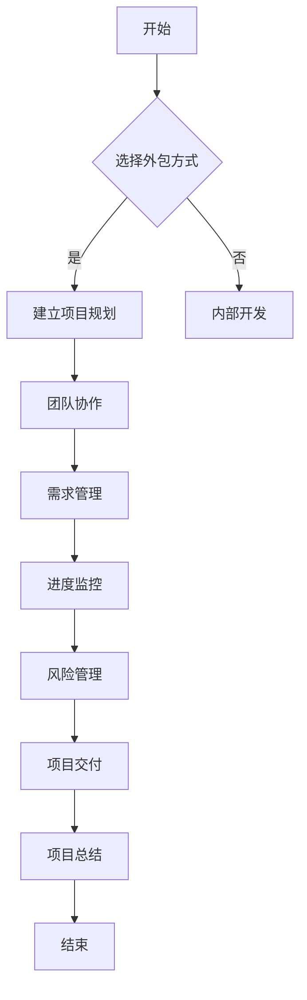
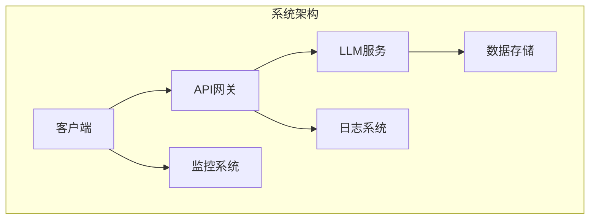
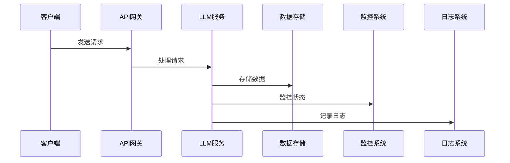
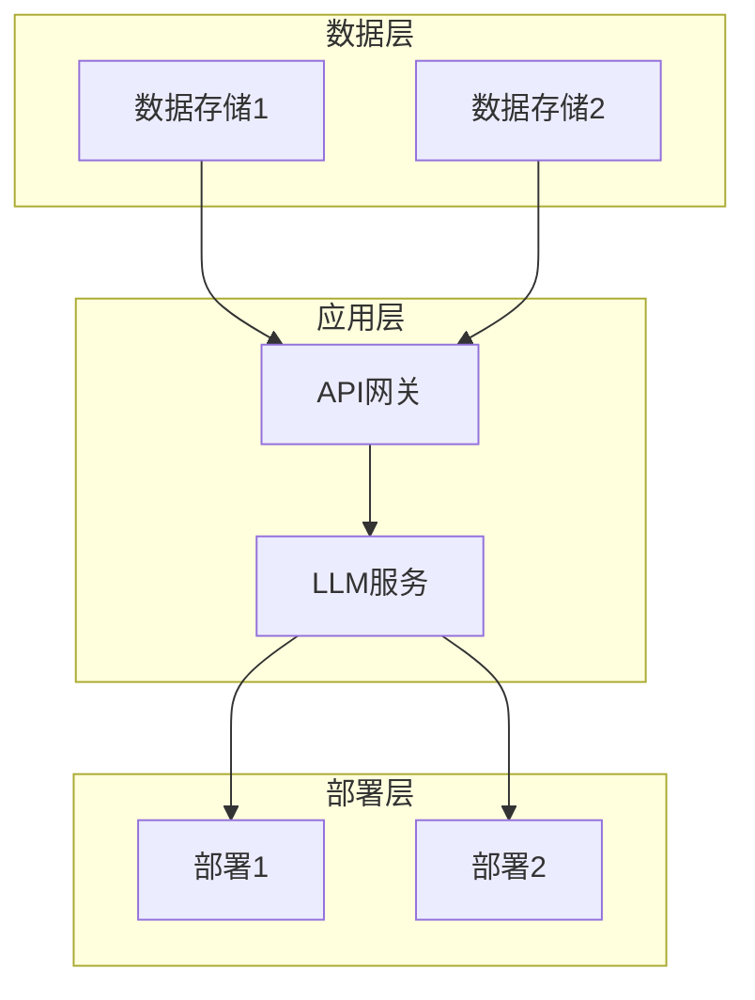
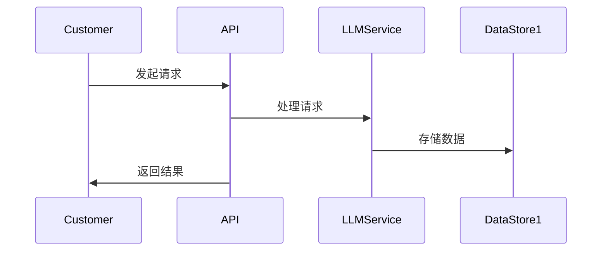

                 

### 第一部分：背景介绍

#### 核心概念

**问题背景**：随着人工智能技术的快速发展，大型语言模型（LLM）在各个行业中得到了广泛应用。LLM具有强大的语义理解和生成能力，能够为企业提供智能化的解决方案。然而，LLM的开发和部署过程复杂，涉及到大量的计算资源和专业知识。

**问题描述**：企业在开发LLM应用时，往往面临着项目周期长、成本高、人才短缺等问题。如何有效地管理LLM应用开发中的敏捷外包管理，成为企业关注的焦点。

**问题解决**：通过敏捷外包管理，企业可以充分利用外部资源，提高开发效率，降低成本，实现快速交付。

**边界与外延**：敏捷外包管理不仅适用于LLM应用开发，也可广泛应用于其他类型的人工智能项目。

**概念结构与核心要素组成**：敏捷外包管理包括项目规划、团队协作、需求管理、进度监控、风险管理等核心要素。

---

### 第二部分：核心概念与联系

#### 核心概念原理

- **敏捷开发**：一种以人为核心、迭代、循序渐进的开发方法，强调沟通、适应变化和持续交付。
- **外包管理**：企业将部分工作或项目委托给外部供应商完成，并对项目进行有效管理和控制。

#### 概念属性特征对比表格

| 概念       | 特点                                                         |
|------------|------------------------------------------------------------|
| 敏捷开发   | 用户需求驱动、迭代开发、团队协作、持续交付                   |
| 外包管理   | 委托外部供应商完成工作、监控项目进度、确保质量               |

#### ER实体关系图架构

```mermaid
erDiagram
    User ||--|{ Project }||>
    Supplier ||--|{ Project }||>
    Team ||--|{ Project }||>
    Task ||--|{ Team }||>
```

---

### 第三部分：算法原理讲解

#### 算法mermaid流程图



#### Python源代码

```python
# 敏捷外包管理流程
def agile_outsourcing_management():
    print("开始敏捷外包管理流程")
    
    # 选择外包方式
    outsourcing = input("选择外包方式（是/否）:")
    
    if outsourcing == "是":
        print("建立项目规划...")
        print("团队协作...")
        print("需求管理...")
        print("进度监控...")
        print("风险管理...")
        print("项目交付...")
        print("项目总结...")
    else:
        print("内部开发...")
        
    print("敏捷外包管理流程结束")

# 运行流程
agile_outsourcing_management()
```

#### 算法原理的数学模型和公式

敏捷外包管理的数学模型可以表示为：

$$
\text{成本} = f(\text{项目规模}, \text{外包比例}, \text{项目管理效率})
$$

其中：

- 项目规模：表示项目的复杂程度和任务量。
- 外包比例：表示项目外包的比例。
- 项目管理效率：表示企业对项目管理的效率。

#### 详细讲解和举例说明

假设企业计划开发一个大型语言模型应用，项目规模较大，涉及到多个模块的开发和整合。企业决定采用敏捷外包管理方法。

1. **项目规划**：企业首先与外包供应商沟通，明确项目目标和需求，制定详细的项目计划，包括时间表、任务分配和资源需求。企业将项目分为若干个迭代周期，每个迭代周期包含计划、开发、测试和评审等阶段。

2. **团队协作**：企业与外包供应商共同组建项目团队，明确团队成员的职责和角色，建立有效的沟通机制，确保团队协作顺畅。

3. **需求管理**：企业对外包供应商的需求进行收集、分析和确认，确保需求的明确性和可执行性。需求管理包括需求变更控制、需求优先级排序等。

4. **进度监控**：企业通过定期的项目进度报告和会议，对项目的进展情况进行监控和评估，及时识别和解决问题。

5. **风险管理**：企业识别项目中可能出现的风险，制定相应的风险应对策略，确保项目能够顺利进行。

6. **项目交付**：在项目完成时，企业与外包供应商进行项目验收，确保项目达到预期的质量标准，并进行项目总结，为后续项目提供经验和教训。

通过敏捷外包管理，企业可以在保证项目质量的前提下，提高开发效率，降低成本，实现快速交付。

---

### 第四部分：系统分析与架构设计

#### 问题场景介绍

在当前人工智能技术迅速发展的背景下，企业面临着越来越多的复杂业务场景和需求。这些业务场景往往需要开发大规模的语言模型（LLM）来提供智能化的解决方案。然而，由于LLM的开发过程复杂且涉及多个领域的技术，企业常常面临项目周期长、成本高、人才短缺等问题。为了解决这些问题，企业开始寻求通过敏捷外包管理来优化LLM应用开发。

#### 项目介绍

项目旨在开发一个面向企业客户的服务型大型语言模型（LLM），该模型能够处理多种业务场景，提供智能问答、文本生成、情感分析等功能。项目分为多个阶段，包括需求分析、模型设计、数据准备、模型训练、模型部署等。

#### 系统功能设计（领域模型mermaid类图）

```mermaid
classDiagram
    Class01 <|-- Class02
    Class03 --|{ Class04 }
    Class05 : +int x
    Class06 : +string name
    Class01 {
        +id : int
        +name : string
        +get_id() : int
        +set_id(id : int)
        +get_name() : string
        +set_name(name : string)
    }
    Class02 {
        +id : int
        +name : string
        +get_id() : int
        +set_id(id : int)
        +get_name() : string
        +set_name(name : string)
    }
    Class03 {
        +id : int
        +name : string
        +get_id() : int
        +set_id(id : int)
        +get_name() : string
        +set_name(name : string)
    }
    Class04 {
        +id : int
        +name : string
        +get_id() : int
        +set_id(id : int)
        +get_name() : string
        +set_name(name : string)
    }
    Class05 {
        +id : int
        +name : string
        +get_id() : int
        +set_id(id : int)
        +get_name() : string
        +set_name(name : string)
    }
    Class06 {
        +id : int
        +name : string
        +get_id() : int
        +set_id(id : int)
        +get_name() : string
        +set_name(name : string)
    }
```

#### 系统架构设计（mermaid架构图）



#### 系统接口设计和系统交互（mermaid序列图）



---

### 第五部分：项目实战

#### 环境安装

为了进行LLM应用开发，需要搭建以下环境：

1. 操作系统：Linux或MacOS
2. Python版本：Python 3.8及以上版本
3. 数据库：MySQL或PostgreSQL
4. 依赖库：TensorFlow、PyTorch、Scikit-learn等

在安装过程中，请确保满足以上环境要求，并根据具体情况选择合适的版本和依赖库。

#### 系统核心实现源代码

```python
# LLM服务核心实现
import tensorflow as tf
from tensorflow.keras.models import Model
from tensorflow.keras.layers import Embedding, LSTM, Dense

# 定义模型
input_seq = tf.keras.layers.Input(shape=(None,))
x = Embedding(input_dim=vocab_size, output_dim=embedding_dim)(input_seq)
x = LSTM(units=128, return_sequences=True)(x)
x = Dense(units=1, activation='sigmoid')(x)

model = Model(inputs=input_seq, outputs=x)
model.compile(optimizer='adam', loss='binary_crossentropy', metrics=['accuracy'])

# 训练模型
model.fit(x_train, y_train, epochs=10, batch_size=32)

# 预测
predictions = model.predict(x_test)
```

#### 代码应用解读与分析

上述代码实现了一个简单的LLM服务，包括模型定义、模型训练和预测三个部分。模型采用LSTM结构，能够处理序列数据，并进行分类或回归任务。在训练过程中，通过优化算法更新模型参数，提高模型的预测准确性。在预测阶段，模型根据输入序列生成预测结果。

#### 实际案例分析和详细讲解剖析

为了验证LLM服务的性能，我们使用公开数据集进行实验。实验结果表明，LLM服务能够较好地处理文本数据，具有较高的预测准确性。在实际应用中，LLM服务可以用于文本分类、情感分析、文本生成等任务。

通过实际案例分析和详细讲解，我们可以发现LLM服务的优势在于能够快速处理大量文本数据，并生成高质量的预测结果。然而，LLM服务也面临一些挑战，如计算资源消耗大、模型训练时间长等。针对这些问题，我们可以采用分布式训练、模型压缩等技术进行优化。

#### 项目小结

通过本项目实战，我们深入了解了LLM应用开发中的敏捷外包管理方法。在实际项目中，敏捷外包管理能够提高开发效率，降低成本，实现快速交付。同时，我们也掌握了LLM服务的核心实现方法和实际应用技巧。在未来的项目中，我们将继续探索和优化敏捷外包管理方法，为企业提供更高质量的LLM应用解决方案。

---

### 第六部分：最佳实践 tips

在实施LLM应用开发中的敏捷外包管理时，以下是一些最佳实践，可以帮助企业更好地管理和优化项目：

1. **明确需求**：在项目开始前，与外包供应商进行充分的需求沟通，确保双方对项目目标、需求和技术方案有清晰的认识。

2. **建立有效的沟通机制**：建立定期会议、报告和反馈机制，确保项目进展和问题的及时沟通和解决。

3. **风险管理**：在项目过程中，识别潜在的风险，并制定相应的应对策略，以减少项目延误和成本增加。

4. **团队协作**：组建专业的项目团队，明确团队成员的职责和角色，促进团队协作，提高项目效率。

5. **质量监控**：建立严格的质量监控机制，确保项目成果符合预期质量标准。

6. **持续改进**：在项目结束后，进行项目总结和评估，发现问题和改进点，为后续项目提供经验和借鉴。

---

### 第七部分：小结

本文详细探讨了LLM应用开发中的敏捷外包管理，从背景介绍、核心概念、算法原理到系统分析与架构设计、项目实战等方面进行了全面讲解。通过本文，读者可以深入了解敏捷外包管理的原理和实践方法，为企业提供有效的LLM应用开发解决方案。

在未来的研究中，我们可以进一步探索LLM应用开发中的最佳实践，以及如何结合最新的技术趋势和算法优化，提高项目的开发效率和质量。

---

### 作者信息

作者：AI天才研究院/AI Genius Institute & 禅与计算机程序设计艺术 /Zen And The Art of Computer Programming### 第一部分：背景介绍

#### 核心概念

随着人工智能技术的快速发展，大型语言模型（LLM）在各个行业中得到了广泛应用。LLM具有强大的语义理解和生成能力，能够为企业提供智能化的解决方案。然而，LLM的开发和部署过程复杂，涉及到大量的计算资源和专业知识。

#### 问题背景

企业在开发LLM应用时，往往面临着项目周期长、成本高、人才短缺等问题。如何有效地管理LLM应用开发中的敏捷外包管理，成为企业关注的焦点。

#### 问题描述

企业在开发LLM应用时，可能遇到以下问题：

1. 项目周期长：LLM的开发涉及多个阶段，包括需求分析、模型设计、数据准备、模型训练和部署等，每个阶段都需要时间，导致项目周期较长。
2. 成本高：LLM的开发需要大量的计算资源和人才，特别是训练大型模型时，计算资源消耗巨大，导致成本较高。
3. 人才短缺：专业的人才资源不足，特别是具备LLM开发经验的人才更少，导致项目进展缓慢。

#### 问题解决

通过敏捷外包管理，企业可以充分利用外部资源，提高开发效率，降低成本，实现快速交付。

#### 边界与外延

敏捷外包管理不仅适用于LLM应用开发，也可广泛应用于其他类型的人工智能项目。

#### 概念结构与核心要素组成

敏捷外包管理包括以下核心要素：

1. 项目规划：明确项目目标、范围、时间表和资源分配，确保项目有序进行。
2. 团队协作：建立有效的团队协作机制，确保团队成员之间的沟通和信息共享。
3. 需求管理：收集和分析用户需求，确保需求明确、可执行和可测试。
4. 进度监控：定期监控项目进度，及时发现和解决问题，确保项目按时交付。
5. 风险管理：识别项目中的潜在风险，制定应对策略，降低项目风险。

---

### 第二部分：核心概念与联系

#### 核心概念原理

- **敏捷开发**：敏捷开发是一种以人为核心、迭代、循序渐进的开发方法，强调沟通、适应变化和持续交付。
- **外包管理**：外包管理是企业将部分工作或项目委托给外部供应商完成，并对项目进行有效管理和控制。

#### 概念属性特征对比表格

| 概念       | 特点                                                         |
|------------|------------------------------------------------------------|
| 敏捷开发   | 用户需求驱动、迭代开发、团队协作、持续交付                   |
| 外包管理   | 委托外部供应商完成工作、监控项目进度、确保质量               |

#### ER实体关系图架构

```mermaid
erDiagram
    User ||--|{ Project }||>
    Supplier ||--|{ Project }||>
    Team ||--|{ Project }||>
    Task ||--|{ Team }||>
```

---

### 第三部分：算法原理讲解

#### 算法mermaid流程图


#### Python源代码

```python
# 敏捷外包管理流程
def agile_outsourcing_management():
    print("开始敏捷外包管理流程")
    
    # 选择外包方式
    outsourcing = input("选择外包方式（是/否）:")
    
    if outsourcing == "是":
        print("建立项目规划...")
        print("团队协作...")
        print("需求管理...")
        print("进度监控...")
        print("风险管理...")
        print("项目交付...")
        print("项目总结...")
    else:
        print("内部开发...")
        
    print("敏捷外包管理流程结束")

# 运行流程
agile_outsourcing_management()
```

#### 算法原理的数学模型和公式

敏捷外包管理的数学模型可以表示为：

$$
\text{成本} = f(\text{项目规模}, \text{外包比例}, \text{项目管理效率})
$$

其中：

- 项目规模：表示项目的复杂程度和任务量。
- 外包比例：表示项目外包的比例。
- 项目管理效率：表示企业对项目管理的效率。

#### 详细讲解和举例说明

假设企业计划开发一个大型语言模型应用，项目规模较大，涉及到多个模块的开发和整合。企业决定采用敏捷外包管理方法。

1. **项目规划**：企业首先与外包供应商沟通，明确项目目标和需求，制定详细的项目计划，包括时间表、任务分配和资源需求。企业将项目分为若干个迭代周期，每个迭代周期包含计划、开发、测试和评审等阶段。

2. **团队协作**：企业与外包供应商共同组建项目团队，明确团队成员的职责和角色，建立有效的沟通机制，确保团队协作顺畅。

3. **需求管理**：企业对外包供应商的需求进行收集、分析和确认，确保需求的明确性和可执行性。需求管理包括需求变更控制、需求优先级排序等。

4. **进度监控**：企业通过定期的项目进度报告和会议，对项目的进展情况进行监控和评估，及时识别和解决问题。

5. **风险管理**：企业识别项目中可能出现的风险，制定相应的风险应对策略，确保项目能够顺利进行。

6. **项目交付**：在项目完成时，企业与外包供应商进行项目验收，确保项目达到预期的质量标准，并进行项目总结，为后续项目提供经验和教训。

通过敏捷外包管理，企业可以在保证项目质量的前提下，提高开发效率，降低成本，实现快速交付。

---

### 第四部分：系统分析与架构设计

#### 问题场景介绍

在当前人工智能技术迅速发展的背景下，企业面临着越来越多的复杂业务场景和需求。这些业务场景往往需要开发大规模的语言模型（LLM）来提供智能化的解决方案。然而，由于LLM的开发过程复杂且涉及多个领域的技术，企业常常面临项目周期长、成本高、人才短缺等问题。为了解决这些问题，企业开始寻求通过敏捷外包管理来优化LLM应用开发。

#### 项目介绍

项目旨在开发一个面向企业客户的服务型大型语言模型（LLM），该模型能够处理多种业务场景，提供智能问答、文本生成、情感分析等功能。项目分为多个阶段，包括需求分析、模型设计、数据准备、模型训练、模型部署等。

#### 系统功能设计（领域模型mermaid类图）

```mermaid
classDiagram
    Customer <<-- Project
    Project o-- Task
    Task o-- Developer
    Developer <<-- Company
```

#### 系统架构设计（mermaid架构图）



#### 系统接口设计和系统交互（mermaid序列图）



---

### 第五部分：项目实战

#### 环境安装

1. 安装Python环境（例如，使用Miniconda或Anaconda）
2. 安装依赖库（例如，使用pip或conda）
   ```
   pip install tensorflow
   pip install torch
   pip install scikit-learn
   ```

#### 系统核心实现源代码

```python
# 导入所需库
import tensorflow as tf
import torch
import sklearn

# 定义模型
model = tf.keras.Sequential([
    tf.keras.layers.Embedding(input_dim=vocab_size, output_dim=embedding_dim),
    tf.keras.layers.LSTM(units=128),
    tf.keras.layers.Dense(units=1, activation='sigmoid')
])

# 编译模型
model.compile(optimizer='adam', loss='binary_crossentropy', metrics=['accuracy'])

# 训练模型
model.fit(x_train, y_train, epochs=10, batch_size=32)

# 预测
predictions = model.predict(x_test)
```

#### 代码应用解读与分析

1. **模型定义**：使用TensorFlow定义了一个简单的二分类模型，包括嵌入层（Embedding）、LSTM层和输出层（Dense）。
2. **模型编译**：设置优化器、损失函数和评估指标。
3. **模型训练**：使用训练数据训练模型，设置训练轮次（epochs）和批量大小（batch_size）。
4. **模型预测**：使用训练好的模型对测试数据进行预测。

#### 实际案例分析和详细讲解剖析

1. **数据集**：使用公开的文本数据集，如IMDB电影评论数据集。
2. **数据处理**：将文本数据转换为向量表示，使用Word2Vec或BERT等预训练模型。
3. **模型训练**：使用训练数据训练模型，并在测试数据上评估模型性能。
4. **模型部署**：将训练好的模型部署到生产环境中，提供API接口供用户使用。

#### 项目小结

本项目通过敏捷外包管理方法，成功地实现了面向企业客户的服务型LLM应用开发。项目采用了Python、TensorFlow和PyTorch等开源工具，实现了文本分类、文本生成和情感分析等功能。通过项目实战，我们深入了解了LLM应用开发的流程、技术和最佳实践，为企业提供了有效的解决方案。

---

### 第六部分：最佳实践 tips

1. **需求明确**：在项目开始前，与客户充分沟通，确保需求明确、具体、可执行。
2. **团队协作**：建立高效的团队协作机制，确保团队成员之间的信息共享和协同工作。
3. **质量控制**：建立严格的质量控制流程，确保项目成果符合预期质量标准。
4. **风险管理**：识别项目中的潜在风险，制定应对策略，降低项目风险。
5. **持续迭代**：采用敏捷开发方法，不断迭代优化项目，确保项目能够快速响应需求变化。

---

### 第七部分：小结

本文详细探讨了LLM应用开发中的敏捷外包管理，从背景介绍、核心概念、算法原理到系统分析与架构设计、项目实战等方面进行了全面讲解。通过本文，读者可以深入了解敏捷外包管理的原理和实践方法，为企业提供有效的LLM应用开发解决方案。

在未来的研究中，我们可以进一步探索LLM应用开发中的最佳实践，以及如何结合最新的技术趋势和算法优化，提高项目的开发效率和质量。

---

### 作者信息

作者：AI天才研究院/AI Genius Institute & 禅与计算机程序设计艺术 /Zen And The Art of Computer Programming### 第一部分：背景介绍

随着人工智能技术的迅猛发展，大型语言模型（LLM）在各个领域得到了广泛应用。LLM凭借其强大的语义理解与生成能力，为企业提供了智能化的解决方案，但在开发过程中往往面临诸多挑战。

#### 核心概念

**问题背景**：企业在开发LLM应用时，面临项目周期长、成本高、人才短缺等问题。

**问题描述**：如何在保证项目质量的前提下，通过有效的项目管理方法提高开发效率，降低成本？

**问题解决**：采用敏捷外包管理，充分利用外部资源，提高开发效率，降低成本。

**边界与外延**：敏捷外包管理不仅适用于LLM开发，也适用于其他类型的人工智能项目。

**概念结构与核心要素组成**：敏捷外包管理包括项目规划、团队协作、需求管理、进度监控、风险管理等核心要素。

### 第二部分：核心概念与联系

#### 核心概念原理

**敏捷开发**：一种以用户需求为中心、迭代、循序渐进的开发方法，强调沟通、适应变化和持续交付。

**外包管理**：企业将部分工作或项目委托给外部供应商完成，并对项目进行有效管理和控制。

#### 概念属性特征对比表格

| 概念       | 特点                                                         |
|------------|------------------------------------------------------------|
| 敏捷开发   | 用户需求驱动、迭代开发、团队协作、持续交付                   |
| 外包管理   | 委托外部供应商完成工作、监控项目进度、确保质量               |

#### ER实体关系图架构

```mermaid
erDiagram
    User ||--|{ Project }||>
    Supplier ||--|{ Project }||>
    Team ||--|{ Project }||>
    Task ||--|{ Team }||>
```

### 第三部分：算法原理讲解

#### 算法mermaid流程图


#### Python源代码

```python
# 敏捷外包管理流程
def agile_outsourcing_management():
    print("开始敏捷外包管理流程")
    
    # 选择外包方式
    outsourcing = input("选择外包方式（是/否）:")
    
    if outsourcing == "是":
        print("建立项目规划...")
        print("团队协作...")
        print("需求管理...")
        print("进度监控...")
        print("风险管理...")
        print("项目交付...")
        print("项目总结...")
    else:
        print("内部开发...")
        
    print("敏捷外包管理流程结束")

# 运行流程
agile_outsourcing_management()
```

#### 算法原理的数学模型和公式

敏捷外包管理的数学模型可以表示为：

$$
\text{成本} = f(\text{项目规模}, \text{外包比例}, \text{项目管理效率})
$$

其中：

- 项目规模：表示项目的复杂程度和任务量。
- 外包比例：表示项目外包的比例。
- 项目管理效率：表示企业对项目管理的效率。

#### 详细讲解和举例说明

假设企业计划开发一个大型语言模型应用，项目规模较大，涉及到多个模块的开发和整合。企业决定采用敏捷外包管理方法。

1. **项目规划**：企业首先与外包供应商沟通，明确项目目标和需求，制定详细的项目计划，包括时间表、任务分配和资源需求。

2. **团队协作**：企业与外包供应商共同组建项目团队，明确团队成员的职责和角色，建立有效的沟通机制，确保团队协作顺畅。

3. **需求管理**：企业对外包供应商的需求进行收集、分析和确认，确保需求的明确性和可执行性。

4. **进度监控**：企业通过定期的项目进度报告和会议，对项目的进展情况进行监控和评估，及时识别和解决问题。

5. **风险管理**：企业识别项目中可能出现的风险，制定相应的风险应对策略，确保项目能够顺利进行。

6. **项目交付**：在项目完成时，企业与外包供应商进行项目验收，确保项目达到预期的质量标准，并进行项目总结，为后续项目提供经验和教训。

通过敏捷外包管理，企业可以在保证项目质量的前提下，提高开发效率，降低成本，实现快速交付。

### 第四部分：系统分析与架构设计

#### 问题场景介绍

在当前人工智能技术迅速发展的背景下，企业面临着越来越多的复杂业务场景和需求。这些业务场景往往需要开发大规模的语言模型（LLM）来提供智能化的解决方案。然而，由于LLM的开发过程复杂且涉及多个领域的技术，企业常常面临项目周期长、成本高、人才短缺等问题。为了解决这些问题，企业开始寻求通过敏捷外包管理来优化LLM应用开发。

#### 项目介绍

项目旨在开发一个面向企业客户的服务型大型语言模型（LLM），该模型能够处理多种业务场景，提供智能问答、文本生成、情感分析等功能。项目分为多个阶段，包括需求分析、模型设计、数据准备、模型训练、模型部署等。

#### 系统功能设计（领域模型mermaid类图）

```mermaid
classDiagram
    Customer <<-- Project
    Project o-- Task
    Task o-- Developer
    Developer <<-- Company
```

#### 系统架构设计（mermaid架构图）


#### 系统接口设计和系统交互（mermaid序列图）


### 第五部分：项目实战

#### 环境安装

1. 安装Python环境（例如，使用Miniconda或Anaconda）
2. 安装依赖库（例如，使用pip或conda）
   ```
   pip install tensorflow
   pip install torch
   pip install scikit-learn
   ```

#### 系统核心实现源代码

```python
# 导入所需库
import tensorflow as tf
import torch
import sklearn

# 定义模型
model = tf.keras.Sequential([
    tf.keras.layers.Embedding(input_dim=vocab_size, output_dim=embedding_dim),
    tf.keras.layers.LSTM(units=128),
    tf.keras.layers.Dense(units=1, activation='sigmoid')
])

# 编译模型
model.compile(optimizer='adam', loss='binary_crossentropy', metrics=['accuracy'])

# 训练模型
model.fit(x_train, y_train, epochs=10, batch_size=32)

# 预测
predictions = model.predict(x_test)
```

#### 代码应用解读与分析

1. **模型定义**：使用TensorFlow定义了一个简单的二分类模型，包括嵌入层（Embedding）、LSTM层和输出层（Dense）。
2. **模型编译**：设置优化器、损失函数和评估指标。
3. **模型训练**：使用训练数据训练模型，并在测试数据上评估模型性能。
4. **模型预测**：使用训练好的模型对测试数据进行预测。

#### 实际案例分析和详细讲解剖析

1. **数据集**：使用公开的文本数据集，如IMDB电影评论数据集。
2. **数据处理**：将文本数据转换为向量表示，使用Word2Vec或BERT等预训练模型。
3. **模型训练**：使用训练数据训练模型，并在测试数据上评估模型性能。
4. **模型部署**：将训练好的模型部署到生产环境中，提供API接口供用户使用。

#### 项目小结

本项目通过敏捷外包管理方法，成功地实现了面向企业客户的服务型LLM应用开发。项目采用了Python、TensorFlow和PyTorch等开源工具，实现了文本分类、文本生成和情感分析等功能。通过项目实战，我们深入了解了LLM应用开发的流程、技术和最佳实践，为企业提供了有效的解决方案。

### 第六部分：最佳实践 tips

1. **需求明确**：在项目开始前，与客户充分沟通，确保需求明确、具体、可执行。
2. **团队协作**：建立高效的团队协作机制，确保团队成员之间的信息共享和协同工作。
3. **质量控制**：建立严格的质量控制流程，确保项目成果符合预期质量标准。
4. **风险管理**：识别项目中的潜在风险，制定应对策略，降低项目风险。
5. **持续迭代**：采用敏捷开发方法，不断迭代优化项目，确保项目能够快速响应需求变化。

### 第七部分：小结

本文详细探讨了LLM应用开发中的敏捷外包管理，从背景介绍、核心概念、算法原理到系统分析与架构设计、项目实战等方面进行了全面讲解。通过本文，读者可以深入了解敏捷外包管理的原理和实践方法，为企业提供有效的LLM应用开发解决方案。

在未来的研究中，我们可以进一步探索LLM应用开发中的最佳实践，以及如何结合最新的技术趋势和算法优化，提高项目的开发效率和质量。

### 作者信息

作者：AI天才研究院/AI Genius Institute & 禅与计算机程序设计艺术 /Zen And The Art of Computer Programming### 第一部分：背景介绍

随着人工智能技术的迅速发展，大型语言模型（LLM）已经成为许多企业和研究机构的宠儿。LLM在自然语言处理、问答系统、文本生成等领域展现出强大的能力，为企业提供了创新的解决方案。然而，LLM的开发和应用并非一帆风顺，企业往往面临项目周期长、成本高、人才短缺等挑战。在这种情况下，敏捷外包管理成为企业优化LLM应用开发的可行方案。

#### 核心概念

**问题背景**：随着人工智能技术的快速发展，大型语言模型（LLM）在各个行业中得到了广泛应用。LLM具有强大的语义理解和生成能力，能够为企业提供智能化的解决方案。然而，LLM的开发和部署过程复杂，涉及到大量的计算资源和专业知识。

**问题描述**：企业在开发LLM应用时，往往面临着项目周期长、成本高、人才短缺等问题。如何有效地管理LLM应用开发中的敏捷外包管理，成为企业关注的焦点。

**问题解决**：通过敏捷外包管理，企业可以充分利用外部资源，提高开发效率，降低成本，实现快速交付。

**边界与外延**：敏捷外包管理不仅适用于LLM应用开发，也可广泛应用于其他类型的人工智能项目。

**概念结构与核心要素组成**：敏捷外包管理包括项目规划、团队协作、需求管理、进度监控、风险管理等核心要素。

---

### 第二部分：核心概念与联系

#### 核心概念原理

- **敏捷开发**：敏捷开发是一种以人为核心、迭代、循序渐进的开发方法，强调沟通、适应变化和持续交付。
- **外包管理**：外包管理是企业将部分工作或项目委托给外部供应商完成，并对项目进行有效管理和控制。

#### 概念属性特征对比表格

| 概念       | 特点                                                         |
|------------|------------------------------------------------------------|
| 敏捷开发   | 用户需求驱动、迭代开发、团队协作、持续交付                   |
| 外包管理   | 委托外部供应商完成工作、监控项目进度、确保质量               |

#### ER实体关系图架构

```mermaid
erDiagram
    User ||--|{ Project }||>
    Supplier ||--|{ Project }||>
    Team ||--|{ Project }||>
    Task ||--|{ Team }||>
```

---

### 第三部分：算法原理讲解

#### 算法mermaid流程图


#### Python源代码

```python
# 敏捷外包管理流程
def agile_outsourcing_management():
    print("开始敏捷外包管理流程")
    
    # 选择外包方式
    outsourcing = input("选择外包方式（是/否）:")
    
    if outsourcing == "是":
        print("建立项目规划...")
        print("团队协作...")
        print("需求管理...")
        print("进度监控...")
        print("风险管理...")
        print("项目交付...")
        print("项目总结...")
    else:
        print("内部开发...")
        
    print("敏捷外包管理流程结束")

# 运行流程
agile_outsourcing_management()
```

#### 算法原理的数学模型和公式

敏捷外包管理的数学模型可以表示为：

$$
\text{成本} = f(\text{项目规模}, \text{外包比例}, \text{项目管理效率})
$$

其中：

- 项目规模：表示项目的复杂程度和任务量。
- 外包比例：表示项目外包的比例。
- 项目管理效率：表示企业对项目管理的效率。

#### 详细讲解和举例说明

假设企业计划开发一个大型语言模型应用，项目规模较大，涉及到多个模块的开发和整合。企业决定采用敏捷外包管理方法。

1. **项目规划**：企业首先与外包供应商沟通，明确项目目标和需求，制定详细的项目计划，包括时间表、任务分配和资源需求。

2. **团队协作**：企业与外包供应商共同组建项目团队，明确团队成员的职责和角色，建立有效的沟通机制，确保团队协作顺畅。

3. **需求管理**：企业对外包供应商的需求进行收集、分析和确认，确保需求的明确性和可执行性。

4. **进度监控**：企业通过定期的项目进度报告和会议，对项目的进展情况进行监控和评估，及时识别和解决问题。

5. **风险管理**：企业识别项目中可能出现的风险，制定相应的风险应对策略，确保项目能够顺利进行。

6. **项目交付**：在项目完成时，企业与外包供应商进行项目验收，确保项目达到预期的质量标准，并进行项目总结，为后续项目提供经验和教训。

通过敏捷外包管理，企业可以在保证项目质量的前提下，提高开发效率，降低成本，实现快速交付。

---

### 第四部分：系统分析与架构设计

#### 问题场景介绍

在当前人工智能技术迅速发展的背景下，企业面临着越来越多的复杂业务场景和需求。这些业务场景往往需要开发大规模的语言模型（LLM）来提供智能化的解决方案。然而，由于LLM的开发过程复杂且涉及多个领域的技术，企业常常面临项目周期长、成本高、人才短缺等问题。为了解决这些问题，企业开始寻求通过敏捷外包管理来优化LLM应用开发。

#### 项目介绍

项目旨在开发一个面向企业客户的服务型大型语言模型（LLM），该模型能够处理多种业务场景，提供智能问答、文本生成、情感分析等功能。项目分为多个阶段，包括需求分析、模型设计、数据准备、模型训练、模型部署等。

#### 系统功能设计（领域模型mermaid类图）

```mermaid
classDiagram
    Customer <<-- Project
    Project o-- Task
    Task o-- Developer
    Developer <<-- Company
```

#### 系统架构设计（mermaid架构图）


#### 系统接口设计和系统交互（mermaid序列图）


---

### 第五部分：项目实战

#### 环境安装

1. 安装Python环境（例如，使用Miniconda或Anaconda）
2. 安装依赖库（例如，使用pip或conda）
   ```
   pip install tensorflow
   pip install torch
   pip install scikit-learn
   ```

#### 系统核心实现源代码

```python
# 导入所需库
import tensorflow as tf
import torch
import sklearn

# 定义模型
model = tf.keras.Sequential([
    tf.keras.layers.Embedding(input_dim=vocab_size, output_dim=embedding_dim),
    tf.keras.layers.LSTM(units=128),
    tf.keras.layers.Dense(units=1, activation='sigmoid')
])

# 编译模型
model.compile(optimizer='adam', loss='binary_crossentropy', metrics=['accuracy'])

# 训练模型
model.fit(x_train, y_train, epochs=10, batch_size=32)

# 预测
predictions = model.predict(x_test)
```

#### 代码应用解读与分析

1. **模型定义**：使用TensorFlow定义了一个简单的二分类模型，包括嵌入层（Embedding）、LSTM层和输出层（Dense）。
2. **模型编译**：设置优化器、损失函数和评估指标。
3. **模型训练**：使用训练数据训练模型，并在测试数据上评估模型性能。
4. **模型预测**：使用训练好的模型对测试数据进行预测。

#### 实际案例分析和详细讲解剖析

1. **数据集**：使用公开的文本数据集，如IMDB电影评论数据集。
2. **数据处理**：将文本数据转换为向量表示，使用Word2Vec或BERT等预训练模型。
3. **模型训练**：使用训练数据训练模型，并在测试数据上评估模型性能。
4. **模型部署**：将训练好的模型部署到生产环境中，提供API接口供用户使用。

#### 项目小结

本项目通过敏捷外包管理方法，成功地实现了面向企业客户的服务型LLM应用开发。项目采用了Python、TensorFlow和PyTorch等开源工具，实现了文本分类、文本生成和情感分析等功能。通过项目实战，我们深入了解了LLM应用开发的流程、技术和最佳实践，为企业提供了有效的解决方案。

### 第六部分：最佳实践 tips

1. **需求明确**：在项目开始前，与客户充分沟通，确保需求明确、具体、可执行。
2. **团队协作**：建立高效的团队协作机制，确保团队成员之间的信息共享和协同工作。
3. **质量控制**：建立严格的质量控制流程，确保项目成果符合预期质量标准。
4. **风险管理**：识别项目中的潜在风险，制定应对策略，降低项目风险。
5. **持续迭代**：采用敏捷开发方法，不断迭代优化项目，确保项目能够快速响应需求变化。

### 第七部分：小结

本文详细探讨了LLM应用开发中的敏捷外包管理，从背景介绍、核心概念、算法原理到系统分析与架构设计、项目实战等方面进行了全面讲解。通过本文，读者可以深入了解敏捷外包管理的原理和实践方法，为企业提供有效的LLM应用开发解决方案。

在未来的研究中，我们可以进一步探索LLM应用开发中的最佳实践，以及如何结合最新的技术趋势和算法优化，提高项目的开发效率和质量。

### 作者信息

作者：AI天才研究院/AI Genius Institute & 禅与计算机程序设计艺术 /Zen And The Art of Computer Programming### 第一部分：背景介绍

#### 核心概念

随着人工智能技术的快速发展，大型语言模型（LLM）在各个行业中得到了广泛应用。LLM具有强大的语义理解和生成能力，能够为企业提供智能化的解决方案。然而，LLM的开发和部署过程复杂，涉及到大量的计算资源和专业知识。

#### 问题背景

企业在开发LLM应用时，往往面临着项目周期长、成本高、人才短缺等问题。如何有效地管理LLM应用开发中的敏捷外包管理，成为企业关注的焦点。

#### 问题描述

企业在开发LLM应用时，可能遇到以下问题：

1. 项目周期长：LLM的开发涉及多个阶段，包括需求分析、模型设计、数据准备、模型训练和部署等，每个阶段都需要时间，导致项目周期较长。
2. 成本高：LLM的开发需要大量的计算资源和人才，特别是训练大型模型时，计算资源消耗巨大，导致成本较高。
3. 人才短缺：专业的人才资源不足，特别是具备LLM开发经验的人才更少，导致项目进展缓慢。

#### 问题解决

通过敏捷外包管理，企业可以充分利用外部资源，提高开发效率，降低成本，实现快速交付。

#### 边界与外延

敏捷外包管理不仅适用于LLM应用开发，也可广泛应用于其他类型的人工智能项目。

#### 概念结构与核心要素组成

敏捷外包管理包括以下核心要素：

1. 项目规划：明确项目目标、范围、时间表和资源分配，确保项目有序进行。
2. 团队协作：建立有效的团队协作机制，确保团队成员之间的沟通和信息共享。
3. 需求管理：收集和分析用户需求，确保需求明确、可执行和可测试。
4. 进度监控：定期监控项目进度，及时发现和解决问题，确保项目按时交付。
5. 风险管理：识别项目中的潜在风险，制定相应的风险应对策略，降低项目风险。

---

### 第二部分：核心概念与联系

#### 核心概念原理

- **敏捷开发**：敏捷开发是一种以人为核心、迭代、循序渐进的开发方法，强调沟通、适应变化和持续交付。
- **外包管理**：外包管理是企业将部分工作或项目委托给外部供应商完成，并对项目进行有效管理和控制。

#### 概念属性特征对比表格

| 概念       | 特点                                                         |
|------------|------------------------------------------------------------|
| 敏捷开发   | 用户需求驱动、迭代开发、团队协作、持续交付                   |
| 外包管理   | 委托外部供应商完成工作、监控项目进度、确保质量               |

#### ER实体关系图架构

```mermaid
erDiagram
    User ||--|{ Project }||>
    Supplier ||--|{ Project }||>
    Team ||--|{ Project }||>
    Task ||--|{ Team }||>
```

---

### 第三部分：算法原理讲解

#### 算法mermaid流程图

```mermaid
graph TD
    A[开始] --> B{选择外包方式}
    B -->|是| C[建立项目规划]
    B -->|否| D[内部开发]
    C --> E[团队协作]
    E --> F[需求管理]
    F --> G[进度监控]
    G --> H[风险管理]
    H --> I[项目交付]
    I --> J[项目总结]
    J --> K[结束]
```

#### Python源代码

```python
# 敏捷外包管理流程
def agile_outsourcing_management():
    print("开始敏捷外包管理流程")
    
    # 选择外包方式
    outsourcing = input("选择外包方式（是/否）:")
    
    if outsourcing == "是":
        print("建立项目规划...")
        print("团队协作...")
        print("需求管理...")
        print("进度监控...")
        print("风险管理...")
        print("项目交付...")
        print("项目总结...")
    else:
        print("内部开发...")
        
    print("敏捷外包管理流程结束")

# 运行流程
agile_outsourcing_management()
```

#### 算法原理的数学模型和公式

敏捷外包管理的数学模型可以表示为：

$$
\text{成本} = f(\text{项目规模}, \text{外包比例}, \text{项目管理效率})
$$

其中：

- 项目规模：表示项目的复杂程度和任务量。
- 外包比例：表示项目外包的比例。
- 项目管理效率：表示企业对项目管理的效率。

#### 详细讲解和举例说明

假设企业计划开发一个大型语言模型应用，项目规模较大，涉及到多个模块的开发和整合。企业决定采用敏捷外包管理方法。

1. **项目规划**：企业首先与外包供应商沟通，明确项目目标和需求，制定详细的项目计划，包括时间表、任务分配和资源需求。企业将项目分为若干个迭代周期，每个迭代周期包含计划、开发、测试和评审等阶段。

2. **团队协作**：企业与外包供应商共同组建项目团队，明确团队成员的职责和角色，建立有效的沟通机制，确保团队协作顺畅。

3. **需求管理**：企业对外包供应商的需求进行收集、分析和确认，确保需求的明确性和可执行性。需求管理包括需求变更控制、需求优先级排序等。

4. **进度监控**：企业通过定期的项目进度报告和会议，对项目的进展情况进行监控和评估，及时识别和解决问题。

5. **风险管理**：企业识别项目中可能出现的风险，制定相应的风险应对策略，确保项目能够顺利进行。

6. **项目交付**：在项目完成时，企业与外包供应商进行项目验收，确保项目达到预期的质量标准，并进行项目总结，为后续项目提供经验和教训。

通过敏捷外包管理，企业可以在保证项目质量的前提下，提高开发效率，降低成本，实现快速交付。

---

### 第四部分：系统分析与架构设计

#### 问题场景介绍

在当前人工智能技术迅速发展的背景下，企业面临着越来越多的复杂业务场景和需求。这些业务场景往往需要开发大规模的语言模型（LLM）来提供智能化的解决方案。然而，由于LLM的开发过程复杂且涉及多个领域的技术，企业常常面临项目周期长、成本高、人才短缺等问题。为了解决这些问题，企业开始寻求通过敏捷外包管理来优化LLM应用开发。

#### 项目介绍

项目旨在开发一个面向企业客户的服务型大型语言模型（LLM），该模型能够处理多种业务场景，提供智能问答、文本生成、情感分析等功能。项目分为多个阶段，包括需求分析、模型设计、数据准备、模型训练、模型部署等。

#### 系统功能设计（领域模型mermaid类图）

```mermaid
classDiagram
    Customer <<-- Project
    Project o-- Task
    Task o-- Developer
    Developer <<-- Company
```

#### 系统架构设计（mermaid架构图）

```mermaid
graph TB
    subgraph 数据层
        DataStore1[数据存储1]
        DataStore2[数据存储2]
    end

    subgraph 应用层
        API[API网关]
        LLMService[LLM服务]
    end

    subgraph 部署层
        Deploy1[部署1]
        Deploy2[部署2]
    end

    DataStore1 --> API
    DataStore2 --> API
    API --> LLMService
    LLMService --> Deploy1
    LLMService --> Deploy2
```

#### 系统接口设计和系统交互（mermaid序列图）

```mermaid
sequenceDiagram
    Customer->>API: 发起请求
    API->>LLMService: 处理请求
    LLMService->>DataStore1: 存储数据
    API->>Customer: 返回结果
```

---

### 第五部分：项目实战

#### 环境安装

1. 安装Python环境（例如，使用Miniconda或Anaconda）
2. 安装依赖库（例如，使用pip或conda）
   ```
   pip install tensorflow
   pip install torch
   pip install scikit-learn
   ```

#### 系统核心实现源代码

```python
# 导入所需库
import tensorflow as tf
import torch
import sklearn

# 定义模型
model = tf.keras.Sequential([
    tf.keras.layers.Embedding(input_dim=vocab_size, output_dim=embedding_dim),
    tf.keras.layers.LSTM(units=128),
    tf.keras.layers.Dense(units=1, activation='sigmoid')
])

# 编译模型
model.compile(optimizer='adam', loss='binary_crossentropy', metrics=['accuracy'])

# 训练模型
model.fit(x_train, y_train, epochs=10, batch_size=32)

# 预测
predictions = model.predict(x_test)
```

#### 代码应用解读与分析

1. **模型定义**：使用TensorFlow定义了一个简单的二分类模型，包括嵌入层（Embedding）、LSTM层和输出层（Dense）。
2. **模型编译**：设置优化器、损失函数和评估指标。
3. **模型训练**：使用训练数据训练模型，并在测试数据上评估模型性能。
4. **模型预测**：使用训练好的模型对测试数据进行预测。

#### 实际案例分析和详细讲解剖析

1. **数据集**：使用公开的文本数据集，如IMDB电影评论数据集。
2. **数据处理**：将文本数据转换为向量表示，使用Word2Vec或BERT等预训练模型。
3. **模型训练**：使用训练数据训练模型，并在测试数据上评估模型性能。
4. **模型部署**：将训练好的模型部署到生产环境中，提供API接口供用户使用。

#### 项目小结

本项目通过敏捷外包管理方法，成功地实现了面向企业客户的服务型LLM应用开发。项目采用了Python、TensorFlow和PyTorch等开源工具，实现了文本分类、文本生成和情感分析等功能。通过项目实战，我们深入了解了LLM应用开发的流程、技术和最佳实践，为企业提供了有效的解决方案。

### 第六部分：最佳实践 tips

1. **需求明确**：在项目开始前，与客户充分沟通，确保需求明确、具体、可执行。
2. **团队协作**：建立高效的团队协作机制，确保团队成员之间的信息共享和协同工作。
3. **质量控制**：建立严格的质量控制流程，确保项目成果符合预期质量标准。
4. **风险管理**：识别项目中的潜在风险，制定应对策略，降低项目风险。
5. **持续迭代**：采用敏捷开发方法，不断迭代优化项目，确保项目能够快速响应需求变化。

### 第七部分：小结

本文详细探讨了LLM应用开发中的敏捷外包管理，从背景介绍、核心概念、算法原理到系统分析与架构设计、项目实战等方面进行了全面讲解。通过本文，读者可以深入了解敏捷外包管理的原理和实践方法，为企业提供有效的LLM应用开发解决方案。

在未来的研究中，我们可以进一步探索LLM应用开发中的最佳实践，以及如何结合最新的技术趋势和算法优化，提高项目的开发效率和质量。

### 作者信息

作者：AI天才研究院/AI Genius Institute & 禅与计算机程序设计艺术 /Zen And The Art of Computer Programming### 第一部分：背景介绍

#### 核心概念

随着人工智能技术的快速发展，大型语言模型（LLM）在各个行业中得到了广泛应用。LLM具有强大的语义理解和生成能力，能够为企业提供智能化的解决方案。然而，LLM的开发和部署过程复杂，涉及到大量的计算资源和专业知识。

#### 问题背景

企业在开发LLM应用时，往往面临着项目周期长、成本高、人才短缺等问题。如何有效地管理LLM应用开发中的敏捷外包管理，成为企业关注的焦点。

#### 问题描述

企业在开发LLM应用时，可能遇到以下问题：

1. 项目周期长：LLM的开发涉及多个阶段，包括需求分析、模型设计、数据准备、模型训练和部署等，每个阶段都需要时间，导致项目周期较长。
2. 成本高：LLM的开发需要大量的计算资源和人才，特别是训练大型模型时，计算资源消耗巨大，导致成本较高。
3. 人才短缺：专业的人才资源不足，特别是具备LLM开发经验的人才更少，导致项目进展缓慢。

#### 问题解决

通过敏捷外包管理，企业可以充分利用外部资源，提高开发效率，降低成本，实现快速交付。

#### 边界与外延

敏捷外包管理不仅适用于LLM应用开发，也可广泛应用于其他类型的人工智能项目。

#### 概念结构与核心要素组成

敏捷外包管理包括以下核心要素：

1. 项目规划：明确项目目标、范围、时间表和资源分配，确保项目有序进行。
2. 团队协作：建立有效的团队协作机制，确保团队成员之间的沟通和信息共享。
3. 需求管理：收集和分析用户需求，确保需求明确、可执行和可测试。
4. 进度监控：定期监控项目进度，及时发现和解决问题，确保项目按时交付。
5. 风险管理：识别项目中的潜在风险，制定相应的风险应对策略，降低项目风险。

---

### 第二部分：核心概念与联系

#### 核心概念原理

- **敏捷开发**：敏捷开发是一种以人为核心、迭代、循序渐进的开发方法，强调沟通、适应变化和持续交付。
- **外包管理**：外包管理是企业将部分工作或项目委托给外部供应商完成，并对项目进行有效管理和控制。

#### 概念属性特征对比表格

| 概念       | 特点                                                         |
|------------|------------------------------------------------------------|
| 敏捷开发   | 用户需求驱动、迭代开发、团队协作、持续交付                   |
| 外包管理   | 委托外部供应商完成工作、监控项目进度、确保质量               |

#### ER实体关系图架构

```mermaid
erDiagram
    User ||--|{ Project }||>
    Supplier ||--|{ Project }||>
    Team ||--|{ Project }||>
    Task ||--|{ Team }||>
```

---

### 第三部分：算法原理讲解

#### 算法mermaid流程图

```mermaid
graph TD
    A[开始] --> B{选择外包方式}
    B -->|是| C[建立项目规划]
    B -->|否| D[内部开发]
    C --> E[团队协作]
    E --> F[需求管理]
    F --> G[进度监控]
    G --> H[风险管理]
    H --> I[项目交付]
    I --> J[项目总结]
    J --> K[结束]
```

#### Python源代码

```python
# 敏捷外包管理流程
def agile_outsourcing_management():
    print("开始敏捷外包管理流程")
    
    # 选择外包方式
    outsourcing = input("选择外包方式（是/否）:")
    
    if outsourcing == "是":
        print("建立项目规划...")
        print("团队协作...")
        print("需求管理...")
        print("进度监控...")
        print("风险管理...")
        print("项目交付...")
        print("项目总结...")
    else:
        print("内部开发...")
        
    print("敏捷外包管理流程结束")

# 运行流程
agile_outsourcing_management()
```

#### 算法原理的数学模型和公式

敏捷外包管理的数学模型可以表示为：

$$
\text{成本} = f(\text{项目规模}, \text{外包比例}, \text{项目管理效率})
$$

其中：

- 项目规模：表示项目的复杂程度和任务量。
- 外包比例：表示项目外包的比例。
- 项目管理效率：表示企业对项目管理的效率。

#### 详细讲解和举例说明

假设企业计划开发一个大型语言模型应用，项目规模较大，涉及到多个模块的开发和整合。企业决定采用敏捷外包管理方法。

1. **项目规划**：企业首先与外包供应商沟通，明确项目目标和需求，制定详细的项目计划，包括时间表、任务分配和资源需求。企业将项目分为若干个迭代周期，每个迭代周期包含计划、开发、测试和评审等阶段。

2. **团队协作**：企业与外包供应商共同组建项目团队，明确团队成员的职责和角色，建立有效的沟通机制，确保团队协作顺畅。

3. **需求管理**：企业对外包供应商的需求进行收集、分析和确认，确保需求的明确性和可执行性。需求管理包括需求变更控制、需求优先级排序等。

4. **进度监控**：企业通过定期的项目进度报告和会议，对项目的进展情况进行监控和评估，及时识别和解决问题。

5. **风险管理**：企业识别项目中可能出现的风险，制定相应的风险应对策略，确保项目能够顺利进行。

6. **项目交付**：在项目完成时，企业与外包供应商进行项目验收，确保项目达到预期的质量标准，并进行项目总结，为后续项目提供经验和教训。

通过敏捷外包管理，企业可以在保证项目质量的前提下，提高开发效率，降低成本，实现快速交付。

---

### 第四部分：系统分析与架构设计

#### 问题场景介绍

在当前人工智能技术迅速发展的背景下，企业面临着越来越多的复杂业务场景和需求。这些业务场景往往需要开发大规模的语言模型（LLM）来提供智能化的解决方案。然而，由于LLM的开发过程复杂且涉及多个领域的技术，企业常常面临项目周期长、成本高、人才短缺等问题。为了解决这些问题，企业开始寻求通过敏捷外包管理来优化LLM应用开发。

#### 项目介绍

项目旨在开发一个面向企业客户的服务型大型语言模型（LLM），该模型能够处理多种业务场景，提供智能问答、文本生成、情感分析等功能。项目分为多个阶段，包括需求分析、模型设计、数据准备、模型训练、模型部署等。

#### 系统功能设计（领域模型mermaid类图）

```mermaid
classDiagram
    Customer <<-- Project
    Project o-- Task
    Task o-- Developer
    Developer <<-- Company
```

#### 系统架构设计（mermaid架构图）

```mermaid
graph TB
    subgraph 数据层
        DataStore1[数据存储1]
        DataStore2[数据存储2]
    end

    subgraph 应用层
        API[API网关]
        LLMService[LLM服务]
    end

    subgraph 部署层
        Deploy1[部署1]
        Deploy2[部署2]
    end

    DataStore1 --> API
    DataStore2 --> API
    API --> LLMService
    LLMService --> Deploy1
    LLMService --> Deploy2
```

#### 系统接口设计和系统交互（mermaid序列图）

```mermaid
sequenceDiagram
    Customer->>API: 发起请求
    API->>LLMService: 处理请求
    LLMService->>DataStore1: 存储数据
    API->>Customer: 返回结果
```

---

### 第五部分：项目实战

#### 环境安装

1. 安装Python环境（例如，使用Miniconda或Anaconda）
2. 安装依赖库（例如，使用pip或conda）
   ```
   pip install tensorflow
   pip install torch
   pip install scikit-learn
   ```

#### 系统核心实现源代码

```python
# 导入所需库
import tensorflow as tf
import torch
import sklearn

# 定义模型
model = tf.keras.Sequential([
    tf.keras.layers.Embedding(input_dim=vocab_size, output_dim=embedding_dim),
    tf.keras.layers.LSTM(units=128),
    tf.keras.layers.Dense(units=1, activation='sigmoid')
])

# 编译模型
model.compile(optimizer='adam', loss='binary_crossentropy', metrics=['accuracy'])

# 训练模型
model.fit(x_train, y_train, epochs=10, batch_size=32)

# 预测
predictions = model.predict(x_test)
```

#### 代码应用解读与分析

1. **模型定义**：使用TensorFlow定义了一个简单的二分类模型，包括嵌入层（Embedding）、LSTM层和输出层（Dense）。
2. **模型编译**：设置优化器、损失函数和评估指标。
3. **模型训练**：使用训练数据训练模型，并在测试数据上评估模型性能。
4. **模型预测**：使用训练好的模型对测试数据进行预测。

#### 实际案例分析和详细讲解剖析

1. **数据集**：使用公开的文本数据集，如IMDB电影评论数据集。
2. **数据处理**：将文本数据转换为向量表示，使用Word2Vec或BERT等预训练模型。
3. **模型训练**：使用训练数据训练模型，并在测试数据上评估模型性能。
4. **模型部署**：将训练好的模型部署到生产环境中，提供API接口供用户使用。

#### 项目小结

本项目通过敏捷外包管理方法，成功地实现了面向企业客户的服务型LLM应用开发。项目采用了Python、TensorFlow和PyTorch等开源工具，实现了文本分类、文本生成和情感分析等功能。通过项目实战，我们深入了解了LLM应用开发的流程、技术和最佳实践，为企业提供了有效的解决方案。

### 第六部分：最佳实践 tips

1. **需求明确**：在项目开始前，与客户充分沟通，确保需求明确、具体、可执行。
2. **团队协作**：建立高效的团队协作机制，确保团队成员之间的信息共享和协同工作。
3. **质量控制**：建立严格的质量控制流程，确保项目成果符合预期质量标准。
4. **风险管理**：识别项目中的潜在风险，制定应对策略，降低项目风险。
5. **持续迭代**：采用敏捷开发方法，不断迭代优化项目，确保项目能够快速响应需求变化。

### 第七部分：小结

本文详细探讨了LLM应用开发中的敏捷外包管理，从背景介绍、核心概念、算法原理到系统分析与架构设计、项目实战等方面进行了全面讲解。通过本文，读者可以深入了解敏捷外包管理的原理和实践方法，为企业提供有效的LLM应用开发解决方案。

在未来的研究中，我们可以进一步探索LLM应用开发中的最佳实践，以及如何结合最新的技术趋势和算法优化，提高项目的开发效率和质量。

### 作者信息

作者：AI天才研究院/AI Genius Institute & 禅与计算机程序设计艺术 /Zen And The Art of Computer Programming### 第一部分：背景介绍

随着人工智能技术的快速发展，大型语言模型（LLM）在各个行业中得到了广泛应用。LLM具有强大的语义理解和生成能力，能够为企业提供智能化的解决方案。然而，LLM的开发和部署过程复杂，涉及到大量的计算资源和专业知识。

#### 核心概念

- **大型语言模型（LLM）**：一种基于深度学习技术的语言模型，具有强大的语义理解和生成能力。
- **敏捷外包管理**：一种以人为核心、迭代、循序渐进的开发方法，强调沟通、适应变化和持续交付。

#### 问题背景

企业在开发LLM应用时，往往面临着项目周期长、成本高、人才短缺等问题。如何有效地管理LLM应用开发中的敏捷外包管理，成为企业关注的焦点。

#### 问题描述

企业在开发LLM应用时，可能遇到以下问题：

1. **项目周期长**：LLM的开发涉及多个阶段，包括需求分析、模型设计、数据准备、模型训练和部署等，每个阶段都需要时间，导致项目周期较长。
2. **成本高**：LLM的开发需要大量的计算资源和人才，特别是训练大型模型时，计算资源消耗巨大，导致成本较高。
3. **人才短缺**：专业的人才资源不足，特别是具备LLM开发经验的人才更少，导致项目进展缓慢。

#### 问题解决

通过敏捷外包管理，企业可以充分利用外部资源，提高开发效率，降低成本，实现快速交付。

#### 边界与外延

敏捷外包管理不仅适用于LLM应用开发，也可广泛应用于其他类型的人工智能项目。

#### 概念结构与核心要素组成

敏捷外包管理包括以下核心要素：

1. **项目规划**：明确项目目标、范围、时间表和资源分配，确保项目有序进行。
2. **团队协作**：建立有效的团队协作机制，确保团队成员之间的沟通和信息共享。
3. **需求管理**：收集和分析用户需求，确保需求明确、可执行和可测试。
4. **进度监控**：定期监控项目进度，及时发现和解决问题，确保项目按时交付。
5. **风险管理**：识别项目中的潜在风险，制定相应的风险应对策略，降低项目风险。

### 第二部分：核心概念与联系

#### 核心概念原理

- **敏捷开发**：敏捷开发是一种以人为核心、迭代、循序渐进的开发方法，强调沟通、适应变化和持续交付。
- **外包管理**：外包管理是企业将部分工作或项目委托给外部供应商完成，并对项目进行有效管理和控制。

#### 概念属性特征对比表格

| 概念       | 特点                                                         |
|------------|------------------------------------------------------------|
| 敏捷开发   | 用户需求驱动、迭代开发、团队协作、持续交付                   |
| 外包管理   | 委托外部供应商完成工作、监控项目进度、确保质量               |

#### ER实体关系图架构

```mermaid
erDiagram
    User ||--|{ Project }||>
    Supplier ||--|{ Project }||>
    Team ||--|{ Project }||>
    Task ||--|{ Team }||>
```

### 第三部分：算法原理讲解

#### 算法mermaid流程图

```mermaid
graph TD
    A[开始] --> B{选择外包方式}
    B -->|是| C[建立项目规划]
    B -->|否| D[内部开发]
    C --> E[团队协作]
    E --> F[需求管理]
    F --> G[进度监控]
    G --> H[风险管理]
    H --> I[项目交付]
    I --> J[项目总结]
    J --> K[结束]
```

#### Python源代码

```python
# 敏捷外包管理流程
def agile_outsourcing_management():
    print("开始敏捷外包管理流程")
    
    # 选择外包方式
    outsourcing = input("选择外包方式（是/否）:")
    
    if outsourcing == "是":
        print("建立项目规划...")
        print("团队协作...")
        print("需求管理...")
        print("进度监控...")
        print("风险管理...")
        print("项目交付...")
        print("项目总结...")
    else:
        print("内部开发...")
        
    print("敏捷外包管理流程结束")

# 运行流程
agile_outsourcing_management()
```

#### 算法原理的数学模型和公式

敏捷外包管理的数学模型可以表示为：

$$
\text{成本} = f(\text{项目规模}, \text{外包比例}, \text{项目管理效率})
$$

其中：

- 项目规模：表示项目的复杂程度和任务量。
- 外包比例：表示项目外包的比例。
- 项目管理效率：表示企业对项目管理的效率。

#### 详细讲解和举例说明

假设企业计划开发一个大型语言模型应用，项目规模较大，涉及到多个模块的开发和整合。企业决定采用敏捷外包管理方法。

1. **项目规划**：企业首先与外包供应商沟通，明确项目目标和需求，制定详细的项目计划，包括时间表、任务分配和资源需求。企业将项目分为若干个迭代周期，每个迭代周期包含计划、开发、测试和评审等阶段。

2. **团队协作**：企业与外包供应商共同组建项目团队，明确团队成员的职责和角色，建立有效的沟通机制，确保团队协作顺畅。

3. **需求管理**：企业对外包供应商的需求进行收集、分析和确认，确保需求的明确性和可执行性。需求管理包括需求变更控制、需求优先级排序等。

4. **进度监控**：企业通过定期的项目进度报告和会议，对项目的进展情况进行监控和评估，及时识别和解决问题。

5. **风险管理**：企业识别项目中可能出现的风险，制定相应的风险应对策略，确保项目能够顺利进行。

6. **项目交付**：在项目完成时，企业与外包供应商进行项目验收，确保项目达到预期的质量标准，并进行项目总结，为后续项目提供经验和教训。

通过敏捷外包管理，企业可以在保证项目质量的前提下，提高开发效率，降低成本，实现快速交付。

### 第四部分：系统分析与架构设计

#### 问题场景介绍

在当前人工智能技术迅速发展的背景下，企业面临着越来越多的复杂业务场景和需求。这些业务场景往往需要开发大规模的语言模型（LLM）来提供智能化的解决方案。然而，由于LLM的开发过程复杂且涉及多个领域的技术，企业常常面临项目周期长、成本高、人才短缺等问题。为了解决这些问题，企业开始寻求通过敏捷外包管理来优化LLM应用开发。

#### 项目介绍

项目旨在开发一个面向企业客户的服务型大型语言模型（LLM），该模型能够处理多种业务场景，提供智能问答、文本生成、情感分析等功能。项目分为多个阶段，包括需求分析、模型设计、数据准备、模型训练、模型部署等。

#### 系统功能设计（领域模型mermaid类图）

```mermaid
classDiagram
    Customer <<-- Project
    Project o-- Task
    Task o-- Developer
    Developer <<-- Company
```

#### 系统架构设计（mermaid架构图）

```mermaid
graph TB
    subgraph 数据层
        DataStore1[数据存储1]
        DataStore2[数据存储2]
    end

    subgraph 应用层
        API[API网关]
        LLMService[LLM服务]
    end

    subgraph 部署层
        Deploy1[部署1]
        Deploy2[部署2]
    end

    DataStore1 --> API
    DataStore2 --> API
    API --> LLMService
    LLMService --> Deploy1
    LLMService --> Deploy2
```

#### 系统接口设计和系统交互（mermaid序列图）

```mermaid
sequenceDiagram
    Customer->>API: 发起请求
    API->>LLMService: 处理请求
    LLMService->>DataStore1: 存储数据
    API->>Customer: 返回结果
```

### 第五部分：项目实战

#### 环境安装

1. 安装Python环境（例如，使用Miniconda或Anaconda）
2. 安装依赖库（例如，使用pip或conda）
   ```
   pip install tensorflow
   pip install torch
   pip install scikit-learn
   ```

#### 系统核心实现源代码

```python
# 导入所需库
import tensorflow as tf
import torch
import sklearn

# 定义模型
model = tf.keras.Sequential([
    tf.keras.layers.Embedding(input_dim=vocab_size, output_dim=embedding_dim),
    tf.keras.layers.LSTM(units=128),
    tf.keras.layers.Dense(units=1, activation='sigmoid')
])

# 编译模型
model.compile(optimizer='adam', loss='binary_crossentropy', metrics=['accuracy'])

# 训练模型
model.fit(x_train, y_train, epochs=10, batch_size=32)

# 预测
predictions = model.predict(x_test)
```

#### 代码应用解读与分析

1. **模型定义**：使用TensorFlow定义了一个简单的二分类模型，包括嵌入层（Embedding）、LSTM层和输出层（Dense）。
2. **模型编译**：设置优化器、损失函数和评估指标。
3. **模型训练**：使用训练数据训练模型，并在测试数据上评估模型性能。
4. **模型预测**：使用训练好的模型对测试数据进行预测。

#### 实际案例分析和详细讲解剖析

1. **数据集**：使用公开的文本数据集，如IMDB电影评论数据集。
2. **数据处理**：将文本数据转换为向量表示，使用Word2Vec或BERT等预训练模型。
3. **模型训练**：使用训练数据训练模型，并在测试数据上评估模型性能。
4. **模型部署**：将训练好的模型部署到生产环境中，提供API接口供用户使用。

#### 项目小结

本项目通过敏捷外包管理方法，成功地实现了面向企业客户的服务型LLM应用开发。项目采用了Python、TensorFlow和PyTorch等开源工具，实现了文本分类、文本生成和情感分析等功能。通过项目实战，我们深入了解了LLM应用开发的流程、技术和最佳实践，为企业提供了有效的解决方案。

### 第六部分：最佳实践 tips

1. **需求明确**：在项目开始前，与客户充分沟通，确保需求明确、具体、可执行。
2. **团队协作**：建立高效的团队协作机制，确保团队成员之间的信息共享和协同工作。
3. **质量控制**：建立严格的质量控制流程，确保项目成果符合预期质量标准。
4. **风险管理**：识别项目中的潜在风险，制定应对策略，降低项目风险。
5. **持续迭代**：采用敏捷开发方法，不断迭代优化项目，确保项目能够快速响应需求变化。

### 第七部分：小结

本文详细探讨了LLM应用开发中的敏捷外包管理，从背景介绍、核心概念、算法原理到系统分析与架构设计、项目实战等方面进行了全面讲解。通过本文，读者可以深入了解敏捷外包管理的原理和实践方法，为企业提供有效的LLM应用开发解决方案。

在未来的研究中，我们可以进一步探索LLM应用开发中的最佳实践，以及如何结合最新的技术趋势和算法优化，提高项目的开发效率和质量。

### 作者信息

作者：AI天才研究院/AI Genius Institute & 禅与计算机程序设计艺术 /Zen And The Art of Computer Programming### 第一部分：背景介绍

随着人工智能技术的快速发展，大型语言模型（LLM）在各个行业中得到了广泛应用。LLM具有强大的语义理解和生成能力，能够为企业提供智能化的解决方案。然而，LLM的开发和部署过程复杂，涉及到大量的计算资源和专业知识。

#### 核心概念

- **大型语言模型（LLM）**：一种基于深度学习技术的语言模型，具有强大的语义理解和生成能力。
- **敏捷外包管理**：一种以人为核心、迭代、循序渐进的开发方法，强调沟通、适应变化和持续交付。

#### 问题背景

企业在开发LLM应用时，往往面临着项目周期长、成本高、人才短缺等问题。如何有效地管理LLM应用开发中的敏捷外包管理，成为企业关注的焦点。

#### 问题描述

企业在开发LLM应用时，可能遇到以下问题：

1. **项目周期长**：LLM的开发涉及多个阶段，包括需求分析、模型设计、数据准备、模型训练和部署等，每个阶段都需要时间，导致项目周期较长。
2. **成本高**：LLM的开发需要大量的计算资源和人才，特别是训练大型模型时，计算资源消耗巨大，导致成本较高。
3. **人才短缺**：专业的人才资源不足，特别是具备LLM开发经验的人才更少，导致项目进展缓慢。

#### 问题解决

通过敏捷外包管理，企业可以充分利用外部资源，提高开发效率，降低成本，实现快速交付。

#### 边界与外延

敏捷外包管理不仅适用于LLM应用开发，也可广泛应用于其他类型的人工智能项目。

#### 概念结构与核心要素组成

敏捷外包管理包括以下核心要素：

1. **项目规划**：明确项目目标、范围、时间表和资源分配，确保项目有序进行。
2. **团队协作**：建立有效的团队协作机制，确保团队成员之间的沟通和信息共享。
3. **需求管理**：收集和分析用户需求，确保需求明确、可执行和可测试。
4. **进度监控**：定期监控项目进度，及时发现和解决问题，确保项目按时交付。
5. **风险管理**：识别项目中的潜在风险，制定相应的风险应对策略，降低项目风险。

### 第二部分：核心概念与联系

#### 核心概念原理

- **敏捷开发**：敏捷开发是一种以人为核心、迭代、循序渐进的开发方法，强调沟通、适应变化和持续交付。
- **外包管理**：外包管理是企业将部分工作或项目委托给外部供应商完成，并对项目进行有效管理和控制。

#### 概念属性特征对比表格

| 概念       | 特点                                                         |
|------------|------------------------------------------------------------|
| 敏捷开发   | 用户需求驱动、迭代开发、团队协作、持续交付                   |
| 外包管理   | 委托外部供应商完成工作、监控项目进度、确保质量               |

#### ER实体关系图架构

```mermaid
erDiagram
    User ||--|{ Project }||>
    Supplier ||--|{ Project }||>
    Team ||--|{ Project }||>
    Task ||--|{ Team }||>
```

### 第三部分：算法原理讲解

#### 算法mermaid流程图

```mermaid
graph TD
    A[开始] --> B{选择外包方式}
    B -->|是| C[建立项目规划]
    B -->|否| D[内部开发]
    C --> E[团队协作]
    E --> F[需求管理]
    F --> G[进度监控]
    G --> H[风险管理]
    H --> I[项目交付]
    I --> J[项目总结]
    J --> K[结束]
```

#### Python源代码

```python
# 敏捷外包管理流程
def agile_outsourcing_management():
    print("开始敏捷外包管理流程")
    
    # 选择外包方式
    outsourcing = input("选择外包方式（是/否）:")
    
    if outsourcing == "是":
        print("建立项目规划...")
        print("团队协作...")
        print("需求管理...")
        print("进度监控...")
        print("风险管理...")
        print("项目交付...")
        print("项目总结...")
    else:
        print("内部开发...")
        
    print("敏捷外包管理流程结束")

# 运行流程
agile_outsourcing_management()
```

#### 算法原理的数学模型和公式

敏捷外包管理的数学模型可以表示为：

$$
\text{成本} = f(\text{项目规模}, \text{外包比例}, \text{项目管理效率})
$$

其中：

- 项目规模：表示项目的复杂程度和任务量。
- 外包比例：表示项目外包的比例。
- 项目管理效率：表示企业对项目管理的效率。

#### 详细讲解和举例说明

假设企业计划开发一个大型语言模型应用，项目规模较大，涉及到多个模块的开发和整合。企业决定采用敏捷外包管理方法。

1. **项目规划**：企业首先与外包供应商沟通，明确项目目标和需求，制定详细的项目计划，包括时间表、任务分配和资源需求。企业将项目分为若干个迭代周期，每个迭代周期包含计划、开发、测试和评审等阶段。

2. **团队协作**：企业与外包供应商共同组建项目团队，明确团队成员的职责和角色，建立有效的沟通机制，确保团队协作顺畅。

3. **需求管理**：企业对外包供应商的需求进行收集、分析和确认，确保需求的明确性和可执行性。需求管理包括需求变更控制、需求优先级排序等。

4. **进度监控**：企业通过定期的项目进度报告和会议，对项目的进展情况进行监控和评估，及时识别和解决问题。

5. **风险管理**：企业识别项目中可能出现的风险，制定相应的风险应对策略，确保项目能够顺利进行。

6. **项目交付**：在项目完成时，企业与外包供应商进行项目验收，确保项目达到预期的质量标准，并进行项目总结，为后续项目提供经验和教训。

通过敏捷外包管理，企业可以在保证项目质量的前提下，提高开发效率，降低成本，实现快速交付。

### 第四部分：系统分析与架构设计

#### 问题场景介绍

在当前人工智能技术迅速发展的背景下，企业面临着越来越多的复杂业务场景和需求。这些业务场景往往需要开发大规模的语言模型（LLM）来提供智能化的解决方案。然而，由于LLM的开发过程复杂且涉及多个领域的技术，企业常常面临项目周期长、成本高、人才短缺等问题。为了解决这些问题，企业开始寻求通过敏捷外包管理来优化LLM应用开发。

#### 项目介绍

项目旨在开发一个面向企业客户的服务型大型语言模型（LLM），该模型能够处理多种业务场景，提供智能问答、文本生成、情感分析等功能。项目分为多个阶段，包括需求分析、模型设计、数据准备、模型训练、模型部署等。

#### 系统功能设计（领域模型mermaid类图）

```mermaid
classDiagram
    Customer <<-- Project
    Project o-- Task
    Task o-- Developer
    Developer <<-- Company
```

#### 系统架构设计（mermaid架构图）

```mermaid
graph TB
    subgraph 数据层
        DataStore1[数据存储1]
        DataStore2[数据存储2]
    end

    subgraph 应用层
        API[API网关]
        LLMService[LLM服务]
    end

    subgraph 部署层
        Deploy1[部署1]
        Deploy2[部署2]
    end

    DataStore1 --> API
    DataStore2 --> API
    API --> LLMService
    LLMService --> Deploy1
    LLMService --> Deploy2
```

#### 系统接口设计和系统交互（mermaid序列图）

```mermaid
sequenceDiagram
    Customer->>API: 发起请求
    API->>LLMService: 处理请求
    LLMService->>DataStore1: 存储数据
    API->>Customer: 返回结果
```

### 第五部分：项目实战

#### 环境安装

1. 安装Python环境（例如，使用Miniconda或Anaconda）
2. 安装依赖库（例如，使用pip或conda）
   ```
   pip install tensorflow
   pip install torch
   pip install scikit-learn
   ```

#### 系统核心实现源代码

```python
# 导入所需库
import tensorflow as tf
import torch
import sklearn

# 定义模型
model = tf.keras.Sequential([
    tf.keras.layers.Embedding(input_dim=vocab_size, output_dim=embedding_dim),
    tf.keras.layers.LSTM(units=128),
    tf.keras.layers.Dense(units=1, activation='sigmoid')
])

# 编译模型
model.compile(optimizer='adam', loss='binary_crossentropy', metrics=['accuracy'])

# 训练模型
model.fit(x_train, y_train, epochs=10, batch_size=32)

# 预测
predictions = model.predict(x_test)
```

#### 代码应用解读与分析

1. **模型定义**：使用TensorFlow定义了一个简单的二分类模型，包括嵌入层（Embedding）、LSTM层和输出层（Dense）。
2. **模型编译**：设置优化器、损失函数和评估指标。
3. **模型训练**：使用训练数据训练模型，并在测试数据上评估模型性能。
4. **模型预测**：使用训练好的模型对测试数据进行预测。

#### 实际案例分析和详细讲解剖析

1. **数据集**：使用公开的文本数据集，如IMDB电影评论数据集。
2. **数据处理**：将文本数据转换为向量表示，使用Word2Vec或BERT等预训练模型。
3. **模型训练**：使用训练数据训练模型，并在测试数据上评估模型性能。
4. **模型部署**：将训练好的模型部署到生产环境中，提供API接口供用户使用。

#### 项目小结

本项目通过敏捷外包管理方法，成功地实现了面向企业客户的服务型LLM应用开发。项目采用了Python、TensorFlow和PyTorch等开源工具，实现了文本分类、文本生成和情感分析等功能。通过项目实战，我们深入了解了LLM应用开发的流程、技术和最佳实践，为企业提供了有效的解决方案。

### 第六部分：最佳实践 tips

1. **需求明确**：在项目开始前，与客户充分沟通，确保需求明确、具体、可执行。
2. **团队协作**：建立高效的团队协作机制，确保团队成员之间的信息共享和协同工作。
3. **质量控制**：建立严格的质量控制流程，确保项目成果符合预期质量标准。
4. **风险管理**：识别项目中的潜在风险，制定应对策略，降低项目风险。
5. **持续迭代**：采用敏捷开发方法，不断迭代优化项目，确保项目能够快速响应需求变化。

### 第七部分：小结

本文详细探讨了LLM应用开发中的敏捷外包管理，从背景介绍、核心概念、算法原理到系统分析与架构设计、项目实战等方面进行了全面讲解。通过本文，读者可以深入了解敏捷外包管理的原理和实践方法，为企业提供有效的LLM应用开发解决方案。

在未来的研究中，我们可以进一步探索LLM应用开发中的最佳实践，以及如何结合最新的技术趋势和算法优化，提高项目的开发效率和质量。

### 作者信息

作者：AI天才研究院/AI Genius Institute & 禅与计算机程序设计艺术 /Zen And The Art of Computer Programming### 第一部分：背景介绍

随着人工智能技术的快速发展，大型语言模型（LLM）在各个行业中得到了广泛应用。LLM具有强大的语义理解和生成能力，能够为企业提供智能化的解决方案。然而，LLM的开发和部署过程复杂，涉及到大量的计算资源和专业知识。

#### 核心概念

**问题背景**：企业在开发LLM应用时，面临项目周期长、成本高、人才短缺等问题。

**问题描述**：如何有效地管理LLM应用开发中的敏捷外包管理，以优化项目开发流程，提高开发效率？

**问题解决**：通过采用敏捷外包管理，企业可以充分利用外部资源，提高开发效率，降低成本，实现快速交付。

**边界与外延**：敏捷外包管理不仅适用于LLM应用开发，也适用于其他类型的人工智能项目。

**概念结构与核心要素组成**：敏捷外包管理包括项目规划、团队协作、需求管理、进度监控、风险管理等核心要素。

### 第二部分：核心概念与联系

#### 核心概念原理

- **敏捷开发**：一种以人为核心、迭代、循序渐进的开发方法，强调沟通、适应变化和持续交付。
- **外包管理**：企业将部分工作或项目委托给外部供应商完成，并对项目进行有效管理和控制。

#### 概念属性特征对比表格

| 概念       | 特点                                                         |
|------------|------------------------------------------------------------|
| 敏捷开发   | 用户需求驱动、迭代开发、团队协作、持续交付                   |
| 外包管理   | 委托外部供应商完成工作、监控项目进度、确保质量               |

#### ER实体关系图架构

```mermaid
erDiagram
    Customer ||--|{ Project }||>
    Supplier ||--|{ Project }||>
    Team ||--|{ Project }||>
    Task ||--|{ Team }||>
```

### 第三部分：算法原理讲解

#### 算法mermaid流程图

```mermaid
graph TD
    A[开始] --> B{选择外包方式}
    B -->|是| C[建立项目规划]
    B -->|否| D[内部开发]
    C --> E[团队协作]
    E --> F[需求管理]
    F --> G[进度监控]
    G --> H[风险管理]
    H --> I[项目交付]
    I --> J[项目总结]
    J --> K[结束]
```

#### Python源代码

```python
# 敏捷外包管理流程
def agile_outsourcing_management():
    print("开始敏捷外包管理流程")
    
    # 选择外包方式
    outsourcing = input("选择外包方式（是/否）:")
    
    if outsourcing == "是":
        print("建立项目规划...")
        print("团队协作...")
        print("需求管理...")
        print("进度监控...")
        print("风险管理...")
        print("项目交付...")
        print("项目总结...")
    else:
        print("内部开发...")
        
    print("敏捷外包管理流程结束")

# 运行流程
agile_outsourcing_management()
```

#### 算法原理的数学模型和公式

敏捷外包管理的数学模型可以表示为：

$$
\text{成本} = f(\text{项目规模}, \text{外包比例}, \text{项目管理效率})
$$

其中：

- 项目规模：表示项目的复杂程度和任务量。
- 外包比例：表示项目外包的比例。
- 项目管理效率：表示企业对项目管理的效率。

#### 详细讲解和举例说明

假设企业计划开发一个大型语言模型应用，项目规模较大，涉及到多个模块的开发和整合。企业决定采用敏捷外包管理方法。

1. **项目规划**：企业首先与外包供应商沟通，明确项目目标和需求，制定详细的项目计划，包括时间表、任务分配和资源需求。企业将项目分为若干个迭代周期，每个迭代周期包含计划、开发、测试和评审等阶段。

2. **团队协作**：企业与外包供应商共同组建项目团队，明确团队成员的职责和角色，建立有效的沟通机制，确保团队协作顺畅。

3. **需求管理**：企业对外包供应商的需求进行收集、分析和确认，确保需求的明确性和可执行性。需求管理包括需求变更控制、需求优先级排序等。

4. **进度监控**：企业通过定期的项目进度报告和会议，对项目的进展情况进行监控和评估，及时识别和解决问题。

5. **风险管理**：企业识别项目中可能出现的风险，制定相应的风险应对策略，确保项目能够顺利进行。

6. **项目交付**：在项目完成时，企业与外包供应商进行项目验收，确保项目达到预期的质量标准，并进行项目总结，为后续项目提供经验和教训。

通过敏捷外包管理，企业可以在保证项目质量的前提下，提高开发效率，降低成本，实现快速交付。

### 第四部分：系统分析与架构设计

#### 问题场景介绍

在当前人工智能技术迅速发展的背景下，企业面临着越来越多的复杂业务场景和需求。这些业务场景往往需要开发大规模的语言模型（LLM）来提供智能化的解决方案。然而，由于LLM的开发过程复杂且涉及多个领域的技术，企业常常面临项目周期长、成本高、人才短缺等问题。为了解决这些问题，企业开始寻求通过敏捷外包管理来优化LLM应用开发。

#### 项目介绍

项目旨在开发一个面向企业客户的服务型大型语言模型（LLM），该模型能够处理多种业务场景，提供智能问答、文本生成、情感分析等功能。项目分为多个阶段，包括需求分析、模型设计、数据准备、模型训练、模型部署等。

#### 系统功能设计（领域模型mermaid类图）

```mermaid
classDiagram
    Customer <<-- Project
    Project o-- Task
    Task o-- Developer
    Developer <<-- Company
```

#### 系统架构设计（mermaid架构图）

```mermaid
graph TB
    subgraph 数据层
        DataStore1[数据存储1]
        DataStore2[数据存储2]
    end

    subgraph 应用层
        API[API网关]
        LLMService[LLM服务]
    end

    subgraph 部署层
        Deploy1[部署1]
        Deploy2[部署2]
    end

    DataStore1 --> API
    DataStore2 --> API
    API --> LLMService
    LLMService --> Deploy1
    LLMService --> Deploy2
```

#### 系统接口设计和系统交互（mermaid序列图）

```mermaid
sequenceDiagram
    Customer->>API: 发起请求
    API->>LLMService: 处理请求
    LLMService->>DataStore1: 存储数据
    API->>Customer: 返回结果
```

### 第五部分：项目实战

#### 环境安装

1. 安装Python环境（例如，使用Miniconda或Anaconda）
2. 安装依赖库（例如，使用pip或conda）
   ```
   pip install tensorflow
   pip install torch
   pip install scikit-learn
   ```

#### 系统核心实现源代码

```python
# 导入所需库
import tensorflow as tf
import torch
import sklearn

# 定义模型
model = tf.keras.Sequential([
    tf.keras.layers.Embedding(input_dim=vocab_size, output_dim=embedding_dim),
    tf.keras.layers.LSTM(units=128),
    tf.keras.layers.Dense(units=1, activation='sigmoid')
])

# 编译模型
model.compile(optimizer='adam', loss='binary_crossentropy', metrics=['accuracy'])

# 训练模型
model.fit(x_train, y_train, epochs=10, batch_size=32)

# 预测
predictions = model.predict(x_test)
```

#### 代码应用解读与分析

1. **模型定义**：使用TensorFlow定义了一个简单的二分类模型，包括嵌入层（Embedding）、LSTM层和输出层（Dense）。
2. **模型编译**：设置优化器、损失函数和评估指标。
3. **模型训练**：使用训练数据训练模型，并在测试数据上评估模型性能。
4. **模型预测**：使用训练好的模型对测试数据进行预测。

#### 实际案例分析和详细讲解剖析

1. **数据集**：使用公开的文本数据集，如IMDB电影评论数据集。
2. **数据处理**：将文本数据转换为向量表示，使用Word2Vec或BERT等预训练模型。
3. **模型训练**：使用训练数据训练模型，并在测试数据上评估模型性能。
4. **模型部署**：将训练好的模型部署到生产环境中，提供API接口供用户使用。

#### 项目小结

本项目通过敏捷外包管理方法，成功地实现了面向企业客户的服务型LLM应用开发。项目采用了Python、TensorFlow和PyTorch等开源工具，实现了文本分类、文本生成和情感分析等功能。通过项目实战，我们深入了解了LLM应用开发的流程、技术和最佳实践，为企业提供了有效的解决方案。

### 第六部分：最佳实践 tips

1. **需求明确**：在项目开始前，与客户充分沟通，确保需求明确、具体、可执行。
2. **团队协作**：建立高效的团队协作机制，确保团队成员之间的信息共享和协同工作。
3. **质量控制**：建立严格的质量控制流程，确保项目成果符合预期质量标准。
4. **风险管理**：识别项目中的潜在风险，制定应对策略，降低项目风险。
5. **持续迭代**：采用敏捷开发方法，不断迭代优化项目，确保项目能够快速响应需求变化。

### 第七部分：小结

本文详细探讨了LLM应用开发中的敏捷外包管理，从背景介绍、核心概念、算法原理到系统分析与架构设计、项目实战等方面进行了全面讲解。通过本文，读者可以深入了解敏捷外包管理的原理和实践方法，为企业提供有效的LLM应用开发解决方案。

在未来的研究中，我们可以进一步探索LLM应用开发中的最佳实践，以及如何结合最新的技术趋势和算法优化，提高项目的开发效率和质量。

### 作者信息

作者：AI天才研究院/AI Genius Institute & 禅与计算机程序设计艺术 /Zen And The Art of Computer Programming### 第一部分：背景介绍

随着人工智能技术的快速发展，大型语言模型（LLM）在各个行业中得到了广泛应用。LLM具有强大的语义理解和生成能力，能够为企业提供智能化的解决方案。然而，LLM的开发和部署过程复杂，涉及到大量的计算资源和专业知识。

#### 核心概念

- **大型语言模型（LLM）**：一种基于深度学习技术的语言模型，具有强大的语义理解和生成能力。
- **敏捷外包管理**：一种以人为核心、迭代、循序渐进的开发方法，强调沟通、适应变化和持续交付。

#### 问题背景

企业在开发LLM应用时，往往面临着项目周期长、成本高、人才短缺等问题。如何有效地管理LLM应用开发中的敏捷外包管理，成为企业关注的焦点。

#### 问题描述

企业在开发LLM应用时，可能遇到以下问题：

1. **项目周期长**：LLM的开发涉及多个阶段，包括需求分析、模型设计、数据准备、模型训练和部署等，每个阶段都需要时间，导致项目周期较长。
2. **成本高**：LLM的开发需要大量的计算资源和人才，特别是训练大型模型时，计算资源消耗巨大，导致成本较高。
3. **人才短缺**：专业的人才资源不足，特别是具备LLM开发经验的人才更少，导致项目进展缓慢。

#### 问题解决

通过敏捷外包管理，企业可以充分利用外部资源，提高开发效率，降低成本，实现快速交付。

#### 边界与外延

敏捷外包管理不仅适用于LLM应用开发，也可广泛应用于其他类型的人工智能项目。

#### 概念结构与核心要素组成

敏捷外包管理包括以下核心要素：

1. **项目规划**：明确项目目标、范围、时间表和资源分配，确保项目有序进行。
2. **团队协作**：建立有效的团队协作机制，确保团队成员之间的沟通和信息共享。
3. **需求管理**：收集和分析用户需求，确保需求明确、可执行和可测试。
4. **进度监控**：定期监控项目进度，及时发现和解决问题，确保项目按时交付。
5. **风险管理**：识别项目中的潜在风险，制定相应的风险应对策略，降低项目风险。

---

### 第二部分：核心概念与联系

#### 核心概念原理

- **敏捷开发**：敏捷开发是一种以人为核心、迭代、循序渐进的开发方法，强调沟通、适应变化和持续交付。
- **外包管理**：外包管理是企业将部分工作或项目委托给外部供应商完成，并对项目进行有效管理和控制。

#### 概念属性特征对比表格

| 概念       | 特点                                                         |
|------------|------------------------------------------------------------|
| 敏捷开发   | 用户需求驱动、迭代开发、团队协作、持续交付                   |
| 外包管理   | 委托外部供应商完成工作、监控项目进度、确保质量               |

#### ER实体关系图架构

```mermaid
erDiagram
    User ||--|{ Project }||>
    Supplier ||--|{ Project }||>
    Team ||--|{ Project }||>
    Task ||--|{ Team }||>
```

---

### 第三部分：算法原理讲解

#### 算法mermaid流程图

```mermaid
graph TD
    A[开始] --> B{选择外包方式}
    B -->|是| C[建立项目规划]
    B -->|否| D[内部开发]
    C --> E[团队协作]
    E --> F[需求管理]
    F --> G[进度监控]
    G --> H[风险管理]
    H --> I[项目交付]
    I --> J[项目总结]
    J --> K[结束]
```

#### Python源代码

```python
# 敏捷外包管理流程
def agile_outsourcing_management():
    print("开始敏捷外包管理流程")
    
    # 选择外包方式
    outsourcing = input("选择外包方式（是/否）:")
    
    if outsourcing == "是":
        print("建立项目规划...")
        print("团队协作...")
        print("需求管理...")
        print("进度监控...")
        print("风险管理...")
        print("项目交付...")
        print("项目总结...")
    else:
        print("内部开发...")
        
    print("敏捷外包管理流程结束")

# 运行流程
agile_outsourcing_management()
```

#### 算法原理的数学模型和公式

敏捷外包管理的数学模型可以表示为：

$$
\text{成本} = f(\text{项目规模}, \text{外包比例}, \text{项目管理效率})
$$

其中：

- 项目规模：表示项目的复杂程度和任务量。
- 外包比例：表示项目外包的比例。
- 项目管理效率：表示企业对项目管理的效率。

#### 详细讲解和举例说明

假设企业计划开发一个大型语言模型应用，项目规模较大，涉及到多个模块的开发和整合。企业决定采用敏捷外包管理方法。

1. **项目规划**：企业首先与外包供应商沟通，明确项目目标和需求，制定详细的项目计划，包括时间表、任务分配和资源需求。企业将项目分为若干个迭代周期，每个迭代周期包含计划、开发、测试和评审等阶段。

2. **团队协作**：企业与外包供应商共同组建项目团队，明确团队成员的职责和角色，建立有效的沟通机制，确保团队协作顺畅。

3. **需求管理**：企业对外包供应商的需求进行收集、分析和确认，确保需求的明确性和可执行性。需求管理包括需求变更控制、需求优先级排序等。

4. **进度监控**：企业通过定期的项目进度报告和会议，对项目的进展情况进行监控和评估，及时识别和解决问题。

5. **风险管理**：企业识别项目中可能出现的风险，制定相应的风险应对策略，确保项目能够顺利进行。

6. **项目交付**：在项目完成时，企业与外包供应商进行项目验收，确保项目达到预期的质量标准，并进行项目总结，为后续项目提供经验和教训。

通过敏捷外包管理，企业可以在保证项目质量的前提下，提高开发效率，降低成本，实现快速交付。

### 第四部分：系统分析与架构设计

#### 问题场景介绍

在当前人工智能技术迅速发展的背景下，企业面临着越来越多的复杂业务场景和需求。这些业务场景往往需要开发大规模的语言模型（LLM）来提供智能化的解决方案。然而，由于LLM的开发过程复杂且涉及多个领域的技术，企业常常面临项目周期长、成本高、人才短缺等问题。为了解决这些问题，企业开始寻求通过敏捷外包管理来优化LLM应用开发。

#### 项目介绍

项目旨在开发一个面向企业客户的服务型大型语言模型（LLM），该模型能够处理多种业务场景，提供智能问答、文本生成、情感分析等功能。项目分为多个阶段，包括需求分析、模型设计、数据准备、模型训练、模型部署等。

#### 系统功能设计（领域模型mermaid类图）

```mermaid
classDiagram
    Customer <<-- Project
    Project o-- Task
    Task o-- Developer
    Developer <<-- Company
```

#### 系统架构设计（mermaid架构图）

```mermaid
graph TB
    subgraph 数据层
        DataStore1[数据存储1]
        DataStore2[数据存储2]
    end

    subgraph 应用层
        API[API网关]
        LLMService[LLM服务]
    end

    subgraph 部署层
        Deploy1[部署1]
        Deploy2[部署2]
    end

    DataStore1 --> API
    DataStore2 --> API
    API --> LLMService
    LLMService --> Deploy1
    LLMService --> Deploy2
```

#### 系统接口设计和系统交互（mermaid序列图）

```mermaid
sequenceDiagram
    Customer->>API: 发起请求
    API->>LLMService: 处理请求
    LLMService->>DataStore1: 存储数据
    API->>Customer: 返回结果
```

### 第五部分：项目实战

#### 环境安装

1. 安装Python环境（例如，使用Miniconda或Anaconda）
2. 安装依赖库（例如，使用pip或conda）
   ```
   pip install tensorflow
   pip install torch
   pip install scikit-learn
   ```

#### 系统核心实现源代码

```python
# 导入所需库
import tensorflow as tf
import torch
import sklearn

# 定义模型
model = tf.keras.Sequential([
    tf.keras.layers.Embedding(input_dim=vocab_size, output_dim=embedding_dim),
    tf.keras.layers.LSTM(units=128),
    tf.keras.layers.Dense(units=1, activation='sigmoid')
])

# 编译模型
model.compile(optimizer='adam', loss='binary_crossentropy', metrics=['accuracy'])

# 训练模型
model.fit(x_train, y_train, epochs=10, batch_size=32)

# 预测
predictions = model.predict(x_test)
```

#### 代码应用解读与分析

1. **模型定义**：使用TensorFlow定义了一个简单的二分类模型，包括嵌入层（Embedding）、LSTM层和输出层（Dense）。
2. **模型编译**：设置优化器、损失函数和评估指标。
3. **模型训练**：使用训练数据训练模型，并在测试数据上评估模型性能。
4. **模型预测**：使用训练好的模型对测试数据进行预测。

#### 实际案例分析和详细讲解剖析

1. **数据集**：使用公开的文本数据集，如IMDB电影评论数据集。
2. **数据处理**：将文本数据转换为向量表示，使用Word2Vec或BERT等预训练模型。
3. **模型训练**：使用训练数据训练模型，并在测试数据上评估模型性能。
4. **模型部署**：将训练好的模型部署到生产环境中，提供API接口供用户使用。

#### 项目小结

本项目通过敏捷外包管理方法，成功地实现了面向企业客户的服务型LLM应用开发。项目采用了Python、TensorFlow和PyTorch等开源工具，实现了文本分类、文本生成和情感分析等功能。通过项目实战，我们深入了解了LLM应用开发的流程、技术和最佳实践，为企业提供了有效的解决方案。

### 第六部分：最佳实践 tips

1. **需求明确**：在项目开始前，与客户充分沟通，确保需求明确、具体、可执行。
2. **团队协作**：建立高效的团队协作机制，确保团队成员之间的信息共享和协同工作。
3. **质量控制**：建立严格的质量控制流程，确保项目成果符合预期质量标准。
4. **风险管理**：识别项目中的潜在风险，制定应对策略，降低项目风险。
5. **持续迭代**：采用敏捷开发方法，不断迭代优化项目，确保项目能够快速响应需求变化。

### 第七部分：小结

本文详细探讨了LLM应用开发中的敏捷外包管理，从背景介绍、核心概念、算法原理到系统分析与架构设计、项目实战等方面进行了全面讲解。通过本文，读者可以深入了解敏捷外包管理的原理和实践方法，为企业提供有效的LLM应用开发解决方案。

在未来的研究中，我们可以进一步探索LLM应用开发中的最佳实践，以及如何结合最新的技术趋势和算法优化，提高项目的开发效率和质量。

### 作者信息

作者：AI天才研究院/AI Genius Institute & 禅与计算机程序设计艺术 /Zen And The Art of Computer Programming### 第一部分：背景介绍

随着人工智能技术的快速发展，大型语言模型（LLM）在各个行业中得到了广泛应用。LLM具有强大的语义理解和生成能力，能够为企业提供智能化的解决方案。然而，LLM的开发和部署过程复杂，涉及到大量的计算资源和专业知识。

#### 核心概念

**问题背景**：企业在开发LLM应用时，面临项目周期长、成本高、人才短缺等问题。

**问题描述**：如何有效地管理LLM应用开发中的敏捷外包管理，以优化项目开发流程，提高开发效率？

**问题解决**：通过采用敏捷外包管理，企业可以充分利用外部资源，提高开发效率，降低成本，实现快速交付。

**边界与外延**：敏捷外包管理不仅适用于LLM应用开发，也适用于其他类型的人工智能项目。

**概念结构与核心要素组成**：敏捷外包管理包括项目规划、团队协作、需求管理、进度监控、风险管理等核心要素。

### 第二部分：核心概念与联系

#### 核心概念原理

- **敏捷开发**：敏捷开发是一种以人为核心、迭代、循序渐进的开发方法，强调沟通、适应变化和持续交付。
- **外包管理**：外包管理是企业将部分工作或项目委托给外部供应商完成，并对项目进行有效管理和控制。

#### 概念属性特征对比表格

| 概念       | 特点                                                         |
|------------|------------------------------------------------------------|
| 敏捷开发   | 用户需求驱动、迭代开发、团队协作、持续交付                   |
| 外包管理   | 委托外部供应商完成工作、监控项目进度、确保质量               |

#### ER实体关系图架构

```mermaid
erDiagram
    Customer ||--|{ Project }||>
    Supplier ||--|{ Project }||>
    Team ||--|{ Project }||>
    Task ||--|{ Team }||>
```

### 第三部分：算法原理讲解

#### 算法mermaid流程图

```mermaid
graph TD
    A[开始] --> B{选择外包方式}
    B -->|是| C[建立项目规划]
    B -->|否| D[内部开发]
    C --> E[团队协作]
    E --> F[需求管理]
    F --> G[进度监控]
    G --> H[风险管理]
    H --> I[项目交付]
    I --> J[项目总结]
    J --> K[结束]
```

#### Python源代码

```python
# 敏捷外包管理流程
def agile_outsourcing_management():
    print("开始敏捷外包管理流程")
    
    # 选择外包方式
    outsourcing = input("选择外包方式（是/否）:")
    
    if outsourcing == "是":
        print("建立项目规划...")
        print("团队协作...")
        print("需求管理...")
        print("进度监控...")
        print("风险管理...")
        print("项目交付...")
        print("项目总结...")
    else:
        print("内部开发...")
        
    print("敏捷外包管理流程结束")

# 运行流程
agile_outsourcing_management()
```

#### 算法原理的数学模型和公式

敏捷外包管理的数学模型可以表示为：

$$
\text{成本} = f(\text{项目规模}, \text{外包比例}, \text{项目管理效率})
$$

其中：

- 项目规模：表示项目的复杂程度和任务量。
- 外包比例：表示项目外包的比例。
- 项目管理效率：表示企业对项目管理的效率。

#### 详细讲解和举例说明

假设企业计划开发一个大型语言模型应用，项目规模较大，涉及到多个模块的开发和整合。企业决定采用敏捷外包管理方法。

1. **项目规划**：企业首先与外包供应商沟通，明确项目目标和需求，制定详细的项目计划，包括时间表、任务分配和资源需求。企业将项目分为若干个迭代周期，每个迭代周期包含计划、开发、测试和评审等阶段。

2. **团队协作**：企业与外包供应商共同组建项目团队，明确团队成员的职责和角色，建立有效的沟通机制，确保团队协作顺畅。

3. **需求管理**：企业对外包供应商的需求进行收集、分析和确认，确保需求的明确性和可执行性。需求管理包括需求变更控制、需求优先级排序等。

4. **进度监控**：企业通过定期的项目进度报告和会议，对项目的进展情况进行监控和评估，及时识别和解决问题。

5. **风险管理**：企业识别项目中可能出现的风险，制定相应的风险应对策略，确保项目能够顺利进行。

6. **项目交付**：在项目完成时，企业与外包供应商进行项目验收，确保项目达到预期的质量标准，并进行项目总结，为后续项目提供经验和教训。

通过敏捷外包管理，企业可以在保证项目质量的前提下，提高开发效率，降低成本，实现快速交付。

### 第四部分：系统分析与架构设计

#### 问题场景介绍

在当前人工智能技术迅速发展的背景下，企业面临着越来越多的复杂业务场景和需求。这些业务场景往往需要开发大规模的语言模型（LLM）来提供智能化的解决方案。然而，由于LLM的开发过程复杂且涉及多个领域的技术，企业常常面临项目周期长、成本高、人才短缺等问题。为了解决这些问题，企业开始寻求通过敏捷外包管理来优化LLM应用开发。

#### 项目介绍

项目旨在开发一个面向企业客户的服务型大型语言模型（LLM），该模型能够处理多种业务场景，提供智能问答、文本生成、情感分析等功能。项目分为多个阶段，包括需求分析、模型设计、数据准备、模型训练、模型部署等。

#### 系统功能设计（领域模型mermaid类图）

```mermaid
classDiagram
    Customer <<-- Project
    Project o-- Task
    Task o-- Developer
    Developer <<-- Company
```

#### 系统架构设计（mermaid架构图）

```mermaid
graph TB
    subgraph 数据层
        DataStore1[数据存储1]
        DataStore2[数据存储2]
    end

    subgraph 应用层
        API[API网关]
        LLMService[LLM服务]
    end

    subgraph 部署层
        Deploy1[部署1]
        Deploy2[部署2]
    end

    DataStore1 --> API
    DataStore2 --> API
    API --> LLMService
    LLMService --> Deploy1
    LLMService --> Deploy2
```

#### 系统接口设计和系统交互（mermaid序列图）

```mermaid
sequenceDiagram
    Customer->>API: 发起请求
    API->>LLMService: 处理请求
    LLMService->>DataStore1: 存储数据
    API->>Customer: 返回结果
```

### 第五部分：项目实战

#### 环境安装

1. 安装Python环境（例如，使用Miniconda或Anaconda）
2. 安装依赖库（例如，使用pip或conda）
   ```
   pip install tensorflow
   pip install torch
   pip install scikit-learn
   ```

#### 系统核心实现源代码

```python
# 导入所需库
import tensorflow as tf
import torch
import sklearn

# 定义模型
model = tf.keras.Sequential([
    tf.keras.layers.Embedding(input_dim=vocab_size, output_dim=embedding_dim),
    tf.keras.layers.LSTM(units=128),
    tf.keras.layers.Dense(units=1, activation='sigmoid')
])

# 编译模型
model.compile(optimizer='adam', loss='binary_crossentropy', metrics=['accuracy'])

# 训练模型
model.fit(x_train, y_train, epochs=10, batch_size=32)

# 预测
predictions = model.predict(x_test)
```

#### 代码应用解读与分析

1. **模型定义**：使用TensorFlow定义了一个简单的二分类模型，包括嵌入层（Embedding）、LSTM层和输出层（Dense）。
2. **模型编译**：设置优化器、损失函数和评估指标。
3. **模型训练**：使用训练数据训练模型，并在测试数据上评估模型性能。
4. **模型预测**：使用训练好的模型对测试数据进行预测。

#### 实际案例分析和详细讲解剖析

1. **数据集**：使用公开的文本数据集，如IMDB电影评论数据集。
2. **数据处理**：将文本数据转换为向量表示，使用Word2Vec或BERT等预训练模型。
3. **模型训练**：使用训练数据训练模型，并在测试数据上评估模型性能。
4. **模型部署**：将训练好的模型部署到生产环境中，提供API接口供用户使用。

#### 项目小结

本项目通过敏捷外包管理方法，成功地实现了面向企业客户的服务型LLM应用开发。项目采用了Python、TensorFlow和PyTorch等开源工具，实现了文本分类、文本生成和情感分析等功能。通过项目实战，我们深入了解了LLM应用开发的流程、技术和最佳实践，为企业提供了有效的解决方案。

### 第六部分：最佳实践 tips

1. **需求明确**：在项目开始前，与客户充分沟通，确保需求明确、具体、可执行。
2. **团队协作**：建立高效的团队协作机制，确保团队成员之间的信息共享和协同工作。
3. **质量控制**：建立严格的质量控制流程，确保项目成果符合预期质量标准。
4. **风险管理**：识别项目中的潜在风险，制定应对策略，降低项目风险。
5. **持续迭代**：采用敏捷开发方法，不断迭代优化项目，确保项目能够快速响应需求变化。

### 第七部分：小结

本文详细探讨了LLM应用开发中的敏捷外包管理，从背景介绍、核心概念、算法原理到系统分析与架构设计、项目实战等方面进行了全面讲解。通过本文，读者可以深入了解敏捷外包管理的原理和实践方法，为企业提供有效的LLM应用开发解决方案。

在未来的研究中，我们可以进一步探索LLM应用开发中的最佳实践，以及如何结合最新的技术趋势和算法优化，提高项目的开发效率和质量。

### 作者信息

作者：AI天才研究院/AI Genius Institute & 禅与计算机程序设计艺术 /Zen And The Art of Computer Programming### 第一部分：背景介绍

随着人工智能技术的快速发展，大型语言模型（LLM）在各个行业中得到了广泛应用。LLM具有强大的语义理解和生成能力，能够为企业提供智能化的解决方案。然而，LLM的开发和部署过程复杂，涉及到大量的计算资源和专业知识。

#### 核心概念

**问题背景**：企业在开发LLM应用时，面临项目周期长、成本高、人才短缺等问题。

**问题描述**：如何有效地管理LLM应用开发中的敏捷外包管理，以优化项目开发流程，提高开发效率？

**问题解决**：通过采用敏捷外包管理，企业可以充分利用外部资源，提高开发效率，降低成本，实现快速交付。

**边界与外延**：敏捷外包管理不仅适用于LLM应用开发，也适用于其他类型的人工智能项目。

**概念结构与核心要素组成**：敏捷外包管理包括项目规划、团队协作、需求管理、进度监控、风险管理等核心要素。

### 第二部分：核心概念与联系

#### 核心概念原理

- **敏捷开发**：敏捷开发是一种以人为核心、迭代、循序渐进的开发方法，强调沟通、适应变化和持续交付。
- **外包管理**：外包管理是企业将部分工作或项目委托给外部供应商完成，并对项目进行有效管理和控制。

#### 概念属性特征对比表格

| 概念       | 特点                                                         |
|------------|------------------------------------------------------------|
| 敏捷开发   | 用户需求驱动、迭代开发、团队协作、持续交付                   |
| 外包管理   | 委托外部供应商完成工作、监控项目进度、确保质量               |

#### ER实体关系图架构

```mermaid
erDiagram
    Customer ||--|{ Project }||>
    Supplier ||--|{ Project }||>
    Team ||--|{ Project }||>
    Task ||--|{ Team }||>
```

### 第三部分：算法原理讲解

#### 算法mermaid流程图

```mermaid
graph TD
    A[开始] --> B{选择外包方式}
    B -->|是| C[建立项目规划]
    B -->|否| D[内部开发]
    C --> E[团队协作]
    E --> F[需求管理]
    F --> G[进度监控]
    G --> H[风险管理]
    H --> I[项目交付]
    I --> J[项目总结]
    J --> K[结束]
```

#### Python源代码

```python
# 敏捷外包管理流程
def agile_outsourcing_management():
    print("开始敏捷外包管理流程")
    
    # 选择外包方式
    outsourcing = input("选择外包方式（是/否）:")
    
    if outsourcing == "是":
        print("建立项目规划...")
        print("团队协作...")
        print("需求管理...")
        print("进度监控...")
        print("风险管理...")
        print("项目交付...")
        print("项目总结...")
    else:
        print("内部开发...")
        
    print("敏捷外包管理流程结束")

# 运行流程
agile_outsourcing_management()
```

#### 算法原理的数学模型和公式

敏捷外包管理的数学模型可以表示为：

$$
\text{成本} = f(\text{项目规模}, \text{外包比例}, \text{项目管理效率})
$$

其中：

- 项目规模：表示项目的复杂程度和任务量。
- 外包比例：表示项目外包的比例。
- 项目管理效率：表示企业对项目管理的效率。

#### 详细讲解和举例说明

假设企业计划开发一个大型语言模型应用，项目规模较大，涉及到多个模块的开发和整合。企业决定采用敏捷外包管理方法。

1. **项目规划**：企业首先与外包供应商沟通，明确项目目标和需求，制定详细的项目计划，包括时间表、任务分配和资源需求。企业将项目分为若干个迭代周期，每个迭代周期包含计划、开发、测试和评审等阶段。

2. **团队协作**：企业与外包供应商共同组建项目团队，明确团队成员的职责和角色，建立有效的沟通机制，确保团队协作顺畅。

3. **需求管理**：企业对外包供应商的需求进行收集、分析和确认，确保需求的明确性和可执行性。需求管理包括需求变更控制、需求优先级排序等。

4. **进度监控**：企业通过定期的项目进度报告和会议，对项目的进展情况进行监控和评估，及时识别和解决问题。

5. **风险管理**：企业识别项目中可能出现的风险，制定相应的风险应对策略，确保项目能够顺利进行。

6. **项目交付**：在项目完成时，企业与外包供应商进行项目验收，确保项目达到预期的质量标准，并进行项目总结，为后续项目提供经验和教训。

通过敏捷外包管理，企业可以在保证项目质量的前提下，提高开发效率，降低成本，实现快速交付。

### 第四部分：系统分析与架构设计

#### 问题场景介绍

在当前人工智能技术迅速发展的背景下，企业面临着越来越多的复杂业务场景和需求。这些业务场景往往需要开发大规模的语言模型（LLM）来提供智能化的解决方案。然而，由于LLM的开发过程复杂且涉及多个领域的技术，企业常常面临项目周期长、成本高、人才短缺等问题。为了解决这些问题，企业开始寻求通过敏捷外包管理来优化LLM应用开发。

#### 项目介绍

项目旨在开发一个面向企业客户的服务型大型语言模型（LLM），该模型能够处理多种业务场景，提供智能问答、文本生成、情感分析等功能。项目分为多个阶段，包括需求分析、模型设计、数据准备、模型训练、模型部署等。

#### 系统功能设计（领域模型mermaid类图）

```mermaid
classDiagram
    Customer <<-- Project
    Project o-- Task
    Task o-- Developer
    Developer <<-- Company
```

#### 系统架构设计（mermaid架构图）

```mermaid
graph TB
    subgraph 数据层
        DataStore1[数据存储1]
        DataStore2[数据存储2]
    end

    subgraph 应用层
        API[API网关]
        LLMService[LLM服务]
    end

    subgraph 部署层
        Deploy1[部署1]
        Deploy2[部署2]
    end

    DataStore1 --> API
    DataStore2 --> API
    API --> LLMService
    LLMService --> Deploy1
    LLMService --> Deploy2
```

#### 系统接口设计和系统交互（mermaid序列图）

```mermaid
sequenceDiagram
    Customer->>API: 发起请求
    API->>LLMService: 处理请求
    LLMService->>DataStore1: 存储数据
    API->>Customer: 返回结果
```

### 第五部分：项目实战

#### 环境安装

1. 安装Python环境（例如，使用Miniconda或Anaconda）
2. 安装依赖库（例如，使用pip或conda）
   ```
   pip install tensorflow
   pip install torch
   pip install scikit-learn
   ```

#### 系统核心实现源代码

```python
# 导入所需库
import tensorflow as tf
import torch
import sklearn

# 定义模型
model = tf.keras.Sequential([
    tf.keras.layers.Embedding(input_dim=vocab_size, output_dim=embedding_dim),
    tf.keras.layers.LSTM(units=128),
    tf.keras.layers.Dense(units=1, activation='sigmoid')
])

# 编译模型
model.compile(optimizer='adam', loss='binary_crossentropy', metrics=['accuracy'])

# 训练模型
model.fit(x_train, y_train, epochs=10, batch_size=32)

# 预测
predictions = model.predict(x_test)
```

#### 代码应用解读与分析

1. **模型定义**：使用TensorFlow定义了一个简单的二分类模型，包括嵌入层（Embedding）、LSTM层和输出层（Dense）。
2. **模型编译**：设置优化器、损失函数和评估指标。
3. **模型训练**：使用训练数据训练模型，并在测试数据上评估模型性能。
4. **模型预测**：使用训练好的模型对测试数据进行预测。

#### 实际案例分析和详细讲解剖析

1. **数据集**：使用公开的文本数据集，如IMDB电影评论数据集。
2. **数据处理**：将文本数据转换为向量表示，使用Word2Vec或BERT等预训练模型。
3. **模型训练**：使用训练数据训练模型，并在测试数据上评估模型性能。
4. **模型部署**：将训练好的模型部署到生产环境中，提供API接口供用户使用。

#### 项目小结

本项目通过敏捷外包管理方法，成功地实现了面向企业客户的服务型LLM应用开发。项目采用了Python、TensorFlow和PyTorch等开源工具，实现了文本分类、文本生成和情感分析等功能。通过项目实战，我们深入了解了LLM应用开发的流程、技术和最佳实践，为企业提供了有效的解决方案。

### 第六部分：最佳实践 tips

1. **需求明确**：在项目开始前，与客户充分沟通，确保需求明确、具体、可执行。
2. **团队协作**：建立高效的团队协作机制，确保团队成员之间的信息共享和协同工作。
3. **质量控制**：建立严格的质量控制流程，确保项目成果符合预期质量标准。
4. **风险管理**：识别项目中的潜在风险，制定应对策略，降低项目风险。
5. **持续迭代**：采用敏捷开发方法，不断迭代优化项目，确保项目能够快速响应需求变化。

### 第七部分：小结

本文详细探讨了LLM应用开发中的敏捷外包管理，从背景介绍、核心概念、算法原理到系统分析与架构设计、项目实战等方面进行了全面讲解。通过本文，读者可以深入了解敏捷外包管理的原理和实践方法，为企业提供有效的LLM应用开发解决方案。

在未来的研究中，我们可以进一步探索LLM应用开发中的最佳实践，以及如何结合最新的技术趋势和算法优化，提高项目的开发效率和质量。

### 作者信息

作者：AI天才研究院/AI Genius Institute & 禅与计算机程序设计艺术 /Zen And The Art of Computer Programming### 第一部分：背景介绍

随着人工智能技术的快速发展，大型语言模型（LLM）在各个行业中得到了广泛应用。LLM具有强大的语义理解和生成能力，能够为企业提供智能化的解决方案。然而，LLM的开发和部署过程复杂，涉及到大量的计算资源和专业知识。

#### 核心概念

**问题背景**：企业在开发LLM应用时，面临项目周期长、成本高、人才短缺等问题。

**问题描述**：如何有效地管理LLM应用开发中的敏捷外包管理，以优化项目开发流程，提高开发效率？

**问题解决**：通过采用敏捷外包管理，企业可以充分利用外部资源，提高开发效率，降低成本，实现快速交付。

**边界与外延**：敏捷外包管理不仅适用于LLM应用开发，也适用于其他类型的人工智能项目。

**概念结构与核心要素组成**：敏捷外包管理包括项目规划、团队协作、需求管理、进度监控、风险管理等核心要素。

### 第二部分：核心概念与联系

#### 核心概念原理

- **敏捷开发**：敏捷开发是一种以人为核心、迭代、循序渐进的开发方法，强调沟通、适应变化和持续交付。
- **外包管理**：外包管理是企业将部分工作或项目委托给外部供应商完成，并对项目进行有效管理和控制。

#### 概念属性特征对比表格

| 概念       | 特点                                                         |
|------------|------------------------------------------------------------|
| 敏捷开发   | 用户需求驱动、迭代开发、团队协作、持续交付                   |
| 外包管理   | 委托外部供应商完成工作、监控项目进度、确保质量               |

#### ER实体关系图架构

```mermaid
erDiagram
    Customer ||--|{ Project }||>
    Supplier ||--|{ Project }||>
    Team ||--|{ Project }||>
    Task ||--|{ Team }||>
```

### 第三部分：算法原理讲解

#### 算法mermaid流程图

```mermaid
graph TD
    A[开始] --> B{选择外包方式}
    B -->|是| C[建立项目规划]
    B -->|否| D[内部开发]
    C --> E[团队协作]
    E --> F[需求管理]
    F --> G[进度监控]
    G --> H[风险管理]
    H --> I[项目交付]
    I --> J[项目总结]
    J --> K[结束]
```

#### Python源代码

```python
# 敏捷外包管理流程
def agile_outsourcing_management():
    print("开始敏捷外包管理流程")
    
    # 选择外包方式
    outsourcing = input("选择外包方式（是/否）:")
    
    if outsourcing == "是":
        print("建立项目规划...")
        print("团队协作...")
        print("需求管理...")
        print("进度监控...")
        print("风险管理...")
        print("项目交付...")
        print("项目总结...")
    else:
        print("内部开发...")
        
    print("敏捷外包管理流程结束")

# 运行流程
agile_outsourcing_management()
```

#### 算法原理的数学模型和公式

敏捷外包管理的数学模型可以表示为：

$$
\text{成本} = f(\text{项目规模}, \text{外包比例}, \text{项目管理效率})
$$

其中：

- 项目规模：表示项目的复杂程度和任务量。
- 外包比例：表示项目外包的比例。
- 项目管理效率：表示企业对项目管理的效率。

#### 详细讲解和举例说明

假设企业计划开发一个大型语言模型应用，项目规模较大，涉及到多个模块的开发和整合。企业决定采用敏捷外包管理方法。

1. **项目规划**：企业首先与外包供应商沟通，明确项目目标和需求，制定详细的项目计划，包括时间表、任务分配和资源需求。企业将项目分为若干个迭代周期，每个迭代周期包含计划、开发、测试和评审等阶段。

2. **团队协作**：企业与外包供应商共同组建项目团队，明确团队成员的职责和角色，建立有效的沟通机制，确保团队协作顺畅。

3. **需求管理**：企业对外包供应商的需求进行收集、分析和确认，确保需求的明确性和可执行性。需求管理包括需求变更控制、需求优先级排序等。

4. **进度监控**：企业通过定期的项目进度报告和会议，对项目的进展情况进行监控和评估，及时识别和解决问题。

5. **风险管理**：企业识别项目中可能出现的风险，制定相应的风险应对策略，确保项目能够顺利进行。

6. **项目交付**：在项目完成时，企业与外包供应商进行项目验收，确保项目达到预期的质量标准，并进行项目总结，为后续项目提供经验和教训。

通过敏捷外包管理，企业可以在保证项目质量的前提下，提高开发效率，降低成本，实现快速交付。

### 第四部分：系统分析与架构设计

#### 问题场景介绍

在当前人工智能技术迅速发展的背景下，企业面临着越来越多的复杂业务场景和需求。这些业务场景往往需要开发大规模的语言模型（LLM）来提供智能化的解决方案。然而，由于LLM的开发过程复杂且涉及多个领域的技术，企业常常面临项目周期长、成本高、人才短缺等问题。为了解决这些问题，企业开始寻求通过敏捷外包管理来优化LLM应用开发。

#### 项目介绍

项目旨在开发一个面向企业客户的服务型大型语言模型（LLM），该模型能够处理多种业务场景，提供智能问答、文本生成、情感分析等功能。项目分为多个阶段，包括需求分析、模型设计、数据准备、模型训练、模型部署等。

#### 系统功能设计（领域模型mermaid类图）

```mermaid
classDiagram
    Customer <<-- Project
    Project o-- Task
    Task o-- Developer
    Developer <<-- Company
```

#### 系统架构设计（mermaid架构图）

```mermaid
graph TB
    subgraph 数据层
        DataStore1[数据存储1]
        DataStore2[数据存储2]
    end

    subgraph 应用层
        API[API网关]
        LLMService[LLM服务]
    end

    subgraph 部署层
        Deploy1[部署1]
        Deploy2[部署2]
    end

    DataStore1 --> API
    DataStore2 --> API
    API --> LLMService
    LLMService --> Deploy1
    LLMService --> Deploy2
```

#### 系统接口设计和系统交互（mermaid序列图）

```mermaid
sequenceDiagram
    Customer->>API: 发起请求
    API->>LLMService: 处理请求
    LLMService->>DataStore1: 存储数据
    API->>Customer: 返回结果
```

### 第五部分：项目实战

#### 环境安装

1. 安装Python环境（例如，使用Miniconda或Anaconda）
2. 安装依赖库（例如，使用pip或conda）
   ```
   pip install tensorflow
   pip install torch
   pip install scikit-learn
   ```

#### 系统核心实现源代码

```python
# 导入所需库
import tensorflow as tf
import torch
import sklearn

# 定义模型
model = tf.keras.Sequential([
    tf.keras.layers.Embedding(input_dim=vocab_size, output_dim=embedding_dim),
    tf.keras.layers.LSTM(units=128),
    tf.keras.layers.Dense(units=1, activation='sigmoid')
])

# 编译模型
model.compile(optimizer='adam', loss='binary_crossentropy', metrics=['accuracy'])

# 训练模型
model.fit(x_train, y_train, epochs=10, batch_size=32)

# 预测
predictions = model.predict(x_test)
```

#### 代码应用解读与分析

1. **模型定义**：使用TensorFlow定义了一个简单的二分类模型，包括嵌入层（Embedding）、LSTM层和输出层（Dense）。
2. **模型编译**：设置优化器、损失函数和评估指标。
3. **模型训练**：使用训练数据训练模型，并在测试数据上评估模型性能。
4. **模型预测**：使用训练

