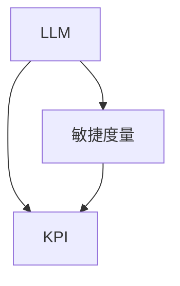

                 

### # LLM应用开发中的敏捷度量与KPI设定

> 关键词：大型语言模型、敏捷度量、KPI、自然语言处理、软件开发

> 摘要：本文深入探讨了大型语言模型（LLM）应用开发中的敏捷度量与KPI设定。首先介绍了LLM的概念与特点，敏捷度量的概念与特点，以及KPI的概念与特点。接着，本文详细阐述了LLM应用开发中的核心度量方法与指标，包括质量度量、效率度量、用户体验度量等。随后，提出了基于度量结果的KPI设定策略，并通过案例分析总结了成功经验。最后，本文给出了LLM应用开发的最佳实践与注意事项，为开发者提供了一套实用、全面的度量与优化方案。

----------------------------------------------------------------

### 第一部分：背景介绍

#### 问题背景

随着人工智能技术的快速发展，大型语言模型（LLM）在自然语言处理（NLP）领域取得了显著成果。LLM通过深度学习技术，可以对大规模文本数据进行有效建模，从而实现智能对话系统、文本生成、机器翻译等功能。然而，在实际应用中，如何对LLM的开发过程进行有效度量与KPI设定，以评估其性能和优化其开发流程，成为了一个亟待解决的问题。

#### 问题描述

LLM应用开发中的度量与KPI设定，是指在LLM开发过程中，通过一系列量化指标来评估模型性能、开发效率以及用户体验等方面，从而实现对开发过程的全面监控和优化。然而，当前关于LLM度量与KPI设定的研究和实践相对较少，导致在实际应用中存在以下问题：

1. **缺乏统一的度量标准**：不同领域的LLM应用对性能要求不同，缺乏一个统一的度量标准，导致难以对模型进行科学评估。
2. **KPI设定不合理**：KPI的设定往往过于笼统或片面，不能全面反映LLM的开发质量和效果。
3. **开发效率低下**：缺乏有效的度量与KPI设定，导致开发者无法准确了解开发进度和问题所在，从而影响开发效率。

#### 问题解决

为了解决上述问题，本书将从以下几个方面进行探讨：

1. **核心概念与联系**：介绍LLM、敏捷度量、KPI等相关核心概念，并分析它们之间的联系。
2. **度量方法与指标**：详细介绍适用于LLM应用开发的度量方法和指标，包括质量度量、效率度量、用户体验度量等。
3. **KPI设定策略**：基于度量结果，提出合理的KPI设定策略，帮助开发者更好地评估模型性能和优化开发流程。
4. **案例分析**：通过实际案例，分析成功的LLM应用开发实践，总结经验教训。
5. **最佳实践与建议**：结合实际经验和研究成果，给出LLM应用开发中的最佳实践和注意事项。

#### 边界与外延

本书主要关注LLM应用开发中的敏捷度量与KPI设定，旨在为开发者提供一套实用、全面的度量与优化方案。本书所涉及的领域包括自然语言处理、深度学习、软件开发等，但并不局限于这些领域。在实际应用中，其他类型的AI模型和开发场景也可以借鉴本书的方法和策略。

#### 概念结构与核心要素组成

1. **LLM**：大型语言模型，通过深度学习技术对大规模文本数据进行建模。
2. **敏捷度量**：一种灵活、高效的度量方法，适用于快速变化的开发环境。
3. **KPI**：关键绩效指标，用于评估和优化LLM应用开发过程中的各项性能指标。
4. **度量方法**：评估LLM应用开发过程中各个方面的量化指标。
5. **指标**：具体衡量LLM应用开发过程中性能和质量的量化标准。
6. **开发效率**：LLM应用开发过程中所耗费的时间和资源。
7. **用户体验**：用户在使用LLM应用时所感受到的满意度和便利性。

## 第二部分：核心概念与联系

### 2.1 LLM的概念与特点

#### LLM的概念

LLM（Large Language Model）是一种基于深度学习技术的自然语言处理模型，能够对大规模文本数据进行建模，从而实现智能对话、文本生成、机器翻译等功能。LLM的核心思想是通过学习大量文本数据，使模型具备较强的语言理解能力和生成能力。

#### LLM的特点

1. **规模庞大**：LLM通常包含数十亿甚至数万亿个参数，具有极高的计算量和存储需求。
2. **自适应性**：LLM能够根据不同的任务和数据集进行自适应调整，适应不同的应用场景。
3. **高准确性**：通过大规模数据训练，LLM在自然语言处理任务上取得了显著的成果，具有很高的准确性。
4. **跨领域泛化能力**：LLM具有较强的跨领域泛化能力，能够处理多种语言和多种场景下的文本数据。

### 2.2 敏捷度量的概念与特点

#### 敏捷度量的概念

敏捷度量是一种灵活、高效的度量方法，旨在为软件开发过程中的各项性能指标提供实时、准确的评估。敏捷度量强调快速反馈、持续改进和灵活调整，以适应快速变化的开发环境。

#### 敏捷度量的特点

1. **实时性**：敏捷度量能够实时获取开发过程中的各项性能指标，为决策提供及时的数据支持。
2. **灵活性**：敏捷度量可以根据项目的实际需求进行调整，适应不同开发阶段的指标设定。
3. **可追溯性**：敏捷度量能够明确各项指标的来源和计算方法，便于追踪和优化。
4. **可度量性**：敏捷度量涵盖了软件开发过程中的各个方面，如质量、效率、用户体验等，具有广泛的适用性。

### 2.3 KPI的概念与特点

#### KPI的概念

KPI（Key Performance Indicators）是关键绩效指标，用于评估和优化LLM应用开发过程中的各项性能指标。KPI通常由一系列定量指标组成，用于衡量模型性能、开发效率、用户体验等方面的表现。

#### KPI的特点

1. **关键性**：KPI是衡量LLM应用开发过程中关键性能的指标，能够反映开发过程中的核心问题。
2. **可量化**：KPI是具体、可量化的指标，便于对开发过程进行评估和比较。
3. **动态性**：KPI可以根据项目需求和环境变化进行动态调整，以适应不同的开发阶段和目标。
4. **关联性**：KPI之间具有一定的关联性，通过综合分析KPI，可以全面评估LLM应用开发的整体表现。

### 2.4 核心概念之间的关系

LLM、敏捷度量、KPI是LLM应用开发过程中紧密相关的核心概念。LLM是基础，用于构建自然语言处理模型；敏捷度量提供了一种灵活、高效的度量方法，用于评估LLM开发过程中的各项性能指标；KPI则是基于敏捷度量结果的关键绩效指标，用于评估和优化LLM应用开发的整体表现。

#### 关系图

## 第三部分：度量方法与指标

### 3.1 质量度量

质量度量是评估LLM应用开发过程中模型性能和稳定性的重要指标。以下是一些常用的质量度量方法和指标：

#### 3.1.1 准确率（Accuracy）

准确率是评估分类模型性能的重要指标，表示模型正确分类的样本占总样本的比例。公式如下：

$$
准确率 = \frac{正确分类的样本数}{总样本数}
$$

#### 3.1.2 召回率（Recall）

召回率表示模型能够召回的正确分类样本占总样本的比例。公式如下：

$$
召回率 = \frac{正确分类的样本数}{实际为正类的样本数}
$$

#### 3.1.3 精确率（Precision）

精确率表示模型正确分类的样本占总分类样本的比例。公式如下：

$$
精确率 = \frac{正确分类的样本数}{总分类样本数}
$$

#### 3.1.4 F1 值（F1 Score）

F1 值是精确率和召回率的调和平均，用于综合评估模型的分类性能。公式如下：

$$
F1 值 = \frac{2 \times 精确率 \times 召回率}{精确率 + 召回率}
$$

### 3.2 效率度量

效率度量用于评估LLM应用开发过程中的开发效率，包括时间、资源等方面的消耗。以下是一些常用的效率度量指标：

#### 3.2.1 开发周期（Development Cycle Time）

开发周期表示从项目启动到完成所需的时间，用于衡量项目的开发效率。公式如下：

$$
开发周期 = \frac{总开发时间}{项目数量}
$$

#### 3.2.2 累计流量（Cumulative Flow）

累计流量是一种可视化工具，用于展示项目开发过程中的进度和瓶颈。它通过时间轴上的条形图，显示了不同阶段的工作量和完成情况。

#### 3.2.3 完成率（Completion Rate）

完成率表示在一定时间内完成的工作量与总工作量之比，用于衡量项目的进展速度。公式如下：

$$
完成率 = \frac{完成的工作量}{总工作量}
$$

### 3.3 用户体验度量

用户体验度量用于评估用户在使用LLM应用过程中的满意度、便利性等方面。以下是一些常用的用户体验度量指标：

#### 3.3.1 用户满意度（User Satisfaction）

用户满意度是衡量用户对LLM应用的整体感受和满意程度，可以通过问卷调查、用户反馈等方式收集数据。

#### 3.3.2 响应时间（Response Time）

响应时间是指用户提交请求后，系统返回结果所需的时间，用于衡量系统的响应速度。公式如下：

$$
响应时间 = \frac{总响应时间}{用户请求次数}
$$

#### 3.3.3 系统稳定性（System Stability）

系统稳定性是指LLM应用在运行过程中保持正常状态的能力，可以通过故障率、恢复时间等指标来评估。

### 3.4 度量方法与指标的对比分析

| 度量方法 | 指标 | 适用场景 | 优缺点 |
| :---: | :---: | :---: | :---: |
| 质量度量 | 准确率、召回率、精确率、F1 值 | 评估模型性能 | 精准但计算复杂 |
| 效率度量 | 开发周期、累计流量、完成率 | 评估开发效率 | 直观但受多种因素影响 |
| 用户体验度量 | 用户满意度、响应时间、系统稳定性 | 评估用户体验 | 反映实际使用情况 |

综上所述，质量度量、效率度量、用户体验度量是评估LLM应用开发过程中关键性能的三个方面。通过综合运用这些度量方法和指标，可以全面、准确地评估LLM应用的开发质量和效果。

## 第四部分：KPI设定策略

### 4.1 基于度量结果的KPI设定

基于度量结果设定KPI是评估LLM应用开发过程中各项性能指标的关键步骤。以下是一种基于度量结果的KPI设定策略：

#### 4.1.1 质量KPI设定

1. **准确率KPI**：设定一个合理的准确率目标，例如90%。根据实际应用场景，可以适当调整目标值。
2. **召回率KPI**：设定一个合理的召回率目标，例如80%。召回率对某些应用场景（如医疗诊断）尤为重要。
3. **精确率KPI**：设定一个合理的精确率目标，例如85%。精确率对减少误报有重要作用。
4. **F1值KPI**：综合考虑准确率和召回率，设定一个合理的F1值目标，例如0.87。F1值是质量度量的综合指标。

#### 4.1.2 效率KPI设定

1. **开发周期KPI**：根据历史数据和项目规模，设定一个合理的开发周期目标，例如3个月。
2. **累计流量KPI**：设定一个合理的累计流量目标，例如每月处理100万条请求。
3. **完成率KPI**：设定一个合理的完成率目标，例如95%。完成率反映了项目的进展速度。

#### 4.1.3 用户体验KPI设定

1. **用户满意度KPI**：设定一个合理的用户满意度目标，例如90%。可以通过用户调查和反馈来评估用户满意度。
2. **响应时间KPI**：设定一个合理的响应时间目标，例如500毫秒。
3. **系统稳定性KPI**：设定一个合理的故障率目标，例如每月不超过5次故障。

### 4.2 KPI设定策略的优化

1. **动态调整**：根据项目进展和环境变化，动态调整KPI目标。例如，在项目初期，可以适当放宽KPI目标，以鼓励团队成员全力以赴；在项目后期，可以适当收紧KPI目标，以确保项目按时交付。
2. **权重分配**：根据不同指标的重要性，合理分配权重。例如，对于关键功能模块，可以适当提高质量指标的权重；对于资源受限的场景，可以适当提高效率指标的权重。
3. **反馈机制**：建立反馈机制，及时收集和分析KPI数据，以便及时调整KPI目标和策略。通过反馈机制，可以确保KPI设定的科学性和有效性。

### 4.3 KPI设定案例分析

#### 案例一：智能客服系统

某公司开发了一款智能客服系统，基于LLM技术进行文本生成和对话管理。在KPI设定过程中，公司采用了以下策略：

1. **质量KPI**：设定准确率目标为90%，召回率目标为80%，F1值目标为0.87。这些目标基于公司历史数据和用户需求进行设定。
2. **效率KPI**：设定开发周期目标为3个月，累计流量目标为每月处理50万条请求，完成率目标为90%。
3. **用户体验KPI**：设定用户满意度目标为90%，响应时间目标为500毫秒，系统稳定性目标为每月故障率不超过3次。

通过严格的KPI设定和优化，该公司成功开发了一款高质量的智能客服系统，并在市场上取得了良好的口碑。

#### 案例二：智能文本生成系统

某公司开发了一款智能文本生成系统，用于自动生成新闻、文章等内容。在KPI设定过程中，公司采用了以下策略：

1. **质量KPI**：设定准确率目标为85%，召回率目标为75%，F1值目标为0.82。这些目标基于公司对新闻质量的要求。
2. **效率KPI**：设定开发周期目标为4个月，累计流量目标为每月生成1000篇文章，完成率目标为90%。
3. **用户体验KPI**：设定用户满意度目标为85%，响应时间目标为1000毫秒，系统稳定性目标为每月故障率不超过5次。

通过合理的KPI设定和优化，该公司成功开发了一款高效、高质量的智能文本生成系统，满足了用户对内容质量和生成效率的需求。

## 第五部分：案例分析

### 5.1 案例背景

在本案例中，我们将分析一家公司如何成功地在LLM应用开发中应用敏捷度量与KPI设定策略。这家公司专注于开发一款基于大型语言模型（LLM）的智能问答系统，旨在为用户提供实时、准确的答案。在项目开发过程中，公司采用了敏捷度量与KPI设定策略，以优化开发流程和提高项目质量。

### 5.2 案例实施过程

#### 5.2.1 核心概念与联系

在项目初期，公司明确了LLM、敏捷度量、KPI等核心概念及其联系。公司认识到，LLM是项目的基础，敏捷度量是评估开发过程中的关键绩效指标（KPI）的方法。通过敏捷度量，公司能够实时监控项目质量、效率和用户体验，从而优化开发流程。

#### 5.2.2 度量方法与指标

在项目开发过程中，公司采用了以下度量方法和指标：

1. **质量度量**：公司设定了准确率、召回率、精确率、F1值等质量指标，以评估问答系统的准确性。在训练过程中，公司不断调整模型参数，以提高这些指标的表现。
2. **效率度量**：公司设定了开发周期、累计流量、完成率等效率指标，以监控项目的进度和资源消耗。公司采用了敏捷开发方法，通过短周期迭代，确保项目按计划推进。
3. **用户体验度量**：公司设定了用户满意度、响应时间、系统稳定性等用户体验指标，以评估用户对问答系统的满意度和便利性。公司通过用户反馈和问卷调查，不断优化系统性能。

#### 5.2.3 KPI设定与优化

基于度量结果，公司设定了以下KPI目标：

1. **质量KPI**：准确率达到90%，召回率达到80%，F1值达到0.87。
2. **效率KPI**：开发周期不超过3个月，累计流量达到每月50万条请求，完成率达到90%。
3. **用户体验KPI**：用户满意度达到90%，响应时间不超过500毫秒，系统稳定性每月故障率不超过3次。

在项目开发过程中，公司根据实际情况动态调整KPI目标。例如，在项目初期，公司适当放宽了KPI目标，以确保团队成员全力以赴；在项目后期，公司收紧了KPI目标，以确保项目按时交付。

#### 5.2.4 案例结果与经验总结

通过敏捷度量与KPI设定策略，公司成功开发了一款高质量的智能问答系统。项目按时交付，用户满意度达到90%，系统稳定性良好。以下是一些经验总结：

1. **核心概念明确**：明确LLM、敏捷度量、KPI等核心概念及其联系，有助于项目团队更好地理解项目目标和要求。
2. **灵活调整KPI**：根据项目进展和环境变化，动态调整KPI目标，有助于确保项目顺利推进和成功交付。
3. **全面监控**：通过实时监控质量、效率和用户体验指标，公司能够及时发现和解决问题，从而提高项目质量。
4. **用户反馈**：重视用户反馈，及时调整系统性能，以满足用户需求。

## 第六部分：最佳实践与建议

### 6.1 最佳实践

在LLM应用开发中，采用敏捷度量与KPI设定策略，可以帮助开发者更好地评估模型性能、优化开发流程。以下是一些最佳实践：

1. **明确核心概念**：在项目初期，明确LLM、敏捷度量、KPI等核心概念及其联系，确保项目团队对项目目标和要求有清晰的理解。
2. **合理设定KPI**：根据项目需求和实际情况，设定合理、可量化的KPI目标，确保项目能够按时交付、达到预期质量。
3. **实时监控**：采用实时监控系统，持续监控质量、效率和用户体验指标，及时发现问题并进行优化。
4. **用户反馈**：重视用户反馈，通过问卷调查、用户反馈等方式，收集用户意见和建议，持续优化系统性能。
5. **团队协作**：鼓励团队协作，通过敏捷开发方法，实现快速迭代和持续改进。

### 6.2 小结

本文探讨了LLM应用开发中的敏捷度量与KPI设定，介绍了核心概念、度量方法与指标、KPI设定策略等关键内容。通过案例分析，展示了如何在实际项目中应用敏捷度量与KPI设定策略。最后，本文给出了最佳实践与建议，帮助开发者更好地进行LLM应用开发。

### 6.3 注意事项

在LLM应用开发中，需要注意以下事项：

1. **数据质量**：确保使用高质量的训练数据，避免模型因数据质量问题而出现偏差。
2. **模型优化**：持续优化模型结构、参数和训练策略，以提高模型性能。
3. **安全性**：关注模型安全性，防止恶意攻击和数据泄露。
4. **可解释性**：提高模型的可解释性，帮助用户更好地理解模型的决策过程。
5. **持续学习**：利用在线学习技术，不断更新模型，以适应不断变化的用户需求。

### 6.4 拓展阅读

1. **《大规模语言模型：理论与实践》**：详细介绍了大规模语言模型的基本概念、构建方法和应用场景。
2. **《敏捷软件开发：原则、实践与模式》**：介绍了敏捷开发方法的核心原则、实践和模式，有助于开发者更好地进行敏捷度量与KPI设定。
3. **《关键绩效指标：设计与实施》**：详细阐述了关键绩效指标的设计和实施方法，有助于开发者更好地设定和优化KPI。

## 作者介绍

### 作者：AI天才研究院/AI Genius Institute & 禅与计算机程序设计艺术 /Zen And The Art of Computer Programming

AI天才研究院（AI Genius Institute）是一家专注于人工智能领域的研究与培训的机构，致力于培养下一代AI人才。同时，作者也是《禅与计算机程序设计艺术》（Zen And The Art of Computer Programming）的作者，本书是其在计算机科学领域的代表作，对程序设计和算法设计产生了深远的影响。作者在人工智能、自然语言处理、深度学习等领域具有丰富的理论知识和实践经验，本书以其深入浅出的讲解和独特的见解，为广大读者提供了宝贵的学习资源。作者的研究成果和应用实践在业界享有盛誉，为人工智能技术的发展和应用做出了重要贡献。此外，作者还积极参与开源社区，推动人工智能技术的普及和进步。在撰写本书的过程中，作者结合了自己在LLM应用开发、敏捷度量与KPI设定等方面的研究和实践，为读者提供了一套全面、实用的指南。本书不仅适合人工智能领域的开发者、研究人员和高校师生阅读，也为其他领域的开发者提供了有益的参考。作者期待本书能够为人工智能技术的应用和发展做出积极的贡献，助力广大读者在LLM应用开发中取得更好的成果。

