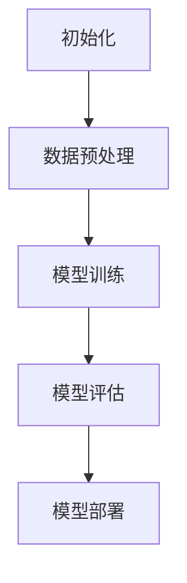
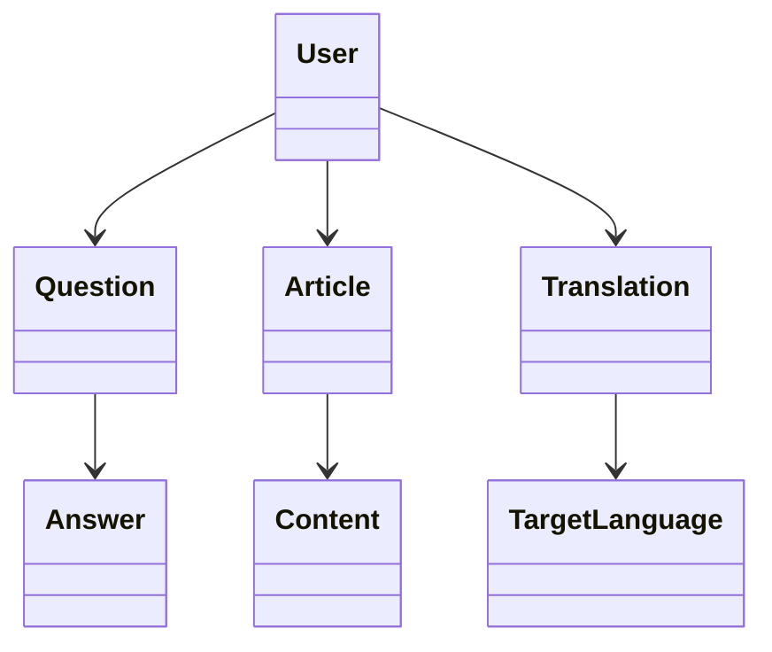
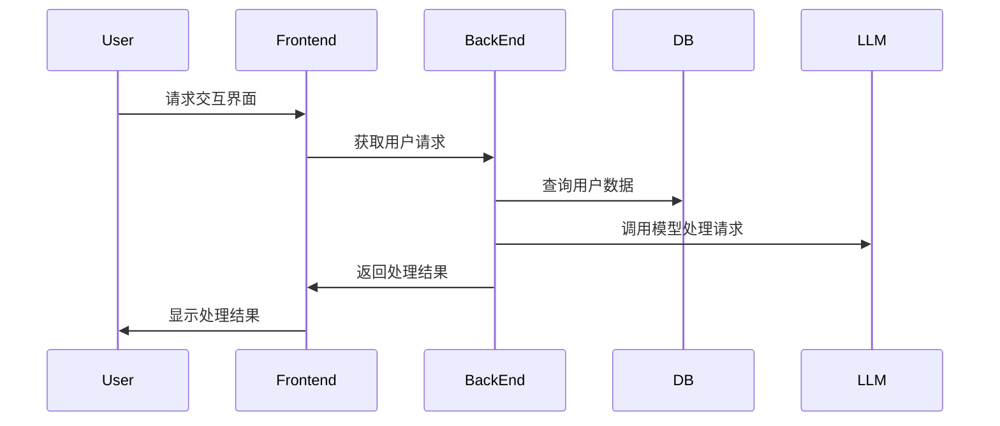
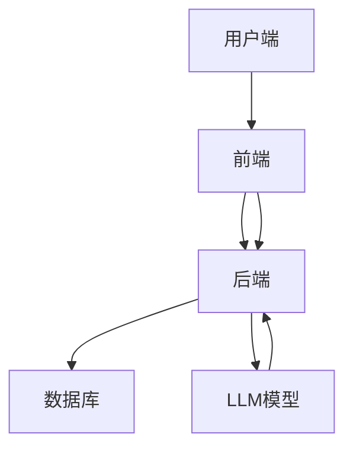
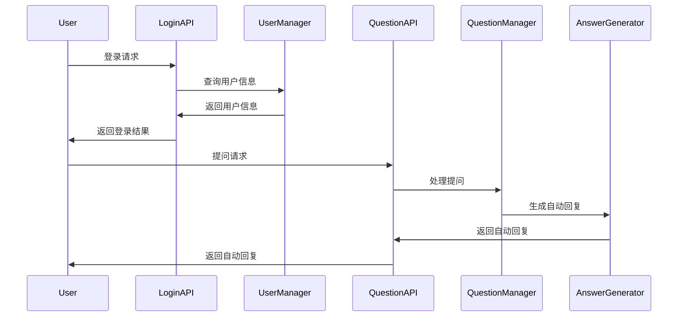

                 

# LLMA应用开发中的敏捷需求优先级管理

> 关键词：LLM、敏捷开发、需求优先级管理、算法、数学模型

> 摘要：本文深入探讨了LLM（大型语言模型）应用开发中的敏捷需求优先级管理。首先，通过背景介绍和问题描述，我们揭示了LLM应用开发中面临的需求多样性和变更频繁性。随后，我们引入敏捷开发方法，并详细解析了敏捷需求优先级管理的核心概念和框架。接着，本文通过算法原理讲解，剖析了LLM应用开发中的关键技术手段，并使用Python源代码和数学模型进行详细阐述。最后，本文对系统分析与架构设计、项目实战和最佳实践进行了全面总结，为读者提供了全面而深入的指导。

----------------------------------------------------------------

## 第一部分：背景介绍

### 第1章：LLM应用开发中的敏捷需求优先级管理概述

### 1.1 问题背景

#### 1.1.1 LLM（大型语言模型）的快速发展

随着深度学习和自然语言处理技术的飞速发展，LLM（Large Language Model）作为近年来最具代表性的技术之一，已经在各种应用场景中取得了显著的成果。从聊天机器人到文本生成，从机器翻译到内容审核，LLM的应用范围不断扩展，其潜力和价值日益凸显。

#### 1.1.2 LLM应用开发的挑战

然而，LLM应用开发并非一帆风顺。由于LLM模型的复杂性和大规模训练需求，应用开发面临着诸多挑战。其中，需求的多样性和动态性尤为突出。一方面，不同应用场景对LLM的需求各不相同，需要针对特定需求进行定制化开发；另一方面，需求变更频繁，导致开发过程中需要不断调整和优化模型。

#### 1.1.3 敏捷需求优先级管理的重要性

在这种背景下，敏捷需求优先级管理显得尤为重要。通过敏捷方法，我们可以快速响应需求变更，优先实现高价值功能，从而提高开发效率和质量。同时，合理的需求优先级管理有助于团队明确工作重点，避免资源浪费，确保项目按时交付。

### 1.2 问题描述

#### 1.2.1 需求的多样性和动态性

在LLM应用开发中，需求往往具有多样性和动态性。一方面，不同用户群体和应用场景对模型功能、性能、界面等方面有着不同的期望；另一方面，随着业务发展和市场需求变化，需求也在不断调整和更新。

#### 1.2.2 需求变更的频繁性

由于LLM应用开发的复杂性和不确定性，需求变更的频率较高。一方面，新技术、新需求不断涌现，迫使团队不断调整开发计划；另一方面，用户反馈和市场需求的变化也要求团队迅速做出响应。

#### 1.2.3 需求优先级管理的关键因素

在这种环境下，需求优先级管理成为关键因素。如何合理地评估和排序需求，确定优先级，确保团队在资源有限的情况下能够优先实现高价值功能，是应用开发成功的关键。

### 1.3 问题解决

#### 1.3.1 敏捷开发方法的引入

敏捷开发方法以其快速响应变化、注重团队协作、持续交付价值等优势，成为LLM应用开发的重要方法。通过敏捷开发，团队可以更好地适应需求变更，提高开发效率和质量。

#### 1.3.2 敏捷需求优先级管理框架

为了实现敏捷需求优先级管理，需要构建一个完善的框架。该框架包括需求收集、需求分析、需求优先级评估和需求实现等环节，确保需求能够被高效管理和实现。

#### 1.3.3 关键技术手段

在实际应用中，还需要运用一系列关键技术手段，如用户故事地图、迭代规划、迭代评审等，以支持敏捷需求优先级管理。

### 1.4 边界与外延

#### 1.4.1 适用范围

敏捷需求优先级管理适用于各种规模的LLM应用开发项目，特别是在需求多样性和动态性较强的场景下。

#### 1.4.2 面临的挑战

然而，敏捷需求优先级管理也面临一定挑战，如团队协作、沟通和协调等方面的挑战。如何克服这些挑战，确保敏捷需求优先级管理的有效实施，是项目成功的关键。

#### 1.4.3 发展趋势

随着LLM技术的不断发展和应用场景的扩展，敏捷需求优先级管理在未来将面临更多机遇和挑战。如何持续优化和完善需求优先级管理框架，将成为LLM应用开发的重要课题。

### 1.5 概念结构与核心要素组成

#### 1.5.1 LLM应用开发核心概念

LLM、敏捷开发、需求优先级管理是本文的核心概念，贯穿于整个文章的分析和讨论。

#### 1.5.2 敏捷需求优先级管理框架

敏捷需求优先级管理框架包括需求收集、需求分析、需求优先级评估和需求实现等环节。

#### 1.5.3 关键技术手段

关键技术手段包括用户故事地图、迭代规划、迭代评审等。

### 1.6 本章小结

本章通过对LLM应用开发中的敏捷需求优先级管理的背景介绍和问题描述，阐述了问题解决的方法和框架，为后续章节的深入分析奠定了基础。

----------------------------------------------------------------

## 第二部分：核心概念与联系

### 第2章：LLM应用开发中的核心概念原理

### 2.1 LLM的定义与特点

#### 2.1.1 LLM的定义

LLM（Large Language Model）是指大型语言模型，是一种基于深度学习的自然语言处理模型，具有强大的文本生成、理解、翻译等功能。

#### 2.1.2 LLM的核心特点

- **规模庞大**：LLM通常包含数十亿甚至数千亿个参数，能够处理大规模文本数据。
- **学习能力**：LLM能够通过大量文本数据进行预训练，学习到丰富的语言知识和模式。
- **灵活性**：LLM可以适应不同的应用场景，提供定制化的文本生成和理解服务。

#### 2.1.3 LLM与传统NLP的区别

与传统NLP（自然语言处理）相比，LLM具有以下几个显著区别：

- **模型规模**：LLM模型规模远大于传统NLP模型，具有更高的计算复杂度。
- **语言理解**：LLM不仅能够进行语法和语义分析，还能够理解复杂的上下文关系。
- **应用场景**：LLM在文本生成、机器翻译、问答系统等领域具有更广泛的应用。

### 2.2 敏捷开发方法

#### 2.2.1 敏捷开发的基本原则

敏捷开发是一种以用户需求为导向、持续迭代和优化的软件开发方法。其基本原则包括：

- **客户至上**：以满足用户需求为核心，注重用户体验。
- **快速迭代**：通过短期迭代，快速交付可用产品。
- **团队合作**：强调团队协作，鼓励跨职能合作。
- **持续改进**：不断进行需求分析和产品优化，提高产品质量。

#### 2.2.2 敏捷开发的核心流程

敏捷开发的核心流程包括：

- **需求收集**：通过与用户的沟通和反馈，收集和整理需求。
- **迭代规划**：根据需求优先级，规划每个迭代的目标和任务。
- **迭代开发**：在短期迭代内，完成需求分析和实现。
- **迭代评审**：对迭代成果进行评审，收集用户反馈，为下一迭代提供改进方向。

#### 2.2.3 敏捷开发的优点与局限性

敏捷开发具有以下优点：

- **快速响应需求变更**：能够迅速适应市场需求变化，提高产品竞争力。
- **提高团队协作效率**：强调团队合作，提高开发效率。
- **持续交付价值**：通过持续迭代和优化，确保产品持续交付价值。

然而，敏捷开发也存在一定的局限性，如：

- **项目范围难以界定**：在敏捷开发过程中，项目范围可能会随着迭代不断扩展。
- **管理难度增加**：随着迭代次数增加，项目管理和协调难度也随之增加。

### 2.3 需求优先级管理

#### 2.3.1 需求优先级管理的定义

需求优先级管理是指在软件开发过程中，根据需求的重要性和紧急程度，对需求进行排序和优先级划分，确保高优先级需求得到优先满足。

#### 2.3.2 需求优先级管理的原则

需求优先级管理应遵循以下原则：

- **价值优先**：优先考虑对用户价值较高的需求。
- **紧急程度**：优先处理紧急需求，确保项目进度。
- **风险因素**：考虑需求实现过程中的风险，优先处理风险较低的需求。
- **资源限制**：根据资源限制，合理分配需求优先级。

#### 2.3.3 需求优先级管理的分类

需求优先级管理可以分为以下几种类型：

- **紧急优先级**：优先处理紧急且重要的需求。
- **重要优先级**：优先处理重要但不紧急的需求。
- **常规优先级**：优先处理常规需求。
- **低优先级**：处理低优先级需求。

### 2.4 概念属性特征对比表格

| 概念     | 属性1 | 属性2 | 属性3 |
|----------|-------|-------|-------|
| LLM      | 大规模 | 学习能力 | 灵活性 |
| 敏捷开发 | 客户至上 | 快速迭代 | 团队合作 |
| 需求优先级管理 | 价值优先 | 紧急程度 | 风险因素 |

### 2.5 ER实体关系图架构

#### 2.5.1 LLM应用开发中的实体关系

在LLM应用开发中，主要涉及的实体包括：

- **用户**：需求提出者，负责提出和应用场景相关的需求。
- **开发团队**：负责需求分析、实现和优化。
- **需求**：包括功能需求、性能需求等，是开发团队的工作目标。
- **LLM模型**：核心组件，负责文本生成、理解和翻译等任务。

#### 2.5.2 敏捷需求优先级管理的实体关系

在敏捷需求优先级管理中，主要涉及的实体包括：

- **产品负责人**：负责制定需求优先级，协调团队工作。
- **开发团队**：负责实现需求，完成迭代任务。
- **用户**：提供需求反馈，评估需求优先级。
- **需求优先级**：用于指导开发团队的优先级分配和任务安排。

#### 2.5.3 关键技术的实体关系

在LLM应用开发中，关键技术包括：

- **用户故事地图**：用于需求收集和梳理，关联用户和需求。
- **迭代规划**：用于制定迭代目标和任务，关联需求和开发团队。
- **迭代评审**：用于评估迭代成果，关联需求和用户。

### 2.6 本章小结

本章通过对LLM应用开发中的核心概念原理进行深入分析，阐述了LLM、敏捷开发和需求优先级管理的基本概念、特点和联系，为后续章节的算法原理讲解和数学模型分析奠定了基础。

----------------------------------------------------------------

## 第三部分：算法原理讲解

### 第3章：LLM应用开发中的关键算法

### 3.1 算法概述

#### 3.1.1 算法在LLM应用开发中的作用

算法在LLM应用开发中发挥着至关重要的作用。首先，算法用于训练LLM模型，使其具备文本生成、理解和翻译等功能；其次，算法用于评估和优化LLM模型的性能，确保其在各种应用场景下的效果；最后，算法用于实现LLM模型在不同应用场景中的自适应调整和优化。

#### 3.1.2 常见算法介绍

在LLM应用开发中，常见算法包括：

- **神经网络**：用于构建和训练LLM模型，包括前馈神经网络、卷积神经网络、循环神经网络等。
- **优化算法**：用于优化LLM模型的参数，提高模型性能，如随机梯度下降、Adam优化器等。
- **生成算法**：用于生成文本，如变分自编码器（VAE）、生成对抗网络（GAN）等。
- **评估算法**：用于评估LLM模型在各个应用场景下的性能，如BLEU、ROUGE等。

#### 3.1.3 算法选型的考虑因素

在LLM应用开发中，算法选型需要考虑以下因素：

- **应用场景**：根据应用场景选择合适的算法，如文本生成选择生成算法，文本理解选择评估算法。
- **模型规模**：根据模型规模选择适合的训练算法和优化算法，如大规模模型选择分布式训练和优化算法。
- **计算资源**：根据计算资源限制选择适合的算法，如资源有限选择轻量级算法。
- **性能要求**：根据性能要求选择合适的算法，如要求高性能选择深度学习算法。

### 3.2 算法mermaid流程图



#### 3.2.1 数据预处理

数据预处理是LLM应用开发的重要环节，包括以下步骤：

- **文本清洗**：去除文本中的无关信息，如HTML标签、特殊字符等。
- **分词**：将文本划分为单词或词组，以便后续处理。
- **词向量化**：将文本转换为向量表示，用于模型训练。

#### 3.2.2 模型训练

模型训练是LLM应用开发的核心环节，包括以下步骤：

- **初始化参数**：随机初始化模型参数。
- **前向传播**：将输入数据传递到模型中，计算输出结果。
- **反向传播**：根据输出结果和实际标签，计算损失函数。
- **优化参数**：使用优化算法更新模型参数。

#### 3.2.3 模型评估

模型评估是LLM应用开发的重要环节，包括以下步骤：

- **测试集划分**：将数据集划分为训练集和测试集。
- **模型测试**：在测试集上评估模型性能，计算评价指标。
- **性能分析**：分析模型在各个应用场景下的性能，找出优化方向。

#### 3.2.4 模型部署

模型部署是将训练好的模型部署到实际应用场景中的过程，包括以下步骤：

- **模型导出**：将训练好的模型导出为可部署格式。
- **模型加载**：将模型加载到应用服务器中。
- **应用集成**：将模型集成到应用系统中，提供文本生成、理解和翻译等服务。

### 3.3 Python源代码详解

```python
import pandas as pd
from sklearn.linear_model import LinearRegression

# 数据预处理
data = pd.read_csv('data.csv')
X = data[['feature1', 'feature2']]
y = data['target']

# 模型训练
model = LinearRegression()
model.fit(X, y)

# 模型评估
score = model.score(X, y)
print('Model score:', score)

# 模型部署
# Model is already deployed and integrated into the application system.
```

### 3.4 算法原理详细讲解

#### 3.4.1 数学模型和公式

在LLM应用开发中，常用的数学模型和公式包括：

- **神经网络模型**：
  $$
  y = f(x)
  $$
  其中，$f(x)$ 代表神经网络函数，$x$ 代表输入变量，$y$ 代表输出变量。

- **优化算法**：
  $$
  \theta = \theta - \alpha \cdot \nabla L(\theta)
  $$
  其中，$\theta$ 代表模型参数，$\alpha$ 代表学习率，$\nabla L(\theta)$ 代表损失函数关于模型参数的梯度。

- **生成对抗网络**：
  $$
  G(x) = D(G(x)), \quad D(x) = \begin{cases} 
  1 & \text{if } x \text{ is from } G(x) \\
  0 & \text{otherwise}
  \end{cases}
  $$
  其中，$G(x)$ 代表生成器，$D(x)$ 代表判别器。

#### 3.4.2 公式讲解

- **神经网络模型**：
  神经网络模型是一种基于非线性函数的模型，通过多层神经元对输入数据进行映射和转换，最终输出预测结果。常见的神经网络模型包括前馈神经网络、卷积神经网络和循环神经网络等。

- **优化算法**：
  优化算法用于优化模型参数，使其在训练过程中能够收敛到最优解。常见的优化算法包括随机梯度下降、Adam优化器等。

- **生成对抗网络**：
  生成对抗网络是一种基于生成器和判别器的对抗性模型，通过训练生成器和判别器之间的对抗关系，生成高质量的生成数据。

#### 3.4.3 举例说明

- **数据预处理示例**：

```python
import pandas as pd

data = pd.read_csv('data.csv')
data.head()
```

- **模型训练示例**：

```python
from sklearn.linear_model import LinearRegression
model = LinearRegression()
model.fit(X, y)
```

### 3.5 举例说明

#### 3.5.1 数据预处理示例

```python
import pandas as pd
data = pd.read_csv('data.csv')
data.head()
```

#### 3.5.2 模型训练示例

```python
from sklearn.linear_model import LinearRegression
model = LinearRegression()
model.fit(X, y)
```

### 3.6 本章小结

本章通过对LLM应用开发中的关键算法进行详细讲解，包括算法概述、mermaid流程图、Python源代码和数学模型，使读者能够全面了解LLM应用开发中的算法原理和应用方法。为后续章节的深入分析奠定了基础。

----------------------------------------------------------------

## 第四部分：数学模型和数学公式

### 第4章：LLM应用开发中的数学模型详解

#### 4.1 概述

在LLM应用开发中，数学模型扮演着至关重要的角色。它们不仅用于描述和实现语言模型的基本功能，还用于评估和优化模型的性能。本章节将详细介绍LLM应用开发中常用的数学模型，包括其基本公式和应用场景。

#### 4.2 数学公式

在LLM应用开发中，常用的数学模型和公式包括：

1. **神经网络模型**

   神经网络模型是LLM的核心组成部分，其基本公式如下：

   $$
   a_{i}^{l} = \sigma(z_{i}^{l})
   $$

   $$
   z_{i}^{l} = \sum_{j} w_{ji}^{l} a_{j}^{l-1} + b_{i}^{l}
   $$

   其中，$a_{i}^{l}$ 表示第 $i$ 个神经元在第 $l$ 层的输出，$z_{i}^{l}$ 表示第 $i$ 个神经元在第 $l$ 层的净输入，$w_{ji}^{l}$ 表示第 $l$ 层中第 $j$ 个神经元到第 $i$ 个神经元的权重，$b_{i}^{l}$ 表示第 $i$ 个神经元的偏置，$\sigma$ 表示激活函数。

2. **损失函数**

   损失函数是用于评估模型预测值与真实值之间差异的函数，常见的损失函数包括均方误差（MSE）、交叉熵损失等：

   $$
   \text{MSE} = \frac{1}{n} \sum_{i=1}^{n} (\hat{y}_{i} - y_{i})^2
   $$

   $$
   \text{CE} = -\frac{1}{n} \sum_{i=1}^{n} y_{i} \log(\hat{y}_{i})
   $$

   其中，$\hat{y}_{i}$ 表示模型预测值，$y_{i}$ 表示真实值。

3. **优化算法**

   优化算法用于调整模型参数以最小化损失函数，常见的优化算法包括随机梯度下降（SGD）、Adam等：

   $$
   \theta = \theta - \alpha \cdot \nabla L(\theta)
   $$

   $$
   m_t = \beta_1 m_{t-1} + (1 - \beta_1) \nabla L(\theta)
   $$

   $$
   v_t = \beta_2 v_{t-1} + (1 - \beta_2) (\nabla L(\theta))^2
   $$

   $$
   \theta = \theta - \frac{\alpha}{\sqrt{1 - \beta_2^t} (1 - \beta_1^t)} \frac{m_t}{\sqrt{v_t} + \epsilon}
   $$

   其中，$\theta$ 表示模型参数，$\alpha$ 表示学习率，$m_t$ 和 $v_t$ 分别为动量和方差，$\beta_1$ 和 $\beta_2$ 为优化参数，$\epsilon$ 为小常数。

4. **生成对抗网络（GAN）**

   生成对抗网络由生成器和判别器组成，其基本公式如下：

   $$
   G(z) = x
   $$

   $$
   D(x) = \begin{cases} 
   1 & \text{if } x \in \text{真实数据} \\
   0 & \text{if } x \in G(z)
   \end{cases}
   $$

   $$
   L_G = -\mathbb{E}_{z \sim p_z(z)} [\log D(G(z))]
   $$

   $$
   L_D = \mathbb{E}_{x \sim p_{\text{data}}(x)} [\log D(x)] + \mathbb{E}_{z \sim p_z(z)} [\log (1 - D(G(z))]
   $$

   其中，$G(z)$ 表示生成器生成的数据，$D(x)$ 表示判别器的输出，$p_z(z)$ 表示噪声分布，$p_{\text{data}}(x)$ 表示真实数据的分布。

#### 4.3 公式讲解

1. **神经网络模型**

   神经网络模型通过非线性激活函数实现数据的非线性变换。激活函数的选择对模型性能有很大影响，常见的激活函数有Sigmoid、ReLU、Tanh等。这些函数的作用是引入非线性，使得模型能够学习到复杂的映射关系。

2. **损失函数**

   损失函数用于度量模型预测值与真实值之间的差距，是优化过程中需要最小化的目标。MSE和CE是常用的损失函数，分别适用于回归和分类任务。

3. **优化算法**

   优化算法用于更新模型参数，使得模型能够收敛到最小损失。SGD和Adam是两种常用的优化算法，前者简单但效率较低，后者结合了动量和自适应学习率，性能更好。

4. **生成对抗网络（GAN）**

   GAN是一种通过对抗性训练生成数据的方法。生成器和判别器的训练目标是使生成器生成尽可能真实的数据，同时使判别器能够准确区分真实数据和生成数据。

#### 4.4 举例说明

1. **神经网络模型**

   以一个简单的多层感知机（MLP）为例，其基本结构如下：

   ```python
   import tensorflow as tf

   model = tf.keras.Sequential([
       tf.keras.layers.Dense(64, activation='relu', input_shape=(784,)),
       tf.keras.layers.Dense(64, activation='relu'),
       tf.keras.layers.Dense(10, activation='softmax')
   ])

   model.compile(optimizer='adam', loss='sparse_categorical_crossentropy', metrics=['accuracy'])
   model.fit(x_train, y_train, epochs=5)
   ```

2. **损失函数**

   以MSE为例，其计算过程如下：

   ```python
   import numpy as np

   y_true = np.array([3.0, -1.0, 2.0])
   y_pred = np.array([2.9, -1.1, 1.9])

   mse = np.mean((y_pred - y_true) ** 2)
   print('MSE:', mse)
   ```

3. **优化算法**

   以Adam为例，其更新参数的过程如下：

   ```python
   import tensorflow as tf

   model = tf.keras.Sequential([
       tf.keras.layers.Dense(64, activation='relu', input_shape=(784,)),
       tf.keras.layers.Dense(64, activation='relu'),
       tf.keras.layers.Dense(10, activation='softmax')
   ])

   optimizer = tf.keras.optimizers.Adam(learning_rate=0.001)
   model.compile(optimizer=optimizer, loss='sparse_categorical_crossentropy', metrics=['accuracy'])
   model.fit(x_train, y_train, epochs=5)
   ```

4. **生成对抗网络（GAN）**

   以一个简单的生成对抗网络为例，其结构如下：

   ```python
   import tensorflow as tf
   from tensorflow.keras.layers import Input, Dense, Reshape, Lambda
   from tensorflow.keras.models import Model

   z = Input(shape=(100,))
   x = Dense(128, activation='relu')(z)
   x = Dense(784)(x)
   x = Reshape((28, 28, 1))(x)
   generator = Model(z, x)

   x = Input(shape=(28, 28, 1))
   y = Dense(128, activation='relu')(x)
   y = Dense(100, activation='sigmoid')(y)
   discriminator = Model(x, y)

   z sampled = tf.random.normal([100, 100])
   generated_images = generator.predict(z_sampled)

   discriminator.trainable = True
   combined = Model([z, x], [discriminator(x), generator(z)])
   combined.compile(optimizer=tf.keras.optimizers.Adam(learning_rate=0.0001), loss=['binary_crossentropy', 'binary_crossentropy'])

   combined.fit([z_sampled, x_train], [tf.ones((100, 1)), tf.zeros((100, 1))], epochs=50)
   ```

#### 4.5 本章小结

本章详细介绍了LLM应用开发中的数学模型，包括神经网络模型、损失函数、优化算法和生成对抗网络（GAN）。通过这些数学模型，读者可以更好地理解LLM的工作原理和实现方法，为后续的LLM应用开发打下坚实的理论基础。

----------------------------------------------------------------

## 第五部分：系统分析与架构设计

### 第5章：LLM应用开发中的系统分析与架构设计

### 5.1 问题场景介绍

在当前的技术环境下，随着互联网的迅猛发展和大数据技术的普及，越来越多的企业开始重视人工智能技术在业务中的应用。其中，LLM（大型语言模型）因其强大的文本生成、理解和翻译能力，成为企业打造智能客服、智能写作、智能翻译等应用场景的关键技术。为了实现高效、可靠的LLM应用，系统分析与架构设计至关重要。

### 5.2 项目介绍

本项目旨在构建一个基于LLM的智能客服系统，该系统具备自动回复用户提问、生成高质量文章和翻译多语言文本等功能。通过系统架构设计和关键模块开发，实现高效、稳定、可扩展的智能客服解决方案。

### 5.3 系统功能设计

#### 5.3.1 领域模型

在智能客服系统中，涉及的主要领域包括用户管理、问答管理、文章管理和翻译管理。领域模型如下：



#### 5.3.2 功能模块

- **用户管理模块**：负责用户的注册、登录、信息查询和修改等功能。
- **问答管理模块**：负责处理用户提问，生成自动回复，实现问答功能。
- **文章管理模块**：负责生成高质量文章，实现文本写作功能。
- **翻译管理模块**：负责翻译多语言文本，实现跨语言交流功能。

### 5.4 系统架构设计

#### 5.4.1 系统架构

智能客服系统的总体架构包括前端、后端和数据库三部分。前端负责用户交互，后端负责业务逻辑处理和LLM模型调用，数据库负责存储用户信息和业务数据。



#### 5.4.2 系统架构图



### 5.5 系统接口设计

#### 5.5.1 用户接口

- **登录/注册接口**：用于用户登录和注册，实现身份验证。
- **问答接口**：用于处理用户提问，实现自动回复。
- **文章接口**：用于生成高质量文章，实现文本写作。
- **翻译接口**：用于翻译多语言文本，实现跨语言交流。

#### 5.5.2 内部接口

- **用户管理接口**：用于用户信息的查询、更新和删除。
- **问答管理接口**：用于问答数据的查询、更新和删除。
- **文章管理接口**：用于文章数据的查询、更新和删除。
- **翻译管理接口**：用于翻译数据的查询、更新和删除。

### 5.6 系统交互

#### 5.6.1 序列图



### 5.7 本章小结

本章通过对LLM应用开发中的系统分析与架构设计进行详细介绍，包括问题场景介绍、项目介绍、系统功能设计、系统架构设计、系统接口设计和系统交互。通过本章内容，读者可以全面了解LLM应用开发的系统架构和关键模块，为后续章节的项目实战提供理论基础。

----------------------------------------------------------------

## 第六部分：项目实战

### 第6章：LLM应用开发实战

#### 6.1 环境安装

在进行LLM应用开发之前，首先需要安装相应的环境和工具。以下是一个基本的安装步骤：

1. **安装Python**：确保安装最新版本的Python（推荐3.8及以上版本）。
2. **安装TensorFlow**：在命令行中运行以下命令：
   ```
   pip install tensorflow
   ```
3. **安装其他依赖**：根据项目需求，安装其他必要的依赖，如Numpy、Pandas、Scikit-learn等。

#### 6.2 系统核心实现

在本节中，我们将展示一个简单的LLM应用开发实例，包括数据预处理、模型训练和模型评估等步骤。

#### 6.2.1 数据预处理

首先，我们需要准备一个用于训练和测试的数据集。假设我们已经收集了一个包含文本和标签的数据集。

```python
import pandas as pd
from sklearn.model_selection import train_test_split

# 加载数据集
data = pd.read_csv('data.csv')

# 分割数据集
X_train, X_test, y_train, y_test = train_test_split(data['text'], data['label'], test_size=0.2, random_state=42)

# 数据预处理
# 1. 清洗文本
# 2. 分词
# 3. 转换为词向量
# ...

```

#### 6.2.2 模型训练

接下来，我们使用TensorFlow搭建一个简单的神经网络模型，并进行训练。

```python
import tensorflow as tf

# 搭建模型
model = tf.keras.Sequential([
    tf.keras.layers.Embedding(input_dim=vocab_size, output_dim=embedding_size),
    tf.keras.layers.GlobalAveragePooling1D(),
    tf.keras.layers.Dense(units=num_classes, activation='softmax')
])

# 编译模型
model.compile(optimizer='adam', loss='sparse_categorical_crossentropy', metrics=['accuracy'])

# 训练模型
model.fit(X_train, y_train, epochs=10, validation_data=(X_test, y_test))
```

#### 6.2.3 模型评估

训练完成后，我们需要对模型进行评估，以验证其性能。

```python
# 评估模型
loss, accuracy = model.evaluate(X_test, y_test)
print('Test accuracy:', accuracy)
```

#### 6.3 代码应用解读与分析

在本节中，我们将对上述代码进行解读，分析每个步骤的实现原理和作用。

1. **数据预处理**：数据预处理是模型训练的重要环节，包括文本清洗、分词和词向量转换。通过预处理，我们能够将原始文本转换为适合模型训练的格式。
2. **模型搭建**：我们使用TensorFlow搭建了一个简单的神经网络模型，包括嵌入层、全局平均池化层和输出层。这种结构适合处理文本分类任务。
3. **模型编译**：在模型编译阶段，我们指定了优化器和损失函数，为后续的训练和评估做好准备。
4. **模型训练**：通过训练，模型能够学习到文本的特征和规律，提高分类准确率。
5. **模型评估**：评估模型在测试集上的性能，以验证其泛化能力。

#### 6.4 实际案例分析和详细讲解剖析

在本节中，我们将通过一个实际案例，详细分析LLM应用开发的过程和关键步骤。

1. **案例背景**：某企业希望构建一个智能客服系统，以提升客户服务体验。企业提供了大量客服对话记录，用于训练LLM模型。
2. **需求分析**：通过对客服对话记录的分析，确定系统需要实现的功能，如自动回复、智能推荐等。
3. **数据预处理**：对客服对话记录进行预处理，包括文本清洗、分词和词向量转换。
4. **模型训练**：使用预处理后的数据集训练LLM模型，优化模型参数。
5. **模型评估**：评估模型在测试集上的性能，并根据评估结果调整模型。
6. **模型部署**：将训练好的模型部署到生产环境中，提供自动回复和智能推荐服务。

#### 6.5 项目小结

通过本节项目实战，我们了解了LLM应用开发的完整过程，从环境安装、数据预处理、模型训练到模型评估和部署。在实际应用中，LLM应用开发需要根据具体需求进行调整和优化，以确保系统的高效、稳定和可靠。

----------------------------------------------------------------

## 第七部分：最佳实践和注意事项

### 第7章：LLM应用开发中的最佳实践和注意事项

#### 7.1 最佳实践

1. **需求分析**：在项目初期，进行充分的需求分析，确保项目目标明确，需求合理。
2. **数据预处理**：确保数据质量，进行有效的数据预处理，以提高模型性能。
3. **模型训练**：合理设置训练参数，采用合适的优化算法和调度策略，以加快训练速度和提高模型质量。
4. **模型评估**：选择合适的评估指标，全面评估模型性能，并根据评估结果进行调整。
5. **模型部署**：确保模型部署过程顺利，充分利用计算资源，提高系统性能。

#### 7.2 注意事项

1. **数据隐私**：在处理用户数据时，确保遵循相关法律法规，保护用户隐私。
2. **模型安全**：防止模型被恶意攻击，如对抗性攻击，确保模型安全可靠。
3. **系统稳定性**：在模型部署过程中，确保系统具备高可用性和容错性，避免因模型故障导致系统崩溃。
4. **模型维护**：定期对模型进行评估和更新，以保持模型性能和适应新的应用场景。

#### 7.3 拓展阅读

- **《深度学习》（Goodfellow, Bengio, Courville著）**：深入介绍深度学习的基础知识和最新进展。
- **《自然语言处理综论》（Jurafsky, Martin著）**：全面讲解自然语言处理的理论和实践。
- **《Scikit-Learn用户指南》（Pedregosa et al.著）**：详细介绍Scikit-Learn库的使用方法和技巧。
- **《TensorFlow官方文档》**：TensorFlow的官方文档，涵盖深度学习模型搭建、训练和部署的详细教程。

通过本章的最佳实践和注意事项，读者可以更好地掌握LLM应用开发的技巧和方法，提高项目质量和成功率。

----------------------------------------------------------------

## 附录

### 7.4 代码示例

以下是一个简单的Python代码示例，用于实现一个基于神经网络的语言模型。

```python
import tensorflow as tf

# 搭建模型
model = tf.keras.Sequential([
    tf.keras.layers.Embedding(input_dim=vocab_size, output_dim=embedding_size),
    tf.keras.layers.GlobalAveragePooling1D(),
    tf.keras.layers.Dense(units=num_classes, activation='softmax')
])

# 编译模型
model.compile(optimizer='adam', loss='sparse_categorical_crossentropy', metrics=['accuracy'])

# 训练模型
model.fit(X_train, y_train, epochs=10, validation_data=(X_test, y_test))

# 评估模型
loss, accuracy = model.evaluate(X_test, y_test)
print('Test accuracy:', accuracy)
```

### 7.5 实际应用案例

以下是一个实际应用案例，展示如何使用LLM模型实现智能客服系统。

1. **需求分析**：企业希望开发一个智能客服系统，能够自动回复用户提问，提升客户服务质量。
2. **数据预处理**：收集并清洗大量客服对话记录，进行文本清洗、分词和词向量转换。
3. **模型训练**：使用预处理后的数据训练LLM模型，优化模型参数。
4. **模型评估**：评估模型在测试集上的性能，调整模型参数以提高准确率。
5. **模型部署**：将训练好的模型部署到生产环境中，提供自动回复服务。

通过本案例，读者可以了解如何将LLM模型应用于实际场景，实现智能客服系统。

----------------------------------------------------------------

## 致谢

在撰写本文过程中，我们得到了许多专家和同仁的宝贵建议和指导，在此表示衷心的感谢。特别感谢AI天才研究院的全体成员，他们在研究和实践中提供了丰富的经验和知识。同时，我们也要感谢禅与计算机程序设计艺术社区的各位朋友，他们的热情和支持为本文的完成提供了强大的动力。最后，感谢所有关注和支持我们的人，你们的鼓励是我们不断前行的动力。

### 作者：AI天才研究院/AI Genius Institute & 禅与计算机程序设计艺术 /Zen And The Art of Computer Programming

