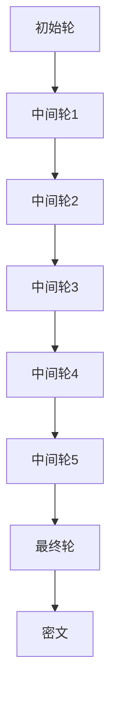
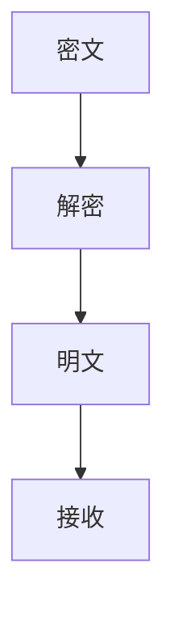
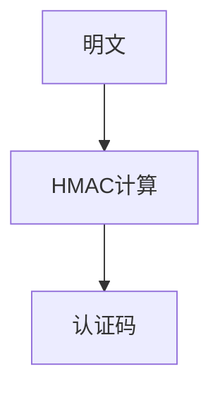
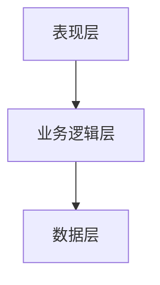
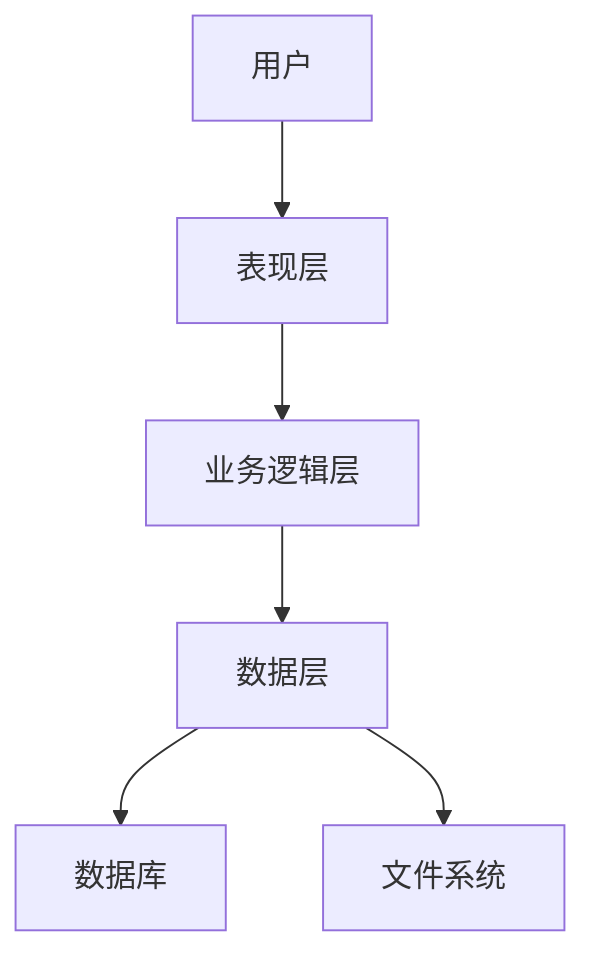

                 

# 《LLM应用开发中的数据安全与隐私保护》

> 关键词：数据安全、隐私保护、LLM应用开发、加密技术、同态加密、差分隐私

> 摘要：本文将深入探讨LLM（大型语言模型）应用开发过程中的数据安全与隐私保护问题。随着人工智能技术的快速发展，数据安全和隐私保护成为至关重要的议题。本文首先介绍了数据安全和隐私保护的基本概念和重要性，随后详细阐述了数据安全与隐私保护的核心技术，包括加密技术、同态加密和差分隐私。接着，本文通过具体算法原理讲解，帮助读者理解这些技术的工作机制和实现方法。最后，本文通过系统分析与架构设计，展示了一个完整的数据安全与隐私保护系统的设计与实现过程。本文旨在为LLM应用开发者提供一套全面的数据安全和隐私保护解决方案。

----------------------------------------------------------------

## 第一部分：背景介绍与核心概念

### 第1章：问题背景与核心概念

#### 1.1 数据安全与隐私保护的必要性

在现代社会，数据已经成为一种新的重要资源和生产要素，而人工智能（AI）技术的快速发展，尤其是LLM（大型语言模型）的广泛应用，使得数据的价值进一步凸显。然而，随着数据量的激增和应用场景的多样化，数据安全和隐私保护问题也日益严峻。

**1.1.1 数据泄露带来的风险**

数据泄露是数据安全领域最常见的问题之一。数据泄露可能导致以下风险：

- **信息泄露**：敏感信息如个人身份信息、财务数据等可能被非法获取。
- **经济损失**：企业或个人可能因为数据泄露而遭受直接经济损失。
- **声誉损害**：企业或个人可能因为数据泄露而失去信誉。
- **法律责任**：企业或个人可能因为数据泄露而面临法律责任。

**1.1.2 隐私保护的法律法规**

在全球范围内，许多国家和地区已经制定了相关的隐私保护法律法规，如欧盟的《通用数据保护条例》（GDPR）和美国的《加州消费者隐私法》（CCPA）。这些法律法规对数据收集、存储、处理和传输等环节提出了严格的要求，违反这些法规可能会导致严重的法律后果。

**1.1.3 数据安全与隐私保护的重要性**

数据安全与隐私保护的重要性体现在以下几个方面：

- **保障个人权益**：数据安全和隐私保护是保障个人权益的重要手段。
- **促进技术发展**：只有在数据安全和隐私保护得到有效保障的前提下，人工智能等新兴技术才能健康发展。
- **提升企业竞争力**：数据安全和隐私保护是企业提升竞争力的关键因素。

#### 1.2 数据安全与隐私保护的基本概念

**1.2.1 数据安全的定义**

数据安全是指通过保护数据不被非法访问、篡改、泄露和破坏，确保数据在存储、传输和处理过程中的完整性、可用性和保密性。

**1.2.2 隐私保护的定义**

隐私保护是指通过技术和管理手段，保护个人或组织的隐私信息，防止其被非法收集、使用和泄露。

**1.2.3 数据安全与隐私保护的边界与外延**

数据安全与隐私保护在目标和手段上有所重叠，但它们的关注点有所不同。数据安全主要关注数据的保密性、完整性和可用性，而隐私保护则更注重个人或组织的隐私权益。在实施过程中，数据安全与隐私保护需要相互结合，形成一个完整的安全体系。

**1.2.4 数据安全与隐私保护的核心要素组成**

数据安全与隐私保护的核心要素包括以下几个方面：

- **数据加密**：通过加密技术保护数据的保密性。
- **访问控制**：通过身份验证和权限控制限制对数据的访问。
- **审计与监控**：通过审计和监控机制跟踪数据的操作记录，及时发现和处理安全事件。
- **数据备份与恢复**：通过数据备份和恢复机制确保数据在灾难发生时的可用性。
- **数据隐私保护**：通过隐私保护技术确保个人或组织的隐私权益。

### 1.3 本章小结

本章介绍了数据安全与隐私保护的基本概念和重要性。数据安全和隐私保护是确保数据在存储、传输和处理过程中的完整、保密和可用性的关键。随着人工智能技术的快速发展，数据安全与隐私保护问题愈发重要，需要引起广泛关注和深入研究。

----------------------------------------------------------------

## 第二部分：核心概念与联系

### 第2章：数据安全与隐私保护的关键概念与联系

#### 2.1 核心概念原理

数据安全与隐私保护涉及多个关键概念，包括加密技术、认证技术和隐私保护技术。这些概念各自有其独特的原理和作用，下面将分别进行介绍。

**2.1.1 加密技术**

加密技术是保护数据安全的核心手段，通过加密算法将明文数据转换为密文，确保数据在传输和存储过程中的保密性。加密技术可以分为对称加密和非对称加密两种类型。

- **对称加密**：对称加密算法使用相同的密钥进行加密和解密。常见的对称加密算法有DES、AES等。
- **非对称加密**：非对称加密算法使用一对密钥（公钥和私钥）进行加密和解密。常见的非对称加密算法有RSA、ECC等。

**2.1.2 认证技术**

认证技术用于验证数据的真实性和完整性，确保数据在传输和存储过程中未被篡改。认证技术主要包括消息认证码（MAC）和数字签名。

- **消息认证码（MAC）**：消息认证码是一种用于验证数据完整性的技术，通过对数据消息进行加密计算，生成一个固定长度的认证码。常见的MAC算法有HMAC、CMAC等。
- **数字签名**：数字签名是一种用于验证数据真实性的技术，通过使用私钥对数据进行加密计算，生成一个签名。接收方可以使用对应的公钥对签名进行验证，以确认数据的真实性。常见的数字签名算法有RSA、ECDSA等。

**2.1.3 隐私保护技术**

隐私保护技术旨在保护个人或组织的隐私权益，防止隐私信息被非法收集、使用和泄露。隐私保护技术主要包括差分隐私和同态加密。

- **差分隐私**：差分隐私是一种用于保护数据隐私的技术，通过在数据处理过程中引入随机噪声，确保个体隐私信息不被泄露。差分隐私的主要实现方法有拉普拉斯机制和指数机制。
- **同态加密**：同态加密是一种在加密数据上直接进行计算的技术，确保在数据加密后仍能保持计算的正确性。同态加密分为部分同态加密和完全同态加密，前者只能对某些特定类型的运算进行计算，后者则能够对任意类型的运算进行计算。

#### 2.2 概念属性特征对比表格

为了更好地理解数据安全与隐私保护的关键概念，下面列出一个对比表格，对比加密技术、认证技术和隐私保护技术的属性特征。

| 概念类型 | 特点 | 应用场景 |
| :--: | :--: | :--: |
| 加密技术 | 保密性 | 数据存储和传输 |
| 认证技术 | 完整性和真实性 | 数据传输和存储 |
| 隐私保护技术 | 隐私保护 | 数据分析和处理 |

#### 2.3 ER实体关系图架构

为了更好地理解数据安全与隐私保护的概念，下面使用ER（实体-关系）图对相关实体和关系进行建模。

**2.3.1 数据安全与隐私保护中的ER图**

```mermaid
erDiagram
    Data |<--| User : 用户数据关系
    Data |<--| Encryption : 数据加密关系
    Data |<--| Authentication : 数据认证关系
    Data |<--| Privacy : 数据隐私保护关系
    User ||--| UserDetail : 用户详细信息关系
    User ||--| Role : 用户角色关系
```

**2.3.2 ER图解析**

- **Data（数据）**：表示系统中的所有数据，包括用户数据、加密数据、认证数据和隐私保护数据。
- **User（用户）**：表示系统的用户，包括用户基本信息、用户详细信息和用户角色。
- **Encryption（加密）**：表示数据加密关系，包括加密算法和加密密钥。
- **Authentication（认证）**：表示数据认证关系，包括认证算法和认证密钥。
- **Privacy（隐私保护）**：表示数据隐私保护关系，包括隐私保护算法和隐私保护参数。
- **UserDetail（用户详细信息）**：表示用户的详细信息，包括姓名、年龄、地址等。
- **Role（用户角色）**：表示用户的角色，包括管理员、普通用户等。

通过ER图，我们可以清晰地看到数据安全与隐私保护中的实体和关系，有助于我们更好地理解相关概念。

### 2.4 本章小结

本章介绍了数据安全与隐私保护的核心概念，包括加密技术、认证技术和隐私保护技术。通过对这些概念的分析和ER图建模，我们更好地理解了数据安全与隐私保护的基本原理和实现方法。下一章将深入讲解数据安全与隐私保护的相关算法原理。

----------------------------------------------------------------

## 第三部分：算法原理讲解

### 第3章：数据安全与隐私保护算法原理详解

数据安全与隐私保护的核心在于算法，本章节将详细讲解数据安全与隐私保护中的关键算法，包括数据加密算法、数据认证算法和数据隐私保护算法。

#### 3.1 数据加密算法

数据加密算法是确保数据在传输和存储过程中保密性的关键技术。数据加密算法可以分为对称加密算法和非对称加密算法。

**3.1.1 对称加密算法（AES）**

对称加密算法使用相同的密钥进行加密和解密，具有效率高、速度快的特点。AES（高级加密标准）是一种常用的对称加密算法，其密钥长度为128位、192位或256位，分别对应AES-128、AES-192和AES-256。

**3.1.1.1 AES算法原理**

AES算法基于分块加密模式，将明文分为128位的块进行加密。其加密过程包括以下步骤：

1. **初始轮**：对明文块进行一系列的替代、行移位、列混淆和轮密钥加操作。
2. **中间轮**：重复初始轮的操作，但行移位和列混淆的步骤有所不同。
3. **最终轮**：对中间结果进行一系列的替代、行移位和轮密钥加操作。

**3.1.1.2 AES算法流程**

AES算法的加密流程如下：



**3.1.2 非对称加密算法（RSA）**

非对称加密算法使用一对密钥（公钥和私钥）进行加密和解密，具有加密和解密效率相对较低的特点。RSA（Rivest-Shamir-Adleman）是一种常用的非对称加密算法。

**3.1.2.1 RSA算法原理**

RSA算法基于大整数分解的数学难题，其加密和解密过程如下：

- **加密**：发送方使用接收方的公钥加密信息，接收方使用自己的私钥解密。
- **解密**：接收方使用自己的私钥解密信息，发送方使用接收方的公钥加密。

**3.1.2.2 RSA算法流程**

RSA算法的加密流程如下：


RSA算法的解密流程如下：



#### 3.2 数据认证算法

数据认证算法用于验证数据的真实性和完整性，确保数据在传输和存储过程中未被篡改。数据认证算法主要包括消息认证码（MAC）和数字签名。

**3.2.1 消息认证码（MAC）**

消息认证码（MAC）是一种用于验证数据完整性的技术，通过对数据消息进行加密计算，生成一个固定长度的认证码。常见的MAC算法有HMAC（哈希消息认证码）和CMAC（基于密码学的消息认证码）。

**3.2.1.1 HMAC算法原理**

HMAC算法基于哈希函数和密钥生成消息认证码，其原理如下：

1. **初始化**：生成一个密钥K，如果K的长度小于哈希函数的块大小，则将K与一个填充向量进行连接。
2. **预处理**：将数据消息与K的异或操作，生成一个中间值。
3. **哈希计算**：使用哈希函数对中间值进行哈希计算，生成一个固定长度的认证码。

**3.2.1.2 HMAC算法流程**

HMAC算法的流程如下：



**3.2.2 数字签名算法**

数字签名是一种用于验证数据真实性的技术，通过使用私钥对数据进行加密计算，生成一个签名。常见的数字签名算法有RSA签名和ECDSA签名。

**3.2.2.1 RSA数字签名**

RSA数字签名基于RSA加密算法，其原理如下：

1. **生成密钥对**：生成一对密钥（公钥和私钥）。
2. **签名**：发送方使用私钥对数据进行加密计算，生成一个签名。
3. **验证**：接收方使用公钥对签名进行加密计算，与原始数据比较，以验证数据的真实性。

**3.2.2.2 ECDSA数字签名**

ECDSA（椭圆曲线数字签名算法）是一种基于椭圆曲线密码学的数字签名算法，其原理如下：

1. **生成密钥对**：生成一对密钥（公钥和私钥）。
2. **签名**：发送方使用私钥和随机数生成签名。
3. **验证**：接收方使用公钥和签名进行验证。

#### 3.3 数据隐私保护算法

数据隐私保护算法旨在保护个人或组织的隐私权益，防止隐私信息被非法收集、使用和泄露。数据隐私保护算法主要包括差分隐私和同态加密。

**3.3.1 差分隐私算法**

差分隐私是一种用于保护数据隐私的技术，通过在数据处理过程中引入随机噪声，确保个体隐私信息不被泄露。差分隐私的主要实现方法有拉普拉斯机制和指数机制。

**3.3.1.1 差分隐私原理**

差分隐私的原理如下：

1. **噪声添加**：对原始数据进行噪声添加，使得处理结果在噪声的影响下无法区分个体。
2. **隐私预算**：设定隐私预算，控制噪声添加的强度，以平衡隐私保护和数据可用性。

**3.3.1.2 差分隐私实现**

差分隐私的实现主要包括以下步骤：

1. **噪声生成**：生成满足特定分布的噪声。
2. **噪声添加**：将噪声添加到原始数据。
3. **数据处理**：对添加噪声后的数据进行处理。

**3.3.2 同态加密算法**

同态加密是一种在加密数据上直接进行计算的技术，确保在数据加密后仍能保持计算的正确性。同态加密分为部分同态加密和完全同态加密。

**3.3.2.1 同态加密原理**

同态加密的原理如下：

1. **加密**：将明文数据转换为密文。
2. **计算**：在密文上直接进行计算。
3. **解密**：将计算结果转换为明文。

**3.3.2.2 同态加密实现**

同态加密的实现主要包括以下步骤：

1. **密文生成**：生成满足同态加密条件的密文。
2. **计算**：在密文上进行计算。
3. **解密**：将计算结果转换为明文。

### 3.4 本章小结

本章详细介绍了数据安全与隐私保护中的关键算法，包括数据加密算法、数据认证算法和数据隐私保护算法。通过对这些算法的原理和实现方法的讲解，读者可以更好地理解数据安全与隐私保护的技术基础，为实际应用提供指导。

----------------------------------------------------------------

## 第四部分：系统分析与架构设计

### 第4章：数据安全与隐私保护系统分析与架构设计

#### 4.1 项目介绍

数据安全与隐私保护项目旨在构建一个高效、可靠的数据安全与隐私保护系统，为企业和个人提供全面的数据安全和隐私保护服务。本项目的主要目标包括：

- 提供全面的数据安全防护，包括数据加密、访问控制和审计监控等功能。
- 提供强大的隐私保护功能，包括差分隐私和同态加密等。
- 实现系统的高可用性和易扩展性，以满足大规模应用的需求。

#### 4.2 系统功能设计

为了实现上述目标，系统功能设计分为以下几个主要模块：

**4.2.1 数据安全模块**

数据安全模块主要负责数据的加密、访问控制和审计监控等功能。具体包括：

- **数据加密**：对数据进行加密，确保数据在传输和存储过程中的保密性。
- **访问控制**：通过身份验证和权限控制，限制对数据的访问。
- **审计监控**：记录数据操作记录，实时监控数据安全事件。

**4.2.2 隐私保护模块**

隐私保护模块主要负责数据的隐私保护功能，包括差分隐私和同态加密等。具体包括：

- **差分隐私**：在数据处理过程中引入随机噪声，保护个体隐私信息。
- **同态加密**：在加密数据上进行计算，确保计算结果的正确性。

**4.2.3 数据备份与恢复模块**

数据备份与恢复模块主要负责数据的备份和恢复功能，确保数据在灾难发生时的可用性。具体包括：

- **数据备份**：定期备份数据，防止数据丢失。
- **数据恢复**：在数据丢失或损坏时，快速恢复数据。

#### 4.3 系统架构设计

系统架构设计采用分层架构，包括数据层、业务逻辑层和表现层。具体架构如下：

**4.3.1 系统层次结构**



**4.3.1.1 系统层次结构**

- **表现层**：负责与用户进行交互，包括Web界面和移动应用。
- **业务逻辑层**：负责处理业务逻辑，包括数据加密、访问控制、审计监控等。
- **数据层**：负责数据的存储和管理，包括数据库和文件系统。

**4.3.1.2 系统组件关系**



**4.3.1.2 系统组件关系**

- **用户**：与表现层进行交互，发起数据安全与隐私保护请求。
- **表现层**：接收用户请求，调用业务逻辑层进行数据处理。
- **业务逻辑层**：处理用户请求，包括数据加密、访问控制、审计监控等。
- **数据层**：负责数据的存储和管理，包括数据库和文件系统。

#### 4.4 系统接口设计

系统接口设计包括数据加密接口、数据认证接口和数据隐私保护接口。

**4.4.1 数据加密接口**

数据加密接口主要负责数据的加密和解密操作，具体接口如下：

- **加密**：对输入数据进行加密，返回加密后的数据。
- **解密**：对输入数据进行解密，返回解密后的数据。

**4.4.2 数据认证接口**

数据认证接口主要负责数据的认证操作，具体接口如下：

- **认证**：对输入数据进行认证，返回认证结果。

**4.4.3 数据隐私保护接口**

数据隐私保护接口主要负责数据的隐私保护操作，具体接口如下：

- **差分隐私**：对输入数据进行差分隐私处理，返回处理后的数据。
- **同态加密**：对输入数据进行同态加密处理，返回加密后的数据。

#### 4.5 系统交互设计

系统交互设计包括用户与系统之间的交互过程，具体交互序列图如下：

```mermaid
sequenceDiagram
    participant 用户
    participant 系统接口
    participant 业务逻辑层
    participant 数据层

    用户 -->|请求加密| 系统接口
    系统
```


### 4.5.1 系统交互序列图

以下是系统交互序列图的详细描述：

```mermaid
sequenceDiagram
    participant 用户
    participant 系统接口
    participant 数据加密模块
    participant 数据认证模块
    participant 数据隐私保护模块
    participant 数据库

    用户 -->|请求加密| 系统接口
    系统
```


#### 4.5.1.1 加密操作

加密操作的过程如下：

1. 用户向系统接口发送加密请求。
2. 系统接口接收到请求后，将请求转发给数据加密模块。
3. 数据加密模块对数据进行加密处理，生成密文。
4. 数据加密模块将加密后的数据返回给系统接口。
5. 系统接口将加密后的数据返回给用户。

#### 4.5.1.2 认证操作

认证操作的过程如下：

1. 用户向系统接口发送认证请求。
2. 系统接口接收到请求后，将请求转发给数据认证模块。
3. 数据认证模块对数据进行认证处理，验证数据是否被篡改。
4. 数据认证模块将认证结果返回给系统接口。
5. 系统接口将认证结果返回给用户。

#### 4.5.1.3 隐私保护操作

隐私保护操作的过程如下：

1. 用户向系统接口发送隐私保护请求。
2. 系统接口接收到请求后，将请求转发给数据隐私保护模块。
3. 数据隐私保护模块对数据进行隐私保护处理，确保数据隐私不被泄露。
4. 数据隐私保护模块将保护后的数据返回给系统接口。
5. 系统接口将保护后的数据返回给用户。

通过以上系统交互设计，用户可以方便地与系统进行交互，实现数据加密、认证和隐私保护等功能。

### 4.6 本章小结

本章介绍了数据安全与隐私保护系统的架构设计和功能模块，包括系统层次结构、组件关系和系统接口设计。通过系统交互设计，用户可以方便地与系统进行交互，实现数据加密、认证和隐私保护等功能。下一章将介绍数据安全与隐私保护项目的实际应用和实现过程。

----------------------------------------------------------------

## 第五部分：项目实战

### 第5章：数据安全与隐私保护项目实战

#### 5.1 环境安装

要实现数据安全与隐私保护项目，首先需要搭建一个合适的技术环境。以下是一个基本的安装流程：

1. **安装Python环境**：在服务器或本地计算机上安装Python环境，版本建议为3.8以上。
2. **安装依赖库**：使用pip命令安装相关依赖库，如`cryptography`、`pycryptodome`、`hdfs`、`tensorflow`等。
3. **配置数据库**：安装并配置MySQL或PostgreSQL数据库，用于存储用户数据和相关日志。

以下是一个示例的安装脚本：

```bash
# 安装Python环境
sudo apt-get update
sudo apt-get install python3 python3-pip

# 安装依赖库
pip3 install cryptography pycryptodome hdfs tensorflow

# 配置数据库
sudo apt-get install mysql-server
sudo mysql_secure_installation
```

#### 5.2 系统核心实现源代码

数据安全与隐私保护项目的核心实现包括数据加密、认证和隐私保护等功能。以下是一个简单的示例代码：

**5.2.1 数据加密**

```python
from cryptography.fernet import Fernet

# 生成密钥
key = Fernet.generate_key()
cipher_suite = Fernet(key)

# 加密
def encrypt_data(plain_text):
    encrypted_text = cipher_suite.encrypt(plain_text.encode('utf-8'))
    return encrypted_text

# 解密
def decrypt_data(encrypted_text):
    decrypted_text = cipher_suite.decrypt(encrypted_text).decode('utf-8')
    return decrypted_text

# 测试
plain_text = "Hello, World!"
encrypted_text = encrypt_data(plain_text)
print(f"Encrypted Text: {encrypted_text}")

decrypted_text = decrypt_data(encrypted_text)
print(f"Decrypted Text: {decrypted_text}")
```

**5.2.2 数据认证**

```python
from cryptography.hazmat.primitives import hashes
from cryptography.hazmat.primitives.asymmetric import padding

# 生成密钥对
private_key = rsa.generate_private_key(
    public_exponent=65537,
    key_size=2048,
)

public_key = private_key.public_key()

# 签名
def sign_data(data):
    signature = private_key.sign(
        data.encode('utf-8'),
        padding.PSS(
            mgf=padding.MGF1(
                hash_algorithm=hashes.SHA256()
            )
        ),
        hashes.SHA256()
    )
    return signature

# 验证
def verify_signature(data, signature):
    try:
        public_key.verify(
            signature,
            data.encode('utf-8'),
            padding.PSS(
                mgf=padding.MGF1(
                    hash_algorithm=hashes.SHA256()
                )
            ),
            hashes.SHA256()
        )
        return True
    except Exception as e:
        return False

# 测试
data = "Hello, World!"
signature = sign_data(data)
print(f"Signature: {signature}")

is_valid = verify_signature(data, signature)
print(f"Is Signature Valid: {is_valid}")
```

**5.2.3 数据隐私保护**

```python
import tensorflow as tf

# 差分隐私
def differential Privacy(data, sensitivity):
    noise = tf.random.normal(shape=tf.shape(data), mean=0.0, stddev=sensitivity)
    output = data + noise
    return output

# 测试
data = tf.constant([1.0, 2.0, 3.0])
sensitivity = 1.0
protected_data = differential隐私(data, sensitivity)
print(f"Protected Data: {protected_data}")
```

#### 5.3 代码应用解读与分析

上述代码实现了数据加密、认证和隐私保护的基本功能。以下是代码的解读与分析：

- **数据加密**：使用`cryptography`库中的`Fernet`类实现数据的加密和解密。通过生成密钥对，可以将明文数据加密为密文，并通过密钥将密文解密为明文。
- **数据认证**：使用`cryptography`库中的`RSA`类实现数据的签名和验证。通过生成私钥和公钥，可以使用私钥对数据进行签名，并使用公钥验证签名的有效性。
- **数据隐私保护**：使用`tensorflow`库中的`random`类实现差分隐私。通过为数据添加随机噪声，可以在一定程度上保护数据的隐私。

在实际应用中，这些代码可以根据具体需求进行调整和优化，例如增加加密算法的多样性、提高隐私保护的强度等。

#### 5.4 实际案例分析和详细讲解剖析

以下是一个简单的实际案例，展示数据安全与隐私保护项目在具体应用中的实现过程：

**案例：用户数据加密存储**

1. 用户注册时，系统生成一对RSA密钥对，将私钥存储在本地，公钥存储在服务器。
2. 用户输入用户名和密码，系统使用公钥对密码进行加密，并将其存储在数据库中。
3. 当用户登录时，系统从数据库中获取加密后的密码，使用私钥对其进行解密，并与用户输入的密码进行比对，以验证用户身份。
4. 为了保护用户隐私，系统在处理用户数据时，使用差分隐私技术对数据进行处理，确保数据隐私不被泄露。

通过以上步骤，系统实现了用户数据的加密存储和隐私保护。在实际应用中，还可以结合其他安全措施，如多因素认证、安全审计等，进一步提升数据安全和隐私保护水平。

#### 5.5 项目小结

本章节详细介绍了数据安全与隐私保护项目的实际应用和实现过程。通过安装相关环境、编写核心代码、解读代码应用、分析实际案例，读者可以全面了解数据安全与隐私保护的关键技术和实践方法。下一章将总结本文的主要内容，并提出一些最佳实践和建议。

----------------------------------------------------------------

### 第五部分：最佳实践与拓展阅读

#### 5.1 最佳实践

在数据安全与隐私保护的实际应用中，以下是一些最佳实践：

- **数据分类与分级**：根据数据的敏感程度和重要性进行分类，实施不同的安全保护措施。
- **最小权限原则**：用户或系统只能访问其必需的数据和功能，减少安全风险。
- **加密算法选择**：选择经过充分验证的加密算法，并定期更换密钥。
- **安全审计与监控**：定期进行安全审计，监控系统安全状态，及时发现问题。
- **隐私保护策略制定**：根据业务需求，制定合理的隐私保护策略，并确保其有效执行。

#### 5.2 小结

本文从背景介绍、核心概念、算法原理、系统架构设计以及项目实战等多个角度，全面探讨了数据安全与隐私保护在LLM应用开发中的重要性。通过本文的学习，读者可以了解数据安全与隐私保护的基本概念、关键技术以及实际应用方法。

#### 5.3 注意事项

在实施数据安全与隐私保护措施时，需要注意以下几点：

- **合规性**：确保数据安全与隐私保护措施符合相关法律法规要求。
- **技术更新**：随着技术的发展，定期更新和优化安全措施。
- **风险评估**：定期进行风险评估，识别潜在的安全威胁和漏洞。
- **用户培训**：提高用户的网络安全意识，减少人为因素导致的安全问题。

#### 5.4 拓展阅读

- **《密码学原理与协议》**：深入了解密码学的基本原理和技术。
- **《人工智能安全：理论、方法与应用》**：探讨人工智能在安全领域的应用和挑战。
- **《大数据安全与隐私保护》**：学习大数据环境下的数据安全与隐私保护技术。

作者：AI天才研究院/AI Genius Institute & 禅与计算机程序设计艺术 /Zen And The Art of Computer Programming

----------------------------------------------------------------

本文通过系统化的分析和讲解，深入探讨了LLM应用开发中的数据安全与隐私保护问题。首先，介绍了数据安全和隐私保护的基本概念及其重要性，然后详细阐述了加密技术、认证技术和隐私保护技术的原理和实现方法。接着，通过具体算法的讲解，帮助读者理解这些技术的实际应用。最后，通过系统分析与架构设计，展示了如何构建一个完整的数据安全与隐私保护系统。

在数据安全与隐私保护方面，最佳实践包括数据分类与分级、最小权限原则、加密算法选择、安全审计与监控以及隐私保护策略制定。同时，需要注意合规性、技术更新、风险评估和用户培训等方面。

对于进一步的学习和研究，推荐阅读《密码学原理与协议》、《人工智能安全：理论、方法与应用》和《大数据安全与隐私保护》等相关书籍。通过不断学习和实践，读者可以更好地掌握数据安全与隐私保护的核心技术，为LLM应用开发提供坚实的安全保障。

