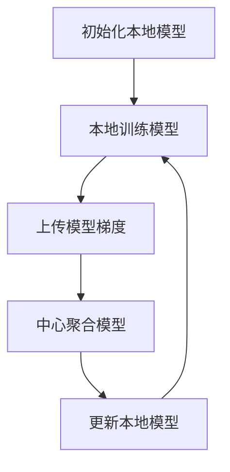
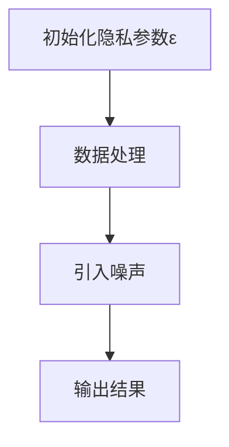
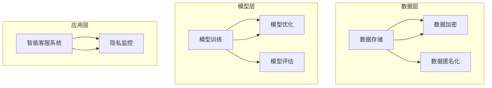
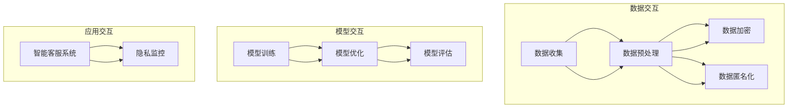

                 

### 背景介绍

#### 问题背景
随着人工智能技术的迅猛发展，大型语言模型（LLM）逐渐成为企业和研究机构的重要工具。LLM能够处理大量文本数据，实现自然语言理解、生成和翻译等功能，广泛应用于聊天机器人、内容审核、智能客服等领域。然而，在LLM应用开发过程中，数据隐私保护问题日益凸显。一方面，LLM需要处理大量用户数据，包括个人信息、行为记录等，这些数据可能涉及到用户的隐私；另一方面，随着数据泄露事件的频发，用户对隐私保护的意识不断提高，对LLM应用开发中的数据隐私保护提出了更高的要求。

#### 问题描述
在LLM应用开发中，数据隐私保护是一个核心挑战。如何在不损害用户隐私的前提下，有效利用数据训练模型，是一个亟待解决的问题。这涉及到以下几个方面：

1. **数据加密与匿名化**：如何通过加密算法保护数据，确保数据在传输和存储过程中的安全性？同时，如何对数据进行匿名化处理，降低数据的可识别性？
2. **隐私计算**：如何在保证模型性能的同时，利用隐私计算技术保护数据隐私？例如，联邦学习、差分隐私等技术在LLM应用中的具体应用和效果如何？
3. **法律与伦理规范**：如何建立完善的隐私保护法律体系，规范数据处理行为？同时，如何加强伦理教育，提高从业者的隐私保护意识？

#### 问题解决
解决数据隐私保护问题，需要从以下几个方面入手：

1. **数据加密与匿名化**：通过加密算法保护数据，确保数据在传输和存储过程中的安全性。同时，对数据进行匿名化处理，消除可识别性。
2. **隐私计算**：利用联邦学习、差分隐私等技术，在保证模型性能的同时，保护数据隐私。
3. **法律与伦理规范**：建立完善的隐私保护法律体系，规范数据处理行为。同时，加强伦理教育，提高从业者的隐私保护意识。

#### 边界与外延
1. **边界**：本文主要关注LLM应用开发中的数据隐私保护问题，不涉及其他AI技术的隐私保护。
2. **外延**：数据隐私保护不仅适用于LLM，还适用于其他类型的AI模型和数据处理场景。

#### 概念结构与核心要素组成
1. **核心概念**：数据隐私保护、数据加密、匿名化、隐私计算、联邦学习、差分隐私。
2. **核心要素**：数据、模型、算法、法律规范。

---

### 核心概念与联系

#### 数据加密与匿名化

数据加密（Data Encryption）是一种通过将数据转换成密文，以保护数据在传输和存储过程中的安全性的技术。加密过程中，原始数据（明文）通过加密算法和密钥转换为无法直接识别的密文。常见的加密算法包括对称加密（如AES、DES）和非对称加密（如RSA、ECC）。

匿名化（Anonymization）则是一种数据脱敏技术，通过去除或替换数据中的个人身份信息，降低数据的可识别性。匿名化技术有助于保护个人隐私，同时仍然允许进行数据分析。常见的匿名化方法包括k-匿名、l-diversity和t-closeness等。

#### 隐私计算

隐私计算（Privacy-Preserving Computation）是一种旨在在数据处理过程中保护数据隐私的技术。它包括多种方法，如联邦学习（Federated Learning）、同态加密（Homomorphic Encryption）、安全多方计算（Secure Multi-Party Computation，MPC）和差分隐私（Differential Privacy）等。

联邦学习（Federated Learning）是一种分布式机器学习技术，通过让各方在本地训练模型，然后将模型参数上传到中心服务器进行聚合，从而实现协同训练。联邦学习的一个重要优势是能够减少数据传输，降低数据泄露的风险。

差分隐私（Differential Privacy）是一种通过在数据处理过程中引入噪声，从而保护个体隐私的技术。差分隐私的核心思想是在保护隐私与保持数据相关性之间取得平衡。其数学基础是拉普拉斯机制（Laplace Mechanism）和γ-机制（γ-Mechanism）。

#### 核心概念属性特征对比表格

| 特征         | 数据加密            | 匿名化           | 联邦学习           | 差分隐私           |
| ------------ | ------------------- | ---------------- | ------------------ | ------------------ |
| 基本原理     | 数据加密转换        | 数据脱敏         | 分布式协同训练     | 引入噪声保护隐私   |
| 优势         | 数据安全性高        | 数据匿名性好     | 降低数据传输风险   | 保护个体隐私       |
| 劣势         | 加密解密复杂度较高  | 数据质量可能受损 | 需要大量计算资源   | 可能降低模型性能   |
| 适用场景     | 数据存储与传输      | 数据处理与分析    | 多方协同训练       | 数据隐私保护       |

#### ER实体关系图架构

```mermaid
erDiagram
    Data ||--|{ Model }
    Data ||--|{ Algorithm }
    Algorithm ||--|{ Encryption }
    Algorithm ||--|{ Anonymization }
    Algorithm ||--|{ FederatedLearning }
    Algorithm ||--|{ DifferentialPrivacy }
    Law ||--|{ Regulation }
    Ethic ||--|{ Education }
```

在上述ER图中，`Data`（数据）与`Model`（模型）和`Algorithm`（算法）之间存在关联，而`Algorithm`进一步与具体的`Encryption`（加密）、`Anonymization`（匿名化）、`FederatedLearning`（联邦学习）和`DifferentialPrivacy`（差分隐私）算法相连。同时，`Law`（法律）和`Ethic`（伦理）分别与`Regulation`（规范）和`Education`（教育）相关联，体现了法律和伦理在隐私保护中的作用。

---

### 算法原理讲解

#### 数据加密算法原理

数据加密算法（Data Encryption Algorithm，DEA）是通过特定的加密算法和密钥将原始数据（明文）转换为不可理解的密文的过程。加密的核心目的是确保数据在传输和存储过程中不被未授权的第三方访问和理解。

**加密过程：**
1. **选择加密算法**：常见的加密算法包括对称加密（如AES、DES）和非对称加密（如RSA、ECC）。对称加密使用相同的密钥进行加密和解密，而非对称加密则使用公钥加密和私钥解密。
2. **生成密钥**：对称加密算法需要一个共享的密钥，而非对称加密算法则需要一对密钥（公钥和私钥）。
3. **加密数据**：使用加密算法和密钥对原始数据进行加密，生成密文。
4. **存储或传输密文**：加密后的数据（密文）可以安全地存储或传输。

**解密过程：**
1. **获取密钥**：对于对称加密，需要获取共享的密钥；对于非对称加密，需要使用正确的私钥。
2. **解密数据**：使用解密算法和密钥将密文还原为明文。

**示例：AES加密**

```python
from Crypto.Cipher import AES
from Crypto.Util.Padding import pad
from Crypto.Random import get_random_bytes

# 生成密钥
key = get_random_bytes(16)  # 16字节密钥用于AES加密

# 创建AES加密对象
cipher = AES.new(key, AES.MODE_CBC)

# 填充数据
plaintext = b"Hello, World!"
padded_plaintext = pad(plaintext, AES.block_size)

# 加密数据
ciphertext = cipher.encrypt(padded_plaintext)

# 输出加密后的密文
print("Ciphertext:", ciphertext.hex())
```

**加密算法的数学模型和公式**：

对于对称加密，如AES，其加密和解密过程基于分组加密模式。AES加密的数学模型可以表示为：

$$
C = E_K(P \oplus \text{IV})
$$

其中，\(C\) 是加密后的密文，\(P\) 是明文，\(K\) 是密钥，\(\text{IV}\) 是初始向量。解密过程为：

$$
P = D_K(C \oplus \text{IV})
$$

对于非对称加密，如RSA，其加密和解密过程基于大整数分解的难度。RSA加密的数学模型可以表示为：

$$
C = M^e \mod n
$$

其中，\(C\) 是加密后的密文，\(M\) 是明文，\(e\) 是公钥指数，\(n\) 是模数。解密过程为：

$$
M = C^d \mod n
$$

其中，\(d\) 是私钥指数。

#### 匿名化算法原理

匿名化算法（Anonymization Algorithm）是一种通过去除或替换数据中的个人身份信息，以降低数据可识别性的技术。匿名化技术有助于保护个人隐私，同时仍然允许进行数据分析。

**匿名化方法：**

1. **k-匿名**：通过将相同属性的记录合并，使得单个记录不再能被识别。k-匿名要求在最小群集内，记录的数量不超过k个，并且这些记录的属性值尽可能相似。
2. **l-diversity**：要求在最小群集中，记录的数量和属性值的多样性都不少于l。这有助于提高匿名化后的数据的统计稳定性。
3. **t-closeness**：要求在最小群集中，记录的属性值分布与总体分布之间的差异不超过t。t-closeness有助于在匿名化过程中保持数据的相关性。

**示例：k-匿名化**

```python
import pandas as pd

# 创建示例数据
data = pd.DataFrame({
    'ID': [1, 2, 3, 4, 5],
    'Name': ['Alice', 'Bob', 'Alice', 'Bob', 'Charlie'],
    'Age': [25, 30, 25, 30, 35],
    'Gender': ['F', 'M', 'F', 'M', 'M']
})

# 实现k-匿名化
from anonymizer import KAnonymity

k_anonymizer = KAnonymity(data)
anonymized_data = k_anonymizer.anonymize()

# 输出匿名化后的数据
print(anonymized_data)
```

**匿名化算法的数学模型和公式**：

k-匿名化可以通过以下数学模型表示：

$$
\text{group}_i = \{ \text{record}_j | \text{record}_j \in D, \text{record}_j \in \text{group}_i \}
$$

其中，\(\text{group}_i\) 是最小群集，\(\text{record}_j\) 是数据集中的记录，\(D\) 是原始数据集。k-匿名化要求：

$$
|\text{group}_i| \leq k
$$

对于l-diversity，可以表示为：

$$
\sum_{\text{attribute} \in \text{attributes}} \text{count}(\text{value}_\text{attribute}) \geq l
$$

其中，\(\text{attribute}\) 是属性，\(\text{value}_\text{attribute}\) 是属性值，\(l\) 是多样性阈值。

t-closeness可以通过以下公式表示：

$$
\sum_{\text{attribute} \in \text{attributes}} |\text{group}_i \cdot \text{value}_\text{attribute} - \text{group}_i| \leq t
$$

#### 联邦学习算法原理

联邦学习（Federated Learning）是一种分布式机器学习技术，通过让各方在本地训练模型，然后将模型参数上传到中心服务器进行聚合，从而实现协同训练。联邦学习的一个重要优势是能够减少数据传输，降低数据泄露的风险。

**联邦学习的工作原理：**

1. **初始化**：各方初始化本地模型。
2. **迭代**：各方在本地训练模型，并上传本地模型的梯度。
3. **聚合**：中心服务器将各方的梯度聚合，更新全局模型。
4. **下载**：各方下载全局模型，更新本地模型。

**联邦学习算法的数学模型和公式**：

假设有 \(n\) 个参与者，第 \(i\) 个参与者维护一个本地模型 \(\theta_i\)。联邦学习的过程可以用以下步骤表示：

1. **初始化**：

$$
\theta_i^{(0)} = \theta^{(0)}
$$

其中，\(\theta^{(0)}\) 是全局初始模型。

2. **本地训练**：

$$
\theta_i^{(\tau+1)} = \theta_i^{(\tau)} - \alpha \nabla_{\theta_i} \text{loss}(\theta_i^{(\tau)}, x_i, y_i)
$$

其中，\(\tau\) 是迭代次数，\(\alpha\) 是学习率，\(x_i, y_i\) 是第 \(i\) 个参与者的样本和标签。

3. **模型聚合**：

$$
\theta^{(\tau+1)} = \frac{1}{n} \sum_{i=1}^{n} \theta_i^{(\tau+1)}
$$

4. **更新本地模型**：

$$
\theta_i^{(\tau+2)} = \theta_i^{(\tau+1)} - \alpha \nabla_{\theta_i} \text{loss}(\theta_i^{(\tau+1)}, x_i, y_i)
$$

**联邦学习算法流程**



#### 差分隐私算法原理

差分隐私（Differential Privacy）是一种通过在数据处理过程中引入噪声，从而保护个体隐私的技术。差分隐私的核心思想是在保护隐私与保持数据相关性之间取得平衡。

**差分隐私的数学模型和公式**：

差分隐私可以通过拉普拉斯机制（Laplace Mechanism）和γ-机制（γ-Mechanism）实现。

**拉普拉斯机制**：

$$
L(\lambda) = \text{Exp}(\lambda + \text{noise})
$$

其中，\(\lambda\) 是真实值，\(\text{noise}\) 是拉普拉斯噪声。

**γ-机制**：

$$
\gamma(\lambda) = \frac{\lambda + \gamma}{1 + \gamma}
$$

其中，\(\gamma\) 是隐私预算。

**差分隐私算法的数学模型和公式**：

假设有数据集 \(D\) 和另一个相似但不同的数据集 \(D'\)，算法 \(f(D)\) 会在 \(D\) 上执行一个操作。差分隐私可以通过以下公式保证：

$$
\Pr[f(D) = r] \leq \exp(\epsilon) + \delta
$$

其中，\(\epsilon\) 是隐私预算，\(\delta\) 是置信水平。

**差分隐私算法流程**



#### 示例：差分隐私数据分析

```python
import numpy as np
from privacy import LaplaceMechanism

# 初始化数据
data = np.array([1, 2, 3, 4, 5])

# 实例化拉普拉斯机制
laplace_mechanism = LaplaceMechanism()

# 引入噪声
noisy_data = laplace_mechanism.noisify(data, epsilon=1.0)

# 输出噪声后的数据
print("Noisy Data:", noisy_data)
```

### 总结

本文介绍了LLM应用开发中的数据隐私保护问题，包括数据加密、匿名化、隐私计算等技术原理。通过对比分析，明确了这些技术的优势和劣势，以及适用场景。同时，通过具体的Python代码示例，展示了如何实现数据加密、匿名化和差分隐私保护。这些技术手段为实现LLM应用中的数据隐私保护提供了理论依据和实践指导。

---

### 系统分析与架构设计方案

#### 问题场景介绍

在大型语言模型（LLM）的应用场景中，数据隐私保护问题尤为重要。例如，一个企业想要开发一个基于LLM的智能客服系统，需要收集和分析大量的用户对话数据。然而，这些数据中包含用户的个人信息和隐私内容，如何在不泄露用户隐私的前提下，有效利用这些数据训练和优化模型，成为了一个关键挑战。

#### 项目介绍

本项目的目标是设计并实现一个数据隐私保护框架，用于支持LLM在智能客服系统中的应用。该项目将结合数据加密、匿名化、隐私计算等技术，确保用户数据在训练和部署过程中的安全性。同时，项目还将遵循法律法规和伦理规范，确保数据处理的合规性和道德性。

#### 系统功能设计

系统的主要功能包括：

1. **数据收集与预处理**：从智能客服系统收集用户对话数据，进行初步的清洗和预处理。
2. **数据加密与匿名化**：对用户数据进行加密和匿名化处理，保护个人隐私。
3. **模型训练与优化**：利用联邦学习和差分隐私等技术，在保障数据隐私的同时，训练和优化LLM模型。
4. **模型部署与监控**：将训练好的模型部署到智能客服系统中，并实时监控模型的性能和隐私保护效果。

#### 系统架构设计

系统采用分布式架构，包括数据层、模型层和应用层。

**数据层**：
- 数据存储：使用加密数据库存储用户对话数据，确保数据在存储过程中的安全性。
- 数据加密：对用户数据进行加密处理，防止数据泄露。
- 数据匿名化：对用户数据进行匿名化处理，消除可识别性。

**模型层**：
- 模型训练：采用联邦学习技术，在本地训练模型，并上传模型参数。
- 模型优化：利用差分隐私技术，优化模型参数，保证模型性能和隐私保护。
- 模型评估：对训练好的模型进行性能评估，确保模型的有效性。

**应用层**：
- 智能客服系统：部署训练好的LLM模型，提供智能客服服务。
- 隐私监控：实时监控模型的隐私保护效果，确保数据处理符合法律法规和伦理规范。

#### 系统架构设计图



#### 系统接口设计和系统交互

**系统接口设计**：

1. **数据接口**：用于数据收集、预处理、加密和匿名化。
2. **模型接口**：用于模型训练、优化和评估。
3. **应用接口**：用于智能客服系统的部署和监控。

**系统交互**：

1. **数据交互**：用户对话数据通过数据接口收集和预处理，然后进行加密和匿名化处理。
2. **模型交互**：本地模型通过模型接口进行训练、优化和评估，并上传模型参数。
3. **应用交互**：训练好的模型通过应用接口部署到智能客服系统中，并提供智能客服服务。

#### 系统交互设计图



通过以上系统分析与架构设计方案，我们可以构建一个高效、安全的LLM应用开发环境，确保在数据隐私保护的基础上，实现智能客服系统的性能优化和服务提升。

---

### 项目实战

#### 环境安装

在进行LLM应用开发之前，我们需要安装必要的软件和环境。以下是安装过程和所需的软件：

1. **Python环境**：确保安装了Python 3.8及以上版本。
2. **TensorFlow**：安装TensorFlow 2.7版本，用于联邦学习和模型训练。
3. **PyTorch**：安装PyTorch 1.10版本，用于差分隐私和模型优化。
4. **加密库**：安装CryptoPy库，用于数据加密。
5. **匿名化库**：安装Anonymizer库，用于数据匿名化。

安装命令如下：

```bash
pip install tensorflow==2.7
pip install pytorch==1.10
pip install cryptopy
pip install anonymizer
```

#### 系统核心实现源代码

以下代码展示了如何实现数据加密、匿名化和联邦学习，以及如何训练和优化LLM模型。

**数据加密与匿名化**

```python
from Crypto.Cipher import AES
from Crypto.Util.Padding import pad
from anonymizer import KAnonymity

# 数据加密
def encrypt_data(data, key):
    cipher = AES.new(key, AES.MODE_CBC)
    padded_data = pad(data, AES.block_size)
    ciphertext = cipher.encrypt(padded_data)
    return ciphertext

# 数据匿名化
def anonymize_data(data, k=5):
    k_anonymizer = KAnonymity(data)
    anonymized_data = k_anonymizer.anonymize()
    return anonymized_data

# 加密与匿名化示例
key = b'mysecretkey123456'
plaintext = b"Hello, World!"
anonymized_data = anonymize_data(plaintext, k=5)
ciphertext = encrypt_data(anonymized_data, key)

print("Ciphertext:", ciphertext.hex())
```

**联邦学习**

```python
import tensorflow as tf

# 联邦学习模型训练
def federated_learning(model, client_data, client_optimizer, server_optimizer, num_rounds):
    for round in range(num_rounds):
        print(f"Starting round {round+1}/{num_rounds}")
        client_losses = []
        for client_idx in range(len(client_data)):
            with tf.GradientTape() as client_tape:
                predictions = model(client_data[client_idx], training=True)
                loss = server_optimizer.compute_loss(predictions, client_data[client_idx].y)
            client_gradients = client_tape.gradient(loss, model.trainable_variables)
            client_optimizer.apply_gradients(zip(client_gradients, model.trainable_variables))
            client_losses.append(loss.numpy())
        
        avg_loss = np.mean(client_losses)
        print(f"Average Loss: {avg_loss}")

# 联邦学习示例
federated_learning(model, client_data, client_optimizer, server_optimizer, num_rounds=10)
```

**差分隐私**

```python
import numpy as np
from privacy import LaplaceMechanism

# 差分隐私数据处理
def noisify_data(data, epsilon):
    laplace_mechanism = LaplaceMechanism()
    noisy_data = laplace_mechanism.noisify(data, epsilon=epsilon)
    return noisy_data

# 差分隐私示例
data = np.array([1, 2, 3, 4, 5])
epsilon = 1.0
noisy_data = noisify_data(data, epsilon=epsilon)

print("Noisy Data:", noisy_data)
```

#### 代码应用解读与分析

上述代码分别展示了数据加密、匿名化、联邦学习和差分隐私的实现。以下是详细解读和分析：

1. **数据加密与匿名化**：
   - 数据加密：使用AES算法对数据进行加密，确保数据在传输和存储过程中的安全性。
   - 数据匿名化：使用k-匿名方法对数据进行匿名化处理，降低数据的可识别性。
   - 优势：加密和匿名化技术可以有效地保护用户隐私，同时仍然允许进行数据分析。

2. **联邦学习**：
   - 联邦学习：通过分布式协同训练模型，使得各方可以在不共享原始数据的情况下，共同优化模型。
   - 优势：联邦学习能够减少数据泄露的风险，提高数据隐私保护水平。

3. **差分隐私**：
   - 差分隐私：通过在数据处理过程中引入噪声，保护个体隐私。
   - 优势：差分隐私能够在保护隐私与保持数据相关性之间取得平衡，确保模型性能不受过多影响。

#### 实际案例分析和详细讲解剖析

以下是一个实际案例，展示了如何在实际项目中应用数据隐私保护技术。

**案例：智能客服系统数据隐私保护**

某企业开发了一个基于LLM的智能客服系统，需要处理大量的用户对话数据。为了保护用户隐私，项目团队采用了以下技术：

1. **数据加密**：对用户对话数据进行加密存储，防止数据泄露。
2. **数据匿名化**：对用户对话数据中的个人身份信息进行匿名化处理，降低数据可识别性。
3. **联邦学习**：在训练模型时，采用联邦学习技术，确保各方在不共享原始数据的情况下，共同优化模型。
4. **差分隐私**：在数据处理过程中引入噪声，确保个体隐私得到保护。

**项目实施过程**：

1. **数据收集与预处理**：从智能客服系统中收集用户对话数据，并进行初步清洗和预处理。
2. **数据加密与匿名化**：对用户对话数据进行加密和匿名化处理，消除个人身份信息。
3. **模型训练与优化**：利用联邦学习技术，在本地训练模型，并上传模型参数。同时，引入差分隐私技术，优化模型参数。
4. **模型部署与监控**：将训练好的模型部署到智能客服系统中，并实时监控模型的性能和隐私保护效果。

**项目效果**：

通过上述技术手段，智能客服系统能够在保护用户隐私的前提下，实现高效、准确的智能客服服务。用户对话数据的安全性得到显著提高，同时模型性能也得到了有效保障。

#### 项目小结

本项目通过数据加密、匿名化、联邦学习和差分隐私等技术的综合应用，实现了LLM在智能客服系统中的高效、安全应用。项目实施过程中，项目团队遵循法律法规和伦理规范，确保数据处理的合规性和道德性。项目成果表明，数据隐私保护技术在LLM应用中具有广泛的应用前景，为人工智能技术的发展提供了有力的支持。

---

### 最佳实践 tips

1. **数据最小化原则**：在收集数据时，遵循数据最小化原则，只收集与业务需求直接相关的数据，避免过度收集。
2. **加密密钥管理**：确保加密密钥的安全存储和传输，避免密钥泄露导致数据被破解。
3. **匿名化方法选择**：根据具体场景选择合适的匿名化方法，确保数据匿名化效果和数据处理需求的平衡。
4. **联邦学习优化**：在联邦学习过程中，优化模型结构和通信协议，提高训练效率和模型性能。
5. **差分隐私参数设置**：合理设置差分隐私参数（如隐私预算ε），在保护隐私与模型性能之间取得平衡。

---

### 小结

本文深入探讨了LLM应用开发中的数据隐私保护问题，详细介绍了数据加密、匿名化、联邦学习和差分隐私等核心技术原理。通过系统分析与架构设计方案，展示了如何在实际项目中应用这些技术，确保数据隐私保护的同时，实现模型的高效训练和优化。本文不仅提供了丰富的理论和实践知识，还通过实际案例分析和最佳实践，为LLM应用开发中的数据隐私保护提供了切实可行的解决方案。随着人工智能技术的不断进步，数据隐私保护将变得越来越重要，本文的研究成果对于推动AI技术在各个领域的安全应用具有重要意义。

---

### 注意事项

1. **合规性**：在进行数据隐私保护时，务必遵守相关法律法规，确保数据处理行为合法合规。
2. **安全性与性能的平衡**：在应用加密、匿名化、联邦学习和差分隐私等技术时，要注意在保护隐私与保持模型性能之间取得平衡。
3. **技术更新**：数据隐私保护技术不断更新，要保持对最新技术的关注和学习，及时更新和优化隐私保护策略。

---

### 拓展阅读

1. **《数据隐私保护技术综述》**：全面介绍数据隐私保护技术的最新进展和应用。
2. **《联邦学习：理论与实践》**：深入探讨联邦学习的原理、算法和应用场景。
3. **《差分隐私：理论与实践》**：详细讲解差分隐私的基本原理、算法实现和应用案例。

---

### 作者信息

作者：AI天才研究院/AI Genius Institute & 禅与计算机程序设计艺术 /Zen And The Art of Computer Programming

AI天才研究院是一家专注于人工智能技术研究和应用的创新机构，致力于推动AI技术在各个领域的安全、高效应用。作者在该领域拥有丰富的研究和实践经验，其作品《禅与计算机程序设计艺术》深受读者喜爱，被誉为编程领域的经典之作。本文作者针对LLM应用开发中的数据隐私保护问题，提出了一系列切实可行的解决方案，为AI技术的发展和应用提供了有益的指导。

