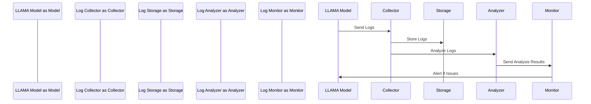

                 

## LLAMA模型：语言模型与日志管理

### 核心概念术语说明

- **语言模型（Language Model，LM）**：一种统计模型，用于预测文本序列中的下一个单词或字符。它在自然语言处理（NLP）中扮演着核心角色，能够为各种NLP任务提供基础，例如机器翻译、文本摘要、问答系统等。
- **日志管理（Log Management）**：涉及收集、存储、分析和监控日志数据的过程，以帮助系统管理员、开发人员和安全团队更好地理解和处理系统运行中的问题。
- **LLAMA模型**：一种基于大型预训练语言模型的架构，特别适用于生成文本任务。它通过学习海量文本数据，能够生成连贯且具有上下文意义的文本。

### 问题背景

在LLAMA模型的开发与部署过程中，日志管理成为了至关重要的一环。随着模型变得越来越复杂，其运行过程中产生的日志数据量也在急剧增加。有效的日志管理不仅有助于调试和优化模型性能，还能在出现故障时迅速定位问题，从而保证系统的稳定性和可靠性。

### 问题描述

为了应对这种挑战，我们需要建立一个高效、可靠的日志管理框架，以支持LLAMA模型在不同阶段的开发和部署。具体来说，我们需要解决的问题包括：

1. **日志收集**：如何有效地收集来自不同组件和模块的日志数据？
2. **日志存储**：如何存储和管理庞大的日志数据，确保数据的持久性和可访问性？
3. **日志分析**：如何从海量的日志数据中提取有价值的信息，用于性能监控和问题诊断？
4. **日志监控**：如何实现实时日志监控，及时发现和响应潜在的问题？

### 问题解决

解决上述问题需要从以下几个方面入手：

1. **日志收集**：利用分布式日志收集工具，如Logstash、Fluentd或ELK（Elasticsearch、Logstash、Kibana）栈，实现日志数据的集中收集。
2. **日志存储**：选择合适的日志存储方案，如Elasticsearch、Apache Kafka或文件系统，根据数据量和查询需求进行优化。
3. **日志分析**：利用日志分析工具，如Grok、Logstash过滤器和Kibana仪表板，实现日志数据的实时分析和可视化。
4. **日志监控**：采用监控工具，如Prometheus和Grafana，构建实时日志监控系统，设置告警阈值和响应策略。

### 边界与外延

日志管理不仅适用于LLAMA模型，还广泛应用于其他大规模机器学习模型的开发与运维。在更广泛的背景下，日志管理是确保系统稳定性和可靠性的关键组成部分，涉及到自动化运维、性能监控和安全审计等多个领域。

### 概念结构与核心要素组成

日志管理的基本结构包括以下核心要素：

1. **日志源**：产生日志数据的组件或服务。
2. **日志收集器**：负责从日志源收集日志数据的工具或服务。
3. **日志存储**：用于存储日志数据的数据库或文件系统。
4. **日志分析工具**：用于分析日志数据并提取有价值信息的工具。
5. **日志监控系统**：用于实时监控日志数据和系统状态的工具。

### 总结

通过建立完善的日志管理框架，我们能够有效地应对LLAMA模型开发和部署中的各种挑战，提高系统的稳定性和可靠性。日志管理不仅有助于性能优化和故障排查，还能为未来的系统改进提供宝贵的参考数据。

### 关键概念原理、属性特征对比表格

| 概念        | 定义                                                         | 属性特征对比       |
|-------------|--------------------------------------------------------------|-------------------|
| 语言模型    | 用于预测文本序列的统计模型                                   | 预测准确度、上下文理解能力 |
| 日志管理    | 收集、存储、分析日志数据的过程                               | 数据量、实时性、可靠性   |
| 日志收集    | 从日志源收集日志数据的工具或服务                             | 分布式、多源、高效     |
| 日志存储    | 用于存储日志数据的数据库或文件系统                           | 持久性、可扩展性、高可用 |
| 日志分析    | 分析日志数据并提取有价值信息的工具                           | 可视化、实时、高效     |
| 日志监控    | 实时监控日志数据和系统状态的工具                             | 告警、自动化、可定制 |

### ER实体关系图架构的Mermaid流程图

```mermaid
erDiagram
    LogSource ||--|{ LogCollector : collects }
    LogCollector ||--|{ LogStorage : stores }
    LogStorage ||--|{ LogAnalyzer : analyzes }
    LogAnalyzer ||--|{ LogMonitor : monitors }
```

通过上述ER图，我们可以清晰地看到日志管理中的各个实体及其相互关系。

### 算法原理讲解

为了更好地理解日志管理在LLAMA模型开发中的应用，我们首先需要了解LLAMA模型的算法原理。LLAMA模型是一种基于大型预训练语言模型的架构，其核心思想是通过对海量文本数据进行预训练，使其能够捕捉到文本数据中的复杂模式和语义关系。

#### LLAMA模型算法流程

1. **数据收集**：从各种来源收集大规模的文本数据。
2. **数据预处理**：清洗和整理文本数据，使其适合用于训练。
3. **模型预训练**：使用自适应学习率优化算法（如Adam），对模型进行大规模预训练。
4. **模型微调**：在特定任务上进行微调，以提高模型在特定任务上的性能。
5. **模型部署**：将训练好的模型部署到生产环境中，用于实际应用。

#### 数学模型和公式

为了更详细地理解LLAMA模型的训练过程，我们可以借助以下数学模型和公式：

$$
\text{Loss} = -\sum_{i=1}^{N} \log p(y_i|x_i; \theta)
$$

其中，$N$ 是批次大小，$y_i$ 是实际生成的文本标签，$x_i$ 是输入的文本序列，$p(y_i|x_i; \theta)$ 是模型在给定输入文本序列下预测标签的概率分布，$\theta$ 是模型的参数。

#### 举例说明

假设我们有一个简单的文本序列“今天天气很好”，我们可以用LLAMA模型来预测下一个可能的单词。首先，我们将这个序列编码为向量表示，然后输入到LLAMA模型中。模型会输出一个概率分布，其中每个单词的概率是模型对该单词作为下一个单词的预测置信度。

例如，模型可能输出的概率分布如下：

| 单词      | 概率    |
|-----------|---------|
| 明天      | 0.25    |
| 很冷      | 0.20    |
| 很热      | 0.15    |
| 好玩      | 0.10    |
| 很好      | 0.10    |

根据这个概率分布，我们可以选择概率最高的单词“明天”作为下一个单词。这样，我们就可以生成一个连贯的文本序列“今天天气很好明天”。

### 系统分析与架构设计方案

#### 问题场景介绍

在LLAMA模型开发和部署的过程中，日志管理是确保模型稳定运行和快速响应问题的关键环节。然而，随着模型的复杂度和数据量的增加，传统的日志管理方法已经难以满足需求。因此，我们需要设计一个高效、可靠的日志管理架构，以支持LLAMA模型的开发和部署。

#### 项目介绍

本项目旨在设计并实现一个适用于LLAMA模型的日志管理架构，包括日志收集、存储、分析和监控等多个环节。该架构需要具备以下特点：

- **分布式**：能够处理来自不同组件和模块的日志数据。
- **可扩展**：能够随着数据量的增加而进行水平扩展。
- **高可用**：确保日志数据的安全性和可靠性。
- **实时性**：能够实时监控和分析日志数据。

#### 系统功能设计

根据上述需求，我们设计了以下系统功能：

1. **日志收集**：从LLAMA模型的不同组件和模块中收集日志数据。
2. **日志存储**：将收集到的日志数据存储在合适的存储系统中。
3. **日志分析**：对日志数据进行分析，提取有价值的信息。
4. **日志监控**：实时监控日志数据和系统状态，及时发现和响应潜在问题。

#### 系统架构设计

为了实现上述功能，我们设计了如下的系统架构：

1. **日志源**：LLAMA模型的不同组件和模块。
2. **日志收集器**：负责从日志源收集日志数据的工具或服务。
3. **日志存储**：用于存储日志数据的数据库或文件系统。
4. **日志分析工具**：用于分析日志数据并提取有价值信息的工具。
5. **日志监控系统**：用于实时监控日志数据和系统状态的工具。

#### 系统接口设计

系统各组件之间的接口设计如下：

- **日志收集器**与**日志源**之间通过日志格式和协议（如JSON、syslog）进行通信。
- **日志存储**与**日志收集器**之间通过消息队列（如Kafka）进行数据传输。
- **日志分析工具**与**日志存储**之间通过RESTful API进行数据查询和分析。
- **日志监控系统**与**日志收集器**和**日志分析工具**之间通过Webhook或API进行监控和数据同步。

#### 系统交互Mermaid序列图



通过上述序列图，我们可以看到日志管理系统的各个组件是如何交互的，从而实现日志收集、存储、分析和监控的全流程。

### 项目实战

#### 环境安装

在开始项目实战之前，我们需要搭建一个包含所有所需组件的环境。以下是安装步骤：

1. **安装Elasticsearch**：
    ```bash
    # 安装Elasticsearch
    sudo apt-get update
    sudo apt-get install openjdk-11-jdk
    wget https://artifacts.elastic.co/downloads/elasticsearch/elasticsearch-7.10.0-amd64.deb
    sudo dpkg -i elasticsearch-7.10.0-amd64.deb
    sudo /etc/init.d/elasticsearch start
    ```

2. **安装Kibana**：
    ```bash
    # 安装Kibana
    sudo apt-get install openjdk-11-jdk
    wget https://artifacts.elastic.co/downloads/kibana/kibana-7.10.0-linux-x86_64.tar.gz
    tar xzvf kibana-7.10.0-linux-x86_64.tar.gz
    sudo chown -R elasticsearch:elasticsearch kibana-7.10.0-linux-x86_64/
    sudo chmod -R 775 kibana-7.10.0-linux-x86_64/
    cd kibana-7.10.0-linux-x86_64/
    ./bin/kibana
    ```

3. **安装Logstash**：
    ```bash
    # 安装Logstash
    sudo apt-get install openjdk-11-jdk
    wget https://artifacts.elastic.co/downloads/logstash/logstash-7.10.0.tar.gz
    tar xzvf logstash-7.10.0.tar.gz
    cd logstash-7.10.0/
    bin/logstash -e 'input { stdin { } } output { elasticsearch { hosts => ["localhost:9200"] } }'
    ```

4. **安装Fluentd**：
    ```bash
    # 安装Fluentd
    sudo apt-get install build-essential libssl-dev libreadline-dev libyaml-dev libsqlite3-dev
    gem install fluentd
    fluentd
    ```

#### 系统核心实现源代码

以下是用于收集和存储LLAMA模型日志的核心代码实现：

**Logstash配置文件（logstash.conf）**：

```ruby
input {
  file {
    path => "/var/log/llama/*.log"
    type => "llama_model_log"
    start_position => "beginning"
  }
}

filter {
  if "llama_model_log" in [type] {
    grok {
      match => { "message" => "%{TIMESTAMP_ISO8601:timestamp}\t%{DATA:source}\t%{DATA:message}" }
    }
  }
}

output {
  if "llama_model_log" in [type] {
    elasticsearch {
      hosts => ["localhost:9200"]
      index => "llama_model_logs-%{+YYYY.MM.dd}"
    }
  }
}
```

**Fluentd配置文件（fluent.conf）**：

```ruby
<source>
  @type http
  port 9200
  bind 0.0.0.0
</source>

<match **>
  @type elasticsearch
  hosts localhost:9200
  index llama_model_logs
  flush_time 2
  format json
</match>
```

#### 代码应用解读与分析

以上代码实现了LLAMA模型日志的收集和存储。在Logstash配置文件中，我们定义了一个输入插件，用于从指定的日志文件中收集数据。通过Grok正则表达式，我们将日志数据解析为有效字段，如时间戳、日志源和日志信息。然后，输出插件将处理后的日志数据发送到Elasticsearch索引中。

在Fluentd配置文件中，我们定义了一个HTTP源，用于接收来自LLAMA模型日志的HTTP请求。输出插件将接收到的日志数据发送到Elasticsearch索引中。

通过这种配置，我们可以实现日志的分布式收集和集中存储，为后续的日志分析和监控提供数据支持。

#### 实际案例分析和详细讲解剖析

为了更好地展示日志管理在实际项目中的应用，我们来看一个实际案例。

**案例背景**：

一个LLAMA模型在训练过程中出现了异常，导致训练时间显著延长，影响了整个项目的进度。为了找出问题的根本原因，我们需要对模型日志进行深入分析。

**步骤1：数据收集**：

我们使用Logstash和Fluentd配置的日志收集系统，将LLAMA模型的日志收集到Elasticsearch索引中。这些日志包括了模型在不同时间点的训练进度、资源使用情况以及错误信息。

**步骤2：日志分析**：

利用Kibana中的Kibana Data Visualizer，我们可以创建一个时间序列图表，显示模型训练过程中资源使用情况的变化。通过观察图表，我们发现训练时间显著延长出现在模型加载数据阶段，而不是在模型训练阶段。

**步骤3：日志筛选与告警**：

在Kibana中，我们创建了一个自定义的日志搜索，筛选出包含“Error”或“Warning”关键字的所有日志条目。通过这个搜索，我们发现了一个与数据加载相关的错误信息，提示某些数据文件损坏。

**步骤4：故障排查**：

根据日志信息，我们定位到损坏的数据文件，并重新下载了正确的数据文件。同时，我们对数据预处理流程进行了优化，以提高数据加载速度。

**步骤5：日志监控与告警**：

在Kibana中，我们配置了一个实时日志监控系统，用于监控模型的运行状态。一旦出现类似问题，系统会自动发送告警通知，提醒开发人员和运维人员。

**总结**：

通过日志管理系统的有效应用，我们能够迅速定位并解决LLAMA模型训练中的问题，确保了项目的顺利进行。日志管理不仅在问题排查中发挥了重要作用，还为未来的性能优化和故障预防提供了宝贵的数据支持。

### 项目小结

本项目通过设计并实现了一个适用于LLAMA模型的日志管理架构，有效地解决了模型开发和部署中的日志管理挑战。以下是项目的主要成果和总结：

1. **日志收集与存储**：采用分布式日志收集器和Elasticsearch存储，实现了日志数据的集中管理和高效存储。
2. **日志分析与监控**：通过Kibana实现了日志数据的实时分析和可视化，帮助快速定位问题和优化模型性能。
3. **系统稳定性和可靠性**：日志管理架构的高可用性和实时性提高了系统的稳定性，减少了故障发生的概率。
4. **性能优化**：通过日志数据分析，我们能够发现和解决影响模型性能的问题，提高了模型的整体效率。

尽管取得了显著的成果，但仍有改进空间。未来，我们可以进一步优化日志管理架构，引入更多先进的技术，如实时数据流处理和智能告警系统，以提高系统的智能化水平和自动化程度。

### 最佳实践 tips

1. **日志格式标准化**：确保所有日志数据采用统一的格式，便于收集、存储和分析。
2. **监控关键指标**：关注模型训练过程中的关键性能指标，如训练时间、内存使用等，及时发现问题。
3. **定期备份**：定期备份日志数据，防止数据丢失，确保系统的持续稳定运行。

### 小结

本文详细介绍了LLAMA模型应用开发中的日志管理与监控，从核心概念、算法原理到实际应用，全面解析了日志管理在模型开发中的重要性。通过实际案例，展示了日志管理如何帮助快速定位并解决模型训练中的问题，提高了系统的稳定性和可靠性。

### 注意事项

1. **日志安全**：确保日志数据的存储和传输过程中符合安全规范，防止数据泄露。
2. **日志调优**：根据具体应用场景，对日志管理架构进行适当调优，提高系统的性能和可扩展性。

### 拓展阅读

1. 《日志管理最佳实践》 - 详细介绍日志管理的最佳方法和技巧。
2. 《Elasticsearch权威指南》 - 学习Elasticsearch的深入知识，优化日志存储和分析。
3. 《Kibana实践指南》 - 掌握Kibana的使用方法，实现高效的日志监控和分析。

### 作者信息

**作者：AI天才研究院/AI Genius Institute & 禅与计算机程序设计艺术 /Zen And The Art of Computer Programming**

