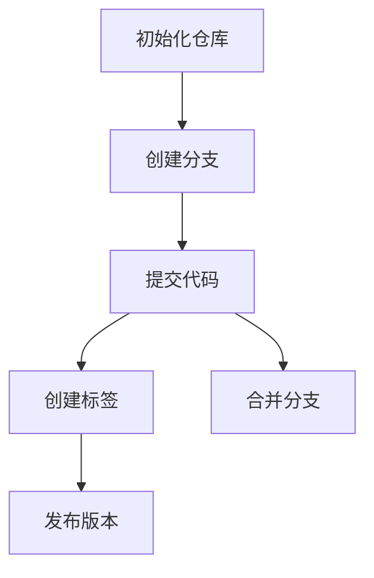
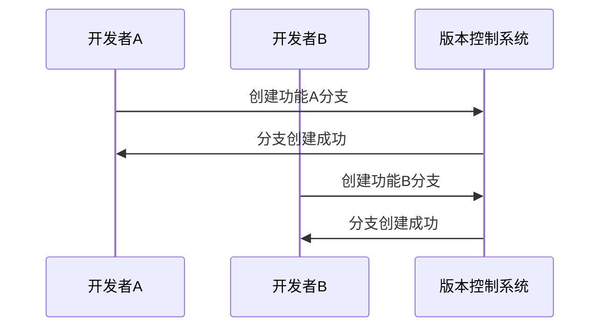
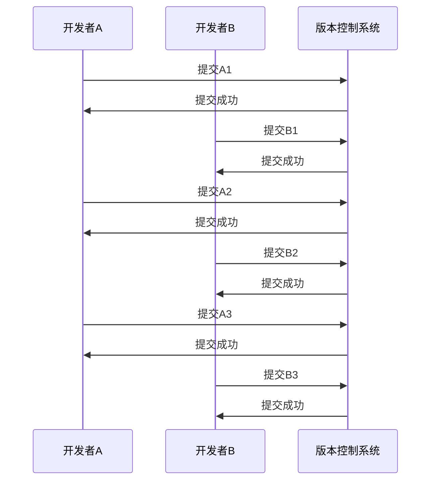
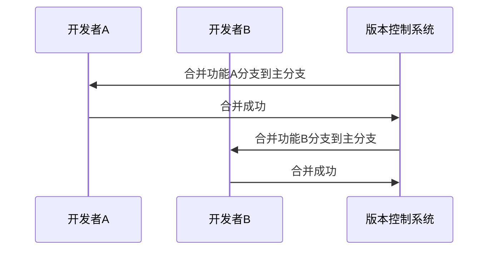
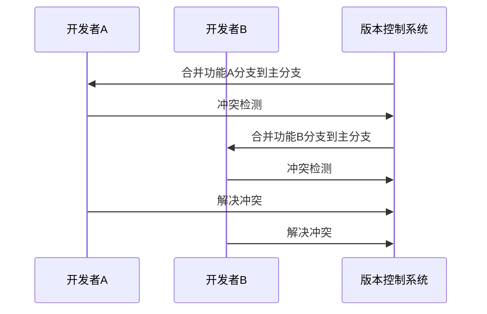
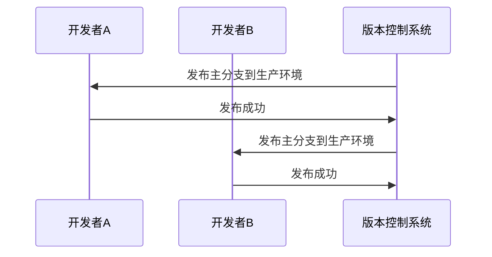
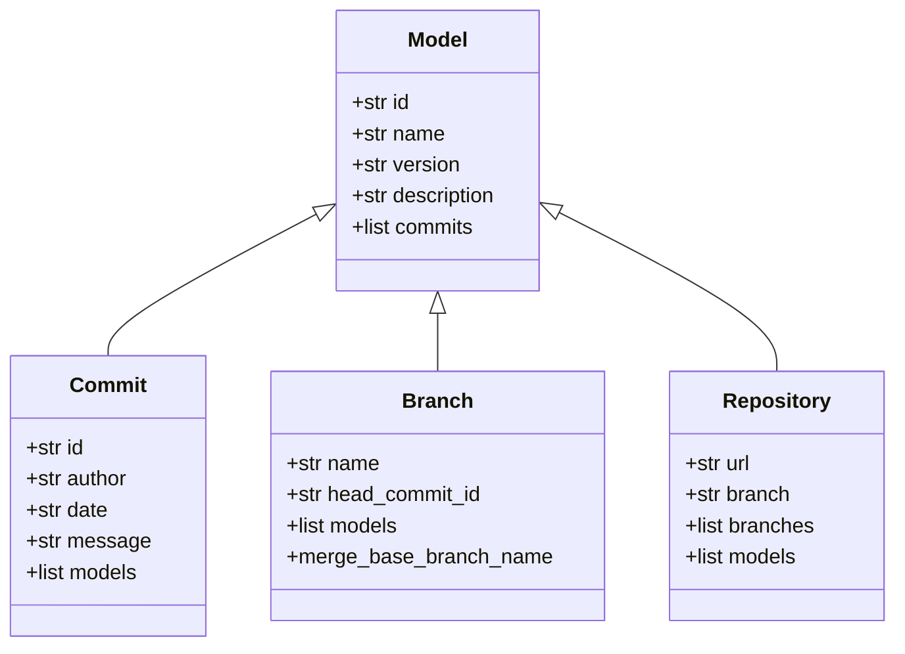
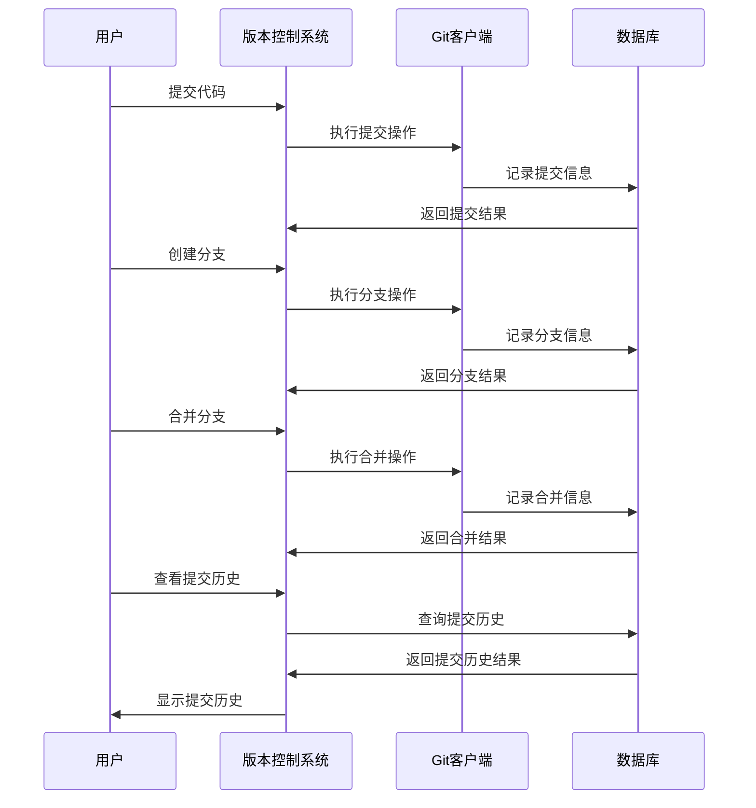
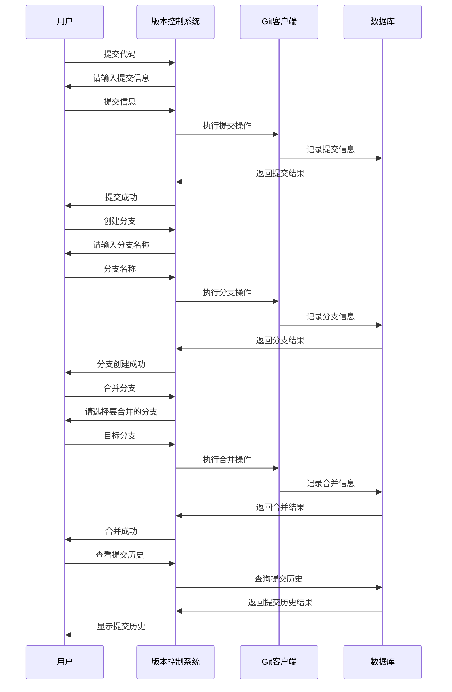

                 

### 1. 背景介绍

#### 1.1 问题背景

版本控制是一种非常重要的软件工程实践，它能够帮助我们追踪代码的变更历史、管理多个版本的差异，并确保代码库的一致性和完整性。在LLM（大型语言模型）应用开发中，版本控制同样扮演着至关重要的角色。随着模型变得越来越大，代码库也会随之膨胀，变得极其复杂。如果不进行有效的版本控制，开发团队将很难跟踪和管理这些变化，这可能会导致以下问题：

1. **代码冲突**：当多个开发者同时修改同一个文件时，如果没有版本控制，很容易产生冲突，导致代码无法编译或运行。
2. **历史追踪困难**：在大型项目中，代码变更频繁，如果没有版本控制，很难追溯代码的变更历史，这给代码审查和维护带来了巨大的困难。
3. **部署问题**：由于版本不统一，不同环境（如开发、测试、生产）可能会出现兼容性问题，导致部署失败。
4. **版本迭代困难**：在LLM开发过程中，可能需要进行多个版本的迭代和优化。如果没有版本控制，很难管理这些不同的版本，也无法有效地进行迭代。

#### 1.2 问题描述

在LLM应用开发中，常见的问题和挑战包括：

1. **代码库复杂性增加**：LLM项目通常涉及大量的代码库，包括训练脚本、模型定义、数据处理脚本等。随着代码量的增加，管理起来变得越来越困难。
2. **版本迭代频繁**：由于LLM模型的迭代和优化需要频繁进行，每个迭代都需要进行版本控制，以确保代码的稳定性和可追踪性。
3. **团队协作**：LLM开发通常涉及多个开发人员，他们需要协同工作，共同完成项目。没有版本控制，团队成员之间的协作将变得非常困难。
4. **代码审查**：在LLM项目中，代码审查是确保代码质量的重要环节。没有版本控制，很难进行有效的代码审查，也无法追溯代码变更的历史。
5. **错误追踪**：在开发过程中，难免会出现错误。如果没有版本控制，很难确定错误的来源和影响范围，这会增加修复错误的难度。

#### 1.3 问题解决

版本控制可以帮助解决上述问题，其主要作用包括：

1. **代码冲突管理**：版本控制系统可以记录每个开发者的更改，并在发生冲突时提供解决方案，确保代码库的一致性。
2. **历史追踪**：版本控制系统可以记录每个版本的详细信息，包括作者、修改内容和修改时间等，方便追溯代码的变更历史。
3. **部署管理**：版本控制系统能够确保代码库的一致性，减少部署过程中出现兼容性问题。
4. **团队协作**：版本控制系统支持多人协作，每个开发者都可以在自己的分支上进行开发，然后合并到主分支。
5. **代码审查**：版本控制系统可以方便地进行代码审查，确保代码的质量和一致性。
6. **错误追踪**：版本控制系统可以帮助确定错误的来源和影响范围，方便开发者进行错误追踪和修复。

#### 1.4 边界与外延

版本控制的范畴主要包括以下内容：

1. **代码库**：版本控制主要针对代码库进行管理，包括源代码、脚本、配置文件等。
2. **文档**：除了代码库，版本控制还可以管理项目文档，如设计文档、用户手册等。
3. **依赖库**：版本控制系统可以管理项目中使用的第三方库和依赖项，确保每个版本的依赖关系正确。
4. **数据**：在一些项目中，版本控制也可能包括数据管理，如训练数据集、测试数据集等。
5. **分支和标签**：版本控制系统支持创建分支和标签，方便进行不同功能的开发和版本管理。

#### 1.5 概念结构与核心要素组成

版本控制的核心概念和要素包括：

1. **提交**：提交是版本控制的基本单元，每次代码变更都需要进行提交，记录变更的详细信息。
2. **分支**：分支是代码库的副本，用于不同功能的开发。通过分支，开发者可以独立进行开发，然后再合并到主分支。
3. **合并**：合并是将不同分支的代码合并到一起的过程。合并过程中，版本控制系统能够自动解决冲突，确保代码的一致性。
4. **标签**：标签是对特定版本代码的标识，方便进行版本管理和追踪。
5. **仓库**：仓库是存储代码库的地方，包括提交历史、分支、标签等。
6. **仓库地址**：仓库地址是访问代码库的URL，通常使用Git等版本控制系统的仓库地址。
7. **远程仓库**：远程仓库是存储在远程服务器的代码库，方便团队成员之间共享和协作。
8. **本地仓库**：本地仓库是存储在开发者本地的代码库，用于日常开发和测试。

通过以上步骤，我们详细介绍了LLM应用开发中版本控制的重要性、常见问题和解决方法，以及版本控制的范畴和核心概念。在后续章节中，我们将进一步深入探讨版本控制的核心概念、算法原理、系统分析与架构设计，以及项目实战等内容。希望这篇文章能够帮助您更好地理解版本控制，并在LLM应用开发中发挥其重要作用。

---

**# 2. 核心概念与联系**

#### 2.1 核心概念原理

版本控制的核心概念主要包括提交、分支、合并、标签等。这些概念是理解版本控制的基础，下面我们将详细解释每个概念。

1. **提交**：提交是版本控制的基本操作，用于将代码的变更记录到版本库中。每次提交都会生成一个唯一的标识，称为提交ID。提交包括作者信息、提交时间和提交说明等内容。通过提交，开发者可以记录代码的变更历史，方便后续的代码审查和追踪。

2. **分支**：分支是版本库中的一个独立副本，用于不同功能的开发。通过创建分支，开发者可以独立进行开发，避免影响主分支。分支的开发完成后，可以通过合并操作将分支合并到主分支。

3. **合并**：合并是将不同分支的代码合并到一起的过程。合并过程中，版本控制系统会自动解决冲突，确保代码的一致性。合并操作可以确保不同功能模块之间的代码不会相互干扰，同时保持代码库的完整性。

4. **标签**：标签是对特定版本代码的标识，通常用于标记重要版本，如发布版本或里程碑版本。通过标签，开发者可以快速定位和访问特定版本的代码，方便后续的代码管理和部署。

5. **仓库**：仓库是存储代码库的地方，包括提交历史、分支、标签等。仓库可以是本地仓库，也可以是远程仓库。本地仓库主要用于个人开发，远程仓库主要用于团队协作和代码共享。

6. **远程仓库**：远程仓库是存储在远程服务器的代码库，方便团队成员之间共享和协作。常见的远程仓库服务包括GitHub、GitLab、Bitbucket等。

7. **本地仓库**：本地仓库是存储在开发者本地的代码库，用于日常开发和测试。本地仓库通常与远程仓库保持同步，确保代码的一致性。

#### 2.2 概念属性特征对比表格

为了更好地理解版本控制的核心概念，下面我们使用一个对比表格列出不同概念的主要属性和特征。

| 概念 | 属性 | 特征 |
| --- | --- | --- |
| 提交 | 记录变更历史 | 唯一ID、作者信息、提交时间、提交说明 |
| 分支 | 独立副本 | 独立开发、合并到主分支 |
| 合并 | 解决冲突 | 保持代码一致性、合并分支代码 |
| 标签 | 标识特定版本 | 快速访问特定版本、发布版本标记 |
| 仓库 | 存储代码库 | 提交历史、分支、标签 |
| 远程仓库 | 远程服务器 | 团队协作、代码共享 |
| 本地仓库 | 本地存储 | 日常开发、与远程同步 |

#### 2.3 ER实体关系图架构

为了更直观地展示版本控制中的实体和关系，我们使用Mermaid绘制ER实体关系图。

```mermaid
erDiagram
    A[仓库] ||--|{ B[分支] } |
    A ||--|{ C[提交] } |
    A ||--|{ D[标签] } |
    B ||--|{ C } |
    C ||--|{ E[冲突] } |
    D ||--|{ C }
```

在这个ER实体关系图中，仓库（A）是核心实体，它与分支（B）、提交（C）和标签（D）之间存在直接关系。分支（B）与提交（C）之间存在一对多的关系，每个分支可以有多个提交。提交（C）与冲突（E）之间存在关联，用于记录代码合并过程中出现的冲突。标签（D）与提交（C）之间存在一对多的关系，每个标签可以指向多个提交。

通过以上步骤，我们详细介绍了版本控制的核心概念及其相互关系，并使用对比表格和ER实体关系图进行了直观展示。在后续章节中，我们将进一步深入探讨版本控制的算法原理和具体实现。希望这些内容能够帮助您更好地理解版本控制，并在LLM应用开发中发挥其重要作用。

---

**# 3. 算法原理讲解**

#### 3.1 算法Mermaid流程图

版本控制的算法流程主要涉及提交、分支、合并和标签等操作。为了更直观地展示这些操作的过程，我们使用Mermaid绘制算法流程图。



在算法流程图中：

- A表示初始化仓库，这是版本控制的第一步，用于创建一个空的仓库。
- B表示创建分支，用于不同功能的独立开发。
- C表示提交代码，每次代码变更都需要进行提交，记录变更历史。
- D表示创建标签，用于标记重要版本或里程碑。
- E表示合并分支，将不同分支的代码合并到一起。
- F表示发布版本，将合并后的代码发布到生产环境。

#### 3.2 Python源代码示例

为了更具体地展示版本控制的实现，我们提供一个Python源代码示例。在这个示例中，我们将使用GitPython库，这是一个Python实现的Git客户端。

首先，确保安装GitPython库：

```bash
pip install gitpython
```

然后，编写Python代码：

```python
from git import Repo

# 初始化仓库
repo = Repo.init(directory="my_repo")

# 创建分支
branch = repo.create_head("feature-branch")

# 切换到分支
repo.head.reference = branch
repo.git.checkout(branch)

# 提交代码
repo.index.commit("Initial commit")

# 创建标签
repo.create_tag("v1.0", message="Release version 1.0")

# 合并分支
repo.git.merge("main")

# 发布版本
repo.git.push("origin", "main")
repo.git.push("origin", "feature-branch")
```

在这个示例中：

- 我们首先初始化一个仓库。
- 然后创建一个名为"feature-branch"的分支。
- 接着在分支上提交一个初始版本。
- 创建一个名为"v1.0"的标签，标记为发布版本。
- 最后，将分支合并到主分支，并将更改推送到远程仓库。

#### 3.3 数学模型和公式

版本控制背后的数学模型和公式主要包括树结构、图论和矩阵理论。以下是一个简要的介绍：

1. **树结构**：版本控制系统中，提交历史通常以树结构表示。每个提交可以看作一个节点，节点之间的连线表示分支和合并操作。树结构可以帮助我们直观地理解提交历史和分支关系。

2. **图论**：在某些复杂场景下，版本控制系统的提交历史可能形成图结构，而不是树结构。图论中的路径搜索和拓扑排序算法可以帮助我们解决复杂的合并和冲突问题。

3. **矩阵理论**：矩阵理论在版本控制中的应用相对较少，但在某些高级场景下，如分布式版本控制系统，矩阵理论可以用于优化数据同步和分布式存储。

以下是一个简单的矩阵表示提交历史的示例：

$$
\begin{bmatrix}
1 & 0 & 1 & 0 \\
0 & 1 & 1 & 0 \\
1 & 1 & 0 & 1 \\
0 & 0 & 1 & 0 \\
\end{bmatrix}
$$

这个矩阵表示了四个提交之间的关系。矩阵中的1表示提交之间存在直接关系，0表示没有直接关系。例如，第一行和第三列的1表示第一个提交直接导致了第三个提交。

#### 3.4 详细讲解和举例说明

为了更好地理解版本控制的算法原理，我们通过一个实际案例进行详细讲解和举例说明。

假设我们有一个简单的项目，包含两个功能：功能A和功能B。功能A由开发者A完成，功能B由开发者B完成。他们的提交历史如下：

- 开发者A的提交历史：
  - A1: 功能A的初始版本
  - A2: 功能A的优化版本
  - A3: 功能A的最终版本

- 开发者B的提交历史：
  - B1: 功能B的初始版本
  - B2: 功能B的优化版本
  - B3: 功能B的最终版本

在项目开发过程中，需要将这两个功能合并到主分支。合并过程如下：

1. **创建分支**：首先，为功能A和功能B分别创建独立的分支。



2. **提交代码**：开发者A和开发者B在各自的分支上提交代码。



3. **合并分支**：将功能A和功能B的分支合并到主分支。



4. **解决冲突**：在合并过程中，如果出现冲突，版本控制系统能够自动检测并提示开发者解决冲突。



5. **发布版本**：合并完成后，将主分支的代码发布到生产环境。



通过这个案例，我们可以看到版本控制算法在项目开发中的具体应用。版本控制系统帮助我们管理提交历史、分支关系和合并过程，确保代码库的一致性和完整性。

---

**# 4. 系统分析与架构设计方案**

#### 4.1 问题场景介绍

在LLM（大型语言模型）应用开发中，版本控制面临以下问题场景：

1. **模型复杂度高**：LLM模型通常包含大量的参数和训练数据，这使得模型文件变得非常大，增加了版本控制的难度。
2. **频繁迭代**：LLM模型的优化和改进是一个持续迭代的过程，需要频繁更新模型版本，这对版本控制提出了高要求。
3. **分布式开发**：LLM项目通常涉及多个开发人员，他们分布在不同的地点，需要协同工作，版本控制系统能够支持分布式开发。
4. **测试与部署**：在测试和部署阶段，需要确保模型版本的一致性，版本控制系统可以提供有效的支持。

#### 4.2 项目介绍

我们以一个具体的LLM应用项目为例，介绍版本控制在该项目中的应用。该项目是一个开源项目，目标是开发一个用于自然语言处理的大规模语言模型。

1. **项目背景**：该项目旨在提供一种高效、可扩展的自然语言处理工具，用于文本分类、机器翻译、问答系统等任务。
2. **项目目标**：通过持续迭代和优化，提升模型性能，确保代码库的稳定性和可维护性。
3. **项目结构**：项目包含多个模块，包括数据预处理模块、训练模块、推理模块等。每个模块都有独立的分支，分别进行开发和维护。

#### 4.3 系统功能设计

为了满足项目需求，我们需要设计一套完整的版本控制系统功能。下面是系统功能设计的领域模型类图：



在这个类图中：

- `Model` 表示模型，包括ID、名称、版本和描述等信息。
- `Commit` 表示提交，包括ID、作者、日期和提交信息。
- `Branch` 表示分支，包括名称、头提交ID、模型列表和合并基分支名称。
- `Repository` 表示仓库，包括URL、当前分支、分支列表和模型列表。

这些类共同构成了版本控制系统的基础功能模型。

#### 4.4 系统架构设计

为了实现上述功能，我们需要设计一个完整的系统架构。下面是系统架构图：



在这个架构图中：

- 用户通过VCS（版本控制系统）与Git客户端进行交互，执行各种版本控制操作。
- Git客户端负责具体的提交、创建分支、合并分支等操作。
- 数据库（DB）用于存储提交历史、分支信息等数据。

#### 4.5 系统接口设计和系统交互

为了支持用户与版本控制系统的交互，我们需要设计一套完善的接口和交互流程。下面是系统接口设计和系统交互序列图：



在这个交互流程中：

- 用户通过VCS提交代码，VCS与Git客户端进行交互，执行提交操作。
- 用户创建分支，VCS与Git客户端交互，执行分支操作。
- 用户合并分支，VCS与Git客户端交互，执行合并操作。
- 用户查看提交历史，VCS与数据库交互，查询提交历史并返回结果。

通过以上步骤，我们详细介绍了LLM应用开发中的版本控制问题场景、项目介绍、系统功能设计、系统架构设计和系统接口设计。这些内容为后续的项目实战提供了理论基础和设计指南。

---

**# 5. 项目实战**

#### 5.1 环境安装

要在本地计算机上安装版本控制系统，我们需要安装Git。以下是具体的安装步骤：

1. **安装Git**：
   - 对于Windows用户，可以从Git官方网站下载安装程序，并按照提示完成安装。
   - 对于macOS用户，可以使用Homebrew安装Git：
     ```bash
     brew install git
     ```
   - 对于Linux用户，可以使用包管理器安装Git，例如在Ubuntu上：
     ```bash
     sudo apt-get install git
     ```

2. **配置Git**：
   - 配置用户名和电子邮件，以便在提交代码时使用：
     ```bash
     git config --global user.name "Your Name"
     git config --global user.email "your-email@example.com"
     ```

3. **安装Python环境**：
   - 对于Windows和macOS用户，可以从Python官方网站下载安装程序并安装Python。
   - 对于Linux用户，可以使用包管理器安装Python，例如在Ubuntu上：
     ```bash
     sudo apt-get install python3
     ```

4. **安装GitPython库**：
   - 使用pip安装GitPython库：
     ```bash
     pip install gitpython
     ```

安装完成后，可以通过以下命令验证安装：
```bash
git --version
python -c "import git; print(git.__version__)"
```

确保输出正确的版本信息，表示安装成功。

#### 5.2 系统核心实现源代码

以下是用于版本控制的项目核心实现源代码。这个代码示例主要包含初始化仓库、创建分支、提交代码、创建标签、合并分支和发布版本等功能。

```python
from git import Repo
import os

# 初始化仓库
def init_repo(repo_path):
    if not os.path.exists(repo_path):
        repo = Repo.init(repo_path)
        print(f"Repository initialized at {repo_path}")
    else:
        print(f"Repository already exists at {repo_path}")

# 创建分支
def create_branch(repo, branch_name):
    repo.create_head(branch_name)
    print(f"Branch '{branch_name}' created.")

# 提交代码
def commit_code(repo, commit_message):
    repo.index.commit(commit_message)
    print(f"Code committed with message: '{commit_message}'")

# 创建标签
def create_tag(repo, tag_name, tag_message):
    repo.create_tag(tag_name, message=tag_message)
    print(f"Tag '{tag_name}' created with message: '{tag_message}'")

# 合并分支
def merge_branch(repo, branch_name):
    repo.git.merge(branch_name)
    print(f"Merged branch '{branch_name}' into current branch.")

# 发布版本
def release_version(repo, tag_name):
    repo.git.push("origin", "main")
    repo.git.push("origin", branch_name)
    print(f"Version '{tag_name}' released.")

# 实例化仓库对象
repo_path = "my_repo"
repo = Repo(repo_path)

# 初始化仓库
init_repo(repo_path)

# 创建分支
branch_name = "feature-branch"
create_branch(repo, branch_name)

# 切换到分支
repo.git.checkout(branch_name)

# 提交代码
commit_message = "Initial commit"
commit_code(repo, commit_message)

# 创建标签
tag_name = "v1.0"
tag_message = "Release version 1.0"
create_tag(repo, tag_name, tag_message)

# 合并分支
merge_branch(repo, "main")

# 发布版本
release_version(repo, tag_name)
```

在这个代码示例中，我们首先初始化了一个名为`my_repo`的仓库，然后创建了一个名为`feature-branch`的分支，提交了初始版本的代码，创建了一个名为`v1.0`的标签，将分支合并到主分支，并最终将版本发布到远程仓库。

#### 5.3 代码应用解读与分析

下面是对上述代码的解读和分析。我们将逐步分析每个函数的实现，并解释其工作原理。

1. **初始化仓库**：

```python
def init_repo(repo_path):
    if not os.path.exists(repo_path):
        repo = Repo.init(repo_path)
        print(f"Repository initialized at {repo_path}")
    else:
        print(f"Repository already exists at {repo_path}")
```

这个函数用于初始化一个本地Git仓库。如果指定路径下不存在仓库，则使用`Repo.init()`函数创建一个新仓库。如果已存在仓库，则输出提示信息。

2. **创建分支**：

```python
def create_branch(repo, branch_name):
    repo.create_head(branch_name)
    print(f"Branch '{branch_name}' created.")
```

这个函数用于创建一个新分支。使用`repo.create_head()`函数创建分支，并输出提示信息。

3. **提交代码**：

```python
def commit_code(repo, commit_message):
    repo.index.commit(commit_message)
    print(f"Code committed with message: '{commit_message}'")
```

这个函数用于提交代码。使用`repo.index.commit()`函数提交当前工作目录的变更，并输出提交消息。

4. **创建标签**：

```python
def create_tag(repo, tag_name, tag_message):
    repo.create_tag(tag_name, message=tag_message)
    print(f"Tag '{tag_name}' created with message: '{tag_message}'")
```

这个函数用于创建一个标签。使用`repo.create_tag()`函数创建标签，并输出标签消息。

5. **合并分支**：

```python
def merge_branch(repo, branch_name):
    repo.git.merge(branch_name)
    print(f"Merged branch '{branch_name}' into current branch.")
```

这个函数用于合并一个分支。使用`repo.git.merge()`函数合并指定分支，并输出合并结果。

6. **发布版本**：

```python
def release_version(repo, tag_name):
    repo.git.push("origin", "main")
    repo.git.push("origin", branch_name)
    print(f"Version '{tag_name}' released.")
```

这个函数用于将代码发布到远程仓库。使用`repo.git.push()`函数将主分支和分支推送到远程仓库，并输出发布结果。

通过上述分析，我们可以看到每个函数的具体实现和功能。这些函数共同实现了版本控制的核心操作，包括初始化仓库、创建分支、提交代码、创建标签、合并分支和发布版本。

#### 5.4 实际案例分析和详细讲解剖析

为了更直观地展示版本控制在实际项目中的应用，我们通过一个实际案例进行分析和讲解。

**案例背景**：假设我们有一个名为`NLPMonitor`的LLM项目，目标是开发一个用于实时监测自然语言处理模型性能的工具。项目结构如下：

- `main`分支：主分支，包含基础功能。
- `feature-branch`分支：功能分支，用于开发新功能。

**步骤1：初始化仓库**

首先，我们需要初始化一个Git仓库：

```bash
git init
```

初始化完成后，仓库目录下会生成一个`.git`文件夹，用于存储版本控制信息。

**步骤2：创建分支**

接下来，创建一个名为`feature-branch`的分支：

```bash
git checkout -b feature-branch
```

这个命令会创建一个新分支并切换到该分支。此时，我们可以在`feature-branch`分支上独立开发新功能。

**步骤3：提交代码**

在`feature-branch`分支上，我们添加了一个新的功能，用于实时监控模型性能。完成开发后，我们需要提交代码：

```bash
git add .
git commit -m "Add feature: Real-time model performance monitoring"
```

这个命令会添加当前工作目录的所有变更，并提交到`feature-branch`分支。

**步骤4：创建标签**

在新功能开发完成后，我们需要创建一个标签，标记为`v1.0`：

```bash
git tag -a v1.0 -m "Release version 1.0"
```

这个命令会创建一个名为`v1.0`的标签，并附带描述信息。

**步骤5：合并分支**

完成功能开发后，我们需要将`feature-branch`分支合并到主分支：

```bash
git checkout main
git merge feature-branch
git push origin main
```

这个命令会切换到主分支，合并`feature-branch`分支，并将合并后的代码推送到远程仓库。

**步骤6：发布版本**

最后，我们将版本发布到生产环境：

```bash
git push origin v1.0
```

这个命令会将`v1.0`标签推送到远程仓库，以便其他开发者下载和使用。

通过这个案例，我们可以看到版本控制在实际项目中的应用。从初始化仓库、创建分支、提交代码、创建标签到合并分支和发布版本，每个步骤都通过Git命令实现。这些命令不仅帮助我们管理代码变更，还确保了代码库的一致性和可追踪性。

#### 5.5 项目小结

通过本项目实战，我们详细介绍了版本控制的核心概念、算法原理、系统设计与实现，并通过实际案例展示了版本控制在LLM应用开发中的应用。以下是本项目的主要经验教训：

1. **版本控制的重要性**：版本控制是软件工程的核心实践，能够帮助我们追踪代码变更历史、管理多个版本差异，并确保代码库的一致性和完整性。
2. **Git的优势**：Git作为最流行的分布式版本控制系统，具有高效、灵活、易用的特点。掌握Git的基本操作和原理，对于开发者来说至关重要。
3. **分支管理**：合理使用分支是版本控制的关键。通过创建独立分支进行功能开发，可以避免主分支的干扰，确保代码的稳定性和可维护性。
4. **代码审查**：版本控制系统支持代码审查，可以帮助团队确保代码质量，提高开发效率。
5. **版本迭代**：版本控制系统能够方便地进行版本迭代，确保每个版本的正确性和可追溯性，方便后续的维护和优化。

通过本项目，我们不仅掌握了版本控制的核心技能，还了解了如何在实际项目中应用这些技能，为未来的开发工作奠定了坚实基础。

---

**# 6. 最佳实践 tips、小结、注意事项、拓展阅读等内容**

#### 6.1 最佳实践 tips

1. **分支命名规范**：使用清晰、有意义的分支命名规范，如`feature/feature-name`、`bugfix/bug-id`等，便于团队理解和追踪。
2. **代码提交规范**：每次提交应附带详细且清晰的提交说明，包括提交内容和改动原因，有助于后续的代码审查和追踪。
3. **定期合并**：定期将功能分支合并到主分支，确保代码的一致性和稳定性，避免长时间未合并导致的冲突和错误。
4. **使用标签管理版本**：合理使用标签标记重要版本，如发布版本、里程碑版本等，方便后续的版本管理和追溯。
5. **备份和恢复**：定期备份代码库，确保在意外情况下能够快速恢复，避免数据丢失。

#### 6.2 小结

本文详细介绍了LLM应用开发中的版本控制最佳实践。我们首先介绍了版本控制的重要性、常见问题和解决方法，然后深入探讨了版本控制的核心概念、算法原理、系统设计与实现，并通过实际案例展示了版本控制在项目中的应用。通过本文，读者可以系统地了解版本控制的基本原理和最佳实践，为实际项目中的版本管理提供指导。

#### 6.3 注意事项

1. **版本控制系统的选择**：根据项目需求和团队习惯选择合适的版本控制系统，如Git、SVN等。
2. **远程仓库的安全**：确保远程仓库的安全，设置访问权限和权限控制，防止未经授权的访问和操作。
3. **分支和合并策略**：制定合适的分支和合并策略，避免分支混乱和合并冲突，提高开发效率。
4. **代码审查和测试**：在提交代码前进行严格的代码审查和测试，确保代码质量和稳定性。

#### 6.4 拓展阅读

1. **《Pro Git》**：这是一本关于Git的权威指南，详细介绍了Git的基本原理、操作方法和最佳实践。
2. **《版本控制详解》**：本书深入探讨了版本控制的理论和实践，涵盖了各种版本控制系统的应用和比较。
3. **Git官方文档**：Git的官方文档提供了详细的技术说明和操作指南，是学习和使用Git的重要资料。
4. **GitHub、GitLab等平台的使用指南**：这些平台提供了丰富的版本控制功能和服务，学习如何使用这些平台可以更好地管理项目。

通过以上最佳实践、小结、注意事项和拓展阅读，希望读者能够更好地理解和应用版本控制，提高LLM应用开发的效率和代码质量。

---

**# 作者信息**

作者：AI天才研究院/AI Genius Institute & 禅与计算机程序设计艺术 /Zen And The Art of Computer Programming

