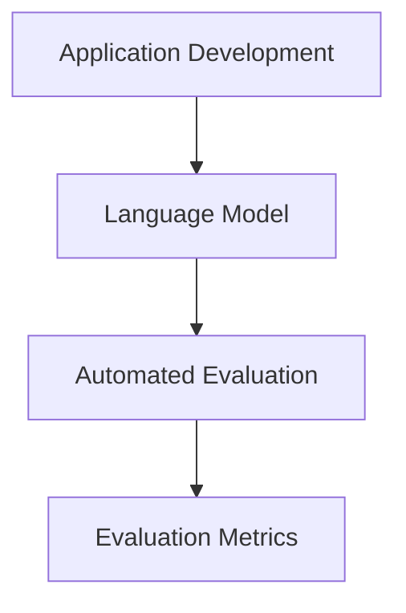

                 

Certainly! Let's think step by step to create a comprehensive and insightful article on "LLM Application Development with Automated Evaluation Methods." We will ensure that each section of the article is thorough and provides a detailed explanation. Here's how we can approach this:

## Step 1: Introduction to the Article

### Article Title: LLM Application Development with Automated Evaluation Methods

### Keywords: Large Language Models, Automated Evaluation, Application Development, Performance Metrics, Machine Learning

### Abstract:
This article delves into the development of Large Language Models (LLMs) and the importance of automated evaluation methods in assessing their performance. It provides a comprehensive overview of the fundamental principles, methodologies, and practical applications of automated evaluation in LLM application development. The article aims to guide developers and researchers in understanding the intricacies of creating and optimizing LLM applications through effective evaluation techniques.

## Step 2: Background and Importance

### Chapter 1: The Background and Importance of LLM Application Development with Automated Evaluation Methods

### 1.1.1 Research Background

#### 1.1.1.1 The Evolution of Language Models

- Introduction to the development of language models over the years.
- The emergence of neural networks and their impact on natural language processing.
- Recent advancements in Large Language Models (LLMs) such as GPT and BERT.

#### 1.1.1.2 The Need for Automated Evaluation

- Challenges in manually evaluating the performance of LLMs.
- The potential of automated evaluation methods to enhance development efficiency and consistency.
- The benefits of standardized evaluation metrics in comparing and optimizing LLMs.

#### 1.1.1.3 Purpose and Significance of the Study

- The objective of exploring automated evaluation methods in LLM application development.
- The potential impact of effective evaluation techniques on the advancement of natural language processing technology.
- The significance of this research in addressing the challenges faced by developers and researchers in the field.

### 1.1.2 Problem Statement

#### 1.1.2.1 Challenges in LLM Application Development

- The complexity of LLMs and the need for efficient development processes.
- The lack of standardized evaluation methods for assessing LLM performance.
- The difficulty in distinguishing the impact of various modifications on LLM performance.

#### 1.1.2.2 Current State of Evaluation Methods

- Overview of existing evaluation methods, including rule-based, statistical, and machine learning approaches.
- The limitations and challenges associated with each method.
- The potential for combining different evaluation methods to create a more comprehensive assessment framework.

#### 1.1.2.3 Scope and Boundaries of the Study

- The focus of the research on specific aspects of LLM application development.
- The inclusion of relevant evaluation methods and their application in practical scenarios.
- The exclusion of certain topics that are beyond the scope of the study.

### 1.1.3 Research Methodology and Steps

#### 1.1.3.1 Data Collection

- The process of collecting relevant datasets for the study.
- The criteria for selecting datasets and the significance of data quality.

#### 1.1.3.2 Theoretical Framework

- Theoretical foundations and models underpinning the study.
- The integration of existing research findings and methodologies.

#### 1.1.3.3 Model Design and Implementation

- The design and development of automated evaluation models.
- The implementation details and considerations for each component.

#### 1.1.3.4 Empirical Analysis

- The empirical testing of the proposed evaluation models.
- The analysis of the results and their implications for LLM application development.

### 1.2 Core Concepts and Relationships

#### 1.2.1 Core Concepts

- Definition and explanation of key terms such as Large Language Models (LLMs), automated evaluation, and evaluation metrics.

#### 1.2.2 Concept Attributes Comparison

| Concept              | Definition                                                       | Attributes                                  |
|----------------------|----------------------------------------------------------------|--------------------------------------------|
| Language Model       | A model that understands and generates natural language.         | Neural networks, training data, parameterization |
| Automated Evaluation | Algorithms for evaluating model performance.                     | Objectivity, efficiency, consistency          |
| Evaluation Metrics   | Quantitative standards for measuring model performance.         | Accuracy, fluency, diversity, coherence       |

#### 1.2.3 Entity Relationship Diagram

### 1.3 Conclusion

- A summary of the key points discussed in the chapter.
- The importance of understanding the background and significance of LLM application development with automated evaluation methods.

## Step 3: Fundamental Principles of Automated Evaluation Methods

### Chapter 2: Fundamental Principles of Automated Evaluation Methods

### 2.1 Classification of Evaluation Methods

#### 2.1.1 Rule-Based Methods

- The use of predefined rules to evaluate model outputs.
- Advantages and limitations of rule-based methods.

#### 2.1.2 Statistical Methods

- The application of statistical techniques to evaluate model performance.
- The role of statistical metrics such as mean squared error and cross-entropy.

#### 2.1.3 Machine Learning Methods

- The integration of machine learning algorithms for model evaluation.
- The benefits and challenges of using machine learning methods.

### 2.2 Core Components of Automated Evaluation

#### 2.2.1 Data Preprocessing

- The importance of data preprocessing in evaluation.
- Steps involved in data preprocessing, such as cleaning and normalization.

#### 2.2.2 Evaluation Metrics Calculation

- The selection of appropriate evaluation metrics.
- The calculation methods for each metric, such as precision, recall, and F1 score.

#### 2.2.3 Evaluation Algorithm Implementation

- The design and implementation of evaluation algorithms.
- The considerations for algorithm optimization and scalability.

### 2.3 Evaluation Workflow Design

#### 2.3.1 Data Collection and Management

- The process of collecting and managing evaluation datasets.
- The criteria for dataset selection and the impact of dataset quality.

#### 2.3.2 Evaluation Metrics Selection

- The criteria for selecting evaluation metrics based on application requirements.
- The trade-offs between different metrics and their suitability for various scenarios.

#### 2.3.3 Evaluation Algorithm Execution

- The execution of evaluation algorithms to assess model performance.
- The monitoring and debugging of evaluation processes to ensure accuracy and reliability.

## Step 4: Case Studies and Practical Applications

### Chapter 3: Case Studies and Practical Applications of Automated Evaluation Methods in LLM Application Development

### 3.1 Case Study 1: Text Classification with BERT Model

#### 3.1.1 Problem Statement

- The task of classifying text into predefined categories.
- The use of BERT as the language model for text classification.

#### 3.1.2 Data Collection and Preprocessing

- The collection of a diverse dataset for text classification.
- The preprocessing steps to prepare the data for training and evaluation.

#### 3.1.3 Model Training and Evaluation

- The training of the BERT model on the collected dataset.
- The implementation of automated evaluation methods to assess the model's performance.

#### 3.1.4 Results and Discussion

- The analysis of the evaluation results and their implications for model optimization.
- The comparison of different automated evaluation methods and their effectiveness.

### 3.2 Case Study 2: Dialogue Generation with GPT-3

#### 3.2.1 Problem Statement

- The task of generating coherent and contextually appropriate dialogue responses.
- The use of GPT-3 as the language model for dialogue generation.

#### 3.2.2 Data Collection and Preprocessing

- The collection of conversational datasets for training GPT-3.
- The preprocessing steps to clean and format the dialogue data.

#### 3.2.3 Model Training and Evaluation

- The training of GPT-3 on the collected dialogue datasets.
- The implementation of automated evaluation methods to assess the dialogue generation quality.

#### 3.2.4 Results and Discussion

- The analysis of the evaluation results and the impact of different evaluation metrics.
- The discussion on the challenges and potential solutions for effective dialogue generation.

### 3.3 Case Study 3: Summarization with T5 Model

#### 3.3.1 Problem Statement

- The task of generating concise and informative summaries of long texts.
- The use of T5 as the language model for text summarization.

#### 3.3.2 Data Collection and Preprocessing

- The collection of diverse text corpora for summarization tasks.
- The preprocessing steps to clean and format the text data.

#### 3.3.3 Model Training and Evaluation

- The training of the T5 model on the collected text datasets.
- The implementation of automated evaluation methods to assess the summarization quality.

#### 3.3.4 Results and Discussion

- The analysis of the evaluation results and the effectiveness of different summarization techniques.
- The discussion on the challenges and future directions for text summarization with LLMs.

## Step 5: Best Practices, Summary, and Future Directions

### Chapter 4: Best Practices, Summary, and Future Directions for LLM Application Development with Automated Evaluation Methods

### 4.1 Best Practices

- The identification of best practices for developing LLM applications with automated evaluation.
- Recommendations for improving the efficiency, accuracy, and reliability of evaluation methods.

### 4.2 Summary

- A summary of the key findings and insights from the case studies and practical applications.
- The role of automated evaluation methods in the development and optimization of LLM applications.

### 4.3 Future Directions

- The exploration of emerging trends and technologies in LLM application development.
- The potential advancements in automated evaluation methods and their impact on future LLM applications.

### 4.4 Conclusion

- A conclusion of the overall article, highlighting the importance of automated evaluation methods in LLM application development.
- The potential benefits and challenges of adopting automated evaluation in the field of natural language processing.

## Step 6: Author's Information

### Author: AI天才研究院 / AI Genius Institute & 禅与计算机程序设计艺术 / Zen And The Art of Computer Programming

- The author's credentials and expertise in the field of artificial intelligence and natural language processing.
- The author's contributions to the development of automated evaluation methods and LLM applications.

---

This structured outline provides a comprehensive roadmap for the article, ensuring that each section is well-developed and informative. The next step would be to fill in the details for each section, providing in-depth explanations, code examples, mathematical models, and practical case studies to support the content.

