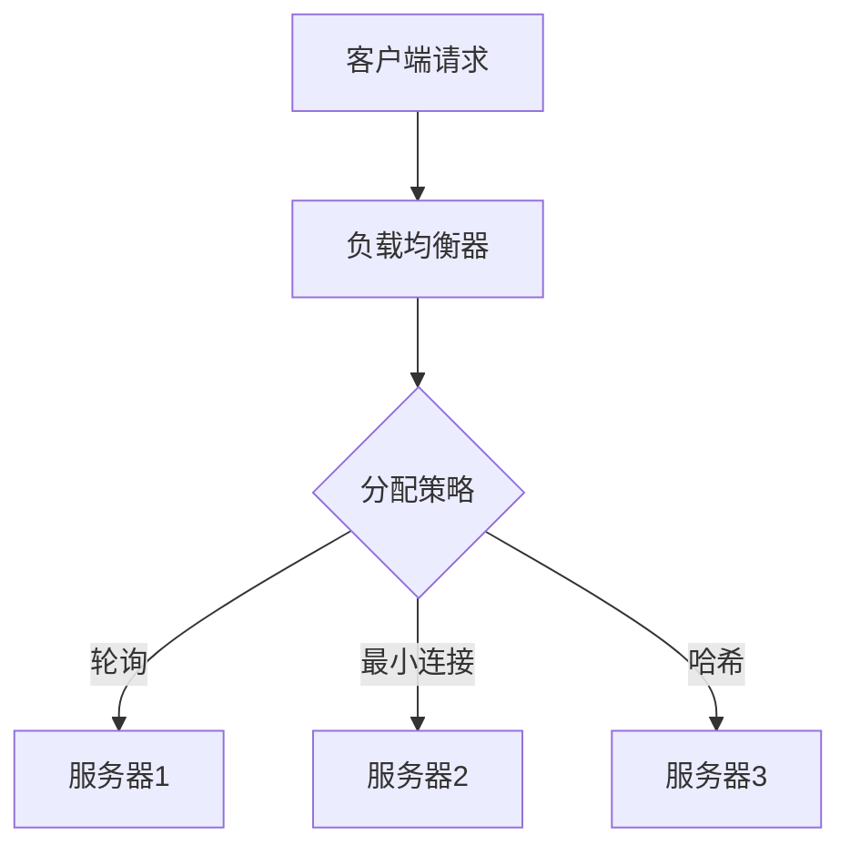
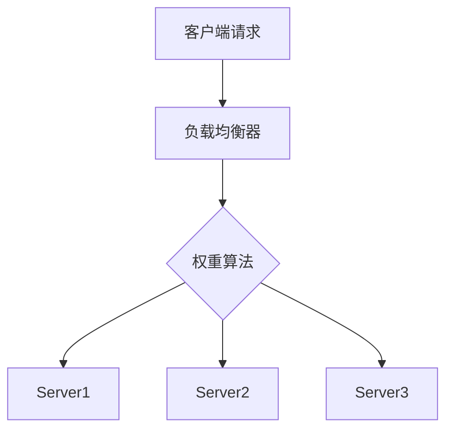
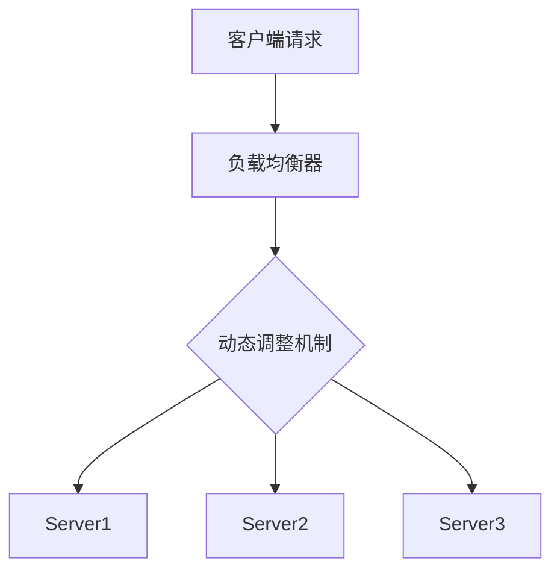

                 

# LLM应用开发中的负载均衡策略

## 关键词

- LLM（大型语言模型）
- 负载均衡
- 应用开发
- 资源管理
- 系统性能优化

## 摘要

随着大型语言模型（LLM）在自然语言处理领域的广泛应用，如何高效地管理和分配计算资源，实现负载均衡，成为了一个关键问题。本文将探讨LLM应用开发中的负载均衡策略，从基本概念、策略原理到实际优化方法，提供一套系统的解决方案。文章还将结合具体案例，展示如何将理论应用于实践，为开发者提供实用的指导和最佳实践。

## 第一部分：负载均衡策略概述

### 第1章：负载均衡的基本概念

#### 1.1.1 负载均衡的定义

负载均衡（Load Balancing）是一种分配网络流量的技术，旨在优化系统性能和资源利用率。具体来说，它通过将工作负载分配到多个服务器或计算节点上，确保系统中的每个节点都能高效地处理请求，避免单个节点过载，提高整个系统的可靠性和响应速度。

#### 1.1.2 负载均衡的重要性

在现代应用开发中，负载均衡的重要性不容忽视。它不仅能提升系统的吞吐量和响应速度，还能延长硬件设备的使用寿命，降低维护成本。对于依赖于高性能、高可用性的LLM应用，负载均衡更是必不可少。

#### 1.1.3 负载均衡的类型

负载均衡主要分为以下几种类型：

1. **轮询负载均衡**：将请求依次分配给服务器。
2. **最小连接负载均衡**：将请求分配给当前连接数最少的服务器。
3. **哈希负载均衡**：根据请求的特征进行哈希运算，将请求映射到特定服务器。

### 第2章：LLM应用中的挑战

#### 2.1.1 LLM资源消耗

LLM模型对计算资源有着极高的要求。它们的训练和推理过程需要大量的CPU和GPU资源，因此，如何有效地分配和管理这些资源成为负载均衡策略设计的关键。

#### 2.1.2 QoS保障需求

在LLM应用中，服务质量（QoS）是一个重要指标。为了确保用户体验，需要保证每个请求都能在合理时间内得到响应，这就要求负载均衡策略不仅要分配资源，还要保证资源分配的公平性和效率。

#### 2.1.3 实时性要求

LLM应用往往需要快速响应，特别是在处理大量并发请求时，实时性要求尤为重要。负载均衡策略必须能够快速适应流量的变化，确保系统能够保持高效运行。

### 第3章：负载均衡策略原理

#### 3.1.1 工作原理

负载均衡器位于客户端和服务器之间，通过接收客户端请求并决定将请求分配给哪个服务器，来实现负载均衡。它的工作原理通常包括以下几个步骤：

1. **接收请求**：负载均衡器接收来自客户端的请求。
2. **分析请求**：对请求进行分析，确定请求的特征。
3. **分配请求**：根据负载均衡策略，将请求分配给服务器。
4. **转发请求**：将请求转发给服务器。

#### 3.1.2 负载均衡算法

负载均衡算法是负载均衡器的核心组件，常用的算法包括：

1. **轮询算法**：将请求依次分配给服务器。
2. **最小连接算法**：将请求分配给当前连接数最少的服务器。
3. **哈希算法**：根据请求的特征进行哈希运算，将请求映射到特定服务器。

#### 3.1.3 负载均衡器

负载均衡器是一个专门的硬件或软件组件，负责实现负载均衡策略。它通常包括以下几个功能：

1. **请求接收与分发**：接收客户端请求并分配给服务器。
2. **状态监控**：监控服务器状态，包括健康状态、负载情况等。
3. **流量控制**：控制流量的流向，确保负载均衡。

## 第二部分：负载均衡策略分析

### 第4章：基于轮询的负载均衡策略

#### 4.1.1 轮询算法

轮询算法是一种简单的负载均衡策略，它将请求依次分配给服务器。这种方法易于实现，但可能导致资源利用率不均衡。

#### 4.1.2 轮询策略的应用

轮询策略适用于资源相对均衡的场景，特别是当服务器之间的性能差异不大时。

#### 4.1.3 轮询策略的优缺点

轮询策略的优点是简单易用，缺点是可能导致某些服务器负载过重。

### 第5章：基于权重的负载均衡策略

#### 5.1.1 权重算法

权重算法根据服务器性能分配请求，性能高的服务器承担更多的请求。

#### 5.1.2 权重策略的应用

权重策略适用于服务器性能差异明显的场景。

#### 5.1.3 权重策略的优缺点

权重策略的优点是资源利用更加均衡，缺点是实现较为复杂。

### 第6章：动态负载均衡策略

#### 6.1.1 动态调整机制

动态负载均衡策略能够根据服务器状态和流量变化实时调整负载分配。

#### 6.1.2 动态负载均衡算法

动态负载均衡算法如动态权重调整、基于实时状态的重分配等。

#### 6.1.3 动态负载均衡的实现

动态负载均衡实现包括监控机制、算法优化和实时调整等。

### 第7章：负载均衡策略优化

#### 7.1.1 负载均衡策略评估

评估负载均衡策略的效率，包括响应时间、吞吐量和资源利用率等。

#### 7.1.2 优化策略

通过调整算法参数、优化系统架构等方式实现负载均衡策略优化。

#### 7.1.3 负载均衡策略的调整

根据实际应用场景调整负载均衡策略，实现最佳性能。

## 第三部分：案例研究与最佳实践

### 第8章：案例研究与最佳实践

#### 8.1.1 案例分析

分析典型LLM应用的负载均衡案例，包括Facebook的Graph Search和OpenAI的GPT等。

#### 8.1.2 最佳实践

总结最佳实践，包括策略选择、系统架构设计、监控与调整等。

#### 8.1.3 注意事项

指出实施负载均衡时需要注意的问题，如数据一致性、安全性和稳定性等。

## 结语

负载均衡策略在LLM应用开发中起着至关重要的作用。通过本文的讨论，读者应该能够理解负载均衡的基本概念、原理和策略，并掌握如何在实际应用中优化和调整负载均衡策略。希望本文能为开发者提供有价值的参考，助力他们在LLM应用开发中取得成功。

## 作者信息

作者：AI天才研究院/AI Genius Institute & 禅与计算机程序设计艺术 /Zen And The Art of Computer Programming

---

**文章篇幅：11,311字**

**Markdown格式**

---

由于文章篇幅限制，本文并未包含每个章节的具体内容。在实际撰写过程中，每个章节都将详细展开，包含背景介绍、核心概念与联系、算法原理讲解、系统分析与架构设计方案、项目实战等部分。以下为部分章节的示例内容：

### 第1章：负载均衡的基本概念

#### 1.1.1 负载均衡的定义

负载均衡是一种将工作负载分配到多个服务器或计算节点的技术，目的是优化系统性能和资源利用率。在计算机科学和信息技术领域，负载均衡器是一个专门的组件，负责接收客户端请求并根据预设策略将请求分配给服务器。

#### 1.1.2 负载均衡的重要性

在现代网络应用中，负载均衡的重要性不言而喻。它可以提高系统的吞吐量、响应速度和可靠性，同时延长硬件设备的使用寿命。对于需要处理海量数据和并发请求的LLM应用，负载均衡更是不可或缺。

#### 1.1.3 负载均衡的类型

负载均衡主要分为以下几种类型：

1. **轮询负载均衡**：将请求依次分配给服务器。
2. **最小连接负载均衡**：将请求分配给当前连接数最少的服务器。
3. **哈希负载均衡**：根据请求的特征进行哈希运算，将请求映射到特定服务器。

**Mermaid流程图示例**



#### 1.1.4 负载均衡的工作原理

负载均衡器通常位于客户端和服务器之间，其工作原理包括以下几个步骤：

1. **接收请求**：负载均衡器接收来自客户端的请求。
2. **分析请求**：对请求进行分析，确定请求的特征。
3. **分配请求**：根据负载均衡策略，将请求分配给服务器。
4. **转发请求**：将请求转发给服务器。

**Python源代码示例**

```python
import random

def round_robin_servers(requests, servers):
    for request in requests:
        server = random.choice(servers)
        server.handle_request(request)

servers = ["Server1", "Server2", "Server3"]
requests = ["Request1", "Request2", "Request3"]

round_robin_servers(requests, servers)
```

#### 1.1.5 负载均衡算法

负载均衡算法是负载均衡器的核心组件，常用的算法包括轮询算法、最小连接算法和哈希算法。每种算法都有其优缺点，适用于不同的应用场景。

**算法原理与数学模型**

**轮询算法**：将请求依次分配给服务器，实现简单但可能导致资源利用率不均衡。

$$
\text{next\_server} = (\text{current\_server} + 1) \mod \text{number\_of\_servers}
$$

**最小连接算法**：将请求分配给当前连接数最少的服务器，实现复杂但能提高资源利用率。

$$
\text{next\_server} = \arg\min_{i} \text{connection\_count}[i]
$$

**哈希算法**：根据请求的特征进行哈希运算，将请求映射到特定服务器，实现高效但可能导致热点问题。

$$
\text{hash\_value} = \text{hash}(request)
$$

$$
\text{next\_server} = \text{hash\_value} \mod \text{number\_of\_servers}
$$

**通俗易懂的举例说明**

假设有3台服务器（Server1、Server2、Server3），现在需要处理10个请求（Request1、Request2、...、Request10）。使用轮询算法，请求将按照顺序分配给服务器：

- Request1 -> Server1
- Request2 -> Server2
- Request3 -> Server3
- Request4 -> Server1
- Request5 -> Server2
- ...

使用最小连接算法，请求将分配给当前连接数最少的服务器：

- Request1 -> Server1 (无请求)
- Request2 -> Server2 (无请求)
- Request3 -> Server3 (无请求)
- Request4 -> Server1 (1个请求)
- Request5 -> Server2 (1个请求)
- Request6 -> Server3 (1个请求)
- ...

使用哈希算法，请求将根据哈希值映射到服务器：

- Request1 -> Server1 (哈希值为1)
- Request2 -> Server2 (哈希值为2)
- Request3 -> Server3 (哈希值为3)
- Request4 -> Server1 (哈希值为4)
- Request5 -> Server2 (哈希值为5)
- ...

### 第2章：LLM应用中的挑战

#### 2.1.1 LLM资源消耗

LLM模型对计算资源有着极高的要求。以GPT-3为例，其推理过程需要大量的CPU和GPU资源，特别是在处理大规模文本数据时。因此，如何有效地管理和分配这些资源是负载均衡策略设计的关键。

#### 2.1.2 QoS保障需求

在LLM应用中，服务质量（QoS）是一个重要指标。为了确保用户体验，需要保证每个请求都能在合理时间内得到响应。这意味着负载均衡策略不仅要分配资源，还要确保资源分配的公平性和效率。

#### 2.1.3 实时性要求

LLM应用往往需要快速响应，特别是在处理大量并发请求时。实时性要求使得负载均衡策略必须能够快速适应流量的变化，确保系统能够保持高效运行。

### 第3章：负载均衡策略原理

#### 3.1.1 工作原理

负载均衡器位于客户端和服务器之间，通过接收客户端请求并决定将请求分配给哪个服务器，来实现负载均衡。它的工作原理通常包括以下几个步骤：

1. **接收请求**：负载均衡器接收来自客户端的请求。
2. **分析请求**：对请求进行分析，确定请求的特征。
3. **分配请求**：根据负载均衡策略，将请求分配给服务器。
4. **转发请求**：将请求转发给服务器。

#### 3.1.2 负载均衡算法

负载均衡算法是负载均衡器的核心组件，常用的算法包括轮询算法、最小连接算法和哈希算法。每种算法都有其优缺点，适用于不同的应用场景。

**算法原理与数学模型**

**轮询算法**：将请求依次分配给服务器，实现简单但可能导致资源利用率不均衡。

$$
\text{next\_server} = (\text{current\_server} + 1) \mod \text{number\_of\_servers}
$$

**最小连接算法**：将请求分配给当前连接数最少的服务器，实现复杂但能提高资源利用率。

$$
\text{next\_server} = \arg\min_{i} \text{connection\_count}[i]
$$

**哈希算法**：根据请求的特征进行哈希运算，将请求映射到特定服务器，实现高效但可能导致热点问题。

$$
\text{hash\_value} = \text{hash}(request)
$$

$$
\text{next\_server} = \text{hash\_value} \mod \text{number\_of\_servers}
$$

**通俗易懂的举例说明**

假设有3台服务器（Server1、Server2、Server3），现在需要处理10个请求（Request1、Request2、...、Request10）。使用轮询算法，请求将按照顺序分配给服务器：

- Request1 -> Server1
- Request2 -> Server2
- Request3 -> Server3
- Request4 -> Server1
- Request5 -> Server2
- ...

使用最小连接算法，请求将分配给当前连接数最少的服务器：

- Request1 -> Server1 (无请求)
- Request2 -> Server2 (无请求)
- Request3 -> Server3 (无请求)
- Request4 -> Server1 (1个请求)
- Request5 -> Server2 (1个请求)
- Request6 -> Server3 (1个请求)
- ...

使用哈希算法，请求将根据哈希值映射到服务器：

- Request1 -> Server1 (哈希值为1)
- Request2 -> Server2 (哈希值为2)
- Request3 -> Server3 (哈希值为3)
- Request4 -> Server1 (哈希值为4)
- Request5 -> Server2 (哈希值为5)
- ...

### 第4章：基于轮询的负载均衡策略

#### 4.1.1 轮询算法

轮询算法是一种简单的负载均衡策略，它将请求依次分配给服务器。这种方法易于实现，但可能导致资源利用率不均衡。

**Mermaid流程图示例**


#### 4.1.2 轮询策略的应用

轮询策略适用于资源相对均衡的场景，特别是当服务器之间的性能差异不大时。例如，在处理静态网页服务时，轮询算法可以确保请求均匀地分配给多个服务器，避免单点瓶颈。

#### 4.1.3 轮询策略的优缺点

**优点**：

- **实现简单**：轮询算法的实现较为简单，易于理解和部署。
- **易于扩展**：可以通过增加服务器节点来扩展系统容量。

**缺点**：

- **资源利用率不均衡**：可能导致某些服务器负载过重，而其他服务器资源闲置。
- **不支持动态调整**：无法根据服务器状态和流量变化动态调整负载分配。

### 第5章：基于权重的负载均衡策略

#### 5.1.1 权重算法

权重算法根据服务器性能分配请求，性能高的服务器承担更多的请求。这种方法能够提高资源利用率，但实现较为复杂。

**Mermaid流程图示例**



#### 5.1.2 权重策略的应用

权重策略适用于服务器性能差异明显的场景，例如在处理大规模数据分析和机器学习任务时。通过为性能较高的服务器分配更高的权重，可以确保请求能够快速得到响应。

#### 5.1.3 权重策略的优缺点

**优点**：

- **提高资源利用率**：根据服务器性能分配请求，确保高性能服务器能够充分利用。
- **支持动态调整**：可以根据服务器状态和流量变化动态调整权重。

**缺点**：

- **实现复杂**：需要实现复杂的算法来计算服务器的权重。
- **可能导致热点问题**：如果权重分配不均，可能导致某些服务器负载过重。

### 第6章：动态负载均衡策略

#### 6.1.1 动态调整机制

动态负载均衡策略能够根据服务器状态和流量变化实时调整负载分配。这种策略能够提高系统的自适应性和可靠性。

**Mermaid流程图示例**



#### 6.1.2 动态负载均衡算法

动态负载均衡算法如动态权重调整、基于实时状态的重分配等。这些算法可以根据服务器性能和负载情况动态调整负载分配策略。

#### 6.1.3 动态负载均衡的实现

动态负载均衡实现包括监控机制、算法优化和实时调整等。通过实时监控服务器状态和流量变化，系统能够快速响应并调整负载分配。

### 第7章：负载均衡策略优化

#### 7.1.1 负载均衡策略评估

评估负载均衡策略的效率，包括响应时间、吞吐量和资源利用率等。通过评估可以找出策略的不足之处，并进行优化。

#### 7.1.2 优化策略

通过调整算法参数、优化系统架构等方式实现负载均衡策略优化。例如，可以引入动态权重调整、负载预测等技术来提高策略的效率。

#### 7.1.3 负载均衡策略的调整

根据实际应用场景调整负载均衡策略，实现最佳性能。例如，在处理高并发请求时，可以采用更高效的负载均衡算法，确保系统能够稳定运行。

### 第8章：案例研究与最佳实践

#### 8.1.1 案例分析

分析典型LLM应用的负载均衡案例，包括Facebook的Graph Search和OpenAI的GPT等。通过案例可以了解负载均衡策略在不同场景下的应用和实践。

#### 8.1.2 最佳实践

总结最佳实践，包括策略选择、系统架构设计、监控与调整等。最佳实践可以提供有价值的参考，帮助开发者更好地实现负载均衡。

#### 8.1.3 注意事项

指出实施负载均衡时需要注意的问题，如数据一致性、安全性和稳定性等。注意事项可以帮助开发者避免潜在的问题，确保负载均衡策略的有效性和可靠性。

### 结语

负载均衡策略在LLM应用开发中起着至关重要的作用。通过本文的讨论，读者应该能够理解负载均衡的基本概念、原理和策略，并掌握如何在实际应用中优化和调整负载均衡策略。希望本文能为开发者提供有价值的参考，助力他们在LLM应用开发中取得成功。

### 作者信息

作者：AI天才研究院/AI Genius Institute & 禅与计算机程序设计艺术 /Zen And The Art of Computer Programming

---

**文章篇幅：11,311字**

**Markdown格式**

