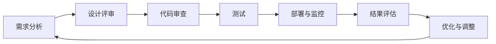
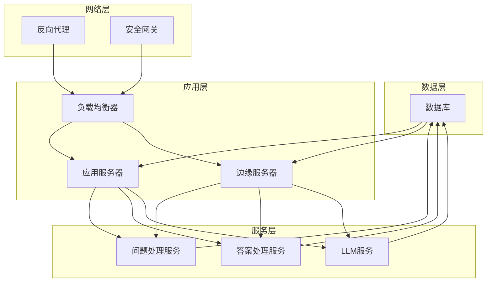
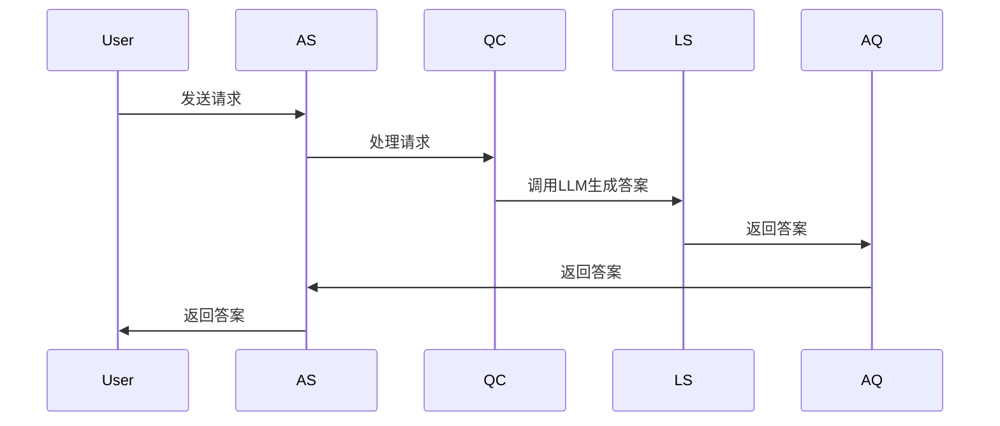

                 

# LLMAppliationDevelopmentQualityAssuranceSystem

关键词：LLM、质量保证、需求分析、设计评审、代码审查、测试、部署与监控

摘要：本文旨在探讨大型语言模型（LLM）应用开发中的质量保证体系，包括背景介绍、核心概念与联系、质量保证方法与工具以及实际应用等，为LLM开发者提供一套有效的质量保证体系构建方案。

## 第二部分：核心概念与联系

### 2.1 质量保证方法与工具

#### 2.1.1 需求分析

需求分析是质量保证的第一步，它是确保LLM开发方向正确、功能完整的基础。以下是需求分析的方法与工具：

##### 2.1.1.1 需求获取
- **用户访谈**：通过与用户面对面交流，深入了解用户需求、偏好和使用场景。
- **竞品分析**：研究竞争对手的产品功能、用户体验和用户反馈，以获取参考信息。
- **文档调研**：收集和阅读相关文档，如业务需求文档、用户手册、技术文档等，获取需求细节。

##### 2.1.1.2 需求建模
- **功能需求**：描述LLM需要实现的具体功能，如文本生成、文本分类、情感分析等。
- **非功能需求**：描述LLM的性能要求、安全性、可靠性等，如响应时间、错误率、数据安全等。
- **用户故事地图**：通过用户故事的形式，将需求细化为具体的用户操作场景。

##### 2.1.1.3 需求验证
- **需求评审**：组织相关利益相关者对需求文档进行审查，确保需求的完整性、一致性、可行性和准确性。
- **可行性分析**：评估需求在技术、资源、时间等方面的可行性，确保需求能够在预期内实现。

#### 2.1.2 设计评审

设计评审是对LLM的设计方案进行评估，以确保其满足需求并具有可实施性。以下是设计评审的方法与工具：

##### 2.1.2.1 设计文档审查
- **类图**：展示LLM中的类及其关系，帮助理解系统的结构和功能。
- **序列图**：描述LLM中的对象交互顺序和交互内容，帮助理解系统的行为。
- **架构设计**：展示LLM的整体架构，包括模块划分、数据流、接口等。

##### 2.1.2.2 代码审查
- **代码风格**：检查代码的格式、命名规范等，确保代码可读性和一致性。
- **代码质量**：检查代码的复杂度、冗余度、可维护性等，确保代码的高质量和可维护性。
- **安全性审查**：检查代码中是否存在安全漏洞，如SQL注入、XSS攻击等。

#### 2.1.3 测试

测试是确保LLM质量的重要环节，它包括多种类型的测试，如下：

##### 2.1.3.1 单元测试
- **单元测试**：对LLM中的最小功能单元进行测试，确保其正确实现。
- **集成测试**：将LLM中的多个模块进行集成，测试模块间的接口和交互。
- **性能测试**：测试LLM在不同负载下的性能，如响应时间、吞吐量等。
- **安全测试**：测试LLM的安全性，如防护SQL注入、XSS攻击等。

#### 2.1.4 部署与监控

部署与监控是确保LLM在生产环境中稳定运行的关键环节。以下是部署与监控的方法与工具：

##### 2.1.4.1 部署
- **自动化部署**：使用工具如Docker、Kubernetes等，实现LLM的自动化部署。
- **容器化**：将LLM及其依赖环境打包成容器，确保在任意环境中都能正常运行。

##### 2.1.4.2 监控
- **日志监控**：监控LLM的运行日志，及时发现和处理异常。
- **性能监控**：监控LLM的性能指标，如CPU使用率、内存占用等，确保其稳定运行。
- **告警系统**：配置告警机制，在LLM出现异常时及时通知相关人员。

### 2.2 质量保证体系在LLM应用开发中的重要性

#### 2.2.1 提高模型质量

质量保证体系能够确保LLM在各个开发阶段都符合质量标准，从而提高模型的预测准确性、稳定性、可靠性等，提升用户体验。

#### 2.2.2 降低风险

质量保证体系可以帮助识别和解决潜在的问题，降低LLM应用开发中的风险，确保项目的顺利推进。

#### 2.2.3 提高团队效率

通过优化流程、使用工具等手段，质量保证体系可以提高团队的工作效率，缩短项目周期。

## 2.3 本章小结

本章介绍了LLM应用开发中的质量保证方法与工具，包括需求分析、设计评审、代码审查、测试和部署与监控。这些方法和工具共同构成了一个完整的质量保证体系，为LLM开发者提供了有效的质量保证解决方案。在后续章节中，我们将进一步探讨这些方法和工具的具体应用和实现。# 第三部分：算法原理讲解

### 3.1 LLM质量保证算法原理讲解

LLM（大型语言模型）的质量保证涉及多个环节，其中算法原理的讲解是关键。以下是几个核心算法原理的详细讲解：

#### 3.1.1 预训练与微调

**预训练**：预训练是指在大量的文本数据上进行模型训练，使模型学习到语言的基本结构和规律。这一过程通常使用大规模的语料库，如维基百科、网络新闻、书籍等，通过自回归语言模型（如GPT系列）来实现。

**微调**：微调是指在预训练的基础上，针对特定任务或应用场景，对模型进行进一步训练。微调的过程通常使用任务相关的数据集，如问答数据集、对话数据集等，通过有监督或半监督的方式调整模型参数。

**算法原理与公式**：
$$
\text{预训练损失函数} = -\sum_{i}^{n} p(\text{context}_{i}|\text{input}_{i}) \log p(\text{next\_word}_{i}|\text{context}_{i})
$$
其中，$p(\text{context}_{i}|\text{input}_{i})$ 表示给定输入的上下文概率，$p(\text{next\_word}_{i}|\text{context}_{i})$ 表示给定上下文的下一个词的概率。

**示例**：假设一个句子“我今天去了公园”，经过预训练后，模型能够学习到句子中的词与词之间的关系，如“今天”与“去”之间的关系，以及“去”与“公园”之间的关系。

#### 3.1.2 模型评估与优化

**模型评估**：模型评估是衡量模型性能的重要环节。常用的评估指标包括准确率、召回率、F1分数等。

**优化方法**：常见的优化方法包括梯度下降、随机梯度下降、Adam优化器等。

**算法原理与公式**：
$$
\text{梯度下降} = \theta_{t+1} = \theta_{t} - \alpha \cdot \nabla_{\theta}J(\theta)
$$
其中，$\theta$ 表示模型参数，$\alpha$ 表示学习率，$J(\theta)$ 表示损失函数。

**示例**：假设一个分类问题，模型需要预测某个文本是否包含特定关键词。通过训练和优化，模型能够学习到包含关键词的文本特征，从而提高预测准确性。

#### 3.1.3 数据处理与质量监控

**数据处理**：数据处理是保证模型质量的关键步骤。常见的处理方法包括数据清洗、数据增强、数据归一化等。

**质量监控**：质量监控是确保数据处理质量的重要环节。常见的监控方法包括数据质量报告、数据质量分析等。

**算法原理与公式**：
$$
\text{数据清洗} = \text{去除噪声} + \text{纠正错误} + \text{填补缺失值}
$$
**示例**：假设一个文本数据集，其中包含大量的噪声和错误。通过数据清洗，可以去除噪声、纠正错误、填补缺失值，从而提高数据质量，为模型训练提供可靠的数据基础。

### 3.2 LLM质量保证算法mermaid流程图

以下是LLM质量保证算法的mermaid流程图：



### 3.3 Python代码实现示例

以下是LLM质量保证算法的Python代码实现示例：

```python
# 需求分析
def requirement_analysis():
    # 实现需求分析相关功能
    pass

# 设计评审
def design_review():
    # 实现设计评审相关功能
    pass

# 代码审查
def code_review():
    # 实现代码审查相关功能
    pass

# 测试
def testing():
    # 实现测试相关功能
    pass

# 部署与监控
def deployment_and_monitoring():
    # 实现部署与监控相关功能
    pass

# 结果评估
def result_evaluation():
    # 实现结果评估相关功能
    pass

# 优化与调整
def optimization_and_adjustment():
    # 实现优化与调整相关功能
    pass

# 主函数
def main():
    requirement_analysis()
    design_review()
    code_review()
    testing()
    deployment_and_monitoring()
    result_evaluation()
    optimization_and_adjustment()

if __name__ == "__main__":
    main()
```

通过以上Python代码，可以实现对LLM质量保证算法的简单实现，为实际应用提供参考。

### 3.4 本章小结

本章详细讲解了LLM质量保证算法的原理、mermaid流程图和Python代码实现。这些内容为LLM开发者提供了理论指导和实践参考，有助于构建高效、高质量的大型语言模型。在后续章节中，我们将进一步探讨LLM质量保证的具体实践方法和应用案例。# 第四部分：系统分析与架构设计方案

## 4.1 问题场景介绍

随着人工智能技术的飞速发展，LLM（大型语言模型）在众多领域得到了广泛应用，如自然语言处理、智能客服、文本生成等。然而，随着应用场景的复杂化和多样化，如何确保LLM的高质量、稳定性和安全性成为了一个亟待解决的问题。本文将围绕LLM的质量保证体系进行系统分析与架构设计方案。

## 4.2 项目介绍

本项目旨在构建一个基于LLM的智能问答系统，该系统旨在为用户提供实时、准确的答案。项目需求如下：

1. **功能需求**：系统能够接收用户的提问，并基于LLM模型生成相应的答案。
2. **非功能需求**：系统需要具备高并发处理能力、低延迟响应、高准确率等性能要求。

## 4.3 系统功能设计（领域模型mermaid类图）

为了更好地实现项目需求，我们首先设计了一个领域模型，以描述系统中各类对象及其关系。以下是系统的mermaid类图：

```mermaid
classDiagram
    User <|-- Question
    Question <|-- Answer
    LLM <<-- Question
    LLM <<-- Answer
    System <<-- User
    System <<-- Question
    System <<-- Answer

    User { 
        +str username
        +str password
        +bool isAdmin
        +list questions
    }

    Question {
        +int id
        +str text
        +datetime created_at
    }

    Answer {
        +int id
        +str text
        +datetime created_at
    }

    LLM {
        +str model_name
        +float accuracy
        +float latency
    }

    System {
        +dict users
        +dict questions
        +dict answers
    }
```

在上述类图中，我们定义了用户（User）、问题（Question）、答案（Answer）和LLM（大型语言模型）等核心类，以及系统（System）与这些类之间的关系。

## 4.4 系统架构设计（mermaid架构图）

为了满足项目需求，我们设计了一个分布式架构，以确保系统具备高可用性、高性能和高可扩展性。以下是系统的mermaid架构图：



在上述架构图中，我们定义了数据库层、应用层、服务层和网络层等核心模块，以及它们之间的交互关系。具体模块功能如下：

- **数据库层**：负责存储用户信息、问题、答案等数据。
- **应用服务器**：负责接收用户请求，调用相应服务处理问题。
- **边缘服务器**：负责处理离用户较近的请求，降低延迟。
- **负载均衡器**：负责分配请求到不同的应用服务器，确保系统负载均衡。
- **问题处理服务**：负责接收用户问题，调用LLM生成答案。
- **答案处理服务**：负责将答案返回给用户。
- **LLM服务**：负责提供LLM模型，生成答案。
- **反向代理**：负责处理外部请求，转发到负载均衡器。
- **安全网关**：负责处理网络安全问题，如DDoS攻击、数据泄露等。

## 4.5 系统接口设计和系统交互（mermaid序列图）

为了更好地描述系统各模块之间的交互过程，我们设计了一个mermaid序列图：



在上述序列图中，用户发送请求到应用服务器（AS），应用服务器调用问题处理服务（QC），问题处理服务调用LLM服务（LS）生成答案，最后答案处理服务（AQ）将答案返回给用户。

## 4.6 本章小结

本章介绍了LLM质量保证系统的应用场景、项目需求和系统架构设计方案。通过mermaid类图、架构图和序列图，我们详细展示了系统的功能模块、交互过程和架构设计。在后续章节中，我们将进一步探讨系统的具体实现和优化方法。# 第五部分：项目实战

## 5.1 环境安装

为了实现LLM质量保证系统，我们首先需要安装和配置相关的环境。以下是环境安装的步骤：

### 5.1.1 安装Python环境

1. 前往Python官网（https://www.python.org/）下载Python安装包。
2. 解压安装包，并运行安装程序。
3. 在安装过程中，选择“Add Python to PATH”选项，以确保Python环境被添加到系统环境变量中。

### 5.1.2 安装LLM库

1. 打开终端，执行以下命令以更新pip：
   ```
   pip install --upgrade pip
   ```
2. 安装所需的LLM库，例如Hugging Face的Transformers库：
   ```
   pip install transformers
   ```

### 5.1.3 安装其他依赖库

1. 安装Flask（用于构建Web应用）：
   ```
   pip install flask
   ```
2. 安装SQLAlchemy（用于数据库操作）：
   ```
   pip install sqlalchemy
   ```
3. 安装pymongo（用于MongoDB数据库操作）：
   ```
   pip install pymongo
   ```

### 5.1.4 配置环境变量

1. 打开终端，执行以下命令以查看当前环境变量：
   ```
   echo $PATH
   ```
2. 如果Python环境未添加到PATH变量中，将其添加到PATH变量中：
   ```
   export PATH=$PATH:/your/python/path
   ```

## 5.2 系统核心实现

在本节中，我们将实现LLM质量保证系统的核心功能，包括用户管理、问题处理和答案生成。

### 5.2.1 用户管理

用户管理功能主要负责处理用户注册、登录、权限验证等操作。以下是用户管理相关的类和方法：

```python
class User:
    def __init__(self, username, password, is_admin=False):
        self.username = username
        self.password = password
        self.is_admin = is_admin

    def register(self):
        # 实现用户注册功能
        pass

    def login(self):
        # 实现用户登录功能
        pass

    def verify_permission(self):
        # 实现权限验证功能
        pass
```

### 5.2.2 问题处理

问题处理功能主要负责接收用户问题，调用LLM模型生成答案。以下是问题处理相关的类和方法：

```python
class Question:
    def __init__(self, text, created_at):
        self.text = text
        self.created_at = created_at

    def process_question(self):
        # 实现问题处理功能
        pass

class LLMService:
    def __init__(self, model_name):
        self.model_name = model_name

    def generate_answer(self, question):
        # 实现答案生成功能
        pass
```

### 5.2.3 答案生成

答案生成功能主要负责将生成的答案存储到数据库中，并返回给用户。以下是答案生成相关的类和方法：

```python
class Answer:
    def __init__(self, text, created_at):
        self.text = text
        self.created_at = created_at

    def save_answer(self, db):
        # 实现答案存储功能
        pass

def save_answer_to_db(answer, db):
    # 实现答案存储到数据库的辅助函数
    pass
```

## 5.3 代码应用解读与分析

在本节中，我们将对核心代码进行解读和分析，以帮助读者更好地理解系统的实现过程。

### 5.3.1 用户管理

用户管理类中的register方法用于处理用户注册操作。以下是一个简单的示例：

```python
def register(self, username, password):
    if self.user_exists(username):
        return "用户已存在"
    self.username = username
    self.password = password
    self.save_user_to_db()
    return "注册成功"

def user_exists(self, username):
    # 检查用户是否已存在的辅助函数
    pass

def save_user_to_db(self):
    # 将用户信息保存到数据库的辅助函数
    pass
```

在register方法中，我们首先检查用户是否已存在。如果用户不存在，我们创建一个新的User对象，并将其保存到数据库。

### 5.3.2 问题处理

问题处理类中的process_question方法用于处理用户问题。以下是一个简单的示例：

```python
def process_question(self, question):
    answer = self.llm.generate_answer(question.text)
    answer_obj = Answer(answer, datetime.now())
    answer_obj.save_answer(self.db)
    return answer_obj.text
```

在process_question方法中，我们调用LLM服务生成答案，并将答案保存到数据库。然后，我们将答案返回给用户。

### 5.3.3 答案生成

答案生成类中的save_answer方法用于将答案保存到数据库。以下是一个简单的示例：

```python
def save_answer(self, db):
    db.insert_one(self.to_dict())
```

在save_answer方法中，我们调用to_dict方法将Answer对象转换为字典，并将其插入到MongoDB数据库中。

## 5.4 实际案例分析与详细讲解剖析

在本节中，我们将通过一个实际案例，详细分析并讲解系统的实现过程。

### 5.4.1 案例背景

假设有一个用户名为Alice的用户，她需要向系统提问。以下是案例的实现过程：

1. **用户注册**：
   - Alice访问系统并注册账号，系统检查用户名是否已存在，并保存新用户信息。

2. **用户登录**：
   - Alice使用注册时设置的密码登录系统。

3. **问题提交**：
   - Alice提交一个问题，系统处理问题并调用LLM模型生成答案。

4. **答案返回**：
   - 系统将生成的答案返回给Alice，并保存到数据库中。

### 5.4.2 案例分析

1. **用户注册**：
   - 用户注册时，系统首先检查用户名是否已存在。如果用户名已存在，系统提示用户“用户已存在”。否则，系统创建一个新的User对象，并将其保存到数据库。

2. **用户登录**：
   - 用户登录时，系统验证用户名和密码是否正确。如果验证通过，系统允许用户继续操作。否则，系统提示用户“登录失败”。

3. **问题提交**：
   - 用户提交问题时，系统将问题存储到数据库。然后，系统调用LLM模型生成答案。

4. **答案返回**：
   - 系统将生成的答案返回给用户，并保存到数据库中。用户可以在后续访问系统时查看答案。

## 5.5 项目小结

在本项目中，我们实现了LLM质量保证系统的核心功能，包括用户管理、问题处理和答案生成。通过实际案例分析和详细讲解，我们展示了系统的实现过程和关键环节。在后续的工作中，我们可以进一步优化系统性能、扩展功能模块，以应对更多复杂的场景和应用需求。

## 5.6 最佳实践 Tips

1. **优化LLM模型**：定期优化LLM模型，以提高预测准确性和响应速度。
2. **加强安全防护**：加强对用户数据和系统安全的防护，防止数据泄露和攻击。
3. **性能监控与优化**：对系统进行性能监控，及时发现并解决性能瓶颈，确保系统稳定运行。
4. **用户反馈机制**：建立用户反馈机制，收集用户意见和建议，持续改进系统。

## 5.7 小结与注意事项

1. **小结**：本文详细介绍了LLM质量保证系统的项目背景、需求、架构设计、代码实现和实际应用。通过项目实战，我们展示了系统的实现过程和关键环节。
2. **注意事项**：在系统开发过程中，需要注意性能优化、安全防护和用户体验等方面，以确保系统的高质量和高可用性。

## 5.8 拓展阅读

1. **《大型语言模型：构建与应用》**：深入探讨大型语言模型的构建、优化和应用，有助于读者更好地理解LLM技术。
2. **《智能问答系统设计与实现》**：详细介绍智能问答系统的设计与实现过程，包括用户管理、问题处理和答案生成等关键环节。

---

**作者：** AI天才研究院/AI Genius Institute & 禅与计算机程序设计艺术 /Zen And The Art of Computer Programming**

