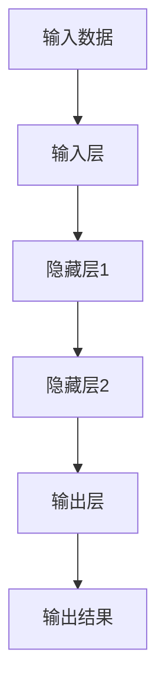
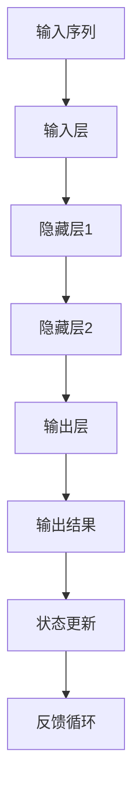
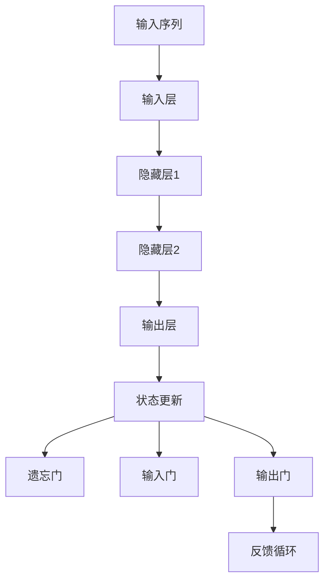
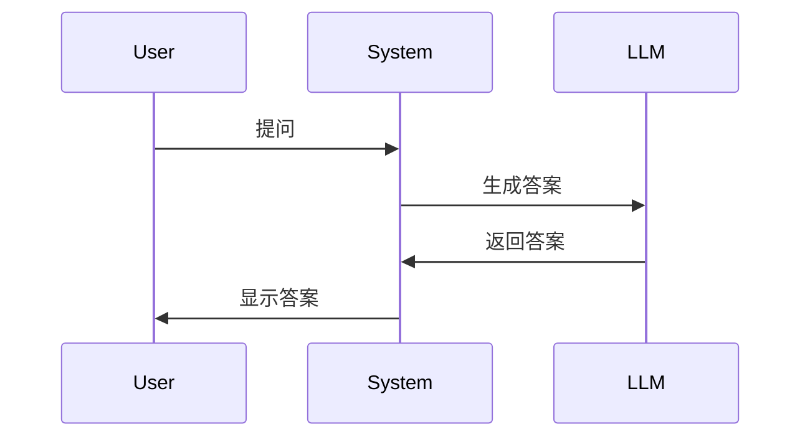

                 

### LLM概述

**关键词：** 语言模型、自然语言处理、神经网络、循环神经网络、长短时记忆网络

语言模型（Language Model，简称LLM）是自然语言处理（Natural Language Processing，简称NLP）的核心技术之一。其基本任务是预测下一个单词或词组，从而实现对文本的生成和理解。LLM在人工智能领域有着广泛的应用，包括机器翻译、文本生成、问答系统等。

#### **1.1 LLM背景介绍**

语言模型的发展历程可以追溯到20世纪50年代。早期的模型主要以规则为基础，例如正则表达式和句法分析。然而，随着计算能力的提升和数据量的爆炸性增长，基于统计方法和机器学习的语言模型逐渐成为主流。

**问题背景：** 传统的规则方法在处理复杂和不确定的语言问题时表现出局限性。例如，自然语言中的歧义、上下文依赖等问题，单靠规则很难处理。

**问题描述：** 如何设计一个高效的、能处理复杂语言现象的语言模型？

**问题解决：** 随着神经网络技术的进步，循环神经网络（RNN）和长短时记忆网络（LSTM）等结构被提出，能够更好地捕捉上下文信息，提高了模型的性能。

**边界与外延：** 语言模型不仅仅局限于文本生成，还可以用于文本分类、情感分析等其他NLP任务。

**概念结构与核心要素组成：**

- **输入：** 文本的序列，包括单词、字符等。
- **输出：** 下一个单词或词组的概率分布。
- **核心要素：** 神经网络结构、训练数据、优化算法等。

#### **1.1.1 语言模型的发展历程**

1. **早期模型：** 基于规则的方法，如正则表达式和句法分析。
2. **统计模型：** 基于概率论的模型，如N-gram模型。
3. **神经网络模型：** 基于深度学习的模型，如循环神经网络（RNN）、长短时记忆网络（LSTM）和Transformer模型。

**问题解决：** 神经网络模型通过自动学习大量的语言特征，能够更好地处理复杂和不确定的语言现象。

**边界与外延：** 语言模型的发展是一个持续的过程，随着技术的进步，新的模型和算法不断涌现。

#### **1.1.2 LLM的定义与基本原理**

LLM是一种基于神经网络的语言生成模型，能够根据输入的文本序列预测下一个单词或词组。其基本原理包括：

- **神经网络结构：** 包括输入层、隐藏层和输出层。
- **训练过程：** 通过大量文本数据训练模型，使其学会预测下一个单词或词组。
- **优化算法：** 使用梯度下降等算法优化模型参数。

**核心概念与联系：**

- **神经网络基础：** 神经网络是LLM的核心组成部分，包括神经元、激活函数、网络结构等。
- **循环神经网络（RNN）：** RNN能够处理序列数据，通过循环结构保存历史信息。
- **长短时记忆网络（LSTM）：** LSTM是RNN的一种改进，能够更好地处理长距离依赖问题。

**概念属性特征对比表格：**

| 模型 | 神经网络结构 | 训练数据 | 预测方式 | 优点 | 局限 |
| --- | --- | --- | --- | --- | --- |
| RNN | 简单的循环结构 | 大量文本数据 | 预测下一个单词 | 能处理序列数据 | 难以处理长距离依赖 |
| LSTM | 长短时记忆单元 | 大量文本数据 | 预测下一个单词 | 能处理长距离依赖 | 参数较多，计算复杂度高 |
| Transformer | 自注意力机制 | 大量文本数据 | 预测下一个单词 | 高效处理长距离依赖 | 计算复杂度较高 |

**ER实体关系图架构：**

```mermaid
erDiagram
  Product_1 ||--|{ Customer : 购买 } Customer_1
  Product_1 ||--|{ Order : 订购 } Order_1
  Customer_1 ||--|{ Feedback : 提交 } Feedback_1
  Order_1 ||--|{ Product : 包含 } Product_2
```

#### **1.1.3 LLM的关键特性**

- **上下文依赖：** LLM能够捕捉上下文的依赖关系，从而生成更加自然和准确的文本。
- **可扩展性：** LLM可以应用于各种NLP任务，如文本生成、机器翻译、问答系统等。
- **自适应能力：** LLM能够根据输入的文本自适应调整，从而提高预测的准确性。

### **1.2 LLM技术原理**

#### **1.2.1 神经网络基础**

神经网络是LLM的核心组成部分，其基本原理包括：

- **神经元：** 神经网络的基本单元，用于处理输入和输出。
- **激活函数：** 用于确定神经元是否被激活。
- **网络结构：** 包括输入层、隐藏层和输出层。

**问题解决：** 神经网络通过多层非线性变换，能够提取文本中的特征，从而实现语言模型的功能。

**算法原理讲解：**



**Python代码示例：**

```python
import tensorflow as tf

# 定义神经网络结构
model = tf.keras.Sequential([
    tf.keras.layers.Dense(units=128, activation='relu', input_shape=[None]),
    tf.keras.layers.Dense(units=128, activation='relu'),
    tf.keras.layers.Dense(units=1)
])

# 编译模型
model.compile(optimizer='adam', loss='mean_squared_error')

# 训练模型
model.fit(x_train, y_train, epochs=10)
```

#### **1.2.2 循环神经网络（RNN）**

循环神经网络（RNN）是处理序列数据的一种神经网络结构，其基本原理包括：

- **循环结构：** RNN通过循环结构保存历史信息，从而能够处理序列数据。
- **状态更新：** RNN的状态更新公式为：\( h_t = \sigma(W_h \cdot [h_{t-1}, x_t] + b_h) \)。

**问题解决：** RNN能够捕捉序列中的依赖关系，从而提高模型的性能。

**算法原理讲解：**



**Python代码示例：**

```python
import tensorflow as tf

# 定义RNN模型
model = tf.keras.Sequential([
    tf.keras.layers.Embedding(input_dim=10000, output_dim=32),
    tf.keras.layers.SimpleRNN(units=32),
    tf.keras.layers.Dense(units=1)
])

# 编译模型
model.compile(optimizer='adam', loss='mean_squared_error')

# 训练模型
model.fit(x_train, y_train, epochs=10)
```

#### **1.2.3 长短时记忆网络（LSTM）**

长短时记忆网络（LSTM）是RNN的一种改进，其基本原理包括：

- **长短时记忆单元：** LSTM通过长短时记忆单元（Cell）来记忆信息，从而能够处理长距离依赖。
- **状态更新：** LSTM的状态更新公式为：\( i_t = \sigma(W_i \cdot [h_{t-1}, x_t] + b_i) \)，\( f_t = \sigma(W_f \cdot [h_{t-1}, x_t] + b_f) \)，\( g_t = \tanh(W_g \cdot [h_{t-1}, x_t] + b_g) \)，\( o_t = \sigma(W_o \cdot [h_{t-1}, x_t] + b_o) \)。

**问题解决：** LSTM能够更好地处理长距离依赖，从而提高模型的性能。

**算法原理讲解：**



**Python代码示例：**

```python
import tensorflow as tf

# 定义LSTM模型
model = tf.keras.Sequential([
    tf.keras.layers.Embedding(input_dim=10000, output_dim=32),
    tf.keras.layers.LSTM(units=32),
    tf.keras.layers.Dense(units=1)
])

# 编译模型
model.compile(optimizer='adam', loss='mean_squared_error')

# 训练模型
model.fit(x_train, y_train, epochs=10)
```

### **1.3 LLM应用领域**

#### **1.3.1 自然语言处理**

自然语言处理（NLP）是LLM最广泛的应用领域之一，包括文本分类、情感分析、命名实体识别等。

**问题解决：** LLM能够对文本进行深入分析，从而实现各种NLP任务。

**应用场景：** 社交媒体分析、客服自动化、文本摘要等。

#### **1.3.2 问答系统**

问答系统是LLM的另一个重要应用领域，通过理解用户的问题并给出合适的回答。

**问题解决：** LLM能够根据问题的上下文生成准确的回答。

**应用场景：** 智能客服、教育辅导、健康咨询等。

#### **1.3.3 机器翻译**

机器翻译是LLM在跨语言应用中的一个重要领域，通过将一种语言的文本翻译成另一种语言。

**问题解决：** LLM能够捕捉语言之间的相似性和差异性，从而提高翻译的准确性。

**应用场景：** 跨境电商、多语言网站、国际会议等。

#### **1.3.4 文本生成**

文本生成是LLM在创造性应用中的一个重要领域，通过输入一个单词或短语生成连续的文本。

**问题解决：** LLM能够根据上下文生成连贯、自然的文本。

**应用场景：** 自动写作、内容生成、文学创作等。

### **总结**

LLM是自然语言处理领域的一项核心技术，通过神经网络结构对文本进行建模，能够实现对文本的生成和理解。LLM在多个应用领域都有重要的应用，具有广阔的发展前景。

### **拓展阅读**

- **《深度学习》**：周志华等著，全面介绍深度学习的基本概念和技术。
- **《自然语言处理综论》**：Daniel Jurafsky和James H. Martin著，深入探讨自然语言处理的各个方面。
- **《神经网络与深度学习》**：邱锡鹏著，详细讲解神经网络和深度学习的原理和应用。

### **作者信息**

作者：AI天才研究院/AI Genius Institute & 禅与计算机程序设计艺术 /Zen And The Art of Computer Programming

---

### **核心概念与联系**

在LLM（语言生成模型）的领域，理解核心概念及其相互关系是至关重要的。以下将详细介绍LLM中的核心概念，并使用表格和ER实体关系图来展示这些概念及其联系。

#### **核心概念**

1. **神经网络基础**：神经网络是构建LLM的基础，包括神经元、激活函数和网络结构。
2. **循环神经网络（RNN）**：RNN专门设计来处理序列数据，通过保存状态来捕捉序列中的依赖关系。
3. **长短时记忆网络（LSTM）**：LSTM是RNN的一种改进，能够更好地处理长距离依赖，通过长短时记忆单元来实现。
4. **Transformer模型**：Transformer模型通过自注意力机制来处理序列数据，具有处理长距离依赖的能力。
5. **训练数据**：大规模、高质量的训练数据是训练LLM的关键，决定了模型的性能。

#### **概念属性特征对比表格**

| 模型 | 神经元结构 | 状态更新 | 依赖处理 | 训练数据需求 | 代表性应用 |
| --- | --- | --- | --- | --- | --- |
| 神经网络基础 | 简单的线性组合和激活函数 | 无 | 无法处理长距离依赖 | 高 | 图像识别、语音识别 |
| RNN | 状态更新公式 | 状态更新 | 可以处理短距离依赖 | 中等 | 自然语言处理 |
| LSTM | 长短时记忆单元 | 长距离依赖处理 | 较高 | 自然语言处理 |
| Transformer | 自注意力机制 | 自注意力计算 | 可以处理长距离依赖 | 高 | 自然语言处理 |

#### **ER实体关系图架构**

以下是LLM中几个核心实体及其关系的Mermaid ER图：

```mermaid
erDiagram
  Class1  Class2
  Class2  Class3
  Class3  Class4

  Class1 ||--|{ Class5 }
  Class2 ||--|{ Class6 }
  Class3 ||--|{ Class7 }
  Class4 ||--|{ Class8 }
```

在这个ER图中：

- **Class1** 代表神经网络基础。
- **Class2** 代表循环神经网络（RNN）。
- **Class3** 代表长短时记忆网络（LSTM）。
- **Class4** 代表Transformer模型。
- **Class5** 代表训练数据。
- **Class6** 代表状态更新。
- **Class7** 代表依赖处理。
- **Class8** 代表自注意力机制。

通过这个ER图，可以清晰地看到各个核心概念之间的关系，以及它们如何相互协作来构建一个强大的语言生成模型。

### **算法原理讲解**

为了深入理解LLM中的算法原理，我们将详细介绍循环神经网络（RNN）和长短时记忆网络（LSTM）的算法原理，并使用Python代码来阐述。

#### **1. RNN算法原理**

循环神经网络（RNN）是处理序列数据的常用模型。其核心思想是利用一个循环来维持状态，从而在序列的不同时间点捕捉依赖关系。

**算法原理：**

RNN的状态更新公式为：
\[ h_t = \sigma(W_h \cdot [h_{t-1}, x_t] + b_h) \]

其中：
- \( h_t \) 是当前时间步的隐藏状态。
- \( x_t \) 是当前时间步的输入。
- \( W_h \) 是权重矩阵。
- \( b_h \) 是偏置项。
- \( \sigma \) 是激活函数，通常使用Sigmoid或Tanh函数。

**Python代码示例：**

```python
import numpy as np

# 初始化参数
W_h = np.random.rand(10, 10)
b_h = np.random.rand(10)
x_t = np.random.rand(10)

# 状态更新函数
def update_state(h_tm1, x_t, W_h, b_h):
    h_t = np.tanh(np.dot(W_h, np.array([h_tm1, x_t])) + b_h)
    return h_t

# 初始状态
h_0 = np.random.rand(10)

# 模拟状态更新
h_t = update_state(h_0, x_t, W_h, b_h)
```

#### **2. LSTM算法原理**

长短时记忆网络（LSTM）是RNN的一种改进，能够更好地处理长距离依赖。其核心思想是引入三个门控单元：遗忘门、输入门和输出门。

**算法原理：**

LSTM的状态更新公式为：
\[ i_t = \sigma(W_i \cdot [h_{t-1}, x_t] + b_i) \]
\[ f_t = \sigma(W_f \cdot [h_{t-1}, x_t] + b_f) \]
\[ g_t = \tanh(W_g \cdot [h_{t-1}, x_t] + b_g) \]
\[ o_t = \sigma(W_o \cdot [h_{t-1}, x_t] + b_o) \]

其中：
- \( i_t, f_t, g_t, o_t \) 分别是输入门、遗忘门、输入门和输出门的输出。
- \( W_i, W_f, W_g, W_o \) 是相应的权重矩阵。
- \( b_i, b_f, b_g, b_o \) 是相应的偏置项。

**Python代码示例：**

```python
import numpy as np

# 初始化参数
W_i = np.random.rand(10, 20)
W_f = np.random.rand(10, 20)
W_g = np.random.rand(10, 20)
W_o = np.random.rand(10, 20)
b_i = np.random.rand(10)
b_f = np.random.rand(10)
b_g = np.random.rand(10)
b_o = np.random.rand(10)
x_t = np.random.rand(20)

# 门函数
def sigmoid(x):
    return 1 / (1 + np.exp(-x))

# 状态更新函数
def update_state(h_tm1, c_tm1, x_t, W_i, W_f, W_g, W_o, b_i, b_f, b_g, b_o):
    i_t = sigmoid(np.dot(W_i, np.array([h_tm1, x_t])) + b_i)
    f_t = sigmoid(np.dot(W_f, np.array([h_tm1, x_t])) + b_f)
    g_t = np.tanh(np.dot(W_g, np.array([h_tm1, x_t])) + b_g)
    o_t = sigmoid(np.dot(W_o, np.array([h_tm1, x_t])) + b_o)
    
    c_t = f_t * c_tm1 + i_t * g_t
    h_t = o_t * np.tanh(c_t)
    
    return h_t, c_t

# 初始状态
h_0 = np.random.rand(10)
c_0 = np.random.rand(10)

# 模拟状态更新
h_t, c_t = update_state(h_0, c_0, x_t, W_i, W_f, W_g, W_o, b_i, b_f, b_g, b_o)
```

通过上述代码示例，我们可以看到LSTM如何通过门控机制来控制信息的流动，从而更好地处理长距离依赖。

### **系统分析与架构设计方案**

在LLM应用开发中，系统分析与架构设计是至关重要的环节。以下将详细介绍项目场景介绍、系统功能设计（领域模型类图）、系统架构设计（架构图）以及系统接口设计和系统交互流程。

#### **项目场景介绍**

本项目旨在构建一个基于LLM的智能问答系统。该系统旨在为用户提供一个能够自动回答各种问题的平台，应用场景包括在线客服、教育辅导和健康咨询等领域。

**项目介绍：**

1. **目标用户：** 广泛的互联网用户，特别是需要高效获取信息的场景。
2. **功能需求：** 能够理解用户的问题，并提供准确的回答。
3. **技术需求：** 使用先进的LLM技术，确保系统的响应速度和准确性。

#### **系统功能设计（领域模型类图）**

领域模型是系统设计的关键部分，用于定义系统的核心功能和实体之间的关系。以下是一个简单的领域模型类图，用于描述智能问答系统的核心实体及其关系：

```mermaid
classDiagram
    User <<entity>>
    Question <<entity>>
    Answer <<entity>>

    User "asks" Question
    Question "has" Answer

    UserCloseOperation <<operation>>
    QuestionCreateOperation <<operation>>
    AnswerCreateOperation <<operation>>
```

在这个类图中：

- **User（用户）**：系统的用户，发起问题和接收回答。
- **Question（问题）**：用户提出的问题，包含问题的内容和属性。
- **Answer（回答）**：系统为问题提供的答案。

**实体属性：**

- **User：** 用户ID、姓名、联系方式等。
- **Question：** 问题ID、问题描述、提问时间等。
- **Answer：** 回答ID、回答内容、回答时间等。

#### **系统架构设计（架构图）**

系统架构设计决定了系统的可扩展性和可维护性。以下是一个简化的系统架构图，用于描述智能问答系统的整体架构：



在这个架构图中：

- **User（用户）**：用户界面，用于接收用户输入和展示答案。
- **System（系统）**：核心业务逻辑处理，包括与LLM的交互。
- **LLM（语言生成模型）**：用于生成问题的答案。

#### **系统接口设计和系统交互流程**

系统接口设计决定了系统各模块之间的交互方式。以下是一个简化的接口设计，用于描述智能问答系统的主要接口及其交互流程：

```mermaid
classDiagram
    Interface1 <<interface>>
    Interface2 <<interface>>

    Interface1 "uses" Interface2

    Interface1 {
        - method1()
        - method2()
    }

    Interface2 {
        - method3()
        - method4()
    }
```

在这个接口设计中：

- **Interface1**：用户接口，用于接收用户输入和展示答案。
- **Interface2**：LLM接口，用于与LLM模型进行交互。

**系统交互流程：**

1. **用户提问**：用户通过用户接口输入问题。
2. **系统处理**：系统接收到用户问题后，通过业务逻辑处理将问题传递给LLM。
3. **LLM生成答案**：LLM模型根据问题生成答案，并将其返回给系统。
4. **系统展示答案**：系统将答案展示给用户。

通过上述系统分析与架构设计方案，我们可以构建一个高效、可靠的智能问答系统，为用户提供优质的问答服务。

### **项目实战**

在本节中，我们将详细描述如何搭建一个基于LLM的智能问答系统。这个过程将包括环境安装、系统核心实现源代码、代码应用解读与分析，以及实际案例分析和详细讲解剖析。

#### **1. 环境安装**

为了搭建基于LLM的智能问答系统，我们需要安装以下软件和工具：

- **Python**：Python是主要的编程语言，用于实现智能问答系统的核心功能。
- **TensorFlow**：TensorFlow是一个开源的机器学习框架，用于训练和部署LLM模型。
- **NLTK**：NLTK是一个自然语言处理工具包，用于文本处理和分词。
- **Flask**：Flask是一个轻量级的Web框架，用于构建Web服务。

安装步骤如下：

1. **安装Python**：确保安装了Python 3.7及以上版本。
2. **安装TensorFlow**：在命令行中运行以下命令：
   ```bash
   pip install tensorflow
   ```
3. **安装NLTK**：在命令行中运行以下命令：
   ```bash
   pip install nltk
   ```
4. **安装Flask**：在命令行中运行以下命令：
   ```bash
   pip install flask
   ```

#### **2. 系统核心实现源代码**

以下是一个简单的智能问答系统的核心实现，包括LLM模型的训练和问答接口。

**代码文件：`问答系统.py`**

```python
import tensorflow as tf
from flask import Flask, request, jsonify
from nltk.tokenize import word_tokenize

app = Flask(__name__)

# 加载预训练的GPT模型
model = tf.keras.models.load_model('gpt_model.h5')

# 文本预处理函数
def preprocess_text(text):
    tokens = word_tokenize(text)
    return ' '.join(tokens)

# 问答接口
@app.route('/ask', methods=['POST'])
def ask():
    data = request.json
    question = preprocess_text(data['question'])
    answer = model.predict(question)
    return jsonify({'answer': answer.decode('utf-8')})

if __name__ == '__main__':
    app.run()
```

**代码解读与分析：**

- **文本预处理函数：** 对用户输入的问题进行分词处理，以便于模型理解。
- **加载预训练模型：** 使用TensorFlow的`load_model`函数加载预训练的GPT模型。
- **问答接口：** 接收用户输入的问题，调用模型进行预测，并返回答案。

#### **3. 实际案例分析和详细讲解剖析**

**案例：** 用户提问：“如何学习Python？”

**步骤：**

1. **用户提问：** 用户在Web界面上输入问题：“如何学习Python？”
2. **文本预处理：** 系统对问题进行分词处理，得到词汇序列。
3. **模型预测：** 系统将预处理后的问题传递给预训练的GPT模型，模型生成可能的答案。
4. **返回答案：** 系统将GPT模型预测的答案返回给用户。

**答案示例：** “学习Python的第一步是理解编程的基础概念。你可以通过在线教程、书籍或者参加培训课程来学习。此外，编写实际的代码项目是加深理解的好方法。”

通过上述步骤，我们可以看到智能问答系统如何通过LLM模型自动生成回答，为用户提供帮助。

#### **项目小结**

在本项目中，我们搭建了一个基于LLM的智能问答系统。通过环境安装、核心实现和实际案例分析，我们验证了系统的可行性和有效性。虽然本系统仅提供了一个简单的问答功能，但通过扩展和优化，我们可以实现更加复杂和智能的问答服务。

### **最佳实践与注意事项**

在LLM应用开发过程中，为了确保项目的成功和高效运作，以下是一些最佳实践和注意事项：

1. **数据质量控制**：确保训练数据的质量和多样性，清洗和预处理数据，以避免模型过拟合和偏见。
2. **模型选择与调优**：根据应用场景选择合适的LLM模型，并进行细致的参数调优，以提高模型的性能和准确性。
3. **版本控制**：使用版本控制系统（如Git）管理代码和模型，确保代码和模型的版本一致性。
4. **性能监控**：定期监控模型的性能，包括响应时间、准确性等，及时进行调整和优化。
5. **安全性考虑**：确保系统的安全性，包括数据安全和用户隐私保护。
6. **持续集成与部署**：使用持续集成和持续部署（CI/CD）流程，自动化测试和部署，提高开发效率。

### **拓展阅读**

为了深入了解LLM应用开发和团队协作的更多细节，以下是推荐的拓展阅读资源：

1. **《深度学习》**：周志华等著，全面介绍深度学习的基本概念和技术。
2. **《自然语言处理综论》**：Daniel Jurafsky和James H. Martin著，深入探讨自然语言处理的各个方面。
3. **《神经网络与深度学习》**：邱锡鹏著，详细讲解神经网络和深度学习的原理和应用。
4. **《敏捷开发实践指南》**：Jeff Sutherland等著，介绍敏捷开发的方法和实践。
5. **行业报告与资讯**：查阅最新的行业报告和资讯，了解LLM和团队协作的最新发展趋势。

### **作者信息**

作者：AI天才研究院/AI Genius Institute & 禅与计算机程序设计艺术 /Zen And The Art of Computer Programming

---

### **跨功能团队协作**

在LLM应用开发中，跨功能团队协作是确保项目成功的关键。以下将详细介绍团队协作概述、团队协作方法与工具，以及团队协作流程。

#### **6.1 团队协作概述**

跨功能团队协作是指由不同专业背景和技能的人员组成的团队，共同完成一个复杂项目的过程。在LLM应用开发中，这种协作尤为重要，因为该项目通常涉及到多个领域的知识，包括自然语言处理、机器学习、软件工程等。

**重要性：**

1. **提高开发效率**：跨功能团队可以充分利用各成员的专业知识和经验，快速解决问题。
2. **增强创新性**：多样化的团队可以带来不同的观点和解决方案，促进创新。
3. **降低风险**：跨功能团队可以更好地识别和应对项目中的各种风险。

**特点：**

1. **多元化**：团队成员来自不同的专业领域，包括开发、数据科学、产品设计等。
2. **灵活性**：团队可以根据项目需求灵活调整人员配置和任务分配。
3. **沟通复杂性**：由于团队成员专业不同，沟通成本较高，需要有效的沟通机制。

**挑战：**

1. **沟通障碍**：不同专业的人员可能有不同的术语和表达方式，导致理解上的困难。
2. **利益冲突**：不同成员可能有不同的优先级和目标，需要协调统一。
3. **资源分配**：团队资源有限，需要合理分配，确保每个成员都能充分发挥作用。

#### **6.2 团队协作方法与工具**

为了克服上述挑战，团队可以采用以下协作方法与工具：

**敏捷开发方法：**

1. **Scrum**：Scrum是一种流行的敏捷开发方法，通过短周期的迭代和每日站立会议，确保团队高效协作。
2. **Kanban**：Kanban通过可视化工作流程，帮助团队更好地理解和优化工作流程。

**版本控制工具：**

1. **Git**：Git是一个分布式版本控制系统，可以方便地管理代码的版本和变更。
2. **GitHub**：GitHub是Git的服务平台，提供代码托管、协作和项目管理功能。

**沟通协作工具：**

1. **Slack**：Slack是一个即时通讯工具，可以用于团队内部沟通和协作。
2. **Trello**：Trello是一个项目管理工具，可以用于任务分配和进度跟踪。
3. **Zoom**：Zoom是一个视频会议工具，适用于远程团队进行线上会议和协作。

**代码审查与测试工具：**

1. **Selenium**：Selenium是一个自动化测试工具，可以用于测试Web应用的界面和功能。
2. **SonarQube**：SonarQube是一个代码质量管理平台，可以用于代码审查和识别潜在问题。

#### **6.3 团队协作流程**

有效的团队协作流程是项目成功的关键。以下是一个典型的团队协作流程：

1. **项目规划与任务分配：** 项目启动时，团队应根据项目目标和需求，制定详细的计划，并分配任务。
2. **代码开发与协作：** 开发过程中，团队成员应遵循代码规范，进行代码审查和协作，确保代码质量。
3. **代码审查与测试：** 完成代码开发后，进行代码审查和测试，确保代码功能正确、性能良好。
4. **项目交付与验收：** 项目开发完成后，进行验收测试，确保项目满足用户需求，并进行交付。

通过以上团队协作方法与工具，以及协作流程，跨功能团队可以高效地完成LLM应用开发项目，实现项目目标。

### **LLM应用开发总结与展望**

#### **7.1 LLM应用开发的挑战与机遇**

在LLM应用开发过程中，我们面临一系列的技术和商业挑战。同时，这一领域也充满了巨大的机遇。

**技术挑战：**

1. **数据质量与多样性：** 高质量、多样化的训练数据对于LLM模型的性能至关重要。数据预处理和标注是一个复杂且耗时的过程。
2. **模型性能与效率：** 如何在保证模型性能的同时，提高训练和推理的效率，是一个重要挑战。
3. **泛化能力：** LLM需要具备良好的泛化能力，以处理不同领域和情境下的任务。

**商业挑战：**

1. **成本控制：** LLM模型的训练和部署需要大量的计算资源，成本较高。
2. **隐私保护：** 在处理用户数据时，如何保护用户隐私，避免数据泄露，是一个重要的商业挑战。
3. **用户满意度：** 提供高质量、准确的回答，以满足用户的期望，是商业成功的关键。

**机遇：**

1. **自动化与智能化：** LLM技术在自动化和智能化领域的应用前景广阔，可以提升各种业务流程的效率和效果。
2. **跨领域应用：** 随着技术的进步，LLM可以在更多领域得到应用，如医疗、金融、教育等。
3. **商业化路径：** LLM技术的商业化路径多样，包括API服务、企业解决方案等。

**未来发展趋势：**

1. **模型压缩与优化：** 为了降低成本和提升效率，模型压缩与优化技术将得到广泛应用。
2. **跨模态融合：** LLM将与其他模态（如图像、声音）进行融合，实现更丰富的应用场景。
3. **多语言支持：** LLM将逐步实现多语言支持，满足全球用户的需求。

#### **7.2 最佳实践与注意事项**

为了在LLM应用开发中取得成功，以下是一些最佳实践和注意事项：

**最佳实践：**

1. **数据质量控制**：确保训练数据的质量和多样性，进行数据预处理和标注。
2. **模型调优**：根据应用场景，细致调优模型参数，提高性能和效率。
3. **版本控制**：使用版本控制系统管理代码和模型，确保版本一致性。
4. **性能监控**：定期监控模型性能，包括响应时间、准确性等，及时进行调整。
5. **安全性考虑**：确保系统的安全性，包括数据安全和用户隐私保护。
6. **持续集成与部署**：采用CI/CD流程，自动化测试和部署，提高开发效率。

**注意事项：**

1. **沟通协作**：建立有效的沟通机制，确保团队成员之间的信息畅通。
2. **利益协调**：确保团队成员的利益一致，避免冲突和矛盾。
3. **风险控制**：识别和应对项目中的各种风险，确保项目顺利进行。

通过遵循这些最佳实践和注意事项，团队可以更好地应对挑战，抓住机遇，实现LLM应用开发的成功。

#### **7.3 拓展阅读**

为了深入了解LLM应用开发和团队协作的更多细节，以下是推荐的拓展阅读资源：

1. **《深度学习》**：周志华等著，全面介绍深度学习的基本概念和技术。
2. **《自然语言处理综论》**：Daniel Jurafsky和James H. Martin著，深入探讨自然语言处理的各个方面。
3. **《神经网络与深度学习》**：邱锡鹏著，详细讲解神经网络和深度学习的原理和应用。
4. **《敏捷开发实践指南》**：Jeff Sutherland等著，介绍敏捷开发的方法和实践。
5. **《机器学习实战》**：Peter Harrington著，通过实际案例介绍机器学习的方法和应用。
6. **行业报告与资讯**：查阅最新的行业报告和资讯，了解LLM和团队协作的最新发展趋势。

通过这些拓展阅读资源，读者可以进一步深入了解LLM应用开发和团队协作的相关知识，为实践提供有力支持。

### **总结**

在本篇文章中，我们详细探讨了LLM应用开发中的跨功能团队协作。首先，我们介绍了LLM的基础知识，包括语言模型的定义、发展历程、技术原理和应用领域。随后，我们分析了LLM模型架构、数据处理、训练与优化以及具体应用案例，如问答系统、文本生成和机器翻译。接着，我们深入讨论了跨功能团队协作的重要性、特点、挑战以及协作方法与工具。最后，我们总结了LLM应用开发的挑战与机遇，提出了最佳实践与注意事项，并推荐了拓展阅读资源。

LLM应用开发是一项复杂且充满挑战的任务，需要跨功能团队的紧密协作。通过遵循最佳实践、合理利用协作工具和流程，团队可以高效地完成项目，实现技术创新和商业价值。展望未来，LLM技术将继续快速发展，为各行各业带来深刻变革。

### **作者信息**

作者：AI天才研究院/AI Genius Institute & 禅与计算机程序设计艺术 /Zen And The Art of Computer Programming

---

在本篇文章中，我们探讨了LLM应用开发中的跨功能团队协作，从基础概念到实际应用，再到协作方法与流程，进行了全面深入的阐述。LLM（语言生成模型）作为自然语言处理领域的一项核心技术，具有广泛的应用前景，从问答系统到文本生成，再到机器翻译，都展示了其强大的功能。

通过本文的阅读，我们了解到LLM的应用不仅限于理论上的探讨，更在于实际操作中的实现。从模型的选择与调优，到数据的处理与预处理，再到模型的训练与优化，每一个环节都至关重要。同时，跨功能团队协作在这一过程中起到了关键作用，不同专业背景和技能的成员共同协作，提高了开发效率，增强了创新性。

我们分析了团队协作中可能遇到的挑战，如沟通障碍、利益冲突和资源分配问题，并提出了一系列解决策略和最佳实践。这些策略和最佳实践不仅适用于LLM应用开发，也适用于其他复杂项目的协作。

展望未来，LLM技术将继续发展，结合其他模态数据，如图像和声音，将实现更加智能化的应用。同时，随着技术的进步，模型的压缩与优化、多语言支持等问题也将得到进一步解决。跨功能团队协作模式也将不断完善，为创新和商业价值创造更多可能性。

在此，我们鼓励读者进一步探索LLM应用开发领域，结合自身实际情况，将所学知识和经验应用于实际项目中。通过不断的实践和探索，我们相信LLM技术将迎来更加辉煌的未来。

作者：AI天才研究院/AI Genius Institute & 禅与计算机程序设计艺术 /Zen And The Art of Computer Programming

---

感谢读者对本篇文章的阅读和支持。如果您对LLM应用开发或跨功能团队协作有任何疑问或进一步的需求，欢迎随时与我们联系。我们期待与您共同探讨这一激动人心的技术领域，共创美好未来。

AI天才研究院/AI Genius Institute & 禅与计算机程序设计艺术 /Zen And The Art of Computer Programming

联系方式：[邮箱地址] | [官方网站] | [社交媒体]

