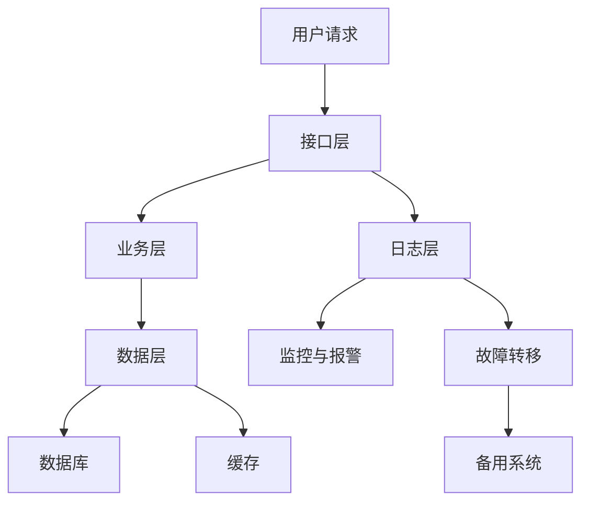
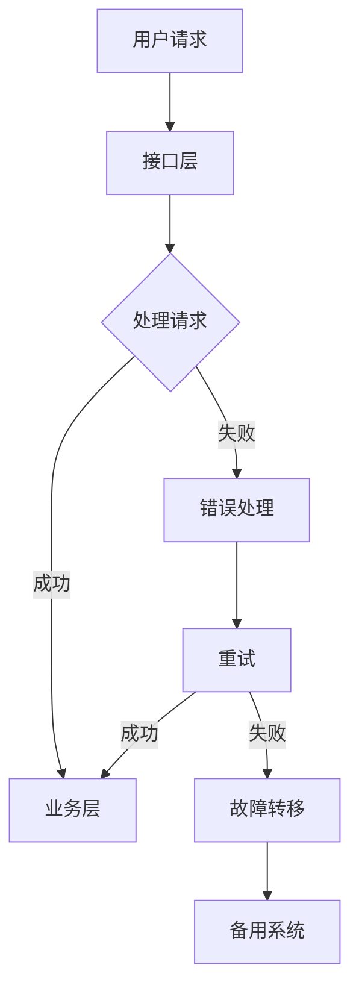
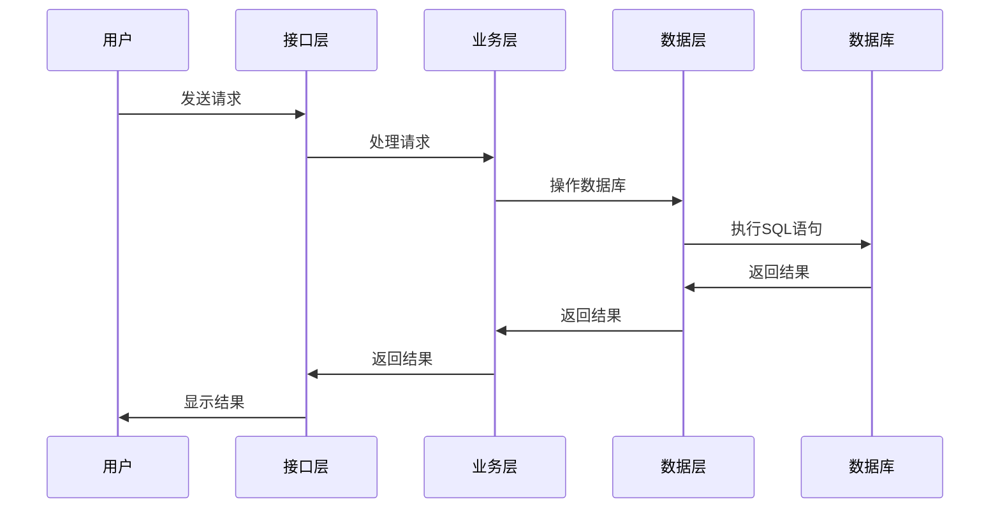

                 

# LLM应用开发中的错误处理与容错机制

## 关键词

- 大型语言模型 (LLM)
- 错误处理
- 容错机制
- 应用开发
- 高可用性

## 摘要

随着人工智能技术的快速发展，大型语言模型（LLM）的应用越来越广泛。在LLM的应用开发过程中，错误处理与容错机制是确保系统稳定性和可靠性的关键。本文将详细探讨LLM应用开发中的错误处理与容错机制，包括其核心概念、原理、方法、系统设计及实战案例，旨在为开发者提供有价值的参考和实践指导。

## 第一部分：引言

### 第1章：问题背景与概述

#### 1.1 问题描述

在LLM的应用开发过程中，系统可能会面临各种错误，如数据异常、计算错误、网络中断等。这些错误不仅会影响系统的性能，甚至可能导致系统崩溃。因此，如何有效地处理和容错是开发者需要重点关注的问题。

#### 1.2 问题解决

解决LLM应用开发中的错误处理与容错问题，需要从以下几个方面入手：
1. 明确错误类型和特征。
2. 设计合理的错误处理和容错机制。
3. 对系统进行全面的测试和优化。

#### 1.3 边界与外延

在探讨错误处理与容错机制时，需要明确其适用范围和边界。例如，对于某些特定的应用场景，可能需要更加严格的容错要求。

#### 1.4 核心概念

错误处理与容错机制的核心概念包括：
1. 错误类型：根据错误的发生原因和表现形式，将错误分为多种类型。
2. 错误检测：通过监测系统的运行状态，及时发现并识别错误。
3. 错误纠正：在发现错误后，采取措施进行纠正，以恢复系统的正常运行。

#### 1.5 概念结构

错误处理与容错机制的概念结构可以分为以下几个层次：
1. 错误检测与识别。
2. 错误分类与诊断。
3. 错误处理策略与算法。
4. 容错机制设计与实现。

#### 1.6 要素组成

错误处理与容错机制的基本要素包括：
1. 错误处理模块：负责错误检测、诊断和纠正。
2. 容错机制模块：负责系统的高可用性和稳定性。
3. 监测与反馈机制：用于实时监测系统状态，及时响应错误。

#### 1.7 本章小结

本章介绍了LLM应用开发中的错误处理与容错机制的问题背景、解决思路和核心概念。接下来，我们将进一步探讨这些核心概念的具体原理、方法和应用。

## 第二部分：核心概念与联系

### 第2章：核心概念原理

#### 2.1 错误处理原理

##### 2.1.1 错误类型

在LLM应用开发中，常见的错误类型包括：
1. 计算错误：如数值溢出、精度丢失等。
2. 网络错误：如连接中断、数据丢失等。
3. 数据错误：如数据不一致、数据缺失等。

##### 2.1.2 错误检测

错误检测的方法主要包括：
1. 监测系统运行状态：通过监控系统的运行日志、性能指标等，发现异常情况。
2. 数据验证：对输入和输出数据进行检查，确保其正确性。

##### 2.1.3 错误纠正

错误纠正的方法主要包括：
1. 异常处理：在发现错误后，根据错误类型和严重程度，采取相应的措施，如暂停操作、重试等。
2. 数据恢复：对于数据错误，尝试恢复数据，以保证系统的正常运行。

#### 2.2 容错机制原理

##### 2.2.1 容错类型

容错机制可以分为以下几种类型：
1. 静态冗余：通过增加硬件或软件冗余，提高系统的可靠性。
2. 动态冗余：在系统运行过程中，通过备份和切换，确保系统的可用性。
3. 检测与恢复：在系统出现故障时，自动检测并恢复系统。

##### 2.2.2 容错方法

常见的容错方法包括：
1. 故障转移：在主系统出现故障时，自动切换到备用系统。
2. 主动冗余：通过增加硬件或软件冗余，提高系统的可靠性。
3. 被动冗余：在系统正常运行时，对关键组件进行备份和监测。

##### 2.2.3 容错系统设计

容错系统设计的原则包括：
1. 高可用性：确保系统在出现故障时，能够快速恢复。
2. 可扩展性：随着业务需求的变化，系统可以灵活扩展。
3. 易维护性：便于系统的维护和升级。

#### 2.3 概念属性特征对比表格

下面是一个关于错误处理和容错机制属性特征的对比表格：

| 特征 | 错误处理 | 容错机制 |
| ---- | -------- | -------- |
| 目标 | 识别和纠正错误 | 提高系统可靠性 |
| 方法 | 异常处理、数据恢复 | 故障转移、主动/被动冗余 |
| 应用场景 | 单个组件或服务 | 整个系统 |
| 成本 | 较低 | 较高 |

#### 2.4 ER实体关系图架构

以下是错误处理和容错机制的ER实体关系图：

```mermaid
erDiagram
  Error |<-.*| ErrorType
  Error |<-.*| ErrorDetection
  Error |<-.*| ErrorCorrection
  FaultTolerance |<-.*| FaultTransfer
  FaultTolerance |<-.*| ActiveRedundancy
  FaultTolerance |<-.*| PassiveRedundancy
  System |<-.*| FaultTolerance
  System |<-.*| Error
  System |<-.*| ErrorType
  System |<-.*| ErrorDetection
  System |<-.*| ErrorCorrection
```

### 第3章：错误处理方法

#### 3.1 常见错误处理方法

##### 3.1.1 异常处理

异常处理是指在发现异常情况时，采取相应的措施进行处理。常见的异常处理方法包括：
1. 暂停操作：在发现错误时，暂停当前操作，等待错误纠正后再继续。
2. 重试机制：在发现错误时，重新执行操作，尝试恢复系统。
3. 回滚操作：在发现错误时，撤销之前的操作，确保系统状态的一致性。

##### 3.1.2 回滚操作

回滚操作是指在发现错误时，撤销之前的操作，以确保系统状态的一致性。常见的回滚操作方法包括：
1. 数据库回滚：在数据库操作出现错误时，撤销之前的数据库操作。
2. 代码回滚：在代码执行过程中，撤销之前的代码执行。

##### 3.1.3 重试机制

重试机制是指在发现错误时，重新执行操作，尝试恢复系统。常见的重试机制方法包括：
1. 线性重试：按照固定的时间间隔重新执行操作。
2. 指数退避重试：按照指数递增的时间间隔重新执行操作。

#### 3.2 容错机制应用

##### 3.2.1 故障转移

故障转移是指在主系统出现故障时，自动切换到备用系统。常见的故障转移方法包括：
1. 负载均衡：将请求分配到多个系统，确保系统的可用性。
2. 主备切换：在主系统出现故障时，自动切换到备用系统。

##### 3.2.2 主动冗余

主动冗余是指通过增加硬件或软件冗余，提高系统的可靠性。常见的主动冗余方法包括：
1. 备用硬件：在主硬件出现故障时，备用硬件自动接管。
2. 备用软件：在主软件出现故障时，备用软件自动接管。

##### 3.2.3 被动冗余

被动冗余是指通过备份和监测，提高系统的可靠性。常见的被动冗余方法包括：
1. 数据备份：定期备份系统数据，确保数据的安全性。
2. 监测与报警：实时监测系统状态，发现异常时及时报警。

#### 3.3 容错机制优缺点分析

下面是一个关于容错机制优缺点的对比表格：

| 方法 | 优点 | 缺点 |
| ---- | ---- | ---- |
| 故障转移 | 快速恢复 | 高成本 |
| 主动冗余 | 高可靠性 | 高成本 |
| 被动冗余 | 低成本 | 可能存在延迟 |

#### 3.4 案例分析

以下是一个关于错误处理和容错机制的案例：

某公司开发了一个基于LLM的智能客服系统，该系统主要用于处理客户的咨询和问题。然而，在实际应用过程中，系统出现了以下问题：

1. 数据异常：由于数据源的问题，导致系统输入的数据存在错误。
2. 计算错误：在处理复杂问题时，系统出现计算错误，导致输出结果不准确。
3. 网络中断：由于网络不稳定，导致系统与外部接口无法正常通信。

针对这些问题，公司采取了以下错误处理和容错机制：

1. 错误处理：
   - 数据异常：在数据输入环节，对数据进行校验，确保数据的正确性。
   - 计算错误：增加计算校验，确保输出结果的一致性。
   - 网络中断：在网络连接不稳定的情况下，采用重试机制，尝试重新连接。

2. 容错机制：
   - 故障转移：在主系统出现故障时，自动切换到备用系统，确保系统的可用性。
   - 主动冗余：增加备用硬件和软件，确保系统的可靠性。
   - 被动冗余：定期备份系统数据，确保数据的安全性。

通过以上措施，公司成功解决了系统中的错误问题，提高了系统的稳定性和可靠性。

### 第4章：容错系统设计

#### 4.1 容错系统设计原则

在设计容错系统时，需要遵循以下原则：

1. 高可用性：确保系统在出现故障时，能够快速恢复，保证业务的连续性。
2. 可扩展性：随着业务需求的变化，系统可以灵活扩展，满足不同场景的需求。
3. 易维护性：便于系统的维护和升级，降低维护成本。

#### 4.2 系统架构设计

以下是一个容错系统的架构设计：



#### 4.3 系统接口设计

以下是一个容错系统的接口设计：



#### 4.4 系统交互设计

以下是一个容错系统的交互设计：



### 第5章：错误处理与容错机制实战

#### 5.1 环境安装

在本节中，我们将介绍如何在本地环境中安装和配置LLM应用开发所需的工具和库。

1. 安装Python环境
2. 安装LLM框架（如Hugging Face Transformers）
3. 安装其他依赖库（如NumPy、Pandas等）

#### 5.2 系统核心实现

在本节中，我们将介绍LLM应用开发的核心实现，包括数据预处理、模型训练、模型推理和结果输出等步骤。

1. 数据预处理：读取和处理输入数据，进行数据清洗、归一化和编码等操作。
2. 模型训练：使用训练数据进行模型训练，调整超参数，优化模型性能。
3. 模型推理：使用训练好的模型进行推理，获取预测结果。
4. 结果输出：将预测结果以用户友好的方式展示。

#### 5.3 案例分析与讲解

在本节中，我们将通过实际案例，分析错误处理和容错机制在实际应用中的效果和作用。

案例1：数据异常处理
- 数据异常导致模型预测结果不准确
- 通过数据清洗和预处理，降低数据异常对模型的影响

案例2：计算错误处理
- 计算错误导致模型预测失败
- 通过增加计算校验和重试机制，提高模型预测的准确性

案例3：网络中断处理
- 网络中断导致模型无法获取数据
- 通过故障转移和备用系统，确保模型正常运行

#### 5.4 项目小结

在本节中，我们将对整个项目进行总结，分析错误处理和容错机制在实际应用中的作用和效果。

1. 错误处理和容错机制能够提高系统的稳定性和可靠性。
2. 根据实际需求和场景，选择合适的错误处理和容错机制。
3. 持续优化和改进错误处理和容错机制，提高系统的性能和用户体验。

### 第6章：最佳实践与注意事项

#### 6.1 最佳实践

在LLM应用开发中，以下是一些最佳实践：

1. 数据预处理：对输入数据进行充分的预处理，降低数据异常对模型的影响。
2. 模型训练：选择合适的训练策略和超参数，提高模型性能。
3. 模型推理：合理设置模型参数，提高预测准确性。
4. 错误处理：根据实际需求，选择合适的错误处理和容错机制。

#### 6.2 注意事项

在LLM应用开发中，需要注意以下事项：

1. 数据安全：确保输入数据的安全性和隐私性。
2. 性能优化：对模型和系统进行性能优化，提高运行效率。
3. 可维护性：编写可维护的代码，降低维护成本。
4. 持续更新：根据需求和场景，持续更新和改进错误处理和容错机制。

### 第7章：小结与展望

#### 7.1 全书回顾

本文主要介绍了LLM应用开发中的错误处理与容错机制，包括核心概念、原理、方法、系统设计和实战案例。通过本文的学习，读者可以了解如何有效地处理和容错，提高LLM应用系统的稳定性和可靠性。

#### 7.2 未来发展趋势

随着人工智能技术的不断发展，LLM应用开发中的错误处理与容错机制将面临新的挑战和机遇。未来发展趋势包括：

1. 智能化错误处理与容错：通过引入机器学习和深度学习技术，实现更智能、更高效的错误处理和容错机制。
2. 分布式系统：随着云计算和分布式技术的普及，LLM应用开发将更加注重分布式系统的错误处理与容错。
3. 容错算法优化：不断优化和改进容错算法，提高系统的可靠性和性能。

#### 7.3 研究方向

未来，LLM应用开发中的错误处理与容错机制研究可以重点关注以下方向：

1. 智能化错误处理与容错算法研究。
2. 分布式系统中的错误处理与容错机制研究。
3. 容错算法的优化和性能评估。

#### 7.4 展望未来

随着人工智能技术的不断进步，LLM应用开发中的错误处理与容错机制将发挥越来越重要的作用。通过本文的学习，读者可以更好地应对LLM应用开发中的挑战，提高系统的稳定性和可靠性。在未来，我们期待能够看到更多创新和突破，为人工智能技术的发展贡献力量。

### 作者信息

- 作者：AI天才研究院/AI Genius Institute & 禅与计算机程序设计艺术 /Zen And The Art of Computer Programming

[End of Article]

