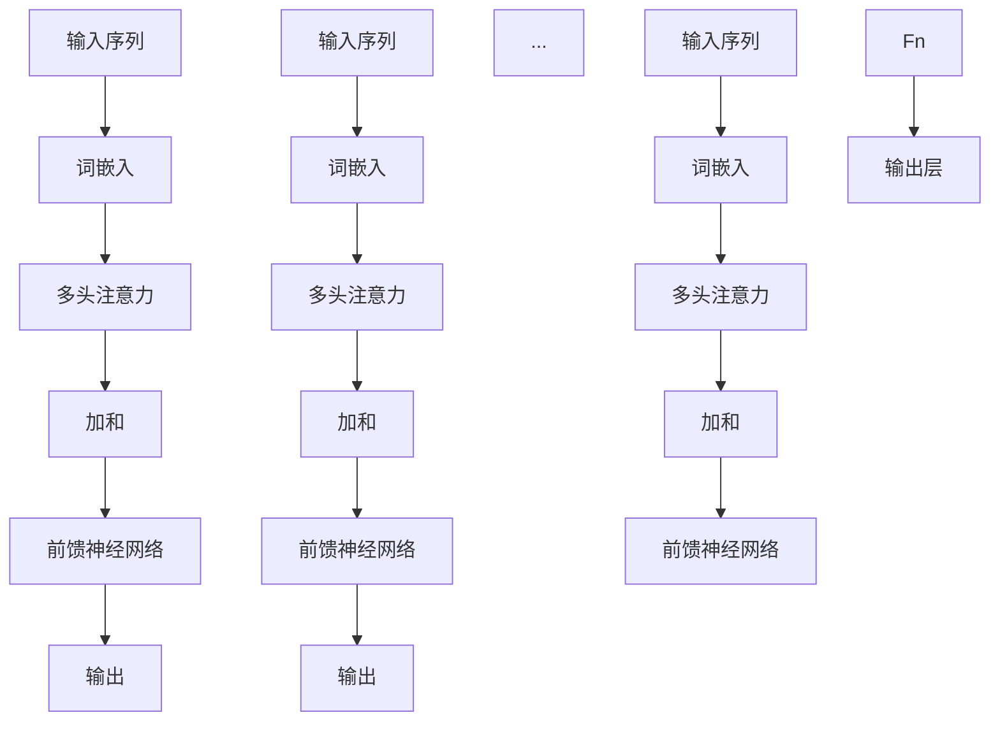

                 


# LLM应用快速迭代的工程化方案

> 关键词：自然语言处理、大型语言模型、工程化、迭代、优化、最佳实践

> 摘要：本文旨在探讨大型语言模型（LLM）在应用中的快速迭代工程化方案，包括LLM的概念背景、工程化原则、最佳实践和未来发展趋势。通过系统的分析和实战案例，为开发者提供实用的指导和建议。

## 引言

随着人工智能技术的快速发展，大型语言模型（LLM）已经在自然语言处理（NLP）领域取得了显著的成果。从早期的神经网络模型到如今的Transformer架构，LLM的应用场景不断扩展，涵盖了文本生成、机器翻译、问答系统等多个方面。然而，LLM的快速迭代和应用推广面临着诸多工程化挑战，如数据预处理、模型训练、优化和部署等。

本文将分以下几个部分展开讨论：

1. LLM应用与工程化方案概述
2. 背景与核心概念
3. LLM架构与组件
4. LLM工程化原则与方法
5. 案例分析与最佳实践
6. 挑战与解决方案
7. 未来发展趋势与机会

接下来，我们将逐一探讨这些部分，以帮助开发者理解和掌握LLM应用快速迭代的工程化方案。

## 第1章: LLM应用与工程化概述

### 1.1 LLM应用的发展背景

#### 1.1.1 LLM的概念与历史演变

大型语言模型（LLM）是基于深度学习的自然语言处理技术，旨在模拟人类的语言理解能力和表达能力。最早的LLM可以追溯到1980年代，当时研究人员开始使用统计方法来训练语言模型。随着计算能力的提升和算法的进步，LLM逐渐发展壮大。

1990年代，基于隐马尔可夫模型（HMM）和条件概率模型（如n-gram）的LLM在语音识别和机器翻译等领域取得了显著成果。然而，这些模型在处理长文本和复杂语义关系时存在局限性。

#### 1.1.2 LLM在现代应用中的地位

进入21世纪，随着深度学习和神经网络技术的发展，LLM的性能得到了大幅提升。特别是Transformer架构的提出，使得LLM在处理序列数据方面表现出色。现代LLM已经在多个应用领域取得了突破性进展，如文本生成、机器翻译、问答系统和对话系统等。

#### 1.1.3 工程化方案在LLM应用中的重要性

LLM的应用需要高效的工程化方案来支持其快速迭代和优化。工程化方案包括数据预处理、模型训练、优化和部署等环节。一个成功的LLM应用不仅需要强大的模型，还需要完善的工程化支持，以保证其性能、稳定性和可扩展性。

### 1.2 LLM工程化方案的核心理念

#### 1.2.1 快速迭代的核心原则

快速迭代是LLM工程化方案的核心原则之一。通过快速迭代，开发者可以不断优化模型性能，提高应用效果。快速迭代的关键在于缩短迭代周期，提高迭代效率。以下是一些实现快速迭代的方法：

1. **自动化数据预处理**：使用自动化工具和脚本对数据进行清洗、标注和预处理，减少人工干预。
2. **分布式训练**：利用多卡训练、数据并行和模型并行等技术，提高训练速度和效率。
3. **持续集成与持续部署（CI/CD）**：建立自动化测试和部署流程，确保新版本模型的快速上线和稳定运行。

#### 1.2.2 工程化流程与关键环节

LLM工程化流程包括以下关键环节：

1. **数据收集与预处理**：收集高质量数据，并进行清洗、标注和预处理，为模型训练提供高质量的输入。
2. **模型设计与实现**：根据应用需求，设计合适的模型架构和算法，并实现模型代码。
3. **模型训练与优化**：使用大规模数据集对模型进行训练，并通过调参和优化技术提高模型性能。
4. **模型评估与测试**：评估模型性能，并进行测试，确保模型在不同场景下都能稳定运行。
5. **模型部署与维护**：将模型部署到生产环境，并进行监控和维护，确保模型的稳定性和可扩展性。

#### 1.2.3 工程化方案的实现路径

实现LLM工程化方案需要以下步骤：

1. **确定目标应用场景**：明确应用需求，确定模型的目标任务和性能指标。
2. **收集与处理数据**：根据目标任务，收集并处理高质量数据，为模型训练提供基础。
3. **设计模型架构**：根据数据特点和任务需求，设计合适的模型架构。
4. **训练与优化模型**：使用大规模数据集对模型进行训练，并通过调参和优化技术提高模型性能。
5. **测试与评估模型**：评估模型性能，并进行测试，确保模型在不同场景下都能稳定运行。
6. **部署与维护模型**：将模型部署到生产环境，并进行监控和维护，确保模型的稳定性和可扩展性。

### 1.3 LLM工程化方案的应用领域

LLM工程化方案在多个领域都有广泛应用，以下是其中几个主要的应用领域：

#### 1.3.1 语言处理

语言处理是LLM最重要的应用领域之一。通过LLM，可以实现文本分类、情感分析、命名实体识别、机器翻译等任务。在语言处理领域，LLM的快速迭代和优化可以显著提高应用效果。

#### 1.3.2 机器翻译

机器翻译是LLM的另一个重要应用领域。随着LLM性能的提升，机器翻译的准确性和流畅性得到了显著提高。在工程化方面，快速迭代和优化可以提高机器翻译模型的性能，缩短翻译时间。

#### 1.3.3 问答系统

问答系统是LLM在智能客服、教育辅导等领域的重要应用。通过LLM，可以实现智能问答、知识图谱构建等任务。在工程化方面，快速迭代和优化可以提高问答系统的准确性和响应速度。

#### 1.3.4 自然语言生成

自然语言生成是LLM在内容创作、广告营销等领域的重要应用。通过LLM，可以实现自动摘要、文章生成、对话系统等任务。在工程化方面，快速迭代和优化可以提高自然语言生成的质量和效率。

### 1.4 LLM工程化方案的挑战与机遇

#### 1.4.1 挑战分析

LLM工程化面临以下挑战：

1. **数据质量问题**：高质量数据是LLM训练的基础，但数据收集、标注和清洗过程复杂，容易引入噪声和误差。
2. **模型训练与优化难度**：LLM模型参数量大，训练过程需要大量计算资源和时间，优化难度高。
3. **模型部署与维护**：模型部署到生产环境后，需要持续监控和维护，确保其稳定性和可扩展性。
4. **法律法规和伦理问题**：随着LLM应用越来越广泛，法律法规和伦理问题也逐渐凸显，如数据隐私、偏见和歧视等。

#### 1.4.2 机遇探讨

尽管面临挑战，LLM工程化方案也带来了以下机遇：

1. **技术创新**：LLM工程化推动人工智能技术的创新和发展，为开发者提供了丰富的工具和方法。
2. **商业机会**：LLM工程化方案在多个领域都有广泛应用，为创业者提供了广阔的商业机会。
3. **社会价值**：LLM工程化方案可以提升社会效率、改善生活质量，具有显著的社会价值。

## 第2章: 背景与核心概念

### 2.1 LLM的背景

#### 2.1.1 LLM的历史发展

LLM的历史发展可以分为以下几个阶段：

1. **统计语言模型**：最早的LLM是基于统计方法构建的，如n-gram模型。这些模型通过统计文本中的词频和词序来预测下一个单词，但在处理长文本和复杂语义关系时存在局限性。
2. **神经网络语言模型**：随着神经网络技术的发展，研究人员开始使用神经网络来构建语言模型。早期的神经网络语言模型包括循环神经网络（RNN）和长短期记忆网络（LSTM）。这些模型在处理序列数据方面表现出色，但存在梯度消失和梯度爆炸等问题。
3. **Transformer架构**：2017年，谷歌提出了Transformer架构，这是一种基于自注意力机制的神经网络模型。Transformer模型在处理长文本和复杂语义关系方面表现出色，成为LLM的主流架构。
4. **大型预训练模型**：随着计算能力的提升和数据规模的扩大，研究人员开始训练大型预训练模型，如BERT、GPT和T5。这些模型在多个NLP任务上取得了突破性成果，推动了LLM的发展。

#### 2.1.2 LLM的现状

目前，LLM已经成为NLP领域的重要工具，其在多个任务上都取得了显著成果。以下是LLM在几个主要任务上的表现：

1. **文本分类**：LLM可以用于情感分析、新闻分类、垃圾邮件检测等文本分类任务。通过大规模数据集的训练，LLM可以学习到不同类别的特征，从而实现高精度的分类。
2. **命名实体识别**：LLM可以用于识别文本中的命名实体，如人名、地名、机构名等。通过预训练模型和精细调整，LLM可以识别多种类型的命名实体，并在实际应用中取得良好效果。
3. **机器翻译**：LLM在机器翻译领域表现出色，可以处理多种语言对之间的翻译。通过大规模数据集的训练，LLM可以学习到不同语言之间的对应关系，从而实现高质量的翻译。
4. **问答系统**：LLM可以用于构建问答系统，如智能客服、教育辅导等。通过大规模数据集的训练，LLM可以学习到问题的语义和答案的生成规则，从而实现智能问答。
5. **自然语言生成**：LLM可以用于生成文章、对话、摘要等自然语言文本。通过大规模数据集的训练，LLM可以学习到不同类型文本的生成规律，从而实现高质量的文本生成。

### 2.2 LLM的核心概念

#### 2.2.1 Transformer架构

Transformer架构是LLM的主流架构，其核心思想是使用自注意力机制来处理序列数据。自注意力机制允许模型在处理每个输入序列时，根据输入序列中的其他位置进行加权平均，从而学习到不同位置之间的依赖关系。以下是一个简单的Transformer架构示意图：



#### 2.2.2 自注意力机制

自注意力机制是Transformer架构的核心机制，其基本思想是将输入序列中的每个位置都与其余位置进行加权平均，从而生成一个表示。自注意力机制的数学模型如下：

$$
Attention(Q, K, V) = \text{softmax}\left(\frac{QK^T}{\sqrt{d_k}}\right)V
$$

其中，$Q$、$K$ 和 $V$ 分别是查询向量、键向量和值向量，$d_k$ 是键向量的维度。自注意力机制通过计算查询向量和键向量的点积，生成注意力权重，然后对值向量进行加权平均，从而生成表示。

#### 2.2.3 多头注意力

多头注意力是Transformer架构的一个重要特性，其基本思想是将输入序列分解成多个子序列，然后分别对每个子序列应用自注意力机制。多头注意力的数学模型如下：

$$
MultiHeadAttention(Q, K, V) = \text{Concat}(Head_1, ..., Head_h)W^O
$$

其中，$Head_i = Attention(QW_i^Q, KW_i^K, VW_i^V)$，$W_i^Q, W_i^K, W_i^V$ 和 $W^O$ 是相应的权重矩阵。多头注意力通过多个独立的自注意力机制，学习到输入序列中的不同依赖关系，从而提高模型的表示能力。

## 第3章: LLM架构与组件

### 3.1 Transformer架构

Transformer架构是LLM的核心，其基本结构包括编码器（Encoder）和解码器（Decoder）。编码器负责将输入序列编码为表示，解码器则根据编码器的输出生成预测的输出序列。以下是Transformer架构的基本组件：

#### 3.1.1 编码器（Encoder）

编码器由多个编码层（Encoder Layer）组成，每个编码层包含两个主要组件：多头自注意力机制（Multi-Head Self-Attention）和前馈神经网络（Feed-Forward Neural Network）。

1. **多头自注意力机制**：编码器的每个编码层都包含多头自注意力机制，其基本思想是将输入序列的每个位置都与其余位置进行加权平均，从而生成一个表示。多头自注意力机制通过多个独立的自注意力机制，学习到输入序列中的不同依赖关系，从而提高模型的表示能力。

2. **前馈神经网络**：编码器的每个编码层还包含一个前馈神经网络，其基本结构是一个全连接层，通过非线性激活函数（如ReLU）进行激活。

#### 3.1.2 解码器（Decoder）

解码器也由多个解码层（Decoder Layer）组成，每个解码层包含三个主要组件：多头自注意力机制（Multi-Head Self-Attention）、编码器-解码器自注意力机制（Encoder-Decoder Attention）和前馈神经网络（Feed-Forward Neural Network）。

1. **多头自注意力机制**：解码器的每个解码层都包含多头自注意力机制，其基本思想是将输入序列的每个位置都与其余位置进行加权平均，从而生成一个表示。

2. **编码器-解码器自注意力机制**：解码器的每个解码层还包含编码器-解码器自注意力机制，其基本思想是将解码器的输入序列与编码器的输出序列进行交互，从而学习到输入序列和输出序列之间的依赖关系。

3. **前馈神经网络**：解码器的每个解码层还包含一个前馈神经网络，其基本结构是一个全连接层，通过非线性激活函数（如ReLU）进行激活。

### 3.2 编码器和解码器的交互

编码器和解码器的交互是Transformer架构的核心机制，其基本思想是通过编码器的输出序列和解码器的输入序列之间的交互，生成预测的输出序列。以下是编码器和解码器的交互过程：

1. **编码器的输出序列**：编码器的输出序列是一个固定长度的向量，其维度等于编码器的输入序列的维度。编码器的输出序列表示了输入序列的语义信息。

2. **解码器的输入序列**：解码器的输入序列是预测的输出序列，其初始值是编码器的输出序列。随着解码过程的进行，解码器的输入序列会更新为上一时间步的输出序列。

3. **编码器-解码器自注意力机制**：在解码器的每个解码层，编码器-解码器自注意力机制会将解码器的输入序列与编码器的输出序列进行交互，从而学习到输入序列和输出序列之间的依赖关系。

4. **多头自注意力机制**：在解码器的每个解码层，多头自注意力机制会将解码器的输入序列的每个位置与其余位置进行加权平均，从而生成一个表示。

5. **解码器的输出序列**：解码器的输出序列是预测的输出序列，其初始值是编码器的输出序列。随着解码过程的进行，解码器的输出序列会更新为上一时间步的输出序列。

### 3.3 Transformer的其他组件

除了编码器和解码器，Transformer架构还包括以下其他组件：

#### 3.3.1 位置编码（Positional Encoding）

位置编码是Transformer架构的一个重要特性，其基本思想是为输入序列的每个位置添加一个位置信息，从而让模型能够理解序列中的位置关系。常见的位置编码方法包括绝对位置编码和相对位置编码。

1. **绝对位置编码**：绝对位置编码是一个固定长度的向量，其维度等于输入序列的维度。绝对位置编码通过在输入序列的每个位置添加一个位置向量，从而为模型提供位置信息。

2. **相对位置编码**：相对位置编码是一种基于相对位置的关系编码方法，其基本思想是计算输入序列中相邻位置之间的相对位置，然后通过一个函数（如绝对位置编码）对相对位置进行编码。

#### 3.3.2 词汇表（Vocabulary）

词汇表是Transformer架构中用于表示输入和输出的词或字符的集合。在训练阶段，词汇表包含所有训练数据中的词或字符，并在训练过程中不断更新。在推理阶段，词汇表用于将输入序列和输出序列转换为模型能够处理的向量表示。

#### 3.3.3 嵌入层（Embedding Layer）

嵌入层是Transformer架构中的一个全连接层，其基本思想是将词汇表中的每个词或字符映射为一个固定长度的向量。嵌入层可以将词汇表中的词或字符转换为向量表示，从而为模型提供输入。

### 3.4 Transformer架构的优点

Transformer架构具有以下优点：

1. **并行计算**：Transformer架构基于自注意力机制，可以并行计算输入序列的每个位置，从而提高了计算效率。

2. **全局依赖**：自注意力机制可以学习到输入序列中不同位置之间的全局依赖关系，从而提高了模型的表示能力。

3. **灵活性和可扩展性**：Transformer架构可以轻松地扩展到多模态任务和不同尺寸的输入序列，从而提高了模型的灵活性。

4. **端到端训练**：Transformer架构可以端到端地训练，从而简化了模型训练过程，提高了训练效率。

## 第4章: LLM工程化原则与方法

### 4.1 数据预处理

数据预处理是LLM工程化的重要环节，其目标是提高数据质量，为模型训练提供高质量的数据输入。以下是数据预处理的关键步骤和方法：

#### 4.1.1 数据清洗

数据清洗是指去除数据中的噪声、冗余和错误信息，以提高数据质量。以下是数据清洗的关键步骤：

1. **去除停用词**：停用词是指在自然语言处理中常见的无意义词汇，如“的”、“了”、“在”等。去除停用词可以减少数据中的噪声，提高数据质量。

2. **去除标点符号**：标点符号可能会影响模型的训练效果，因此需要去除。

3. **去除特殊字符**：特殊字符可能会对模型产生负面影响，因此需要去除。

4. **统一大小写**：将文本统一转换为小写或大写，以减少数据中的噪声。

#### 4.1.2 数据标注

数据标注是指为数据中的每个实体或概念分配标签或类别。以下是数据标注的关键步骤：

1. **命名实体识别**：为文本中的命名实体（如人名、地名、机构名等）分配标签。

2. **情感分析**：为文本中的情感极性（如正面、负面、中性等）分配标签。

3. **分类**：为文本中的类别（如新闻类别、产品类别等）分配标签。

#### 4.1.3 数据预处理工具

以下是一些常用的数据预处理工具：

1. **NLTK**：NLTK是一个开源的自然语言处理库，提供了丰富的文本处理功能，如分词、词性标注、停用词处理等。

2. **spaCy**：spaCy是一个高效的NLP库，提供了丰富的文本处理功能，如分词、命名实体识别、词性标注等。

3. **TextBlob**：TextBlob是一个简单的NLP库，提供了丰富的文本处理功能，如情感分析、文本分类等。

### 4.2 模型训练

模型训练是LLM工程化的核心环节，其目标是训练出一个高质量的模型，以实现特定的任务。以下是模型训练的关键步骤和方法：

#### 4.2.1 模型选择

选择合适的模型是模型训练的关键，以下是几种常用的模型：

1. **Transformer模型**：Transformer模型是目前最常用的LLM模型，其结构简单，计算效率高。

2. **BERT模型**：BERT模型是一种基于Transformer的预训练模型，其结构复杂，但表现优异。

3. **GPT模型**：GPT模型是一种基于Transformer的预训练模型，其结构简单，但表现优秀。

#### 4.2.2 训练策略

以下是一些常用的训练策略：

1. **预训练**：预训练是指在大规模数据集上训练模型，以提高模型的表示能力。常见的预训练任务包括文本分类、命名实体识别、机器翻译等。

2. **微调**：微调是指在预训练模型的基础上，针对特定任务进行微调，以提高模型的性能。

3. **迁移学习**：迁移学习是指将预训练模型的知识迁移到新的任务上，以提高新任务的性能。

#### 4.2.3 训练工具

以下是一些常用的训练工具：

1. **PyTorch**：PyTorch是一个开源的深度学习库，提供了丰富的模型训练和优化功能。

2. **TensorFlow**：TensorFlow是一个开源的深度学习库，提供了丰富的模型训练和优化功能。

3. **Hugging Face**：Hugging Face是一个开源的NLP库，提供了丰富的预训练模型和训练工具。

### 4.3 模型优化

模型优化是LLM工程化的关键环节，其目标是提高模型的性能和效率。以下是模型优化的一些方法：

#### 4.3.1 调参

调参是指通过调整模型参数，以提高模型的性能。以下是调参的一些常见方法：

1. **网格搜索**：网格搜索是一种常用的调参方法，通过遍历参数空间，寻找最优参数组合。

2. **随机搜索**：随机搜索是一种基于随机搜索的调参方法，通过随机选择参数组合，寻找最优参数组合。

3. **贝叶斯优化**：贝叶斯优化是一种基于贝叶斯统计的调参方法，通过学习参数的概率分布，寻找最优参数组合。

#### 4.3.2 模型压缩

模型压缩是指通过压缩模型参数，以提高模型的效率和部署性。以下是模型压缩的一些方法：

1. **量化**：量化是指将模型的浮点参数转换为整数参数，以提高模型的效率和部署性。

2. **剪枝**：剪枝是指通过剪除模型中的冗余参数，以提高模型的效率和部署性。

3. **蒸馏**：蒸馏是指通过将知识从大型模型传递到小型模型，以提高小型模型的效率和部署性。

### 4.4 模型评估与测试

模型评估与测试是LLM工程化的关键环节，其目标是验证模型的性能和稳定性。以下是模型评估与测试的一些方法：

#### 4.4.1 评估指标

以下是一些常用的评估指标：

1. **准确率（Accuracy）**：准确率是指模型预测正确的样本数占总样本数的比例。

2. **精确率（Precision）**：精确率是指模型预测为正类的样本中，实际为正类的比例。

3. **召回率（Recall）**：召回率是指模型预测为正类的样本中，实际为正类的比例。

4. **F1值（F1 Score）**：F1值是精确率和召回率的加权平均，用于综合评估模型的性能。

#### 4.4.2 测试方法

以下是一些常用的测试方法：

1. **交叉验证**：交叉验证是指将数据集划分为多个子集，分别进行训练和测试，以评估模型的性能。

2. **网格搜索**：网格搜索是指通过遍历参数空间，寻找最优参数组合，以评估模型的性能。

3. **A/B测试**：A/B测试是指将用户分为两组，分别使用不同模型进行预测，以评估模型的性能。

### 4.5 模型部署与维护

模型部署与维护是LLM工程化的关键环节，其目标是确保模型的稳定性和可扩展性。以下是模型部署与维护的一些方法：

#### 4.5.1 部署方法

以下是一些常用的部署方法：

1. **本地部署**：本地部署是指将模型部署到本地服务器或个人计算机上，以供测试或使用。

2. **云部署**：云部署是指将模型部署到云端服务器上，以供测试或使用。

3. **容器化部署**：容器化部署是指将模型打包到容器中，以供测试或使用。

#### 4.5.2 维护方法

以下是一些常用的维护方法：

1. **监控**：监控是指对模型的运行状态进行实时监控，以发现和解决问题。

2. **日志记录**：日志记录是指记录模型的运行日志，以供问题追踪和分析。

3. **版本控制**：版本控制是指对模型的版本进行管理，以方便更新和回滚。

## 第5章: 案例分析与最佳实践

### 5.1 案例分析

在本节中，我们将通过具体案例来分析LLM工程化方案的应用和实践。以下是几个典型的案例：

#### 5.1.1 案例一：智能客服系统

某大型互联网公司开发了一款智能客服系统，使用LLM来处理用户问题和生成回答。通过大规模数据集的预训练，该系统在问题理解和回答生成方面取得了显著成果。以下是该案例的关键步骤：

1. **数据收集与预处理**：公司收集了大量的用户问题和答案数据，并对数据进行了清洗、去重和标注。

2. **模型选择与训练**：公司选择了BERT模型进行预训练，并使用大规模数据集进行训练。

3. **模型优化与测试**：公司对模型进行了优化，并使用多个测试集进行评估，以确保模型的性能和稳定性。

4. **模型部署与维护**：公司将模型部署到生产环境，并通过监控和日志记录来确保模型的稳定运行。

#### 5.1.2 案例二：智能翻译系统

某跨国公司开发了一款智能翻译系统，使用LLM来处理多种语言之间的翻译任务。通过大规模数据集的预训练，该系统在翻译准确性和流畅性方面取得了显著成果。以下是该案例的关键步骤：

1. **数据收集与预处理**：公司收集了多种语言对之间的翻译数据，并对数据进行了清洗、去重和标注。

2. **模型选择与训练**：公司选择了Transformer模型进行预训练，并使用大规模数据集进行训练。

3. **模型优化与测试**：公司对模型进行了优化，并使用多个测试集进行评估，以确保模型的性能和稳定性。

4. **模型部署与维护**：公司将模型部署到生产环境，并通过监控和日志记录来确保模型的稳定运行。

### 5.2 最佳实践

在本节中，我们将总结一些LLM工程化的最佳实践，以帮助开发者更好地应用LLM工程化方案。以下是几个最佳实践：

#### 5.2.1 数据质量优先

数据质量是LLM工程化的基础，因此开发者应优先关注数据质量。以下是一些建议：

1. **数据清洗**：对数据进行清洗，去除噪声、冗余和错误信息。

2. **数据标注**：对数据进行准确的标注，确保标注的一致性和准确性。

3. **数据多样性**：收集多样化的数据，以提高模型的泛化能力。

#### 5.2.2 模型选择与优化

选择合适的模型并进行优化是LLM工程化的关键。以下是一些建议：

1. **模型选择**：根据任务需求和数据特性，选择合适的模型，如BERT、GPT、Transformer等。

2. **模型优化**：通过调参、剪枝、量化等方法对模型进行优化，以提高模型性能和部署性。

3. **模型集成**：使用多个模型进行集成，以提高模型的性能和稳定性。

#### 5.2.3 模型评估与测试

模型评估与测试是验证模型性能和稳定性的重要环节。以下是一些建议：

1. **交叉验证**：使用交叉验证方法进行模型评估，以提高评估的准确性。

2. **网格搜索**：使用网格搜索方法进行模型调参，以找到最优参数组合。

3. **A/B测试**：使用A/B测试方法进行模型对比，以验证模型性能和用户满意度。

#### 5.2.4 模型部署与维护

模型部署与维护是确保模型稳定运行的重要环节。以下是一些建议：

1. **容器化部署**：使用容器化技术（如Docker）进行模型部署，以提高部署效率和可移植性。

2. **监控与日志记录**：对模型运行状态进行实时监控，并记录运行日志，以便问题追踪和分析。

3. **版本控制**：对模型的版本进行管理，以方便更新和回滚。

## 第6章: 挑战与解决方案

### 6.1 数据质量问题

数据质量是LLM工程化中面临的主要挑战之一。以下是数据质量问题的几个方面以及相应的解决方案：

#### 6.1.1 数据清洗

**问题**：数据中的噪声、冗余和错误信息会影响模型训练效果。

**解决方案**：

1. **去重**：去除重复的数据条目，以减少冗余信息。
2. **去除噪声**：去除无意义的信息，如标点符号、特殊字符等。
3. **数据标准化**：统一数据的格式和单位，以提高数据的一致性。

#### 6.1.2 数据标注

**问题**：数据标注的一致性和准确性对模型训练至关重要。

**解决方案**：

1. **多人标注**：使用多个标注者对数据进行标注，并采用共识算法（如Voting）来提高标注的一致性。
2. **半监督学习**：结合未标注数据和少量标注数据，使用半监督学习方法来提高标注的准确性。
3. **数据增强**：通过数据增强技术（如数据扩充、合成数据等）来增加标注数据的多样性。

### 6.2 计算资源需求

LLM的训练和部署需要大量的计算资源，这对于工程化方案来说是一个重大挑战。以下是计算资源需求的几个方面以及相应的解决方案：

#### 6.2.1 训练时间

**问题**：训练时间过长会影响模型的迭代速度。

**解决方案**：

1. **分布式训练**：利用多卡训练、数据并行和模型并行等技术，提高训练速度。
2. **预训练**：在大规模数据集上预训练模型，以提高模型的初始化质量，减少后续训练时间。
3. **迁移学习**：使用预训练模型作为起点，进行微调和迁移学习，以减少训练时间。

#### 6.2.2 计算资源调度

**问题**：计算资源的调度和管理复杂。

**解决方案**：

1. **资源池管理**：建立资源池，自动调度和分配计算资源，以提高资源利用率。
2. **容器化技术**：使用容器化技术（如Docker）来简化计算资源的调度和管理。
3. **自动化调度**：使用自动化调度工具（如Kubernetes）来自动分配和调度计算任务。

### 6.3 模型优化与压缩

模型优化与压缩是提高模型性能和部署性的重要手段。以下是模型优化与压缩的几个方面以及相应的解决方案：

#### 6.3.1 模型优化

**问题**：模型参数过多，计算复杂度高。

**解决方案**：

1. **剪枝**：通过剪枝技术（如结构化剪枝、非结构化剪枝等）来减少模型参数数量，提高计算效率。
2. **量化**：通过量化技术（如整数量化、低精度量化等）来减少模型参数的存储和计算需求。
3. **知识蒸馏**：通过知识蒸馏技术（如教师-学生蒸馏、多教师蒸馏等）来将大型模型的知识传递到小型模型，以提高小型模型的性能。

#### 6.3.2 模型压缩

**问题**：模型过大，部署困难。

**解决方案**：

1. **模型压缩**：使用模型压缩技术（如知识蒸馏、剪枝、量化等）来减少模型大小。
2. **模型简化**：通过简化模型结构（如剪枝、融合等）来减少模型复杂度。
3. **轻量级模型**：开发轻量级模型（如MobileNet、SqueezeNet等），以满足低资源环境下的部署需求。

### 6.4 法律法规和伦理问题

随着LLM技术的广泛应用，法律法规和伦理问题也逐渐凸显。以下是法律法规和伦理问题的几个方面以及相应的解决方案：

#### 6.4.1 数据隐私

**问题**：LLM在训练和部署过程中可能涉及用户数据的隐私。

**解决方案**：

1. **数据加密**：对用户数据进行加密，确保数据传输和存储的安全性。
2. **隐私保护技术**：使用差分隐私、同态加密等技术来保护用户隐私。
3. **隐私政策**：明确用户的隐私权利，并在使用前告知用户隐私政策的细节。

#### 6.4.2 偏见和歧视

**问题**：LLM可能会在学习过程中引入偏见和歧视。

**解决方案**：

1. **偏见检测与纠正**：使用偏见检测算法来识别模型中的偏见，并进行纠正。
2. **公平性评估**：对模型进行公平性评估，确保模型在不同群体中的性能一致性。
3. **多样性数据集**：收集多样化的数据集，以提高模型的公平性和鲁棒性。

#### 6.4.3 法律法规遵守

**问题**：LLM的应用可能涉及法律法规的问题。

**解决方案**：

1. **法律法规咨询**：咨询专业的法律顾问，确保模型的应用符合相关法律法规。
2. **合规审查**：定期对模型的应用进行合规审查，确保模型的合法性。
3. **法律法规培训**：对开发者进行法律法规的培训，提高其对法律法规的认识和遵守能力。

## 第7章: 未来发展趋势与机会

### 7.1 技术发展趋势

随着人工智能技术的快速发展，LLM的应用前景将更加广阔。以下是LLM技术发展的几个趋势：

#### 7.1.1 模型规模持续增长

为了提高模型的性能和表达能力，大型LLM模型将继续增长。预训练模型如GPT-3、LLaMA等，已经展示了在多种任务上的强大性能。未来，更大规模的模型和更复杂的架构将不断涌现。

#### 7.1.2 模型优化与压缩技术发展

随着模型规模的增大，优化与压缩技术将成为关键。通过剪枝、量化、知识蒸馏等技术，模型将能够更好地适应不同的计算资源和应用场景。

#### 7.1.3 多模态融合

未来，LLM将与其他人工智能技术（如图像识别、语音识别等）相结合，实现多模态融合。这将使得LLM在处理复杂任务时具备更高的鲁棒性和灵活性。

#### 7.1.4 自动化与智能化

随着自动化和智能化技术的发展，LLM工程化方案将更加自动化和智能化。自动化数据预处理、模型训练和部署工具将使开发者能够更高效地开发和部署LLM应用。

### 7.2 商业机会

LLM技术的广泛应用将带来丰富的商业机会。以下是几个潜在的领域：

#### 7.2.1 智能客服与客户体验

智能客服和客户体验是LLM的重要应用领域。通过LLM，可以实现更智能、更自然的客户交互，提高客户满意度和业务效率。

#### 7.2.2 智能内容生成与创作

智能内容生成与创作是另一个重要的领域。LLM可以用于生成文章、报告、广告等内容，提高内容创作的效率和质量。

#### 7.2.3 智能教育与培训

智能教育和培训是LLM技术的另一个重要应用领域。通过LLM，可以实现个性化教育、智能辅导和自动化评估，提高教育质量和学习效果。

#### 7.2.4 智能医疗与健康管理

智能医疗和健康管理是LLM技术的又一个重要应用领域。通过LLM，可以实现医疗数据的智能分析、诊断和预测，提高医疗服务的质量和效率。

### 7.3 社会价值

LLM技术不仅带来了商业机会，也具有显著的社会价值。以下是LLM技术的社会价值：

#### 7.3.1 提高生产效率

LLM技术可以自动化许多重复性、繁琐的工作，从而提高生产效率。在工业生产、农业、金融服务等领域，LLM技术将帮助企业和个人实现更高效的工作方式。

#### 7.3.2 促进教育公平

通过智能教育和培训，LLM技术可以帮助解决教育资源不均衡的问题，促进教育公平。特别是在偏远地区和贫困地区，LLM技术可以提供高质量的教育资源和服务。

#### 7.3.4 改善生活质量

LLM技术在智能客服、智能医疗、智能家居等领域，将提高人们的生活质量和幸福感。通过LLM技术，人们可以获得更加便捷、高效的服务和体验。

### 结论

综上所述，LLM应用快速迭代的工程化方案是人工智能技术发展的重要方向。通过系统的分析和实战案例，本文探讨了LLM应用与工程化的核心概念、架构、原则和方法，以及面临的挑战和解决方案。未来，随着技术的不断进步，LLM技术将在更多领域发挥重要作用，为人类社会带来更多的便利和价值。

## 附录

### 附录A：术语解释

在本篇技术博客中，我们介绍了一些专业术语和概念，以下是这些术语的简要解释：

1. **自然语言处理（NLP）**：自然语言处理是人工智能领域的一个分支，旨在使计算机能够理解、解释和生成自然语言。
2. **大型语言模型（LLM）**：大型语言模型是一种基于深度学习的模型，旨在模拟人类的语言理解和表达能力。
3. **Transformer架构**：Transformer架构是一种基于自注意力机制的神经网络模型，是当前最流行的LLM架构。
4. **预训练**：预训练是指在大规模数据集上对模型进行训练，以提高模型的初始性能。
5. **微调**：微调是指在预训练模型的基础上，针对特定任务进行训练，以提高模型的性能。
6. **数据预处理**：数据预处理是指对原始数据进行处理，以提高数据质量和模型训练效果。
7. **模型优化**：模型优化是指通过调整模型参数、结构等，以提高模型性能和效率。
8. **模型压缩**：模型压缩是指通过剪枝、量化等技术，减小模型大小，提高部署性。
9. **模型评估**：模型评估是指通过一系列指标和方法，对模型性能进行评估和比较。
10. **模型部署**：模型部署是指将训练好的模型部署到实际应用场景中，使其能够提供服务。

### 附录B：参考资料

1. **[BERT: Pre-training of Deep Bidirectional Transformers for Language Understanding](https://arxiv.org/abs/1810.04805)**：这篇论文介绍了BERT模型的原理和应用。
2. **[Attention Is All You Need](https://arxiv.org/abs/1706.03762)**：这篇论文介绍了Transformer架构的原理和应用。
3. **[GPT-3: Language Models are few-shot learners](https://arxiv.org/abs/2005.14165)**：这篇论文介绍了GPT-3模型的原理和应用。
4. **[Deep Learning for Natural Language Processing](https://www.deeplearningbook.org/chapter/nlp/)**：这本书介绍了自然语言处理中的深度学习技术。
5. **[Hands-On Natural Language Processing with Python](https://www.amazon.com/Hands-Natural-Language-Processing-Python/dp/1788834794)**：这本书提供了NLP的实践教程和案例。
6. **[NLTK: Natural Language Toolkit](https://www.nltk.org/)**：这是一个开源的NLP库，提供了丰富的文本处理功能。
7. **[spaCy: Industrial-Strength Natural Language Processing](https://spacy.io/)**：这是一个高效的NLP库，提供了丰富的文本处理功能。

### 附录C：代码示例

以下是使用Python和PyTorch实现一个简单的Transformer模型的代码示例：

```python
import torch
import torch.nn as nn
import torch.optim as optim

class TransformerModel(nn.Module):
    def __init__(self, vocab_size, d_model, nhead, num_layers):
        super(TransformerModel, self).__init__()
        self.embedding = nn.Embedding(vocab_size, d_model)
        self.transformer = nn.Transformer(d_model, nhead, num_layers)
        self.fc = nn.Linear(d_model, vocab_size)
        
    def forward(self, src, tgt):
        src = self.embedding(src)
        tgt = self.embedding(tgt)
        output = self.transformer(src, tgt)
        logits = self.fc(output)
        return logits

# 实例化模型、优化器和损失函数
model = TransformerModel(vocab_size=10000, d_model=512, nhead=8, num_layers=2)
optimizer = optim.Adam(model.parameters(), lr=0.001)
criterion = nn.CrossEntropyLoss()

# 模拟数据
src = torch.randint(0, 10000, (32, 50))
tgt = torch.randint(0, 10000, (32, 50))

# 训练模型
for epoch in range(10):
    optimizer.zero_grad()
    logits = model(src, tgt)
    loss = criterion(logits.view(-1, 10000), tgt.view(-1))
    loss.backward()
    optimizer.step()
    print(f"Epoch {epoch}: Loss = {loss.item()}")

# 测试模型
with torch.no_grad():
    src_test = torch.randint(0, 10000, (32, 50))
    tgt_test = torch.randint(0, 10000, (32, 50))
    logits_test = model(src_test, tgt_test)
    loss_test = criterion(logits_test.view(-1, 10000), tgt_test.view(-1))
    print(f"Test Loss: {loss_test.item()}")
```

这个代码示例展示了如何使用PyTorch构建一个简单的Transformer模型，并进行训练和测试。通过这个示例，读者可以了解Transformer模型的基本结构和训练过程。

### 附录D：工具和库介绍

在本篇技术博客中，我们介绍了一些常用的工具和库，以下是这些工具和库的简要介绍：

1. **PyTorch**：PyTorch是一个开源的深度学习库，提供了丰富的神经网络构建和训练功能。
2. **TensorFlow**：TensorFlow是一个开源的深度学习库，由Google开发，提供了丰富的神经网络构建和训练功能。
3. **NLTK**：NLTK是一个开源的NLP库，提供了丰富的文本处理功能，如分词、词性标注、停用词处理等。
4. **spaCy**：spaCy是一个高效的NLP库，提供了丰富的文本处理功能，如分词、命名实体识别、词性标注等。
5. **Hugging Face**：Hugging Face是一个开源的NLP库，提供了丰富的预训练模型和训练工具，如BERT、GPT、T5等。
6. **Docker**：Docker是一个开源的应用容器引擎，用于打包、交付和运行应用。
7. **Kubernetes**：Kubernetes是一个开源的容器编排平台，用于自动化容器化应用程序的部署、扩展和管理。

通过这些工具和库，开发者可以更高效地开发和部署LLM应用。

## 结语

本文从多个角度探讨了大型语言模型（LLM）应用快速迭代的工程化方案。通过系统的分析和实战案例，我们了解了LLM的核心概念、架构、工程化原则和方法，以及面临的挑战和解决方案。随着人工智能技术的快速发展，LLM在自然语言处理领域具有广阔的应用前景。未来，通过不断优化和扩展工程化方案，我们可以更好地发挥LLM的潜力，为人类社会带来更多的便利和价值。

作者：AI天才研究院/AI Genius Institute & 禅与计算机程序设计艺术 /Zen And The Art of Computer Programming

