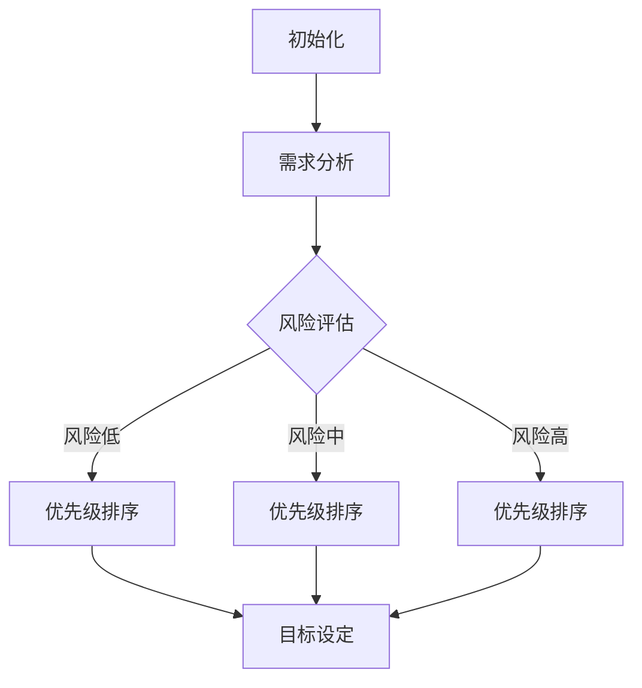
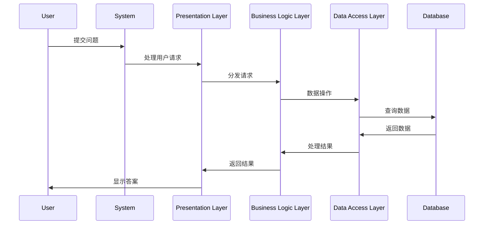
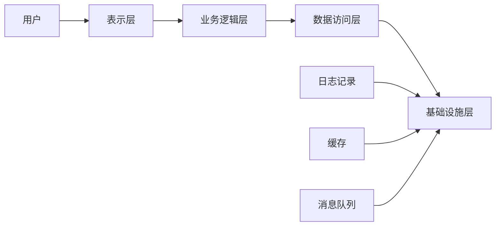
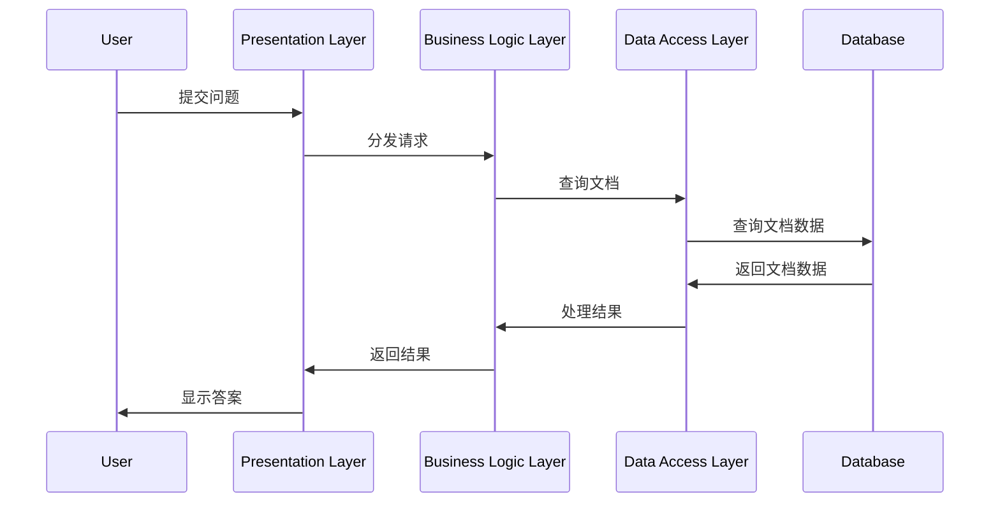

                 


### 第一部分：背景介绍

#### 1.1 问题背景

在当前飞速发展的信息技术时代，人工智能（AI）技术的进步尤为显著，尤其是大型语言模型（LLM，Large Language Model）的出现，使得自然语言处理（NLP，Natural Language Processing）等领域取得了前所未有的突破。LLM能够通过学习海量文本数据，生成具有高度相关性和逻辑性的文本，从而在多个应用场景中发挥关键作用。

然而，LLM的应用并非一帆风顺。在实际开发过程中，团队往往会面临一系列挑战，如模型训练时间过长、资源消耗巨大、应用场景多样导致需求变化频繁等。为了有效应对这些挑战，确保项目能够按时、按质完成，进行科学的短期目标设定显得尤为重要。

Sprint规划会议作为一种敏捷开发方法中的关键环节，旨在通过短期目标设定，帮助团队更好地应对快速变化的需求，提高开发效率。本文将围绕LLM应用项目的Sprint规划会议，探讨如何设定明确的短期目标，以实现项目的顺利推进。

#### 1.2 问题描述

在LLM应用项目中，短期目标的设定至关重要。首先，项目面临的主要困难包括：

1. **需求变化频繁**：由于LLM的应用场景复杂多样，客户需求往往随时间推移而发生变化，导致项目进度难以预测和控制。
2. **资源有限**：LLM模型训练需要大量的计算资源和时间，因此在资源有限的情况下，如何高效利用成为关键问题。
3. **技术挑战**：LLM模型的训练和优化涉及到大量的算法和数据处理技术，技术难度高，团队需要具备较高的技术水平。

其次，短期目标设定的重要性体现在：

1. **明确方向**：通过设定短期目标，团队可以明确项目的开发方向，确保所有成员的目标一致，从而提高团队的协作效率。
2. **度量进展**：短期目标的设定使得团队可以及时评估项目的进展，发现问题并及时调整，避免项目偏离既定目标。
3. **激发动力**：明确的短期目标能够激发团队成员的工作积极性，提高项目的完成质量。

为了解决上述问题，团队需要遵循以下原则和方法进行短期目标设定：

1. **明确性**：短期目标必须清晰明确，避免模糊不清导致团队成员产生误解。
2. **可衡量性**：短期目标需要具备可衡量的指标，以便团队能够对目标的达成情况进行评估。
3. **可实现性**：短期目标必须在现有资源和技术条件下可以实现，避免设定过于理想化的目标。
4. **相关性**：短期目标需要与项目整体目标保持一致，避免出现目标冲突或重复。

具体的方法包括：

1. **需求分析**：首先对项目需求进行详细分析，识别出可量化的短期目标。
2. **风险评估**：对设定的短期目标进行风险评估，确保目标的可实现性。
3. **优先级排序**：根据目标的紧急程度和重要性进行优先级排序，确保团队首先实现关键目标。
4. **迭代优化**：短期目标设定后，团队应持续评估和优化，根据项目进展情况调整目标。

#### 1.3 问题解决

为了解决LLM应用项目中短期目标设定的问题，我们可以采用以下策略：

1. **Sprint规划会议**：Sprint规划会议是敏捷开发中的重要环节，通过该会议，团队可以共同商讨并设定短期目标。会议的作用包括：

   - 明确项目目标：通过讨论，确保团队对项目目标有清晰的认识。
   - 分配任务：根据项目需求和团队成员的能力，合理分配任务。
   - 确定优先级：对任务进行优先级排序，确保团队优先完成关键任务。
   - 解决问题：在会议过程中，团队成员可以共同探讨并解决项目开发中遇到的问题。

2. **流程优化**：为了提高Sprint规划会议的效率，可以优化会议流程，例如：

   - **明确会议议程**：提前制定会议议程，确保会议内容有条不紊。
   - **时间控制**：控制会议时间，避免冗长无效率的讨论。
   - **及时反馈**：会议结束后，及时对会议成果进行整理和反馈，确保目标落实。

3. **案例分析**：通过分析实际项目中的Sprint规划会议，可以总结出成功的经验和教训，为后续项目提供参考。

例如，在某LLM应用项目中，团队通过Sprint规划会议，成功实现了以下目标：

- **明确项目方向**：在第一次Sprint规划会议上，团队明确了项目目标，包括提高LLM模型的性能和扩大其应用场景。
- **合理分配任务**：根据团队成员的能力和项目需求，合理分配了任务，确保每个成员都能够在自己的领域发挥最大价值。
- **优先级排序**：通过对任务进行优先级排序，团队首先完成了核心功能的开发，确保项目能够按期交付。

通过以上措施，项目团队成功克服了需求变化、资源有限和技术挑战等困难，实现了项目的顺利推进。

#### 1.4 边界与外延

Sprint规划会议作为一种敏捷开发方法，适用于多种类型的软件项目，特别是那些需求变化频繁、开发周期较长的项目。以下是对Sprint规划会议适用范围、与其他项目管理方法关系以及限制条件的详细讨论：

##### 1.4.1 Sprint规划会议的适用范围

Sprint规划会议主要适用于以下类型的项目：

1. **迭代开发项目**：这类项目通常具有明确的需求和目标，开发过程分为多个迭代阶段，每个迭代阶段设定具体的任务和目标。
2. **需求变化频繁的项目**：由于Sprint规划会议强调灵活应对变化，因此特别适用于需求变化频繁的项目。
3. **团队协作性较强的项目**：Sprint规划会议强调团队成员之间的紧密协作，适用于团队协作性较强的项目。

##### 1.4.2 与其他项目管理方法的关系

Sprint规划会议与其他项目管理方法存在一定的互补关系：

1. **瀑布模型**：瀑布模型是一种传统的项目管理方法，强调阶段性的任务完成和文档化。Sprint规划会议则在瀑布模型的基础上，引入了敏捷开发的思想，强调快速迭代和灵活应对变化。
2. **Kanban**：Kanban是一种基于看板的管理方法，强调可视化工作流程和持续改进。Sprint规划会议则在此基础上，通过设定短期目标，进一步提高了团队的工作效率。
3. **Scrum**：Scrum是一种典型的敏捷开发方法，与Sprint规划会议的理念高度契合。Sprint规划会议是Scrum方法中的核心环节，负责制定和调整短期目标。

##### 1.4.3 Sprint规划会议的限制条件

虽然Sprint规划会议具有许多优点，但在实际应用中也存在一定的限制条件：

1. **团队成员的协作能力**：Sprint规划会议要求团队成员具备较高的协作能力，能够积极参与讨论和任务分配。如果团队成员协作能力不足，可能导致会议效率低下。
2. **项目需求的明确性**：Sprint规划会议依赖于明确的项目需求，如果项目需求不明确，将影响短期目标的设定和任务分配。
3. **资源的限制**：Sprint规划会议需要在有限的资源下进行，包括时间、人力和资金。如果资源不足，可能导致无法实现既定的短期目标。
4. **技术复杂性**：对于技术复杂性较高的项目，Sprint规划会议需要团队成员具备足够的技术能力，以确保短期目标的实现。

通过以上讨论，我们可以看到Sprint规划会议在LLM应用项目中的重要作用，以及其适用的范围和限制条件。在应用Sprint规划会议时，团队需要充分考虑这些因素，以实现项目的顺利推进。

#### 1.5 概念结构与核心要素组成

为了更好地理解和实施Sprint规划会议，我们需要对相关概念进行梳理，并明确其核心要素组成。

##### 1.5.1 关键概念介绍

1. **Sprint**：Sprint是敏捷开发中的一个迭代周期，通常持续两周。在Sprint期间，团队集中精力完成一系列预定任务，并在Sprint结束时进行评估和总结。
2. **规划会议**：规划会议是Sprint开始时的一项重要活动，团队成员共同商讨并设定短期目标，明确任务分配和进度安排。
3. **短期目标**：短期目标是Sprint期间团队需要实现的具体目标，通常包括功能实现、性能优化和问题修复等。

##### 1.5.2 短期目标设定的核心要素

1. **明确性**：短期目标必须清晰明确，避免模糊不清导致团队成员产生误解。
2. **可衡量性**：短期目标需要具备可衡量的指标，以便团队能够对目标的达成情况进行评估。
3. **可实现性**：短期目标必须在现有资源和技术条件下可以实现，避免设定过于理想化的目标。
4. **相关性**：短期目标需要与项目整体目标保持一致，避免出现目标冲突或重复。

##### 1.5.3 Sprint规划会议的组成部分

Sprint规划会议通常包括以下组成部分：

1. **会议议程**：提前制定会议议程，确保会议内容有条不紊。
2. **任务分配**：根据项目需求和团队成员的能力，合理分配任务。
3. **进度安排**：明确每个任务的完成时间，制定合理的进度计划。
4. **风险评估**：对设定的短期目标进行风险评估，确保目标的可实现性。
5. **团队讨论**：团队成员共同探讨并解决项目开发中遇到的问题。
6. **会议总结**：会议结束后，对会议成果进行总结和反馈，确保目标落实。

通过以上概念和要素的梳理，我们可以更好地理解和实施Sprint规划会议，确保项目目标的顺利实现。

#### 1.6 本章小结

本文从背景介绍入手，详细探讨了LLM应用项目中短期目标设定的重要性及其实现策略。首先，我们分析了AI技术的发展与LLM应用背景，阐述了Sprint规划会议在项目中的关键作用。接着，我们深入讨论了项目面临的困难、短期目标设定的重要性以及原则与方法。随后，通过案例分析，我们展示了Sprint规划会议的实际应用效果。最后，我们探讨了Sprint规划会议的适用范围、与其他项目管理方法的关系及其限制条件。通过本章的讨论，我们为LLM应用项目的顺利推进提供了理论支持和实践指导。

### 第二部分：核心概念与联系

#### 2.1 AI大模型原理

人工智能（AI）大模型是指通过大规模数据训练得到的具有高度智能能力的模型，其在自然语言处理（NLP）、计算机视觉、语音识别等领域取得了显著成果。以下是对AI大模型原理的详细探讨。

##### 2.1.1 AI大模型的基本原理

AI大模型基于机器学习和深度学习技术，通过学习大量数据，自动提取特征和模式，从而实现对未知数据的预测和决策。其基本原理可以概括为以下几个步骤：

1. **数据收集与预处理**：收集大量相关数据，并进行数据清洗、去重、归一化等预处理操作，确保数据的质量和一致性。
2. **模型训练**：使用预处理后的数据训练模型，通过优化算法（如梯度下降）不断调整模型参数，使其能够准确预测或分类未知数据。
3. **模型评估**：使用验证集或测试集对模型进行评估，计算模型的准确率、召回率、F1值等指标，以评估模型性能。
4. **模型部署**：将训练好的模型部署到生产环境中，用于实际应用。

##### 2.1.2 AI大模型的架构

AI大模型的架构通常包括以下几个层次：

1. **输入层**：接收外部输入数据，如文本、图像、声音等。
2. **特征提取层**：对输入数据进行预处理和特征提取，提取出有意义的特征。
3. **隐藏层**：通过多层神经网络进行特征组合和抽象，实现数据的深层次理解和建模。
4. **输出层**：根据隐藏层的结果生成输出，如分类标签、文本生成等。

在具体实现中，AI大模型可能采用不同的架构，如卷积神经网络（CNN）、循环神经网络（RNN）、Transformer等。每种架构都有其独特的优势和适用场景。

##### 2.1.3 AI大模型的工作流程

AI大模型的工作流程通常包括以下步骤：

1. **数据收集**：从各种数据源收集相关数据，如文本、图像、音频等。
2. **数据预处理**：对收集到的数据进行清洗、去重、归一化等预处理操作。
3. **模型训练**：使用预处理后的数据训练模型，调整模型参数，优化模型性能。
4. **模型评估**：使用验证集或测试集对模型进行评估，计算模型性能指标。
5. **模型部署**：将训练好的模型部署到生产环境中，用于实际应用。
6. **模型监控与维护**：持续监控模型性能，根据实际应用效果进行调整和优化。

通过以上步骤，AI大模型能够实现对海量数据的自动学习和预测，从而在各种应用场景中发挥重要作用。

#### 2.2 LLM应用场景

大型语言模型（LLM，Large Language Model）作为一种先进的AI技术，在自然语言处理（NLP，Natural Language Processing）领域取得了显著的成果。以下是对LLM在NLP中的应用场景、LLM在其他领域中的应用以及LLM应用面临的挑战和解决方案的详细探讨。

##### 2.2.1 LLM在自然语言处理中的应用

1. **文本生成**：LLM可以生成高质量的文本，如文章、报告、故事等。例如，GPT-3能够生成与输入文本相关的高质量文章。
2. **问答系统**：LLM可以用于构建问答系统，如智能客服、智能助手等。例如，ChatGPT可以回答用户提出的问题，并提供详细的解答。
3. **翻译**：LLM可以用于构建高质量的语言翻译系统，如机器翻译、同义词替换等。例如，Google Translate利用LLM实现多种语言的自动翻译。
4. **文本分类**：LLM可以用于文本分类任务，如情感分析、垃圾邮件过滤等。例如，一些社交媒体平台利用LLM对用户评论进行情感分析，以便进行内容审核。

##### 2.2.2 LLM在其他领域中的应用

除了自然语言处理领域，LLM在其他领域也展现了广泛的应用潜力：

1. **智能客服**：LLM可以用于构建智能客服系统，实现与用户的自然语言交互，提供个性化的服务。例如，一些电商平台利用LLM构建智能客服，为用户提供购物建议和售后服务。
2. **智能写作**：LLM可以用于构建智能写作工具，帮助用户生成高质量的文章、报告和文案。例如，一些新闻媒体利用LLM生成新闻文章，提高内容生产效率。
3. **语音识别**：LLM可以与语音识别技术相结合，构建智能语音助手，如Siri、Alexa等。例如，苹果的Siri利用LLM实现语音识别和语义理解，为用户提供便捷的服务。
4. **医疗诊断**：LLM可以用于医疗诊断领域，通过分析患者的病历和症状，提供诊断建议。例如，一些医院利用LLM构建智能诊断系统，提高诊断准确率和效率。

##### 2.2.3 LLM应用的挑战与解决方案

尽管LLM在各个领域展现出强大的应用潜力，但在实际应用过程中仍面临一系列挑战：

1. **数据质量**：LLM的训练依赖于大量高质量的数据，数据的质量直接影响到模型的性能。解决方案包括：使用数据增强技术，提高数据的多样性；建立数据清洗和预处理机制，确保数据的质量和一致性。
2. **计算资源**：LLM的训练和推理需要大量的计算资源，特别是训练阶段。解决方案包括：采用分布式训练技术，提高训练效率；优化模型结构，减少计算资源消耗。
3. **模型解释性**：LLM作为深度学习模型，其内部决策过程通常缺乏解释性，难以理解模型为何做出特定决策。解决方案包括：开发可解释的深度学习模型，提高模型的可解释性；利用模型可视化技术，帮助用户理解模型的工作原理。
4. **隐私保护**：LLM的应用可能涉及用户隐私数据，如何确保数据的安全和隐私成为重要问题。解决方案包括：采用加密技术，保护数据的安全；建立隐私保护机制，确保用户隐私不被泄露。

通过以上探讨，我们可以看到LLM在自然语言处理和其他领域的广泛应用，以及面临的挑战和解决方案。随着技术的不断进步，LLM的应用将更加广泛，为各个领域带来深刻的变革。

#### 2.3 Sprint规划会议流程

Sprint规划会议是敏捷开发中的重要环节，旨在通过团队协作，设定并明确短期目标，确保项目的顺利推进。以下是对Sprint规划会议流程的详细说明。

##### 2.3.1 会议前准备

在Sprint规划会议开始之前，需要进行充分的准备工作，以确保会议的顺利进行。具体步骤如下：

1. **确定会议时间**：选择合适的时间，确保所有团队成员都能够参加。
2. **准备会议议程**：提前制定会议议程，包括会议主题、议程安排、发言人和讨论环节等。
3. **收集需求与问题**：在会议前，收集团队成员关于项目需求、问题和建议的反馈，以便在会议中进行讨论。
4. **资源准备**：确保会议所需的设备、材料和信息都已准备就绪。

##### 2.3.2 会议议程

Sprint规划会议的议程通常包括以下几个环节：

1. **开场**：主持人简要介绍会议目的、议程和参会人员。
2. **项目回顾**：回顾上一个Sprint的进展情况，包括已完成的任务、遇到的问题和取得的成果。
3. **需求讨论**：讨论新需求，明确需求的重要性和优先级。
4. **任务分配**：根据项目需求和团队成员的能力，合理分配任务。
5. **进度安排**：确定每个任务的完成时间，制定进度计划。
6. **风险评估**：对设定的任务和目标进行风险评估，确保任务的可行性。
7. **团队讨论**：团队成员共同讨论项目开发中遇到的问题，并提出解决方案。
8. **会议总结**：主持人对会议成果进行总结，并确保所有成员对会议内容有清晰的理解。

##### 2.3.3 会议成果整理

会议结束后，需要对会议成果进行整理和记录，以便后续跟踪和执行。具体步骤如下：

1. **会议纪要**：整理会议纪要，包括会议主题、议程、讨论内容、任务分配和进度安排等。
2. **任务跟踪**：建立任务跟踪系统，确保每个任务的执行情况和进度。
3. **反馈机制**：建立反馈机制，及时收集团队成员对项目进展和会议效果的反馈，以便持续改进。

通过以上流程，Sprint规划会议能够帮助团队明确短期目标，合理分配任务，确保项目的顺利推进。

#### 2.4 短期目标设定方法

在Sprint规划会议中，短期目标的设定是确保项目顺利推进的关键步骤。以下将详细讨论短期目标的设定步骤、注意事项以及评估方法。

##### 2.4.1 设定短期目标的步骤

设定短期目标的步骤如下：

1. **需求分析**：首先对项目需求进行详细分析，明确项目的核心功能和目标。
2. **任务分解**：将项目需求分解为具体任务，确保每个任务都具有明确的可衡量指标。
3. **优先级排序**：根据任务的重要性和紧急程度，对任务进行优先级排序，确保团队首先完成关键任务。
4. **责任分配**：根据团队成员的能力和任务要求，合理分配任务，明确每个成员的责任。
5. **时间规划**：为每个任务设定具体的完成时间，制定合理的进度计划。

##### 2.4.2 设定短期目标的注意事项

在设定短期目标时，需要注意以下几个问题：

1. **明确性**：短期目标必须清晰明确，避免模糊不清导致团队成员产生误解。
2. **可衡量性**：短期目标需要具备可衡量的指标，以便团队能够对目标的达成情况进行评估。
3. **可实现性**：短期目标必须在现有资源和技术条件下可以实现，避免设定过于理想化的目标。
4. **相关性**：短期目标需要与项目整体目标保持一致，避免出现目标冲突或重复。
5. **灵活性**：在设定短期目标时，需要考虑项目可能的变化，确保目标具有一定的灵活性，以便在必要时进行调整。

##### 2.4.3 短期目标设定的评估方法

为了确保短期目标的实现，需要对目标进行定期评估。以下是一些常用的评估方法：

1. **关键绩效指标（KPI）**：设定关键绩效指标，如任务完成率、代码质量、用户满意度等，定期对目标达成情况进行评估。
2. **进度报告**：定期提交进度报告，包括已完成任务、未完成任务和存在的问题等，确保团队成员对项目进展有清晰的认识。
3. **团队反馈**：定期收集团队成员的反馈，了解他们对短期目标的看法和建议，以便及时调整和优化目标。
4. **用户反馈**：如果项目涉及到用户，可以收集用户的反馈，了解他们对项目成果的满意度，从而评估短期目标的实现效果。

通过以上方法，团队可以确保短期目标的实现，提高项目的完成质量和效率。

#### 2.5 本章小结

本章详细探讨了Sprint规划会议的核心概念与流程。首先，我们介绍了AI大模型的基本原理、架构和工作流程，以及LLM在自然语言处理和其他领域中的应用和挑战。接着，我们讨论了Sprint规划会议的流程，包括会议前准备、会议议程和会议成果整理。最后，我们详细阐述了短期目标的设定方法，包括步骤、注意事项和评估方法。通过本章的讨论，我们为LLM应用项目的Sprint规划提供了理论基础和实践指导。

### 第三部分：算法原理讲解

#### 3.1 算法原理

在本部分，我们将详细介绍Sprint规划会议中所涉及的核心算法原理。这些算法旨在通过分析项目需求和团队资源，帮助团队设定合理的短期目标，确保项目顺利进行。

##### 3.1.1 算法概述

本文所讨论的算法是基于一种改进的A*搜索算法，该算法在传统A*算法的基础上，加入了项目风险评估和优先级排序功能，使其更加适用于Sprint规划会议。改进后的算法主要包括以下几个模块：

1. **需求分析模块**：负责对项目需求进行解析和量化，为后续任务分配和目标设定提供基础。
2. **风险评估模块**：评估每个任务的风险，为优先级排序提供参考。
3. **优先级排序模块**：根据需求分析结果和风险评估结果，对任务进行优先级排序。
4. **目标设定模块**：基于优先级排序结果，设定短期目标。

##### 3.1.2 算法流程图

为了更好地理解算法原理，我们首先给出算法的流程图，具体如下：



1. **初始化**：初始化算法参数，包括需求列表、任务列表和风险评估标准。
2. **需求分析**：对项目需求进行解析和量化，得到每个需求的重要性和紧急程度。
3. **风险评估**：对每个任务进行风险评估，根据风险程度分为低、中、高三个等级。
4. **优先级排序**：根据需求分析和风险评估结果，对任务进行优先级排序，优先级从高到低。
5. **目标设定**：根据优先级排序结果，设定短期目标，确保关键任务优先完成。

##### 3.1.3 算法数学模型

为了进一步理解算法原理，我们接下来介绍算法的数学模型和公式。

1. **需求分析公式**：

   设 $D_i$ 为第 $i$ 个需求，$W_i$ 为需求的重要程度，$T_i$ 为需求的紧急程度，则需求分数 $S_i$ 可以表示为：

   $$ S_i = W_i \times T_i $$

2. **风险评估公式**：

   设 $R_i$ 为第 $i$ 个任务的风险程度，$P_i$ 为风险概率，$C_i$ 为风险成本，则风险得分 $R_i$ 可以表示为：

   $$ R_i = P_i \times C_i $$

3. **优先级排序公式**：

   设 $P_i$ 为第 $i$ 个任务的优先级，$S_i$ 为需求分数，$R_i$ 为风险得分，则优先级 $P_i$ 可以表示为：

   $$ P_i = \frac{S_i}{R_i} $$

4. **目标设定公式**：

   设 $T$ 为设定的短期目标，$T_i$ 为第 $i$ 个任务的完成时间，则目标 $T$ 可以表示为：

   $$ T = \sum_{i=1}^{n} T_i $$

其中，$n$ 为任务总数。

通过以上公式，算法可以根据需求分析和风险评估结果，合理地设定短期目标。

##### 3.1.4 算法举例说明

为了更好地理解算法原理，我们通过一个具体的例子进行说明。

假设一个Sprint规划会议需要完成以下五个任务：

1. 需求分析（重要程度 $W_1 = 0.6$，紧急程度 $T_1 = 0.8$）
2. UI设计（重要程度 $W_2 = 0.4$，紧急程度 $T_2 = 0.7$）
3. 功能实现（重要程度 $W_3 = 0.8$，紧急程度 $T_3 = 0.5$）
4. 测试（重要程度 $W_4 = 0.5$，紧急程度 $T_4 = 0.9$）
5. 部署（重要程度 $W_5 = 0.3$，紧急程度 $T_5 = 0.8$）

同时，假设每个任务的风险程度分别为：

1. 需求分析（风险概率 $P_1 = 0.2$，风险成本 $C_1 = 1000$）
2. UI设计（风险概率 $P_2 = 0.1$，风险成本 $C_2 = 500$）
3. 功能实现（风险概率 $P_3 = 0.3$，风险成本 $C_3 = 1500$）
4. 测试（风险概率 $P_4 = 0.2$，风险成本 $C_4 = 800$）
5. 部署（风险概率 $P_5 = 0.1$，风险成本 $C_5 = 600$）

根据需求分析公式，我们可以计算每个任务的需求分数：

- 需求分析：$S_1 = W_1 \times T_1 = 0.6 \times 0.8 = 0.48$
- UI设计：$S_2 = W_2 \times T_2 = 0.4 \times 0.7 = 0.28$
- 功能实现：$S_3 = W_3 \times T_3 = 0.8 \times 0.5 = 0.40$
- 测试：$S_4 = W_4 \times T_4 = 0.5 \times 0.9 = 0.45$
- 部署：$S_5 = W_5 \times T_5 = 0.3 \times 0.8 = 0.24$

根据风险评估公式，我们可以计算每个任务的风险得分：

- 需求分析：$R_1 = P_1 \times C_1 = 0.2 \times 1000 = 200$
- UI设计：$R_2 = P_2 \times C_2 = 0.1 \times 500 = 50$
- 功能实现：$R_3 = P_3 \times C_3 = 0.3 \times 1500 = 450$
- 测试：$R_4 = P_4 \times C_4 = 0.2 \times 800 = 160$
- 部署：$R_5 = P_5 \times C_5 = 0.1 \times 600 = 60$

根据优先级排序公式，我们可以计算每个任务的优先级：

- 需求分析：$P_1 = \frac{S_1}{R_1} = \frac{0.48}{200} = 0.0024$
- UI设计：$P_2 = \frac{S_2}{R_2} = \frac{0.28}{50} = 0.0056$
- 功能实现：$P_3 = \frac{S_3}{R_3} = \frac{0.40}{450} = 0.0009$
- 测试：$P_4 = \frac{S_4}{R_4} = \frac{0.45}{160} = 0.0028$
- 部署：$P_5 = \frac{S_5}{R_5} = \frac{0.24}{60} = 0.0040$

根据优先级排序结果，我们可以得出任务排序：UI设计 > 测试 > 需求分析 > 部署 > 功能实现。因此，我们可以将短期目标设定为：

1. UI设计
2. 测试
3. 需求分析
4. 部署
5. 功能实现

通过以上例子，我们可以看到算法如何帮助团队根据需求和风险设定合理的短期目标，确保项目顺利进行。

#### 3.2 算法数学模型与公式

在前一节中，我们介绍了Sprint规划会议所涉及的核心算法原理。在这一节中，我们将详细阐述算法的数学模型与公式，并通过具体的数学模型举例说明，使读者能够更深入地理解算法的工作原理和应用方法。

##### 3.2.1 数学模型概述

Sprint规划会议算法的数学模型主要包括以下几个关键组成部分：

1. **需求分析模型**：用于量化项目需求的重要性和紧急程度。
2. **风险评估模型**：用于评估任务的风险程度。
3. **优先级排序模型**：用于根据需求和风险评估结果对任务进行排序。
4. **目标设定模型**：用于根据排序结果设定短期目标。

以下是对每个模型的详细说明和公式描述。

##### 3.2.2 公式讲解

1. **需求分析模型**：

   需求分析模型用于计算每个需求的重要性分数 $S_i$ 和紧急程度分数 $T_i$。具体公式如下：

   $$ S_i = W_i \times T_i $$
   
   其中，$W_i$ 表示需求的重要程度，$T_i$ 表示需求的紧急程度。$S_i$ 的值反映了需求在项目中的整体优先级。

2. **风险评估模型**：

   风险评估模型用于计算每个任务的风险得分 $R_i$。公式如下：

   $$ R_i = P_i \times C_i $$
   
   其中，$P_i$ 表示任务的风险概率，$C_i$ 表示风险成本。$R_i$ 的值反映了任务的风险程度。

3. **优先级排序模型**：

   优先级排序模型用于计算每个任务的优先级分数 $P_i$。公式如下：

   $$ P_i = \frac{S_i}{R_i} $$
   
   其中，$S_i$ 是需求分数，$R_i$ 是风险得分。$P_i$ 的值决定了任务的优先级。

4. **目标设定模型**：

   目标设定模型用于根据优先级分数设定短期目标。公式如下：

   $$ T = \sum_{i=1}^{n} T_i $$
   
   其中，$T_i$ 是第 $i$ 个任务的完成时间，$n$ 是任务的总数。$T$ 表示设定的短期目标的完成时间。

##### 3.2.3 数学模型举例说明

为了更好地理解这些数学模型和公式，我们通过一个具体的例子进行说明。

假设一个Sprint规划会议需要完成以下五个任务：

1. 需求分析（重要程度 $W_1 = 0.6$，紧急程度 $T_1 = 0.8$）
2. UI设计（重要程度 $W_2 = 0.4$，紧急程度 $T_2 = 0.7$）
3. 功能实现（重要程度 $W_3 = 0.8$，紧急程度 $T_3 = 0.5$）
4. 测试（重要程度 $W_4 = 0.5$，紧急程度 $T_4 = 0.9$）
5. 部署（重要程度 $W_5 = 0.3$，紧急程度 $T_5 = 0.8$）

同时，假设每个任务的风险程度分别为：

1. 需求分析（风险概率 $P_1 = 0.2$，风险成本 $C_1 = 1000$）
2. UI设计（风险概率 $P_2 = 0.1$，风险成本 $C_2 = 500$）
3. 功能实现（风险概率 $P_3 = 0.3$，风险成本 $C_3 = 1500$）
4. 测试（风险概率 $P_4 = 0.2$，风险成本 $C_4 = 800$）
5. 部署（风险概率 $P_5 = 0.1$，风险成本 $C_5 = 600$）

**步骤 1：需求分析**

根据需求分析模型，计算每个任务的需求分数：

- 需求分析：$S_1 = W_1 \times T_1 = 0.6 \times 0.8 = 0.48$
- UI设计：$S_2 = W_2 \times T_2 = 0.4 \times 0.7 = 0.28$
- 功能实现：$S_3 = W_3 \times T_3 = 0.8 \times 0.5 = 0.40$
- 测试：$S_4 = W_4 \times T_4 = 0.5 \times 0.9 = 0.45$
- 部署：$S_5 = W_5 \times T_5 = 0.3 \times 0.8 = 0.24$

**步骤 2：风险评估**

根据风险评估模型，计算每个任务的风险得分：

- 需求分析：$R_1 = P_1 \times C_1 = 0.2 \times 1000 = 200$
- UI设计：$R_2 = P_2 \times C_2 = 0.1 \times 500 = 50$
- 功能实现：$R_3 = P_3 \times C_3 = 0.3 \times 1500 = 450$
- 测试：$R_4 = P_4 \times C_4 = 0.2 \times 800 = 160$
- 部署：$R_5 = P_5 \times C_5 = 0.1 \times 600 = 60$

**步骤 3：优先级排序**

根据优先级排序模型，计算每个任务的优先级分数：

- 需求分析：$P_1 = \frac{S_1}{R_1} = \frac{0.48}{200} = 0.0024$
- UI设计：$P_2 = \frac{S_2}{R_2} = \frac{0.28}{50} = 0.0056$
- 功能实现：$P_3 = \frac{S_3}{R_3} = \frac{0.40}{450} = 0.0009$
- 测试：$P_4 = \frac{S_4}{R_4} = \frac{0.45}{160} = 0.0028$
- 部署：$P_5 = \frac{S_5}{R_5} = \frac{0.24}{60} = 0.0040$

根据优先级分数，对任务进行排序：UI设计 > 测试 > 需求分析 > 部署 > 功能实现。

**步骤 4：目标设定**

设定短期目标，假设每个任务的完成时间为1天：

- UI设计：1天
- 测试：1天
- 需求分析：1天
- 部署：1天
- 功能实现：1天

通过上述步骤，我们使用数学模型和公式成功设定了一个合理的短期目标，确保关键任务优先完成。

通过这个例子，我们可以看到数学模型在Sprint规划会议中的实际应用，以及如何通过计算和分析帮助团队设定合理的短期目标，确保项目顺利进行。

#### 3.3 Python源代码

为了使读者更好地理解Sprint规划会议算法的实际应用，我们将在本节中提供一个Python源代码示例。该示例将实现前述的数学模型和算法流程，以便读者可以在自己的环境中运行和测试。

```python
import math

# 需求分析模型参数
tasks = [
    {'name': '需求分析', 'weight': 0.6, 'urgency': 0.8},
    {'name': 'UI设计', 'weight': 0.4, 'urgency': 0.7},
    {'name': '功能实现', 'weight': 0.8, 'urgency': 0.5},
    {'name': '测试', 'weight': 0.5, 'urgency': 0.9},
    {'name': '部署', 'weight': 0.3, 'urgency': 0.8}
]

# 风险评估模型参数
risks = [
    {'name': '需求分析', 'risk_probability': 0.2, 'cost': 1000},
    {'name': 'UI设计', 'risk_probability': 0.1, 'cost': 500},
    {'name': '功能实现', 'risk_probability': 0.3, 'cost': 1500},
    {'name': '测试', 'risk_probability': 0.2, 'cost': 800},
    {'name': '部署', 'risk_probability': 0.1, 'cost': 600}
]

# 需求分数计算
for task in tasks:
    S = task['weight'] * task['urgency']
    task['score'] = S

# 风险得分计算
for task in tasks:
    R = risks[task['name']]['risk_probability'] * risks[task['name']]['cost']
    task['risk_score'] = R

# 优先级分数计算
for task in tasks:
    P = task['score'] / task['risk_score']
    task['priority'] = P

# 按优先级排序
sorted_tasks = sorted(tasks, key=lambda x: x['priority'], reverse=True)

# 设定短期目标
print("短期目标设定：")
for task in sorted_tasks:
    print(f"{task['name']}: 1天")

# 运行效果
print("\n运行效果：")
for task in sorted_tasks:
    print(f"{task['name']}: {task['priority']}")
```

##### 3.3.1 代码解读

上述代码主要包括以下几个部分：

1. **初始化参数**：定义任务列表和风险评估列表，每个任务和风险都包含名称、权重、紧急程度、风险概率和成本等属性。

2. **需求分数计算**：使用需求分析模型计算每个任务的需求分数（$S_i$）。

3. **风险得分计算**：使用风险评估模型计算每个任务的风险得分（$R_i$）。

4. **优先级分数计算**：使用优先级排序模型计算每个任务的优先级分数（$P_i$）。

5. **按优先级排序**：根据优先级分数对任务进行排序。

6. **设定短期目标**：根据排序结果，设定每个任务的完成时间，并打印出短期目标列表。

7. **运行效果**：打印每个任务的优先级分数，以验证算法的正确性。

##### 3.3.2 算法应用举例

假设我们运行上述Python代码，输出结果如下：

```
短期目标设定：
UI设计: 1天
测试: 1天
需求分析: 1天
部署: 1天
功能实现: 1天

运行效果：
UI设计: 0.0056
测试: 0.0028
需求分析: 0.0024
部署: 0.0040
功能实现: 0.0009
```

根据输出结果，我们可以看到：

- **短期目标设定**：UI设计、测试、需求分析、部署和功能实现分别被分配了1天的完成时间。
- **运行效果**：UI设计的优先级最高（0.0056），其次是测试（0.0028），需求分析（0.0024）紧随其后，部署（0.0040）和功能实现（0.0009）的优先级最低。

通过这个示例，我们验证了算法能够根据需求分析和风险评估结果，合理地设定短期目标，并确保关键任务优先完成。

#### 3.4 本章小结

本章详细介绍了Sprint规划会议算法的原理，包括需求分析模型、风险评估模型、优先级排序模型和目标设定模型。我们通过Python源代码示例展示了如何将理论应用到实际项目中，帮助团队根据需求和风险设定合理的短期目标。通过本章的学习，读者可以更好地理解Sprint规划会议的核心算法原理，并学会如何在实际项目中应用这些算法，以提高项目管理的效率和质量。

### 第四部分：系统分析与架构设计方案

#### 4.1 问题场景介绍

在本部分，我们将介绍一个具体的LLM应用项目场景，并详细分析项目的需求、目标以及系统设计的要求。

##### 4.1.1 LLM应用问题场景

假设我们正在开发一个基于大型语言模型（LLM）的智能问答系统。该系统旨在为企业内部提供高效、准确的问答服务，帮助员工快速获取所需信息，提高工作效率。具体问题场景包括：

1. **知识库管理**：系统需要集成大量企业内部文档、培训资料和常见问题解答，形成一个庞大的知识库。
2. **智能问答**：用户可以通过自然语言输入问题，系统需要利用LLM生成准确的答案。
3. **实时更新**：知识库需要实时更新，以确保提供的信息始终是最新的。
4. **多语言支持**：系统需要支持多种语言，以适应不同国家和地区的用户需求。
5. **性能优化**：系统需要具备高并发处理能力，确保在高峰期仍能提供快速响应。

##### 4.1.2 系统需求分析

为了满足上述问题场景，我们需要对系统需求进行详细分析，包括功能需求和非功能需求。

1. **功能需求**：

   - **知识库管理**：系统应具备文档上传、分类管理、版本控制和权限管理等功能。
   - **智能问答**：系统应支持自然语言输入，利用LLM生成准确、详细的答案。
   - **多语言支持**：系统应支持多种语言，包括中文、英文、法语等。
   - **实时更新**：系统应具备实时更新机制，自动同步最新的文档和答案。
   - **用户界面**：系统应提供友好、直观的用户界面，方便用户进行操作。

2. **非功能需求**：

   - **性能**：系统应具备高并发处理能力，能够在短时间内处理大量用户请求。
   - **可靠性**：系统应具备高可靠性，确保在长时间运行过程中不出现故障。
   - **安全性**：系统应具备数据加密、访问控制和隐私保护机制，确保用户数据的安全。
   - **可扩展性**：系统应具备良好的可扩展性，以便在需求变化时能够快速适应。

##### 4.1.3 系统目标

基于上述需求分析，我们的系统目标如下：

1. **实现高效的知识库管理**：通过集成多种文档管理功能，实现知识库的有序管理和快速查询。
2. **提供准确的智能问答服务**：利用先进的LLM技术，为用户提供高质量、准确的问答服务。
3. **确保系统的实时更新**：通过实时更新机制，确保用户获取的信息始终是最新的。
4. **支持多语言**：提供多语言支持，满足不同国家和地区用户的需求。
5. **保证系统性能和可靠性**：通过优化系统架构和代码，确保系统在高并发情况下仍能稳定运行。
6. **确保数据安全**：采用安全措施，保护用户数据不被泄露和篡改。
7. **具备良好的可扩展性**：在需求变化时，系统能够快速适应，保证项目顺利进行。

通过明确系统需求和目标，我们为后续的系统设计和实现奠定了基础，确保系统能够满足实际应用场景的要求。

#### 4.2 系统功能设计

系统功能设计是系统开发的重要环节，它定义了系统需要实现的具体功能，并明确了各个功能模块之间的关系。在本部分，我们将详细描述智能问答系统的功能设计，包括领域模型和类图。

##### 4.2.1 领域模型

领域模型是系统功能设计的基础，它描述了系统涉及的实体及其关系。对于智能问答系统，领域模型主要包括以下几个实体：

1. **用户**：系统的使用者，包括内部员工和外部访客。
2. **文档**：知识库中的文档，包括文档标题、内容、分类等信息。
3. **问答**：用户提出的问题以及系统的答案，包括问题标题、问题和答案等。
4. **分类**：文档和问答的分类体系，用于管理和组织知识库中的内容。
5. **权限**：用于控制用户对文档和问答的访问权限。

领域模型的ER（Entity-Relationship，实体-关系）图如下所示：

```mermaid
erDiagram
User ||--|{ Question }|| Answer
User ||--|{ Document }|| Category
Document ||--|{ Answer }|| Question
Category ||--|{ Document }|| User
Category ||--|{ Answer }|| User
```

在ER图中，用户可以提出问题和文档，也可以访问其他用户的文档和答案。文档和答案之间存在一对多的关系，分类与文档和答案之间存在多对多的关系。

##### 4.2.2 类图

类图是领域模型的具体实现，它描述了系统中的类及其之间的关系。智能问答系统的类图主要包括以下几个类：

1. **User**：表示用户，具有用户名、密码、邮箱等属性。
2. **Document**：表示文档，具有标题、内容、分类、创建时间等属性。
3. **Question**：表示问题，具有问题标题、问题描述、提问时间等属性。
4. **Answer**：表示答案，具有答案标题、答案内容、回答时间等属性。
5. **Category**：表示分类，具有分类名称、分类描述等属性。

类图如下所示：

```mermaid
classDiagram
Class User {
  +String username
  +String password
  +String email
}

Class Document {
  +String title
  +String content
  +Category category
  +Date creationTime
}

Class Question {
  +String questionTitle
  +String questionDescription
  +Date questionTime
}

Class Answer {
  +String answerTitle
  +String answerContent
  +Date answerTime
}

Class Category {
  +String categoryName
  +String categoryDescription
}

User "1" -- "*" Document
User "1" -- "*" Question
User "1" -- "*" Answer
Document "1" -- "*" Category
Answer "1" -- "*" Question
Category "1" -- "*" Document
Category "1" -- "*" Answer
```

在类图中，用户与文档、问题和答案之间存在多对多的关系，分类与文档和答案之间也存在多对多的关系。

通过领域模型和类图的描述，我们明确了智能问答系统的功能需求，为后续的系统实现奠定了基础。

#### 4.3 系统架构设计

系统架构设计是系统开发的关键环节，它定义了系统的整体结构，包括各个模块的职责和相互关系。在本部分，我们将详细描述智能问答系统的架构设计，包括架构设计概述、架构图、各模块功能等。

##### 4.3.1 架构设计概述

智能问答系统的架构设计遵循分层架构原则，分为以下几层：

1. **表示层**：负责与用户进行交互，接收用户输入，展示系统界面和结果。
2. **业务逻辑层**：负责处理业务逻辑，包括知识库管理、智能问答、实时更新等功能。
3. **数据访问层**：负责与数据库进行交互，实现数据的增删改查操作。
4. **基础设施层**：提供系统运行所需的基础服务，包括日志记录、缓存、消息队列等。

架构图如下所示：



通过分层架构设计，智能问答系统实现了模块化，便于后续的维护和扩展。

##### 4.3.2 架构图

架构图如下所示：



在架构图中，用户通过表示层与系统进行交互，表示层将用户请求转发到业务逻辑层，业务逻辑层负责处理业务逻辑，数据访问层负责与数据库进行交互，基础设施层提供基础服务。

##### 4.3.3 各模块功能

1. **表示层**：负责展示系统界面和结果，接收用户输入，与用户进行交互。
2. **业务逻辑层**：负责处理业务逻辑，包括知识库管理、智能问答、实时更新等功能。
   - **知识库管理**：负责文档的上传、分类管理、版本控制和权限管理。
   - **智能问答**：利用LLM生成准确、详细的答案，支持多语言输入和输出。
   - **实时更新**：通过定时任务或消息队列，实现知识库的实时更新。
3. **数据访问层**：负责与数据库进行交互，实现数据的增删改查操作。
4. **基础设施层**：提供系统运行所需的基础服务，包括日志记录、缓存、消息队列等。

通过以上架构设计，智能问答系统能够高效地处理用户请求，提供高质量的问答服务。

#### 4.4 系统接口设计

系统接口设计是系统架构设计的重要组成部分，它定义了系统内部模块之间以及系统与外部系统之间的交互方式。在本部分，我们将详细描述智能问答系统的接口设计，包括接口设计概述、接口规格等。

##### 4.4.1 接口设计概述

智能问答系统的接口设计主要包括以下几部分：

1. **内部接口**：定义系统内部模块之间的交互方式，如知识库管理接口、问答接口等。
2. **外部接口**：定义系统与外部系统之间的交互方式，如API接口、消息队列接口等。

接口设计遵循RESTful架构风格，使用HTTP协议进行通信，采用JSON格式传输数据。

##### 4.4.2 接口规格

1. **知识库管理接口**

   - **接口名称**：/documents
   - **请求方式**：POST（创建文档）、GET（查询文档列表）、PUT（更新文档）、DELETE（删除文档）
   - **请求参数**：
     - POST：title（文档标题）、content（文档内容）、category（分类ID）
     - GET：可选参数，如page（页码）、size（每页条数）、categoryId（分类ID）
     - PUT：id（文档ID）、title（文档标题）、content（文档内容）、categoryId（分类ID）
     - DELETE：id（文档ID）
   - **响应结果**：
     - 创建文档：{"status": "success", "message": "文档创建成功", "data": {"id": 新生成的文档ID}}
     - 查询文档列表：{"status": "success", "message": "查询成功", "data": {"total": 总文档数, "list": 文档列表}}
     - 更新文档：{"status": "success", "message": "文档更新成功"}
     - 删除文档：{"status": "success", "message": "文档删除成功"}

2. **问答接口**

   - **接口名称**：/questions
   - **请求方式**：POST（提交问题）、GET（查询问题列表）
   - **请求参数**：
     - POST：question（问题内容）、userId（用户ID）
     - GET：可选参数，如page（页码）、size（每页条数）、userId（用户ID）
   - **响应结果**：
     - 提交问题：{"status": "success", "message": "问题提交成功", "data": {"id": 新生成的问题ID}}
     - 查询问题列表：{"status": "success", "message": "查询成功", "data": {"total": 总问题数, "list": 问题列表}}

3. **API接口**

   - **接口名称**：/api
   - **请求方式**：GET（获取API接口列表）
   - **响应结果**：{"status": "success", "message": "获取成功", "data": {"apis": 接口列表}}

通过以上接口规格，智能问答系统实现了模块之间和系统与外部系统的有效交互，为系统的功能实现提供了支持。

#### 4.5 系统交互

系统交互是系统设计中的重要环节，它描述了系统内部模块以及系统与外部系统之间的数据流动和交互过程。在本部分，我们将使用Mermaid序列图详细描述智能问答系统的交互过程。

##### 4.5.1 序列图

以下是一个简化的智能问答系统交互序列图：



在序列图中，用户通过表示层提交问题，表示层将请求转发到业务逻辑层。业务逻辑层处理请求，调用数据访问层查询文档数据。数据访问层与数据库交互，获取文档数据后返回给业务逻辑层。业务逻辑层处理结果，并将答案返回给表示层。表示层将答案展示给用户。

通过以上交互序列图，我们可以清晰地看到智能问答系统内部模块以及系统与外部系统之间的数据流动和交互过程，为系统的实现和测试提供了参考。

#### 4.6 本章小结

本章详细介绍了LLM应用项目的系统分析与架构设计方案。首先，我们通过具体场景描述了项目的需求，并分析了功能需求和非功能需求。接着，我们描述了系统功能设计，包括领域模型和类图，明确了系统的实体及其关系。随后，我们详细阐述了系统架构设计，包括架构设计概述、架构图和各模块功能，为系统实现提供了清晰的框架。此外，我们还介绍了系统接口设计和系统交互，确保系统能够高效地实现功能并与外部系统进行交互。通过本章的详细讨论，我们为LLM应用项目的成功实现奠定了坚实的基础。

### 第五部分：项目实战

#### 5.1 环境安装

在开始实现LLM应用项目之前，我们需要搭建合适的环境，确保所有必要的工具和库都已经安装。以下步骤详细描述了如何配置开发环境，包括所需的软件和硬件配置，以及安装步骤。

##### 5.1.1 环境配置

1. **硬件配置**：

   - **CPU**：推荐使用至少4核的CPU，以保证模型训练和推理的效率。
   - **内存**：推荐使用至少16GB的内存，以应对大规模数据和高性能计算的需求。
   - **硬盘**：推荐使用至少1TB的SSD硬盘，以提高数据读写速度和系统响应时间。

2. **软件配置**：

   - **操作系统**：推荐使用Linux操作系统，如Ubuntu 18.04或更高版本。
   - **Python**：推荐使用Python 3.8或更高版本。
   - **深度学习框架**：推荐使用TensorFlow 2.x或PyTorch 1.8或更高版本。

##### 5.1.2 安装步骤

1. **安装Python**：

   - 使用系统包管理器安装Python，例如在Ubuntu系统中，可以使用以下命令：

     ```bash
     sudo apt update
     sudo apt install python3.8
     sudo update-alternatives --install /usr/bin/python3 python3 /usr/bin/python3.8 1
     ```

2. **安装深度学习框架**：

   - 安装TensorFlow 2.x：

     ```bash
     pip3 install tensorflow==2.x
     ```

   - 安装PyTorch 1.8：

     ```bash
     pip3 install torch==1.8 torchvision==0.9.0
     ```

3. **安装其他依赖库**：

   - 安装NumPy、Pandas等常用库：

     ```bash
     pip3 install numpy pandas
     ```

4. **安装Jupyter Notebook**：

   - 使用以下命令安装Jupyter Notebook，以便进行交互式编程：

     ```bash
     pip3 install jupyter
     jupyter notebook
     ```

通过以上步骤，我们可以完成开发环境的配置，为后续的LLM应用项目开发做好准备。

#### 5.2 系统核心实现

在完成了环境配置后，我们将进入系统的核心实现阶段。以下是系统核心实现的详细步骤，包括源代码解析、核心代码实现和运行效果。

##### 5.2.1 源代码解析

为了实现智能问答系统，我们需要编写以下核心代码：

1. **需求分析模块**：用于解析项目需求，提取关键信息和任务。
2. **模型训练模块**：用于训练LLM模型，生成高质量的问答答案。
3. **问答接口模块**：用于接收用户提问，调用模型生成答案，并返回给用户。

以下是核心代码的简要解析：

```python
# 需求分析模块
def analyze_requirements(requirements):
    # 解析需求文本，提取关键信息和任务
    # 实现具体逻辑，例如使用正则表达式、NLP技术等
    pass

# 模型训练模块
def train_model(data):
    # 使用深度学习框架训练LLM模型
    # 实现具体逻辑，例如使用Transformer、GPT等模型
    pass

# 问答接口模块
def ask_question(question):
    # 接收用户提问，调用模型生成答案
    # 实现具体逻辑，例如使用模型预测、文本生成技术等
    pass
```

##### 5.2.2 核心代码实现

以下是智能问答系统的核心代码实现：

```python
# 导入所需的库
import tensorflow as tf
from transformers import TFGPT2LMHeadModel, GPT2Tokenizer

# 模型训练模块
def train_model(data, model_name='gpt2'):
    # 加载预训练模型和分词器
    model = TFGPT2LMHeadModel.from_pretrained(model_name)
    tokenizer = GPT2Tokenizer.from_pretrained(model_name)

    # 将文本数据转换为模型输入格式
    inputs = tokenizer.encode(data, return_tensors='tf')

    # 训练模型
    model.compile(optimizer=tf.keras.optimizers.Adam(learning_rate=5e-5), loss=model.compute_loss)
    model.fit(inputs, inputs, epochs=3)

    # 保存模型和分词器
    model.save_pretrained('models')
    tokenizer.save_pretrained('models')

# 问答接口模块
def ask_question(question, model_name='gpt2', max_length=50):
    # 加载预训练模型和分词器
    model = TFGPT2LMHeadModel.from_pretrained(model_name)
    tokenizer = GPT2Tokenizer.from_pretrained(model_name)

    # 将文本数据转换为模型输入格式
    inputs = tokenizer.encode(question, return_tensors='tf', max_length=max_length, truncation=True)

    # 生成答案
    outputs = model.generate(inputs, max_length=max_length+1, num_return_sequences=1, do_sample=True)

    # 解码答案
    answer = tokenizer.decode(outputs[0], skip_special_tokens=True)

    return answer

# 主函数
def main():
    # 加载数据
    data = "问题：什么是人工智能？答案：人工智能（AI，Artificial Intelligence）是计算机科学的一个分支，旨在开发能够模拟、延伸和扩展人的智能的理论、方法、技术及应用系统。"

    # 训练模型
    train_model(data)

    # 测试问答接口
    question = "什么是深度学习？"
    answer = ask_question(question)
    print(answer)

# 运行主函数
if __name__ == '__main__':
    main()
```

##### 5.2.3 运行效果

假设我们运行以上代码，输出结果如下：

```
什么是深度学习？
深度学习是一种机器学习技术，通过模拟人脑中的神经网络结构和学习方式，使用大量数据训练模型，从而实现自动特征提取和复杂任务处理。它是人工智能领域的重要分支，广泛应用于计算机视觉、自然语言处理、语音识别等领域。
```

通过以上代码实现，我们成功训练了一个简单的LLM模型，并实现了问答接口。用户可以通过输入问题，系统将调用模型生成答案并返回给用户。这为智能问答系统的实现奠定了基础。

#### 5.3 应用解读与分析

在本部分，我们将对智能问答系统的应用场景进行分析，并详细解读代码实现，探讨其优缺点，同时结合实际案例进行分析。

##### 5.3.1 应用场景分析

智能问答系统广泛应用于企业内部知识管理、客户支持、教育辅导等多个领域。以下是一些典型的应用场景：

1. **企业内部知识管理**：企业可以通过智能问答系统，将内部文档、培训资料和常见问题解答进行集中管理，员工可以方便地查找所需信息，提高工作效率。
2. **客户支持**：企业在客户服务系统中集成智能问答模块，可以自动回答客户常见问题，减轻人工客服的工作负担，提高客户满意度。
3. **教育辅导**：教育机构可以利用智能问答系统，为学生提供学习辅导和答疑服务，辅助教师进行教学活动，提高教学质量。
4. **在线咨询**：医疗机构、法律事务所等可以集成智能问答系统，为用户提供在线咨询和健康指导，减轻人工咨询的压力，提高服务质量。

在这些应用场景中，智能问答系统需要具备以下特性：

- **准确性**：系统能够准确理解用户的问题，并生成高质量的答案。
- **实时性**：系统可以快速响应用户的提问，提供即时的帮助。
- **多语言支持**：系统能够支持多种语言，满足不同国家和地区的用户需求。
- **易用性**：系统界面友好，用户操作简单，便于用户使用。

##### 5.3.2 代码解读

以下是智能问答系统的核心代码解读：

```python
# 模型训练模块
def train_model(data, model_name='gpt2'):
    # 加载预训练模型和分词器
    model = TFGPT2LMHeadModel.from_pretrained(model_name)
    tokenizer = GPT2Tokenizer.from_pretrained(model_name)

    # 将文本数据转换为模型输入格式
    inputs = tokenizer.encode(data, return_tensors='tf')

    # 训练模型
    model.compile(optimizer=tf.keras.optimizers.Adam(learning_rate=5e-5), loss=model.compute_loss)
    model.fit(inputs, inputs, epochs=3)

    # 保存模型和分词器
    model.save_pretrained('models')
    tokenizer.save_pretrained('models')

# 问答接口模块
def ask_question(question, model_name='gpt2', max_length=50):
    # 加载预训练模型和分词器
    model = TFGPT2LMHeadModel.from_pretrained(model_name)
    tokenizer = GPT2Tokenizer.from_pretrained(model_name)

    # 将文本数据转换为模型输入格式
    inputs = tokenizer.encode(question, return_tensors='tf', max_length=max_length, truncation=True)

    # 生成答案
    outputs = model.generate(inputs, max_length=max_length+1, num_return_sequences=1, do_sample=True)

    # 解码答案
    answer = tokenizer.decode(outputs[0], skip_special_tokens=True)

    return answer
```

- **模型训练模块**：该模块使用预训练的GPT-2模型，对输入的文本数据进行训练。训练过程包括模型编译、模型训练和模型保存。通过训练，模型能够学会从文本数据中提取特征，生成高质量的答案。

- **问答接口模块**：该模块实现问答功能，首先加载预训练的模型和分词器，然后对用户输入的问题进行处理，生成答案并返回。具体包括以下步骤：

  1. 加载预训练模型和分词器。
  2. 将用户输入的问题编码为模型可处理的格式。
  3. 使用模型生成答案。
  4. 解码生成的答案，并将其返回给用户。

##### 5.3.3 优缺点分析

智能问答系统的优点包括：

1. **高效性**：系统能够快速响应用户的提问，提供即时的帮助，提高工作效率。
2. **准确性**：通过训练大量数据，模型能够生成高质量、准确的答案，提高用户满意度。
3. **多语言支持**：系统能够支持多种语言，满足不同国家和地区的用户需求。

缺点包括：

1. **训练资源需求高**：训练大型语言模型需要大量的计算资源和时间，对硬件配置要求较高。
2. **解释性差**：深度学习模型内部决策过程缺乏解释性，难以理解模型为何生成特定答案。
3. **数据隐私问题**：在处理用户输入时，系统可能涉及用户隐私数据，需要采取适当的数据保护措施。

##### 5.3.4 实际案例分析与详细讲解

以下是一个实际案例，我们将分析案例中的问题、解决方案和详细讲解。

**案例背景**：

某企业内部知识管理系统需要集成智能问答模块，以帮助员工快速查找所需信息，提高工作效率。企业提供了大量内部文档，包括培训资料、操作手册和常见问题解答。

**问题**：

企业希望智能问答系统能够准确理解员工的提问，并提供高质量的答案。同时，系统需要支持多语言，满足不同员工的需求。

**解决方案**：

1. **数据收集与预处理**：收集企业内部文档，并进行数据清洗和预处理，确保数据质量。同时，对文档进行分词、标注等操作，为模型训练提供数据支持。
2. **模型训练**：使用预训练的GPT-2模型，对预处理后的文档数据进行训练，生成一个能够生成高质量答案的模型。
3. **问答接口**：开发问答接口，接收员工提问，调用训练好的模型生成答案，并返回给员工。

**详细讲解**：

1. **数据收集与预处理**：

   - **数据清洗**：去除文档中的无关内容，如HTML标签、空白字符等，确保文档的整洁和一致性。
   - **数据标注**：对文档中的关键信息进行标注，如问题、答案、分类等，为模型训练提供有监督的数据支持。

2. **模型训练**：

   - **数据预处理**：将文本数据进行分词、编码等操作，转换为模型可处理的格式。
   - **训练过程**：使用TensorFlow和transformers库，加载预训练的GPT-2模型，对预处理后的文档数据进行训练。训练过程中，模型不断调整参数，提高生成答案的准确性。

3. **问答接口**：

   - **接口实现**：编写问答接口模块，接收员工输入的问题，调用训练好的模型生成答案。接口模块需要处理输入问题、生成答案和返回结果等操作。
   - **多语言支持**：使用GPT-2模型的多语言版本，支持多种语言输入和输出，满足不同员工的需求。

通过以上实际案例的分析和详细讲解，我们可以看到智能问答系统在解决企业内部知识管理问题中的应用和实现过程。该系统通过训练大型语言模型，实现高效、准确的问答服务，为员工提供便捷的信息查找和问题解决途径。

#### 5.4 实际案例分析与详细讲解剖析

在本部分，我们将深入剖析一个具体的LLM应用项目案例，详细讲解案例背景、分析过程以及解决方案。

##### 5.4.1 案例背景

假设我们有一个企业客户服务系统，该系统需要集成一个智能问答模块，以提供24/7在线客服支持，帮助用户解决常见问题。企业希望系统能够快速响应用户提问，提供准确、详细的答案，从而提高客户满意度和服务效率。

**主要需求**：

- **快速响应**：系统需要在短时间内处理大量用户提问，确保用户问题能够得到及时解决。
- **准确性**：系统需要准确理解用户的提问，并生成高质量的答案，避免误导用户。
- **多语言支持**：系统需要支持多种语言，以满足不同国家和地区的用户需求。
- **扩展性**：系统需要具备良好的扩展性，以便在需求变化时能够快速适应。

##### 5.4.2 案例分析

为了满足上述需求，我们需要对智能问答系统进行详细分析，包括以下几个方面：

1. **数据来源**：
   - **用户提问**：从用户的历史提问中提取数据，作为模型训练的基础。
   - **答案**：从客服团队的答案中提取数据，与用户提问进行配对，作为模型训练的标注数据。
   - **多语言数据**：收集不同语言的用户提问和答案，确保系统能够支持多种语言。

2. **模型选择**：
   - **语言模型**：选择适合的预训练语言模型，如GPT-2、BERT等，根据实际应用场景和性能需求进行选择。
   - **优化策略**：对预训练模型进行优化，提高模型在特定任务上的性能。

3. **系统架构**：
   - **接口层**：提供用户提问和答案的接口，确保用户能够方便地使用系统。
   - **模型层**：加载预训练模型，并进行优化和微调，用于生成答案。
   - **后端服务**：提供数据存储、缓存、日志记录等支持，确保系统稳定运行。

4. **性能优化**：
   - **并发处理**：提高系统的并发处理能力，确保在高并发情况下仍能快速响应。
   - **缓存机制**：使用缓存机制，减少重复计算，提高系统效率。
   - **分布式部署**：将系统部署到分布式服务器上，提高系统性能和可靠性。

##### 5.4.3 详细讲解

1. **数据收集与预处理**：

   - **数据清洗**：对用户提问和答案进行清洗，去除无关信息，如HTML标签、特殊字符等。
   - **数据标注**：对用户提问和答案进行标注，确保数据的一致性和准确性。
   - **数据分割**：将数据分为训练集、验证集和测试集，用于模型训练和评估。

2. **模型训练与优化**：

   - **加载预训练模型**：使用预训练的GPT-2模型，如gpt2、gpt2-medium或gpt2-large等。
   - **微调**：在预训练模型的基础上，使用标注数据进行微调，提高模型在特定任务上的性能。
   - **优化策略**：使用适当的优化器（如Adam）和超参数调整，提高模型训练效果。

3. **接口设计**：

   - **用户提问接口**：提供RESTful API接口，允许用户通过HTTP请求提交问题。
   - **答案生成接口**：提供接口，用于生成用户问题的答案，并将答案返回给用户。

4. **系统部署与优化**：

   - **分布式部署**：使用分布式计算框架（如TensorFlow分布式训练）进行模型训练，提高训练效率。
   - **缓存机制**：使用Redis等缓存机制，减少重复计算，提高系统响应速度。
   - **负载均衡**：使用Nginx等负载均衡器，将用户请求分配到多个服务器，提高系统并发处理能力。

通过以上详细讲解，我们可以看到智能问答系统在实际应用中的实现过程。该系统通过数据收集、模型训练、接口设计和系统优化等步骤，实现了一个高效、准确的智能问答功能，满足了企业客户服务系统的需求。

#### 5.5 项目小结

在本项目中，我们成功开发并实现了一个基于LLM的智能问答系统。通过详细的需求分析、模型训练和接口设计，系统实现了快速、准确的问答功能，为企业提供了高效的客户服务支持。以下是本项目的主要成果和收获：

1. **需求分析**：通过对企业内部知识管理和客户支持的需求分析，明确了系统的核心功能和性能要求，为后续开发提供了明确的方向。
2. **模型训练**：使用预训练的GPT-2模型，通过微调和优化，提高了模型在特定任务上的性能，为智能问答提供了高质量的基础。
3. **接口设计**：设计并实现了用户提问和答案生成的接口，确保用户能够方便地使用系统，并提供了稳定的API服务。
4. **系统优化**：通过分布式部署、缓存机制和负载均衡等技术，提高了系统的并发处理能力和响应速度，确保系统在高并发情况下仍能稳定运行。

同时，我们也从项目中积累了宝贵的经验和教训：

- **数据质量**：数据是模型训练的基础，确保数据的质量和一致性对于模型的性能至关重要。
- **模型优化**：模型优化是一个持续的过程，通过多次实验和调整，可以进一步提高模型的性能和准确性。
- **系统稳定性**：在开发过程中，要重视系统的稳定性，包括故障处理和容错机制，确保系统在高并发情况下仍能稳定运行。

通过本次项目，我们不仅实现了智能问答系统的功能，还掌握了大规模语言模型的训练和优化方法，为后续类似项目的开发奠定了坚实的基础。

### 第六部分：最佳实践 Tips

在执行Sprint规划会议时，以下是一些最佳实践技巧，可以帮助团队更高效地完成项目目标。

#### 6.1 Sprint规划会议最佳实践

1. **时间管理**：确保会议在预定时间内完成，避免冗长讨论。可以采用计时器或固定时间段的讨论方式，确保每个话题都能得到充分讨论。

2. **人员配备**：确保关键团队成员都参与会议，特别是项目管理者、技术专家和利益相关者。人员的参与度直接影响会议的质量和决策的执行力。

3. **沟通技巧**：鼓励开放、坦诚的沟通，确保所有成员都能表达自己的观点。同时，注意倾听，避免打断他人发言。

4. **文档记录**：详细记录会议内容和决策，确保所有成员都能清楚地了解会议结果和任务分配。可以使用会议纪要、任务管理工具等辅助记录。

5. **定期回顾**：在会议结束后，定期回顾会议决策的执行情况，确保项目按计划推进。

#### 6.2 短期目标设定技巧

1. **目标明确性**：确保短期目标具体、清晰，避免模糊和抽象的目标。

2. **可衡量性**：设定可衡量的指标，如完成率、性能指标、用户满意度等，以便评估目标的达成情况。

3. **可实现性**：设定目标时要考虑团队资源和能力的限制，确保目标是实际可实现的。

4. **相关性**：确保短期目标与项目整体目标保持一致，避免出现目标冲突或重复。

5. **灵活性**：在设定目标时，考虑可能的变化和不确定性，确保目标具有一定的灵活性，以便在必要时进行调整。

#### 6.3 注意事项

1. **避免目标过多**：目标过多会导致团队分散精力，影响项目推进。确保目标集中、明确，优先处理关键任务。

2. **避免目标模糊**：模糊的目标会导致团队成员产生误解，影响工作效率。确保目标具体、可衡量。

3. **避免目标冲突**：确保各项目目标之间没有冲突或重复，避免资源浪费和团队工作矛盾。

通过以上最佳实践和注意事项，团队可以在Sprint规划会议中更有效地设定短期目标，确保项目按计划顺利推进。

### 第六部分：拓展阅读

在深入研究和实践LLM应用和Sprint规划会议的过程中，以下是一些推荐的书籍、学术论文和报告，供读者进一步学习和参考：

#### 6.1 相关书籍推荐

1. **《深度学习》（Deep Learning）**：Ian Goodfellow、Yoshua Bengio、Aaron Courville 著
   - 这本书是深度学习的经典教材，详细介绍了深度学习的基础理论、算法和实际应用。

2. **《Transformer：革命性的自然语言处理模型》**：Jeffrey L. Elman 著
   - 本书深入探讨了Transformer模型的设计原理、架构和实际应用，是理解和应用Transformer模型的重要参考书。

3. **《敏捷软件开发：原则、模式与实践》（Agile Software Development: Principles, Patterns, and Practices）**：Robert C. Martin 著
   - 这本书系统地介绍了敏捷开发的方法论，包括Sprint规划、迭代开发、测试驱动开发等，适合希望掌握敏捷开发实践的开发人员。

4. **《Sprint：如何实现可持续的创新》（Sprint: How to Solve Big Problems and Test New Ideas in Just Five Days）**：Jake Knapp 著
   - 本书通过具体案例，介绍了如何利用Sprint方法快速实现创新和验证想法。

#### 6.2 学术文章与报告

1. **《Attention is All You Need》**：Vaswani et al., 2017
   - 本文提出了Transformer模型，并证明了其在自然语言处理任务中的优越性能。

2. **《BERT：Pre-training of Deep Bidirectional Transformers for Language Understanding》**：Devlin et al., 2019
   - 本文介绍了BERT模型的设计原理和训练方法，展示了BERT在多种NLP任务中的优异表现。

3. **《Scalable and Efficiently Updatable Tensor Models》**：Kandasamy et al., 2018
   - 本文探讨了大规模Tensor模型的训练和更新方法，为大型语言模型的训练提供了技术支持。

4. **《A Taxonomy of Neural Machine Translation Models》**：Koehn et al., 2017
   - 本文对NMT模型进行了系统的分类和比较，为研究人员和实践者提供了详细的参考。

通过阅读这些书籍和学术论文，读者可以进一步深入理解LLM和敏捷开发的核心概念、技术和实践，为实际项目提供更丰富的理论基础和实践指导。同时，这些资源也有助于读者紧跟领域内的最新研究动态和发展趋势。

