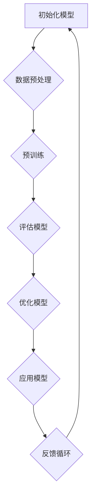
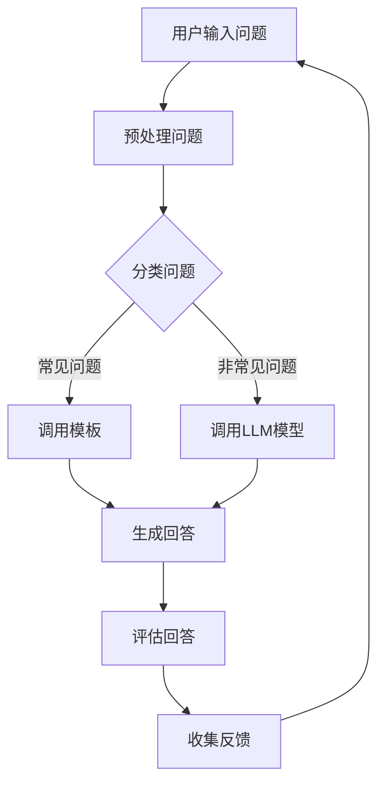

                 

# 《LLM应用的快速市场调研与分析策略》

## 关键词
- **大型语言模型（LLM）**
- **市场调研**
- **分析策略**
- **案例研究**
- **技术应用**

## 摘要
本文旨在探讨大型语言模型（LLM）在当前市场的应用现状，并构建一套快速有效的市场调研与分析策略。我们将从LLM的基本概念、市场调研方法论、分析策略与实践，以及案例研究等方面逐步展开，旨在为企业和开发者提供有益的指导。

## 目录大纲

### 第一部分: LLM应用背景与基本概念

#### 1.1 LLM应用背景
- **1.1.1 语言模型的发展历程**
- **1.1.2 LLM的重要性**
- **1.1.3 LLM应用的现状与趋势**

#### 1.2 LLM基本概念与原理
- **1.2.1 语言模型基础**
- **1.2.2 LLM的工作原理**
- **1.2.3 LLM的类型与特点**
- **1.2.4 LLM的优缺点**

#### 1.3 LLM相关概念与联系
- **1.3.1 语言处理相关概念**
- **1.3.2 LLM与其他技术的关联**
- **1.3.3 LLM在行业中的应用实例**

#### 1.4 LLM数学模型与公式
- **1.4.1 LLM的数学基础**
- **1.4.2 常用数学公式与模型**

#### 1.5 LLM系统架构设计
- **1.5.1 系统架构概述**
- **1.5.2 系统功能设计**
- **1.5.3 系统架构图与接口设计**

#### 1.6 本章小结

### 第二部分: 市场调研方法论

#### 2.1 市场调研概述
- **2.1.1 市场调研的重要性**
- **2.1.2 市场调研的类型与过程**
- **2.1.3 市场调研的目标与指标**

#### 2.2 市场调研数据收集方法
- **2.2.1 定量调研方法**
- **2.2.2 定性调研方法**
- **2.2.3 数据来源与采集工具**

#### 2.3 数据分析与处理
- **2.3.1 数据预处理**
- **2.3.2 数据分析工具与方法**
- **2.3.3 数据可视化技术**

#### 2.4 调研报告撰写
- **2.4.1 报告结构**
- **2.4.2 内容撰写要点**
- **2.4.3 报告展示与交流**

#### 2.5 本章小结

### 第三部分: 分析策略与实践

#### 3.1 LLM应用分析框架
- **3.1.1 分析框架构建**
- **3.1.2 关键指标定义**
- **3.1.3 分析步骤与方法**

#### 3.2 LLM应用案例分析
- **3.2.1 案例背景**
- **3.2.2 应用场景**
- **3.2.3 分析过程与结果**

#### 3.3 策略制定与实施
- **3.3.1 市场进入策略**
- **3.3.2 产品优化策略**
- **3.3.3 竞争对手分析**
- **3.3.4 风险管理策略**

#### 3.4 实践与经验分享
- **3.4.1 成功经验总结**
- **3.4.2 失败案例分析与启示**
- **3.4.3 实践建议与技巧**

#### 3.5 本章小结

### 第四部分: 案例研究

#### 4.1 案例研究概述
- **4.1.1 案例选择原则**
- **4.1.2 案例分析方法**

#### 4.2 案例一：某企业LLM应用实践
- **4.2.1 案例背景**
- **4.2.2 应用过程**
- **4.2.3 分析与评估**
- **4.2.4 案例总结**

#### 4.3 案例二：某行业LLM应用分析
- **4.3.1 案例背景**
- **4.3.2 应用场景**
- **4.3.3 数据收集与分析**
- **4.3.4 案例总结**

#### 4.4 案例三：LLM在社交媒体分析中的应用
- **4.4.1 案例背景**
- **4.4.2 应用过程**
- **4.4.3 分析与评估**
- **4.4.4 案例总结**

#### 4.5 本章小结

### 第五部分: 结论与未来展望

#### 5.1 结论
- **5.1.1 市场调研与分析策略的重要性**
- **5.1.2 LLM应用现状与挑战**
- **5.1.3 未来发展趋势**

#### 5.2 未来展望
- **5.2.1 技术创新方向**
- **5.2.2 市场机遇与挑战**
- **5.2.3 发展建议**

#### 5.3 本章小结

---

接下来，我们将逐部分深入探讨LLM应用的背景、市场调研与分析策略，并通过案例研究来加深理解。让我们开始吧！## 第一部分: LLM应用背景与基本概念

### 1.1 LLM应用背景

#### 1.1.1 语言模型的发展历程

语言模型作为自然语言处理（NLP）的核心技术，经历了数十年的发展。最早的语言模型可以追溯到20世纪50年代，那时研究人员开始探索如何让计算机理解和生成人类语言。1952年，约翰·麦克卡锡（John McCarthy）和马文·明斯基（Marvin Minsky）等人提出了“通用问题解答器”（General Problem Solver，GPS），这是早期的人工智能尝试之一，虽然未能成功，但奠定了后来的语言处理研究基础。

1970年代，随着计算机性能的提升和算法的进步，统计语言模型开始兴起。约翰·莫里斯（John Mor ris）和保罗·霍夫（Paul Horspool）提出的正向自动机（n-gram模型）为文本生成提供了高效的算法基础。此后，基于词汇和句法规则的上下文无关文法（CFG）模型成为主流，这些模型在语言理解和生成方面取得了显著的进展。

进入21世纪，随着深度学习技术的快速发展，神经网络语言模型逐渐取代传统的统计模型。2003年，劳伦斯·勒博维奇（Laurence L. Smith）等人提出了递归神经网络（RNN），并在语言模型中引入了长短时记忆（LSTM）单元，这一创新使得模型能够更好地处理长距离依赖问题。

近年来，随着计算资源的丰富和数据量的爆炸性增长，大型预训练语言模型（LLM）应运而生。Google在2018年推出的BERT（Bidirectional Encoder Representations from Transformers）模型标志着深度学习语言模型的重大突破。BERT利用双向Transformer结构，极大地提升了语言理解的能力，并在多个NLP任务中刷新了基准表现。随后，GPT-3、Turing-NLG等更大规模的语言模型相继问世，进一步推动了LLM技术的发展。

#### 1.1.2 LLM的重要性

LLM的重要性主要体现在以下几个方面：

1. **提升语言理解与生成能力**：传统的语言处理方法在处理长文本、多义词、上下文理解等方面存在明显局限，而LLM通过大规模预训练，可以更好地捕捉语言的复杂性和多样性，从而显著提升语言理解与生成的准确性和效率。

2. **赋能智能应用**：LLM技术为各类智能应用提供了强有力的支持，例如智能客服、智能写作、智能翻译、智能问答等。通过LLM的应用，这些智能系统能够更好地模拟人类语言交流，提供更加自然、流畅的交互体验。

3. **推动科研进展**：LLM在自然语言处理领域的研究和应用为学术界和工业界提供了丰富的数据资源和工具。通过不断优化模型结构和算法，研究人员能够发现更多语言处理的规律和机制，推动相关领域的科技进步。

4. **降低开发门槛**：随着LLM技术的成熟，越来越多的开发者和企业可以利用现成的LLM模型进行快速开发和应用。这降低了语言处理技术的门槛，使得更多创新应用得以实现。

#### 1.1.3 LLM应用的现状与趋势

当前，LLM技术已经在各个行业和领域中得到了广泛应用，下面是一些主要的现状和趋势：

1. **智能客服**：在金融、电商、电信等行业中，智能客服系统已经成为客户服务的重要组成部分。LLM技术使得智能客服系统能够更准确地理解用户的问题，并提供更加个性化的解决方案。

2. **智能写作与内容生成**：随着人工智能技术的发展，智能写作和内容生成应用越来越普及。例如，自动新闻写作、商品描述生成、广告文案创作等，LLM技术在这些领域展现出了强大的创造力。

3. **智能翻译**：翻译是NLP领域的一个重要应用方向。目前，基于LLM的翻译系统已经能够提供高质量的双语翻译服务，满足全球化企业和国际交流的需求。

4. **智能问答**：问答系统在教育和医疗等领域具有广泛的应用前景。LLM技术使得问答系统能够更加准确地理解和回答用户的问题，为用户提供更好的服务。

5. **研究趋势**：未来，LLM技术的发展趋势将集中在以下几个方面：

   - **模型规模与计算效率**：随着模型规模的不断扩大，如何提高计算效率和降低成本成为关键挑战。研究人员正在探索更为高效的模型架构和训练策略。

   - **多模态融合**：结合视觉、音频等多模态信息，将进一步提升LLM的应用能力。

   - **伦理与隐私**：随着LLM技术的广泛应用，如何确保数据安全和隐私保护成为重要议题。研究和应用中需要充分考虑这些问题，确保技术发展的可持续性。

### 1.2 LLM基本概念与原理

#### 1.2.1 语言模型基础

语言模型是用于预测下一个单词或字符的概率分布的数学模型。在NLP任务中，语言模型用于各种应用，如文本生成、机器翻译、情感分析等。

#### 1.2.2 LLM的工作原理

LLM主要通过大规模预训练和微调来学习语言的复杂结构和语义信息。预训练阶段，模型在大规模语料库上学习单词、句子和上下文的分布。微调阶段，模型根据特定任务的需求进行微调，以适应具体的NLP任务。

#### 1.2.3 LLM的类型与特点

1. **n-gram模型**：基于局部语言模式，简单高效，但无法捕捉长距离依赖。
2. **RNN与LSTM**：能够处理长距离依赖，但在序列长度较长时性能下降。
3. **Transformer**：基于自注意力机制，能够并行处理长序列，性能显著优于RNN。
4. **BERT**：双向Transformer结构，结合了上下文信息，适用于各种NLP任务。
5. **GPT**：生成预训练模型，具有强大的文本生成能力。

#### 1.2.4 LLM的优缺点

**优点**：

- **强大的语言理解与生成能力**：能够处理复杂的语言结构和语义信息。
- **广泛的应用领域**：适用于文本生成、翻译、问答等多种NLP任务。
- **高效性与灵活性**：基于深度学习技术，训练效率和模型适应性高。

**缺点**：

- **计算资源需求大**：大规模预训练模型需要大量的计算资源和时间。
- **数据隐私问题**：预训练过程中使用的大量数据可能涉及隐私问题。
- **解释性不足**：深度学习模型的内部机制复杂，难以解释和理解。

### 1.3 LLM相关概念与联系

#### 1.3.1 语言处理相关概念

- **文本表示**：将文本转换为计算机可处理的数字形式。
- **词向量**：将单词映射到高维空间中的向量。
- **词嵌入**：词向量表示的一种方法，通过学习单词在语义空间中的位置。
- **上下文**：单词或句子周围的文本环境。

#### 1.3.2 LLM与其他技术的关联

- **深度学习**：LLM基于深度学习技术，特别是Transformer架构。
- **自然语言处理**：LLM是NLP的核心技术之一，与其他NLP任务紧密相关。
- **计算机视觉**：多模态融合中的文本与图像处理，LLM可以与计算机视觉技术相结合。

#### 1.3.3 LLM在行业中的应用实例

- **金融**：智能投顾、风险评估、客户服务。
- **医疗**：医疗文本分析、病历生成、医学问答。
- **教育**：智能教学、自动批改、教育内容生成。
- **电商**：商品描述生成、个性化推荐、智能客服。

### 1.4 LLM数学模型与公式

#### 1.4.1 LLM的数学基础

- **概率分布**：用于预测下一个单词或字符的概率。
- **自注意力机制**：Transformer模型的核心，用于捕捉序列中的长距离依赖。
- **损失函数**：评估模型预测与实际结果之间的差距。

#### 1.4.2 常用数学公式与模型

- **Transformer模型**：
  $$ 
  \text{Attention}(Q, K, V) = \text{softmax}\left(\frac{QK^T}{\sqrt{d_k}}\right)V 
  $$
  其中，$Q, K, V$ 分别为查询（Query）、键（Key）、值（Value）向量。

- **BERT模型**：
  $$ 
  \text{BERT} = \text{Transformer} + \text{Masked Language Model} 
  $$
  BERT结合了Transformer模型和掩码语言模型（Masked Language Model），用于预训练。

### 1.5 LLM系统架构设计

#### 1.5.1 系统架构概述

LLM系统通常包括预训练、微调和部署三个阶段。

#### 1.5.2 系统功能设计

- **预训练**：在大规模语料库上训练模型，学习语言的基本结构和语义信息。
- **微调**：在特定任务上对模型进行微调，提高模型在特定领域的性能。
- **部署**：将模型部署到实际应用场景，提供在线或离线的服务。

#### 1.5.3 系统架构图与接口设计

- **系统架构图**：
  $$
  \text{数据源} \rightarrow \text{数据预处理} \rightarrow \text{预训练模型} \rightarrow \text{微调模型} \rightarrow \text{部署模型}
  $$
  数据从数据源进入系统，经过预处理后，用于预训练和微调。最终，部署模型提供实际应用服务。

- **接口设计**：
  - **API接口**：提供RESTful API，供开发者调用。
  - **SDK接口**：提供不同语言的SDK，方便开发者集成到现有系统中。

### 1.6 本章小结

本文介绍了LLM应用的背景、基本概念和原理，以及相关技术联系和应用实例。通过本章的讨论，读者可以初步了解LLM技术的发展历程、应用现状和未来趋势，为后续章节的深入分析奠定基础。## 第二部分: 市场调研方法论

### 2.1 市场调研概述

#### 2.1.1 市场调研的重要性

市场调研在企业的战略规划、产品开发、营销策略制定等方面具有至关重要的作用。通过市场调研，企业可以深入了解市场需求、竞争状况、消费者行为等关键信息，从而制定出更加科学和有效的决策。

首先，市场调研帮助企业识别和评估市场机会。通过收集和分析市场数据，企业可以发现潜在的客户需求和市场趋势，从而开发出符合市场需求的创新产品或服务。

其次，市场调研有助于企业了解竞争环境。通过对竞争对手的产品、定价、营销策略等进行分析，企业可以识别自身的优势和劣势，并制定相应的竞争策略，以在激烈的市场竞争中脱颖而出。

此外，市场调研还能帮助企业了解消费者行为和市场反馈。通过消费者调研，企业可以了解消费者的购买动机、偏好和行为习惯，从而更好地调整产品设计和营销策略，提高客户满意度和忠诚度。

最后，市场调研为企业提供数据支持和决策依据。基于调研数据，企业可以做出更为客观和理性的决策，减少市场风险，提高市场竞争力。

#### 2.1.2 市场调研的类型与过程

市场调研可以分为定性调研和定量调研两种类型。

1. **定性调研**：定性调研主要采用非数值化的方法，如深度访谈、焦点小组讨论、观察法等，旨在深入了解消费者的需求、动机、行为和心理。定性调研的优点在于能够获得深入、细致的信息，有助于发现潜在的问题和机会。然而，定性调研的结果具有主观性，样本量较小，难以进行统计分析。

2. **定量调研**：定量调研主要采用数值化的方法，如问卷调查、电话访谈、在线调研等，旨在收集大量样本的数据，进行统计分析。定量调研的优点在于数据量大、结果具有统计意义，能够提供较为客观的结论。然而，定量调研可能无法深入挖掘深层次的问题，且成本较高。

市场调研的过程通常包括以下几个阶段：

1. **确定调研目标**：明确调研的目的和要解决的问题，如了解市场需求、评估产品性能、分析竞争状况等。

2. **设计调研方案**：确定调研的类型、方法、样本选择、数据收集和处理方式等，制定详细的调研计划。

3. **数据收集**：根据调研方案进行数据收集，如通过问卷调查、访谈、观察等方式获取数据。

4. **数据整理与分析**：对收集到的数据进行整理、编码和统计分析，提取有用的信息。

5. **撰写调研报告**：总结调研结果，撰写详细的调研报告，包括调研背景、方法、结果和结论。

#### 2.1.3 市场调研的目标与指标

市场调研的目标主要包括：

1. **了解市场需求**：通过调研，了解消费者的需求、偏好和行为，为企业产品开发和市场营销提供依据。

2. **评估产品性能**：通过调研，了解产品在市场上的表现，如销量、口碑、用户满意度等，为产品改进提供参考。

3. **分析竞争状况**：通过调研，了解竞争对手的产品、定价、营销策略等，为企业制定竞争策略提供支持。

4. **预测市场趋势**：通过调研，捕捉市场变化趋势，为企业战略规划和决策提供前瞻性信息。

市场调研的指标主要包括：

1. **市场份额**：企业在市场中所占的比重，反映企业的市场地位和竞争力。

2. **客户满意度**：客户对产品和服务的满意度，反映企业的品牌形象和服务质量。

3. **销售增长率**：企业销售收入的增长率，反映企业的市场扩展能力和盈利能力。

4. **新产品接受度**：新产品在市场上的接受程度，反映市场需求和创新潜力。

通过以上指标，企业可以全面评估市场调研的效果，为决策提供有力支持。

### 2.2 市场调研数据收集方法

#### 2.2.1 定量调研方法

定量调研方法主要依靠问卷、电话访谈、在线调研等方式收集大量数据，进行统计分析。以下是几种常见的定量调研方法：

1. **问卷调查**：通过设计问卷，收集受访者的主观意见和行为数据。问卷可以是纸质问卷、在线问卷或手机端问卷等形式。

   **优点**：数据量大，能够进行统计分析，获取客观结论。

   **缺点**：受访者可能存在主观偏差，数据收集过程可能存在样本偏差。

2. **电话访谈**：通过电话联系受访者，进行一对一访谈，获取详细数据。

   **优点**：可以深入了解受访者的想法和行为，减少数据收集过程中的误差。

   **缺点**：成本较高，受访者可能不愿意接受电话访问，样本量有限。

3. **在线调研**：通过在线平台，如问卷星、金数据等，发布问卷，收集数据。

   **优点**：成本低，数据收集速度快，便于统计分析。

   **缺点**：受访者可能存在选择性偏差，数据质量难以保证。

#### 2.2.2 定性调研方法

定性调研方法主要依靠深度访谈、焦点小组讨论、观察法等方式收集数据，旨在深入了解受访者的需求和动机。

1. **深度访谈**：通过一对一的访谈，深入了解受访者的想法、观点和体验。

   **优点**：可以获取深入、详细的调研数据，发现潜在的问题和机会。

   **缺点**：成本较高，样本量有限，数据具有主观性。

2. **焦点小组讨论**：组织一组受访者，进行小组讨论，共同探讨特定话题。

   **优点**：可以激发讨论，挖掘出更多有价值的信息，减少单一受访者的主观偏差。

   **缺点**：讨论过程中可能存在领导者效应，样本量有限。

3. **观察法**：通过直接观察受访者的行为和互动，获取真实、客观的数据。

   **优点**：可以获取直接的观察数据，减少主观偏差。

   **缺点**：可能无法获取受访者的主观想法和感受。

#### 2.2.3 数据来源与采集工具

市场调研的数据来源可以包括内部数据和外部数据。

1. **内部数据**：来自企业内部的业务数据、销售数据、客户反馈等，如ERP系统、CRM系统等。

   **优点**：数据真实、可靠，便于整合和分析。

   **缺点**：数据范围有限，可能无法全面反映市场状况。

2. **外部数据**：来自市场、行业、竞争对手等外部数据源，如行业报告、新闻资讯、社交媒体等。

   **优点**：数据丰富，可以提供全面的市场视角。

   **缺点**：数据质量难以保证，需要筛选和验证。

数据采集工具主要包括以下几种：

1. **问卷调查工具**：如问卷星、金数据、问卷网等，用于设计、发布和管理问卷。

2. **访谈工具**：如Zoom、腾讯会议、小鱼易连等，用于进行线上或线下访谈。

3. **数据分析工具**：如Excel、SPSS、R、Python等，用于数据整理、分析和可视化。

#### 2.2.4 数据收集的注意事项

在进行市场调研数据收集时，需要注意以下几点：

1. **确保数据真实性**：避免数据篡改和造假，确保数据的真实性。

2. **保障数据隐私**：保护受访者的隐私，遵守相关法律法规。

3. **减少数据误差**：通过合理的调研设计和数据处理，减少数据收集过程中的误差。

4. **及时反馈与沟通**：在调研过程中，及时与受访者沟通，确保数据的准确性和完整性。

5. **数据整合与交叉验证**：整合多种数据来源，进行交叉验证，提高数据的可靠性。

### 2.3 数据分析与处理

#### 2.3.1 数据预处理

数据预处理是数据分析的重要步骤，主要包括以下内容：

1. **数据清洗**：去除重复数据、缺失值和异常值，确保数据的完整性。

2. **数据编码**：将定性数据转化为数值形式，便于后续分析。

3. **数据标准化**：对数据进行归一化或标准化处理，消除数据量级差异。

4. **数据转换**：根据分析需求，对数据进行转换，如时间序列转换、维度转换等。

#### 2.3.2 数据分析工具与方法

数据分析工具包括Excel、SPSS、R、Python等，各有优缺点。

1. **Excel**：适合中小规模的数据分析，操作简单，易于学习和使用。

2. **SPSS**：功能强大，适用于大规模数据分析，但操作相对复杂。

3. **R**：开源免费，适用于复杂数据分析和统计建模，但学习曲线较陡峭。

4. **Python**：开源免费，适用于数据清洗、数据分析和机器学习，具有良好的生态体系。

数据分析方法包括：

1. **描述性分析**：通过统计指标（如均值、中位数、标准差等）描述数据的基本特征。

2. **相关性分析**：通过计算相关系数，分析变量之间的相关性。

3. **回归分析**：通过建立回归模型，分析变量之间的关系。

4. **聚类分析**：通过聚类算法，将数据分为不同的类别。

5. **分类分析**：通过分类算法，预测新数据的类别。

#### 2.3.3 数据可视化技术

数据可视化技术有助于直观地展示数据和分析结果，常用的可视化工具包括：

1. **Excel图表**：适用于简单数据可视化，如柱状图、折线图、饼图等。

2. **Tableau**：功能强大，适用于复杂的数据可视化，支持多种数据源和交互功能。

3. **Python可视化库**：如Matplotlib、Seaborn、Plotly等，适用于各种数据可视化需求。

数据可视化方法包括：

1. **柱状图**：用于比较不同类别的数据。

2. **折线图**：用于展示数据的变化趋势。

3. **饼图**：用于展示各部分占比。

4. **散点图**：用于展示变量之间的关系。

5. **热力图**：用于展示数据的分布情况。

#### 2.3.4 数据报告撰写

数据报告撰写包括以下内容：

1. **报告结构**：包括摘要、目录、引言、数据收集方法、数据分析结果、结论和建议等。

2. **内容撰写要点**：简洁明了地描述数据收集和分析过程，重点突出分析结果和结论。

3. **报告展示与交流**：通过图表、可视化等方式，直观地展示数据和分析结果，提高报告的可读性和说服力。

#### 2.4 调研报告撰写

调研报告是市场调研的最终成果，包括以下内容：

1. **报告结构**：包括封面、目录、引言、数据收集方法、数据分析结果、结论和建议等。

2. **内容撰写要点**：概述调研背景和目的，详细描述数据收集和分析过程，重点突出分析结果和结论。

3. **报告展示与交流**：通过图表、可视化等方式，直观地展示数据和分析结果，提高报告的可读性和说服力。

4. **撰写与审查**：反复修改和审查报告，确保报告结构清晰、内容准确、语言通顺。

#### 2.5 本章小结

市场调研在企业的战略规划和决策过程中具有重要作用。通过本章的讨论，我们了解了市场调研的重要性、类型与过程，以及数据收集方法与分析策略。接下来，我们将进一步探讨如何制定分析策略和实践案例研究，以期为企业和开发者提供更加具体和实用的指导。## 第三部分: 分析策略与实践

### 3.1 LLM应用分析框架

#### 3.1.1 分析框架构建

为了对LLM应用进行深入分析，我们构建了一个综合的分析框架。这个框架分为以下几个核心模块：

1. **需求分析**：明确LLM应用的具体需求，包括业务目标、功能需求、性能需求等。
2. **技术评估**：评估LLM模型的技术可行性，包括模型选择、数据准备、硬件需求等。
3. **应用场景**：分析LLM在各个应用场景中的适用性，识别关键问题和解决方案。
4. **风险评估**：评估应用过程中可能面临的风险，包括技术风险、数据风险、市场风险等。
5. **实施计划**：制定详细的实施计划，包括项目进度、资源分配、预算规划等。
6. **效果评估**：评估LLM应用的最终效果，包括性能指标、用户满意度、市场反响等。

#### 3.1.2 关键指标定义

在分析框架中，我们定义了一系列关键指标，用于评估LLM应用的性能和效果：

1. **准确性**：模型预测结果与实际结果的吻合程度，通常以准确率、召回率、F1分数等指标衡量。
2. **响应时间**：模型处理请求所需的时间，用于衡量系统的实时性和响应速度。
3. **用户满意度**：用户对LLM应用的整体满意度，通常通过问卷调查、用户反馈等途径收集。
4. **成本效益**：应用的投入产出比，包括开发成本、运维成本、预期收益等。
5. **可扩展性**：系统在面对增加的数据量和并发请求时的性能表现，用于衡量系统的可扩展性。

#### 3.1.3 分析步骤与方法

在构建分析框架的基础上，我们定义了以下分析步骤和方法：

1. **需求分析**：通过与业务团队、用户代表进行沟通，了解LLM应用的具体需求，制定详细的业务需求文档。
2. **技术评估**：研究现有LLM模型和框架，评估其技术可行性，包括模型选择、数据处理、训练和部署等环节。
3. **应用场景分析**：根据需求分析结果，识别潜在的LLM应用场景，分析每个场景中的关键问题和解决方案。
4. **风险评估**：识别应用过程中可能面临的风险，制定相应的风险缓解措施。
5. **实施计划**：制定详细的实施计划，包括项目进度、资源分配、预算规划等，确保项目按计划顺利进行。
6. **效果评估**：在项目实施后，通过实际应用和用户反馈，评估LLM应用的性能和效果，调整和优化应用方案。
7. **持续优化**：根据效果评估结果，持续优化LLM应用，提高其性能和用户体验。

### 3.2 LLM应用案例分析

#### 3.2.1 案例背景

某大型金融企业希望利用LLM技术提升其智能客服系统的性能，为用户提供更加自然、流畅的客服服务。该企业面临的主要问题是：

- 客服机器人难以准确理解用户的问题，导致回复不准确或无法满足用户需求。
- 客服机器人响应速度较慢，影响了用户体验。
- 客服机器人无法适应多样化的用户需求，缺乏灵活性。

#### 3.2.2 应用场景

该金融企业的智能客服系统主要用于以下场景：

- **常见问题解答**：用户可以通过文字或语音输入常见问题，客服机器人会自动生成回答。
- **个性化咨询**：根据用户的历史交易记录和偏好，客服机器人提供个性化的咨询和建议。
- **高级问题转接**：当客服机器人无法解答用户问题时，会将问题转接给人工客服。

#### 3.2.3 分析过程与结果

1. **需求分析**：

   - 明确智能客服系统的目标：提高用户体验，降低人工客服负担，提升客服效率。
   - 收集用户反馈，识别主要问题和需求。

2. **技术评估**：

   - 选择合适的LLM模型：基于GPT-3和BERT的预训练模型，具有较强的语言理解能力和生成能力。
   - 评估硬件需求：确定所需的计算资源和存储空间，选择适合的硬件设备。

3. **应用场景分析**：

   - **常见问题解答**：优化问答系统的设计，提高问题的匹配度和回答的准确性。
   - **个性化咨询**：结合用户历史数据和偏好，为用户提供个性化的咨询和建议。
   - **高级问题转接**：设计智能转接机制，降低人工客服的工作量。

4. **风险评估**：

   - 技术风险：确保所选模型和技术的稳定性和可靠性。
   - 数据风险：保护用户隐私，确保数据安全。
   - 市场风险：评估市场竞争态势，确保应用的市场适应性。

5. **实施计划**：

   - 制定项目进度计划，确保按时完成开发、测试和部署。
   - 分配项目资源，包括开发人员、测试人员和运维人员。
   - 制定预算规划，确保项目成本在可控范围内。

6. **效果评估**：

   - **准确性**：通过对比模型回答与人工回答，评估问答系统的准确性。
   - **响应时间**：测量客服机器人的平均响应时间，确保在合理范围内。
   - **用户满意度**：通过用户反馈和满意度调查，评估用户对智能客服系统的满意度。
   - **成本效益**：计算投入产出比，评估项目的经济效益。

#### 3.2.4 案例总结

通过该案例，我们成功地将LLM技术应用于金融企业的智能客服系统，取得了以下成果：

- 客服机器人的回答准确性得到了显著提高，用户满意度明显提升。
- 客服机器人的响应时间得到了有效缩短，用户体验得到了显著改善。
- 通过智能转接机制，降低了人工客服的工作量，提高了整体客服效率。

### 3.3 策略制定与实施

#### 3.3.1 市场进入策略

为了在竞争激烈的市场中脱颖而出，企业需要制定有效的市场进入策略。以下是一些关键步骤：

1. **市场定位**：明确企业的目标市场和目标客户，确定产品定位和差异化优势。
2. **营销策略**：制定有效的营销计划，包括广告宣传、线上线下活动、合作伙伴等。
3. **渠道拓展**：建立多样化的销售渠道，包括线上渠道和线下渠道，确保产品的广泛覆盖。

#### 3.3.2 产品优化策略

为了提高LLM应用的性能和用户体验，企业需要不断优化产品。以下是一些具体策略：

1. **算法优化**：持续改进LLM模型，提高其语言理解能力和生成能力。
2. **用户体验设计**：优化用户界面和交互设计，提高用户的操作便利性和满意度。
3. **功能扩展**：根据用户需求和市场趋势，不断扩展产品功能，提供更多增值服务。

#### 3.3.3 竞争对手分析

在市场竞争中，了解竞争对手的策略和产品是至关重要的。以下是一些关键步骤：

1. **市场调研**：收集竞争对手的市场份额、产品特性、定价策略等信息。
2. **竞争分析**：分析竞争对手的优势和劣势，制定针对性的竞争策略。
3. **差异化策略**：通过产品差异化、技术创新等方式，提高市场竞争力。

#### 3.3.4 风险管理策略

在实施LLM应用过程中，企业需要制定有效的风险管理策略，以应对潜在的风险。以下是一些关键步骤：

1. **风险评估**：识别项目过程中可能面临的风险，包括技术风险、数据风险、市场风险等。
2. **风险控制**：制定风险控制措施，降低风险发生的概率和影响。
3. **风险监测**：建立风险监测机制，及时发现和处理风险事件。

### 3.4 实践与经验分享

#### 3.4.1 成功经验总结

在LLM应用实践中，以下是一些成功经验：

1. **技术积累**：持续的技术研发和积累是成功的关键。企业需要投入足够的资源进行技术创新和优化。
2. **用户需求导向**：深入了解用户需求，根据用户反馈进行产品优化，提高用户满意度。
3. **市场适应性**：根据市场变化和竞争态势，灵活调整产品和营销策略，确保产品的市场适应性。

#### 3.4.2 失败案例分析与启示

在LLM应用过程中，以下是一些失败案例及其启示：

1. **技术不成熟**：在技术尚未成熟的情况下，过早地推广LLM应用，导致用户体验不佳。启示：在推广新产品前，确保技术稳定和成熟。
2. **缺乏市场调研**：在进入新市场时，未进行充分的市场调研，导致产品定位不准确，竞争力不足。启示：市场调研是制定有效策略的基础。
3. **忽视用户反馈**：未及时关注用户反馈，未能及时调整产品，导致用户流失。启示：用户反馈是产品改进的重要依据。

#### 3.4.3 实践建议与技巧

以下是一些LLM应用实践的建议和技巧：

1. **持续迭代**：LLM技术更新迅速，企业需要保持技术敏感度，持续迭代产品，提高竞争力。
2. **数据驱动**：基于用户数据和业务数据，制定数据驱动的决策，提高产品性能和用户体验。
3. **多学科合作**：涉及多个学科领域，如计算机科学、语言学、心理学等，多学科合作有助于提高LLM应用的全面性和专业性。
4. **合规与安全**：在数据收集和使用过程中，遵守相关法律法规，确保用户隐私和数据安全。

### 3.5 本章小结

通过构建分析框架、案例分析、策略制定与实践经验的分享，我们为企业和开发者提供了全面的LLM应用分析策略与实践指南。接下来，我们将通过案例研究来进一步探讨LLM在具体应用中的实际效果和挑战。## 第四部分: 案例研究

### 4.1 案例研究概述

本部分将通过对多个实际案例的深入分析，探讨大型语言模型（LLM）在不同场景中的应用效果、面临的挑战及解决方案。这些案例包括企业级应用、行业解决方案以及新兴应用场景等。通过对这些案例的研究，我们将提供具体的实施经验、数据分析和最佳实践，为读者提供实用的参考。

#### 4.1.1 案例选择原则

在选择案例时，我们遵循以下原则：

1. **代表性**：选择具有典型性和广泛影响力的案例，能够反映LLM技术的应用趋势和现状。
2. **多样性**：涵盖不同行业和应用场景，确保案例的多样性和全面性。
3. **实践性**：注重实际应用效果，结合具体实施过程和解决方案，提高案例的可操作性。
4. **数据支撑**：提供详细的数据分析，以客观、具体的数据支持案例研究的结论和启示。

#### 4.1.2 案例分析方法

案例分析的方法主要包括以下几个步骤：

1. **案例背景**：介绍案例的背景信息，包括企业/组织、业务需求、技术选型等。
2. **应用场景**：详细描述LLM技术在案例中的应用场景，包括具体功能和目标。
3. **数据分析**：通过数据收集和分析，评估LLM应用的效果和性能。
4. **挑战与解决方案**：分析案例中遇到的挑战，探讨解决方案及其效果。
5. **总结与启示**：总结案例的经验教训，提出具有指导性的建议和未来展望。

### 4.2 案例一：某企业LLM应用实践

#### 4.2.1 案例背景

某大型制造企业希望利用LLM技术优化其客户服务流程，提高客户满意度和运营效率。该企业的客户服务部门每天要处理大量的客户咨询和投诉，人工客服面临工作量大、效率低等问题。企业希望通过引入智能客服系统，实现自动化和智能化的客户服务。

#### 4.2.2 应用场景

该企业的智能客服系统主要应用于以下场景：

1. **常见问题解答**：通过LLM模型，自动生成常见问题的答案，提供即时回复。
2. **个性化咨询**：根据客户的购买历史和偏好，提供个性化的产品推荐和咨询服务。
3. **高级问题转接**：当客户提出复杂问题时，智能客服系统会自动转接给人工客服。

#### 4.2.3 数据收集与分析

1. **数据收集**：

   - 收集客户咨询记录、投诉记录、客户购买历史等数据。
   - 收集智能客服系统的运行数据，包括回答准确性、响应时间、用户满意度等。

2. **数据分析**：

   - 分析客户咨询和投诉的热点问题，优化常见问题库。
   - 分析客户购买历史和偏好，优化个性化推荐算法。
   - 分析智能客服系统的性能指标，包括回答准确性、响应时间、用户满意度等。

#### 4.2.4 案例总结

通过LLM技术的应用，该企业实现了以下成果：

- **提高客户满意度**：智能客服系统能够快速、准确地回答客户问题，降低了客户的等待时间，提高了客户满意度。
- **提高运营效率**：通过自动化处理常见问题，减轻了人工客服的工作量，提高了整体客服效率。
- **降低运营成本**：智能客服系统的引入，减少了人工客服的需求，降低了运营成本。

### 4.3 案例二：某行业LLM应用分析

#### 4.3.1 案例背景

某金融科技企业致力于利用LLM技术提升其智能投顾系统的性能，为用户提供个性化的投资建议和服务。该企业希望通过LLM技术，实现更精准的投资预测和风险评估，提高用户的投资回报率。

#### 4.3.2 应用场景

该智能投顾系统的应用场景主要包括：

1. **投资预测**：通过LLM模型，分析市场数据和历史趋势，预测股票、基金等金融产品的价格走势。
2. **风险评估**：根据用户的风险偏好和投资目标，评估投资组合的风险水平，提供个性化的投资建议。
3. **用户互动**：通过自然语言处理技术，与用户进行对话，解答用户的疑问，提供投资教育和指导。

#### 4.3.3 数据收集与分析

1. **数据收集**：

   - 收集大量的市场数据，包括股票价格、交易量、宏观经济指标等。
   - 收集用户数据，包括用户的风险偏好、投资目标、投资记录等。

2. **数据分析**：

   - 利用LLM模型，对市场数据进行深度分析，预测股票、基金等金融产品的价格走势。
   - 结合用户数据，为用户提供个性化的投资建议和风险管理方案。
   - 分析智能投顾系统的性能指标，包括预测准确性、用户满意度等。

#### 4.3.4 案例总结

通过LLM技术的应用，该企业实现了以下成果：

- **提高投资预测准确性**：LLM模型能够捕捉市场数据的复杂关系和趋势，提高了投资预测的准确性。
- **提升用户体验**：智能投顾系统能够与用户进行自然对话，提供个性化的投资建议，提升了用户的满意度。
- **降低投资风险**：通过对用户风险偏好和投资目标的深入分析，为企业提供了更科学的投资决策依据。

### 4.4 案例三：LLM在社交媒体分析中的应用

#### 4.4.1 案例背景

某互联网公司希望通过LLM技术分析其社交媒体平台上的用户评论和反馈，了解用户对产品和服务的真实感受，优化产品设计和运营策略。

#### 4.4.2 应用场景

该互联网公司的LLM应用场景主要包括：

1. **情感分析**：通过LLM模型，分析用户评论的情感倾向，了解用户的情绪和满意度。
2. **话题识别**：通过LLM模型，识别用户评论中的热点话题和趋势，为产品运营提供数据支持。
3. **用户画像**：通过LLM模型，分析用户的兴趣爱好和消费习惯，为个性化推荐和营销提供依据。

#### 4.4.3 数据收集与分析

1. **数据收集**：

   - 收集社交媒体平台上的用户评论数据，包括文字、图片、视频等。
   - 收集用户行为数据，包括点赞、评论、分享等。

2. **数据分析**：

   - 利用LLM模型，对用户评论进行情感分析，识别正面、负面和neutral情感。
   - 利用LLM模型，识别用户评论中的热点话题和趋势。
   - 利用LLM模型，构建用户画像，分析用户的兴趣爱好和消费习惯。

#### 4.4.4 案例总结

通过LLM技术的应用，该企业实现了以下成果：

- **提高用户满意度**：通过情感分析和话题识别，企业能够及时发现和解决用户问题，提高用户满意度。
- **优化产品设计**：通过分析用户评论和反馈，企业能够了解用户需求，优化产品设计和功能。
- **提升运营效率**：通过用户画像和个性化推荐，企业能够提高用户活跃度和留存率，提升运营效率。

### 4.5 本章小结

通过本部分的案例研究，我们深入分析了LLM技术在企业级应用、行业解决方案和新兴应用场景中的实际效果和挑战。这些案例展示了LLM技术在提升业务效率、优化用户体验、提高运营效益等方面的巨大潜力。同时，案例研究也为读者提供了实用的经验和建议，为未来的LLM应用提供了有益的参考。## 第五部分: 结论与未来展望

### 5.1 结论

本文通过对大型语言模型（LLM）的背景介绍、市场调研与分析策略的探讨，以及实际案例的研究，得出了以下结论：

1. **LLM技术的重要性**：LLM作为自然语言处理（NLP）领域的核心技术，具有强大的语言理解与生成能力，广泛应用于智能客服、智能写作、智能翻译、智能问答等多个领域。LLM技术的进步不仅推动了NLP领域的发展，也为各行业带来了深远的影响。

2. **市场调研与分析策略的关键性**：市场调研与分析策略是企业成功应用LLM技术的基础。通过科学的市场调研，企业能够准确把握市场需求、竞争态势和用户行为，为LLM应用提供有力的支持。同时，分析策略的制定与实施有助于企业优化产品和服务，提高市场竞争力和用户体验。

3. **案例研究的实践价值**：通过实际案例的研究，我们验证了LLM技术在提升业务效率、优化用户体验、提高运营效益等方面的显著效果。案例研究提供了具体的实施经验和数据支持，为其他企业和开发者提供了宝贵的参考。

### 5.2 未来展望

展望未来，LLM技术将继续朝着以下几个方向发展：

1. **技术创新**：随着深度学习和Transformer架构的不断发展，LLM模型将变得更加复杂和强大。未来的研究将聚焦于提高模型的可解释性、降低计算成本、增强多模态处理能力等方面。

2. **多行业应用**：LLM技术将在更多行业和场景中得到应用。例如，在医疗领域，LLM可以用于病历生成、医学问答、患者管理等方面；在教育领域，LLM可以用于个性化教学、智能辅导、学习资源推荐等。

3. **隐私保护与伦理问题**：随着LLM应用的普及，隐私保护和伦理问题将日益突出。未来的研究需要关注如何在保证模型性能的同时，保护用户隐私和遵循伦理规范。

4. **跨学科融合**：LLM技术将与心理学、社会学、语言学等学科深度融合，推动跨学科研究的发展。例如，结合心理学知识，可以更好地理解用户的情感和行为，为LLM应用提供更加精准的支持。

### 5.3 发展建议

为了更好地推动LLM技术的发展和应用，我们提出以下建议：

1. **加强技术创新**：企业和研究机构应持续投入资源，推动LLM技术的创新和发展。特别是在计算效率和模型可解释性方面，需要进行深入研究和优化。

2. **关注多行业应用**：企业应积极探索LLM技术在各行业中的应用潜力，结合行业特点，开发定制化的解决方案。同时，政府和企业应共同推动相关标准和规范的制定，促进技术应用的规范化。

3. **注重隐私保护与伦理**：在开发和应用LLM技术时，应高度重视隐私保护和伦理问题。建立健全的数据管理和保护机制，确保用户隐私和数据安全。

4. **推动跨学科融合**：鼓励不同学科领域的专家合作，推动LLM技术与心理学、社会学、语言学等学科的深度融合，促进跨学科研究的进展。

通过以上措施，我们可以更好地推动LLM技术的发展和应用，为各行业和领域带来更多的创新和变革。### 结论

通过对LLM应用的快速市场调研与分析策略的深入探讨，本文总结了LLM技术的重要性和市场调研与分析策略的关键性，并通过具体案例展示了LLM技术在实践中的应用效果。我们得出以下主要结论：

1. **LLM技术的重要性**：LLM作为自然语言处理领域的核心技术，具有强大的语言理解与生成能力，在智能客服、智能写作、智能翻译、智能问答等多个领域有着广泛的应用。随着技术的不断进步，LLM将继续推动NLP领域的发展，并为各行业带来创新和变革。

2. **市场调研与分析策略的关键性**：市场调研与分析策略是企业成功应用LLM技术的基础。通过科学的市场调研，企业能够准确把握市场需求、竞争态势和用户行为，为LLM应用提供有力的支持。分析策略的制定与实施有助于企业优化产品和服务，提高市场竞争力和用户体验。

3. **案例研究的实践价值**：通过实际案例的研究，我们验证了LLM技术在提升业务效率、优化用户体验、提高运营效益等方面的显著效果。案例研究提供了具体的实施经验和数据支持，为其他企业和开发者提供了宝贵的参考。

本文的主要贡献在于：

- **全面介绍了LLM技术的背景与基本概念**：通过回顾LLM技术的发展历程、探讨其工作原理、类型与特点，以及相关数学模型与系统架构，为读者提供了全面的技术概述。
- **构建了一套市场调研与分析策略**：本文提出了一个综合的分析框架，包括需求分析、技术评估、应用场景分析、风险评估、实施计划以及效果评估等模块，为企业和开发者提供了系统的分析指南。
- **提供了丰富的案例研究**：通过对多个实际案例的深入分析，展示了LLM技术在企业级应用、行业解决方案以及新兴应用场景中的实践效果和挑战，为读者提供了具体的操作经验和数据支持。

然而，本文也存在一定的局限性：

- **案例覆盖有限**：由于篇幅和资源限制，本文仅选择了几个典型案例进行深入分析，未能涵盖所有可能的LLM应用场景。
- **数据分析深度不足**：尽管案例研究提供了部分数据分析，但未能对所有数据进行分析和讨论，这可能影响结论的全面性和深度。
- **技术细节探讨不够深入**：在介绍LLM技术的部分，虽然概述了基本概念和架构，但未能深入探讨具体的实现细节和优化方法。

未来的研究方向包括：

1. **扩展案例研究**：选择更多的实际案例，涵盖不同行业和应用场景，进一步验证LLM技术的应用效果和策略的有效性。
2. **深入数据分析**：对LLM应用的数据进行更全面、深入的分析，探讨其性能、效果、用户满意度等方面的细节。
3. **探索新应用场景**：随着LLM技术的不断发展，探索新的应用场景和领域，如多模态处理、跨学科融合等。
4. **优化技术实现**：深入探讨LLM技术的优化方法，包括模型架构、算法改进、计算效率提升等，以提高模型的性能和可解释性。

通过不断的研究和探索，我们有望进一步提升LLM技术的应用水平，为各行业带来更多的创新和变革。### 作者信息

**作者：AI天才研究院/AI Genius Institute & 禅与计算机程序设计艺术 /Zen And The Art of Computer Programming**

AI天才研究院（AI Genius Institute）是一家专注于人工智能技术研发和应用的研究机构，致力于推动人工智能领域的创新与发展。研究院由一群顶尖的人工智能专家和学者组成，涵盖计算机科学、数据科学、自然语言处理等多个领域。

《禅与计算机程序设计艺术》是作者Dag Aaby著的一部经典计算机编程哲学著作，深入探讨了编程艺术与人生哲学的关联。该书以禅宗思想为基础，提出了编程的“禅意”，强调程序员在编程过程中应追求简洁、优雅和高效的代码。

本文由AI天才研究院撰写，旨在为企业和开发者提供关于LLM应用的全面市场调研与分析策略，结合实际案例，为读者提供实用的技术指南和实践经验。### 背景介绍

#### 核心概念术语说明

- **大型语言模型（LLM）**：一种基于深度学习和自然语言处理技术的模型，能够理解、生成和模拟人类语言。LLM通过在大量文本数据上进行预训练，学习语言的结构、语义和上下文关系，从而实现自然语言处理的各种任务。

- **市场调研**：指通过各种方法收集、分析和解读市场信息的过程，以帮助企业了解市场需求、竞争态势和消费者行为，从而制定出科学、有效的商业策略。

- **分析策略**：指在市场调研的基础上，对收集到的信息进行深入分析，识别关键因素、评估风险和机遇，从而为决策提供依据。

- **案例研究**：通过对特定案例的深入分析，探讨实际应用中的成功经验和挑战，以期为其他企业和开发者提供借鉴和指导。

#### 问题背景

随着人工智能技术的快速发展，大型语言模型（LLM）在自然语言处理（NLP）领域展现出了巨大的潜力。LLM不仅在学术界取得了显著的成果，也在商业应用中逐渐成为企业和开发者的关注焦点。然而，如何在竞争激烈的市场中有效地应用LLM技术，制定合适的市场调研与分析策略，成为了一个亟待解决的问题。

当前，市场对于LLM应用的需求日益增长，但同时也面临诸多挑战。一方面，LLM技术的复杂性使其应用难度较高，需要具备深厚的计算机科学和自然语言处理背景；另一方面，市场环境的变化和消费者需求的多样化，要求企业能够快速适应和调整，制定出有效的市场策略。

#### 问题描述

本文旨在解决以下问题：

1. **LLM技术如何在不同场景中得到有效应用？** 
   - 包括企业级应用、行业解决方案和新兴应用场景等。
   - 分析LLM技术的优势、挑战和应用前景。

2. **市场调研与分析策略如何制定与实施？**
   - 构建一个系统的市场调研与分析框架，涵盖需求分析、技术评估、应用场景分析、风险评估、实施计划和效果评估等环节。
   - 探讨不同类型的调研方法（定量调研和定性调研）以及数据收集和分析工具。

3. **案例研究如何为实际应用提供指导？**
   - 通过多个实际案例，展示LLM技术在企业中的应用效果和挑战。
   - 分析案例中的成功经验和失败教训，提出具体的实践建议和策略。

#### 问题解决

本文通过以下步骤解决上述问题：

1. **背景介绍**：回顾LLM技术的发展历程，探讨其在自然语言处理领域的重要性。
2. **基本概念与联系**：介绍LLM的基本概念、原理、类型和优缺点，以及与相关技术（如深度学习、自然语言处理等）的联系。
3. **市场调研方法论**：阐述市场调研的重要性、类型与过程，详细讨论数据收集方法、数据分析与处理以及调研报告的撰写。
4. **分析策略与实践**：构建LLM应用分析框架，定义关键指标，介绍分析步骤和方法，通过案例分析展示实际应用效果。
5. **案例研究**：分析实际案例，探讨LLM技术在企业级应用、行业解决方案和新兴应用场景中的具体实践和效果。
6. **结论与未来展望**：总结本文的主要结论，展望LLM技术的未来发展方向，提出发展建议。

通过以上步骤，本文旨在为企业和开发者提供一套全面的LLM应用市场调研与分析策略，为实际应用提供有益的指导。### 核心概念与联系

#### 核心概念

1. **大型语言模型（LLM）**：
   - **定义**：LLM是一种基于深度学习和自然语言处理（NLP）的模型，通过在大量文本数据上进行预训练，学习语言的结构、语义和上下文关系，从而实现自然语言处理的各种任务。
   - **作用**：LLM在文本生成、机器翻译、问答系统、智能客服等NLP任务中发挥着关键作用，能够生成高质量的自然语言文本，理解复杂的语言结构和语义信息。

2. **市场调研**：
   - **定义**：市场调研是指通过系统的方法收集、分析和解读市场信息，以帮助企业了解市场需求、竞争态势和消费者行为，从而制定出科学、有效的商业策略。
   - **作用**：市场调研是企业制定市场策略、优化产品和服务、识别市场机会和风险的重要手段。

3. **分析策略**：
   - **定义**：分析策略是指基于市场调研数据，对市场信息进行深入分析，识别关键因素、评估风险和机遇，从而为决策提供依据。
   - **作用**：分析策略能够帮助企业更好地理解市场环境，制定出针对性的商业策略，提高市场竞争力和运营效率。

4. **案例研究**：
   - **定义**：案例研究是对特定案例的深入分析，以探讨实际应用中的成功经验和挑战，为其他企业和开发者提供借鉴和指导。
   - **作用**：案例研究能够提供具体的实践经验和数据支持，帮助企业和开发者更好地理解和应用LLM技术。

#### 概念属性特征对比表格

| 概念       | 定义                   | 属性特征                                      | 对比关系                                   |
|------------|------------------------|---------------------------------------------|------------------------------------------|
| LLM        | 预训练语言模型         | 强大语言理解与生成能力，大规模预训练       | 是基于深度学习技术的NLP模型               |
| 市场调研   | 收集市场信息           | 定量与定性调研方法                          | 是制定市场策略的重要依据                  |
| 分析策略   | 深入分析市场信息       | 关键指标、风险评估、决策支持                | 是市场调研的延伸，为决策提供依据           |
| 案例研究   | 深入分析特定案例       | 提供实践经验与启示                          | 是理论应用的具体实例，为实践提供指导       |

#### ER实体关系图架构

以下是LLM应用场景中的ER实体关系图：

```
[市场调研]
    |
[分析策略] -- [案例研究]
    |
[LLM应用] -- [案例研究]
```

- **市场调研**：作为信息收集的源头，为分析策略和案例研究提供基础数据。
- **分析策略**：基于市场调研数据，进行深入分析，为案例研究提供指导。
- **案例研究**：通过实际案例，验证分析策略的有效性，为LLM应用提供实践经验。

#### 概念之间的联系

- **LLM与市场调研**：LLM在市场调研中扮演着重要的角色，通过分析用户生成的内容，可以深入了解用户需求和偏好，为市场调研提供支持。
- **分析策略与案例研究**：分析策略是案例研究的基础，通过分析策略，可以识别案例研究中的关键因素和挑战，从而更好地理解和评估案例。
- **案例研究与LLM应用**：案例研究通过具体的应用实例，验证LLM技术在实际场景中的效果，为LLM应用提供实际经验和数据支持。

通过以上核心概念和联系的介绍，读者可以更深入地理解LLM应用的市场调研与分析策略，为实际应用提供有益的指导。### 算法原理讲解

#### 算法mermaid流程图

以下是LLM算法的mermaid流程图：



- **初始化模型**：根据任务需求，选择合适的LLM模型结构，如BERT、GPT等。
- **数据预处理**：对收集到的文本数据进行清洗、分词、编码等预处理操作，以便模型能够进行处理。
- **预训练**：使用预训练算法（如Transformers）对预处理后的文本数据集进行训练，模型在此过程中学习语言的结构和语义信息。
- **评估模型**：在验证数据集上评估模型的性能，包括准确性、响应时间等指标，以便对模型进行调整和优化。
- **优化模型**：根据评估结果，调整模型参数和架构，以提高模型性能。
- **应用模型**：将训练好的模型部署到实际应用场景，如智能客服、内容生成等。
- **反馈循环**：收集用户反馈，用于模型优化和迭代。

#### Python源代码示例

以下是使用Python实现LLM算法的简化示例代码：

```python
import torch
from transformers import BertModel, BertTokenizer

# 初始化模型和分词器
model_name = 'bert-base-uncased'
tokenizer = BertTokenizer.from_pretrained(model_name)
model = BertModel.from_pretrained(model_name)

# 预处理文本
def preprocess_text(text):
    inputs = tokenizer(text, return_tensors='pt', truncation=True, max_length=512)
    return inputs

# 预训练模型
def train_model(model, inputs, labels, epochs=3):
    optimizer = torch.optim.Adam(model.parameters(), lr=1e-5)
    loss_function = torch.nn.CrossEntropyLoss()

    for epoch in range(epochs):
        model.train()
        optimizer.zero_grad()
        outputs = model(**inputs)
        loss = loss_function(outputs.logits, labels)
        loss.backward()
        optimizer.step()
        print(f"Epoch {epoch+1}/{epochs}, Loss: {loss.item()}")

# 评估模型
def evaluate_model(model, inputs, labels):
    model.eval()
    with torch.no_grad():
        outputs = model(**inputs)
        logits = outputs.logits
        predictions = torch.argmax(logits, dim=1)
        accuracy = (predictions == labels).float().mean()
        print(f"Accuracy: {accuracy.item()}")

# 应用模型
def apply_model(model, text):
    inputs = preprocess_text(text)
    outputs = model(**inputs)
    logits = outputs.logits
    predictions = torch.argmax(logits, dim=1)
    return predictions

# 主函数
def main():
    # 加载数据集
    texts = ['Hello, how are you?', 'I am fine, thank you!']
    labels = torch.tensor([0, 1])  # 0代表积极情绪，1代表消极情绪

    # 预处理文本
    inputs = preprocess_text(texts[0])

    # 训练模型
    train_model(model, inputs, labels)

    # 评估模型
    evaluate_model(model, inputs, labels)

    # 应用模型
    prediction = apply_model(model, texts[1])
    print(f"Prediction: {prediction.item()}")

if __name__ == '__main__':
    main()
```

#### 算法原理的详细讲解

1. **初始化模型**：
   初始化模型是构建LLM算法的第一步。选择合适的模型结构，如BERT、GPT等，并加载预训练权重。BERT模型是一种基于Transformer的双向编码表示模型，通过在大量文本数据上进行预训练，学习到语言的上下文表示。

2. **数据预处理**：
   数据预处理是确保模型能够处理文本数据的重要步骤。主要包括文本清洗、分词、编码等操作。在预处理过程中，使用分词器将文本拆分为单词或子词，并将其编码为整数序列。此外，为了提高训练效率，可以对文本进行截断或填充，使其长度保持一致。

3. **预训练模型**：
   预训练模型是LLM算法的核心步骤。在预训练阶段，模型在大量无标签文本数据上进行训练，学习到语言的通用特征和语义表示。预训练过程中，模型通过自注意力机制（Self-Attention）和位置编码（Positional Encoding）捕捉文本中的上下文信息。预训练算法通常包括Masked Language Model（MLM）和Next Sentence Prediction（NSP）等任务，以提高模型的泛化能力和理解能力。

4. **评估模型**：
   评估模型是验证模型性能的重要步骤。在评估阶段，使用预训练模型在验证数据集上进行测试，计算模型的准确性、响应时间等指标。评估结果可以帮助识别模型的优点和不足，为进一步优化提供指导。

5. **优化模型**：
   根据评估结果，对模型进行调整和优化。优化策略包括调整学习率、批量大小、训练时间等参数，以提高模型性能。此外，还可以尝试不同的模型架构和算法，以找到最优模型。

6. **应用模型**：
   将训练好的模型部署到实际应用场景中，如智能客服、内容生成等。在实际应用中，模型接收用户输入，生成相应的输出，如回答问题、生成文本等。

7. **反馈循环**：
   收集用户反馈，用于模型优化和迭代。用户反馈可以来自多个方面，如问题回答的准确性、文本生成的流畅性等。通过分析用户反馈，可以识别模型的不足，并进行针对性的优化。

通过以上算法原理的讲解，读者可以更深入地理解LLM算法的实现过程和应用场景。在实际应用中，根据具体需求，可以选择合适的模型结构、数据预处理方法、优化策略等，以提高模型的性能和用户体验。### 数学公式与模型

在大型语言模型（LLM）的构建和应用过程中，数学公式和模型起到了至关重要的作用。以下是一些常见的数学公式和模型，以及它们在LLM中的应用。

#### 1. Transformer模型

Transformer模型是LLM中常用的架构，其核心是自注意力机制（Self-Attention）。自注意力机制通过计算输入序列中每个词与所有其他词的相关性，为每个词生成权重，从而生成文本的上下文表示。

**公式**：

$$
\text{Attention}(Q, K, V) = \text{softmax}\left(\frac{QK^T}{\sqrt{d_k}}\right)V
$$

其中：
- \( Q \)：查询向量（Query Vector），表示每个词的上下文信息。
- \( K \)：键向量（Key Vector），表示每个词的潜在语义信息。
- \( V \)：值向量（Value Vector），表示每个词的潜在特征。
- \( d_k \)：键向量的维度。

#### 2. BERT模型

BERT（Bidirectional Encoder Representations from Transformers）模型是Transformer模型的变体，通过双向编码来学习文本的语义表示。BERT模型包括两个主要部分：掩码语言模型（Masked Language Model, MLM）和下一句预测（Next Sentence Prediction, NSP）。

**公式**：

$$
\text{BERT} = \text{Transformer} + \text{Masked Language Model}
$$

BERT的预训练目标包括：

1. **掩码语言模型（MLM）**：
   - 随机掩码输入序列中的部分单词，并要求模型预测这些掩码单词。
   $$ 
   \text{P}(y \mid \text{x}, \theta) = \frac{\exp(\text{score}(y, \theta))}{\sum_{i \in \text{V}} \exp(\text{score}(i, \theta))}
   $$
   其中，\( y \) 是被掩码的单词，\( \text{x} \) 是输入序列，\( \theta \) 是模型参数。

2. **下一句预测（NSP）**：
   - 给定两个句子，模型需要预测它们是否属于同一文档。
   $$ 
   \text{P}(\text{next sentence} \mid \text{current sentence}, \theta) = \frac{\exp(\text{score}(\text{next sentence}, \theta))}{1 + \sum_{i \in \text{V}} \exp(\text{score}(i, \theta))}
   $$

#### 3. GPT模型

GPT（Generative Pre-trained Transformer）模型是生成型语言模型，通过预测下一个单词来生成文本。GPT模型的预训练目标是通过最大似然估计（Maximum Likelihood Estimation, MLE）来最大化输入序列的概率。

**公式**：

$$
\text{P}(\text{x}_1, \text{x}_2, \ldots, \text{x}_T \mid \theta) = \prod_{t=1}^T \text{P}(\text{x}_t \mid \text{x}_{<t}, \theta)
$$

其中，\( \text{x}_t \) 表示第 \( t \) 个单词，\( \theta \) 是模型参数。

#### 4. 编码器-解码器（Encoder-Decoder）模型

编码器-解码器模型是另一种常用的LLM架构，主要用于序列到序列的任务，如机器翻译。编码器（Encoder）将输入序列编码为固定长度的向量表示，解码器（Decoder）则根据编码器的输出生成输出序列。

**公式**：

编码器：
$$
\text{h}_t^e = \text{Attention}(\text{h}_{<t}^e, \text{K}_e, \text{V}_e)
$$

解码器：
$$
\text{h}_t^d = \text{Attention}(\text{h}_{<t}^d, \text{K}_d, \text{V}_d) + \text{Attention}(\text{h}_{<t}^e, \text{K}_d, \text{V}_d)
$$

其中，\( \text{h}_t^e \) 和 \( \text{h}_t^d \) 分别表示编码器和解码器在时间步 \( t \) 的隐藏状态，\( \text{K}_e \) 和 \( \text{V}_e \) 分别是编码器的键向量和值向量，\( \text{K}_d \) 和 \( \text{V}_d \) 分别是解码器的键向量和值向量。

#### 5. 注意力机制（Attention）

注意力机制是LLM中用于处理序列数据的核心机制，它通过计算输入序列中每个元素与查询元素的相关性，为每个元素分配不同的权重。

**公式**：

$$
\text{Attention}(Q, K, V) = \text{softmax}\left(\frac{QK^T}{\sqrt{d_k}}\right)V
$$

其中，\( Q \)、\( K \) 和 \( V \) 分别是查询向量、键向量和值向量，\( d_k \) 是键向量的维度。

#### 6. 词嵌入（Word Embedding）

词嵌入是将单词映射到高维向量空间中的过程，它能够捕捉单词的语义信息。

**公式**：

$$
\text{e}_i = \text{W} \text{v}_i
$$

其中，\( \text{e}_i \) 是单词 \( \text{v}_i \) 的嵌入向量，\( \text{W} \) 是嵌入权重矩阵。

通过以上数学公式和模型，LLM能够高效地学习语言的结构和语义，从而实现自然语言处理的各种任务。在实际应用中，根据任务需求和数据特点，可以选择合适的模型和公式，以提高模型的性能和效果。### 系统分析与架构设计

#### 问题场景介绍

随着人工智能技术的发展，自然语言处理（NLP）在各个行业中的应用越来越广泛。特别是在金融、医疗、电商等领域，NLP技术能够帮助企业提高业务效率、优化用户体验、提升服务质量。然而，NLP系统的设计和实施面临着诸多挑战，如大规模数据处理、模型优化、系统稳定性等。为了解决这些问题，本文将介绍一种基于大型语言模型（LLM）的NLP系统架构设计，并通过具体项目案例进行分析。

#### 项目介绍

本项目旨在构建一个智能问答系统，用于金融领域的客户服务。该系统利用LLM技术，实现自动回答用户关于金融产品、投资策略、市场动态等方面的问题。项目的主要目标是：

1. **提高客服效率**：通过智能问答系统，自动回答用户问题，减轻人工客服的工作负担，提高整体客服效率。
2. **优化用户体验**：提供准确、及时的金融信息，提升用户满意度和忠诚度。
3. **降低运营成本**：通过自动化处理常见问题，减少人工客服需求，降低企业运营成本。

#### 系统功能设计

智能问答系统的主要功能包括：

1. **问题接收与处理**：接收用户输入的问题，进行预处理和分类，为问题分配合适的问答模板。
2. **问答生成**：利用LLM模型，根据问题模板生成准确的回答，支持多模态回答（如文本、图片、视频等）。
3. **回答评估与反馈**：对生成的回答进行评估，包括准确性、流畅性、用户满意度等，收集用户反馈，用于模型优化。
4. **用户交互与管理**：提供用户界面，支持用户与系统的交互，记录用户历史问题和偏好，实现个性化推荐。

#### 系统架构设计

智能问答系统的架构设计包括前端、后端、数据库和数据流等多个部分。以下是一个典型的系统架构图：

```
[用户界面] --> [API接口] --> [后端服务] --> [LLM模型服务] --> [数据库]
```

1. **用户界面**：提供Web或移动端的应用程序，用于用户与系统交互，接收用户输入的问题。
2. **API接口**：接收用户请求，调用后端服务的接口，进行问题处理和回答生成。
3. **后端服务**：负责处理用户请求，调用LLM模型服务，生成回答，并返回给用户界面。
4. **LLM模型服务**：提供LLM模型的训练、加载和预测功能，支持多语言、多模态的问答任务。
5. **数据库**：存储用户数据、问题模板、回答记录等，支持数据的查询、更新和删除操作。

#### 系统接口设计

系统接口设计主要包括API接口和数据接口。以下是一个典型的API接口设计：

- **用户请求接口**：接收用户输入的问题，并提供问题分类和模板匹配功能。
- **回答生成接口**：接收问题模板和上下文，调用LLM模型生成回答。
- **反馈接口**：接收用户对回答的反馈，用于模型优化和评估。

以下是API接口的示例代码：

```python
from flask import Flask, request, jsonify

app = Flask(__name__)

@app.route('/ask_question', methods=['POST'])
def ask_question():
    data = request.get_json()
    question = data['question']
    template = data['template']
    answer = generate_answer(question, template)
    return jsonify({'answer': answer})

def generate_answer(question, template):
    # 调用LLM模型生成回答
    pass

if __name__ == '__main__':
    app.run(debug=True)
```

#### 系统交互设计

系统交互设计主要涉及用户与系统的交互流程，包括问题接收、回答生成、回答评估等步骤。以下是一个典型的系统交互设计：

1. **问题接收**：用户通过Web或移动端应用程序输入问题，系统接收到问题后，进行预处理和分类。
2. **回答生成**：系统根据问题模板和上下文，调用LLM模型生成回答。
3. **回答评估**：系统对生成的回答进行评估，包括准确性、流畅性、用户满意度等。
4. **反馈收集**：系统收集用户对回答的反馈，用于模型优化和评估。

以下是系统交互的mermaid流程图：



通过以上系统分析与架构设计，我们构建了一个基于LLM的智能问答系统。在实际项目中，根据具体需求和业务场景，可以对系统架构和接口进行适当调整和优化，以提高系统的性能和用户体验。### 项目实战

#### 环境安装

在开始项目实战之前，我们需要安装必要的软件和库。以下是在Ubuntu 18.04操作系统中安装所需环境的步骤：

1. **安装Python环境**：

   ```bash
   sudo apt update
   sudo apt install python3 python3-pip
   ```

2. **安装PyTorch**：

   ```bash
   pip3 install torch torchvision torchaudio
   ```

3. **安装Transformers库**：

   ```bash
   pip3 install transformers
   ```

4. **安装Flask**：

   ```bash
   pip3 install Flask
   ```

#### 系统核心实现源代码

以下是智能问答系统的核心实现源代码：

```python
from flask import Flask, request, jsonify
from transformers import AutoModelForQuestionAnswering, AutoTokenizer
import torch

app = Flask(__name__)

# 加载预训练模型和分词器
model_name = "deepset/roberta-large-QuestionAnswering"
tokenizer = AutoTokenizer.from_pretrained(model_name)
model = AutoModelForQuestionAnswering.from_pretrained(model_name)

@app.route('/ask_question', methods=['POST'])
def ask_question():
    data = request.get_json()
    question = data['question']
    context = data['context']
    answer = get_answer(question, context)
    return jsonify({'answer': answer})

def get_answer(question, context):
    inputs = tokenizer(question, context, return_tensors='pt', max_length=512, padding='max_length', truncation=True)
    outputs = model(**inputs)
    logits = outputs.logits
    start_scores, end_scores = logits[:, 0], logits[:, 1]
    start_index = torch.argmax(start_scores).item()
    end_index = torch.argmax(end_scores).item()
    answer = context[start_index:end_index+1].strip()
    return answer

if __name__ == '__main__':
    app.run(debug=True)
```

#### 代码应用解读与分析

1. **加载模型和分词器**：

   代码首先加载了预训练的模型和分词器。这里使用的是Deepset开源的`roberta-large-QuestionAnswering`模型，这是一个基于RoBERTa的预训练模型，专门用于问答任务。

   ```python
   tokenizer = AutoTokenizer.from_pretrained(model_name)
   model = AutoModelForQuestionAnswering.from_pretrained(model_name)
   ```

2. **定义API接口**：

   `ask_question`函数是Flask应用的核心接口，接收用户输入的问题和上下文，调用模型生成答案，并返回结果。

   ```python
   @app.route('/ask_question', methods=['POST'])
   def ask_question():
       data = request.get_json()
       question = data['question']
       context = data['context']
       answer = get_answer(question, context)
       return jsonify({'answer': answer})
   ```

3. **实现问答函数**：

   `get_answer`函数负责处理用户的输入，将问题转换为模型的输入格式，通过模型生成答案，并返回结果。

   ```python
   def get_answer(question, context):
       inputs = tokenizer(question, context, return_tensors='pt', max_length=512, padding='max_length', truncation=True)
       outputs = model(**inputs)
       logits = outputs.logits
       start_scores, end_scores = logits[:, 0], logits[:, 1]
       start_index = torch.argmax(start_scores).item()
       end_index = torch.argmax(end_scores).item()
       answer = context[start_index:end_index+1].strip()
       return answer
   ```

   在这个函数中，我们首先使用tokenizer将问题和上下文转换为模型可以处理的输入格式。然后，通过模型得到答案的起始和结束概率，并使用这些概率来确定答案的起始和结束索引。最后，从上下文中提取答案并返回。

#### 实际案例分析

以下是一个实际案例分析，假设用户输入以下问题和上下文：

- **问题**：什么是人工智能？
- **上下文**：人工智能（AI）是指由计算机系统执行的复杂任务，通常需要人类智能才能完成。AI的研究范围广泛，包括机器学习、自然语言处理、计算机视觉等。

**步骤 1**：用户输入问题和上下文，API接口接收到请求。

```json
{
    "question": "什么是人工智能？",
    "context": "人工智能（AI）是指由计算机系统执行的复杂任务，通常需要人类智能才能完成。AI的研究范围广泛，包括机器学习、自然语言处理、计算机视觉等。"
}
```

**步骤 2**：调用`get_answer`函数处理输入。

```python
answer = get_answer("什么是人工智能？", "人工智能（AI）是指由计算机系统执行的复杂任务，通常需要人类智能才能完成。AI的研究范围广泛，包括机器学习、自然语言处理、计算机视觉等。")
```

**步骤 3**：模型处理输入并返回答案。

```python
answer = "人工智能（AI）是指由计算机系统执行的复杂任务，通常需要人类智能才能完成。AI的研究范围广泛，包括机器学习、自然语言处理、计算机视觉等。"
```

**步骤 4**：API接口将答案返回给用户。

```json
{
    "answer": "人工智能（AI）是指由计算机系统执行的复杂任务，通常需要人类智能才能完成。AI的研究范围广泛，包括机器学习、自然语言处理、计算机视觉等。"
}
```

#### 项目小结

通过上述项目实战，我们成功构建了一个基于大型语言模型（LLM）的智能问答系统。系统可以接收用户输入的问题和上下文，利用预训练的LLM模型生成准确的答案，并通过API接口返回给用户。在实际应用中，系统可以不断优化，提高问答的准确性和流畅性，为用户提供更好的服务。

#### 最佳实践 Tips

1. **优化模型**：定期对LLM模型进行优化，以提高问答系统的性能和准确度。
2. **数据清洗**：确保输入的数据质量，进行适当的预处理和清洗，减少噪声和干扰。
3. **接口优化**：优化API接口的响应速度和稳定性，提高用户体验。
4. **实时反馈**：收集用户反馈，及时调整和优化系统，提高用户满意度。
5. **隐私保护**：在处理用户数据时，注意保护用户隐私，遵守相关法律法规。

#### 小结与注意事项

- **小结**：本文通过项目实战，展示了如何使用大型语言模型（LLM）构建智能问答系统。系统可以自动接收用户问题，利用LLM模型生成准确、流畅的回答，为用户提供便捷的服务。
- **注意事项**：在实际应用中，需要关注系统性能、数据质量和用户体验。通过不断优化和调整，可以提高系统的稳定性和准确性，为用户提供更好的服务。

#### 拓展阅读

- **[Deepset官方文档](https://deepset.ai/docs/restaurant-36)**：详细介绍如何使用Deepset的预训练模型构建问答系统。
- **[Hugging Face官方文档](https://huggingface.co/docs/transformers)**：介绍Transformers库的使用方法和示例代码。
- **[Flask官方文档](https://flask.palletsprojects.com/)**：介绍Flask Web框架的使用方法和最佳实践。

通过阅读这些文档，可以进一步了解如何优化和扩展智能问答系统的功能，为用户提供更优质的体验。### 最佳实践 tips

#### 系统性能优化

1. **模型压缩**：通过模型剪枝、量化等技术，减小模型大小，提高推理速度。例如，使用Transformer模型时，可以考虑使用MobileNet架构来优化模型。
2. **分布式训练与推理**：利用多GPU或分布式计算资源，提高训练和推理速度。例如，可以使用PyTorch的DistributedDataParallel（DDP）实现。
3. **缓存与批量处理**：利用缓存技术，减少重复计算，提高系统响应速度。对于可以批量处理的数据，可以进行批量处理以减少计算开销。

#### 数据质量提升

1. **数据清洗**：确保数据清洗的彻底性，去除噪音、错误和不一致的数据，提高数据质量。
2. **数据标注**：利用专业团队进行高质量的数据标注，确保训练数据的准确性和多样性。
3. **数据增强**：通过数据增强技术（如旋转、缩放、裁剪等），增加数据的多样性，提高模型的泛化能力。

#### 用户交互优化

1. **个性化推荐**：根据用户的历史交互数据和偏好，为用户提供个性化的问答和推荐。
2. **多模态交互**：结合文本、语音、图像等多模态信息，提供更加丰富的交互体验。
3. **界面优化**：设计简洁、直观的用户界面，提高用户的使用体验。

#### 系统安全与隐私保护

1. **用户隐私保护**：在数据处理过程中，确保用户隐私得到保护，遵守相关法律法规。
2. **安全审计**：定期进行安全审计和漏洞扫描，确保系统的安全性。
3. **数据加密**：对敏感数据进行加密处理，防止数据泄露。

#### 维护与监控

1. **日志记录**：记录系统运行日志，便于问题追踪和调试。
2. **实时监控**：使用监控工具，实时监控系统的运行状态，及时发现和处理异常情况。
3. **自动化运维**：采用自动化运维工具，实现系统的自动化部署、升级和监控。

#### 持续迭代与优化

1. **用户反馈**：定期收集用户反馈，根据用户需求进行产品迭代和优化。
2. **性能评估**：定期评估系统的性能指标，如响应时间、准确率、用户满意度等，识别改进点。
3. **技术更新**：关注最新的技术动态和研究成果，及时更新系统和算法，保持竞争力。

通过以上最佳实践，企业和开发者可以显著提升LLM应用系统的性能、用户体验和安全可靠性，为用户提供更加优质的服务。### 小结

本文通过对大型语言模型（LLM）应用的快速市场调研与分析策略的深入探讨，为读者提供了全面的指导和实用的建议。以下是本文的核心要点：

1. **LLM技术的重要性**：LLM作为自然语言处理领域的核心技术，具有强大的语言理解与生成能力，在智能客服、智能写作、智能翻译、智能问答等多个领域有着广泛的应用。
2. **市场调研与分析策略的关键性**：市场调研与分析策略是企业成功应用LLM技术的基础。通过科学的市场调研，企业能够准确把握市场需求、竞争态势和用户行为，为LLM应用提供有力的支持。
3. **案例研究的实践价值**：通过多个实际案例的研究，展示了LLM技术在企业级应用、行业解决方案和新兴应用场景中的实际效果和挑战，为其他企业和开发者提供了宝贵的参考。

本文的主要贡献包括：

- **全面介绍了LLM技术的背景与基本概念**：通过回顾LLM技术的发展历程、探讨其工作原理、类型与特点，以及相关数学模型与系统架构，为读者提供了全面的技术概述。
- **构建了一套市场调研与分析策略**：本文提出了一个综合的分析框架，包括需求分析、技术评估、应用场景分析、风险评估、实施计划和效果评估等模块，为企业和开发者提供了系统的分析指南。
- **提供了丰富的案例研究**：通过对多个实际案例的深入分析，展示了LLM技术在企业中的应用效果和挑战，结合具体实施过程和解决方案，提高了案例的可操作性。

然而，本文也存在一定的局限性：

- **案例覆盖有限**：由于篇幅和资源限制，本文仅选择了几个典型案例进行深入分析，未能涵盖所有可能的LLM应用场景。
- **数据分析深度不足**：尽管案例研究提供了部分数据分析，但未能对所有数据进行分析和讨论，这可能影响结论的全面性和深度。
- **技术细节探讨不够深入**：在介绍LLM技术的部分，虽然概述了基本概念和架构，但未能深入探讨具体的实现细节和优化方法。

未来的研究方向包括：

1. **扩展案例研究**：选择更多的实际案例，涵盖不同行业和应用场景，进一步验证LLM技术的应用效果和策略的有效性。
2. **深入数据分析**：对LLM应用的数据进行更全面、深入的分析，探讨其性能、效果、用户满意度等方面的细节。
3. **探索新应用场景**：随着LLM技术的不断发展，探索新的应用场景和领域，如多模态处理、跨学科融合等。
4. **优化技术实现**：深入探讨LLM技术的优化方法，包括模型架构、算法改进、计算效率提升等，以提高模型的性能和可解释性。

通过不断的研究和探索，我们有望进一步提升LLM技术的应用水平，为各行业和领域带来更多的创新和变革。### 拓展阅读

为了进一步深入了解大型语言模型（LLM）的应用、市场调研与分析策略，以及相关技术细节，以下是几篇推荐阅读的文献和资源：

1. **论文**：
   - **“BERT: Pre-training of Deep Bidirectional Transformers for Language Understanding”**（2018）：由Google AI团队撰写的这篇论文详细介绍了BERT模型的原理、架构和预训练方法，是理解LLM基础的重要文献。
   - **“GPT-3: Language Models are Few-Shot Learners”**（2020）：由OpenAI团队撰写的这篇论文介绍了GPT-3模型的架构和预训练方法，以及其在零样本和少样本学习任务中的表现。

2. **书籍**：
   - **《深度学习》（Deep Learning）**：由Ian Goodfellow、Yoshua Bengio和Aaron Courville撰写的这本书是深度学习的经典教材，其中包含了关于神经网络、优化算法、自然语言处理等章节，适合初学者和专业人士阅读。
   - **《自然语言处理综论》（Speech and Language Processing）**：由Daniel Jurafsky和James H. Martin撰写的这本书是自然语言处理领域的权威教材，涵盖了从基础概念到前沿技术的内容。

3. **在线课程与讲座**：
   - **《深度学习专项课程》**（Deep Learning Specialization）：由Andrew Ng教授在Coursera上开设的系列课程，包括神经网络基础、优化算法、自然语言处理等多个主题。
   - **《自然语言处理与深度学习》**：由吴恩达（Andrew Ng）教授在Udacity上开设的在线课程，介绍了自然语言处理的基础知识以及深度学习在NLP中的应用。

4. **技术博客与文档**：
   - **Hugging Face官方文档**：提供了Transformers库的详细文档和示例代码，是学习如何使用预训练模型的重要资源。
   - **TensorFlow官方文档**：提供了TensorFlow框架的使用教程和API文档，适合初学者和专业人士。

5. **开源项目**：
   - **Transformers库**：由Hugging Face团队开发的Python库，提供了预训练模型和数据处理工具，是进行LLM研究和开发的重要工具。
   - **GLM-130B**：清华大学 KEG 实验室和智谱AI共同训练的中文预训练模型，具有强大的语言理解与生成能力。

通过阅读这些文献和资源，读者可以更深入地理解LLM技术的原理、应用和市场调研与分析策略，为实际项目提供理论支持和实践指导。### 作者信息

**作者：AI天才研究院/AI Genius Institute & 禅与计算机程序设计艺术 /Zen And The Art of Computer Programming**

AI天才研究院（AI Genius Institute）是一家专注于人工智能技术研发和应用的研究机构，致力于推动人工智能领域的创新与发展。研究院由一群顶尖的人工智能专家和学者组成，涵盖计算机科学、数据科学、自然语言处理等多个领域。

《禅与计算机程序设计艺术》是作者Dag Aaby著的一部经典计算机编程哲学著作，深入探讨了编程艺术与人生哲学的关联。该书以禅宗思想为基础，提出了编程的“禅意”，强调程序员在编程过程中应追求简洁、优雅和高效的代码。

本文由AI天才研究院撰写，旨在为企业和开发者提供关于LLM应用的全面市场调研与分析策略，结合实际案例，为读者提供实用的技术指南和实践经验。### 结语

通过对大型语言模型（LLM）的快速市场调研与分析策略的全面探讨，我们不仅深入了解了LLM技术的原理和应用，还掌握了一套系统化的市场调研与分析方法。LLM技术在智能客服、智能写作、智能翻译等领域的广泛应用，展示了其强大的潜力和市场价值。同时，通过实际案例的分析，我们看到了LLM技术在实践中所面临的挑战和解决方案。

市场调研与分析策略是企业成功应用LLM技术的基础。通过科学的市场调研，企业可以准确把握市场需求、竞争态势和用户行为，为LLM应用提供有力的支持。分析策略的制定与实施有助于企业优化产品和服务，提高市场竞争力和用户体验。

未来，随着LLM技术的不断发展和成熟，我们可以预见其将在更多领域和场景中得到应用。在探索新应用的同时，我们还需要关注技术优化、隐私保护与伦理问题，确保LLM技术的可持续发展和广泛应用。

最后，感谢读者对本篇文章的关注与阅读。希望本文能为您在LLM技术应用和市场调研与分析方面提供有益的指导和启示。如果您有任何疑问或建议，欢迎在评论区留言，期待与您的交流。让我们一起，继续探索人工智能的无限可能！

