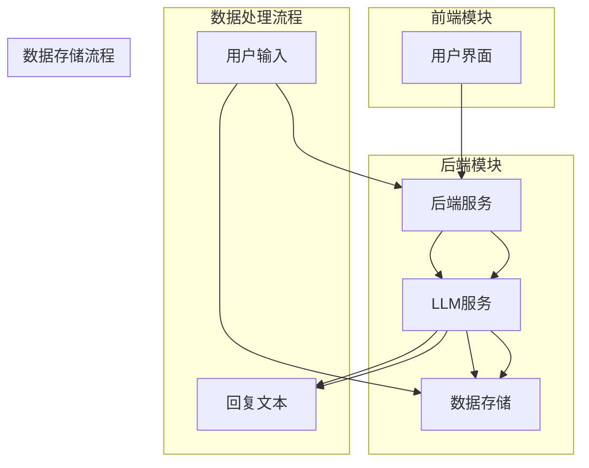
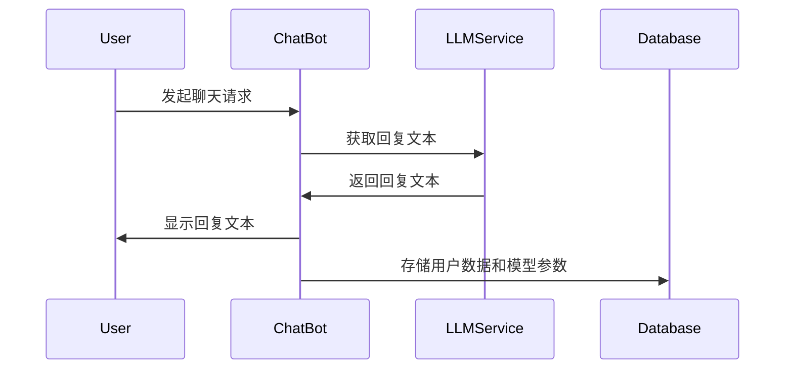

                 

# LL应用快速本地化与国际化策略

## 1.1 问题背景

### 1.1.1 本地化与国际化的重要性

在全球化背景下，本地化和国际化对于企业的成功至关重要。本地化（Localization）是指根据目标市场的文化、语言和习惯，调整产品和服务，以适应当地市场的需求。而国际化（Internationalization）则是指产品和服务在设计阶段就考虑到全球市场的需求，以便在全球范围内进行推广和销售。

本地化与国际化不仅有助于提升产品在海外市场的竞争力，还能增强用户对品牌的忠诚度。随着人工智能（AI）技术的快速发展，特别是大规模语言模型（LLM）的出现，本地化和国际化策略在LLM应用中变得尤为重要。LLM具有强大的文本理解和生成能力，可以用于聊天机器人、翻译、内容生成等多种应用。然而，如何快速且有效地将LLM应用到不同的本地市场，并实现国际化，是当前的一个重大挑战。

### 1.1.2 LLM应用在全球化中的挑战

LLM应用在全球化的过程中面临诸多挑战：

1. **语言多样性**：全球有超过7000种语言，且不同语言之间存在巨大差异，这给LLM的本地化和国际化带来了巨大的挑战。
2. **文化差异**：不同文化背景下的用户对于同样的内容可能有不同的理解和反应，这要求LLM能够适应不同的文化环境。
3. **数据隐私**：在全球化过程中，如何保护用户数据隐私成为了一个重要的议题，特别是在面对不同的数据保护法规时。
4. **技术适配性**：不同地区的网络环境、硬件设备和技术支持可能存在差异，这要求LLM应用能够适应各种不同的技术环境。

### 1.1.3 当前本地化与国际化策略的不足

尽管许多企业已经开始尝试将LLM应用到本地化和国际化中，但现有的策略仍然存在一些不足：

1. **缺乏统一标准**：当前的本地化和国际化策略缺乏统一的标准和框架，导致各企业实施策略的方法和效果参差不齐。
2. **资源投入不足**：本地化和国际化需要大量的时间和资源投入，许多企业在这方面投入不足，导致策略执行不到位。
3. **技术瓶颈**：尽管LLM技术不断发展，但在处理复杂语言和文化差异方面仍存在一定的技术瓶颈，这限制了其应用效果。
4. **用户反馈不足**：本地化和国际化策略的制定往往缺乏对用户需求的深入理解，导致策略实施后效果不尽如人意。

## 1.2 问题描述

### 1.2.1 LLM应用本地化的难点

LLM应用的本地化面临以下几个难点：

1. **语言处理能力**：LLM需要能够处理不同语言之间的语法、语义和语用差异，这是实现本地化的基础。
2. **数据可用性**：本地化需要大量的高质量数据，但不同地区的语言数据分布不均，这限制了LLM的本地化效果。
3. **文化适应性**：本地化不仅仅是语言的转换，还需要考虑文化背景、社会习俗等因素，这对LLM的适应性提出了更高的要求。
4. **技术实现难度**：将LLM应用到不同的本地市场，需要解决技术适配性、性能优化等问题。

### 1.2.2 LLM应用国际化的需求

LLM应用的国际化需求主要包括：

1. **全球化设计**：LLM应用在设计阶段就需要考虑到全球市场的需求，避免在后期进行大规模修改。
2. **多语言支持**：国际化要求LLM能够支持多种语言，以便在全球范围内推广。
3. **本地化策略**：国际化不仅需要实现产品的全球化，还需要制定本地化策略，以适应不同市场的需求。
4. **数据隐私保护**：国际化过程中，需要确保用户数据在不同地区的合法性和安全性。

### 1.2.3 策略制定的目标与原则

制定LLM应用本地化与国际化策略的目标包括：

1. **提升用户体验**：通过本地化和国际化策略，提升用户在不同语言和文化环境下的使用体验。
2. **增强市场竞争力**：通过本地化和国际化策略，增强产品在全球市场的竞争力。
3. **降低运营成本**：通过高效的本地化和国际化策略，降低企业的运营成本。

策略制定的原则包括：

1. **用户导向**：以用户需求为导向，确保策略的制定和执行能够真正满足用户需求。
2. **标准化**：建立统一的本地化和国际化标准，确保不同市场的策略执行的一致性。
3. **灵活性与适应性**：策略需要具备灵活性和适应性，以应对不同市场和技术的变化。

## 1.3 问题解决

### 1.3.1 本地化策略的解决方案

本地化策略的解决方案包括：

1. **语言处理**：利用自然语言处理（NLP）技术，对LLM进行语言处理能力的提升，包括语法、语义和语用的处理。
2. **数据获取**：通过数据挖掘、数据采集和 crowdsourcing 等方式，获取高质量的语言数据，特别是那些在特定本地市场中缺失的数据。
3. **文化适应性**：通过跨文化研究、用户调研和专家咨询等方式，深入了解目标市场的文化背景和社会习俗，确保LLM能够适应不同文化。
4. **技术实现**：通过技术架构的优化、API接口的标准化和性能优化等技术手段，实现LLM在不同本地市场的应用。

### 1.3.2 国际化策略的解决方案

国际化策略的解决方案包括：

1. **全球化设计**：在LLM应用的设计阶段，考虑全球市场的需求和特点，进行全球化设计，确保产品在不同市场都能顺利推广。
2. **多语言支持**：通过多语言模型训练、翻译工具和本地化引擎等技术，实现LLM对多种语言的支持。
3. **本地化策略**：针对不同市场，制定差异化的本地化策略，包括本地化内容的定制、本地化市场的推广等。
4. **数据隐私保护**：遵循不同地区的数据保护法规，建立完善的数据隐私保护机制，确保用户数据的安全和合法。

### 1.3.3 两者结合的实践案例

本地化和国际化策略的结合在实践中尤为重要。以下是一个结合本地化和国际化策略的实践案例：

**案例背景**：某知名科技公司开发了一款基于LLM的智能客服应用，计划在全球范围内推广。

**本地化策略**：

1. **语言处理**：公司利用NLP技术，对LLM进行多语言处理能力的提升，包括中文、英文、西班牙语等。
2. **数据获取**：公司通过数据挖掘和 crowdsourcing 方式，收集了大量针对不同本地市场的语言数据，确保LLM能够准确理解用户的需求。
3. **文化适应性**：公司进行了深入的跨文化研究，针对不同文化背景的用户，调整LLM的应答策略，确保用户在不同文化环境下的满意度。

**国际化策略**：

1. **全球化设计**：公司从设计阶段就考虑到了全球市场的需求，采用了模块化设计，确保产品在不同市场都能快速部署。
2. **多语言支持**：公司通过翻译工具和本地化引擎，实现了对多种语言的支持，使得用户在不同市场都能使用该应用。
3. **本地化策略**：公司根据不同市场的特点，制定了差异化的本地化策略，包括本地化内容的定制和本地化市场的推广。

**案例效果**：通过本地化和国际化策略的结合，该智能客服应用在多个市场取得了良好的效果，用户满意度大幅提升，市场竞争力也得到了增强。

## 1.4 边界与外延

### 1.4.1 本地化策略的适用范围

本地化策略主要适用于以下场景：

1. **国际业务拓展**：企业在进入新市场时，需要通过本地化策略来适应当地的文化和语言环境。
2. **多语言支持**：产品或服务需要支持多种语言，以满足不同语言用户的需要。
3. **文化差异**：需要考虑不同文化背景下的用户需求和习惯，确保产品或服务的适应性。

### 1.4.2 国际化策略的适用范围

国际化策略主要适用于以下场景：

1. **全球化布局**：企业已经在多个市场有业务布局，需要通过国际化策略来进一步提升全球市场竞争力。
2. **全球化产品设计**：产品在设计阶段就考虑全球市场需求，避免后期大规模修改。
3. **多市场推广**：产品或服务需要在多个市场进行推广和销售，需要制定差异化的国际化策略。

### 1.4.3 策略实施的限制因素

本地化和国际化策略的实施受到以下限制因素：

1. **技术限制**：不同市场的技术环境可能存在差异，这可能限制策略的有效实施。
2. **资源限制**：本地化和国际化需要大量的资源和时间投入，这可能成为企业实施的瓶颈。
3. **法规限制**：不同地区的法律法规可能对数据隐私和保护有不同要求，这需要企业在制定策略时进行充分考虑。

## 1.5 概念结构与核心要素组成

### 1.5.1 LLM应用

LLM应用是指利用大规模语言模型（LLM）进行文本理解和生成的一种应用。LLM具有强大的文本处理能力，可以用于聊天机器人、翻译、内容生成等多种场景。

### 1.5.2 本地化

本地化是指根据目标市场的文化、语言和习惯，调整产品和服务，以适应当地市场的需求。本地化包括语言翻译、文化适应、界面优化等多个方面。

### 1.5.3 国际化

国际化是指产品和服务在设计阶段就考虑到全球市场的需求，以便在全球范围内进行推广和销售。国际化包括全球化设计、多语言支持、本地化策略等多个方面。

### 1.5.4 策略制定流程

策略制定流程包括需求分析、方案设计、实施与优化等多个阶段。每个阶段都需要充分考虑本地化和国际化需求，确保策略的有效性和可行性。

## 1.6 本章小结

本章介绍了LLM应用本地化与国际化策略的背景、挑战、问题描述、解决方案以及边界与外延。通过深入分析本地化和国际化的重要性，以及LLM应用在其中的难点和需求，我们提出了具体的策略解决方案，并通过实践案例展示了策略的实际效果。接下来，我们将进一步探讨LLM应用、本地化和国际化的核心概念及其联系。

## 2.1 LLM应用的基本概念

### 2.1.1 LLM的定义

**大规模语言模型（Large Language Model，简称LLM）** 是一种利用深度学习和自然语言处理（NLP）技术训练的神经网络模型，主要用于理解和生成自然语言文本。LLM的核心在于其“大规模”，即模型规模巨大，参数数量达到数十亿甚至千亿级别。这种大规模使得LLM在处理复杂语言现象、理解上下文和生成高质量文本方面具有显著优势。

### 2.1.2 LLM的核心功能

LLM的核心功能包括文本生成、文本分类、命名实体识别、情感分析等。以下是对这些核心功能的简要说明：

1. **文本生成**：LLM可以根据给定的文本上下文生成新的文本，这包括文章、对话、摘要等多种形式。例如，通过输入一个简短的新闻摘要，LLM可以生成一篇完整的新闻文章。
2. **文本分类**：LLM可以根据输入的文本内容将其分类到不同的类别中。例如，将社交媒体上的评论分类为正面、负面或中性。
3. **命名实体识别**：LLM可以识别文本中的命名实体，如人名、地名、组织名等。这对于信息抽取和知识图谱构建具有重要意义。
4. **情感分析**：LLM可以分析文本的情感倾向，判断文本表达的情感是积极、消极还是中立。

### 2.1.3 LLM与传统AI模型的区别

与传统AI模型相比，LLM具有以下几个显著特点：

1. **数据驱动**：传统AI模型通常依赖于手工设计的特征和算法，而LLM通过大量的文本数据进行训练，能够自动学习语言模式和结构。
2. **更强的泛化能力**：由于LLM从海量数据中学习，因此其在面对未见过的数据时具有更强的泛化能力，而传统模型往往依赖特定的特征和算法，泛化能力较弱。
3. **复杂语言处理**：传统AI模型在处理自然语言时存在一定的局限性，而LLM能够处理更复杂的语言现象，如多义词、歧义句等。
4. **上下文理解**：传统AI模型难以理解长文本的上下文关系，而LLM通过上下文窗口机制，可以更好地理解长文本的语义和逻辑关系。

### 2.1.4 LLM的工作原理

LLM的工作原理主要基于深度学习和序列模型，以下是LLM工作原理的核心步骤：

1. **数据预处理**：首先，需要对文本数据进行分析和预处理，包括分词、去停用词、词性标注等。
2. **模型架构**：LLM通常采用 Transformer 架构，这是一种基于自注意力机制的序列模型，能够处理长序列数据。
3. **训练过程**：使用大规模文本数据对LLM进行训练，通过反向传播算法和优化器（如Adam）调整模型参数。
4. **上下文生成**：在生成文本时，LLM根据上下文信息，通过解码器生成每个单词或字符的概率分布，然后根据概率分布选择下一个单词或字符。
5. **优化与调优**：通过持续的数据训练和模型调优，提高LLM在特定任务上的性能和准确性。

通过以上工作原理，LLM能够实现高效的文本理解和生成，为各种NLP任务提供强大的支持。

## 2.2 本地化的概念与属性

### 2.2.1 本地化的定义

**本地化**（Localization，简称L10n）是指将产品或服务根据目标市场的语言、文化和社会习俗进行调整，以适应当地用户的需求。本地化不仅仅是语言的翻译，还包括文化适应、界面优化、内容定制等多个方面。

### 2.2.2 本地化的核心属性

本地化的核心属性包括以下几个方面：

1. **语言适应**：本地化需要将产品或服务的文本内容翻译成目标语言，并确保翻译的准确性和流畅性。
2. **文化适应**：本地化还需要考虑目标市场的文化差异，包括价值观、习俗、习惯等，确保产品或服务能够被当地用户接受。
3. **界面优化**：本地化涉及产品或服务界面的优化，包括按钮、图标、布局等，以适应不同语言和文化的显示需求。
4. **内容定制**：本地化还需要根据目标市场的需求，对产品或服务的内容进行定制，如产品描述、营销材料等。

### 2.2.3 本地化的目标

本地化的目标主要包括以下几点：

1. **提升用户体验**：通过本地化，提升产品或服务在不同市场的用户体验，增强用户满意度和忠诚度。
2. **提高市场竞争力**：本地化有助于产品或服务在目标市场获得竞争优势，吸引更多用户。
3. **降低运营成本**：通过统一的本地化策略，企业可以降低多语言版本的运营成本。
4. **品牌一致性**：本地化确保产品或服务在不同市场保持一致的品牌形象和核心价值。

### 2.2.4 本地化的挑战与解决方案

在实现本地化的过程中，企业可能会面临以下挑战：

1. **语言差异**：不同语言在语法、词汇、表达习惯等方面存在巨大差异，这给翻译和语言适应带来了挑战。
   - **解决方案**：采用专业的翻译团队，结合本地化工具和机器翻译技术，确保翻译的准确性和流畅性。

2. **文化差异**：文化差异可能导致产品或服务在目标市场中的误解或接受度低。
   - **解决方案**：进行深入的跨文化研究，了解目标市场的文化背景，调整产品或服务以适应当地文化。

3. **技术适配性**：不同市场的技术环境和硬件设备可能存在差异，这要求本地化方案具备较高的技术适应性。
   - **解决方案**：采用模块化设计，确保产品或服务在不同技术环境下的兼容性和适应性。

4. **数据隐私和安全**：不同地区的数据保护法规可能存在差异，企业需要在本地化过程中确保数据隐私和安全。
   - **解决方案**：遵循当地数据保护法规，建立完善的数据隐私保护机制，确保用户数据的安全和合法。

### 2.2.5 本地化案例分析

以下是一个本地化案例：

**案例背景**：某知名社交媒体平台计划在全球范围内推广其应用。

**本地化策略**：

1. **语言适应**：平台采用专业的翻译团队，对应用的界面和内容进行多语言翻译，确保翻译的准确性和流畅性。
2. **文化适应**：平台针对不同市场的文化差异，调整了应用的界面设计和功能，如按钮、图标、布局等，以适应不同语言和文化的显示需求。
3. **内容定制**：平台根据不同市场的需求，定制了特定内容的营销材料，如广告、宣传视频等。

**案例效果**：通过有效的本地化策略，该社交媒体平台在全球多个市场取得了良好的用户反馈，用户满意度和活跃度显著提升。

## 2.3 国际化的概念与属性

### 2.3.1 国际化的定义

**国际化**（Internationalization，简称I18n）是指企业将产品或服务扩展到全球市场，以实现全球化的业务目标。国际化不仅仅是将产品翻译成多种语言，更重要的是在设计、开发、营销等环节中考虑全球市场的需求和特点。

### 2.3.2 国际化的核心属性

国际化的核心属性包括以下几个方面：

1. **全球化设计**：在产品或服务的设计阶段，就考虑到全球市场的需求，避免后期进行大规模修改。
   - **优势**：降低后期修改成本，提高产品在国际市场的竞争力。
   - **挑战**：需要全面考虑不同市场的需求和特点，确保设计的一致性和兼容性。

2. **多语言支持**：国际化要求产品或服务能够支持多种语言，以满足不同市场的用户需求。
   - **优势**：提高产品的市场覆盖范围，增强用户满意度。
   - **挑战**：需要确保不同语言的版本都能保持一致性和准确性。

3. **本地化策略**：国际化过程中，企业需要针对不同市场制定差异化的本地化策略，包括内容定制、市场推广等。
   - **优势**：提高产品在目标市场的适应性和接受度。
   - **挑战**：需要投入大量资源进行市场调研和策略制定。

4. **全球化运营**：国际化要求企业在全球范围内建立统一的运营体系，包括供应链、售后服务等。
   - **优势**：提高运营效率，降低成本。
   - **挑战**：需要协调不同地区的资源和政策，确保运营的稳定性和一致性。

### 2.3.3 国际化的目标

国际化的目标主要包括以下几点：

1. **拓展全球市场**：通过国际化，企业可以进入新的市场，扩大业务规模，实现全球化增长。
2. **提高品牌影响力**：国际化有助于提升企业品牌在全球市场的知名度和影响力。
3. **优化资源配置**：国际化有助于企业优化全球资源配置，提高资源利用效率。
4. **降低运营成本**：通过全球化运营，企业可以降低运营成本，提高市场竞争力。

### 2.3.4 国际化的挑战与解决方案

在实现国际化的过程中，企业可能会面临以下挑战：

1. **市场调研**：国际市场调研成本高、周期长，且不同市场的需求和特点各异。
   - **解决方案**：采用专业的市场调研机构，利用大数据和人工智能技术，提高市场调研的效率和准确性。

2. **文化差异**：不同文化背景下，用户对产品或服务的需求和行为习惯存在差异。
   - **解决方案**：进行深入的跨文化研究，了解目标市场的文化背景，调整产品或服务以适应当地文化。

3. **法律法规**：不同地区的法律法规可能对企业的运营有不同要求。
   - **解决方案**：遵循当地法律法规，建立合规的运营体系，确保业务的合法性。

4. **技术兼容性**：不同市场的技术环境和硬件设备可能存在差异，这要求产品或服务具备较高的技术兼容性。
   - **解决方案**：采用模块化设计，确保产品或服务在不同技术环境下的兼容性和适应性。

### 2.3.5 国际化案例分析

以下是一个国际化案例：

**案例背景**：某知名电商平台计划扩展其国际业务，进入欧洲市场。

**国际化策略**：

1. **全球化设计**：平台在产品设计和开发阶段，就考虑到欧洲市场的需求，确保产品在不同语言和货币环境下都能正常运行。
2. **多语言支持**：平台支持多种欧洲语言，包括英语、法语、德语等，确保用户在不同语言环境下都能顺利使用。
3. **本地化策略**：平台根据欧洲市场的特点，调整了支付方式、物流服务等，以适应当地用户的需求。
4. **全球化运营**：平台在欧洲市场建立了本地运营团队，提供本地化的售后服务和技术支持。

**案例效果**：通过有效的国际化策略，该电商平台在欧洲市场取得了显著的成功，用户满意度大幅提升，市场份额逐步扩大。

## 2.4 LLM应用的本地化与国际化联系

### 2.4.1 本地化与国际化关系分析

本地化与国际化是相辅相成的两个过程，它们在LLM应用中有着密切的联系。

1. **本地化是国际化的基础**：本地化是国际化的前提和基础。在国际化过程中，企业需要对产品或服务进行本地化调整，以适应不同市场的语言、文化和法律环境。没有有效的本地化，国际化将难以实现。
2. **国际化推动本地化发展**：国际化为企业提供了更广阔的市场空间，推动本地化策略的持续优化和升级。在国际化过程中，企业可以通过收集不同市场的用户反馈，不断调整本地化策略，提升产品或服务的适应性和竞争力。

### 2.4.2 本地化对国际化策略的影响

本地化策略对国际化策略有以下几个重要影响：

1. **提高用户满意度**：通过本地化，企业能够更好地满足不同市场用户的需求，提高用户满意度和忠诚度。这有助于企业在国际化过程中获得竞争优势。
2. **降低市场风险**：本地化策略有助于企业降低国际化过程中的市场风险。通过深入了解目标市场的需求和特点，企业可以更准确地预测市场反应，制定更具针对性的国际化策略。
3. **优化资源配置**：本地化策略可以优化企业在不同市场的资源配置。通过针对不同市场的本地化调整，企业可以更好地利用现有资源，提高运营效率。

### 2.4.3 国际化对本地化策略的影响

国际化策略对本地化策略也有重要的影响：

1. **促进本地化创新**：国际化为企业提供了更广阔的视野和更多的创新机会。通过国际化，企业可以借鉴其他市场的本地化经验，结合自身特点，创新本地化策略。
2. **提升本地化水平**：国际化过程中的市场反馈和用户调研有助于企业不断提升本地化水平。通过持续的市场调研和用户反馈，企业可以不断优化本地化策略，提高产品或服务的适应性。
3. **扩大市场影响力**：国际化策略的执行可以提升企业品牌在全球市场的知名度和影响力，这有助于本地化策略的进一步推广和实施。

### 2.4.4 本地化与国际化策略的结合

在实际操作中，本地化与国际化策略需要紧密结合，以下是一些建议：

1. **一体化规划**：在制定本地化和国际化策略时，企业应进行一体化规划，确保两个策略相互支持、相互促进。
2. **协同执行**：本地化和国际化策略的执行需要协同推进，确保不同市场的一致性和协调性。
3. **灵活调整**：在策略执行过程中，企业应根据市场反馈和用户需求，灵活调整本地化和国际化策略，以适应市场变化。

通过有效结合本地化和国际化策略，企业可以在全球市场中取得更大的成功。

## 2.5 本章小结

本章深入探讨了LLM应用、本地化和国际化的基本概念、核心属性和关系。首先，我们介绍了LLM的定义、核心功能和与传统AI模型的区别，以及其工作原理。接着，我们详细阐述了本地化的定义、核心属性和目标，并分析了其面临的挑战和解决方案。随后，我们介绍了国际化的定义、核心属性和目标，以及其挑战和解决方案。最后，我们分析了本地化与国际化之间的关系，以及两者在LLM应用中的相互影响。通过本章的学习，读者可以全面了解LLM应用、本地化和国际化策略的重要性和实施方法。接下来，我们将进一步探讨LLM应用的算法原理、数学模型和系统架构设计。

## 2.6 LLM应用的算法原理

### 2.6.1 基本算法原理

大规模语言模型（LLM）的核心是基于深度学习和自然语言处理（NLP）技术的算法，其中最具代表性的是Transformer架构。Transformer由Google在2017年提出，其创新点在于引入了自注意力（Self-Attention）机制，使得模型在处理长文本时能够捕获更复杂的上下文信息。

#### 自注意力机制

自注意力机制允许模型在生成每个词时，考虑整个输入序列的所有词。这种机制通过计算词与词之间的关联性，使模型能够更好地理解上下文，从而生成更准确和连贯的文本。

#### Transformer架构

Transformer架构主要由编码器（Encoder）和解码器（Decoder）两部分组成：

1. **编码器**：编码器的功能是将输入文本序列转换成固定长度的向量表示，以便解码器使用。编码器由多个编码层组成，每层包含多头自注意力机制和前馈神经网络。
   
2. **解码器**：解码器的功能是根据编码器的输出生成输出文本序列。解码器同样由多个解码层组成，每层包含多头自注意力机制、交叉注意力机制和前馈神经网络。交叉注意力机制允许解码器在生成每个词时，考虑编码器的输出，从而更好地理解上下文。

### 2.6.2 数学模型

Transformer的数学模型基于以下基本概念：

1. **嵌入层**（Embedding Layer）：输入的词向量通过嵌入层转换为高维向量表示。词向量通常由预训练词向量库（如GloVe或Word2Vec）生成。

2. **多头自注意力**（Multi-Head Self-Attention）：自注意力机制通过计算输入序列中每个词与所有词之间的关联性，生成一个新的表示。多头自注意力将这个操作扩展到多个独立但共享底层参数的注意力机制上，从而提高模型的表示能力。

3. **前馈神经网络**（Feedforward Neural Network）：在每个编码器和解码器层之后，都添加一个前馈神经网络，用于进一步丰富模型的表示能力。

4. **激活函数**：常用的激活函数包括ReLU（Rectified Linear Unit）和GELU（Gaussian Error Linear Unit）。

### 2.6.3 训练过程

LLM的训练过程主要包括以下步骤：

1. **数据预处理**：对输入文本进行分词、去停用词、词性标注等预处理操作，生成词序列。
2. **编码器训练**：通过自注意力机制和前馈神经网络，将输入的词序列转换成固定长度的编码向量。
3. **解码器训练**：使用编码器的输出作为输入，解码器生成预测的输出词序列，并利用损失函数（如交叉熵损失）计算预测结果与实际结果之间的差距。
4. **模型优化**：通过反向传播和梯度下降算法，更新模型参数，减小损失函数值。

### 2.6.4 实例分析

以下是一个简单的Transformer模型的Python代码示例：

```python
import tensorflow as tf
from tensorflow.keras.layers import Embedding, MultiHeadAttention, Dense

# 定义编码器层
def encoder_layer(d_model, num_heads):
    attention = MultiHeadAttention(num_heads=num_heads, key_dim=d_model)
    feed_forward = Dense(d_model, activation='relu')
    return tf.keras.Sequential([
        attention,
        feed_forward,
    ])

# 定义解码器层
def decoder_layer(d_model, num_heads):
    attention = MultiHeadAttention(num_heads=num_heads, key_dim=d_model)
    cross_attention = MultiHeadAttention(num_heads=num_heads, key_dim=d_model)
    feed_forward = Dense(d_model, activation='relu')
    return tf.keras.Sequential([
        attention,
        cross_attention,
        feed_forward,
    ])

# 定义Transformer模型
def transformer(d_model, num_heads, num_layers):
    inputs = tf.keras.Input(shape=(None,))
    embedding = Embedding(d_model)(inputs)
    x = embedding
    
    for _ in range(num_layers):
        x = encoder_layer(d_model, num_heads)(x)
    
    outputs = tf.keras.layers.TimeDistributed(Dense(vocab_size, activation='softmax'))(x)
    model = tf.keras.Model(inputs, outputs)
    return model
```

在这个示例中，我们定义了编码器层和解码器层，并构建了一个简单的Transformer模型。这个模型可以用于文本生成任务，如生成文章摘要或回答问题等。

通过以上算法原理的讲解和代码示例，我们可以更好地理解LLM的工作原理和实现方法。接下来，我们将进一步探讨LLM应用的数学模型和系统架构设计。

## 2.7 LLM应用的数学模型

### 2.7.1 数学基础

大规模语言模型（LLM）的数学模型基于深度学习和自然语言处理（NLP）的先进技术。其核心原理涉及线性代数、微积分、概率论和统计学等数学知识。以下将介绍LLM的一些基本数学概念：

1. **线性代数**：在LLM中，线性代数用于处理向量运算、矩阵运算等。特别是，矩阵乘法、矩阵求导和特征分解（如奇异值分解SVD）是LLM实现中的重要工具。
   
2. **微积分**：微积分用于优化模型参数。梯度下降（Gradient Descent）是训练LLM的主要优化方法，它依赖于导数（偏导数）的计算。另外，链式法则（Chain Rule）在构建复杂模型的梯度时也至关重要。

3. **概率论和统计学**：概率论用于处理不确定性问题。LLM通常采用概率模型来预测文本的下一个单词或字符。贝叶斯定理、最大似然估计（Maximum Likelihood Estimation，MLE）和最大后验估计（Maximum a Posteriori，MAP）等方法在LLM的模型训练和参数估计中广泛使用。

### 2.7.2 语言模型中的概率计算

在LLM中，概率计算是核心环节。以下是一些关键的概率计算方法：

1. **条件概率**：给定当前输入序列，预测下一个单词或字符的概率。条件概率公式为：
   $$ P(w_t | w_{<t}) = \frac{P(w_{<t} \cap w_t)}{P(w_{<t})} $$
   其中，$w_t$表示当前单词或字符，$w_{<t}$表示当前输入序列。

2. **贝叶斯定理**：用于计算后验概率。贝叶斯定理公式为：
   $$ P(w_t | w_{<t}) = \frac{P(w_{<t} | w_t)P(w_t)}{P(w_{<t})} $$
   其中，$P(w_{<t} | w_t)$表示观察到的证据，$P(w_t)$表示先验概率，$P(w_{<t})$是归一化常数。

3. **最大似然估计（MLE）**：用于估计模型参数。最大似然估计的目标是找到一组参数，使得观察到的数据的概率最大。MLE公式为：
   $$ \theta_{\text{MLE}} = \arg\max_\theta P(X | \theta) $$
   其中，$X$表示观察到的数据，$\theta$表示模型参数。

### 2.7.3 梯度下降与优化

梯度下降是训练LLM的主要优化方法。梯度下降的目标是调整模型参数，以最小化损失函数。以下是一些关键点：

1. **损失函数**：损失函数用于评估模型预测与实际结果之间的差距。常用的损失函数包括交叉熵损失（Cross-Entropy Loss）和均方误差（Mean Squared Error，MSE）。

2. **梯度计算**：梯度表示损失函数对模型参数的敏感度。计算梯度的方法包括正向传播（Forward Propagation）和反向传播（Back Propagation）。反向传播利用链式法则计算复杂模型的梯度。

3. **优化算法**：优化算法用于调整模型参数。常用的优化算法包括梯度下降（Gradient Descent）、Adam（Adaptive Moment Estimation）和RMSprop（Root Mean Square Propagation）。

### 2.7.4 示例讲解

以下是一个简单的基于线性回归的LLM示例，说明如何使用梯度下降来优化模型参数：

```python
import numpy as np

# 假设我们有一个线性回归模型，y = w * x + b
# 其中y是实际结果，x是输入，w和b是模型参数

# 损失函数：均方误差
def mse(y_true, y_pred):
    return np.mean((y_true - y_pred) ** 2)

# 梯度计算
def gradient(x, y, y_pred):
    return -(2 * (y - y_pred) / len(x))

# 梯度下降
def gradient_descent(x, y, w_init, b_init, learning_rate, epochs):
    w, b = w_init, b_init
    for _ in range(epochs):
        y_pred = w * x + b
        dw = gradient(x, y, y_pred)
        db = gradient(x, y, y_pred)
        w -= learning_rate * dw
        b -= learning_rate * db
    return w, b

# 数据集
x = np.array([1, 2, 3, 4])
y = np.array([2, 4, 5, 4])

# 初始参数
w_init = 0.5
b_init = 0.5
learning_rate = 0.01
epochs = 100

# 训练模型
w, b = gradient_descent(x, y, w_init, b_init, learning_rate, epochs)

# 输出模型参数
print(f"Optimized parameters: w={w}, b={b}")
```

在这个示例中，我们定义了一个简单的线性回归模型，使用梯度下降来优化模型参数。通过多次迭代更新参数，模型可以逐渐逼近真实值，从而提高预测准确性。

通过以上数学模型的分析和示例讲解，我们可以更好地理解LLM的核心原理。接下来，我们将进一步探讨LLM应用在系统分析与架构设计中的具体实现。

## 2.8 系统分析与架构设计

### 2.8.1 问题场景介绍

在现代企业中，大规模语言模型（LLM）被广泛应用于自然语言处理（NLP）任务，如智能客服、内容审核、自动翻译和文本生成等。这些任务需要高性能的LLM系统，能够快速处理大量文本数据，并生成高质量的输出。为了实现这一目标，我们需要进行详细的系统分析与架构设计，确保系统具备高可用性、可扩展性和高性能。

### 2.8.2 项目介绍

本项目旨在构建一个基于LLM的智能客服系统，该系统需要支持多种语言，并能够快速响应用户的查询。系统将包括以下几个主要模块：

1. **前端界面**：提供用户与智能客服交互的界面。
2. **后端服务**：处理用户请求，调用LLM进行文本生成和回复。
3. **数据存储**：存储用户数据、LLM模型参数和日志信息。
4. **服务监控**：监控系统的运行状态，确保系统的稳定性和可靠性。

### 2.8.3 系统功能设计（领域模型）

为了实现上述功能，我们首先需要设计系统的领域模型，定义各个模块的职责和交互关系。以下是一个简单的领域模型类图：

```mermaid
classDiagram
    User <<Interface>>
    ChatService <<Interface>>
    LLMService <<Interface>>
    Database <<Interface>>

    User o-- ChatService
    ChatService o-- LLMService
    LLMService o-- Database

    Usersecs:发起聊天请求
    ChatServicesecs:处理用户输入，调用LLM生成回复
    LLMServicesecs:使用LLM生成回复文本
    Databaseseecs：存储用户数据和LLM模型参数
```

在这个类图中，User代表用户界面，ChatService代表后端服务，LLMService代表LLM模型处理模块，Database代表数据存储模块。各个模块之间通过接口进行交互，确保系统的灵活性和可扩展性。

### 2.8.4 系统架构设计

接下来，我们将设计系统的整体架构，包括各个模块的具体实现和交互方式。以下是一个简单的系统架构图：



在这个架构图中，前端用户界面（UI）通过HTTP请求与后端服务（Backend）进行交互。后端服务（Backend）处理用户输入，调用LLM服务（Chatbot）生成回复文本，并将回复文本返回给前端。同时，LLM服务（Chatbot）将用户数据和模型参数存储到数据存储模块（Data）中，以便后续使用。

### 2.8.5 系统接口设计

为了确保系统的高可用性和可扩展性，我们需要设计清晰的接口规范，定义各个模块之间的交互方式。以下是一个简单的接口设计示例：

```python
from typing import List

class UserInterface:
    def send_message(self, message: str) -> str:
        """
        发送消息给用户
        :param message: 消息内容
        :return: 回复消息
        """
        pass

class ChatService:
    def process_message(self, message: str) -> str:
        """
        处理用户消息并生成回复
        :param message: 用户消息
        :return: 回复消息
        """
        pass

    def get_response(self, message: str) -> str:
        """
        调用LLM生成回复
        :param message: 用户消息
        :return: 回复消息
        """
        pass

class LLMService:
    def generate_response(self, message: str) -> str:
        """
        使用LLM生成回复
        :param message: 用户消息
        :return: 回复消息
        """
        pass

class Database:
    def save_data(self, data: List[dict]) -> None:
        """
        存储用户数据和模型参数
        :param data: 用户数据和模型参数
        """
        pass

    def load_data(self) -> List[dict]:
        """
        加载用户数据和模型参数
        :return: 用户数据和模型参数
        """
        pass
```

在这个接口设计中，UserInterface代表用户界面，ChatService代表后端服务，LLMService代表LLM模型处理模块，Database代表数据存储模块。各个模块通过定义清晰的方法和参数，实现系统内部的高效通信和协作。

### 2.8.6 系统交互设计

最后，我们设计系统的交互流程，以确保用户请求能够高效、准确地得到处理和响应。以下是一个简单的系统交互序列图：



在这个交互流程中，用户通过用户界面（User）发起聊天请求，后端服务（ChatBot）处理请求并调用LLM服务（LLMService）生成回复文本。LLM服务（LLMService）使用训练好的LLM模型处理用户输入，生成高质量的回复文本。最后，后端服务（ChatBot）将回复文本返回给用户，并将用户数据和模型参数存储到数据库（Database）中。

通过以上系统分析与架构设计，我们可以构建一个高效、稳定、可扩展的LLM应用系统。接下来，我们将深入探讨系统的项目实战，包括环境安装、系统核心实现和代码应用解读。

## 2.9 项目实战

### 2.9.1 环境安装

要实现一个基于LLM的智能客服系统，首先需要安装和配置相关软件和工具。以下是在Linux系统上安装所需环境的步骤：

1. **安装Python环境**：确保已安装Python 3.8或更高版本。

2. **安装依赖库**：使用pip安装以下依赖库：

   ```bash
   pip install tensorflow transformers numpy matplotlib
   ```

3. **安装LLM模型**：下载并安装预训练的LLM模型，例如GPT-2或GPT-3。可以通过以下命令下载模型：

   ```bash
   transformers-cli download model=gpt2
   ```

4. **安装前端框架**：如果你需要构建前端界面，可以选择安装React或Vue等前端框架。以下是一个简单的React项目安装示例：

   ```bash
   npx create-react-app frontend
   cd frontend
   npm install
   ```

5. **配置数据库**：选择一个合适的数据库系统，如MySQL或PostgreSQL，并安装和配置数据库。以下是一个简单的MySQL安装示例：

   ```bash
   sudo apt-get update
   sudo apt-get install mysql-server
   mysql_secure_installation
   ```

### 2.9.2 系统核心实现

在完成环境安装后，我们可以开始实现系统的核心功能。以下是一个简单的系统架构和代码实现：

#### 后端服务（ChatBot）

```python
from transformers import pipeline

# 初始化LLM模型
llm = pipeline("text-generation", model="gpt2")

# 处理用户输入并生成回复
def handle_input(user_input):
    response = llm(user_input, max_length=50, num_return_sequences=1)
    return response[0]["generated_text"]

# 接收HTTP请求并返回回复
from flask import Flask, request, jsonify

app = Flask(__name__)

@app.route("/chat", methods=["POST"])
def chat():
    user_input = request.form["input"]
    response = handle_input(user_input)
    return jsonify({"response": response})

if __name__ == "__main__":
    app.run(debug=True)
```

#### 数据存储

```python
import pymysql

# 连接数据库
db = pymysql.connect(host="localhost", user="root", password="password", database="chatbot_db")

# 存储用户数据和模型参数
def save_data(data):
    cursor = db.cursor()
    insert_query = "INSERT INTO conversations (user_input, response, timestamp) VALUES (%s, %s, %s)"
    cursor.execute(insert_query, (data["user_input"], data["response"], data["timestamp"]))
    db.commit()

# 加载用户数据和模型参数
def load_data():
    cursor = db.cursor()
    select_query = "SELECT * FROM conversations"
    cursor.execute(select_query)
    data = cursor.fetchall()
    return data

# 关闭数据库连接
db.close()
```

#### 前端界面

```jsx
import React, { useState } from "react";
import axios from "axios";

const ChatBot = () => {
  const [userInput, setUserInput] = useState("");
  const [chatLog, setChatLog] = useState([]);

  const handleInput = (e) => {
    setUserInput(e.target.value);
  };

  const handleSubmit = async (e) => {
    e.preventDefault();
    try {
      const response = await axios.post("/chat", { input: userInput });
      setChatLog([...chatLog, { user: userInput, bot: response.data.response }]);
      setUserInput("");
    } catch (error) {
      console.error(error);
    }
  };

  return (
    <div>
      <form onSubmit={handleSubmit}>
        <input type="text" value={userInput} onChange={handleInput} />
        <button type="submit">发送</button>
      </form>
      <div>
        {chatLog.map((item, index) => (
          <div key={index}>
            <strong>User:</strong> {item.user}
            <strong>Bot:</strong> {item.bot}
          </div>
        ))}
      </div>
    </div>
  );
};

export default ChatBot;
```

### 2.9.3 代码应用解读与分析

#### 后端服务

后端服务使用Flask框架实现HTTP服务器，通过/pchat接口接收用户输入，并调用LLM模型生成回复。具体步骤如下：

1. **初始化LLM模型**：使用transformers库初始化GPT-2模型。
2. **处理用户输入**：接收用户输入，调用handle_input函数生成回复。
3. **返回回复**：将生成的回复通过HTTP响应返回给前端。

#### 数据存储

数据存储模块使用MySQL数据库存储用户输入和模型参数。主要功能包括：

1. **连接数据库**：使用pymysql连接MySQL数据库。
2. **存储数据**：将用户输入和回复存储到数据库中。
3. **加载数据**：从数据库中加载存储的用户输入和回复。

#### 前端界面

前端界面使用React实现，提供用户输入和显示聊天记录的功能。主要步骤如下：

1. **状态管理**：使用useState管理用户输入和聊天记录状态。
2. **处理输入**：监听用户输入，更新用户输入状态。
3. **提交输入**：提交用户输入，调用后端接口获取回复，并更新聊天记录。

### 2.9.4 实际案例分析和详细讲解

#### 案例背景

某电商平台需要一个智能客服系统，以帮助用户解答常见问题，提高客户满意度。系统需要支持多种语言，并能够处理大量用户请求。

#### 实际案例分析

1. **多语言支持**：通过使用transformers库的预训练模型，系统能够支持多种语言。例如，使用"bert-base-german-cased"模型支持德语。

2. **处理大量请求**：为了处理大量请求，系统需要具备高并发处理能力。可以使用分布式架构，将请求分散到多个服务器上处理。

3. **用户反馈**：通过分析用户反馈，系统可以不断优化和改进。例如，识别用户提出的问题类型，提高回复的准确性和针对性。

#### 详细讲解

1. **多语言支持**：通过配置不同的预训练模型，系统可以支持多种语言。在实际应用中，可以根据用户语言偏好自动选择合适的模型。

2. **高并发处理**：为了处理大量请求，系统可以采用负载均衡技术，如Nginx或HAProxy，将请求分发到多个后端服务器。同时，可以使用异步处理，提高系统的响应速度。

3. **用户反馈**：通过收集用户反馈，系统可以不断优化回复质量。例如，使用机器学习技术分析用户反馈，识别常见问题类型，并生成更准确的回复。

通过以上项目实战，我们可以看到如何实现一个基于LLM的智能客服系统。在实际应用中，可以根据需求进行扩展和优化，以提高系统的性能和用户体验。

## 2.10 项目小结

在本章中，我们通过一个实际案例详细探讨了如何实现一个基于LLM的智能客服系统。从环境安装、系统核心实现到代码应用解读，我们逐步构建了一个具备多语言支持、高并发处理能力的智能客服系统。以下是项目小结：

1. **环境安装**：我们介绍了所需的Python环境、依赖库、LLM模型、前端框架和数据库的安装过程，确保系统能够正常运行。
2. **系统核心实现**：通过Flask框架实现后端服务，使用transformers库处理用户输入和生成回复，同时利用MySQL数据库存储用户数据和模型参数。
3. **代码应用解读**：详细讲解了后端服务的请求处理、数据存储和前端界面的用户输入和聊天记录展示。
4. **实际案例分析和详细讲解**：通过一个实际案例，我们展示了如何支持多语言、处理大量请求和利用用户反馈优化系统。

该项目不仅展示了如何实现一个基于LLM的智能客服系统，还为后续的扩展和优化提供了参考。在实际应用中，可以根据需求进一步优化系统的性能和用户体验。

### 2.11 最佳实践 tips

在实现LLM应用的本地化和国际化过程中，以下是一些最佳实践和注意事项，可以帮助企业更好地优化策略：

1. **深入市场调研**：在制定本地化和国际化策略前，进行深入的市场调研，了解目标市场的文化、语言、技术环境等，为策略制定提供数据支持。
2. **使用高质量数据**：本地化和国际化需要大量高质量的数据支持，可以从开源数据集、专业数据提供商或用户生成内容等多渠道获取数据。
3. **标准化流程**：建立统一的本地化和国际化标准，确保策略的执行具有一致性和可重复性，降低运营成本。
4. **持续优化**：本地化和国际化策略需要根据市场反馈和用户需求进行持续优化，以确保策略的有效性和适应性。
5. **注重用户体验**：在本地化和国际化过程中，始终以用户需求为导向，注重用户体验，提升用户满意度。
6. **合规性**：遵循不同市场的法律法规，特别是在数据隐私和安全方面，确保本地化和国际化策略的合法性。
7. **技术适配性**：考虑不同市场的技术环境，确保LLM应用能够在各种技术条件下稳定运行。
8. **文化适应性**：深入理解目标市场的文化背景，确保LLM应用能够适应不同文化环境。

通过以上最佳实践，企业可以更好地实现LLM应用的本地化和国际化，提升产品在全球市场的竞争力。

### 2.12 小结

本章详细探讨了LLM应用在本地化和国际化中的策略，分析了本地化与国际化的重要性、挑战和解决方案，并通过实际案例展示了策略的实施过程。通过深入理解LLM应用、本地化和国际化的核心概念及其联系，读者可以更好地制定和执行本地化与国际化策略。接下来，我们将进一步探讨如何评估和优化LLM应用的性能和效果。

### 2.13 评估与优化

#### 2.13.1 性能评估指标

在评估LLM应用的性能时，我们需要关注以下几个关键指标：

1. **准确性**：衡量模型在文本生成、分类等任务中的正确率。例如，在文本分类任务中，正确分类的比例越高，模型的准确性越高。
2. **响应速度**：衡量模型处理请求的响应时间。在实时应用中，响应速度是用户满意度的重要指标。
3. **资源消耗**：评估模型在训练和部署过程中的计算资源和存储资源消耗，以优化资源利用效率。
4. **鲁棒性**：评估模型在不同输入数据、噪声和异常值下的表现，确保模型在复杂环境中依然能够稳定运行。

#### 2.13.2 评估方法

1. **离线评估**：使用预定义的数据集进行模型评估，例如在文本分类任务中使用标准数据集如IMDB电影评论数据集。
2. **在线评估**：通过实际应用场景中的数据实时评估模型性能，收集用户反馈和实际表现数据。
3. **A/B测试**：将模型部署到实际环境中，对不同版本进行比较测试，分析其性能和用户满意度。

#### 2.13.3 优化策略

1. **模型调优**：通过调整模型参数（如学习率、批量大小等）和架构设计（如网络深度、层间连接等），优化模型性能。
2. **数据增强**：通过数据清洗、扩充和生成技术，提高训练数据的质量和多样性，增强模型的泛化能力。
3. **模型压缩**：使用模型压缩技术（如剪枝、量化等），减小模型大小和计算复杂度，提高模型在资源受限环境下的性能。
4. **分布式训练**：利用分布式计算技术，加速模型训练过程，提高模型训练效率。

#### 2.13.4 实际案例分析

以下是一个实际案例，展示了如何评估和优化LLM应用的性能：

**案例背景**：某智能客服系统需要优化其文本生成能力，以提供更准确和自然的用户回复。

**评估过程**：

1. **离线评估**：使用标准文本生成数据集（如CMNLI数据集），评估模型在不同任务（如文本续写、问题回答等）中的准确性。
2. **在线评估**：通过实际用户交互数据，收集用户反馈和回复质量指标，分析模型在真实场景下的表现。
3. **A/B测试**：部署不同版本的模型，通过用户点击率和满意度等指标，比较其性能差异。

**优化策略**：

1. **模型调优**：通过调整学习率和批量大小，优化模型参数，提高文本生成的准确性和连贯性。
2. **数据增强**：使用对抗性生成网络（GAN）和文本生成对抗网络（TextGAN）生成高质量的训练数据，提高模型的学习效果。
3. **模型压缩**：使用模型剪枝和量化技术，减小模型大小，提高模型在移动设备等资源受限环境下的性能。

通过以上评估和优化策略，智能客服系统在文本生成能力上得到了显著提升，用户满意度也随之提高。

### 2.14 注意事项

在实现LLM应用的本地化和国际化过程中，需要注意以下几点：

1. **文化敏感性**：在本地化过程中，要充分考虑目标市场的文化差异，避免出现不适宜的内容。
2. **数据隐私**：遵守不同地区的数据保护法规，确保用户数据的合法和安全。
3. **技术适配性**：确保LLM应用在不同技术环境下都能稳定运行，包括不同的操作系统、硬件设备和网络环境。
4. **本地化测试**：在本地化策略实施后，进行充分的测试，确保本地化内容的质量和适应性。
5. **用户反馈**：定期收集用户反馈，了解本地化和国际化策略的实际效果，并根据反馈进行优化。

通过遵循这些注意事项，企业可以更好地实现LLM应用的本地化和国际化，提升产品在全球市场的竞争力。

### 2.15 拓展阅读

1. **《大规模语言模型：原理与应用》**：本书详细介绍了大规模语言模型（如GPT、BERT）的原理、实现和应用，适合对LLM技术有兴趣的读者。
2. **《深度学习与自然语言处理》**：本书系统介绍了深度学习在自然语言处理中的应用，包括神经网络、卷积神经网络、循环神经网络等，有助于深入理解LLM的工作原理。
3. **《国际化营销策略》**：本书探讨了国际化营销策略的制定和实施方法，提供了丰富的案例分析，有助于企业在全球化过程中制定有效的本地化和国际化策略。
4. **《文化差异与跨文化沟通》**：本书分析了不同文化之间的差异，以及如何在跨文化沟通中避免误解，有助于企业在本地化过程中更好地适应不同文化背景的用户需求。

通过阅读这些书籍，读者可以进一步拓展对LLM应用、本地化和国际化策略的理解，为实际项目提供有力支持。

