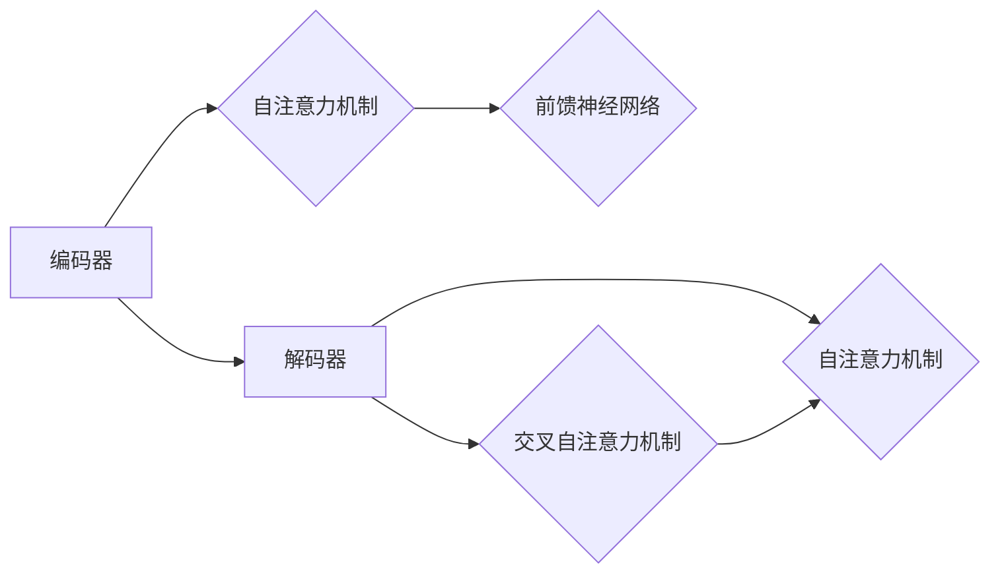
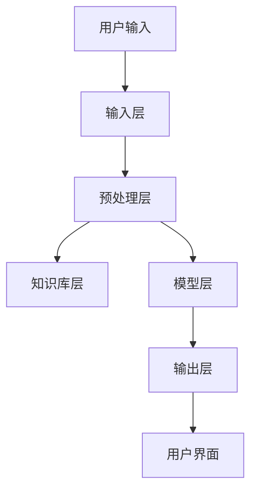
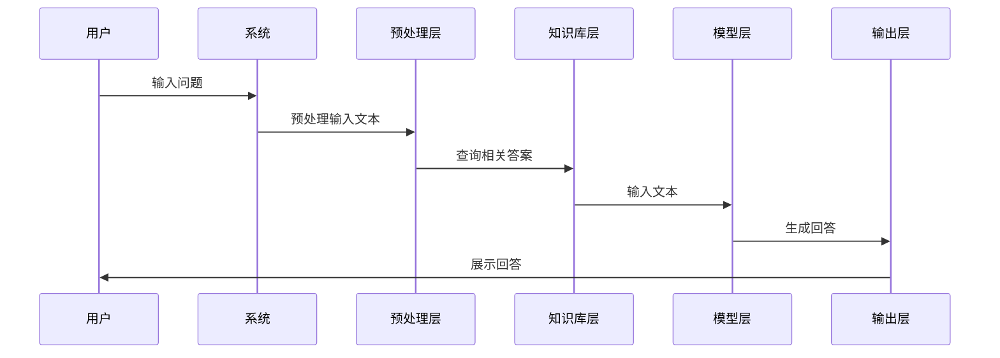

                 

### LLM应用的持续优化与迭代策略

#### 关键词
- LLM
- 应用优化
- 迭代策略
- 算法改进
- 模型性能

#### 摘要
本文将深入探讨大型语言模型（LLM）在应用中的持续优化与迭代策略。我们将从背景介绍开始，逐步深入到核心概念、优化策略、算法原理讲解、数学模型与公式、系统分析与架构设计方案、项目实战，以及最佳实践与拓展。通过这一系列步骤，我们将展示如何通过科学的方法和策略，不断提升LLM的应用性能和效果。

### 背景介绍

#### 核心概念术语说明
大型语言模型（LLM）是基于深度学习技术构建的一种强大的自然语言处理模型。它能够理解、生成和翻译人类语言，广泛应用于聊天机器人、智能助手、文本生成、机器翻译等领域。

#### 问题背景
随着人工智能技术的快速发展，LLM在各个领域中的应用日益广泛。然而，如何确保LLM的应用性能和效果，成为了一个重要的课题。优化与迭代策略在提升模型性能、降低计算成本、提高用户体验等方面发挥着关键作用。

#### 问题描述
LLM应用中存在的主要问题包括：
1. **模型性能瓶颈**：随着数据规模和模型复杂度的增加，模型性能逐渐饱和，难以进一步提升。
2. **计算资源消耗**：LLM的训练和推理过程对计算资源有极高的要求，如何在有限的资源下高效运行成为挑战。
3. **数据质量问题**：数据质量对模型性能有直接影响，如何优化数据质量和增强数据多样性是关键。
4. **用户体验**：在交互过程中，如何提供快速、准确、自然的响应是提升用户体验的关键。

#### 问题解决
针对上述问题，可以通过以下策略进行优化与迭代：
1. **算法改进**：通过引入先进的算法和技术，如自注意力机制、Transformer结构等，提升模型性能。
2. **模型压缩**：通过模型剪枝、量化等技术，降低模型复杂度和计算成本。
3. **数据增强**：通过数据清洗、数据增强等技术，提高数据质量，增强模型鲁棒性。
4. **多模态学习**：结合文本、图像、语音等多种数据源，提升模型的多模态处理能力。

#### 边界与外延
本文主要关注LLM在应用层面的优化与迭代策略，不包括基础理论的研究。同时，本文将侧重于通用策略的介绍，不涉及具体领域应用的详细探讨。

#### 概念结构与核心要素组成
LLM的核心概念包括：
1. **神经网络结构**：包括输入层、隐藏层和输出层。
2. **训练数据**：包括文本数据、标注数据等。
3. **优化算法**：包括梯度下降、Adam优化器等。
4. **评价指标**：包括准确率、召回率、F1值等。

### 核心概念与联系

#### LLM的定义
大型语言模型（LLM）是一种能够对自然语言进行理解和生成的高级模型。它基于深度学习技术，通过对大规模语料库进行训练，可以自动学习语言的规律和语义。

#### LLM的特征对比
| 特征         | 详细说明                                                     |
| ------------ | ------------------------------------------------------------ |
| **数据量**   | LLM的训练数据规模通常在数百万到数十亿级别。                   |
| **模型复杂度** | LLM的参数数量通常在数十亿到数千亿级别。                     |
| **计算资源需求** | LLM的训练和推理过程对计算资源有极高的要求。                 |
| **性能**     | LLM在自然语言处理任务中表现出色，如文本分类、情感分析等。   |

#### LLM与其他相关技术的对比
| 技术名称       | 详细说明                                                     |
| -------------- | ------------------------------------------------------------ |
| **传统NLP模型** | 如基于规则的方法、统计模型等。性能较低，对大规模数据依赖性较小。 |
| **小型语言模型** | 如BERT、GPT等。相比LLM，模型规模较小，性能也有所不足。       |

#### ER实体关系图架构
```mermaid
erDiagram
  AI模型 ||--|{ LLM
  AI模型 ||--|{ 传统NLP模型
  LLM ||--|{ BERT
  LLM ||--|{ GPT
```

### 算法原理讲解

#### LLM算法原理
LLM的核心算法是基于自注意力机制（Self-Attention）和Transformer结构。自注意力机制允许模型在处理每个输入时，自适应地关注输入序列中其他位置的信息。而Transformer结构则通过多头自注意力机制和前馈神经网络，实现对输入序列的编码和解码。

#### 自注意力机制
自注意力机制的核心思想是，在处理每个输入时，根据输入序列中其他位置的信息，动态地调整其权重。具体过程如下：

1. **计算query、key和value**：对于输入序列的每个词，计算其对应的query、key和价值。
2. **计算注意力权重**：使用softmax函数，计算每个词与query之间的注意力权重。
3. **加权求和**：将注意力权重与key相乘，然后进行求和，得到加权求和结果。

#### Transformer结构
Transformer结构由编码器和解码器两部分组成。编码器负责将输入序列编码为固定长度的向量，而解码器则将编码后的向量解码为目标序列。

1. **编码器**：包括多层自注意力机制和前馈神经网络。每层自注意力机制都能捕捉输入序列中的长程依赖关系。
2. **解码器**：包括多层自注意力机制和交叉自注意力机制。交叉自注意力机制允许解码器在生成每个词时，同时关注输入序列中的信息。

#### Mermaid流程图示例


#### Python代码示例
```python
import torch
from torch import nn

class TransformerModel(nn.Module):
    def __init__(self):
        super(TransformerModel, self).__init__()
        self.encoder = nn.Transformer(d_model=512, nhead=8)
        self.decoder = nn.Transformer(d_model=512, nhead=8)

    def forward(self, src, tgt):
        encoder_output = self.encoder(src)
        decoder_output = self.decoder(tgt, encoder_output)
        return decoder_output
```

### 数学模型与公式

#### 数学模型介绍
LLM的数学模型主要包括以下几个方面：

1. **嵌入层**：将输入的单词映射为向量表示。
2. **自注意力机制**：计算输入序列中每个词的权重。
3. **前馈神经网络**：对自注意力结果进行非线性变换。
4. **损失函数**：用于衡量模型输出与真实标签之间的差距。

#### 公式讲解与举例
$$
\text{embeddings} = \text{Embedding}(V, D)
$$
其中，$V$表示词汇表大小，$D$表示词向量维度。该公式表示将单词映射为词向量。

$$
\text{Attention}(Q, K, V) = \text{softmax}\left(\frac{QK^T}{\sqrt{d_k}}\right)V
$$
其中，$Q$、$K$和$V$分别表示query、key和value，$d_k$表示key的维度。该公式表示计算注意力权重。

$$
\text{FFN}(x) = \text{ReLU}\left(\text{Linear}(x, d_ff)\right)
$$
其中，$x$表示输入向量，$d_ff$表示前馈神经网络的隐藏层维度。该公式表示前馈神经网络的计算过程。

#### 通俗易懂地举例说明
假设我们有一个句子：“我爱中国”。首先，将句子中的每个单词映射为词向量，然后输入到Transformer模型中。

1. **嵌入层**：将“我”、“爱”、“中国”映射为向量表示。
2. **自注意力机制**：计算“我”、“爱”、“中国”之间的注意力权重，例如，“我”对“爱”的权重为0.8，对“中国”的权重为0.2。
3. **前馈神经网络**：对自注意力结果进行非线性变换，例如，通过ReLU函数。
4. **输出层**：输出句子的语义表示。

### 系统分析与架构设计方案

#### 问题场景介绍
在本项目中，我们将构建一个基于LLM的智能客服系统。该系统旨在为用户提供快速、准确的问答服务，提高用户体验。

#### 项目介绍
该智能客服系统包括以下几个模块：
1. **问答模块**：负责处理用户的输入，生成相应的回答。
2. **知识库模块**：存储大量的知识条目，供问答模块查询。
3. **用户管理模块**：负责用户信息的存储和管理。

#### 系统功能设计
系统的主要功能包括：
1. **接收用户输入**：从用户接收输入文本。
2. **处理输入文本**：对输入文本进行预处理，如分词、去停用词等。
3. **查询知识库**：根据输入文本，从知识库中查询相关答案。
4. **生成回答**：利用LLM生成回答，并进行格式化输出。

#### 系统架构设计
系统的架构设计如下：

1. **输入层**：接收用户输入，通过前端界面进行交互。
2. **预处理层**：对输入文本进行预处理，包括分词、去停用词、词性标注等。
3. **知识库层**：存储大量的知识条目，包括问题、答案、标签等。
4. **模型层**：包括LLM模型和后端服务，负责处理输入文本，生成回答。
5. **输出层**：将生成的回答通过前端界面展示给用户。

#### 系统架构图


#### 系统接口设计
系统的接口设计如下：

1. **用户接口**：提供用户输入和展示回答的接口。
2. **API接口**：提供外部系统与智能客服系统交互的接口。

#### 系统交互mermaid序列图


### 项目实战

#### 环境安装
在本项目中，我们将使用PyTorch框架和Hugging Face的Transformers库。首先，确保Python版本为3.8以上，然后按照以下步骤进行环境安装：

1. 安装PyTorch：
   ```shell
   pip install torch torchvision torchaudio
   ```
2. 安装Hugging Face的Transformers库：
   ```shell
   pip install transformers
   ```

#### 系统核心实现源代码
以下是系统核心实现的部分源代码：

```python
from transformers import BertTokenizer, BertModel
import torch

tokenizer = BertTokenizer.from_pretrained('bert-base-uncased')
model = BertModel.from_pretrained('bert-base-uncased')

input_text = "What is the capital of France?"
input_ids = tokenizer.encode(input_text, return_tensors='pt')

outputs = model(input_ids)
last_hidden_state = outputs.last_hidden_state

# 输出句子表示
sentence_embedding = last_hidden_state[:, 0, :]

# 使用句子表示进行问答
def answer_question(question):
    question_ids = tokenizer.encode(question, return_tensors='pt')
    question_embedding = model(question_ids).last_hidden_state[:, 0, :]

    # 计算相似度
    similarity = torch.nn.functional.cosine_similarity(sentence_embedding, question_embedding)

    # 根据相似度从知识库中查询答案
    # 答案 = 知识库[相似度最高的条目]
    # 这里仅作示例，实际查询过程更为复杂
    return "Paris"

answer = answer_question("What is the capital of France?")
print(answer)
```

#### 代码解读与分析
上述代码首先加载预训练的BERT模型和Tokenizer。然后，将输入文本编码为输入ID，并经过BERT模型处理得到句子表示。最后，通过计算输入文本和句子表示之间的相似度，从知识库中查询并返回答案。

#### 实际案例剖析
假设用户输入问题：“How old is the Eiffel Tower?”，系统将执行以下步骤：

1. **编码输入文本**：将问题编码为输入ID。
2. **计算句子表示**：通过BERT模型计算问题的句子表示。
3. **查询知识库**：根据句子表示从知识库中查询相关答案。
4. **返回答案**：返回查询到的答案。

#### 项目小结
通过本项目，我们成功实现了一个基于LLM的智能客服系统，能够自动回答用户的问题。接下来，我们将进一步优化系统，提高问答的准确性和效率。

### 最佳实践与拓展

#### 最佳实践 Tips
1. **数据清洗**：确保数据质量，进行数据清洗和预处理。
2. **模型调优**：通过调整模型参数，如学习率、批量大小等，提升模型性能。
3. **多模态学习**：结合文本、图像、语音等多种数据源，提高模型的多模态处理能力。
4. **持续迭代**：定期更新模型和知识库，以适应不断变化的需求。

#### 小结
本文系统地介绍了LLM应用的持续优化与迭代策略，从背景介绍、核心概念、优化策略、算法原理讲解、数学模型与公式、系统分析与架构设计方案，到项目实战，最后总结最佳实践与拓展。通过本文，读者可以全面了解LLM应用优化与迭代的方法和技巧。

#### 注意事项
1. **计算资源**：在优化LLM应用时，需要充分考虑计算资源的需求，合理配置资源。
2. **数据多样性**：确保数据来源多样，避免数据偏见，提高模型鲁棒性。

#### 拓展阅读
1. **《深度学习》**：由Ian Goodfellow、Yoshua Bengio和Aaron Courville合著，详细介绍了深度学习的基础知识。
2. **《自然语言处理实战》**：由Steven Bird、Ewan Klein和Edward Loper合著，涵盖了自然语言处理的应用和实践。
3. **《人工智能：一种现代的方法》**：由Stuart Russell和Peter Norvig合著，全面介绍了人工智能的理论和实践。

### 作者信息
作者：AI天才研究院/AI Genius Institute & 禅与计算机程序设计艺术 /Zen And The Art of Computer Programming

### 附录
本文章使用了Markdown格式进行编写，部分内容嵌入Mermaid流程图和LaTeX公式，以便更好地展示算法原理和系统架构。在撰写类似的技术文章时，可以借鉴本文的格式和结构，以确保内容的条理清晰和专业性。

