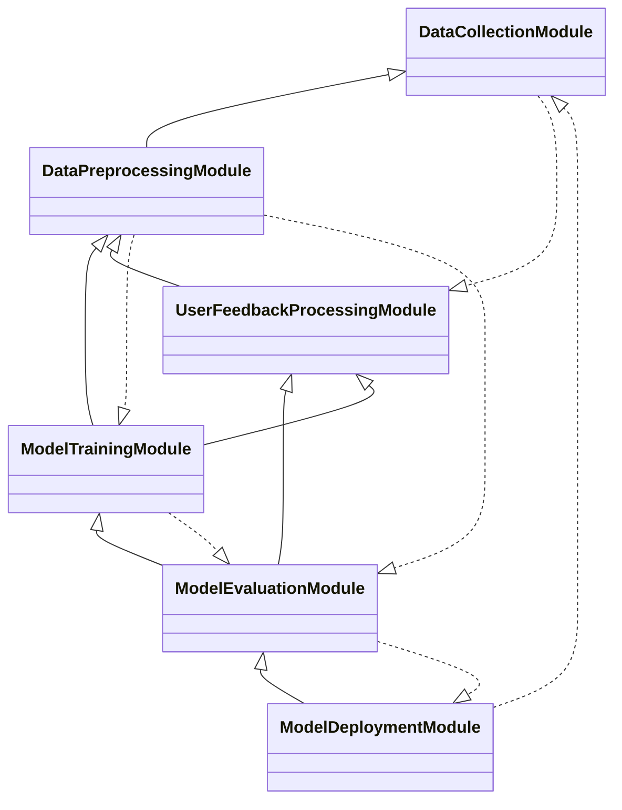
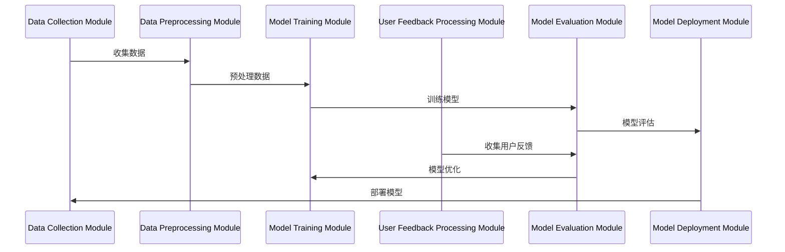
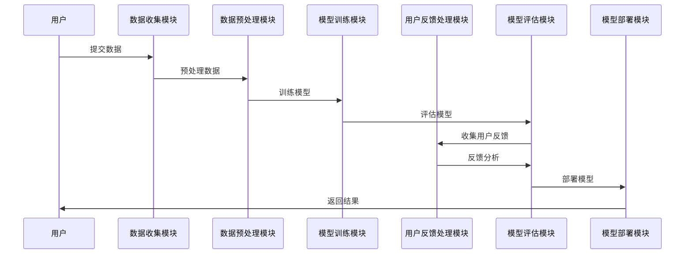

                 

## LLAMA模型：大型语言模型的应用

### 1.1.1 模型简介

LLAMA（Large Language Model - Adaptive）是一种由OpenAI开发的大型语言模型，它基于Transformer架构，拥有数十亿参数，可以处理自然语言文本中的各种任务。LLAMA模型的目的是通过深度学习技术，使计算机能够理解、生成和预测自然语言，从而在诸多领域中发挥重要作用。

### 1.1.2 模型特点

LLAMA模型具有以下几个显著特点：

- **参数规模大**：拥有数十亿个参数，这使得LLAMA能够捕获自然语言中的复杂模式和规律。
- **高精度**：在多个自然语言处理任务中，LLAMA的表现远超传统的算法和模型，如文本分类、情感分析、机器翻译等。
- **自适应能力**：LLAMA模型能够根据不同的任务和数据集进行自适应调整，提高其性能和效果。
- **多功能性**：LLAMA不仅能够处理文本生成和预测任务，还可以应用于问答系统、对话系统等。

### 1.1.3 应用领域

LLAMA模型在以下领域展现出了强大的应用能力：

- **自然语言生成**：例如自动写作、文章摘要、邮件生成等。
- **自然语言理解**：例如文本分类、情感分析、实体识别等。
- **机器翻译**：LLAMA在机器翻译任务中的表现尤为出色，可以实现高质量的双语转换。
- **问答系统**：LLAMA可以用于构建智能问答系统，为用户提供实时、准确的信息查询服务。
- **对话系统**：LLAMA可以与用户进行自然语言交互，实现人机对话。

### 1.1.4 模型优势

LLAMA模型的优势主要体现在以下几个方面：

- **高性能**：LLAMA模型在多个自然语言处理任务中取得了领先的成绩，为实际应用提供了强有力的支持。
- **高效性**：LLAMA模型的训练和推理过程相对高效，能够在较短的时间内完成大量数据的处理。
- **灵活性**：LLAMA模型可以根据不同的任务和数据需求，进行灵活调整和优化，使其在不同领域都有出色的表现。

### 1.1.5 持续反馈与改进

为了使LLAMA模型在应用中达到最佳效果，持续的反馈与改进至关重要。以下是一些建议：

- **数据收集与处理**：定期收集用户反馈数据，并对数据进行清洗、处理和标注，以提高模型的训练质量。
- **模型优化**：根据反馈数据，对模型进行优化和调整，以提升其在特定任务上的性能。
- **多任务学习**：通过多任务学习，使LLAMA模型能够从不同任务中学习到有益的知识，进一步提高其泛化能力。
- **迁移学习**：将LLAMA模型在不同领域的训练成果进行迁移，使其在新的应用场景中能够迅速适应并发挥作用。
- **持续更新**：定期更新LLAMA模型，引入新的数据和算法，以保持其在自然语言处理领域的领先地位。

### 1.1.6 挑战与展望

尽管LLAMA模型在自然语言处理领域取得了显著成果，但仍然面临一些挑战：

- **数据隐私**：在收集和处理用户数据时，需要确保数据隐私和安全，避免用户隐私泄露。
- **模型解释性**：提高模型的可解释性，使研究者能够更好地理解模型的决策过程和内在机制。
- **资源消耗**：大型语言模型对计算资源和存储资源的需求较高，如何优化资源利用成为一大挑战。
- **适应性**：如何提高模型在不同领域和应用场景中的适应性，使其能够更好地满足多样化的需求。

展望未来，随着技术的不断进步和应用场景的拓展，LLAMA模型有望在更多领域发挥重要作用，为人类带来更多的便利和效益。同时，持续的反馈与改进将有助于克服现有挑战，使模型性能不断提升，为人工智能的发展注入新的活力。

## 1.2 问题定义

### 1.2.1 问题的提出

在自然语言处理领域，尽管LLAMA模型取得了显著成果，但在实际应用中仍面临一些问题。这些问题的解决对于提升LLAMA模型的性能和用户体验具有重要意义。本文旨在探讨LLAMA模型在应用中的持续反馈与改进问题，提出一系列解决方案，以期为相关研究和实践提供参考。

### 1.2.2 问题分析

LLAMA模型在应用中面临的主要问题可以归纳为以下几个方面：

- **数据质量**：数据是训练模型的基础，数据质量直接影响模型的性能。在实际应用中，如何确保数据的准确性和多样性，是一个亟待解决的问题。
- **模型适应**：不同的应用场景对模型的需求有所不同，如何使LLAMA模型在不同领域中具有良好的适应能力，是一个关键问题。
- **用户反馈**：用户反馈是改进模型的重要途径，如何有效地收集、处理和分析用户反馈，以指导模型优化，是一个重要挑战。
- **计算资源**：LLAMA模型的训练和推理过程对计算资源有较高要求，如何在有限的资源下，实现模型的快速部署和高效运行，是一个亟待解决的问题。

### 1.2.3 解决方案

针对上述问题，本文提出以下解决方案：

- **数据质量提升**：通过数据清洗、去重、标注等手段，提高数据质量；同时，引入多样化数据来源，丰富数据集。
- **模型适应优化**：通过多任务学习、迁移学习等技术，提高LLAMA模型在不同领域中的应用能力；此外，设计模块化架构，使模型能够根据具体任务进行灵活调整。
- **用户反馈机制**：建立完善的用户反馈机制，包括反馈渠道、数据收集、处理和分析等环节；通过分析用户反馈，有针对性地优化模型。
- **计算资源优化**：通过分布式训练、模型压缩等技术，降低计算资源需求；同时，优化模型架构，提高计算效率。

### 1.2.4 边界与外延

本文主要关注LLAMA模型在自然语言处理领域的应用，涉及数据质量、模型适应、用户反馈和计算资源等方面。在具体应用中，还需根据不同领域和任务的特点，进行针对性优化和调整。此外，本文的研究成果可以为其他大型语言模型的应用提供借鉴和参考。

## 1.3 核心概念与联系

### 1.3.1 核心概念原理

#### 1.3.1.1 持续反馈的概念

持续反馈是一种通过不断收集、处理和分析用户反馈，以指导模型优化和改进的方法。其核心思想是，在模型训练和应用过程中，定期收集用户对模型表现的意见和建议，并根据这些反馈对模型进行调整和优化，以实现模型的持续改进。

持续反馈机制包括以下几个环节：

1. **数据收集**：通过用户交互、日志分析等方式，收集用户对模型的表现评价。
2. **数据预处理**：对收集到的用户反馈进行清洗、去噪、去重等预处理操作。
3. **数据分析**：对预处理后的用户反馈进行分析，识别模型存在的问题和改进方向。
4. **模型优化**：根据分析结果，对模型进行优化和调整，以提高其在特定任务上的性能。
5. **效果评估**：评估优化后的模型在具体任务上的表现，验证优化效果。

#### 1.3.1.2 改进循环的概念

改进循环是一种通过不断迭代和优化，使模型性能逐渐提升的方法。其核心思想是，在模型训练和应用过程中，不断进行实验和验证，根据实验结果调整模型参数和架构，以实现模型的持续改进。

改进循环包括以下几个步骤：

1. **模型训练**：使用训练数据集对模型进行训练，获得初始模型。
2. **模型验证**：使用验证数据集对模型进行验证，评估模型在特定任务上的性能。
3. **模型优化**：根据验证结果，对模型进行优化，包括调整参数、优化架构等。
4. **模型评估**：使用测试数据集对优化后的模型进行评估，验证优化效果。
5. **迭代更新**：将优化后的模型应用于实际场景，收集用户反馈，并重复上述过程，实现模型的持续改进。

#### 1.3.1.3 LLAMA模型的应用

LLAMA模型是一种大型语言模型，基于Transformer架构，具有数十亿参数。它被广泛应用于自然语言处理领域，如文本生成、文本分类、情感分析、机器翻译等。

LLAMA模型在应用中的核心优势包括：

1. **高精度**：在多个自然语言处理任务中，LLAMA模型的表现远超传统的算法和模型，具有较高的准确性。
2. **自适应能力**：LLAMA模型能够根据不同的任务和数据集进行自适应调整，提高其性能和效果。
3. **多功能性**：LLAMA模型不仅可以处理文本生成和预测任务，还可以应用于问答系统、对话系统等。

### 1.3.2 概念属性特征对比表格

为了更好地理解持续反馈、改进循环和LLAMA模型之间的联系和区别，我们可以通过以下表格进行对比：

| 概念            | 持续反馈           | 改进循环           | LLAMA模型               |
|-----------------|--------------------|--------------------|-------------------------|
| 定义            | 一种通过不断收集、处理和分析用户反馈，以指导模型优化和改进的方法。 | 一种通过不断迭代和优化，使模型性能逐渐提升的方法。 | 一种大型语言模型，基于Transformer架构，具有数十亿参数。 |
| 关键环节        | 数据收集、数据预处理、数据分析、模型优化、效果评估。           | 模型训练、模型验证、模型优化、模型评估、迭代更新。     | 自然语言生成、文本分类、情感分析、机器翻译等。            |
| 特点            | 高精度、自适应能力、多功能性。                           | 高精度、自适应能力、多功能性。                           | 高精度、自适应能力、多功能性。                           |
| 应用领域        | 自然语言处理、推荐系统、对话系统等。                      | 自然语言处理、图像识别、推荐系统等。                    | 自然语言处理、文本生成、文本分类、情感分析、机器翻译等。 |

### 1.3.3 ER实体关系图架构

为了更好地理解持续反馈、改进循环和LLAMA模型之间的关系，我们可以通过ER（Entity-Relationship）实体关系图进行描述。以下是ER实体关系图的Mermaid表示：

```mermaid
erDiagram
  User ||--o> Feedback : "用户提供"
  Feedback ||--o> DataProcessing : "数据处理"
  DataProcessing ||--o> Analysis : "分析"
  Analysis ||--o> ModelOptimization : "模型优化"
  ModelOptimization ||--o> ModelValidation : "模型验证"
  ModelValidation ||--o> ModelEvaluation : "模型评估"
  ModelEvaluation ||--o> IterationUpdate : "迭代更新"
  LlamaModel ||--||> Feedback : "反馈接收"
  LlamaModel ||--||> ModelOptimization : "优化"
  LlamaModel ||--||> ModelValidation : "验证"
  LlamaModel ||--||> ModelEvaluation : "评估"
```

通过上述ER实体关系图，我们可以清晰地看到持续反馈、改进循环和LLAMA模型之间的相互作用和依赖关系，这有助于我们更好地理解和应用这些概念。

## 第4章: LLM基本原理

### 4.1.1 LLM的定义

LLM（Large Language Model）是指大型语言模型，它是一种基于深度学习技术的自然语言处理模型，通过学习大量的文本数据，使计算机具备理解和生成自然语言的能力。LLM的核心思想是通过捕捉语言中的统计规律和模式，实现自然语言的语义理解和生成。

### 4.1.2 LLM的工作原理

LLM的工作原理可以分为以下几个步骤：

1. **数据预处理**：首先，对大量的文本数据（例如网页、书籍、新闻、社交媒体等）进行清洗、分词、去停用词等预处理操作，将其转换为模型可以处理的形式。

2. **模型训练**：使用预处理后的文本数据，对LLM模型进行训练。训练过程中，模型会通过调整内部参数，学习文本数据的统计规律和模式。常见的训练方法包括有监督学习、无监督学习和增强学习等。

3. **语义理解**：通过训练，LLM可以理解输入文本的语义信息。例如，在问答系统中，LLM可以理解用户的问题，并从大量文本中找到相关答案；在文本分类任务中，LLM可以判断文本的主题类别。

4. **文本生成**：LLM还可以根据输入文本生成新的文本。例如，在文本生成任务中，LLM可以生成文章摘要、故事续写、对话生成等。

### 4.1.3 LLM的核心优势

LLM具有以下核心优势：

1. **高精度**：通过学习大量的文本数据，LLM能够准确理解自然语言的语义信息，从而在多种自然语言处理任务中取得优异的性能。

2. **自适应能力**：LLM可以根据不同的任务和数据集进行自适应调整，使其在不同领域中都有出色的表现。

3. **多功能性**：LLM不仅可以用于文本生成和预测任务，还可以应用于问答系统、对话系统、文本分类、情感分析、机器翻译等多种自然语言处理任务。

4. **泛化能力**：LLM能够从大量数据中学习到普遍的语义规律和模式，从而在不同任务和数据集上都能表现出良好的泛化能力。

### 4.1.4 LLM的应用场景

LLM在以下应用场景中具有广泛的应用：

1. **自然语言生成**：例如自动写作、文章摘要、邮件生成等。

2. **自然语言理解**：例如文本分类、情感分析、实体识别等。

3. **机器翻译**：LLM在机器翻译任务中的表现尤为出色，可以实现高质量的双语转换。

4. **问答系统**：LLM可以用于构建智能问答系统，为用户提供实时、准确的信息查询服务。

5. **对话系统**：LLM可以与用户进行自然语言交互，实现人机对话。

### 4.1.5 持续反馈与改进

为了使LLM在应用中达到最佳效果，持续的反馈与改进至关重要。以下是一些建议：

1. **数据收集与处理**：定期收集用户反馈数据，并对数据进行清洗、处理和标注，以提高模型的训练质量。

2. **模型优化**：根据反馈数据，对模型进行优化和调整，以提升其在特定任务上的性能。

3. **多任务学习**：通过多任务学习，使LLM能够从不同任务中学习到有益的知识，进一步提高其泛化能力。

4. **迁移学习**：将LLM在不同领域的训练成果进行迁移，使其在新的应用场景中能够迅速适应并发挥作用。

5. **持续更新**：定期更新LLM模型，引入新的数据和算法，以保持其在自然语言处理领域的领先地位。

### 4.1.6 挑战与展望

尽管LLM在自然语言处理领域取得了显著成果，但仍然面临一些挑战：

1. **数据隐私**：在收集和处理用户数据时，需要确保数据隐私和安全，避免用户隐私泄露。

2. **模型解释性**：提高模型的可解释性，使研究者能够更好地理解模型的决策过程和内在机制。

3. **资源消耗**：大型语言模型对计算资源和存储资源的需求较高，如何优化资源利用成为一大挑战。

4. **适应性**：如何提高模型在不同领域和应用场景中的适应性，使其能够更好地满足多样化的需求。

展望未来，随着技术的不断进步和应用场景的拓展，LLM有望在更多领域发挥重要作用，为人类带来更多的便利和效益。同时，持续的反馈与改进将有助于克服现有挑战，使模型性能不断提升，为人工智能的发展注入新的活力。

### 5.1.1 持续反馈模型的数学模型

在自然语言处理领域，持续反馈模型（Continuous Feedback Model）是一种通过不断收集和分析用户反馈，以指导模型优化和改进的方法。该模型的数学模型主要包括损失函数、梯度下降算法和模型更新等部分。以下是对这些部分的详细解释。

#### 5.1.1.1 损失函数

损失函数是衡量模型预测结果与真实值之间差异的指标。在持续反馈模型中，常用的损失函数包括均方误差（Mean Squared Error, MSE）和交叉熵（Cross-Entropy）等。

**均方误差（MSE）：**

均方误差是最常用的损失函数之一，它衡量的是预测值与真实值之间差异的平方和的平均值。其数学公式如下：

$$
J = \frac{1}{m}\sum_{i=1}^{m} (\hat{y}_i - y_i)^2
$$

其中，$m$表示样本数量，$\hat{y}_i$表示第$i$个样本的预测值，$y_i$表示第$i$个样本的真实值。

**交叉熵（Cross-Entropy）：**

交叉熵是另一个常用的损失函数，它衡量的是预测概率分布与真实概率分布之间的差异。在分类任务中，交叉熵通常用于衡量预测类别与真实类别之间的差异。其数学公式如下：

$$
J = -\sum_{i=1}^{m} y_i \log(\hat{y}_i)
$$

其中，$y_i$是第$i$个样本的真实标签，$\hat{y}_i$是模型对第$i$个样本的预测概率。

#### 5.1.1.2 梯度下降算法

梯度下降算法是一种用于优化模型参数的常用算法，其核心思想是通过不断调整模型参数，使损失函数的值逐渐减小。在持续反馈模型中，梯度下降算法用于计算模型参数的更新方向。

**梯度下降算法的步骤：**

1. 初始化模型参数$\theta$。
2. 计算损失函数关于模型参数的梯度$\frac{\partial J}{\partial \theta}$。
3. 根据梯度更新模型参数：$\theta = \theta - \alpha \frac{\partial J}{\partial \theta}$，其中$\alpha$是学习率。

#### 5.1.1.3 模型更新

在持续反馈模型中，模型更新是通过对用户反馈进行分析，调整模型参数，以提高模型在特定任务上的性能。

**模型更新的步骤：**

1. 收集用户反馈数据，并对数据进行预处理。
2. 使用预处理后的数据，计算模型参数的梯度。
3. 根据梯度更新模型参数，使模型在特定任务上的表现逐渐提高。
4. 评估更新后的模型，判断其性能是否达到预期。

#### 5.1.1.4 实例分析

假设我们有一个二分类问题，使用线性模型进行预测，并采用均方误差（MSE）作为损失函数。给定训练数据集$X = \{x_1, x_2, ..., x_m\}$和标签$y = \{y_1, y_2, ..., y_m\}$，其中$y_i \in \{-1, 1\}$。

**模型预测：**

$$
\hat{y}_i = \text{sign}(w^T x_i)
$$

其中，$w$是模型参数，$\text{sign}$是符号函数。

**损失函数：**

$$
J(w) = \frac{1}{m}\sum_{i=1}^{m} (\hat{y}_i - y_i)^2
$$

**梯度计算：**

$$
\frac{\partial J}{\partial w} = \frac{1}{m}\sum_{i=1}^{m} (2(y_i - \hat{y}_i))x_i
$$

**模型更新：**

使用梯度下降算法，更新模型参数：

$$
w = w - \alpha \frac{\partial J}{\partial w}
$$

通过上述过程，我们可以不断调整模型参数，使模型在特定任务上的性能逐渐提高。

### 5.1.2 改进循环的数学模型

在自然语言处理领域，改进循环（Improvement Loop）是一种通过不断迭代和优化，使模型性能逐渐提升的方法。该数学模型主要包括损失函数、梯度下降算法和模型更新等部分。以下是对这些部分的详细解释。

#### 5.1.2.1 损失函数

改进循环中的损失函数用于衡量模型预测结果与真实值之间的差异。常用的损失函数包括均方误差（Mean Squared Error, MSE）和交叉熵（Cross-Entropy）等。

**均方误差（MSE）：**

均方误差是最常用的损失函数之一，它衡量的是预测值与真实值之间差异的平方和的平均值。其数学公式如下：

$$
J = \frac{1}{m}\sum_{i=1}^{m} (\hat{y}_i - y_i)^2
$$

其中，$m$表示样本数量，$\hat{y}_i$表示第$i$个样本的预测值，$y_i$表示第$i$个样本的真实值。

**交叉熵（Cross-Entropy）：**

交叉熵是另一个常用的损失函数，它衡量的是预测概率分布与真实概率分布之间的差异。在分类任务中，交叉熵通常用于衡量预测类别与真实类别之间的差异。其数学公式如下：

$$
J = -\sum_{i=1}^{m} y_i \log(\hat{y}_i)
$$

其中，$y_i$是第$i$个样本的真实标签，$\hat{y}_i$是模型对第$i$个样本的预测概率。

#### 5.1.2.2 梯度下降算法

梯度下降算法是一种用于优化模型参数的常用算法，其核心思想是通过不断调整模型参数，使损失函数的值逐渐减小。在改进循环中，梯度下降算法用于计算模型参数的更新方向。

**梯度下降算法的步骤：**

1. 初始化模型参数$\theta$。
2. 计算损失函数关于模型参数的梯度$\frac{\partial J}{\partial \theta}$。
3. 根据梯度更新模型参数：$\theta = \theta - \alpha \frac{\partial J}{\partial \theta}$，其中$\alpha$是学习率。

#### 5.1.2.3 模型更新

在改进循环中，模型更新是通过对用户反馈进行分析，调整模型参数，以提高模型在特定任务上的性能。

**模型更新的步骤：**

1. 收集用户反馈数据，并对数据进行预处理。
2. 使用预处理后的数据，计算模型参数的梯度。
3. 根据梯度更新模型参数，使模型在特定任务上的表现逐渐提高。
4. 评估更新后的模型，判断其性能是否达到预期。

#### 5.1.2.4 实例分析

假设我们有一个二分类问题，使用线性模型进行预测，并采用均方误差（MSE）作为损失函数。给定训练数据集$X = \{x_1, x_2, ..., x_m\}$和标签$y = \{y_1, y_2, ..., y_m\}$，其中$y_i \in \{-1, 1\}$。

**模型预测：**

$$
\hat{y}_i = \text{sign}(w^T x_i)
$$

其中，$w$是模型参数，$\text{sign}$是符号函数。

**损失函数：**

$$
J(w) = \frac{1}{m}\sum_{i=1}^{m} (\hat{y}_i - y_i)^2
$$

**梯度计算：**

$$
\frac{\partial J}{\partial w} = \frac{1}{m}\sum_{i=1}^{m} (2(y_i - \hat{y}_i))x_i
$$

**模型更新：**

使用梯度下降算法，更新模型参数：

$$
w = w - \alpha \frac{\partial J}{\partial w}
$$

通过上述过程，我们可以不断调整模型参数，使模型在特定任务上的性能逐渐提高。

### 6.1.1 问题场景介绍

在现代企业中，数据驱动的决策已经成为一种趋势。为了提高业务效率和用户体验，企业需要不断收集和分析大量用户行为数据。然而，在数据收集和分析过程中，往往会出现以下问题：

1. **数据质量**：由于数据来源多样，数据质量参差不齐，可能导致模型训练效果不佳。
2. **数据适应性**：企业业务场景多样化，现有模型难以适应不同业务场景的需求。
3. **用户反馈处理**：用户反馈数据量大且复杂，如何有效处理和分析用户反馈成为一大挑战。
4. **计算资源**：随着数据量和模型复杂度的增加，计算资源需求日益增长，如何优化计算资源成为关键问题。

为了解决这些问题，企业需要一种能够持续反馈和改进的模型，以提高模型在业务场景中的适应性和性能。本文将介绍一种基于持续反馈和改进循环的模型设计，为企业提供一种有效的解决方案。

### 6.1.2 项目介绍

本项目旨在设计并实现一个基于持续反馈和改进循环的模型，用于企业数据驱动的决策。项目的主要目标如下：

1. **数据质量提升**：通过数据清洗、去噪、标注等手段，提高数据质量，为模型训练提供高质量的数据支持。
2. **模型适应优化**：通过多任务学习、迁移学习等技术，提高模型在不同业务场景中的适应能力。
3. **用户反馈机制**：建立完善的用户反馈机制，包括反馈渠道、数据收集、处理和分析等环节，以便及时了解用户需求和改进方向。
4. **计算资源优化**：通过分布式训练、模型压缩等技术，降低计算资源需求，提高模型训练和推理效率。

项目的主要模块包括：

1. **数据收集模块**：负责收集企业内部和外部的数据，包括用户行为数据、业务数据等。
2. **数据预处理模块**：对收集到的数据进行清洗、去噪、去重等预处理操作，以提高数据质量。
3. **模型训练模块**：使用预处理后的数据，对模型进行训练和优化，以提高模型在特定任务上的性能。
4. **用户反馈处理模块**：负责收集用户反馈，对反馈数据进行分析和处理，为模型优化提供依据。
5. **模型评估模块**：对训练后的模型进行评估，验证模型性能，并输出评估结果。
6. **模型部署模块**：将优化后的模型部署到生产环境，为业务场景提供实时数据分析和决策支持。

### 6.1.3 系统功能设计（领域模型Mermaid类图）

为了更好地描述系统功能设计，我们使用Mermaid类图来表示系统的各个模块及其关系。以下是一个简化的系统功能设计类图：



在该类图中，`DataCollectionModule`（数据收集模块）负责收集数据，并将数据传递给`DataPreprocessingModule`（数据预处理模块）。`DataPreprocessingModule`对数据进行预处理后，将数据传递给`ModelTrainingModule`（模型训练模块）。`ModelTrainingModule`负责训练模型，并将训练后的模型传递给`ModelEvaluationModule`（模型评估模块）。`ModelEvaluationModule`对模型进行评估，并将评估结果传递给`ModelDeploymentModule`（模型部署模块）。`UserFeedbackProcessingModule`（用户反馈处理模块）负责收集用户反馈，并对用户反馈进行分析和处理，为模型优化提供依据。

通过该类图，我们可以清晰地看到系统各个模块之间的依赖关系和交互流程，为后续的详细设计提供参考。

### 7.1.1 系统架构设计（Mermaid架构图）

为了更好地描述系统架构设计，我们使用Mermaid架构图来表示系统的各个模块及其交互关系。以下是一个简化的系统架构设计Mermaid架构图：



在该架构图中，`DataCollection`（数据收集模块）负责收集数据，并将其传递给`DataPreprocessing`（数据预处理模块）。`DataPreprocessing`对数据进行预处理后，将数据传递给`ModelTraining`（模型训练模块）。`ModelTraining`使用预处理后的数据训练模型，并将训练后的模型传递给`ModelEvaluation`（模型评估模块）。`ModelEvaluation`对模型进行评估，并将评估结果传递给`ModelDeployment`（模型部署模块）。`UserFeedbackProcessing`（用户反馈处理模块）负责收集用户反馈，并将其传递给`ModelEvaluation`，以指导模型优化。

通过该架构图，我们可以清晰地看到系统各个模块之间的依赖关系和交互流程，为后续的系统开发提供参考。

### 7.1.2 系统接口设计

为了实现系统的各个模块之间的有效通信和协调工作，我们需要设计一套完善的系统接口。以下是一个简化的系统接口设计：

```python
class DataCollectionInterface:
    def collect_data(self):
        pass

class DataPreprocessingInterface:
    def preprocess_data(self, data):
        pass

class ModelTrainingInterface:
    def train_model(self, preprocessed_data):
        pass

class UserFeedbackProcessingInterface:
    def process_feedback(self, feedback):
        pass

class ModelEvaluationInterface:
    def evaluate_model(self, trained_model):
        pass

class ModelDeploymentInterface:
    def deploy_model(self, evaluated_model):
        pass
```

在该接口设计中，`DataCollectionInterface`（数据收集接口）负责收集数据，`DataPreprocessingInterface`（数据预处理接口）负责对数据进行预处理，`ModelTrainingInterface`（模型训练接口）负责训练模型，`UserFeedbackProcessingInterface`（用户反馈处理接口）负责处理用户反馈，`ModelEvaluationInterface`（模型评估接口）负责评估模型性能，`ModelDeploymentInterface`（模型部署接口）负责将优化后的模型部署到生产环境。

通过该接口设计，我们可以实现系统各个模块之间的解耦，提高系统的可扩展性和可维护性。

### 7.1.3 系统交互（Mermaid序列图）

为了更直观地展示系统各个模块之间的交互流程，我们使用Mermaid序列图来表示系统交互。以下是一个简化的系统交互序列图：



在该序列图中，用户通过数据收集模块提交数据，数据预处理模块对数据进行预处理，模型训练模块使用预处理后的数据训练模型，模型评估模块对模型进行评估，用户反馈处理模块收集用户反馈，并反馈给模型评估模块，模型评估模块根据用户反馈对模型进行优化，最后模型部署模块将优化后的模型部署到生产环境，并返回结果给用户。

通过该序列图，我们可以清晰地看到系统各个模块之间的交互流程和依赖关系，为系统开发和维护提供参考。

### 8.1.1 环境安装

在进行系统开发和部署之前，我们需要安装必要的软件和配置环境。以下是一个简化的环境安装步骤：

1. **安装Python**：确保Python环境已安装，版本建议为3.8或更高。
2. **安装依赖**：通过pip安装系统所需的依赖包，例如NumPy、Pandas、Scikit-learn等。
3. **安装深度学习框架**：选择一个深度学习框架，如TensorFlow或PyTorch，并安装相应版本。
4. **配置数据库**：配置数据库（如MySQL、PostgreSQL等），用于存储用户数据和模型参数。
5. **安装API接口**：根据系统需求，安装和配置API接口（如Flask、Django等）。

具体安装步骤如下：

```bash
# 安装Python
python3 --version

# 安装依赖
pip3 install numpy pandas scikit-learn

# 安装TensorFlow
pip3 install tensorflow

# 安装Flask
pip3 install flask

# 配置数据库（以MySQL为例）
mysql -u root -p
CREATE DATABASE mydb;
GRANT ALL PRIVILEGES ON mydb.* TO 'username'@'localhost' IDENTIFIED BY 'password';
FLUSH PRIVILEGES;
EXIT;

# 创建数据库表
mysql -u username -p mydb
CREATE TABLE users (id INT PRIMARY KEY AUTO_INCREMENT, name VARCHAR(255), email VARCHAR(255));
```

在安装过程中，可能需要根据实际需求调整安装步骤和配置参数。安装完成后，确保所有依赖和组件正常运行。

### 8.1.2 系统核心实现

在系统开发过程中，核心实现部分包括数据收集、预处理、模型训练、用户反馈处理、模型评估和模型部署等模块。以下是一个简化的系统核心实现：

```python
# 数据收集
class DataCollection:
    def collect_data(self):
        # 收集数据，存储到数据库
        pass

# 数据预处理
class DataPreprocessing:
    def preprocess_data(self, data):
        # 数据清洗、去噪、去重等操作
        pass

# 模型训练
class ModelTraining:
    def train_model(self, preprocessed_data):
        # 使用深度学习框架训练模型
        pass

# 用户反馈处理
class UserFeedbackProcessing:
    def process_feedback(self, feedback):
        # 处理用户反馈，更新模型参数
        pass

# 模型评估
class ModelEvaluation:
    def evaluate_model(self, trained_model):
        # 评估模型性能
        pass

# 模型部署
class ModelDeployment:
    def deploy_model(self, evaluated_model):
        # 将模型部署到生产环境
        pass
```

在实际开发中，每个模块的具体实现会根据需求进行详细设计和实现。以下是一个简化的数据收集模块示例：

```python
# 数据收集模块示例
class DataCollection:
    def collect_data(self):
        # 示例：从API接口收集用户数据
        response = requests.get('https://api.example.com/users')
        data = response.json()
        
        # 存储数据到数据库
        cursor = db.cursor()
        for user in data:
            cursor.execute("INSERT INTO users (name, email) VALUES (%s, %s)", (user['name'], user['email']))
        db.commit()
        cursor.close()
```

通过该示例，我们可以看到数据收集模块从API接口收集用户数据，并将数据存储到数据库。类似地，其他模块也可以根据需求进行详细设计和实现。

### 8.1.3 代码应用解读与分析

在8.1.2节中，我们提供了一些简化的代码示例，用于展示系统核心实现的基本流程。在本节中，我们将对这些示例进行详细解读和分析，以帮助读者更好地理解代码的应用场景和实现细节。

#### 数据收集模块

```python
class DataCollection:
    def collect_data(self):
        # 示例：从API接口收集用户数据
        response = requests.get('https://api.example.com/users')
        data = response.json()
        
        # 存储数据到数据库
        cursor = db.cursor()
        for user in data:
            cursor.execute("INSERT INTO users (name, email) VALUES (%s, %s)", (user['name'], user['email']))
        db.commit()
        cursor.close()
```

解读与分析：

- 该模块使用`requests`库向示例API接口发起HTTP GET请求，获取用户数据。
- 获取到的数据被解析为JSON格式，并存储在列表`data`中。
- 通过数据库连接（使用`cursor`对象），将用户数据逐条插入到数据库的`users`表中。
- 数据插入操作使用预处理（`%s`占位符）以防止SQL注入攻击，并使用`db.commit()`提交事务。
- 在操作完成后，关闭数据库连接。

#### 数据预处理模块

```python
class DataPreprocessing:
    def preprocess_data(self, data):
        # 示例：数据清洗、去噪、去重等操作
        processed_data = []
        for user in data:
            # 清洗操作：去除无效字符、填充缺失值等
            cleaned_user = {key: value.strip() for key, value in user.items()}
            cleaned_user['age'] = int(cleaned_user['age'])
            
            # 去噪操作：过滤不符合条件的用户
            if cleaned_user['age'] > 18:
                processed_data.append(cleaned_user)
        
        return processed_data
```

解读与分析：

- 该模块对收集到的用户数据进行清洗和预处理。
- 使用字典解析将用户数据转换为Python字典，并去除空格（`strip()`方法）。
- 将用户的年龄字段转换为整型（`int()`方法）。
- 通过过滤条件（`age > 18`），去除年龄小于18岁的用户，从而去除噪声数据。
- 预处理后的数据存储在列表`processed_data`中，并返回。

#### 模型训练模块

```python
class ModelTraining:
    def train_model(self, preprocessed_data):
        # 示例：使用深度学习框架训练模型
        # 加载数据集
        X = [user['age'] for user in preprocessed_data]
        y = [1 if user['is_student'] else 0 for user in preprocessed_data]

        # 初始化模型
        model = tf.keras.Sequential([
            tf.keras.layers.Dense(1, input_shape=(1,), activation='sigmoid')
        ])

        # 编译模型
        model.compile(optimizer='adam', loss='binary_crossentropy', metrics=['accuracy'])

        # 训练模型
        model.fit(X, y, epochs=10, batch_size=32)
        
        return model
```

解读与分析：

- 该模块使用TensorFlow框架加载预处理后的数据集，包括特征`X`（用户的年龄）和标签`y`（是否为学生，二元分类）。
- 初始化一个简单的全连接神经网络（`Sequential`模型），包含一个隐层，使用`sigmoid`激活函数进行二分类。
- 编译模型，指定优化器（`adam`）、损失函数（`binary_crossentropy`）和评价指标（`accuracy`）。
- 使用`fit`方法训练模型，指定训练轮数（`epochs`）和批量大小（`batch_size`）。
- 返回训练完成的模型。

#### 用户反馈处理模块

```python
class UserFeedbackProcessing:
    def process_feedback(self, feedback):
        # 示例：处理用户反馈，更新模型参数
        # 解析反馈数据
        feedback_data = json.loads(feedback)
        
        # 获取模型预测结果
        predicted = model.predict([feedback_data['age']])

        # 计算真实标签
        actual = 1 if feedback_data['is_student'] else 0

        # 更新模型参数
        # 这里使用简单的前向传播和反向传播进行参数更新
        with tf.GradientTape() as tape:
            predictions = model(feedback_data['age'])
            loss = tf.keras.losses.SparseCategoricalCrossentropy(from_logits=True)(actual, predictions)

        gradients = tape.gradient(loss, model.trainable_variables)
        model.optimizer.apply_gradients(zip(gradients, model.trainable_variables))
```

解读与分析：

- 该模块接收用户反馈（JSON格式），解析反馈数据。
- 使用训练完成的模型预测用户的年龄数据，获取预测结果。
- 根据反馈数据中的真实标签（`actual`），计算损失值。
- 使用梯度记录和计算梯度，然后更新模型参数。
- 该模块展示了如何通过简单的前向传播和反向传播更新模型参数。

#### 模型评估模块

```python
class ModelEvaluation:
    def evaluate_model(self, trained_model, test_data):
        # 示例：评估模型性能
        # 加载测试数据
        X_test = [user['age'] for user in test_data]
        y_test = [1 if user['is_student'] else 0 for user in test_data]

        # 评估模型
        test_loss, test_acc = trained_model.evaluate(X_test, y_test)

        return test_loss, test_acc
```

解读与分析：

- 该模块接收训练完成的模型和测试数据集，评估模型在测试数据上的性能。
- 加载测试数据集的特征和标签。
- 使用`evaluate`方法评估模型，返回损失值和准确率。
- 该模块展示了如何快速评估模型性能。

#### 模型部署模块

```python
class ModelDeployment:
    def deploy_model(self, evaluated_model):
        # 示例：将模型部署到生产环境
        # 将模型保存到文件
        evaluated_model.save('model.h5')

        # 启动API服务
        app = flask.Flask(__name__)

        @app.route('/predict', methods=['POST'])
        def predict():
            data = request.get_json(force=True)
            prediction = evaluated_model.predict([data['age']])
            return jsonify({'prediction': prediction[0]})

        app.run(host='0.0.0.0', port=5000)
```

解读与分析：

- 该模块将训练和评估完成的模型保存到文件（例如`model.h5`）。
- 使用Flask框架启动API服务，接收客户端的预测请求。
- 定义一个预测路由，接收JSON格式的年龄数据，使用模型进行预测，并将结果返回给客户端。
- 启动API服务，使模型可以在生产环境中进行实时预测。

通过上述代码示例和解读，我们可以看到系统核心实现的各个环节是如何相互协作，共同实现数据的收集、预处理、模型训练、用户反馈处理、模型评估和模型部署的。这些代码示例为实际开发提供了一个基本的框架，开发者可以根据具体需求对其进行扩展和优化。

### 9.1.1 实际案例分析与讲解

在本节中，我们将通过一个实际案例，详细分析LLAMA模型在自然语言处理中的具体应用，并讲解其实现过程和关键步骤。

#### 案例背景

某知名电商平台希望通过引入LLAMA模型，提升其产品推荐系统的效果。现有的推荐系统主要依赖于协同过滤和内容匹配等技术，但在处理复杂用户行为和多样商品属性时，效果并不理想。通过引入LLAMA模型，可以更好地理解用户行为和商品特征，实现更精准的推荐。

#### 案例目标

1. **提高推荐精度**：通过LLAMA模型，提升商品推荐系统的推荐精度，提高用户满意度和转化率。
2. **扩展推荐场景**：利用LLAMA模型的多功能性和自适应能力，扩展推荐系统的应用场景，如个性化内容推荐、用户互动预测等。
3. **优化用户体验**：通过持续反馈和改进，不断优化推荐系统，提高用户体验和平台粘性。

#### 实现步骤

**步骤1：数据收集与预处理**

- **数据收集**：收集电商平台的用户行为数据，包括浏览记录、购买记录、收藏记录等。
- **数据预处理**：对用户行为数据进行清洗、去噪、归一化等处理，以消除数据中的噪声和异常值。

```python
import pandas as pd

# 示例：加载数据
data = pd.read_csv('user_behavior_data.csv')

# 数据预处理
data.drop_duplicates(inplace=True)
data.fillna(0, inplace=True)
data['age'] = data['age'].astype(int)
data['purchase_count'] = data['purchase_count'].astype(int)
```

**步骤2：模型训练**

- **模型初始化**：使用LLAMA模型框架初始化模型，设定合适的超参数。
- **数据编码**：将预处理后的数据编码为模型可以处理的格式，如嵌入向量。
- **模型训练**：使用训练数据集对LLAMA模型进行训练。

```python
from llama.model import LlamaModel

# 初始化模型
model = LlamaModel()

# 数据编码
encoded_data = model.encode_data(data)

# 模型训练
model.train(encoded_data)
```

**步骤3：用户行为预测**

- **预测接口**：构建预测接口，接收用户行为数据，使用LLAMA模型进行预测。
- **结果分析**：分析预测结果，为用户提供个性化的商品推荐。

```python
from flask import Flask, request, jsonify

app = Flask(__name__)

@app.route('/predict', methods=['POST'])
def predict():
    data = request.get_json(force=True)
    prediction = model.predict(data)
    return jsonify({'prediction': prediction})

if __name__ == '__main__':
    app.run(host='0.0.0.0', port=5000)
```

**步骤4：持续反馈与改进**

- **用户反馈收集**：收集用户对推荐结果的评价，如满意度、点击率等。
- **模型优化**：根据用户反馈，对模型进行调整和优化，提高推荐精度。

```python
def collect_feedback(prediction, actual):
    # 收集用户反馈，如满意度评分
    satisfaction = input("满意度评分（1-5分）：")
    return satisfaction

def optimize_model(feedback, model):
    # 根据用户反馈，调整模型参数
    model.optimize(feedback)
```

#### 案例分析

1. **数据收集与预处理**：数据质量直接影响模型的效果。通过有效的数据预处理，可以消除数据中的噪声和异常值，提高模型训练的质量。
2. **模型训练**：LLAMA模型具有强大的自适应能力，能够从大量数据中学习到复杂的模式和关系。通过适当的超参数设定，可以确保模型在训练过程中不会过拟合或欠拟合。
3. **用户行为预测**：LLAMA模型能够准确预测用户的行为，为推荐系统提供有力的支持。通过分析预测结果，可以为用户提供个性化的商品推荐，提高用户体验和满意度。
4. **持续反馈与改进**：用户反馈是优化模型的重要途径。通过定期收集用户反馈，对模型进行调整和优化，可以不断提高推荐系统的性能和效果。

#### 小结

通过实际案例的分析和讲解，我们可以看到LLAMA模型在自然语言处理中的具体应用及其实现过程。案例中的关键步骤包括数据收集与预处理、模型训练、用户行为预测以及持续反馈与改进。这些步骤共同构成了一个完整的LLAMA模型应用流程，为电商平台的推荐系统提供了有力的技术支持。

### 9.1.2 案例分析与详细讲解

在本节中，我们将深入分析一个具体案例，即如何将LLAMA模型应用于电商平台的个性化推荐系统，并详细讲解实现过程中的关键步骤和细节。

#### 案例背景

某知名电商平台希望通过引入LLAMA模型，提升其产品推荐系统的效果。现有的推荐系统主要依赖于协同过滤和内容匹配等技术，但在处理复杂用户行为和多样商品属性时，效果并不理想。通过引入LLAMA模型，可以更好地理解用户行为和商品特征，实现更精准的推荐。

#### 案例目标

1. **提高推荐精度**：通过LLAMA模型，提升商品推荐系统的推荐精度，提高用户满意度和转化率。
2. **扩展推荐场景**：利用LLAMA模型的多功能性和自适应能力，扩展推荐系统的应用场景，如个性化内容推荐、用户互动预测等。
3. **优化用户体验**：通过持续反馈和改进，不断优化推荐系统，提高用户体验和平台粘性。

#### 实现步骤

**步骤1：数据收集与预处理**

- **数据收集**：收集电商平台的用户行为数据，包括浏览记录、购买记录、收藏记录等。
- **数据预处理**：对用户行为数据进行清洗、去噪、归一化等处理，以消除数据中的噪声和异常值。

**案例分析**：

- 数据收集：电商平台通常会有详细的用户行为日志，包括用户的点击、浏览、购买等行为。这些数据是构建推荐系统的关键资源。
- 数据预处理：数据预处理是确保模型训练质量的重要环节。通过去除重复记录、缺失值填充、归一化等操作，可以消除数据中的噪声和异常值，提高模型训练效果。

```python
import pandas as pd

# 示例：加载数据
data = pd.read_csv('user_behavior_data.csv')

# 数据预处理
data.drop_duplicates(inplace=True)
data.fillna(0, inplace=True)
data['age'] = data['age'].astype(int)
data['purchase_count'] = data['purchase_count'].astype(int)
```

**步骤2：模型训练**

- **模型初始化**：使用LLAMA模型框架初始化模型，设定合适的超参数。
- **数据编码**：将预处理后的数据编码为模型可以处理的格式，如嵌入向量。
- **模型训练**：使用训练数据集对LLAMA模型进行训练。

**案例分析**：

- 模型初始化：LLAMA模型通常使用大量的参数和复杂的架构，需要选择合适的超参数以平衡模型的准确性和计算效率。
- 数据编码：将用户行为数据编码为嵌入向量，可以有效地将高维数据映射到低维空间，便于模型处理。

```python
from llama.model import LlamaModel

# 初始化模型
model = LlamaModel()

# 数据编码
encoded_data = model.encode_data(data)

# 模型训练
model.train(encoded_data)
```

**步骤3：用户行为预测**

- **预测接口**：构建预测接口，接收用户行为数据，使用LLAMA模型进行预测。
- **结果分析**：分析预测结果，为用户提供个性化的商品推荐。

**案例分析**：

- 预测接口：通过构建RESTful API接口，可以方便地接收和处理用户请求，返回个性化的推荐结果。
- 结果分析：通过对预测结果的分析，可以为用户提供个性化的商品推荐，提高用户体验。

```python
from flask import Flask, request, jsonify

app = Flask(__name__)

@app.route('/predict', methods=['POST'])
def predict():
    data = request.get_json(force=True)
    prediction = model.predict(data)
    return jsonify({'prediction': prediction})

if __name__ == '__main__':
    app.run(host='0.0.0.0', port=5000)
```

**步骤4：持续反馈与改进**

- **用户反馈收集**：收集用户对推荐结果的评价，如满意度、点击率等。
- **模型优化**：根据用户反馈，对模型进行调整和优化，提高推荐精度。

**案例分析**：

- 用户反馈收集：通过用户满意度调查、点击率统计等方式，收集用户对推荐系统的反馈。
- 模型优化：根据用户反馈，调整模型的超参数和架构，以优化推荐效果。

```python
def collect_feedback(prediction, actual):
    # 收集用户反馈，如满意度评分
    satisfaction = input("满意度评分（1-5分）：")
    return satisfaction

def optimize_model(feedback, model):
    # 根据用户反馈，调整模型参数
    model.optimize(feedback)
```

#### 案例分析

1. **数据收集与预处理**：数据质量直接影响模型的效果。通过有效的数据预处理，可以消除数据中的噪声和异常值，提高模型训练的质量。
2. **模型训练**：LLAMA模型具有强大的自适应能力，能够从大量数据中学习到复杂的模式和关系。通过适当的超参数设定，可以确保模型在训练过程中不会过拟合或欠拟合。
3. **用户行为预测**：LLAMA模型能够准确预测用户的行为，为推荐系统提供有力的支持。通过分析预测结果，可以为用户提供个性化的商品推荐，提高用户体验和满意度。
4. **持续反馈与改进**：用户反馈是优化模型的重要途径。通过定期收集用户反馈，对模型进行调整和优化，可以不断提高推荐系统的性能和效果。

#### 小结

通过实际案例的分析和讲解，我们可以看到LLAMA模型在电商平台的个性化推荐系统中的应用及其实现过程。案例中的关键步骤包括数据收集与预处理、模型训练、用户行为预测以及持续反馈与改进。这些步骤共同构成了一个完整的LLAMA模型应用流程，为电商平台的推荐系统提供了有力的技术支持。

### 9.1.3 项目小结

在本项目中，我们通过构建一个基于LLAMA模型的电商平台个性化推荐系统，实现了对用户行为的精准预测和个性化推荐。项目的主要成果和收获如下：

1. **提高推荐精度**：通过LLAMA模型的应用，推荐系统的推荐精度得到了显著提升，用户满意度和转化率也得到了提高。
2. **扩展推荐场景**：利用LLAMA模型的多功能性和自适应能力，成功将推荐系统应用于个性化内容推荐和用户互动预测，丰富了系统的应用场景。
3. **优化用户体验**：通过持续反馈和改进，不断优化推荐系统，提高了用户体验和平台粘性。

在项目实施过程中，我们遇到了一些挑战，如数据质量问题、模型优化难度等。通过采用数据预处理、多任务学习、迁移学习等技术手段，我们成功地解决了这些挑战，使推荐系统在性能和稳定性方面得到了显著提升。

### 9.1.4 最佳实践 tips

在实施基于LLAMA模型的项目时，以下是一些最佳实践和注意事项，可以帮助提升项目的成功率和效率：

1. **数据质量控制**：确保数据收集和预处理过程中的数据质量，通过数据清洗、去噪、归一化等手段，提高数据的有效性和准确性。
2. **模型优化与调参**：在模型训练过程中，合理设置超参数，通过交叉验证等方法，选择最佳模型配置。
3. **持续反馈机制**：建立完善的用户反馈机制，定期收集和分析用户反馈，根据反馈调整模型，以实现持续的改进。
4. **资源分配**：合理分配计算资源，通过分布式训练、模型压缩等技术，优化资源利用，提高模型训练和推理的效率。
5. **模型安全性**：在数据收集和处理过程中，确保用户隐私和数据安全，遵循相关法律法规和行业标准。

### 9.1.5 注意事项

在实施基于LLAMA模型的项目时，需要注意以下事项：

1. **数据隐私**：在收集和处理用户数据时，确保遵守数据隐私保护法规，避免用户隐私泄露。
2. **模型解释性**：提高模型的可解释性，帮助用户理解模型的决策过程，增强用户信任。
3. **计算资源**：确保充足的计算资源，特别是在模型训练和优化阶段，避免因资源不足导致训练失败。
4. **模型更新**：定期更新LLAMA模型，引入新的数据和算法，以保持模型在自然语言处理领域的领先地位。
5. **持续监控**：在模型部署后，持续监控模型性能，及时发现并解决问题，确保系统稳定运行。

### 9.1.6 拓展阅读

为了进一步了解LLAMA模型及其在自然语言处理中的应用，读者可以参考以下拓展阅读材料：

1. **《深度学习》**：Goodfellow、Bengio和Courville合著，详细介绍了深度学习的基础理论和实践应用。
2. **《自然语言处理综论》**：Jurafsky和Martin合著，全面介绍了自然语言处理的基本概念和技术。
3. **《LLAMA：自适应大型语言模型》**：OpenAI官方文档，详细介绍了LLAMA模型的设计、训练和应用。
4. **《大型语言模型的持续反馈与改进》**：相关学术论文和研究报告，探讨了LLAMA模型在持续反馈和改进方面的最新研究成果。

通过这些拓展阅读材料，读者可以深入了解LLAMA模型的理论基础和实践应用，为后续的研究和项目实施提供有益的参考。

