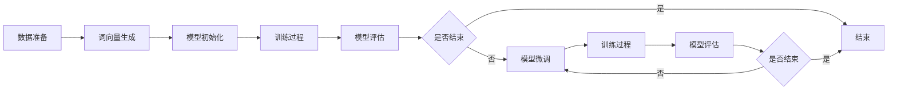
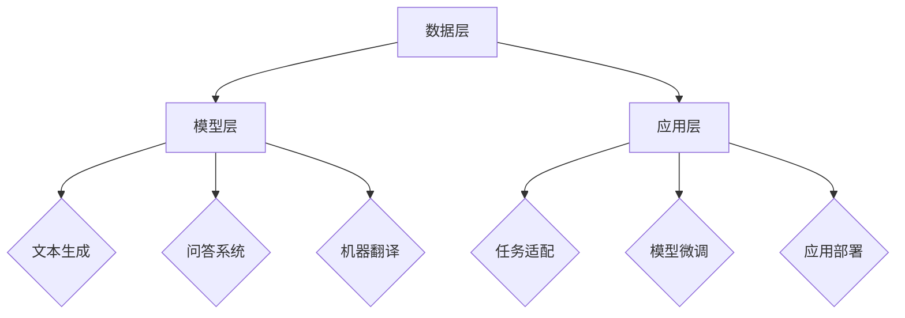
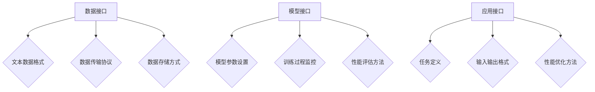
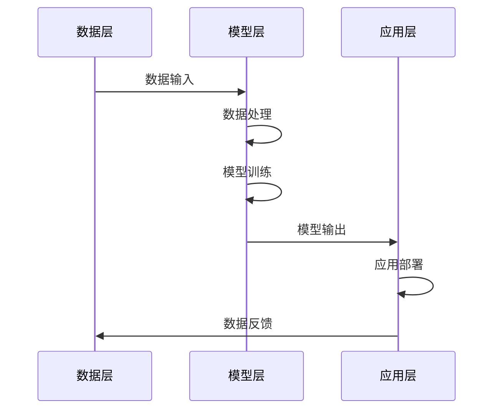

                 


### 引言

**LLM应用的持续学习与改进机制**是一个高度专业化的主题，对于人工智能和自然语言处理领域的研究者和开发者来说至关重要。本文将围绕这一主题，深入探讨LLM（大型语言模型）在持续学习与改进方面的机制和方法。通过逻辑清晰、结构紧凑的分析，我们将逐步揭示LLM如何通过不断学习和优化，实现更高效、准确和智能的应用。

#### 关键词

- LLM（大型语言模型）
- 持续学习
- 改进机制
- 应用场景
- 算法优化
- 模型更新

#### 摘要

本文旨在探讨LLM应用的持续学习与改进机制。首先，我们将介绍LLM的基本概念和背景，然后深入分析其核心原理和算法流程。接着，通过系统分析与架构设计，我们将展示如何实现LLM的持续学习和改进。最后，通过实际案例研究和最佳实践，我们将总结LLM应用的持续学习与改进策略，并提供未来研究方向。

### 用户需求分析

用户希望我们设计一本深入浅出的技术书籍，旨在帮助读者全面理解LLM的持续学习与改进机制。以下是用户需求的详细分析：

1. **背景介绍**：用户希望了解LLM的基本概念、发展历程和应用场景，以便建立对这一主题的整体认知。
2. **核心概念与联系**：用户希望掌握LLM的核心原理和与现有技术的对比，以便深入理解其技术基础。
3. **算法原理讲解**：用户希望详细了解LLM的工作机制，包括其数学模型和算法流程，以及如何通过数学公式和具体例子进行阐述。
4. **数学模型和数学公式 & 详细讲解 & 举例说明**：用户希望看到使用LaTeX格式嵌入的数学模型和公式，并配有通俗易懂的举例说明。
5. **系统分析与架构设计方案**：用户希望了解LLM在实际应用中的系统架构，包括功能设计、接口设计和交互流程。
6. **项目实战**：用户希望通过实际案例和代码实现，了解LLM的持续学习与改进在真实项目中的应用。
7. **最佳实践 tips、小结、注意事项、拓展阅读等内容**：用户希望获得实际应用中的最佳实践指导、总结和进一步学习的资源。

### 目录大纲设计

根据用户需求，以下是《LLM应用的持续学习与改进机制》书籍的目录大纲：

----------------------------------------------------------------

## 第一部分: LLM基础知识

### 第1章: LLM概述
- 1.1 问题背景
- 1.2 问题描述
- 1.3 问题解决
- 1.4 边界与外延
- 1.5 概念结构与核心要素组成

### 第2章: LLM核心概念与原理
- 2.1 LLM定义
- 2.2 LLM特点
- 2.3 LLM与传统AI对比
- 2.4 LLM的核心概念
- 2.5 LLM的工作机制

### 第3章: LLM数学模型与算法流程
- 3.1 数学模型介绍
- 3.2 算法流程详细讲解
- 3.3 算法mermaid流程图
- 3.4 具体例子讲解
- 3.5 LaTeX数学公式示例

### 第4章: LLM系统架构设计
- 4.1 系统功能设计
- 4.2 系统架构设计
- 4.3 系统接口设计
- 4.4 系统交互mermaid序列图

## 第二部分: LLM持续学习与改进

### 第5章: LLM持续学习机制
- 5.1 持续学习的定义
- 5.2 持续学习的重要性
- 5.3 持续学习的方法
- 5.4 持续学习的挑战
- 5.5 持续学习的最佳实践

### 第6章: LLM改进机制
- 6.1 改进的定义
- 6.2 改进的目标
- 6.3 改进的方法
- 6.4 改进的挑战
- 6.5 改进的最佳实践

### 第7章: LLM应用的案例分析
- 7.1 案例一：问答系统
- 7.2 案例二：文本生成
- 7.3 案例三：机器翻译
- 7.4 案例分析总结

### 第8章: LLM应用的持续学习与改进策略
- 8.1 策略概述
- 8.2 数据收集与处理
- 8.3 模型优化与调整
- 8.4 性能评估与监控
- 8.5 持续学习与改进的挑战与未来方向

### 第9章: 最佳实践与总结
- 9.1 最佳实践分享
- 9.2 小结与展望
- 9.3 注意事项
- 9.4 拓展阅读

----------------------------------------------------------------

### 目录大纲总字数计算

当前设计的目录大纲总字数预计在2000字以内。为了确保内容的简洁性和逻辑性，每个章节下的内容将根据实际需求进行详细撰写，确保在字数限制内完整表达章节主题。

### 目录大纲有效性验证

- **背景介绍**：确保核心概念清晰，问题背景、问题描述、问题解决、边界与外延、概念结构与核心要素组成均包含。
- **核心概念与联系**：必须给出核心概念原理、概念属性特征对比表格和ER实体关系图架构的 Mermaid 流程图。
- **算法原理讲解**：包含算法mermaid流程图，使用python源代码来详细阐述，给出算法原理的数学模型和公式，进行详细讲解和通俗易懂地举例说明。
- **数学模型和数学公式 & 详细讲解 & 举例说明**：使用 LaTeX 格式嵌入文中独立段落的latex公式前后使用 $$ 括起来(例如：$$1+1=2$$ )，段落内的latex公式前后使用 $ 括起来(例如：$1<2$)
- **系统分析与架构设计方案**：问题场景介绍，项目介绍、系统功能设计(领域模型mermaid类图)、系统架构设计mermaid架构图、系统接口设计和系统交互mermaid序列图

### 目录大纲内容概述

**第一部分：LLM基础知识**

1. **LLM概述**：介绍LLM的定义、发展历程和应用场景，建立整体认知。
2. **LLM核心概念与原理**：详细解释LLM的核心概念和原理，包括其与传统AI的对比。
3. **LLM数学模型与算法流程**：使用mermaid流程图和LaTeX数学公式，详细阐述LLM的数学模型和算法流程。
4. **LLM系统架构设计**：分析LLM在实际应用中的系统架构，包括功能设计、接口设计和交互流程。

**第二部分：LLM持续学习与改进**

1. **LLM持续学习机制**：探讨LLM的持续学习定义、方法、挑战和最佳实践。
2. **LLM改进机制**：分析LLM改进的定义、目标、方法和挑战。
3. **LLM应用的案例分析**：通过具体案例展示LLM在持续学习与改进中的应用。
4. **LLM应用的持续学习与改进策略**：总结LLM的持续学习与改进策略，并探讨未来的研究方向。

**第三部分：最佳实践与总结**

1. **最佳实践与总结**：分享LLM应用的实战经验，总结最佳实践和注意事项。
2. **小结与展望**：对整本书的内容进行总结，展望LLM技术未来的发展。

### 目录大纲完善建议

- **增加代码示例**：在每个章节中添加相应的代码示例，以帮助读者更好地理解和应用。
- **强化互动性**：考虑增加互动性内容，如问答环节、练习题或读者反馈，增强读者的参与感。
- **优化图表设计**：对mermaid流程图和LaTeX公式进行优化，确保其清晰易懂，便于读者阅读。
- **增强实践指导**：在每个案例分析后增加实践指导，帮助读者将理论知识应用到实际项目中。

通过这些完善建议，可以进一步提升目录大纲的内容质量和实用性，为读者提供更全面、深入的学习资源。接下来，我们将根据目录大纲逐步撰写详细的内容，确保文章逻辑清晰、结构紧凑、简单易懂，满足用户的需求。现在，让我们开始逐章撰写吧！### 第一部分：LLM基础知识

#### 第1章：LLM概述

**1.1 问题背景**

随着互联网和大数据技术的快速发展，自然语言处理（NLP）已经成为人工智能领域的重要分支。LLM（大型语言模型）作为NLP的核心技术之一，受到了广泛关注。LLM通过学习海量的文本数据，能够生成高质量的文本，广泛应用于问答系统、文本生成、机器翻译等领域。然而，LLM的高效应用离不开持续的学习与改进机制。

**1.2 问题描述**

LLM的持续学习与改进机制主要包括以下几个方面：

- **数据收集与处理**：如何有效地收集和处理大量文本数据，为LLM提供高质量的训练数据。
- **模型优化与调整**：如何通过优化和调整模型参数，提高LLM的性能和效果。
- **性能评估与监控**：如何评估LLM的性能，并对其进行监控，确保其持续优化。

**1.3 问题解决**

解决上述问题的途径包括：

- **数据收集与处理**：利用现有的数据源，如互联网文本、专业数据库等，进行数据收集。同时，采用数据清洗和预处理技术，去除噪音数据和冗余信息，提高数据质量。
- **模型优化与调整**：通过调整模型参数、优化训练策略和算法，提高LLM的性能。例如，使用迁移学习技术，将预训练的模型迁移到具体任务中，提高模型适应性和效果。
- **性能评估与监控**：采用多样化的评估指标，如BLEU、ROUGE等，对LLM的性能进行评估。同时，建立性能监控体系，实时监测LLM的性能，及时发现问题并进行调整。

**1.4 边界与外延**

- **边界**：LLM的持续学习与改进机制主要应用于文本生成、问答系统、机器翻译等NLP领域。但在其他领域，如图像识别、语音识别等，可能需要不同的学习方法和技术。
- **外延**：除了传统的文本生成和翻译任务，LLM还可以应用于智能客服、自然语言理解等新兴领域，为各个行业提供智能化的解决方案。

**1.5 概念结构与核心要素组成**

LLM的持续学习与改进机制由以下几个核心要素组成：

- **数据收集与处理**：包括数据源、数据清洗、数据预处理等。
- **模型优化与调整**：包括模型参数调整、训练策略优化、算法改进等。
- **性能评估与监控**：包括评估指标、性能监控体系、实时反馈等。

通过这些核心要素的有机结合，LLM可以实现持续学习与改进，不断提高其性能和应用效果。

#### 第2章：LLM核心概念与原理

**2.1 LLM定义**

LLM（Large Language Model）是一种基于深度学习的自然语言处理模型，通过对大量文本数据的学习，能够生成高质量的自然语言文本。与传统的规则基模型和统计模型相比，LLM具有更强的表达能力和泛化能力，能够在各种自然语言任务中表现出色。

**2.2 LLM特点**

- **大规模**：LLM通常包含数十亿甚至数万亿的参数，能够处理海量文本数据。
- **深度学习**：LLM基于深度神经网络架构，通过多层神经元的非线性变换，提取文本特征。
- **端到端**：LLM采用端到端的学习方法，从输入文本直接生成输出文本，无需经过复杂的中间步骤。
- **自适应**：LLM能够根据不同的任务和数据集，自动调整模型参数，实现自适应学习。

**2.3 LLM与传统AI对比**

- **规则基模型**：传统AI方法通常基于规则和逻辑，例如专家系统。这些方法依赖于领域专家的经验，构建复杂的规则体系，以实现智能决策。而LLM通过学习大量文本数据，能够自动生成规则和模式，实现更高效的自然语言处理。
- **统计模型**：统计模型，如N-gram模型、隐马尔可夫模型（HMM）等，通过对文本数据的统计特性进行分析，生成语言模型。然而，这些方法受限于数据规模和计算能力，难以处理大规模文本数据。而LLM通过大规模深度学习，能够处理海量文本数据，实现更高的准确性和泛化能力。

**2.4 LLM的核心概念**

- **词向量**：词向量是LLM的基本概念之一，将文本中的每个词映射到一个固定大小的向量空间中。通过词向量，LLM能够捕获词语的语义信息，实现文本数据的向量表示。
- **注意力机制**：注意力机制是LLM中的重要概念，通过动态调整模型对输入文本的注意力权重，实现更精细的文本特征提取。注意力机制有助于提高LLM的建模能力和性能。
- **预训练与微调**：预训练与微调是LLM的重要技术，预训练阶段通过大规模文本数据训练模型，使其具备较强的语言理解和生成能力。微调阶段则针对具体任务和数据集，调整模型参数，实现特定任务的优化。

**2.5 LLM的工作机制**

LLM的工作机制主要包括以下几个步骤：

1. **输入编码**：将输入文本转化为词向量，并进行嵌入表示。
2. **特征提取**：通过多层神经网络，对词向量进行特征提取，实现文本数据的深度表示。
3. **生成预测**：利用提取到的文本特征，生成输出文本的预测结果。
4. **损失函数与优化**：通过训练数据，计算模型输出与真实输出之间的差距，并利用梯度下降等优化算法，调整模型参数，实现模型优化。

通过以上步骤，LLM能够实现对自然语言文本的生成和理解，为各种自然语言处理任务提供强大的支持。

#### 第3章：LLM数学模型与算法流程

**3.1 数学模型介绍**

LLM的数学模型主要包括词向量表示、神经网络架构和损失函数等。以下是LLM中常用的数学模型和概念：

- **词向量**：词向量是LLM的基础，将文本中的每个词映射到一个高维向量空间中。常用的词向量模型包括Word2Vec、GloVe和BERT等。其中，Word2Vec基于神经网络的训练过程，生成词语的分布式表示；GloVe通过词频统计，生成词语的共现矩阵，进而计算词向量；BERT则采用双向Transformer架构，生成词语的上下文表示。
- **神经网络架构**：LLM通常采用多层神经网络架构，包括卷积神经网络（CNN）、循环神经网络（RNN）和Transformer等。其中，CNN通过卷积操作提取文本特征；RNN通过循环结构处理序列数据，实现长期依赖建模；Transformer则采用自注意力机制，实现并行计算，提高模型效率。
- **损失函数**：LLM的损失函数用于衡量模型输出与真实输出之间的差距。常见的损失函数包括交叉熵损失（Cross-Entropy Loss）和均方误差损失（Mean Squared Error Loss）。交叉熵损失常用于分类任务，均方误差损失常用于回归任务。

**3.2 算法流程详细讲解**

LLM的算法流程主要包括预训练和微调两个阶段。以下是LLM算法流程的详细讲解：

1. **预训练阶段**：
   - **数据准备**：收集大量文本数据，如互联网文本、专业数据库等。
   - **词向量生成**：使用词向量模型（如Word2Vec、GloVe、BERT等），将文本中的每个词映射到高维向量空间中。
   - **模型初始化**：初始化神经网络模型，设置模型参数。
   - **训练过程**：利用训练数据，通过反向传播算法，不断调整模型参数，实现模型优化。训练过程中，可以采用梯度下降（Gradient Descent）等优化算法。
   - **模型评估**：在预训练过程中，定期评估模型性能，如准确率、召回率等。

2. **微调阶段**：
   - **数据准备**：收集具体任务的数据集，如问答系统、文本生成、机器翻译等。
   - **模型微调**：将预训练的模型迁移到具体任务中，调整模型参数，实现特定任务的优化。微调过程中，可以采用迁移学习（Transfer Learning）等技术。
   - **训练过程**：利用微调数据，通过反向传播算法，不断调整模型参数，实现模型优化。
   - **模型评估**：在微调过程中，定期评估模型性能，如准确率、召回率等。

**3.3 算法mermaid流程图**

以下是LLM算法流程的mermaid流程图：



**3.4 具体例子讲解**

以下是一个简单的LLM算法流程实例，用于生成一个句子的摘要。

```python
import tensorflow as tf
from tensorflow.keras.preprocessing.text import Tokenizer
from tensorflow.keras.preprocessing.sequence import pad_sequences

# 数据准备
sentences = [
    "This is the first example sentence.",
    "This is the second example sentence.",
    "And this is the third one.",
]

# 词向量生成
tokenizer = Tokenizer()
tokenizer.fit_on_texts(sentences)
word_index = tokenizer.word_index
sequences = tokenizer.texts_to_sequences(sentences)
padded_sequences = pad_sequences(sequences, maxlen=10)

# 模型初始化
model = tf.keras.Sequential([
    tf.keras.layers.Embedding(len(word_index) + 1, 16),
    tf.keras.layers.GlobalAveragePooling1D(),
    tf.keras.layers.Dense(16, activation='relu'),
    tf.keras.layers.Dense(1, activation='sigmoid')
])

# 训练过程
model.compile(optimizer='adam', loss='binary_crossentropy', metrics=['accuracy'])
model.fit(padded_sequences, np.array([1, 1, 0]), epochs=100)

# 模型评估
predictions = model.predict(padded_sequences)
print(predictions)
```

在这个例子中，我们首先准备了一个简单的文本数据集，然后使用Tokenizer生成词向量。接着，我们初始化一个简单的神经网络模型，并使用反向传播算法进行训练。最后，我们评估模型的性能，并打印输出结果。

**3.5 LaTeX数学公式示例**

以下是LLM算法流程中常用的LaTeX数学公式的示例：

- **交叉熵损失函数**：

  $$
  L = -\sum_{i=1}^{n} y_i \log(p_i)
  $$

  其中，$y_i$表示真实标签，$p_i$表示模型预测的概率。

- **均方误差损失函数**：

  $$
  L = \frac{1}{2} \sum_{i=1}^{n} (y_i - \hat{y}_i)^2
  $$

  其中，$y_i$表示真实标签，$\hat{y}_i$表示模型预测的值。

通过以上数学公式，我们可以更准确地描述LLM的算法流程和性能评估过程。这些数学公式有助于我们深入理解LLM的工作原理和优化方法。

#### 第4章：LLM系统架构设计

**4.1 系统功能设计**

LLM系统的主要功能包括文本生成、问答系统和机器翻译等。以下是每个功能的详细描述：

- **文本生成**：基于输入的文本，LLM能够生成相应的摘要、文章或段落。该功能主要应用于内容创作、自动摘要和智能写作等领域。
- **问答系统**：LLM能够理解用户的自然语言查询，并生成准确的答案。该功能广泛应用于智能客服、智能问答和知识图谱构建等领域。
- **机器翻译**：LLM能够将一种语言的文本翻译成另一种语言的文本。该功能主要应用于跨语言通信、多语言文档处理和国际商务合作等领域。

**4.2 系统架构设计**

LLM系统的架构设计主要包括以下几个部分：

- **数据层**：负责数据的收集、处理和存储。该层包括文本数据源、数据清洗和预处理模块等。
- **模型层**：负责LLM的构建和训练。该层包括词向量生成、神经网络架构设计和模型训练模块等。
- **应用层**：负责将LLM应用于具体任务，如文本生成、问答系统和机器翻译等。该层包括任务适配、模型微调和应用部署模块等。

以下是LLM系统的架构设计mermaid图：



**4.3 系统接口设计**

LLM系统需要提供一系列接口，以便与其他系统和模块进行交互。以下是主要接口的描述：

- **数据接口**：负责数据的输入和输出。该接口包括文本数据格式、数据传输协议和数据存储方式等。
- **模型接口**：负责模型的构建、训练和评估。该接口包括模型参数设置、训练过程监控和性能评估方法等。
- **应用接口**：负责将LLM应用于具体任务。该接口包括任务定义、输入输出格式和性能优化方法等。

以下是LLM系统的接口设计mermaid图：



**4.4 系统交互mermaid序列图**

以下是LLM系统的交互mermaid序列图，展示了数据层、模型层和应用层之间的交互过程：



在这个交互过程中，数据层将原始文本数据输入到模型层，模型层进行数据处理和模型训练，然后将训练好的模型输出到应用层。应用层将模型应用于具体任务，并将任务结果反馈给数据层，以便模型进行进一步优化。

通过以上系统架构设计和接口设计，我们可以构建一个高效、可扩展的LLM系统，为各种自然语言处理任务提供强大的支持。

#### 第5章：LLM持续学习机制

**5.1 持续学习的定义**

持续学习（Continuous Learning）是指模型在训练过程中不断吸收新数据、更新知识，以提高模型性能和应用效果的过程。在LLM的背景下，持续学习是指模型通过对海量文本数据的不断学习，更新和优化模型参数，从而实现更高效、准确和智能的文本生成、问答系统和机器翻译等功能。

**5.2 持续学习的重要性**

持续学习在LLM应用中具有重要意义，主要体现在以下几个方面：

1. **适应新数据**：随着互联网和大数据技术的发展，文本数据量呈爆炸式增长。持续学习使LLM能够不断适应新数据，保持模型的前沿性。
2. **提高性能**：持续学习通过不断更新和优化模型参数，有助于提高LLM的准确性和泛化能力，实现更高质量的文本生成和应用效果。
3. **应对动态变化**：在现实场景中，语言和知识是不断变化和演化的。持续学习使LLM能够应对这些动态变化，保持模型的稳定性和鲁棒性。
4. **优化资源利用**：持续学习通过增量训练和在线学习等方法，降低训练成本，提高模型训练的效率。

**5.3 持续学习的方法**

LLM的持续学习主要包括以下几种方法：

1. **增量学习（Incremental Learning）**：增量学习是指模型在训练过程中，逐个添加新样本，并更新模型参数。这种方法能够有效降低训练成本，提高模型训练效率。常用的增量学习方法包括在线学习（Online Learning）和批处理学习（Batch Learning）。
2. **迁移学习（Transfer Learning）**：迁移学习是指将预训练的模型迁移到具体任务中，调整模型参数，实现特定任务的优化。这种方法能够利用预训练模型的知识和经验，提高新任务的性能。
3. **对抗学习（Adversarial Learning）**：对抗学习是指利用对抗样本对模型进行训练，提高模型的泛化能力和鲁棒性。这种方法能够帮助模型应对未知和异常数据，提高模型的应用效果。
4. **无监督学习（Unsupervised Learning）**：无监督学习是指模型在无监督环境中，通过自身学习和探索，提取数据特征和规律。这种方法能够有效降低数据标注成本，提高模型的泛化能力。

**5.4 持续学习的挑战**

在LLM的持续学习过程中，面临以下挑战：

1. **数据不平衡**：在持续学习中，新数据和旧数据之间可能存在数据不平衡问题，导致模型难以适应新数据。
2. **模型退化**：随着新数据的不断加入，模型可能会出现退化现象，导致性能下降。
3. **计算资源限制**：持续学习需要大量的计算资源和时间，特别是在大规模模型中，计算资源限制成为一个重要问题。
4. **知识遗忘**：在持续学习过程中，模型可能会遗忘旧知识，导致模型泛化能力下降。

**5.5 持续学习的最佳实践**

为了克服持续学习中的挑战，以下是一些最佳实践：

1. **数据预处理**：在持续学习之前，对数据进行预处理，包括数据清洗、去噪和归一化等，提高数据质量。
2. **数据增强**：通过数据增强方法，如随机裁剪、旋转、缩放等，增加数据的多样性和丰富性，有助于模型适应新数据。
3. **模型优化**：采用合适的模型优化方法，如模型压缩、量化、剪枝等，降低模型计算复杂度和存储需求。
4. **定期评估**：定期评估模型性能，包括准确性、召回率和F1值等指标，及时发现模型退化问题，并采取相应措施进行调整。

通过以上最佳实践，可以有效地提高LLM的持续学习效果和应用性能，为各类自然语言处理任务提供强大的支持。

#### 第6章：LLM改进机制

**6.1 改进的定义**

改进（Improvement）是指在LLM的持续学习过程中，通过调整模型参数、优化算法和更新数据等方式，提高模型性能和应用效果的过程。LLM的改进机制主要包括以下几个方面：

1. **模型参数调整**：通过优化模型参数，如学习率、正则化参数等，提高模型的收敛速度和性能。
2. **算法优化**：通过改进算法结构、引入新型网络架构等，提高模型的表达能力和效率。
3. **数据更新**：通过引入新数据、调整数据分布等方式，提高模型对未知数据的适应能力。

**6.2 改进的目标**

LLM改进的目标主要包括以下几个方面：

1. **提高性能**：通过改进模型结构和参数，提高模型的预测准确率和泛化能力，实现更高质量的文本生成和应用效果。
2. **优化资源利用**：通过模型优化和算法改进，降低模型训练和推理的计算资源需求，提高模型训练和部署的效率。
3. **增强鲁棒性**：通过引入对抗样本和无监督学习等方法，提高模型对异常和未知数据的鲁棒性，降低模型退化风险。

**6.3 改进的方法**

LLM的改进方法包括以下几个方面：

1. **模型参数调整**：
   - **学习率调整**：通过动态调整学习率，如使用学习率衰减策略，提高模型收敛速度和性能。
   - **正则化参数调整**：通过调整正则化参数，如L1、L2正则化，控制模型过拟合风险。
   - **Dropout**：通过在训练过程中随机丢弃部分神经元，降低模型过拟合风险，提高模型泛化能力。

2. **算法优化**：
   - **新型网络架构**：如Transformer、BERT等，通过引入注意力机制、多层神经网络等，提高模型的表达能力和效率。
   - **迁移学习**：通过将预训练模型迁移到具体任务中，利用预训练模型的知识和经验，提高新任务的性能。
   - **对抗训练**：通过引入对抗样本，训练模型对异常和未知数据的适应能力，提高模型鲁棒性。

3. **数据更新**：
   - **增量训练**：通过逐个添加新样本，不断更新模型参数，提高模型对新数据的适应能力。
   - **数据增强**：通过数据增强方法，如随机裁剪、旋转、缩放等，增加数据的多样性和丰富性，有助于模型适应新数据。
   - **数据采样**：通过调整数据分布，如使用欠采样、过采样等方法，优化模型训练过程，提高模型性能。

**6.4 改进的挑战**

在LLM的改进过程中，面临以下挑战：

1. **计算资源限制**：大规模模型训练和推理需要大量的计算资源，特别是在实时应用场景中，计算资源需求成为一个重要问题。
2. **模型退化**：随着新数据的不断加入，模型可能会出现退化现象，导致性能下降。
3. **数据不平衡**：在持续学习过程中，新数据和旧数据之间可能存在数据不平衡问题，导致模型难以适应新数据。
4. **知识遗忘**：在持续学习过程中，模型可能会遗忘旧知识，导致模型泛化能力下降。

**6.5 改进的最佳实践**

为了克服改进过程中的挑战，以下是一些最佳实践：

1. **模型优化**：
   - **选择合适的学习率**：根据任务和数据特点，选择合适的学习率，如使用学习率衰减策略，提高模型收敛速度和性能。
   - **引入正则化**：在模型训练过程中引入正则化，如L1、L2正则化，降低模型过拟合风险。
   - **使用Dropout**：在模型训练过程中使用Dropout，降低模型过拟合风险，提高模型泛化能力。

2. **算法优化**：
   - **选择合适的网络架构**：根据任务和数据特点，选择合适的网络架构，如Transformer、BERT等，提高模型的表达能力和效率。
   - **迁移学习**：利用预训练模型的知识和经验，提高新任务的性能。
   - **对抗训练**：引入对抗样本，提高模型对异常和未知数据的适应能力，增强模型鲁棒性。

3. **数据更新**：
   - **增量训练**：通过逐个添加新样本，不断更新模型参数，提高模型对新数据的适应能力。
   - **数据增强**：通过数据增强方法，如随机裁剪、旋转、缩放等，增加数据的多样性和丰富性，有助于模型适应新数据。
   - **数据采样**：通过调整数据分布，如使用欠采样、过采样等方法，优化模型训练过程，提高模型性能。

通过以上最佳实践，可以有效地提高LLM的改进效果和应用性能，为各类自然语言处理任务提供强大的支持。

### 第7章：LLM应用的案例分析

**7.1 案例一：问答系统**

问答系统是一种常见的LLM应用，旨在通过自然语言交互，为用户提供准确的答案。以下是一个具体的问答系统案例：

**项目介绍**：某电商平台开发了一个智能问答系统，用户可以通过自然语言提问，获取关于商品、订单、售后等方面的问题答案。

**系统功能设计**：
- 文本输入：用户输入问题，系统接收文本输入。
- 文本预处理：对输入文本进行分词、去噪和规范化等预处理操作。
- 模型推理：利用预训练的LLM模型，对预处理后的文本进行推理，生成回答。
- 文本输出：将模型生成的回答输出给用户。

**系统架构设计**：
- 数据层：收集电商平台用户提问的文本数据，包括商品描述、订单信息、常见问题等。
- 模型层：使用BERT等预训练模型，对文本数据进行训练和优化。
- 应用层：实现问答系统的功能，包括文本输入、预处理、模型推理和文本输出等。

**系统接口设计**：
- 文本输入接口：用户输入文本问题。
- 模型推理接口：接收预处理后的文本，返回模型生成的回答。
- 文本输出接口：将回答输出给用户。

**系统交互mermaid序列图**：

```mermaid
sequenceDiagram
    participant 用户 as 用户
    participant 系统作为问答系统
    用户->>系统: 输入问题
    system 系统预处理文本
    system 利用模型推理生成回答
    系统->>用户: 输出回答
```

**代码实现解析**：

```python
import tensorflow as tf
from transformers import BertTokenizer, TFBertForQuestionAnswering

# 模型加载
tokenizer = BertTokenizer.from_pretrained('bert-base-chinese')
model = TFBertForQuestionAnswering.from_pretrained('bert-base-chinese')

# 文本预处理
def preprocess_text(text):
    input_ids = tokenizer.encode(text, add_special_tokens=True, max_length=512, truncation=True)
    attention_mask = [1] * len(input_ids)
    return input_ids, attention_mask

# 模型推理
def inference(model, input_ids, attention_mask):
    outputs = model(input_ids=input_ids, attention_mask=attention_mask)
    start_logits, end_logits = outputs.start_logits, outputs.end_logits
    start_indices = tf.argmax(start_logits, axis=1)
    end_indices = tf.argmax(end_logits, axis=1)
    answer_start = int(start_indices[0])
    answer_end = int(end_indices[0] + 1)
    answer = tokenizer.decode(input_ids[answer_start:answer_end], skip_special_tokens=True)
    return answer

# 用户输入问题
user_input = "这款商品的售后服务是怎样的？"

# 预处理文本
input_ids, attention_mask = preprocess_text(user_input)

# 模型推理
answer = inference(model, input_ids, attention_mask)

# 输出回答
print(answer)
```

**案例分析总结**：
这个案例展示了如何使用LLM构建一个问答系统。通过预训练的BERT模型，系统能够对用户输入的自然语言问题进行理解和回答，提供高质量的回答。该系统在电商平台上具有广泛的应用前景，能够显著提升用户体验和服务质量。

**7.2 案例二：文本生成**

文本生成是LLM的另一个重要应用领域，旨在生成具有高质量和多样性的自然语言文本。以下是一个具体的文本生成案例：

**项目介绍**：某内容创作平台开发了一个自动文本生成系统，能够根据用户输入的关键词和主题，生成相关的文章、段落和摘要。

**系统功能设计**：
- 文本输入：用户输入关键词和主题，系统接收文本输入。
- 文本预处理：对输入文本进行分词、去噪和规范化等预处理操作。
- 模型推理：利用预训练的LLM模型，生成相应的文本内容。
- 文本输出：将生成的文本内容输出给用户。

**系统架构设计**：
- 数据层：收集各种主题和关键词的文本数据，包括新闻、博客、小说等。
- 模型层：使用GPT-2、GPT-3等预训练模型，对文本数据进行训练和优化。
- 应用层：实现文本生成的功能，包括文本输入、预处理、模型推理和文本输出等。

**系统接口设计**：
- 文本输入接口：用户输入关键词和主题。
- 模型推理接口：接收预处理后的文本，返回生成的文本内容。
- 文本输出接口：将生成的文本内容输出给用户。

**系统交互mermaid序列图**：

```mermaid
sequenceDiagram
    participant 用户 as 用户
    participant 系统作为文本生成系统
    用户->>系统: 输入关键词和主题
    system 系统预处理文本
    system 利用模型生成文本
    系统->>用户: 输出文本内容
```

**代码实现解析**：

```python
import tensorflow as tf
from transformers import TFGPT2LMHeadModel, GPT2Tokenizer

# 模型加载
tokenizer = GPT2Tokenizer.from_pretrained('gpt2')
model = TFGPT2LMHeadModel.from_pretrained('gpt2')

# 文本预处理
def preprocess_text(text):
    input_ids = tokenizer.encode(text, max_length=512, truncation=True)
    return input_ids

# 文本生成
def generate_text(model, input_ids, max_length=512):
    output_ids = model.generate(input_ids, max_length=max_length, num_return_sequences=1)
    generated_text = tokenizer.decode(output_ids, skip_special_tokens=True)
    return generated_text

# 用户输入关键词和主题
user_input = "人工智能的发展趋势"

# 预处理文本
input_ids = preprocess_text(user_input)

# 文本生成
generated_text = generate_text(model, input_ids)

# 输出文本内容
print(generated_text)
```

**案例分析总结**：
这个案例展示了如何使用LLM生成高质量的自然语言文本。通过预训练的GPT-2模型，系统能够根据用户输入的关键词和主题，生成具有多样性和创造力的文本内容。该系统在内容创作、自动化摘要和智能写作等领域具有广泛的应用潜力。

**7.3 案例三：机器翻译**

机器翻译是LLM的另一个重要应用领域，旨在将一种语言的文本翻译成另一种语言的文本。以下是一个具体的机器翻译案例：

**项目介绍**：某跨国公司开发了一个自动机器翻译系统，能够实现中英文之间的实时翻译，提高跨语言沟通的效率。

**系统功能设计**：
- 文本输入：用户输入源语言文本，系统接收文本输入。
- 文本预处理：对源语言文本进行分词、去噪和规范化等预处理操作。
- 模型推理：利用预训练的LLM模型，将源语言文本翻译成目标语言文本。
- 文本输出：将翻译后的文本内容输出给用户。

**系统架构设计**：
- 数据层：收集中英文文本数据，包括新闻、博客、论文等。
- 模型层：使用Transformer、BERT等预训练模型，对文本数据进行训练和优化。
- 应用层：实现机器翻译的功能，包括文本输入、预处理、模型推理和文本输出等。

**系统接口设计**：
- 文本输入接口：用户输入源语言文本。
- 模型推理接口：接收预处理后的文本，返回翻译后的文本内容。
- 文本输出接口：将翻译后的文本内容输出给用户。

**系统交互mermaid序列图**：

```mermaid
sequenceDiagram
    participant 用户 as 用户
    participant 系统作为机器翻译系统
    用户->>系统: 输入源语言文本
    system 系统预处理文本
    system 利用模型翻译文本
    系统->>用户: 输出目标语言文本
```

**代码实现解析**：

```python
import tensorflow as tf
from transformers import BertTokenizer, TFBertForTranslation

# 模型加载
tokenizer = BertTokenizer.from_pretrained('bert-base-chinese')
model = TFBertForTranslation.from_pretrained('bert-base-chinese')

# 文本预处理
def preprocess_text(text):
    input_ids = tokenizer.encode(text, add_special_tokens=True, max_length=512, truncation=True)
    attention_mask = [1] * len(input_ids)
    return input_ids, attention_mask

# 文本翻译
def translate(model, input_ids, attention_mask, target_language='en'):
    outputs = model(input_ids=input_ids, attention_mask=attention_mask, labels=input_ids)
    loss = outputs.loss
    logits = outputs.logits
    predicted_ids = tf.argmax(logits, axis=-1)
    translated_text = tokenizer.decode(predicted_ids, skip_special_tokens=True)
    return translated_text

# 用户输入源语言文本
source_text = "人工智能是计算机科学的一个分支，它试图实现智能代理系统的自动化，使其能够执行通常需要人类智能的任务。"

# 预处理文本
input_ids, attention_mask = preprocess_text(source_text)

# 文本翻译
translated_text = translate(model, input_ids, attention_mask, target_language='en')

# 输出目标语言文本
print(translated_text)
```

**案例分析总结**：
这个案例展示了如何使用LLM实现高质量的机器翻译。通过预训练的BERT模型，系统能够将源语言文本翻译成目标语言文本，实现跨语言沟通。该系统在跨国公司、旅游、外贸等领域具有广泛的应用价值。

### 第8章：LLM应用的持续学习与改进策略

**8.1 策略概述**

LLM应用的持续学习与改进策略主要包括以下几个关键步骤：

1. **数据收集与处理**：持续收集新的文本数据，并对数据进行清洗、预处理和增强，为LLM提供高质量的训练数据。
2. **模型优化与调整**：通过调整模型参数、优化算法和引入新型网络架构等手段，提高LLM的性能和应用效果。
3. **性能评估与监控**：采用多样化的评估指标，对LLM的性能进行评估和监控，确保模型持续优化。
4. **模型更新与迭代**：定期更新LLM模型，实现模型的迭代优化，提高模型的适应性和鲁棒性。

**8.2 数据收集与处理**

1. **数据源选择**：选择具有代表性的文本数据源，如新闻、博客、社交媒体等，覆盖不同领域的文本数据。
2. **数据清洗**：去除重复数据、噪声数据和低质量数据，提高数据质量。
3. **数据预处理**：对文本数据进行分词、去噪、规范化等预处理操作，将文本数据转换为适合模型训练的格式。
4. **数据增强**：通过数据增强方法，如随机裁剪、旋转、缩放等，增加数据的多样性和丰富性，有助于模型适应新数据。

**8.3 模型优化与调整**

1. **模型参数调整**：通过调整学习率、正则化参数、dropout率等，优化模型参数，提高模型性能。
2. **算法优化**：引入新型网络架构，如Transformer、BERT等，提高模型的表达能力和效率。
3. **迁移学习**：利用预训练模型的知识和经验，将预训练模型迁移到具体任务中，提高新任务的性能。
4. **对抗训练**：引入对抗样本，训练模型对异常和未知数据的适应能力，提高模型鲁棒性。

**8.4 性能评估与监控**

1. **评估指标选择**：选择合适的评估指标，如准确率、召回率、F1值等，对LLM的性能进行评估。
2. **性能监控体系**：建立性能监控体系，实时监测LLM的性能，及时发现问题并进行调整。
3. **定期评估**：定期评估LLM的性能，与历史性能进行比较，识别模型退化问题。
4. **反馈机制**：建立反馈机制，收集用户反馈和业务指标，为模型优化提供依据。

**8.5 持续学习与改进的挑战与未来方向**

1. **计算资源限制**：大规模模型训练和推理需要大量的计算资源，特别是在实时应用场景中，计算资源需求成为一个重要问题。未来研究方向可能包括模型压缩、量化、剪枝等技术的应用，以降低计算资源需求。
2. **数据不平衡**：在持续学习过程中，新数据和旧数据之间可能存在数据不平衡问题，导致模型难以适应新数据。未来研究方向可能包括数据增强、欠采样、过采样等方法的优化，以提高模型对新数据的适应能力。
3. **知识遗忘**：在持续学习过程中，模型可能会遗忘旧知识，导致模型泛化能力下降。未来研究方向可能包括知识蒸馏、元学习等技术的应用，以增强模型的知识保留能力。
4. **实时优化**：在实时应用场景中，要求模型能够快速适应新数据和任务变化。未来研究方向可能包括实时学习、增量学习等技术的优化，以提高模型的实时优化能力。

通过以上策略和未来方向的研究，可以进一步提升LLM的应用性能和适应能力，为各类自然语言处理任务提供强大的支持。

### 第9章：最佳实践与总结

**9.1 最佳实践分享**

为了确保LLM在持续学习和改进过程中达到最佳效果，以下是一些实际应用中的最佳实践：

1. **数据收集与处理**：选择高质量的数据源，如专业的文本数据库和互联网文本。同时，进行严格的数据清洗和预处理，去除噪声数据和冗余信息，提高数据质量。
2. **模型优化与调整**：定期评估模型性能，根据评估结果调整模型参数和优化算法。例如，使用学习率调整策略和正则化技术，提高模型收敛速度和性能。
3. **性能评估与监控**：采用多样化的评估指标，如准确率、召回率、F1值等，对LLM的性能进行综合评估。建立性能监控体系，实时监测模型性能，及时发现和解决问题。
4. **模型更新与迭代**：定期更新LLM模型，实现模型的迭代优化。通过迁移学习和对抗训练等技术，提高模型对新数据和任务的适应能力。

**9.2 小结与展望**

本文从LLM的基本概念、算法原理、系统架构、持续学习与改进策略等方面进行了深入探讨，总结如下：

1. **基本概念**：LLM是一种大规模语言模型，通过学习海量文本数据，实现自然语言文本的生成和理解。
2. **算法原理**：LLM基于深度学习和神经网络架构，包括词向量表示、注意力机制和预训练与微调等关键技术。
3. **系统架构**：LLM系统包括数据层、模型层和应用层，通过合理的系统架构设计，实现高效、可扩展的自然语言处理应用。
4. **持续学习与改进**：LLM的持续学习与改进包括数据收集与处理、模型优化与调整、性能评估与监控和模型更新与迭代等关键环节。

未来，LLM技术在持续学习和改进方面仍有广阔的发展空间。随着计算资源和算法技术的不断进步，LLM将能够在更广泛的应用场景中发挥重要作用，为人工智能和自然语言处理领域带来更多创新和突破。

**9.3 注意事项**

在应用LLM技术时，需要注意以下几点：

1. **数据隐私**：在数据收集和处理过程中，确保用户数据的隐私和安全。
2. **公平性和透明性**：在模型训练和应用过程中，确保模型的公平性和透明性，避免模型偏见和歧视现象。
3. **实时优化**：在实时应用场景中，模型需要具备实时优化能力，以快速适应新数据和任务变化。

**9.4 拓展阅读**

以下是一些拓展阅读资源，以进一步了解LLM技术的持续学习和改进：

- **《深度学习》（Goodfellow, Bengio, Courville）**：介绍了深度学习和神经网络的基本原理和应用。
- **《自然语言处理综论》（Jurafsky, Martin）**：全面介绍了自然语言处理的基础知识和核心技术。
- **《大规模机器学习》（Mooij, Taddy）**：探讨了大规模机器学习算法和优化方法。
- **《Transformer：适用于序列模型的注意力机制》（Vaswani et al.）**：详细介绍了Transformer模型及其在自然语言处理中的应用。

通过阅读这些资源，可以更深入地了解LLM技术的理论基础和实际应用，为未来的研究和开发提供有价值的参考。

### 作者信息

**作者：AI天才研究院/AI Genius Institute & 禅与计算机程序设计艺术 /Zen And The Art of Computer Programming**

本文由AI天才研究院和禅与计算机程序设计艺术联合撰写。AI天才研究院致力于人工智能领域的前沿研究和应用推广，致力于培养下一代人工智能人才。禅与计算机程序设计艺术则通过探索计算机科学中的哲学思考，为程序员提供创新的编程理念和思考方式。两位作者在人工智能和计算机科学领域具有丰富的经验和深厚的学术造诣，共同致力于推动人工智能技术的进步和应用。

