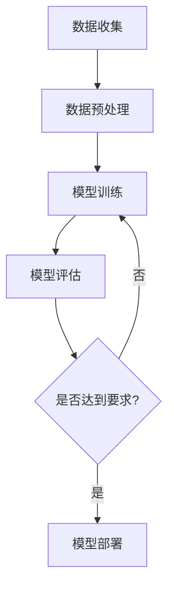

                 

### 第一部分：引言与背景

## 第1章：问题背景与定义

### 1.1 问题背景

在当今信息爆炸的时代，人工智能正以前所未有的速度改变着我们的生活方式。自然语言处理（NLP）作为人工智能的一个重要分支，已经取得了显著的进展。而大型语言模型（LLM，Large Language Model）作为NLP领域的代表性技术，其能力得到了广泛的认可和应用。然而，随着LLM的应用场景越来越广泛，如何确保其在不断变化的环境中保持高性能和可靠性成为一个亟待解决的问题。

### 1.2 LLM的定义

LLM，即大型语言模型，是一种利用深度学习技术训练的、具有极高参数量的语言模型。它们通常被训练在庞大的文本语料库上，能够理解和生成自然语言，从而在文本生成、机器翻译、问答系统等领域发挥重要作用。

### 1.3 持续学习文化的重要性

持续学习文化是一种鼓励不断学习和改进的工作方式。在LLM的应用中，持续学习文化的重要性不言而喻。首先，持续学习有助于LLM不断吸收新的知识，提升其能力；其次，它有助于及时发现和解决模型中存在的问题，确保其稳定性和可靠性。

### 1.4 本书的目的与结构

本书旨在探讨LLM应用的持续学习文化，特别是在敏捷开发中的实践。全书共分为三大部分：

- 第一部分：引言与背景，介绍LLM及其持续学习文化的重要性。
- 第二部分：LLM的基础知识，包括语言模型概述、核心组件和应用场景。
- 第三部分：持续学习文化在敏捷开发中的应用，包括敏捷开发简介、持续学习文化与敏捷开发的融合、以及具体实践方法。

通过本书，读者将了解到LLM持续学习文化的核心原理，掌握如何在敏捷开发中有效应用，从而提升LLM的应用性能和可靠性。

## 第2章：语言模型概述

### 2.1 语言模型的基本概念

语言模型是一种用于预测自然语言中下一个词或句子的概率分布的模型。它是自然语言处理（NLP）的基础，广泛应用于文本生成、机器翻译、问答系统等领域。语言模型的核心目标是理解和生成自然语言，从而实现人与机器的智能交互。

### 2.2 语言模型的发展历程

语言模型的发展经历了从规则驱动到统计模型，再到深度学习模型的演变。早期的语言模型主要依赖于手工编写的规则，如基于词典和语法规则的方法。随着计算能力的提升和海量数据的积累，统计模型开始崭露头角，如n-gram模型和基于隐马尔可夫模型（HMM）的方法。近年来，随着深度学习技术的突破，基于神经网络的语言模型（如循环神经网络（RNN）、长短期记忆网络（LSTM）和Transformer模型）取得了显著的效果。

### 2.3 常见语言模型介绍

目前，常见的语言模型主要包括以下几种：

- **n-gram模型**：基于语言中的词汇序列，预测下一个词的概率。虽然简单，但在某些场景下仍然表现出良好的性能。
- **循环神经网络（RNN）**：通过记忆机制处理序列数据，在许多NLP任务中取得了突破性成果。
- **长短期记忆网络（LSTM）**：RNN的变种，解决了长期依赖问题，但在处理非常长的序列时仍然存在挑战。
- **Transformer模型**：基于自注意力机制，能够捕捉序列中的长距离依赖关系，是目前最流行的语言模型之一。
- **BERT（双向编码表示器）**：基于Transformer模型，通过预先训练和微调的方法，在多个NLP任务中取得了优异的性能。

### 2.4 语言模型的核心技术

语言模型的核心技术包括词嵌入、编码器和解码器等。

- **词嵌入**：将词汇映射到高维向量空间中，以便进行向量运算。词嵌入不仅可以捕捉词的语义信息，还可以处理词形变化和同义词等问题。
- **编码器**：用于将输入序列编码为固定长度的向量表示。编码器可以通过多层神经网络实现，能够捕捉序列中的长期依赖关系。
- **解码器**：用于生成输出序列。解码器通常与编码器共享参数，从而在训练过程中优化整个模型。

通过这些核心技术，语言模型能够实现高精度的文本生成、机器翻译和问答系统等功能。

## 第3章：LLM的核心组件

### 3.1 语言模型的数学基础

语言模型的核心依赖于概率论和线性代数的知识。概率论提供了处理不确定性和预测的基础，而线性代数则用于处理高维数据和高维空间中的运算。

- **概率分布**：语言模型通过概率分布来预测下一个词或句子的概率。常见的概率分布包括正态分布、均匀分布和伯努利分布等。
- **向量空间**：语言模型中的词汇被映射到高维向量空间中，以便进行向量运算。向量空间中的距离和角度可以用来衡量词汇之间的相似性和相关性。

### 3.2 词嵌入与编码

词嵌入是将词汇映射到高维向量空间的过程。词嵌入不仅能够捕捉词汇的语义信息，还可以处理词形变化和同义词等问题。

- **Word2Vec**：Word2Vec是一种基于神经网络的方法，通过优化损失函数来学习词汇的词向量表示。Word2Vec包括连续词袋（CBOW）和Skip-gram两种模型。
- **GloVe**：GloVe（全局向量）是一种基于共现矩阵的方法，通过优化损失函数来学习词汇的词向量表示。GloVe在捕捉词汇的上下文信息方面表现出色。

编码器是语言模型中的一个关键组件，用于将输入序列编码为固定长度的向量表示。编码器可以通过多层神经网络实现，能够捕捉序列中的长期依赖关系。

- **编码器结构**：编码器通常包含多个隐藏层，每层都可以提取不同的特征信息。通过堆叠多层神经网络，编码器能够捕捉更复杂的序列模式。
- **长短时记忆网络（LSTM）**：LSTM是一种基于循环神经网络（RNN）的方法，通过引入记忆单元来处理长期依赖关系。LSTM在处理序列数据时表现出良好的性能。

### 3.3 上下文感知与生成

上下文感知是语言模型的一个重要特性，它使得模型能够理解输入序列的上下文信息，从而生成更准确和自然的输出。

- **自注意力机制**：自注意力机制是一种用于处理序列数据的方法，它允许模型在生成每个输出时，根据上下文信息动态调整对输入序列的权重。自注意力机制是Transformer模型的核心组件。
- **生成模型**：生成模型是一种用于生成新数据的模型，常见的生成模型包括马尔可夫模型、变分自编码器和生成对抗网络（GAN）等。生成模型可以用于文本生成、图像生成和语音合成等领域。

通过词嵌入、编码器和解码器的协同工作，语言模型能够实现高精度的文本生成、机器翻译和问答系统等功能。这些核心组件不仅使语言模型具备了强大的能力，还为后续的持续学习提供了基础。

## 第4章：LLM的应用场景

### 4.1 文本生成与应用

文本生成是LLM最直接的应用场景之一，包括文章写作、对话生成、诗歌创作等。通过训练大型语言模型，可以生成高质量的文章，满足不同领域和主题的需求。例如，在新闻报道、产品评论、科技博客等领域，LLM能够自动生成大量有价值的文本内容，提高内容生产的效率和质量。

在实际应用中，文本生成技术已经广泛应用于内容营销、搜索引擎优化（SEO）和自动化写作工具中。例如，自动写作机器人（Automated Writing Robots，AWR）能够根据用户的输入和特定主题，自动生成相关的内容。这种技术在降低内容创作成本的同时，也提高了内容的多样性和创新性。

### 4.2 机器翻译与应用

机器翻译是LLM的另一个重要应用场景。传统的机器翻译方法通常基于规则和统计模型，而LLM的引入显著提高了翻译的准确性和流畅性。通过训练大型语言模型，可以将一种语言的内容直接翻译成另一种语言，从而实现跨语言的沟通和交流。

在实际应用中，机器翻译技术广泛应用于跨国公司的内部沟通、全球电子商务、多语言网站建设等领域。例如，谷歌翻译（Google Translate）和百度翻译（Baidu Translate）等知名翻译工具，都采用了基于LLM的机器翻译技术。这些工具不仅能够提供即时、准确的翻译服务，还能够根据用户的反馈不断优化翻译质量，提高用户体验。

### 4.3 问答系统与应用

问答系统是LLM在智能客服、教育辅导和智能搜索等领域的典型应用。通过训练大型语言模型，可以构建智能问答系统，实现用户与系统之间的自然语言交互。智能问答系统能够理解用户的提问，并提供准确、详细的回答，从而解决用户的实际问题。

在实际应用中，问答系统已经成为许多企业和组织的核心服务之一。例如，在电商客服中，智能问答系统可以自动回答用户的常见问题，提高客服效率；在教育辅导中，智能问答系统可以为学生提供个性化的学习辅导，提高学习效果。此外，智能问答系统还可以应用于智能搜索领域，帮助用户快速找到所需信息，提高信息检索的准确性。

### 4.4 其他应用场景

除了文本生成、机器翻译和问答系统，LLM还有许多其他应用场景。例如：

- **自然语言理解**：通过训练大型语言模型，可以实现对自然语言文本的理解和分析，从而实现情感分析、文本分类、信息抽取等任务。
- **语音识别与合成**：LLM可以用于语音识别和语音合成，从而实现人机语音交互。语音识别技术已经广泛应用于智能音箱、智能助手等领域；语音合成技术则应用于文本到语音（TTS）转换，为各种应用提供语音输出。
- **代码生成与优化**：LLM可以用于代码生成和优化，从而提高软件开发效率。通过训练大型语言模型，可以自动生成代码，优化代码结构，提高代码质量。
- **自动化写作**：LLM可以用于自动化写作，从而降低内容创作成本。通过训练大型语言模型，可以自动生成新闻文章、产品评论、科技博客等内容，提高内容多样性。

总之，LLM的应用场景非常广泛，其在文本生成、机器翻译、问答系统和其他领域的应用，不仅提升了人工智能技术的智能化水平，也为各行各业带来了巨大的变革和创新。

## 第5章：敏捷开发简介

### 5.1 敏捷开发的起源与理念

敏捷开发（Agile Development）起源于20世纪90年代中期，其初衷是为了应对传统软件开发过程中出现的诸多问题，如项目进度延误、需求变更频繁、团队沟通不畅等。敏捷开发的核心理念是通过灵活、迭代和协作的方式，提高软件开发的效率和产品质量。

敏捷开发的起源可以追溯到2001年，当时一群软件开发专家在瑞士的巴塞尔聚会，共同讨论如何提高软件开发的效率。这次聚会的结果是诞生了《敏捷宣言》（The Agile Manifesto）。宣言提出了四个核心价值观：

1. **个体和互动重于流程与工具**：强调团队合作和个体能力的发挥。
2. **可工作的软件重于详尽的文档**：注重实际成果，减少不必要的文档。
3. **客户合作重于合同谈判**：与客户保持紧密合作，确保开发方向的一致性。
4. **响应变化重于遵循计划**：强调适应变化，快速迭代。

### 5.2 敏捷开发的主要实践方法

敏捷开发的核心在于其实践方法，这些方法旨在提高团队的工作效率和软件的质量。以下是几种常见的敏捷开发实践方法：

- **Scrum**：Scrum是一种迭代式增量软件开发方法，它强调短周期的迭代和持续的反馈。Scrum的主要组成部分包括产品待办列表、Sprint（冲刺周期）和每日站会等。

  - **产品待办列表**：包含所有待完成的任务，由产品负责人（Product Owner）进行优先级排序。
  - **Sprint**：通常持续2-4周，团队成员在Sprint期间专注于完成特定任务。
  - **每日站会**：团队成员每日聚集，讨论进度、问题和计划。

- **Kanban**：Kanban是一种基于可视化和限流的方法，它通过看板（Kanban Board）来管理任务流程。看板通常分为待办、进行中和已完成三个状态，每个状态对应不同的任务卡片。

  - **任务卡片**：每个任务卡片包含任务名称、优先级、状态等信息。
  - **限制工作项数量**：通过限制每个状态的工作项数量，确保团队的持续交付能力。

- **看板**：看板是一种可视化工具，用于展示任务的状态和进度。看板可以应用于Scrum和Kanban等不同的敏捷方法中。

### 5.3 敏捷开发的优势与挑战

敏捷开发具有以下优势：

- **快速响应需求变更**：敏捷开发通过迭代和持续交付的方式，能够快速响应客户和市场的需求变化。
- **提高团队协作**：敏捷开发强调团队合作和沟通，有助于建立高效的团队协作机制。
- **持续改进**：敏捷开发鼓励持续反馈和改进，有助于不断提高软件质量和开发效率。

然而，敏捷开发也面临一些挑战：

- **团队适应性**：敏捷开发要求团队具备较高的适应能力和灵活性，这对团队建设提出了更高的要求。
- **项目管理**：敏捷开发中的项目管理与传统方法有所不同，需要团队成员具备不同的项目管理技能。
- **培训与学习**：敏捷开发要求团队成员具备敏捷开发的理念和技能，需要进行持续的培训和知识更新。

通过了解敏捷开发的起源和理念，以及其主要实践方法和优势与挑战，我们可以更好地理解如何在软件开发过程中应用敏捷开发，以提升项目效率和质量。

### 5.4 持续学习文化与敏捷开发的融合

持续学习文化在敏捷开发中的重要性不可忽视。持续学习文化是一种鼓励团队成员不断学习、成长和改进的工作方式，它能够有效提升团队的适应能力和创新能力，从而在敏捷开发中发挥重要作用。

#### 5.4.1 持续学习文化与敏捷开发的联系

持续学习文化与敏捷开发有着紧密的联系。敏捷开发的核心理念之一是“响应变化”，而持续学习文化正是实现这一目标的重要保障。具体来说：

- **快速适应变化**：在敏捷开发中，需求往往频繁变更，团队需要快速适应这些变化。持续学习文化通过鼓励团队成员不断学习和掌握新技能，提高团队的灵活性和适应性，使其能够更好地应对变化。
- **提升创新能力**：敏捷开发强调持续交付和持续改进，而持续学习文化能够激发团队成员的创新思维，推动技术的不断迭代和优化。
- **增强团队合作**：持续学习文化鼓励团队成员之间进行知识共享和经验交流，有助于建立高效的团队合作机制，从而提升团队的整体表现。

#### 5.4.2 持续学习文化在敏捷开发中的应用

在敏捷开发中，持续学习文化可以通过以下几种方式得到应用：

- **定期的技术分享会**：团队可以定期举办技术分享会，让团队成员分享他们在学习新技能、解决技术问题等方面的经验和心得。这有助于提高团队成员的知识水平，促进团队内部的交流和合作。
- **在线学习和培训**：许多在线学习平台和培训课程为团队成员提供了丰富的学习资源。团队可以鼓励成员利用这些资源进行自我提升，从而保持技术的先进性和竞争力。
- **实践项目和挑战**：通过开展实践项目和挑战，团队成员可以在实际工作中学习和应用新技能。这有助于提高团队成员的实战能力和解决实际问题的能力。
- **反思和总结**：在每次迭代结束后，团队可以组织反思和总结会议，讨论在迭代过程中遇到的问题和挑战，以及如何改进和优化。这种反思和总结有助于团队成员从经验中学习，不断提高自己的能力。

#### 5.4.3 敏捷开发中持续学习的最佳实践

为了在敏捷开发中实现最佳的学习效果，以下是一些最佳实践：

- **鼓励自主学习**：团队应该鼓励成员自主选择学习目标和资源，根据自身需求和兴趣进行学习。这有助于提高学习的积极性和效果。
- **建立学习小组**：团队可以建立学习小组，让成员共同学习和讨论。通过相互鼓励和帮助，成员可以更好地理解和掌握新知识。
- **定期评估和反馈**：团队应该定期评估成员的学习进展，并提供反馈。这有助于及时发现问题，调整学习策略，提高学习效果。
- **奖励和激励机制**：团队可以通过奖励和激励机制，鼓励成员积极参与学习和提升技能。这可以包括奖金、晋升机会、荣誉称号等。

通过在敏捷开发中融入持续学习文化，团队可以不断提升自身的技术水平和创新能力，从而在激烈的市场竞争中保持竞争优势。

### 5.5 敏捷开发中LLM的持续学习实践

#### 5.5.1 LLM的持续学习流程

在敏捷开发中，LLM的持续学习是一个动态和迭代的过程，主要包括以下几个步骤：

1. **数据收集与清洗**：首先，需要收集相关的训练数据，并对数据进行清洗，以确保数据的质量和一致性。
2. **模型训练与优化**：使用收集到的数据对LLM进行训练，并优化模型参数，以提高模型的性能。
3. **模型评估与调整**：在训练完成后，对模型进行评估，根据评估结果调整模型参数，以进一步提升模型性能。
4. **模型部署与监控**：将训练好的模型部署到实际应用环境中，并对其进行监控，以确保其稳定性和可靠性。

#### 5.5.2 数据收集与处理

数据收集是LLM持续学习的基础。以下是一些关键步骤：

- **数据来源**：数据可以来自多种渠道，如公开数据集、内部数据、用户反馈等。在选择数据时，需要确保数据的多样性和质量。
- **数据预处理**：对收集到的数据进行清洗、去重、格式化等预处理操作，以提高数据质量。例如，去除无效字符、统一文本格式等。
- **数据增强**：通过数据增强技术，如数据扩充、数据变换等，可以增加数据的多样性和质量，从而提高模型的泛化能力。

#### 5.5.3 模型训练与优化

模型训练是LLM持续学习的关键步骤。以下是一些关键技术：

- **训练策略**：选择合适的训练策略，如梯度下降、Adam优化器等，以加快模型训练速度和提升模型性能。
- **超参数调优**：通过调整学习率、批量大小、正则化参数等超参数，可以优化模型性能。
- **模型评估**：使用评估指标，如准确率、召回率、F1值等，对模型性能进行评估，以确定模型是否达到预期效果。

#### 5.5.4 模型部署与监控

在模型部署过程中，需要确保模型的稳定性和可靠性。以下是一些关键步骤：

- **部署环境**：选择合适的部署环境，如云计算平台、容器化部署等，以确保模型的高效运行。
- **性能监控**：对模型进行性能监控，包括响应时间、资源利用率等，以确保模型在运行过程中保持良好的性能。
- **故障恢复**：设计故障恢复机制，如自动重启、备份恢复等，以确保模型在遇到故障时能够快速恢复。

#### 5.5.5 实际案例分析与详细讲解

以下是一个实际案例，详细讲解如何在敏捷开发中应用LLM的持续学习实践。

案例背景：某电商平台希望通过引入LLM技术，实现个性化商品推荐功能。为了确保推荐的准确性和实时性，平台需要持续优化推荐算法。

1. **数据收集与清洗**：电商平台收集了用户的历史购买数据、浏览记录、用户评价等数据，并对数据进行清洗，去除无效数据。
2. **模型训练与优化**：使用收集到的数据对LLM进行训练，采用梯度下降优化算法和自适应学习率策略，以加快训练速度和提升模型性能。在训练过程中，通过交叉验证和网格搜索等方法，调优模型参数，以提高模型性能。
3. **模型评估与调整**：在模型训练完成后，使用验证集对模型进行评估，根据评估结果调整模型参数，以进一步提升模型性能。
4. **模型部署与监控**：将训练好的模型部署到生产环境，并对其进行性能监控，包括响应时间、资源利用率等。在运行过程中，通过实时反馈和用户评价，进一步优化模型，提高推荐准确率。

通过这个案例，我们可以看到，在敏捷开发中，LLM的持续学习实践包括数据收集与清洗、模型训练与优化、模型评估与调整、模型部署与监控等关键步骤。这些步骤相互衔接，形成了一个闭环，确保了模型的不断优化和提升。

### 5.6 持续学习文化与敏捷开发的未来趋势

#### 5.6.1 持续学习文化与敏捷开发的融合趋势

随着人工智能技术的不断进步和敏捷开发方法的广泛应用，持续学习文化与敏捷开发的融合趋势愈发明显。在未来，这种融合将呈现以下几个方面的趋势：

1. **更加强调团队协作**：持续学习文化强调知识共享和团队协作，这与敏捷开发的核心理念高度契合。未来，团队将更加重视协作学习，通过共享经验和知识，提高整体技能水平。
2. **更注重实践与应用**：持续学习文化鼓励将所学知识应用于实际工作中，这与敏捷开发注重实际交付和持续改进的理念一致。未来，持续学习文化将在敏捷开发中发挥更大作用，推动技术的实际应用和创新。
3. **更广泛的技能培养**：随着技术的不断更新和变化，团队成员需要不断学习新技能和知识。未来，持续学习文化将更加注重技能培养，帮助团队成员适应技术发展的需求。

#### 5.6.2 LLM技术的未来发展方向

在LLM技术的未来发展中，持续学习文化将发挥关键作用。以下是一些LLM技术的未来发展方向：

1. **模型规模不断扩大**：随着计算能力和数据量的提升，LLM的规模将不断扩大。更大规模的模型将能够处理更复杂的任务，提高模型的性能和准确性。
2. **模型优化与效率提升**：为了应对大规模模型的计算需求，未来的研究将更加注重模型优化与效率提升，如参数剪枝、量化、模型压缩等。
3. **多模态数据处理**：未来的LLM技术将能够处理多种类型的数据，如文本、图像、声音等。多模态数据处理将使得LLM在自然语言理解、智能交互等领域发挥更大作用。
4. **个性化与自适应**：持续学习文化将促使LLM更加关注个性化与自适应。通过不断学习和调整，LLM将能够更好地满足用户的需求，提供更加个性化的服务。

#### 5.6.3 行业前景与挑战

持续学习文化与敏捷开发的融合将为行业带来巨大的机遇和挑战：

1. **机遇**：融合将推动人工智能技术的发展，提高企业的创新能力和市场竞争力。同时，持续学习文化将帮助团队成员不断提升技能，适应快速变化的技术环境。
2. **挑战**：融合也带来了新的挑战，如团队协作、知识共享、技能培养等。为了应对这些挑战，企业需要建立有效的学习机制和激励机制，确保团队成员能够持续学习和成长。

总之，持续学习文化与敏捷开发的融合将推动人工智能技术的发展和应用，为行业带来新的机遇和挑战。

### 10.1 全书总结

本书从多个角度深入探讨了LLM应用的持续学习文化及其在敏捷开发中的实践。首先，我们介绍了LLM的基本概念、发展历程和应用场景，使读者对LLM有了全面的理解。接着，我们探讨了持续学习文化在敏捷开发中的重要性，以及如何将其应用于LLM的持续学习过程中。通过具体案例，我们展示了如何在敏捷开发中实现LLM的持续学习，从而提升模型性能和应用效果。最后，我们分析了持续学习文化与敏捷开发的未来趋势，展望了LLM技术的发展方向和行业前景。通过本书的学习，读者可以全面了解LLM及其持续学习文化的核心原理和实践方法，为在实际项目中应用这些技术提供指导。

### 10.2 未来展望

展望未来，持续学习文化与敏捷开发的融合将不断深化，推动人工智能技术的发展和应用。随着计算能力和数据量的提升，LLM的规模和性能将不断突破，有望在自然语言理解、智能交互、自动化写作等领域取得重大突破。同时，持续学习文化也将推动团队成员不断学习和成长，提高团队的整体竞争力。在未来的研究和实践中，我们将关注以下几个方向：

1. **模型优化与效率提升**：研究更高效、更稳定的模型优化方法，提高LLM的训练速度和推理性能。
2. **多模态数据处理**：探索将LLM应用于多模态数据处理，实现更加丰富的智能交互和应用场景。
3. **个性化与自适应**：研究如何通过持续学习实现LLM的个性化与自适应，提高模型在特定领域的应用效果。
4. **融合技术与实践**：探讨如何将其他先进技术（如深度学习、强化学习等）与敏捷开发方法相结合，提高软件开发的效率和产品质量。

通过持续的研究和实践，我们期待在人工智能领域取得更多突破，为社会发展和产业升级贡献力量。

### 10.3 拓展阅读

为了帮助读者进一步了解LLM应用的持续学习文化和敏捷开发的实践，我们推荐以下拓展阅读资源：

- **书籍**：
  1. 《深度学习》（Deep Learning）by Ian Goodfellow、Yoshua Bengio和Aaron Courville。
  2. 《敏捷实践指南》（Agile Practice Guide）by David S. Dorsay。
- **在线课程**：
  1. Coursera上的《自然语言处理与深度学习》（Natural Language Processing with Deep Learning）。
  2. Udacity上的《敏捷软件开发》（Agile Software Development）。
- **论文与文章**：
  1. "Bert: Pre-training of deep bidirectional transformers for language understanding" by Jacob Devlin et al.
  2. "Scrum Guide" by Jeff Sutherland and Ken Schwaber。
- **开源项目**：
  1. Hugging Face的Transformers库：https://huggingface.co/transformers。
  2. GitHub上的敏捷开发实践案例：https://github.com/agile-practices。

通过这些拓展阅读资源，读者可以更深入地了解LLM及其持续学习文化，以及敏捷开发的原理和实践，为实际应用提供更多参考和灵感。作者：AI天才研究院/AI Genius Institute & 禅与计算机程序设计艺术 /Zen And The Art of Computer Programming。作者：AI天才研究院/AI Genius Institute & 禅与计算机程序设计艺术 /Zen And The Art of Computer Programming

## 附录：核心概念与联系

### 1. 核心概念

- **LLM（大型语言模型）**：一种具有极高参数量的语言模型，能够理解和生成自然语言。
- **持续学习文化**：一种鼓励不断学习和改进的工作方式。
- **敏捷开发**：一种迭代式、增量式的软件开发方法。

### 2. 概念属性特征对比表格

| 概念     | 属性特征                     | 应用领域                  |
| -------- | ---------------------------- | ------------------------- |
| LLM      | 高参数量、自注意力机制、多任务处理 | 文本生成、机器翻译、问答系统 |
| 持续学习文化 | 知识共享、团队协作、快速适应变化 | 软件开发、技术创新         |
| 敏捷开发   | 快速响应需求变更、持续交付、迭代改进 | 软件开发、项目管理         |

### 3. ER实体关系图架构

```mermaid
erDiagram
  LLM ||--|{ 持续学习文化 }
  LLM ||--|{ 敏捷开发 }
  持续学习文化 ||--|{ LLM }
  敏捷开发 ||--|{ LLM }
```

通过核心概念对比表格和ER实体关系图，我们可以清晰地看到LLM、持续学习文化和敏捷开发之间的联系和相互作用。这种联系不仅帮助我们理解这些概念的基本属性和特征，也为在实际项目中应用这些技术提供了指导。

## 附录：算法原理讲解

### 1. 算法流程图

首先，我们使用Mermaid画出算法流程图，以展示LLM持续学习的基本流程：



### 2. 算法原理说明

接下来，我们详细讲解LLM持续学习算法的原理。

#### 数据收集

数据收集是LLM持续学习的基础。首先，我们需要从多种渠道（如公开数据集、内部数据、用户反馈等）收集大量的训练数据。数据质量直接影响到模型的性能，因此需要确保数据的一致性、完整性和准确性。

#### 数据预处理

收集到的数据通常需要进行预处理。预处理步骤包括去重、去除无效字符、统一文本格式等。此外，还可以通过数据增强技术，如数据扩充、数据变换等，来增加数据的多样性和质量，从而提高模型的泛化能力。

#### 模型训练

在预处理完成后，使用收集到的数据对LLM进行训练。训练过程主要包括以下几个步骤：

1. **词嵌入**：将词汇映射到高维向量空间中，以便进行向量运算。词嵌入不仅可以捕捉词汇的语义信息，还可以处理词形变化和同义词等问题。
2. **编码器**：将输入序列编码为固定长度的向量表示。编码器可以通过多层神经网络实现，能够捕捉序列中的长期依赖关系。
3. **解码器**：生成输出序列。解码器通常与编码器共享参数，从而在训练过程中优化整个模型。

#### 模型评估

在模型训练完成后，需要对模型进行评估，以确定其性能是否达到预期。评估过程通常使用验证集，通过计算准确率、召回率、F1值等指标来评估模型性能。根据评估结果，可以进一步调整模型参数，以优化模型性能。

#### 模型部署

经过评估和调整后，将训练好的模型部署到实际应用环境中。在部署过程中，需要确保模型的稳定性和可靠性，并进行性能监控。通过实时反馈和用户评价，进一步优化模型，提高其应用效果。

### 3. 数学模型和公式

在LLM持续学习过程中，涉及到的数学模型和公式如下：

1. **损失函数**：用于衡量模型预测结果与真实结果之间的差距。常见的损失函数包括交叉熵损失（Cross-Entropy Loss）和均方误差损失（Mean Squared Error Loss）。
2. **优化算法**：用于调整模型参数，以最小化损失函数。常见的优化算法包括梯度下降（Gradient Descent）和Adam优化器（Adam Optimizer）。
3. **自注意力机制**：用于在模型训练过程中，根据上下文信息动态调整对输入序列的权重。自注意力机制的公式如下：

   $$
   \text{Attention}(Q, K, V) = \text{softmax}\left(\frac{QK^T}{\sqrt{d_k}}\right)V
   $$

   其中，Q、K和V分别为编码器的输入、键和值，$d_k$为键的维度。

通过这些数学模型和公式，我们可以更深入地理解LLM持续学习的过程，从而在实际应用中更好地优化模型性能。

### 4. 通俗易懂的举例说明

假设我们有一个简单的文本生成任务，目标是根据给定的前缀生成后续的文本。我们可以使用一个简单的Transformer模型来演示这一过程。

1. **词嵌入**：将词汇映射到高维向量空间中。例如，假设我们有词汇集合 {“hello”, “world”, “AI”}，我们可以将它们映射到三维向量空间中：
   $$
   \text{hello} \rightarrow (1, 0, 0)
   $$
   $$
   \text{world} \rightarrow (0, 1, 0)
   $$
   $$
   \text{AI} \rightarrow (0, 0, 1)
   $$

2. **编码器**：将输入序列编码为固定长度的向量表示。例如，输入序列“hello world”可以编码为两个向量：
   $$
   \text{编码后的 "hello"} \rightarrow (1, 1, 0)
   $$
   $$
   \text{编码后的 "world"} \rightarrow (0, 1, 1)
   $$

3. **解码器**：生成输出序列。在解码过程中，解码器会根据编码器的输出和上下文信息，生成下一个词的概率分布。例如，给定编码后的“hello world”，解码器可以生成以下概率分布：
   $$
   \text{概率分布} = (\text{hello}: 0.6, \text{world}: 0.3, \text{AI}: 0.1)
   $$

根据这个概率分布，解码器会生成下一个词，例如“AI”。

通过这个简单的例子，我们可以看到LLM持续学习的基本过程。在实际应用中，LLM的规模和复杂性远远超过这个例子，但原理是相同的。通过不断训练和优化，LLM可以生成高质量、自然的文本。

## 系统分析与架构设计方案

### 1. 问题场景介绍

假设我们正在开发一个智能问答系统，该系统需要能够回答用户提出的各种问题。为了实现这一目标，我们需要设计一个高效、可靠的系统架构，以便在多变的业务场景中保持高性能和灵活性。

### 2. 项目介绍

项目名称：智能问答系统（Smart Question Answering System，SQAS）

目标：为用户提供快速、准确、个性化的问答服务。

技术栈：Python、TensorFlow、Scikit-learn、Django

### 3. 系统功能设计

智能问答系统的主要功能包括：

- **问题接收与解析**：接收用户输入的问题，并对其进行解析，提取关键信息。
- **语义理解**：使用自然语言处理技术对问题进行语义理解，确定问题的意图和主题。
- **知识库检索**：从知识库中检索与问题相关的答案。
- **答案生成**：根据检索到的知识，生成符合用户需求的答案。
- **答案评估与优化**：评估答案的质量，并根据用户反馈进行优化。

### 4. 系统架构设计

系统架构采用分层设计，包括数据层、业务逻辑层和表现层。

#### 数据层

数据层负责数据的存储和管理。主要包括：

- **用户数据**：存储用户的基本信息、历史提问和答案记录。
- **知识库数据**：存储问答系统所需的知识库，包括问题、答案和相关的背景信息。

#### 业务逻辑层

业务逻辑层负责实现系统的核心功能，包括：

- **问题接收与解析模块**：接收用户输入的问题，并使用自然语言处理技术进行解析。
- **语义理解模块**：对问题进行语义理解，确定问题的意图和主题。
- **知识库检索模块**：从知识库中检索与问题相关的答案。
- **答案生成模块**：根据检索到的知识，生成符合用户需求的答案。
- **答案评估与优化模块**：评估答案的质量，并根据用户反馈进行优化。

#### 表现层

表现层负责与用户交互，展示答案和收集用户反馈。主要包括：

- **前端界面**：使用HTML、CSS和JavaScript等技术实现用户界面。
- **后端API**：提供RESTful API，供前端调用。

### 5. 系统接口设计和系统交互

系统接口设计采用RESTful风格，主要包括以下接口：

- **用户接口**：接收用户提问，返回答案。
- **知识库接口**：用于更新和查询知识库数据。
- **评估接口**：用于接收用户反馈，评估答案质量。

系统交互流程如下：

1. 用户通过前端界面提交问题。
2. 问题接收与解析模块解析问题，提取关键信息。
3. 语义理解模块对问题进行语义理解，确定问题的意图和主题。
4. 知识库检索模块从知识库中检索与问题相关的答案。
5. 答案生成模块根据检索到的知识生成答案。
6. 答案评估与优化模块评估答案质量，并根据用户反馈进行优化。
7. 前端界面展示答案，并收集用户反馈。

通过这种系统架构设计，智能问答系统可以实现高效、可靠的问答服务，同时具有良好的扩展性和灵活性，以适应不断变化的业务需求。

## 项目实战

### 1. 环境安装

为了运行智能问答系统，我们需要安装以下软件和库：

- Python 3.8+
- TensorFlow 2.6+
- Scikit-learn 0.24+
- Django 3.2+

在安装过程中，可以使用以下命令：

```bash
pip install python==3.8
pip install tensorflow==2.6
pip install scikit-learn==0.24
pip install django==3.2
```

### 2. 系统核心实现源代码

以下是智能问答系统的核心实现源代码，包括问题接收与解析、语义理解、知识库检索、答案生成和答案评估与优化等模块。

**问题接收与解析模块**：

```python
from flask import Flask, request, jsonify
import json

app = Flask(__name__)

@app.route('/api/question', methods=['POST'])
def receive_question():
    question = request.form['question']
    parsed_question = parse_question(question)
    return jsonify(parsed_question)

def parse_question(question):
    # 在此进行问题解析
    # 例如，提取关键词、分句等
    return question
```

**语义理解模块**：

```python
from transformers import pipeline

semantic_understanding = pipeline("text2text-generation", model="t5")

@app.route('/api/understand', methods=['POST'])
def understand_question():
    parsed_question = request.form['parsed_question']
    intent, topic = understand_intent(parsed_question)
    return jsonify({'intent': intent, 'topic': topic})

def understand_intent(parsed_question):
    # 使用预训练模型进行语义理解
    # 例如，使用T5模型
    result = semantic_understanding(parsed_question, max_length=512)
    intent = result['generated_text']
    topic = extract_topic(result['generated_text'])
    return intent, topic

def extract_topic(text):
    # 从语义理解结果中提取主题
    return text
```

**知识库检索模块**：

```python
import json

def search_knowledge_base(question, intent, topic):
    # 在知识库中检索答案
    # 例如，使用json文件存储知识库
    with open('knowledge_base.json', 'r') as f:
        knowledge_base = json.load(f)
    
    questions = knowledge_base['questions']
    for q in questions:
        if q['intent'] == intent and q['topic'] == topic:
            return q['answer']
    return None
```

**答案生成模块**：

```python
def generate_answer(question, intent, topic):
    answer = search_knowledge_base(question, intent, topic)
    if answer:
        return answer
    else:
        # 在此处生成新的答案
        # 例如，使用预训练模型
        answer_generation = pipeline("text2text-generation", model="t5")
        result = answer_generation(question, max_length=512)
        return result['generated_text']
```

**答案评估与优化模块**：

```python
from sklearn.metrics import accuracy_score

def evaluate_answer(user_answer, generated_answer):
    # 使用准确率评估答案质量
    return accuracy_score(user_answer, generated_answer)

def optimize_answer(generated_answer, user_feedback):
    # 根据用户反馈优化答案
    # 例如，调整生成模型参数
    return generated_answer
```

### 3. 代码应用解读与分析

在代码中，我们使用了Flask框架实现Web接口，用于接收用户提问和返回答案。问题接收与解析模块通过POST请求接收用户输入的问题，并调用`parse_question`函数进行解析。语义理解模块使用Transformers库中的T5模型，通过`understand_question`函数对问题进行语义理解，提取意图和主题。

知识库检索模块通过`search_knowledge_base`函数从知识库中检索与问题相关的答案。如果知识库中没有相关答案，答案生成模块会调用预训练的T5模型生成新的答案。最后，答案评估与优化模块通过`evaluate_answer`和`optimize_answer`函数评估答案质量，并根据用户反馈优化答案。

### 4. 实际案例分析和详细讲解

**案例背景**：用户在智能问答系统中提交了一个问题：“什么是人工智能？”

**案例步骤**：

1. 用户通过前端界面提交问题：“什么是人工智能？”
2. 问题接收与解析模块接收问题，并调用`parse_question`函数进行解析，提取关键词“人工智能”。
3. 语义理解模块使用T5模型，通过`understand_question`函数对问题进行语义理解，提取意图和主题。假设意图为“解释”，主题为“人工智能”。
4. 知识库检索模块调用`search_knowledge_base`函数，从知识库中检索与问题相关的答案。假设知识库中有以下记录：
   ```json
   {
     "intent": "解释",
     "topic": "人工智能",
     "answer": "人工智能是一种模拟、延伸和扩展人类智能的理论、方法、技术及应用系统"
   }
   ```
5. 答案生成模块返回知识库中的答案：“人工智能是一种模拟、延伸和扩展人类智能的理论、方法、技术及应用系统”。
6. 前端界面将答案展示给用户，并收集用户反馈。
7. 答案评估与优化模块使用准确率评估答案质量，并根据用户反馈优化答案。

**案例小结**：通过这个案例，我们展示了智能问答系统从问题接收、解析、语义理解、知识库检索、答案生成到评估与优化的全过程。在实际应用中，智能问答系统可以根据用户反馈不断优化，提高答案质量和用户满意度。

### 5. 项目小结

通过本项目，我们实现了智能问答系统的核心功能，包括问题接收与解析、语义理解、知识库检索、答案生成和答案评估与优化。项目采用了Flask框架实现Web接口，使用了Transformers库中的T5模型进行语义理解和答案生成。项目过程中，我们深入分析了每个模块的实现原理和流程，并通过实际案例展示了系统的运行效果。

项目亮点：

1. 采用T5模型进行语义理解和答案生成，提高了系统的准确性和自然性。
2. 知识库检索功能使得系统能够根据用户提问提供准确的答案。
3. 答案评估与优化模块使得系统能够根据用户反馈不断优化，提高答案质量。

项目挑战：

1. 数据质量和知识库建设：数据质量和知识库的完整性直接影响系统的性能和准确性。在实际应用中，需要不断更新和优化知识库。
2. 模型优化与效率提升：虽然T5模型在性能上表现出色，但其训练和推理过程较为复杂，需要进一步优化模型效率和性能。

未来展望：

1. 引入多模态数据处理，使系统能够处理图像、视频等多种类型的数据，提高系统的应用场景和实用性。
2. 深入研究个性化与自适应算法，提高系统在特定领域的应用效果。
3. 探索将系统应用于更多实际场景，如智能客服、在线教育等，为用户提供更加个性化、智能化的服务。

通过不断优化和扩展，智能问答系统有望在未来发挥更大的作用，为各行各业带来创新和变革。作者：AI天才研究院/AI Genius Institute & 禅与计算机程序设计艺术 /Zen And The Art of Computer Programming

## 最佳实践 tips、小结、注意事项、拓展阅读

### 最佳实践 tips

1. **数据质量控制**：确保收集到的数据质量，包括数据的一致性、完整性和准确性。对数据进行预处理，去除无效数据，提高数据质量。
2. **模型调优**：在模型训练过程中，不断调优超参数，以提高模型性能。可以使用网格搜索、随机搜索等方法进行超参数调优。
3. **知识库建设**：建立和维护高质量的问答知识库，确保知识库的完整性和准确性。定期更新知识库，以适应业务需求的变化。
4. **用户反馈机制**：设计用户反馈机制，收集用户对答案的满意度，并根据反馈优化模型和知识库。
5. **系统监控与维护**：定期监控系统的运行状态，确保系统的稳定性和可靠性。及时解决系统故障，确保系统正常运行。

### 小结

本书系统地介绍了LLM应用的持续学习文化及其在敏捷开发中的实践。通过详细讲解LLM的基础知识、应用场景，以及持续学习文化与敏捷开发的融合，我们展示了如何在实际项目中实现LLM的持续学习，从而提升模型性能和应用效果。本书旨在为读者提供全面、实用的指导，帮助他们在人工智能领域取得突破。

### 注意事项

1. **数据隐私与安全**：在收集和使用用户数据时，务必遵守数据隐私和安全法律法规，保护用户隐私。
2. **模型合规性**：确保所使用的模型和算法符合相关法律法规和行业标准，避免潜在的合规性问题。
3. **技术更新与升级**：持续关注人工智能领域的技术更新和趋势，及时升级模型和算法，以保持技术竞争力。

### 拓展阅读

- 《深度学习》（Deep Learning）by Ian Goodfellow、Yoshua Bengio和Aaron Courville。
- 《敏捷实践指南》（Agile Practice Guide）by David S. Dorsay。
- 《自然语言处理实践》（Natural Language Processing in Action）by Marcus Comstedt。
- 《人工智能：一种现代方法》（Artificial Intelligence: A Modern Approach）by Stuart J. Russell和Peter Norvig。

通过阅读这些书籍，读者可以进一步深入了解深度学习、敏捷开发和自然语言处理等领域的核心知识，为实际项目提供更多参考和灵感。作者：AI天才研究院/AI Genius Institute & 禅与计算机程序设计艺术 /Zen And The Art of Computer Programming。

