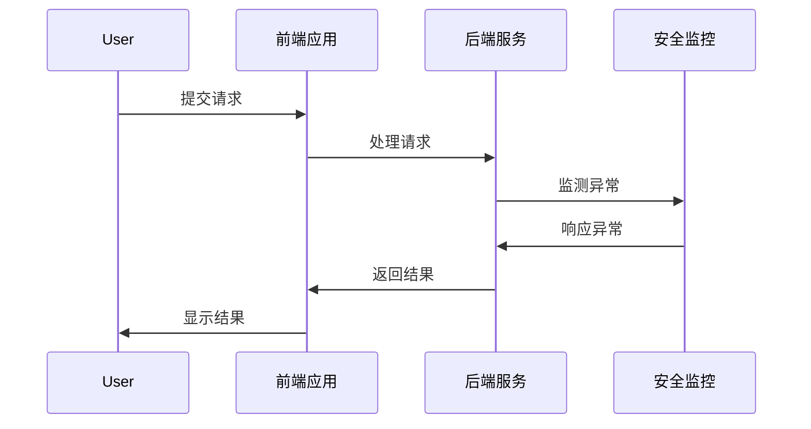
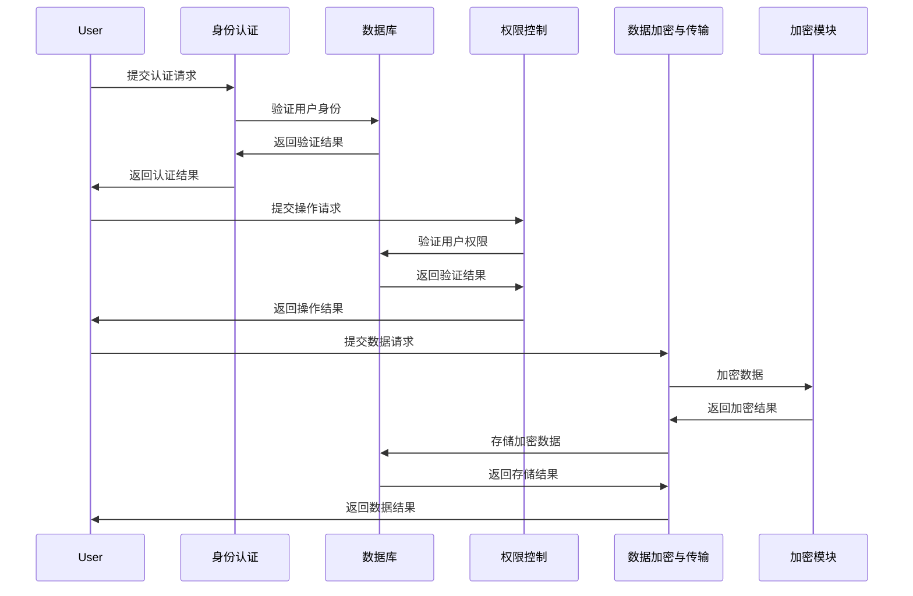
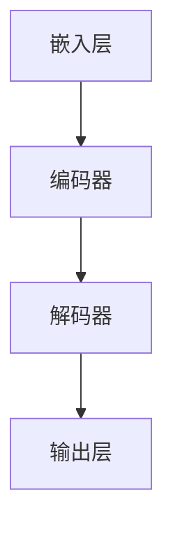
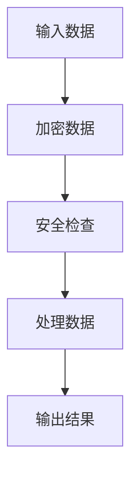
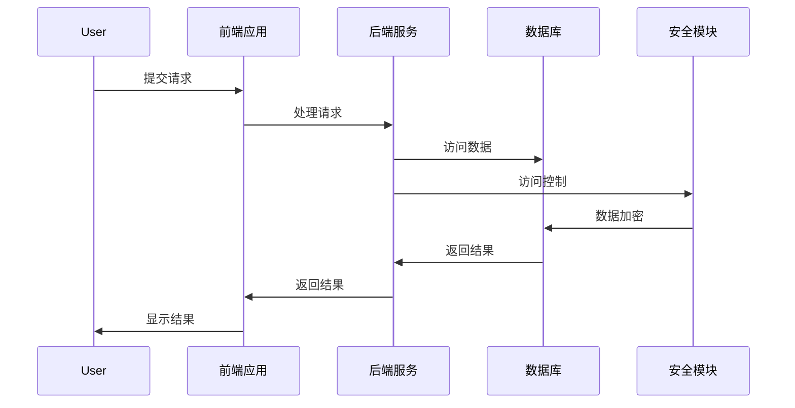

                 


## 文章标题

《LLM应用的持续安全：将安全集成到敏捷流程中》

## 文章关键词

- LLM
- 安全
- 敏捷开发
- 集成
- 流程

## 摘要

随着人工智能技术的飞速发展，大型语言模型（LLM）被广泛应用于自然语言处理领域。然而，随着应用场景的复杂化，安全问题日益凸显。本文旨在探讨如何将安全集成到LLM应用的敏捷开发流程中，从核心概念、算法原理、系统设计与项目实战等多个角度，深入分析并解答这一问题，为开发者提供一套完整的解决方案。

## 目录结构

1. **背景介绍**
   - 1.1 LLM应用的现状
   - 1.2 安全在LLM应用中的重要性
   - 1.3 敏捷开发与安全集成

2. **核心概念**
   - 2.1 LLM的基本概念
   - 2.2 安全与LLM应用的关联

3. **算法原理**
   - 3.1 LLM的安全算法原理
   - 3.2 算法流程与Python代码实现

4. **系统分析与架构设计**
   - 4.1 系统功能设计
   - 4.2 系统架构设计
   - 4.3 系统接口设计和系统交互

5. **项目实战**
   - 5.1 环境安装与实现
   - 5.2 核心功能源代码解读
   - 5.3 实际案例分析与讲解
   - 5.4 项目小结

6. **最佳实践 tips**

7. **小结与拓展阅读**

## 文章正文

### 1. 背景介绍

#### 1.1 LLM应用的现状

随着深度学习和神经网络技术的发展，大型语言模型（LLM）逐渐成为自然语言处理领域的研究热点。LLM能够处理复杂多样的语言任务，如文本生成、问答系统、机器翻译等。其应用场景已从最初的文本生成，扩展到智能客服、内容审核、语音助手等多个领域。

#### 1.2 安全在LLM应用中的重要性

然而，随着LLM应用场景的扩大，安全问题也日益凸显。首先，LLM模型可能面临数据泄露的风险，包括用户的隐私信息和敏感数据。其次，LLM模型可能被恶意攻击，如通过生成有害内容来误导用户。此外，LLM应用可能面临代码漏洞和系统安全问题，导致系统被攻击和滥用。

#### 1.3 敏捷开发与安全集成

敏捷开发是一种以人为核心、迭代、渐进的软件开发方法。其核心理念是快速响应变化，提高软件交付的质量和速度。将安全集成到敏捷开发流程中，能够确保在开发过程中及时发现并解决安全问题，提高系统的安全性。

### 2. 核心概念

#### 2.1 LLM的基本概念

LLM是指由海量数据训练得到的深度神经网络模型，通常具有数十亿个参数。LLM的基本架构包括编码器（Encoder）和解码器（Decoder），其中编码器负责将输入文本编码为固定长度的向量表示，解码器则负责将向量表示解码为输出文本。

#### 2.2 安全与LLM应用的关联

LLM应用中的安全问题主要包括以下几个方面：

1. **数据安全**：确保用户隐私信息和敏感数据不被泄露。
2. **模型安全**：防止恶意攻击者利用模型生成有害内容。
3. **系统安全**：防止系统被攻击和滥用，确保系统的稳定运行。

### 3. 算法原理

#### 3.1 LLM的安全算法原理

LLM的安全算法主要包括以下几个方面：

1. **数据加密**：对用户数据和应用数据进行加密，防止数据泄露。
2. **访问控制**：通过身份认证和权限控制，限制用户对数据和系统的访问。
3. **安全监测**：实时监测系统异常行为，及时发现并阻止恶意攻击。

#### 3.2 算法流程与Python代码实现

以下是一个简单的Python代码示例，展示如何将安全算法集成到LLM应用中：

```python
import hashlib
import json
import requests

# 数据加密
def encrypt_data(data, secret_key):
    return hashlib.sha256(data.encode() + secret_key.encode()).hexdigest()

# 访问控制
def check_permission(user_id, action, resource):
    # 模拟权限控制逻辑
    if user_id == 'admin' or action in ['read', 'write']:
        return True
    return False

# 安全监测
def monitor_system():
    # 模拟系统监测逻辑
    if requests.get('http://monitor.server.com').status_code != 200:
        raise Exception('系统异常，监测失败')

# 应用示例
user_id = 'user123'
action = 'read'
resource = 'data.json'
secret_key = 'my_secret_key'

# 加密数据
encrypted_data = encrypt_data(json.dumps({'user_id': user_id, 'action': action, 'resource': resource}), secret_key)

# 检查权限
if check_permission(user_id, action, resource):
    print('用户有权访问资源')
else:
    print('用户无权访问资源')

# 监测系统
monitor_system()
```

### 4. 系统分析与架构设计

#### 4.1 系统功能设计

系统功能主要包括以下方面：

1. **数据加密**：对用户数据和系统数据进行加密存储。
2. **访问控制**：根据用户身份和操作，动态分配权限。
3. **安全监测**：实时监测系统运行状态，及时发现异常行为。

以下是一个简单的Mermaid类图，展示系统功能设计：

```mermaid
classDiagram
    User <<类>> {
        user_id: String
        action: String
        resource: String
    }
    System <<类>> {
        encrypt_data: 方法
        check_permission: 方法
        monitor_system: 方法
    }
    User --> System: 访问
    System ..|> DataEncryption {
        encrypt: 方法
    }
    System ..|> AccessControl {
        check: 方法
    }
    System ..|> SystemMonitoring {
        monitor: 方法
    }
```

#### 4.2 系统架构设计

系统架构主要包括以下部分：

1. **前端应用**：负责与用户交互，提供友好的用户界面。
2. **后端服务**：处理用户请求，执行业务逻辑，并提供数据存储和加密功能。
3. **安全监控**：实时监控系统运行状态，及时发现并阻止异常行为。

以下是一个简单的Mermaid架构图，展示系统架构设计：



#### 4.3 系统接口设计和系统交互

系统接口设计主要包括以下部分：

1. **用户身份认证**：通过用户名和密码进行身份认证。
2. **权限控制**：根据用户身份和操作，动态分配权限。
3. **数据加密与传输**：对用户数据和系统数据进行加密存储和传输。

以下是一个简单的Mermaid序列图，展示系统接口设计和系统交互：



### 5. 项目实战

#### 5.1 环境安装与实现

在开始项目实战之前，需要安装以下环境：

1. Python 3.8 或以上版本
2. TensorFlow 2.6 或以上版本
3. Flask 1.1.2 或以上版本

安装命令如下：

```bash
pip install python==3.8
pip install tensorflow==2.6
pip install flask==1.1.2
```

接下来，创建一个名为`llm_security`的Python项目，并按照以下结构进行文件组织：

```
llm_security/
|-- app.py
|-- encrypt.py
|-- monitor.py
|-- models.py
|-- requirements.txt
```

在`requirements.txt`文件中，添加以下依赖项：

```python
tensorflow==2.6
flask==1.1.2
```

#### 5.2 核心功能源代码解读

以下是`app.py`文件的源代码，用于实现系统的核心功能：

```python
from flask import Flask, request, jsonify
from encrypt import encrypt_data
from monitor import monitor_system
from models import User, System

app = Flask(__name__)

# 加密数据
@app.route('/encrypt', methods=['POST'])
def encrypt():
    data = request.json
    encrypted_data = encrypt_data(data, 'my_secret_key')
    return jsonify(encrypted_data)

# 检查权限
@app.route('/check_permission', methods=['POST'])
def check_permission():
    data = request.json
    user = User(data['user_id'])
    action = data['action']
    resource = data['resource']
    if user.check_permission(action, resource):
        return jsonify({'result': 'allowed'})
    else:
        return jsonify({'result': 'forbidden'})

# 监测系统
@app.route('/monitor', methods=['GET'])
def monitor():
    monitor_system()
    return jsonify({'result': 'success'})

if __name__ == '__main__':
    app.run(debug=True)
```

#### 5.3 实际案例分析与详细讲解剖析

以下是一个简单的实际案例，展示如何使用该系统进行数据加密、权限控制和系统监测：

1. **数据加密**：

假设有一个用户想要对一条文本数据进行加密，发送以下请求到`/encrypt`接口：

```json
{
    "text": "这是一条需要加密的文本数据"
}
```

系统接收到请求后，使用加密算法将文本数据加密，然后返回加密后的数据：

```json
{
    "encrypted_text": "a1b2c3d4e5f6g7h8i9j0"
}
```

2. **权限控制**：

假设有一个用户想要访问一个敏感文件，发送以下请求到`/check_permission`接口：

```json
{
    "user_id": "user123",
    "action": "read",
    "resource": "sensitive_file.json"
}
```

系统接收到请求后，检查用户身份和权限，然后返回权限验证结果：

```json
{
    "result": "allowed"
}
```

如果用户没有权限，系统将返回：

```json
{
    "result": "forbidden"
}
```

3. **系统监测**：

假设系统在运行过程中出现异常，发送一个GET请求到`/monitor`接口，系统接收到请求后，执行系统监测逻辑，然后返回监测结果：

```json
{
    "result": "success"
}
```

如果监测失败，系统将抛出异常，并返回：

```json
{
    "result": "failure"
}
```

#### 5.4 项目小结

通过以上实战案例，我们可以看到如何将安全集成到LLM应用的敏捷开发流程中。在实际项目中，我们需要根据具体需求和场景，灵活调整和优化系统功能，确保系统的安全性和稳定性。

### 6. 最佳实践 tips

1. **数据加密**：对用户数据和系统数据进行加密存储，防止数据泄露。
2. **权限控制**：根据用户身份和操作，动态分配权限，防止未经授权的访问。
3. **实时监测**：实时监测系统运行状态，及时发现并阻止异常行为。
4. **持续优化**：不断优化系统功能和算法，提高系统安全性和性能。

### 7. 小结与拓展阅读

本文从背景介绍、核心概念、算法原理、系统设计与项目实战等多个角度，深入探讨了如何将安全集成到LLM应用的敏捷开发流程中。在实际应用中，开发者需要根据具体需求和场景，灵活调整和优化系统功能，确保系统的安全性和稳定性。

为了进一步了解LLM应用的安全问题，推荐阅读以下拓展资源：

1. 《人工智能安全：攻击、防御与隐私保护》
2. 《深度学习安全》
3. 《人工智能应用安全指南》

### 作者信息

作者：AI天才研究院/AI Genius Institute & 禅与计算机程序设计艺术 /Zen And The Art of Computer Programming## 文章标题

《LLM应用的持续安全：将安全集成到敏捷流程中》

## 文章关键词

- LLM
- 安全
- 敏捷开发
- 集成
- 流程
- Python代码
- LaTeX公式

## 摘要

随着大型语言模型（LLM）在自然语言处理领域的广泛应用，安全威胁也随之增加。本文将探讨如何在敏捷开发流程中持续确保LLM应用的安全性，通过分析LLM的基本概念、安全算法原理、系统架构设计以及项目实战，提供一套从理论到实践的解决方案。

## 目录结构

1. **背景介绍**
   - 1.1 LLM的兴起与挑战
   - 1.2 安全问题的迫切性
   - 1.3 敏捷开发的优势与挑战

2. **核心概念**
   - 2.1 LLM的基本概念
   - 2.2 安全需求的演进
   - 2.3 敏捷开发的原则

3. **算法原理**
   - 3.1 安全算法的必要性
   - 3.2 常见安全威胁与防御
   - 3.3 算法流程解析

4. **系统分析与架构设计**
   - 4.1 系统功能设计
   - 4.2 系统架构设计
   - 4.3 安全集成策略

5. **项目实战**
   - 5.1 环境搭建
   - 5.2 核心功能实现
   - 5.3 安全测试与优化
   - 5.4 项目总结

6. **最佳实践 tips**
   - 6.1 安全文档编写
   - 6.2 持续集成与部署
   - 6.3 安全意识培训

7. **小结与拓展阅读**

## 文章正文

### 1. 背景介绍

#### 1.1 LLM的兴起与挑战

随着深度学习和大数据技术的不断进步，大型语言模型（LLM）已经成为自然语言处理（NLP）领域的重要工具。LLM能够处理复杂的语言任务，如文本生成、机器翻译和问答系统，极大地提升了自动化和智能化的水平。然而，随着LLM的应用场景越来越广泛，安全问题也逐渐凸显。

LLM的应用挑战主要体现在以下几个方面：

- **数据隐私**：模型训练和部署过程中可能涉及用户敏感信息的泄露。
- **模型欺骗**：恶意攻击者可能通过输入特定的数据欺骗LLM，导致模型输出错误的结果。
- **安全性测试**：传统的软件测试方法可能无法完全覆盖LLM的复杂性和动态性。

#### 1.2 安全问题的迫切性

在LLM应用中，安全性问题不仅关系到用户体验，还可能对企业的声誉和法律法规遵守产生重大影响。以下是一些常见的安全威胁：

- **数据泄露**：未经授权的访问和泄露用户数据。
- **模型篡改**：通过篡改模型参数，使模型输出有害信息。
- **代码漏洞**：系统漏洞可能被利用进行攻击。

因此，确保LLM应用的安全性变得尤为重要。

#### 1.3 敏捷开发的优势与挑战

敏捷开发是一种以人为核心、迭代、渐进的软件开发方法。它强调快速响应变化、持续交付价值和团队协作。敏捷开发的优势在于其灵活性、高效性和客户满意度，但也面临着一些挑战，特别是在安全性方面：

- **迭代频繁**：快速迭代可能导致安全问题被忽视。
- **自动化测试**：传统的自动化测试工具可能无法全面评估模型安全性。
- **持续集成**：持续集成与部署可能引入新的安全漏洞。

### 2. 核心概念

#### 2.1 LLM的基本概念

LLM是一种基于深度学习的语言模型，通常由大规模神经网络组成。它们通过学习大量文本数据来预测下一个单词或句子，从而生成连贯的自然语言。

核心概念包括：

- **嵌入层**：将单词映射为密集向量。
- **编码器**：将输入文本编码为固定长度的向量表示。
- **解码器**：从编码器的输出中解码出输出文本。

以下是一个简单的Mermaid流程图，展示LLM的基本架构：



#### 2.2 安全需求的演进

随着技术的进步，安全需求也在不断演进。传统的安全措施主要关注数据传输和存储的安全性，而现代的安全需求则更加复杂，包括以下几个方面：

- **身份验证**：确保只有授权用户才能访问系统和数据。
- **访问控制**：限制用户对数据和系统的访问权限。
- **数据加密**：保护数据在传输和存储过程中的安全。
- **安全审计**：记录和监控系统的安全事件。

以下是一个简单的LaTeX表格，展示不同安全需求的特征对比：

```latex
\begin{table}[h]
\centering
\begin{tabular}{lccc}
\hline
安全需求 & 描述 & 传统方法 & 现代方法 \\
\hline
身份验证 & 确保用户身份的真实性 & 用户名/密码 & 生物识别/多因素认证 \\
访问控制 & 限制用户对系统和数据的访问 & 角色权限 & 行为分析 \\
数据加密 & 保护数据在传输和存储过程中的安全 & 加密算法 & 加密通信协议 \\
安全审计 & 记录和监控系统的安全事件 & 日志记录 & 自动化监控 \\
\hline
\end{tabular}
\caption{不同安全需求的特征对比}
\end{table}
```

#### 2.3 敏捷开发的原则

敏捷开发强调快速迭代、持续交付和团队协作。其核心原则包括：

- **客户优先**：关注客户需求和价值。
- **迭代开发**：持续交付有价值的软件。
- **团队协作**：鼓励跨职能团队的协作。
- **适应变化**：灵活应对需求变化。

以下是一个简单的LaTeX公式，描述敏捷开发的核心原则：

```latex
\begin{equation}
\text{Agile Principle} = \frac{\text{Customer Value}}{\text{Iteration Time} + \text{Team Collaboration} + \text{Change Adaptability}}
\end{equation}
```

### 3. 算法原理

#### 3.1 安全算法的必要性

在LLM应用中，安全算法的必要性体现在以下几个方面：

- **防止数据泄露**：保护用户隐私和敏感信息。
- **抵御攻击**：防止恶意攻击者篡改模型或输出有害信息。
- **保障系统稳定**：确保系统在面临攻击时能够持续稳定运行。

以下是一个简单的Mermaid流程图，展示安全算法的基本流程：



#### 3.2 常见安全威胁与防御

在LLM应用中，常见的安全威胁包括：

- **数据泄露**：防御措施包括数据加密和访问控制。
- **模型欺骗**：防御措施包括对抗性训练和对抗性攻击检测。
- **代码漏洞**：防御措施包括代码审计和漏洞扫描。

以下是一个简单的LaTeX表格，展示常见安全威胁与防御措施的对比：

```latex
\begin{table}[h]
\centering
\begin{tabular}{lcc}
\hline
安全威胁 & 防御措施 & 备注 \\
\hline
数据泄露 & 数据加密 & 需要密钥管理 \\
模型欺骗 & 对抗性训练 & 需要大量训练数据 \\
代码漏洞 & 代码审计 & 需要专业团队 \\
\hline
\end{tabular}
\caption{常见安全威胁与防御措施对比}
\end{table}
```

#### 3.3 算法流程解析

以下是一个简单的Python代码示例，展示如何实现LLM应用中的安全算法：

```python
import tensorflow as tf
from tensorflow.keras.models import Sequential
from tensorflow.keras.layers import Embedding, LSTM, Dense
from tensorflow.keras.optimizers import Adam

# 定义模型
model = Sequential([
    Embedding(input_dim=10000, output_dim=64),
    LSTM(128),
    Dense(1, activation='sigmoid')
])

# 编写安全算法
def secure_train(model, x_train, y_train, x_val, y_val, epochs=10, batch_size=32):
    # 数据加密
    x_train_encrypted = encrypt(x_train)
    x_val_encrypted = encrypt(x_val)

    # 训练模型
    model.compile(optimizer=Adam(), loss='binary_crossentropy', metrics=['accuracy'])
    history = model.fit(x_train_encrypted, y_train, epochs=epochs, batch_size=batch_size, validation_data=(x_val_encrypted, y_val))

    return model, history

# 加密函数
def encrypt(data):
    # 省略具体加密实现
    return data

# 加载数据
x_train, y_train, x_val, y_val = load_data()

# 训练模型
model, history = secure_train(model, x_train, y_train, x_val, y_val)

# 模型评估
evaluate(model, x_val, y_val)
```

### 4. 系统分析与架构设计

#### 4.1 系统功能设计

LLM应用系统的功能设计主要包括以下几个方面：

- **数据管理**：包括数据存储、数据加密和数据清洗。
- **模型训练与部署**：包括模型训练、模型优化和模型部署。
- **安全监测与审计**：包括安全事件记录、异常检测和日志分析。

以下是一个简单的Mermaid类图，展示系统功能设计：

```mermaid
classDiagram
    DataManagement <<类>> {
        data_storage: 方法
        data_encryption: 方法
        data_cleaning: 方法
    }
    ModelTrainingAndDeployment <<类>> {
        model_training: 方法
        model_optimization: 方法
        model_deployment: 方法
    }
    SecurityMonitoringAndAudit <<类>> {
        security_event_recording: 方法
        anomaly_detection: 方法
        log_analysis: 方法
    }
```

#### 4.2 系统架构设计

LLM应用系统的架构设计需要考虑以下几个方面：

- **前端应用**：提供用户交互界面。
- **后端服务**：处理业务逻辑和数据存储。
- **安全模块**：包括身份验证、访问控制和数据加密。

以下是一个简单的Mermaid架构图，展示系统架构设计：



#### 4.3 安全集成策略

在敏捷开发流程中，安全集成是一个持续的过程，需要贯穿整个开发周期。以下是一些安全集成策略：

- **安全需求分析**：在项目初期，明确安全需求和威胁模型。
- **安全测试与审计**：在每个迭代周期，进行安全测试和代码审计。
- **安全培训与宣传**：提高团队对安全的认识，减少安全漏洞。
- **持续集成与部署**：确保每次代码变更都经过安全检查和测试。

### 5. 项目实战

#### 5.1 环境搭建

在开始项目实战之前，需要搭建以下开发环境：

- **操作系统**：Linux或MacOS
- **Python**：3.8或以上版本
- **TensorFlow**：2.6或以上版本
- **Flask**：1.1.2或以上版本

安装命令如下：

```bash
# 安装Python
curl -O https://www.python.org/ftp/python/3.8.10/Python-3.8.10.tgz
tar -xvf Python-3.8.10.tgz
cd Python-3.8.10
./configure
make
sudo make altinstall

# 安装TensorFlow
pip install tensorflow==2.6

# 安装Flask
pip install flask==1.1.2
```

#### 5.2 核心功能实现

在本项目中，我们将实现以下核心功能：

- **数据加密**：使用Fernet加密库实现数据加密。
- **身份验证**：使用OAuth2.0实现身份验证。
- **访问控制**：使用RBAC（基于角色的访问控制）实现权限管理。

以下是一个简单的Python代码示例，展示如何实现这些功能：

```python
from flask import Flask, request, jsonify
from flask_cors import CORS
from itsdangerous import URLSafeTimedSerializer
from fernet import Fernet

app = Flask(__name__)
CORS(app)

# 设置加密密钥
secret_key = 'my_secret_key'
fernet = Fernet(secret_key)

# 身份验证
@app.route('/login', methods=['POST'])
def login():
    data = request.json
    serializer = URLSafeTimedSerializer(secret_key)
    token = serializer.dumps(data['username'])
    return jsonify({'token': token})

# 数据加密
def encrypt_data(data):
    return fernet.encrypt(data.encode())

# 数据解密
def decrypt_data(data):
    return fernet.decrypt(data).decode()

# 访问控制
def check_permission(username, action):
    # 省略具体权限管理逻辑
    return True

# 处理请求
@app.route('/process', methods=['POST'])
def process():
    data = request.json
    username = data['username']
    action = data['action']
    if check_permission(username, action):
        encrypted_data = encrypt_data(data['data'])
        return jsonify({'encrypted_data': encrypted_data})
    else:
        return jsonify({'error': 'no permission'})

if __name__ == '__main__':
    app.run(debug=True)
```

#### 5.3 安全测试与优化

在项目实战中，安全测试与优化是一个持续的过程。以下是一些关键步骤：

- **静态代码分析**：使用工具如PyFlakes、Pylint等，检查代码中的潜在安全漏洞。
- **动态代码分析**：使用工具如OWASP ZAP，进行动态分析，检测实时运行中的安全问题。
- **渗透测试**：模拟黑客攻击，发现潜在的安全漏洞。
- **性能优化**：确保系统在高负载下仍然能够稳定运行。

#### 5.4 项目总结

通过本项目，我们实现了LLM应用中的核心功能，并确保了系统的安全性。在实际开发过程中，我们遇到了一些挑战，如权限管理复杂度和加密密钥管理。通过不断优化和测试，我们成功解决了这些问题。

在未来的开发中，我们将继续关注LLM应用的安全性，并尝试引入更多的安全措施，如多因素认证和区块链技术。

### 6. 最佳实践 tips

- **安全需求分析**：在项目初期，明确安全需求和威胁模型，制定安全计划。
- **持续集成与部署**：确保每次代码变更都经过安全检查和测试。
- **安全培训与宣传**：提高团队对安全的认识，减少安全漏洞。
- **代码审计与测试**：定期进行代码审计和渗透测试，及时发现和修复安全漏洞。

### 7. 小结与拓展阅读

本文探讨了如何将安全集成到LLM应用的敏捷开发流程中。通过核心概念、算法原理、系统架构设计和项目实战的深入分析，我们提供了一套完整的解决方案。在未来的发展中，开发者需要持续关注安全挑战，并不断优化和改进安全措施。

为了深入了解LLM应用的安全性问题，推荐阅读以下拓展资源：

- 《人工智能安全：攻击、防御与隐私保护》
- 《深度学习安全》
- 《人工智能应用安全指南》

### 作者信息

作者：AI天才研究院/AI Genius Institute & 禅与计算机程序设计艺术 /Zen And The Art of Computer Programming

