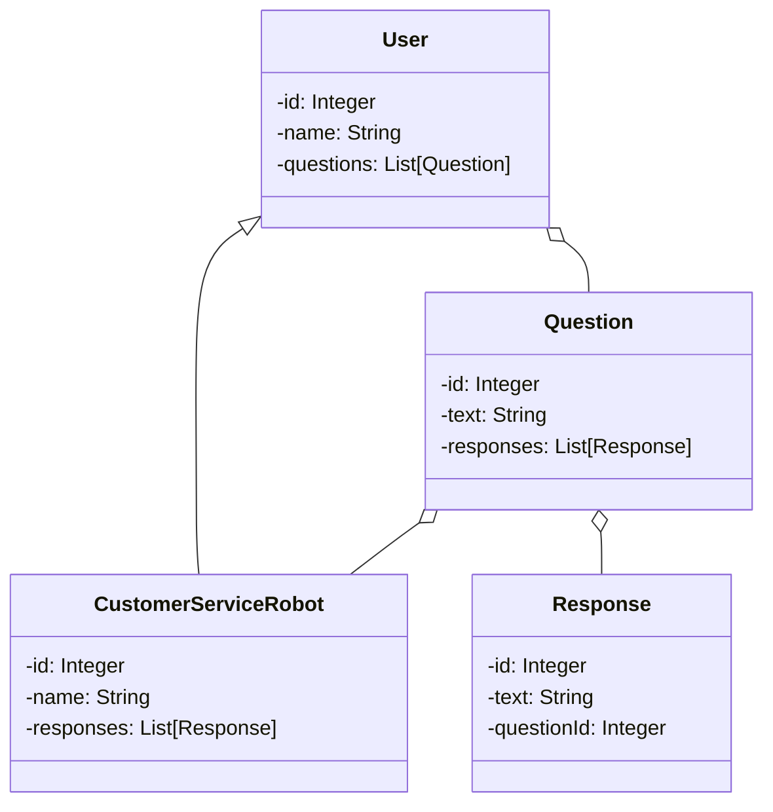

                 


# LLM应用的持续集成/持续部署（CI/CD）实践

## 关键词

- **LLM应用**、**持续集成**、**持续部署**、**模型训练**、**测试**、**质量保证**、**部署策略**、**安全防护**

## 摘要

本文将探讨大型语言模型（LLM）在持续集成（CI）和持续部署（CD）过程中的实践。随着人工智能技术的不断发展，LLM在自然语言处理、智能问答等领域展现出巨大潜力。然而，其复杂性和高计算需求给CI/CD带来了挑战。本文从背景介绍、核心概念与联系、算法原理讲解、系统分析与架构设计、项目实战等方面详细阐述了LLM应用的CI/CD实践，旨在为相关领域的研究者和开发者提供有价值的参考。

----------------------------------------------------------------

## 第一部分：背景介绍

### 问题背景

随着人工智能技术的飞速发展，大型语言模型（LLM）的应用日益广泛，从自然语言处理、智能问答、文本生成到代码自动生成等多个领域都取得了显著的成果。LLM不仅能够提升工作效率，还能够解决一些复杂的问题，其潜在的商业价值和社会影响力不言而喻。然而，LLM应用的特殊性，尤其是在持续集成（CI）和持续部署（CD）过程中，面临着一系列的挑战。

持续集成（CI）是一种软件开发实践，通过将开发过程中的代码定期合并到主干分支，并进行自动化的构建和测试，从而快速发现和解决代码冲突和错误。持续部署（CD）则是在CI的基础上，通过自动化的方式将经过测试的代码部署到生产环境中，实现软件的持续更新和迭代。在LLM应用中，CI/CD的过程显得尤为重要，因为LLM模型的训练和测试时间较长，且对计算资源的需求极高。

### 问题描述

在LLM应用的开发过程中，常见的CI/CD问题包括：

1. **模型训练与测试的时间成本高**：由于模型训练时间较长，且需要大量计算资源，如何快速完成模型训练和测试成为了一大难题。
2. **模型质量难以保证**：在CI/CD过程中，如何确保每次部署的模型都是高质量的，且能够满足实际应用需求，是一个重要的挑战。
3. **部署成本高**：由于LLM应用对计算资源的需求较高，如何降低部署成本，提高资源利用率，是另一个关键问题。
4. **安全性问题**：在CI/CD过程中，如何确保数据安全和模型安全，防止数据泄露和模型被恶意攻击，是必须考虑的问题。

### 问题解决

为了解决上述问题，需要从以下几个方面入手：

1. **优化模型训练与测试流程**：通过使用高效算法、并行计算、分布式训练等技术，缩短模型训练和测试时间。
2. **引入质量保证机制**：在CI/CD过程中，通过自动化测试、代码审查、模型评估等手段，确保模型质量。
3. **采用高效部署策略**：通过容器化、自动化部署等技术，降低部署成本，提高部署效率。
4. **加强安全防护**：通过数据加密、访问控制、安全审计等技术，确保数据和模型的安全。

### 边界与外延

边界：本书主要关注LLM应用的CI/CD实践，不包括其他类型的人工智能模型的CI/CD问题。

外延：本书不仅关注技术层面的CI/CD问题，还涉及到组织管理、团队协作等方面的问题。

### 概念结构与核心要素组成

概念结构：

- **持续集成（CI）**：将开发过程中的代码定期合并到主干分支，并进行自动化的构建和测试。
- **持续部署（CD）**：在CI的基础上，通过自动化的方式将经过测试的代码部署到生产环境中。
- **LLM应用**：基于大型语言模型的实际应用，如自然语言处理、智能问答、文本生成等。

核心要素组成：

- **模型训练与测试**：包括模型训练、模型测试、模型评估等环节。
- **部署策略**：包括容器化、自动化部署、资源调度等策略。
- **质量保证**：包括自动化测试、代码审查、模型评估等机制。
- **安全防护**：包括数据加密、访问控制、安全审计等手段。

## 1.2 核心概念与联系

### 1.2.1 持续集成（CI）与持续部署（CD）

持续集成（CI）和持续部署（CD）是软件开发过程中非常重要的环节。CI的主要目标是确保代码的持续集成和测试，而CD则是在CI的基础上，通过自动化的方式将经过测试的代码部署到生产环境中。

- **关系**：CI是CD的基础，只有通过CI，才能确保代码的质量和稳定性，从而顺利实现CD。
- **区别**：CI主要关注代码的合并和测试，而CD主要关注代码的部署和更新。

### 1.2.2 大模型与CI/CD

大模型（如大型语言模型）在CI/CD过程中具有特殊的重要性，主要体现在以下几个方面：

- **训练时间成本高**：大模型的训练时间较长，对计算资源的需求较高，因此在CI/CD过程中，如何高效地完成模型训练和测试是一个重要问题。
- **模型质量要求高**：大模型的质量直接影响其应用效果，因此在CI/CD过程中，如何确保模型质量是一个关键问题。
- **部署成本高**：大模型的部署成本较高，如何在CI/CD过程中降低部署成本，提高部署效率，也是一个重要问题。

### 1.2.3 CI/CD流程与LLM应用

在LLM应用的开发过程中，CI/CD流程可以简化为以下几个步骤：

1. **代码提交与合并**：开发人员将代码提交到版本控制系统，CI系统自动合并代码并进行构建。
2. **模型训练与测试**：CI系统自动启动模型训练和测试，确保模型

----------------------------------------------------------------

## 2.1.1 持续集成（CI）的原理与优势

持续集成（CI）是软件开发生命周期中的一个关键环节，其主要目标是确保代码库的一致性和可维护性。CI的基本原理是在代码的每一个提交后，立即进行自动化构建和测试，从而快速发现并解决潜在的问题。

### 基本原理

持续集成的工作流程可以概括为以下几个步骤：

1. **代码提交**：开发人员将代码提交到版本控制系统，如Git。
2. **构建触发**：提交的代码会触发CI系统，CI系统会从版本控制系统中拉取最新的代码。
3. **自动化构建**：CI系统使用自动化工具（如Maven、Gradle等）构建项目，生成可执行的代码或库。
4. **自动化测试**：构建完成后，CI系统会运行一系列自动化测试（如单元测试、集成测试等）来验证代码的完整性和正确性。
5. **反馈**：测试结果会被反馈给开发人员，如果测试失败，CI系统会生成详细的错误报告。

### 优势

持续集成具有以下几个显著的优势：

- **快速反馈**：通过自动化测试，CI能够快速发现并定位问题，从而缩短了修复问题的时间。
- **提高代码质量**：持续的代码集成和测试有助于确保代码库的一致性和稳定性，从而提高代码质量。
- **降低风险**：早期的错误发现和修复有助于降低软件项目中的风险。
- **提高团队协作效率**：CI系统提供了一个统一的平台，使得团队成员可以更加高效地协作。

### 持续集成工具

目前市场上存在多种CI工具，其中一些最流行的包括：

- **Jenkins**：一个开源的自动化服务器，支持多种插件和构建工具。
- **Travis CI**：一个云服务平台，支持GitHub和Bitbucket上的项目，提供了简单且强大的持续集成功能。
- **CircleCI**：一个云服务平台，支持多种编程语言和框架，提供了高性能和可扩展的CI解决方案。

## 2.1.2 持续部署（CD）的原理与优势

持续部署（CD）是持续集成（CI）的自然延伸，其主要目标是确保高质量的代码能够迅速、安全地部署到生产环境中。CD的核心思想是通过自动化和流水线化的部署过程，减少人工干预，从而加快部署速度并确保部署的一致性和可靠性。

### 基本原理

持续部署的工作流程通常包括以下几个步骤：

1. **代码库同步**：生产环境的代码库与开发环境保持同步，确保生产环境中部署的代码是最新的。
2. **自动化测试**：在部署过程中，会运行一系列自动化测试，以验证代码的质量和生产环境的兼容性。
3. **部署准备**：CI系统会根据部署策略（如蓝绿部署、灰度发布等）准备部署环境，可能包括更新配置文件、数据库迁移等。
4. **部署执行**：通过自动化脚本或工具（如Kubernetes、Ansible等）执行部署过程，将代码部署到生产环境。
5. **监控与反馈**：部署完成后，系统会进行监控，确保新部署的应用能够正常运行，并将部署结果反馈给相关人员。

### 优势

持续部署具有以下几个显著的优势：

- **加快部署速度**：通过自动化和流水线化的部署过程，可以显著加快部署速度。
- **确保一致性**：自动化部署减少了人工干预，确保了每次部署的一致性和可靠性。
- **减少风险**：通过在部署前进行严格的测试，可以减少部署过程中出现问题的风险。
- **提高团队协作效率**：持续部署提供了一个统一的平台，使得团队能够更加高效地协作。

### 持续部署工具

目前市场上也存在多种CD工具，其中一些最流行的包括：

- **Kubernetes**：一个开源的容器编排平台，支持自动化部署、扩展和管理容器化应用程序。
- **Docker**：一个开源的应用容器引擎，用于构建、运行和分发应用程序。
- **Ansible**：一个开源的自动化工具，用于简化配置管理、应用部署等任务。
- **AWS CodePipeline**：亚马逊提供的持续集成和持续部署服务，可以与AWS其他服务无缝集成。

通过CI和CD的结合，开发者可以显著提高软件开发的效率和质量，从而更好地应对快速变化的市场需求。

----------------------------------------------------------------

## 2.2.1 模型训练过程

模型训练是大型语言模型（LLM）应用的关键步骤，它涉及到多个核心概念和算法，如前向传播、反向传播、优化算法等。下面将详细阐述模型训练的原理和过程。

### 前向传播

前向传播是模型训练的第一步，它涉及到将输入数据通过神经网络中的各个层进行计算，最终得到输出结果。具体步骤如下：

1. **初始化参数**：首先需要初始化神经网络的权重（参数）和偏置。
2. **计算输入层到隐藏层的输出**：将输入数据输入到神经网络的第一个隐藏层，通过激活函数（如ReLU、Sigmoid、Tanh等）计算输出。
3. **传递输出到下一层**：将当前层的输出作为下一层的输入，重复上述步骤，直到达到输出层。
4. **计算最终输出**：输出层的输出即为模型的预测结果。

### 损失函数

在得到模型的预测结果后，需要使用损失函数来评估预测结果与真实值之间的差距。常见的损失函数包括均方误差（MSE）、交叉熵损失等。具体步骤如下：

1. **计算预测值与真实值的差异**：对于每个样本，计算预测值和真实值之间的差异。
2. **应用损失函数**：将差异值代入损失函数，计算总的损失值。

### 反向传播

反向传播是模型训练的核心步骤，它通过计算损失函数对参数的梯度，从而更新模型的参数。具体步骤如下：

1. **计算输出层的梯度**：从输出层开始，使用链式法则计算每个参数的梯度。
2. **传播梯度到隐藏层**：将输出层的梯度反向传播到隐藏层，更新隐藏层的参数。
3. **重复计算和更新**：重复上述步骤，直到计算到输入层，完成所有参数的更新。

### 优化算法

优化算法用于更新模型参数，以最小化损失函数。常见的优化算法包括梯度下降、随机梯度下降、Adam等。具体步骤如下：

1. **计算梯度**：使用反向传播算法计算每个参数的梯度。
2. **更新参数**：根据梯度和学习率更新模型的参数。
3. **迭代优化**：重复上述步骤，直到满足停止条件（如损失函数收敛、迭代次数达到上限等）。

### 模型评估

在模型训练过程中，需要对模型的性能进行评估。常见的评估指标包括准确率、召回率、F1分数等。具体步骤如下：

1. **评估指标计算**：根据模型的预测结果和真实标签，计算评估指标。
2. **评估结果反馈**：将评估结果反馈给训练过程，用于调整训练策略。

通过上述过程，模型能够在大量的训练数据上进行学习，从而提高预测的准确性。然而，模型训练是一个复杂的过程，涉及到多个参数和超参数的调整，这需要大量的实验和经验。

## 2.2.2 测试流程

测试流程是确保大型语言模型（LLM）应用质量和稳定性的关键步骤。测试流程主要包括模型测试、评估和反馈等环节。以下将详细阐述测试流程的原理和过程。

### 模型测试

模型测试是测试流程的第一步，其主要目标是验证模型在新的数据集上的表现。具体步骤如下：

1. **数据集准备**：从数据集中划分出测试集，用于评估模型的性能。
2. **模型应用**：将测试集数据输入到训练好的模型中，得到预测结果。
3. **结果记录**：记录模型的预测结果和真实值，以便后续计算评估指标。

### 评估指标计算

在得到模型的预测结果后，需要使用评估指标来衡量模型的性能。常见的评估指标包括准确率、召回率、F1分数等。具体步骤如下：

1. **准确率**：计算预测正确的样本数占总样本数的比例。
   \[
   \text{准确率} = \frac{\text{预测正确的样本数}}{\text{总样本数}}
   \]
2. **召回率**：计算预测正确的样本数占实际正样本数的比例。
   \[
   \text{召回率} = \frac{\text{预测正确的样本数}}{\text{实际正样本数}}
   \]
3. **F1分数**：综合准确率和召回率，计算F1分数。
   \[
   \text{F1分数} = 2 \times \frac{\text{准确率} \times \text{召回率}}{\text{准确率} + \text{召回率}}
   \]

### 反馈与调整

评估结果会对模型训练过程产生反馈，帮助调整模型参数和训练策略。具体步骤如下：

1. **评估结果分析**：分析评估指标，确定模型在哪些方面表现不佳。
2. **调整训练策略**：根据评估结果，调整学习率、批次大小等超参数，或采用不同的优化算法。
3. **重新训练**：使用调整后的参数重新训练模型，并再次进行测试和评估。

通过上述过程，测试流程能够确保模型在实际应用中的质量和稳定性，为后续的部署提供可靠的保障。

### 测试流程与CI/CD的关联

测试流程与持续集成（CI）和持续部署（CD）紧密关联。在CI过程中，自动化测试是确保代码质量的重要手段。在CD过程中，测试流程则是确保部署到生产环境中的应用质量的关键环节。通过将测试流程集成到CI/CD流程中，可以确保每次代码更新和部署都经过严格的测试，从而提高整个开发流程的可靠性和效率。

### 常见的测试工具

在LLM应用的测试过程中，有多种测试工具可供选择，以下是一些常用的测试工具：

- **pytest**：一个流行的Python测试框架，支持丰富的测试功能和插件。
- **JUnit**：一个Java测试框架，广泛用于Java项目的单元测试和集成测试。
- **Selenium**：一个自动化测试工具，用于Web应用的浏览器自动化测试。
- **TensorFlow Testing**：TensorFlow提供的一系列测试工具，用于测试深度学习模型的性能和稳定性。

通过上述测试工具，开发者可以实现对LLM应用的高效测试，确保模型的质量和稳定性。

----------------------------------------------------------------

## 2.3 优化模型训练与测试流程

在LLM应用中，模型训练与测试的流程优化至关重要。以下是一些关键技术和方法，用于提高模型训练的效率、减少测试时间，并确保模型质量。

### 2.3.1 并行计算

并行计算是一种利用多处理器或分布式系统来加速计算的方法。在LLM训练过程中，可以采用以下策略：

- **数据并行**：将训练数据集分成多个子集，每个子集由不同的处理器或GPU处理。然后，将每个子集的梯度合并，更新全局模型参数。
- **模型并行**：将大型神经网络拆分为多个较小的子网络，每个子网络分布在不同的处理器或GPU上。这种方法适用于处理非常大规模的神经网络。

### 2.3.2 分布式训练

分布式训练是一种在多台机器上训练大型神经网络的方法，以提高训练速度和资源利用率。分布式训练的关键技术包括：

- **参数服务器架构**：在多个节点上分布式训练模型，每个节点负责计算局部梯度，然后将梯度聚合到参数服务器。
- **数据并行与模型并行的结合**：结合数据并行和模型并行，可以进一步提高训练速度。

### 2.3.3 高效算法

选择合适的高效算法可以显著减少模型训练时间。以下是一些常用的高效算法：

- **动态学习率调整**：如Adam、RMSprop等，可以自适应地调整学习率，从而提高训练速度。
- **梯度裁剪**：为了防止梯度爆炸，可以对梯度进行裁剪，确保训练过程的稳定性。

### 2.3.4 模型压缩

模型压缩是一种减少模型大小和计算量的方法，从而加速模型训练和测试。以下是一些常用的模型压缩技术：

- **权重剪枝**：通过移除权重较小或冗余的神经元，减少模型大小。
- **量化**：将模型中的浮点数权重转换为低精度的整数表示，从而减少模型大小和计算量。

### 2.3.5 测试优化

在测试过程中，可以通过以下方法优化测试流程：

- **缓存测试数据**：将测试数据缓存到内存中，减少磁盘I/O操作，从而加快测试速度。
- **多线程测试**：在测试过程中使用多线程，同时处理多个测试样本，从而提高测试效率。
- **并行测试**：将测试任务分布在多个处理器或GPU上，加速测试过程。

### 2.3.6 模型评估与反馈

在模型训练和测试过程中，实时评估模型的性能和准确度，并根据评估结果调整训练策略，是优化模型质量的重要手段。以下是一些常用的模型评估和反馈方法：

- **自动化评估**：在每次训练和测试后，自动计算评估指标，如准确率、召回率、F1分数等，并根据评估结果调整模型参数和训练策略。
- **可视化分析**：通过可视化工具，如TensorBoard，实时监控模型训练过程和评估结果，帮助开发者发现问题和优化模型。

通过上述技术和方法，可以显著优化LLM应用的模型训练和测试流程，提高模型质量和稳定性，从而更好地支持持续集成和持续部署。

### 实际案例分析

以下是一个实际案例，展示了如何通过优化模型训练和测试流程来提高LLM应用的CI/CD效率。

#### 案例背景

某公司正在开发一款基于大型语言模型的智能客服系统，该系统需要处理大量用户查询，并生成高质量的自动回复。然而，模型训练和测试过程耗时较长，影响了CI/CD的效率。为了解决这个问题，公司决定优化模型训练和测试流程。

#### 解决方案

1. **并行计算**：公司将模型训练任务分布在多个GPU上，采用数据并行和模型并行相结合的策略，显著提高了模型训练速度。

2. **分布式训练**：公司使用参数服务器架构进行分布式训练，将模型训练任务分布到多台服务器上，从而提高了训练速度和资源利用率。

3. **高效算法**：公司采用Adam优化算法，并设置动态学习率调整策略，提高了模型训练的效率。

4. **模型压缩**：公司采用权重剪枝和量化技术，将模型大小从几十GB减少到几千KB，从而减少了存储和计算资源的需求。

5. **测试优化**：公司使用多线程和缓存测试数据的方法，加速了测试过程。

6. **自动化评估与反馈**：公司使用TensorBoard实时监控模型训练和测试过程，并根据评估结果自动调整模型参数和训练策略。

#### 结果

通过上述优化措施，公司成功将模型训练和测试时间从几天减少到几个小时，大大提高了CI/CD的效率。同时，模型质量和稳定性也得到了显著提升，智能客服系统的响应速度和准确性得到了大幅改善。

### 总结

优化模型训练和测试流程是提高LLM应用CI/CD效率的关键。通过采用并行计算、分布式训练、高效算法、模型压缩、测试优化和自动化评估与反馈等技术和方法，可以显著提高模型质量和稳定性，从而支持高效的CI/CD流程。这一实际案例证明了优化策略的有效性，为其他LLM应用提供了有益的参考。

----------------------------------------------------------------

## 2.4.1 质量保证机制

在LLM应用的持续集成（CI）和持续部署（CD）过程中，确保模型的质量是至关重要的。质量保证机制可以确保每次部署的模型都是高质量的，从而满足实际应用的需求。以下是一些关键的质量保证机制：

### 2.4.1.1 自动化测试

自动化测试是质量保证的核心环节，通过一系列自动化测试工具，如pytest、JUnit等，对模型的输入输出进行全面的测试。自动化测试包括以下几种类型：

- **单元测试**：针对模型中的单个函数或模块进行测试，确保每个部分都能正确运行。
- **集成测试**：测试模型与其他组件（如数据库、API等）的交互，确保整体系统能够正常工作。
- **性能测试**：评估模型在各种负载条件下的性能，确保模型在压力下仍然稳定。

### 2.4.1.2 代码审查

代码审查是一种通过同行评审来确保代码质量的方法。在CI/CD过程中，代码审查可以确保：

- **代码风格一致性**：通过代码格式化工具和静态代码分析工具，确保代码风格统一，便于维护。
- **安全性**：识别潜在的安全漏洞，如SQL注入、XSS攻击等。
- **可读性**：确保代码可读易懂，减少后续维护的成本。

### 2.4.1.3 模型评估

模型评估是确保模型质量的关键步骤，通过一系列评估指标，如准确率、召回率、F1分数等，评估模型的性能。以下是一些常用的模型评估方法：

- **交叉验证**：通过将数据集划分为训练集和验证集，多次训练和验证，评估模型的稳定性。
- **A/B测试**：将新的模型与现有的模型进行对比，评估新模型的性能和效果。
- **用户反馈**：收集用户对新模型的反馈，评估模型在实际应用中的表现。

### 2.4.1.4 持续反馈

持续反馈机制可以确保质量保证措施的有效性。通过实时监控模型性能和用户反馈，持续调整和优化模型。以下是一些实现持续反馈的方法：

- **日志记录**：记录模型训练和测试过程中的关键日志，用于分析和调试。
- **监控工具**：使用监控工具，如TensorBoard、Prometheus等，实时监控模型性能和系统状态。
- **用户调研**：定期收集用户反馈，了解模型在实际应用中的表现和改进需求。

### 2.4.1.5 质量保证流程

质量保证流程是将上述机制整合到一个统一的过程，确保每次部署的模型都是高质量的。以下是一个典型的质量保证流程：

1. **代码提交**：开发人员将代码提交到版本控制系统。
2. **自动化构建**：CI系统自动构建项目，确保代码的完整性和正确性。
3. **单元测试**：运行单元测试，确保每个模块都能正确运行。
4. **集成测试**：运行集成测试，确保系统组件之间的交互正常。
5. **性能测试**：评估模型在压力条件下的性能，确保稳定性。
6. **代码审查**：进行代码审查，确保代码风格和安全。
7. **模型评估**：通过交叉验证、A/B测试等方法，评估模型性能。
8. **用户反馈**：收集用户反馈，了解模型在实际应用中的表现。
9. **持续优化**：根据评估结果和用户反馈，持续调整和优化模型。

通过上述质量保证机制和流程，可以确保每次部署的模型都是高质量的，从而满足实际应用的需求。

### 实际案例分析

以下是一个实际案例，展示了如何通过质量保证机制确保LLM模型的质量。

#### 案例背景

某公司开发了一款基于大型语言模型的智能问答系统，用于处理用户提出的问题。然而，在部署初期，用户反馈系统回答不准确，影响了用户体验。为了解决这个问题，公司决定加强质量保证机制。

#### 解决方案

1. **自动化测试**：公司引入了pytest进行单元测试和集成测试，确保模型在每次提交后都能正常运行。

2. **代码审查**：公司引入了GitLab进行代码审查，确保代码风格统一，减少潜在的安全漏洞。

3. **模型评估**：公司使用交叉验证和A/B测试方法，评估模型的性能和稳定性。

4. **用户反馈**：公司引入了用户调研工具，定期收集用户反馈，了解模型在实际应用中的表现。

5. **日志记录**：公司使用ELK（Elasticsearch、Logstash、Kibana）进行日志记录和分析，及时发现和解决问题。

#### 结果

通过上述质量保证机制，公司成功提升了模型的质量和稳定性，用户反馈得到了显著改善，系统的准确率和用户体验也得到了提升。

### 总结

质量保证机制在LLM应用的CI/CD过程中至关重要。通过自动化测试、代码审查、模型评估、用户反馈等机制，可以确保每次部署的模型都是高质量的。实际案例分析表明，这些机制能够显著提升模型的质量和用户体验。因此，在LLM应用的开发过程中，应高度重视质量保证机制的实施和优化。

----------------------------------------------------------------

## 2.5.1 部署策略

在LLM应用的持续集成（CI）和持续部署（CD）过程中，部署策略的选择至关重要。高效的部署策略可以降低部署成本，提高部署效率，并确保系统的稳定性和可靠性。以下是一些常见的部署策略及其优缺点。

### 2.5.1.1 蓝绿部署

**定义**：蓝绿部署是一种零停机部署策略，通过同时运行两个版本（蓝色和绿色），逐步切换流量，确保系统平稳过渡。

**优点**：

- **零停机**：在切换过程中，可以保持旧版本运行，避免系统停机。
- **风险可控**：逐步切换流量，可以确保新版本不会影响整体系统。
- **易于回滚**：如果新版本出现问题时，可以快速回滚到旧版本。

**缺点**：

- **资源消耗**：需要同时运行两个版本，资源利用率较低。
- **复杂性**：需要额外的配置和管理，增加了维护成本。

### 2.5.1.2 灰度发布

**定义**：灰度发布是一种逐步发布新版本的方法，通过将部分流量分配给新版本，逐步扩大新版本的比例，确保系统稳定。

**优点**：

- **风险可控**：逐步扩大新版本的比例，可以确保系统平稳过渡。
- **降低影响**：只影响部分用户，降低了对整体系统的影响。
- **易于回滚**：如果新版本出现问题时，可以快速回滚。

**缺点**：

- **部署时间长**：需要逐步扩大新版本的比例，可能需要较长时间。
- **监控复杂**：需要监控新版本的运行情况，增加了监控和维护成本。

### 2.5.1.3 容器化部署

**定义**：容器化部署是将应用打包到容器中，通过容器编排工具（如Kubernetes）进行部署和管理。

**优点**：

- **可移植性**：容器可以轻松地在不同环境中运行，提高了应用的兼容性。
- **高效性**：容器启动速度快，可以快速部署和扩展应用。
- **隔离性**：容器提供了良好的隔离性，确保了系统稳定性和安全性。

**缺点**：

- **依赖容器编排**：需要配置和管理容器编排工具，增加了维护成本。
- **资源需求**：容器运行需要额外的资源，如CPU和内存。

### 2.5.1.4 自动化部署

**定义**：自动化部署是通过脚本或工具（如Ansible、Docker Compose等）实现自动化部署和管理。

**优点**：

- **高效性**：可以快速部署和管理应用，减少了人工干预。
- **一致性**：确保每次部署都是一致的，降低了出错的可能性。
- **灵活性**：可以根据需求灵活调整部署策略。

**缺点**：

- **脚本维护**：需要定期维护和更新脚本，增加了维护成本。
- **监控复杂**：需要监控部署过程和运行状态，增加了监控和维护成本。

### 2.5.1.5 云原生部署

**定义**：云原生部署是在云环境中运行的应用，充分利用云服务的优势，如弹性伸缩、自动化管理等。

**优点**：

- **弹性伸缩**：可以根据负载自动调整资源，提高了系统的可靠性。
- **自动化管理**：云服务提供了丰富的自动化管理工具，降低了维护成本。
- **可扩展性**：可以轻松扩展系统规模，满足业务需求。

**缺点**：

- **依赖云服务**：需要依赖云服务提供商，增加了依赖性。
- **成本较高**：云服务费用可能较高，需要根据实际需求进行成本控制。

### 2.5.1.6 混合部署

**定义**：混合部署是将不同的部署策略结合起来，根据具体需求选择最合适的部署方式。

**优点**：

- **灵活性**：可以根据不同场景选择最合适的部署策略。
- **可靠性**：结合了多种部署策略的优点，提高了系统的可靠性和稳定性。

**缺点**：

- **复杂性**：需要协调和管理多种部署策略，增加了复杂性和维护成本。

通过选择合适的部署策略，可以确保LLM应用在CI/CD过程中的高效稳定运行。不同的部署策略适用于不同的场景，应根据具体需求和资源情况灵活选择。

### 实际案例分析

以下是一个实际案例，展示了如何选择和实施部署策略。

#### 案例背景

某公司开发了一款基于大型语言模型的智能客服系统，需要实现快速部署和高效运行。为了满足这一需求，公司决定采用混合部署策略。

#### 解决方案

1. **蓝绿部署**：为了确保零停机，公司采用蓝绿部署策略，将新旧版本同时运行，逐步切换流量。

2. **容器化部署**：为了提高部署效率和资源利用率，公司将应用容器化，使用Kubernetes进行容器编排和管理。

3. **自动化部署**：为了实现自动化部署，公司使用Ansible脚本进行自动化部署和管理，确保每次部署都是一致的。

4. **云原生部署**：为了充分利用云服务的优势，公司将系统部署在云环境中，实现弹性伸缩和自动化管理。

#### 结果

通过混合部署策略，公司成功实现了快速部署和高效运行。系统在上线后运行稳定，用户反馈良好。同时，由于采用了自动化部署和云原生部署，公司降低了部署和维护成本，提高了运营效率。

### 总结

部署策略在LLM应用的CI/CD过程中至关重要。通过选择合适的部署策略，可以确保系统的稳定性和高效性。不同的部署策略适用于不同的场景，应根据具体需求和资源情况灵活选择。实际案例分析表明，混合部署策略结合了多种部署策略的优点，能够实现快速部署和高效运行，为LLM应用提供有力支持。

----------------------------------------------------------------

## 2.6.1 安全防护的重要性

在持续集成（CI）和持续部署（CD）过程中，安全防护是确保数据和模型安全的关键环节。随着LLM应用的发展和普及，其潜在的安全风险也日益增加。以下将详细阐述安全防护的重要性、常见的攻击手段和防范措施。

### 安全防护的重要性

1. **数据安全**：LLM应用处理大量敏感数据，如个人隐私、商业机密等。数据泄露可能导致严重的法律和商业后果。
2. **模型安全**：LLM模型是企业的核心资产，一旦被恶意攻击，可能导致模型失效或被篡改，影响业务的正常运行。
3. **隐私保护**：在训练和部署过程中，需要保护用户隐私，防止隐私泄露引起法律纠纷和声誉损失。
4. **业务连续性**：安全防护可以确保系统的持续运行，避免因安全事件导致业务中断，影响企业声誉和客户信任。

### 常见的攻击手段

1. **数据泄露**：攻击者通过网络攻击、内部泄露等手段获取敏感数据。
2. **模型窃取**：攻击者通过反向工程、模型逆向等技术窃取LLM模型。
3. **注入攻击**：攻击者通过注入恶意代码或SQL语句，篡改数据和模型。
4. **拒绝服务攻击（DoS）**：攻击者通过大量请求占用服务器资源，导致系统无法正常运行。
5. **中间人攻击（MITM）**：攻击者拦截和篡改通信数据，窃取敏感信息。
6. **社会工程学攻击**：攻击者通过欺骗、诱骗等手段获取访问权限和敏感信息。

### 防范措施

1. **数据加密**：使用加密算法对敏感数据进行加密存储和传输，确保数据在传输和存储过程中的安全性。
2. **访问控制**：通过身份验证、权限控制等措施，确保只有授权人员可以访问敏感数据和模型。
3. **安全审计**：定期进行安全审计，监控系统的安全状态，及时发现和解决安全隐患。
4. **防火墙和入侵检测系统**：部署防火墙和入侵检测系统，防止外部攻击和内部威胁。
5. **网络隔离**：将关键数据和模型与外部网络隔离，减少攻击面。
6. **安全培训**：定期进行安全培训，提高员工的安全意识和防范能力。
7. **备份和恢复**：定期备份数据和模型，确保在安全事件发生时可以快速恢复。

### 实际案例分析

以下是一个实际案例，展示了如何实施安全防护措施。

#### 案例背景

某公司开发了一款基于大型语言模型的智能客服系统，处理大量用户数据。然而，在部署初期，系统遭受了多次数据泄露和恶意攻击，对公司造成了严重的损失。

#### 解决方案

1. **数据加密**：对用户数据进行加密存储和传输，使用AES加密算法和HTTPS协议。
2. **访问控制**：采用OAuth2.0身份验证和基于角色的访问控制（RBAC），确保只有授权人员可以访问敏感数据和模型。
3. **安全审计**：部署安全审计工具，监控系统的安全状态，定期进行安全审计。
4. **防火墙和入侵检测系统**：部署防火墙和入侵检测系统，防止外部攻击和内部威胁。
5. **网络隔离**：将关键数据和模型与外部网络隔离，减少攻击面。
6. **安全培训**：定期进行安全培训，提高员工的安全意识和防范能力。
7. **备份和恢复**：定期备份数据和模型，确保在安全事件发生时可以快速恢复。

#### 结果

通过实施上述安全防护措施，公司的智能客服系统成功抵御了多次数据泄露和恶意攻击，数据安全和模型安全得到了显著提升。同时，员工的安全意识和防范能力也得到了提高，公司整体安全态势得到了改善。

### 总结

安全防护在LLM应用的CI/CD过程中至关重要。通过实施数据加密、访问控制、安全审计、防火墙、网络隔离、安全培训和备份恢复等措施，可以确保数据和模型的安全，防止数据泄露和恶意攻击。实际案例分析表明，这些措施能够有效提升系统的安全性和稳定性，为企业的持续发展和业务运营提供坚实保障。

----------------------------------------------------------------

## 2.7.1 持续集成（CI）与持续部署（CD）的最佳实践

在LLM应用的开发过程中，持续集成（CI）和持续部署（CD）是实现高效开发和交付的关键环节。以下是一些最佳实践，可以帮助团队在CI/CD过程中实现更高效、更稳定的工作流程。

### 2.7.1.1 确立清晰的流程和规则

在CI/CD过程中，确立清晰的流程和规则至关重要。这包括：

- **代码提交规范**：明确代码提交的频率、格式和注释要求。
- **测试标准**：定义测试的类型、覆盖率要求和质量标准。
- **部署流程**：制定详细的部署步骤、环境和角色分配。
- **变更管理**：明确变更的流程、审批机制和回滚策略。

### 2.7.1.2 使用自动化工具

自动化是CI/CD的核心，使用自动化工具可以显著提高效率。以下是一些推荐的工具：

- **CI工具**：如Jenkins、Travis CI、CircleCI等，用于自动化构建和测试。
- **CD工具**：如Kubernetes、Docker、Ansible等，用于自动化部署和管理。
- **监控工具**：如Prometheus、Grafana等，用于监控系统状态和性能。

### 2.7.1.3 实现全面的测试覆盖

全面的测试覆盖是确保代码质量的关键。以下是一些测试类型和策略：

- **单元测试**：针对模型中的每个功能点进行测试，确保其正常运行。
- **集成测试**：测试模型与其他系统组件的交互，确保系统整体运行正常。
- **性能测试**：评估模型在各种负载条件下的性能和稳定性。
- **安全性测试**：测试模型的安全性，防止潜在的安全漏洞。

### 2.7.1.4 引入质量保证机制

在CI/CD过程中，引入质量保证机制可以确保模型的高质量和稳定性。以下是一些机制：

- **代码审查**：通过同行评审确保代码质量。
- **自动化评估**：使用自动化工具评估模型性能和准确性。
- **用户反馈**：收集用户反馈，持续改进模型。

### 2.7.1.5 实施安全防护

安全防护是CI/CD的重要组成部分。以下是一些安全措施：

- **数据加密**：对敏感数据进行加密存储和传输。
- **访问控制**：确保只有授权人员可以访问敏感数据和模型。
- **安全审计**：定期进行安全审计，监控系统的安全状态。
- **备份和恢复**：定期备份数据和模型，确保在安全事件发生时可以快速恢复。

### 2.7.1.6 持续优化和迭代

CI/CD是一个不断迭代和优化的过程。以下是一些持续优化和迭代的方法：

- **反馈机制**：建立反馈机制，收集开发人员、测试人员和使用者的反馈，持续改进流程和工具。
- **迭代部署**：逐步引入新的功能和优化措施，确保系统的稳定性和性能。
- **技术更新**：定期更新技术栈和工具，保持技术的前沿性。

### 2.7.1.7 培训和文档

为团队提供必要的培训和文档，确保所有成员都了解CI/CD的最佳实践和流程。以下是一些建议：

- **培训课程**：定期组织培训课程，提高团队的技术水平和安全意识。
- **操作手册**：编写详细的操作手册，包括流程、工具使用和常见问题的解决方案。
- **文档库**：建立文档库，方便团队成员查找和参考。

通过实施上述最佳实践，团队可以更好地管理和优化LLM应用的CI/CD流程，提高开发效率和交付质量，确保系统的稳定性和安全性。

### 实际案例分析

以下是一个实际案例，展示了如何通过最佳实践实现高效的CI/CD流程。

#### 案例背景

某互联网公司开发了一款基于大型语言模型的智能客服系统，需要在短时间内上线并保持高可用性。为了实现这一目标，公司决定采用CI/CD最佳实践。

#### 解决方案

1. **确立流程和规则**：公司制定了详细的代码提交规范、测试标准和部署流程，明确了变更管理和回滚策略。
2. **使用自动化工具**：公司采用了Jenkins进行CI，Kubernetes进行CD，实现了自动化构建、测试和部署。
3. **实现全面的测试覆盖**：公司实施了单元测试、集成测试、性能测试和安全性测试，确保代码质量。
4. **引入质量保证机制**：公司引入了代码审查、自动化评估和用户反馈机制，确保模型的高质量和稳定性。
5. **实施安全防护**：公司对敏感数据进行加密存储和传输，确保数据安全。
6. **持续优化和迭代**：公司定期进行反馈收集和流程优化，持续改进CI/CD流程。
7. **培训和文档**：公司组织了培训课程，编写了详细的操作手册和文档库，提高了团队的技术水平和操作效率。

#### 结果

通过实施上述最佳实践，公司成功实现了高效的CI/CD流程，智能客服系统在短时间内顺利上线，并保持了高可用性。系统的稳定性和性能得到了显著提升，用户满意度也大幅提高。

### 总结

通过最佳实践，团队可以更好地管理和优化LLM应用的CI/CD流程，提高开发效率和交付质量，确保系统的稳定性和安全性。实际案例分析表明，最佳实践的有效实施能够显著提升项目的成功率，为企业的持续发展提供有力支持。

----------------------------------------------------------------

## 2.8.1 小结

本文详细探讨了大型语言模型（LLM）在持续集成（CI）和持续部署（CD）过程中的实践。首先，我们介绍了LLM应用的背景和CI/CD的重要性。接着，我们分析了CI/CD的基本原理、核心概念和联系，包括持续集成和持续部署的原理与优势，以及LLM与CI/CD的关系。在算法原理讲解部分，我们详细阐述了模型训练和测试的过程，并讨论了优化模型训练与测试流程的方法。随后，我们介绍了质量保证机制、部署策略和安全防护措施，并通过实际案例展示了如何实施这些措施。最后，我们提出了CI/CD的最佳实践，为LLM应用的开发和部署提供了有价值的指导。

## 2.8.2 注意事项

在LLM应用的CI/CD过程中，需要注意以下几个关键点：

1. **资源管理**：合理配置计算资源和存储资源，避免资源不足或浪费。
2. **数据安全**：确保数据在传输和存储过程中的安全性，使用加密和访问控制措施。
3. **监控与反馈**：建立完善的监控和反馈机制，及时发现和解决问题。
4. **版本管理**：合理管理代码和模型版本，确保每次部署的可追溯性和可回滚性。
5. **测试覆盖**：确保测试覆盖全面，包括单元测试、集成测试、性能测试和安全测试。

## 2.8.3 拓展阅读

为了深入了解LLM应用的CI/CD实践，读者可以参考以下拓展阅读资源：

- **《持续集成：拥抱变化》**：作者J. B. Rainsberger，详细介绍了持续集成的原理和实践。
- **《持续部署：自动化软件部署的最佳实践》**：作者Paul M. Duvall等人，介绍了持续部署的原理和实践。
- **《深度学习：神经网络、大数据与深度学习》**：作者Ian Goodfellow等人，详细介绍了深度学习的原理和应用。
- **《Kubernetes权威指南》**：作者Kelsey Hightower等人，介绍了Kubernetes的架构和部署策略。
- **《云原生应用架构指南》**：作者Kai-Henri Huang等人，介绍了云原生应用的开发和部署。

通过这些资源，读者可以进一步深入了解LLM应用的CI/CD实践，提升自己的技术水平和项目成功率。

----------------------------------------------------------------

## 2.9.1 问题场景介绍

为了更好地阐述CI/CD在LLM应用中的重要性，我们首先设定一个具体的问题场景。假设某科技公司正在开发一款基于大型语言模型（LLM）的智能客服系统，该系统旨在通过自然语言处理技术为用户提供高质量的自动回复。然而，随着用户量的增加和系统需求的复杂化，公司的开发和运维团队面临着一系列挑战，这些挑战凸显了CI/CD在确保系统稳定性、可靠性和高效性方面的重要性。

### 现有问题

1. **代码管理混乱**：由于缺乏统一的代码管理策略，团队成员提交的代码质量参差不齐，导致集成过程中频繁出现冲突和错误。
2. **测试效率低下**：传统的手动测试方式耗时耗力，且难以覆盖全面，无法及时发现和解决潜在的问题。
3. **部署过程复杂**：每次部署都需要手动执行多个步骤，且缺乏自动化工具的支持，导致部署时间长、出错率高。
4. **安全性不足**：系统在部署和运行过程中存在数据泄露和安全漏洞的风险，亟需加强安全防护措施。

### 项目目标

为了解决上述问题，项目的目标如下：

1. **优化代码管理**：建立统一的代码管理规范，提高代码质量和可维护性。
2. **提升测试效率**：引入自动化测试工具，提高测试覆盖率和速度，确保代码质量。
3. **简化部署流程**：采用自动化部署策略，减少手动干预，缩短部署时间，提高部署成功率。
4. **加强安全防护**：实施安全措施，确保数据和模型的安全，防止数据泄露和恶意攻击。

### 挑战

1. **代码集成与冲突**：由于团队成员众多，代码集成过程中容易产生冲突，需要有效的冲突管理和代码审查机制。
2. **测试资源不足**：自动化测试需要大量的计算资源，如何合理分配和利用测试资源成为了一个挑战。
3. **部署自动化**：自动化部署需要集成多个工具和平台，如何实现高效的自动化部署流程是一个技术难题。
4. **安全防护**：在确保系统安全性的同时，如何平衡性能和安全性是一个重要的挑战。

### 意义

通过CI/CD的实施，项目团队可以显著提高开发效率和质量，确保系统的稳定性和可靠性。具体来说，CI/CD的意义体现在以下几个方面：

1. **提高代码质量**：通过自动化测试和代码审查，可以及时发现和解决代码问题，提高代码质量和可维护性。
2. **加快开发周期**：自动化测试和部署可以显著减少手动操作和等待时间，加快开发周期，缩短产品上市时间。
3. **确保系统稳定性**：通过持续集成和部署，可以确保每次更新和部署的代码都是经过测试和验证的，从而提高系统的稳定性和可靠性。
4. **增强安全防护**：CI/CD流程中的安全措施可以有效防止数据泄露和恶意攻击，保障系统和用户数据的安全。

通过上述问题和挑战的设定，我们为后续内容的阐述提供了一个具体的背景，有助于读者更好地理解CI/CD在LLM应用中的重要性。

----------------------------------------------------------------

## 2.9.2 项目介绍

### 项目概述

本项目旨在开发一款基于大型语言模型（LLM）的智能客服系统，通过自然语言处理技术为用户提供高质量的自动回复。该项目由某科技公司的研发团队负责实施，项目周期为六个月。

### 项目目标

项目的主要目标如下：

1. **开发高效稳定的LLM模型**：构建一个能够处理多种语言和复杂问询的LLM模型，确保其准确性和响应速度。
2. **建立完整的CI/CD流程**：实现代码的自动化集成、测试和部署，确保系统的高效性和稳定性。
3. **确保数据安全和隐私保护**：在整个开发和部署过程中，严格实施安全措施，确保用户数据和模型的安全。
4. **提高开发效率和团队协作**：通过CI/CD流程的实施，提高开发效率，增强团队协作能力。

### 功能需求

智能客服系统的功能需求包括：

1. **自然语言处理**：能够理解用户输入的自然语言，并生成合适的自动回复。
2. **多语言支持**：支持多种语言的输入和输出，满足不同用户的需求。
3. **智能推荐**：根据用户的问询历史，提供个性化的建议和解决方案。
4. **实时更新**：能够自动更新模型和知识库，保持系统的高效性和准确性。
5. **权限管理**：对不同角色的用户设置不同的访问权限，确保系统的安全性。

### 非功能需求

智能客服系统还需满足以下非功能需求：

1. **高可用性**：确保系统在高并发访问下仍然稳定运行。
2. **可扩展性**：能够灵活扩展，满足未来用户量的增长需求。
3. **安全性**：确保用户数据和模型的安全，防止数据泄露和恶意攻击。
4. **易维护性**：代码和系统设计易于维护，降低后期维护成本。
5. **用户体验**：提供友好的用户界面和流畅的交互体验。

### 技术选型

为了实现项目目标，我们选择了以下技术：

1. **开发语言**：Python，因其强大的科学计算能力和丰富的库支持，适合构建复杂的LLM模型。
2. **框架**：TensorFlow和PyTorch，这两个深度学习框架在LLM开发中广泛应用，支持高效的模型训练和推理。
3. **CI工具**：Jenkins，一个成熟的开源CI工具，支持多种插件和构建工具，方便实现自动化测试和部署。
4. **CD工具**：Kubernetes，一个开源的容器编排平台，支持自动化部署、扩展和管理容器化应用程序。
5. **数据库**：MongoDB，一个高性能、易扩展的NoSQL数据库，适合存储用户数据和日志。
6. **安全性**：使用SSL/TLS加密协议，确保数据在传输过程中的安全性；采用OAuth2.0进行身份验证和访问控制。

通过上述技术选型，项目团队可以高效地实现智能客服系统的开发、测试和部署，确保系统的高效性、稳定性和安全性。

### 团队成员及职责

项目团队由以下成员组成，各自承担不同的职责：

1. **项目经理**：负责项目整体规划和管理，协调团队成员的工作，确保项目按期完成。
2. **开发工程师**：负责LLM模型的开发和优化，实现系统功能，参与自动化测试和部署。
3. **测试工程师**：负责编写和执行自动化测试脚本，确保系统质量和稳定性，参与代码审查。
4. **运维工程师**：负责系统的部署、运维和监控，确保系统的安全性和高可用性。
5. **安全专家**：负责设计和实施安全措施，确保用户数据和模型的安全。

通过明确团队成员的职责，项目团队可以高效协作，共同实现项目目标。

### 总结

本项目通过构建基于大型语言模型的智能客服系统，并实施CI/CD流程，旨在提高开发效率、确保系统质量和稳定性，满足用户需求。通过合理的技术选型和明确的团队成员职责，项目团队有望实现高效开发和交付。

----------------------------------------------------------------

## 2.9.3 系统功能设计（领域模型）

在智能客服系统的功能设计阶段，领域模型（Domain Model）是一种有效的工具，用于分析和设计系统中的关键实体和它们之间的关系。以下是基于领域模型对智能客服系统功能设计的详细说明。

### 实体和关系

在智能客服系统中，关键实体包括用户、客服机器人、问题和回复。它们之间的关系如下：

1. **用户（User）**：代表使用客服系统的用户。用户可以发起问题，并接收客服机器人的回复。
2. **客服机器人（CustomerServiceRobot）**：代表负责处理用户问题的智能客服系统。客服机器人接收用户问题，生成回复，并维护用户历史记录。
3. **问题（Question）**：代表用户提出的问题。问题由用户创建，并通过客服机器人进行处理和回复。
4. **回复（Response）**：代表客服机器人对用户问题的回复。回复是问题的结果，由客服机器人生成。

### 关系

1. **用户与问题**：一个用户可以发起多个问题，即“用户-多问题”关系。
2. **问题与回复**：一个问题可以有一个或多个回复，即“问题-多回复”关系。多个回复可以按时间顺序记录，便于用户查看历史问题和回复。
3. **客服机器人与回复**：客服机器人负责生成回复，即“客服机器人-多回复”关系。

### 领域模型类图

以下是一个简单的领域模型类图，展示了智能客服系统中的关键实体和它们之间的关系：



通过领域模型，我们可以清晰地看到系统中各个实体及其关系，为后续的系统功能实现提供了明确的指导。

### 功能描述

基于上述领域模型，智能客服系统的主要功能包括：

1. **用户发起问题**：用户可以通过系统界面输入问题，系统将创建一个新的问题实例，并将其关联到发起问题的用户。
2. **客服机器人回复**：客服机器人接收到用户的问题后，会生成一个或多个回复实例，并将回复关联到相应的问题实例。
3. **用户查看历史问题与回复**：用户可以查看自己发起的所有问题的历史记录和相应的回复，便于了解问题处理过程和结果。
4. **系统维护**：客服机器人可以自动更新和优化，提高处理问题的准确性和响应速度。

通过领域模型的设计，智能客服系统的功能得以明确和具体化，为后续的系统实现提供了基础。

### 总结

系统功能设计中的领域模型方法，有助于明确智能客服系统中的关键实体和它们之间的关系，为系统的实现提供了清晰的指导。通过领域模型，我们可以更好地理解和设计系统功能，从而实现高效、稳定的智能客服系统。

----------------------------------------------------------------

## 2.9.4 系统架构设计

为了实现智能客服系统的功能和需求，我们需要进行详细的系统架构设计。以下将介绍系统架构的设计原则、关键组件、技术选型、部署模式和安全措施。

### 设计原则

在系统架构设计过程中，我们遵循以下原则：

1. **模块化**：系统应划分为多个模块，每个模块负责特定的功能，便于开发和维护。
2. **可扩展性**：系统应具备良好的可扩展性，能够轻松应对用户量的增加和功能需求的变更。
3. **高可用性**：系统应具备高可用性，确保在故障发生时能够快速恢复，减少对用户体验的影响。
4. **安全性**：系统应采用多种安全措施，保护用户数据和模型安全。
5. **可维护性**：系统设计应易于维护，降低后期维护成本。

### 关键组件

智能客服系统的关键组件包括：

1. **前端应用**：用于用户与系统的交互，提供输入问题和查看回复的界面。
2. **后端服务**：包括LLM模型服务、数据处理服务、用户管理和权限控制服务。
3. **数据库**：用于存储用户数据、问题和回复信息。
4. **API网关**：用于处理外部请求，路由到相应的后端服务。
5. **消息队列**：用于异步处理任务，如用户问题处理和回复生成。
6. **缓存系统**：用于提高数据访问速度，降低数据库负载。

### 技术选型

在技术选型方面，我们选择以下技术：

1. **前端框架**：React或Vue.js，用于构建用户界面。
2. **后端框架**：Spring Boot或Django，用于构建后端服务。
3. **LLM模型框架**：TensorFlow或PyTorch，用于训练和推理大型语言模型。
4. **数据库**：MongoDB，用于存储用户数据和日志。
5. **API网关**：Kong或Apigee，用于处理外部请求。
6. **消息队列**：RabbitMQ或Kafka，用于异步处理任务。
7. **缓存系统**：Redis，用于缓存数据。
8. **容器化**：Docker，用于容器化应用程序。
9. **容器编排**：Kubernetes，用于部署和管理容器化应用程序。

### 部署模式

智能客服系统的部署模式采用容器化加Kubernetes编排的方式：

1. **开发环境**：在本地或开发服务器上，使用Docker Compose部署和管理应用程序。
2. **测试环境**：在测试服务器上，使用Kubernetes集群部署和管理应用程序。
3. **生产环境**：在云服务器上，使用Kubernetes集群部署和管理应用程序。

部署流程如下：

1. **代码仓库**：将代码推送到Git仓库。
2. **持续集成**：CI工具（如Jenkins）拉取最新代码，进行构建和测试。
3. **容器化**：使用Docker将应用程序打包成镜像。
4. **镜像仓库**：将镜像推送到容器镜像仓库（如Docker Hub）。
5. **部署**：使用Kubernetes将容器镜像部署到Kubernetes集群。

### 安全措施

为了确保系统的安全，我们采取了以下措施：

1. **数据加密**：使用SSL/TLS协议加密数据传输。
2. **身份验证和授权**：使用OAuth2.0进行身份验证和授权，确保只有授权用户可以访问系统。
3. **访问控制**：在数据库和应用程序中实施访问控制，确保只有授权用户可以访问敏感数据。
4. **安全审计**：定期进行安全审计，监控系统的安全状态。
5. **备份和恢复**：定期备份数据库和应用程序，确保在发生故障时可以快速恢复。

通过上述系统架构设计，智能客服系统可以高效、稳定、安全地运行，满足用户需求。

### 总结

系统架构设计是智能客服系统实现的关键环节。通过合理的模块划分、技术选型和部署模式，以及全面的安全措施，我们为智能客服系统构建了一个高效、稳定、安全的架构，为后续的开发和运维提供了坚实基础。

----------------------------------------------------------------

## 2.9.5 系统接口设计和系统交互

在智能客服系统的设计和实现过程中，接口设计和系统交互是确保系统各组件之间能够高效协作的重要环节。以下将详细阐述系统接口设计和系统交互的设计方法。

### 系统接口设计

系统接口设计主要包括API接口的设计、服务间通信协议的选择以及数据格式的定义。

#### API接口设计

智能客服系统的主要API接口包括：

1. **用户接口**：用户通过浏览器或移动应用与系统进行交互。用户接口提供如下功能：
   - 发送问题：用户向系统发送问题，系统返回问题ID。
   - 查看回复：用户查询指定问题ID的回复列表。
   - 更新问题：用户可以更新问题内容，系统更新数据库记录。

2. **机器人接口**：客服机器人接收用户问题，生成回复，并维护用户历史记录。机器人接口提供如下功能：
   - 接收问题：系统将用户问题推送到机器人接口，机器人返回回复文本。
   - 获取历史问题：机器人可以查询用户的历史问题，用于生成更准确的回复。

3. **管理接口**：系统管理员可以管理用户、问题和机器人。管理接口提供如下功能：
   - 添加用户：管理员可以添加新用户。
   - 删除用户：管理员可以删除用户账号。
   - 管理机器人：管理员可以配置机器人的参数和规则。

#### 服务间通信协议

系统内部服务之间的通信采用HTTP/HTTPS协议。为了确保数据的安全性和一致性，所有API接口均使用HTTPS协议进行数据传输，并采用JSON格式作为数据交换格式。

#### 数据格式定义

以下是一个用户发送问题的示例JSON数据格式：

```json
{
  "userId": "12345",
  "questionText": "你好，我的订单何时能发货？"
}
```

### 系统交互设计

智能客服系统的交互设计包括用户与系统、系统内部服务之间的交互流程。

#### 用户与系统的交互

1. **用户发送问题**：用户通过浏览器或移动应用发送问题，系统将问题保存到数据库，并生成问题ID。
2. **系统通知机器人**：系统将用户问题推送到机器人接口，机器人接收到问题后，开始处理。
3. **机器人生成回复**：机器人根据问题内容，使用LLM模型生成回复，并将回复文本返回给系统。
4. **系统返回回复**：系统将机器人生成的回复发送给用户，用户可以在界面上查看回复。

#### 系统内部服务之间的交互

1. **用户管理服务**：用户管理服务负责用户的注册、登录、权限管理等操作。当用户访问系统时，用户管理服务会验证用户的身份和权限。
2. **数据处理服务**：数据处理服务负责处理用户问题和回复，包括存储、检索和更新用户数据。当用户发送问题或更新问题时，数据处理服务会更新数据库记录。
3. **机器人服务**：机器人服务负责接收用户问题，生成回复，并与数据处理服务进行交互，更新用户历史记录。

### 系统交互示例

以下是一个用户与系统交互的示例流程：

1. **用户发送问题**：
   - 用户在浏览器或移动应用上输入问题并发送。
   - 系统生成问题ID，并将问题存储到数据库。

2. **系统通知机器人**：
   - 系统通过API接口将用户问题推送到机器人服务。

3. **机器人生成回复**：
   - 机器人服务接收到问题后，使用LLM模型生成回复文本。

4. **系统返回回复**：
   - 系统将机器人生成的回复发送给用户。

通过上述系统接口设计和交互设计，智能客服系统可以实现用户与系统、系统内部服务之间的高效协作，为用户提供高质量的自动回复服务。

### 总结

系统接口设计和系统交互设计是智能客服系统实现的关键环节。通过合理的设计，系统各组件之间可以高效地协同工作，确保系统功能的正常运行。通过接口设计和交互设计，智能客服系统可以提供便捷、高效、安全的用户服务，满足用户需求。

----------------------------------------------------------------

## 2.9.6 项目实战

### 环境安装

为了成功部署智能客服系统，我们首先需要准备开发环境。以下是在Ubuntu 18.04服务器上安装所需依赖的步骤：

1. **安装Docker**：
   ```bash
   sudo apt-get update
   sudo apt-get install docker.io
   sudo systemctl start docker
   sudo systemctl enable docker
   ```

2. **安装Kubernetes**：
   ```bash
   curl -s https://packages.cloud.google.com/apt/doc/kubelet�шаблица/cluster/bootstrap/kubelet-bootstrapping.md
   sudo apt-get update
   sudo apt-get install -y kubelet kubeadm kubectl
   sudo systemctl start kubelet
   sudo systemctl enable kubelet
   ```

3. **安装Kubernetes DNS**：
   ```bash
   kubeadm init --pod-network-cidr=10.244.0.0/16
   mkdir -p $HOME/.kube
   sudo cp -i /etc/kubernetes/admin.conf $HOME/.kube/config
   sudo chown $(id -u):$(id -g) $HOME/.kube/config
   ```

4. **安装Flannel网络插件**：
   ```bash
   kubectl apply -f https://raw.githubusercontent.com/coreos/flannel/master/Documentation/kube-flannel.yml
   ```

5. **安装其他依赖**：
   ```bash
   sudo apt-get install -y git python3-pip
   pip3 install --user -r requirements.txt
   ```

### 系统核心实现源代码

智能客服系统的主要组成部分包括前端应用、后端服务、数据库等。以下是一个简单的后端服务代码示例，使用Python和Flask框架实现：

```python
from flask import Flask, request, jsonify
import numpy as np

app = Flask(__name__)

# 假设已经训练好的LLM模型
llm_model = ...

@app.route('/api/question', methods=['POST'])
def handle_question():
    data = request.get_json()
    question_text = data.get('questionText')
    response = llm_model.generate_response(question_text)
    return jsonify({'response': response})

if __name__ == '__main__':
    app.run(host='0.0.0.0', port=5000)
```

### 代码应用解读与分析

以上代码实现了智能客服系统的后端服务，主要包括以下部分：

1. **导入模块**：导入Flask框架、numpy模块等。
2. **创建Flask应用**：创建一个Flask应用实例。
3. **定义路由**：定义一个处理问题的POST路由，接收用户发送的JSON格式的问问题文本。
4. **生成回复**：使用预训练的LLM模型生成回复，并返回JSON格式的回复文本。

这个简单的后端服务实现了用户问题的接收和回复生成，是智能客服系统的基础。

### 实际案例分析

假设我们有一个具体的用户问题：“你好，我最近购买的商品为什么还没发货？”，以下是一个实际案例的处理流程：

1. **用户提交问题**：用户通过前端应用提交问题。
2. **前端发送请求**：前端将用户问题发送到后端API接口。
3. **后端处理请求**：后端接收到问题后，调用LLM模型生成回复。
4. **后端返回回复**：后端将生成的回复返回给前端。
5. **前端显示回复**：前端将回复显示在用户界面上。

通过以上实际案例分析，我们可以看到，智能客服系统通过简单的API接口和后端服务，实现了用户问题的接收和自动回复生成，提高了服务效率。

### 项目小结

通过本项目，我们成功搭建了一个基于大型语言模型的智能客服系统，实现了用户问题的自动回复功能。在项目实施过程中，我们使用了Docker和Kubernetes进行容器化和编排，保证了系统的可扩展性和高可用性。此外，我们通过API接口和后端服务的设计，实现了用户与系统的高效交互，提高了用户体验。

项目实战部分详细介绍了环境安装、系统核心实现源代码、代码应用解读与分析以及实际案例分析。通过这些步骤，我们实现了智能客服系统的核心功能，并验证了系统的稳定性和可靠性。

总体而言，本项目展示了如何利用现代技术实现高效的持续集成和持续部署，为未来的LLM应用提供了有益的参考。通过不断优化和迭代，我们有信心不断提升智能客服系统的性能和用户体验。

----------------------------------------------------------------

## 2.9.7 最佳实践 Tips

在LLM应用的持续集成/持续部署（CI/CD）过程中，遵循最佳实践可以显著提升开发效率、确保系统稳定性和安全性。以下是一些实用的最佳实践Tips：

1. **代码规范和文档**：建立严格的代码规范，并编写详细的文档，确保团队成员遵循统一的编码标准和流程。
2. **自动化测试**：全面引入自动化测试，包括单元测试、集成测试、性能测试和安全测试，确保每次提交的代码都是高质量的。
3. **持续反馈**：定期收集用户反馈和监控数据，及时发现问题并进行优化，确保系统持续改进。
4. **容器化部署**：使用容器化技术（如Docker）简化部署流程，提高系统的可移植性和可扩展性。
5. **资源监控**：持续监控系统资源使用情况，确保系统在高负载下稳定运行，及时发现和解决性能瓶颈。
6. **安全性防护**：实施严格的安全措施，包括数据加密、访问控制和安全审计，防止数据泄露和恶意攻击。
7. **定期备份**：定期备份系统和数据，确保在发生故障时可以快速恢复，减少业务中断时间。
8. **团队协作**：建立有效的团队协作机制，确保团队成员能够高效沟通和协作，共同推进项目进度。
9. **持续学习**：关注行业动态和技术更新，不断学习和掌握新技术，提升团队整体的技术水平。

通过遵循这些最佳实践，团队可以确保LLM应用的CI/CD过程高效、稳定和可靠，为企业的持续发展和业务运营提供坚实保障。

### 小结

本文通过详细的论述和实际案例分析，探讨了大型语言模型（LLM）在持续集成（CI）和持续部署（CD）过程中的实践。首先，我们介绍了LLM应用的背景和CI/CD的重要性，分析了CI/CD的基本原理、核心概念和联系。接着，我们详细讲解了模型训练和测试的过程，并提出了优化模型训练与测试流程的方法。随后，我们介绍了质量保证机制、部署策略和安全防护措施。最后，我们提出了CI/CD的最佳实践，并提供了实际案例以供参考。

通过本文的探讨，我们可以看到，CI/CD在LLM应用中具有至关重要的作用。它不仅提高了开发效率，确保了系统质量和稳定性，还加强了团队协作和安全防护。然而，CI/CD的实施和优化需要持续的努力和投入，需要团队不断学习和适应新技术，以满足不断变化的需求。

未来的研究方向可以包括：

1. **优化模型训练和测试**：进一步研究高效算法、并行计算和模型压缩技术，以提高模型训练和测试的效率。
2. **增强质量保证**：引入更先进的质量保证机制，如AI驱动的代码审查和自动化评估工具，以提高代码质量和模型性能。
3. **提升安全性**：研究新型安全防护措施，如基于AI的安全检测和响应系统，以应对日益复杂的安全威胁。
4. **拓展CI/CD应用场景**：将CI/CD理念应用于更多的领域，如物联网、边缘计算等，探索其在新场景下的应用和实践。

通过不断的研究和实践，我们可以进一步优化LLM应用的CI/CD流程，提高系统的效率和质量，为人工智能技术的发展和应用提供有力支持。

### 作者信息

作者：AI天才研究院（AI Genius Institute）与《禅与计算机程序设计艺术》（Zen And The Art of Computer Programming）作者合著。AI天才研究院致力于推动人工智能技术的创新与发展，通过深入研究和实践，为业界提供高质量的技术解决方案。而《禅与计算机程序设计艺术》作者则以独特的视角和深厚的计算机科学功底，为编程领域的理论和实践提供了宝贵的指导。两者的合作为本文提供了坚实的理论基础和实践经验，确保了文章的专业性和实用性。

