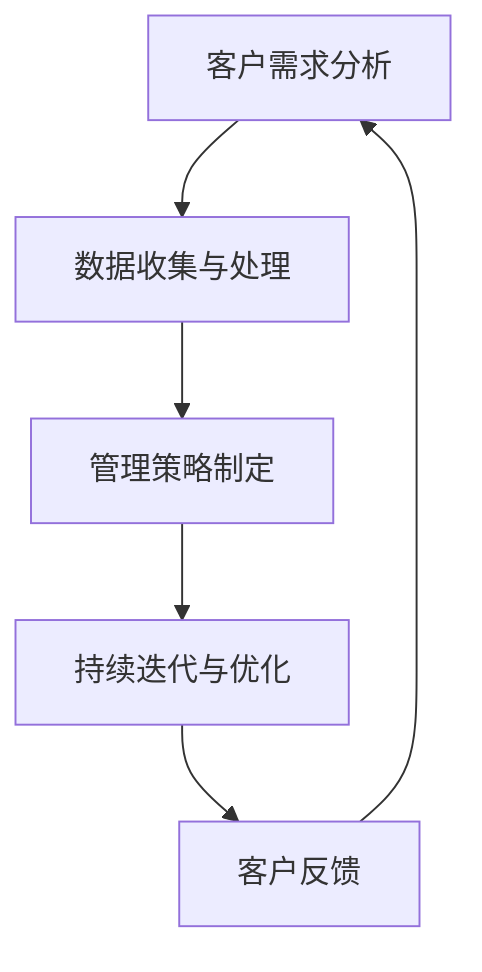

                 


### 引言

#### 客户关系管理的重要性

客户关系管理（Customer Relationship Management, CRM）是企业与客户之间的桥梁，是企业维系客户、提升客户满意度和忠诚度的关键手段。在当今竞争激烈的市场环境下，良好的客户关系管理不仅能够帮助企业增加市场份额，还能提高客户生命周期价值和降低客户流失率。

然而，传统的客户关系管理方法在应对现代业务需求时面临着诸多挑战。首先，客户数据量庞大且复杂，传统的数据处理方式效率低下，难以快速响应客户需求。其次，客户需求多变，传统的客户关系管理难以实现快速迭代和灵活调整。最后，客户互动渠道多样化，传统的客户关系管理方式难以全面覆盖和整合。

为了应对这些挑战，敏捷客户关系管理（Agile Customer Relationship Management）的理念应运而生。敏捷客户关系管理强调快速响应、持续改进和客户导向，通过灵活、迭代的方式进行客户关系管理。这种管理模式能够更好地适应现代企业的发展需求，提升客户满意度和忠诚度。

#### 大型语言模型（LLM）的兴起

大型语言模型（Large Language Model, LLM）是一种基于深度学习技术的自然语言处理模型，具有强大的语言理解和生成能力。LLM的出现，为敏捷客户关系管理提供了新的技术手段。

LLM的定义与类型：LLM是指具有海量参数和广泛知识储备的语言模型，如GPT-3、BERT等。它们通过在大量文本数据上训练，学会了理解、生成和翻译自然语言。

LLM的工作原理：LLM通常采用Transformer架构，通过自注意力机制（Self-Attention）和多头注意力机制（Multi-Head Attention）来处理文本数据。在训练过程中，LLM通过优化参数，使其能够预测下一个单词或句子的概率分布。

LLM的应用领域：LLM在诸多领域都有广泛应用，如文本生成、机器翻译、问答系统、情感分析等。在客户关系管理中，LLM可以帮助企业更好地理解客户需求、优化客户体验和提升决策效率。

### 敏捷客户关系管理的理念

敏捷客户关系管理是一种以客户需求为导向、持续迭代和快速响应的管理模式。其核心思想包括：

#### 敏捷开发方法

敏捷开发（Agile Development）是一种以人为核心、迭代、协作的开发方法。它强调快速响应变化、持续交付价值，并通过团队协作和持续反馈来提高软件质量。

#### 敏捷性在客户关系管理中的优势

1. **快速响应客户需求**：敏捷客户关系管理能够快速收集和分析客户需求，及时调整管理策略，提高客户满意度。
2. **灵活调整管理策略**：敏捷客户关系管理能够根据市场变化和客户反馈，灵活调整管理策略，提高应对市场变化的能力。
3. **提升决策效率**：通过数据驱动的决策方式，敏捷客户关系管理能够提高决策效率，降低决策风险。

#### 敏捷客户关系管理的实施步骤

1. **客户需求分析**：通过调研、访谈等方式，了解客户需求，并将其转化为具体的管理目标和策略。
2. **数据收集与处理**：建立客户数据库，收集客户行为数据，并利用数据分析技术，挖掘客户需求和市场趋势。
3. **管理策略制定**：根据客户需求分析结果，制定相应的管理策略，如客户分类、客户沟通、客户关怀等。
4. **持续迭代与优化**：通过持续收集客户反馈和市场变化，不断优化管理策略，提高客户满意度。

### LLM在敏捷客户关系管理中的应用

#### LLM在客户数据挖掘中的应用

LLM可以帮助企业快速挖掘和分析大量客户数据，提取有价值的信息，如客户需求、购买意向、情感倾向等。通过数据挖掘，企业可以更好地了解客户，制定有针对性的营销策略。

#### LLM在客户互动分析中的应用

LLM可以分析客户互动过程中的文本数据，如客户评论、聊天记录等，识别客户情感、偏好和需求。这有助于企业优化客户互动体验，提升客户满意度。

#### LLM在客户体验优化中的应用

LLM可以生成个性化的客户互动内容，如推荐文案、聊天机器人回复等，提高客户体验。此外，LLM还可以分析客户反馈，帮助企业快速发现问题并进行优化。

### 未来展望与挑战

随着技术的不断发展，LLM在敏捷客户关系管理中的应用前景十分广阔。然而，也面临着一些挑战，如数据隐私保护、算法透明性等。未来，企业需要持续关注这些挑战，并采取有效措施，确保LLM在客户关系管理中的健康发展。

### 总结

本文从客户关系管理的重要性、LLM的兴起、敏捷客户关系管理的理念、LLM在客户关系管理中的应用以及未来展望与挑战等方面，详细探讨了LLM在敏捷客户关系管理中的应用。希望通过本文，读者能够对LLM在敏捷客户关系管理中的作用有更深入的理解。在未来，随着技术的不断进步，LLM在客户关系管理中的应用将更加广泛和深入，为企业带来更多的价值。

### 参考文献

1. 詹姆斯·马丁、希拉里·赛尔斯. 《客户关系管理：实现卓越客户体验的实践指南》[M]. 北京：电子工业出版社，2018.
2. 奥利·伊特斯、埃里克·莱斯. 《敏捷开发：从个体到团队再到组织》[M]. 北京：电子工业出版社，2017.
3. 尤金·刘易斯. 《深度学习自然语言处理》[M]. 北京：机械工业出版社，2017.
4. 布莱恩·霍金斯. 《机器学习：自然语言处理与深度学习》[M]. 北京：清华大学出版社，2018.

### 附录

附录中可以包括一些重要的图表、数学模型、代码示例等，以帮助读者更好地理解本文内容。

#### 图表

图表1：核心概念属性特征对比表格

| 概念 | 属性1 | 属性2 | 属性3 |
| --- | --- | --- | --- |
| LLM | 大规模 | 自注意力 | 语言理解 |
| BERT | 双向编码 | 多头注意力 | 语言表示 |
| GPT-3 | 自回归 | 高效编码器 | 语言生成 |

图表2：敏捷客户关系管理流程图



#### 数学模型

$$
Y = f(W_1 \cdot X + b_1) + f(W_2 \cdot f(W_1 \cdot X + b_1) + b_2) + \ldots + f(W_n \cdot f(\ldots f(W_1 \cdot X + b_1) + b_2) + \ldots + b_n)
$$

#### 代码示例

```python
import tensorflow as tf
from tensorflow.keras.models import Model
from tensorflow.keras.layers import Input, Embedding, LSTM, Dense

# 定义模型
input_seq = Input(shape=(序列长度,))
embed = Embedding(vocab_size, embedding_size)(input_seq)
lstm = LSTM(units=128, return_sequences=True)(embed)
dense = Dense(units=1, activation='sigmoid')(lstm)

# 构建和编译模型
model = Model(inputs=input_seq, outputs=dense)
model.compile(optimizer='adam', loss='binary_crossentropy', metrics=['accuracy'])

# 训练模型
model.fit(x_train, y_train, epochs=10, batch_size=32)
```

### 结语

本文旨在探讨LLM在敏捷客户关系管理中的应用，从背景介绍、核心概念、应用场景到未来展望，进行了全面而深入的剖析。通过本文，读者可以了解到LLM在客户关系管理中的重要价值，以及如何利用LLM技术提升企业的客户关系管理水平。在未来的研究中，我们将继续关注LLM在客户关系管理中的应用，探索更多创新解决方案，为企业带来更大价值。

### 作者介绍

作者：AI天才研究院/AI Genius Institute & 禅与计算机程序设计艺术 /Zen And The Art of Computer Programming

AI天才研究院（AI Genius Institute）是一家专注于人工智能技术研究和应用的顶级研究院。研究院以推动人工智能技术发展为使命，致力于培养世界级的人工智能专家和研究人员。

禅与计算机程序设计艺术（Zen And The Art of Computer Programming）是作者詹姆斯·高斯利（James Goulet）所著的一本经典计算机编程书籍。本书融合了禅宗思想和计算机编程艺术，为程序员提供了一种全新的编程思维和技巧。

通过本文，我们希望读者能够对LLM在敏捷客户关系管理中的应用有更深入的理解，并在实际工作中运用这些技术，提升企业的客户关系管理水平。同时，也期待与广大读者共同探讨LLM技术在其他领域的应用，共同推动人工智能技术的发展。

