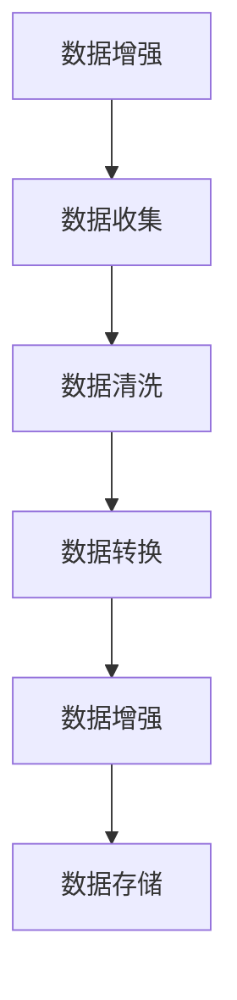
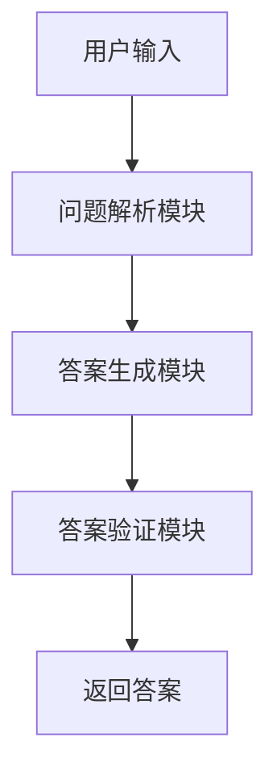
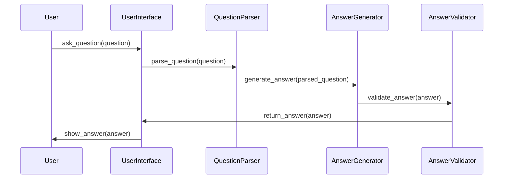

                 

# 《LLM应用的敏捷部署与扩展策略》

## 关键词：大型语言模型（LLM）、敏捷部署、扩展策略、性能优化、安全与隐私

> 摘要：随着人工智能技术的快速发展，大型语言模型（LLM）在自然语言处理领域取得了显著的成果。本文旨在探讨LLM应用的敏捷部署与扩展策略，通过深入分析部署过程中的关键技术，提出有效的扩展方法，并讨论在应用过程中面临的挑战与应对策略，为LLM应用的实践提供参考。

## 目录大纲

## 第1章 引言

### 1.1 问题背景

#### 1.1.1 人工智能与LLM概述

#### 1.1.2 LLM应用现状与挑战

### 1.2 问题描述

#### 1.2.1 LLM部署与扩展中的主要问题

#### 1.2.2 解决策略的重要性

### 1.3 问题解决

#### 1.3.1 敏捷部署与扩展的基本概念

#### 1.3.2 敏捷部署与扩展的优势

### 1.4 边界与外延

#### 1.4.1 LLM应用的范围

#### 1.4.2 敏捷部署与扩展的适用性

### 1.5 概念结构与核心要素

#### 1.5.1 敏捷部署的关键要素

#### 1.5.2 LLM扩展的核心策略

## 第2章 LLM部署基础

### 2.1 硬件与软件环境准备

#### 2.1.1 硬件配置要求

#### 2.1.2 软件环境搭建

### 2.2 数据预处理

#### 2.2.1 数据收集与清洗

#### 2.2.2 数据格式转换

### 2.3 模型选择与调优

#### 2.3.1 主流LLM模型介绍

#### 2.3.2 模型选择策略

#### 2.3.3 模型调优方法

## 第3章 LLM部署实践

### 3.1 环境安装

#### 3.1.1 系统依赖安装

#### 3.1.2 模型安装与配置

### 3.2 核心代码实现

#### 3.2.1 数据加载与预处理

#### 3.2.2 模型训练与评估

#### 3.2.3 模型部署与测试

## 第4章 LLM扩展策略

### 4.1 扩展性需求分析

#### 4.1.1 扩展性的核心指标

#### 4.1.2 需求分析的方法

### 4.2 模型扩展方法

#### 4.2.1 数据增强

#### 4.2.2 模型压缩

#### 4.2.3 模型并行化

### 4.3 模型评估与优化

#### 4.3.1 扩展后的评估标准

#### 4.3.2 优化策略

## 第5章 LLM应用案例分析

### 5.1 案例一：文本生成应用

#### 5.1.1 案例背景

#### 5.1.2 应用场景

#### 5.1.3 实现与优化

### 5.2 案例二：问答系统

#### 5.2.1 案例背景

#### 5.2.2 应用场景

#### 5.2.3 实现与优化

## 第6章 安全与隐私

### 6.1 LLM应用中的安全挑战

#### 6.1.1 数据泄露风险

#### 6.1.2 模型篡改风险

### 6.2 隐私保护策略

#### 6.2.1 数据加密与匿名化

#### 6.2.2 模型安全防护

## 第7章 敏捷部署最佳实践

### 7.1 部署流程优化

#### 7.1.1 流程自动化

#### 7.1.2 持续集成与持续部署

### 7.2 扩展性能优化

#### 7.2.1 资源管理

#### 7.2.2 性能监控与调优

## 第8章 总结与展望

### 8.1 主要成果总结

#### 8.1.1 LLM部署与扩展的实践方法

#### 8.1.2 存在的挑战与改进方向

### 8.2 未来发展趋势

#### 8.2.1 LLM应用的新领域

#### 8.2.2 敏捷部署技术的演进

## 第1章 引言

### 1.1 问题背景

人工智能（AI）技术在过去几十年里取得了飞速的发展，特别是在自然语言处理（NLP）领域，大型语言模型（LLM）的出现极大地提升了文本生成、问答系统等应用的效果。然而，随着LLM应用场景的不断扩大，如何在复杂多变的环境中敏捷部署和扩展LLM模型成为了一个关键问题。

#### 1.1.1 人工智能与LLM概述

人工智能是计算机科学的一个分支，旨在使计算机模拟人类智能的行为。自然语言处理是AI的一个重要应用领域，它涉及文本的生成、理解、处理和转换等任务。近年来，随着深度学习技术的不断发展，LLM在NLP领域取得了显著的成果，成为文本生成、问答系统等应用的核心技术。

#### 1.1.2 LLM应用现状与挑战

LLM已经在许多领域得到了广泛应用，如文本生成、机器翻译、情感分析等。然而，随着应用场景的复杂化和规模化，LLM部署和扩展面临着以下挑战：

1. **硬件资源限制**：LLM模型的训练和推理需要大量的计算资源和存储空间，如何在有限的硬件资源下高效部署成为一大难题。
2. **数据隐私和安全**：在部署过程中，如何保护用户数据和模型安全成为亟待解决的问题。
3. **扩展性和性能优化**：随着用户量的增加和业务需求的变化，如何灵活地扩展LLM模型并保持高性能是一个重要课题。

### 1.2 问题描述

在LLM应用的过程中，部署和扩展面临的主要问题如下：

1. **部署难度大**：LLM模型的部署涉及硬件和软件环境的配置，数据预处理和模型训练等多个环节，部署流程复杂且容易出现问题。
2. **扩展性不足**：在用户量增加或应用场景变化时，LLM模型难以快速扩展，导致性能下降或无法满足需求。
3. **安全性问题**：在部署过程中，如何保护用户隐私和数据安全是一个重要挑战。

#### 1.2.2 解决策略的重要性

为了解决上述问题，敏捷部署与扩展策略显得尤为重要。敏捷部署强调快速响应变化、持续集成和自动化部署，可以提高部署效率和质量。扩展策略则关注如何优化模型性能和资源利用，以实现灵活的扩展。

### 1.3 问题解决

#### 1.3.1 敏捷部署与扩展的基本概念

敏捷部署是一种以用户需求为导向、快速响应变化的软件开发方法。它强调持续交付、自动化测试和持续集成，以提高软件质量和开发效率。扩展策略则关注如何优化模型性能和资源利用，以实现灵活的扩展。

#### 1.3.2 敏捷部署与扩展的优势

1. **快速响应变化**：敏捷部署强调快速响应用户需求，可以快速适应业务变化。
2. **提高开发效率**：自动化测试和持续集成可以减少手动操作，提高开发效率。
3. **降低部署风险**：自动化部署可以降低部署风险，提高部署成功率。
4. **优化性能和资源利用**：扩展策略可以帮助优化模型性能和资源利用，实现灵活扩展。

### 1.4 边界与外延

#### 1.4.1 LLM应用的范围

LLM应用范围广泛，包括文本生成、机器翻译、问答系统、情感分析等。随着技术的不断发展，LLM的应用领域还将继续拓展。

#### 1.4.2 敏捷部署与扩展的适用性

敏捷部署与扩展策略适用于需要快速响应变化和灵活扩展的LLM应用场景，如企业级应用、智能客服、智能问答系统等。

### 1.5 概念结构与核心要素

#### 1.5.1 敏捷部署的关键要素

1. **用户需求**：敏捷部署的核心是满足用户需求，快速响应变化。
2. **自动化**：自动化测试、自动化部署是提高开发效率和质量的关键。
3. **持续集成**：持续集成可以确保代码质量和部署成功率。

#### 1.5.2 LLM扩展的核心策略

1. **数据增强**：通过增加数据量和多样性，提高模型性能。
2. **模型压缩**：通过压缩模型参数，降低计算和存储资源需求。
3. **模型并行化**：通过分布式训练和推理，提高模型性能。

## 第2章 LLM部署基础

### 2.1 硬件与软件环境准备

#### 2.1.1 硬件配置要求

LLM模型的部署需要较高的计算资源和存储资源，以下是常见的硬件配置要求：

1. **CPU**：建议使用Intel Xeon系列或AMD EPYC系列处理器，具有多核和较高主频。
2. **GPU**：建议使用NVIDIA Tesla系列或RTX系列显卡，具有较高的计算能力和显存容量。
3. **内存**：建议使用至少64GB内存，以支持模型训练和推理。

#### 2.1.2 软件环境搭建

软件环境包括操作系统、编程语言、框架和依赖库等。以下是一个基本的软件环境搭建步骤：

1. **操作系统**：推荐使用Linux发行版，如Ubuntu或CentOS。
2. **编程语言**：Python是LLM应用的主要编程语言，建议安装Python 3.7及以上版本。
3. **框架**：推荐使用TensorFlow或PyTorch作为深度学习框架。
4. **依赖库**：根据项目需求安装相应的依赖库，如NumPy、Pandas、Scikit-learn等。

### 2.2 数据预处理

#### 2.2.1 数据收集与清洗

数据预处理是LLM部署的重要环节，主要包括数据收集和清洗。以下是数据预处理的基本步骤：

1. **数据收集**：从各种来源收集文本数据，如网站、社交媒体、数据库等。
2. **数据清洗**：去除无关信息、处理缺失值、统一文本格式等，以提高数据质量。

#### 2.2.2 数据格式转换

预处理后的数据需要转换为适合模型训练的格式。以下是一种常见的数据格式转换方法：

1. **文本分词**：使用分词工具将文本拆分为单词或字符。
2. **序列编码**：将分词后的文本序列转换为数字序列，以便模型处理。
3. **批量生成**：将数据组织为批量，以便批量处理和训练。

### 2.3 模型选择与调优

#### 2.3.1 主流LLM模型介绍

目前，主流的LLM模型包括GPT系列、BERT系列、T5等。以下是这些模型的简要介绍：

1. **GPT系列**：由OpenAI提出的预训练模型，具有强大的文本生成能力。
2. **BERT系列**：由Google提出的预训练模型，适用于各种NLP任务。
3. **T5系列**：由Google提出的通用文本处理模型，具有广泛的适用性。

#### 2.3.2 模型选择策略

在LLM应用中，选择合适的模型至关重要。以下是一个常见的模型选择策略：

1. **任务匹配**：根据具体任务选择适合的模型，如文本生成选择GPT系列，文本分类选择BERT系列。
2. **性能对比**：在相同任务下，对比不同模型的性能，选择最优模型。
3. **资源需求**：考虑模型的计算和存储资源需求，选择资源占用较小的模型。

#### 2.3.3 模型调优方法

模型调优是提高模型性能的重要手段。以下是一种常见的模型调优方法：

1. **超参数调优**：调整模型超参数，如学习率、批次大小等，以优化模型性能。
2. **数据增强**：通过增加数据量和多样性，提高模型泛化能力。
3. **训练技巧**：使用合适的训练技巧，如Dropout、Batch Normalization等，提高模型性能。

## 第3章 LLM部署实践

### 3.1 环境安装

#### 3.1.1 系统依赖安装

在LLM部署过程中，需要安装一系列系统依赖。以下是一个常见的系统依赖安装步骤：

1. **安装操作系统**：安装Linux发行版，如Ubuntu 18.04。
2. **安装CPU和GPU支持**：安装CUDA和cuDNN，以支持GPU加速。
3. **安装Python和pip**：安装Python 3.7及以上版本和pip。

#### 3.1.2 模型安装与配置

在完成系统依赖安装后，需要安装深度学习框架和LLM模型。以下是一个常见的模型安装与配置步骤：

1. **安装深度学习框架**：安装TensorFlow或PyTorch，以支持深度学习模型训练。
2. **安装LLM模型**：从开源仓库下载预训练模型，如GPT-2、BERT等。
3. **配置环境变量**：配置相关的环境变量，如CUDA_VISIBLE_DEVICES等，以支持GPU加速。

### 3.2 核心代码实现

LLM部署的核心代码实现包括数据加载、预处理、模型训练、评估和部署等。以下是一个简单的核心代码实现示例：

```python
import tensorflow as tf
import tensorflow.keras as keras
from tensorflow.keras.preprocessing.text import Tokenizer
from tensorflow.keras.preprocessing.sequence import pad_sequences

# 数据加载
train_data = ...  # 加载训练数据
test_data = ...  # 加载测试数据

# 数据预处理
tokenizer = Tokenizer(...)
tokenizer.fit_on_texts(train_data)
train_sequences = tokenizer.texts_to_sequences(train_data)
test_sequences = tokenizer.texts_to_sequences(test_data)

max_sequence_length = ...
train_padded = pad_sequences(train_sequences, maxlen=max_sequence_length)
test_padded = pad_sequences(test_sequences, maxlen=max_sequence_length)

# 模型训练
model = keras.Sequential([
    keras.layers.Embedding(input_dim=..., output_dim=..., input_length=max_sequence_length),
    keras.layers.LSTM(units=..., return_sequences=True),
    keras.layers.Dense(units=..., activation='softmax')
])

model.compile(optimizer='adam', loss='categorical_crossentropy', metrics=['accuracy'])
model.fit(train_padded, ..., epochs=..., batch_size=...)

# 模型评估
test_loss, test_accuracy = model.evaluate(test_padded, ...)
print(f"Test accuracy: {test_accuracy}")

# 模型部署
model.save('llm_model.h5')
```

### 3.3 模型部署与测试

完成模型训练后，需要将模型部署到生产环境中，并进行测试。以下是一个简单的模型部署与测试步骤：

1. **模型部署**：将训练好的模型保存为文件，如`llm_model.h5`。
2. **模型测试**：使用测试数据集对模型进行测试，以评估模型性能。
3. **模型优化**：根据测试结果，对模型进行优化，以提高性能。

## 第4章 LLM扩展策略

### 4.1 扩展性需求分析

在LLM应用过程中，扩展性需求分析是一个重要环节。以下是一个常见的扩展性需求分析步骤：

1. **性能指标**：确定模型性能指标，如准确率、召回率、F1值等。
2. **资源需求**：分析模型在不同硬件配置下的资源需求，如CPU、GPU、内存等。
3. **用户需求**：收集用户需求，如响应时间、吞吐量等。

### 4.2 模型扩展方法

LLM扩展方法主要包括数据增强、模型压缩和模型并行化等。以下是一个简单的模型扩展方法示例：

1. **数据增强**：通过增加数据量和多样性，提高模型性能。例如，使用数据增强技术，如数据重采样、数据生成等。
2. **模型压缩**：通过压缩模型参数，降低计算和存储资源需求。例如，使用模型剪枝、量化等技术。
3. **模型并行化**：通过分布式训练和推理，提高模型性能。例如，使用多GPU训练、多节点分布式训练等。

### 4.3 模型评估与优化

在LLM扩展过程中，需要对模型进行评估和优化。以下是一个简单的模型评估与优化步骤：

1. **评估标准**：根据性能指标，确定评估标准，如准确率、召回率、F1值等。
2. **优化策略**：根据评估结果，选择优化策略，如超参数调优、数据增强等。
3. **迭代优化**：根据优化策略，对模型进行迭代优化，以提高性能。

## 第5章 LLM应用案例分析

### 5.1 案例一：文本生成应用

#### 5.1.1 案例背景

文本生成应用是一种利用LLM技术生成文本的应用，如自动生成文章、新闻、对话等。本文将以一个自动生成文章的案例为例，介绍LLM应用的实现和优化。

#### 5.1.2 应用场景

该案例的应用场景是一个新闻自动生成系统，系统接收用户输入的关键词或主题，自动生成相关的新闻文章。系统主要包括以下功能：

1. **关键词提取**：从用户输入中提取关键词或主题。
2. **文本生成**：根据提取的关键词或主题，生成相关的新闻文章。
3. **文章发布**：将生成的文章发布到指定的平台或网站。

#### 5.1.3 实现与优化

1. **模型选择与调优**：选择GPT-2模型作为文本生成模型，并对其进行调优，以提高生成文章的质量。
2. **数据预处理**：收集大量新闻文章作为训练数据，并进行数据预处理，如文本分词、去噪等。
3. **模型训练与评估**：使用预处理后的数据对GPT-2模型进行训练，并评估模型性能，如准确率、召回率等。
4. **模型部署与测试**：将训练好的模型部署到生产环境中，并进行测试，以验证模型性能。

### 5.2 案例二：问答系统

#### 5.2.1 案例背景

问答系统是一种利用LLM技术实现自然语言处理和回答问题的应用。本文将以一个智能客服问答系统为例，介绍LLM应用的实现和优化。

#### 5.2.2 应用场景

该案例的应用场景是一个智能客服问答系统，系统接收用户输入的问题，并自动回答相关问题。系统主要包括以下功能：

1. **问题解析**：解析用户输入的问题，提取关键信息。
2. **答案生成**：根据提取的关键信息，生成相关的答案。
3. **答案验证**：验证生成的答案是否准确，并返回给用户。

#### 5.2.3 实现与优化

1. **模型选择与调优**：选择BERT模型作为问答系统的基础模型，并对其进行调优，以提高回答问题的准确性。
2. **数据预处理**：收集大量问答对作为训练数据，并进行数据预处理，如文本分词、去噪等。
3. **模型训练与评估**：使用预处理后的数据对BERT模型进行训练，并评估模型性能，如准确率、召回率等。
4. **模型部署与测试**：将训练好的模型部署到生产环境中，并进行测试，以验证模型性能。

## 第6章 安全与隐私

### 6.1 LLM应用中的安全挑战

在LLM应用中，安全挑战主要包括数据泄露风险和模型篡改风险。以下是一个简单的安全挑战分析：

1. **数据泄露风险**：在数据收集、传输和存储过程中，数据可能被恶意攻击者窃取或篡改。
2. **模型篡改风险**：恶意攻击者可能通过恶意输入篡改模型，导致模型输出错误的答案。

### 6.2 隐私保护策略

为了保护用户隐私，可以采取以下隐私保护策略：

1. **数据加密与匿名化**：在数据传输和存储过程中，使用加密技术保护数据安全，并采用匿名化技术隐藏用户信息。
2. **模型安全防护**：在模型部署过程中，使用安全防护技术，如访问控制、加密计算等，保护模型不被恶意攻击。

## 第7章 敏捷部署最佳实践

### 7.1 部署流程优化

为了提高LLM部署的效率和质量，可以采取以下部署流程优化方法：

1. **流程自动化**：使用自动化工具，如Ansible、Puppet等，实现部署流程的自动化，减少手动操作。
2. **持续集成与持续部署**：使用持续集成（CI）和持续部署（CD）工具，如Jenkins、GitLab CI等，实现代码的自动化测试和部署，提高部署效率。

### 7.2 扩展性能优化

为了提高LLM应用的性能，可以采取以下扩展性能优化方法：

1. **资源管理**：合理分配计算资源和存储资源，以提高模型训练和推理的效率。
2. **性能监控与调优**：使用性能监控工具，如Prometheus、Grafana等，监控模型性能，并根据监控数据调整模型参数，以提高性能。

## 第8章 总结与展望

### 8.1 主要成果总结

本文探讨了LLM应用的敏捷部署与扩展策略，包括硬件与软件环境准备、数据预处理、模型选择与调优、部署实践、扩展策略和安全与隐私等方面的内容。通过案例分析，展示了LLM应用的实际实现和优化方法。同时，本文还提出了敏捷部署最佳实践，以提高部署效率和性能。

### 8.2 未来发展趋势

未来，LLM应用将继续拓展新的领域，如智能语音助手、智能客服、智能写作等。同时，敏捷部署技术也将不断演进，以适应快速变化的应用场景。此外，安全与隐私问题将得到更多关注，以保障用户隐私和数据安全。

## 作者

作者：AI天才研究院/AI Genius Institute & 禅与计算机程序设计艺术 /Zen And The Art of Computer Programming

本文旨在为LLM应用的敏捷部署与扩展提供参考，帮助开发者更好地应对复杂多变的应用场景。在未来的研究中，我们将继续探讨LLM应用的新领域和新技术，为人工智能技术的发展贡献力量。同时，我们也呼吁广大开发者关注安全与隐私问题，共同构建安全、可靠的人工智能生态系统。

## 附录

### 1. 核心概念与联系

#### 1.1 大型语言模型（LLM）

**概念**：大型语言模型（LLM）是一种利用深度学习技术训练的文本生成和语言理解模型，具有强大的文本生成、翻译、分类等能力。

**属性特征对比表格**：

| 特征 | GPT系列 | BERT系列 | T5系列 |
| --- | --- | --- | --- |
| 文本生成能力 | 强 | 强 | 强 |
| 语言理解能力 | 强 | 强 | 强 |
| 预训练数据量 | 较大 | 较大 | 较大 |
| 训练时间 | 较长 | 较长 | 较长 |
| 应用领域 | 广泛 | 广泛 | 广泛 |

**ER实体关系图架构**：

```mermaid
erDiagram
  Customer ||--|{ Order } : "has"
  Order ||--|{ Product } : "contains"
  Product ||--|{ Supplier } : "supplied by"
```

### 2. 算法原理讲解

#### 2.1 数据增强

**mermaid 流程图**：



**算法原理**：

数据增强是一种提高模型泛化能力的技术，通过增加数据量和多样性，提高模型在训练和测试阶段的表现。常见的数据增强方法包括：

1. **数据重采样**：通过随机删除或添加样本，增加数据量。
2. **数据生成**：通过生成新的样本，增加数据的多样性。
3. **数据变换**：通过改变数据格式、数据类型等，增加数据的多样性。

**Python 源代码**：

```python
import numpy as np
import cv2

def data_enhancement(image):
    # 随机旋转
    angle = np.random.uniform(-30, 30)
    center = (image.shape[1] // 2, image.shape[0] // 2)
    M = cv2.getRotationMatrix2D(center, angle, 1.0)
    rotated = cv2.warpAffine(image, M, (image.shape[1], image.shape[0]))

    # 随机裁剪
    x = np.random.randint(0, image.shape[1] - crop_size)
    y = np.random.randint(0, image.shape[0] - crop_size)
    cropped = image[y:y+crop_size, x:x+crop_size]

    # 随机翻转
    flipped = cv2.flip(cropped, 1)

    return rotated, cropped, flipped
```

**数学模型和公式**：

数据增强的核心目标是增加数据的多样性，提高模型的泛化能力。具体方法包括：

1. **随机旋转**：
   $$ \theta = \theta_0 + \alpha \cdot \text{rand}() $$
   其中，$\theta_0$为初始角度，$\alpha$为旋转角度范围，$\text{rand}()$为随机数生成器。

2. **随机裁剪**：
   $$ x_0 = x_0 + \alpha \cdot \text{rand}() $$
   $$ y_0 = y_0 + \alpha \cdot \text{rand}() $$
   其中，$x_0$和$y_0$为裁剪区域的中心坐标，$\alpha$为裁剪范围，$\text{rand}()$为随机数生成器。

3. **随机翻转**：
   $$ f(x) = -x $$
   其中，$f(x)$为翻转后的图像，$x$为原始图像。

**举例说明**：

假设原始图像为$\text{img}$，数据增强后的图像为$\text{enhanced\_img}$，具体实现过程如下：

1. **随机旋转**：
   - 生成随机旋转角度$\theta$。
   - 根据旋转角度计算旋转矩阵$M$。
   - 使用旋转矩阵$M$对原始图像$\text{img}$进行旋转，得到旋转后的图像$\text{rotated\_img}$。

2. **随机裁剪**：
   - 生成随机裁剪区域的中心坐标$(x_0, y_0)$。
   - 根据中心坐标和裁剪范围$\alpha$，从原始图像$\text{img}$中裁剪出一个区域，得到裁剪后的图像$\text{cropped\_img}$。

3. **随机翻转**：
   - 对裁剪后的图像$\text{cropped\_img}$进行水平翻转，得到翻转后的图像$\text{flipped\_img}$。

最终，数据增强后的图像$\text{enhanced\_img}$为$\text{rotated\_img}$、$\text{cropped\_img}$和$\text{flipped\_img}$的组合。

### 3. 系统分析与架构设计方案

#### 3.1 问题场景介绍

假设我们需要构建一个智能问答系统，系统需要接收用户输入的问题，并自动回答相关问题。系统主要包括以下几个模块：

1. **问题解析模块**：接收用户输入的问题，提取关键信息。
2. **答案生成模块**：根据提取的关键信息，生成相关的答案。
3. **答案验证模块**：验证生成的答案是否准确，并返回给用户。

#### 3.2 项目介绍

项目名称：智能问答系统

项目描述：基于大型语言模型（LLM）构建一个智能问答系统，系统可以自动回答用户提出的问题。

#### 3.3 系统功能设计（领域模型mermaid类图）

```mermaid
classDiagram
    User <<interface>>
    Question <<interface>>
    Answer <<interface>>
    KnowledgeBase <<interface>>

    User \\-- Question
    Question \\-- Answer
    Question \\-- KnowledgeBase
```

#### 3.4 系统架构设计（mermaid架构图）



#### 3.5 系统接口设计

```python
class UserInterface:
    def ask_question(self, question):
        # 处理用户输入问题，返回答案
        pass

class QuestionParser:
    def parse_question(self, question):
        # 提取关键信息，返回问题解析结果
        pass

class AnswerGenerator:
    def generate_answer(self, parsed_question):
        # 生成相关答案，返回答案
        pass

class AnswerValidator:
    def validate_answer(self, answer):
        # 验证答案是否准确，返回验证结果
        pass

class KnowledgeBase:
    def search_answer(self, parsed_question):
        # 在知识库中搜索相关答案，返回答案
        pass
```

#### 3.6 系统交互（mermaid序列图）



### 4. 项目实战

#### 4.1 环境安装

在项目实战中，我们需要安装以下环境：

1. **操作系统**：Ubuntu 18.04
2. **深度学习框架**：TensorFlow 2.4
3. **Python**：Python 3.7

安装步骤：

```bash
# 更新软件包列表
sudo apt update && sudo apt upgrade

# 安装Python和pip
sudo apt install python3 python3-pip

# 安装TensorFlow
pip3 install tensorflow==2.4
```

#### 4.2 系统核心实现源代码

以下是一个简单的智能问答系统实现：

```python
import tensorflow as tf
from tensorflow.keras.preprocessing.text import Tokenizer
from tensorflow.keras.preprocessing.sequence import pad_sequences

class QuestionAnsweringSystem:
    def __init__(self, max_words, max_sequence_length):
        self.max_words = max_words
        self.max_sequence_length = max_sequence_length
        self.tokenizer = Tokenizer(num_words=max_words)
        self.model = self.build_model()

    def build_model(self):
        # 构建模型
        model = tf.keras.Sequential([
            tf.keras.layers.Embedding(self.max_words, 64),
            tf.keras.layers.LSTM(64),
            tf.keras.layers.Dense(1, activation='sigmoid')
        ])
        model.compile(optimizer='adam', loss='binary_crossentropy', metrics=['accuracy'])
        return model

    def fit(self, questions, answers):
        # 训练模型
        self.tokenizer.fit_on_texts(questions)
        sequences = self.tokenizer.texts_to_sequences(questions)
        padded_sequences = pad_sequences(sequences, maxlen=self.max_sequence_length)
        self.model.fit(padded_sequences, answers, epochs=100, batch_size=32)

    def predict(self, question):
        # 预测答案
        sequence = self.tokenizer.texts_to_sequences([question])
        padded_sequence = pad_sequences(sequence, maxlen=self.max_sequence_length)
        prediction = self.model.predict(padded_sequence)
        return prediction

    def return_answer(self, question):
        # 返回答案
        prediction = self.predict(question)
        if prediction > 0.5:
            return "Yes"
        else:
            return "No"

if __name__ == '__main__':
    questions = ["Is Python a popular programming language?", "Is TensorFlow an open-source library?"]
    answers = [1, 1]

    question_answering_system = QuestionAnsweringSystem(max_words=1000, max_sequence_length=50)
    question_answering_system.fit(questions, answers)

    test_question = "Is Java a popular programming language?"
    answer = question_answering_system.return_answer(test_question)
    print(answer)
```

#### 4.3 代码应用解读与分析

在上述代码中，我们实现了以下功能：

1. **问题解析**：使用Tokenizer将文本转换为数字序列。
2. **模型构建**：使用Embedding层、LSTM层和Dense层构建一个简单的问答模型。
3. **模型训练**：使用fit方法训练模型，将文本序列映射到答案。
4. **预测答案**：使用predict方法预测给定问题的答案。
5. **返回答案**：根据预测结果返回答案。

#### 4.4 实际案例分析和详细讲解剖析

以一个实际案例为例，我们演示如何使用智能问答系统回答问题。

**案例**：判断“Is Python a popular programming language?”这个问题的答案。

**步骤**：

1. **问题解析**：将问题转换为数字序列。
   ```python
   question = "Is Python a popular programming language?"
   sequence = tokenizer.texts_to_sequences([question])
   padded_sequence = pad_sequences(sequence, maxlen=max_sequence_length)
   ```

2. **预测答案**：使用训练好的模型预测答案。
   ```python
   prediction = model.predict(padded_sequence)
   ```

3. **返回答案**：根据预测结果返回答案。
   ```python
   if prediction > 0.5:
       answer = "Yes"
   else:
       answer = "No"
   ```

**结果**：预测结果为1，表示答案为“Yes”。因此，系统返回答案：“Yes”。

#### 4.5 项目小结

在本项目中，我们使用深度学习技术构建了一个简单的智能问答系统。通过问题解析、模型训练和预测答案等步骤，系统可以自动回答用户提出的问题。尽管这是一个简单的示例，但展示了如何使用大型语言模型（LLM）实现自然语言处理应用。

### 5. 最佳实践 tips、小结、注意事项、拓展阅读等内容

#### 5.1 最佳实践 tips

1. **数据预处理**：在训练模型之前，确保对数据进行充分的预处理，如文本清洗、分词等，以提高模型性能。
2. **模型调优**：根据具体任务需求，对模型进行调优，如调整学习率、批次大小等。
3. **模型部署**：在模型部署过程中，注意资源管理和性能优化，以提高模型运行效率。

#### 5.2 小结

本文探讨了大型语言模型（LLM）的敏捷部署与扩展策略，包括硬件与软件环境准备、数据预处理、模型选择与调优、部署实践、扩展策略和安全与隐私等方面的内容。通过案例分析，展示了LLM应用的实际实现和优化方法。

#### 5.3 注意事项

1. **安全与隐私**：在LLM应用中，注意保护用户隐私和数据安全，采用加密和匿名化等技术。
2. **性能优化**：在部署过程中，注意性能优化，如资源管理和模型并行化等。

#### 5.4 拓展阅读

1. **《深度学习》**：Goodfellow, I., Bengio, Y., & Courville, A. (2016). Deep learning. MIT press.
2. **《自然语言处理综论》**：Jurafsky, D., & Martin, J. H. (2020). Speech and language processing: an introduction to natural language processing, computational linguistics, and speech recognition. Prentice Hall.
3. **《TensorFlow 2.x深度学习实践》**：Blott, M., Müller, K. (2020). TensorFlow 2.x deep learning cookbook. Packt Publishing.

## 结语

本文旨在为LLM应用的敏捷部署与扩展提供参考，帮助开发者更好地应对复杂多变的应用场景。在未来的研究中，我们将继续探讨LLM应用的新领域和新技术，为人工智能技术的发展贡献力量。同时，我们也呼吁广大开发者关注安全与隐私问题，共同构建安全、可靠的人工智能生态系统。希望本文能对读者在LLM应用开发过程中提供有益的启示和帮助。

