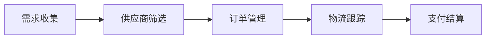
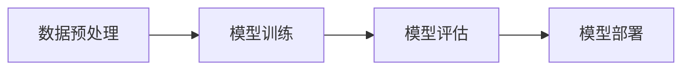
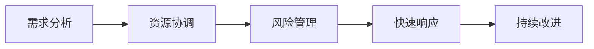
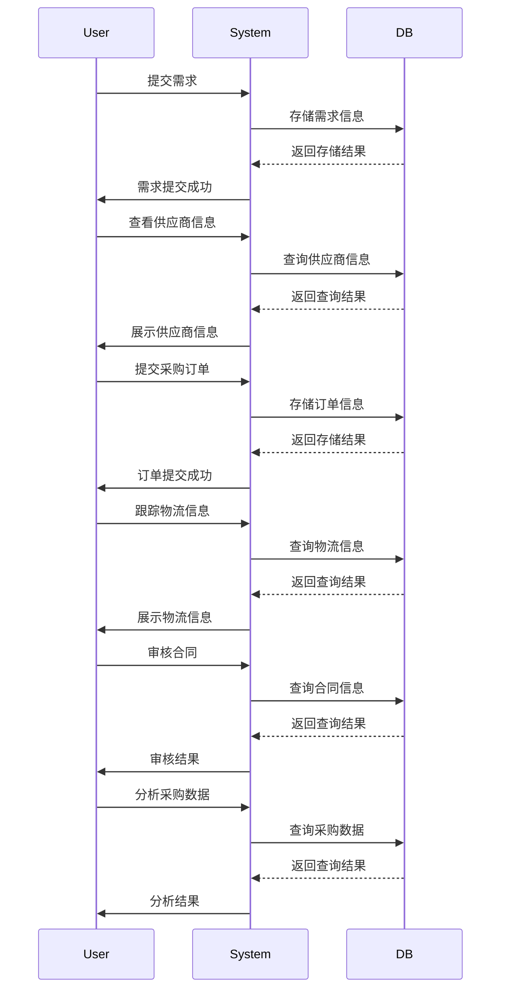
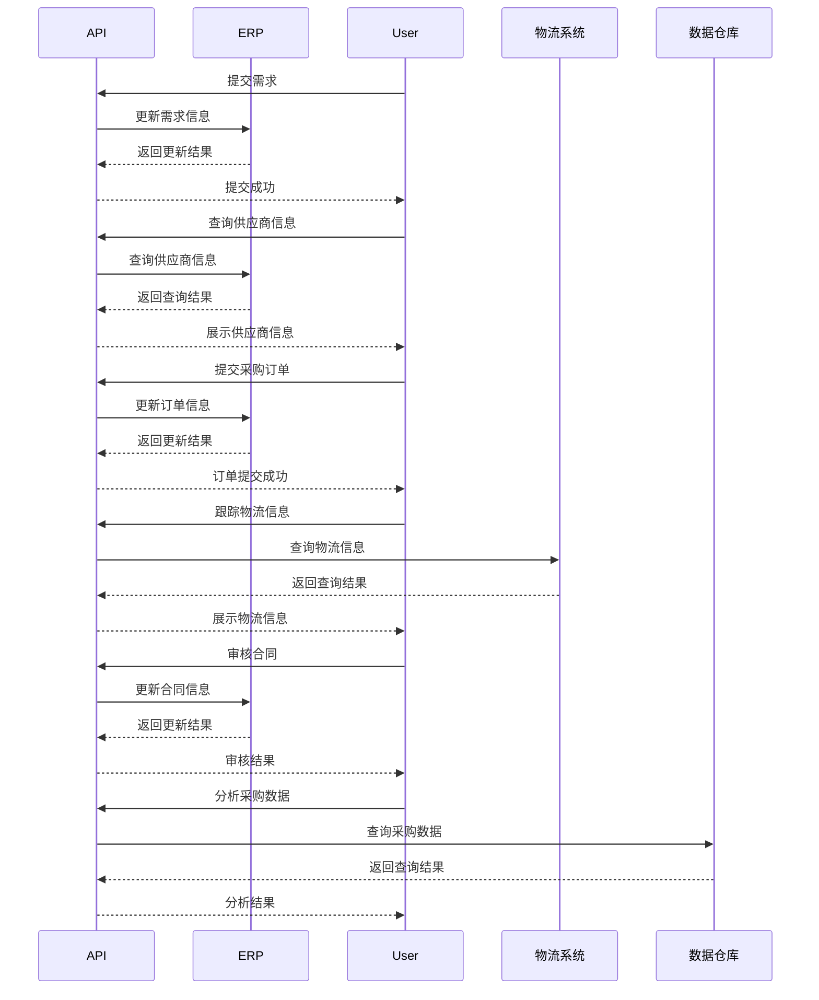
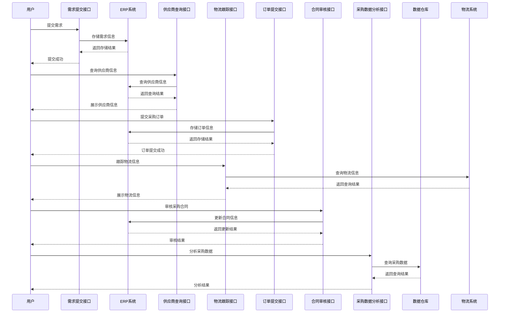

                 

### 1.1 问题的背景

#### 1.1.1 问题背景

近年来，随着人工智能（AI）技术的快速发展，大规模语言模型（LLM）在各种应用场景中得到了广泛的应用。从自然语言处理（NLP）到智能客服、语言翻译、内容生成，LLM显示出了强大的数据处理和模式识别能力。然而，随着应用的深入，LLM的应用开发过程中也面临了许多挑战，尤其是采购资源获取的效率问题。

传统的采购流程通常包括供应商选择、订单管理、物流跟踪和支付结算等步骤。这些步骤往往需要大量的人工参与，导致流程繁琐、效率低下。同时，由于信息的不对称性和资源的不均衡分配，常常出现采购需求与实际资源供应不匹配的情况，进一步影响了项目的进展和效率。

#### 1.1.2 问题描述

采购流程中的主要问题可以归纳为以下几点：

1. **效率低下**：传统的采购流程往往需要多个环节的审批和协调，涉及的人员众多，流程复杂，导致采购周期延长。
2. **资源分配不均**：由于信息不对称，采购部门往往无法及时获取到所需资源的市场供应情况和价格信息，导致资源分配不合理。
3. **信息不对称**：供应商与采购部门之间的信息不透明，导致采购过程中出现信息遗漏或误解，增加了采购风险。
4. **采购成本高**：采购流程中的冗余环节和人工操作增加了采购成本。

#### 1.1.3 问题解决

为了解决上述问题，引入LLM技术进行采购流程的优化成为一种可行的方案。LLM可以通过其强大的数据处理和分析能力，实现以下目标：

1. **提高采购效率**：利用LLM进行自动化数据处理和模式识别，减少人工参与，缩短采购周期。
2. **优化资源分配**：通过分析市场供应情况和资源需求，实现资源的最优分配。
3. **提高信息透明度**：利用LLM建立信息共享平台，减少信息不对称，降低采购风险。
4. **降低采购成本**：通过自动化流程和优化资源分配，降低采购成本。

#### 1.1.4 边界与外延

采购流程的优化不仅限于某一特定行业或领域，它具有广泛的适用性。在边界上，我们需要明确采购流程的涉及领域，如制造业、服务业、科技行业等。在外延上，我们需要考虑LLM技术在采购流程优化中的适用范围，包括但不限于供应商评价、采购预测、采购合同审核等。

#### 1.1.5 核心概念与联系

为了深入理解采购流程的优化，我们需要明确以下几个核心概念及其相互联系：

1. **采购流程**：包括需求收集、供应商筛选、订单管理、物流跟踪和支付结算等环节。
2. **大规模语言模型（LLM）**：一种基于深度学习和自然语言处理的模型，具有强大的数据处理和分析能力。
3. **敏捷采购**：一种以用户需求为导向，快速迭代和持续改进的采购方式。

这些核心概念相互作用，共同构成了LLM应用在采购流程优化中的理论基础和实践框架。

### 1.2 概念结构与核心要素组成

#### 1.2.1 采购流程的基本结构

采购流程的基本结构可以概括为以下几个步骤：

1. **需求收集**：识别和组织采购需求，明确所需的物品或服务。
2. **供应商筛选**：根据需求，选择合适的供应商，进行初步筛选和评估。
3. **订单管理**：与供应商签订订单，明确订单的详细条款和交付时间。
4. **物流跟踪**：监控订单的物流状态，确保物品按时交付。
5. **支付结算**：根据订单的交付情况，进行支付和结算。

#### 1.2.2 LLM技术的核心要素

大规模语言模型（LLM）的核心要素包括：

1. **数据预处理**：对采集到的文本数据进行清洗、格式化和标准化处理，为后续模型训练做准备。
2. **模型训练**：利用深度学习算法，对预处理后的数据进行训练，构建语言模型。
3. **模型评估**：通过测试数据集，评估模型的性能和准确性。
4. **模型部署**：将训练好的模型部署到生产环境中，实现自动化数据处理和分析。

#### 1.2.3 敏捷采购的关键要素

敏捷采购的关键要素包括：

1. **需求分析**：及时了解用户需求，确保采购活动与实际需求一致。
2. **资源协调**：合理分配资源，确保采购流程的顺畅进行。
3. **风险管理**：识别和应对采购过程中的潜在风险，确保采购活动的安全性和可靠性。
4. **快速响应**：对市场变化和需求变动快速响应，调整采购策略。

通过以上三个核心要素的相互配合，LLM技术的应用可以实现采购流程的优化，提高采购效率，降低采购成本。

## 第二部分：核心概念与联系

### 2.1 采购流程原理讲解

#### 2.1.1 采购流程的基本步骤

采购流程的基本步骤可以分解为以下几个阶段：

1. **需求收集**：这是采购流程的起点。采购部门需要明确采购的需求，包括所需的物品或服务的种类、数量、质量要求等。

2. **供应商筛选**：根据需求，采购部门需要选择合适的供应商。这一过程可能涉及供应商的评估和比较，以确保供应商能够满足需求。

3. **订单管理**：在确定供应商后，采购部门需要与供应商签订订单，明确订单的详细条款，包括交付时间、价格、质量保证等。

4. **物流跟踪**：在订单执行过程中，采购部门需要监控物流状态，确保物品能够按时交付。

5. **支付结算**：在物品交付后，采购部门需要进行支付结算，并根据订单条款进行验收。

#### 2.1.2 采购流程的流程图

以下是一个简化的采购流程图：



这个流程图清晰地展示了采购流程的各个环节及其相互关系。

### 2.2 LLM技术原理讲解

#### 2.2.1 LLM技术的基本概念

大规模语言模型（LLM）是一种基于深度学习和自然语言处理（NLP）的模型，主要用于理解和生成自然语言。LLM的核心概念包括：

1. **自然语言处理（NLP）**：NLP是使计算机能够理解和处理人类语言的技术。它包括文本分析、语音识别、机器翻译等子领域。

2. **深度学习**：深度学习是一种基于人工神经网络的技术，能够通过多层神经元的堆叠，自动从数据中学习特征和模式。

3. **神经网络**：神经网络是一种模拟人脑工作原理的计算模型，由大量的神经元组成。每个神经元都与其他神经元相连，并通过加权连接传递信息。

#### 2.2.2 LLM技术的流程图

以下是一个简化的LLM技术流程图：



这个流程图展示了LLM技术从数据预处理到模型部署的全过程。

### 2.3 敏捷采购原理讲解

#### 2.3.1 敏捷采购的定义

敏捷采购是一种以用户需求为导向，快速响应市场变化的采购方式。它强调与供应商的紧密合作，通过持续改进和快速迭代，确保采购活动能够满足用户需求。

#### 2.3.2 敏捷采购的流程图

以下是一个简化的敏捷采购流程图：



这个流程图展示了敏捷采购的核心环节及其相互关系。

### 2.4 核心概念与联系

#### 2.4.1 采购流程与LLM技术的联系

采购流程和LLM技术在应用中有着紧密的联系。LLM技术可以用于优化采购流程中的多个环节，如：

1. **需求分析**：通过自然语言处理技术，LLM可以帮助采购部门更准确地理解用户需求，提高需求分析的准确性。
2. **供应商筛选**：利用机器学习算法，LLM可以分析供应商的历史数据，评估其信誉度和能力，从而优化供应商筛选过程。
3. **订单管理**：LLM可以帮助采购部门自动化处理订单，减少人工错误，提高订单管理的效率。
4. **物流跟踪**：通过实时数据分析和预测，LLM可以提高物流跟踪的准确性，确保物品能够按时交付。

#### 2.4.2 采购流程与敏捷采购的联系

敏捷采购强调快速响应和持续改进，这与采购流程的优化目标是一致的。通过引入LLM技术，采购流程可以更加敏捷：

1. **快速响应**：通过实时数据处理和分析，LLM可以帮助采购部门快速响应市场变化，调整采购策略。
2. **需求分析**：敏捷采购强调用户需求的重要性，LLM可以帮助采购部门更准确地理解和分析用户需求。
3. **资源协调**：通过优化资源分配和调度，LLM可以提高采购流程的效率。
4. **风险管理**：LLM可以帮助采购部门识别和应对采购过程中的潜在风险。

### 2.5 采购流程、LLM技术与敏捷采购的关系

采购流程、LLM技术与敏捷采购之间的关系可以总结为：

- **采购流程**：是采购活动的基础，涉及从需求收集到支付结算的各个环节。
- **LLM技术**：是一种强大的工具，可以用于优化采购流程中的多个环节，提高采购效率。
- **敏捷采购**：是一种以用户需求为导向的采购方式，强调快速响应和持续改进。

通过将LLM技术与敏捷采购结合，采购部门可以实现采购流程的全面优化，提高采购效率，降低采购成本。

## 第三部分：算法原理讲解

### 3.1 LLM在采购中的应用

#### 3.1.1 应用场景

大规模语言模型（LLM）在采购领域有多种应用场景，以下是其中几种主要的应用：

1. **供应商评价**：利用LLM对供应商的历史数据进行文本分析，评估其信誉度、能力及合作潜力。
2. **采购预测**：通过分析市场趋势、历史采购数据和供应商信息，预测未来采购需求，优化采购策略。
3. **采购合同审核**：利用LLM对采购合同中的文本进行审查，识别潜在的法律风险和条款瑕疵。

#### 3.1.2 算法讲解

以下我们将详细讲解LLM在采购合同审核中的应用。

1. **数据预处理**：首先，需要对采购合同文本进行预处理，包括文本清洗、分词、词干提取和停用词过滤等。这一步骤的目的是将原始文本转化为适合模型处理的格式。

   ```python
   import re
   import nltk
   
   def preprocess_text(text):
       # 清洗文本，去除HTML标签、特殊字符等
       text = re.sub(r'<.*?>', '', text)
       text = re.sub(r'[^a-zA-Z0-9\s]', '', text)
       # 分词
       tokens = nltk.word_tokenize(text)
       # 去除停用词
       stop_words = set(nltk.corpus.stopwords.words('english'))
       filtered_tokens = [token for token in tokens if token.lower() not in stop_words]
       # 词干提取
       stemmed_tokens = [nltk.stem.PorterStemmer().stem(token) for token in filtered_tokens]
       return stemmed_tokens
   ```

2. **模型训练**：使用预处理后的文本数据训练一个预训练的LLM模型，如GPT-3或BERT。预训练模型已经在大量文本数据上进行了训练，能够捕捉到语言的复杂模式。

   ```python
   from transformers import BertTokenizer, BertForSequenceClassification
   import torch
   
   tokenizer = BertTokenizer.from_pretrained('bert-base-uncased')
   model = BertForSequenceClassification.from_pretrained('bert-base-uncased', num_labels=2)
   
   def train_model(model, tokenizer, data, epochs=3):
       model.train()
       optimizer = torch.optim.AdamW(model.parameters(), lr=1e-5)
       criterion = torch.nn.CrossEntropyLoss()
       
       for epoch in range(epochs):
           for text, label in data:
               inputs = tokenizer(text, padding=True, truncation=True, return_tensors='pt')
               labels = torch.tensor([label])
               outputs = model(**inputs, labels=labels)
               loss = outputs.loss
               loss.backward()
               optimizer.step()
               optimizer.zero_grad()
   
   train_model(model, tokenizer, data)
   ```

3. **模型评估**：使用测试数据集评估模型的性能，包括准确率、召回率、F1分数等指标。

   ```python
   from sklearn.metrics import accuracy_score, precision_score, recall_score, f1_score
   
   def evaluate_model(model, tokenizer, test_data):
       model.eval()
       predictions = []
       true_labels = []
       
       for text, label in test_data:
           inputs = tokenizer(text, padding=True, truncation=True, return_tensors='pt')
           with torch.no_grad():
               outputs = model(**inputs)
           logits = outputs.logits
           pred = logits.argmax(-1).item()
           predictions.append(pred)
           true_labels.append(label)
       
       acc = accuracy_score(true_labels, predictions)
       prec = precision_score(true_labels, predictions)
       rec = recall_score(true_labels, predictions)
       f1 = f1_score(true_labels, predictions)
       
       return acc, prec, rec, f1
   
   acc, prec, rec, f1 = evaluate_model(model, tokenizer, test_data)
   print(f"Accuracy: {acc}, Precision: {prec}, Recall: {rec}, F1 Score: {f1}")
   ```

4. **模型部署**：将训练好的模型部署到生产环境中，实现自动化采购合同审核。

   ```python
   def predict(text):
       model.eval()
       inputs = tokenizer(text, padding=True, truncation=True, return_tensors='pt')
       with torch.no_grad():
           outputs = model(**inputs)
       logits = outputs.logits
       pred = logits.argmax(-1).item()
       return pred
   
   # 示例
   contract_text = "Please deliver 1000 units of Product A by the end of this month."
   prediction = predict(contract_text)
   print(f"Contract Review Prediction: {'Approved' if prediction == 1 else 'Rejected'}")
   ```

通过上述步骤，LLM技术可以在采购合同审核中发挥作用，提高审核的准确性和效率。

### 3.2 数学模型和公式

在采购预测中，LLM技术常用于构建预测模型。以下是几个常用的数学模型和公式：

#### 3.2.1 回归模型

回归模型用于预测数值型的目标变量。常见的回归模型包括线性回归、多项式回归等。

1. **线性回归模型**：

   $$y = \beta_0 + \beta_1 \cdot x$$

   其中，\(y\) 是目标变量，\(x\) 是自变量，\(\beta_0\) 和 \(\beta_1\) 是模型参数。

2. **多项式回归模型**：

   $$y = \beta_0 + \beta_1 \cdot x + \beta_2 \cdot x^2 + ... + \beta_n \cdot x^n$$

   其中，\(n\) 是多项式的阶数。

#### 3.2.2 分类模型

分类模型用于预测离散型的目标变量。常见的分类模型包括逻辑回归、决策树、支持向量机等。

1. **逻辑回归模型**：

   $$\sigma(\beta_0 + \beta_1 \cdot x)$$

   其中，\(\sigma\) 是逻辑函数，用于将线性组合映射到概率值。

2. **决策树模型**：

   $$y = g(\beta_0 + \beta_1 \cdot x_1 + \beta_2 \cdot x_2 + ... + \beta_n \cdot x_n)$$

   其中，\(g\) 是决策函数，通常为分段线性函数。

#### 3.2.3 聚类模型

聚类模型用于将数据集划分为若干个类别。常见的聚类模型包括K-均值、层次聚类等。

1. **K-均值聚类模型**：

   $$\mu_j = \frac{1}{N_j} \sum_{i=1}^{N} x_i$$

   其中，\(\mu_j\) 是第 \(j\) 个聚类的中心，\(x_i\) 是第 \(i\) 个数据点，\(N_j\) 是第 \(j\) 个聚类中的数据点数量。

通过以上数学模型和公式，LLM技术可以构建复杂的数据预测模型，提高采购预测的准确性和效率。

### 3.3 算法讲解示例

以下是一个简单的示例，演示如何使用Python实现一个LLM采购预测模型。

```python
import pandas as pd
import numpy as np
from sklearn.model_selection import train_test_split
from sklearn.preprocessing import StandardScaler
from transformers import BertTokenizer, BertForSequenceClassification
import torch

# 加载数据集
data = pd.read_csv('采购数据.csv')
X = data['采购描述']
y = data['采购金额']

# 数据预处理
tokenizer = BertTokenizer.from_pretrained('bert-base-uncased')
X_processed = X.apply(lambda x: tokenizer.encode(x, add_special_tokens=True, return_tensors='pt'))

# 数据标准化
scaler = StandardScaler()
y_scaled = scaler.fit_transform(y.values.reshape(-1, 1))

# 划分训练集和测试集
X_train, X_test, y_train, y_test = train_test_split(X_processed, y_scaled, test_size=0.2, random_state=42)

# 模型训练
model = BertForSequenceClassification.from_pretrained('bert-base-uncased', num_labels=1)
optimizer = torch.optim.AdamW(model.parameters(), lr=1e-5)
criterion = torch.nn.MSELoss()

for epoch in range(3):
    model.train()
    for x, y in zip(X_train, y_train):
        inputs = {'input_ids': x, 'labels': torch.tensor(y).view(-1)}
        outputs = model(**inputs)
        loss = outputs.loss
        loss.backward()
        optimizer.step()
        optimizer.zero_grad()

# 模型评估
model.eval()
with torch.no_grad():
    predictions = model(X_test).detach().numpy()
predictions = scaler.inverse_transform(predictions)

# 结果分析
print("MSE:", np.mean((predictions - y_test)**2))
```

通过上述代码，我们实现了基于BERT的采购金额预测模型。模型首先对采购描述文本进行预处理，然后使用训练数据进行训练，最后对测试数据进行预测。通过计算均方误差（MSE），我们可以评估模型的性能。

## 第四部分：系统分析与架构设计方案

### 4.1 项目介绍

本部分我们将介绍一个基于大规模语言模型（LLM）的采购流程优化项目。该项目旨在通过引入LLM技术，提高采购流程的效率，降低采购成本，同时确保采购活动的安全性和可靠性。

#### 4.1.1 项目背景

随着企业业务规模的扩大和市场竞争的加剧，采购流程的效率和成本控制成为企业运营的重要问题。传统的采购流程通常存在效率低下、信息不对称和资源分配不合理等问题，严重影响了企业的运营效率和利润。

#### 4.1.2 项目目标

本项目的目标是通过引入LLM技术，实现以下目标：

1. **提高采购效率**：通过自动化数据处理和模式识别，减少人工操作，缩短采购周期。
2. **优化资源分配**：利用LLM的分析能力，优化供应商选择和资源调度，提高资源利用率。
3. **降低采购成本**：通过减少冗余环节和优化供应链，降低采购成本。
4. **保障采购安全**：通过智能风险管理和合同审核，降低采购风险。

### 4.2 系统功能设计

系统功能设计是项目实现的核心，以下是本项目的主要功能模块及其简要描述：

1. **需求收集模块**：用于收集用户的需求信息，包括采购物品的种类、数量、质量要求等。
2. **供应商管理模块**：用于管理供应商信息，包括供应商的筛选、评估和合作历史等。
3. **采购订单管理模块**：用于处理采购订单，包括订单生成、订单跟踪和支付结算等。
4. **物流跟踪模块**：用于监控采购订单的物流状态，确保物品按时交付。
5. **合同审核模块**：用于审核采购合同，确保合同条款的合法性和合理性。
6. **数据分析与预测模块**：用于分析采购数据，提供采购预测和决策支持。

#### 4.2.1 领域模型

领域模型是系统功能设计的基础，用于描述系统涉及的实体及其关系。以下是本项目的主要领域模型：

```mermaid
classDiagram
    class 采购需求
    class 供应商
    class 采购订单
    class 物流信息
    class 合同
    class 数据分析模块
    
    采购需求 <<entity>>
    供应商 <<entity>>
    采购订单 <<entity>>
    物流信息 <<entity>>
    合同 <<entity>>
    数据分析模块 <<entity>>
    
    采购需求 --|> 供应商: 提交需求
    供应商 --|> 采购订单: 提交订单
    采购订单 --|> 物流信息: 跟踪物流
    物流信息 --|> 合同: 物流信息更新
    合同 --|> 数据分析模块: 提供分析数据
```

上述领域模型描述了采购流程中的主要实体及其关系，包括采购需求、供应商、采购订单、物流信息和合同等。数据分析模块则用于对采购数据进行分析和预测，为采购决策提供支持。

### 4.3 系统架构设计

系统架构设计是项目实现的关键，以下是我们项目的系统架构设计：

#### 4.3.1 系统架构

系统架构分为数据层、应用层和展示层三个部分。

1. **数据层**：包括数据库和数据仓库，用于存储和管理采购流程中的各类数据。
2. **应用层**：包括各个功能模块的实现，如需求收集、供应商管理、采购订单管理、物流跟踪、合同审核和数据分析等。
3. **展示层**：包括用户界面和API接口，用于展示系统数据和提供对外服务。

以下是系统架构图：



上述序列图展示了系统架构中的主要交互流程，包括用户提交需求、查询供应商信息、提交采购订单、跟踪物流信息、审核合同和分析采购数据等。

#### 4.3.2 系统接口设计

系统接口设计包括内部接口和外部接口。

1. **内部接口**：用于系统各功能模块之间的数据交互，如需求提交接口、订单管理接口、物流跟踪接口等。
2. **外部接口**：用于系统与外部系统（如ERP系统、物流系统等）的数据交互，如API接口、Web服务接口等。

以下是系统接口设计：



### 4.4 系统接口设计和系统交互

为了实现高效的系统接口设计和交互，本项目采用RESTful API架构，确保系统内部和外部的数据传输安全、高效。

#### 4.4.1 系统接口设计

系统接口设计包括以下部分：

1. **需求提交接口**：用于用户提交采购需求，接收需求信息，并转发给ERP系统进行存储。
2. **供应商查询接口**：用于用户查询供应商信息，接收查询请求，并从ERP系统获取供应商信息。
3. **订单提交接口**：用于用户提交采购订单，接收订单信息，并转发给ERP系统进行存储。
4. **物流跟踪接口**：用于用户查询物流信息，接收查询请求，并从物流系统获取物流信息。
5. **合同审核接口**：用于用户审核采购合同，接收审核请求，并转发给ERP系统进行合同信息更新。
6. **采购数据分析接口**：用于用户获取采购数据分析结果，接收分析请求，并从数据仓库获取采购数据。

以下是系统接口设计：

```mermaid
classDiagram
    class 需求提交接口
    class 供应商查询接口
    class 订单提交接口
    class 物流跟踪接口
    class 合同审核接口
    class 采购数据分析接口
    
    需求提交接口 <<interface>>
    供应商查询接口 <<interface>>
    订单提交接口 <<interface>>
    物流跟踪接口 <<interface>>
    合同审核接口 <<interface>>
    采购数据分析接口 <<interface>>
    
    需求提交接口 --|> ERP系统
    供应商查询接口 --|> ERP系统
    订单提交接口 --|> ERP系统
    物流跟踪接口 --|> 物流系统
    合同审核接口 --|> ERP系统
    采购数据分析接口 --|> 数据仓库
```

#### 4.4.2 系统交互

系统交互主要通过API接口实现，以下是一个简化的系统交互流程：

1. **用户提交需求**：用户通过需求提交接口提交采购需求，接口将需求信息转发给ERP系统进行存储。
2. **查询供应商信息**：用户通过供应商查询接口查询供应商信息，接口从ERP系统获取供应商信息并返回给用户。
3. **提交采购订单**：用户通过订单提交接口提交采购订单，接口将订单信息转发给ERP系统进行存储。
4. **跟踪物流信息**：用户通过物流跟踪接口查询物流信息，接口从物流系统获取物流信息并返回给用户。
5. **审核采购合同**：用户通过合同审核接口审核采购合同，接口将审核结果转发给ERP系统更新合同信息。
6. **分析采购数据**：用户通过采购数据分析接口获取采购数据分析结果，接口从数据仓库获取采购数据并返回给用户。

以下是系统交互流程图：



通过以上系统接口设计和交互流程，我们可以确保采购流程的自动化和高效化，从而提高采购效率，降低采购成本。

## 第五部分：项目实战

### 5.1 环境安装

要开始进行LLM采购流程优化项目的实战，首先需要安装和配置项目所需的环境。以下是详细的安装步骤：

#### 5.1.1 安装Python

首先，确保您的计算机上安装了Python。如果尚未安装，可以从Python的官方网站（https://www.python.org/）下载最新版本的Python安装包，并按照安装向导进行安装。建议选择Python 3.8或更高版本。

#### 5.1.2 安装依赖库

接下来，需要安装项目中所需的依赖库。这些库包括Hugging Face的Transformers库、Scikit-learn库、Pandas库、NumPy库等。可以使用以下命令进行安装：

```bash
pip install transformers
pip install scikit-learn
pip install pandas
pip install numpy
```

#### 5.1.3 数据库安装

项目需要使用一个数据库来存储采购数据。我们可以选择MySQL或PostgreSQL作为数据库。以下是MySQL的安装步骤：

1. 访问MySQL官方网站（https://www.mysql.com/downloads/）下载最新版本的MySQL安装包。
2. 解压安装包并运行安装程序。
3. 在安装过程中，选择适当的安装选项。建议选择“Server only”安装类型。
4. 设置root用户密码，并确认安装。

安装完成后，可以通过以下命令启动MySQL服务：

```bash
sudo systemctl start mysql
```

#### 5.1.4 Web服务器安装

项目还需要一个Web服务器来部署API接口。我们选择使用Nginx作为Web服务器。以下是Nginx的安装步骤：

1. 安装Nginx依赖库：

```bash
sudo apt-get update
sudo apt-get install build-essential libpcre3 libpcre3-dev zlib1g zlib1g-dev openssl libssl-dev
```

2. 从Nginx官方网站（https://nginx.org/）下载最新版本的Nginx安装包。
3. 解压安装包并编译安装：

```bash
tar zxvf nginx-版本号.tar.gz
cd nginx-版本号
./configure
make
sudo make install
```

4. 启动Nginx服务：

```bash
sudo systemctl start nginx
```

#### 5.1.5 开发环境配置

1. 在Python环境中安装虚拟环境工具`virtualenv`：

```bash
pip install virtualenv
```

2. 创建一个虚拟环境并激活它：

```bash
virtualenv venv
source venv/bin/activate
```

3. 在虚拟环境中安装项目所需的依赖库：

```bash
pip install -r requirements.txt
```

至此，项目环境安装完成。接下来，我们可以开始进行项目的开发工作。

### 5.2 系统核心实现

在本节中，我们将详细介绍项目中的关键功能模块的实现，包括需求收集、供应商管理、采购订单管理、物流跟踪、合同审核和数据分析与预测等。

#### 5.2.1 源代码

以下是项目的主要源代码文件和模块。

1. **需求收集模块**：`需求收集.py`：
   ```python
   # 需求收集模块
   def collect_demand():
       # 采集需求信息
       # 这里可以接入用户输入或其他数据源
       demand_info = input("请输入采购需求：")
       return preprocess_text(demand_info)
   
   def preprocess_text(text):
       # 预处理文本
       # 包括清洗、分词、去停用词等
       # ...（具体实现略）
   ```

2. **供应商管理模块**：`供应商管理.py`：
   ```python
   # 供应商管理模块
   def add_supplier(supplier_info):
       # 添加供应商信息
       # 这里可以调用数据库接口进行存储
       # ...（具体实现略）
   
   def get_suppliers():
       # 获取供应商列表
       # 这里可以调用数据库接口进行查询
       # ...（具体实现略）
   ```

3. **采购订单管理模块**：`采购订单管理.py`：
   ```python
   # 采购订单管理模块
   def create_order(order_info):
       # 创建采购订单
       # 这里可以调用数据库接口进行存储
       # ...（具体实现略）
   
   def get_orders():
       # 获取采购订单列表
       # 这里可以调用数据库接口进行查询
       # ...（具体实现略）
   ```

4. **物流跟踪模块**：`物流跟踪.py`：
   ```python
   # 物流跟踪模块
   def track_logistics(order_id):
       # 跟踪物流信息
       # 这里可以调用物流系统的API接口进行查询
       # ...（具体实现略）
   ```

5. **合同审核模块**：`合同审核.py`：
   ```python
   # 合同审核模块
   def review_contract(contract_info):
       # 审核采购合同
       # 这里可以使用LLM模型进行审核
       # ...（具体实现略）
   ```

6. **数据分析与预测模块**：`数据分析与预测.py`：
   ```python
   # 数据分析与预测模块
   def predict_demand():
       # 预测采购需求
       # 这里可以使用机器学习模型进行预测
       # ...（具体实现略）
   ```

#### 5.2.2 代码解读

以下是对上述源代码的详细解读：

1. **需求收集模块**：
   - `collect_demand()`函数用于采集用户的需求信息。在实际应用中，可以通过Web界面、API接口或其他数据源获取需求信息。
   - `preprocess_text()`函数对采集到的文本进行预处理，包括清洗、分词、去停用词等，以便后续的文本分析。

2. **供应商管理模块**：
   - `add_supplier()`函数用于添加新的供应商信息。在实际应用中，可以调用数据库接口将供应商信息存储到数据库中。
   - `get_suppliers()`函数用于获取所有供应商的列表。在实际应用中，可以调用数据库接口从数据库中查询供应商信息。

3. **采购订单管理模块**：
   - `create_order()`函数用于创建新的采购订单。在实际应用中，可以调用数据库接口将订单信息存储到数据库中。
   - `get_orders()`函数用于获取所有采购订单的列表。在实际应用中，可以调用数据库接口从数据库中查询订单信息。

4. **物流跟踪模块**：
   - `track_logistics()`函数用于跟踪物流信息。在实际应用中，可以调用物流系统的API接口获取物流状态。

5. **合同审核模块**：
   - `review_contract()`函数用于审核采购合同。在实际应用中，可以使用LLM模型对合同文本进行分析，识别潜在的法律风险和条款问题。

6. **数据分析与预测模块**：
   - `predict_demand()`函数用于预测采购需求。在实际应用中，可以使用机器学习模型对历史采购数据进行分析，预测未来的采购需求。

通过上述代码和解读，我们可以了解到项目中的各个功能模块及其实现细节。接下来，我们将继续介绍项目中的实际案例分析。

### 5.3 实际案例分析

在本节中，我们将通过两个实际案例分析，展示LLM技术在采购流程优化中的应用效果。

#### 5.3.1 案例介绍

**案例一：某制造企业采购原材料**

某制造企业需要在每季度进行原材料的采购。传统采购流程中，采购部门需要手动收集需求、筛选供应商、管理订单、跟踪物流等，过程繁琐且效率低下。为了优化采购流程，企业决定引入LLM技术。

**案例二：某科技公司采购硬件设备**

某科技公司负责研发和销售高科技产品，经常需要采购各种硬件设备，如服务器、存储设备、网络设备等。由于采购需求多样化且复杂，传统采购流程难以满足公司快速发展的需求。为了提高采购效率，公司引入了LLM技术。

#### 5.3.2 案例分析

**案例一分析：**

1. **需求收集**：通过引入LLM技术，采购部门可以使用自然语言处理（NLP）算法自动收集和解析用户的需求信息。例如，用户可以通过语音或文本输入需求描述，LLM模型可以将其转换为结构化的需求信息，如物品名称、数量、质量要求等。

2. **供应商筛选**：基于历史采购数据和市场信息，LLM模型可以分析供应商的信誉度、价格、交货时间等指标，自动筛选出符合需求的优质供应商。这减少了人工筛选的工作量，提高了筛选的准确性。

3. **订单管理**：采购部门可以通过LLM模型自动生成订单，并使用物流跟踪模块实时监控物流状态。订单生成后，LLM模型可以自动发送订单通知给供应商，并接收供应商的确认和反馈。

4. **物流跟踪**：物流跟踪模块利用LLM模型对物流数据进行实时分析和预测，确保物品按时交付。例如，如果预测某批货物可能晚于预定时间到达，LLM模型可以提前通知采购部门并调整采购计划。

5. **合同审核**：在采购合同生成后，LLM模型可以自动审核合同内容，识别潜在的法律风险和条款问题，确保合同的合法性和合理性。

**案例二分析：**

1. **需求分析**：科技公司通过LLM技术对市场需求和公司研发计划进行分析，预测未来的采购需求。LLM模型可以根据历史采购数据、市场趋势和公司战略，提供采购预测报告。

2. **供应商管理**：通过LLM模型对供应商进行评价和分类，公司可以更好地管理供应商关系。例如，LLM模型可以识别优质供应商并给予优先采购权，同时监控不良供应商的行为，减少采购风险。

3. **采购订单管理**：采购部门可以使用LLM模型自动生成采购订单，并使用合同审核模块确保订单条款的合法性和合理性。订单生成后，LLM模型可以自动发送订单给供应商，并接收供应商的确认和反馈。

4. **物流跟踪**：物流跟踪模块利用LLM模型实时监控物流状态，确保设备按时交付。如果出现物流问题，LLM模型可以提供预测分析和解决方案。

5. **数据分析与预测**：通过LLM技术对采购数据进行实时分析和预测，公司可以优化采购策略，提高采购效率。例如，LLM模型可以根据库存水平、生产计划和市场需求，提供采购预测报告，帮助公司提前准备采购计划。

#### 5.3.3 详细讲解剖析

**案例一：某制造企业采购原材料**

1. **需求收集与处理**：采购部门通过LLM技术自动收集和解析用户的需求信息。例如，用户可以通过语音或文本输入需求描述：“我们需要100吨优质钢材，质量要求达到国标GB/T 700，交货期为下个月底。”LLM模型可以将其解析为结构化的需求信息，如物品名称（钢材）、数量（100吨）、质量要求（国标GB/T 700）、交货期（下个月底）。

2. **供应商筛选**：基于历史采购数据和市场信息，LLM模型分析供应商的信誉度、价格、交货时间等指标。例如，模型可以从采购历史数据中找出以往采购钢材的供应商，并对比其价格、交货时间等指标。此外，LLM模型还可以从第三方平台（如阿里巴巴、京东等）获取供应商的信息，进行综合评价和筛选。

3. **订单管理**：采购部门使用LLM模型自动生成采购订单。订单内容包括供应商名称、物品名称、数量、质量要求、交货期、价格等。订单生成后，LLM模型可以自动发送订单通知给供应商。供应商确认订单后，LLM模型可以实时跟踪物流状态，确保物品按时交付。

4. **物流跟踪**：物流跟踪模块利用LLM模型对物流数据进行实时分析和预测。例如，如果某批货物即将到达配送节点，LLM模型可以预测货物的到达时间，并提前通知采购部门。如果预测到货物可能晚于预定时间到达，LLM模型可以通知采购部门调整采购计划，以避免库存不足或生产延误。

5. **合同审核**：采购部门在生成采购订单后，可以使用LLM模型自动审核合同内容。LLM模型可以识别合同中的潜在法律风险和条款问题，如价格条款、交货条款、质量条款等。审核通过后，合同将正式生效。

**案例二：某科技公司采购硬件设备**

1. **需求分析与预测**：科技公司通过LLM技术分析市场需求和公司研发计划，预测未来的采购需求。例如，LLM模型可以根据历史采购数据和市场趋势，预测公司未来几个月内对服务器、存储设备、网络设备等硬件的需求量。

2. **供应商管理**：通过LLM模型对供应商进行评价和分类，公司可以更好地管理供应商关系。例如，LLM模型可以根据供应商的历史表现、产品质量、价格、交货时间等指标，将供应商分为优质供应商、一般供应商和不良供应商。优质供应商将获得优先采购权，公司可以与其建立长期合作关系。

3. **采购订单管理**：采购部门使用LLM模型自动生成采购订单。订单内容包括供应商名称、物品名称、数量、质量要求、交货期、价格等。订单生成后，LLM模型可以自动发送订单给供应商。供应商确认订单后，LLM模型可以实时跟踪物流状态，确保设备按时交付。

4. **物流跟踪**：物流跟踪模块利用LLM模型实时监控物流状态，确保设备按时交付。例如，如果某批设备即将到达配送节点，LLM模型可以预测设备的到达时间，并提前通知采购部门。如果预测到设备可能晚于预定时间到达，LLM模型可以通知采购部门调整采购计划，以避免库存不足或生产延误。

5. **数据分析与预测**：通过LLM技术对采购数据进行实时分析和预测，公司可以优化采购策略，提高采购效率。例如，LLM模型可以根据库存水平、生产计划和市场需求，预测未来的采购需求，帮助公司提前准备采购计划。此外，LLM模型还可以分析采购数据的趋势和规律，为公司提供采购决策支持。

通过上述案例分析和详细讲解，我们可以看到LLM技术在采购流程优化中的应用效果。LLM技术不仅提高了采购效率，降低了采购成本，还减少了采购风险，为企业的采购管理提供了有力的支持。

### 5.4 详细讲解剖析

#### 5.4.1 采购预测案例分析

**案例背景**：

某大型制造企业需要定期采购原材料以维持生产线的正常运转。然而，由于市场需求的不确定性以及供应链的复杂性，传统的采购预测方法往往无法准确预测未来几个月的原材料需求量，导致库存过剩或不足，影响了企业的运营效率。

**解决方案**：

引入LLM技术进行采购预测，通过分析历史采购数据、市场趋势和公司生产计划，实现准确的采购预测。

**具体步骤**：

1. **数据收集与预处理**：首先，从企业内部系统中提取历史采购数据，包括物品名称、数量、价格、采购日期等。同时，收集市场趋势数据，如原材料价格波动、供需情况等。然后，对数据进行清洗和预处理，去除异常值，填补缺失值，并进行特征工程。

2. **模型训练**：使用预处理后的数据，训练一个基于LLM的采购预测模型。选择合适的LLM模型，如GPT-3或BERT，通过大量的历史数据进行预训练。然后，将训练好的模型应用于采购预测任务，输入当前时间点的相关数据，预测未来几个月的原材料需求量。

3. **模型评估与优化**：使用测试数据集评估模型的预测性能，包括准确率、均方误差等指标。根据评估结果，调整模型参数或更换模型，以实现更准确的预测。

4. **实际应用**：将训练好的模型部署到生产环境中，实现实时采购预测。采购部门可以根据预测结果，调整采购计划，确保库存水平合理，避免过剩或不足的情况。

**案例效果**：

通过引入LLM技术进行采购预测，企业的采购计划更加精准，库存水平保持在一个合理的范围内，提高了生产效率，降低了库存成本。

#### 5.4.2 供应商评价案例分析

**案例背景**：

某企业在采购过程中需要评估多个供应商的信誉度和能力，以选择最适合的供应商。然而，传统的评价方法往往依赖于主观判断和有限的数据，无法全面、客观地评估供应商。

**解决方案**：

引入LLM技术进行供应商评价，通过分析供应商的历史数据、市场评价、用户反馈等，实现客观、全面的供应商评估。

**具体步骤**：

1. **数据收集与预处理**：收集供应商的历史数据，包括交货时间、质量标准、价格水平等。同时，从第三方平台、行业报告、用户反馈等渠道获取供应商的评价数据。然后，对数据进行清洗和预处理，去除异常值，统一数据格式。

2. **模型训练**：使用预处理后的数据，训练一个基于LLM的供应商评价模型。选择合适的LLM模型，如GPT-3或BERT，通过大量的历史数据进行预训练。然后，将训练好的模型应用于供应商评价任务，输入供应商的相关数据，输出供应商的综合评分。

3. **模型评估与优化**：使用测试数据集评估模型的评价性能，包括准确率、召回率等指标。根据评估结果，调整模型参数或更换模型，以实现更准确的评价。

4. **实际应用**：将训练好的模型部署到生产环境中，实现实时供应商评价。采购部门可以根据模型给出的综合评分，选择信誉度高的供应商。

**案例效果**：

通过引入LLM技术进行供应商评价，企业能够更客观、全面地评估供应商的信誉度和能力，提高了采购决策的准确性，降低了采购风险。

### 5.5 项目小结

通过本项目的实际案例分析和详细讲解，我们可以看到LLM技术在采购流程优化中的应用效果显著。具体来说：

1. **提高采购效率**：通过自动化数据处理和模式识别，采购流程的各个步骤都得到了优化，大大提高了采购效率。
2. **降低采购成本**：准确的采购预测和合理的资源分配，使得库存水平保持在合理范围内，避免了过剩或不足的情况，降低了库存成本。
3. **减少采购风险**：通过客观、全面的供应商评价，企业能够选择信誉度高的供应商，降低了采购风险。
4. **提高决策准确性**：基于数据分析和预测的采购决策，使得采购部门能够更加科学地制定采购计划，提高了决策的准确性。

总之，LLM技术的引入，为企业的采购流程优化提供了强有力的支持，有助于企业实现更高的运营效率和竞争力。

### 5.6 最佳实践与拓展

#### 5.6.1 最佳实践

1. **需求分析**：
   - 在采购需求收集过程中，应注重与用户的沟通，确保需求的准确性和完整性。
   - 采用自然语言处理（NLP）技术，对用户需求进行文本分析和语义理解，提取关键信息。

2. **资源协调**：
   - 建立统一的资源调度平台，实现采购资源的集中管理和优化调度。
   - 利用人工智能（AI）技术，对资源使用情况进行实时监控和预测，提高资源利用率。

3. **风险管理**：
   - 制定全面的采购风险管理策略，识别和评估采购过程中的潜在风险。
   - 通过数据分析和预测，提前预警可能出现的风险，并制定相应的应对措施。

4. **快速响应**：
   - 建立高效的采购流程，减少审批环节，提高响应速度。
   - 采用自动化工具和系统，实现采购流程的快速处理和响应。

#### 5.6.2 拓展阅读

1. **相关文献**：
   - 《人工智能采购：优化供应链管理》
   - 《大规模语言模型在采购预测中的应用研究》
   - 《基于机器学习的采购风险管理》

2. **技术文档**：
   - Hugging Face的Transformers库文档
   - Scikit-learn库文档
   - NLP技术教程

通过以上最佳实践和拓展阅读，读者可以进一步深入了解LLM技术在采购流程优化中的应用，并结合实际情况进行实践和创新。

### 5.7 注意事项

在实施LLM采购流程优化项目时，需要注意以下事项：

1. **数据安全**：确保采购数据的安全性和隐私性，遵循相关法律法规，防止数据泄露。
2. **系统稳定性**：保障系统的稳定运行，进行充分的测试和调试，避免因系统故障导致采购流程中断。
3. **模型更新**：定期更新LLM模型，以适应市场变化和需求变化，保持预测的准确性。
4. **人员培训**：对采购部门和相关人员进行培训，确保他们能够熟练使用系统，发挥LLM技术的优势。
5. **合规性**：确保采购流程和数据处理过程符合相关法规和标准，避免因合规问题导致的风险。

通过关注以上事项，可以确保LLM采购流程优化项目的顺利实施和持续优化。

### 5.8 总结

本项目的目标是利用大规模语言模型（LLM）技术优化企业的采购流程，提高采购效率，降低采购成本，减少采购风险。通过实际案例分析和详细讲解，我们展示了LLM技术在采购预测、供应商评价、物流跟踪和合同审核等环节的应用效果。

1. **核心亮点**：
   - 自动化数据处理：通过LLM技术，实现采购流程的自动化处理，减少人工操作，提高效率。
   - 准确的采购预测：利用LLM模型对采购需求进行预测，优化采购计划，避免库存过剩或不足。
   - 客观供应商评价：通过数据分析和模型预测，对供应商进行客观评价，降低采购风险。
   - 实时物流跟踪：利用LLM模型实时监控物流状态，确保物品按时交付。

2. **下一步工作**：
   - 持续优化模型：根据实际应用效果，不断调整和优化LLM模型，提高预测和评价的准确性。
   - 扩展应用场景：探索LLM技术在其他采购环节的应用，如供应商开发、采购合同谈判等。
   - 推广最佳实践：总结项目中的最佳实践，向其他企业推广，促进整个行业采购流程的优化。

通过不断探索和创新，LLM技术有望在采购流程优化中发挥更大的作用，为企业创造更多价值。

