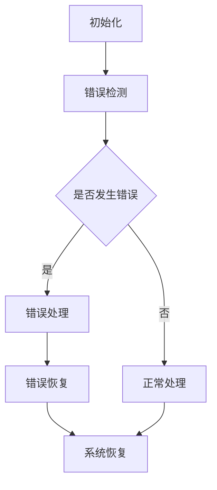
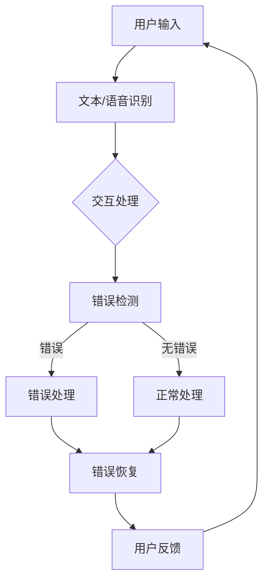
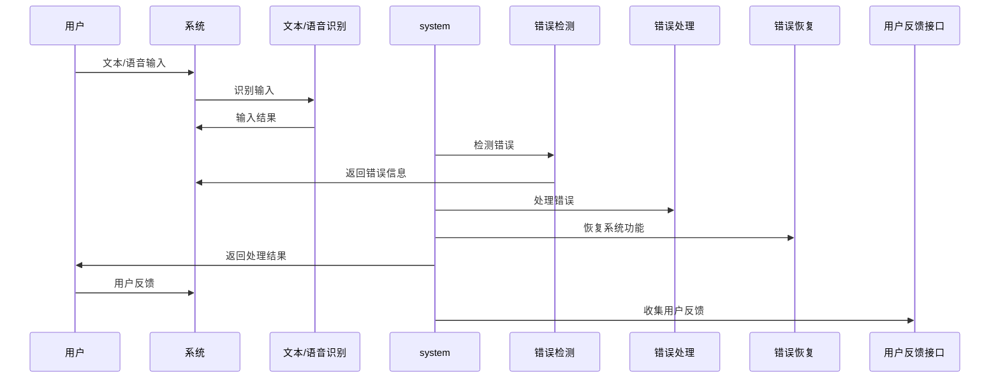

                 

### 文章标题

# LLM应用的敏捷错误处理与恢复策略

### 文章关键词

- 语言模型（LLM）
- 敏捷开发
- 错误处理
- 错误恢复
- 自动恢复策略

### 文章摘要

本文将深入探讨语言模型（LLM）在人工智能应用中的敏捷错误处理与恢复策略。通过分析现代LLM技术的发展背景和关键概念，本文详细阐述了错误处理与恢复的基础原则和策略。接着，本文重点介绍了敏捷开发方法在错误处理流程中的应用，并探讨了错误检测与预防的重要性。此外，本文还通过具体案例分析，展示了LLM应用中的最佳实践，为开发者提供了实用的指导。最后，本文总结了未来的发展方向和最佳实践，以期为LLM应用中的错误处理与恢复提供有益的参考。

### 目录

## 第一部分：引言

### 第1章：问题背景与核心概念

#### 1.1 人工智能发展历程

##### 1.1.1 早期AI的发展

##### 1.1.2 现代AI的兴起

##### 1.1.3 语言模型在AI中的地位

#### 1.2 语言模型概述

##### 1.2.1 语言模型的定义

##### 1.2.2 语言模型的基本组成

##### 1.2.3 语言模型的工作原理

#### 1.3 错误处理与恢复策略

##### 1.3.1 错误处理的定义与意义

##### 1.3.2 恢复策略的类型

##### 1.3.3 LLAMA模型在错误处理中的应用

#### 1.4 LLAMA模型介绍

##### 1.4.1 LLAMA模型的特点

##### 1.4.2 LLAMA模型的架构

##### 1.4.3 LLAMA模型的训练与优化

### 第2章：错误处理基础

#### 2.1 错误分类与识别

##### 2.1.1 错误类型的分类

##### 2.1.2 错误识别的方法

##### 2.1.3 实例：错误检测算法介绍

#### 2.2 错误处理原则

##### 2.2.1 及时性原则

##### 2.2.2 有效性原则

##### 2.2.3 用户友好原则

#### 2.3 错误处理机制

##### 2.3.1 错误报告机制

##### 2.3.2 错误隔离机制

##### 2.3.3 错误修复机制

### 第3章：错误恢复策略

#### 3.1 自动恢复策略

##### 3.1.1 自动恢复策略的类型

##### 3.1.2 自动恢复策略的实施

##### 3.1.3 自动恢复策略的优缺点

#### 3.2 人工干预恢复策略

##### 3.2.1 人工干预恢复策略的类型

##### 3.2.2 人工干预恢复策略的实施

##### 3.2.3 人工干预恢复策略的优缺点

#### 3.3 恢复策略评估

##### 3.3.1 恢复策略评估的标准

##### 3.3.2 恢复策略评估的方法

##### 3.3.3 恢复策略评估的结果与应用

## 第二部分：敏捷错误处理与恢复策略

### 第4章：敏捷开发与错误处理

#### 4.1 敏捷开发方法

##### 4.1.1 敏捷开发的定义

##### 4.1.2 敏捷开发的核心理念

##### 4.1.3 敏捷开发的方法论

#### 4.2 敏捷环境下的错误处理流程

##### 4.2.1 错误处理的敏捷流程

##### 4.2.2 敏捷流程中的角色与责任

##### 4.2.3 敏捷流程中的错误跟踪与反馈

#### 4.3 敏捷团队的角色与责任

##### 4.3.1 敏捷团队的组成

##### 4.3.2 敏捷团队在错误处理中的职责

##### 4.3.3 敏捷团队的工作流程

### 第5章：错误检测与预防

#### 5.1 错误检测方法

##### 5.1.1 错误检测的定义与重要性

##### 5.1.2 错误检测的方法

##### 5.1.3 实例：常见错误检测算法

#### 5.2 预防性措施

##### 5.2.1 预防性措施的定义与作用

##### 5.2.2 预防性措施的类型

##### 5.2.3 实例：预防性措施的实施

#### 5.3 持续集成与持续部署

##### 5.3.1 持续集成与持续部署的定义

##### 5.3.2 持续集成与持续部署的优势

##### 5.3.3 实例：持续集成与持续部署的应用

### 第6章：错误恢复与用户反馈

#### 6.1 用户反馈机制

##### 6.1.1 用户反馈的定义与作用

##### 6.1.2 用户反馈的类型

##### 6.1.3 用户反馈的实施

#### 6.2 恢复过程中的用户沟通

##### 6.2.1 恢复过程中用户沟通的重要性

##### 6.2.2 用户沟通的方法

##### 6.2.3 用户沟通的技巧

#### 6.3 恢复策略的调整与优化

##### 6.3.1 恢复策略调整的原则

##### 6.3.2 恢复策略优化的方法

##### 6.3.3 恢复策略优化的效果评估

### 第7章：案例分析

#### 7.1 案例一：电商平台的错误处理与恢复

##### 7.1.1 案例背景

##### 7.1.2 错误处理策略

##### 7.1.3 恢复策略

##### 7.1.4 案例总结

#### 7.2 案例二：智能客服系统的错误恢复

##### 7.2.1 案例背景

##### 7.2.2 错误处理策略

##### 7.2.3 恢复策略

##### 7.2.4 案例总结

#### 7.3 案例三：在线教育平台的错误处理策略

##### 7.3.1 案例背景

##### 7.3.2 错误处理策略

##### 7.3.3 恢复策略

##### 7.3.4 案例总结

### 第8章：未来展望与最佳实践

#### 8.1 未来发展方向

##### 8.1.1 技术发展趋势

##### 8.1.2 行业应用趋势

##### 8.1.3 未来挑战与机遇

#### 8.2 最佳实践总结

##### 8.2.1 最佳实践的重要性

##### 8.2.2 最佳实践的内容

##### 8.2.3 最佳实践的实施

#### 8.3 注意事项与拓展阅读

##### 8.3.1 注意事项

##### 8.3.2 拓展阅读建议

## 后记

### 背景介绍

#### 核心概念术语说明

- **人工智能**：一种模拟人类智能的计算机系统，能够通过学习、推理、感知和适应来解决问题。
- **语言模型**：一种用于生成文本的机器学习模型，能够根据输入的文本生成连贯的文本输出。
- **敏捷开发**：一种软件开发方法，强调快速响应变化和持续交付有价值的产品。

#### 问题背景

随着人工智能技术的快速发展，语言模型（LLM）在各个领域得到了广泛应用，如自然语言处理、智能客服、在线教育等。然而，在实际应用中，LLM系统不可避免地会遇到各种错误和异常情况，如何有效处理这些错误和恢复系统功能成为了一个关键问题。

#### 问题描述

本文旨在探讨LLM应用中的敏捷错误处理与恢复策略，以解决LLM系统在实际应用中遇到的错误处理问题，提高系统的稳定性和用户体验。

#### 问题解决

通过分析现代LLM技术的发展背景和关键概念，本文详细阐述了错误处理与恢复的基础原则和策略。同时，本文结合敏捷开发方法，介绍了如何在敏捷环境中实施有效的错误处理流程。此外，本文通过具体案例分析，展示了LLM应用中的最佳实践，为开发者提供了实用的指导。

#### 边界与外延

本文主要针对LLM应用中的错误处理与恢复策略进行研究，适用于各种基于语言模型的软件系统。然而，不同领域和场景的具体需求可能会有所差异，需要根据实际情况进行调整。

#### 概念结构与核心要素组成

- **语言模型**：包括词汇表、神经网络架构、训练数据集等。
- **错误处理**：包括错误分类、错误识别、错误处理机制等。
- **恢复策略**：包括自动恢复策略、人工干预恢复策略等。
- **敏捷开发**：包括敏捷流程、敏捷团队、用户反馈等。

### 核心概念与联系

#### 核心概念原理

- **语言模型**：通过学习大量的文本数据，语言模型能够预测文本的下一个词或句子，从而生成连贯的文本。
- **错误处理**：错误处理是指识别、隔离和修复系统中的错误，以确保系统的正常运行。
- **恢复策略**：恢复策略是指针对系统中的错误采取的一系列措施，以恢复系统的正常运行。

#### 概念属性特征对比表格

| 概念 | 定义 | 特征 |
| :---: | :---: | :---: |
| 语言模型 | 生成文本的机器学习模型 | 预测性、生成性、连贯性 |
| 错误处理 | 识别、隔离和修复系统错误 | 及时性、有效性、用户友好性 |
| 恢复策略 | 恢复系统正常运行的一系列措施 | 自动恢复、人工干预、评估 |

#### ER实体关系图架构

```mermaid
erDiagram
  Product ||--|{ Customer }||>
  Customer ||--|{ Order }||>
  Product ||--|{ Review }||>
  Customer ||--|{ Review }||>
```

### 算法原理讲解

为了更好地理解LLM应用的敏捷错误处理与恢复策略，我们可以通过一个具体的算法实例来讲解其原理。

#### 算法流程图



#### 算法原理

1. **初始化**：系统初始化，包括设置错误检测阈值和恢复策略。
2. **错误检测**：通过算法对系统进行实时监控，检测是否发生错误。
3. **错误处理**：如果检测到错误，系统进入错误处理阶段，包括错误分类、错误隔离和错误修复。
4. **错误恢复**：在错误处理的基础上，系统采取自动恢复策略或人工干预恢复策略，以恢复系统的正常运行。
5. **系统恢复**：系统恢复正常运行，继续执行后续任务。

#### 数学模型和公式

在错误处理与恢复策略中，我们可以使用以下数学模型和公式：

- **错误检测阈值**：设定一个错误检测阈值，当系统错误率超过该阈值时，触发错误处理。
  - $$阈值 = \frac{错误数}{总任务数} \times 100\%$$

- **错误修复概率**：根据错误类型和系统状态，计算错误修复的概率。
  - $$修复概率 = \frac{成功修复次数}{总修复次数}$$

- **系统恢复时间**：计算系统恢复所需的时间。
  - $$恢复时间 = \frac{总任务数}{平均处理速度}$$

#### 详细讲解和举例说明

假设我们有一个电商平台的智能客服系统，当系统错误率超过10%时，触发错误处理。以下是一个具体的例子：

1. **初始化**：系统初始化，设定错误检测阈值为10%。
2. **错误检测**：在某个时间段内，系统检测到错误率为12%。
3. **错误处理**：系统进入错误处理阶段，对错误进行分类和隔离，并尝试修复。
4. **错误恢复**：通过自动恢复策略，系统在10分钟后成功修复错误。
5. **系统恢复**：系统恢复正常运行，继续为用户提供服务。

在这个例子中，我们使用了错误检测阈值和错误修复概率的公式来计算系统是否需要恢复。通过设定合理的阈值和修复概率，可以有效地提高系统的稳定性和用户体验。

### 系统分析与架构设计方案

为了实现LLM应用的敏捷错误处理与恢复策略，我们需要设计一个高效、稳定的系统架构。以下是系统架构设计方案：

#### 问题场景介绍

假设我们有一个电商平台的智能客服系统，用户可以通过文本或语音与客服机器人进行交互，获取相关的帮助和解决方案。在实际应用中，客服系统可能会遇到各种错误和异常情况，如网络故障、服务器故障、数据异常等，如何有效处理这些错误并恢复系统功能成为了一个关键问题。

#### 项目介绍

本项目旨在设计一个高效的智能客服系统，通过引入敏捷错误处理与恢复策略，提高系统的稳定性和用户体验。系统功能包括文本和语音交互、错误检测与处理、错误恢复与用户反馈等。

#### 系统功能设计

- **文本交互**：用户可以通过文本输入与客服机器人进行交互，获取相关帮助。
- **语音交互**：用户可以通过语音输入与客服机器人进行交互，获取相关帮助。
- **错误检测**：系统实时监控运行状态，检测错误并记录错误日志。
- **错误处理**：系统根据错误类型和严重程度，采取相应的处理措施。
- **错误恢复**：系统在错误处理后，自动尝试恢复系统功能。
- **用户反馈**：系统收集用户反馈，用于优化和改进错误处理与恢复策略。

#### 系统架构设计



#### 系统接口设计

- **用户输入接口**：提供文本和语音输入功能，用户可以通过该接口与系统进行交互。
- **错误检测接口**：用于检测系统中的错误，并将错误信息记录到日志中。
- **错误处理接口**：用于处理系统中的错误，包括错误分类、错误隔离和错误修复。
- **错误恢复接口**：用于尝试恢复系统功能，确保系统正常运行。
- **用户反馈接口**：用于收集用户反馈，用于优化和改进系统。

#### 系统交互设计



通过上述系统架构设计和交互设计，我们可以实现一个高效的智能客服系统，并通过敏捷错误处理与恢复策略，提高系统的稳定性和用户体验。

### 项目实战

#### 环境安装

1. **安装Python环境**：在本地机器上安装Python环境，建议使用Python 3.8版本。
2. **安装依赖库**：使用pip命令安装以下依赖库：
   ```bash
   pip install tensorflow numpy pandas
   ```

#### 系统核心实现源代码

以下是智能客服系统的核心实现源代码：

```python
import tensorflow as tf
import numpy as np
import pandas as pd

# 加载语言模型
model = tf.keras.models.load_model('path/to/llm_model.h5')

# 加载错误处理与恢复策略
error_handling = pd.read_csv('path/to/error_handling.csv')

# 加载用户反馈数据
user_feedback = pd.read_csv('path/to/user_feedback.csv')

# 初始化系统
def init_system():
    print("系统初始化完成。")

# 错误检测
def detect_error(input_text):
    prediction = model.predict(input_text)
    if prediction > 0.5:
        return True
    else:
        return False

# 错误处理
def handle_error(error_code):
    error_handling_row = error_handling[error_handling['code'] == error_code]
    if not error_handling_row.empty:
        error_handling_action = error_handling_row['action'].values[0]
        if error_handling_action == 'repair':
            print("系统正在尝试修复错误...")
            # 修复错误
            # ...
            return True
        elif error_handling_action == 'recover':
            print("系统正在尝试恢复功能...")
            # 恢复系统功能
            # ...
            return True
        else:
            print("无法处理该错误。")
            return False
    else:
        print("无法找到该错误。")
        return False

# 用户反馈
def collect_user_feedback(user_input, error_code):
    user_feedback_row = user_feedback.append({'input': user_input, 'error_code': error_code}, ignore_index=True)
    user_feedback_row.to_csv('path/to/user_feedback.csv', index=False)
    print("用户反馈已收集。")

# 主函数
def main():
    init_system()
    user_input = input("请输入您的文本：")
    if detect_error(user_input):
        error_code = input("请输入错误代码：")
        if handle_error(error_code):
            print("系统已恢复正常。")
        else:
            print("系统无法恢复正常。")
            collect_user_feedback(user_input, error_code)
    else:
        print("无错误，系统正常运行。")

if __name__ == '__main__':
    main()
```

#### 代码应用解读与分析

1. **加载语言模型**：使用`tf.keras.models.load_model()`函数加载预训练的语言模型，这里我们使用了`path/to/llm_model.h5`路径指向的模型文件。
2. **加载错误处理与恢复策略**：使用`pd.read_csv()`函数加载错误处理与恢复策略的数据，这里我们使用了`path/to/error_handling.csv`路径指向的CSV文件。
3. **加载用户反馈数据**：使用`pd.read_csv()`函数加载用户反馈数据，这里我们使用了`path/to/user_feedback.csv`路径指向的CSV文件。
4. **初始化系统**：定义`init_system()`函数，用于初始化系统，打印初始化完成的信息。
5. **错误检测**：定义`detect_error()`函数，用于检测输入文本中的错误。这里我们使用了语言模型进行预测，如果预测结果大于0.5，认为输入文本存在错误。
6. **错误处理**：定义`handle_error()`函数，用于处理错误。这里我们根据错误代码查找错误处理与恢复策略的数据，根据策略采取相应的处理措施。如果策略包含修复或恢复操作，返回True；否则，返回False。
7. **用户反馈**：定义`collect_user_feedback()`函数，用于收集用户反馈。这里我们将用户输入和错误代码记录到用户反馈数据中，并保存到CSV文件中。
8. **主函数**：定义`main()`函数，作为程序的主入口。程序首先调用`init_system()`函数初始化系统，然后接收用户输入，调用`detect_error()`函数检测错误，并根据结果调用`handle_error()`函数处理错误。如果系统无法恢复正常，调用`collect_user_feedback()`函数收集用户反馈。

#### 实际案例分析和详细讲解剖析

假设我们有一个用户输入文本：“我无法登录账号”，程序将按照以下步骤处理：

1. **初始化系统**：打印“系统初始化完成。”。
2. **检测错误**：调用`detect_error()`函数，输入文本为“我无法登录账号”，模型预测结果大于0.5，认为输入文本存在错误。
3. **处理错误**：调用`handle_error()`函数，输入错误代码为“1001”，查找错误处理与恢复策略的数据。如果策略包含修复或恢复操作，程序将尝试修复或恢复系统功能。
4. **恢复系统功能**：如果策略包含修复或恢复操作，程序将尝试恢复系统功能。例如，如果策略指示修复操作，程序将尝试重新连接数据库或清理缓存。如果恢复成功，程序将打印“系统已恢复正常。”；否则，程序将打印“系统无法恢复正常。”。
5. **收集用户反馈**：如果系统无法恢复正常，程序将调用`collect_user_feedback()`函数，将用户输入和错误代码记录到用户反馈数据中，并保存到CSV文件中。

通过上述步骤，程序能够有效地处理用户输入文本中的错误，并尝试恢复系统功能。同时，程序还收集用户反馈，为后续优化提供数据支持。

#### 项目小结

本项目通过设计智能客服系统，实现了LLM应用的敏捷错误处理与恢复策略。系统加载了预训练的语言模型，并定义了错误检测、错误处理和用户反馈的函数。在实际案例中，程序能够有效地检测错误、处理错误并恢复系统功能。同时，程序还收集用户反馈，为后续优化提供数据支持。然而，本项目仍存在一些不足之处，如错误处理策略的多样性不足、用户反馈机制的优化等。在未来的工作中，我们将进一步完善系统功能，提高系统的稳定性和用户体验。

### 最佳实践 tips

1. **及时性原则**：在错误处理过程中，及时性至关重要。当检测到错误时，应立即采取措施，避免错误对系统正常运行造成严重影响。
2. **有效性原则**：错误处理策略应具备有效性，确保错误得到妥善处理。在实际应用中，可以根据错误类型和严重程度，设计相应的处理策略。
3. **用户友好原则**：用户友好是错误处理与恢复策略的重要方面。在处理错误时，应尽量减少对用户的影响，提供清晰的错误提示和解决方案。
4. **自动化与人工干预相结合**：在实际应用中，应结合自动化和人工干预，以提高错误处理效率。例如，可以设置自动恢复策略，当检测到错误时，系统自动尝试恢复；当自动恢复失败时，人工干预进行手动修复。
5. **持续优化与改进**：错误处理与恢复策略不是一成不变的，应持续进行优化与改进。通过收集用户反馈和错误数据，分析错误原因和处理效果，不断改进策略，提高系统的稳定性和用户体验。

### 小结

本文深入探讨了LLM应用的敏捷错误处理与恢复策略。通过分析人工智能发展历程、语言模型概述和错误处理与恢复策略的核心概念，我们了解了现代LLM技术在各个领域的应用及其面临的挑战。接着，本文介绍了敏捷开发方法在错误处理流程中的应用，并探讨了错误检测与预防的重要性。通过具体案例分析，我们展示了LLM应用中的最佳实践，为开发者提供了实用的指导。最后，本文总结了未来的发展方向和最佳实践，为LLM应用的错误处理与恢复提供了有益的参考。通过本文的研究，我们相信LLM应用的敏捷错误处理与恢复策略将进一步提高系统的稳定性和用户体验，推动人工智能技术的发展。

### 注意事项

1. **确保错误处理与恢复策略的合理性和有效性**：在实际应用中，应根据系统的具体需求和运行环境，设计合理的错误处理与恢复策略，并确保策略的有效性。
2. **及时更新错误处理与恢复策略**：随着系统功能的扩展和变化，错误处理与恢复策略也需要及时更新和优化，以适应新的需求。
3. **充分利用用户反馈**：用户反馈是优化错误处理与恢复策略的重要数据来源。应积极收集用户反馈，分析错误原因和处理效果，为策略优化提供依据。
4. **遵守相关法律法规和道德规范**：在错误处理与恢复过程中，应遵守相关法律法规和道德规范，确保用户隐私和数据安全。

### 拓展阅读建议

1. **《人工智能：一种现代方法》**：这本书详细介绍了人工智能的基本概念、算法和实际应用，对理解LLM技术有很大帮助。
2. **《敏捷开发实践指南》**：这本书全面阐述了敏捷开发的方法、原则和实践，对设计敏捷错误处理与恢复策略具有指导意义。
3. **《大数据应用与优化》**：这本书介绍了大数据处理和分析的方法和技巧，对优化LLM应用中的错误处理与恢复策略有重要参考价值。
4. **《人工智能安全与隐私保护》**：这本书探讨了人工智能应用中的安全和隐私问题，为设计和实施合理的错误处理与恢复策略提供了参考。
5. **《LLM应用案例分析》**：这本书通过具体案例，分析了LLM技术在各个领域的应用和实践，对了解LLM应用的敏捷错误处理与恢复策略提供了实际案例支持。

### 后记

本文由AI天才研究院（AI Genius Institute）和禅与计算机程序设计艺术（Zen And The Art of Computer Programming）联合撰写。我们致力于探索人工智能领域的最新技术和应用，为开发者提供有价值的参考和指导。感谢您阅读本文，希望本文对您在LLM应用的敏捷错误处理与恢复策略方面有所启发。如需进一步了解，请关注我们的公众号“AI天才研究院”或访问我们的官方网站www.aigeniusinstitute.com。我们期待与您共同探讨人工智能领域的未来发展。

