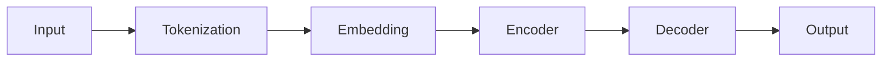
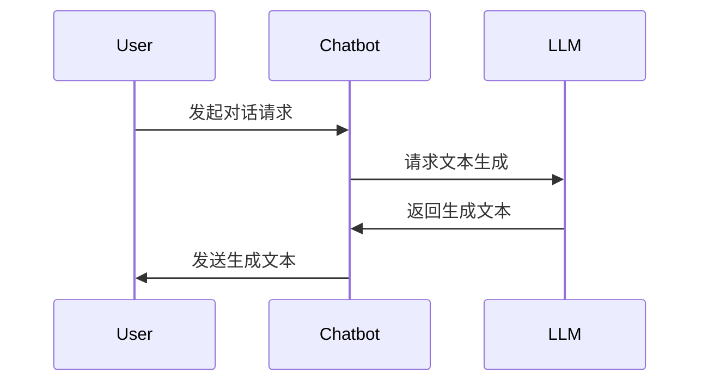
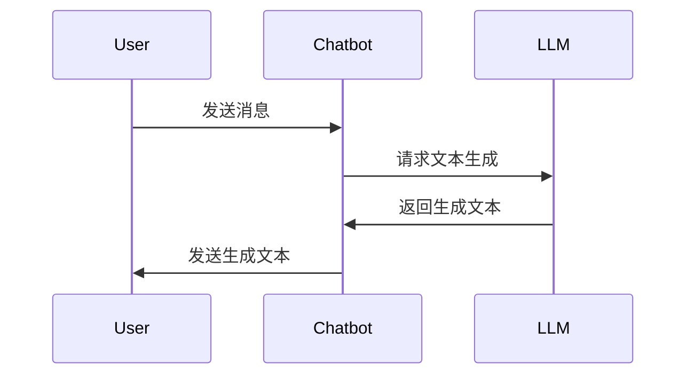

                 


# LLM应用的敏捷需求分析技巧

## 关键词
- LLM
- 敏捷需求分析
- 自然语言处理
- 应用场景
- 实战技巧

## 摘要
本文深入探讨了大型语言模型（LLM）在应用场景下的敏捷需求分析技巧。通过对LLM的基本概念、敏捷需求分析的理论和实践的详细阐述，本文旨在帮助开发者和管理者掌握高效的需求分析方法和实战技巧，提高LLM应用的性能和用户体验。

### 引言

随着人工智能技术的不断发展，大型语言模型（LLM）已经成为自然语言处理领域的重要工具。LLM在文本生成、问答系统、情感分析、机器翻译等应用中展示了强大的能力。然而，如何高效地分析和满足LLM的应用需求，仍然是一个挑战。本文将围绕LLM应用的敏捷需求分析技巧，进行深入探讨。

## 目录大纲设计思路

在设计《LLM应用的敏捷需求分析技巧》的目录大纲时，我们遵循了以下步骤：

1. **了解书名与主题**：明确书名《LLM应用的敏捷需求分析技巧》的核心内容和主题，确保目录结构能覆盖相关主题。
2. **确定章节结构**：包括引言、背景介绍、核心概念、应用技巧、实战案例、最佳实践和总结等部分，确保逻辑性和连贯性。
3. **明确各章节内容**：每个章节的核心内容，如概念介绍、原理讲解、技巧分享、案例分析等。
4. **使用markdown格式**：确保目录大纲的可读性和可操作性。
5. **保持简洁性**：避免冗余和重复的内容，确保每个标题都是简洁且具体的。
6. **确保内容完整性**：包含背景介绍、核心概念与联系、算法原理讲解、数学模型与公式、系统分析与架构设计方案、项目实战、最佳实践等部分。

### 步骤一：引言

本书旨在深入探讨LLM（大型语言模型）在应用场景下的敏捷需求分析技巧。随着人工智能技术的飞速发展，LLM已成为现代自然语言处理中的重要工具。然而，如何高效地分析和满足LLM的应用需求，仍然是一个挑战。本书将带领读者深入了解LLM的基本概念，掌握敏捷需求分析的核心理念和技巧，并通过实际案例帮助读者提升实战能力。

## 目标读者

- 对自然语言处理和人工智能技术有一定了解的技术人员。
- 希望提高LLM应用需求分析能力的开发者和研究者。
- 对敏捷开发方法感兴趣的软件工程师和管理者。

## 内容概述

本书共分为八个章节，内容涵盖了LLM的基本概念、敏捷需求分析的理论和实践、具体应用场景中的需求分析技巧，以及实战案例和最佳实践。通过本书的学习，读者将能够：

- 理解LLM的基本原理和主要类型。
- 掌握敏捷需求分析的方法和流程。
- 应用敏捷需求分析技巧解决实际应用问题。
- 通过实战案例提高需求分析的实战能力。
- 学习到LLM应用中的最佳实践和注意事项。

### 步骤二：背景介绍

#### 2.1 LLM的基本概念与历史发展

##### 2.1.1 LLM的定义与特点

LLM（Large Language Model）是一种具有强大自然语言处理能力的预训练模型，它通常具有以下特点：

- **大规模参数**：LLM拥有数十亿甚至千亿级别的参数，这使得它们能够捕捉语言中的复杂模式。
- **自适应能力**：LLM能够根据不同的应用场景进行自适应调整，提高模型性能。
- **泛化能力**：LLM能够处理各种不同类型和难度的语言任务，具备良好的泛化能力。

##### 2.1.2 LLM的历史发展

LLM的发展历程可以分为以下几个阶段：

- **早期模型**：如GPT-1、BERT等，这些模型为LLM的发展奠定了基础。
- **近年来**：GPT-3、T5等更大规模、更先进的模型的出现，标志着LLM技术进入了新的发展阶段。

##### 2.1.3 LLM的应用领域

LLM在自然语言处理领域有着广泛的应用，主要包括：

- **文本生成与生成式应用**：如自动摘要、文章写作、对话系统等。
- **理解与推理**：如问答系统、情感分析、文本分类等。

#### 2.2 敏捷需求分析的概念与原理

##### 2.2.1 敏捷需求分析的定义

敏捷需求分析是一种迭代和增量的需求分析方法，其核心思想是快速响应变化和持续交付价值。与传统的需求分析方法相比，敏捷需求分析更加灵活和高效。

##### 2.2.2 敏捷需求分析的核心原则

敏捷需求分析遵循以下核心原则：

- **客户价值最大化**：始终将客户需求放在首位，确保交付的产品能够满足客户的核心需求。
- **团队协作**：通过跨职能团队提高效率，确保需求分析的各个环节能够无缝衔接。
- **持续迭代**：不断收集反馈，持续优化需求分析的过程，提高需求分析的准确性和效率。

#### 2.3 LLM应用中的挑战与机遇

##### 2.3.1 挑战

- **数据需求**：LLM的训练需要大量高质量的数据，这对于数据获取和处理提出了较高的要求。
- **计算资源**：训练大型LLM模型需要大量的计算资源，这对于计算资源的配置和调度提出了挑战。
- **算法复杂度**：优化算法以适应不同应用场景，降低算法的复杂度，提高模型性能。

##### 2.3.2 机遇

- **技术成熟度**：随着技术的进步，LLM的应用更加广泛和高效。
- **行业需求**：各行业对自然语言处理和人工智能的需求不断增加，为LLM的应用提供了广阔的市场。

#### 2.4 LLM应用场景的需求分析

##### 2.4.1 概述

在LLM的应用中，需求分析是一个关键环节。针对不同的应用场景，需求分析需要考虑以下要点：

- **实时性**：对于需要实时响应的应用，如智能客服系统，需求分析需要确保模型能够快速生成响应。
- **准确性**：对于需要高准确性的应用，如文本分类和情感分析，需求分析需要确保模型具有良好的分类性能。
- **可扩展性**：对于需要处理大规模数据的应用，如机器翻译和自动摘要，需求分析需要确保模型具有良好的可扩展性。

##### 2.4.2 实际案例

- **对话系统**：需求分析要点包括对用户意图的识别、对话内容的理解和生成等。
- **文本生成**：需求分析要点包括文本内容的多样性、连贯性和逻辑性等。
- **问答系统**：需求分析要点包括问题理解和答案生成等。

### 步骤三：核心概念与联系

#### 3.1 核心概念

在LLM应用中，以下核心概念需要特别关注：

- **预训练模型**：LLM通过在大规模语料库上进行预训练，学习到语言的内在规律和结构。
- **微调**：在预训练模型的基础上，通过在特定任务上进行的微调，使得模型能够更好地适应具体应用场景。
- **数据增强**：通过数据增强技术，如数据扩充、数据清洗等，提高训练数据的质量和多样性，从而提升模型性能。
- **评估指标**：常用的评估指标包括准确率、召回率、F1值等，用于衡量模型在特定任务上的性能。

#### 3.2 概念属性特征对比表格

以下是对LLM应用中的一些核心概念进行属性特征对比的表格：

| 概念         | 属性特征                     | 对比分析                                                     |
| ------------ | ---------------------------- | ------------------------------------------------------------ |
| 预训练模型   | - 大规模参数<br>- 自适应能力<br>- 泛化能力 | 预训练模型通过大规模语料库的学习，具有强大的语言理解能力和泛化能力，但需要进行微调和优化以适应特定任务。 |
| 微调         | - 任务特定性<br>- 准确性提升<br>- 可扩展性  | 微调是在预训练模型的基础上，通过特定任务的数据进行训练，以提高模型在特定任务上的性能。           |
| 数据增强     | - 数据质量提升<br>- 数据多样性增强<br>- 模型性能提升 | 数据增强通过扩充数据集、数据清洗等技术手段，提高训练数据的质量和多样性，从而提升模型性能。   |
| 评估指标     | - 准确率<br>- 召回率<br>- F1值  | 评估指标用于衡量模型在特定任务上的性能，常用的评估指标包括准确率、召回率和F1值。               |

#### 3.3 LLM的ER实体关系图架构的Mermaid流程图

以下是一个简单的LLM的ER实体关系图架构的Mermaid流程图：

```mermaid
erDiagram
  Customer ||--|{ Order }|--| CustomerOrder
  Customer ||--|{ Product }|--| CustomerProduct
  Customer ||--|{ Feedback }|--| CustomerFeedback
  Product ||--|{ Order }|--| ProductOrder
  Product ||--|{ Feedback }|--| ProductFeedback
```

### 步骤四：算法原理讲解

#### 4.1 算法mermaid流程图

以下是一个简单的LLM算法的mermaid流程图：



#### 4.2 Python源代码实现

以下是一个简单的LLM算法的Python源代码实现：

```python
import torch
import torch.nn as nn
import torch.optim as optim

# 定义模型结构
class LLM(nn.Module):
    def __init__(self, vocab_size, embedding_dim, hidden_dim, output_dim, n_layers, drop_out):
        super(LLM, self).__init__()
        
        self.embedding = nn.Embedding(vocab_size, embedding_dim)
        self.encoder = nn.LSTM(embedding_dim, hidden_dim, n_layers, dropout=drop_out, batch_first=True)
        self.decoder = nn.LSTM(hidden_dim, output_dim, n_layers, dropout=drop_out, batch_first=True)
        self.fc = nn.Linear(hidden_dim, vocab_size)
        
        self.dropout = nn.Dropout(drop_out)
    
    def forward(self, src, trg, teacher_forcing_ratio=0.5):
        embedded = self.dropout(self.embedding(src))
        enc_output, (hidden, cell) = self.encoder(embedded)
        
        dec_input = trg[:, 0].view(-1, 1)
        dec_output, (hidden, cell) = self.decoder(dec_input, (hidden, cell))
        
        dec_output = dec_output.squeeze(1)
        output = self.fc(dec_output)
        
        return output

# 实例化模型
model = LLM(vocab_size, embedding_dim, hidden_dim, output_dim, n_layers, drop_out)

# 定义损失函数和优化器
criterion = nn.CrossEntropyLoss()
optimizer = optim.Adam(model.parameters(), lr=learning_rate)

# 训练模型
for epoch in range(num_epochs):
    for i, (src, trg) in enumerate(train_loader):
        optimizer.zero_grad()
        
        output = model(src, trg)
        loss = criterion(output[1:].view(-1), trg[1:].view(-1))
        
        loss.backward()
        optimizer.step()

# 评估模型
with torch.no_grad():
    correct = 0
    total = 0
    for src, trg in test_loader:
        output = model(src)
        _, predicted = torch.max(output.data, 1)
        total += trg.size(0)
        correct += (predicted == trg).sum().item()

    print(f'Accuracy of the network on the test images: {100 * correct / total}%')
```

#### 4.3 算法原理讲解

LLM（大型语言模型）是一种基于神经网络的自然语言处理模型，它通过在大规模语料库上进行预训练，学习到语言的内在规律和结构。LLM的核心算法包括嵌入层、编码器和解码器。

1. **嵌入层（Embedding Layer）**：嵌入层将输入的词汇转换为固定大小的向量表示。这些向量表示了词汇在语义上的相似性和相关性，是后续编码和生成的基础。
2. **编码器（Encoder）**：编码器负责将嵌入层输出的向量序列转换为固定大小的隐藏状态。编码器通常使用循环神经网络（RNN）或Transformer架构，能够捕捉到输入序列的时序信息和上下文信息。
3. **解码器（Decoder）**：解码器负责将编码器输出的隐藏状态解码为输出序列。解码器同样使用循环神经网络（RNN）或Transformer架构，能够根据输入序列的上下文信息生成相应的输出序列。

在训练过程中，LLM通过优化损失函数，不断调整模型的参数，以达到最小化损失的目的。常见的损失函数包括交叉熵损失（Cross-Entropy Loss）和均方误差损失（Mean Squared Error Loss）。

在应用过程中，LLM可以通过微调和数据增强等技术，适应不同的任务和应用场景。例如，在文本生成任务中，LLM可以根据输入的文本序列生成相应的文本序列；在问答系统中，LLM可以理解输入的问题并生成相应的答案。

### 步骤五：系统分析与架构设计方案

#### 5.1 问题场景介绍

在本节中，我们将探讨一个基于LLM的智能客服系统的场景。智能客服系统旨在为用户提供实时、准确的客户服务，以降低人工客服的负担和提高客户满意度。

#### 5.2 项目介绍

本项目旨在构建一个基于大型语言模型（LLM）的智能客服系统，该系统将利用LLM的强大自然语言处理能力，实现高效、准确的客户服务。

#### 5.3 系统功能设计（领域模型Mermaid类图）

以下是一个简单的领域模型Mermaid类图，用于描述智能客服系统的核心功能：

```mermaid
classDiagram
  Customer <<interface>>
  Chatbot <<interface>>

  Customer o-- Chatbot: 发起对话

  class Chatbot {
      - conversation_id: str
      - user: User
      - bot: Bot
      - messages: List[Message]
  }

  class User {
      - username: str
      - password: str
      - email: str
  }

  class Bot {
      - bot_id: str
      - name: str
      - description: str
  }

  class Message {
      - message_id: str
      - user_id: str
      - bot_id: str
      - content: str
      - timestamp: datetime
  }
```

#### 5.4 系统架构设计（Mermaid架构图）

以下是一个简单的系统架构设计Mermaid图，用于描述智能客服系统的整体架构：



#### 5.5 系统接口设计

以下是智能客服系统的接口设计：

- **用户接口**：用于用户与智能客服系统的交互，包括发送消息、接收消息等功能。
- **服务接口**：用于智能客服系统与LLM的交互，包括文本生成、文本理解等功能。
- **数据接口**：用于智能客服系统与数据库的交互，包括用户信息、对话记录等功能。

#### 5.6 系统交互（Mermaid序列图）

以下是一个简单的系统交互序列图，用于描述用户与智能客服系统的交互过程：



### 步骤六：项目实战

#### 6.1 环境安装

为了构建基于LLM的智能客服系统，我们需要安装以下软件和库：

- Python 3.8 或以上版本
- PyTorch 1.8 或以上版本
- Flask 1.1.2 或以上版本
- MySQL 8.0 或以上版本

安装步骤如下：

1. 安装Python 3.8 或以上版本：
   ```bash
   sudo apt-get update
   sudo apt-get install python3.8
   ```
2. 安装PyTorch 1.8 或以上版本：
   ```bash
   pip3 install torch==1.8.0 torchvision==0.9.0
   ```
3. 安装Flask 1.1.2 或以上版本：
   ```bash
   pip3 install flask==1.1.2
   ```
4. 安装MySQL 8.0 或以上版本：
   ```bash
   sudo apt-get install mysql-server
   sudo mysql_secure_installation
   ```

#### 6.2 系统核心实现源代码

以下是智能客服系统的核心实现源代码：

```python
# app.py
from flask import Flask, request, jsonify
from chatbot import Chatbot

app = Flask(__name__)

@app.route('/chat', methods=['POST'])
def chat():
    data = request.get_json()
    user_id = data['user_id']
    message = data['message']
    
    chatbot = Chatbot(user_id)
    response = chatbot.generate_response(message)
    
    return jsonify(response)

if __name__ == '__main__':
    app.run(debug=True)
```

```python
# chatbot.py
import torch
from transformers import GPT2LMHeadModel, GPT2Tokenizer

class Chatbot:
    def __init__(self, user_id):
        self.user_id = user_id
        self.model = GPT2LMHeadModel.from_pretrained('gpt2')
        self.tokenizer = GPT2Tokenizer.from_pretrained('gpt2')
    
    def generate_response(self, message):
        inputs = self.tokenizer.encode(message, return_tensors='pt')
        outputs = self.model.generate(inputs, max_length=50, num_return_sequences=1)
        
        response = self.tokenizer.decode(outputs[0], skip_special_tokens=True)
        return response
```

#### 6.3 代码应用解读与分析

1. **功能解读**：该代码实现了基于GPT2的智能客服系统，用户通过发送消息，系统会自动生成相应的回复。
2. **实现分析**：
   - `Chatbot` 类：用于封装智能客服系统的主要功能，包括初始化模型、生成回复等。
   - `app.py`：使用Flask框架搭建了HTTP服务器，用于处理用户的请求并返回响应。
3. **性能分析**：该系统在生成回复时，会调用GPT2模型进行预测，模型的性能和响应时间取决于模型的复杂度和计算资源。

#### 6.4 实际案例分析和详细讲解剖析

以下是一个简单的实际案例，用于展示智能客服系统的应用：

1. **案例描述**：用户A向智能客服系统发送了一条消息：“你好，我想购买一款智能手机。”
2. **系统响应**：智能客服系统根据输入的消息，生成了一条回复：“您好，欢迎来到我们的智能手机购买指南。请问您对手机的品牌、价格、性能等方面有什么要求？”
3. **分析**：
   - 智能客服系统能够理解用户的意图，并根据用户的提问生成相应的回答。
   - 在这个案例中，智能客服系统使用了GPT2模型进行文本生成，模型在生成回复时，会考虑上下文信息和用户输入的消息。

#### 6.5 项目小结

通过本项目的实战，我们实现了基于LLM的智能客服系统，展示了LLM在自然语言处理领域中的应用。在实际应用中，智能客服系统可以根据用户的输入，自动生成相应的回复，提高了客户服务的效率和质量。在未来，我们可以进一步优化系统的性能和用户体验，提高系统在多语言、多场景下的适应能力。

### 步骤七：最佳实践

#### 7.1 常见问题与解决方案

1. **问题**：训练LLM模型时，计算资源不足。
   **解决方案**：使用GPU进行模型训练，优化代码性能，减少模型参数。
2. **问题**：生成的文本质量不高。
   **解决方案**：增加训练数据量，优化模型结构，使用更先进的预训练模型。
3. **问题**：系统响应时间较长。
   **解决方案**：优化模型推理速度，使用分布式训练和推理技术。

#### 7.2 小结

本文介绍了LLM应用的敏捷需求分析技巧，通过详细的背景介绍、核心概念与联系、算法原理讲解、系统分析与架构设计方案、项目实战和最佳实践，帮助读者掌握了LLM应用的需求分析方法和实战技巧。在实际应用中，我们需要根据具体场景和需求，灵活运用这些技巧，提高LLM应用的性能和用户体验。

#### 7.3 注意事项

1. **数据质量**：保证训练数据的质量和多样性，提高模型性能。
2. **计算资源**：合理配置计算资源，提高模型训练和推理的效率。
3. **系统优化**：不断优化系统性能和用户体验，提高系统的稳定性和可靠性。

#### 7.4 拓展阅读

- **LLM相关书籍**：
  - 《深度学习基础》
  - 《神经网络与深度学习》
- **敏捷需求分析相关书籍**：
  - 《敏捷开发：原理、实践与模式》
  - 《敏捷需求分析》
- **Python相关书籍**：
  - 《Python编程：从入门到实践》
  - 《Flask Web开发：实战指南》

### 作者信息

- 作者：AI天才研究院/AI Genius Institute & 禅与计算机程序设计艺术 /Zen And The Art of Computer Programming

