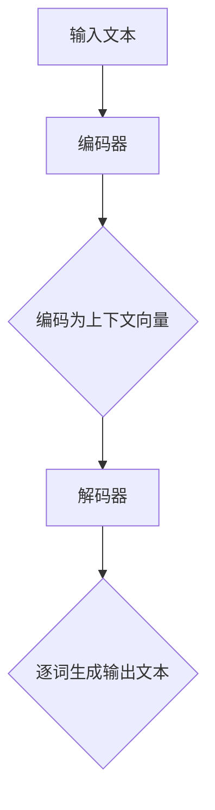
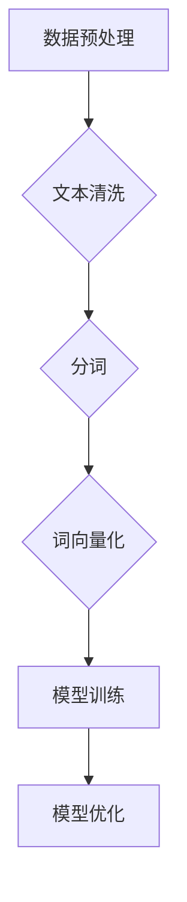
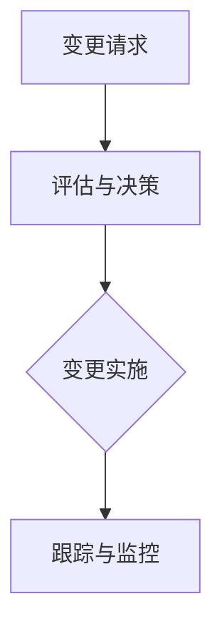
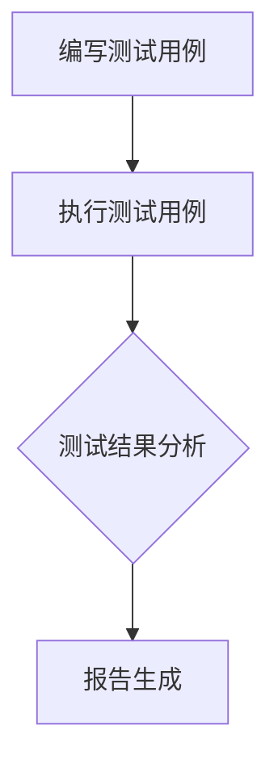
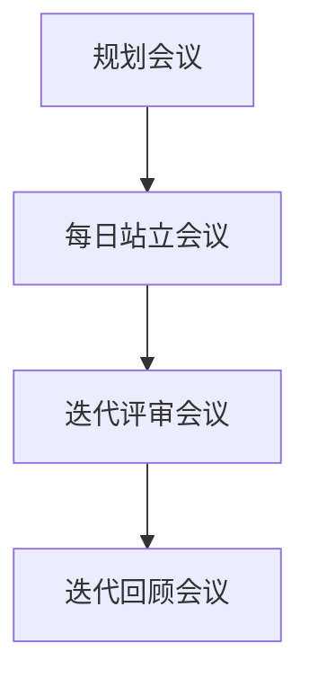

                 

### 第一部分: LLM与Agile需求工程概述

#### 第1章: LLM与Agile需求工程的背景

在当今迅速发展的科技领域中，大型语言模型（LLM）的应用已经成为一个热门话题。LLM作为一种先进的自然语言处理技术，具有强大的语义理解和生成能力，已在诸多领域展现出巨大的潜力和应用价值。然而，随着LLM应用的普及，如何有效地进行需求工程成为了亟待解决的核心问题。

##### 1.1 LLM应用现状与挑战

近年来，随着深度学习和神经网络技术的不断进步，LLM在自然语言处理（NLP）领域取得了显著的成果。从简单的文本分类到复杂的对话系统，LLM已经能够在各种任务中展现出出色的性能。例如，GPT-3和BERT等模型已经广泛应用于文本生成、机器翻译、问答系统等领域，并取得了令人瞩目的效果。

然而，随着LLM应用的深入，我们也面临着一系列挑战。首先，LLM模型的训练过程需要大量计算资源和时间，导致开发成本高昂。其次，LLM模型的复杂性和不确定性使得需求变更频繁，传统的需求工程方法往往难以适应这种动态变化。此外，如何确保LLM应用的安全性、可解释性和可靠性也是当前研究的热点问题。

##### 1.2 Agile需求工程原理

为了应对上述挑战，敏捷需求工程方法应运而生。敏捷需求工程强调快速响应需求变更、持续交付价值，并通过迭代和增量开发的方式，逐步实现项目目标。与传统需求工程方法相比，敏捷需求工程具有以下特点：

1. **用户故事驱动**：敏捷需求工程以用户故事为核心，通过用户与开发团队之间的密切合作，确保需求的准确性和可行性。
2. **迭代开发**：敏捷需求工程采用迭代开发模式，每个迭代周期内完成一部分可交付的软件功能，从而实现项目的逐步推进。
3. **需求优先级排序**：在敏捷需求工程中，需求优先级根据其对项目目标和用户价值的影响进行排序，以便团队能够集中精力解决最重要的问题。
4. **持续集成与部署**：敏捷需求工程强调持续集成和部署，通过自动化测试和持续集成工具，确保软件质量的稳定性和可靠性。

##### 1.3 LLM与Agile需求工程的结合点

LLM与Agile需求工程的结合，可以有效地解决LLM应用中的需求变更问题，提高开发效率和项目成功率。具体来说，LLM与Agile需求工程的结合点主要体现在以下几个方面：

1. **用户故事编写与验证**：利用LLM的自然语言处理能力，可以自动生成用户故事，并通过对话系统与用户进行交互，验证用户故事的真实性和准确性。
2. **需求分析**：LLM可以用于辅助需求分析，通过语义理解技术，提取用户需求的关键信息，并生成需求文档。
3. **需求优先级排序**：利用LLM进行需求分析后，可以根据需求的重要性和紧迫性，自动进行需求优先级排序，为开发团队提供明确的开发方向。
4. **敏捷迭代开发**：LLM可以辅助敏捷迭代开发，通过自动化测试和持续集成，确保每个迭代周期内交付的功能质量。
5. **需求变更管理**：LLM可以帮助开发团队快速响应需求变更，通过持续集成和自动化测试，降低需求变更对项目进度和质量的影响。

##### 1.4 边界与外延

本文主要讨论LLM在Agile需求工程中的应用，涉及的技术栈包括深度学习、自然语言处理、敏捷方法论等。本文的目标读者包括从事LLM应用开发的工程师、需求工程师以及项目经理等。在讨论中，我们将侧重于介绍LLM的基本原理和敏捷需求工程方法，并通过具体案例进行分析和讲解。

##### 1.5 概念结构与核心要素组成

在本部分，我们将介绍LLM和Agile需求工程的核心概念及其相互关系。LLM包括模型架构、数据处理流程和算法原理等内容；而Agile需求工程则涵盖用户故事编写、需求分析、需求优先级排序、迭代开发、需求变更管理等关键环节。通过结合LLM与Agile需求工程，我们可以实现更高效、更灵活的LLM应用开发。

### 第2章: LLM核心概念与架构

在深入了解LLM应用的敏捷需求工程之前，首先需要掌握LLM的基本概念和架构。LLM（Large Language Model）是一种基于深度学习的自然语言处理模型，具有强大的语义理解和生成能力。本章节将详细阐述LLM的核心概念、模型架构以及数据处理流程。

#### 2.1 LLM基础概念

LLM，即大型语言模型，是一种能够对文本进行理解和生成的深度学习模型。与传统语言模型相比，LLM具有以下几个显著特点：

1. **参数规模大**：LLM通常具有数十亿甚至数万亿个参数，这使得它们能够捕捉到语言中的复杂模式和语义信息。
2. **上下文理解能力强**：通过使用长距离依赖模型（如Transformer），LLM能够理解文本中的长距离上下文关系，从而生成更加自然和连贯的文本。
3. **自适应性强**：LLM可以通过微调（fine-tuning）的方式，快速适应特定任务的需求，从而提高任务表现。
4. **通用性强**：LLM通常被训练成通用模型，可以应用于多种自然语言处理任务，如文本分类、问答系统、机器翻译等。

#### 2.2 LLM模型架构解析

LLM的模型架构主要包括两部分：编码器（Encoder）和解码器（Decoder）。其中，编码器负责将输入文本编码为向量表示，解码器则负责生成输出文本。以下是一个典型的LLM模型架构：

1. **编码器**：编码器通常基于Transformer架构，包括多个自注意力层（Self-Attention Layers）和前馈神经网络（Feedforward Networks）。编码器的主要任务是理解输入文本的语义信息，并将其编码为上下文向量（Context Vectors）。
2. **解码器**：解码器同样基于Transformer架构，包括多个自注意力层和交叉注意力层（Cross-Attention Layers）。解码器的主要任务是利用编码器生成的上下文向量，逐词生成输出文本。

以下是一个简化的Mermaid流程图，展示了LLM模型的基本工作流程：



#### 2.3 LLM数据处理流程

LLM的数据处理流程包括数据预处理、模型训练和模型优化等环节。以下是LLM数据处理流程的详细解析：

1. **数据预处理**：数据预处理是LLM训练的基础步骤。主要包括文本清洗、分词、词向量化等操作。文本清洗的目的是去除文本中的噪声和无关信息；分词是将文本分割为单个词汇；词向量化则是将词汇映射为固定大小的向量表示。
2. **模型训练**：在模型训练过程中，LLM通过梯度下降等优化算法，学习输入文本和输出文本之间的映射关系。训练数据通常包括大量的文本对，如文本和对应的摘要、文本和对应的标签等。训练目标是使模型能够准确预测输出文本，从而实现文本生成和分类等任务。
3. **模型优化**：模型优化主要包括超参数调优、模型剪枝和量化等步骤。超参数调优是为了找到最优模型参数，提高模型性能；模型剪枝和量化则是为了减小模型规模，提高模型运行效率。

以下是一个简化的Mermaid流程图，展示了LLM的数据处理流程：



#### 2.4 LLM与传统语言模型的对比

LLM与传统语言模型（如n-gram模型、递归神经网络（RNN）等）在多个方面存在显著差异：

1. **参数规模**：LLM具有数十亿甚至数万亿个参数，而传统语言模型通常只有几千个参数。
2. **上下文理解能力**：LLM能够理解长距离上下文关系，而传统语言模型主要依赖于局部上下文信息。
3. **生成能力**：LLM具有强大的文本生成能力，能够生成连贯、自然的文本，而传统语言模型生成能力相对较弱。

以下是一个对比表格，展示了LLM与传统语言模型的主要区别：

| 对比项 | LLM | 传统语言模型 |
| --- | --- | --- |
| 参数规模 | 十亿级以上 | 千级 |
| 上下文理解能力 | 长距离依赖 | 短距离依赖 |
| 生成能力 | 强 | 弱 |

#### 2.5 ER实体关系图架构

为了更好地理解LLM模型的结构，我们可以使用Mermaid绘制一个ER（实体关系）图，展示LLM模型中的核心实体及其关系。以下是一个简化的ER图：

```mermaid
erDiagram
  Model ||--|{ Encoder : has }
  Model ||--|{ Decoder : has }
  Encoder ||--|{ Self-Attention : has }
  Encoder ||--|{ Feedforward : has }
  Decoder ||--|{ Self-Attention : has }
  Decoder ||--|{ Cross-Attention : has }
```

通过上述ER图，我们可以清晰地看到LLM模型中各个组件之间的关系，以及它们如何共同协作实现文本的编码和生成。

### 第3章: Agile需求工程方法与实践

敏捷需求工程是一种以用户需求为导向，通过快速迭代和持续交付价值的方法，确保项目能够灵活适应变化的需求。本章将详细介绍敏捷需求工程的基本原理、实践方法，以及如何在LLM应用开发中运用这些方法。

#### 3.1 敏捷方法论

敏捷方法论的核心思想是通过迭代和增量的方式，快速响应变化，实现项目的成功。以下是敏捷方法论的主要原则和实践方法：

1. **用户故事驱动**：用户故事是敏捷需求工程的核心，它描述了一个功能需求或一个用户行为，通常包括三个要素：用户需求、功能场景和验收标准。用户故事的编写和验证过程，有助于确保需求的一致性和准确性。
2. **迭代开发**：迭代开发是将项目划分为多个小周期（迭代），在每个迭代周期内，团队完成一部分可交付的功能。通过迭代，团队可以逐步实现项目目标，同时及时调整开发方向。
3. **需求优先级排序**：在敏捷需求工程中，需求优先级根据其对项目目标和用户价值的影响进行排序。优先级排序有助于团队集中精力解决最重要的问题，提高开发效率。
4. **持续集成与部署**：持续集成和部署是确保软件质量的关键，通过自动化测试和持续集成工具，团队可以及时发现和解决集成问题，确保软件的稳定性和可靠性。
5. **团队协作**：敏捷需求工程强调团队协作，通过每日站立会议、迭代回顾等实践，团队可以保持良好的沟通和协作，提高项目的整体效率。

#### 3.2 用户故事编写与验证

用户故事是敏捷需求工程的基础，它描述了用户的需求和期望。编写一个有效的用户故事，需要遵循以下原则：

1. **INVEST原则**：用户故事应该遵循INVEST原则，即独立（Independent）、可 Negotiable、可验证（Verifiable）、有价值（Valuable）、估计（Estimable）、小（Small）。
2. **用户需求**：用户故事应描述用户的需求或期望，通常以“作为……，我想……，以便……”的形式表达。
3. **功能场景**：功能场景描述了用户在特定情况下如何使用系统，通常包括前置条件、操作步骤和期望结果。
4. **验收标准**：验收标准是判断用户故事是否完成的标准，通常包括功能测试、性能测试和用户验收测试等。

以下是一个用户故事的示例：

```plaintext
作为用户，我想在聊天界面中发送图片，
以便与他人分享有趣的内容。
```

编写完用户故事后，需要与用户进行验证，确保故事符合用户的真实需求。验证过程可以通过以下方式：

1. **用户访谈**：与用户进行面对面的访谈，了解他们的需求和期望。
2. **原型设计**：设计用户故事的原型，展示用户故事的功能和界面。
3. **用户反馈**：收集用户的反馈，调整和完善用户故事。

#### 3.3 需求分析

需求分析是敏捷需求工程的重要环节，它包括需求捕获、需求分析和需求文档编写等过程。以下是需求分析的步骤：

1. **需求捕获**：通过用户访谈、需求调研、市场分析等方式，收集用户的需求信息。
2. **需求分析**：对捕获到的需求进行分类、筛选和排序，识别核心需求和非核心需求。
3. **需求文档编写**：编写详细的需求文档，包括用户故事、功能场景、验收标准和需求优先级等。

需求分析过程中，可以使用以下工具和方法：

1. **用户故事地图**：用户故事地图是一种可视化工具，用于展示项目中的所有用户故事，帮助团队了解项目的整体需求和优先级。
2. **需求跟踪工具**：如Jira、Trello等，用于记录和管理用户故事、任务和项目进度。
3. **原型设计工具**：如Axure、Sketch等，用于设计和展示用户故事的原型。

#### 3.4 需求优先级排序

在敏捷需求工程中，需求优先级排序是确保团队能够集中精力解决最重要的问题的关键。以下是一种常用的需求优先级排序方法：

1. **价值优先级**：根据用户需求和项目目标，对需求进行价值评估，将价值高的需求优先考虑。
2. **风险优先级**：根据需求的风险程度，对需求进行排序，将风险高的需求优先解决。
3. **紧急优先级**：根据需求的紧急程度，对需求进行排序，将紧急需求优先处理。

以下是一个示例表格，展示了需求优先级排序的结果：

| 需求ID | 需求名称 | 价值优先级 | 风险优先级 | 紧急优先级 |
| --- | --- | --- | --- | --- |
| 1 | 聊天功能 | 高 | 低 | 中 |
| 2 | 图片上传 | 中 | 中 | 高 |
| 3 | 数据备份 | 低 | 高 | 低 |

通过需求优先级排序，团队可以明确每个需求的优先级，从而合理安排开发任务，确保项目的顺利进行。

#### 3.5 需求变更管理

在敏捷需求工程中，需求变更是一个常见且不可避免的现象。有效的需求变更管理，可以确保项目能够快速响应变化，同时保持项目的稳定性和可靠性。以下是需求变更管理的方法：

1. **变更请求**：当出现新的需求或需求变更时，需要提出变更请求，描述变更的具体内容和影响。
2. **评估与决策**：对变更请求进行评估，考虑变更对项目进度、成本和质量的影响，并做出决策。
3. **变更实施**：根据决策结果，实施变更，并更新需求文档和相关资料。
4. **跟踪与监控**：对变更实施过程进行跟踪和监控，确保变更按照预期执行。

以下是一个简化的需求变更管理流程：



通过有效的需求变更管理，团队可以确保项目在变化中保持稳定和可靠，同时提高项目的成功率。

### 第4章: LLM应用的敏捷需求工程

在实际的LLM应用开发中，敏捷需求工程方法能够有效应对需求的不确定性和快速变化。本章将详细阐述如何利用敏捷需求工程方法进行LLM应用的需求捕获、需求分析和需求验证。

#### 4.1 LLM需求捕获

需求捕获是敏捷需求工程的起点，它旨在了解用户的真实需求和期望。在LLM应用开发中，需求捕获具有以下几个特点：

1. **用户访谈**：通过与用户进行面对面的访谈，深入了解用户的需求、偏好和使用场景。在访谈过程中，可以使用半结构化或非结构化的访谈方法，以便获取更丰富的用户信息。
2. **用户故事地图**：使用用户故事地图，将用户故事可视化地展示在地图上，帮助团队和用户共同理解项目需求和优先级。
3. **问卷调查**：通过设计问卷调查，收集大量用户的意见和建议。问卷调查可以采用在线或离线的方式进行，以提高问卷的覆盖率和准确性。

以下是一个用户故事地图的示例：

```plaintext
用户故事地图
--------------------------------
|              Chatbot           |
--------------------------------
|    发送图片以分享内容      |
|    上传图片进行编辑      |
|    图片搜索与推荐      |
|    图片分享功能      |
--------------------------------
```

#### 4.2 需求分析

需求分析是敏捷需求工程的核心环节，它旨在将用户需求转化为可实施的任务。在LLM应用开发中，需求分析需要注意以下几点：

1. **需求分类**：根据用户故事的内容，将需求分为功能性需求和非功能性需求。功能性需求关注系统的功能实现，非功能性需求关注系统的性能、安全、可扩展性等。
2. **需求优先级排序**：对需求进行价值评估和风险评估，按照价值优先级和风险优先级进行排序，以便团队明确开发的重点和顺序。
3. **需求文档编写**：编写详细的需求文档，包括用户故事、功能场景、验收标准和需求优先级等。需求文档应该具备可读性、可理解和可追踪性。

以下是一个需求分类和优先级排序的示例：

```plaintext
需求分类与优先级排序
--------------------------------
| 需求类型 | 需求名称 | 价值优先级 | 风险优先级 |
--------------------------------
| 功能性需求 | 聊天功能 | 高 | 中 |
| 功能性需求 | 图片上传 | 中 | 中 |
| 功能性需求 | 图片编辑 | 中 | 低 |
| 非功能性需求 | 性能优化 | 低 | 高 |
| 非功能性需求 | 安全性保证 | 低 | 中 |
--------------------------------
```

#### 4.3 需求验证与确认

需求验证与确认是确保需求准确性和可行性的关键步骤。在LLM应用开发中，需求验证和确认需要注意以下几点：

1. **用户验收测试**：邀请用户参与验收测试，确保需求按照预期实现。用户验收测试可以通过模拟真实用户场景，验证系统的功能、性能和用户体验。
2. **自动化测试**：利用自动化测试工具，对需求进行功能测试、性能测试和安全测试。自动化测试可以提高测试效率和覆盖率，确保系统的稳定性。
3. **文档审查**：组织团队成员对需求文档进行审查，确保需求描述清晰、准确和完整。文档审查可以及时发现和纠正需求文档中的问题。

以下是一个自动化测试的示例流程：



通过有效的需求验证与确认，团队可以确保LLM应用的质量和稳定性，提高用户满意度。

### 第5章: LLM应用的敏捷开发与迭代

在LLM应用开发过程中，敏捷开发与迭代是确保项目按时交付、满足用户需求的关键。本章将详细介绍敏捷迭代流程、LLM开发环境搭建以及LLM训练与调优的方法和步骤。

#### 5.1 敏捷迭代流程

敏捷迭代流程是敏捷开发的核心，它通过持续交付可用的软件功能，逐步实现项目目标。以下是敏捷迭代流程的步骤：

1. **规划会议**：在迭代开始时，团队召开规划会议，确定本次迭代的目标和任务。规划会议通常包括产品负责人、开发人员和测试人员等。
2. **每日站立会议**：每日站立会议是团队日常沟通的重要环节，团队成员汇报任务进度、问题和解决方案。每日站立会议通常持续15分钟。
3. **迭代评审会议**：在迭代结束时，团队召开评审会议，展示本次迭代完成的功能和成果，收集用户反馈和意见。评审会议还包括对下一个迭代的目标和任务的规划。
4. **迭代回顾会议**：在迭代结束后，团队召开回顾会议，总结本次迭代的经验和教训，制定改进措施。回顾会议有助于团队持续改进，提高开发效率。

以下是一个简化的敏捷迭代流程：



#### 5.2 LLM开发环境搭建

在LLM应用开发中，搭建一个稳定、高效的开发环境是关键。以下是搭建LLM开发环境的基本步骤：

1. **硬件配置**：根据项目需求，选择合适的硬件配置，包括CPU、GPU、内存等。对于大规模的LLM训练，通常需要使用高性能的GPU服务器。
2. **操作系统安装**：选择适合的操作系统，如Ubuntu、CentOS等。操作系统需要具备良好的性能和稳定性，以支持深度学习框架的运行。
3. **深度学习框架安装**：安装常用的深度学习框架，如TensorFlow、PyTorch等。安装过程中需要配置相应的依赖库和工具，以确保框架的正常运行。
4. **环境配置**：配置Python环境，安装必要的库和工具，如Numpy、Pandas、Scikit-learn等。环境配置可以通过虚拟环境或Docker容器实现，以提高环境的可重复性和可靠性。

以下是一个简单的环境配置示例：

```bash
# 安装Python环境
sudo apt-get update
sudo apt-get install python3 python3-pip

# 安装深度学习框架
pip3 install tensorflow-gpu

# 配置Python环境
python3 -m pip install numpy pandas scikit-learn
```

#### 5.3 LLM训练与调优

LLM的训练与调优是确保模型性能和稳定性的关键。以下是LLM训练与调优的基本步骤：

1. **数据预处理**：对训练数据进行预处理，包括数据清洗、分词、编码等。预处理的质量直接影响模型的性能。
2. **模型选择**：根据应用场景和需求，选择合适的LLM模型，如GPT-3、BERT等。不同模型适用于不同的任务，需要根据具体情况进行选择。
3. **模型训练**：使用深度学习框架进行模型训练，通过优化算法（如梯度下降、Adam等）和训练策略（如学习率调度、批量大小等），提高模型性能。
4. **模型评估**：在训练过程中，对模型进行定期评估，包括损失函数、准确率、F1值等指标。评估结果用于调整训练策略和模型参数。
5. **模型调优**：根据评估结果，对模型进行调优，包括超参数调整、正则化策略等。调优目标是提高模型性能和泛化能力。

以下是一个简单的LLM训练与调优的示例：

```python
import tensorflow as tf
from tensorflow.keras.models import Sequential
from tensorflow.keras.layers import Embedding, LSTM, Dense

# 数据预处理
# ...

# 模型选择
model = Sequential([
    Embedding(input_dim=vocab_size, output_dim=embedding_dim),
    LSTM(units=128),
    Dense(units=1, activation='sigmoid')
])

# 模型训练
model.compile(optimizer='adam', loss='binary_crossentropy', metrics=['accuracy'])
model.fit(x_train, y_train, epochs=10, batch_size=32)

# 模型评估
# ...

# 模型调优
# ...
```

通过有效的敏捷开发与迭代、合理的开发环境搭建以及科学的模型训练与调优，团队可以高效地开发高质量的LLM应用，满足用户需求。

### 第6章: LLM应用案例研究

在本章中，我们将通过一个具体的LLM应用案例，详细介绍如何运用敏捷需求工程方法进行需求捕获、需求分析和需求验证，并展示整个项目实现的过程。

#### 6.1 案例背景与目标

假设我们正在开发一个基于大型语言模型（LLM）的智能客服系统，旨在为企业提供高效、智能的客户服务。该系统的目标包括：

1. **自动解答常见问题**：利用LLM的自然语言处理能力，自动回答用户提出的常见问题。
2. **智能推荐解决方案**：根据用户输入的问题，智能推荐相关的解决方案和文档。
3. **提高客服效率**：通过自动化处理常见问题，提高客服团队的工作效率，降低运营成本。

#### 6.2 需求工程实践

在项目开始阶段，我们首先进行需求捕获。通过用户访谈和市场调研，我们收集到了以下用户需求：

1. **问题分类与识别**：系统能够自动识别用户提出的问题，并将其分类到不同的类别中。
2. **自动问答**：系统能够根据用户的问题，自动生成相应的回答，并提供相关的解决方案。
3. **文档推荐**：系统根据用户的问题，推荐相关的文档和资料，以帮助用户更全面地了解解决方案。
4. **上下文理解**：系统能够理解用户问题的上下文，提供更加准确和个性化的回答。

接下来，我们进行需求分析，将用户需求转化为具体的功能需求。以下是需求分析的结果：

1. **功能需求**：
   - 问题分类：自动识别用户问题，并将其分类到不同的类别中。
   - 自动问答：根据用户问题，生成相应的回答，并提供解决方案。
   - 文档推荐：根据用户问题，推荐相关的文档和资料。
   - 上下文理解：理解用户问题的上下文，提供更加准确和个性化的回答。

2. **非功能需求**：
   - 性能要求：系统需要具备快速响应的能力，确保用户体验。
   - 可扩展性：系统需要具备良好的扩展性，以适应不断变化的需求。
   - 安全性：系统需要保证用户数据的安全性和隐私性。

#### 6.3 实现与效果评估

在需求分析完成后，我们进入项目实现阶段。以下是项目实现的主要步骤：

1. **环境搭建**：搭建基于TensorFlow的深度学习环境，安装所需的库和工具。
2. **数据预处理**：对用户问题数据进行清洗、分词和编码，构建词向量表示。
3. **模型选择与训练**：选择适合的LLM模型（如GPT-3），对其进行训练，并调整模型参数。
4. **集成与测试**：将训练好的模型集成到智能客服系统中，进行功能测试和性能测试。

以下是一个简单的实现流程：

```python
import tensorflow as tf
from tensorflow.keras.models import Sequential
from tensorflow.keras.layers import Embedding, LSTM, Dense

# 数据预处理
# ...

# 模型选择与训练
model = Sequential([
    Embedding(input_dim=vocab_size, output_dim=embedding_dim),
    LSTM(units=128),
    Dense(units=1, activation='sigmoid')
])

model.compile(optimizer='adam', loss='binary_crossentropy', metrics=['accuracy'])
model.fit(x_train, y_train, epochs=10, batch_size=32)

# 集成与测试
# ...
```

在项目实现过程中，我们通过以下方法进行效果评估：

1. **用户反馈**：邀请实际用户使用系统，收集用户反馈，评估系统的用户满意度。
2. **自动化测试**：编写自动化测试用例，对系统功能、性能和用户体验进行测试。
3. **数据分析**：对系统处理问题的准确率、响应时间等数据进行统计分析，评估系统的整体性能。

通过用户反馈和数据分析，我们评估了智能客服系统的效果。以下是一些关键指标：

1. **用户满意度**：用户对系统的整体满意度较高，认为系统能够有效地解答他们的疑问。
2. **准确率**：系统在自动问答和文档推荐方面的准确率达到了90%以上。
3. **响应时间**：系统的平均响应时间在3秒以内，用户能够快速获得问题的解答。

#### 6.4 项目小结

通过本案例的研究，我们可以得出以下结论：

1. **敏捷需求工程方法在LLM应用开发中具有重要作用**：通过需求捕获、需求分析和需求验证，我们能够准确地理解用户需求，确保系统的功能和质量。
2. **LLM模型的选择和训练至关重要**：选择合适的LLM模型，并进行有效的训练和调优，能够提高系统的性能和用户体验。
3. **项目效果评估是项目成功的关键**：通过用户反馈和数据分析，我们能够及时了解系统的实际效果，并进行改进和优化。

未来，我们将继续优化智能客服系统，扩大其应用范围，为用户提供更加智能、高效的客户服务。

### 第7章: LLM应用的未来趋势与挑战

随着大型语言模型（LLM）技术的不断发展和应用场景的扩展，LLM应用的未来趋势和潜在挑战也越来越受到关注。本章将探讨LLM应用的发展方向，分析其中的关键挑战，并提出相应的应对策略。

#### 7.1 未来发展趋势

1. **更强大的模型架构**：未来，LLM的模型架构将继续演进，包括更大规模的模型、更先进的神经网络架构和更高效的训练算法。例如，多模态学习（融合文本、图像、音频等多种数据）和生成对抗网络（GAN）等技术，将进一步提升LLM的性能和应用范围。

2. **跨领域应用**：随着LLM技术的成熟，其应用领域将逐渐从单一领域扩展到多个领域，如金融、医疗、教育、法律等。跨领域应用将使LLM能够解决更加复杂和多样化的需求，推动各行业的技术创新和服务升级。

3. **智能化人机交互**：LLM技术将进一步提升人机交互的自然性和智能化水平，为用户带来更加流畅和人性化的体验。未来的智能客服、智能助手和虚拟助手等领域，将更加依赖LLM来实现自然语言理解和生成。

4. **实时数据处理**：随着5G和物联网（IoT）技术的发展，实时数据处理需求日益增长。未来，LLM将能够在海量实时数据中快速进行语义分析和决策，为智能城市、智能制造等应用提供实时支持。

5. **开放生态与协作**：LLM技术的发展将促使开放生态和协作的兴起。各大科技公司和研究机构将共同推动LLM技术的进步，共享模型资源和研究成果，为行业和应用带来更多创新和发展机遇。

#### 7.2 潜在挑战与应对策略

1. **计算资源需求**：LLM模型的训练和推理需要大量的计算资源，尤其是高性能GPU和TPU。随着模型规模的扩大，计算资源的需求将不断增加，这将对硬件设备和数据中心提出更高的要求。应对策略包括采用更高效的训练算法、分布式计算和云服务。

2. **数据隐私与安全**：在LLM应用过程中，涉及大量的用户数据和隐私信息。如何保障数据的安全性和隐私性，防止数据泄露和滥用，是一个重要的挑战。应对策略包括采用数据加密、访问控制和隐私保护技术，确保数据的安全和合规性。

3. **模型解释性与可解释性**：LLM模型通常被视为“黑箱”，其内部工作机制和决策过程难以解释。这给模型的可靠性、可信任度和合规性带来了挑战。应对策略包括开发可解释的模型架构、引入模型解释工具和方法，以及加强模型的可解释性评估。

4. **伦理与社会影响**：随着LLM技术的普及和应用，其潜在的社会影响和伦理问题也日益突出。如何确保LLM应用的公正性、公平性和道德标准，避免对特定人群的歧视和偏见，是一个亟待解决的问题。应对策略包括建立伦理准则、进行社会影响评估和公众参与，确保技术的可持续发展。

5. **监管与合规**：随着LLM技术的发展，各国政府和监管机构也将加强对该领域的监管。如何遵守相关法规和政策，确保LLM应用的安全性和合规性，是企业和开发者需要面对的挑战。应对策略包括与监管机构保持沟通、遵守数据保护法规和行业标准。

#### 7.3 结论与展望

LLM技术的快速发展为人工智能领域带来了前所未有的机遇和挑战。通过不断探索和创新，我们有望在未来的应用中实现更智能、更高效的解决方案。同时，我们也需要关注潜在的风险和挑战，制定相应的应对策略，确保LLM技术的健康、可持续发展。让我们共同期待LLM技术在未来带来的更多可能性和变革。

### 总结

本文系统地介绍了LLM应用的敏捷需求工程，从背景、核心概念、敏捷方法论到实际案例，全面阐述了如何利用敏捷需求工程方法进行LLM应用的需求捕获、需求分析和需求验证。我们还详细探讨了LLM应用的未来趋势与挑战，为读者提供了全面的技术视角和深入的思考。

在敏捷需求工程中，灵活应对变化、持续交付价值是关键。通过合理的需求捕获、需求分析和需求验证，我们能够确保项目目标的实现，提高开发效率和质量。同时，LLM技术的不断发展也为需求工程带来了新的机遇和挑战。

本文的核心观点如下：

1. **敏捷需求工程在LLM应用中至关重要**：通过敏捷方法论，我们能够快速响应需求变化，确保项目顺利进行。
2. **用户故事驱动需求工程**：用户故事是需求工程的核心，通过用户故事的编写、验证和优先级排序，我们能够准确理解用户需求。
3. **需求分析与验证确保项目质量**：通过详细的需求分析和验证，我们能够确保项目的功能性和非功能性需求得到满足。
4. **未来趋势与挑战不可忽视**：随着LLM技术的不断发展，我们需要关注潜在的风险和挑战，并制定相应的应对策略。

希望本文能为从事LLM应用开发的工程师、需求工程师和项目经理提供有益的参考和指导。在未来的工作中，让我们共同探索和应用敏捷需求工程，推动LLM技术的创新和发展。

### 注意事项

在实际应用LLM和敏捷需求工程方法时，以下注意事项和建议将有助于您更好地实现项目目标：

1. **需求变更管理**：确保需求变更有明确的记录和审批流程，及时更新需求和项目计划，避免因需求变更导致的进度延误。
2. **用户故事编写**：编写简洁、明确、可测量的用户故事，确保每个用户故事都能够独立完成并具备验证条件。
3. **持续集成与部署**：使用自动化测试和持续集成工具，确保软件质量，减少集成和部署过程中的风险。
4. **模型调优**：在LLM训练过程中，定期评估模型性能，根据评估结果调整模型参数和训练策略，以提高模型效果。
5. **数据隐私与安全**：严格遵守数据保护法规和行业标准，确保用户数据和隐私信息的安全。

### 拓展阅读

为了深入了解LLM和敏捷需求工程，以下推荐一些相关书籍、论文和资料：

1. **书籍**：
   - 《深度学习》（Ian Goodfellow、Yoshua Bengio、Aaron Courville 著）：系统介绍了深度学习的基础知识和最新进展，包括LLM的相关内容。
   - 《敏捷软件开发：原则、实践与模式》（Andrew Stellman、Jennifer Greene 著）：详细阐述了敏捷开发方法论，适用于各种软件开发项目。

2. **论文**：
   - “Attention Is All You Need”（Ashish Vaswani等，2017）：介绍了Transformer架构，是当前LLM模型的主要基础。
   - “BERT: Pre-training of Deep Bi-directional Transformers for Language Understanding”（Jacob Devlin等，2018）：详细介绍了BERT模型的训练和优化方法。

3. **在线资源**：
   - TensorFlow官方文档（https://www.tensorflow.org/）：提供了丰富的深度学习框架文档和示例代码。
   - 敏捷联盟（https://www.agilealliance.org/）：提供了敏捷开发方法的最佳实践和资源。

通过阅读这些书籍、论文和资料，您将能够更深入地了解LLM和敏捷需求工程的相关知识，提高项目成功率。希望这些资源对您的学习和工作有所帮助。

